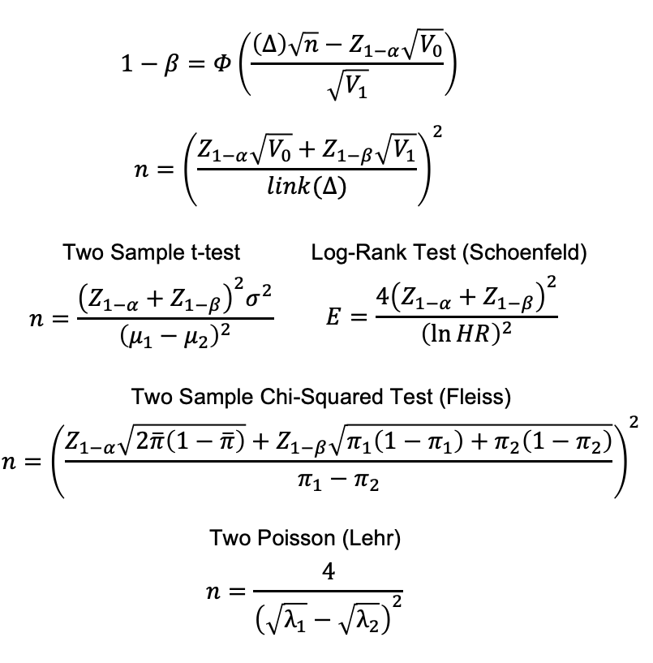
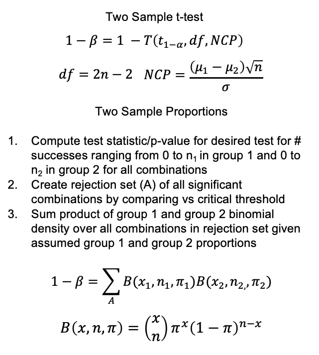
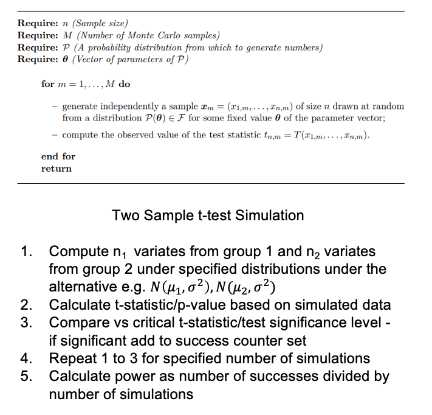

```{r setup, include=FALSE, echo = FALSE,message = FALSE, error = FALSE, warning = FALSE}
knitr::opts_chunk$set(echo = TRUE, fig.width = 10, fig.height = 6)

packages<-c("tidyverse", "kableExtra")

ipak <- function(pkg){
  new.pkg <- pkg[!(pkg %in% installed.packages()[, "Package"])]
  if (length(new.pkg)) 
    install.packages(new.pkg, dependencies = TRUE)
  sapply(pkg, require, character.only = TRUE)
}
ipak(packages)
 
 
setwd(dirname(rstudioapi::getSourceEditorContext()$path))
getwd()
Sys.setlocale("LC_ALL","English")
```


# Statistical Power from First Principles

1. **Fundamentals of Statistical Power**

- Statistical power refers to the **probability of correctly rejecting the null hypothesis** when it is indeed false—i.e., detecting a true effect.
- It is inversely related to **Type II error (β)** and complements **Type I error (α)**, the more widely recognized concept tied to the significance level.
- Power is heavily influenced by three factors:
  - **Effect size**
  - **Sample size**
  - **Variability (standard deviation)**
- A study with **inadequate power** risks failing to detect meaningful treatment effects, leading to false negatives and potentially missed therapeutic opportunities.

2. **Power in Clinical Trial Planning**

- Power is integral to trial design decisions such as sample size determination, endpoint selection, and hypothesis prioritization.
- It ensures resource investment is justified and regulatory requirements are met.
 
3. **Three Approaches to Power Calculation**

Each method serves different purposes depending on the design complexity, data assumptions, and regulatory expectations:

- **Approximate Methods**
  - Based on analytical formulas and normal approximations.
  - Useful for **quick, early-phase estimations**, especially when assumptions (e.g., normality) are reasonable.
  - Limitation: May be inaccurate for complex or non-standard study designs.

- **Exact Methods**
  - Use precise, parametric-based calculations (e.g., for t-tests, binomial tests).
  - Provide **accurate results** under strict assumptions.
  - Best for confirmatory trials but require **greater computational resources**.

- **Simulation-Based Methods**
  - Employ Monte Carlo simulations to generate thousands of trial scenarios under an assumed alternative hypothesis.
  - Offer unmatched **flexibility** to model real-world complexities, adaptive designs, and irregular endpoints.
  - Particularly useful for **innovative or non-traditional designs**, although they are computationally intensive.
  
  
## Statistical Power – A Detailed Overview

**What Is Statistical Power?**  
Statistical power refers to the **probability that a statistical test will correctly identify a true effect**, i.e., the probability of "success" under a specific, often hypothetical, scenario. In this context, "success" means that the test results **support the conclusion of interest**, such as finding a statistically significant treatment effect in a clinical trial. For example, a low p-value (below a pre-specified threshold) would typically suggest that a new therapy is effective.

**More Formally:**  
Statistical power is defined as the probability that a test will **reject the null hypothesis (H₀)** when the **alternative hypothesis (H₁)** is actually true. Mathematically, this is expressed as:

\[
\text{Power} = P(\text{Reject } H_0 \mid H_1 \text{ is true}) = 1 - \beta
\]

where **β** is the **Type II error rate**—the probability of failing to reject the null hypothesis when the alternative is actually true (i.e., a false negative).


## Power in the Context of Hypothesis Testing

 **Beyond Classical Hypothesis Testing**

Although most commonly associated with **Null Hypothesis Significance Testing (NHST)**, the concept of power can be applied more broadly. Any situation where a **"success" criterion is pre-defined**—such as achieving a specific confidence interval width, or surpassing a Bayesian Factor threshold—can be analyzed in terms of power.

**Examples of Power in Broader Contexts:**
- **Bayesian framework:** Power could be defined as \( P(\text{Bayes Factor} > \text{Critical Threshold}) \)
- **Estimation precision:** Power might reflect \( P(\text{Interval Width} < \text{Specified Width}) \)

---

NHST is the dominant framework in clinical trials and statistical research. It evolved as a hybrid of two foundational ideas:

- **Fisher’s approach:** Focus on p-values and significance testing.
- **Neyman-Pearson framework:** Introduced error rates (Type I and II) and formalized decision rules.

In NHST, the **primary goal is to reject the null hypothesis (H₀)**, which usually represents no effect, no difference, or no association.

- The most common hypothesis test is for **superiority or inequality**.
- Other forms include **non-inferiority**, **super-superiority**, and **equivalence testing**.

**Key Error Types in NHST:**

- **Type I error (α):** Rejecting H₀ when it is actually true. This is a **false positive**.
  - Controlled by setting a significance level, e.g., α = 0.05.
- **Type II error (β):** Failing to reject H₀ when H₁ is true. This is a **false negative**.
  - The complement of power: **Power = 1 – β**.

In hypothesis testing, we usually **set α in advance** to control the risk of a false positive. However, **β and power are not automatically defined**—they depend on specifying an **alternative hypothesis (H₁)**.

---

**Why Is the Alternative Hypothesis (H₁) Important?**

While a statistical analysis can be carried out with only H₀ (to generate a p-value), power calculations **require H₁ to be explicitly specified**, because:

- Power evaluates how likely the test is to detect an effect **if a specific alternative is true**.
- This involves assumptions about the **expected effect size**, **variance**, and **sample size**.

From a practical standpoint, defining H₁ enables:

- Choosing **more appropriate tests** (via concepts like uniformly most powerful tests).
- Evaluating how likely a trial is to **“succeed”** under realistic or clinically meaningful scenarios.


**Why Statistical Power Matters in Clinical Trials**

Power plays a central role in:

- **Determining sample size**: The higher the desired power, the larger the required sample size (for a fixed effect size and α).
- **Trial planning and feasibility assessment**
- **Comparing trial designs or methods**
- **Demonstrating scientific and ethical rigor**: A study that is underpowered is unlikely to yield meaningful results, leading to wasted resources and potential ethical concerns.

In regulatory environments, typical practice is to design trials with **at least 80–90% power** to detect a clinically important difference at a given significance level (usually 0.05).


## Power in Clinical Trial Planning 


**Statistical power is a crucial tool used *before* a clinical trial begins (a priori)** to evaluate the likelihood that the study will succeed—where "success" usually means detecting a meaningful effect if one truly exists. It offers a structured way to quantify how likely a study is to achieve statistically significant results, assuming a specific effect size and level of variability.

It's important to emphasize that **post-hoc power calculations (performed after a study has been conducted)** are generally considered uninformative or even misleading. This is because they are often just a simple transformation of the p-value already obtained and don’t provide new insights. They are frequently misunderstood and should not be used to justify negative or inconclusive results.

Power is not just about determining sample size—it can also be **used to compare and evaluate different design strategies** or assumptions before a trial starts. For example, one might compare statistical methods or hypotheses, assess how different effect sizes impact the study’s feasibility, or explore how design choices (like allocation ratios or stratification) affect the trial’s chance of success. This evaluation can help select the most efficient and feasible approach, particularly when working with limited resources or tight timelines.

Despite its broader applications, **the most common and practical use of power analysis is to determine the appropriate sample size** for a study. In this context, sample size is usually treated as the **“free” or adjustable variable**, while other components such as the statistical test, hypothesis type, significance level (alpha), and the expected effect size are either fixed or estimated based on prior knowledge or pilot data.

To elaborate:

- **Fixed variables** in the power calculation often include:
  - Study design (parallel, crossover, etc.)
  - Chosen statistical test (e.g., t-test, ANOVA)
  - Type of hypothesis (e.g., superiority, non-inferiority)
  - Significance level (e.g., α = 0.05)

- **Estimated variables** may include:

  - Effect size (e.g., the expected difference between treatment and control)
  - Nuisance parameters such as variance or standard deviation, which can impact the precision of estimates

As sample size increases, the **variability in the estimate of the treatment effect decreases**, making it easier to detect a true effect. In statistical terms, increasing the sample size **reduces the standard error**, which in turn increases power. For example, in a Z-test, increasing the number of participants tightens the confidence interval around the mean, allowing for a more precise comparison against the null hypothesis.

In practice, during the planning phase, researchers will often **incrementally increase the estimated sample size** until the target power level—commonly 80% or 90%—is achieved. This process ensures that the trial has a high probability of detecting the intended effect if it is truly present, while still being efficient in terms of cost and time.

## Other Strategies to Increase Power

**Avoid Simplifying Data**

**Problem:**  
Researchers sometimes simplify continuous or complex data for the sake of convenience. A common example is converting continuous outcomes into binary variables (e.g., turning blood pressure levels into “high” vs. “normal,” or using responder/non-responder analysis). While this may make analysis easier or more interpretable, it comes at a significant cost: **a loss of statistical information and power**. This practice, sometimes referred to as “dichotomania,” can substantially inflate the required sample size—sometimes by over 50%.

**Solution:**  
Whenever possible, **analyze the data in its original form ("as-is")** unless there is a compelling reason to simplify. If simplification is being considered, use **sample size calculations** to objectively quantify the trade-offs involved. Demonstrating the increased resource demand of a "simpler" approach can often make the case for preserving the full information in the data.

---

**Using Additional Data**

**Problem:**  
Researchers often overlook or underutilize **additional sources of information**, such as baseline covariates or external data (e.g., from electronic health records or previous studies). Ignoring these data sources means missing opportunities to reduce variability and increase power.

**Solution:**  
Employ **sensitivity analyses** to show the added value of incorporating relevant data. For example, comparing an ANOVA model (which ignores covariates) to an ANCOVA model (which adjusts for them) can illustrate how adjusting for covariates can reduce residual variability and boost power. Advanced methods such as **Bayesian borrowing** allow researchers to formally incorporate real-world or historical data into current trials, thereby strengthening conclusions without requiring more participants.

---

**Improved Study Designs**

**Problem:**  
Researchers may shy away from using more complex or unfamiliar study designs, even when such designs could significantly reduce the required sample size and improve trial efficiency.

**Solution:**  
Adopting **more efficient study designs** can enhance power without proportionally increasing resources. Some examples include:
- **Group Sequential Designs:** These allow for interim analyses and early stopping, either for efficacy or futility. For instance, Jennison's model shows that having three interim “looks” at the data can reduce required sample size by ~30%, while increasing the maximum possible sample size by only 5%.
- **Adaptive Designs:** These enable flexible trial conduct—such as adjusting sample size mid-study or reallocating participants—based on accumulating data. These designs are especially useful for **platform trials** or **multi-arm trials** where several treatments are evaluated simultaneously.
- **Cross-over or Paired Designs:** When appropriate, these designs can reduce variability by allowing participants to serve as their own controls.
- **Factorial Designs:** Suitable for testing multiple hypotheses efficiently, especially when interactions between treatments are of interest.

By **matching the study design to the research question and context**, researchers can achieve higher power and efficiency without unnecessary increases in sample size.


## Calculating Power

**Calculating Statistical Power: Overview and Practical Approaches**

Given the critical importance of power in clinical trial design and evaluation, there is an extensive body of resources—books, academic papers, and software tools—dedicated to power calculation across a broad range of statistical tests, models, and experimental designs. 

To navigate the broad landscape of power analysis, it is helpful to classify the available methods into **three main categories**:
1. **Approximate Methods**
2. **Exact Methods**
3. **Simulation-Based Methods**

These categories differ in complexity, required assumptions, and flexibility:

- **Approximate Methods** involve formula-based estimations using assumptions like normality and large sample sizes. These are fast and easy to use, often providing a good starting point or a "sanity check."
  
- **Exact Methods** deliver mathematically precise power estimates based on strict parametric assumptions. These are typically more accurate than approximate methods for small samples or discrete outcomes but may require more detailed inputs and computational effort.
  
- **Simulation-Based Methods** (e.g., Monte Carlo simulations) offer high flexibility and are ideal for evaluating complex designs, adaptive trials, or non-standard endpoints. These methods generate empirical estimates by simulating thousands of hypothetical trials, but they require more time, computational power, and programming expertise.

It is common to find **multiple examples of power calculations** using different methods even within the same statistical setting. For instance, for a two-arm parallel trial, one might calculate power using both exact binomial methods and simulation, depending on the available data and desired accuracy.

**Choosing the “best” power calculation approach** depends on several factors:

- **Available resources** (time, software, computation)
- **Analyst expertise**
- **Complexity of the design**
- **Assumptions one is willing or able to make**

In practice, many researchers **begin with a simpler, approximate method** to get an initial estimate and validate their assumptions. Once the basic scenario checks out, more complex or realistic scenarios can be modeled using exact or simulation-based approaches. This stepwise progression helps ensure both **robustness and feasibility** in trial planning.

In summary, the selection of a power calculation approach is **not one-size-fits-all**—it should be tailored to the context of the trial, the data characteristics, and the study objectives.


### Approximate Power

Approximate power refers to the process of estimating the probability of correctly rejecting the null hypothesis using simplified mathematical formulas. These formulas are derived from theoretical distributions and are commonly rearranged to solve for the required sample size (*n*) when designing a study. Unlike exact methods or simulation-based techniques, approximate power calculations do not require full probabilistic modeling or repeated data generation. Instead, they offer a practical and efficient way to obtain reasonably accurate estimates for trial planning.

The most widely used form of approximate power calculation is based on the **normal approximation**, which assumes that the test statistic (such as a mean difference or proportion difference) follows a normal distribution, particularly when sample sizes are sufficiently large. This method is used across various types of data, including binary outcomes, survival data, counts, ordinal variables, and more.

Two core components are involved in the calculation:

- First, the variance under both the null and alternative hypotheses must be calculated.
- Second, the data must be transformed or scaled appropriately—often using functions such as differences, ratios, logarithms, or square roots—so that the statistical test aligns with the assumptions of the method.

This approach has several advantages. It generally requires lower computational resources compared to exact or simulation methods. In the era of powerful computing, this benefit is less critical, but approximate methods still appeal because they require fewer user inputs. However, this simplicity also comes with a caveat: hidden assumptions can reduce the accuracy of the results, particularly when conditions for the approximation (such as large sample sizes or distributional symmetry) are not met.

While approximate power calculations are incredibly useful in the early stages of planning and for standard designs, they should not be solely relied upon in complex or high-stakes situations. It is important to benchmark these estimates against more robust methods—either exact analytical approaches or simulations—especially when working with small sample sizes, rare events, or unconventional endpoints. Many academic publications and software packages include benchmarking data that can be referenced to assess the reliability of approximate methods for specific designs.

In summary, approximate power offers a fast, user-friendly way to estimate sample size or power with acceptable accuracy under many conditions. However, awareness of its limitations and careful validation are essential to ensure sound decision-making in study planning.




### Exact Power 

Exact power refers to the method of calculating statistical power with full mathematical precision, based on specific assumptions about the statistical test and the data distribution. This is in contrast to approximate power, which uses simplified formulas and asymptotic assumptions. It’s important not to confuse exact power with exact tests—exact power can be calculated for either exact or approximate statistical tests, depending on the goal.

The advantage of exact power is that it provides an accurate and precise estimate of power for a specified scenario. This involves determining the probability of correctly rejecting the null hypothesis under the alternative hypothesis by directly using the test’s distribution and parameters. For example, in the case of a two-sample t-test, exact power involves calculating the non-centrality parameter (NCP), then evaluating the power based on the distribution of the test statistic under the alternative.

However, deriving exact power formulas is often mathematically complex and requires knowing or estimating parameters under the alternative hypothesis, such as the variance or expected effect. This complexity can limit the practical use of exact methods, even when derivations are available, because simpler approximate methods are often easier to implement and interpret. Moreover, tradition, software defaults, and performance constraints often lead practitioners to use approximations despite having access to exact methods.

One major challenge with exact power methods arises when dealing with discrete data, such as proportions or counts. In such cases, exact power computation requires enumerating all possible combinations of outcomes for each group. This includes calculating the probability of observing each outcome under both the null and alternative hypotheses, checking whether each outcome would lead to rejection of the null, and summing probabilities over all outcomes in the rejection set. For instance, when comparing two proportions, the method involves calculating binomial probabilities across all combinations of possible successes in both groups, then comparing the resulting p-values against the significance threshold.

As sample size increases or the number of groups/arms grows, the number of combinations to evaluate rises sharply, making this approach computationally intensive. This is especially true for binary and count data, where enumeration of all outcomes is necessary.

Even when exact power is calculated, the results are still conditional on the underlying assumptions of the test—for example, normality in a t-test or fixed variance. If there’s concern about the robustness of those assumptions, researchers may prefer to use simulation-based methods, which can flexibly model deviations from theoretical conditions.

In summary, exact power calculations offer a high level of precision and reliability when all model assumptions are satisfied and computational resources are sufficient. However, their mathematical complexity, computational demands, and sensitivity to model assumptions mean that they are often best used in tandem with, or validated by, simpler or more flexible approaches.



### Simulated Power 

Simulated power refers to estimating statistical power by using computer simulations to mimic the trial process under a specified alternative hypothesis. The idea is to generate many hypothetical datasets according to known assumptions about treatment effects and variability, perform the planned analysis on each simulated dataset, and then determine how often the test correctly rejects the null hypothesis. The proportion of these rejections gives an empirical estimate of the power.

This approach is particularly valuable because of its **flexibility**. It allows researchers to assess power under a wide range of scenarios, including complex study designs that would be very difficult or impossible to analyze using standard formulas. Simulation is especially useful for **adaptive designs**, **Bayesian trials**, and studies with **non-standard endpoints** or **missing data patterns**, making it the go-to method for modern, intricate analyses.

Simulated power does require more computational resources than analytical methods, but this is rarely a serious obstacle with today's computing capabilities. However, simulation does demand a **much more detailed specification of the alternative hypothesis**—including the full distribution of responses, parameters for each group, correlations between variables (if any), and more. This trade-off reflects a key distinction: standard formulas prioritize simplicity, while simulation prioritizes **flexibility and realism**.

The simulation process typically involves the following steps, illustrated here with a two-sample t-test example:

1. Simulate data for each group (e.g., Group 1 from \( N(\mu_1, \sigma^2) \), Group 2 from \( N(\mu_2, \sigma^2) \)) using the assumed alternative hypothesis.
2. Calculate the test statistic and associated p-value for the simulated data.
3. Determine whether the result is statistically significant using a predefined threshold (e.g., p < 0.05). If it is, count it as a "success."
4. Repeat the simulation a large number of times (e.g., 10,000).
5. Calculate the simulated power as the proportion of simulations that resulted in a significant result.

In pseudocode (as shown below), each simulation loop draws a new dataset from a defined distribution, computes the test statistic, and records whether the null hypothesis is rejected. The final power estimate is the ratio of successful rejections to the total number of simulations.

Simulated power is also a valuable tool for **validating other power estimates**. Researchers often compare simulation results to those obtained from approximate or exact power formulas as a kind of “sanity check.” This comparison can reveal hidden assumptions or weaknesses in simpler methods and often serves as a starting point for more detailed exploration.

In summary, simulated power is a highly versatile and accurate method for evaluating study design performance, particularly when dealing with complex data or trial structures. While it requires more user input and computational effort, it offers an unparalleled ability to reflect the nuances of real-world research scenarios.



# Introduction of Alternative Methods 

## Sample Size Determination using Power

- **What is Power?** 
  - Power in the context of statistical testing is the probability that a test will reject the null hypothesis when the null hypothesis is false. Essentially, it measures a study's ability to detect an effect, if there is one.
  - The common target for power is 80% or 90%, meaning there's an 80% or 90% chance of detecting an effect if it exists.

- **Calculating Sample Size Based on Power:**
  - To determine the appropriate sample size using power, researchers need to specify:
    - The effect size (the magnitude of the difference or association they expect to find and consider meaningful).
    - The significance level (usually set at 0.05, this is the probability of incorrectly rejecting the null hypothesis).
    - The desired power level (to avoid Type II errors, i.e., failing to reject the null hypothesis when it is false).
  - Statistical software or power tables can then be used to calculate the number of subjects required.

- **Challenges with Power-Based Methods:**
  - **Assumption Dependency:** The calculation of power is highly sensitive to the assumptions about the effect size, variance, and distribution of the data. If these assumptions are incorrect, the actual power of the study may be much lower or higher than desired, leading to underpowered or overpowered studies.
  - **Underpowered studies** may fail to detect true effects, potentially leading to false conclusions that no effect exists.
  - **Overpowered studies** can waste resources and may detect differences that, while statistically significant, are not meaningful in practical terms.

**Alternative Methods to Power**
These methods aim to address the limitations of traditional power-based calculations by incorporating additional information or different statistical philosophies:

1. **Confidence Interval Estimation:**
   - Focuses on estimating a range within which the true effect size is expected to lie with a specified probability (e.g., 95% confidence interval). This method prioritizes the precision of the estimate over the test of a hypothesis.

2. **Bayesian Methods:**
   - **Prior Information:** Bayesian approaches incorporate prior information or beliefs into the analysis alongside the data obtained from the study.
   - **Posterior Distributions:** These methods focus on the posterior distribution of the parameter of interest, which combines prior information and observed data.
   - **Flexible Decision-Making:** Bayesian methods can provide a flexible framework for decision-making based on the posterior probabilities of different hypotheses or the probability of achieving certain endpoints.

3. **Hybrid Bayesian-Frequentist Approaches:**
   - Combine the strengths of both frameworks to optimize the study design. For instance, they might use Bayesian methods to estimate parameters and frequentist methods to control type I and II error rates.
   
## Alternative methods to traditional power calculations 

Alternative methods to traditional power calculations for sample size determination provide flexibility and can incorporate more information into the study design. Here’s a detailed overview of some of these methods:

 

### 1. Statistical Intervals

- **Description**: This method involves calculating sample sizes to ensure the width of a statistical interval (like a confidence or prediction interval) meets a predetermined criterion. For instance, ensuring a 95% confidence interval for a mean difference is no wider than a specific value.
- **Types**:
  - **Confidence Intervals**: Focus on covering the true parameter value with a specified probability (e.g., 95% or 99%).
  - **Prediction Intervals**: Provide a range within which future observations are expected to fall.
  - **Bayesian Credible Intervals**: Similar to confidence intervals but in a Bayesian context, where the interval reflects the range containing the parameter with a certain probability, based on prior and current data.
  - **Mixed Bayesian Likelihood Intervals (MBL)**: Incorporate both Bayesian priors and likelihood derived from the data to construct intervals.

### 2. Hybrid Bayesian Methods

- **Description**: These methods blend Bayesian and frequentist approaches to leverage the strengths of both, especially useful in complex models or when incorporating prior information is crucial.
- **Examples**:
  - **MBL Intervals**: As mentioned, these use Bayesian priors and data-derived likelihoods.
  - **Posterior Errors**: Focus on the probability of parameter estimates falling within specific ranges.
  - **Assurance**: Calculates the probability that a future study will achieve statistical significance, considering prior data.
  - **Predictive Power**: Estimates the likelihood of achieving certain statistical power based on prior data and model predictions.
  - **Adaptive Designs**: Allow modifications to the trial or statistical procedures based on interim results, which can include updating sample size.

### 3. Pure Bayesian Methods

- **Description**: Entirely based on Bayesian statistics, these methods use prior distributions and data to update beliefs about parameters through the posterior distribution.
- **Examples**:
  - **Bayes Factors**: Used to compare models or hypotheses by calculating the ratio of their posterior probabilities, providing a measure of evidence.
  - **Credible Intervals**: As described, these offer a probabilistic interpretation of parameter estimation.
  - **Continual Reassessment Method (CRM)**: Typically used in dose-finding studies in clinical trials to adjust dose levels based on patient outcomes dynamically.
  - **Utility/Cost Function**: Incorporates decision analysis by evaluating the expected utility or cost associated with different sample sizes.

### Hypothetical Figure Explanation

A helpful figure could be a flowchart or a decision tree that illustrates when and how to apply each of these methods:
- **Top**: Decision criteria based on study goals (estimation precision, existing data, model complexity).
- **Branches**: Leading to different methods, showing paths based on whether prior data exists, whether the study aims at estimation or hypothesis testing, and the level of acceptable uncertainty.
- **Leaves**: Specific methods with brief notes on their application contexts and advantages.

## Key Summary

1. **Challenges with Power as a Metric**:
   - **Power** is traditionally the most common metric for determining sample size in studies. It is designed to detect a specified effect size with a certain probability (commonly 80% or 90%).
   - **Issues**: Power calculations depend heavily on the accuracy of assumed parameters, such as effect size and variance. Any deviation from these assumptions can result in studies being under-powered (leading to a higher chance of Type II errors) or over-powered (wasting resources).

2. **Statistical Intervals as Alternatives**:
   - **Statistical Intervals**: Methods like confidence intervals and prediction intervals provide an alternative approach by focusing on the precision of estimates rather than testing against a null hypothesis.
   - **Limitations**: Similar to power, the effectiveness of interval-based methods depends on the accuracy of underlying assumptions. If these assumptions are invalid, the intervals may not accurately reflect the true variability or uncertainty in parameter estimates.

3. **Bayesian Methods for Addressing Issues**:
   - **MBL Intervals**: Mixed Bayesian Likelihood (MBL) intervals incorporate Bayesian priors with frequentist likelihood, aiming to provide a balance that respects both Bayesian informativeness and frequentist reliability.
   - **Posterior Error Approach**: This method uses Bayesian posterior probabilities to reassess Type I and II error rates, providing a more intuitive measure of “success” based on the probability of these errors given the observed data.

4. **Role of Sensitivity Analysis**:
   - **Purpose**: Sensitivity analysis involves testing how sensitive the results of a study are to changes in the assumptions upon which the statistical analyses are based.
   - **Bayesian Sensitivity Analysis**: Incorporating Bayesian methods, such as Bayesian Assurance, into sensitivity analysis helps formalize the framework for assessing uncertainty. Bayesian Assurance, for example, evaluates the probability of achieving study objectives across a range of plausible values for uncertain parameters, offering a comprehensive view of potential study outcomes.

 
# Statistical Intervals

## Introduction to Statistical Intervals

1. **Confidence Intervals**
   - **Definition**: A range of values for a parameter of interest from a population, calculated from sample data. The confidence interval aims to contain the true population parameter with a specified confidence level (typically 95%).
   - **Interpretation**: Under repeated sampling of the population, 95% (or another level) of such intervals would contain the true population parameter. This frequentist approach assumes that the parameter is a fixed value and the randomness comes from the data.

2. **Credible Intervals**
   - **Definition**: In Bayesian statistics, a credible interval provides a range within which the true parameter value lies, with a certain degree of belief (or probability). For instance, a 95% credible interval means there is a 95% belief, based on the data and prior information, that the interval contains the true parameter value.
   - **Interpretation**: The credible interval treats the unknown parameter as a random variable, which is a fundamental departure from the frequentist interpretation. The interval itself is derived from the posterior distribution of the parameter, which combines prior beliefs and the likelihood of the observed data.

**Visual Representation (Hypothetical)**

- **95% Credible Interval**
  - **Graphic**: Typically, this would be depicted as a fixed interval on a line, where the bounds of the interval are determined by the 2.5th and 97.5th percentiles of the posterior distribution. The area under the curve within these bounds represents 95% of the posterior probability.
  - **Key Point**: The interval represents a probability concerning the parameter’s value, not the long-term behavior of an estimator as in frequentist approaches.

- **95% Confidence Interval**
  - **Graphic**: This might also be shown as a fixed interval on a line, calculated from sample data, such that if the experiment were repeated many times, 95% of such intervals would contain the true parameter value.
  - **Key Point**: The confidence interval is about the long-term frequency of the interval capturing the parameter, assuming the data collection process is repeated under the same conditions.

**Key Differences**

- **Parameter Treatment**: Confidence intervals treat the parameter as fixed and data as variable, whereas credible intervals treat the parameter as a variable.
- **Interpretation**: Confidence intervals are about repeated sampling reliability, whereas credible intervals are about belief or probability given the data and prior knowledge.


| Types                         | Statistical Intervals                                                                                       |
|-------------------------------|-------------------------------------------------------------------------------------------------------------|
|     Confidence   Intervals    |     Percentage of Intervals of contain parameter under repeated sampling                                    |
|     Prediction   Intervals    |     Percentage of Intervals of contain “future” sample/parameter under   repeated (future) sampling         |
|     Tolerance   Intervals     |     Percentage of Intervals of contain given proportion of sample under   repeated sampling                 |
|     Credible   Intervals      |     Given interval contains true parameter with given probability                                           |


## Confidence Intervals

**What Are Confidence Intervals (CIs)?**

Confidence intervals are a fundamental concept in statistics used to quantify the **uncertainty of an estimate**. Instead of providing a single point estimate—like the sample mean—confidence intervals offer a **range of values** that are likely to contain the **true population parameter**, such as the population mean or proportion. For example, a 95% confidence interval suggests that, if we were to repeat the same study multiple times, 95% of the resulting intervals would contain the true parameter. It’s important to note that this does not mean there is a 95% chance the true parameter lies in a specific interval calculated from one sample. The confidence refers to the **long-run performance** of the method, not the probability of the parameter being in a single interval.

- **Purpose**: The sample size is calculated to ensure that the confidence interval reliably includes the true population parameter, like the mean, with a certain level of confidence, commonly 95%.


**Interpretation and Use in Research**

Confidence intervals are often preferred over simple point estimates because they give a sense of **precision and reliability**. A narrower interval indicates a more precise estimate, while a wider interval implies more uncertainty. In practice, confidence intervals are **commonly used across clinical trials, survey studies, and field research**, often presented alongside hypothesis testing results (e.g., p-values). For instance, in a clinical trial, a confidence interval for the treatment effect might help assess not just whether an effect exists, but also how large it might be, and with what degree of certainty.

**Precision and Confidence**

The confidence level (e.g., 90%, 95%, 99%) reflects how confident we are in our method to produce intervals that contain the parameter. A 95% confidence interval means we expect 95 out of 100 intervals generated from repeated sampling to contain the true value. CIs emphasize the **quality of an estimate**—not just its numerical value—and are a standard reporting tool in statistics.

**Sample Size for Confidence Intervals**

To ensure confidence intervals are informative, we often need to plan the **sample size in advance**. The goal is to make the confidence interval **narrow enough** to provide useful information while still maintaining a desired level of confidence (e.g., 95%). The sample size calculation for confidence intervals depends on several factors: the desired confidence level, the **standard deviation (σ)** of the population (or an estimate of it), and the **desired precision (half-width of the interval, ω)**. The commonly used formula is:

\[
n = \left( \frac{z_{\alpha} \cdot \sigma}{\omega} \right)^2
\]

In this formula:
- \( z_{\alpha} \) is the z-score associated with the desired confidence level (e.g., 1.96 for 95%),
- \( \sigma \) is the population standard deviation,
- \( \omega \) is the desired half-width of the confidence interval,
- \( n \) is the calculated sample size.

This equation shows that **larger sample sizes lead to narrower confidence intervals**, assuming other factors remain constant.

**Targeting Average Precision**

Most sample size designs aim to achieve a **target average width** for the confidence interval. By rearranging standard confidence interval formulas, researchers can estimate the number of subjects needed to ensure the expected interval length stays within acceptable limits. This is particularly important in clinical trials and regulatory settings where precise estimates are required.

**Dealing With Interval Variability**

Despite careful planning, actual confidence intervals derived from real-world samples may be **wider or narrower** than the target width. Research by Kupper & Hafner (1989) demonstrated that variability in the observed interval width can be accounted for by considering the **interval limit as a random variable**. This leads to more robust planning approaches where not just the average, but the **distribution of the interval width** is considered. It also connects closely with the idea of **statistical power**—the probability of detecting an effect of interest—since narrower intervals are typically associated with higher power in hypothesis testing.


## Credible Intervals

### Bayesian Statistics and Credible Intervals

Bayesian statistics is a statistical paradigm that **incorporates prior knowledge, expert opinion, and real-world data** into the process of analysis. Unlike traditional (frequentist) statistics, which treat parameters as fixed but unknown constants, Bayesian methods consider parameters to be **random variables**. This perspective allows for a more flexible and intuitive interpretation of uncertainty.

At the heart of Bayesian analysis lies **Bayes’ Theorem**, which updates prior beliefs with new evidence. The formula is:

\[
P(\theta|D) = \frac{P(D|\theta) \cdot P(\theta)}{P(D)}
\]

Where:
- \( \theta \) is the parameter of interest,
- \( D \) is the observed data,
- \( P(\theta) \) is the **prior**: our initial belief about the parameter before seeing the data,
- \( P(D|\theta) \) is the **likelihood**: the probability of observing the data given the parameter,
- \( P(\theta|D) \) is the **posterior**: the updated belief after incorporating the data.

This framework results in a **posterior distribution** for the parameter, which reflects both the prior belief and the evidence from the observed data. Bayesian inference then proceeds based on this posterior, allowing for direct probability statements about the parameters.


One of the most important outcomes of Bayesian analysis is the **credible interval**. A **credible interval** is a range derived from the posterior distribution that contains a specified percentage (e.g., 95%) of the total probability. For example, a **95% credible interval** means there is a **95% probability that the true parameter value lies within that interval**, given the data and the prior.

This interpretation is **fundamentally different from a frequentist confidence interval**. In a frequentist setting, a 95% confidence interval means that **if the same study were repeated many times**, 95% of the constructed intervals would contain the true (but fixed) parameter value. The interval is random; the parameter is not.

In contrast, in the Bayesian framework, the **parameter is a random variable** and the **interval is fixed** (once calculated). Hence, we can say directly: _“There is a 95% probability that the parameter lies within this interval.”_ This intuitive interpretation is one of the key strengths of Bayesian statistics, especially when communicating results to non-statistical audiences.

**🆚 Key Differences Between Credible and Confidence Intervals**

| Feature                    | 95% Credible Interval                                                | 95% Confidence Interval                                                  |
|---------------------------|----------------------------------------------------------------------|---------------------------------------------------------------------------|
| **Interpretation**         | 95% chance the true value is within the interval                    | 95% of intervals will contain the true value under repeated sampling     |
| **Parameter Status**       | Parameter is a random variable                                       | Parameter is fixed, interval varies                                       |
| **Bound Behavior**         | Bounds are fixed once computed                                       | Bounds are random variables (change across samples)                       |


### Credible Interval Construction

Constructing credible intervals in Bayesian statistics is not a one-size-fits-all task. Depending on the **goals of inference**, the **data structure**, and the **available knowledge about variability (precision)**, different methods can be applied. Researchers such as **Adcock (1988)** and **Joseph and Belisle (1997)** have developed foundational methods to construct credible intervals for **normal means**, tailored to different practical needs.

At the core of this framework is the idea that the **method of constructing a credible interval depends on two things**:
1. The **selection criterion** – what the interval is optimized for.
2. The **estimation methodology** – how precisely we can quantify the uncertainty in the data.

**In Details**

- **Adcock (1988) and Joseph & Bélisle (1997)**: These authors have proposed methods to construct credible intervals for normal means. These methods incorporate Bayesian principles to derive intervals that have a specified probability of containing the parameter of interest, considering prior knowledge and the data obtained.
- **Methodology**: The choice of method for constructing credible intervals depends on the selection criteria related to how the intervals are evaluated and the estimation methodology used, which influences the type of credible interval derived. 
 
 
**Selection Criteria and Estimation Methodology**

1. **Selection Criteria**:
   - **Average Coverage Criterion (ACC)**: 
      + This criterion focuses on ensuring that the interval covers the true parameter value with a specified average probability across many repetitions. This is similar to the concept of confidence but within a Bayesian framework.
      + This method seeks to ensure that, on average, the **credible interval covers the true parameter** with the desired probability (e.g., 95%). It is typically used when the **precision (or variance) is known**. This scenario often applies to well-studied domains or simulations where the underlying variability is either fixed or assumed to be well characterized.
      + **Key Feature:**  
          - Focus on accurate coverage probability.  
          - Best suited for cases where **standard deviation is known** (e.g., analytical or calibration studies).

   - **Average Length Criterion (ALC)**: 
       + This criterion aims to minimize the expected length of the credible interval, which can be particularly useful when the precision of the interval (i.e., its width) is as important as its coverage.
       + The ALC method aims to construct intervals that, while still maintaining a desired level of coverage, are **as short as possible on average**. This reflects a preference for **efficiency and precision**, particularly when we want to avoid overly conservative (i.e., too wide) intervals. This method is commonly used when **precision is unknown**, such as in most practical applications involving observational or experimental data.
       + **Key Feature:**  
          - Focus on minimizing the expected width of the interval.  
          - Applicable when **variance is estimated from data**.

   - **Worst Outcome Criterion (WOC)**: 
       + Focuses on minimizing the worst-case scenario regarding the interval's failure to include the true parameter. This criterion is conservative and aims to provide robust intervals under the least favorable conditions.
       + The WOC is a more **conservative** approach, designed to guarantee that even in the **worst-case scenario**, the credible interval still maintains the desired properties. This method is valuable in **high-risk applications** (e.g., clinical trials, safety-critical engineering) where it is crucial to **minimize the risk of misleading inferences** under extreme or unfavorable conditions.
       + This method uses a **mixed Bayesian/likelihood-based approach**, combining Bayesian posterior information with frequentist robustness criteria. The WOC balances **data-driven inference with protection against undercoverage** in worst-case settings.
       + **Key Feature:**  
          - Designed for robustness under extreme outcomes.  
          - Ideal when there is **uncertainty in model assumptions** or **concern about rare but critical deviations**.

| **Selection Criterion**             | **Goal**                                      | **Estimation Methodology**           |
|------------------------------------|-----------------------------------------------|--------------------------------------|
| **ACC** (Average Coverage)         | Maintain accurate average coverage            | Known precision                      |
| **ALC** (Average Length)           | Minimize interval length                      | Unknown precision                    |
| **WOC** (Worst Outcome)            | Ensure performance even in worst-case scenario| Mixed Bayesian/Likelihood approach   |

2. **Estimation Methodology**:
   - **Known Precision**: When the precision (inverse of the variance) of the underlying distribution is known, methods can directly incorporate this information to more accurately define the bounds of the credible interval.
   - **Unknown Precision**: If the precision is unknown, the estimation involves more uncertainty, and methods may need to estimate this parameter from the data, which can affect the width and placement of the credible interval.
   - **Mixed Bayesian/Likelihood**: This approach combines Bayesian priors with likelihood methods derived from the data to balance between prior beliefs and observed evidence. This hybrid method can provide a flexible and nuanced way to estimate parameters and construct intervals.
   
**In Details**
  
- **Purpose**: Unlike confidence intervals, the construction of credible intervals in Bayesian statistics depends not only on the data but also on prior distributions and the selected methodology. These intervals represent a Bayesian probability that the interval contains the true parameter.
- **Formula**: The specific formula depends on whether precision is known or unknown, and on the selection criteria (such as ACC, ALC, WOC).
  - **Known Precision (ACC, ALC, WOC)**:
    \[
    n \geq \frac{4Z^2_{1-\alpha/2}}{\lambda l^2} - n_0
    \]
    - Where:
      - \( \lambda \) is the precision of the data (\( \lambda = 1/\sigma^2 \)).
      - \( n_0 \) is a prior sample size, reflecting the amount of prior information.
  - **Unknown Precision (ACC)**:
    \[
    n = \frac{4\beta}{\nu l^2} + 2\nu_{1-\alpha/2} - n_0
    \]
    - Where:
      - \( \beta \) and \( \nu \) parameters are related to the prior distribution on the precision and might be derived from prior data or beliefs.
      - \( \nu_{1-\alpha/2} \) corresponds to a critical value from the chi-squared distribution, adjusted for the confidence level.
      

## Prediction Intervals

A **prediction interval** goes a step further. Rather than estimating a fixed population parameter like a mean, it predicts the **range in which a future individual observation** from the same population is likely to fall. This interval is generally **wider than a confidence interval** because it includes not only the variability in the sample mean but also the variability among individual observations. For example, if you measure the blood pressure of 100 patients and want to predict the blood pressure of the next patient, a prediction interval will give you that range.

Most commonly, a PI refers to the prediction for **a single future value**, although it can also be adapted for predicting the mean of _k_ future values.

- It gives a **range** (an interval) that is likely to contain a **new, future observation** based on current data.
- The percentage mentioned (e.g., 95%) refers to the **confidence level**: if you repeated the entire experiment many times, then 95% of those intervals would contain the actual future value.
- It **accounts for both** the variability in the data and the **uncertainty about future measurements**.


📝 **Example**: You measure the height of 100 people and want to predict the height of the next person you haven't measured yet. A 95% prediction interval might be: "We are 95% confident that the next person’s height will fall between 160 cm and 190 cm."


Prediction interval sample size calculations typically depend on:

- The distribution (usually normal),
- The **standard deviation** (σ),
- The number of future observations to be predicted (denoted **k**),
- The desired **width** of the interval.

A **limiting interval** is introduced. This is the theoretical interval we would obtain if the sample size were infinite. The actual interval, for a finite sample, is wider due to the added uncertainty.

The formula shown:
\[
\bar{X}_k = \mu \pm z_{(1 - \alpha/2)} \cdot \frac{\sigma}{\sqrt{k}}
\]
...represents the **distribution of the future sample mean**, and it forms the basis of determining how big your **original sample** (n) needs to be to make a prediction about future values. Importantly, in this context, the sample size (n) refers to the initial data used to construct the interval—not the number of future values predicted (k).

---

## Tolerance Intervals

A **tolerance interval** is designed to include a **specified proportion** of the population with a certain level of confidence. For example, a 95%/90% tolerance interval means: _"We are 95% confident that this interval contains at least 90% of the population values."_ This is different from a CI, which is about estimating the mean, and from a PI, which predicts a future value. TIs are very useful in quality control, safety margins, and specifications (e.g., "95% of manufactured parts should fall within this dimension range").

In a way, tolerance intervals are like **confidence intervals for percentiles**, instead of parameters.

- It gives a **range** expected to contain a **specified percentage of the population** (e.g., 90%) with a specified **confidence level** (e.g., 95%).
- It’s not just about one future observation—it’s about **most** of the data.
- The interval tells you, for example: “With 95% confidence, at least 90% of the population values fall within this range.”

📝 **Example**: You measure the diameter of bolts produced in a factory. A 95%/90% tolerance interval would mean: “We are 95% confident that at least 90% of all bolt diameters fall between X and Y.”

For **tolerance intervals**, the sample size calculation (SSD = Sample Size Determination) is typically based on:

- The desired **proportion of the population to be covered** (P),
- The **confidence level** for that coverage,
- The **distribution type** (e.g., normal, gamma, exponential),
- Adjustments for **exceedance** (i.e., margin of safety beyond the required proportion).

This means you're calculating how many observations are needed to construct a tolerance interval that you are, say, 99% confident will contain at least 95% of the entire population. 

Currently, **non-parametric** sample size approaches are limited or not widely available (e.g., not yet implemented in `nQuery` software), so most methods assume a known distribution type.


| Feature                   | Confidence Interval (CI)                      | Prediction Interval (PI)                      | Tolerance Interval (TI)                            |
|--------------------------|-----------------------------------------------|-----------------------------------------------|----------------------------------------------------|
| Purpose                  | Estimate a population parameter (e.g., mean) | Predict future observation(s)                | Enclose a proportion of the population             |
| Interpretation           | Long-run probability the interval contains true parameter | Future value will fall in this interval      | Interval contains a specified % of population      |
| Interval width           | Narrower                                      | Wider (due to extra uncertainty)              | Widest (covers entire distribution)                |
| Sample size planning     | Based on desired precision (interval width)   | Based on future k-values, interval width      | Based on proportion covered and confidence level   |
| Use case                 | Estimating means, proportions, differences    | Forecasting, machine learning, time series    | Quality control, safety analysis, regulatory specs |

# Bayesian Methods


## The Bayesian Paradigm

1. **Combination of Knowledge Sources**:
   - **Bayesian statistics** uniquely integrates various sources of information. It combines prior knowledge (which may come from expert opinions, previous studies, or established theories) with empirical data collected in real-world scenarios. This approach contrasts with frequentist statistics, which relies solely on the data from the current study without incorporating prior information.

2. **Treatment of Parameters**:
   - In the Bayesian framework, parameters of interest are treated as random variables. This means that rather than having fixed but unknown values (as in frequentist statistics), parameters are assumed to have probability distributions. This allows for a more dynamic and probabilistic description of parameters, reflecting the real uncertainty about their true values.

3. **Bayes' Theorem**:
   - The core of Bayesian analysis is **Bayes’ Theorem**, which mathematically describes how to update the probability estimate for a hypothesis as more evidence or information becomes available. The theorem is expressed as:
     \[
     P(\Theta|D) = \frac{P(D|\Theta) \times P(\Theta)}{P(D)}
     \]
     - **\( P(\Theta|D) \)**: The **posterior distribution**—the probability of the parameter \( \Theta \) given the data \( D \). This is what we want to learn about.
     - **\( P(D|\Theta) \)**: The **likelihood**—the probability of observing the data \( D \) given a parameter \( \Theta \).
     - **\( P(\Theta) \)**: The **prior distribution**—the probability of the parameter before observing the current data, based on past knowledge.
     - **\( P(D) \)**: The **evidence or marginal likelihood**—the total probability of observing the data under all possible values of \( \Theta \). This acts as a normalizing constant.

4. **Posterior Distribution**:
   - The posterior distribution combines the prior distribution and the likelihood of the observed data. It represents a complete and updated belief about the parameter after considering both the prior information and the new data. This distribution is central in Bayesian inference as it provides the basis for making statistical decisions and predictions.

5. **Making Inferences**:
   - Bayesian inference uses the posterior distribution to make decisions and predictions. One can summarize the posterior through its mean (to provide an estimate of the parameter), mode (to find the most likely value), or variance (to understand the uncertainty associated with the estimate). Furthermore, credible intervals (the Bayesian equivalent of confidence intervals) can be derived from the posterior to give an interval estimate that likely contains the true parameter value with a certain probability.
   


## Methodologies within Bayesian statistics for sample size determination (SSD)

Two primary methodologies within Bayesian statistics for sample size determination (SSD): Pure Bayesian Sample Size Methods and Hybrid Bayesian Sample Size Methods. 


- **Choosing Between Pure and Hybrid Methods**:
  - The choice between pure and hybrid Bayesian methods depends on the specific needs of the research, the availability and quality of prior information, and regulatory considerations.
  - Pure Bayesian methods are more suitable when comprehensive prior information is available and when there is flexibility in the approach to inference, such as in early-phase clinical trials or exploratory studies.
  - Hybrid methods are particularly useful when there is a need to satisfy both Bayesian and frequentist criteria, often required in later-phase clinical trials or studies that must meet specific regulatory standards.

### Pure Bayesian Sample Size Methods

1. **Overview**:
   - These methods rely entirely on Bayesian principles to determine the required sample size for a study.
   - The calculation of sample size is based on specific Bayesian parameters which include prior distributions and the likelihood of observing the data.

2. **Key Features**:
   - **Bayes Factors**: Used in hypothesis testing, Bayes factors compare the evidence provided by the data for two competing hypotheses. The sample size is determined to ensure that the Bayes factor will adequately support the true model.
   - **Credible Intervals**: These are Bayesian analogs to confidence intervals. The sample size is calculated to achieve a credible interval of a specified width with a certain probability, ensuring precise estimation of parameters.
   - **Continual Reassessment Method (CRM)**: Commonly used in phase I clinical trials to find a dose that is both effective and safe. It adjusts the dose level based on the outcomes observed in previous patients, using a Bayesian updating rule.
   - **Utility/Cost Function**: Considers the trade-off between the cost of sampling and the benefit of information gained, optimizing the sample size to maximize the expected utility.

### Hybrid Bayesian Sample Size Methods

1. **Overview**:
   - Hybrid methods integrate Bayesian statistics with traditional frequentist approaches to sample size determination, leveraging the strengths of both frameworks.

2. **Key Features**:
   - **MBL (Mixed Bayesian Likelihood) Intervals**: Combine likelihood methods with Bayesian priors to form intervals that provide a compromise between frequentist and Bayesian inference principles.
   - **Posterior Errors**: Focus on the probability of parameter estimates falling within specific ranges, considering both prior information and data likelihood.
   - **Assurance**: Computes the probability that future studies will achieve significant results, considering both prior information and potential future data.
   - **Predictive Power**: Looks at the likelihood of achieving certain statistical power in future experiments based on both prior and potential new data.
   - **Bayesian Adaptive Designs**: These designs allow for modifications of the study parameters (like sample size) as data are collected, based on predefined Bayesian updating rules.
 
 
## Bayesian Assurance Overview

1. **Definition and Purpose**:
   - **Bayesian Assurance** is essentially the Bayesian counterpart to the frequentist concept of statistical power. It is defined as the unconditional probability of a clinical trial achieving a successful outcome, which typically means obtaining statistically significant results.
   - The concept is used to evaluate the likelihood of trial success under varying assumptions about the effect size and other parameters relevant to the study.

2. **Calculation**:
   - Bayesian Assurance is calculated as the expected value of the power of a test, averaged over all plausible values of the effect size. These plausible values are derived from the prior distribution specified for the effect size, which incorporates expert opinion or historical data.
   - The calculation integrates over the prior distribution of the effect size to account for all possible values that the effect size could realistically take, weighted by their probabilities.

3. **Comparison to Traditional Power**:
   - Unlike traditional power, which calculates the probability of detecting an effect of a specified size (assuming that size is the true effect), Bayesian Assurance takes into account the uncertainty in the effect size by averaging the power across a distribution of possible effect sizes.
   - This provides a more comprehensive and realistic assessment of the trial’s potential success, considering the variability and uncertainty inherent in clinical research.

**Practical Implications**

1. **Closer Representation of Trial Success**:
   - By considering a range of effect sizes as per their prior probabilities, Bayesian Assurance can offer a more nuanced view of the likelihood of trial success. It reflects a broader set of scenarios than a single-point estimate used in traditional power calculations.

2. **Formalizes Sensitivity Analysis**:
   - Bayesian Assurance can be seen as formalizing the sensitivity analysis process by systematically varying the effect size according to its prior distribution. This helps stakeholders understand how changes in assumptions about the effect size impact the trial's chance of success.

3. **Integration in Trial Design**:
   - Implementing Bayesian Assurance in clinical trial design helps in planning by allowing researchers to adjust sample sizes or other design parameters to meet a desired assurance level. This can lead to more efficient resource use and better-planned studies that are more likely to yield conclusive results.
   
## Posterior Error Approach

Posterior Error Approach is a method developed by Lee & Zelen in 2000 that integrates both frequentist and Bayesian statistical frameworks to address certain issues in statistical analysis, specifically in hypothesis testing.  
 
1. **Hybrid Approach**:
   - This method represents a fusion of frequentist and Bayesian principles. By combining these two frameworks, the approach aims to utilize the strengths of each, offering a more comprehensive statistical analysis method.

2. **Focus on Inverse-Conditional Errors**:
   - Unlike traditional frequentist approaches that focus on Type I and Type II errors (the probabilities of incorrectly rejecting a true null hypothesis and failing to reject a false one, respectively), the posterior error approach uses Bayesian posterior probabilities to reassess these error rates. This allows for a dynamic recalculation of error probabilities based on observed data and prior beliefs.

**Key Features of the Posterior Error Approach**

1. **Bayesian Posterior Errors**:
   - These are calculated based on the definition of success used in frequentist statistics, often utilizing the p-value derived from data analysis. By incorporating Bayesian probabilities, these errors offer a posterior probability of Type I/II errors given the observed data.

2. **Assumption of Frequentist Analysis**:
   - The approach assumes that a typical frequentist analysis will follow. This implies that the initial data analysis is conducted using conventional methods, and Bayesian posterior probabilities are then applied to reassess the error rates.

3. **Intuitive and Reflective Decision-Making**:
   - Bayesian methods are often considered more intuitive because they provide probabilities directly interpretable in terms of the evidence provided by the data. This approach, therefore, can offer clearer insights into the decision-making process by reflecting both prior beliefs and new evidence.

**Note: Practical Implications and Considerations**

1. **Regulatory Perspective**:
   - While Bayesian approaches are gaining acceptance, regulatory bodies often have specific guidelines that favor frequentist statistics. The integration of Bayesian methods via the posterior error approach can face scrutiny or require additional justification when used in regulatory submissions.

2. **Conversion to Bayesian Probabilities**:
   - The method involves converting traditional frequentist outcomes (like p-values) into Bayesian probabilities. This requires clear articulation of prior probabilities against the null hypothesis (H0), which needs to be justified logically and empirically.

3. **Sensitivity Analysis**:
   - The approach can also be viewed as a form of sensitivity analysis, examining how conclusions might change under different assumptions about the prior distribution. This is crucial for robustness checks in statistical analysis.
 

# Reference


Everything to Know About Sample Size Determination | A Step-by-Step Guide including Common Pitfalls: https://www.statsols.com/articles/everything-to-know-about-sample-size-determination 

Choosing the Effect Size for Sample Size Calculations | Understanding MCID, Sensitivity Analysis and Assurance: https://www.statsols.com/guides/choosing-the-effect-size-for-sample-size-calculations

Power for Complex Hypotheses | Sample Size for Non-inferiority, Superiority by a Margin and Equivalence Testing: https://www.statsols.com/guides/power-for-complex-hypotheses


* nQuery-Sample Size for Frequentist and Bayesian Statistical Intervals

* nQuery-Alternative to Power

## Power


**Strategies to Improve Power**

- Senn, S. (2005). *Dichotomania: An obsessive compulsive disorder that is badly affecting the quality of analysis of pharmaceutical trials*. Proceedings of the International Statistical Institute, 55th Session, Sydney.  
- Wason, J., McMenamin, M., & Dodd, S. (2020). Analysis of responder-based endpoints: improving power through utilising continuous components. *Trials*, 21, 1–6.  
- Senn, S. (2006). Change from baseline and analysis of covariance revisited. *Statistics in Medicine*, 25(24), 4334–4344.  
- Van Breukelen, G. J. (2006). ANCOVA versus change from baseline had more power in randomized studies and more bias in nonrandomized studies. *Journal of Clinical Epidemiology*, 59(9), 920–925.  
- U.S. Food and Drug Administration (FDA). (2023). *Adjusting for Covariates in Randomized Clinical Trials for Drugs and Biological Products: Guidance for Industry*. [https://www.fda.gov/media/148910/download](https://www.fda.gov/media/148910/download)  
- U.S. Food and Drug Administration (FDA). (2019). *Adaptive Designs for Clinical Trials of Drugs and Biologics: Guidance for Industry*. [https://www.fda.gov/media/78495/download](https://www.fda.gov/media/78495/download)  
- PANDA Toolkit. *A Practical Adaptive & Novel Designs and Analysis Toolkit*. [https://panda.shef.ac.uk/](https://panda.shef.ac.uk/)  
- Jennison, C., & Turnbull, B. W. (1999). *Group Sequential Methods with Applications to Clinical Trials*. CRC Press.  
- Wassmer, G., & Brannath, W. (2016). *Group Sequential and Confirmatory Adaptive Designs in Clinical Trials*. Springer.  
- Bauer, P., Bretz, F., Dragalin, V., König, F., & Wassmer, G. (2016). Twenty‐five years of confirmatory adaptive designs: opportunities and pitfalls. *Statistics in Medicine*, 35(3), 325–347.  
- Pallmann, P., et al. (2018). Adaptive designs in clinical trials: why use them, and how to run and report them. *BMC Medicine*, 16(1), 1–15.  
- Adaptive Platform Trials Coalition. (2019). Adaptive platform trials: definition, design, conduct and reporting considerations. *Nature Reviews Drug Discovery*, 18(10), 797–807.  
- Park, J. J., et al. (2019). Systematic review of basket trials, umbrella trials, and platform trials: a landscape analysis of master protocols. *Trials*, 20, 1–10.  
- Kahan, B. C., et al. (2025). Guidance for protocol content and reporting of factorial randomised trials: explanation and elaboration of the CONSORT 2010 and SPIRIT 2013 extensions. *BMJ*, 388.

---

**Approximate Power**

*Categorical Data:*

- Fleiss, J. L., Levin, B., & Paik, M. C. (2013). *Statistical Methods for Rates and Proportions*. John Wiley & Sons.  
- Agresti, A. (2012). *Categorical Data Analysis*. John Wiley & Sons.  
- Lachin, J. M. (2000). *Biostatistical Methods*. John Wiley & Sons.  
- Whitehead, J. (1993). Sample size calculations for ordered categorical data. *Statistics in Medicine*, 12(24), 2257–2271.  
- Kolassa, J. E. (1995). A comparison of size and power calculations for the Wilcoxon statistic for ordered categorical data. *Statistics in Medicine*, 14(14), 1577–1581.  

*Survival Data:*

- Freedman, L. S. (1982). Tables of the number of patients required in clinical trials using the logrank test. *Statistics in Medicine*, 1(2), 121–129.  
- Schoenfeld, D. A. (1983). Sample-size formula for the proportional-hazards regression model. *Biometrics*, 499–503.  
- Lachin, J. M., & Foulkes, M. A. (1986). Evaluation of sample size and power for survival analyses. *Biometrics*, 507–519.  
- Lakatos, E. (1988). Sample sizes based on the log-rank statistic in complex clinical trials. *Biometrics*, 229–241.  
- Hsieh, F. Y., & Lavori, P. W. (2000). Sample-size calculations for the Cox model with nonbinary covariates. *Controlled Clinical Trials*, 21(6), 552–560.  

*Count Data:*

- Lehr, R. (1992). Sixteen S-squared over D-squared: A relation for crude sample size estimates. *Statistics in Medicine*, 11(8), 1099–1102.  
- Gu, K., Ng, H. K. T., Tang, M. L., & Schucany, W. R. (2008). Testing the ratio of two Poisson rates. *Biometrical Journal*, 50(2), 283–298.  
- Zhu, H., & Lakkis, H. (2014). Sample size for comparing two negative binomial rates. *Statistics in Medicine*, 33(3), 376–387.  
- Tang, Y. (2015). Sample size estimation for negative binomial regression with unequal follow-up. *Journal of Biopharmaceutical Statistics*, 25(5), 1100–1113.  
- Tang, Y., & Fitzpatrick, R. (2019). Sample size for the Andersen‐Gill model. *Statistics in Medicine*, 38(24), 4819–4827.  
- Shieh, G. (2001). Sample size calculations for logistic and Poisson regression. *Biometrika*, 88(4), 1193–1199.  

*Other:*

- Cundill, B., & Alexander, N. D. (2015). Sample size calculations for skewed distributions. *BMC Medical Research Methodology*, 15, 1–9.

---

**Exact Power**

*Categorical Data:*

- Berger, R. (1994). Power comparison of exact unconditional tests for comparing two binomial proportions. *Institute of Statistics Mimeo Series*, (2266), 1–19.  
- Blackwelder, W. C. (1993). Sample size and power for prospective analysis of relative risk. *Statistics in Medicine*, 12(7), 691–698.  
- Chan, I. S. (2002). Exact power/sample size for noninferiority trials. *Journal of Biopharmaceutical Statistics*, 12(4), 457–469.  
- Suissa, S., & Shuster, J. J. (1991). Exact unconditional design for 2×2 matched-pairs. *Biometrics*, 361–372.  
- Mehta, C. R., & Hilton, J. F. (1993). Exact power of conditional and unconditional tests. *The American Statistician*, 47(2), 91–98.  
- Mehta, C. R., Patel, N. R., & Senchaudhuri, P. (1998). Exact power/sample-size for the Cochran-Armitage trend test. *Biometrics*, 1615–1621.  
- Mehta, C. R. (1990). *StatXact: A Statistical Package for Exact Nonparametric Inference*. *Journal of Classification*.  
- Chernick, M. R., & Liu, C. Y. (2002). Saw-toothed behavior of power vs. sample size in exact methods. *The American Statistician*, 56(2), 149–155.  

*Survival Data:*

- Phadnis, M. A. (2019). Sample size for small-sample single-arm survival trials. *Contemporary Clinical Trials Communications*, 15, 100360.

*Count Data:*

- Guenther, W. C. (1977). *Sampling Inspection in Statistical Quality Control*. Macmillan.  
- Chan, I. S., & Bohidar, N. R. (1998). Exact power/sample size in vaccine efficacy. *Communications in Statistics - Theory and Methods*, 27(6), 1305–1322.  
- Menon, S., et al. (2011). Poisson endpoint sample size using exact distribution. *Statistics in Biopharmaceutical Research*, 3(3), 497–504.

*Other:*

- Shieh, G. (2016). Exact power/sample size for two one-sided tests of equivalence. *PLOS ONE*, 11(9), e0162093.  
- Gatsonis, C., & Sampson, A. R. (1989). Exact power for multiple correlation. *Psychological Bulletin*, 106(3), 516.

---

**Simulation Power**

- Arnold, B. F., et al. (2011). Simulation methods to estimate design power. *BMC Medical Research Methodology*, 11, 1–10.  
- Kimko, H. C., & Duffull, S. B. (2002). *Simulation for Designing Clinical Trials*. Marcel Dekker.  
- Landau, S., & Stahl, D. (2013). Simulation-based sample size for medical studies. *Statistical Methods in Medical Research*, 22(3), 324–345.  
- Eng, J. (2004). Sample size estimation: beyond simple formulas. *Radiology*, 230(3), 606–612.  
- Meyer, K. M., et al. (2009). The power of simulating experiments. *Ecological Modelling*, 220(19), 2594–2597.  
- Feiveson, A. H. (2002). Power by simulation. *The Stata Journal*, 2(2), 107–124.  
- Hooper, R. (2013). Versatile sample-size via simulation. *The Stata Journal*, 13(1), 21–38.  
- McConnell, B., & Vera-Hernández, M. (2015). *Going Beyond Simple Sample Size Calculations: A Practitioner’s Guide*.  
- Huang, C., Li, P., & Martin, C. R. (2022). Simplification or simulation in clinical trial power. *Contemporary Clinical Trials*, 113, 106663.  
- Wilson, D. T., et al. (2021). Simulation-based sample size for complex trials. *Statistical Methods in Medical Research*, 30(3), 799–815.

---

**Specific Scenarios**

*Mixed Models:*

- Arend, M. G., & Schäfer, T. (2019). Statistical power in two-level models: Monte Carlo tutorial. *Psychological Methods*, 24(1), 1.  
- Green, P., & MacLeod, C. J. (2016). SIMR: Power analysis for mixed models in R. *Methods in Ecology and Evolution*, 7(4), 493–498.  

*Bayesian and Adaptive Designs:*

- Müller, P., et al. (2007). Simulation-based sequential Bayesian design. *Journal of Statistical Planning and Inference*, 137(10), 3140–3150.  
- Krotka, P., et al. (2023). NCC: An R-package for simulating platform trials. *SoftwareX*, 23, 101437.
 

## Statistical Intervals

Meeker, W.Q., Hahn, G.J. and Escobar, L.A., 2017. Statistical intervals: a guide for practitioners and researchers (Vol. 541). John Wiley & Sons.

Zar, J. H. (1999). Biostatistical analysis. Pearson Education India.

Craggs, C. (1989). Statistics in Research: Basic Concepts and Techniques for Research Workers.

Moore, D. S., & McCabe, G. P. (1989). Introduction to the Practice of Statistics. WH Freeman/Times Books/Henry Holt & Co.

Fleiss, J. L., Levin, B., & Paik, M. C. (2013). Statistical methods for rates and proportions. John wiley & sons.

Severini, T. A. (1991). On the relationship between Bayesian and non‐Bayesian interval estimates. Journal of the Royal Statistical Society: Series B (Methodological), 53(3), 611-618.

Neyman, J. (1937). Outline of a theory of statistical estimation based on the classical theory of probability. Philosophical Transactions of the Royal Society of London. Series A, Mathematical and Physical Sciences, 236(767), 333-380.

Paoli, B., Haggard, L., & Shah, G. (2002). Confidence intervals in public health. Office of Public Health Assessment, Utah Department of Health, 8.

Morey, R. D., Hoekstra, R., Rouder, J. N., Lee, M. D., & Wagenmakers, E. J. (2016). The fallacy of placing confidence in confidence intervals. Psychonomic bulletin & review, 23(1), 103-123.

Robinson, G. K. (1975). Some counterexamples to the theory of confidence intervals. Biometrika, 62(1), 155-160.
Mayo, D. G. (1981). In defense of the Neyman-Pearson theory of confidence intervals. Philosophy of Science, 48(2), 269-280.


## Confidence Intervals

Julious, S.A., (2009). Sample sizes for clinical trials. Chapman and Hall/CRC.

Chow, S.C., Shao, J., & Wang, H. (2008). Sample Size Calculations in Clinical Research (2nd ed.). Chapman & Hall. 

Mathews, P. (2010). Sample size calculations: Practical methods for engineers and scientists. Mathews Malnar and Bailey.

Rothman, K.J. and Greenland, S., (2018). Planning study size based on precision rather than power. Epidemiology, 29(5), pp.599-603.

Kelley, K., Maxwell, S.E. and Rausch, J.R., 2003. Obtaining power or obtaining precision: Delineating methods of sample-size planning. Evaluation & the health professions, 26(3), pp.258-287.

Dos Santos Silva, I. (1999), Cancer Epidemiology: Principles and Methods, IARC.

Clayton, D., & Hills, M. (2013), Statistical Models in Epidemiology, OUP Oxford, 206-208.

W. Wang (2010), On Construction of the Smallest One-sided Confidence Interval for the Difference of Two Proportions. The Annals of Statistics, 38(2)1227–1243.

Kupper, L. L., & Hafner, K. B. (1989). How appropriate are popular sample size formulas?. The American Statistician, 43(2), 101-105.

Beal, S. L. (1989). Sample size determination for confidence intervals on the population mean and on the difference between two population means. Biometrics, 969-977.

Liu, X. S. (2009). Sample size and the width of the confidence interval for mean difference. British Journal of Mathematical and Statistical Psychology, 62(2), 201-215.

Bennett, S. M. A., et al. (2004), Rosiglitazone Improves Insulin Sensitivity, Glucose Tolerance and Ambulatory Blood Pressure in Subjects with Impaired Glucose Tolerance, Diabetic Medicine, 21(5) 415-422.

Pipas, J. M., et al. (2012), Neoadjuvant Cetuximab, Twice-weekly Gemcitabine, and Intensity-modulated Radiotherapy (IMRT) in Patients with Pancreatic Adenocarcinoma, Annals of Oncology, 23(11) 2820-2827.

## Prediction & Tolerance Intervals

Lawless, J. F., & Fredette, M. (2005). Frequentist prediction intervals and predictive distributions. Biometrika, 92(3), 529-542.

Gkisser, S. (2017). Predictive inference: an introduction. Chapman and Hall/CRC.
Meeker, W. Q., & Hahn, G. J. (1982). Sample sizes for prediction intervals. Journal of Quality Technology, 14(4), 201-206.

Meeker, W. Q., Hahn, G. J., & Escobar, L.A. (2017). Sample Size Requirements for Prediction Intervals. In Statistical Intervals.

Wolthers, O. D., Lomax, M., & Schmedes, A. V. (2021). Paediatric reference range for overnight urinary cortisol corrected for creatinine. Clinical Chemistry and Laboratory Medicine (CCLM), 59(9), 1563-1568.

Krishnamoorthy, K., & Mathew, T. (2009). Statistical tolerance regions: theory, applications, and computation. John Wiley & Sons.

Howe, W. G. (1969). Two-sided tolerance limits for normal populations—some improvements. Journal of the American Statistical Association, 64(326), 610-620.

Guenther, W. C. (1972). Tolerance intervals for univariate distributions. Naval Research Logistics Quarterly, 19(2), 309-333.

Guenther, W. C. (1977). Sampling Inspection in statistical quality control (No. 04; TS156. 4, G8.).

Odeh, R. E., Chou, Y. M., & Owen, D. B. (1989). Sample-size determination for two-sided β-expectation tolerance intervals for a normal distribution. Technometrics, 31(4), 461-468.

Young, D. S., Gordon, C. M., Zhu, S., & Olin, B. D. (2016). Sample size determination strategies for normal tolerance intervals using historical data. Quality Engineering, 28(3), 337-351.

## Credible Intervals

Jaynes, E. T., & Kempthorne, O. (1976). Confidence intervals vs Bayesian intervals. In Foundations of probability theory, statistical inference, and statistical theories of science (pp. 175-257). Springer, Dordrecht.

Jeffreys, H. (1961), Theory of Probability (3rd. ed,), Oxford, U.K.: Oxford University Press.

Adcock, C.J., (1988). A Bayesian approach to calculating sample sizes. Journal of the Royal Statistical Society: Series D (The Statistician), 37(4-5), pp.433-439.

Joseph, L., & Belisle, P. (1997). Bayesian sample size determination for normal means and differences between normal means. Journal of the Royal Statistical Society: Series D (The Statistician), 46(2), 209-226.

Joseph, L., Wolfson, D. B., & Berger, R. D. (1995). Sample Size Calculations for Binomial Proportions via Highest Posterior Density Intervals. The Statistician, 44(2), 143–154

Joseph, L., M’Lan, C. E., & Wolfson, D. B. (2008). Bayesian sample size determination for binomial proportions. Bayesian Analysis, 3(2), 269–296. 

Joseph, L., Du Berger, R., & Belisle, P.  (1997). Bayesian and mixed Bayesian/likelihood criteria for sample size determination. Statistics in medicine, 16(7), 769-781.

Joseph, L., & Bélisle, P. (2019). Bayesian consensus‐based sample size criteria for binomial proportions. Statistics in Medicine, 38(23), 1-8. 


