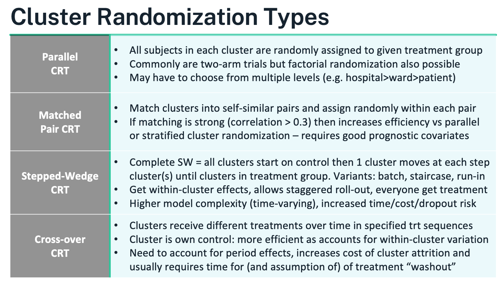
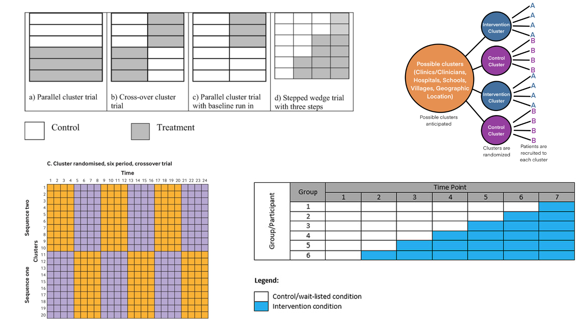
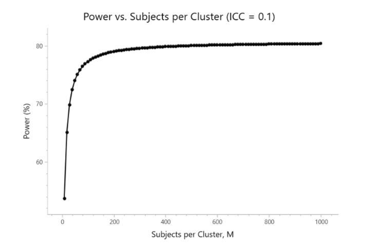

```{r setup, include=FALSE, echo = FALSE,message = FALSE, error = FALSE, warning = FALSE}
knitr::opts_chunk$set(echo = TRUE, fig.width = 10, fig.height = 6)

packages<-c("tidyverse", "kableExtra")

ipak <- function(pkg){
  new.pkg <- pkg[!(pkg %in% installed.packages()[, "Package"])]
  if (length(new.pkg)) 
    install.packages(new.pkg, dependencies = TRUE)
  sapply(pkg, require, character.only = TRUE)
}
ipak(packages)
 
 
setwd(dirname(rstudioapi::getSourceEditorContext()$path))
getwd()
Sys.setlocale("LC_ALL","English")
```


# Cluster Randomized Designs

Randomization underpins causal inference: it turns systematic differences (bias) into explainable random error that the design and analysis can account for.

* **Individual randomization** (most common): each participant is independently assigned (often via **block randomization** to maintain balance over time).
* **Cluster randomization**: the unit of randomization is a **group**—e.g., hospital, ward, clinic, school, classroom, village. Everyone in a cluster receives the same assignment.

## Cluster Randomization Overview
 
**Logistical and scientific reasons** often make cluster trials preferable or necessary:

* **Implementation & cost**: simpler site operations (train a ward to one protocol), fewer drug preps, reduced scheduling/contamination.
* **Prevent spillover/contamination**: e.g., hand-hygiene campaigns, educational curricula, workflow changes.
* **Pragmatic trials**: align with routine care; cluster assignment can be more feasible than individual blinding/dispensing.
* **Intervention targets clusters**: policy, staffing model, air filtration, teacher training—effects are naturally cluster-level.

**Trade-offs and risks**

* **Less information per subject**: participants within a cluster tend to be **more similar** ⇒ standard errors inflate; **power is driven by the number of clusters** more than the number of individuals.
* **More complex analysis**: must model clustering (e.g., mixed-effects or GEE). Ignoring it overstates precision.
* **Potential biases**: recruitment/identification bias (who is enrolled may depend on cluster assignment), baseline **imbalance** with few clusters, challenges with blinding, time trends (especially if rollout is staggered).


## Core concept: Intracluster correlation (ICC)

Let $\rho$ be the **intracluster correlation** (proportion of outcome variance shared within clusters). Even small $\rho$ values matter.

* **Design effect (DE)** inflates required sample size:

  $$
  \text{DE} \;=\; 1 + (m-1)\rho \quad (\text{equal cluster size } m)
  $$

  With unequal cluster sizes (mean $\bar m$, coefficient of variation $CV$):

  $$
  \text{DE} \;\approx\; 1 + \left[(CV^2+1)\bar m - 1\right]\rho
  $$
* **Effective sample size**: $n_\text{eff} = n/\text{DE}$. Increasing **clusters** (not just people per cluster) is usually the most efficient way to gain power.


## Common cluster-randomized designs




**Parallel CRT**

* **What it is:** Clusters are randomized once to control vs intervention (or to factorial combinations). All eligible individuals within a cluster get the cluster’s assignment.
* **When to use:** Straightforward roll-out; contamination likely under individual randomization; the effect is expected at the individual level but delivered via site-level practice.
* **How to randomize:** Often **stratified** by region/size/baseline rate; consider **constrained randomization** to ensure good balance on prespecified cluster covariates.
* **Analysis:** Mixed-effects model (cluster random intercept; add individual covariates and cluster-level covariates) or GEE with robust SEs; report cluster-level degrees of freedom or small-sample corrections when clusters are few.
* **Pros/cons:** Operationally simple; easiest to explain. Needs enough clusters; baseline imbalance risk if cluster count is small; efficiency falls as ICC rises or cluster sizes vary widely.

**Matched-Pair CRT**

* **What it is:** Form pairs of similar clusters using strong prognostic variables (e.g., baseline outcome rate, size, geography); randomize treatment within each pair.
* **When to use:** Small or moderate number of clusters; good matching variables available; aim to boost efficiency (pair correlation $\gtrsim 0.3$).
* **Analysis:** Pair-level analysis (difference within pairs with a t-test on pair differences) or mixed models including a **pair** effect.
* **Pros/cons:** Gains precision if pairs are well matched; protects against imbalance. Vulnerable to pair loss (drop one cluster ⇒ lose the pair). Avoid over-matching on variables affected by treatment.

**Stepped-Wedge CRT (SW-CRT)**

* **What it is:** All clusters start in control; at prespecified “steps” a random subset crosses to intervention until all are exposed. Everyone eventually receives the intervention; roll-out is staggered. Variants include complete, partial, batch, and staircase designs.
* **When to use:** Intervention deployment is inevitable or phased; resources limit simultaneous roll-out; ethical preference that all eventually receive the intervention.
* **Analysis:** GLMM or GEE including **fixed effects for time periods** (to control secular trends) and **random effects for clusters** (often cluster and cluster-by-period). Correlation is richer than in parallel CRT: within-period ICC and **cluster autocorrelation** across periods matter.
* **Sample size:** Depends on number of clusters, steps, measurements per period, ICC, and autocorrelation. Closed-form formulas exist but **simulation** is common.
* **Pros/cons:** Uses within-cluster contrasts (efficient when measurements are frequent); accommodates pragmatic roll-out. More complex modeling; sensitive to time trends and changing case-mix; higher risk of dropout/operational drift over time.

**Cluster Crossover CRT (CRXO)**

* **What it is:** Each cluster receives multiple treatment periods in a randomized sequence (e.g., AB/BA, Latin squares); the cluster acts as its own control. A **washout** between periods is typically required.
* **When to use:** Short-acting interventions with minimal carryover; outcomes measured quickly after exposure; strong cluster effects you want to difference out.
* **Analysis:** Mixed model with fixed effects for **treatment** and **period**, random effects for clusters (and often cluster-period), and checks for **carryover**. Robust SEs if clusters are few.
* **Sample size:** Efficiency can be high (within-cluster comparison), but formulas must account for period effects and within-cluster autocorrelation; cluster attrition is costly.
* **Pros/cons:** Powerful when assumptions hold; reduces between-cluster confounding. Vulnerable to carryover and period confounding; logistics can be demanding.

 



## Choosing a Cluster Randomization Approach 

**Choosing a Cluster Randomization Approach – detailed guidance**

**Principle.** The randomization scheme should follow the trial’s objective, endpoint behavior, and what design/analysis assumptions you can credibly defend under real operational constraints. A useful rule of thumb: pick the cluster design that is the closest feasible analog to the individually randomized design you would otherwise run.

**Parallel cluster randomized trial (CRT) – the default workhorse**

* When it fits: simplest to implement and model; best when contamination would undermine individual randomization or when the intervention is delivered at the site/ward/class level.
* How it works: clusters are randomized once to arms (two-arm or factorial). Individuals inherit their cluster’s assignment.
* Handling prognostic differences: if strong cluster-level covariates exist (baseline outcome rate, size, geography), either include them in the primary model or improve balance at randomization using stratification, pair-matching, or constrained randomization.
* Pros: operationally straightforward; assumptions mirror a standard RCT; clean interpretation of arm effects.
* Cons: needs enough clusters to achieve power; risk of baseline imbalance with few clusters; efficiency drops as ICC rises and with unequal cluster sizes—plan for this in the sample size.

**Cluster crossover CRT – efficiency via within-cluster contrasts**

* When it fits: short-acting or rapidly reversible interventions; outcomes measured soon after exposure; you want each cluster to act as its own control so that stable cluster differences are differenced out.
* Design features: clusters follow randomized treatment sequences (e.g., AB/BA, Latin square) with prespecified periods and washout.
* Pros: strong inferential value and power gains from within-cluster comparisons; more participants may access more/all treatments.
* Key cautions: must account for period effects and potential carryover; requires stable clusters over time and low risk of cluster loss (dropout of a cluster can be costly); decide up front whether you have **cohort** sampling (same individuals measured repeatedly) or **cross-sectional** sampling (new samples each period)—analysis and interpretation differ.

**Stepped-wedge CRT – staggered rollout with time adjustment**

* When it fits: intervention rollout is inevitable or must be phased; ethical/patient-centric preference that all clusters eventually receive the intervention; useful for service-delivery or policy changes.
* Design features: all clusters start as control; at each step a randomized subset switches to intervention until all have crossed over. Variants include complete, partial, batch, or staircase wedges.
* Pros: uses within-cluster contrasts; aligns with pragmatic implementation; every cluster eventually receives the intervention.
* Key cautions: mandatory adjustment for secular time trends and learning effects; higher modeling complexity (cluster and cluster-by-period random effects are common); longer duration raises exposure to drift, attrition, and cost; not ideal for unstable settings with rapidly changing casemix.

**How to choose – practical decision points**

* Is individual randomization infeasible or likely to contaminate treatment? If yes, consider clustering; otherwise individual RCT is usually superior.
* Is the intervention reversible with quick outcomes? Consider cluster crossover; if effects are irreversible or slow to wash out, prefer parallel or stepped-wedge.
* Must all clusters eventually receive the intervention, or is phased deployment unavoidable? Stepped-wedge is often the cleanest fit.
* Are strong cluster-level prognostic variables known and measurable? Use stratification/pair-matching or constrained randomization regardless of design.
* Do you have enough clusters? Power is driven primarily by the number of clusters, not the number of individuals per cluster. If clusters are few, avoid complex designs that further erode degrees of freedom.
* Can you maintain stable operations over time? If not, avoid designs that require long follow-up across periods (stepped-wedge, crossover).

**Sample size and power essentials (all CRTs)**

* Expect loss of efficiency from within-cluster similarity; plan with the intracluster correlation (ICC, $\rho$).
* For parallel CRTs (equal-sized clusters), the design effect is $\text{DE}=1+(m-1)\rho$ where $m$ is mean cluster size; with unequal sizes (mean $\bar m$, coefficient of variation $CV$), $\text{DE}\approx 1+[(CV^2+1)\bar m-1]\rho$. Effective sample size is $n/\text{DE}$.
* Adding clusters usually boosts power more than adding individuals within clusters.
* For stepped-wedge and cluster crossover, power depends on the number of clusters, periods/steps, ICC, and **autocorrelation** across periods; closed-form formulas exist but simulation is often the most reliable route.

**Analysis implications**

* Use models that respect clustering: mixed-effects (multilevel) models or GEEwith robust (sandwich) SEs; apply small-sample corrections when the number of clusters is limited.
* Parallel CRTs typically include a random intercept for cluster and prespecified covariates; stepped-wedge models must include period (time) effects; crossover models must include period effects and consider carryover.
* With very few clusters, consider a cluster-level analysis (analyze cluster means/changes) for robustness, acknowledging reduced flexibility.

**Operational safeguards**

* Lock eligibility and harmonize recruitment windows to avoid post-allocation selection bias.
* Minimize contamination with training containment and process checks; document cross-cluster exposure.
* Pre-specify allocation procedures and analysis plans; follow CONSORT extensions for cluster and stepped-wedge trials, including reporting ICCs, number of clusters randomized and analyzed, cluster size distribution, and balance diagnostics.


## Sample size for cluster trials


**Core idea.** In a cluster randomized trial (CRT) you size the study at the *level that is randomized*—the clusters—then work down to people and measurements. Because individuals within a cluster are correlated, the effective information per person is reduced and the **number of clusters** becomes the main driver of power.

**Key quantities**

* Mean cluster size $m$ (participants per cluster); number of clusters per arm $k$.
* Intracluster correlation (ICC, $\rho$)—proportion of total variance explained by between-cluster differences:

  $$
  \textstyle \rho=\frac{\sigma_B^2}{\sigma_B^2+\sigma_W^2}.
  $$
* Design effect (DE)—inflation factor that converts an individually randomized sample size to the CRT setting. For a two-level parallel CRT with equal cluster sizes:

  $$
  \textstyle \text{DE}=1+(m-1)\rho.
  $$

  With unequal cluster sizes (mean $\bar m$, coefficient of variation $CV$):

  $$
  \textstyle \text{DE}\approx 1+\left[(CV^2+1)\bar m-1\right]\rho.
  $$

  Effective sample size $n_{\text{eff}}=n/\text{DE}$.

**What this means in practice**

* Adding *individuals* within a cluster gives diminishing returns once $m$ is moderate; **adding clusters is far more powerful**.
* Higher $\rho \Rightarrow$ larger DE $\Rightarrow$ more clusters needed. Unequal cluster sizes (large $CV$) further increase DE—cap very large clusters and support smaller ones to balance enrollment.
* Sample size should follow the **level of randomization**; increasing lower levels (e.g., more patients per cluster, or more repeats per patient) may barely move power if clusters are few.

**Workflow to compute a parallel CRT sample size**

1. Specify the usual ingredients for your outcome (difference in means/proportions, log-odds ratio, hazard ratio), $\alpha$, and target power.
2. Obtain or bracket a plausible **ICC** from prior audits/literature/pilot (plan sensitivity analyses over a range, e.g., 0.005–0.10).
3. Decide a feasible **mean cluster size** and expected **CV** of cluster sizes.
4. Compute the individually randomized sample size $N_{\text{fixed}}$ and inflate:

   $$
   N_{\text{CRT}}=\text{DE}\times N_{\text{fixed}}.
   $$

   Divide by $m$ to get **clusters per arm** $k$ (round up), then add margins for **cluster loss** and **participant attrition**.
5. Re-check power with your intended **analysis model** (mixed effects or GEE) and apply small-sample corrections if clusters are few.




* Suppose an individually randomized two-arm trial needs $N_{\text{fixed}}=400$ participants total. You plan $m=25$ per cluster, ICC $\rho=0.05$.
* DE $=1+(25-1)\times 0.05=1+1.2=2.2$.
  $N_{\text{CRT}}=2.2\times 400=880$ participants $\Rightarrow$ $880/25\approx 36$ clusters total ($\sim 18$ per arm).
* Doubling $m$ to 50 but keeping clusters fixed barely helps; adding **clusters** is what increases power.

**Beyond two-level parallel designs**

* **Repeated measures within individuals** or **multilevel clustering** (e.g., wards within hospitals) introduce additional correlations; use variance components or working correlation structures that include both **within-cluster** and **within-subject** terms. DE generalizes accordingly; simulate if formulas are not available for your outcome.
* **Stepped-wedge CRTs** require assumptions about the number of steps/periods, within-period ICC, and **cluster autocorrelation** across periods. Power depends on clusters, periods, and measurement frequency; closed-form formulas exist, but **simulation is often preferred**.
* **Cluster crossover CRTs** need period and (possible) carryover effects in the model; efficiency can be high, but sample size must reflect autocorrelation and risk of cluster attrition.

**Analysis alignment (affects sample size assumptions)**

* Use a mixed-effects model (random intercept for cluster; add time effects for stepped-wedge; period and carryover checks for crossover) or GEE with robust SEs.
* With **few clusters**, rely on cluster-level analyses or small-sample corrections (Satterthwaite/Kenward–Roger; small-sample-robust sandwich) and plan extra clusters at design.

**Planning tips**

* Aim for enough clusters per arm (practical heuristics: ≥15–20 if feasible; more for stepped-wedge).
* Cap extreme cluster sizes; manage $CV$.
* Pre-specify how missing data and cluster dropout will be handled; cluster loss is far more damaging than individual loss.
* Always present **sensitivity analyses** for $\rho$ and $CV$; show power curves vs clusters and vs $m$ to communicate diminishing returns of enlarging clusters.


**Worked Examples Reference**

**2-Level CRT Example**

He, J., Irazola, V., Mills, K.T., Poggio, R., Beratarrechea, A., Dolan, J., Chen, C.S., Gibbons, L., Krousel-Wood, M., Bazzano, L.A. and Nejamis, A., 2017. Effect of a community health worker–led multicomponent intervention on blood pressure control in low-income patients in Argentina: a randomized clinical trial. Jama, 318(11), pp.1016-1025.
 

**3-Level CRT Example**

Leahy, A.A., Eather, N., Smith, J.J., Hillman, C., Morgan, P.J., Nilsson, M., Lonsdale, C., Plotnikoff, R.C., Noetel, M., Holliday, E. and Shigeta, T.T., 2019. School-based physical activity intervention for older adolescents: rationale and study protocol for the Burn 2 Learn cluster randomised controlled trial. BMJ open, 9(5), p.e026029.

**Matched-Pair CRT Example**

Moore, H., Greenwood, D., Gill, T., Waine, C., Soutter, J. and Adamson, A., 2003. A cluster randomised trial to evaluate a nutrition training programme. The British Journal of General Practice, 53(489), p.271.

**Stepped-Wedge CRT Example**

Fadl, H., Saeedi, M., Montgomery, S., Magnuson, A., Schwarcz, E., Berntorp, K., Sengpiel, V., Storck-Lindholm, E., Strevens, H., Wikström, A.K. and Brismar-Wendel, S., 2019. Changing diagnostic criteria for gestational diabetes in Sweden-a stepped wedge national cluster randomised controlled trial-the CDC4G study protocol. BMC pregnancy and childbirth, 19(1), p.398.


### 2-Level CRT sample size  

**Design being sized.** Two-arm, parallel **cluster** randomized trial with a continuous primary outcome (change in systolic BP). Clusters are centers; all patients in a center get the same arm. Target: **80% power**, **two-sided α=0.05**, detect a **Δ = 4 mmHg** mean difference. Assumptions: **common SD = 10**, **ICC ρ = 0.06**, **mean cluster size m = 62**. The slide shows **9 clusters per group**.

|     Parameter                       |     Value    |
|-------------------------------------|:------------:|
|     Significance Level (2-sided)    |      0.05    |
|     Mean Difference                 |         4    |
|     Standard Deviation              |        10    |
|     ICC                             |      0.06    |
|     Sample Size Per Cluster         |        62    |
|     Power                           |       80%    |
|     Clusters Per Group              |         9    |

—

**Step 1 — Size the individually randomized equivalent.**

For two equal groups with common SD, the usual per-arm size is

$$
n_{\text{fixed}} \;=\; \frac{2\,(z_{1-\alpha/2}+z_{1-\beta})^{2}\,\sigma^{2}}{\Delta^{2}}.
$$

With $z_{0.975}=1.96$, $z_{0.8}=0.84$, $\sigma=10$, $\Delta=4$:

$$
n_{\text{fixed}} = \frac{2\,(1.96+0.84)^2\cdot 100}{16}
= \frac{2\cdot 7.84\cdot 100}{16} \approx 98\ \text{per arm}.
$$

(Standardized effect size $Δ/σ=0.4$, a moderate effect.)

**Step 2 — Inflate for clustering (design effect).**

For equal cluster size $m$ the **design effect**

$$
\text{DE}=1+(m-1)\rho=1+(62-1)\times 0.06=1+3.66=4.66.
$$

Thus the clustered per-arm *person* sample size is

$$
n_{\text{CRT, per arm}}= \text{DE}\times n_{\text{fixed}}
= 4.66\times 98 \approx 457\ \text{patients}.
$$

**Step 3 — Convert to clusters per arm.**

With $m=62$ patients per cluster:

$$
k \;=\; \left\lceil \frac{n_{\text{CRT, per arm}}}{m} \right\rceil
= \left\lceil \frac{457}{62} \right\rceil
= 8\ \text{clusters per arm (≈7.4 rounded up)}.
$$

Why does the slide show **9**? In practice you round up further to cover:

* **Unequal cluster sizes** (inflate DE);
* **ICC uncertainty** (ρ is rarely known precisely);
* **Cluster attrition** (a lost site costs an entire cluster);
* **Small-sample df corrections** at the cluster level.
  Adding one safety cluster per arm is common → **9 per arm** matches the slide.

—

**What if clusters are unequal?** (mean $\bar m=62$, coefficient of variation $CV$)
Use the unequal-size approximation:

$$
\text{DE} \approx 1+\left[(CV^2+1)\bar m - 1\right]\rho .
$$

Example $CV=0.30$: $\text{DE} \approx 1+[(0.09+1)\cdot 62 -1]\cdot 0.06 \approx 5.00$.
Then $n_{\text{CRT, per arm}}\approx 5.00\times 98=490$ ⇒ $k=\lceil 490/62\rceil=8$; with a safety margin you’d again choose **9**.

—

**Power is driven by clusters, not people.**
With $\rho=0.06$ the **effective** per-arm sample is $n_{\text{eff}} = n_{\text{CRT}}/\text{DE}$. Once $m$ is moderate (here 62), adding more patients per cluster yields diminishing returns; **adding clusters** is much more efficient.

**Analysis alignment (what the size assumes).**
Plan to analyze with a mixed-effects model (random intercept for cluster) or GEE with robust SEs; when clusters are few (e.g., 9 per arm), use **small-sample corrections** (Satterthwaite/Kenward–Roger or small-sample-robust sandwich) and report **cluster-level degrees of freedom**.

**Practical sizing tips.**

* Do **sensitivity** tables over $ρ$ (e.g., 0.02–0.10) and cluster-size CV (0–0.5).
* Budget **≥1 spare cluster per arm** for loss/under-recruitment.
* Cap very large clusters and support small ones to limit CV.
* If the calculation yields <\~8–10 clusters per arm, strongly consider adding clusters or simplifying the design; inference becomes fragile with very few clusters.

**Bottom line.** Using Δ=4, SD=10, ρ=0.06, m=62 gives \~**8 clusters per arm** by formula; rounding up for real-world uncertainties yields **9 clusters per arm**, exactly as the slide summarizes.


### 3-Level CRT example  

**Design.** Two-arm, parallel **three-level** cluster trial: students (level-1) nested in classes (level-2) nested in schools (level-3). Outcome is change in Progressive Aerobic Cardiovascular Endurance Run (PACER) laps. Assumptions:

* Two-sided α=0.05, power=80%.
* Raw baseline SD = 29 laps; baseline–post correlation $r=0.90$.
* Target raw mean difference $\Delta=6$ laps (between groups, baseline-adjusted).
* ICCs to reflect clustering: within **class** (same class) $ \rho_{\text{class}}=0.20$; **school-only** (different classes in same school) $ \rho_{\text{school}}=0.03$.
* Per group: 2 classes per school, 14 students per class, 10 schools ⇒ 280 students.


|     Parameter                       |               Value    |
|-------------------------------------|-----------------------:|
|     Significance Level (2-sided)    |                0.05    |
|     Mean Difference                 |                0.35    |
|     Standard Deviation (SD)*        |              12.64*    |
|     ICC (Level 1, Level 2)          |           0.2, 0.03    |
|     Sample Size (Level 1, 2, 3)     |     280 (14, 2, 10)    |
|     Power                           |                 80%    | 


**1) Variance reduction from baseline adjustment (ANCOVA).**

Using the well-known ANCOVA approximation, the post-treatment SD is reduced by $\sqrt{1-r^2}$:

$$
\sigma_{\text{adj}} = \sigma\sqrt{1-r^2}
= 29\sqrt{1-0.9^2}
= 29\sqrt{0.19}
\approx 12.64.
$$

So the standardized effect is $d = \Delta/\sigma_{\text{adj}} = 6/12.64 \approx 0.48$.

**2) Individually randomized equivalent (per arm).**

For a continuous outcome with common SD,

$$
n_{\text{fixed}} = \frac{2\,(z_{1-\alpha/2}+z_{1-\beta})^2\,\sigma_{\text{adj}}^2}{\Delta^2}
= \frac{2\,(1.96+0.84)^2\,(12.64)^2}{6^2}
\approx 69.6 \;\Rightarrow\; 70 \text{ per arm}.
$$

**3) Three-level design effect (balanced sizes).**

Two students in the **same class** share correlation $\rho_{\text{class}}+\rho_{\text{school}}$; in **different classes of the same school** they share $\rho_{\text{school}}$; in different schools correlation is 0. With $m=14$ students/class and $c=2$ classes/school, the design effect is

$$
\text{DE}
= 1 + (m-1)\big(\rho_{\text{class}}+\rho_{\text{school}}\big)
  + m\,(c-1)\,\rho_{\text{school}}
= 1 + 13(0.20+0.03) + 14(1)(0.03)
= 1 + 2.99 + 0.42
\approx 4.02.
$$

**4) Inflate and convert to clusters.**

Total persons per arm:

$$
n_{\text{CRT, per arm}}=\text{DE}\times n_{\text{fixed}}
\approx 4.02 \times 70 \approx 282.
$$

With 14 students per class and 2 classes per school, that is

$$
\text{per arm: } \frac{282}{14} \approx 20 \text{ classes} \;=\; 10 \text{ schools},
$$

which matches the slide’s **280 students (2 classes of 14 in each of 10 schools)**.

**Notes and checks.**

* The table’s “Mean Difference = 0.35” appears to be a standardized effect placeholder; the sizing that yields 280 per group corresponds to $d\approx 0.48$ (i.e., 6/12.64).
* If class/school sizes are unequal, use the unequal-size approximation for DE
  $\text{DE} \approx 1 + ( \bar m - 1)\rho_{\text{class+school}} + \bar m(\bar c-1)\rho_{\text{school}}$ inflated further by size variability (via CVs), or simulate.
* With only **10 schools per arm**, use mixed models with small-sample df (Satterthwaite/Kenward–Roger) or GEE with small-sample-robust SEs, and plan a spare school per arm if attrition is possible.

 
### Matched-Pair CRT example 


**Design and inputs**

* Two-arm, parallel **matched-pair** cluster RCT.
* Binary endpoint; target difference: control 0.20 vs treatment 0.40 ⇒ $\delta = 0.20$.
* Per cluster (practice) size $m=20$ patients.
* Total clusters = 12 ⇒ **6 matched pairs** ($J=6$).
* “Between-cluster variance” $\sigma_B^2=0.005$ (heterogeneity in true cluster proportions).
* Two-sided $\alpha=0.05$, target power 80%.


|     Parameter                       |      Value    |
|-------------------------------------|:-------------:|
|     Significance Level (2-sided)    |       0.05    |
|     Control Group Proportion        |        0.2    |
|     Treatment Group Proportion      |        0.4    |
|     Between-Cluster Variance        |      0.005    |
|     Number of Matched Pairs         |     12/2=6    |
|     Subjects per Cluster            |         20    |
|     Power                           |        80%    |


**How matched-pair sizing works (cluster-level difference approach)**

Analyze **within-pair differences** of cluster proportions: $d_j = \hat p_{Tj}-\hat p_{Cj}$, $j=1,\dots,J$.

* Mean difference under the alternative: $\mathbb E[d_j]=\delta=0.20$.
* Variance of a paired difference (approximate):

$$
\mathrm{Var}(d_j) \;\approx\; 2\sigma_B^2(1-r)\;+\;\frac{p_C(1-p_C)}{m}\;+\;\frac{p_T(1-p_T)}{m},
$$

where $r$ is the **pairing correlation** between matched clusters’ underlying risks.

* Standard error of the mean difference across pairs:

$$
\mathrm{SE}(\bar d)=\sqrt{\mathrm{Var}(d_j)/J}.
$$

* Test is a paired **t** with $df=J-1$ (or z when $J$ is larger).

**Plugging the numbers**
Use $p_C=0.20$, $p_T=0.40$, $m=20$, $\sigma_B^2=0.005$. The within-cluster (binomial) pieces are

$$
\frac{0.20\times0.80}{20}=0.008,\qquad \frac{0.40\times0.60}{20}=0.012,
$$

so within-cluster sum $=0.020$. The between-cluster component depends on how strong matching is via $r$:

* If **moderate pairing** $r=0.30$ (typical when matching uses good prognostic covariates):
  $\;2\sigma_B^2(1-r)=0.01\times0.70=0.007$.
  Then $\mathrm{Var}(d_j)\approx 0.007+0.020=0.027$, so $\mathrm{SD}(d_j)\approx 0.164$,
  $\mathrm{SE}(\bar d)=\sqrt{0.027/6}\approx 0.067$, and the non-centrality $ \delta/\mathrm{SE} \approx 0.20/0.067 \approx 2.98$.
  Using the usual z approximation ($1.96+0.84=2.80$) gives **≈80% power**.

* If **no matching benefit** $r=0$ (i.e., stratified only):
  between-cluster term $=0.01$, so $\mathrm{Var}(d_j)\approx 0.031$, $\mathrm{SE}(\bar d)\approx 0.072$, NCP $\approx 2.78$.
  You would need about **7 pairs** (14 practices) to reach 80% power.

* If **strong pairing** $r=0.50$:
  between-cluster term $=0.005$, $\mathrm{SE}(\bar d)\approx 0.066$, NCP $\approx 3.03$ → comfortably ≥80%.

These calculations show why **12 practices (6 pairs) × 20 patients** lands near **80% power** under a plausible matching correlation (around 0.3–0.5). The exact power depends on $r$ and whether you use z or small-sample **t** critical values (with $df=5$, the t critical is 2.571; many planning tools still use z here and then round clusters up for safety).

**What the “between-cluster variance = 0.005” implies**
For a binary outcome with average $\bar p \approx 0.30$, the implied ICC is roughly

$$
\rho \approx \frac{\sigma_B^2}{\sigma_B^2+\bar p(1-\bar p)} \approx \frac{0.005}{0.005+0.21} \approx 0.023,
$$

a small but non-negligible clustering effect—consistent with needing clusters (not just larger $m$) for power.

**Practical notes**

* Primary analysis: paired cluster-level difference (t-test on pair means) or mixed model with a **pair effect**; report $df=J-1$.
* Sensitivity: show power across $r\in[0,0.5]$ and modest misspecification in $\sigma_B^2$.
* With few pairs, pre-plan a spare pair (or allow >20 participants/cluster) to protect against cluster loss or under-recruitment.


### Stepped-Wedge CRT example  

**Design snapshot**

* Cross-sectional stepped-wedge (complete rollout): all **11 clusters** begin in control; at each step a subset crosses to intervention until all are exposed.
* Binary outcome: **LGA** rate.
* Target effect: **absolute reduction 1.5%** (from **10.0%** to **8.5%**).
* Two-sided **α=0.05**, **power=90%**.
* **ICC = 0.0026** (within-cluster correlation, assumed constant over time).
* “Null variance” method: use the **binomial variance under the null** $p_0=0.10$.
* Reported minimum **total N ≈ 47,916** women.

|     Parameter                 |         Value        |
|-------------------------------|:--------------------:|
|     Significance Level        |              0.05    |
|     Control   Proportion      |               0.1    |
|     Treatment   Proportion    |             0.085    |
|     Variance   Method         |     Null Variance    |
|     SW   Design               |          Complete    |
|     Number   of Clusters      |                11    |
|     Power (%)                 |                90    |
|     Total Sample Size         |             47916    |

---

**Step 1 — Individually randomized benchmark**

Ignoring clustering and the stepped-wedge structure, the total sample size to detect
$\Delta=0.015$ with $p_C=0.10$ and $p_T=0.085$ is

$$
N_{\text{fixed}}
\;=\; \frac{2\,[z_{1-\alpha/2}+z_{1-\beta}]^2\,\bar p(1-\bar p)}{\Delta^2}
\quad\text{with}\quad
\bar p=\tfrac{1}{2}(p_C+p_T)=0.0925.
$$

Using $z_{0.975}=1.96$ and $z_{0.90}=1.282$,

$$
N_{\text{fixed}} \approx
\frac{2\,(1.96+1.282)^2\,(0.0925\times0.9075)}{0.015^2}
\approx 15{,}700 \text{ participants (total)}.
$$

This is the **best-case** (no clustering, no time effects).

---

**Step 2 — Inflate for stepped-wedge clustering and time**

Under the Hussey–Hughes linear mixed-model framework for a **cross-sectional SW-CRT** with:

* equal cluster-period sizes $m$,
* fixed **period (time) effects**,
* a single **cluster random intercept** (ICC $=\rho$),

the variance of the treatment effect is inflated by a factor that depends on **$\rho$** and the SW layout (number of clusters $K$, number of periods $P$, and how clusters are assigned to sequences). This is what the software labels the **“null-variance”** calculation (it plugs in $p_0(1-p_0)$ for the residual variance of the binary outcome).

For the **complete** SW design in the protocol (each cluster switches once and all end up treated), with **$K=11$** and the reported **$\rho=0.0026$**, the required total sample is about

$$
N_{\text{SW}} \;\approx\; \underbrace{\text{Inflation factor}}_{\approx 3.05}
\times N_{\text{fixed}}
\;\approx\; 3.05 \times 15{,}700
\;\approx\; \mathbf{47{,}900},
$$

That “inflation factor” bundles (i) within-cluster correlation, and (ii) the need to estimate **time effects** while using staggered exposure.

---

**Step 3 — What this implies about per-period counts**

Total $N$ in a cross-sectional SW-CRT equals $K \times P \times m$.
If the rollout uses, for example, **$P=12$ periods** (baseline + 11 steps), then

$$
m \approx \frac{47{,}916}{11\times 12}\approx 364
$$

women **per cluster-period** on average (a plausible number for national registry-scale obstetric outcomes). If $P=11$, $m \approx 398$. Either way, you can see why a small absolute effect (1.5%) plus period adjustment requires **large per-period accrual** despite a small ICC.

---

**Why the sample is so large even with a tiny ICC**

* The **effect size is small** (1.5 percentage points at a baseline of 10%). Detecting such changes at 90% power typically demands large $N$, even without clustering.
* A stepped-wedge must also estimate **period effects** and spreads information over periods; this increases the variance of the treatment effect compared with a simple parallel individual RCT.
* Although $\rho=0.0026$ is small, the **cluster-period sizes** are large, so the clustering still contributes meaningfully to the variance.

---

**Planning notes**

* Declare the SW layout (number of periods/steps and which clusters cross at each step), assume **equal cluster-period sizes for planning**, and perform **sensitivity analyses** over $\rho$ (e.g., 0.001–0.01) and period count $P$.
* Use a GLMM or GEE that **includes fixed period effects**; consider **small-sample corrections** on cluster-robust SEs with only 11 clusters.
* Check robustness to **cluster-period size variability** (CV), **secular trends**, and potential **autocorrelation** beyond a random intercept (some SW tools allow a cluster-by-period random effect).

 
Start from the individually randomized $N$ for a 1.5% absolute reduction, then apply the Hussey–Hughes stepped-wedge inflation (ICC + time effects). With $K=11$, $\rho=0.0026$, and a complete rollout, that yields a total of **≈47,916**  

 

# Repeated Measures

## Repeated Measures ANOVA  

Description: this tests if at least one mean is different among groups, where the groups are repeated measures (more than two) for a normally distributed variable. Repeated Measures ANOVA is the extension of the Paired T-test for more than two groups.

```{r,echo = T,message = FALSE, error = FALSE, warning = FALSE}
# library("WebPower")
# https://github.com/johnnyzhz/WebPower/blob/master/R/webpower.R
source("./03_Functions/webpower.R")
wp.rmanova(n=NULL, ng=1, nm=4, f=0.608, nscor=1, alpha=0.05, power=0.80, type=1)
```

## Power Calculations for Mixed Models 

### Power Calculations

Reference: SAS for Mixed Models, Chapter 12: Power Calculations for Mixed Models

Power calculations for mixed models are more difficult due to their more complex covariance structure (Helms 1992, Stroup 2002, Tempelman 2006, Rosa, Steibel, and Tempelman 2006). Assuming the hypothesis test of interest is formed as a linear combination $\mathbf{K}^{\prime} \boldsymbol{\beta}$, recall that our general $t$ - and $F$-statistics can be written using the variance matrix $\mathbf{K}^{\prime}\left[\mathbf{X}^{\prime} \mathbf{V}^{-1} \mathbf{X}\right]^{-1} \mathbf{K}$. So the power associated with such tests is a function of the following:
- the magnitude of $\mathbf{K}^{\prime} \boldsymbol{\beta}$, also known as the effect size
- the design matrix $\mathbf{X}$, including the number of its rows (the sample size) and the structure of its columns (from the fixed effects)
- the values of the variance and covariance parameters in $\mathbf{V}$
- the test size, commonly known as $\alpha$, the probability of a Type I error, or one minus the specificity of the test

Several authors (Helms 1992, Stroup 2002, Tempelman 2005, Rosa, Steibel, and Tempelman  2005) have shown how to compute a simple approximation to the power of an F-test by using  an observed F-statistic to compute the noncentrality parameter needed for the power calculation. Consider the mice experiment example below as a pilot study:

| Obs | cage | condition | diet     | gain |
|-----|------|-----------|----------|------|
| 1   | 1    | 1         | normal   | 58   |
| 2   | 1    | 1         | restrict | 58   |
| 3   | 1    | 1         | suppleme | 58   |
| 4   | 1    | 2         | normal   | 54   |
| 5   | 1    | 2         | restrict | 46   |
| 6   | 1    | 2         | suppleme | 57   |
| ... | ...  | ...       | ...      | ...  |
| 31  | 6    | 3         | normal   | 65   |
| 32  | 6    | 3         | restrict | 64   |
| 33  | 6    | 3         | suppleme | 54   |
| 34  | 6    | 4         | normal   | 59   |
| 35  | 6    | 4         | restrict | 47   |
| 36  | 6    | 4         | suppleme | 73   |

```
proc mixed data=mice nobound cl;
 class cage condition diet;
 model gain= condition|diet / solution ddfm=satterth;
 random cage cage*condition;
 ods output tests3=t3;
run;
data f_power;
 set t3;
 Noncen = NumDF*FValue;
 Alpha = 0.05;
 FCrit = finv(1-Alpha,NumDF,DenDF,0);
 Power = 1 - probf(FCrit,NumDF,DenDF,Noncen);
run;
proc print data=f_power;
run; 
```

```{r, echo=FALSE, fig.align="center", out.width = '75%',fig.cap="Figure: Results for Power Calculations for the Mice Experiment"}
knitr::include_graphics("./02_Plots/SSC/SSC_Output_12.1.png") 
```

**Interpretation**

Consider the test for the interaction between condition and diet. The power value of 0.42796 indicates that for a data set having the following characteristics, the probability of observing a CONDITION $\times$ DIET $F$-test $p$-value less than $\alpha=0.05$ is approximately 0.42796 :
- exactly the same $\mathbf{X}$ matrix as the present one
- exactly the same $\boldsymbol{\beta}$ vector with values equal to those in the "Solution for Fixed Effects" table
- exactly the same $\mathbf{V}$ matrix with values equal to the unbounded REML estimates as shown in the "Covariance Parameter Estimates table"

We now ask: what would the power for each $F$-test be if we had doubled the number of cages in the study, assuming the fixed effects and covariance parameter estimates stay the same?

Our strategy for computing these new powers is to run the same code as before but to increase the denominator degrees of freedom for each $F$-test by an appropriate amount. A convenient way to calculate these degrees of freedom is to run PROC MIXED on a doubled data set as follows.

```
data mice1;
 set mice;
 cage = cage + 6;
data mice2;
 set mice mice1;
run;
proc mixed data=mice2 nobound cl;
 class cage condition diet;
 model gain=condition|diet / ddfm=satterth;
 random cage cage*condition;
run; 
```
| Effect         | Num DF | Den DF | F Value | Pr > F |
|----------------|--------|--------|---------|--------|
| condition      | 3      | 11.9   | 13.91   | 0.0003 |
| diet           | 2      | 40     | 2.06    | 0.1405 |
| condition*diet | 6      | 40     | 3.81    | 0.0043 |

The denominator degrees of freedom for the CONDITION main effect have increased from  4.72 to 11.9, and those for DIET and CONDITION × DIET have increased from 16 to 40.

We do not perform the power calculations using the doubled data set because the covariance  parameter estimates are no longer the same as the original one. Instead, we rerun the code on  the original pilot data and specify the new denominator degrees of freedom using the DDF=  option as follows

```
proc mixed data=mice nobound cl;
 class cage condition diet;
 model gain = condition|diet / ddf=11.9,40,40;
 random cage cage*condition;
 ods output tests3=t3;
run;
data f_power2;
 set t3;
 Alpha = 0.05;
 Noncen = NumDF*FValue;
 FCrit = finv(1-Alpha,NumDF,DenDF,0);
 Power = 1 - probf(FCrit,NumDF,DenDF,Noncen);
run;
proc print data=f_power2;
run; 
```

| Obs | Effect         | NumDF | DenDF | FValue | ProbF  | Alpha | Noncen  | FCrit   | Power   |
|-----|----------------|-------|-------|--------|--------|-------|---------|---------|---------|
| 1   | condition      | 3     | 11.9  | 5.16   | 0.0162 | 0.05  | 15.4900 | 3.49914 | 0.80776 |
| 2   | diet           | 2     | 40    | 0.82   | 0.4456 | 0.05  | 1.6496  | 3.23173 | 0.18124 |
| 3   | condition*diet | 6     | 40    | 1.52   | 0.1956 | 0.05  | 9.1388  | 2.33585 | 0.52161 |

**Interpretation**

The approximate power for the CONDITION × DIET F-test has increased from 0.427 to 0.521. The power for CONDITION has increased even more, from 0.579 to 0.807, while that for DIET increased from 0.166 to only 0.181 due to its small F-statistic

### Power Curves

An analytical approximation to power makes it feasible to quickly compute entire power curves.  While several different kinds of curves can be constructed by holding all but two variables  fixed, a classical power curve plots effect size along the horizontal axis and power along the  vertical axis. To facilitate this kind of calculation, we move from an F-distribution to a tdistribution in order to be able to specify a range of effect sizes in the numerator of the tdistribution noncentrality parameters.  The following SAS macro computes the power for an arbitrary set of ESTIMATE statements  via the noncentral t-distribution. The GPLOT code following the macro plots the power curves

* InData specifies the exemplary input data set.
* ProcMixedStatements provides PROC MIXED statements, enclosed within %str(). The statements must contain one or more ESTIMATE statements corresponding to the single-degree-of-freedom contrasts for which you want to compute power curves.
* ProcMixedOptions specifies options for the PROC MIXED statement.
* AlphaValues specifies a list of alpha values over which to compute distinct power curves.
* EffectSizes specifies a list of effect sizes that form the X-axis values of the power curve plots.
* OutPath specifies the directory to which output should be written. 

```
%macro MixedTPower;
 * run proc mixed;
 proc mixed data=&InData &ProcMixedOptions;
 &ProcMixedStatements
 ods output estimates=ests;
 run;
 libname OutLib "&OutPath";
 * compute power curves for each difference
 using a noncentral t-distribution;
 data OutLib.MixedPower;
 set ests;
 do alpha = &AlphaValues;
 do effectsize = &EffectSizes;
 tcrit = tinv(1-alpha/2,df);
 noncen = effectsize/stderr;
 power = sum(1, -cdf("t", tcrit,df,noncen),
 cdf("t",-tcrit,df,noncen));
 output;
 end;
 end;
 run;
 * create JMP scripting code;
 filename jslfile "&OutPath.mixedtpower.jsl";
 data _null_;
 file jslfile;
 put "%str(data=open(%".\MixedPower.sas7bdat%");)";
 put " ";
 put "Overlay Plot(X( :effectsize), Y( :power),
 Grouping( :Label, :alpha),";
 put "Connect Thru Missing(1));";
 run;
%mend MixedTPower; 

%let InData = mice;
%let ProcMixedStatements=
%str(
 class cage condition diet;
 model gain = condition|diet / ddfm=satterth;
 random cage cage*condition;
 estimate "est1: condition 2-1" condition -1 1 0 0;
 estimate "est2: diet restrict-normal" diet -1 1 0;
 estimate "est3: condition*diet 1 restr-nor"
 diet -1 1 0
 condition*diet -1 1 0 0 0 0 0 0 0 0 0 0;
);
%let ProcMixedOptions = nobound;
%let AlphaValues = 0.05;
%let EffectSizes = 0 to 10 by 0.5;
%let OutPath = C:\temp\;
%MixedTPower;
data power; set outlib.mixedpower;
 symbol = substr(label,4,1)+0;
run;
goptions reset=all hsize=9in vsize=8in;
symbol1 color=black value=none i=join l=1 r=1 w=2;
symbol2 color=black value=none i=join l=2 r=1 w=2;
symbol3 color=black value=none i=join l=21 r=1 w=2;
axis1 minor =none
 order =(0 to 1 by 0.1)
 label =(font='Arial Black' Height=1.5 angle=90 'Power')
 offset=(0.3in,0.3in)
 value =(font='Arial Black' Height=1.3);
axis2 minor =none
 order =(-2 to 12 by 2)
 label =(font='Arial Black' Height=1.5 'Effect Size')
 offset=(0.3in,0.3in)
 value =(font='Arial Black' Height=1.3);
legend1 across =1
 cborder =black
 mode =protect
 position=(top left inside)
 label = none
 value =(font='Arial Black' Height=2
 'Condition 2-1'
 'Diet restrict-normal'
 'Condition*diet 1 restr-nor');
proc gplot data=power;
 plot power*effectsize=symbol /
 noframe
 vaxis=axis1 haxis=axis2
 legend=legend1;
run;
quit; 
```

This code constructs three different power curves corresponding to the main effect contrasts for  CONDITION and DIET and one interaction contrast for CONDITION × DIET. In contrast to earlier examples that used the F-distribution, this macro does not use the estimate  of β during the power calculations because you specify effect sizes directly. So the response  variable GAIN is used only to compute values of the covariance parameters. You can  alternatively use a PARMS / HOLD= statement in order to directly specify the covariance  parameters, in which case the response variable is not used at all in the power calculations. 

```{r, echo=FALSE, fig.align="center", out.width = '75%',fig.cap="Figure: Power Curves for Selected Estimates from the Mice Experiment Pilot Study"}
knitr::include_graphics("./02_Plots/SSC/SSC_Mixed_Power_Plot.png") 
```
 
 
 
# Reference

* [Statistical Power Analysis Online](https://webpower.psychstat.org/wiki/)

## Cluster Randomization 

**Cluster Randomization Overviews**

Donner, A., & Klar, N., 2000. Design and Analysis of Cluster Randomization Trials in Health Research. Arnold Publishers.
Campbell, M.J., Walters, S.J., 2014. How to design, analyse and report cluster randomised trials in medicine and health related research. John Wiley & Sons. 
Hayes, R.J. and Moulton, L.H., 2017. Cluster randomised trials. Chapman and Hall/CRC.
Eldridge, S. and Kerry, S., 2012. A practical guide to cluster randomised trials in health services research. John Wiley & Sons.
Jung, S.H., 2024. Cluster Randomization Trials: Statistical Design and Analysis. Chapman and Hall/CRC.
Murray, D.M., 1998. Design and analysis of group-randomized trials. Oxford University Press
Campbell, M.K., Piaggio, G., Elbourne, D.R. and Altman, D.G., 2012. Consort 2010 statement: extension to cluster randomised trials. Bmj, 345.
Campbell MJ, 2019. Cluster randomised trials. Med J Aust 210(4):154
Campbell, M.J., 2023. Cluster Randomized Trials and Stepped Wedge Trials. In Handbook of Epidemiology (pp. 1-38). New York, NY: Springer New York.
Hemming, K. and Taljaard, M., 2023. Key considerations for designing, conducting and analysing a cluster randomized trial. International journal of epidemiology, 52(5), pp.1648-1658.
Jaikumar, V., 2022. Cluster Randomized Trials: Concepts, Students 4 Best Evidence. Available from: https://s4be.cochrane.org/blog/2022/03/28/cluster-randomized-trials-concepts/

**Issues in Cluster Randomized Designs**

Donner, A. and Klar, N., 2004. Pitfalls of and controversies in cluster randomization trials. American journal of public health, 94(3), pp.416-422.
Campbell MJ , 2014. Challenges of cluster randomised trials. J Comp Effect Res 3(3):271–281
Edwards, S.J., Braunholtz, D.A., Lilford, R.J. and Stevens, A.J., 1999. Ethical issues in the design and conduct of cluster randomised controlled trials. Bmj, 318(7195), pp.1407-1409.
Taljaard, M., Weijer, C., Grimshaw, J.M. and Eccles, M.P., 2013. The Ottawa Statement on the ethical design and conduct of cluster randomised trials: precis for researchers and research ethics committees. Bmj, 346.
Arnup, S.J., Forbes, A.B., Kahan, B.C., Morgan, K.E. and McKenzie, J.E., 2016. Appropriate statistical methods were infrequently used in cluster-randomized crossover trials. Journal of clinical epidemiology, 74, pp.40-50.
Moerbeek M, 2006. Power and money in cluster randomized trials: when is it worth measuring a covariate? Stat Med 25:2607–2617
Kahan, B.C., Blette, B.S., Harhay, M.O., Halpern, S.D., Jairath, V., Copas, A. and Li, F., 2024. Demystifying estimands in cluster-randomised trials. Statistical methods in medical research, 33(7), pp.1211-1232.

**Identification/Selection Bias in CRT**

Puffer, S., Torgerson, D. and Watson, J., 2003. Evidence for risk of bias in cluster randomised trials: review of recent trials published in three general medical journals. Bmj, 327(7418), pp.785-789.
Hahn, S., Puffer, S., Torgerson, D.J. and Watson, J., 2005. Methodological bias in cluster randomised trials. BMC medical research methodology, 5(1), p.10.
Eldridge, S., Kerry, S. and Torgerson, D.J., 2009. Bias in identifying and recruiting participants in cluster randomised trials: what can be done?. Bmj, 339.
Eldridge, S., Campbell, M., Campbell, M., Dahota, A., Giraudeau, B., Higgins, J., Reeves, B. and Siegfried, N., 2016. Revised Cochrane risk of bias tool for randomized trials (RoB 2.0): additional considerations for cluster-randomized trials. Cochrane Methods Cochrane Database Syst Rev, 10(suppl 1).
Brierley, G., Brabyn, S., Torgerson, D. and Watson, J., 2012. Bias in recruitment to cluster randomized trials: a review of recent publications. Journal of evaluation in clinical practice, 18(4), pp.878-886.
Bolzern, J., Mnyama, N., Bosanquet, K. and Torgerson, D.J., 2018. A review of cluster randomized trials found statistical evidence of selection bias. Journal of clinical epidemiology, 99, pp.106-112.
Bobb, J.F., Qiu, H., Matthews, A.G., McCormack, J. and Bradley, K.A., 2020. Addressing identification bias in the design and analysis of cluster-randomized pragmatic trials: a case study. Trials, 21(1), p.289.
Li, F., Tian, Z., Bobb, J., Papadogeorgou, G. and Li, F., 2022. Clarifying selection bias in cluster randomized trials. Clinical Trials, 19(1), pp.33-41.

**Selecting Cluster Randomized Designs**

Donner, A., & Klar, N., 1996. Statistical considerations in the design and analysis of community intervention trials. Journal of Clinical Epidemiology, 49(4), 435–439. 
Hemming, K., Copas, A., Forbes, A. and Kasza, J., 2024. What type of cluster randomized trial for which setting?. Journal of epidemiology and population health, 72(1), p.202195.
Hemming, K., Eldridge, S., Forbes, G., Weijer, C. and Taljaard, M., 2017. How to design efficient cluster randomised trials. bmj, 358.
Watson, S.I., Girling, A. and Hemming, K., 2023. Optimal study designs for cluster randomised trials: An overview of methods and results. Statistical Methods in Medical Research, 32(11), pp.2135-2157.

**Matched-Pair Design**

Martin DC, Diehr P, Perrin EB, Koepsell TD, 1993. The effect of matching on the power of randomized community intervention studies. Stat Med 12:329–338
Klar N, Donner A., 1997. The merits of matching in community intervention trials. Stat Med 16:1753–1764
Donner, A., Taljaard, M. and Klar, N., 2007. The merits of breaking the matches: a cautionary tale. Statistics in medicine, 26(9), pp.2036-2051.
Imai, K., King, G. and Nall, C., 2009. The essential role of pair matching in cluster-randomized experiments, with application to the Mexican universal health insurance evaluation.
Rhodes, W., 2014. Pairwise cluster randomization: An exposition. Evaluation Review, 38(3), pp.217-250.
Chondros, P., Ukoumunne, O.C., Gunn, J.M. and Carlin, J.B., 2021. When should matching be used in the design of cluster randomized trials?. Statistics in Medicine, 40(26), pp.5765-5778.

**Stepped Wedge Design**

Hemming, K., Lilford, R., & Girling, A. J., 2014. Stepped-wedge cluster randomised controlled trials: a generic framework including parallel and multiple-level designs. Statistics in Medicine, 34(2), 181–196.
Hemming K, Haines TP, Chilton PJ, Girling AJ, Lilford RJ., 2015. The stepped wedge cluster randomised trial: rationale, design, analysis, and reporting. BMJ. 2015 Feb 6;350:h391.
Barker, D., McElduff, P., D’Este, C. and Campbell, M.J., 2016. Stepped wedge cluster randomised trials: a review of the statistical methodology used and available. BMC medical research methodology, 16(1), p.69.
Hussey, M. A., & Hughes, J. P., 2007. Design and analysis of stepped wedge cluster randomized trials. Contemporary Clinical Trials, 28(2), 182–191. 
Copas AJ, Lewis JJ, Thompson JA et al., 2015. Designing a stepped wedge trial: three main designs, carry-over effects and randomisation approaches. Trials 16:352
Hughes, J.P., Granston, T.S. and Heagerty, P.J., 2015. Current issues in the design and analysis of stepped wedge trials. Contemporary clinical trials, 45, pp.55-60
Hemming, K., Taljaard, M., McKenzie, J.E., Hooper, R., Copas, A., Thompson, J.A., Dixon-Woods, M., Aldcroft, A., Doussau, A., Grayling, M. and Kristunas, C., 2018. Reporting of stepped wedge cluster randomised trials: extension of the CONSORT 2010 statement with explanation and elaboration. bmj, 363.
Campbell MJ, Hemming K, Taljaard M., 2019. The stepped wedge cluster randomised trial: what it is and when it should be used. Med J Aust 210(6):253–254
Hooper, R., 2020. Reasons for doing a stepped wedge trial. Stepped Wedgehog. Find at: https://steppedwedgehog.blog/three-kinds-of-stepped-wedge-trial/
Hooper, R., 2020. Three kinds of stepped wedge trial. Stepped Wedgehog. Find at: https://steppedwedgehog.blog/three-kinds-of-stepped-wedge-trial/
Hooper, R. and Eldridge, S.M., 2021. Cutting edge or blunt instrument: how to decide if a stepped wedge design is right for you. BMJ quality & safety, 30(3), pp.245-250.
Zhan, Z., van den Heuvel, E.R., Doornbos, P.M., Burger, H., Verberne, C.J., Wiggers, T. and de Bock, G.H., 2014. Strengths and weaknesses of a stepped wedge cluster randomized design: its application in a colorectal cancer follow-up study. Journal of clinical epidemiology, 67(4), pp.454-461.
Prost A, Binik A, Abubakar I et al., 2015. Logistic, ethical, and political dimensions of stepped wedge trials: critical review and case studies. Trials 16:351
Brown CA, Lilford RJ., 2006. The stepped wedge trial design: a systematic review. BMC Med Res Methodol 6:54


**Cross-over Cluster Randomized Design**

Hemming, K., Taljaard, M., Weijer, C. and Forbes, A.B., 2020. Use of multiple period, cluster randomised, crossover trial designs for comparative effectiveness research. bmj, 371.
McKenzie, J.E., Taljaard, M., Hemming, K., Arnup, S.J., Giraudeau, B., Eldridge, S., Hooper, R., Kahan, B.C., Li, T., Moher, D. and Turner, E.L., 2025. Reporting of cluster randomised crossover trials: extension of the CONSORT 2010 statement with explanation and elaboration. bmj, 388.
Arnup, S.J., McKenzie, J.E., Hemming, K., Pilcher, D. and Forbes, A.B., 2017. Understanding the cluster randomised crossover design: a graphical illustration of the components of variation and a sample size tutorial. Trials, 18(1), p.381.
Moerbeek, M., 2024. Optimal design of cluster randomized crossover trials with a continuous outcome: Optimal number of time periods and treatment switches under a fixed number of clusters or fixed budget. Behavior Research Methods, 56(8), pp.8820-8830.
Hemming, K., Taljaard, M., Weijer, C. and Forbes, A.B., 2020. Use of multiple period, cluster randomised, crossover trial designs for comparative effectiveness research. bmj, 371.
Hooper, R. and Bourke, L., 2015. Cluster randomised trials with repeated cross sections: alternatives to parallel group designs. bmj, 350.
Turner, R.M., White, I.R. and Croudace, T., 2007. Analysis of cluster randomized cross‐over trial data: a comparison of methods. Statistics in medicine, 26(2), pp.274-289.
Bellomo, R., Forbes, A., Akram, M., Bailey, M., Pilcher, D.V. and Cooper, D.J., 2013. Why we must cluster and cross over. Critical Care and Resuscitation, 15(3), pp.155-157.
Kasza, J., Hemming, K., Hooper, R., Matthews, J.N.S. and Forbes, A.B., 2019. Impact of non-uniform correlation structure on sample size and power in multiple-period cluster randomised trials. Statistical methods in medical research, 28(3), pp.703-716.


**Sample Size for Cluster Randomized Trials**

Ahn, C., Heo, M., & Zhang, S., 2015. Sample Size Calculations for Clustered and Longitudinal Outcomes in Clinical Research. CRC Press.
C. Rutterford, A. Copas, S. Eldridge, Methods for sample size determination in cluster randomized trials. International Journal of Epidemiology, 44:1051–1067, 2015. 
Donner A, Birkett N, Buck C (1981) Randomization by cluster: sample size requirements and analysis. Am J Epidemiol 114:906–914
Hayes, R.J. and Bennett, S., 1999. Simple sample size calculation for cluster-randomized trials. International journal of epidemiology, 28(2), pp.319-326.
van Breukelen, G.J. and Candel, M.J., 2012. Calculating sample sizes for cluster randomized trials: we can keep it simple and efficient!. Journal of clinical epidemiology, 65(11), pp.1212-1218.

**ICC/CV for Sample Size**

Campbell, M.K., Mollison, J. and Grimshaw, J.M., 2001. Cluster trials in implementation research: estimation of intracluster correlation coefficients and sample size. Statistics in medicine, 20(3), pp.391-399.
Vierron, E. and Giraudeau, B., 2009. Design effect in multicenter studies: gain or loss of power?. BMC medical research methodology, 9(1), p.39.
Kerry SM, Bland JM, 2001. Unequal cluster sizes for trials in English and Welsh general practice: implications for sample size calculations. Stat Med 20:377–390
Eldridge S, Kerry S, Ashby D,. 2006. Sample size for cluster randomized trials: effect of coefficient of variation of cluster size and analysis method. Int J Epidemiol 35:1292–1300
Korevaar, E., Kasza, J., Taljaard, M., Hemming, K., Haines, T., Turner, E.L., Thompson, J.A., Hughes, J.P. and Forbes, A.B., 2021. Intra-cluster correlations from the CLustered OUtcome Dataset bank to inform the design of longitudinal cluster trials. Clinical Trials, 18(5), pp.529-540.
Eldridge, S.M., Ukoumunne, O.C. and Carlin, J.B., 2009. The intra‐cluster correlation coefficient in cluster randomized trials: a review of definitions. International Statistical Review, 77(3), pp.378-394.


**Sample Size for Complex CRT**

Hooper R, Teerenstra S, de Hoop E et al,. 2016. Sample size calculation for stepped wedge and other longitudinal cluster randomised trials. Stat Med 35(26):4718–4728
Hemming K, Taljaard M., 2016. Sample size calculations for stepped wedge and cluster randomised trials: a unified approach. J Clin Epidemiol 69:137–146
Giraudeau, B., Ravaud, P. and Donner, A., 2008. Sample size calculation for cluster randomized cross‐over trials. Statistics in medicine, 27(27), pp.5578-5585.
Hemming K, Kasza J, Hooper R, Forbes A, Taljaard M., 2020. A tutorial on sample size calculation for multiple-period cluster randomized parallel, cross-over and stepped-wedge trials using the Shiny CRT calculator. Int J Epidemiol 49(3):979–995
Li, F., Forbes, A.B., Turner, E.L. and Preisser, J.S., 2019. Power and sample size requirements for GEE analyses of cluster randomized crossover trials. Statistics in Medicine, 38(4), pp.636-649.
Donner, A., 1992. Sample size requirements for stratified cluster randomization designs. Statistics in medicine, 11(6), pp.743-750.


 


 


