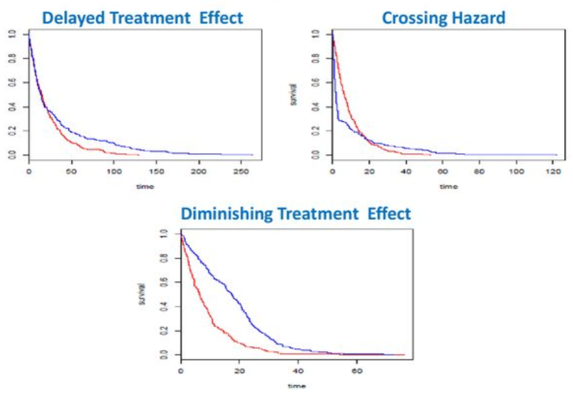

```{r setup, include=FALSE, echo = FALSE,message = FALSE, error = FALSE, warning = FALSE}
knitr::opts_chunk$set(echo = TRUE, fig.width = 10, fig.height = 6)

packages<-c("tidyverse", "kableExtra")

ipak <- function(pkg){
  new.pkg <- pkg[!(pkg %in% installed.packages()[, "Package"])]
  if (length(new.pkg)) 
    install.packages(new.pkg, dependencies = TRUE)
  sapply(pkg, require, character.only = TRUE)
}
ipak(packages)
 
 
setwd(dirname(rstudioapi::getSourceEditorContext()$path))
getwd()
Sys.setlocale("LC_ALL","English")
 

# List all files in the directory that start with "ssc" and end with ".R"
directory <- "./03_Functions/"
files_to_source <- list.files(path = directory, pattern = "^ssc.*\\.R$", full.names = TRUE)
# Source each file
for (file in files_to_source) {
  source(file)
}
```


# Introduction

Survival analysis, also known as time-to-event (TTE) analysis, is a statistical method used to estimate the time it takes for a specific event of interest to occur. This type of analysis is crucial in fields where timing is an essential factor, such as in clinical trials, where understanding the length of time until an event such as death, disease progression, or recurrence can guide treatment decisions and policy-making.

**Events in Survival Analysis**

- **Death (Overall Survival - OS):** Often considered the "gold standard," this measures the time from the start of the study until death from any cause.
- **Disease Progression (Progression-Free Survival - PFS):** This endpoint measures the time from the start of the study until the disease progresses or the patient dies from any cause, whichever occurs first.
- **Disease Occurrence/Recurrence:** The time until a disease first appears or reappears after a period of remission.
- **Symptom Expression:** Time until a particular symptom or set of symptoms appears.

Survival analysis is particularly prevalent in clinical areas such as oncology and cardiology, where understanding the progression of diseases over time is critical. These analyses help quantify the benefits of new treatments or interventions over standard care or placebos.

- **Oncology:** Often focuses on endpoints like OS and PFS to evaluate the effectiveness of cancer therapies.
- **Cardiology:** Might focus on time to cardiac events or death as a primary endpoint.

**Early vs. Late Stage Trials**

- **Early Stage Trials:** These may not use survival analysis extensively and might rely on response rates such as Objective Response Rate (ORR), which measures the proportion of patients whose tumor size reduces by a predefined amount and for a minimum time period.
- **Later Stage Trials:** Typically incorporate survival analysis to provide a more comprehensive assessment of a treatment's impact over time, especially for life-threatening diseases.


## Design Choices in Survival Analysis

The power of a survival analysis study is influenced by several design choices:

- **Study Design:**
  - **Parallel:** Compares two or more treatments simultaneously, typically with a control group.
  - **One-Arm:** Patients receive only one treatment, often used in early-phase trials where the main interest is in gauging a treatment's potential efficacy.
  - **Complex Designs:** May include crossover, factorial, or adaptive designs depending on the research question and practical considerations.

- **Statistical Methods:**
  - **Log-Rank Test:** A non-parametric test that compares the survival distributions of two groups. It's used when the hazard ratios are assumed to be constant over time.
  - **Cox Proportional Hazards Model:** Allows for the estimation of the hazard ratio between two or more groups while controlling for other variables that might affect the outcome.

- **Endpoints:**
  - **Hazard Ratio (HR):** A measure of how the hazard of the endpoint occurring in one group compares to the hazard in another group over the study period.
  - **Survival Time:** Often reported as median survival time, which is the time at which 50% of study participants have experienced the event of interest.

- **Survival Distributions:**
  - **Exponential Distribution:** Assumes a constant hazard over time. Simple to use but often unrealistic in clinical settings.
  - **Weibull Distribution:** A more flexible model that can accommodate increasing or decreasing hazard rates over time.
  
## Step-by-Step Approach

Sample size determination for survival analysis is an important aspect of designing studies that aim to investigate time-to-event outcomes. 

**1. Define Objectives**
First, clearly define the study objective. In survival analysis, this typically involves comparing survival times between two or more groups. For example, comparing the survival time of patients receiving a new treatment versus those receiving a standard treatment.

**2. Choose the Survival Function**
Determine which type of survival function or model will be used, such as the exponential, Weibull, or Cox proportional hazards model. The choice depends on the nature of the data and the specific assumptions each model holds.

**3. Determine Endpoint**
Identify the primary endpoint of the study, such as time until death, disease recurrence, or another event. This will also involve deciding how censored data (participants who leave the study early or do not experience the event by the end of the study) will be handled.

**4. Specify Effect Size**
Determine the effect size that is clinically meaningful. This could be a difference in median survival times between groups or a hazard ratio.

**5. Set the Parameters for Calculation**
- **Alpha (Type I error rate):** Typically set at 0.05, representing a 5% chance of falsely declaring a difference in survival.
- **Beta (Type II error rate):** Commonly set at 0.20, corresponding to an 80% power to detect a difference if one truly exists.
- **Accrual Time:** The period during which subjects are recruited and followed up.
- **Follow-up Time:** The time after the end of accrual, during which events are collected.

**6. Estimate Event Rate and Survival Probabilities**
Estimate the proportion of participants expected to experience the event in each group if you have prior data or studies to inform these estimates. Survival probabilities at specific time points (like 1-year or 5-year survival) are also useful.

**7. Adjust for Dropouts and Non-adherence**
Finally, adjust the initial sample size estimate to account for potential dropouts and non-adherence to treatment protocols to ensure that the study maintains sufficient power.

## Non-Proportional Hazards (NPH)

In survival analysis, the proportional hazards (PH) assumption is a cornerstone of commonly used methods like the log-rank test and the Cox proportional hazards model. This assumption implies that the hazard ratios between groups are constant over time. However, there are many situations, particularly with newer treatments like immunotherapies, where this assumption does not hold, leading to non-proportional hazards (NPH) scenarios.  


Non-proportional hazards occur when the hazard ratio between treatment groups changes over time. This can manifest in several ways:

- **Delayed Effects:** For instance, immunotherapies might not show benefit immediately after treatment begins but may become apparent after a certain period. This delay can result in a crossing hazard function, where the survival curves of treatment groups intersect.
- **Diminishing Effects:** The initial benefit of a treatment may diminish over time.
- **Violations Due to Covariates:** Changes in the effect of a covariate over time can also lead to violations of the PH assumption.




## Challenges with NPH

NPH scenarios pose significant challenges in the analysis and interpretation of clinical trial data, as traditional methods may lead to biased or inaccurate estimates of treatment effects. This can affect the statistical power and the type I error rate of a study, potentially leading to incorrect conclusions about a therapy's efficacy.

Due to the limitations of traditional PH-based methods in handling NPH scenarios, there is a growing interest in developing robust alternatives. Here are some approaches:

1. **Extended Cox Models:**
   - **Time-varying coefficients:** These models allow the effects of covariates (including treatment) to change over time, thus accommodating varying hazard ratios.
   - **Stratification:** This approach involves performing separate analyses within strata where the PH assumption holds.

2. **Flexible Parametric Models:**
   - Models such as Royston-Parmar can fit survival data with spline functions to capture complex hazard functions, accommodating varying hazard ratios more flexibly than traditional models.

3. **Landmark Analysis:**
   - This method involves selecting a point in time ("landmark") and analyzing only those patients who have survived to that point, thus focusing on different segments of the survival curve separately.

4. **Piecewise Exponential Models:**
   - These models assume that the hazard rate is constant within specified intervals but can change between intervals, allowing for different hazard ratios at different stages of follow-up.

5. **Cure Models:**
   - Sometimes used in scenarios where a proportion of patients is considered 'cured' and no longer at risk of the event. These models can separate the survival curves into a cured fraction and a susceptible fraction, accommodating delayed effects in the susceptible fraction.

**Ongoing Debate**

The debate over the best approach to handle NPH scenarios is ongoing. No single method can universally handle all types of non-proportional hazards effectively. The choice of method often depends on:
- The specific nature of the hazard function in the data.
- The clinical context and the mechanism of action of the treatment.
- The goal of the analysis (e.g., regulatory submission, exploratory research).


## Considerations

1. **Power for TTE related to several choices:**

   - **Design (Parallel, One-Arm, Complex):** This refers to the type of clinical trial design chosen. 
     - **Parallel** design involves multiple groups (e.g., a treatment group vs. a control group) being studied simultaneously.
     - **One-Arm** design involves only one group, usually receiving the treatment or intervention.
     - **Complex** design might involve multiple treatments, crossover between treatments, or multiple phases.
   - **Statistical Method (Log-Rank, Cox):** These are methods used to analyze TTE data.
     - **Log-Rank test** is used to compare the survival distributions of two groups.
     - **Cox proportional hazards model** is a regression model used to examine the effect of several variables on survival time simultaneously.
   - **Endpoint (Hazard Ratio, Survival Time):**
     - **Hazard Ratio (HR)** measures the effect of an intervention on the hazard or risk of an event occurring at any given point in time.
     - **Survival Time** refers to the time until an event (like death, disease progression) occurs.
   - **Survival Distribution (Exponential, Weibull):** These are statistical distributions used to model survival times.
     - **Exponential distribution** assumes a constant hazard rate over time.
     - **Weibull distribution** can model varying hazard rates over time.

2. **Power driven primarily by number of events (E) not sample size (N):**

   - In TTE analysis, the power to detect a difference or effect is more influenced by the number of events (e.g., deaths, disease recurrences) rather than just the number of participants. This is because the statistical significance in such analyses often depends more on the event occurrence across the follow-up period than the sheer number of participants.

3. **Calculating E separate from N:**

- **E** (number of events needed to achieve adequate power) is often determined separately from **N** (number of participants). This allows for a more nuanced understanding of what is required statistically to observe a meaningful difference or effect.
- **Recruitment Strategy**: How patients are enrolled over time, whether accrual is expected to be uniform or variable (accelerating towards the end or starting strong and tapering), impacts both the study timeline and its feasibility.
- **Study Length Considerations**:
  - **Event-Driven**: Waiting to reach a predetermined number of events before concluding the study, which can ensure sufficient data for robust conclusions but may prolong the study duration.
  - **Time-Driven**: Fixed study durations based on predefined time points, which can streamline operations and planning but might result in underpowered results if insufficient events have occurred.
  
  
4. **Accrual/Follow-up**

   - **Follow-up/Study Length:** The length of follow-up for each subject, which can be fixed or until a certain number of events occur, influences the censored data and overall study duration. The strategy chosen impacts how data censoring is handled, affecting statistical power and analysis.
   - **Accrual:** This refers to how participants are enrolled over time—whether accrual happens at a uniform rate or follows a more complex pattern like a truncated exponential. The accrual model affects the pace at which data is collected and the feasibility of study timelines.
   - **Dropout:** Addressing how dropout is modeled—either as a simple percentage or via more sophisticated survival-like models that estimate dropout as a function of time or hazard.
   - For complex trial designs, total follow-up time (the time period during which participants are observed) becomes critical because it impacts the number of events that can be observed.

5. **Survival Distribution/Effect Size**

   - Sample size calculations in TTE studies are focused on determining the number of subjects needed to observe a sufficient number of events to achieve statistical power.
   - **Survival/Distribution:** This includes parameters like the hazard rate, which might be constant or vary over time (piecewise), and the median survival time. Survival distributions such as exponential or Weibull are parametric forms used to estimate these characteristics.
   - **Effect Size Choice & Estimate:** Decisions on what effect size to measure, such as the hazard ratio, relative time differences between treatments, or survival time differences. These are crucial for defining the clinical relevance and statistical detectability of the trial outcomes.   

6. **Other Consideration:**

- A flexible meta-model is used to incorporate different aspects of a clinical trial, such as rate of participant accrual (how quickly participants are enrolled), dropout rates (how many leave the study before completion), and crossover (participants switching from one treatment group to another). This model helps in estimating both E and N realistically.
- **Use of Progression-Free Survival (PFS) for Accelerated Approval**
  - **Context**: In trials for rare diseases or conditions where quicker approvals are desirable, regulatory agencies might allow accelerated approval based on interim endpoints like PFS. This strategy enables faster access to treatments that show promise without waiting for final OS (Overall Survival) data.
  - **Application**: PFS as an endpoint can expedite drug approval processes, allowing for earlier patient access while continuing to monitor long-term benefits such as OS in a comprehensive manner.
- **Choice of Test Statistics: Hazard Ratios vs. Other Metrics**
  - **Hazard Ratios**: Commonly used due to their effectiveness in comparing the risk of an event between two groups over time. However, hazard ratios can be complex to interpret, especially in communicating how they translate into clinical benefit.
  - **Alternative Metrics**: Restricted Mean Survival Time (RMST) or other point estimates like survival proportions at specific times can be easier to communicate and may provide more directly interpretable clinical relevance.


# Log Rank Test (Freedman) 
 

**Reference**

* [PASS Reference](https://www.ncss.com/wp-content/themes/ncss/pdf/Procedures/PASS/Logrank_Tests-Freedman.pdf)
* [Online Calculator](https://homepage.univie.ac.at/robin.ristl/samplesize.php?test=logrank)
 
**Note:**

1. Sample size and power of the logrank test to be analyzed under the assumption of proportional hazards. 
2. Time periods are not stated (**without impact of accrual and follow-up time**). Rather, it is assumed that enough time elapses to allow  for a reasonable proportion of responses to occur. 
3. The formulas used in this  module come from Machin et al. (2018). They are also given in Fayers and Machin (2016) where they are  applied to sizing quality of life studies. They were originally published in Freedman (1982) and are often  referred to by that name.  **Freedman, L.S. 1982. 'Tables of the Number of Patients Required in Clinical Trials using the Logrank Test'.Statistics in Medicine, Vol. 1, Pages 121-129.**
4. The power calculations used here assume proportional hazards and are based on the number of events. 
5. In order to estimate sample sizes, an additional assumption is made that the underlying exponential distribution. First, the logrank test and the test derived  using the exponential distribution have nearly the same power when the data are in fact exponentially  distributed. Second, under the proportional hazards model (which is assumed by the logrank test), the  survival distribution can be transformed to be exponential and the logrank test remains the same under  monotonic transformations.


We assume that a study is to be made comparing the survival (or healing) of a control group with an  experimental group. The control group (group 1) consists of patients that will receive the existing treatment.  In cases where no existing treatment exists, the group 1 consists of patients that will receive a placebo. The  experimental group (group 2) will receive the new treatment.  We assume that the critical event of interest is death and that two treatments have survival distributions  with instantaneous death (hazard) rates, **𝜆1 and 𝜆2**. These hazard rates are a subject’s probability of death in  a short period of time.
 
There are several ways to compare two hazard rates. One is the difference, $\lambda_2-\lambda_1$. Another is the ratio, $\lambda_2 / \lambda_1$, called the hazard ratio.
$$
H R=\frac{\lambda_2}{\lambda_1}
$$
Note that since HR is formed by dividing the hazard rate of the experimental group by that of the control group, a treatment that has a smaller hazard rate than the control will have a hazard ratio that is less than one.

The hazard ratio may be formulated in other ways. If the proportions surviving during the study are called $S 1$ and $S 2$ for the control and experimental groups, the hazard ratio is given by
$$
H R=\frac{\log \left(S_2\right)}{\log \left(S_1\right)}
$$
Furthermore, if the median survival times of the two groups are $M 1$ and $M 2$, the hazard ratio is given by
$$
H R=\frac{M_1}{M_2}
$$

We assume that the logrank test will be used to analyze the data once they are collected. However, often Cox's proportional hazards regression is used to do the actual analysis. The power calculations of the logrank test are based on several other parameters
$$
z_{1-\beta}=\frac{|H R-1| \sqrt{N(1-w) \varphi\left[\left(1-S_1\right)+\varphi\left(1-S_2\right)\right] /(1+\varphi)}}{(1+\varphi H R)}-z_{1-\alpha / k}
$$
where $k$ is 1 for a one-sided hypothesis test or 2 for a two-sided test, $\alpha$ and $\beta$ are the error rates defined as usual, the $z^{\prime}$ s are the usual points from the standard normal distribution, $w$ is the proportion that are lost to follow up, and $\varphi$ represents the sample size ratio between the two groups.
$$
\varphi=\frac{N_2}{N_1}
$$
Note that the null hypothesis is that the hazard ratio is one, i.e., that
$$
H_0: \frac{\lambda_2}{\lambda_1}=1
$$

 
### Calculation in R (Survival Rate)

```{r,echo = T,message = FALSE, error = FALSE, warning = FALSE} 
ssc.logRank.Freedman <- function(S.trt, S.ctrl, sig.level = 0.05, power = 0.8, 
                        alternative = c("two.sided", "less", "greater"),
                        method = c("Freedman"),
                        pr=TRUE) {
  
  # FIXME: Relabel S.trt and S.ctrl as S.ctrl and S.trt
  alt <- match.arg(alternative)
  za <- if (alt == "two.sided") {
    stats::qnorm(sig.level / 2) 
  } else {
    stats::qnorm(sig.level)
  }
  zb <- stats::qnorm(1 - power)
  haz.ratio <- log(S.trt) / log(S.ctrl)
  if(pr)
    cat("\nHazard ratio:",format(haz.ratio),"\n")
  
  cat("Expected number of events:", 4 * (za + zb) ^ 2 / log(1 / haz.ratio) ^ 2)
  cat("\n")
  (((haz.ratio + 1) / (haz.ratio - 1)) ^ 2) * 
    (za + zb) ^ 2 / (2 - S.trt - S.ctrl)
}
ssc.logRank.Freedman(0.5,0.7,power = 0.817) 

# HR
# log(0.7) / log(0.5)
```
 
 
### Calculation in R (Median Survival)

Using an unstratified log-rank test at the one-sided 2.5% significance level, a total of 282 events would allow 92.6% power to demonstrate a 33% risk reduction (hazard ratio for RAD/placebo of about 0.67, as calculated from an anticipated 50% increase in median PFS, from 6 months in placebo arm to 9 months in the RAD001 arm).

With a uniform accrual of approximately 23 patients per month over 74 weeks and a minimum follow up of 39 weeks, a total of 352 patients would be required to obtain 282 PFS events, assuming an exponential progression-free survival distribution with a median of 6 months in the Placebo arm and of 9 months in RAD001 arm. With an estimated 10% lost to follow up patients, a total sample size of 392 patients should be randomized.

> Yao JC, Shah MH, Ito T, Bohas CL, Wolin EM, Van Cutsem E, Hobday TJ, Okusaka T, Capdevila J, de Vries EG, Tomassetti P, Pavel ME, Hoosen S, Haas T, Lincy J, Lebwohl D, Öberg K; RAD001 in Advanced Neuroendocrine Tumors, Third Trial (RADIANT-3) Study Group. Everolimus for advanced pancreatic neuroendocrine tumors. N Engl J Med. 2011 Feb 10;364(6):514-23. doi: 10.1056/NEJMoa1009290. PMID: 21306238; PMCID: PMC4208619. https://www.ncbi.nlm.nih.gov/pmc/articles/PMC4208619/

|     Significance Level (1-Sided)           |     0.025      |
|--------------------------------------------|----------------|
|     Placebo Median Survival (months)       |     6          |
|     Everolimus Median Survival (months)    |     9          |
|     Hazard Ratio                           |     0.66667    |
|     Accrual Period (Weeks)                 |     74         |
|     Minimum Follow-Up (Weeks)              |     39         |
|     Power % (under constant HR)            |     92.6       |


```{r,echo = T,message = FALSE, error = FALSE, warning = FALSE} 
# Load required library
library("powerSurvEpi")

# Define parameters
power <- 0.926
alpha <- 0.025  # One-sided significance level
k <- 74 / 52  # Accrual time in years
followup_time <- 39 / 52  # Minimum follow-up time in years
median_survival_placebo <- 6 / 12  # Median survival in years for placebo
median_survival_treatment <- 9 / 12  # Median survival in years for treatment
dropout_rate <- 0.10

# Calculate event rates assuming exponential survival
# Event Rates (pC, pE)**: These are derived from the median survival times assuming an exponential survival model.
pC <- log(2) / median_survival_placebo  # Event rate for placebo
pE <- log(2) / median_survival_treatment  # Event rate for treatment
RR <- 0.66667  # Risk reduction as hazard ratio

# Calculate the required sample size
sample_size <- ssizeCT.default(power = power, 
                               k = k + followup_time, # Total study duration including follow-up
                               pE = pE, 
                               pC = pC, 
                               RR = RR, 
                               alpha = alpha)

# Adjust for dropout
final_sample_size <- sample_size / (1 - dropout_rate)
final_sample_size <- ceiling(final_sample_size)  # Round up to the next whole number

# Output the calculated sample size
print(paste("Total sample size needed, accounting for dropout:", final_sample_size))

```

 
### Calculation in SAS (Median Survival)

```
proc power;
   twosamplelogrank
      test=logrank
      groupmedians = (6 9)   /* Median survival times in months */
      hazardratio = 0.66667  /* Hazard Ratio */
      accrualtime = 74/52     /* Accrual time in years */
      followuptime = 39/52    /* Follow-up time in years */
      sides = 1               /* One-sided test */
      power = 0.926           /* Desired power */
      alpha = 0.025           /* One-sided significance level */
      ntotal = .              /* Let SAS calculate required total sample size */
      groupweights = (1 1);   /* Equal weighting of groups */
run;
```


# Log Rank Test  


**Reference**

* (Power and Sample Size Calculations in Survival Data)[https://shariq-mohammed.github.io/files/cbsa2019/2-power-and-sample-size.html]
* [SAS TWOSAMPLESURVIVAL Statement](https://documentation.sas.com/doc/en/pgmsascdc/9.4_3.4/statug/statug_power_syntax104.htm)
* [SAS Proc Power Comparing Two Survival Curves](https://documentation.sas.com/doc/en/pgmsascdc/9.4_3.3/statug/statug_power_examples06.htm)

**Introduction**

One reason of log-rank tests are useful is that they provide an objective criteria (statistical significance) around which to plan out a study:

1. **How many subjects do we need?**
2. **How long will the study take to complete?**

In survival analysis, we need to specify information regarding the censoring mechanism and the particular survival distributions in the null and alternative hypotheses.

* First, one needs either to specify what parametric survival model to use, or that the test will be semi-parametric, e.g., the log-rank test. This allows for determining the number of deaths (or events) required to meet the power and other design specifications.
* Second, one must also provide an estimate of the number of patients that need to be entered into the trial to produce the required number of deaths.

We shall assume that the patients enter a trial over a certain accrual period of length $a$, and then followed for an additional period of time $f$ known as the follow-up time. Patients still alive at the end of follow-up are censored.

**Exponential Approximation**

In general, it is assumed we have constant hazards (i.e., exponential distributions) for the sake of simplicity. Because other work in literature has indicated that the power/sample size obtained from assuming constant hazards is fairly close to the empirical power of the log-rank test, provided that the ratio between the two hazard functions is constant. Typically in a power analysis, we are simply trying to find the approximate number of subjects required by the study, and many approximations/guesses are involved, so using formulas based on the exponential distribution is often good enough.


## Calculation in R 

**Reference**

* Peterson B, George SL: Controlled Clinical Trials 14:511–522; 1993.
* Lachin JM, Foulkes MA: Biometrics 42:507–519; 1986.
* Schoenfeld D: Biometrics 39:499–503; 1983.

Assumes exponential distributions for both treatment groups. Uses the George-Desu method along with formulas of Schoenfeld that allow estimation of the expected number of events in the two groups. To allow for drop-ins (noncompliance to control therapy, crossover to intervention) and noncompliance of the intervention, the method of Lachin and Foulkes is used.

For handling noncompliance, uses a modification of formula (5.4) of Lachin and Foulkes. Their method is based on a test for the difference in two hazard rates, whereas cpower is based on testing the difference in two log hazards. It is assumed here that the same correction factor can be approximately applied to the log hazard ratio as Lachin and Foulkes applied to the hazard difference.

Note that Schoenfeld approximates the variance of the log hazard ratio by 4/m, where m is the total number of events, whereas the George-Desu method uses the slightly better 1/m1 + 1/m2. Power from this function will thus differ slightly from that obtained with the SAS samsizc program.


```{r,echo = F,message = FALSE, error = FALSE, warning = FALSE} 
# library("Hmisc")
# The accrual period is 1.5y, with all patients followed at least 5y and some 6.5y.

# time at which mortalities estimated = 5
# total sample size (both groups combined) = 950
# 5-year mortality, control 18% = 0.18
# 5-year mortality, intervention 0.10
# duration of accrual period = 5
# minimum follow-up time = 1.5, 
# Drop-in rate (controls):10%
# Non-adherence rate (intervention):15%


ssc.logrank.Hmisc <- function(tref,   
                   n,     
                   mc,
                   mi,
                   accrual,
                   tmin,   
                   noncomp.c=0,
                   noncomp.i=0,
                   alpha=.05,  
                   nc, ni,
                   GeorgeDesu = TRUE,
                   pr=TRUE)
{
  if(mc>1)
    stop("mc (control group mortality ) should be a fraction")

  # Find mortality in intervention group
  # mi <- (1-r/100)*mc
  if(mi>1)
    stop("mi (intervention group mortality) should be a fraction")

  if(missing(nc) | missing(ni)) {
    nc <- n/2; ni <- n/2
  } else n <- nc+ni

  if(pr) {
    cat("\nAccrual duration:",accrual,"years  Minimum follow-up:",tmin,"years\n")
    cat("\nTotal sample size:",n,"\n")
    cat("\nAlpha=",alpha,"\n")
    d <- c("Control","Intervention")
    m <- c(mc,mi)
    names(m) <- d
    cat("\n",tref,"-year Mortalities (Events Rate)\n",sep=""); print(m)
  }

  # Find exponential hazards for all groups
  lamc <- -logb(1-mc)/tref
  lami <- -logb(1-mi)/tref

  if(pr) {
    lam <- c(lamc,lami)
    names(lam) <- d
    cat("\nHazard Rates\n");
    print(lam)
  }

  # Find probability that a subject will have her event observed during
  # the study, for all groups
  tmax <- tmin+accrual
  pc <- if(accrual==0)
          1-exp(-lamc*tmin)
        else
          1-1/accrual/lamc*(exp(-tmin*lamc)-exp(-tmax*lamc))
  
  pi <- if(accrual==0)
          1-exp(-lami*tmin)
        else
          1-1/accrual/lami*(exp(-tmin*lami)-exp(-tmax*lami))

  if(pr) {
    p <- c(pc,pi)
    names(p) <- d
    cat("\nProbabilities of an Event During Study\n")
    print(p)
  }

  # Find expected number of events, all groups
  mc <- pc*nc
  mi <- pi*ni

  if(pr) {
    m <- c(mc,mi)
    names(m) <- d
    cat("\nExpected Number of Events\n")
    print(round(m,1))
  }

  # Find expected value of observed log hazard ratio
  delta <- logb(lami/lamc)
  if(pr)
    cat("\nHazard ratio:",format(exp(delta)),"\n")

  if(noncomp.c+noncomp.i>0) {
    if(pr)
      cat("\nDrop-in rate (controls):",noncomp.c,
          "%\nNon-adherence rate (intervention):",noncomp.i,"%\n",sep="")
    
    delta <- delta * (1 - (noncomp.c+noncomp.i)/100)
    if(pr)
      cat("Effective hazard ratio with non-compliance:",
          format(exp(delta)),"\n")
  }

  # Find its variance
  # Schoenfeld approximates the variance of the log hazard ratio by 4/m, where m is the total number of events
  # George-Desu method uses the slightly better 1/m1 + 1/m2
  if(GeorgeDesu){
    v <- 1/mc + 1/mi
  } else{
    v <- 4/(mc + mi)
  }
  
  
  # Get same as /sasmacro/samsizc.sas if use 4/(mc+mi)

  sd <- sqrt(v)
  if(pr)
    cat("Standard deviation of log hazard ratio:",format(sd),"\n")
  
  if(GeorgeDesu){
    cat("Approximation method of variance of the log hazard ratio based on Peterson B, George SL: Controlled Clinical Trials 14:511–522; 1993.","\n", "\n")
  } else{
    cat("Approximation method of variance of the log hazard ratio based on Schoenfeld D: Biometrics 39:499–503; 1983.","\n","\n")
  }

  z <- -qnorm(alpha/2)

  c(Power = 1 - (pnorm(z - abs(delta)/sd) - pnorm(-z - abs(delta)/sd)))
}

ssc.logrank.Hmisc(tref=5,n=950,mc=0.18,mi=0.10,
                  accrual=1.5,tmin=5,
                  noncomp.c=10,noncomp.i=15)

ssc.logrank.Hmisc(tref=5,nc=450, ni=500,
                  mc=0.18,mi=0.10,
                  accrual=1.5,tmin=5,
                  noncomp.c=10,noncomp.i=15,GeorgeDesu = F)
```


## Calculation in SAS  

### Scenario 1

Patients will be accrued uniformly over two years   and then followed for an additional three years past the accrual period.   Some loss to follow-up is expected, with roughly exponential rates that   would result in about 50% loss with the standard treatment within 10 years.   The loss to follow-up with the proposed treatment is more difficult to predict,   but 50% loss would be expected to occur sometime between years 5 and 20.

```SAS
# time at event estimated = 2
# duration of accrual period = 2
# minimum follow-up time = 3
# Standard treatment: 50% loss with the standard treatment within 10 years
# Proposed treatment: 50% loss would be expected to occur sometime between years 5 and 20
# The "Standard" curve specifying an exponential form with a survival probability of 0.5 at year 5.
# The "Proposed" curve is a piecewise linear curve defined by the five points shown

proc power;
	twosamplesurvival test= logrank 
	accrualtime=2
	followuptime=3
	power = 0.8
	alpha = 0.05
	sides = 2 
	curve("Standard") = 5 : 0.5
	curve("Proposed") = (1 to 5 by 1):(0.95 0.9 0.75 0.7 0.6)
	groupsurvival = "Standard" | "Proposed"
	groupmedlosstimes = 10 | 20 5 
	npergroup = .;  
run;
```


### Scenario 2

1. 30% of placebo patients are sustained responders (exponential hazard =0.3567)
2. 45 or 50% for the treatment group (exp. hazard = 0.5978 or 0.6931)
3. Twice as many patients are on treatment as placebo 1:2 
		Groupweights statement 2:1 randomization ratio
4. All patients are enrolled at the beginning of the study with a 30% drop-out rate
		The dropout rate were also converted to group loss hazards in the same way. 
Therefore, the 30% dropout rate was corresponding to the group loss hazard of -ln(1-dropout rate)=-ln(1-0.3)=0.3567.

```SAS
data __NULL_;
	HR1 = -log(1-0.3);
	HR2a = -log(1-0.45);
	HR2b = -log(1-0.5);
	put HR1 HR2a HR2b;
run;
proc power;
	twosamplesurvival test=logrank
	/* Specify Analysis Information */
	accrualtime=2
	followuptime=3
	power = 0.8
	alpha = 0.05
	sides = 2
	/* Specify Effects */
	gexphs= 0.3567 | 0.5978 .6931
	groupweights = (2 1)
	/* Specify Loss Information */
	grouplossexphazards=(0.3567 0.3567)
	ntotal= .;
	plot y=power min=0.5 max=0.90;
run;
```

### Scenario 3

Clinical trial to assess new treatment for patients with chronic active hepatitis. 

1. Under standard treatment, 41% of patients survive beyond 5 years
2. Expect new treatment to increase survival beyond 5 years to 60%.

**Calculation**

* Event rate for standard treatment (Ec) = 1-0.41 = 0.59
*	Event rate for new treatment (Et) = 1-0.60 = 0.4
*	Since event rate E = 1 - exp(-t*HAZARD), we have HAZARD = -ln((1-E)/t   
*	The Hazard for standard treatment is HAZARDc=-ln(1-Ec)/t = -ln(1-0.59)/t = -ln(0.41)/t
*	The Hazard for new treatment is HAZARDt = -ln(1-Et)/t = -ln(1-0.40)/t = -ln(0.60)/t
*	The hazard ratio  = HAZARDt/HAZARDc = ln((0.6)/ln(0.41)=0.5729
*	T=5, the hazard for standard treatment is HAZARDc = -ln(0.41)/5 = 0.178

```SAS
proc power;
    twosamplesurvival test=logrank
	/* Specify Analysis Information */
    followuptime = 5
    totalTIME = 5
	power = 0.8
	alpha = 0.05
	sides = 2
	/* Specify Effects */
    hazardratio = 0.57
    refsurvexphazard=0.178
    ntotal = . ;
run;
```


### Scenario 4

* Accrual time is accepted as half of the total study time, which is equal to 5 years.
* Changing curve parameter to curve("Control") = (5):(0.8)will give the exponential distribution of the event

```SAS
proc power;
	 twosamplesurvival
	 test=logrank
	 curve("Control") = (0 5):(1 0.8)
	 curve("Treatment") = (0 5):(1 0.85)
	 refsurvival = "Control"
	 accrualtime = 2.5
	 followuptime = 2.5 
	 hazardratio = 1.373
	 alpha = 0.05
	 sides = 2
	 ntotal = .
	 power = 0.8;
 run;
```

### Scenario 5

**Piecewise linear survival curve**

1. The survival curve of patients for the existing treatment is known to be approximately exponential with a median survival time of 5 years
2. proposed treatment will yield a survival curve described by the times and probabilities
    + Time 1 0.95
    + Time 2 0.90
    + Time 3 0.75
    + Time 4 0.70
    + Time 5 0.60

```SAS
proc power;
      twosamplesurvival test=logrank
       curve("Existing Treatment") = 5 : 0.5
      curve("Proposed Treatment") = 1 : 0.95 2 : 0.90 3:0.75  4:0.70 5:0.60
      groupsurvival = "Existing Treatment" | "Proposed Treatment"
      accrualtime = 2
      FOLLOWUPTIME = 3
      power = 0.80
      alpha=0.05
      npergroup = . ;
run;
```

### Scenario 6

**Group sequential design with interim analyses**

the survival probability at 12 months are for standard and proposed groups are specified 
the statement of grouplossexphazards is used to account for the dropout rate.

```SAS
proc power;
      twosamplesurvival test=logrank
      curve("Standard") = 12 : 0.8781
      curve("Proposed") = 12 : 0.9012
      groupsurvival = "Standard" | "Proposed"
      accrualtime = 18
      Totaltime = 24
      GROUPLOSSEXPHAZARDS = (0.0012 0.0012)
      NSUBINTERVAL = 1
      power = 0.85
      ntotal = . ;
run;
```

# Log Rank Test with Competing Risk  

**Reference**

This procedure is based on the formulas presented in Pintilie (2006) and Machin et al. (2009), which are both  based on the original paper Pintilie (2002).  

* [Logrank Tests Accounting for Competing Risks](https://www.ncss.com/wp-content/themes/ncss/pdf/Procedures/PASS/Logrank_Tests_Accounting_for_Competing_Risks.pdf)
* Machin, D., Campbell, M.J., Tan, S.B., Tan, S.H. 2009. Sample Size Tables for Clinical Studies, Third Edition. Wiley-Blackwell, Chichester, United Kingdom.
* Pintilie, M., 2006. Competing Risks: A Practical Perspective. John Wiley & Sons, Chichester, United Kingdom.
* Pintilie, M., 2002. 'Dealing with Competing Risks: Testing Covariates and Calculating Sample Size'. Statistics in Medicine, Volume 21, pages 3317-3324.

**Introduction**

Logrank test is  used to compare the two survival distributions because it is easy to apply and is usually more powerful than  an analysis based simply on proportions. It compares survival across the whole spectrum of time, not at just  one or two points, and accounts for censoring.  

When analyzing time-to-event data and calculating power and sample size, a complication arises when  individuals in the study die from risk factors that are not directly related to the risk factor of interest. For  example, a researcher may wish to determine if a new drug for some disease improves patient survival time  when compared to a standard treatment. Therefore, the researchers would be interested to know how long  each patient lives until he or she dies from the disease. However, during the course of the study, patients  may also die from other risks such as myocardial infarction, diabetes, or even an accident. **When a patient dies from one of these other risk factors, then the main event of interest cannot be observed, so the true  time-to-event of the disease for that patient can never be determined.** 

**Power Overestimated**

If the results are not adjusted, then the power calculated for the logrank test of the main event of  interest may be grossly overestimated, depending on the incidence of competing risks 

**Assumptions**

The power and sample size calculations in the module for the logrank test are based on the following
assumptions:

1. Failure times for the event of interest and competing risks are independent.
2. Failure times are exponentially distributed.
3. Uniform entry of subjects into the trial during the accrual period.

**Details**

The hazard rates for the event of interest and competing risks in group $i$ are calculated from the cumulative survival functions as
$$
\begin{aligned}
& h_{e v, i}=\left(\frac{-\ln \left(S_{e v, i}(T 0)\right)}{T 0}\right) \\
& h_{c r, i}=\left(\frac{-\ln \left(S_{c r, i}(T 0)\right)}{T 0}\right)
\end{aligned}
$$
The hazard ratio used in power calculations is calculated from the hazard rates for the event of interest as
$$
H R=\left(\frac{h_{e v, 2}}{h_{e v, 1}}\right)
$$
the hazard rate for the treatment group divided by the hazard rate for the control group. The hazard rates may be calculated using cumulative survival proportions or cumulative incidences as described above.

Then we can calculate Probability of Event and Number of Event

**Probability of Event**

With the hazard rates for the event of interest and competing risks, the probability of observing the event of interest in a subject in group $i, P r_{e v, i}$, is given as
$$
P r_{e v, i}=\frac{h_{e v, i}}{h_{e v, i}+h_{c r, i}}\left(1-\frac{\exp \left\{-(T-R) \times\left(h_{e v, i}+h_{c r, i}\right)\right\}-\exp \left\{-T \times\left(h_{e v, i}+h_{c r, i}\right)\right\}}{R \times\left(h_{e v, i}+h_{c r, i}\right)}\right),
$$
where $T$ is the total time of trial and $R$ is the accrual time. The follow-up time is calculated from $T$ and $R$ as
$$
\text { Follow-Up Time }=T-R \text {. }
$$
The overall probability of observing the event of interest during the study in both groups is given as
$$
P r_{e v}=p_1 P r_{e v, 1}+\left(1-p_1\right) P r_{e v, 2}
$$
where $p_1$ is the proportion of subjects in group 1 , the control group.

**Number of Events**

When dealing with time-to-event data, it is the number of events observed, not the total number of subjects that is important to achieve the specified power. The total required number of events (for the event of interest), $E$, is calculated from the total sample size $N$ and $P r_{e v}$ as
$$
E=N \times P r_{e v}
$$
The number of events in group $i$ is calculated as
$$
E_i=n_i \times P r_{e v, i}
$$
where $n_i$ is the sample size for the $i^{i \text { th }}$ group.


**Power and Sample Size Calculations**

Assuming an exponential model and independence of failure times for the event of interest and competing
risks, Pintilie (2006) gives the following equation relating E (total number of events for the risk factor of interest) and power:

$$
z_{1-\beta}=\sqrt{E \times p_1\left(1-p_1\right)} \log (H R)-z_{1-\alpha / 2}
$$
with

* $\alpha \quad$ probability of type I error
* $\beta \quad$ probability of type II error
* $z_{1-\alpha / 2}$ standard normal quantile for $1-\alpha / 2$
* $z_{1-\beta} \quad$ standard normal quantile for $1-\beta$
* $E \quad$ total number of events for the risk factor of interest
* $p_1 \quad$ proportion of subjects in group 1, the control group
* HR hazard ratio to detect

This power formula indicates that it is the total number of events observed, not the number of subjects that is critical for achieving the desired power for the logrank test.

The power formula can be rearranged to solve for $E$, the total number of events required. The formula is
$$
E=\left(\frac{1}{p_1\left(1-p_1\right)}\right) \times\left(\frac{z_{1-\alpha / 2}+z_{1-\beta}}{\log (H R)}\right)^2 .
$$
The overall sample size can be computed from $E$ and $P r_{e v}$ as
$$
N=\frac{E}{P r_{e v}}=\left(\frac{1}{p_1\left(1-p_1\right) \times P r_{e v}}\right) \times\left(\frac{z_{1-\alpha / 2}+z_{1-\beta}}{\log (H R)}\right)^2 .
$$
The individual group sample sizes are calculated as
$$
\begin{aligned}
& n_1=N \times p_1, \\
& n_2=N \times\left(1-p_1\right),
\end{aligned}
$$
where $p_1$ is the proportion of subjects in group 1 , the control group.


### Calculation in R 

```
Alternative Hypothesis: Two-Sided
Alpha: 0.05
R (Accrual Time): 3
T-R (Follow-Up Time): 2 
T0 (Fixed Time Point): 3
Sev1(T0) (Control): 0.5
HR (Hazard Ratio = hev2 / hev1): 0.5
Scr1(T0) (Control): 0.4
Percent in Group 1: 50
Power: 0.6162274
Total Power (N): 150
```

```{r,echo = F,message = FALSE, error = FALSE, warning = FALSE} 
ssc.logrank.comprisk(S_ev1 = 0.50, 
                     S_ev2=0.7071068,
                     S_cr=0.4, 
                     P1=0.5, 
                     P2=0.5, 
                     T=5, 
                     R=3,
                     alpha=0.025,
                     power=0.6162274,
                     pr=T)
```
 
**With Interim Analysis**

```{r,echo = F,message = FALSE, error = FALSE, warning = FALSE} 
t <- 0.83
alpha <- 0.025
Power <- 0.9
HighRisk <- 0.527
LowRisk <- 0.85
CompetingRisk <- 0.05
S_cr <- 1-CompetingRisk
HighDist <- 0.9

ssc.logrank.comprisk.IA(alpha=alpha, Power=Power, S_ev1 = HighRisk, S_ev2=LowRisk,
S_cr=S_cr, P1=HighDist, P2=1-HighDist, T=5.0000000001, R=0.0000000001)
```


# Non-Proportional Hazards Methods

| Method                          | Description                                                                                                                       |
|---------------------------------|-----------------------------------------------------------------------------------------------------------------------------------|
|     Log-Rank                    |     “Average Hazard Ratio” – same as from univariate Cox Regression   model                                                       |
|     Linear-Rank   (Weighted)    |     Gehan-Breslow-Wilcoxon, Tarone-Ware, Farrington-Manning,   Peto-Peto, Threshold Lag, Modestly Weighted Linear-Rank (MWLRT)    |
|     Piecewise   Linear-Rank     |     Piecewise Parametric, Weighted Piecewise Model (e.g. APPLE),   Change Point Models                                            |
|     Combination                 |     Maximum   Combination (MaxCombo) Test Procedure                                                                               |
|     Survival Time               |     Milestone   Survival (KM), Restricted Mean Survival Time, Landmark Analysis                                                   |
|     Relative Time               |     Ratio of Times to Reach Event Proportion, Accelerated Failure Time   Models                                                   |
|     Others                      |     Responder-Based, Frailty Models, Renyi Models, Net Benefit (Buyse)                                                            |


## Maximum Combination (MaxCombo) Test Overview

**1. Concept:**
   - The MaxCombo test is designed to handle multiple linear-rank tests simultaneously and to select the "best" test from the candidate tests. This approach helps in controlling Type I error rates while still allowing flexibility in the choice of statistical tests.

**2. Test Variants:**
   - Various forms of the Fleming-Harrington family of tests (denoted as F-H(G) Tests) are used, each specified by different parameterizations (`G(p,q)`) that emphasize different portions of the survival curve. For example, some may focus more on early failures while others on late failures.

|     F-H (G) Tests                    |     Proposal                       |
|--------------------------------------|------------------------------------|
|     G(0,1; 1,0)                      |     Lee (2007)                     |
|     G(0,0*; 0,1; 1,0)                |     Karrison   (2016)              |
|     G(0,0; 0,1; 1,0; 1,1)            |     Lin et al (2020)               |
|     G(0,0; 0,0.5; 0.5,0; 0.5,0.5)    |     Roychoudhury et al (2021)      |
|     G(0,0; 0,0.5)                    |     Mukhopadhyay   et al (2022)    |
|     G(0,0; 0,0.5; 0.5,0)             |     Mukhopadhyay   et al (2022)    |

**3. Common Usage:**
   - Typically, 2-4 candidate tests are considered with Fleming-Harrington being popular due to its flexibility. It can accommodate Log-Rank and Peto-Peto tests, among others, allowing researchers to tailor the analysis to the specific characteristics of their survival data.

**Issues with MaxCombo Tests**

**1. Type I Error and Estimand:**
   - Critics point out that MaxCombo tests, while versatile, can sometimes lead to significant results even when the treatment effect is not better than the control across all times. This can mislead the conclusions about a treatment’s efficacy, especially if it is only effective late in the follow-up period (late efficacy).

**2. Interpretability:**
   - There are concerns about the interpretability of using an average hazard ratio as the estimand because it might not accurately reflect the dynamics of the treatment effect over time, particularly under non-proportional hazards scenarios.

**3. Alternatives for Improvement:**
   - Modifications to the Fleming-Harrington weights (`G(p,q)` parameters) are suggested to better handle scenarios with non-proportional hazards. For example, changing the focus from early to late survival times can be achieved by adjusting these parameters.

**4. Communication of Results:**
   - It's recommended to use the MaxCombo for analytical purposes but to communicate the results using more interpretable measures such as the Restricted Mean Survival Time (RMST), which provides a direct, clinically meaningful measure of survival benefit.


# One Sample Log-Mean Method  

**Reference**

* (Power and Sample Size Calculations in Survival Data)[https://shariq-mohammed.github.io/files/cbsa2019/2-power-and-sample-size.html]

**Introduction**

We will use $\hat{\theta}$ as our test statistic, and reject $H_0$ in favor of $H_A$ if $\hat{\theta}>k$ for some constant $k$.
- The significance level of the test, or Type I error rate, is $\alpha=P\left(\hat{\theta}>k \mid \theta=\theta_0\right)$.
。 If $Z=\frac{\hat{\theta}-\theta}{1 / \sqrt{d}}$, then we have $\alpha=P\left(Z>\frac{k-\theta_0}{1 / \sqrt{d}}\right)$.
。 Let $\Phi\left(z_\alpha\right)=1-\alpha$, then $z_\alpha=\frac{k-\theta_0}{1 / \sqrt{d}}$ and hence $k=\theta_0+\frac{z_\alpha}{\sqrt{d}}$.
- The power of the test is given by
$$
1-\beta=P\left(\hat{\theta}>k \mid \theta=\theta_A\right)=P\left(Z>\frac{k-\theta_A}{1 / \sqrt{d}}\right)
$$
- Solving for $d$ we have
$$
\begin{gathered}
z_{1-\beta}=-z_\beta=\sqrt{d}\left(k-\theta_A\right)=\sqrt{d}\left(\theta_0+\frac{z_\alpha}{\sqrt{d}}-\theta_A\right) \\
\Rightarrow d=\frac{\left(z_\beta+z_\alpha\right)^2}{\left(\theta_A+\theta_0\right)^2}=\frac{\left(z_\beta+z_\alpha\right)^2}{(\log \Delta)^2} .
\end{gathered}
$$

**Probability of Event**

Calculate patient/subject needed based on **Probability of Event**

We need to provide an estimate of the proportion $\pi$ of patients who will die by the time of analysis.
- If all patients entered at the same time, we would simply have $\pi=1-S_\lambda(t)$, where $t$ is the follow-up time.
- However, patients actually enter over an accrual period of length $a$ and then, after accrual to the trial has ended, they are followed for an additional time $f$.
- So a patient who enters at time $t=0$ will have failure probability $\pi(0)=1-S_\lambda(a+f)$ as this patient will have the maximum possible follow-up time $a+f$.
- Similarly, for any patient who enters at a time $t \in[0, a]$, the failure probability $\pi(t)=1-S_\lambda(a+f-t)$.
- Assuming that the patients enter uniformly between times 0 and $a$, the probability of death can be computed as
$$
\pi=\int_0^a \frac{1}{a}\left[1-S_\lambda(a+f-t)\right] d t .
$$
- Assuming $S_\lambda(t)=e^{-\lambda t}$, we have
$$
\pi=1-\frac{1}{a \lambda}\left[e^{-\lambda f}-e^{-\lambda(a+f)}\right] .
$$


## Calculation in R (Event)

Suppose that we are designing a Phase II oncology trial where we plan a 5% level (one-sided) test, and we need 80% power to detect a hazard ratio of 1.5. We can find the required number of deaths as follows:

```{r,echo = T,message = FALSE, error = FALSE, warning = FALSE} 
# Log-mean based approach
# Expected number of events
ssc.onesample.logMean(HR = 1.5, sig.level = 0.05, power = 0.8)
```


## Calculation in R (Patient)

We wanted to design a Phase II oncology trial where we plan a $5 \%$ level (one-sided) test, and we need $80 \%$ power to detect a hazard ratio of 1.5 .

Suppose that $\lambda_0=0.15$, then we have $\lambda_A=\lambda_0 / \Delta=0.1$. Assume accrual period $a=2$ years and follow-up time $f=3$ years.
The probability of death under $H_A: \lambda=0.1$ is computed as:

```{r,echo = T,message = FALSE, error = FALSE, warning = FALSE} 
ssc.onesample.logMean2(HR = 1.5, sig.level = 0.05, power = 0.8, lambda=0.10, accrual=2, followup=3)
```


# One Sample Likelihood-Ratio Based Approach

**Reference**

* (Power and Sample Size Calculations in Survival Data)[https://shariq-mohammed.github.io/files/cbsa2019/2-power-and-sample-size.html]

**Introduction**

For fixed $d, V=\sum t_i \sim \operatorname{Gamma}(d, \lambda)$ and it is known ${ }^2$ that
$$
W=\frac{2 d \lambda}{\hat{\lambda}} \sim \chi_{2 d}^2
$$
although this result is approximate for general censoring patterns.
Under $H_0: \lambda=\lambda_0$, we need to find a constant $k$ such that $\alpha=P\left(1 / \hat{\lambda}>k \mid \lambda=\lambda_0\right)=P\left(W>2 d k \lambda_0\right)$. Thus we have $\chi_{2 d, \alpha}^2=2 d k \lambda_0$ and hence $k=\frac{\chi_{2 d_d \alpha}^2}{2 d \lambda_0}$.
The power of the test is given by
$$
1-\beta=P\left(1 / \lambda>k \mid \hat{\lambda}=\lambda_A=P\left(W>2 d k \lambda_A\right)\right) .
$$
We have $\chi_{2 d, 1-\beta}^2=2 d k \lambda_A \Rightarrow \chi_{2 d, 1-\beta}^2=\frac{\chi_{2 d, \alpha}^2 \lambda_A}{\lambda_0}$, hence $\Delta=\frac{\lambda_0}{\lambda_A}=\frac{\chi_{2 d, \alpha}^2}{\chi_{2 d, 1-\beta}^2}$. For specified $\alpha$, power $1-\beta$, and ratio $\Delta$, we may solve this for the required number of deaths, $d$.

$\Delta$ can be computed using the following function:

```R
expLikeRatio = function(d, alpha, pwr){
  num = qchisq(alpha, df=(2*d), lower.tail=F)
  denom = qchisq(pwr, df=(2*d), lower.tail=F)
  Delta = num/denom
  Delta
}
```

To get the number of deaths $d$ for a specified $\Delta$, we define a new function $L R(d)=\frac{\chi_{2 d, \alpha}^2}{\chi_{2 d, 1-\beta}^2}-\Delta$. The solution for $L R(d)=0$ is the required number of deaths and is computed as:

```R
expLRdeaths = function(Delta, alpha, pwr){
  LR = function(d, alpha, pwr, Delta){
    expLikeRatio(d, alpha, pwr) - Delta
  }
  # Find the root for the function LR(d)
  result = uniroot(f = LR, lower = 1, upper = 1000,
                   alpha = alpha, pwr = pwr, Delta = Delta)
  result$root
}
```


### Calculation in R 


Suppose that we are designing a Phase II oncology trial where we plan a 5% level (one-sided) test, and we need 80% power to detect a hazard ratio of 1.5. We can find the required number of deaths as follows:

```{r,echo = T,message = FALSE, error = FALSE, warning = FALSE} 
ssc.onesample.LR(HR = 1.5, sig.level = 0.05, power = 0.8)
```


 

# One Sample Non-Parametric 

**Introduction**

1. The one-sample log-rank test, first proposed by Breslow  (1975), allows for the comparison of the survival curve of a  new treatment arm with that of a historical control.
2. Non Parametric method calculate either estimates of accrual or power for null and alternative survival functions based on either design specifications of survival probability or median survival. 
3. The test statistic for survival probability is assumed to be based on the non-parametric estimate of the survival distribution. For median survival, a Brookmeyer-Crowley like test assumed. 
4. [Ref](Nagashima K, Noma H, Sato Y, Gosho M. Sample size calculations for single-arm survival studies using transformations of the Kaplan–Meier estimator. Pharmaceutical Statistics 2020. In press. DOI: 10.1002/pst.2090. [arXiv:2012.03355])

* [Online Calculator 1](https://nshi.jp/en/js/onesurvyr/)
* [Online Calculator 2][https://stattools.crab.org/Calculators/oneNonParametricSurvival.htm]


# Survival Group Sequential Design

## Complex Group Sequential Design

1) What “power for survival analysis” depends on

When the endpoint is time-to-event (TTE), power depends on choices you make up front:

* **Design**: two-arm parallel, one-arm, or more complex (e.g., stratified, cluster, group-sequential).
* **Test/estimator**: log-rank test or Cox PH model (asymptotically equivalent for PH).
* **Effect measure**: usually a **hazard ratio (HR)**; sometimes a survival probability at a milestone or an RMST difference when hazards are non-proportional.
* **Assumed survival model**: exponential (constant hazard), Weibull/piecewise exponential (time-varying hazard), or other.

**Core message:** for log-rank/Cox designs, **power is driven primarily by the number of events (E), not the raw sample size (N).** Extra participants who never have the event (because follow-up is short or dropout is high) add little information.

---

2) **Why survival GSDs are trickier than in fixed-sample or continuous outcomes**

+ Unknown follow-up means more interim planning uncertainty
  * Can be difficult to predict time when interim analysis will occur
  * Higher numbers likely in active cohort when interim analysis occurs
  * PFS or OS at each look
  * Planning USSR? – Freidlin & Korn 2017

+ Survival GSDs often require additional assumptions
  * Assume constant effect? NPH?

+ Interim Events dependant on two factors
  * Increase sample size – Biases early trends
  * Increase time – Biases later trends

---

In details

* **Unknown follow-up times** → more uncertainty in interim planning.

  * In GSDs for binary/continuous outcomes, you can often forecast when an interim will occur because data accrual is tied directly to recruitment.
  * In survival analysis, **information accrual** depends on **events**, and the timing of events is variable.
  * **Example**: If recruitment is ahead of schedule, many participants may still be “event-free” at an interim, lowering the observed information fraction.

---

* **Timing of interim looks** is hard to predict.

  * **First look** may occur later/earlier than expected if event rate is slower/faster.
  * The proportion of patients still on study (active cohort) at the interim can be higher than planned, especially early in the trial.

---

* **Endpoint choice at interim** matters.

  * **PFS (progression-free survival)** can mature earlier than **OS (overall survival)**; deciding which to use for the interim is part of the design.
* **Planning USSR (Unequal Sample Size Ratios)** — referring to approaches like Freidlin & Korn (2017) for handling unequal numbers of subjects/events at different looks.

---

**Extra assumptions often needed**

* To plan sample size and stopping boundaries, survival GSDs typically assume:

  * **Proportional hazards (constant treatment effect)** — easier to model, but may be violated in reality.
  * **NPH (non-proportional hazards)** handling requires alternative methods (e.g., weighted log-rank, piecewise models), which complicates design.

---

**Interim events depend on two factors**

1. **Sample size** at the time of interim.

   * If you increase sample size (by faster accrual or extension), early trends can be biased — e.g., treatment effect may appear better or worse due to immature follow-up.
2. **Follow-up time** for accrued patients.

   * More follow-up yields more events, but if late events differ in hazard ratio from early events (due to delayed effects, crossing hazards, etc.), the interim trend may be biased relative to final.
   
---

Therefore, in summary, there is a **real risk** of the study being **underpowered**—failing to detect a true treatment effect—even when one exists. This risk is heightened not only by statistical uncertainties but also by **logistical challenges**:

1. **Uncertain timing of interim analyses**

   * The number of events needed to trigger an interim analysis is unpredictable because event accrual depends on patient follow-up and disease progression, not just recruitment.
   * Beyond simply knowing *when* an interim will occur, the trial team must also decide *what* endpoint to analyze at each look—e.g., **Progression-Free Survival (PFS)** vs. **Overall Survival (OS)**.
   * Choosing PFS can lead to earlier data maturity, while OS may require longer follow-up.

2. **Event counts in the active cohort**

   * At each interim analysis, the number of ongoing participants (“active cohort”) who have not yet reached the event can be large, especially early in the trial.
   * This needs to be factored into power calculations and statistical boundaries.

3. **Sample size re-estimation (SSR) in survival settings**

   * Adaptive designs sometimes include SSR, but in survival trials, interim access to **the shape of survival curves** can raise **trial integrity concerns** (Freidlin & Korn, 2017).
   * If SSR is based on observed event rates, care must be taken to avoid bias or perceptions of bias.

4. **Additional assumptions for design and analysis**

   * Common survival GSD designs assume **proportional hazards** (constant treatment effect over time).
   * If **non-proportional hazards (NPH)** are present—e.g., delayed treatment effect or crossing survival curves—these assumptions break down, requiring more complex modeling (e.g., weighted log-rank tests or time-varying Cox models).
   * Simulation is often invaluable to assess the robustness of the design under different hazard patterns.

5. **Two main ways to increase events at interim**

   * **Increase sample size** → yields more events quickly but can bias estimates toward **early trends** in the data.
   * **Increase follow-up time** → yields later events but may bias toward **late-trial trends**.
   * Both strategies can shift the apparent treatment effect depending on when hazards differ most.

**Take-home point:**
Survival GSDs require careful **assumption setting**, **simulation-based planning**, and **boundary adjustments** to handle the intertwined effects of sample size, follow-up time, endpoint choice, and hazard structure. Failure to address these factors can lead to underpowered or misleading results—even if a real effect exists.
 
  
## Survival Group Sequential Design Simulation

### Introduction

In survival trials, **Group Sequential Designs** introduce specific complications not present in simpler settings.
Because **follow-up times are uncertain**, it is difficult to predict when interim analyses will occur. This uncertainty affects:

* The number of events available at each interim look (often higher in the active arm at the time of analysis).
* Decisions about which endpoint to analyze at each look (e.g., Progression-Free Survival vs. Overall Survival).
* The integrity of trial operations if interim survival curve shapes become known, especially in sample size re-estimation contexts (Freidlin & Korn, 2017).

Survival GSDs also require **additional statistical assumptions**:

* Whether the treatment effect is constant or if **non-proportional hazards** (NPH) exist.
* The effect of increasing **sample size** (biases toward early trends) or extending **follow-up time** (biases toward later trends) to boost events.
 

Given these complexities, **simulation** is an invaluable tool.
By generating *synthetic trial data*, GSD simulation allows:

1. **Verification of the planned design** (closed-form assumptions):

   * Type I error (α), Power (1–β), Expected sample size, Stopping time.
   * Validation of statistical boundaries and stopping rules.
2. **Exploration of “what-if” scenarios**:

   * Alternative treatment effects (larger/smaller than planned).
   * Changes to interim analysis timing or information fractions.

Simulations overcome some constraints of purely analytical formulas and are easier to communicate to non-statistical stakeholders.

---

**Regulatory Alignment**

Regulators strongly support simulation for adaptive and complex designs.
ICH E20 Section 5.2 specifically advises that simulation studies:

* Clearly define and focus on **key objectives**.
* Assess **key operating characteristics** aligned with the trial’s decision-making needs.
* Include a **plausible range of scenarios** to robustly evaluate performance.

This regulatory endorsement reinforces simulation as a core part of designing, validating, and defending complex survival GSDs.

---

**In short:**
Survival GSDs are challenging due to unpredictable event timing, endpoint choice, bias risks, and the need for strong assumptions. Simulation provides a practical and regulator-endorsed way to validate designs, explore alternatives, and ensure trial integrity under a wide range of real-world conditions.


### Considerations

 

**Step 1 – Generating Model Assumptions**

* Define the **target population size** and **accrual process**: total planned subjects, accrual rate (per month/quarter), accrual duration.
* Specify **dropout processes** and rates (random loss to follow-up, treatment discontinuations).
* Identify key **event processes**: hazard rates, proportional hazards assumption (PH) vs. non-proportional hazards (NPH), competing risks if applicable.
* Justify parameter values using literature, prior trials, or registry data.

---

**Step 2 – Survival Design Assumptions**

* **Type of follow-up**: fixed follow-up for all participants or variable follow-up depending on enrollment date.
* **Maximum follow-up time** or administrative censoring rules.
* Number of **time points** or interim analyses to evaluate.
* Structure of accrual and dropouts over time (e.g., constant, ramp-up, seasonal patterns).

---

**Step 3 – GSD Assumptions**

* Select group sequential design **type** (e.g., O’Brien-Fleming, Pocock, Lan-DeMets).
* Define stopping rules for **efficacy**, **futility**, or both.
* State the desired **Type I error (α)** and **power (1–β)**.
* Account for possible bias if design changes after start (adaptive elements).

---

**Step 4 – Boundary / Information Assumptions**

* Determine **information fractions** for each interim look (e.g., 33%, 67%, 100% of planned events).
* Define statistical boundaries for decision-making (upper/lower Z or p-value limits).
* Set maximum number of events and/or maximum follow-up time before the final analysis.
* Plan how to handle event timing uncertainty (e.g., variability in actual information fraction).

---

**Step 5 – Simulation Control Assumptions**

* Decide number of simulated trials (e.g., 10,000 runs) for stable estimates of Type I error, power, expected sample size, and stopping time.
* Specify random seed control for reproducibility.
* Define output metrics: probability of stopping at each look, average information at stopping, empirical power, Type I error, bias in estimates.

---

**Key Design Questions**

**1. How to justify population assumptions?**

* Use **historical data** from prior trials in the same indication and patient population.
* Consult **disease registries** or epidemiological studies for event rates and dropout patterns.
* Where uncertainty exists, run **sensitivity analyses** across plausible ranges.
* Engage clinical experts to ensure assumptions are medically credible, not just statistically convenient.

---

**2. How to avoid extrapolation issues?**

* Avoid projecting beyond the observed follow-up or accrual patterns from historical data unless clinically justified.
* If extrapolation is needed (e.g., for long-term survival), test **multiple survival models** (Exponential, Weibull, log-logistic) to see if conclusions change.
* Apply **calibration checks** — ensure simulated event curves match known real-world data in the early and mid-term before trusting long-term projections.
* Document limitations transparently in the trial design report.

---

**3. How to model the survival / accrual process?**

* **Survival process**:

  * Start with a baseline hazard function (Exponential for constant hazard, Weibull for time-varying hazard, piecewise exponential for flexible shapes).
  * Incorporate hazard ratio for treatment effect; test proportional hazards vs. NPH patterns (e.g., delayed effect, crossing hazards).
  * Optionally include competing risks if relevant.
* **Accrual process**:

  * Model constant-rate accrual, stepped increases/decreases, or seasonal patterns depending on operational expectations.
  * Allow for staggered site activation to mimic real recruitment behavior.
* **Dropout process**:

  * Random dropout (constant hazard) or time-dependent dropout rates.
  * Ensure dropouts are independent of treatment effect unless modeling informative censoring.
 
 


# Reference

* Chow S, Shao J, Wang H. 2008. Sample Size Calculations in Clinical Research. 2nd Ed. Chapman & Hall/CRC Biostatistics Series. 

## Survival Analysis
 

1. Cox, D. R., & Oakes, D. (1984). *Analysis of survival data*. CRC Press.

2. Cox, D. R. (1972). Regression models and life‐tables. *Journal of the Royal Statistical Society: Series B (Methodological)*, 34(2), 187-202.

3. Collett, D. (2015). *Modelling survival data in medical research*. CRC Press.

4. Fleming, T. R., & Harrington, D. P. (2013). *Counting processes and survival analysis*. John Wiley & Sons.

5. Klein, J. P., Van Houwelingen, H. C., Ibrahim, J. G., & Scheike, T. H. (Eds.). (2016). *Handbook of survival analysis*. CRC Press.

6. Andersen, P. K., Borgan, O., Gill, R. D., & Keiding, N. (2012). *Statistical models based on counting processes*. Springer Science & Business Media.

7. Lin, H., & Zelterman, D. (2002). *Modeling survival data: Extending the Cox model*. Springer.

8. Klein, J. P., & Moeschberger, M. L. (2003). *Survival analysis: Techniques for censored and truncated data*. Springer.

9. Lemeshow, S., May, S., & Hosmer Jr, D. W. (2011). *Applied survival analysis: Regression modeling of time-to-event data*. John Wiley & Sons.

10. Aalen, O., Borgan, O., & Gjessing, H. (2008). *Survival and event history analysis: A process point of view*. Springer Science & Business Media.

11. U.S. Food and Drug Administration. (2018). *Clinical Trial Endpoints for the Approval of Cancer Drugs and Biologics*. Retrieved from [http://www.fda.gov/downloads/Drugs/GuidanceComplianceRegulatoryInformation/Guidances/ucm071590.pdf](http://www.fda.gov/downloads/Drugs/GuidanceComplianceRegulatoryInformation/Guidances/ucm071590.pdf)

## Survival Power Analysis
 
1. Kilickap, S., Demirci, U., Karadurmus, N., Dogan, M., Akinci, B., & Sendur, M. A. N. (2018). Endpoints in oncology clinical trials. *J BUON*, 23, 1-6.

2. Freedman, L. S. (1982). Tables of the number of patients required in clinical trials using the logrank test. *Statistics in Medicine*, 1(2), 121-129.

3. Schoenfeld, D. A. (1983). Sample-size formula for the proportional-hazards regression model. *Biometrics*, 499-503.

4. Lachin, J. M., & Foulkes, M. A. (1986). Evaluation of sample size and power for analyses of survival with allowance for nonuniform patient entry, losses to follow-up, noncompliance, and stratification. *Biometrics*, 507-519.

5. Lakatos, E. (1988). Sample sizes based on the log-rank statistic in complex clinical trials. *Biometrics*, 229-241.

6. Lakatos, E., & Lan, K. K. G. (1992). A comparison of sample size methods for the logrank statistic. *Statistics in Medicine*, 11(2), 179-191.

7. Bariani, G. M., de Celis, F., Anezka, C. R., Precivale, M., Arai, R., Saad, E. D., & Riechelmann, R. P. (2015). Sample size calculation in oncology trials. *American Journal of Clinical Oncology*, 38(6), 570-574.

8. Tang, Y. (2021). A unified approach to power and sample size determination for log-rank tests under proportional and nonproportional hazards. *Statistical Methods in Medical Research*, 30(5), 1211-1234.

9. Tang, Y. (2022). Complex survival trial design by the product integration method. *Statistics in Medicine*, 41(4), 798-814.

10. Hsieh, F. Y., & Lavori, P. W. (2000). Sample-size calculations for the Cox proportional hazards regression model with nonbinary covariates. *Controlled Clinical Trials*, 21(6), 552-560.

11. Wu, J. (2014). Sample size calculation for the one-sample log-rank test. *Pharmaceutical Statistics*, 14(1), 26-33.

12. Phadnis, M. A. (2019). Sample size calculation for small sample single-arm trials for time-to-event data: Logrank test with normal approximation or test statistic based on exact chi-square distribution? *Contemporary Clinical Trials Communications*, 15, 100360.

13. Jung, S. H. (2008). Sample size calculation for the weighted rank statistics with paired survival data. *Statistics in Medicine*, 27(17), 3350-3365.

14. Lachin, J. M. (2013). Sample size and power for a logrank test and Cox proportional hazards model with multiple groups and strata, or a quantitative covariate with multiple strata. *Statistics in Medicine*, 32(25), 4413-4425.

15. Litwin, S., Wong, Y.-N., & Hudes, G. (2007). Early stopping designs based on progression-free survival at an early time point in the initial cohort. *Statistics in Medicine*, 26(14), 4400-4415.

16. Liu, Y., & Lim, P. (2017). Sample size increase during a survival trial when interim results are promising. *Communications in Statistics-Theory and Methods*, 46(14), 6846-6863.

17. Freidlin, B., & Korn, E. L. (2017). Sample size adjustment designs with time-to-event outcomes: a caution. *Clinical Trials*, 14(6), 597-604.

18. Ren, S., & Oakley, J. E. (2014). Assurance calculations for planning clinical trials with time-to-event outcomes. *Statistics in Medicine*, 33(1), 31-45.

19. Yao, J. C., et al. (2011). Everolimus for advanced pancreatic neuroendocrine tumors. *New England Journal of Medicine*, 364(6), 514-523.

## Non-Proportional Hazards


1. Fine, G. D. (2007). Consequences of delayed treatment effects on analysis of time-to-event endpoints. *Drug Information Journal*, 41(4), 535-539.

2. Alexander, B. M., Schoenfeld, J. D., & Trippa, L. (2018). Hazards of hazard ratios-deviations from model assumptions in immunotherapy. *The New England Journal of Medicine*, 378(12), 1158-1159.

3. Public Workshop: Oncology Clinical Trials in the Presence of Non‐Proportional Hazards, The Duke‐Margolis Center for Health Policy, February 2018. Available at: [https://slideplayer.com/slide/14007912/](https://slideplayer.com/slide/14007912/).

4. Royston, P., & Parmar, M. K. (2020). A simulation study comparing the power of nine tests of the treatment effect in randomized controlled trials with a time-to-event outcome. *Trials*, 21(1), 1-17.

5. Logan, B. R., Klein, J. P., & Zhang, M. J. (2008). Comparing treatments in the presence of crossing survival curves: An application to bone marrow transplantation. *Biometrics*, 64(3), 733-740.

6. Fleming, T. R., & Harrington, D. P. (1981). A class of hypothesis tests for one and two-sample censored survival data. *Communications in Statistics-Theory and Methods*, 10(8), 763-794.

7. Pepe, M. S., & Fleming, T. R. (1989). Weighted Kaplan-Meier statistics: A class of distance tests for censored survival data. *Biometrics*, 497-507.

8. Breslow, N. E., Edler, L., & Berger, J. (1984). A two-sample censored-data rank test for acceleration. *Biometrics*, 1049-1062.

9. Lan, K. K. G., & Wittes, J. (1990). Linear rank tests for survival data: Equivalence of two formulations. *The American Statistician*, 44(1), 23-26.

10. Yang, S., & Prentice, R. (2010). Improved log-rank-type tests for survival data using adaptive weights. *Biometrics*, 66, 30-38.

11. Lee, S. H. (2007). On the versatility of the combination of the weighted log-rank statistics. *Computational Statistics & Data Analysis*, 51(12), 6557-6564.

12. Hasegawa, T. (2014). Sample size determination for the weighted log-rank test with the Fleming–Harrington class of weights in cancer vaccine studies. *Pharmaceutical Statistics*, 13(2), 128-135.

13. Karrison, T. (2016). Versatile tests for comparing survival curves based on weighted log-rank statistics. *Stata Journal*, 16(3), 678-690.

14. Lin, R. S., Lin, J., Roychoudhury, S., Anderson, K. M., Hu, T., Huang, B., Leon, L. F., Liao, J. J., Liu, R., Luo, X., & Mukhopadhyay, P. (2020). Alternative analysis methods for time-to-event endpoints under nonproportional hazards: A comparative analysis. *Statistics in Biopharmaceutical Research*, 12(2), 187-198.

15. Roychoudhury, S., Anderson, K. M., Ye, J., & Mukhopadhyay, P. (2021). Robust design and analysis of clinical trials with nonproportional hazards: A straw man guidance from a cross-pharma working group. *Statistics in Biopharmaceutical Research*, 1-15.

16. Mukhopadhyay, P., Ye, J., Anderson, K. M., Roychoudhury, S., Rubin, E. H., Halabi, S., & Chappell, R. J. (2022). Log-rank test vs MaxCombo and difference in restricted mean survival time tests for comparing survival under nonproportional hazards in immuno-oncology trials: A systematic review and meta-analysis. *JAMA Oncology*.

17. Freidlin, B., & Korn, E. L. (2019). Methods for accommodating nonproportional hazards in clinical trials: Ready for the primary analysis? *Journal of Clinical Oncology*, 37(35), 3455.

18. Bartlett, J. W., Morris, T. P., Stensrud, M. J., Daniel, R. M., Vansteelandt, S. K., & Burman, C. F. (2020). The hazards of period-specific and weighted hazard ratios. *Statistics in Biopharmaceutical Research*, 12(4), 518.

19. Magirr, D., & Burman, C. F. (2019). Modestly weighted log-rank tests. *Statistics in Medicine*, 38(20), 3782-3790.

20. Magirr, D. (2021). Non‐proportional hazards in immuno‐oncology: Is an old perspective needed? *Pharmaceutical Statistics*, 20(3), 512-527.

21. Magirr, D., & Burman, C. F. (2023). The MaxCombo Test Severely Violates the Type I Error Rate. *JAMA Oncology*, 9(4), 571–572.

22. Mukhopadhyay, P., Roychoudhury, S., & Anderson, K. M. (2023). The MaxCombo Test Severely Violates the Type I Error Rate—Reply. *JAMA Oncology*, 9(4), 572-572.

23. Royston, P., & Parmar, M. K. (2013). Restricted mean survival time: An alternative to the hazard ratio for the design and analysis of randomized trials with a time-to-event outcome. *BMC Medical Research Methodology*, 13(1), 1-15.

24. Uno, H., Claggett, B., Tian, L., Inoue, E., Gallo, P., Miyata, T., Schrag, D., Takeuchi, M., Uyama, Y., Zhao, L., & Skali, H. (2014). Moving beyond the hazard ratio in quantifying the between-group difference in survival analysis. *Journal of Clinical Oncology*, 32(22), 2380.

25. Uno, H., Wittes, J., Fu, H., Solomon, S., Claggett, B., Tian, L., Cai, T., Pfeffer, M., Evans, S., & Wei, L. (2015). Alternatives to hazard ratios for comparing the efficacy or safety of therapies in noninferiority studies. *Annals of Internal Medicine*, 163(2), 127.

26. Kim, D. H., Uno, H., & Wei, L. J. (2017). Restricted mean survival time as a measure to interpret clinical trial results. *JAMA Cardiology*, 2(11), 1179-1180.

27. Uno, H., & Tian, L. (2020). Is the log-rank and hazard ratio test/estimation the best approach for primary analysis for all trials? *Journal of Clinical Oncology*, 38(17), 2000-2001.

28. Eaton, A., Therneau, T., & Le-Rademacher, J. (2020). Designing clinical trials with (restricted) mean survival time endpoint: Practical considerations. *Clinical Trials*, 17(3), 285-294.

29. Xu, Z., Zhen, B., Park, Y., & Zhu, B. (2017). Designing therapeutic cancer vaccine trials with delayed treatment effect. *Statistics in Medicine*, 36(4), 592-605.

30. Xu, Z., Park, Y., Zhen, B., & Zhu, B. (2018). Designing cancer immunotherapy trials with random treatment time‐lag effect. *Statistics in Medicine*, 37(30), 4589-4609.

31. Xu, Z., Park, Y., Liu, K., & Zhu, B. (2020). Treating non-responders: Pitfalls and implications for cancer immunotherapy trial design. *Journal of Hematology & Oncology*, 13(1), 1-11.

32. Phadnis, M. A., & Mayo, M. S. (2021). Sample size calculation for two-arm trials with time-to-event endpoint for non-proportional hazards using the concept of Relative Time when inference is built on comparing Weibull distributions. *Biometrical Journal*, 63(7), 1406-1433.

33. Anderson, K. M. (1991). A nonproportional hazards Weibull accelerated failure time regression model. *Biometrics*, 281-288.

34. Balan, T. A., & Putter, H. (2020). A tutorial on frailty models. *Statistical Methods in Medical Research*, 29(11), 3424-3454.

35. Chen, L. M., Ibrahim, J. G., & Chu, H. (2014). Sample size determination in shared frailty models for multivariate time-to-event data. *Journal of Biopharmaceutical Statistics*, 24(4), 908-923.

36. Rényi,

 A. (1953). On the theory of order statistics. *Acta Math. Acad. Sci. Hung*, 4(2), 48-89.

37. Buyse, M. (2010). Generalized pairwise comparisons of prioritized outcomes in the two‐sample problem. *Statistics in Medicine*, 29(30), 3245-3257.


## Survival Analysis

Cox, D.R. and Oakes, D., 1984. Analysis of survival data. CRC press.
Cox, D.R., 1972. Regression models and life‐tables. Journal of the Royal Statistical Society: Series B (Methodological), 34(2), 187-202.
Collett, D., 2015. Modelling survival data in medical research. CRC press.
Fleming, T.R. and Harrington, D.P., 2013. Counting processes and survival analysis. John Wiley & Sons.
Klein, J.P., Van Houwelingen, H.C., Ibrahim, J.G. and Scheike, T.H. eds., 2016. Handbook of survival analysis. CRC Press.
Andersen, P.K., Borgan, O., Gill, R.D. and Keiding, N., 2012. Statistical models based on counting processes. Springer Science & Business Media.
Lin, H. and Zelterman, D., 2002. Modeling survival data: extending the Cox model.
Klein, J.P. and Moeschberger, M.L., 2003. Survival analysis: techniques for censored and truncated data. New York: Springer.
Lemeshow, S., May, S. and Hosmer Jr, D.W., 2011. Applied survival analysis: regression modeling of time-to-event data. John Wiley & Sons.
Aalen, O., Borgan, O. and Gjessing, H., 2008. Survival and event history analysis: a process point of view. Springer Science & Business Media.
U.S. Food and Drug Administration, Clinical Trial Endpoints for the Approval of Cancer Drugs and Biologics. December 2018 Available from: http://www.fda.gov/downloads/Drugs/GuidanceComplianceRegulatoryInformation/Guidances/ucm071590.pdf


## GSD

Haybittle, J.L. (1971) Repeated assessment of results in clinical trials of cancer treatment. The British Journal of Radiology 44: 793-797. 
Peto, R., M.C. Pike, P. Armitage, N.E. Breslow, D.R. Cox, S.V. Howard, N. Mantel, K. McPherson, J. Peto, and P.G. Smith. (1976). Design and analysis of randomized clinical trials requiring prolonged observation of each patient. I. Introduction and design. British Journal of Cancer 34 (6): 585–612.
O'Brien, P.C. & Fleming, T.R. (1979). A multiple testing procedure for clinical trials. Biometrics, 35, 549-556. 
Pocock, S. J. (1977). Group sequential methods in the design and analysis of clinical trials. Biometrika, 64(2), 191–199. 
Whitehead, J. & Stratton, I. (1983) Group Sequential clinical trials with triangular continuation regions. Biometrics, 39, 227-236.
Whitehead, J. (2001). “Use of the Triangular Test in Sequential Clinical Trials.” In Handbook of Statistics in Clinical Oncology,  211–228. New York: Marcel Dekker.
Lan, K. K. G., & DeMets, D. L. (1983). Discrete Sequential Boundaries for Clinical Trials. Biometrika, 70(3), 659–663. 
Kim, K., and DeMets, D. L. (1987). “Design and Analysis of Group Sequential Tests Based on the Type I Error Spending Rate Function.” Biometrika 74:149–154.
Hwang IK, Shih WJ, and DeCani JS (1990). Group sequential designs using a family of type I error probability spending functions. Statistics in Medicine, 9, 1439-1445.
Lan, K. K. G., W. F. Rosenberger, and J. M. Lachin. (1993). Use of Spending Functions for Occasional or Continuous Monitoring of Data in Clinical Trials. Statistics in Medicine 12 (23):2219–31..
Demets, D. L., & Lan, K. G. (1994). Interim analysis: the alpha spending function approach. Statistics in medicine, 13(13‐14), 1341-1352.
Wang SK and Tsiatis AA (1987). Approximately optimal one-parameter boundaries for group sequential trials. Biometrics, 43, 193-99.
Pampallona S, Tsiatis AA and Kim K (2001). Interim monitoring of group sequential trials using spending functions for the type I and type II error probabilities. Drug Information Journal, 35, 1113-1121.
Emerson, S. S., and Fleming, T. R. (1989). “Symmetric Group Sequential Designs.” Biometrics 45:905–923.
Kittelson, J. M., and Emerson, S. S. (1999). “A Unifying Family of Group Sequential Test Designs.” Biometrics 55:874–882.


## GSD & Simulation

Jennison, C., & Turnbull, B. W. (1999). Group sequential methods with applications to clinical trials. CRC Press. 
Gsponer T, Gerber F, Bornkamp B, Ohlssen D, Vandemeulebroecke M, Schmidli H (2014). A Practical Guide to Bayesian Group Sequential Designs. Pharmaceutical Statistics, 13(1) 71-80
Berry, S. M., Carlin, B. P., Lee, J. J., & Muller, P. (2010). Bayesian adaptive methods for clinical trials. CRC press. 
ICH E20 Draft Guidance - https://www.ema.europa.eu/en/documents/scientific-guideline/ich-e20-guideline-adaptive-designs-clinical-trials-step-2b_en.pdf
Bauer, P., Bretz, F., Dragalin, V., König, F. and Wassmer, G., (2016). Twenty‐five years of confirmatory adaptive designs: opportunities and pitfalls. Statistics in Medicine, 35(3), pp.325-347.
Kelly, P. J., Roshini Sooriyarachchi, M., Stallard, N., & Todd, S. (2005). A practical comparison of group-sequential and adaptive designs. Journal of Biopharmaceutical Statistics, 15(4), 719-738.
Cui, L., Hung, H. J., & Wang, S. J. (1999). Modification of sample size in group sequential clinical trials. Biometrics, 55(3), 853-857.
Mehta, C. R., and Tsiatis, A. A. (2001). “Flexible Sample Size Considerations under Information Based Interim Monitoring.” Drug Information Journal 35:1095–1112.
Chen, Y. J., DeMets, D. L., & Gordon Lan, K. K. (2004). Increasing the sample size when the unblinded interim result is promising. Statistics in medicine, 23(7), 1023-1038. 
Freidlin, B., & Korn, E. L. (2017). Sample size adjustment designs with time-to-event outcomes: a caution. Clinical Trials, 14(6), 597-604.
Muller, H-H. and Schafer, H. (2001). Adaptive group sequential designs for clinical trials: Combining the advantages of adaptive and of classical group sequential approaches. Biometrics, 57, 886-891.
Wassmer, G. (2006). Planning and analyzing adaptive group sequential survival trials. Biometrical Journal: Journal of Mathematical Methods in Biosciences, 48(4), 714-729.
Zelen, M. (1969). Play the winner rule and the controlled clinical trial. Journal of the American Statistical Association, 64(325), 131-146. 
Ghosh, P., Liu, L. and Mehta, C., (2020). Adaptive multiarm multistage clinical trials. Statistics in Medicine


