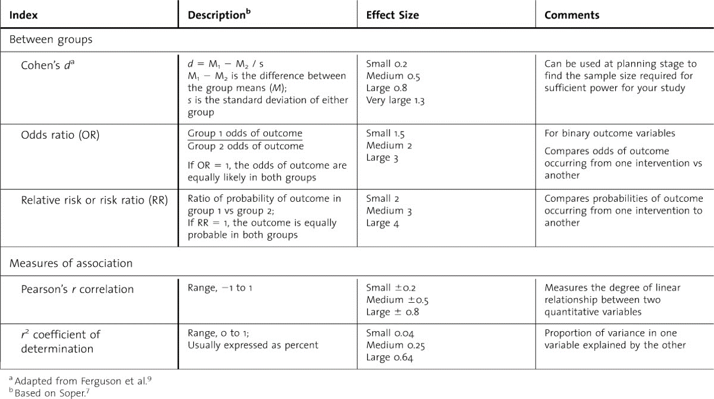
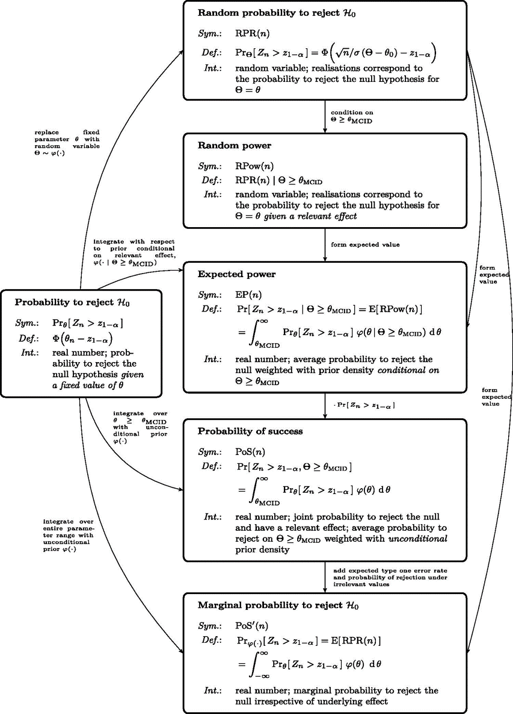

```{r setup, include=FALSE, echo = FALSE,message = FALSE, error = FALSE, warning = FALSE}
knitr::opts_chunk$set(echo = TRUE, fig.width = 10, fig.height = 6)

packages<-c("tidyverse", "kableExtra")

ipak <- function(pkg){
  new.pkg <- pkg[!(pkg %in% installed.packages()[, "Package"])]
  if (length(new.pkg)) 
    install.packages(new.pkg, dependencies = TRUE)
  sapply(pkg, require, character.only = TRUE)
}
ipak(packages)
 
 
setwd(dirname(rstudioapi::getSourceEditorContext()$path))
getwd()
Sys.setlocale("LC_ALL","English")
```


**Summary**

Choosing an effect size for sample size determination depends on factors such as scientific & clinical considerations, uncertainty about the effect size & practical trial resources available.

While traditionally estimated effect sizes have been used, there is increasing guidance favoring the use of MCID for more scientifically relevant SSD (see DELTA guidance).

Sensitivity analysis and assurance help evaluate the effect of effect size uncertainty on power and sample size and can quantify the robustness of the study design to effect size deviations

Promising zone designs offer adaptive approach that can bridges conventional and MCID perspectives by allowing to power initially on expected effect size but increase sample size at interim analyses for lower but still promising results


## Effect Size in Sample Size Determination

### What is the Effect Size? {-}


Effect size is a quantitative measure that indicates the magnitude of a relationship or the strength of a difference between groups in a statistical analysis. It helps to assess the practical significance of research results, going beyond merely stating whether an effect exists (as p-values do) to describing the size of that effect.  

1. **Types of Effect Sizes**
   - **Unstandardized Effect Sizes**: These retain the units of the original measurements, making them intuitive and directly interpretable. Examples include:
     - **Difference in Means**: The average difference between two groups, useful in comparing means from two populations (e.g., the difference in average test scores between two groups of students).
     - **Odds Ratio (OR)**: Used in case-control studies to compare the odds of an outcome occurring with an exposure versus without it.
     - **Risk Ratio (RR)**: Similar to OR but used in cohort studies; it compares the probability of an event occurring in two groups.
     - **Hazard Ratio (HR)**: Often used in survival analysis to compare the hazard (or risk) of an event between groups over time.
     
   - **Standardized Effect Sizes**: These remove the units of measurement, facilitating comparison across studies that measure different things or use different scales. Examples include:
     - **Cohen’s d**: Measures the difference between two means divided by a standard deviation; common in comparing two groups.
     - **Pearson’s r**: Indicates the strength and direction of a linear relationship between two variables.
     - **Eta-Squared (η²)**: Measures the proportion of total variation attributable to a factor, used in the context of ANOVA.
     
2. **Interpretation**
   - **Magnitude**: Effect sizes can be small, medium, or large based on certain benchmarks (e.g., Cohen's conventions where \(d = 0.2\) is small, \(d = 0.5\) is medium, and \(d = 0.8\) is large). These thresholds help in assessing the practical significance of results.
   - **Direction**: Especially with measures like Cohen’s d or Pearson’s r, the sign (+ or -) of the effect size indicates the direction of the relationship.
   
3. **Challenges and Considerations**
   - **Choice of Effect Size**: The choice between standardized and unstandardized measures depends on the context of the study and the needs of the stakeholders.
   - **Parameterization**: Some unstandardized effect sizes may require specific assumptions or parameter choices, which can affect their interpretation.
   - **Misinterpretation**: Without context, effect sizes can be misleading. For instance, a large effect size in a study with a small sample might not be generalizable.
 

### Effect Size Index {-}


 


### Effect Size Estimation Methods {-}
 
Effect size estimation is a crucial step in sample size determination (SSD) for clinical trials and other research studies. This process involves calculating the magnitude of an effect that is considered both statistically and clinically significant. 

**Effect size** measures the strength of the relationship between variables or the magnitude of the difference between groups in a study. Common metrics for effect size include Cohen's d for differences between means and correlation coefficients for associations among variables. The estimated effect size is used to calculate the number of participants needed to achieve adequate power in detecting this effect statistically.
 
Effect sizes can be estimated from:
- **Prior studies:** Previous research provides empirical data that can be used to estimate the expected effect size. Reviewing similar studies allows researchers to anticipate the effects they might observe.
- **Pilot studies:** These are preliminary, smaller-scale studies conducted to refine hypotheses and procedures. Pilot studies give a direct measure of the effect size within the context of the experiment's design.
- **Expert opinion:** Experts in the field can provide insights based on their experiences and understanding of the topic, which can be particularly useful when little empirical data is available.
 
Recently, there's a shift towards incorporating the **Minimum Clinically Important Difference (MCID)** in the calculation of sample sizes. MCID is defined as the smallest change in a treatment outcome that an individual patient would identify as important and which would indicate a change in the patient's management. This shift ensures that the studies are not just statistically significant but also clinically meaningful.
 
Determining what constitutes an MCID involves:
- **Consultations with field experts:** Experts can provide insight into what changes are meaningful in clinical practice.
- **Input from sponsors and patients:** Understanding what stakeholders and patients consider important ensures that the study outcomes will be relevant and valuable to those directly affected.
- **Review of existing literature:** Analyzing previous studies helps define what has been previously established as a clinically significant change.
 
Initiatives like DELTA2 focus on improving the design, conduct, and reporting of randomized trials. DELTA2, for instance, provides guidance on how to appropriately report MCID in trial proposals and publications. This guidance helps standardize how MCIDs are determined and reported, increasing the transparency and reproducibility of research.
 


### Conventional Effect Size Estimation {-}

The decision between using conventional effect size estimates and incorporating Minimum Clinically Important Differences (MCID) in sample size determination for clinical trials involves weighing the pros and cons of each approach. 


#### Pros {-}

- **Lower Sample Sizes**: Traditional methods often require fewer participants because the calculations are based on detecting any statistically significant difference, not necessarily a clinically meaningful one.
- **Simplicity**: This approach is generally easier to communicate and understand. It asks what is expected to happen based on existing data, which aligns closely with the methods used to estimate other parameters, such as variance.
- **Speed**: Since it's the more common expectation, trial designs and sample size determinations using this approach can often be completed more quickly, avoiding delays in study initiation.

#### Cons {-}

- **Risk of Underpowered Studies**: There's a tendency to overestimate the effect size during the planning phase, which can result in studies that are underpowered and unable to detect meaningful differences.
- **Dependence on Preliminary Estimates**: The reliability of the effect size estimate is heavily reliant on the quality of prior studies or pilot data used. Poor-quality preliminary data can lead to inappropriate study sizing.
- **Focus on Statistical Significance**: The conventional approach prioritizes statistical significance over clinical relevance, which might lead to findings that are statistically significant but not necessarily impactful in clinical practice.


### MCID-Based Estimation {-}

#### Pros {-}
- **Clinical Relevance**: By focusing on effect sizes that are clinically important, this approach ensures that the trials are designed with real-world implications in mind, making them more relevant to patient care.
- **Stakeholder Engagement**: The process of determining MCID can foster deeper engagement with clinicians, patients, and sponsors, helping to ensure that the study outcomes are meaningful to all parties involved.
- **Reduction in Clinically Insignificant Studies**: It lessens the likelihood of conducting studies that, while statistically significant, do not offer real clinical benefits, thereby enhancing the overall impact of research.

#### Cons {-}
- **Higher Sample Sizes**: MCID approaches generally require larger sample sizes to detect smaller but clinically important effects, potentially increasing the cost and duration of trials.
- **Variability in MCID Definitions**: The definition of what constitutes an MCID can vary between different stakeholders, such as patients versus sponsors, leading to challenges in trial design.
- **Complexity in Trial Design**: Establishing an MCID often requires extensive consultations, discussions, and potentially negotiations among various stakeholders, which can complicate and prolong the trial design phase.


Choosing between a conventional and an MCID-based approach involves balancing the need for statistically significant results with the requirement for clinical relevance. While the conventional approach might be quicker and require fewer resources, it could lead to studies that are less impactful in terms of patient care. On the other hand, while the MCID approach aligns closer to clinical practice, it demands more resources and time. Therefore, the decision should be guided by the specific objectives of the study, the nature of the disease or treatment being studied, and the needs and preferences of the involved stakeholders.

### Example {-}

> “An individual showing a 1-point change in the numeric rating scale is considered a MCID… However, we have based the sample size calculation on a continuous outcome, the mean change between groups, to maintain power. We have chosen a mean change between groups of 0.5 points... Using a within-patient SD of 1.65, an alpha of 0.0167 (0.05/3) to allow for three comparisons and 90% power, we require 294 evaluable patients.”

> “The primary outcome is presence of urinary incontinence. The sample size is based on a target difference of 15% absolute difference (85% vs. 70%)… This magnitude of target difference was determined to be both a realistic and an important difference from discussion between clinicians and the project management group, and from inspection of the proportion of urinary continence in the trials included in a Cochrane systematic review... Setting the statistical significance to the two-sided 5% level and seeking 90% power, 174 participants per group are required, giving a total of 348 participants. Allowing for 13% missing data leads to 200 per group (400 participants overall)."

 

## Sensitivity Analysis and Assurance

In the context of clinical trials, **Sample Size Determination (SSD)** involves estimating the number of participants needed based on preliminary assumptions about effect sizes and other nuisance parameters. Given that these assumptions are often derived from incomplete or uncertain data, it's essential to evaluate how changes in these assumptions might affect study outcomes. This evaluation of uncertainty can be conducted through **sensitivity analysis** and **assurance** methods.

Both sensitivity analysis and Bayesian assurance are valuable tools for exploring the uncertainty inherent in SSD. The choice between them depends on the specific needs of the study, the availability of prior data, and the statistical expertise of the research team. Sensitivity analysis offers a straightforward, scenario-based approach, while Bayesian assurance provides a probabilistic overview that can account for a broader range of uncertainties. Employing one or both methods can significantly enhance the robustness and reliability of clinical trial designs.

### Sensitivity Analysis {-}

Sensitivity analysis is a method used to explore the impact of variability in input parameters on the outcome of a study. For SSD, this involves understanding how changes in the effect size could affect the required sample size or the statistical power of the trial.

1. **Selection of Values**: Choose a reasonable range of effect sizes to test. This range might be based on a 95% confidence interval around an estimated effect size or different MCID values proposed by various stakeholders.
2. **Evaluation**: Calculate the required sample sizes or achieved power for each selected value. This step helps identify how sensitive the study outcomes are to changes in the effect size.

- **Pros**:
  - **Intuitive and Simple**: The method is straightforward and easy to understand, making it accessible for most researchers.
  - **Direct Evaluation**: Directly assesses the impact of specific changes, providing clear insights into what each change entails for the study.
- **Cons**:
  - **Potential for Arbitrariness**: The selected points for evaluation might seem arbitrary and may not cover all relevant scenarios.
  - **Limited Scope**: Only explores predefined scenarios rather than a continuous range of possibilities.
  
### Bayesian Assurance {-}

Bayesian assurance is a more sophisticated approach that uses Bayesian probability to evaluate the likelihood of trial success based on prior distributions of the parameters.

1. **Setting Priors**: Define prior distributions for the effect size and nuisance parameters. These priors reflect previous knowledge or assumptions about the parameters.
2. **Calculation of Probability**: Compute the probability of achieving statistical significance across all plausible values of the effect size, considering the priors.


- **Pros**:
  - **Comprehensive**: Offers a more thorough assessment by integrating over a range of plausible values rather than fixed points.
  - **Probabilistic Insight**: Provides a probability of trial success, which can be more informative for decision-making than simple power calculations.
- **Cons**:
  - **Complexity**: Requires a deeper understanding of Bayesian statistics and the construction of appropriate priors.
  - **Reduction to Summary Measure**: Condenses the uncertainty into a single metric, which might oversimplify some aspects of the uncertainty.


* Power: $\pi(\boldsymbol{\theta})=P(R \mid \boldsymbol{\theta})$
* Assurance: $A=P(R)=E(\pi(\boldsymbol{\theta}))$



 


## Promising Zone Designs

### Adaptive Trial Design: Addressing Uncertainty through Flexibility {-}

Adaptive trial design is a sophisticated approach that allows for modifications to trial parameters based on interim data. This approach can enhance the efficiency and effectiveness of clinical trials by making them more responsive to emerging results.  
 
An extension of GSD is unblinded sample size re-estimation, which allows the trial designers to adjust the sample size based on the results of an interim analysis. This adjustment is made in an unblinded manner, meaning that the data on treatment effects is fully visible to the statistical team, allowing for informed decision-making.

**Process**

- **Initial Estimate**: Start the trial with a sample size estimated based on conventional effect size expectations.
- **Interim Analysis**: At a pre-specified interim point, the actual effect size and variance are assessed.
- **Re-estimation**: If the interim effect size is smaller than initially expected but still shows potential (i.e., is within the "promising zone"), the sample size can be increased to maintain adequate power to detect clinically meaningful effects.


### Promising Zone Designs {-}

Promising zone designs are a type of adaptive design that specifically allow for sample size adjustment when interim results are not as strong as hoped but still indicate a potentially important clinical effect.

- **Initial Powering**: The trial can initially be powered based on a conventional expected effect size, which is typically optimistic.
- **Adaptive Adjustment**: If interim results suggest a smaller yet clinically relevant effect size (e.g., near the lower end of the MCID), the sample size can be adaptively increased to ensure the trial remains sufficiently powered to detect these effects.

**Benefits**

- **Flexibility**: Allows trials to adapt to new information without compromising scientific integrity.
- **Efficiency**: Reduces the risk of concluding a trial with inconclusive results by adjusting the study design to current evidence.
- **Patient-Centric**: Focuses resources on trials with promising interim results, potentially leading to quicker patient access to beneficial treatments.

### Example

> “The trial incorporated a sample size re-estimation (SSR) at the time of the interim look (after 90 patients had been evaluated for the key secondary endpoint) based on promise for superiority in the key secondary endpoint. Sample size re-estimation resulted in a maximum of 210 total evaluable subjects, or no more than 1.75 times the minimum of 120 …, fluid balance at 72 hours or ICU discharge was significantly lower (−1.37 L favoring the intervention arm; 0.65 ± 2.85 L intervention arm vs 2.02 ± 3.44 L usual care arm”

1. **Start of Trial**: The trial initially started with a certain planned sample size, aiming to evaluate the effectiveness of an intervention on a key secondary endpoint.
   
2. **Interim Analysis**: After 90 patients were evaluated, an interim analysis was conducted. This early evaluation was intended to assess the promise of the intervention for superiority in achieving the key secondary endpoint.
 
3. **Evaluation of Data**: At this interim look, the data suggested potential superiority of the intervention. However, the initial sample size may have been calculated based on more optimistic assumptions about the effect size.
   
4. **Sample Size Re-estimation (SSR)**: Based on the interim results, which showed promise but perhaps not as strongly as expected, a decision was made to re-estimate the required sample size to maintain adequate statistical power. The SSR aims to adjust the sample size to better reflect the observed effect size and variability, thus ensuring that the final results will be statistically robust.
 
5. **Adjustment of Sample Size**: The re-estimation led to a new maximum sample size of 210 total evaluable subjects. This adjustment meant increasing the sample size to no more than 1.75 times the minimum of 120 initially planned or considered at the beginning of the study. This factor of 1.75 times provides a quantitative measure of how much larger the sample size might need to be compared to the minimum originally anticipated, based on the early evidence from the interim analysis.

6. **Results Post-Adjustment**: Following this adjustment and the continuation of the trial, it was found that fluid balance at 72 hours or upon ICU discharge was significantly lower in the intervention arm compared to the usual care arm (−1.37 L favoring the intervention; with specific mean and variability measures provided for both groups). This significant result indicates that the intervention was effective and that the adjusted sample size was sufficient to detect this clinically meaningful difference.


## Reference

### Choosing Effect Size {-}

de Souza, R. J., Eisen, R. B., Perera, S., Bantoto, B., Bawor, M., Dennis, B. B., ... & Thabane, L. (2016). Best (but oft-forgotten) practices: Sensitivity analyses in randomized controlled trials. The American Journal of Clinical Nutrition, 103(1), 5-17.

Knox, D., Yamamoto, T., Baum, M. A., & Berinsky, A. J. (2019). Design, identification, and sensitivity analysis for patient preference trials. Journal of the American Statistical Association.

Thabane, L., Mbuagbaw, L., Zhang, S., Samaan, Z., Marcucci, M., Ye, C., ... & Goldsmith, C. H. (2013). A tutorial on sensitivity analyses in clinical trials: The what, why, when, and how. BMC Medical Research Methodology, 13(1), 1-12.

O'Hagan, A., Stevens, J. W., & Campbell, M. J. (2005). Assurance in clinical trial design. Pharmaceutical Statistics, 4(3), 187-201.

Chen, D. G., & Chen, J. K. (2018). Statistical power and Bayesian assurance in clinical trial design. In Y. Zhao & D. G. Chen (Eds.), New Frontiers of Biostatistics and Bioinformatics (pp. 203-220). Springer, Cham. ICSA Book Series in Statistics.

Temple, J. R., & Robertson, J. R. (2021). Conditional assurance: The answer to the questions that should be asked within drug development. Pharmaceutical Statistics, 20(6), 1102-1111.

Statsols. (n.d.). Design and evaluation of complex sequential analysis trials. Statsols Blog. Retrieved from https://blog.statsols.com/design-and-evaluation-of-complex-sequential-analysis-trials

Kunzmann, K., Grayling, M. J., Lee, K. M., Robertson, D. S., Rufibach, K., & Wason, J. M. (2021). A review of Bayesian perspectives on sample size derivation for confirmatory trials. The American Statistician, 75(4), 424-432.

Chen, Y. J., DeMets, D. L., & Gordon Lan, K. K. (2004). Increasing the sample size when the unblinded interim result is promising. Statistics in Medicine, 23(7), 1023-1038.

Cui, L., Hung, H. J., & Wang, S. J. (1999). Modification of sample size in group sequential clinical trials. Biometrics, 55(3), 853-857.

Mehta, C. R., & Pocock, S. J. (2011). Adaptive increase in sample size when interim results are promising: A practical guide with examples. Statistics in Medicine, 30(28), 3267-3284.

Douglas, I. S., et al. (2020). Fluid response evaluation in sepsis hypotension and shock: A randomized clinical trial. CHEST, 158(4), 1431-1445.

Jennison, C., & Turnbull, B. W. (2015). Adaptive sample size modification in clinical trials: Start small then ask for more. Statistics in Medicine, 34(29), 3793-3810.

Statsols. (n.d.). Guide to sample size re-estimation in clinical trials. Statsols Blog. Retrieved from https://blog.statsols.com/guide-to-sample-size-re-estimation-in-clinical-trials

### Exploring Uncertainty {-}

de Souza, R. J., Eisen, R. B., Perera, S., Bantoto, B., Bawor, M., Dennis, B. B., ... & Thabane, L. (2016). Best (but oft-forgotten) practices: Sensitivity analyses in randomized controlled trials. The American Journal of Clinical Nutrition, 103(1), 5-17.

Knox, D., Yamamoto, T., Baum, M. A., & Berinsky, A. J. (2019). Design, identification, and sensitivity analysis for patient preference trials. Journal of the American Statistical Association.

Thabane, L., Mbuagbaw, L., Zhang, S., Samaan, Z., Marcucci, M., Ye, C., ... & Goldsmith, C. H. (2013). A tutorial on sensitivity analyses in clinical trials: The what, why, when, and how. BMC Medical Research Methodology, 13(1), 1-12.

O'Hagan, A., Stevens, J. W., & Campbell, M. J. (2005). Assurance in clinical trial design. Pharmaceutical Statistics, 4(3), 187-201.

Chen, D. G., & Chen, J. K. (2018). Statistical power and Bayesian assurance in clinical trial design. In Y. Zhao & D. G. Chen (Eds.), New frontiers of biostatistics and bioinformatics (pp. 203-220). Springer, Cham. ICSA Book Series in Statistics.

Temple, J. R., & Robertson, J. R. (2021). Conditional assurance: The answer to the questions that should be asked within drug development. Pharmaceutical Statistics, 20(6), 1102-1111.

Statsols. (n.d.). Design and evaluation of complex sequential analysis trials. Statsols Blog. Retrieved from https://blog.statsols.com/design-and-evaluation-of-complex-sequential-analysis-trials

Kunzmann, K., Grayling, M. J., Lee, K. M., Robertson, D. S., Rufibach, K., & Wason, J. M. (2021). A review of Bayesian perspectives on sample size derivation for confirmatory trials. The American Statistician, 75(4), 424-432.

### Promising Zone Design {-}

Chen, Y. J., DeMets, D. L., & Gordon Lan, K. K. (2004). Increasing the sample size when the unblinded interim result is promising. Statistics in Medicine, 23(7), 1023-1038.

Cui, L., Hung, H. J., & Wang, S. J. (1999). Modification of sample size in group sequential clinical trials. Biometrics, 55(3), 853-857.

Mehta, C. R., & Pocock, S. J. (2011). Adaptive increase in sample size when interim results are promising: A practical guide with examples. Statistics in Medicine, 30(28), 3267-3284.

Douglas, I. S., et al. (2020). Fluid response evaluation in sepsis hypotension and shock: A randomized clinical trial. CHEST, 158(4), 1431-1445.

Jennison, C., & Turnbull, B. W. (2015). Adaptive sample size modification in clinical trials: Start small then ask for more. Statistics in Medicine, 34(29), 3793-3810.

Statsols. (n.d.). Guide to sample size re-estimation in clinical trials. Statsols Blog. Retrieved from https://blog.statsols.com/guide-to-sample-size-re-estimation-in-clinical-trials
 