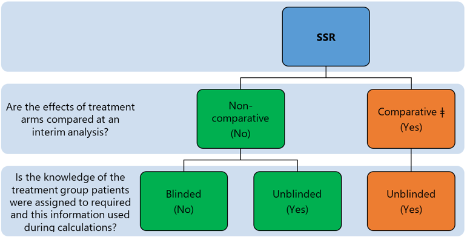
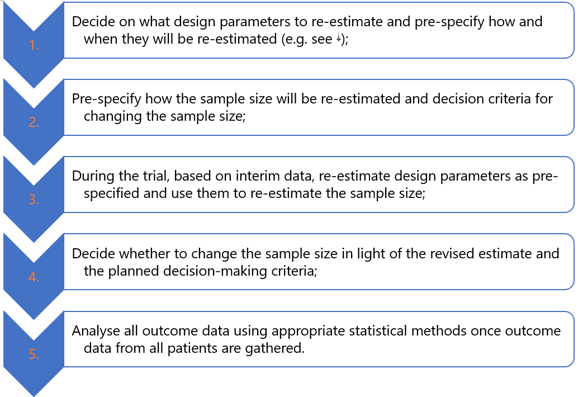

```{r setup, include=FALSE, echo = FALSE,message = FALSE, error = FALSE, warning = FALSE}
knitr::opts_chunk$set(echo = TRUE, fig.width = 10, fig.height = 6)

packages<-c("tidyverse", "kableExtra")

ipak <- function(pkg){
  new.pkg <- pkg[!(pkg %in% installed.packages()[, "Package"])]
  if (length(new.pkg)) 
    install.packages(new.pkg, dependencies = TRUE)
  sapply(pkg, require, character.only = TRUE)
}
ipak(packages)
 
 
setwd(dirname(rstudioapi::getSourceEditorContext()$path))
getwd()
Sys.setlocale("LC_ALL","English")
```


**Summary**
 
Pilot Study are smaller studies undertaken to better understand the feasibility and likely operating characteristics of future primary study

However, many pilot studies are poorly designed meaning they are unable to provide reliable information about their primary goals

Inadequate sample size is one common reason why pilot studies are inadequate – reasonable heuristics and sample size formulae available

Internal pilot allows pilot data to be integrated directly into the final analysis, improving efficiency and decision making (e.g. adjusting sample size based on improved interim estimates for nuisance parameters)


# Overview of Pilot Studies

## Introduction 

**Purpose of Pilot Studies**

Pilot studies are smaller-scale studies conducted before the main research project. The primary purpose of these studies is:
- **Estimate Operational Characteristics**: To understand and predict how the main study might operate under real-world conditions.
- **Evaluate and Predict Trial Considerations**: To assess various aspects of the planned main study, including its feasibility, potential logistical issues, and the adequacy of the resources available.
- **Sample Size Planning**: To help determine the appropriate number of participants needed to achieve statistically significant results without over- or underestimating the required sample size.

**Importance**

Pilot studies are essential for:
- **Testing Procedures**: To ensure that the methodology is sound and practical before applying it on a larger scale.
- **Identifying Problems**: To detect and address potential issues in the study's design or implementation, which could affect the outcomes if not corrected.
- **Resource Allocation**: To evaluate if the study’s resource demands are manageable and sustainable over the duration of the main study.

**Challenges in Pilot Studies**

- **Lack of Standardization**: There is a notable absence of standardized procedures for designing and conducting pilot studies. This can lead to variability in how these studies are executed, affecting their reliability and the applicability of their results to the main study.
- **Priority Misalignment**: Practical considerations often overshadow design and statistical concerns, which can compromise the quality and integrity of the pilot study, leading to flawed conclusions about the feasibility of the main study.

**Recommendations for Better Design**

CONSORT (2016) extension as a guide for designing better pilot trials. CONSORT stands for Consolidated Standards of Reporting Trials, and its extension for pilot trials aims to:
- **Improve Design and Reporting**: Provide a standardized framework for planning, executing, and reporting pilot studies, enhancing their quality and transparency.
- **Facilitate Better Decision Making**: By improving the design of pilot studies, researchers can make more informed decisions about whether and how to proceed with the main studies, potentially saving time, effort, and resources from being misallocated.


## Consideration 

The image provides an organized breakdown of various considerations that need to be addressed when designing and conducting a pilot study. These considerations are grouped into four main categories: Study Objectives, Study Constraints, Study Design, and Statistical Issues. Here’s a detailed explanation of each category:

**Study Objectives**
- **Feasibility**: Evaluates whether the estimated effect size is reasonable and accounts for practical issues such as dropout rates and participant accrual.
- **Parameter Estimates**: Focuses on defining the bounds of uncertainty for the parameters of interest to ensure that they are well-defined.
- **Experimentation**: Involves assessing the study design and statistical tools to identify any potential issues or challenges that might affect the study’s integrity.

**Study Constraints**
- **Resources**: Looks at the budget allocated for the pilot study and whether there's a need or ability to share resources with the full study.
- **Time**: Considers the maximum feasible length of the study, endpoint follow-up times, and the time required for recruitment.
- **Comparability**: Questions whether the pilot study design will be the same as the future main study, focusing on the portability and accuracy of estimates.

**Study Design**
- **Endpoint Selection**: Determines whether the endpoints for the pilot study will also be endpoints in the future study and considers whether to use surrogate endpoints.
- **Number of Arms**: Decides whether the study will have a single arm, which is most common in pilot studies, or multiple arms, and whether randomization is necessary.
- **Subject Selection**: Discusses the inclusion of only the target population and whether the same inclusion/exclusion criteria will apply as in the full study.

**Statistical Issues**
- **Parameter Choice**: Identifies which parameters to estimate and considers which scale or transformations might be necessary.
- **Statistical Method**: Decides on the interval or statistical tests to use, such as determining the upper confidence interval (CI) that defines "success."
- **Sample Size Determination**: Addresses how to determine the sample size, whether by a rule of thumb, a specific formula, or an algorithm.


## Sample Size Overview 

Considerations for determining the sample size in pilot studies, highlighting different "rules of thumb" and the rationale behind each guideline. 
 
**Key Considerations:**
- **Primary Objectives**: The sample size should reflect the primary objectives of the pilot study, such as assessing feasibility, safety, or trial estimates.
- **Common Practices**: Sample sizes are often determined based on practical constraints rather than strict statistical methods. These rules of thumb vary but are generally chosen to balance feasibility with the need for informative results.
- **Explicit Rationale**: It is important to be clear if the sample size is chosen based on practical issues (like available resources) rather than statistical reasons.


**Rules of Thumb for Sample Size (Based on t-test Variance)**

This part of the image lists several commonly referenced rules of thumb for determining sample sizes in pilot studies, each with a specific context or justification:

- **Birkett & Day (1994) - 20**: Suggested for internal pilot studies as a general guideline.
- **Browne (1995) - 30**: Described as a "commonplace" selection, implying a frequently used standard that might not be rigorously justified.
- **Kieser & Wassmer (1996) - 20-40**: Recommended when the upper confidence limit (UCL) for the main trial size is between 80-250, providing a range that allows for a flexible but statistically reasoned approach.
- **Julious (2005) - 24**: Proposed for scenarios needing feasibility, precision, and regulatory compliance.
- **Sim & Lewis (2011) - >55**: Advocated for when using small to medium Cohen's effect sizes (ES) to minimize the total sample size across the pilot and main study, thus conserving resources.
- **Teare et al (2014) - >70**: Based on simulation studies, suitable for trials with a binary endpoint aiming for robust data.
- **Whitehead et al (2016) - 20-150**: Varies greatly to accommodate studies aiming for standardized effect sizes between 0.1-0.7 at 80%/90% power, providing a wide range to cover various study designs and objectives.


The "Rules of Thumb" for determining pilot study sample sizes listed in the image are derived from various sources and papers over the years, each suggesting different sample sizes based on various statistical principles and practical considerations. Here’s a detailed breakdown of each rule and its context:

**1. Birkett & Day (1994) - 20**
- **Rule**: Suggests a sample size of 20 for internal pilot studies.
- **Context**: This rule is generally used for internal pilot studies, which are pilot studies embedded within a main trial, primarily to refine and optimize the study procedures and parameters before the full trial is rolled out. The number 20 is often chosen to ensure enough data to assess the feasibility and initial variability without demanding excessive resources.

**2. Browne (1995) - 30**
- **Rule**: Recommends a sample size of 30.
- **Context**: This number is often cited as a "commonplace" selection, meaning it's frequently used in practice. The sample size of 30 is typically considered the minimum number required to achieve a sufficiently normal distribution of the means under the Central Limit Theorem, making it a standard choice for small pilot studies where more complex statistical analyses are not the primary focus.

**3. Kieser & Wassmer (1996) - 20-40**
- **Rule**: Suggests a range of 20 to 40 participants.
- **Context**: This range is recommended based on achieving an 80% upper confidence limit (UCL) if the main trial size is anticipated to be between 80 and 250 participants. This rule helps in determining the variability and the potential upper bounds of an estimate, ensuring that the pilot study is adequately powered to inform the design of the main trial without being overly large.

**4. Julious (2005) - 24**
- **Rule**: Proposes a sample size of 24.
- **Context**: This sample size is chosen for feasibility, precision, and to meet regulatory reasons. A sample size of 24 allows for preliminary assessment of the study's operational aspects and initial statistical estimations, which can be critical in regulatory settings where preliminary evidence of feasibility and safety must be demonstrated.

**5. Sim & Lewis (2011) - >55**
- **Rule**: Recommends more than 55 participants.
- **Context**: This recommendation is for studies aiming to use small to medium Cohen’s effect sizes to minimize the total sample size necessary across both the pilot and the main studies. This approach is focused on efficiency, optimizing the total resources expended while ensuring enough power to detect meaningful effects in the preliminary data.

**6. Teare et al (2014) - >70**
- **Rule**: Advises a sample size greater than 70.
- **Context**: Based on simulation studies for trials with binary endpoints, this larger sample size is recommended to ensure robust estimations that can inform the design and feasibility of larger, more definitive trials. It is particularly useful when the pilot study's outcomes are critical in deciding the go/no-go decision for the main trial.

**7. Whitehead et al (2016) - 20-150**
- **Rule**: Offers a wide range of 20 to 150 participants.
- **Context**: This range is based on aiming for standardized effect sizes of 0.1 to 0.7 at 80% to 90% power. The broad range allows the pilot study to be adaptable to various study objectives, from very conservative estimates requiring more precision to more exploratory studies that might accommodate a broader range of outcomes.
 

## Sample Size Determination 

There are two primary methods for formal Sample Size Determination (SSD) in pilot studies: the Upper Confidence Limit (UCL) Method and the Non-Central t-distribution (NCT) Method. These methods are designed to ensure the pilot study is appropriately sized to provide reliable and statistically significant results. 


- Both methods aim to determine a statistically sound sample size for the main study based on pilot study data.
- The choice between the UCL and NCT methods depends on the specific needs of the research, such as the desired confidence level, the nature of the data, and the acceptable risk of type I and type II errors.
- Researchers may choose the NCT method for its generally lower sample size requirements, especially in cases where budget or logistical constraints are a concern. Conversely, the UCL method might be preferred when the upper confidence bounds are critical for decision-making or regulatory approval.

### Upper Confidence Limit (UCL) Method  {-}

- **Objective**: This method calculates a confidence interval and uses the upper limit estimate to adjust for uncertainty in parameter estimates.
- **Formula**:
  - \(s^2_{UCL} = \left(\frac{k}{\chi^2_{1-\alpha, k}}\right)^2 s^2\)
    - Where \(s^2\) is the variance estimate from the sample, \(k\) is the degrees of freedom, and \(\chi^2_{1-\alpha, k}\) is the chi-squared distribution value for \(1-\alpha\) confidence level and \(k\) degrees of freedom.
  - \(n_M = \frac{(r+1)(z_{1-\beta}+z_{1-\alpha/2})^2 s^2_{UCL}}{rd^2}\)
    - Where \(r\) is the ratio of the sample size of the main study to the pilot study, \(d\) is the effect size, \(z\) values are the standard normal deviates for the respective confidence levels.
- **Use Case**: Suitable for a variety of parameter types and when one wishes to have high confidence in the upper limit of the parameter estimate.

### Non-Central t-distribution (NCT) Method  {-}

- **Objective**: Adjusts the sample size upwards by incorporating sample variance imprecision via a non-central t-distribution.
- **Formula**:
  - \(n_M \geq \frac{(r+1)t^2_{1-(1-\beta),k,t^2}}{(1-\alpha/2,n_M(r+1)-2,0)} s^2_{g}\)
    - Where \(t\) values represent the non-central t-distribution critical values, \(\beta\) is the power, and \(s^2_{g}\) is the estimated variance based on the pilot study data.
- **Use Case**: Primarily used when considering variance uncertainty for a two-group t-test, and it generally requires lower sample sizes than the UCL method, making it more resource-efficient.

# Internal Pilot Studies

## Overview of Internal Pilot Studies

1. **Difference Between External and Internal Pilots**:
   - **External Pilot Studies**: These are preliminary studies used to refine various aspects of the trial design, such as estimating the variability of outcomes or determining feasible recruitment rates. Typically, data from external pilot studies are not included in the final analysis of the main trial; they are used solely for planning purposes.
   - **Internal Pilot Studies**: Unlike external pilots, internal pilots are part of the main study. They involve an initial phase of data collection which is used to make adjustments to the trial design, such as recalibrating sample size or modifying treatment allocations, and importantly, the data collected during this phase are not discarded but are included in the final analysis.

2. **Adaptive Designs with Internal Pilots**:
   - These designs allow for modifications to the trial procedures based on interim data without compromising the integrity or validity of the study. The internal pilot phase serves as a real-time evaluation tool to ensure the trial is conducted as efficiently as possible while adhering to rigorous scientific standards.

**Characteristics and Advantages**

1. **Blinded vs. Unblinded Internal Pilots**:
   - **Blinded Internal Pilots**: The most common type, where modifications are made without the need for the study team to know the treatment assignments of individual participants. This is often used for adaptive designs focusing on sample size re-estimation based on interim variance and effect size estimations.
   - **Unblinded Internal Pilots**: Less common and typically involve some form of adaptive randomization or other changes that might require knowledge of group assignments. These are carefully controlled to limit impacts on type I error rates.

2. **Regulatory Perspective**:
   - The FDA and other regulatory bodies generally view adaptations based on data from internal pilots favorably, particularly when such adaptations are pre-specified and transparent, and when they do not increase the type I error rate. These adaptations are considered especially valuable in situations of high uncertainty where flexible approaches can significantly enhance trial outcomes.

3. **Sample Size Re-Estimation**:
   - This is a common application of internal pilot studies where the initial data collected are used to update assumptions about the sample size needed to achieve the desired power. This method allows the trial to adapt to unexpected conditions such as higher-than-expected variability or effect sizes different from the initial estimates.
   
   
## Blinded Sample Size Re-estimation (BSSR)   

Blinded sample size re-estimation (SSR) strategy, specifically within the context of adaptive clinical trials using internal pilot studies. This approach allows for adjustments to the trial's sample size based on interim estimates of parameters that are not directly related to the primary endpoints, often termed as nuisance parameters. 

1. **Blinded Interim "Pilot" Estimate**:
   - In a blinded SSR, interim analyses are conducted without revealing the treatment assignments to maintain the trial's integrity and minimize biases. The estimation focuses on nuisance parameters, which might include variances or other statistical properties not directly linked to the treatment effects but crucial for ensuring accurate statistical tests.

2. **Integration of Internal Pilot Data**:
   - Data from the internal pilot phase are incorporated directly into the final analysis. This integration is designed to adjust the trial's course based on real-world observations while preserving the overall statistical validity, particularly ensuring minimal inflation of Type I error rates (the probability of incorrectly rejecting a true null hypothesis).

3. **Simulation Verification**:
   - Simulations are typically used to assess the impact of incorporating pilot data on the Type I error rate, especially in non-inferiority (NI) or equivalence trials where maintaining strict error control is crucial. These simulations help verify that the adaptive design does not inadvertently increase the likelihood of type I errors.

4. **Combination Tests for Strong Type I Error Control**:
   - In cases where stringent control over Type I errors is necessary, combination tests may be employed. These tests can aggregate results from different stages or aspects of the trial to produce a more robust overall conclusion, reinforcing the reliability of the findings despite the adaptive design.

**Targeting Nuisance Parameters**

1. **Dependence on Study Design**:
   - The choice of which nuisance parameter to target for SSR depends significantly on the trial's endpoint, design, and the statistical tests employed. This targeting is crucial for optimizing trial efficiency without compromising statistical integrity.

2. **Parameter Independence**:
   - It is generally easier to handle nuisance parameters that are independent of the effect size, such as variance or overdispersion in a response. Independent parameters allow for straightforward re-estimations that do not interfere with the interpretation of the treatment effect.

3. **Parameter Dependence**:
   - More complex scenarios arise when nuisance parameters are not independent of the primary outcomes. For example, in a trial using a chi-squared test, estimating the overall proportion in a pilot phase is straightforward, but SSR might require assumptions about the true difference in proportions between groups, which can be more challenging to estimate accurately without bias.
   






*Source: A Practical Adaptive & Novel Designs and Analysis Toolkit (PANDAS) https://panda.shef.ac.uk*


## Blinded SSR Scenario Strategies 


1. **Two Means**
   - **Target Parameter**: Variance or standard deviation within groups.
   - **Applicable Tests**: t-test, Z-test, Mann-Whitney U (assuming certain conditions).
   - **Strategies**: Update the variance using data from the interim analysis and incorporate this into the sample size determination (SSD) formula. Variance can be adjusted using overall variance, bias-adjusted overall variance, upper confidence interval (CI) variance estimate, or the EM algorithm for more complex cases.

2. **Two Proportions**
   - **Target Parameter**: Overall proportion or success rate.
   - **Applicable Tests**: Chi-squared test, exact tests, likelihood tests, t-tests.
   - **Strategies**: Adjust the proportion estimates (p1/p2) based on the overall rate and a predefined notion of "true" proportion difference (Δ). The SSD formula then uses these updated proportions to re-calculate the required sample sizes.

3. **Two Survival**
   - **Target Parameter**: Time-to-event data or overall hazard rate for each subject.
   - **Applicable Tests**: Log-rank test, Cox regression.
   - **Strategies**: Update the hazard rates based on the interim time-to-event data and the assumed true hazard ratio to adjust the sample size accordingly.

4. **Two Counts**
   - **Target Parameter**: Event rates or counts.
   - **Applicable Tests**: Poisson, quasi-Poisson, negative binomial, Andersen-Gill models.
   - **Strategies**: Modify per-group count rates using overall event data and a "true" rate ratio. Recalculate overdispersion or dispersion parameters using per-subject event counts to refine the SSD.

5. **Other Complex Designs**
   - **Target Parameter**: Depends on the specific design—may involve mixed models, crossover studies, or multiple endpoints.
   - **Applicable Tests**: ANCOVA, mixed models, diagnostics, etc.
   - **Strategies**: Strategies might include recalculating parameters such as correlation coefficients, prevalence in diagnostics, or ICC in mixed models, and employing continuous monitoring or Bayesian methods for ongoing assessment.

## Example Blinded SSR 

### T-Test Blinded SSR Data  {-}

```{r,echo = T,message = FALSE, error = FALSE, warning = FALSE}

####################################
####    t-test Blinded SSR Data  ###
####################################

pilotSize = 100 #Size of Pilot Study
mean1 = 0 #Group 1 Mean
mean2 = 0.2 #Group 2 Mean
stDev = 1 #Common Within-Group Standard Deviation
groupProp = 0.5 #Allocation Proportion to Group 1

group1t = rnorm(round(pilotSize*groupProp),mean1,stDev) #Simulate Group 1 Internal Pilot Data
group2t = rnorm(round(pilotSize*groupProp),mean2,stDev) #Simulate Group 2 Internal Pilot Data

pilotResult = c(group1t,group2t) #Overall Internal Pilot Data
head(pilotResult) 

pilotSD = sd(pilotResult)
pilotSD # Check overall standard deviation of internal pilot

```

### Poisson Blinded SSR Data {-}

```{r,echo = T,message = FALSE, error = FALSE, warning = FALSE}

####################################
####  Poisson Blinded SSR Data   ###
####################################

pilotSize = 100 #Size of Pilot Study
rate1 = 1 #Group 1 Mean
rate2 = 1.5 #Group 2 Mean
overdisp = 2 #Overdispersion Parameter
groupProp = 0.5 #Allocation Proportion to Group 1

#Function to simulate quasi-Poisson Overdispersed data
rqpois <- function(n, mu, theta) {
  rnbinom(n = n, mu = mu, size = mu/(theta-1))
}

#Simulate Poisson Data without Overdispersion
group1Pois = rpois(round(pilotSize*groupProp),rate1) #Simulate Group 1 Internal Pilot Data w/o Dispersion
group2Pois = rpois(round(pilotSize*groupProp),rate2) #Simulate Group 2 Internal Pilot Data w/o Dispersion

#Simulate Overdispersed Poisson Data
group1Qpois = rqpois(round(pilotSize*groupProp),rate1,overdisp) #Simulate Group 1 Internal Pilot Data w/ Dispersion
group2Qpois = rqpois(round(pilotSize*groupProp),rate2,overdisp) #Simulate Group 2 Internal Pilot Data w/ Dispersion

pilotResultPois = c(group1Pois,group2Pois) #Overall Internal Pilot Data
pilotResultQpois = c(group1Qpois,group2Qpois) #Overall Internal Pilot Data

#Checks
pilotMeanPois = mean(pilotResultPois) #Mean Rate
pilotVarPois = var(pilotResultPois) #Variance of Rates (w/o Dispersion E[X] = Var[X])
pilotVarPois/pilotMeanPois #Overdispersion Estimate

pilotMeanQpois = mean(pilotResultQpois) #Mean Rate
pilotVarQpois = var(pilotResultQpois) #Variance of Rates
pilotVarQpois/pilotMeanQpois #Overdispersion - expect same as overdisp specified (closer w/ higher N)
 
```

# Reference

* [A Practical Adaptive & Novel Designs and Analysis toolkit](https://panda.shef.ac.uk/)

## Pilot Study Sample Size

 

1. Machin, D., Campbell, M. J., Tan, S. B., & Tan, S. H. (2018). *Sample sizes for clinical, laboratory and epidemiology studies*. John Wiley & Sons.
2. Julious, S. A. (2023). *Sample sizes for clinical trials*. Chapman and Hall/CRC.
3. Kunselman, A. R. (2024). A brief overview of pilot studies and their sample size justification. *Fertility and Sterility*.
4. Birkett, M. A., & Day, S. J. (1994). Internal pilot studies for estimating sample size. *Statistics in Medicine, 13(23-24)*, 2455-2463.
5. Browne, R. H. (1995). On the use of a pilot sample for sample size determination. *Statistics in Medicine, 14(17)*, 1933-1940.
6. Kieser, M., & Wassmer, G. (1996). On the use of the upper confidence limit for the variance from a pilot sample for sample size determination. *Biometrical Journal, 38(8)*, 941-949.
7. Julious, S. A. (2005). Sample size of 12 per group rule of thumb for a pilot study. *Pharmaceutical Statistics: The Journal of Applied Statistics in the Pharmaceutical Industry, 4(4)*, 287-291.
8. Sim, J., & Lewis, M. (2012). The size of a pilot study for a clinical trial should be calculated in relation to considerations of precision and efficiency. *Journal of Clinical Epidemiology, 65(3)*, 301-308.
9. Teare, M. D., Dimairo, M., Shephard, N., Hayman, A., Whitehead, A., & Walters, S. J. (2014). Sample size requirements to estimate key design parameters from external pilot randomised controlled trials: a simulation study. *Trials, 15*, 1-13.
10. Whitehead, A. L., Julious, S. A., Cooper, C. L., & Campbell, M. J. (2016). Estimating the sample size for a pilot randomised trial to minimise the overall trial sample size for the external pilot and main trial for a continuous outcome variable. *Statistical Methods in Medical Research, 25(3)*, 1057-1073.
11. Julious, S. A. (2004). Designing clinical trials with uncertain estimates of variability. *Pharmaceutical Statistics: The Journal of Applied Statistics in the Pharmaceutical Industry, 3(4)*, 261-268.
12. Julious, S. A., & Owen, R. J. (2006). Sample size calculations for clinical studies allowing for uncertainty about the variance. *Pharmaceutical Statistics: The Journal of Applied Statistics in the Pharmaceutical Industry, 5(1)*, 29-37.
13. Hertzog, M. A. (2008). Considerations in determining sample size for pilot studies. *Research in Nursing & Health, 31(2)*, 180-191.
14. Cocks, K., & Torgerson, D. J. (2013). Sample size calculations for pilot randomized trials: a confidence interval approach. *Journal of Clinical Epidemiology, 66(2)*, 197-201.
15. Viechtbauer, W., Smits, L., Kotz, D., Budé, L., Spigt, M., Serroyen, J., & Crutzen, R. (2015). A simple formula for the calculation of sample size in pilot studies. *Journal of Clinical Epidemiology, 68(11)*, 1375-1379.
16. Eldridge, S. M., Costelloe, C. E., Kahan, B. C., Lancaster, G. A., & Kerry, S. M. (2016). How big should the pilot study for my cluster randomised trial be?. *Statistical Methods in Medical Research, 25(3)*, 1039-1056.
17. Whitehead, J., Valdés-Márquez, E., Johnson, P., & Graham, G. (2008). Bayesian sample size for exploratory clinical trials incorporating historical data. *Statistics in Medicine, 27(13)*, 2307-2327.
18. Lee, E. C., Whitehead, A. L., Jacques, R. M., & Julious, S. A. (2014). The statistical interpretation of pilot trials: should significance thresholds be reconsidered?. *BMC Medical Research Methodology, 14*, 1-8.
19. Stallard, N. (2012). Optimal sample sizes for phase II clinical trials and pilot studies. *Statistics in Medicine, 31(11-12)*, 1031-1042.
20. Hee, S. W., Hamborg, T., Day, S., Madan, J., Miller, F., Posch, M., Zohar, S., & Stallard, N. (2016). Decision-theoretic designs for small trials and pilot studies: a review. *Statistical Methods in Medical Research, 25(3)*, 1022-1038.
21. Willan, A. R., & Thabane, L. (2020). Bayesian methods for pilot studies. *Clinical Trials, 17(4)*, 414-419.
22. Wilson, D. T., Wason, J. M., Brown, J., Farrin, A. J., & Walwyn, R. E. (2021). Bayesian design and analysis of external pilot trials for complex interventions. *Statistics in Medicine, 40(12)*, 2877-2892.
23. Billingham, S. A., Whitehead, A. L., & Julious, S. A. (2013). An audit of sample sizes for pilot and feasibility trials being undertaken in the United Kingdom registered in the United Kingdom Clinical Research Network database. *BMC Medical Research Methodology, 13*, 1-6.
24. Totton, N., Lin, J., Julious, S., Chowdhury, M., & Brand, A. (2023). A review of sample sizes for UK pilot and feasibility studies on the ISRCTN registry from 2013 to 2020. *Pilot and Feasibility Studies, 9(1)*, 188.
25. Cook, J. A., Julious, S. A., Sones, W., Hampson, L. V., Hewitt, C., Berlin, J. A., Ashby, D., Emsley, R., Fergusson, D. A., Walters, S. J., & Wilson, E. C. (2018). DELTA2 guidance on choosing the target difference and undertaking and reporting the sample size calculation for a randomised controlled trial. *BMJ, 363*.
26. Kraemer, H. C., Mintz, J., Noda, A., Tinklenberg, J., & Yesavage, J. A. (2006). Caution regarding the use of pilot studies to guide power calculations for study proposals. *Archives of General Psychiatry, 63(5)*, 484-489.
27. Albers, C., & Lakens, D. (2018). When power analyses based on pilot data are biased: Inaccurate effect size estimators and follow-up bias. *Journal of Experimental Social Psychology, 74*, 187-195.
28. Dumas-Mallet, E., Button, K. S., Boraud, T., Gonon, F., & Munafò, M. R. (2017). Low statistical power in biomedical science: a review of three human research domains. *Royal Society Open Science, 4(2)*, 160254–11.
29. Tavernier, E., & Giraudeau, B. (2015). Sample size calculation: inaccurate a priori assumptions for nuisance parameters can greatly affect the power of a randomized controlled trial. *PLoS ONE, 10(7)*, e0132578.
30. Lewis, M., Bromley, K., Sutton, C. J., McCray, G., Myers, H. L., & Lancaster, G. A. (2021). Determining sample size for progression criteria for pragmatic pilot RCTs: the hypothesis test strikes back!. *Pilot and Feasibility Studies, 7*, 1-14.

## Internal Pilot/Blinded SSR
 

1. Food and Drug Administration (FDA). (2019). *Adaptive Designs for Clinical Trials of Drugs and Biologics Guidance for Industry*. Retrieved from https://www.fda.gov/media/78495/download
2. A Practical Adaptive & Novel Designs and Analysis toolkit (PANDA). Retrieved from https://panda.shef.ac.uk/
3. Bauer, P., Bretz, F., Dragalin, V., König, F., & Wassmer, G. (2016). Twenty-five years of confirmatory adaptive designs: Opportunities and pitfalls. *Statistics in Medicine, 35*(3), 325-347.
4. Kieser, M. (2020). *Methods and applications of sample size calculation and recalculation in clinical trials*. Springer.
5. Friede, T., et al. (2006). Sample size recalculation in internal pilot study designs: A review. *Biometrical Journal, 48*(4), 537-555.
6. Kieser, M., & Friede, T. (2000). Re-calculating the sample size in internal pilot study designs with control of the type I error rate. *Statistics in Medicine, 19*(7), 901-911.
7. Kieser, M., & Friede, T. (2003). Simple procedures for blinded sample size adjustment that do not affect the type I error rate. *Statistics in Medicine, 22*(23), 3571-3581.
8. Zucker, D. M., Wittes, J. T., Schabenberger, O., & Brittain, E. (1999). Internal pilot studies II: Comparison of various procedures. *Statistics in Medicine, 18*(24), 3493-3509.
9. Gould, A. L., & Shih, W. J. (1992). Sample size re-estimation without unblinding for normally distributed outcomes with unknown variance. *Communications in Statistics-Theory and Methods, 21*(10), 2833-2853.
10. Friede, T., & Kieser, M. (2002). On the inappropriateness of an EM algorithm-based procedure for blinded sample size re-estimation. *Statistics in Medicine, 21*(2), 165-176.
11. Waksman, J. A. (2007). Assessment of the Gould-Shih procedure for sample size re-estimation. *Pharmaceutical Statistics, 6*(1), 53-65.
12. Friede, T., & Kieser, M. (2003). Blinded sample size reassessment in non-inferiority and equivalence trials. *Statistics in Medicine, 22*(6), 995-1007.
13. Friede, T., & Kieser, M. (2004). Sample size recalculation for binary data in internal pilot study designs. *Pharmaceutical Statistics, 3*(4), 269-279.
14. Friede, T., Mitchell, C., & Müller-Velten, G. (2007). Blinded sample size reestimation in non-inferiority trials with binary endpoints. *Biometrical Journal, 49*(6), 903-916.
15. Friede, T., & Schmidli, H. (2010). Blinded sample size reestimation with count data: Methods and applications in multiple sclerosis. *Statistics in Medicine, 29*(10), 1145-1156.
16. Schneider, S., Schmidli, H., & Friede, T. (2013). Blinded and unblinded internal pilot study designs for clinical trials with count data. *Biometrical Journal, 55*(4), 617-633.
17. Friede, T., & Schmidli, H. (2010). Blinded sample size reestimation with negative binomial counts in superiority and non-inferiority trials. *Methods of Information in Medicine, 49*(6), 618-624.
18. Ingel, K., & Jahn-Eimermacher, A. (2014). Sample size calculation and reestimation for a semiparametric analysis of recurrent event data taking robust standard errors into account. *Biometrical Journal, 56*(4), 631-648.
19. Todd, S., Valdés-Márquez, E., & West, J. (2012). A practical comparison of blinded methods for sample size reviews in survival data clinical trials. *Pharmaceutical Statistics, 11*(2), 141-148.
20. Friede, T., Pohlmann, H., & Schmidli, H. (2019). Blinded sample size reestimation in event-driven clinical trials: Methods and an application in multiple sclerosis. *Pharmaceutical Statistics, 18*(3), 351-365.
21. Kieser, M., & Friede, T. (2000). Blinded sample size reestimation in multiarmed clinical trials. *Drug Information Journal, 34*, 455-460.
22. Friede, T., & Kieser, M. (2011). Blinded sample size recalculation for clinical trials with normal data and baseline adjusted analysis. *Pharmaceutical Statistics, 10*(1), 8-13.
23. Jensen, K., & Kieser, M. (2010). Blinded sample size recalculation in multicentre trials with normally distributed outcome. *Biometrical Journal, 52*(3), 377-399.
24. Lake, S., Kammann, E., Klar, N., & Betensky, R. (2002). Sample size re-estimation in cluster randomization trials. *Statistics in Medicine, 21*(10), 1337-1350.
25. Golkowski, D., Friede, T., & Kieser, M. (2014). Blinded sample size re-estimation in crossover bioequivalence trials. *Pharmaceutical Statistics, 13*(3), 157-162.
26. Wych, J., Grayling, M. J., & Mander, A. P. (2019). Sample size re-estimation in crossover trials: Application to the AIM HY-INFORM study. *Trials, 20*, 1-10.
27. Sander, A., Rauch, G., & Kieser, M. (2017). Blinded sample size recalculation in clinical trials with binary composite endpoints. *Journal of Biopharmaceutical Statistics, 27*(4), 705-715.
28. Stark, M., & Zapf, A. (2020). Sample size calculation and re-estimation based on the prevalence in a single-arm confirmatory diagnostic accuracy study. *Statistical Methods in Medical Research, 29*(10), 2958-2971.
29. Stark, M., Hesse, M., Brannath, W., & Zapf, A. (2022). Blinded sample size re-estimation in a comparative diagnostic accuracy study. *BMC Medical Research Methodology, 22*(1), 115.
30. Mütze, T., Schmidli, H., & Friede, T. (2018). Sample size re-estimation incorporating prior information on a nuisance parameter. *Pharmaceutical Statistics, 17*(2), 126-143.
31. Friede, T., & Miller, F. (2012). Blinded continuous monitoring of nuisance parameters in clinical trials. *Journal of the Royal Statistical Society Series C: Applied Statistics, 61*(4), 601-618.
32. Bauer, P., & Kohne, K. (1994). Evaluation of experiments with adaptive interim analyses. *Biometrics*, 1029-1041.
33. Müller, H. H., & Schäfer, H. (2001). Adaptive group sequential designs for clinical trials: Combining the advantages of adaptive and classical group sequential approaches. *Biometrics, 57*(3), 886-891.
34. Wassmer, G., & Brannath, W. (2016). *Group sequential and confirmatory adaptive designs in clinical trials* (Vol. 301, pp. 24-28). Cham: Springer International Publishing.
35. Posch, M., Klinglmueller, F., König, F., & Miller, F. (2018). Estimation after blinded sample size reassessment. *Statistical Methods in Medical Research, 27*(6), 1830-1846.
36. Wittes, J., & Brittain, E. (1990). The role of internal pilot studies in increasing the efficiency of clinical trials. *Statistics in Medicine, 9*(1-2), 65-72.
37. Wittes, J., Schabenberger, O., Zucker, D., Brittain, E., & Proschan, M. (1999). Internal pilot studies I: Type I error rate of the naive t-test. *Statistics in Medicine, 18*(24), 3481-3491.
38. Denne, J. S., & Jennison, C. (1999). Estimating the sample size for a t-test using an internal pilot. *Statistics in Medicine, 18*(13), 1575-1585.
39. Mano, H., Tanaka, Y., Orihara, S., & Moriya, J. (2023). Application of sample size re-estimation in clinical trials: A systematic review. *Contemporary Clinical Trials Communications*, 101210.
40. Sugiyama, H., Tsuyuguchi, T., Sakai, Y., Mikata, R., Yasui, S., Watanabe, Y., Sakamoto, D., Nakamura, M., & Nishikawa, T. (2018). Transpancreatic precut papillotomy versus double-guidewire technique in difficult biliary cannulation: Prospective randomized study. *Endoscopy, 50*(1), 33-39.