```{r setup, include=FALSE, echo = FALSE,message = FALSE, error = FALSE, warning = FALSE}
knitr::opts_chunk$set(echo = TRUE, fig.width = 10, fig.height = 6)

packages<-c("tidyverse", "kableExtra")

ipak <- function(pkg){
  new.pkg <- pkg[!(pkg %in% installed.packages()[, "Package"])]
  if (length(new.pkg)) 
    install.packages(new.pkg, dependencies = TRUE)
  sapply(pkg, require, character.only = TRUE)
}
ipak(packages)
 
 
setwd(dirname(rstudioapi::getSourceEditorContext()$path))
getwd()
Sys.setlocale("LC_ALL","English")
```


# Introduction

## Adaptive Designs in Clinical Trials

An adaptive design is a clinical trial design that allows adaptations or modifications to aspects of the trial after its initiation without undermining the validity and integrity of the trial (Chow, Chang, and Pong, 2005). The PhRMA Working Group defines an adaptive design as a clinical study design that uses accumulating data to decide how to modify aspects of the study as it continues, without undermining the validity and integrity of the trial (Gallo et al., 2006; Dragalin and Fedorov, 2006).

Adaptive designs may include, but are not limited to, (1) a group sequential design, (2) a sample-size reestimation design, (3) a drop-arm design, (4) an add-arm design, (5) a biomarker-adaptive design, (6) an adaptive randomization design, and (7) an adaptive dose-escalation design. An adaptive design typically consists of multiple stages. At each stage, data analyses are conducted, and adaptations are made based on updated information to maximize the probability of success.

### (1) Group Sequential Design {-}

A group sequential design (GSD) is an adaptive design that allows a trial to stop earlier based on the results of interim analyses. For a trial with a positive result, early stopping ensures that a new drug product can be available to the patients sooner. If a negative result is indicated, early stopping avoids wasting resources and reduces the unnecessary exposure to the ineffective drug. Sequential methods typically lead to savings in sample size, time, and cost when compared with the classical design with a fixed sample size. GSD is probably one of the most commonly used adaptive designs in clinical trials. There are three different types of GSDs:
- Early efficacy stopping design,
- Early futility stopping design,
- Early efficacy or futility stopping design.

If we believe (based on prior knowledge) that the test treatment is very promising, then an early efficacy stopping design should be used. If we are very concerned that the test treatment may not work, an early futility stopping design should be employed. If we are not certain about the magnitude of the effect size, a GSD permitting early stopping for both efficacy and futility should be considered.

### (2) Sample-Size Reestimation Design {-}

A sample-size reestimation (SSR) design refers to an adaptive design that allows for sample size adjustment or reestimation based on the review of interim analysis results (Figure 1.1). The sample size requirement for a trial is sensitive to the treatment effect and its variability. An inaccurate estimation of the effect size and its variability could lead to an underpowered or overpowered design, neither of which is desirable. If a trial is underpowered, it will be unlikely to detect a clinically meaningful difference, and consequently could prevent a potentially effective drug from being delivered to patients. On the other hand, if a trial is overpowered, it could lead to unnecessary exposure of many patients to a potentially harmful compound when the drug, in fact, is not practically effective. In practice, it is often difficult to estimate the effect size and variability when designing a clinical trial protocol. Thus, it is desirable to have the flexibility to reestimate the sample size in the middle of the trial.

There are three types of sample-size reestimation procedures:

- SSR based on blinded data,
- SSR based on unblinded data,
- Mixed approach.

If the sample size adjustment is based on the (observed) pooled variance at the interim analysis to recalculate the required sample size, it does not require unblinding the data. If the effect size and its variability are re-assessed, and sample size is adjusted based on the updated information. The mixed approach also requires unblinded data, but does not fully use the unblinded information, thus providing an information masker to the public (see Chapter 5). The statistical method for adjustment could be based on effect size or the conditional power.

A GSD can also be viewed as an SSR design, in which the sample size increase is predetermined. For example, if passing the interim analysis, the sample size will increase to the second stage sample size regardless of effect size. However, when the SSR trial passes the interim analysis, the sample size is usually determined by the observed effect size at interim and the so-called conditional power.

### (3) Drop-Arm Design {-}

A drop-arm or drop-loser design (DLD) is an adaptive design consisting of multiple stages. At each stage, interim analyses are performed, and the losers (i.e., inferior treatment groups) are dropped based on prespecified criteria (Figure 1.2). Ultimately, the best arm(s) are retained. If there is a control group, it is usually retained for the purpose of comparison. This type of design can be used in phase II/III combined trials. A phase II clinical trial is often a dose-response study, where the goal is to assess whether there is a treatment effect. If there is a treatment effect, the goal becomes finding the appropriate dose level (or treatment groups) for the phase III trials. This type of traditional design is not efficient with respect to time and resources because the phase II efficacy data are not pooled with data from phase III trials, which are the pivotal trials for confirming efficacy. Therefore, it is desirable to combine phases II and III so that the data can be used efficiently, and the time required for drug development can be reduced.

### (4) Add-Arm Design {-}

In a classical drop-loser design, patients are randomized into all arms (doses) and, at the interim analysis, inferior arms are dropped. Therefore, compared to the traditional dose-finding design, this adaptive design can reduce the sample size by not carrying over all doses to the end of the trial or dropping the losers earlier. However, all the doses have to be explored. For unimodal (including linear or umbrella) response curves, we proposed an effective dose-finding design that allows adding arms at the interim analysis. The trial design starts with two arms; depending on the response of the two arms and the unimodality assumption, we can decide which new arms to add. This design does not require exploring all arms (doses) to find the best responsive dose; therefore, it can further reduce the sample size from the drop-loser design by as much as 10%–20% (Chang and Wang, 2014).

### (5) Adaptive Randomization Design {-}

An adaptive randomization design (ARD) allows modification of randomization schedules during the conduct of the trial. In clinical trials, randomization is commonly used to ensure a balance with respect to patient characteristics among treatment groups. However, there is another type of ARD, called response-adaptive randomization (RAR), in which the allocation probability is based on the response of the previous patients. RAR was initially proposed because of ethical considerations (i.e., to have a larger probability to allocate patients to a superior treatment group); however, response randomization can be considered a drop-loser design with a seamless allocation probability of shifting from an inferior arm to a superior arm. The well-known response-adaptive models include the randomized play-the-winner (RPW) model.

### (6) Biomarker-Enrichment Design {-}

Biomarker-adaptive design (BAD) or biomarker-enrichment design (BED) refers to a design that allows for adaptations using information obtained from biomarkers. A biomarker is a characteristic that is objectively measured and evaluated as an indicator of normal biologic or pathogenic processes or pharmacological response to a therapeutic intervention (Chakravarty, 2005). A biomarker can be a classifier, prognostic, or predictive marker. A classifier biomarker is a marker that usually does not change over the course of the study, like DNA markers. Classifier biomarkers can be used to select the most appropriate target population, or even for personalized treatment. Classifier markers can also be used in other situations. For example, it is often the case that a pharmaceutical company has to make a decision whether to target a very selective population for whom the test drug likely works well or to target a broader population for whom the test drug is less likely to work well. However, the size of the selective population may be too small to justify the overall benefit to the patient population. In this case, a BAD may be used, where the biomarker response at interim analysis can be used to determine which target populations should be focused on (Figure 1.3).

### (7) Adaptive Dose-Escalation Design {-}

Dose-escalation is often considered in early phases of clinical development for identifying maximum tolerated dose (MTD), which is often considered the optimal dose for later phases of clinical development. An adaptive dose-escalation design is a design at which the dose level used to treat the next-entered patient is dependent on the toxicity of the previous patients, based on some traditional escalation rules. Many early dose-escalation rules such as 3+3 rules are adaptive, but the adaptation algorithm is somewhat ad hoc. Recently more advanced dose-escalation rules have been developed using modeling approaches (frequentist or Bayesian framework) such as the continual reassessment method (CRM) (O’Quigley et al., 1990; Chang and Chow, 2005) and other accelerated escalation algorithms. These algorithms can reduce the sample-size and overall toxicity in a trial and improve the accuracy and precision of the estimation of the MTD.


## Clinical Development Plans
 
There are three major phases of drug development:

1. **Preclinical Research and Development** - This initial phase involves laboratory research and tests on animal subjects to assess the safety and biological activity of a drug.
2. **Clinical Research and Development** - This phase involves testing the drug on human subjects in clinical trials to determine its safety and efficacy.
3. **Post-Marketing** - After a drug is released on the market, this phase involves ongoing surveillance to monitor the drug's performance in the general population and to detect any long-term or rare side effects.
 
Clinical trials are typically divided into three phases:

- **Phase I**: The primary objectives are to determine the drug's metabolism, pharmacological activities, side effects associated with increasing doses, and early evidence of effectiveness. The goal is also to gather sufficient information about the drug’s pharmacokinetics and pharmacological effects to permit the design of scientifically valid Phase II clinical studies (21 CFR 312.21). In oncology, this phase often includes determining the maximum tolerated dose (MTD).
- **Phase II**: This phase usually involves dose-response or dose-finding studies (unless in oncology, where this might be done in Phase I) and primarily focuses on efficacy. The choice of study design and population will depend on the phase of development, therapeutic indication, and severity of the disease in the patient population (ICH Guideline E4, 1994).
- **Phase III**: These are confirmatory trials intended to solidify the evidence of the drug's efficacy and safety under the conditions of its intended use.

FDA Approval Process

- The FDA does not approve the drug itself; it approves the drug’s labeling and the package insert.
- United States law mandates truth in labeling, and the FDA ensures that claims made about a drug being safe and effective for a specified disease or condition are proven.
- All prescription drugs must have approved labels, and without proof of the truth of its label, a drug may not be sold in the United States.


Decision Point Indicators: The colored circles (green and red) next to each decision point likely indicate a binary decision-making outcome:

  - **Green**: Continue development based on positive results.
  - **Red**: Terminate or modify the approach based on negative results or strategic reassessment.
  


1. **Dose Escalation**:
   - This phase involves progressively increasing the dose of the drug administered to groups of patients until the desired therapeutic effect is achieved with acceptable toxicity levels.
   - **Decision Point 1**: This is likely the Go/No-Go decision to determine if the drug appears safe and effective enough at any dose to justify further investigation.

2. **Proof of Concept & Dose Finding**:
   - **Proof of Concept**: Tests whether the drug has the biological activity and therapeutic potential anticipated based on preclinical models.
   - **Dose Finding**: Determines the optimal dose that balances efficacy and safety.
   - **Decision Point 2**: Another critical Go/No-Go decision based on the drug’s efficacy and safety data from early-phase trials. This decision will determine if the drug moves forward to more extensive testing.

3. **Confirmatory**:
   - This phase involves larger-scale studies to confirm the efficacy and monitor side effects, generally leading to the final regulatory approval phase.
   - **Decision Points 3 and 4**: These likely represent interim analyses and final analysis points, respectively. At each stage, the data is reviewed to decide whether to continue the trial, adjust its parameters, or stop it early due to efficacy or safety concerns.
   
## Traditional Approach

1. **Fixed Trials**: This approach follows a rigid, pre-specified path through the clinical development phases (Phase I, Phase IIa, Phase IIb, and Phase III).
2. **Issues Highlighted**:
   - **Poor dose selection**: Inadequate dose selection early in the trial can lead to ineffective treatments continuing through the trial phases.
   - **Inappropriate patient population**: Choosing the wrong patient demographics can result in poor outcomes and uninformative data.
   - **Underpowered trials**: Trials might not have enough participants to achieve statistically significant results, often leading to repeated studies that barely miss their objectives.
   - **Repetition of studies**: Due to the rigid design, there's a tendency to repeat studies that barely miss their endpoints, rather than optimizing based on learned data.
   - **Doomed products not killed early**: Products that are likely to fail are not terminated early enough, resulting in wasted resources.
   - **No flexibility**: There's no opportunity to modify the trial design or assumptions once the trial has started, often leading to a high rate of attrition, especially in Phase III trials.


**Two-Group Superiority Trials**

- **Null Hypothesis (H0)**: ε ≤ 0
- **Alternative Hypothesis (Ha)**: ε > 0, where ε represents the treatment effect (difference in response).
- **Type-I Error Rate (α)**: `α = Pr {reject H0 when H0 is true}`
- **Type-II Error Rate (β)**: `β = Pr {fail to reject H0 when Ha is true}`
- **Power of the Test Statistic T under Ha**:
  - Power(ε) = Pr(T ≥ z1−α|Ha) = Φ (√(nε^2)/(2σ) − z1−α), where Φ is the c.d.f. of the standard normal distribution, ε is the treatment difference, and z1−β and z1−α are the percentiles of the standard normal distribution.

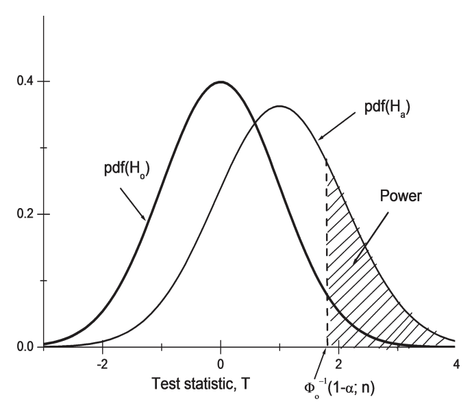


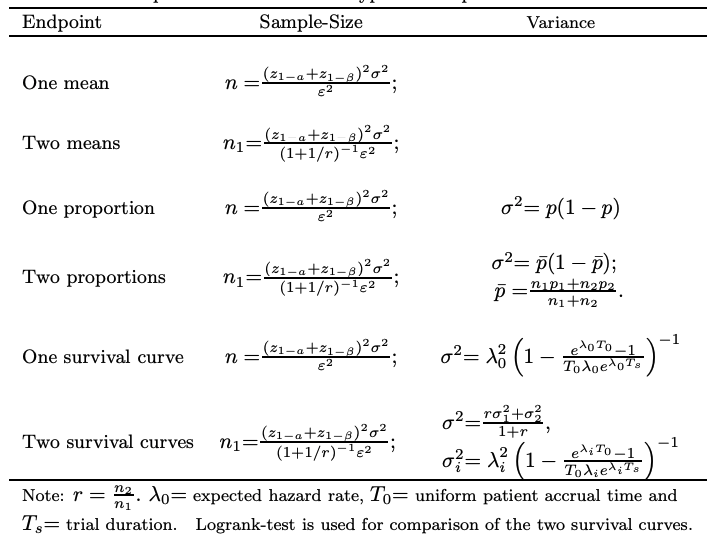

**Two-Group Noninferiority Trial**

There are three major sources of uncertainty about the conclusions from a
noninferiority (NI) study: (1) the uncertainty of the active-control effect over
a placebo, which is estimated from historical data; (2) the possibility that the
control effect may change over time, violating the “constancy assumption”;
and (3) the risk of making a wrong decision from the test of the noninferiority
hypothesis in the NI study, i.e., the type-I error. These three uncertainties
have to be considered in developing a noninferiority design method.

**Two-Group Equivalence Trial**


Pharmacokinetics (PK) is the study of the body’s absorption, distribution,
metabolism, and elimination of a drug. An important outcome of a PK study
is the bioavailability of the drug. The bioavailability of a drug is defined as the
rate and extent to which the active drug ingredient or therapeutic moiety is
absorbed and becomes available at the site of drug action. As bioavailability
cannot be easily measured directly, the concentration of drug that reaches the
circulating bloodstream is taken as a surrogate. Therefore, bioavailability can
be viewed as the concentration of drug that is in the blood. Two drugs are
bioequivalent if they have the same bioavailability. There are a number of
instances in which trials are conducted to show that two drugs are bioequivalent (Jones and Kenward, 2003): (1) when different formulations of the same
drug are to be marketed, for instance, in solid-tablet or liquid-capsule form;
(2) when a generic version of an innovator drug is to be marketed; (3) when
production of a drug is scaled up, and the new production process needs be shown to produce drugs of equivalent strength and effectiveness to that of the original process.

At the present time, average bioequivalence (ABE) serves as the current
international standard for bioequivalence (BE) testing using a 2 × 2 crossover
design. The PK parameters used for assessing ABE are area under the curve
(AUC) and peak concentration (Cmax). The recommended statistical method
is the two one-sided tests procedure to determine if the average values for the
PK measures determined after administration of the T (test) and R (reference)
products were comparable. This approach is termed average bioequivalence
(ABE). It is equivalent to the so-called confidence interval method, which involves the calculation of a 90% confidence interval for the ratio of the averages
(population geometric means) of the measures for the T and R products. To
establish BE, the calculated confidence interval should fall within a BE limit,
usually 80% − 125% for the ratio of the product averages. The 1992 guidance
has also provided specific recommendations for logarithmic transformation of
PK data, methods to evaluate sequence effects, and methods to evaluate outlier data.

In practice, people also use parallel designs and the 90% confidence interval
for nontransformed data. To establish BE, the calculated confidence interval
should fall within a BE limit, usually 80% − 120% for the difference of the
product averages.


## Adaptive Design Approach

1. **Flexible and Responsive Trials**: This approach allows modifications to the trial procedures based on interim data analysis, leading to more efficient and potentially more successful outcomes.
2. **Key Features**:
   - **Adaptive dose-ranging and better dose selection**: Doses can be adjusted based on ongoing results, leading to better efficacy and safety profiles.
   - **Adaptive combined Phase II/III design**: Reduces the number of necessary patients and shortens the overall trial duration by merging phases based on early results.
   - **Adaptive enrichment design**: Focuses on identifying the most suitable patient subpopulation for the treatment, thereby increasing the likelihood of successful outcomes.
   - **Test trial design assumptions early**: Allows for the testing and modification of initial assumptions, utilizing accumulating data to refine trial design.
   - **Adaptive sample size re-estimation**: Adjusts the number of participants as needed to maintain statistical power, reducing the risk of underpowered studies.
   - **Increased probability of success at Phase III**: By optimizing various elements throughout the earlier phases, the adaptive approach aims to enhance the likelihood of positive outcomes in the crucial Phase III.
   

 
 
## Trends in Adaptive Design: A Detailed Analysis

Adaptive design in clinical trials is evolving rapidly, with increasing complexity and regulatory support shaping its future directions. The integration of new statistical methods and broader applications signifies a dynamic shift towards more efficient and effective drug development processes.

### Phase I: Focus on Dosage Optimization

In Phase I of adaptive clinical trials, there is a significant shift towards designs that simultaneously evaluate toxicity and efficacy. This approach, guided by frameworks such as the FDA’s “Project Optimus,” emphasizes optimizing the dosage of drugs for oncologic diseases. The initiative, formally titled “Optimizing the Dosage of Human Prescription Drugs and Biological Products for the Treatment of Oncologic Diseases” and launched on August 24, encourages developing trials that define both the maximum tolerated dose (MTD) and the optimal biological dose (OBD) early in the clinical development process.

### Phase II: Enhanced Flexibility and Precision

Phase II trials are increasingly incorporating adaptive elements, particularly through designs that allow for interim futility analysis, a practice already common but growing in sophistication. Examples include:

- **Ib/II Trials**: These often use Cohort Expansion designs to refine efficacy estimates and decide on further development.
- **IIa/IIb Trials**: Employing methods like the MCP-Mod (Multiple Comparison Procedures and Modeling) to identify and confirm dose-response relationships seamlessly.
- **II/III Trials**: Utilizing Multi-Arm Multi-Stage (MAMS) frameworks to conduct Pick-the-Winner Dose-finding studies, seamlessly transitioning from dose finding to confirmation stages within the same trial.

### Phase III: Integration of Complex Elements

In confirmatory Phase III trials, interim analyses have become a standard practice, but there is now a growing interest in integrating these trials with more complex elements. This includes the use of advanced statistical methods and adaptive features that allow trials to be more responsive to emerging data without compromising on scientific rigor.

**Regulatory Landscape: Draft ICH E20 on Adaptive Clinical Trials**

Looking ahead to Q1 2025, the draft ICH E20 on Adaptive Clinical Trials represents a major milestone. This guideline is expected to:

- Align with current guidance, such as the FDA’s 2019 Guidance, which emphasizes pre-specification, the use of simulation, and maintaining trial integrity in adaptive designs.
- Discuss specific adaptive designs, potentially expanding beyond the generalized recommendations typically seen, to incorporate more detailed guidance on implementation.
- Include discussions on the intersection with other evolving topics, such as Bayesian approaches and the integration of Real-World Data, reflecting recent advances in these areas.

### Expansion Beyond Oncology

Significantly, there is continued interest in platform trials, particularly those building on successes in oncology (like Umbrella and Basket Master Protocol Trials) and Covid-19 therapeutics. These trial designs are expected to expand into non-oncology areas, leveraging their flexibility and efficiency to accelerate drug development across various therapeutic areas.
 

# Two-Stage Adaptive Confirmatory Design Method
 
There are three methods for two-stage adaptive design
methods. The methods are differentiated in terms of the test statistics defined
at each stage, while the test statistic is evidence against the null hypothesis in
terms of cumulative information (data). The three methods are constructed
based on three different ways to combine the so-called stagewise p-values: (1)
the sum of p-values (MSP), (2) the product of p-values (MPP), and (3) the
inverse-normal p-values (MINP). The MINP is a generalization of the test
statistics used in the classical group sequential design. The operating characteristics of MPP and MINP are very similar. The methods are very general,
meaning that they can be applied to broad adaptations and any number of
stages in the adaptive trials. However, we will focus on two-stage designs and
provide the closed forms for determination of stopping boundaries.
 
Suppose, in a two-group parallel design trial, that the objective is to test the treatment difference (**One Sided**)

$$
H_0: \mu_1=\mu_2 \text { versus } H_a: \mu_1>\mu_2
$$

The test statistic at the $k^{t h}$ stage is denoted by $T_k$, which is constructed based on cumulative data at the time of analysis. A convenient way to combine the data from different stages is to combine $p_i(i=1,2)$, the $p$-value from the subsample obtained at the $i^{\text {th }}$ stage. For a normal endpoint, the stagewise $p$-value is $p_i=1-\Phi\left(z_i\right)$, where $z_i$ is z-score calculated based on the subsample obtained at the $i^{t h}$ stage.

For group sequential design, the stopping rules at the first stage are

$$
\left\{\begin{array}{l}
\text { Reject } H_0 \text { (stop for efficacy) if } T_1 \leq \alpha_1 \\
\text { Accept } H_0 \text { (stop for futility) if } T_1>\beta_1 \\
\text { Continue with adaptations if } \alpha_1<T_1 \leq \beta_1
\end{array}\right.
$$

where $0 \leq \alpha_1<\beta_1 \leq 1$.
The stopping rules at the second stage are

$$
\left\{\begin{array}{l}
\text { Stop for efficacy if } T_1 \leq \alpha_2 \\
\text { Stop for futility if } T_1>\alpha_2
\end{array}\right.
$$

For convenience, $\alpha_k$ and $\beta_k$ are called the efficacy and futility boundaries, respectively.

To reach the second stage, a trial has to pass the first stage. Therefore, the probability of rejecting the null hypothesis $H_0$ or, simply, the rejection probability at the second stage is given by
$$
\operatorname{Pr}\left(\alpha_1<T_1<\beta_1, T_k<\alpha_2\right)=\int_{\alpha_1}^{\beta_1} \int_{-\infty}^{\alpha_2} f_{T_1 T_2}\left(t_1, t_2\right) d t_2 d t_1
$$
where $f_{T_1 T_2}$ is the joint probability density function (p.d.f.) p.d.f. of $T_1$ and $T_2$.

When the futility boundary $\beta_1=1$, futility stopping is impossible. In this case, the efficacy boundary at the second stage $\alpha_2$ is determined by formulation $\alpha_1+\operatorname{Pr}\left(\alpha_1<T_1<1, T_k<\alpha_2\right)=\alpha$. In comparison with the efficacy boundary $\alpha_2^*$ when there is a futility boundary $\beta_1$, it is obvious that $\operatorname{Pr}\left(\alpha_1<T_1<\beta_1, T_k<\alpha_2\right)=\operatorname{Pr}\left(\alpha_1<T_1, T_k<\alpha_2^*\right)$. It follows that $\alpha_2^* \leq \alpha_2$. However, in current practice, the futility boundary $\beta_1$ may not be followed by the pharmaceutical industry (nonbinding futility boundary); therefore, the FDA will not accept the $\alpha_2^*$ for the phase-III studies. Instead, the nonbinding futility boundary $\alpha_2$ is suggested. This is the so-called FDA's nonbinding futility rule.


## Method Based on Sum of p-Values

Chang (2006a) proposed an adaptive design method, in which the test statistic is defined as the sum of the stagewise $p$-values. This method is referred to as MSP and the test statistic at the $k^{t h}$ stage is defined as
$$
T_k=\Sigma_{i=1}^k p_i, k=1, \ldots, K
$$

Let $\pi_1$ and $\pi_2$ be the type-I errors spent (i.e., the probability of false rejection allowed) at the first and second stages, respectively. Under the nonbinding futility rule ( $\beta_1=\alpha_2$ ), the stopping boundaries $\alpha_1$ and $\alpha_2$ must satisfy the following equations:

$$
\left\{\begin{array}{l}
\pi_1=\alpha_1 \\
\pi_2=\frac{1}{2}\left(\alpha_2-\alpha_1\right)^2
\end{array}\right.
$$

Since $\pi_1+\pi_2=\alpha$, the stopping boundaries can be written as
$$
\left\{\begin{array}{l}
\alpha_1=\pi_1 \\
\alpha_2=\sqrt{2\left(\alpha-\pi_1\right)}+\pi_1
\end{array}\right.
$$

As soon as we decide the significant level $\alpha$ and $\pi_1$, we can determine the stopping boundaries $\alpha_1$ and $\alpha_2$

## Method with Product of p-Values 
 
This method is referred to as MPP. The test statistic in this method is based on the product of the stagewise $p$-values from the subsamples. For two-stage designs, the test statistic is defined as (Bauer and Kohne, 1994)

$$
T_k=\Pi_{i=1}^k p_i, k=1,2
$$

Under the nonbinding futility rule $\left(\beta_1=1\right)$, the $\alpha$ spent at the two stages are given by

$$
\left\{\begin{array}{l}
\pi_1=\alpha_1 \\
\pi_2=-\alpha_2 \ln \alpha_1
\end{array}\right.
$$

Since $\pi_1+\pi_2=\alpha$, the stopping boundaries can be written as
$$
\left\{\begin{array}{l}
\alpha_1=\pi_1 \\
\alpha_2=\frac{\pi_1-\alpha}{\ln \pi_1}
\end{array}\right.
$$

As soon as we decide $\alpha$ and $\pi_1$, we can determine the stopping boundaries $\alpha_1$ and $\alpha_2$  

It is interesting to know that when $p_1<\alpha_2$, there is no point in continuing the trial because $p_1 p_2<p_1<\alpha_2$ and efficacy should be claimed. Therefore it is suggested that we should choose $\beta_1>\alpha_1>\alpha_2$.


## Method with Inverse-Normal p-Values

Lehmacher and Wassmer (1999) proposed the test statistic at the $k^{t h}$ stage that results from the inverse-normal method of combining independent stagewise $p$-values:
$$
Z_k=\sum_{i=1}^k w_{k i} \Phi^{-1}\left(1-p_i\right)
$$

where the weights satisfy the equality $\sum_{i=1}^k w_{k i}^2=1$, and $\Phi^{-1}$ is the inverse function of $\Phi$, the standard normal c.d.f. Under the null hypothesis, the stagewise $p_i$ is usually uniformly distributed over $[0,1]$. The random variables $z_{1-p_i}=\Phi^{-1}\left(1-p_i\right)$ and $Z_k$ have the standard normal distribution. MINP is a generalization of classical GSD (details will be provided later).

To be consistent with MSP and MPP, we transform the test statistic $Z_k$ to the $p$-scale, i.e.,

$$
T_k=1-\Phi\left(\sum_{i=1}^k w_{k i} \Phi^{-1}\left(1-p_i\right)\right)
$$

the stopping boundary is on the $p$-scale and easy to compare with other methods regarding operating characteristics.

the classical group sequential boundaries are valid regardless of the timing and sample-size adjustment that may be based on the observed data at the previous stages. Note that under the null hypothesis, $p_i$ is usually uniformly distributed over $[0,1]$ and hence $z_{1-p_i}=\Phi^{-1}\left(1-p_i\right)$ has the standard normal distribution. The LehmacherWassmer method provides a broad method for different endpoints as long as the $p$-value under the null hypothesis is stochastically larger than or equal to the $p$-value that is uniformly distributed over $[0,1]$.

Examples of stopping boundaries for a two-stage design with weights, $w_1^2=$ $\frac{n_1}{n_1+n_2}$ 

In classical group sequential design (GSD), the stopping boundaries are usually specified using a function of stage $k$. The commonly used such functions are Pocock and O'Brien-Fleming boundary functions. Wang and Tsiatis (1987) proposed a family of two-sided tests with a shape parameter $\Delta$, which includes Pocock's and O'Brien-Fleming's boundary functions as special cases. Because W-T boundaries are based on the $z$-scale, for consistency, we can convert them to p-scale. The W-T boundary on $p$-scale is given by
$$
a_k=1-\Phi\left(\alpha_K \tau_k^{\Delta-1 / 2}\right)
$$
where $\tau_k=\frac{k}{K}$ or $\tau_k=\frac{n_k}{N_K}$ (information time), and $\alpha_K$ is the stopping boundary at the final stage and a function of the number of stages $K, \alpha$, and $\Delta$.

Let $n_i=$ stagewise sample-size per group at stage $i$ and $N_k=\sum_{i=1}^k n_i$ be the cumulative sample-size at stage $k$ and the information fraction (not information time!). If we choose $w_{k i}=\sqrt{\frac{n_i}{N_k}}$, then the MINP is consistent with the classical group sequential design.
 


# K-Stage Adaptive Confirmatory Design Methods

For the same hypothesis test with two stages, the test statistic for the two-stage design can be generalized to any $K$-stage design:
$$
\left\{\begin{array}{l}
T_k=\sum_{i=1}^k p_i \text { for MSP } \\
T_k=\prod_{i=1}^k p_i \text { for MPP } \\
T_k=1-\Phi\left(\sum_{i=1}^k w_{k i} z_{1-p_i}\right) \text { for MINP }
\end{array}\right.
$$

where $p_i$ is the stagewise $p$-value at stage $i$ and the subscript $k=1, \ldots, K$. When the weight $w_{k i}=\sqrt{\frac{n_i}{\sum_{i=1}^k n_i}}, T_k$ gives the test statistic for the classic group sequential design, where $\mathrm{n}_i$ is the same size of subsample from stage $i$.

The stopping rules at stage $k$ are:
$$
\begin{cases}\text { Stop for efficacy } & \text { if } T_k \leq \alpha_k, \\ \text { Stop for futility } & \text { if } T_k>\beta_k, \\ \text { Continue with adaptations if } \alpha_k<T_k \leq \beta_k,\end{cases}
$$
where $\alpha_k<\beta_k(k=1, \ldots, K-1)$, and $\alpha_K=\beta_K$. For convenience, $\alpha_k$ and $\beta_k$ are called the efficacy and futility boundaries, respectively.

## Determination of Stopping Boundary

### Analytical Formulation for MSP {-}

For Two Stage
$$
\left\{\begin{array}{l}
\pi_1=\alpha_1 \\
\pi_2=\frac{1}{2}\left(\alpha_2-\alpha_1\right)^2
\end{array}\right.
$$

Chang (2010) provides analytical solutions for up to five-stage designs. For the third stage, we have
$$
\pi_3=\alpha_1 \alpha_2 \alpha_3+\frac{1}{3} \alpha_2^3+\frac{1}{6} \alpha_3^3-\frac{1}{2} \alpha_1 \alpha_2^2-\frac{1}{2} \alpha_1 \alpha_3^2-\frac{1}{2} \alpha_2^2 \alpha_3 .
$$

After we obtained $\alpha_1$ and $\alpha_2$, we can ]obtain $\alpha_3$ for the stopping boundary using numerical methods.

The general steps to determine the stopping boundaries for $K$-stage designs can be described as follows:

* (1) Choose error spending $\pi_1, \ldots, \pi_{K-1}$, where $\sum_{k=1}^{K-1} \alpha_k<\alpha$.
* (2) Calculate the error spending at the last stage: $\pi_K=\alpha-\sum_{k=1}^{K-1} \alpha_k$.
* (3) Calculate the stopping boundary $\alpha_1, \alpha_2, \ldots, \alpha_K$, sequentially in that order.
 
### Analytical Formulation for MPP {-}

For Two Stage
$$
\left\{\begin{array}{l}
\pi_1=\alpha_1 \\
\pi_2=-\alpha_2 \ln \alpha_1
\end{array}\right.
$$

To determine the stopping boundaries for the first two stages with MPP, we use Two Stage above but replace $\alpha$ by $\pi_2$ :
$$
\left\{\begin{array}{l}
\alpha_1=\pi_1, \\
\alpha_2=\frac{\pi_2}{-\ln \alpha_1}
\end{array}\right.
$$

For the third stage, we have (Chang, 2015)
$$
\alpha_3=\frac{\pi_3}{\ln \alpha_2 \ln \alpha_1-\frac{1}{2} \ln ^2 \alpha_1}
$$

As soon as $\pi_1, \pi_2$, and $\pi_3$ are determined, $\alpha_1, \alpha_2$, and $\alpha_3$ can be easily obtained 

### Stopping Boundaries for MINP {-}

For MINP, the stopping boundaries can be determined through numerical integration or simulation (Table 4.3). Specifically, we use the two-stage adaptive design simulation R program with α1 = π1. Run the simulation under H0 using different values of α2 until the power is equal to π1 + π2. After we obtain the stopping boundaries α1 and α2, we use the three-stage simulation R program with α1 and α2 that have been determined, but try different values of α3 until the power is equal to α = 0.025.
 
##  Error-Spending Function

We want the error-spending $\pi_1, \ldots, \pi_K$ to follow a certain trend (e.g., monotonic increase), we set up a so-called error-spending function $\pi^*\left(\tau_k\right)$, where $\tau_k$ is the information time or sample size fraction at the $k^{t h}$ interim analysis. The commonly used error-spending functions with one-sided $\alpha$ are the O'Brien-Fleming-like error-spending function
$$
\pi^*\left(\tau_k\right)=2\left\{1-\Phi\left(\frac{z_{1-\alpha / 2}}{\sqrt{\tau_k}}\right)\right\}
$$
the Pocock-like error-spending function
$$
\pi^*\left(\tau_k\right)=\alpha \ln \left[1+\frac{e-1}{\tau_k}\right]
$$
and the power family
$$
\pi^*\left(\tau_k\right)=\alpha \tau_k^\gamma
$$
where $\gamma>0$ is a constant

The error-spending function $\pi^*\left(\tau_k\right)$ presents the cumulative error ( $\alpha$ ) spent up to the information time $\tau_k$. Therefore, the error to spend at the $k^{\text {th }}$ stage with information time $\tau_k$ is determined by
$$
\pi_k=\pi^*\left(\tau_k\right)-\pi^*\left(\tau_{k-1}\right)
$$

 
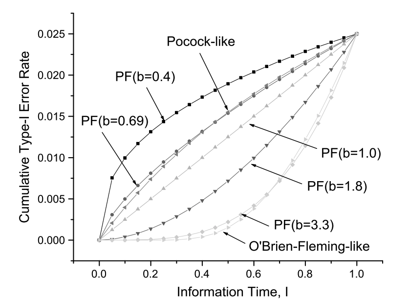

 
# Sample-Size Reestimation Design
 
It is desirable to have a trial design that allows for reestimation of sample-size at the interim analysis. Several different methods
have been proposed for sample-size reestimation (SSR), including the blinded, unblinded, and mixed methods.

1. **Futility Stopping**: Implementing a futility boundary can help reduce the sample size when early results suggest that continuing the trial would be inefficient due to a very small effect size. Even with an increased maximum sample size (Nmax), the trial may still lack sufficient power to detect a meaningful effect.

2. **Alpha Control**: In the adaptive methods discussed (MSP, MPP, and MINP with unblinded or mixed SSR), the sample size adjustment algorithm does not need to be set in advance. Instead, it can be determined based on the interim analysis results. This flexibility allows for more responsive adjustments to trial parameters based on accumulating data.

3. **Concerns with Predetermined Algorithms**: Using a predetermined algorithm for sample size adjustment may require revealing efficacy data to the Independent Data Monitoring Committee (IDMC), which could bias the trial. A mixed SSR approach offers a straightforward way to manage this issue, maintaining the trial's integrity without full disclosure of efficacy information.

4. **Relevance of Power**: Power is initially estimated to determine the trial's probability of rejecting the null hypothesis. However, when sample sizes are adjustable during interim analyses, the initial total sample size becomes less critical for final outcomes and more relevant for budgeting and operational planning. Key parameters like the minimum and maximum sample sizes (Nmim and Nmax) directly impact the trial’s power.

5. **Importance of Conditional Power**: In adaptive designs, conditional power, which measures the likelihood of success given interim results, is often more critical than overall power. MSP generally offers superior conditional power compared to other methods. Regulatory bodies often favor nonbinding futility rules, under which MSP usually performs better.

6. **Effectiveness of Mixed SSR Method**: Simulations suggest that the mixed SSR method is highly effective and preferable over purely blind or unblind SSR approaches. It is recommended for practical use due to its ability to manage type-I error slightly better. Adjusting the significance level (alpha) based on simulation results can further help control type-I error rates.

## The Blinded Approach
 
Wittes and Brittain $(1990)$ and Gould and Shih $(1992,1998)$ discussed methods of blinded SSR. A blinded SSR assumes that the actually realized effect size estimate is not revealed through unblinding the treatment code. In blinded sample size reestimation, interim data are used to provide an updated estimate of a nuisance parameter without unblinding the treatment assignments. Nuisance parameters mentioned in this context are usually the variance for continuous outcomes. Blinded sample reestimation is generally well accepted by regulators (ICH E-9, 1999).  

In clinical trials, the sample-size is determined by an estimated treatment difference and sample variability in the primary endpoint. Due to lack of knowledge of the test drug, the estimate of the variability is often not precise. As a result, the initially planned sample-size may turn out to be inappropriate and needs to be adjusted at interim analysis to ensure the power. A simple approach to dealing with nuisance parameter $\sigma$ without unblinding the treatment code is to use the so-called maximum information design. The idea behind this approach is that recruitment continues until the prespecified information level is reached, i.e., $I=N /\left(2 \hat{\sigma}^2\right)=I_{\max }$. For a given sample size, the information level reduces as the observed variance increases. The sample size per group for the two-group parallel design can be written in this familiar form:
$$
N=\frac{2 \sigma^2}{\delta^2}\left(z_{1-\alpha}+z_{1-\beta}\right)^2,
$$
where $\delta$ is treatment difference and $\sigma$ is the common standard deviation.
For the normal endpoint, the treatment difference from the pooled (blinded) data follows a mixed normal distribution with the variance (Chang, 2014)
$$
\left(\sigma^*\right)^2=\sigma^2+\left(\frac{\delta}{2}\right)^2
$$
where if we know (e.g., from a phase-II single arm trial) $\sigma^2$, we can estimate the treatment difference $\delta$, we can see that
$$
N=2\left(\frac{\left(\sigma^*\right)^2}{\delta^2}-\frac{1}{4}\right)\left(z_{1-\alpha}+z_{1-\beta}\right)^2
$$

If we use the "lumped variance" $\left(\sigma^*\right)^2$ at the interim analysis from the blinded data, the new sample size required for the stage 2 is $N_2=N-N_1$ or
$$
N_2=2\left(\frac{\left(\hat{\sigma}^*\right)^2}{\delta}-\frac{1}{4}\right)\left(z_{1-\alpha}+z_{1-\beta}\right)^2-N_1
$$
where the interim sample size is $N_1$.

## The Unblinded Approach

In this method, we will not adjust the sample size if the observed treatment is zero or less. Otherwise, the sample size will be adjusted to meet the targeted conditional power but with the limit of the maximum sample size allowed due to the cost and time considerations:
$$
n_2=\min \left(N_{\max }, \frac{2 \hat{\sigma}^2}{\hat{\delta}^2}\left[\frac{z_{1-\alpha}-w_1 z_{1-p_1}}{\sqrt{1-w_1^2}}-z_{1-c P}\right]^2\right), \text { for } \hat{\delta}>0
$$

where $c P$ is the target conditional power, $\sigma_0^2$ is the common variance, $n_2$ is the sample-size per group at stage 2 , and $z_x=\Phi^{-1}(x)$. Note that $\hat{\delta}$ and $\hat{\sigma}^2$ are MLEs from the unblinded data. A minimum sample size $N_{\min }$ can also be imposed.

**Stopping Boundaries for SSR**

When implementing an adaptive design in clinical trials, one common strategy is to re-estimate the sample size at a subsequent stage based on the interim results. The validity of stopping boundaries established under a fixed sample size setting (as might be done in a group sequential design or GSD) is questioned when these adjustments are made.

**For MINP** 

Under the assumption of normality, a linear combination of these variables would also be normally distributed. This would imply that adjustments to the sample size would not necessarily invalidate the established stopping boundaries if \(\tau_1\) were constant. However, because \(\tau_1\) itself is a function of \(n1\), which can change based on interim results (\(z1\) or \(p1\)), \(T2\) does not strictly remain a linear combination of two independent normal variables. Thus, adjustments to stopping boundaries might be necessary to maintain control over the type-I error rate.

**For MSP and MPP**

These methods rely on the assumption that the conditional distribution of the second stage p-value (\(p2\)) given the first stage p-value (\(p1\)) must be uniformly distributed within \([0,1]\) under \(H_0\). 

The independence of \(p1\) and \(p2\) holds if:

- The second stage mean (\(\overline{X}_2\)) is independent of \(p1\).
- Sample size \(n2\) at the second stage, however, is a function of \(p1\).

In designs without sample size re-estimation, \(p1\) and \(p2\) remain independent and uniformly distributed. But if \(n2\) is directly or indirectly adjusted based on \(p1\), this independence may be compromised. However, under the true null hypothesis and irrespective of \(n2\), \(p2\) remains uniformly distributed due to the properties of the standard normal distribution of the test statistic, allowing existing GSD boundaries to be applicable for MSP and MPP.

## The Mixed Approach

In this method, the sample-size adjustment has the similar formulation as for unblinded SSR but replaces the term $\frac{\hat{\sigma}^2}{\hat{\delta}^2}$ with blinded estimate $\frac{\hat{\sigma}^*}{\delta_0}$ :
$$
n_2=\min \left(N_{\max }, 2\left(\frac{\hat{\sigma}^*}{\delta_0}\right)^2\left[\frac{z_{1-\alpha}-w_1 z_{1-p_1}}{\sqrt{1-w_1^2}}-z_{1-c P}\right]^2\right), \hat{\delta}>0
$$
where $\delta_0$ is the initial estimation of treatment difference and $\left(\hat{\sigma}^*\right)^2$ is the variance estimated from the blinded data:
$$
\left(\hat{\sigma}^*\right)^2=\frac{\sum_{i=1}^N\left(x_i-\bar{x}\right)^2}{N}
$$

To reduce the sample size when the drug is ineffective ( $\delta$ is very small or negative), we need to have the futility boundary. Since the sample size adjustment is based on the blinded value $\frac{\hat{\sigma}^*}{\delta_0}$, while $z_{1-p_1}$ and the futility boundary are based on unblinded data, we call this method the mixed method.

Like the blinded maximum information SSR, the sample size adjustment with the mixed method will not release the treatment difference to the public. Most importantly the SSR method is much more efficient than all other methods: when the true treatment is lower than the initial estimation, the sample size will increase automatically to effectively prevent a large drop in power. However, the problem with this method is that it will increase the sample size dramatically even when the treatment effect is zero. Therefore, to avoid that, we have to use a futility boundary; for example, when the observed treatment effect is zero or less, the trial will be stopped.

# Special Two-Stage Group Sequential Trials

## Event-Based Design in Survival Analysis 


The discussion around survival analyses in clinical trials often pivots on whether to focus on the number of patients or the number of events like deaths or disease progression. Event-based designs are specifically structured around the occurrence of these clinical endpoints, not just patient counts. This focus is driven by the statistical models used which assume that the events at each stage are independent from each other.

**Independence of Statistics Across Stages:**
Traditional methods in survival analysis assume that the statistics at each stage are independent, meaning that the outcomes at one stage do not influence those at subsequent stages. For instance, the first group of patients enrolled—let's say \(N_1\) patients—is used for early interim analysis regardless of whether these patients have experienced the event or not.
 
The log-rank test, commonly used for this analysis type, relies on event counts. Its statistic at various stages is given by:
\[ T(D_k) = \sqrt{\frac{\hat{D}_k}{2}} \cdot \frac{\lambda_1}{\lambda_2} \sim N\left(\sqrt{\frac{D_k}{2}} \cdot \frac{\lambda_1}{\lambda_2}, 1\right) \]
Here, \( \hat{D}_k \) represents the observed events, and \( D_k \) represents the expected events at the \(k^{th}\) stage, with \( \lambda_1 \) and \( \lambda_2 \) as model parameters.

**Dependence Issues and Normal Approximation**

While the test statistics \( T(D_k) \) are not independent due to their reliance on the cumulative data across stages, studies by Breslow and Haug (1977) and Canner (1997) affirm that the normal approximation is still valid, even with a small number of events.

## Adaptive Design with Farrington-Manning Margin

**Noninferiority Margin in Clinical Trials**

In noninferiority (NI) trials, the objective is to demonstrate that the new treatment is not worse than the active control by more than a prespecified margin. There are two main approaches to define this margin:

1. **Prefixed Noninferiority Margin**: This is a fixed margin that is determined before the trial begins and is not dependent on the performance of the control group.
2. **Farrington-Manning Noninferiority Margin**: This margin is proportional to the effect of the active control group. It adjusts the margin based on how well the control group performs, making it a dynamic and potentially more fair measure in trials where the control group's performance can vary.

**Farrington-Manning Test for Noninferiority**

Originally proposed for trials with binary endpoints, this method has since been extended to adaptive designs that might have different types of endpoints (such as mean, proportion, or median survival time). The null hypothesis for this test is structured as follows:
\[ H_0: u_t - (1 - \delta_{NI}) u_c \leq 0 \]
where \( u_t \) and \( u_c \) are the responses for the test and control groups, respectively, and \( \delta_{NI} \) is a fraction between 0 and 1 that represents how close the test treatment's efficacy needs to be to the control's efficacy.

**Calculation of the Test Statistic**

The test statistic for evaluating this hypothesis is given by:
\[ z_k = \frac{\hat{u}_t - (1 - \delta_{NI}) \hat{u}_c}{\sqrt{\frac{\sigma_t^2}{n_k} + (1 - \delta_{NI})^2 \frac{\sigma_c^2}{n_k}}} \]
Here, \( \hat{u}_t \) and \( \hat{u}_c \) are the estimated responses for the test and control groups at the \(k^{th}\) stage, \( \sigma_t^2 \) and \( \sigma_c^2 \) are the variances of these estimates, and \( n_k \) is the number of subjects at stage \( k \). The variances are provided by supplementary tables or derived from prior data and are used to normalize the effect size difference between the two treatments.
 
It is noted that using the Farrington-Manning approach can lead to a reduction in variance compared to the prefixed margin approach. The variance in this context is calculated as:
\[ \sigma_t^2 + (1 - \delta_{NI})^2 \sigma_c^2 \]
This reduction in variance can enhance the power of the test to detect noninferiority, making the Farrington-Manning approach potentially more powerful than the fixed margin approach.

## Trial with Coprimary Endpoints

Clinical trials with diseases of unknown etiology or where no single clinical endpoint has been established as most crucial might use coprimary endpoints. This approach accounts for diseases that manifest in multiple ways, requiring trials to assess efficacy across several metrics simultaneously. Traditionally, trials focused on a single primary endpoint, but the need to address multiple facets of a disease has led to the development of methodologies that cater to multiple endpoints.

* **Hypothesis Testing**: For trials with coprimary endpoints, the null hypothesis typically states that the treatment is not superior (or noninferior) to the control for at least one of the endpoints. Rejection of this null hypothesis means the treatment has shown the desired effect across all coprimary endpoints.

* **Power and Sample Size**: The inclusion of multiple primary endpoints affects the power of the trial, which is the probability of correctly rejecting the null hypothesis when it is false. The overall power to detect an effect can be considerably reduced compared to a single-endpoint trial, depending on the correlation among the endpoints. Calculating sample size requires careful consideration to ensure sufficient power for all endpoints.

Equivalently we can write the hypothesis test as
$$
H_0: \cup_{j=1}^d H_{0 j} \text { versus } H_a: \cap_{j=1}^d H_{a j}
$$
where $H_{0 j}: \mu_j \leq 0$ and $H_{a j}: \mu_j>0$. The test statistics for these individual endpoints are defined in a usual way: $Z_{N j}=\sum_{i=1}^N X_{i j} / \sqrt{N}$. We reject $H_{0 j}$ if $Z_{N j} \geq c$, the common critical value for all endpoints. Therefore we reject (6.16), and furthermore reject (6.17) if $Z_{N j} \geq c$ for all $j$. It is straightforward to prove that for $\forall j$ and $k$, where $j, k=1,2, \ldots, d$, the covariance/correlation between the test statistics is the same as the covariance/correlation between the endpoints, i.e., $\operatorname{Corr}\left(Z_{N j}, Z_{N k}\right)=\rho$ for $j \neq k$.

Consider a two-stage ( $K=2$ ) clinical trial with an interim analysis planned at information time $\tau=0.5$ and the O'Brien-Fleming stopping boundaries are used; that is, the rejection boundaries are $z_{1-\alpha_1}=2.80$ and $z_{1-\alpha_2}=1.98$ at a one-sided level of significance $\alpha=0.025$.

## Trial with Multiple Endpoints

**Overview of Adaptive Designs for Multiple-Endpoint Trials:**

- **Context**: In situations where multiple endpoints are necessary, each endpoint contributes to a comprehensive assessment of the drug's efficacy. This might include primary efficacy endpoints and secondary endpoints critical for claiming drug efficacy or for regulatory approval.

**Methodology for Group Sequential Trials with Multiple Endpoints:**: These trials are designed to evaluate endpoints at multiple stages or times, using interim analyses to potentially stop the trial early based on the results at each stage.

**Procedures Proposed by Tang and Geller:**

- These procedures ensure that Type-I error is controlled across multiple testing points in a trial that assesses several endpoints. The use of closed testing procedures allows for rigorous testing of each endpoint while maintaining overall error rates within acceptable limits.
- The challenge lies in balancing the need to potentially conclude the trial early if significant results are found at interim stages against the risk of Type-I errors due to multiple comparisons.

**Procedure 1:**

1. **Interim Analyses**: Conduct interim analyses to test each hypothesis \( H_{0,K} \) using predefined stopping boundaries, which are set as one-sided alpha levels across different stages (denoted as \( K \)).
   
2. **Application of Closed Testing Procedure**: If a particular hypothesis \( H_{0,M} \) is rejected at a stage \( t^* \), the closed testing procedure is then applied to test all remaining hypotheses \( H_{0,F} \) using the test statistics gathered until \( t^* \) with adjusted critical values.
   
3. **Continuation Upon Non-Rejection**: If any hypothesis is not rejected at \( t^* \), the trial continues to the next stage. The closed testing procedure is repeated, with previously rejected hypotheses considered as rejected without retesting.
   
4. **Repetition Until Conclusion**: This step is repeated until either all hypotheses are rejected or the trial reaches its final planned stage.

**Procedure 2 (Modification of Procedure 1):**

- The initial steps are similar to Procedure 1, focusing on the application of interim analyses based on group sequential boundaries.
- **Adaptation at Subsequent Stages**: If \( H_{0,M} \) is rejected at \( t^* \), the closed testing procedure for remaining hypotheses uses updated test statistics and adjusted alpha levels up to any predetermined interim analysis time \( t^{**} \leq t^* \).
- **Automatic Rejection of Previously Rejected Hypotheses**: In subsequent stages, hypotheses that were previously rejected are automatically considered rejected without further testing.
- **Continuation and Repetition**: Similar to Procedure 1, the process is repeated until all hypotheses are addressed or the trial concludes.

**Example**

A phase-III two-parallel group non-Hodgkin’s lymphoma trial was designed with three analyses. The primary endpoint is progression-free survival (PFS); the secondary endpoints are (1) overall response rate (ORR) including complete and partial response and (2) complete response rate (CRR). The estimated median PFS is 7.8 months and 10 months for the control and test groups, respectively. Assume a uniform enrollment with an accrual period of 9 months and a total study duration of 23 months. The estimated ORR is 16% for the control group and 45% for the test group. The classical design with a fixed sample-size of 375 subjects per group will allow for detecting a 3-month difference in median PFS with 82% power at a one-sided significance level of α = 0.025. The first interim analysis (IA) will be conducted on the first 125 patients/group (or total N1 = 250) based on ORR. The objective of the first IA is to modify the randomization. Specifically, if the difference in ORR (test-control), ∆ORR > 0, the enrollment will continue. If ∆ORR ≤ 0, then the enrollment will stop. If the enrollment is terminated prematurely, there will be one final analysis for efficacy based on PFS and possible efficacy claimed on the secondary endpoints. If the enrollment continues, there will be an interim analysis based on PFS and the final analysis of PFS. When the primary endpoint (PFS) is significant, the analyses for the secondary endpoints will be performed for the potential claim on the secondary endpoints. During
the interim analyses, the patient enrollment will not stop. 

Generalized Teng-Geller’s procedure 2 with MINP for this trial as
illustrated below

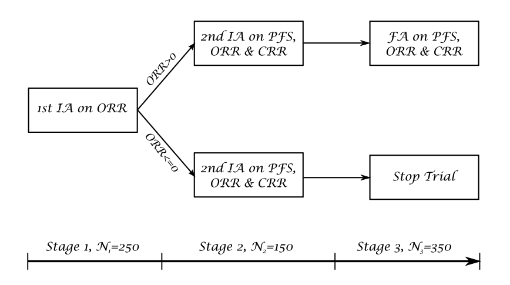


# Pick-the-Winners Design
 
**Adaptive Seamless Phase-II/III Design Explained:**

This design type combines elements from both phase-II and phase-III trials, typically referred to as a seamless adaptive design. It begins with what is known as the learning phase, akin to a traditional phase-II trial, which then seamlessly transitions into the confirmatory phase that mirrors a traditional phase-III trial. This design is particularly effective because it allows for the continuous learning and adaptation based on the data as it is collected.

**Stages of the Adaptive Design:**

1. **Selection Stage**: The initial part of the trial functions under a randomized parallel design where several doses (and potentially a placebo) are tested simultaneously. This stage determines the most effective or safest dose, referred to as 'the winner,' which will then be taken forward into the next phase of the trial.
   
2. **Confirmation Stage**: In this stage, new patients are recruited and randomized to either the selected dose or a placebo group. The trial continues with these groups to confirm the efficacy or safety profile identified in the selection stage. The final analysis incorporates cumulative data from both stages, which helps in affirming the drug's effectiveness or safety with greater precision.

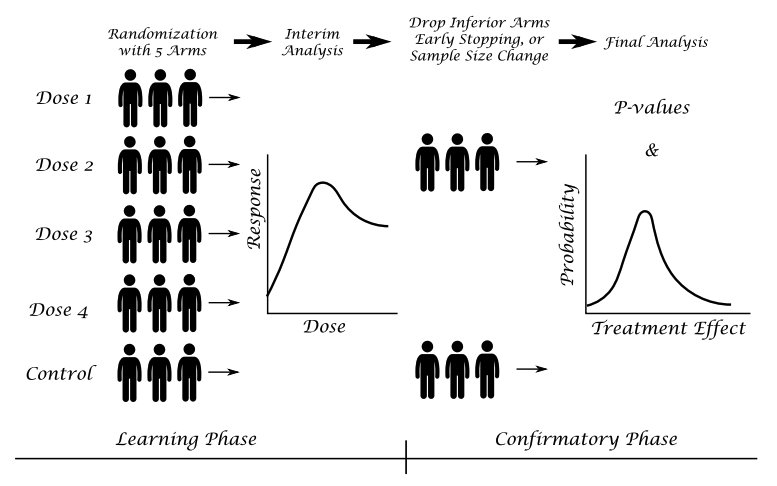

Huang, Liu, and Hsiao (2011) proposed a seamless design to allow prespecifying probabilities of rejecting the drug at each stage to improve the efficiency of the trial. Posch, Maurer, and Bretz (2011) described two approaches to control the type- error rate in adaptive designs with sample size reassessment and/or treatment selection. The first method adjusts the critical value using a simulation-based approach, which incorporates the number of patients at an interim analysis, the true response rates, the treatment selection rule, etc. The second method is an adaptive Bonferroni–Holm test procedure based on conditional error rates of the individual treatment–control comparisons. They showed that this procedure controls the type- error rate, even if a deviation from a preplanned adaptation rule or the time point of such a decision is necessary.

## Pick-the-Winner Design

Suppose in a $K$-group trial, we define the global null hypothesis as $H_G: \mu_0=$ $\mu_1=\mu_2 \cdots \mu_K$ and the hypothesis test between the selected arm (winner) and the control as
$$
H_G: \mu_0=\mu_s, s=\text { selected arm }
$$

Chang and Wang (2014) derive formulations for the two-stage pick-thewinner design with any number of arms. The design starts with all doses under consideration, at the interim analysis; the winner with the best response observed will continue to the second stage with the control group.

Suppose a trial starts with $K$ dose groups (arms) and one control arm (arm 0). The maximum sample size for each group is $N$. The interim analysis will perform on $N_1$ independent observations per group, $x_{i j}$ from $N\left(\mu_i, \sigma^2\right)$ $\left(i=0, . ., K ; j=1, \ldots, N_1\right)$. The active arm with maximum response at the interim analysis and the control arm will be selected and additional $N_2=$ $N-N_1$ subjects in each arm will be recruited. We denote by $\bar{x}_i$ the mean of the first $N_1$ observations in the $i^{t h}$ arm $(i=0,1, \ldots K)$, and $\bar{y}_i$ the mean of the additional $N_2$ observations $y_{i j}$ from $N\left(\mu_i, \sigma^2\right)\left(i=0, S ; j=1, \ldots, N_2\right)$. Here, $\operatorname{arm} S$ is the active arm selected for the second stage. Let $z_i=\frac{\bar{x}_i}{\sigma} \sqrt{N_1}$ and $\tau_i=\frac{\bar{y}_i}{\sigma} \sqrt{N_2}$, so that, under the $H_G, t_i$ and $\tau_i$ are the standard normal distribution with pdf $\phi$ and $\operatorname{cdf} \Phi$, respectively.

Define the maximum statistic at the end of stage 1 as
$$
Z_{(1)}=\max \left(t_1, t_2, \ldots, t_K\right)
$$

At the final stage, using all data from the winner, we define the statistic
$$
T^*=Z_{(1)} \sqrt{\tau}+\tau_s \sqrt{1-\tau}
$$
where $\tau=\frac{N_1}{N}$ is the information time at the interim analysis, and $s$ is the selected arm.

The final test statistic is defined as
$$
T=\left(T^*-t_0\right) / \sqrt{2}
$$
$$
F_T(t)=\int_{-\infty}^{+\infty} \int_{-\infty}^{\infty}\left[\Phi\left(\frac{z-\tau_s \sqrt{1-\tau}}{\sqrt{\tau}}\right)\right]^K \phi\left(\tau_s\right) \phi(\sqrt{2} t-z) d \tau_s d z
$$

When the information time $\tau=1$, for the Dunnett test:
$$
F_T(t)=\int_{-\infty}^{\infty}[\Phi(z)]^K \phi(\sqrt{2} t-z) d z
$$

## Seamless Phase 2a/b Combination Design

The concept of a Seamless Phase 2a/b Combination Design in clinical trials represents an innovative approach to streamline drug development by integrating what are traditionally two separate phases into a single, continuous study. This design allows for the more efficient evaluation of a therapeutic candidate, reducing the time and cost associated with transitioning between phases.  


1. **Integrated Study Phases**:
   - The design combines early dose-ranging studies (Phase 2a, typically focusing on safety and dosing) with efficacy studies (Phase 2b). This integration allows for continuous data collection and analysis without the administrative pause usually required between phases.

2. **Adaptive Design Elements**:
   - These trials often incorporate adaptive design features that allow modifications based on interim data. Such adaptations might include changes in dosing, sample size, or even the inclusion and exclusion criteria based on accumulating efficacy and safety data.

3. **Early and Continuous Efficacy Assessment**:
   - By merging Phase 2a and 2b, researchers can begin assessing efficacy earlier in the clinical development process and continuously adjust the trial's focus and objectives based on real-time results. This early efficacy data is critical in deciding whether to proceed to Phase 3.

**Typical Applications**

- **Oncology**: Given the urgent need for effective cancer treatments, seamless Phase 2a/b designs are particularly prevalent in oncology. They allow for rapid adjustments based on biomarker responses and early efficacy signals.
- **Rare Diseases**: In conditions with small patient populations, combining phases can make clinical development feasible by maximizing the information obtained from limited patient groups.
- **Fast-Moving Therapeutic Areas**: Diseases with high mutation rates such as infectious diseases (e.g., HIV, influenza) benefit from this approach, as it allows researchers to adapt quickly to changes in disease behavior or patient needs.


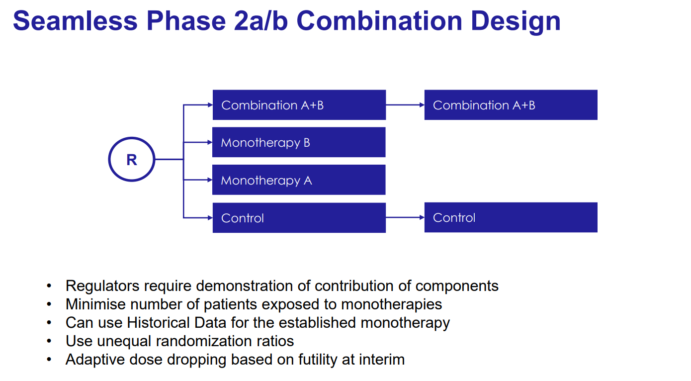

**Components of the Seamless Phase 2a/b Combination Design**

1. **Treatment Arms**:
   - **Combination A+B**: Patients receive a combination of two treatments, aiming to test the synergistic effects of the drugs.
   - **Monotherapy A**: Patients receive only Treatment A to evaluate its efficacy and safety as a standalone therapy.
   - **Monotherapy B**: Patients receive only Treatment B, similarly aimed at assessing its individual efficacy and safety.
   - **Control**: A control group that may receive a placebo or standard treatment, providing a baseline for comparing the effects of the experimental treatments.

2. **Randomization (R)**:
   - Patients are randomized to one of the treatment arms, ensuring that the assignment of patients is unbiased and that the treatment groups are comparable in terms of baseline characteristics.


**Key Features and Methodologies**

1. **Regulatory Requirements**:
   - Regulators often require clear evidence that each component of a combination therapy contributes to the therapeutic effects, necessitating a design that can isolate the effects of individual treatments.

2. **Minimize Exposure to Monotherapies**:
   - The design aims to minimize the number of patients exposed to monotherapies, especially if the combination therapy is hypothesized to be superior. This approach can reduce patient risk and improve ethical outcomes.

3. **Use of Historical Data**:
   - Historical data from previous studies involving the established monotherapy can be utilized to inform the study design and analysis, enhancing the efficiency of the trial by reducing the need for large sample sizes.

4. **Unequal Randomization Ratios**:
   - Randomization may be unequal to allocate more patients to promising treatment arms based on prior evidence or interim analysis findings. This can help in gathering more data where it is most needed to confirm efficacy and safety.

5. **Adaptive Dose Dropping Based on Futility at Interim**:
   - The trial design may include interim analyses to assess the futility of treatment arms. If an interim analysis shows that a particular dose or treatment is unlikely to be effective, it can be dropped from the study, focusing resources on more promising options.

6. **Contour Finding Methods**:
   - Advanced statistical methods, such as contour finding, might be employed to determine the optimal dosing combinations based on efficacy and safety data gathered throughout the trial. These methods help in visualizing the relationship between different dosages and their outcomes.
   
## Seamless P2a/b Dose Response Design


### Overview of the Design

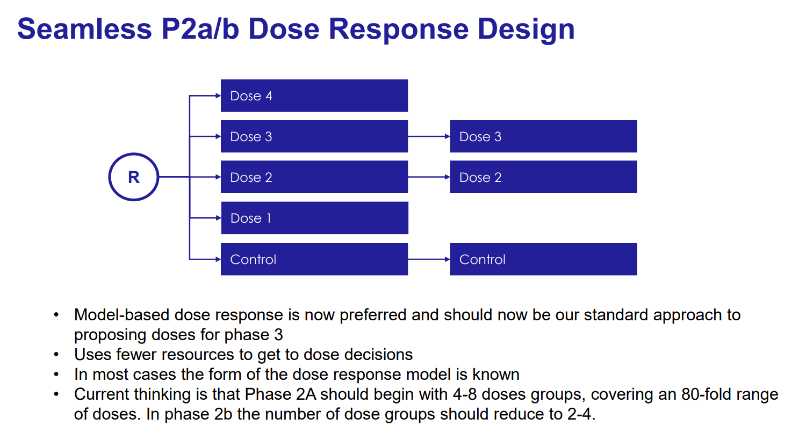
 

1. **Multiple Dose Levels**:
   - **Initial Setup**: Participants are randomized to one of several treatment groups, each receiving a different dose level (Dose 1, Dose 2, Dose 3, Dose 4) or a control group.
   - **Transition**: After initial findings, the study progresses into Phase 2b with a reduced number of dose groups, based on the data collected during the initial phase. Typically, only the most promising doses are carried forward to refine the dose-response relationship and confirm dosage for Phase 3.

2. **Control Group**:
   - Both phases include a control group for comparison, which is essential for assessing the efficacy and safety of the dose levels relative to standard treatment or placebo.

**Key Features and Methodologies**

1. **Model-Based Dose Response**:
   - This approach uses mathematical modeling to understand how different doses affect outcomes. By employing model-based analytics, the trial design is optimized to determine the most effective and safest dose with greater precision.
   - The model helps predict which doses are likely to be most effective, allowing for adjustments to be made seamlessly between the phases of the study.

2. **Resource Efficiency**:
   - Using fewer resources to reach dose decisions is a primary advantage. By reducing the number of dose levels in later phases, the study becomes more focused and efficient, concentrating resources on the most promising therapeutic options.

3. **Known Dose Response Model**:
   - Often, the general form of the dose-response relationship (e.g., linear, sigmoidal) is known from previous studies or related drugs. This prior knowledge allows for more accurate modeling and prediction from the data collected.

4. **Phasing Out Less Effective Doses**:
   - Initially, a broader range of doses is tested to capture the full potential dose-response curve. Based on interim analysis results, less effective or less safe doses are phased out, and the trial continues with a narrower range of more promising doses.
   - Typically, Phase 2a starts with more dose groups (4-8 doses covering a wide range), and by Phase 2b, this is reduced to 2-4 dose groups to focus on the refinement of the dose estimation.


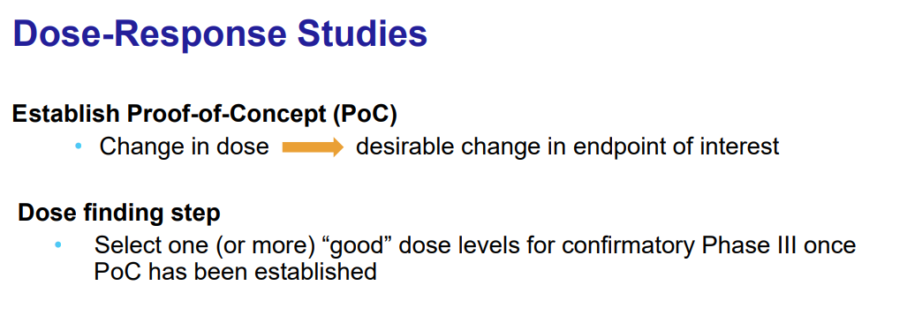

1. **Establishing Proof-of-Concept (PoC)**:
   - **Objective**: To demonstrate that a change in dose leads to a desirable change in the endpoint of interest. This could involve showing that increasing or decreasing the dose results in improved clinical outcomes or biomarker responses without unacceptable toxicity.
   - **Process**: The trial begins with a range of doses to ascertain the relationship between dose and response. This early phase is crucial for determining whether the drug has the desired biological effect and if it justifies further exploration.

2. **Dose Finding Step**:
   - **Objective**: To select one or more "good" dose levels for confirmatory Phase III trials, where efficacy, safety, and tolerability are rigorously tested in a larger patient population.
   - **Process**: Based on the data gathered during the initial phase of the trial, doses that show the best balance between efficacy and safety are selected for further testing. This phase involves refining the dose range and focusing on doses that have shown promising results in terms of efficacy and minimal side effects.
  

### Case Study - Seamless Design of Asthma Trial {-}

The objective of this trial in asthma patients is to confirm sustained treatment effect, measured as FEV1 change from baseline to the 1 year of treatment. Initially, patients are equally randomized to four doses of the new compound and a placebo. Based on early studies, the estimated FEV1 changes at week 4 are 6%, 12%, 13%, 14%, and 15% (with pooled standard deviation 18%) for the placebo (dose level 0) and dose levels 1, 2, 3, and 4, respectively. One interim analysis is planned when 60 per group or 50% of patients have the efficacy assessments. The interim analysis will lead to picking the winner (arm with best observed response). The winner and placebo will be used at stage 2. At stage 2, we will enroll additionally 60 patients per group in the winner and control groups.

The simulations show that the pick-the-winner design has 95% power with the total sample size of 420.

```{r,echo = F,message = FALSE, error = FALSE, warning = FALSE}
WinnerDesign <- function(nSims = 1000, NumOfArms = 5, mu0 = 0, sigma = 1, Z_alpha = 2.407, nStg1 = 100, nStg2 = 100) {
    
    xObs <- rep(0, NumOfArms)
    power <- 0

    for (iSim in 1:nSims) {
        MaxRsp <- xObs[1]
        SelectedArm <- 1

        for (i in 1:NumOfArms) {
            xObs[i] <- rnorm(1, mu[i], sigma / sqrt(nStg1))
            if (xObs[i] > MaxRsp) {
                SelectedArm <- i
                MaxRsp <- xObs[i]
            }
        }

        x2 <- rnorm(1, mu[SelectedArm], sigma / max(1, sqrt(nStg2)))
        FinalxAve <- (MaxRsp * nStg1 + x2 * nStg2) / (nStg1 + nStg2)
        x0Ave <- rnorm(1, mu0, sigma / sqrt(nStg1 + nStg2))
        TestZ <- (FinalxAve - x0Ave) * sqrt((nStg1 + nStg2) / 2) / sigma
        
        if (TestZ >= Z_alpha) {
            power <- power + 1 / nSims
        }
    }

    TotalN <- (NumOfArms + 1) * nStg1 + 2 * nStg2
    return(c("Power=" , power, "Total N=" , TotalN))
}

## Determine Critical Value Z alpha for 4+1 Arms Winner Design 
mu=c(0,0,0,0)
WinnerDesign(nSims=1000000,NumOfArms=4, mu0=0, sigma=1, Z_alpha=2.352, nStg1=60, nStg2=60)

## Determine Power for 4+1 Arms Winner Design
mu=c(0.12, 0.13, 0.14, 0.15)
WinnerDesign(nSims=100000,NumOfArms=4, mu0=0.06,sigma=0.18, Z_alpha=2.352, nStg1=60, nStg2=60)
```

## Seamless Phase 2b/3 Study Design

The **Seamless Phase 2b/3 Study Design** is an innovative clinical trial strategy that combines Phase 2b (often the dose confirmation phase) and Phase 3 (pivotal trials for efficacy and safety) into a single, continuous protocol. This design allows for a more fluid transition between the late-stage clinical development phases, reducing delays, and potentially accelerating the drug approval process. 

**Key Features of Seamless Phase 2b/3 Study Design**

1. **Continuous Trial Phases**:
   - Instead of conducting separate trials for Phase 2b and Phase 3, a seamless design merges these into one continuous trial. This approach typically involves an initial phase (an extension of Phase 2b) to confirm dosing and early efficacy, which then transitions directly into the broader Phase 3 studies focused on comprehensive efficacy and safety evaluations.

2. **Adaptive Modifications**:
   - The seamless design often incorporates adaptive features that allow the study parameters to be modified based on interim data analysis. This flexibility can include changes in dosage, sample size adjustments, selection of patient subgroups, or even the primary endpoints, depending on the emerging data.

3. **Regulatory Interactions**:
   - Continuous interaction with regulatory bodies is crucial to manage the transition points effectively. Interim results are often used to make go/no-go decisions and may require regulatory approval to proceed from the modified Phase 2b portion into the Phase 3 trials.

**Example Studies**:

* [Calliditas: Primary Biliary Cholangitis Liver Stiffness](https://classic.clinicaltrials.gov/ct2/show/NCT05014672)
* [PharmaMar: Metastatic Leiomyosarcoma](https://clinicaltrials.gov/study/NCT06088290)


 
# Add-Arms Design - Phase II Dose-Finding

## Introduction

The Add-Arms Design in clinical trials is a strategic approach primarily used in phase-II dose-finding studies to identify the Minimum Effective Dose (MED) of a drug. This design is pivotal for balancing efficacy and safety while managing the type-I error reasonably well. The MED is characterized as the dose level where the mean efficacy outcome matches a predefined target, using either a placebo or an active control as a reference.

**Key Features of Add-Arms Design:**

- **Efficacy and Safety**: The design takes into consideration both the efficacy and safety profiles of the drug. As the dosage increases, typically, so does the efficacy and the rate of adverse events. The aim is to find a dose that optimizes the balance between efficacy and adverse events.
- **Utility Function**: A common method involves using a utility function to integrate both efficacy and safety into a single measure of overall clinical utility. This utility function often exhibits an umbrella shape, indicating that there is an optimal dose that maximizes the overall benefit-risk ratio of the drug.
- **Objective**: In phase-II trials, the primary goal is often to test the efficacy and safety at the MED or the optimal dose against a control and then recommend whether it should proceed to phase-III trials.

**Methodology and Strategic Approach:**

- **Initial Stages**: The trial begins with a limited number of arms, typically starting with two dosage arms and a placebo group. This initial setup allows for an early assessment of the drug’s response profile.
- **Interim Analysis and Arm Addition**: At the first interim analysis, new arms may be added based on the responses observed from the initial arms and the underlying assumptions about the response curve (unimodal, including linear or umbrella-shaped). This step is crucial as it allows for adaptation based on early trial data without the need to test all possible doses initially.
- **Drop-Loser Strategy**: This strategy involves dropping the less effective arms early in the trial based on interim results, thus focusing resources on more promising dosage levels. The add-arm approach extends this by adding potentially more effective dosage arms during the trial as more data becomes available.

**Advantages of Add-Arms Design:**

- **Sample Size Efficiency**: By not carrying all doses to the end of the trial and adding new arms only based on promising interim results, this design can significantly reduce the sample size needed compared to traditional designs.
- **Focused Investigation**: It allows researchers to concentrate their efforts on doses that show the most promise based on ongoing trial results, thereby enhancing the efficiency and effectiveness of the trial.

**Statistical Considerations:**

- The design aims to maintain a balance between controlling the type-I error and achieving sufficient power to detect clinically meaningful effects. The flexibility of adding arms based on emerging data helps in fine-tuning the trial’s objectives towards these ends.
- The hypothesis testing in add-arms trials typically involves comparing each selected dose against the control under the assumption that they might lead to similar or better outcomes.

## Add-Arm Design (4+1 arm design)

The add-arm design is a three-stage adaptive design, in which we can use interim analyses and the unimode-response property to determine which doses cannot (unlikely) be the arm with best response–thus no exposure to those doses is necessary. 

For convenience, we define the global null hypothesis as $H_G: \mu_0=\mu_1=$ $\mu_2=\cdots=\mu_K$ and the hypothesis test between the selected arm (winner) and the control as
$$
H_0: \mu_0=\mu_s, s=\text { selected arm }
$$

In the $4+1$ arm design, there are $K=4$ dose levels (active arms) and a placebo arm (dose level 0). Theoretically, if we know dose 2 has a larger response than dose 3 , then we know, by the unimode-response assumption, that the best response arm can be either dose 1 or 2 , but not dose 4 . Therefore, we don't need to test dose 4 at all. Similarly, if we know dose 3 has a larger response than dose 2 , then we know, by the unimode-response assumption, that the best response arm can be either dose 4 or 3 , but not dose 1 . Therefore, we don't need to test dose 1 at all. The problem is that we don't know the true responses for doses 2 and 3 . We have to find them out based on the observed responses. Of course, we want the observed rates to reflect the true responses with high probability, which mean the sample size cannot be very small.


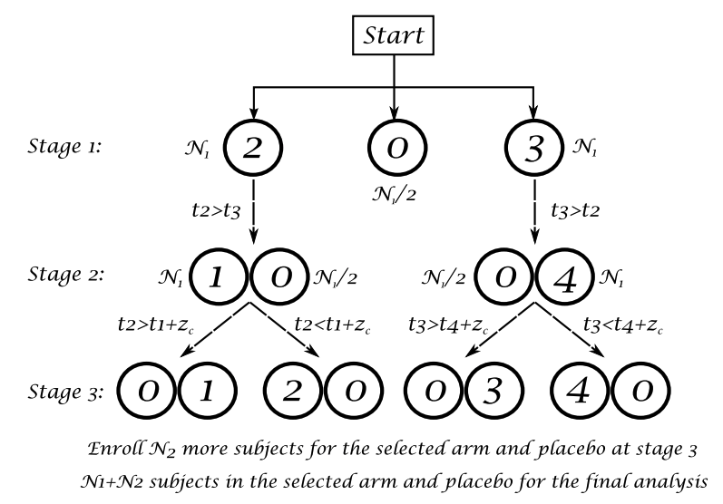

At the first stage, randomize subjects in two active and the placebo groups. The second stage is the add-arm stage, at which we determine which arm to be added based on the observed data from the first stage and the unimodal property of the response curve. At the third or final stage, more subjects will be added to the winner arm and the placebo. The randomization is specified as follows:

- Stage 1: Assign 2.5 $N_1$ subjects in arms 2, 0, and 3 using randomization ratio $N_1: N_1 / 2: N_1$.
- Stage 2: If $t_2>t_3$, assign $1.5 N_1$ subjects in arms 0 and 1 using a $N_1 / 2: N_1$ randomization. If $t_2 \leq t_3$, assign $1.5 N_1$ subjects in arm 0 and 4 using a $N_1 / 2: N_1$ randomization.
- Stage 3: (a) If $t_2>t_3$ and $t_2-t_1>c_R$, select arm 2 as the winner; otherwise, select arm 1 as the winner. If $t_2 \leq t_3$ and $t_3-t_4>c_R$, select arm 3 as the winner; otherwise, select arm 4 as the winner. (b) Assign $2 N_2$ subjects in arms 0 and the winner arm using $N_2: N_2$ randomization.

Therefore, there will be $4 N_1+2 N_2$ total subjects. In the final analysis for the hypothesis test, we will use the data from $N_1+N_2$ subjects in the winner and $N_1+N_2$ subjects in arm 0 .

**Note for Randomization**

Use a $N_1 / 2: N_1: N_1$ randomization instead of a $N_1: N_1: N_1$ randomization. This is because the imbalanced randomization can keep the treatment blinding and balance the confounding factors at both stages. If N1 placebo subjects all randomized in the first stage, then at the second stage all N1 subjects will be assigned to the active group without randomization, thus unblinding the treatment and potentially imbalancing some (baseline) confounding factors.

To summarize, the two key ideas in this design are: (1) using the unimoderesponse property to determine which arms not to explore, and (2) determining the rule (cR) for picking the winner so that the selection probabilities for all active arms are (at least approximately) equal under a flat response curve.

## Controlling Selection Probability and Type-I Error

When implementing add-arm designs in clinical trials, especially those with multiple dose levels such as the 4+1 design, managing selection probability and controlling Type-I error are critical components.

**Establishing Thresholds and Critical Values**

1. **Threshold Determination**:
   - The threshold \( c_R \) and the critical value for the rejection of the global null hypothesis \( H_G \) are typically established through extensive simulation. For example, simulations might be run millions of times to ensure robustness in the estimation of these parameters.

2. **Simulation Results**:
   - The simulations help in understanding how the alpha (Type-I error rate) is distributed across different arms under the null hypothesis. For instance, in a 4+1 design, the simulation might show varying proportions of alpha spent per arm, which reflects the differential likelihood of erroneously rejecting the null hypothesis for each arm.

3. **Equitable Selection**:
   - Ideally, \( c_R \) is set so that there is an equal chance of selecting any dose when all doses are equally effective. However, the alpha distribution among the arms can be tailored based on prior knowledge or strategic considerations, aiming to allocate more resources to more promising doses.
   
**Modifying Stopping Boundaries**

- **Adaptive Adjustments**:
  - It’s sometimes necessary to adjust \( c_R \) and the information time \( \tau \) to modify how alpha is spent among the doses. These adjustments help in achieving a more powerful design while ensuring that the familywise error rate remains controlled.
  
- **Control of Familywise Error**:
  - The stopping boundaries must be adjusted whenever changes to \( c_R \) or \( \tau \) are made, ensuring that the overall Type-I error rate across all arms and stages of the trial is within acceptable limits.
   
## Case Study 

### Phase-II Dose-Finding Designs {-}

For phase-II dose-finding trials, we need to define response value at the minimum effective dose (MED), $\mu_{M E D}$, which will be used to define the utility function:
$$
U=\frac{1}{\left(\mu_i-\mu_{M E D}\right)^2}
$$
where $\mu_i$ is the response in arm $i$. Using this utility, we can convert the problem of finding the MED to the problem of finding the dose with the maximum utility $U$ because at or near the MED, the maximum of $U$ is achieved. However, to prevent a numerical overflow in the simulation, we have implemented the utility using
$$
U=\frac{1}{\left(\hat{\mu}_i-\mu_{M E D}\right)^2+\varepsilon}
$$
where $\varepsilon>0$ is a very small value (e.g., 0.00000001 ) introduced to avoid a numerical overflow when the observed $\hat{\mu}_i=\mu_{M E D}$.


Anemia, specifically iron deficiency anemia (IDA), is a widespread condition characterized by a lack of sufficient healthy red blood cells, primarily due to iron deficiency. This deficiency impedes the body's ability to produce adequate red blood cells, which are vital for transporting oxygen throughout the body. The most common causes of IDA include significant blood loss through menstruation, pregnancy-related issues, gastrointestinal bleeding, chronic illnesses like cancer, and chronic kidney disease (CKD).

In this context, FXT, an intravenous (IV) drug candidate, has been developed to treat IDA. The primary safety concerns associated with IV iron therapies like FXT include serious hypersensitivity reactions and potential cardiovascular events. The therapeutic objective is to determine the minimum effective dose (MED) of FXT, ideally providing a significant yet safe elevation in hemoglobin levels. The minimal clinically meaningful increase in hemoglobin (Hg) has been identified as 0.5 g/dL.

The design of the clinical trial for FXT involves testing four active doses: 200 mg, 300 mg, 400 mg, and 500 mg. The primary endpoint for the trial is the change in hemoglobin levels from baseline to week 5. Assuming an Emax model, the expected responses for these doses are calculated, with the placebo showing negligible effect due to its objective measurement in a laboratory setting.

The target for the MED is set above the minimal clinically meaningful difference at 0.7 g/dL. This target is chosen because defining the MED at a 0.5 g/dL increase results in a 50% chance that the actual observed response will be below this threshold. Setting the target at 0.7 g/dL aims to ensure that the observed response at the MED exceeds 0.5 g/dL with significantly higher probability.

To optimize the trial design, both add-arm and drop-arm strategies are employed:

- **Add-arm design**: Starts with fewer dose arms and allows for the addition of new doses based on interim analysis results. This approach is particularly useful for adjusting the trial based on early indications of efficacy and safety.
- **Drop-arm design**: Begins with multiple dose arms, and less effective or riskier ones are dropped as the trial progresses based on predefined criteria.

The efficacy of these designs is evaluated through simulations, which help determine the probability of selecting each dose as the best option and calculate the total sample size required for robust statistical power. The add-arm design typically requires fewer subjects compared to the drop-arm design, offering a more resource-efficient approach while maintaining a high level of statistical power and controlling the type-I error rate effectively.

$$
\begin{array}{cccccc}
\hline \text { Design method } & d_1 & d_2 & d_3 & d_4 & \text { Sample size } \\
& 200 \mathrm{mg} & 400 \mathrm{mg} & 500 \mathrm{mg} & 300 \mathrm{mg} & \\
\hline \text { Add-arm design } & 0.074 & 0.436 & 0.326 & 0.164 & 360 \\
\text { Drop-arm design } & 0.102 & 0.319 & 0.296 & 0.283 & 432\\
\hline 
\end{array}
$$


```{r,echo = F,message = FALSE, error = FALSE, warning = FALSE}
FourPlus1AddArmDesign <- function(nSims = 10000, N1 = 100, N2 = 100, c_alpha = 2.267, cR = 0.55652, mu0 = 0, sigma = 1) {
    Power = 0
    SelProb = rep(0, 4)
    xObs = rep(0, 4)
    
    for (iSim in 1:nSims) {
        for (i in 1:4) {
            xObs[i] = rnorm(1, mu[i], sigma / sqrt(N1))
        }
        
        if (xObs[2] > xObs[3]) {
            SelectedArm = 2
            if (xObs[1] * sqrt(N1) / sigma > xObs[2] * sqrt(N1) / sigma - cR) {
                SelectedArm = 1
            }
        }
        if (xObs[2] <= xObs[3]) {
            SelectedArm = 3
            if (xObs[4] * sqrt(N1) / sigma > xObs[3] * sqrt(N1) / sigma - cR) {
                SelectedArm = 4
            }
        }
        
        MaxRsp = xObs[SelectedArm]
        x2 = rnorm(1, mu[SelectedArm], sigma / sqrt(N2))
        FinalxAve = (MaxRsp * N1 + x2 * N2) / (N1 + N2)
        x0Ave = rnorm(1, mu0, sigma / sqrt(N1 + N2))
        TestZ = (FinalxAve - x0Ave) * sqrt((N1 + N2) / 2) / sigma
        
        if (TestZ >= c_alpha) {
            Power = Power + 1 / nSims
        }
        
        for (i in 1:4) {
            if (SelectedArm == i) {
                SelProb[i] = SelProb[i] + 1 / nSims
            }
        }
    } # End of iSim
    
    TotalN = 4 * N1 + 2 * N2
    return(c("power=" , Power, "Sample Size=" , TotalN, "Selection Prob=" , SelProb))
}


## Invoke the Function:
mu = c(0, 0, 0, 0)
FourPlus1AddArmDesign(nSims = 100000, N1 = 100, N2 = 100, c_alpha = 2.267, cR = 0.55652, mu0 = 0, sigma = 1)

mu = c(0.4, 0.58, 0.7, 0.45)
FourPlus1AddArmDesign(nSims = 10000, N1 = 116, N2 = 116, c_alpha = 2.267, cR = 0.55652, mu0 = 0.35, sigma = 0.9)

mu = c(0, 0, 0, 0)
FourPlus1AddArmDesign(nSims = 100000, N1 = 30, N2 = 70, c_alpha = 2.267, cR = 0.55652, mu0 = 0, sigma = 1)

```

### Phase-II/III Seamless Designs {-}

This hypothetical phase-II-III seamless design is motivated by an actual asthma clinical development program. AXP is a second generation compound in the class of asthma therapies known as 5-LO inhibitors, which block the production of leukotrienes. Leukotrienes are major mediators of the inflammatory response. The company’s preclinical and early clinical data suggested that the drug candidate has potential for an improved efficacy and is well tolerated under the total dose of 1600 mg.

The objective of the multicenter seamless trial is to evaluate the effectiveness (as measured by FEV1) of oral AXP in adult patients with chronic asthma. Patients were randomized to one of five treatment arms, arm 0 (placebo), arm 1 (daily dose of 200 mg for 6 weeks), arm 2 (daily dose of 400 mg for 4 weeks), arm 3 (daily dose of 500 mg 3 weeks), and arm 4 (daily dose of 300 mg for 5 weeks). Since the efficacy is usually dependent on both AUC and Cmax of the active agent it is difficult to judge at the design stage exactly which dose-schedule combination will be the best. However, based on limited data and clinical judgment it might be reasonable to assume that the following dose sequence might show a unimodal (umbrella) response curve: arm 1, arm 2, arm 3, and arm 4. The dose responses are estimated to be 8%, 13%, 17%, 16%, and 15% for the placebo and the four active arms with a standard deviation of 26%.

We compare the 4+1 add-arm design against the drop-arm design. A total sample size of 600 subjects (N1 = N2 = 100) for the add-arm design will provide 89% power. We have also tried other different dose sequences, including wavelike sequence; the simulation results show that the power ranges from 88% to 89%, except for the linear response, which provides 86% power. Comparing the drop-arm design, 602 subjects (N1 = N2 = 86) will provide only 84% power, regardless of dose sequence. 

## Extension of Add-Arms Designs

The 4+1 add-arm design is a flexible approach in clinical trials that can be customized to include more arms, incorporate early rejections, and implement interim futility stopping while maintaining the same stopping boundaries if a nonbinding futility rule is used.

The 5+1 Add-Arm Design introduces five active arms plus a placebo, enhancing the trial's ability to evaluate multiple dosages. This design adjusts the number of subjects and the allocation across different arms based on the responses observed in interim analyses, using a detailed randomization plan:
 
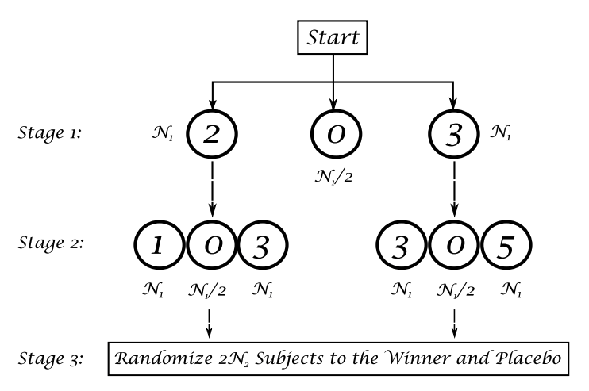

- In the first stage, a specific number of subjects are distributed among three selected arms based on their initial performance. 
- The second stage's assignment depends on the comparative performance of two of these arms, directing new subjects into other arms that now seem more promising based on earlier results.
- By the third stage, the design focuses on confirming the efficacy of the leading candidates from the earlier stages, finalizing the selection based on a predefined threshold for response differences.

The 6+1 and 7+1 Add-Arm Designs expand on this by increasing the number of active arms, thus broadening the investigation scope and potentially improving the robustness of the findings through a more extensive comparative analysis. These designs follow a similar structure:


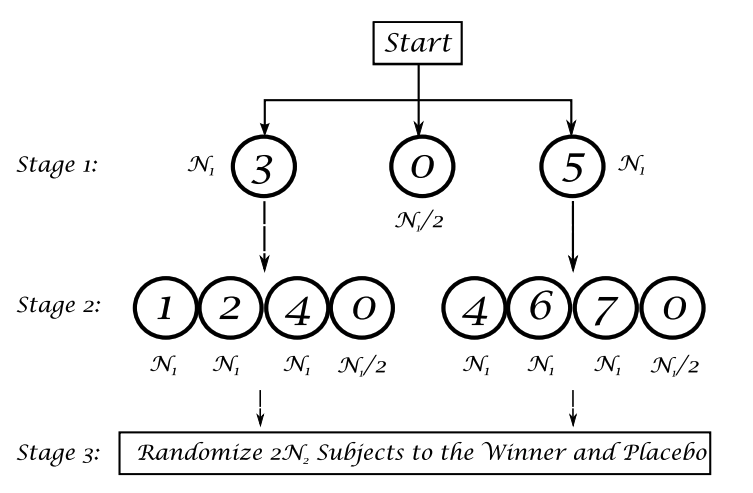

- They start by allocating subjects among selected arms based on predefined randomization ratios.
- Subsequent stages refine these choices by focusing on the arms that show the most promise compared to their counterparts, with decisions guided by specific response thresholds and comparisons.

All these designs aim to optimize the dosing strategy by dynamically adjusting the trial arms based on ongoing results, which helps in accurately pinpointing the most effective treatment with statistical efficiency. The goal is to manage the overall trial resources better and potentially speed up the development process by quickly dropping less effective or less safe options.


# Adaptive Dose-Escalation Trial (Oncology)

There are two commonly used approaches for oncology dose-escalation trials: (1) the algorithm-based escalation rules, and (2) modelbased approaches. The second approach can be a frequentist or Bayesianbased response-adaptive method and can be used in any dose-response trials.

## Oncology Dose-Escalation Trial

Oncology dose-escalation trials are a critical component in the development of new cancer treatments, particularly for life-threatening conditions where the potential toxicity of therapies can pose significant risks. These trials are designed to identify the maximum tolerated dose (MTD) of a drug, which is defined as the highest dose that can be administered to patients without causing unacceptable levels of dose-limiting toxicity (DLT).

**Dose Level Selection**

In oncology, the initial dose for phase-I trials is generally conservative to ensure patient safety, often set at a level that induces mortality in 10% of mice (LD10). This is the starting point, and doses escalate from there according to a predetermined scheme, such as the multiplicative Fibonacci sequence. This sequence increases doses in a controlled manner to approach but not exceed the biologically active and potentially toxic dose.

**Traditional Escalation Rules**

The traditional "3+3" dose-escalation rule is commonly used in early-phase clinical trials. Under this rule:

- Three patients are treated at the current dose level.
- If one patient experiences a DLT, three more patients are treated at the same dose.
- The dose is escalated if no more than one of these six patients experiences a DLT.
- This process continues until the MTD is identified based on predefined toxicity thresholds.

The "3+3" rule and its variants, like the "A+B" escalation rule, allow for structured dose increases while closely monitoring patient safety. The "A+B" model adapts the escalation process based on the DLT outcomes among a specific number of patients, offering flexibility to adjust the trial protocol based on emerging data.

**A+B Escalation with and without Dose Deescalation**
The A+B escalation designs can include mechanisms for both escalating and de-escalating doses, enhancing the trial's adaptability:

- If toxicities are within acceptable limits, the trial progresses to higher doses.
- Excessive toxicities trigger a de-escalation to lower, safer doses.
- These rules ensure that each dose level is adequately tested while maintaining patient safety and collecting robust data on the drug’s efficacy and side effects.

Such designs are crucial in oncology, where patient responses to drug doses can vary widely and the balance between efficacy and toxicity is delicate.

## Continual Reassessment Method 

The continual reassessment method (CRM) is a sophisticated statistical approach used primarily in dose-finding studies, particularly within oncology trials. This method dynamically updates its dose-response model based on patient outcomes as the trial progresses, making it more responsive and potentially more efficient than traditional methods like the "3+3" design.

**Probability Model for Dose-Response**
CRM utilizes a probability model to estimate the likelihood of a response based on dosage. A logistic model is commonly applied:

\[ P(x) = \left[1 + b \exp(-ax)\right]^{-1} \]

Here, \(x\) represents the dose level, \(P(x)\) is the probability of observing a response at dose \(x\), \(b\) is a constant, and \(a\) is a parameter that gets updated as more data becomes available.

**Likelihood Function**
The likelihood function for the CRM is constructed using observed patient responses. If \(y_i\) is the response of the \(i\)th patient at dose level \(x_{mi}\), the likelihood is based on whether a response was observed or not:

- \(y_i = 1\) if a response is observed
- \(y_i = 0\) if no response is observed

This setup contributes to the Bayesian framework where prior and posterior distributions help in estimating the parameters more accurately.

**Prior Distribution of Parameter**
In Bayesian statistics, prior knowledge about the parameter \(a\) is necessary. This can be represented by a prior distribution \(g_0(a)\), which might be non-informative if little is known about the parameter before the trial.

**Reassessment of Parameter**
The parameter \(a\) is reassessed continually using the accumulated data from the trial. This can be done through Bayesian updating, where a posterior probability distribution of \(a\) is derived, or by using frequentist methods like maximum likelihood estimation. These updates help refine the predictions of the dose-response relationship as the trial progresses.

**Assignment of Next Patient**
The next patient's dose level is determined based on the updated dose-response model, aiming to assign them to a dose close to the current estimate of the MTD. This process uses the updated predictive probability:

\[ P(x) = \int \left[1 + b \exp(-ax)\right]^{-1} g_n(a|r) \, da \]

where \(g_n(a|r)\) is the updated posterior distribution of \(a\) given the data.

**Stopping Rule**
The trial employs a pragmatic stopping rule to ensure efficiency and safety. Typically, if a certain number of patients, say six, have been treated at the same dose level and this level has repeatedly been estimated as the MTD, then the trial may conclude that this dose is the MTD and stop further recruitment to this dose level. This avoids overexposure of patients to potentially suboptimal doses and focuses resources on confirming the most promising dose levels.

# Enrichment

## Introduction

An **Enrichment Strategy** in clinical trials is designed to enhance the probability of demonstrating a treatment effect by selecting patients who are more likely to respond to the treatment based on predefined criteria. This approach can be particularly beneficial when there's a clear hypothesis that a specific subgroup of the population may exhibit a stronger response or better tolerance to the treatment. 

1. **Identification of Subgroups**:
   - Population enrichment involves identifying subgroups within a broader population that are expected to show an enhanced treatment effect. These subgroups can be defined based on genetic markers, disease severity, demographic characteristics, or prior treatment response. The identification should be based on robust scientific evidence suggesting that these subgroups are more likely to benefit from the treatment.

2. **Enrichment at Baseline**:
   - Enrichment strategies are implemented at the start of the trial by enrolling patients who meet specific subgroup criteria. This approach ensures that the study population consists predominantly of individuals who are more likely to respond to the intervention, potentially leading to more pronounced treatment effects and more efficient study outcomes.

3. **Interim Analysis and Adaptation**:
   - Trials with an enrichment strategy often include an interim analysis to assess preliminary data on efficacy and safety. Based on these interim results, the trial may adapt by focusing further recruitment on the identified responsive subgroups or modifying treatment regimens for certain subgroups.
   - The adaptation based on interim findings must be pre-defined in the study protocol to ensure transparency and regulatory compliance. This pre-definition includes specifying the criteria for adaptation and the statistical methods to be used.
   - The timing and criteria for interim analysis require meticulous planning. The analysis should be timed to allow sufficient data accumulation to make informed decisions without compromising the integrity of the trial or unduly delaying the overall study timeline.
   - Decisions on whether to continue, modify, or stop the trial (or parts of it) based on interim results should be planned and documented in advance.

4. **Simulation of the Trial Design**:
   - Before implementing an enrichment design, thorough simulations are necessary to understand the operating characteristics of the trial. Simulations help predict how the trial might perform under various scenarios, including different rates of recruitment, varying degrees of treatment effects within subgroups, and potential dropout rates.
   - These simulations are crucial for assessing the feasibility of the trial, estimating the necessary sample size, and understanding the impact of enrichment strategies on the power and type I error rate of the study.
   
## Case Study

The TAPPAS trial provides an illustrative example of applying adaptive design principles in a clinical trial setting, particularly for treating a rare cancer with limited treatment options.  

**Angiosarcoma and Current Treatments**

- **Disease Background**: Angiosarcoma is a rare and aggressive form of cancer that arises from the endothelial cells lining the blood vessels and can occur in any area of the body. The disease is known for its rapid progression and poor prognosis.
- **Current Treatments**: Treatment options for angiosarcoma are limited, typically involving surgery, radiation, and chemotherapy. Pazopanib, a vascular endothelial growth factor (VEGF) inhibitor, has shown modest benefits in treating this disease but is often not curative and has a limited impact on overall patient survival.

**Combination Therapy in the TAPPAS Trial**

- **Pazopanib**: This drug inhibits angiogenesis (formation of new blood vessels) by targeting VEGF receptors, which are often overexpressed in tumor cells.
- **TRC105**: A novel therapeutic agent that targets endoglin, another protein involved in angiogenesis. Endoglin is critical for blood vessel growth, particularly in tumor environments. Combining TRC105 with pazopanib is hypothesized to provide a dual inhibition of angiogenesis, potentially leading to better clinical outcomes than either agent alone.
 

**Trial Objectives**

- The primary objective of the TAPPAS trial is to demonstrate superior progression-free survival (PFS) of the combination therapy (TRC105 + pazopanib) versus pazopanib alone, either in the overall population or specifically in the cutaneous subgroup of angiosarcoma patients.

**Population Focus**

- **Overall Population**: The trial includes all eligible patients diagnosed with angiosarcoma, regardless of the tumor location.
- **Subgroup Focus**: Special attention is given to patients with cutaneous angiosarcoma, as preliminary data suggest that TRC105 might offer greater benefits for these patients compared to those with visceral tumors.

**Adaptive Design Justification**

- **Small Population**: With only about 1,800 cases per year in the US, angiosarcoma is classified as an orphan disease, making it challenging to recruit a large number of participants for clinical trials.
- **Limited Prior Data**: The rarity of the disease means there is limited clinical data available, which complicates establishing standard treatment protocols.
- **Potential for Greater Benefit**: The hypothesis that TRC105 could be particularly effective for certain types of tumors (e.g., cutaneous vs. visceral) supports the use of an adaptive trial design. This design allows for modifications based on interim data, such as reallocating patients or adjusting dosages to maximize therapeutic efficacy and potentially expanding the indications for TRC105.

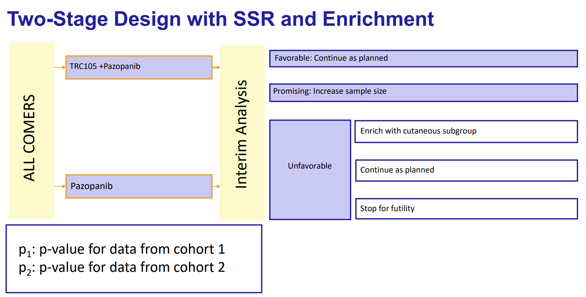


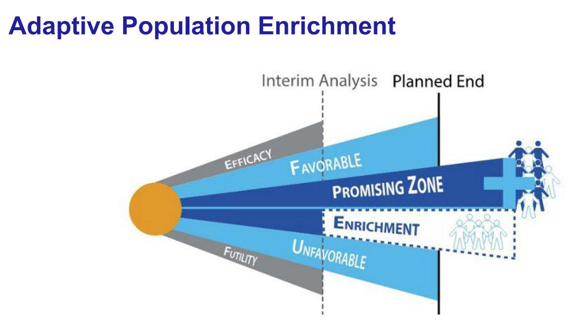


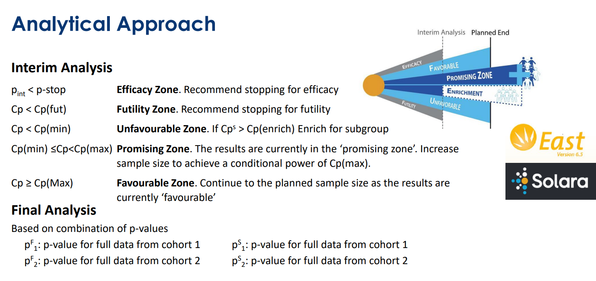


# Case Studies {-}

## Case 1: Phase III Two-Arm Group Sequential Trial {-}

The RALES (Randomized Aldactone Evaluation Study) trial was a significant clinical study focusing on the effectiveness of an aldosterone receptor blocker compared to a placebo. 

### 1. **Design of the Trial** {-}
   - **Type**: The RALES trial was a double-blind, multicenter clinical trial. Being "double-blind" means that neither the participants nor the experimenters knew who was receiving the treatment or the placebo, which helps to prevent bias in the results.
   - **Comparison**: It involved a comparison between an aldosterone-receptor blocker and a placebo. Aldosterone receptor blockers are typically used to treat conditions like heart failure and hypertension by blocking the effects of the hormone aldosterone.

### 2. **Endpoints and Objectives** {-}
   - **Primary Endpoint**: The primary endpoint of the trial was all-causes mortality, meaning the main outcome measured was the death rate from any cause among participants.
   - **Objective**: The trial aimed to determine if there was a significant reduction in mortality among patients treated with the aldosterone receptor blocker compared to those given a placebo.

### 3. **Statistics and Accrual** {-}
   - **Anticipated Accrual Rate**: The trial planned to enroll 960 patients per year, aiming for a large sample size to ensure robust statistical power.
   - **Hazard Rate**: The hazard rate for the placebo group was 38%, indicating the expected proportion of patients experiencing the endpoint (death) during the study period.
   - **Power and Significance**: The trial designers wanted a 90% power to detect a 17% reduction in the hazard rate, with a one-sided alpha level of 0.025. This statistical setup means they were 90% confident to detect a reduction in mortality of at least 17% if such a reduction truly exists, with a 2.5% chance of incorrectly concluding there is an effect (Type I error).

### 4. **Interim Monitoring and Group Sequential Design** {-}
   - **Six-Look Group Sequential Design**: The design allowed for accruing efficacy data to be monitored up to six times throughout the study duration. This approach helps in identifying treatment effects earlier and can adjust or stop the trial based on interim findings.
   - **DSMB Meetings**: Six Data Safety and Monitoring Board (DSMB) meetings were planned for interim reviews, which are critical in ensuring the safety of participants as the trial progresses.

### 5. **Outcome and Trial Stopping** {-}
   - **Stopping Early**: The trial was stopped early at the fifth interim analysis (look-5) by the DSMB. Stopping early for efficacy indicates that the treatment's benefits were clear and substantial enough to conclude the trial ahead of schedule, potentially changing clinical practice sooner.
   - **Time Saved**: The early stop saved nearly two years of study duration, which was originally projected to end in June 2000 but concluded in August 1998 instead.
   - **Impact**: Early stopping of the trial for efficacy suggests that the aldosterone blocker significantly reduced mortality in the study population. This finding likely had a profound impact on subsequent clinical guidelines and patient care, especially for conditions like heart failure where aldosterone plays a crucial role.
   
```{r , echo=FALSE, fig.align="center", out.width = '75%'} 
knitr::include_graphics("./02_Plots/IA/IA_Case1a.png")
knitr::include_graphics("./02_Plots/IA/IA_Case1b.png")
knitr::include_graphics("./02_Plots/IA/IA_Case1c.png")
```

## Case 2: Sample Size Re-Estimation due to Uncertainty about Nuisance Parameters {-}

### Psoriasis Example {-}

The Psoriasis trial example involves:
- **Primary Endpoint**: Achievement of PASI-75 by week 16, which measures improvement in psoriasis.
- **Design Parameters**: Designed for 95% power to detect a 10% improvement with a new treatment relative to placebo, with uncertainty about the placebo response rate (π_c = 7.5%).

The problem here is that the power of the trial depends on both the actual placebo response rate (π_c) and the effect size (δ), which can be unknown and vary. If π_c or δ are misestimated, it can impact the trial's power, making the originally calculated sample size insufficient or excessive.

### Strategy {-}
By using an information-based design, the trial is allowed to adapt by recalculating the necessary sample size based on accruing data about the actual placebo rate and effect size. This can be done through interim analyses, where the actual information accrued (J_j) is compared against the pre-specified maximum information \( I_{\text{max}} \). If \( J_j \) meets or exceeds \( I_{\text{max}} \), or efficacy boundaries are crossed, the trial might be stopped early for efficacy or futility, or the sample size adjusted to meet the desired power.

This approach proposes using "statistical information" rather than fixed sample sizes to guide the monitoring and conclusion of clinical trials. The rationale here is to accumulate enough information to make robust statistical decisions, thereby potentially making the trial more efficient and flexible.

This approach is particularly beneficial in scenarios like the psoriasis trial where there is considerable uncertainty about critical parameters that influence study outcomes. It allows the study to adapt to the observed data, making it potentially more efficient and likely to reach conclusive results.


### Formula for Maximum Statistical Information {-}

\[ I_{\text{max}} = \left( \frac{Z_{\alpha/2} + Z_{\beta}}{\delta} \right)^2 \times \text{Inflation Factor} \]

- **Z_α/2 and Z_β**: These represent the critical values from the normal distribution for the type I error rate (α) and the power (1-β), respectively.
- **δ**: This is the expected treatment effect size. 
- **Inflation Factor**: This factor accounts for adjustments in the design, like those due to interim looks in a group sequential design, which might inflate the required information due to the increased chance of type I error.

The table indicates that irrespective of the true placebo rate (π_c), the maximum statistical information \( I_{\text{max}} \) remains constant, suggesting the sample size (N_max) adjusts according to the variability observed due to π_c.


### Calculation of Information at Each Look (J) {-}

\[ J_j = \left[ \text{se}(\delta)^{-1} \right]^2 \left[ \frac{\hat{\pi}_c (1 - \hat{\pi}_c) + \hat{\pi}_e (1 - \hat{\pi}_e)}{N/2} \right]^{-1/2} \]
- **se(δ)^{-1**: Represents the precision (or inverse of the standard error) of the estimated treatment effect.
- **N/2**: Assumes an equal split of the sample size between treatment and control groups.
- **π_e and π_c**: Estimated rates of the endpoint for the experimental and control groups, respectively.

## Case 3: Sample Size Re-Estimation due to Uncertainty about Treatment Effect {-}

Sample size re-estimation (SSR) in clinical trials is a strategic approach employed when initial assumptions about a study need adjustment based on interim data. This can be crucial for ensuring the scientific validity and efficiency of a trial.  

### Reasons for Sample Size Re-Estimation {-}

1. **Insufficient Data on New Product:**
   - **Example**: A novel treatment, like a new monoclonal antibody for Covid, hasn't been extensively tested in the target population. Initial trials may start with conservative estimates that need adjustment as more specific data about the drug's efficacy and safety profile are collected.

2. **Evolving Standard of Care:**
   - **Example**: If the standard of care improves during the trial due to advancements in the control arm treatments, the relative benefit of the new therapy may appear reduced. This could necessitate a larger sample size to detect the true effect of the new treatment under the new standards.

3. **Phased Investment Strategy:**
   - **Example**: Sponsors may choose to start with a smaller scale to manage risks and then decide to expand the trial after promising interim results. This strategy is common in phases of drug development where the commitment of resources is contingent on early indications of success.

### Schizophrenia Example {-}

- **Trial Details**: A new drug is tested against a placebo for treating negative symptoms of schizophrenia, focusing on the Negative Symptoms Assessment (NSA) index.
- **Initial Powering**: The trial is initially powered to detect a 2-point difference in the NSA index with a standard deviation (σ) of 7.5.
- **Reassessment**: Interim data may prompt re-evaluation of these parameters to ensure the trial's continued relevance and accuracy in its conclusions.

During interim analysis, questions might arise such as:
- Should the study continue to target a difference (δ) of 2 points?
- Is the assumed standard deviation (σ = 7.5) still valid?

To address these questions:
- **Conditional Power (CP)**: This is the probability that the study will detect the predefined effect size, given the interim results. Adjustments might be made to increase the sample size to enhance CP.
- **Adjusting Critical Cut-off**: To maintain the integrity of the type-1 error rate, the critical cut-off value for stopping the trial might need adjustment.

### Increasing Sample Size to Boost Conditional Power (CP) {-}

- **Conditional Power (CP)**: This is defined as the probability, given the data observed so far (denoted by \( z_1 \)), that the final test statistic \( Z_2 \) will exceed a certain critical value \( c \) assuming the alternative hypothesis \( \delta \) is true. In simpler terms, CP measures the likelihood that a study will achieve its objectives (e.g., proving treatment efficacy) given the results observed at an interim analysis.
- **Formula**: \( CP = P_\delta(Z_2 \geq c | z_1) \)
  - \( P_\delta \) indicates the probability under the alternative hypothesis.
  - \( Z_2 \) is the final test statistic.
  - \( c \) is the critical value for concluding statistical significance.
  - \( z_1 \) represents the interim results.

Increasing the sample size can boost CP because it typically reduces the variance of the test statistic, making it more likely that \( Z_2 \) will exceed \( c \).

### Adjustment of Critical Cut-off {-}

- **Type-1 Error and SSR**: When you adjust the sample size based on interim results, known as Sample Size Re-estimation (SSR), there's a potential risk of inflating the type-1 error rate (the probability of incorrectly rejecting the null hypothesis). This is due to the increased chance of observing extreme values simply because more data are being examined.
- **Critical Cut-off Adjustment**: To address this, the critical cut-off \( c \) used to determine the significance of results at the end of the trial needs adjustment. The new cut-off \( c^* \) must be determined such that the probability of a type-1 error given the adjusted sample size and interim results does not exceed the original planned type-1 error probability.
- **Formula**: \( P_0(Z_2^* \geq c^* | z_1) \leq P_0(Z_2 \geq c | z_1) \)
  - \( P_0 \) represents the probability under the null hypothesis.
  - \( Z_2^* \) is the new test statistic considering the adjusted sample size.
  - \( c^* \) is the new critical value.

This adjustment ensures that even with an altered trial design, the integrity of the study's conclusions remains sound. The statistical methodology aims to maintain the trial's power (ability to detect a true effect) without compromising its rigor due to potential overestimation of the type-1 error.

### Typical SSR Rules {-}

1. **Cap on Increases**: Often, increases in sample size are capped (e.g., no more than double the initial size) to prevent logistical and financial overextension.
   
2. **Zones of Adjustment**:
   - **Unfavorable Zone**: If CP is below 30%, it might be decided not to increase the sample size.
   - **Promising Zone**: If CP is between 30% and 80%, the sample size might be adjusted to aim for approximately 90% CP, within the limits of the predefined cap.
   - **Favorable Zone**: If CP exceeds 80%, the current sample size is usually deemed sufficient, and no changes are made.
   
## Case 4: Seamless Phase II/III Trial with Dose Selection {-}

### Crofelemer Study {-}

- **Prevalence and Impact**: Diarrhea affects 20-30% of HIV-infected individuals, posing a significant health burden. This condition complicates the management of HIV by impairing quality of life and complicating compliance with antiretroviral medications.
- **Consequences of Noncompliance**: Noncompliance with antiretroviral regimens can lead to reduced drug levels, increased viral loads, and the development of drug resistance, further complicating treatment and disease progression.
- **Need for Effective Treatment**: Effective management of diarrhea in HIV-infected patients is crucial as it could potentially improve overall HIV treatment outcomes by enhancing compliance and reducing complications related to elevated viral loads and drug resistance.
- **Earlier Study Findings**: An initial 7-day study showed promising results, justifying the progression to a more extended and rigorous 28-day phase 3 trial to confirm efficacy and safety.
- **Trial Endpoint**: The primary endpoint for the phase 3 trial is a binary measure: fewer than three watery bowel movements per week over a four-week period. This endpoint is chosen to quantitatively assess the improvement in diarrhea and thereby the potential improvement in patient quality of life and compliance with HIV treatment.
- **Dose Exploration**: The optimal dose of crofelemer is unknown, leading to the decision to conduct pairwise comparisons among three dosage levels (125 mg, 250 mg, and 500 mg) versus a placebo. This approach allows the trial to evaluate the efficacy and safety profile of each dose relative to placebo.

### Statistical Considerations {-}

- **Placebo Response and Treatment Effect**: The expected placebo response rate is 35%, with an anticipated 20% improvement with crofelemer treatment. These assumptions are critical for calculating the necessary sample size and for power calculations to ensure the study is adequately powered to detect a clinically meaningful effect.

- **Implications for Sample Size Re-Estimation**: Given the uncertainty in the optimal dose and variability in the placebo response, an adaptive trial design with sample size re-estimation could be considered. This approach would allow adjustments based on interim analysis results, potentially optimizing the study design in real-time to ensure sufficient power and minimize unnecessary exposure to less effective doses.

- **Interim Analyses**: Conducting interim analyses would allow for the assessment of preliminary efficacy and safety data. Based on these data, decisions could be made about continuing, modifying, or stopping the trial for futility or efficacy.

- **Adjustments Based on Conditional Power**: If interim results suggest changes in the estimated placebo response or differentially greater efficacy at specific doses, the sample size could be adjusted to ensure that the study remains adequately powered to detect significant treatment effects.


###  Options 1: A Single 4-Arm Trial {-}

- **Design**: This design involves a single phase 3 trial with four arms, including three different doses of a treatment (125 mg, 250 mg, and 500 mg bid) and a placebo.
- **Multiplicity Correction**: The Bonferroni-Holm method is used to adjust for the multiple comparisons made between each treatment dose and the placebo. This is important to maintain the integrity of the type-1 error rate across multiple hypothesis tests.
- **Sample Size**: Requires 520 patients for 80% power at a 1-sided α = 0.025.
- **Pros and Cons**: This design is straightforward and allows simultaneous comparison of all doses against placebo but requires a large sample size and stringent corrections for multiple testing which could reduce power.

```{r , echo=FALSE, fig.align="center", out.width = '75%'} 
knitr::include_graphics("./02_Plots/IA/IA_Case4a.png")  
```

###  Option 2: Operationally Seamless Phase 2-3 Design {-}

- **Design**: This is a two-stage design where the first trial (Phase 2) is used for dose selection from three different doses, and the second trial (Phase 3) confirms the efficacy of the selected dose against placebo.
- **Flexibility**: Allows for flexibility in dose selection based on the results of the first trial.
- **Data Use**: Data from Trial 1 cannot be used for the confirmatory test in Trial 2, which may lead to inefficiencies.
- **Sample Size**: Requires 416 patients for 80% power.
- **Pros and Cons**: Offers operational efficiency by seamlessly progressing from dose-finding to confirmation but involves higher total patient numbers due to the need for a confirmatory trial.

```{r , echo=FALSE, fig.align="center", out.width = '75%'} 
knitr::include_graphics("./02_Plots/IA/IA_Case4b.png") 
```

###  Option 3: Inferentially Seamless Phase 2-3 Design {-}

- **Design**: This design also features two stages but differs from Option 2 by allowing the use of data from both stages in the final analysis.
- **Multiplicity Control**: Uses a combination of p-values and closed testing procedures to control the family-wise error rate (FWER) while accounting for the use of data across both stages.
- **Sample Size**: Requires 380 patients for 80% power, offering a more efficient use of data and potentially lower total patient numbers.
- **Pros and Cons**: Enhances efficiency and may reduce overall trial duration and patient exposure. However, it requires sophisticated statistical techniques to ensure proper control of error rates.

```{r , echo=FALSE, fig.align="center", out.width = '75%'} 
knitr::include_graphics("./02_Plots/IA/IA_Case4c.png") 
```

### Multiplicity Control {-}

- **Inverse Normal Combination**: Combines p-values from different stages of the study to form a single test statistic, using weighted contributions based on the sample sizes of each stage.
- **Closed Testing**: Involves testing a family of hypotheses (e.g., for each dose) using a hierarchical or closed set approach. To reject any elementary hypothesis, all intersecting hypotheses must also be rejected, which strictly controls the FWER.

```{r , echo=FALSE, fig.align="center", out.width = '75%'} 
knitr::include_graphics("./02_Plots/IA/IA_Case4d.png") 
```

**1. Inverse Normal Combination of Stage 1 and Stage 2 p-values**

This method combines the p-values from different stages of the study using a weighted Z-transform approach. The formula provided:

\[ Z_2 = \sqrt{\frac{n_1}{n_1 + n(2)}} \phi^{-1}(1 - p_1) + \sqrt{\frac{n(2)}{n_1 + n(2)}} \phi^{-1}(1 - p_2) \]

- **Variables**:
  - \( n_1 \) and \( n(2) \) are the sample sizes from stage 1 and stage 2, respectively.
  - \( p_1 \) and \( p_2 \) are the p-values from stage 1 and stage 2, respectively.
  - \( \phi^{-1} \) is the inverse of the standard normal cumulative distribution function (CDF), which converts p-values into Z-scores.

- **Process**:
  - The p-values are first converted into Z-scores.
  - These Z-scores are then weighted by the proportion of the total sample size contributed by each stage.
  - The weighted Z-scores are summed to produce a combined Z-score, \( Z_2 \), which is used to determine the overall significance across stages.

This method assumes that combining information across stages can lead to a more powerful test while still controlling for Type I error, provided the combination rule is properly calibrated.

**2. Closed Testing**

Closed testing is a rigorous method for controlling FWER in the context of multiple hypothesis testing, especially when tests are not independent.

- **Elementary Hypotheses**:
  - The hypotheses are represented by \( H_1, H_2, H_3, \) etc.
  - The intersections \( H_1 \cap H_2, H_1 \cap H_3, \) etc., represent the joint consideration of multiple hypotheses.

- **Testing Process**:
  - A "closed" set of tests is constructed, including all individual hypotheses and their intersections.
  - To reject any elementary hypothesis, say \( H_1 \), all higher-order intersections involving \( H_1 \) must also be rejected at the predefined alpha level.
  - This method ensures that FWER is controlled under the alpha level across all hypotheses, as rejecting any single hypothesis requires a stringent criterion that all related intersections are also significant.

- **Statistical Rigor**:
  - This approach is particularly strict and can be conservative, but it ensures that the overall Type I error rate across multiple tests does not exceed the designated level, α.
  
## Case 5: Adaptive Multi-arm Multi-stage (MAMS) Design {-}

### Overview of Adaptive MAMS Design {-}

**Features of MAMS:**

1. **Multiple Treatment Arms:** Involves comparing several treatment options against a common control group, allowing simultaneous evaluation of multiple interventions.
  
2. **Multiple Interim Analyses:** Scheduled assessments of the accumulating data at multiple points during the trial. These interim looks allow for early decisions about the continuation, modification, or termination of treatment arms.

3. **Early Stopping Rules:** The trial can be stopped early for efficacy if a treatment shows clear benefit, or for futility if it's unlikely to show benefit by the end of the study.

4. **Continuation with Multiple Winners:** Unlike traditional designs that might stop after finding one effective treatment, MAMS design can continue to evaluate other promising treatments.

5. **Dropping Losers:** Ineffective treatment arms can be discontinued at interim stages, focusing resources on more promising treatments.

6. **Dose Selection:** Flexibility to adjust doses or select the most effective dose based on interim results.

7. **Sample Size Re-estimation (SSR):** Sample sizes can be recalculated based on interim data to ensure adequate power is maintained throughout the trial, especially useful if initial estimates of effect size (δ) or variability (σ) are inaccurate.

8. **Control of Type-1 Error:** Despite the complexity and multiple hypothesis testing involved, the design includes methodologies to maintain strong control over the type-1 error rate, ensuring the validity of the trial's conclusions.


### Example: SOCRATES Reduced Trial {-}

**Trial Details:**
- **Intervention:** Evaluated three doses of Variciguate compared to placebo.
- **Primary Endpoint:** Week-12 reduction in the log of NT-proBNP, a biomarker used to assess heart function and heart failure.
- **Sample Size and Power:** A total of 388 patients to achieve 80% power for detecting a change of δ = 0.187 in the log NT-proBNP, assuming a standard deviation (σ) of 0.52.

**Adaptive Features:**
- **Adaptive Design Considerations:** The trial was prepared to adjust for different values of δ and σ than initially estimated, which is crucial if the biological effect of Variciguate or the variability in NT-proBNP measurements was misestimated.
- **Interim Analyses with SSR and Drop the Loser:** The design included provisions for interim analyses to reassess the continued relevance of each dose. Less promising doses could be dropped ('Drop the Loser'), and the sample size could be recalculated based on the data gathered to that point ('SSR').

### Generalization of Two-Arm Group Sequential Design {-}

1. **Wald Statistic Calculation:**
   - For each treatment arm compared to placebo, a Wald statistic is calculated at each interim analysis (look `j`), where `i` denotes the treatment arm.
   - **Formula**: \( Z_{ij} = \frac{\hat{\delta}_{ij}}{se(\hat{\delta}_{ij})} \)
     - \( \hat{\delta}_{ij} \) represents the estimated effect size difference between the treatment and placebo at look `j`.
     - \( se(\hat{\delta}_{ij}) \) is the standard error of the estimated effect size.

2. **Multiplicity-Adjusted Boundaries:**
   - Adjusted boundaries \( u_{j} \) are set to control the Type-1 error while allowing for multiple looks at the data. 
   - The probability under the null hypothesis that the maximum Wald statistic across all looks and treatment arms exceeds the boundary \( u_{j} \) should equal \( \alpha \), ensuring overall Type-1 error control.

3. **Correlation Structure:**
   - The correlation between the Wald statistics across different looks and doses is considered and is based on the ratio of the square roots of the respective sample sizes. 
   - This correlation needs to be accounted for in the statistical analysis to maintain accurate control of Type-1 error rates.
   
### Strong FWER Control under Adaptations {-}

1. **Adaptations in Trial Design:**
   - **Treatment Selection Only:** No closed testing is required, simplifying the design.
   - **Additional Adaptations:** If sample size re-estimation, adjustment in the number or spacing of future looks, or changes in the error spending function occur, closed testing and preservation of conditional error rates are required.


2. **Closed Testing:**
   - Ensures that adaptations do not inflate the Type-1 error rate. More powerful than seamless Phase II/III designs but requires detailed knowledge of the correlation structure among the test statistics to effectively control the FWER.
   
### Power Gain of MAMS Design over Seamless II/III Design {-}

1. **Comparison of Power Gain:**
   - The table compares the power differences between the MAMS design and a standard Seamless II/III design using different methods of multiplicity adjustment (Bonferroni, Simes, and Dunnett).
   - Different scenarios of dose effect assumptions are presented (all doses effective, some doses ineffective), showing that the MAMS design generally offers higher power due to its flexibility in dropping ineffective doses and focusing on promising treatments.

```{r , echo=FALSE, fig.align="center", out.width = '75%'} 
knitr::include_graphics("./02_Plots/IA/IA_Case5d.png") 
```

2. **Dose Dropping Criteria:**
   - Lists criteria such as any \( \delta_{i1} < 0 \), \( \delta_{i1} < -\sigma \), and \( \delta_{i1} < -2\sigma \) to guide dropping ineffective doses, demonstrating how these criteria impact the overall power of the trial.
   
## Case 6: Population Enrichment Design {-}

### TAPPAS Trial Overview {-}

**Treatment Arms:**
- **TRC105 + Pazopanib**: TRC105 targets the endoglin receptor and is combined with Pazopanib, which targets the VEGF receptor.
- **Pazopanib Alone**: Standard of care, serving as a control.

**Subgroups:**
- Two primary subgroups, cutaneous and visceral. The cutaneous subgroup is notably more sensitive to TRC105, suggesting a potential for subgroup-specific efficacy.
 
**Interim Decisions Based on Interim Analysis:**
- **Favorable Results**: If the interim results are favorable, the trial continues as planned.
- **Promising but Uncertain Results**: If results are promising but not conclusively favorable, the trial may adapt by increasing the sample size to enhance statistical power.
- **Unfavorable Results for Combined Therapy**: The trial continues as planned or stops for futility based on specific interim findings.
- **Population Enrichment**: If the interim results suggest that the cutaneous subgroup is particularly responsive, the trial may shift its focus to this subgroup, enriching the patient population to those most likely to benefit.

```{r , echo=FALSE, fig.align="center", out.width = '75%'} 
knitr::include_graphics("./02_Plots/IA/IA_Case6a.png") 
```

### Inverse Normal Combination of P-Values {-}

**Statistical Methodology for Decision Making:**

- **Combining P-values**: The method involves using weighted Z-transforms of p-values obtained before and after the interim analysis.
- **Weights**: \( w_1 \) and \( w_2 \) are weights assigned to the p-values from different stages of the trial, reflecting their importance or reliability.

**1. In Case of No Enrichment**

When there is no enrichment, i.e., the trial continues with the full patient population, the significance is declared if:
\[ w_1 \Phi^{-1}(1 - p_1^{FS}) + w_2 \Phi^{-1}(1 - p_2^{FS}) \geq Z_{\alpha} \]
\[ w_1 \Phi^{-1}(1 - p_1^F) + w_2 \Phi^{-1}(1 - p_2^F) \geq Z_{\alpha} \]

Where:
- \( \Phi^{-1} \) is the inverse of the standard normal cumulative distribution function.
- \( p_1^{FS} \) and \( p_2^{FS} \) are the p-values for the full sample from stages 1 and 2, respectively, after the interim analysis.
- \( p_1^F \) and \( p_2^F \) are the p-values for the full sample from stages 1 and 2, respectively, before the interim analysis.
- \( w_1 \) and \( w_2 \) are the weights assigned to the p-values from each respective stage.
- \( Z_{\alpha} \) is the critical value from the standard normal distribution corresponding to the desired overall Type I error rate, \( \alpha \).

**2. In Case of Enrichment**

When the trial opts for enrichment, i.e., focusing on a specific subgroup (e.g., the cutaneous subgroup) after finding differential treatment effects, the significance is declared if:
\[ w_1 \Phi^{-1}(1 - p_1^{FS}) + w_2 \Phi^{-1}(1 - p_2^{FS}) \geq Z_{\alpha} \]
\[ w_1 \Phi^{-1}(1 - p_1^S) + w_2 \Phi^{-1}(1 - p_2^S) \geq Z_{\alpha} \]

Where:
- \( p_1^S \) and \( p_2^S \) are the p-values from the enriched subgroup (e.g., cutaneous) from stages 1 and 2, respectively.

### Strategic Recruitment Approach - Rare Disease {-}

Recruitment is very challenging due to rare disease. Easier to start small and ask for more. Given the rarity of the disease and the challenges in recruitment:

- **Start with an initial sample size of 125**: This allows the trial to begin with a manageable cohort and adjust based on early insights.
- **Adaptations Based on Zones**:
  - **If in promising zone**: Increase to 200 to enhance statistical power and confirm preliminary findings.
  - **If in enrichment zone**: Increase to 180, concentrating more on the subgroup showing better responsiveness.
  - **If in favorable zone**: Maintain the current sample size as the efficacy is already well demonstrated, potentially accelerating the trial conclusion.
  

```{r , echo=FALSE, fig.align="center", out.width = '75%'} 
knitr::include_graphics("./02_Plots/IA/IA_Case6b.png") 
```

**Zone**: Categorizes the possible outcomes of interim analysis into four zones:

   - **Enrich**: Indicates scenarios where focusing on a specific subgroup (e.g., cutaneous) might be beneficial.
   - **Unfav (Unfavorable)**: Situations where results are not promising, potentially leading to stopping the trial for futility.
   - **Prom (Promising)**: Interim results suggest potential efficacy that could be confirmed with a larger sample size.
   - **Favor (Favorable)**: Strong evidence of efficacy as planned, potentially moving towards a quicker conclusion or regulatory submission.
   

# Reference


1. Storer, B.E. (1989). Design and analysis of phase I clinical trials. *Biometrics, 45*, 925–937.
2. O'Quigley, J., Pepe, M., & Fisher, L. (1990). Continual reassessment method: A practical design for phase 1 clinical trials in cancer. *Biometrics, 46*(1), 33-48.
3. Jaki, T., Clive, S., & Weir, C.J. (2013). Principles of dose finding studies in cancer: A comparison of trial designs. *Cancer Chemotherapy and Pharmacology, 71*(5), 1107-1114.
4. Neuenschwander, B., Branson, M., & Gsponer, T. (2008). Critical aspects of the Bayesian approach to phase I cancer trials. *Statistics in Medicine, 27*(13), 2420-2439.
5. Le Tourneau, C., Lee, J.J., & Siu, L.L. (2009). Dose escalation methods in phase I cancer clinical trials. *Journal of the National Cancer Institute, 101*(10), 708-720.
6. Babb, J., Rogatko, A., & Zacks, S. (1998). Cancer phase I clinical trials: Efficient dose escalation with overdose control. *Statistics in Medicine, 17*(10), 1103-1120.
7. Mander, A.P. & Sweeting, M.J. (2015). A product of independent beta probabilities dose escalation design for dual-agent phase I trials. *Statistics in Medicine, 34*, 1261–1276.
8. Cheung, Y.K. & Chappell, R. (2000). Sequential designs for phase I clinical trials with late onset toxicities. *Biometrics, 56*, 1177–1182.
9. Huang, B., Kuan, P. (2014). Time-to-event continual reassessment method incorporating treatment cycle information with application to an oncology phase I trial. *Biometrical Journal, 6*, 933-946.
10. Huang, B., Bycott, P., & Talukder, E. (2016). Novel Dose-Finding Designs and Considerations on Practical Implementations in Oncology Clinical Trials. *Journal of Biopharmaceutical Statistics*.
11. Doussau, A., Thiebaut, R., Geoerger, B., Schoffski, P., Floquet, A., Le Deley, M.C., Mathoulin-Pelissier, S., Rizzo, E., Fumoleau, P., Le Tourneau, C., & Paoletti, X. (2015). A new approach to integrate toxicity grade and repeated treatment cycles in the analysis and reporting of phase I dose-finding trials. *Annals of Oncology, 26*(2), 422-428.
12. Love et al. (2017). Embracing model-based designs for dose-finding trials. *BJC in review*.
13. Yuan, Y. & Yin, G. (2008). Statistics in Medicine, 27, 5664-78.
14. Kramar, A. et al. (1999). Statistics in Medicine, 18, 1849-64.
15. Thall, P.F., & Cook, J.D. (2004). Biometrics, 60, 684-693.
16. Thall, P. F., Millikan, R. E., Mueller, P., & Lee, S. J. (2003). Dose-finding with two agents in phase I oncology trials. *Biometrics, 59*, 487–496.
17. Harrington, J. A. et al. (2013). Adaptive designs for dual-agent phase I dose-escalation studies. *Nature Reviews Clinical Oncology, 10*, 277–288.
18. Cytle Webinars: Adaptive design in early phase clinical trials
19. Cytle Webinars: Introduction to Design and Monitoring of Adaptive Clinical Trials
20. Chang, M. (2015). Introductory Adaptive Trial Designs: A Practical Guide with R (1st ed.). Chapman and Hall/CRC. https://doi.org/10.1201/b18532

