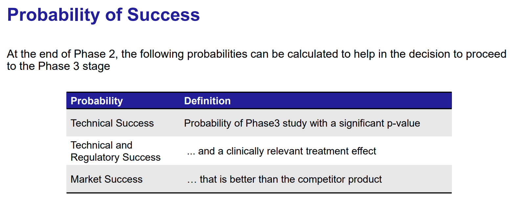

```{r setup, include=FALSE, echo = FALSE,message = FALSE, error = FALSE, warning = FALSE}
knitr::opts_chunk$set(echo = TRUE, fig.width = 10, fig.height = 6)

packages<-c("tidyverse", "kableExtra")

ipak <- function(pkg){
  new.pkg <- pkg[!(pkg %in% installed.packages()[, "Package"])]
  if (length(new.pkg)) 
    install.packages(new.pkg, dependencies = TRUE)
  sapply(pkg, require, character.only = TRUE)
}
ipak(packages)
 
 
setwd(dirname(rstudioapi::getSourceEditorContext()$path))
getwd()
Sys.setlocale("LC_ALL","English")
```


# Introduction

##Clinical Development Plans


Decision Point Indicators: The colored circles (green and red) next to each decision point likely indicate a binary decision-making outcome:

  - **Green**: Continue development based on positive results.
  - **Red**: Terminate or modify the approach based on negative results or strategic reassessment.
  


1. **Dose Escalation**:
   - This phase involves progressively increasing the dose of the drug administered to groups of patients until the desired therapeutic effect is achieved with acceptable toxicity levels.
   - **Decision Point 1**: This is likely the Go/No-Go decision to determine if the drug appears safe and effective enough at any dose to justify further investigation.

2. **Proof of Concept & Dose Finding**:
   - **Proof of Concept**: Tests whether the drug has the biological activity and therapeutic potential anticipated based on preclinical models.
   - **Dose Finding**: Determines the optimal dose that balances efficacy and safety.
   - **Decision Point 2**: Another critical Go/No-Go decision based on the drug’s efficacy and safety data from early-phase trials. This decision will determine if the drug moves forward to more extensive testing.

3. **Confirmatory**:
   - This phase involves larger-scale studies to confirm the efficacy and monitor side effects, generally leading to the final regulatory approval phase.
   - **Decision Points 3 and 4**: These likely represent interim analyses and final analysis points, respectively. At each stage, the data is reviewed to decide whether to continue the trial, adjust its parameters, or stop it early due to efficacy or safety concerns.
   
## Traditional Approach

1. **Fixed Trials**: This approach follows a rigid, pre-specified path through the clinical development phases (Phase I, Phase IIa, Phase IIb, and Phase III).
2. **Issues Highlighted**:
   - **Poor dose selection**: Inadequate dose selection early in the trial can lead to ineffective treatments continuing through the trial phases.
   - **Inappropriate patient population**: Choosing the wrong patient demographics can result in poor outcomes and uninformative data.
   - **Underpowered trials**: Trials might not have enough participants to achieve statistically significant results, often leading to repeated studies that barely miss their objectives.
   - **Repetition of studies**: Due to the rigid design, there's a tendency to repeat studies that barely miss their endpoints, rather than optimizing based on learned data.
   - **Doomed products not killed early**: Products that are likely to fail are not terminated early enough, resulting in wasted resources.
   - **No flexibility**: There's no opportunity to modify the trial design or assumptions once the trial has started, often leading to a high rate of attrition, especially in Phase III trials.


## Adaptive Design Approach

1. **Flexible and Responsive Trials**: This approach allows modifications to the trial procedures based on interim data analysis, leading to more efficient and potentially more successful outcomes.
2. **Key Features**:
   - **Adaptive dose-ranging and better dose selection**: Doses can be adjusted based on ongoing results, leading to better efficacy and safety profiles.
   - **Adaptive combined Phase II/III design**: Reduces the number of necessary patients and shortens the overall trial duration by merging phases based on early results.
   - **Adaptive enrichment design**: Focuses on identifying the most suitable patient subpopulation for the treatment, thereby increasing the likelihood of successful outcomes.
   - **Test trial design assumptions early**: Allows for the testing and modification of initial assumptions, utilizing accumulating data to refine trial design.
   - **Adaptive sample size re-estimation**: Adjusts the number of participants as needed to maintain statistical power, reducing the risk of underpowered studies.
   - **Increased probability of success at Phase III**: By optimizing various elements throughout the earlier phases, the adaptive approach aims to enhance the likelihood of positive outcomes in the crucial Phase III.
   

 
 
## Trends in Adaptive Design: A Detailed Analysis

Adaptive design in clinical trials is evolving rapidly, with increasing complexity and regulatory support shaping its future directions. The integration of new statistical methods and broader applications signifies a dynamic shift towards more efficient and effective drug development processes.

### Phase I: Focus on Dosage Optimization

In Phase I of adaptive clinical trials, there is a significant shift towards designs that simultaneously evaluate toxicity and efficacy. This approach, guided by frameworks such as the FDA’s “Project Optimus,” emphasizes optimizing the dosage of drugs for oncologic diseases. The initiative, formally titled “Optimizing the Dosage of Human Prescription Drugs and Biological Products for the Treatment of Oncologic Diseases” and launched on August 24, encourages developing trials that define both the maximum tolerated dose (MTD) and the optimal biological dose (OBD) early in the clinical development process.

### Phase II: Enhanced Flexibility and Precision

Phase II trials are increasingly incorporating adaptive elements, particularly through designs that allow for interim futility analysis, a practice already common but growing in sophistication. Examples include:

- **Ib/II Trials**: These often use Cohort Expansion designs to refine efficacy estimates and decide on further development.
- **IIa/IIb Trials**: Employing methods like the MCP-Mod (Multiple Comparison Procedures and Modeling) to identify and confirm dose-response relationships seamlessly.
- **II/III Trials**: Utilizing Multi-Arm Multi-Stage (MAMS) frameworks to conduct Pick-the-Winner Dose-finding studies, seamlessly transitioning from dose finding to confirmation stages within the same trial.

### Phase III: Integration of Complex Elements

In confirmatory Phase III trials, interim analyses have become a standard practice, but there is now a growing interest in integrating these trials with more complex elements. This includes the use of advanced statistical methods and adaptive features that allow trials to be more responsive to emerging data without compromising on scientific rigor.

**Regulatory Landscape: Draft ICH E20 on Adaptive Clinical Trials**

Looking ahead to Q1 2025, the draft ICH E20 on Adaptive Clinical Trials represents a major milestone. This guideline is expected to:

- Align with current guidance, such as the FDA’s 2019 Guidance, which emphasizes pre-specification, the use of simulation, and maintaining trial integrity in adaptive designs.
- Discuss specific adaptive designs, potentially expanding beyond the generalized recommendations typically seen, to incorporate more detailed guidance on implementation.
- Include discussions on the intersection with other evolving topics, such as Bayesian approaches and the integration of Real-World Data, reflecting recent advances in these areas.

### Expansion Beyond Oncology

Significantly, there is continued interest in platform trials, particularly those building on successes in oncology (like Umbrella and Basket Master Protocol Trials) and Covid-19 therapeutics. These trial designs are expected to expand into non-oncology areas, leveraging their flexibility and efficiency to accelerate drug development across various therapeutic areas.
 

 
# Dose Escalation in Early Phase Clinical Trials

## SAD/MAD/Dose Escalation

**SAD (Single Ascending Dose) and MAD (Multiple Ascending Dose)**


1. **Sequential Cohorts**:
   - **SAD**: Involves administering a single dose to a small group of participants, with each subsequent group receiving a higher dose. This continues until a predefined dose level is reached or unacceptable toxicity is observed.
   - **MAD**: Similar to SAD but involves multiple doses administered to the same group to assess safety and pharmacokinetics over a longer period.

2. **Dose Escalation**:
   - The process starts with Dose 1 and progresses sequentially through Dose 2, Dose 3, and so on, up to Dose 5 as depicted. This systematic incrementation helps identify the maximum tolerated dose (MTD).

3. **Expansion Cohort**:
   - Once an optimal dose is established, an expansion cohort may be enrolled to further evaluate the drug’s safety and efficacy at this dose, providing additional data to support phase II trial designs.
   

The SAD/MAD dose escalation strategy is crucial for:

- Minimizing risks to study participants by starting at lower doses.
- Efficiently finding the dose that maximizes potential therapeutic effects while minimizing adverse effects.
- Laying the groundwork for effective and safe dosing strategies in later-phase trials.


**Key Considerations in Dose Escalation**

- **Dose Limiting Toxicities (DLT)**:
  - The primary consideration during dose escalation is the observation of DLTs, which are side effects severe enough to prevent an increase in dose. These help define the MTD.

- **Dose Escalation Committee (DEC)**:
  - A group of experts that governs dose escalation decisions, ensuring that the process adheres to safety standards while achieving the necessary pharmacologic endpoint.

- **Pharmacokinetic (PK) Data**:
  - Critical for determining how the drug is absorbed, distributed, metabolized, and excreted in the body. PK data guide decisions on dose levels and scheduling.

- **Response Biomarkers**:
  - Biomarkers that respond to the drug treatment can provide early indications of how well the drug is working at different doses, aiding in identifying the optimal dose for further studies.


1. **Is there a range of safe doses where we can explore efficacy?**
   - Yes, the therapeutic window shown indicates a range of doses where the efficacy is high and toxicity is minimal. This range allows for the exploration of optimal dosing to maximize therapeutic benefits while minimizing adverse effects.

2. **Is there a Maximum Tolerated Dose (MTD)?**
   - The Maximum Tolerated Dose typically refers to the highest dose of a drug that does not cause unacceptable side effects. Based on the graph, the MTD would be near the dose where the probability of toxicity begins to approach an unacceptable level, potentially around the right boundary of the therapeutic window or where the toxicity curve starts to steepen significantly. However, the exact dose isn't specified clearly in the graph but would likely be determined by where the risk of toxicity begins to outweigh the benefits of increased efficacy.


## Dose Escalation Process

The dose escalation process is crucial in clinical trials for several reasons:

- **Safety Assessment**: It allows for the careful assessment of a drug's safety profile at increasing dose levels.
- **Efficacy Indicators**: Early indications of efficacy can also be observed and used to make decisions about further development.
- **MTD Identification**: Finding the maximum tolerated dose is essential for determining the dose for Phase II trials, which will focus more on efficacy.

**Methodology of a dose escalation process in clinical trials.**

1. **Sequential Doses**:
   - **Dose 1 to Dose 5**: The process begins with the lowest dose (Dose 1) and progresses through increasingly higher doses (Dose 2 to Dose 5). Each subsequent dose is determined based on the safety and tolerability data from the previous dose.

2. **Cohort Design**:
   - **Small Cohorts**: Typically involves a small number of participants in each dose level to minimize risk.
   - **Randomization to Placebo**: Some participants receive a placebo, which helps in the unbiased assessment of the drug's effects and side effects.

3. **Dose Levels**:
   - **Logarithmically Spaced Doses**: The doses are usually logarithmically spaced, often doubled, to efficiently find the maximum tolerated dose without causing significant harm from too large an increment.

4. **Starting Dose**:
   - The initial dose is typically less than 1/100 of the predicted dose that would cause harm in humans, based on preclinical models. This conservative start helps ensure participant safety.

5. **Data Review and Escalation Decision**:
   - **Data Review Committee**: After each cohort has been dosed, a Data Review Committee (DRC) assesses the safety data. This committee plays a critical role in deciding whether it is safe to proceed to the next dose level.
   - **Dose Limiting Toxicities (DLT)**: The decision to escalate the dose is primarily based on the presence or absence of DLTs. The occurrence of DLTs can halt the escalation process or necessitate dose adjustments.

6. **Escalation Rules**:
   - **3+3 Design**: This is a common method used in dose escalation studies. In this design, three participants are initially dosed, and if there are no DLTs, three more are dosed at a higher level. If one participant experiences a DLT, an additional three participants may be dosed at the same level to better assess the risk.
 
 
## Escalation Rules


### Algorithm-Based Rules {-}

1. **3+3**:
   - The most traditional and simplest approach, where three patients are treated at a given dose level. If none or one patient experiences a dose-limiting toxicity (DLT), the dose is escalated. If two or more patients experience a DLT, the dose is not escalated, and further evaluation may occur.

2. **mTPI (modified Toxicity Probability Interval)**:
   - An extension of the traditional interval designs that uses a Bayesian framework to better estimate the probability of toxicity at each dose level, allowing for more refined adjustments in dose escalation.

3. **i3+3 (interval 3+3)**:
   - This method integrates features of both rule-based and model-based approaches, using toxicity intervals to guide dose escalations more systematically than the traditional 3+3 method.

4. **Adaptive Dose Insertion**:
   - Allows for the insertion of intermediate dose levels based on accumulating data from the trial. This can help refine the understanding of the dose-response relationship.

5. **Dual Agent PIPE (Product of Independent beta Probabilities Escalation)**:
   - Used for trials involving two drugs, this method considers the probability of toxicity for each drug independently and adjusts dosing accordingly, suitable for combination therapy studies.

### Model-Based Rules {-}

1. **CRM (Continual Reassessment Method)**:
   - A Bayesian model that continually updates the probability of toxicity based on patient outcomes at all dose levels tested. The model aims to more quickly identify the dose closest to the target toxicity level.

2. **TITE-CRM (Time-to-Event CRM)**:
   - An adaptation of CRM that accounts for the time it takes for a DLT to occur, which is useful in trials where DLTs may not be immediately apparent.

3. **BOIN (Bayesian Optimal Interval design)**:
   - Aims to identify the maximum tolerated dose (MTD) with higher accuracy and fewer patients by defining optimal dose-escalation intervals based on Bayesian calculations.

4. **BLRM (Bayesian Logistic Regression Model)**:
   - Utilizes logistic regression to estimate the probability of toxicity, allowing for more complex dose-response relationships and the incorporation of patient covariates into the decision-making process.
   - BLRM employs logistic regression to model the relationship between the probability of experiencing a dose-limiting toxicity (DLT) and different dose levels of a drug. This is typically expressed using a logistic function, which transforms a linear combination of predictors into a probability between 0 and 1.
   - The typical logistic model used in BLRM is represented as \( \text{logit}(p_i) = \ln(\alpha) + \beta \ln(x_i/x_{\text{ref}}) \), where:
     - \( p_i \) is the probability of toxicity at dose \( x_i \).
     - \( x_{\text{ref}} \) is a reference dose, often the lowest or starting dose.
     - \( \alpha \) and \( \beta \) are parameters to be estimated, capturing the intercept and the effect of changing the dose level, respectively.
     
5. **Dual Agent BLRM**:
   - Similar to the single-agent BLRM but designed for use in trials involving two therapeutic agents, allowing for the modeling of joint toxicity probabilities.
   
## Decision Making

**Early Phase Decision-Making Stages**


1. **FTIM (First Time in Man)**
   - **Focus**: Safety, Biomarker activity
   - This initial stage involves administering the investigational drug to humans for the first time. The primary goals are to assess the drug's safety profile and to begin evaluating its pharmacokinetics and pharmacodynamics, often using biomarkers as early indicators of biological activity.

2. **POM (Proof of Mechanism)**
   - **Focus**: Safety, On-target activity
   - At this stage, the focus is on confirming that the drug acts on the intended target within the body and elucidates the mechanism of action. This phase continues to monitor safety while starting to establish a connection between the drug mechanism and its potential therapeutic effects.

3. **POC (Proof of Concept)**
   - **Focus**: Safety, Efficacy, Phase 3 Translation
   - Proof of Concept is a critical phase where the drug’s efficacy is tested, often in a small number of patients who have the disease or condition the drug is intended to treat. The main objectives are to establish that the drug works in the intended disease context and to continue evaluating safety. Successful POC studies provide a rationale for moving into larger, more definitive trials, and often involve preliminary discussions on how results could translate into Phase 3 studies.

4. **P3ID (Phase 3 Investment Decision)**
   - This stage is not a trial phase but rather a decision point based on data gathered from earlier phases. The decision to move forward to Phase 3 involves substantial investment, so this point focuses on evaluating all data to ensure the candidate has a high likelihood of success in larger, more costly Phase 3 trials. The evaluation includes further analysis of safety and efficacy data, along with regulatory considerations and market potential.

**Decision Making Approaches**

By employing adaptive designs, Bayesian methods, and biomarker-based endpoints, clinical trials can become more flexible and responsive to emerging data, potentially reducing development times and improving patient outcomes. These strategies also align well with modern regulatory frameworks that encourage innovation and efficiency in drug development.

1. **Interim Decisions**:
   - Interim decisions during trials are common and serve to evaluate the data partway through the study to make go/no-go decisions. This helps in optimizing resources and potentially stopping trials early for efficacy or safety reasons.

2. **Single Indication**:
   - Trials often focus on a single therapeutic indication to streamline the study and concentrate on a specific patient population. This approach helps in clear interpretation and strong alignment with regulatory expectations for particular disease areas.

3. **Biomarker Endpoint**:
   - Utilizing biomarkers as endpoints in clinical trials can provide early signals of a drug's effectiveness or safety. Biomarkers are measurable indicators of biological processes, pathogenic processes, or pharmacologic responses to a therapeutic intervention.

4. **Sized to Exceed a Minimum Target Response**:
   - Clinical trials are designed to have sufficient power to detect a clinically meaningful effect. This sizing ensures that the study can conclusively determine whether the investigational drug has the desired impact, exceeding a predetermined threshold of response.

5. **Simon’s 2 Stage Design**:
   - This is an adaptive trial design used primarily in phase II clinical trials to minimize patient exposure to potentially ineffective treatments. The design includes two stages:
     - The first stage assesses initial efficacy (often stopping for futility if efficacy criteria are not met).
     - If criteria are met, the trial proceeds to the second stage to further confirm efficacy.

6. **Bayesian Interim Decisions**:
   - Bayesian methods are increasingly common for making interim decisions in clinical trials. These methods use probabilities to make decisions, such as continuing or stopping a trial based on the probability that the treatment response exceeds a predefined threshold:
     - **Go**: Continue if \( P(\text{Response} > p_0) > 80\% \)
     - **Stop**: Discontinue if \( P(\text{Response} > p_0) < 10\% \)

7. **Expansion to Pivotal for Accelerated Approval**:
   - Early phase studies may be designed in a way that allows them to expand into pivotal trials if the interim data is promising. This strategy can accelerate the path to regulatory approval, especially under breakthrough therapy designations or accelerated approval pathways.

8. **Determine Baseline Biomarker Cut-off Values**:
   - Defining baseline biomarker cut-off values is critical for selecting the right patient population or for stratifying patients according to their predicted response to the treatment. This can optimize the therapeutic impact and improve the trial’s success rate.

9. **Bayesian Learning about Biomarker Cut-off Points**:
   - Bayesian statistics can be used to refine biomarker cut-off points based on accumulating data from the trial. This adaptive learning approach allows for more precise and individualized treatment decisions.

10. **SCUBA and SBATT Methods**:
    - These are advanced statistical methods employed in clinical trials.
    - **SCUBA (Sequential Cohort Utility-Based Algorithm)**: A method that aims to optimize trial designs by evaluating the utility of adding new patient cohorts based on previous results.
    - **SBATT (Sequential Bayesian Adaptive Therapeutic Trials)**: Uses Bayesian methods to adaptively manage trials based on interim data, optimizing trial outcomes and efficiency.


**Decision Framework**




# Combination Design


## Combination Therapies

Combination therapies involve the use of two or more treatments simultaneously to achieve better efficacy than any single treatment alone. This approach is common in various therapeutic areas, including oncology, infectious diseases, and chronic conditions like diabetes and hypertension. 

1. **Enhanced Efficacy**:
   - The primary goal of combination therapy is to enhance the overall efficacy of treatment. This could be through different mechanisms of action targeting various pathways of a disease, thereby increasing the likelihood of a successful therapeutic outcome.
   - For instance, in cancer treatment, combining a chemotherapy agent with an immune checkpoint inhibitor may target both the tumor cells directly and modulate the immune system to enhance the anti-tumor response.

2. **Enhanced Toxicity and Overlapping Toxicities**:
   - While the efficacy might be enhanced, there is also a risk of increased toxicity. The combined effects of the treatments can lead to more severe or additional side effects compared to either treatment alone.
   - Overlapping toxicities refer to side effects that are common to both treatments, potentially exacerbating the patient's overall burden of toxicity. Investigating these toxicities is crucial to balance efficacy with patient safety.

3. **New and Existing Treatments**:
   - Often, combination therapies involve pairing a new investigational drug with an existing standard-of-care treatment. This allows researchers to build on the known efficacy and safety profile of the existing treatment while exploring the added benefits of the new drug.
   - For example, a new targeted therapy may be tested in combination with a well-established chemotherapy regimen.

4. **Dose Escalation Strategies**:
   - **Dose Escalation with New Treatment and Fixed Dose of Standard**: In this approach, the dose of the new treatment is gradually increased while keeping the dose of the standard treatment constant. This helps determine the maximum tolerated dose (MTD) of the new drug in the context of the combination.
   - **Dose Escalation of Both Treatments**: In some studies, the doses of both the new and standard treatments are escalated. This method can be more complex but is necessary if the interaction between the two treatments affects their efficacy or toxicity profiles.

5. **Demonstration of Correct Doses and Schedules**:
   - Identifying the optimal doses and scheduling for combination therapies is critical. The effective dose for one drug might differ when used in combination compared to its use alone. Clinical trials must demonstrate that the chosen doses and the treatment schedule maximize benefits while minimizing adverse effects.

6. **Pharmacokinetic and Pharmacodynamic (PKPD) Interactions**:
   - One treatment can influence the pharmacokinetics (PK) and pharmacodynamics (PD) of the other. PK interactions might alter how one drug affects the absorption, distribution, metabolism, or excretion of the other drug. PD interactions could change the drug's effect at the target sites.
   - Understanding these interactions is essential for predicting treatment outcomes and tailoring the therapy to individual patient needs.
   
   


## Dose Escalation with Dual Agents

Dose escalation with dual agents involves complex strategies that are designed to optimize the effectiveness and safety of two drugs given in combination. This method is commonly used in cancer therapy, where two potentially complementary drugs are administered to achieve better clinical outcomes than could be achieved by either drug alone.  

1. **Discover Multiple Dose Combinations**:
   - Initially, the goal is to identify several dose combinations that exhibit acceptable safety profiles. This is usually done through early phase trials where multiple dosing regimens are tested to establish a safety threshold.

2. **Efficacy Comparison**:
   - Once safe dose combinations are identified, the next step is to compare these combinations to determine which offers the best efficacy. This comparison can often lead to a selection of one or more optimal combinations for further clinical development.

3. **Use of Historical Data**:
   - Historical data on a standard treatment (Drug A) and all available data on a new drug (Drug B) are used to inform dose escalation decisions. This includes leveraging existing safety and efficacy data to make educated guesses about starting doses and escalation increments.

**Specific Models and Methods**

1. **One Dimensional Dose Escalation**:
   - This approach typically involves fixing the dose of one drug (Drug A) and systematically escalating the dose of the second drug (Drug B). This strategy simplifies the complexity of managing two moving variables simultaneously.

2. **3 Parameter BLRM Model**:
   - The Bayesian Logistic Regression Model (BLRM) might use a formula like \( \text{logit}(p_i) = \ln(\alpha_i) + \beta \ln(x_j/x_{\text{ref}}) \), where \( p_i \) is the probability of toxicity at a given dose combination, \( x_j \) is the dose of Drug B, and \( x_{\text{ref}} \) is a reference dose. This model helps in predicting the toxicity of new dose combinations based on established parameters.

3. **Single Dimension CRM**:
   - Based on prior ordering of doses, a one-dimensional Continual Reassessment Method (CRM) can be applied. This method typically involves escalating doses of one drug while keeping the other drug dose constant, guided by the prior assumption about the dose-toxicity relationship.

4. **Logistic Model with 6 Parameters (Thall et al, 2003)**:
   - This more complex logistic model allows for an expanded parameter set to model the interactions between two drugs more effectively, taking into account various factors that might affect the dose-response relationship.

5. **Contour Finding Methods (Mander and Sweeting, 2015)**:
   - These methods are used to identify contours of equal efficacy or toxicity in a two-dimensional dose space. This graphical approach helps visualize the relationship between dose combinations and their effects, guiding further dose selection.

6. **Assumption of Monotonicity**:
   - It is often assumed that increasing the dose of either drug will not decrease its effectiveness or safety. This assumption simplifies the model by avoiding the need to consider non-monotonic relationships, although it must be validated for each specific case.


# Seamless Study Design   
   
## Seamless Phase 2a/b Combination Design

The concept of a Seamless Phase 2a/b Combination Design in clinical trials represents an innovative approach to streamline drug development by integrating what are traditionally two separate phases into a single, continuous study. This design allows for the more efficient evaluation of a therapeutic candidate, reducing the time and cost associated with transitioning between phases.  


1. **Integrated Study Phases**:
   - The design combines early dose-ranging studies (Phase 2a, typically focusing on safety and dosing) with efficacy studies (Phase 2b). This integration allows for continuous data collection and analysis without the administrative pause usually required between phases.

2. **Adaptive Design Elements**:
   - These trials often incorporate adaptive design features that allow modifications based on interim data. Such adaptations might include changes in dosing, sample size, or even the inclusion and exclusion criteria based on accumulating efficacy and safety data.

3. **Early and Continuous Efficacy Assessment**:
   - By merging Phase 2a and 2b, researchers can begin assessing efficacy earlier in the clinical development process and continuously adjust the trial's focus and objectives based on real-time results. This early efficacy data is critical in deciding whether to proceed to Phase 3.

**Typical Applications**

- **Oncology**: Given the urgent need for effective cancer treatments, seamless Phase 2a/b designs are particularly prevalent in oncology. They allow for rapid adjustments based on biomarker responses and early efficacy signals.
- **Rare Diseases**: In conditions with small patient populations, combining phases can make clinical development feasible by maximizing the information obtained from limited patient groups.
- **Fast-Moving Therapeutic Areas**: Diseases with high mutation rates such as infectious diseases (e.g., HIV, influenza) benefit from this approach, as it allows researchers to adapt quickly to changes in disease behavior or patient needs.


**Components of the Seamless Phase 2a/b Combination Design**

1. **Treatment Arms**:
   - **Combination A+B**: Patients receive a combination of two treatments, aiming to test the synergistic effects of the drugs.
   - **Monotherapy A**: Patients receive only Treatment A to evaluate its efficacy and safety as a standalone therapy.
   - **Monotherapy B**: Patients receive only Treatment B, similarly aimed at assessing its individual efficacy and safety.
   - **Control**: A control group that may receive a placebo or standard treatment, providing a baseline for comparing the effects of the experimental treatments.

2. **Randomization (R)**:
   - Patients are randomized to one of the treatment arms, ensuring that the assignment of patients is unbiased and that the treatment groups are comparable in terms of baseline characteristics.


**Key Features and Methodologies**

1. **Regulatory Requirements**:
   - Regulators often require clear evidence that each component of a combination therapy contributes to the therapeutic effects, necessitating a design that can isolate the effects of individual treatments.

2. **Minimize Exposure to Monotherapies**:
   - The design aims to minimize the number of patients exposed to monotherapies, especially if the combination therapy is hypothesized to be superior. This approach can reduce patient risk and improve ethical outcomes.

3. **Use of Historical Data**:
   - Historical data from previous studies involving the established monotherapy can be utilized to inform the study design and analysis, enhancing the efficiency of the trial by reducing the need for large sample sizes.

4. **Unequal Randomization Ratios**:
   - Randomization may be unequal to allocate more patients to promising treatment arms based on prior evidence or interim analysis findings. This can help in gathering more data where it is most needed to confirm efficacy and safety.

5. **Adaptive Dose Dropping Based on Futility at Interim**:
   - The trial design may include interim analyses to assess the futility of treatment arms. If an interim analysis shows that a particular dose or treatment is unlikely to be effective, it can be dropped from the study, focusing resources on more promising options.

6. **Contour Finding Methods**:
   - Advanced statistical methods, such as contour finding, might be employed to determine the optimal dosing combinations based on efficacy and safety data gathered throughout the trial. These methods help in visualizing the relationship between different dosages and their outcomes.
   
## Seamless P2a/b Dose Response Design


**Overview of the Design**

1. **Multiple Dose Levels**:
   - **Initial Setup**: Participants are randomized to one of several treatment groups, each receiving a different dose level (Dose 1, Dose 2, Dose 3, Dose 4) or a control group.
   - **Transition**: After initial findings, the study progresses into Phase 2b with a reduced number of dose groups, based on the data collected during the initial phase. Typically, only the most promising doses are carried forward to refine the dose-response relationship and confirm dosage for Phase 3.

2. **Control Group**:
   - Both phases include a control group for comparison, which is essential for assessing the efficacy and safety of the dose levels relative to standard treatment or placebo.

**Key Features and Methodologies**

1. **Model-Based Dose Response**:
   - This approach uses mathematical modeling to understand how different doses affect outcomes. By employing model-based analytics, the trial design is optimized to determine the most effective and safest dose with greater precision.
   - The model helps predict which doses are likely to be most effective, allowing for adjustments to be made seamlessly between the phases of the study.

2. **Resource Efficiency**:
   - Using fewer resources to reach dose decisions is a primary advantage. By reducing the number of dose levels in later phases, the study becomes more focused and efficient, concentrating resources on the most promising therapeutic options.

3. **Known Dose Response Model**:
   - Often, the general form of the dose-response relationship (e.g., linear, sigmoidal) is known from previous studies or related drugs. This prior knowledge allows for more accurate modeling and prediction from the data collected.

4. **Phasing Out Less Effective Doses**:
   - Initially, a broader range of doses is tested to capture the full potential dose-response curve. Based on interim analysis results, less effective or less safe doses are phased out, and the trial continues with a narrower range of more promising doses.
   - Typically, Phase 2a starts with more dose groups (4-8 doses covering a wide range), and by Phase 2b, this is reduced to 2-4 dose groups to focus on the refinement of the dose estimation.


1. **Establishing Proof-of-Concept (PoC)**:
   - **Objective**: To demonstrate that a change in dose leads to a desirable change in the endpoint of interest. This could involve showing that increasing or decreasing the dose results in improved clinical outcomes or biomarker responses without unacceptable toxicity.
   - **Process**: The trial begins with a range of doses to ascertain the relationship between dose and response. This early phase is crucial for determining whether the drug has the desired biological effect and if it justifies further exploration.

2. **Dose Finding Step**:
   - **Objective**: To select one or more "good" dose levels for confirmatory Phase III trials, where efficacy, safety, and tolerability are rigorously tested in a larger patient population.
   - **Process**: Based on the data gathered during the initial phase of the trial, doses that show the best balance between efficacy and safety are selected for further testing. This phase involves refining the dose range and focusing on doses that have shown promising results in terms of efficacy and minimal side effects.
   
   
## Seamless Phase 2b/3 Study Design

The **Seamless Phase 2b/3 Study Design** is an innovative clinical trial strategy that combines Phase 2b (often the dose confirmation phase) and Phase 3 (pivotal trials for efficacy and safety) into a single, continuous protocol. This design allows for a more fluid transition between the late-stage clinical development phases, reducing delays, and potentially accelerating the drug approval process. 

**Key Features of Seamless Phase 2b/3 Study Design**

1. **Continuous Trial Phases**:
   - Instead of conducting separate trials for Phase 2b and Phase 3, a seamless design merges these into one continuous trial. This approach typically involves an initial phase (an extension of Phase 2b) to confirm dosing and early efficacy, which then transitions directly into the broader Phase 3 studies focused on comprehensive efficacy and safety evaluations.

2. **Adaptive Modifications**:
   - The seamless design often incorporates adaptive features that allow the study parameters to be modified based on interim data analysis. This flexibility can include changes in dosage, sample size adjustments, selection of patient subgroups, or even the primary endpoints, depending on the emerging data.

3. **Regulatory Interactions**:
   - Continuous interaction with regulatory bodies is crucial to manage the transition points effectively. Interim results are often used to make go/no-go decisions and may require regulatory approval to proceed from the modified Phase 2b portion into the Phase 3 trials.

**Example Studies**:

* [Calliditas: Primary Biliary Cholangitis Liver Stiffness](https://classic.clinicaltrials.gov/ct2/show/NCT05014672)
* [PharmaMar: Metastatic Leiomyosarcoma](https://clinicaltrials.gov/study/NCT06088290)


# Enrichment

## Introduction

An **Enrichment Strategy** in clinical trials is designed to enhance the probability of demonstrating a treatment effect by selecting patients who are more likely to respond to the treatment based on predefined criteria. This approach can be particularly beneficial when there's a clear hypothesis that a specific subgroup of the population may exhibit a stronger response or better tolerance to the treatment. 

1. **Identification of Subgroups**:
   - Population enrichment involves identifying subgroups within a broader population that are expected to show an enhanced treatment effect. These subgroups can be defined based on genetic markers, disease severity, demographic characteristics, or prior treatment response. The identification should be based on robust scientific evidence suggesting that these subgroups are more likely to benefit from the treatment.

2. **Enrichment at Baseline**:
   - Enrichment strategies are implemented at the start of the trial by enrolling patients who meet specific subgroup criteria. This approach ensures that the study population consists predominantly of individuals who are more likely to respond to the intervention, potentially leading to more pronounced treatment effects and more efficient study outcomes.

3. **Interim Analysis and Adaptation**:
   - Trials with an enrichment strategy often include an interim analysis to assess preliminary data on efficacy and safety. Based on these interim results, the trial may adapt by focusing further recruitment on the identified responsive subgroups or modifying treatment regimens for certain subgroups.
   - The adaptation based on interim findings must be pre-defined in the study protocol to ensure transparency and regulatory compliance. This pre-definition includes specifying the criteria for adaptation and the statistical methods to be used.
   - The timing and criteria for interim analysis require meticulous planning. The analysis should be timed to allow sufficient data accumulation to make informed decisions without compromising the integrity of the trial or unduly delaying the overall study timeline.
   - Decisions on whether to continue, modify, or stop the trial (or parts of it) based on interim results should be planned and documented in advance.

4. **Simulation of the Trial Design**:
   - Before implementing an enrichment design, thorough simulations are necessary to understand the operating characteristics of the trial. Simulations help predict how the trial might perform under various scenarios, including different rates of recruitment, varying degrees of treatment effects within subgroups, and potential dropout rates.
   - These simulations are crucial for assessing the feasibility of the trial, estimating the necessary sample size, and understanding the impact of enrichment strategies on the power and type I error rate of the study.
   
## Case Study

The TAPPAS trial provides an illustrative example of applying adaptive design principles in a clinical trial setting, particularly for treating a rare cancer with limited treatment options.  

**Angiosarcoma and Current Treatments**

- **Disease Background**: Angiosarcoma is a rare and aggressive form of cancer that arises from the endothelial cells lining the blood vessels and can occur in any area of the body. The disease is known for its rapid progression and poor prognosis.
- **Current Treatments**: Treatment options for angiosarcoma are limited, typically involving surgery, radiation, and chemotherapy. Pazopanib, a vascular endothelial growth factor (VEGF) inhibitor, has shown modest benefits in treating this disease but is often not curative and has a limited impact on overall patient survival.

**Combination Therapy in the TAPPAS Trial**

- **Pazopanib**: This drug inhibits angiogenesis (formation of new blood vessels) by targeting VEGF receptors, which are often overexpressed in tumor cells.
- **TRC105**: A novel therapeutic agent that targets endoglin, another protein involved in angiogenesis. Endoglin is critical for blood vessel growth, particularly in tumor environments. Combining TRC105 with pazopanib is hypothesized to provide a dual inhibition of angiogenesis, potentially leading to better clinical outcomes than either agent alone.
 

**Trial Objectives**

- The primary objective of the TAPPAS trial is to demonstrate superior progression-free survival (PFS) of the combination therapy (TRC105 + pazopanib) versus pazopanib alone, either in the overall population or specifically in the cutaneous subgroup of angiosarcoma patients.

**Population Focus**

- **Overall Population**: The trial includes all eligible patients diagnosed with angiosarcoma, regardless of the tumor location.
- **Subgroup Focus**: Special attention is given to patients with cutaneous angiosarcoma, as preliminary data suggest that TRC105 might offer greater benefits for these patients compared to those with visceral tumors.

**Adaptive Design Justification**

- **Small Population**: With only about 1,800 cases per year in the US, angiosarcoma is classified as an orphan disease, making it challenging to recruit a large number of participants for clinical trials.
- **Limited Prior Data**: The rarity of the disease means there is limited clinical data available, which complicates establishing standard treatment protocols.
- **Potential for Greater Benefit**: The hypothesis that TRC105 could be particularly effective for certain types of tumors (e.g., cutaneous vs. visceral) supports the use of an adaptive trial design. This design allows for modifications based on interim data, such as reallocating patients or adjusting dosages to maximize therapeutic efficacy and potentially expanding the indications for TRC105.


# Case Studies {-}

## Case 1: Phase III Two-Arm Group Sequential Trial {-}

The RALES (Randomized Aldactone Evaluation Study) trial was a significant clinical study focusing on the effectiveness of an aldosterone receptor blocker compared to a placebo. 

### 1. **Design of the Trial** {-}
   - **Type**: The RALES trial was a double-blind, multicenter clinical trial. Being "double-blind" means that neither the participants nor the experimenters knew who was receiving the treatment or the placebo, which helps to prevent bias in the results.
   - **Comparison**: It involved a comparison between an aldosterone-receptor blocker and a placebo. Aldosterone receptor blockers are typically used to treat conditions like heart failure and hypertension by blocking the effects of the hormone aldosterone.

### 2. **Endpoints and Objectives** {-}
   - **Primary Endpoint**: The primary endpoint of the trial was all-causes mortality, meaning the main outcome measured was the death rate from any cause among participants.
   - **Objective**: The trial aimed to determine if there was a significant reduction in mortality among patients treated with the aldosterone receptor blocker compared to those given a placebo.

### 3. **Statistics and Accrual** {-}
   - **Anticipated Accrual Rate**: The trial planned to enroll 960 patients per year, aiming for a large sample size to ensure robust statistical power.
   - **Hazard Rate**: The hazard rate for the placebo group was 38%, indicating the expected proportion of patients experiencing the endpoint (death) during the study period.
   - **Power and Significance**: The trial designers wanted a 90% power to detect a 17% reduction in the hazard rate, with a one-sided alpha level of 0.025. This statistical setup means they were 90% confident to detect a reduction in mortality of at least 17% if such a reduction truly exists, with a 2.5% chance of incorrectly concluding there is an effect (Type I error).

### 4. **Interim Monitoring and Group Sequential Design** {-}
   - **Six-Look Group Sequential Design**: The design allowed for accruing efficacy data to be monitored up to six times throughout the study duration. This approach helps in identifying treatment effects earlier and can adjust or stop the trial based on interim findings.
   - **DSMB Meetings**: Six Data Safety and Monitoring Board (DSMB) meetings were planned for interim reviews, which are critical in ensuring the safety of participants as the trial progresses.

### 5. **Outcome and Trial Stopping** {-}
   - **Stopping Early**: The trial was stopped early at the fifth interim analysis (look-5) by the DSMB. Stopping early for efficacy indicates that the treatment's benefits were clear and substantial enough to conclude the trial ahead of schedule, potentially changing clinical practice sooner.
   - **Time Saved**: The early stop saved nearly two years of study duration, which was originally projected to end in June 2000 but concluded in August 1998 instead.
   - **Impact**: Early stopping of the trial for efficacy suggests that the aldosterone blocker significantly reduced mortality in the study population. This finding likely had a profound impact on subsequent clinical guidelines and patient care, especially for conditions like heart failure where aldosterone plays a crucial role.
   
```{r , echo=FALSE, fig.align="center", out.width = '75%'} 
knitr::include_graphics("./02_Plots/IA/IA_Case1a.png")
knitr::include_graphics("./02_Plots/IA/IA_Case1b.png")
knitr::include_graphics("./02_Plots/IA/IA_Case1c.png")
```

## Case 2: Sample Size Re-Estimation due to Uncertainty about Nuisance Parameters {-}

### Psoriasis Example {-}

The Psoriasis trial example involves:
- **Primary Endpoint**: Achievement of PASI-75 by week 16, which measures improvement in psoriasis.
- **Design Parameters**: Designed for 95% power to detect a 10% improvement with a new treatment relative to placebo, with uncertainty about the placebo response rate (π_c = 7.5%).

The problem here is that the power of the trial depends on both the actual placebo response rate (π_c) and the effect size (δ), which can be unknown and vary. If π_c or δ are misestimated, it can impact the trial's power, making the originally calculated sample size insufficient or excessive.

### Strategy {-}
By using an information-based design, the trial is allowed to adapt by recalculating the necessary sample size based on accruing data about the actual placebo rate and effect size. This can be done through interim analyses, where the actual information accrued (J_j) is compared against the pre-specified maximum information \( I_{\text{max}} \). If \( J_j \) meets or exceeds \( I_{\text{max}} \), or efficacy boundaries are crossed, the trial might be stopped early for efficacy or futility, or the sample size adjusted to meet the desired power.

This approach proposes using "statistical information" rather than fixed sample sizes to guide the monitoring and conclusion of clinical trials. The rationale here is to accumulate enough information to make robust statistical decisions, thereby potentially making the trial more efficient and flexible.

This approach is particularly beneficial in scenarios like the psoriasis trial where there is considerable uncertainty about critical parameters that influence study outcomes. It allows the study to adapt to the observed data, making it potentially more efficient and likely to reach conclusive results.


### Formula for Maximum Statistical Information {-}

\[ I_{\text{max}} = \left( \frac{Z_{\alpha/2} + Z_{\beta}}{\delta} \right)^2 \times \text{Inflation Factor} \]

- **Z_α/2 and Z_β**: These represent the critical values from the normal distribution for the type I error rate (α) and the power (1-β), respectively.
- **δ**: This is the expected treatment effect size. 
- **Inflation Factor**: This factor accounts for adjustments in the design, like those due to interim looks in a group sequential design, which might inflate the required information due to the increased chance of type I error.

The table indicates that irrespective of the true placebo rate (π_c), the maximum statistical information \( I_{\text{max}} \) remains constant, suggesting the sample size (N_max) adjusts according to the variability observed due to π_c.


### Calculation of Information at Each Look (J) {-}

\[ J_j = \left[ \text{se}(\delta)^{-1} \right]^2 \left[ \frac{\hat{\pi}_c (1 - \hat{\pi}_c) + \hat{\pi}_e (1 - \hat{\pi}_e)}{N/2} \right]^{-1/2} \]
- **se(δ)^{-1**: Represents the precision (or inverse of the standard error) of the estimated treatment effect.
- **N/2**: Assumes an equal split of the sample size between treatment and control groups.
- **π_e and π_c**: Estimated rates of the endpoint for the experimental and control groups, respectively.

## Case 3: Sample Size Re-Estimation due to Uncertainty about Treatment Effect {-}

Sample size re-estimation (SSR) in clinical trials is a strategic approach employed when initial assumptions about a study need adjustment based on interim data. This can be crucial for ensuring the scientific validity and efficiency of a trial.  

### Reasons for Sample Size Re-Estimation {-}

1. **Insufficient Data on New Product:**
   - **Example**: A novel treatment, like a new monoclonal antibody for Covid, hasn't been extensively tested in the target population. Initial trials may start with conservative estimates that need adjustment as more specific data about the drug's efficacy and safety profile are collected.

2. **Evolving Standard of Care:**
   - **Example**: If the standard of care improves during the trial due to advancements in the control arm treatments, the relative benefit of the new therapy may appear reduced. This could necessitate a larger sample size to detect the true effect of the new treatment under the new standards.

3. **Phased Investment Strategy:**
   - **Example**: Sponsors may choose to start with a smaller scale to manage risks and then decide to expand the trial after promising interim results. This strategy is common in phases of drug development where the commitment of resources is contingent on early indications of success.

### Schizophrenia Example {-}

- **Trial Details**: A new drug is tested against a placebo for treating negative symptoms of schizophrenia, focusing on the Negative Symptoms Assessment (NSA) index.
- **Initial Powering**: The trial is initially powered to detect a 2-point difference in the NSA index with a standard deviation (σ) of 7.5.
- **Reassessment**: Interim data may prompt re-evaluation of these parameters to ensure the trial's continued relevance and accuracy in its conclusions.

During interim analysis, questions might arise such as:
- Should the study continue to target a difference (δ) of 2 points?
- Is the assumed standard deviation (σ = 7.5) still valid?

To address these questions:
- **Conditional Power (CP)**: This is the probability that the study will detect the predefined effect size, given the interim results. Adjustments might be made to increase the sample size to enhance CP.
- **Adjusting Critical Cut-off**: To maintain the integrity of the type-1 error rate, the critical cut-off value for stopping the trial might need adjustment.

### Increasing Sample Size to Boost Conditional Power (CP) {-}

- **Conditional Power (CP)**: This is defined as the probability, given the data observed so far (denoted by \( z_1 \)), that the final test statistic \( Z_2 \) will exceed a certain critical value \( c \) assuming the alternative hypothesis \( \delta \) is true. In simpler terms, CP measures the likelihood that a study will achieve its objectives (e.g., proving treatment efficacy) given the results observed at an interim analysis.
- **Formula**: \( CP = P_\delta(Z_2 \geq c | z_1) \)
  - \( P_\delta \) indicates the probability under the alternative hypothesis.
  - \( Z_2 \) is the final test statistic.
  - \( c \) is the critical value for concluding statistical significance.
  - \( z_1 \) represents the interim results.

Increasing the sample size can boost CP because it typically reduces the variance of the test statistic, making it more likely that \( Z_2 \) will exceed \( c \).

### Adjustment of Critical Cut-off {-}

- **Type-1 Error and SSR**: When you adjust the sample size based on interim results, known as Sample Size Re-estimation (SSR), there's a potential risk of inflating the type-1 error rate (the probability of incorrectly rejecting the null hypothesis). This is due to the increased chance of observing extreme values simply because more data are being examined.
- **Critical Cut-off Adjustment**: To address this, the critical cut-off \( c \) used to determine the significance of results at the end of the trial needs adjustment. The new cut-off \( c^* \) must be determined such that the probability of a type-1 error given the adjusted sample size and interim results does not exceed the original planned type-1 error probability.
- **Formula**: \( P_0(Z_2^* \geq c^* | z_1) \leq P_0(Z_2 \geq c | z_1) \)
  - \( P_0 \) represents the probability under the null hypothesis.
  - \( Z_2^* \) is the new test statistic considering the adjusted sample size.
  - \( c^* \) is the new critical value.

This adjustment ensures that even with an altered trial design, the integrity of the study's conclusions remains sound. The statistical methodology aims to maintain the trial's power (ability to detect a true effect) without compromising its rigor due to potential overestimation of the type-1 error.

### Typical SSR Rules {-}

1. **Cap on Increases**: Often, increases in sample size are capped (e.g., no more than double the initial size) to prevent logistical and financial overextension.
   
2. **Zones of Adjustment**:
   - **Unfavorable Zone**: If CP is below 30%, it might be decided not to increase the sample size.
   - **Promising Zone**: If CP is between 30% and 80%, the sample size might be adjusted to aim for approximately 90% CP, within the limits of the predefined cap.
   - **Favorable Zone**: If CP exceeds 80%, the current sample size is usually deemed sufficient, and no changes are made.
   
## Case 4: Seamless Phase II/III Trial with Dose Selection {-}

### Crofelemer Study {-}

- **Prevalence and Impact**: Diarrhea affects 20-30% of HIV-infected individuals, posing a significant health burden. This condition complicates the management of HIV by impairing quality of life and complicating compliance with antiretroviral medications.
- **Consequences of Noncompliance**: Noncompliance with antiretroviral regimens can lead to reduced drug levels, increased viral loads, and the development of drug resistance, further complicating treatment and disease progression.
- **Need for Effective Treatment**: Effective management of diarrhea in HIV-infected patients is crucial as it could potentially improve overall HIV treatment outcomes by enhancing compliance and reducing complications related to elevated viral loads and drug resistance.
- **Earlier Study Findings**: An initial 7-day study showed promising results, justifying the progression to a more extended and rigorous 28-day phase 3 trial to confirm efficacy and safety.
- **Trial Endpoint**: The primary endpoint for the phase 3 trial is a binary measure: fewer than three watery bowel movements per week over a four-week period. This endpoint is chosen to quantitatively assess the improvement in diarrhea and thereby the potential improvement in patient quality of life and compliance with HIV treatment.
- **Dose Exploration**: The optimal dose of crofelemer is unknown, leading to the decision to conduct pairwise comparisons among three dosage levels (125 mg, 250 mg, and 500 mg) versus a placebo. This approach allows the trial to evaluate the efficacy and safety profile of each dose relative to placebo.

### Statistical Considerations {-}

- **Placebo Response and Treatment Effect**: The expected placebo response rate is 35%, with an anticipated 20% improvement with crofelemer treatment. These assumptions are critical for calculating the necessary sample size and for power calculations to ensure the study is adequately powered to detect a clinically meaningful effect.

- **Implications for Sample Size Re-Estimation**: Given the uncertainty in the optimal dose and variability in the placebo response, an adaptive trial design with sample size re-estimation could be considered. This approach would allow adjustments based on interim analysis results, potentially optimizing the study design in real-time to ensure sufficient power and minimize unnecessary exposure to less effective doses.

- **Interim Analyses**: Conducting interim analyses would allow for the assessment of preliminary efficacy and safety data. Based on these data, decisions could be made about continuing, modifying, or stopping the trial for futility or efficacy.

- **Adjustments Based on Conditional Power**: If interim results suggest changes in the estimated placebo response or differentially greater efficacy at specific doses, the sample size could be adjusted to ensure that the study remains adequately powered to detect significant treatment effects.


###  Options 1: A Single 4-Arm Trial {-}

- **Design**: This design involves a single phase 3 trial with four arms, including three different doses of a treatment (125 mg, 250 mg, and 500 mg bid) and a placebo.
- **Multiplicity Correction**: The Bonferroni-Holm method is used to adjust for the multiple comparisons made between each treatment dose and the placebo. This is important to maintain the integrity of the type-1 error rate across multiple hypothesis tests.
- **Sample Size**: Requires 520 patients for 80% power at a 1-sided α = 0.025.
- **Pros and Cons**: This design is straightforward and allows simultaneous comparison of all doses against placebo but requires a large sample size and stringent corrections for multiple testing which could reduce power.

```{r , echo=FALSE, fig.align="center", out.width = '75%'} 
knitr::include_graphics("./02_Plots/IA/IA_Case4a.png")  
```

###  Option 2: Operationally Seamless Phase 2-3 Design {-}

- **Design**: This is a two-stage design where the first trial (Phase 2) is used for dose selection from three different doses, and the second trial (Phase 3) confirms the efficacy of the selected dose against placebo.
- **Flexibility**: Allows for flexibility in dose selection based on the results of the first trial.
- **Data Use**: Data from Trial 1 cannot be used for the confirmatory test in Trial 2, which may lead to inefficiencies.
- **Sample Size**: Requires 416 patients for 80% power.
- **Pros and Cons**: Offers operational efficiency by seamlessly progressing from dose-finding to confirmation but involves higher total patient numbers due to the need for a confirmatory trial.

```{r , echo=FALSE, fig.align="center", out.width = '75%'} 
knitr::include_graphics("./02_Plots/IA/IA_Case4b.png") 
```

###  Option 3: Inferentially Seamless Phase 2-3 Design {-}

- **Design**: This design also features two stages but differs from Option 2 by allowing the use of data from both stages in the final analysis.
- **Multiplicity Control**: Uses a combination of p-values and closed testing procedures to control the family-wise error rate (FWER) while accounting for the use of data across both stages.
- **Sample Size**: Requires 380 patients for 80% power, offering a more efficient use of data and potentially lower total patient numbers.
- **Pros and Cons**: Enhances efficiency and may reduce overall trial duration and patient exposure. However, it requires sophisticated statistical techniques to ensure proper control of error rates.

```{r , echo=FALSE, fig.align="center", out.width = '75%'} 
knitr::include_graphics("./02_Plots/IA/IA_Case4c.png") 
```

### Multiplicity Control {-}

- **Inverse Normal Combination**: Combines p-values from different stages of the study to form a single test statistic, using weighted contributions based on the sample sizes of each stage.
- **Closed Testing**: Involves testing a family of hypotheses (e.g., for each dose) using a hierarchical or closed set approach. To reject any elementary hypothesis, all intersecting hypotheses must also be rejected, which strictly controls the FWER.

```{r , echo=FALSE, fig.align="center", out.width = '75%'} 
knitr::include_graphics("./02_Plots/IA/IA_Case4d.png") 
```

**1. Inverse Normal Combination of Stage 1 and Stage 2 p-values**

This method combines the p-values from different stages of the study using a weighted Z-transform approach. The formula provided:

\[ Z_2 = \sqrt{\frac{n_1}{n_1 + n(2)}} \phi^{-1}(1 - p_1) + \sqrt{\frac{n(2)}{n_1 + n(2)}} \phi^{-1}(1 - p_2) \]

- **Variables**:
  - \( n_1 \) and \( n(2) \) are the sample sizes from stage 1 and stage 2, respectively.
  - \( p_1 \) and \( p_2 \) are the p-values from stage 1 and stage 2, respectively.
  - \( \phi^{-1} \) is the inverse of the standard normal cumulative distribution function (CDF), which converts p-values into Z-scores.

- **Process**:
  - The p-values are first converted into Z-scores.
  - These Z-scores are then weighted by the proportion of the total sample size contributed by each stage.
  - The weighted Z-scores are summed to produce a combined Z-score, \( Z_2 \), which is used to determine the overall significance across stages.

This method assumes that combining information across stages can lead to a more powerful test while still controlling for Type I error, provided the combination rule is properly calibrated.

**2. Closed Testing**

Closed testing is a rigorous method for controlling FWER in the context of multiple hypothesis testing, especially when tests are not independent.

- **Elementary Hypotheses**:
  - The hypotheses are represented by \( H_1, H_2, H_3, \) etc.
  - The intersections \( H_1 \cap H_2, H_1 \cap H_3, \) etc., represent the joint consideration of multiple hypotheses.

- **Testing Process**:
  - A "closed" set of tests is constructed, including all individual hypotheses and their intersections.
  - To reject any elementary hypothesis, say \( H_1 \), all higher-order intersections involving \( H_1 \) must also be rejected at the predefined alpha level.
  - This method ensures that FWER is controlled under the alpha level across all hypotheses, as rejecting any single hypothesis requires a stringent criterion that all related intersections are also significant.

- **Statistical Rigor**:
  - This approach is particularly strict and can be conservative, but it ensures that the overall Type I error rate across multiple tests does not exceed the designated level, α.
  
## Case 5: Adaptive Multi-arm Multi-stage (MAMS) Design {-}

### Overview of Adaptive MAMS Design {-}

**Features of MAMS:**

1. **Multiple Treatment Arms:** Involves comparing several treatment options against a common control group, allowing simultaneous evaluation of multiple interventions.
  
2. **Multiple Interim Analyses:** Scheduled assessments of the accumulating data at multiple points during the trial. These interim looks allow for early decisions about the continuation, modification, or termination of treatment arms.

3. **Early Stopping Rules:** The trial can be stopped early for efficacy if a treatment shows clear benefit, or for futility if it's unlikely to show benefit by the end of the study.

4. **Continuation with Multiple Winners:** Unlike traditional designs that might stop after finding one effective treatment, MAMS design can continue to evaluate other promising treatments.

5. **Dropping Losers:** Ineffective treatment arms can be discontinued at interim stages, focusing resources on more promising treatments.

6. **Dose Selection:** Flexibility to adjust doses or select the most effective dose based on interim results.

7. **Sample Size Re-estimation (SSR):** Sample sizes can be recalculated based on interim data to ensure adequate power is maintained throughout the trial, especially useful if initial estimates of effect size (δ) or variability (σ) are inaccurate.

8. **Control of Type-1 Error:** Despite the complexity and multiple hypothesis testing involved, the design includes methodologies to maintain strong control over the type-1 error rate, ensuring the validity of the trial's conclusions.


### Example: SOCRATES Reduced Trial {-}

**Trial Details:**
- **Intervention:** Evaluated three doses of Variciguate compared to placebo.
- **Primary Endpoint:** Week-12 reduction in the log of NT-proBNP, a biomarker used to assess heart function and heart failure.
- **Sample Size and Power:** A total of 388 patients to achieve 80% power for detecting a change of δ = 0.187 in the log NT-proBNP, assuming a standard deviation (σ) of 0.52.

**Adaptive Features:**
- **Adaptive Design Considerations:** The trial was prepared to adjust for different values of δ and σ than initially estimated, which is crucial if the biological effect of Variciguate or the variability in NT-proBNP measurements was misestimated.
- **Interim Analyses with SSR and Drop the Loser:** The design included provisions for interim analyses to reassess the continued relevance of each dose. Less promising doses could be dropped ('Drop the Loser'), and the sample size could be recalculated based on the data gathered to that point ('SSR').

### Generalization of Two-Arm Group Sequential Design {-}

1. **Wald Statistic Calculation:**
   - For each treatment arm compared to placebo, a Wald statistic is calculated at each interim analysis (look `j`), where `i` denotes the treatment arm.
   - **Formula**: \( Z_{ij} = \frac{\hat{\delta}_{ij}}{se(\hat{\delta}_{ij})} \)
     - \( \hat{\delta}_{ij} \) represents the estimated effect size difference between the treatment and placebo at look `j`.
     - \( se(\hat{\delta}_{ij}) \) is the standard error of the estimated effect size.

2. **Multiplicity-Adjusted Boundaries:**
   - Adjusted boundaries \( u_{j} \) are set to control the Type-1 error while allowing for multiple looks at the data. 
   - The probability under the null hypothesis that the maximum Wald statistic across all looks and treatment arms exceeds the boundary \( u_{j} \) should equal \( \alpha \), ensuring overall Type-1 error control.

3. **Correlation Structure:**
   - The correlation between the Wald statistics across different looks and doses is considered and is based on the ratio of the square roots of the respective sample sizes. 
   - This correlation needs to be accounted for in the statistical analysis to maintain accurate control of Type-1 error rates.
   
### Strong FWER Control under Adaptations {-}

1. **Adaptations in Trial Design:**
   - **Treatment Selection Only:** No closed testing is required, simplifying the design.
   - **Additional Adaptations:** If sample size re-estimation, adjustment in the number or spacing of future looks, or changes in the error spending function occur, closed testing and preservation of conditional error rates are required.


2. **Closed Testing:**
   - Ensures that adaptations do not inflate the Type-1 error rate. More powerful than seamless Phase II/III designs but requires detailed knowledge of the correlation structure among the test statistics to effectively control the FWER.
   
### Power Gain of MAMS Design over Seamless II/III Design {-}

1. **Comparison of Power Gain:**
   - The table compares the power differences between the MAMS design and a standard Seamless II/III design using different methods of multiplicity adjustment (Bonferroni, Simes, and Dunnett).
   - Different scenarios of dose effect assumptions are presented (all doses effective, some doses ineffective), showing that the MAMS design generally offers higher power due to its flexibility in dropping ineffective doses and focusing on promising treatments.

```{r , echo=FALSE, fig.align="center", out.width = '75%'} 
knitr::include_graphics("./02_Plots/IA/IA_Case5d.png") 
```

2. **Dose Dropping Criteria:**
   - Lists criteria such as any \( \delta_{i1} < 0 \), \( \delta_{i1} < -\sigma \), and \( \delta_{i1} < -2\sigma \) to guide dropping ineffective doses, demonstrating how these criteria impact the overall power of the trial.
   
## Case 6: Population Enrichment Design {-}

### TAPPAS Trial Overview {-}

**Treatment Arms:**
- **TRC105 + Pazopanib**: TRC105 targets the endoglin receptor and is combined with Pazopanib, which targets the VEGF receptor.
- **Pazopanib Alone**: Standard of care, serving as a control.

**Subgroups:**
- Two primary subgroups, cutaneous and visceral. The cutaneous subgroup is notably more sensitive to TRC105, suggesting a potential for subgroup-specific efficacy.
 
**Interim Decisions Based on Interim Analysis:**
- **Favorable Results**: If the interim results are favorable, the trial continues as planned.
- **Promising but Uncertain Results**: If results are promising but not conclusively favorable, the trial may adapt by increasing the sample size to enhance statistical power.
- **Unfavorable Results for Combined Therapy**: The trial continues as planned or stops for futility based on specific interim findings.
- **Population Enrichment**: If the interim results suggest that the cutaneous subgroup is particularly responsive, the trial may shift its focus to this subgroup, enriching the patient population to those most likely to benefit.

```{r , echo=FALSE, fig.align="center", out.width = '75%'} 
knitr::include_graphics("./02_Plots/IA/IA_Case6a.png") 
```

### Inverse Normal Combination of P-Values {-}

**Statistical Methodology for Decision Making:**

- **Combining P-values**: The method involves using weighted Z-transforms of p-values obtained before and after the interim analysis.
- **Weights**: \( w_1 \) and \( w_2 \) are weights assigned to the p-values from different stages of the trial, reflecting their importance or reliability.

**1. In Case of No Enrichment**

When there is no enrichment, i.e., the trial continues with the full patient population, the significance is declared if:
\[ w_1 \Phi^{-1}(1 - p_1^{FS}) + w_2 \Phi^{-1}(1 - p_2^{FS}) \geq Z_{\alpha} \]
\[ w_1 \Phi^{-1}(1 - p_1^F) + w_2 \Phi^{-1}(1 - p_2^F) \geq Z_{\alpha} \]

Where:
- \( \Phi^{-1} \) is the inverse of the standard normal cumulative distribution function.
- \( p_1^{FS} \) and \( p_2^{FS} \) are the p-values for the full sample from stages 1 and 2, respectively, after the interim analysis.
- \( p_1^F \) and \( p_2^F \) are the p-values for the full sample from stages 1 and 2, respectively, before the interim analysis.
- \( w_1 \) and \( w_2 \) are the weights assigned to the p-values from each respective stage.
- \( Z_{\alpha} \) is the critical value from the standard normal distribution corresponding to the desired overall Type I error rate, \( \alpha \).

**2. In Case of Enrichment**

When the trial opts for enrichment, i.e., focusing on a specific subgroup (e.g., the cutaneous subgroup) after finding differential treatment effects, the significance is declared if:
\[ w_1 \Phi^{-1}(1 - p_1^{FS}) + w_2 \Phi^{-1}(1 - p_2^{FS}) \geq Z_{\alpha} \]
\[ w_1 \Phi^{-1}(1 - p_1^S) + w_2 \Phi^{-1}(1 - p_2^S) \geq Z_{\alpha} \]

Where:
- \( p_1^S \) and \( p_2^S \) are the p-values from the enriched subgroup (e.g., cutaneous) from stages 1 and 2, respectively.

### Strategic Recruitment Approach - Rare Disease {-}

Recruitment is very challenging due to rare disease. Easier to start small and ask for more. Given the rarity of the disease and the challenges in recruitment:

- **Start with an initial sample size of 125**: This allows the trial to begin with a manageable cohort and adjust based on early insights.
- **Adaptations Based on Zones**:
  - **If in promising zone**: Increase to 200 to enhance statistical power and confirm preliminary findings.
  - **If in enrichment zone**: Increase to 180, concentrating more on the subgroup showing better responsiveness.
  - **If in favorable zone**: Maintain the current sample size as the efficacy is already well demonstrated, potentially accelerating the trial conclusion.
  

```{r , echo=FALSE, fig.align="center", out.width = '75%'} 
knitr::include_graphics("./02_Plots/IA/IA_Case6b.png") 
```

**Zone**: Categorizes the possible outcomes of interim analysis into four zones:

   - **Enrich**: Indicates scenarios where focusing on a specific subgroup (e.g., cutaneous) might be beneficial.
   - **Unfav (Unfavorable)**: Situations where results are not promising, potentially leading to stopping the trial for futility.
   - **Prom (Promising)**: Interim results suggest potential efficacy that could be confirmed with a larger sample size.
   - **Favor (Favorable)**: Strong evidence of efficacy as planned, potentially moving towards a quicker conclusion or regulatory submission.
   

# Reference


1. Storer, B.E. (1989). Design and analysis of phase I clinical trials. *Biometrics, 45*, 925–937.
2. O'Quigley, J., Pepe, M., & Fisher, L. (1990). Continual reassessment method: A practical design for phase 1 clinical trials in cancer. *Biometrics, 46*(1), 33-48.
3. Jaki, T., Clive, S., & Weir, C.J. (2013). Principles of dose finding studies in cancer: A comparison of trial designs. *Cancer Chemotherapy and Pharmacology, 71*(5), 1107-1114.
4. Neuenschwander, B., Branson, M., & Gsponer, T. (2008). Critical aspects of the Bayesian approach to phase I cancer trials. *Statistics in Medicine, 27*(13), 2420-2439.
5. Le Tourneau, C., Lee, J.J., & Siu, L.L. (2009). Dose escalation methods in phase I cancer clinical trials. *Journal of the National Cancer Institute, 101*(10), 708-720.
6. Babb, J., Rogatko, A., & Zacks, S. (1998). Cancer phase I clinical trials: Efficient dose escalation with overdose control. *Statistics in Medicine, 17*(10), 1103-1120.
7. Mander, A.P. & Sweeting, M.J. (2015). A product of independent beta probabilities dose escalation design for dual-agent phase I trials. *Statistics in Medicine, 34*, 1261–1276.
8. Cheung, Y.K. & Chappell, R. (2000). Sequential designs for phase I clinical trials with late onset toxicities. *Biometrics, 56*, 1177–1182.
9. Huang, B., Kuan, P. (2014). Time-to-event continual reassessment method incorporating treatment cycle information with application to an oncology phase I trial. *Biometrical Journal, 6*, 933-946.
10. Huang, B., Bycott, P., & Talukder, E. (2016). Novel Dose-Finding Designs and Considerations on Practical Implementations in Oncology Clinical Trials. *Journal of Biopharmaceutical Statistics*.
11. Doussau, A., Thiebaut, R., Geoerger, B., Schoffski, P., Floquet, A., Le Deley, M.C., Mathoulin-Pelissier, S., Rizzo, E., Fumoleau, P., Le Tourneau, C., & Paoletti, X. (2015). A new approach to integrate toxicity grade and repeated treatment cycles in the analysis and reporting of phase I dose-finding trials. *Annals of Oncology, 26*(2), 422-428.
12. Love et al. (2017). Embracing model-based designs for dose-finding trials. *BJC in review*.
13. Yuan, Y. & Yin, G. (2008). Statistics in Medicine, 27, 5664-78.
14. Kramar, A. et al. (1999). Statistics in Medicine, 18, 1849-64.
15. Thall, P.F., & Cook, J.D. (2004). Biometrics, 60, 684-693.
16. Thall, P. F., Millikan, R. E., Mueller, P., & Lee, S. J. (2003). Dose-finding with two agents in phase I oncology trials. *Biometrics, 59*, 487–496.
17. Harrington, J. A. et al. (2013). Adaptive designs for dual-agent phase I dose-escalation studies. *Nature Reviews Clinical Oncology, 10*, 277–288.
18. Cytle Webinars: Adaptive design in early phase clinical trials
19. Cytle Webinars: Introduction to Design and Monitoring of Adaptive Clinical Trials

