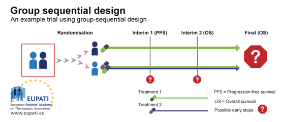
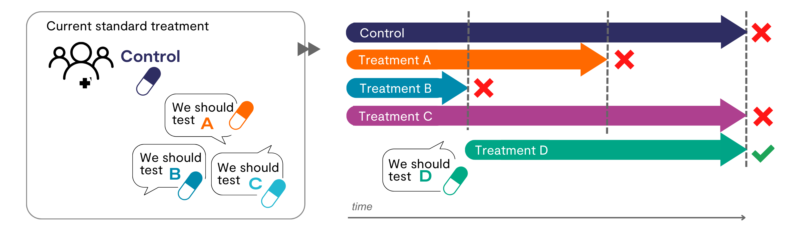

```{r setup, include=FALSE, echo = FALSE,message = FALSE, error = FALSE, warning = FALSE}
knitr::opts_chunk$set(echo = TRUE, fig.width = 10, fig.height = 6)

packages<-c("tidyverse", "kableExtra")

ipak <- function(pkg){
  new.pkg <- pkg[!(pkg %in% installed.packages()[, "Package"])]
  if (length(new.pkg)) 
    install.packages(new.pkg, dependencies = TRUE)
  sapply(pkg, require, character.only = TRUE)
}
ipak(packages)
 
 
setwd(dirname(rstudioapi::getSourceEditorContext()$path))
getwd()
Sys.setlocale("LC_ALL","English")
```


 

## Group Sequential Design

Group Sequential Design (GSD) is a sophisticated statistical technique used primarily in clinical trials to evaluate the efficacy or safety of a new treatment in stages, rather than waiting for the trial's conclusion. This approach is particularly beneficial as it allows for early termination of the trial for efficacy, safety, or futility, thereby potentially reducing costs and ethical concerns associated with exposing participants to less effective or harmful treatments.

### Key Features of Group Sequential Design

1. **Interim Analysis**: GSD involves multiple planned interim analyses of the data. At each of these points, a decision can be made to continue, modify, or stop the trial based on the results. These analyses are conducted at pre-specified times or after a certain number of patients have been observed.

2. **Statistical Rigor**: The design incorporates methods to control for Type I (false positive) and Type II (false negative) errors across the multiple looks at the data. Since every interim analysis carries a risk of incorrectly rejecting the null hypothesis (declaring a treatment effective when it is not), GSD uses specific statistical techniques to adjust the significance thresholds.

3. **Error Spending Functions**: These are mathematical tools used in GSD to allocate the probability of type I and type II errors across the interim analyses. Well-known functions include the O'Brien-Fleming and Pocock methods, which differ in how conservatively they spend the error probabilities. O'Brien-Fleming is more conservative early in the trial, making it harder to declare early success, while Pocock allows more evenly distributed error rates across analyses.

4. **Flexibility and Adaptability**: GSD is flexible in that it can adapt to the data as it accumulates. For instance, if interim results are promising, a trial might be stopped early due to efficacy, thus speeding up the availability of beneficial treatments to the public. Conversely, a lack of interim efficacy might lead to an early trial termination for futility, saving resources and protecting participants from ineffective treatments.

5. **Ethical and Practical Advantages**: By potentially shortening the duration of trials and reducing the number of participants exposed to inferior treatments, GSD enhances the ethical conduct of clinical trials. It also helps in faster decision-making, which is critical in scenarios like pandemics where rapid development and evaluation of treatments are required.

### Types of Group Sequential Design

1. **Error Spending**: Involves allocating the probabilities of type I (false positive) and type II (false negative) errors across multiple interim analyses, allowing flexibility in the design and analysis stages of a clinical trial.

2. **Haybittle-Peto Method**: A more conservative approach that defines boundaries for efficacy based on unadjusted p-values, seeking to preserve the overall Type I error rate across multiple looks at the data.

3. **Wang-Tsiatis Parameter Method**: Combines considerations of efficacy and futility. This method proposes strategies to optimize the average sample size needed to maintain statistical power while controlling type I error.

4. **Classic Designs**: Including well-known methods like O’Brien-Fleming and Pocock, which set more rigid boundaries and are less flexible during data monitoring than error spending methods.

5. **Unified Family**: Encompasses the Wang-Tsiatis method and classic designs, offering a two-parameter approach that provides a balance between flexibility and stringent monitoring.

6. **Whitehead’s Sequential Designs**: An extension of sequential probability ratio tests (SPRT) to settings where decisions are made at group intervals, often visualized with unique design patterns like "Triangular" or "Christmas Tree" designs.

7. **Others**: Custom designs such as Conditional Power or adaptive designs like Multi-Arm Multi-Stage (MAMS) strategies, which allow for changes based on interim results without compromising the integrity of the statistical inference.

 

### Complex Survival Group Sequential Designs

These designs address the challenges associated with clinical trials that assess survival outcomes, such as in oncology or chronic disease studies.

- **Patient Follow-up**: Decisions on whether to continue following patients until the end of the study or for a fixed period are critical. This affects the timing and reliability of interim analyses.
  
- **Non-proportional Hazards**: This refers to situations where the effect of a treatment on survival is not constant over time. Handling non-proportional hazards requires complex statistical methods to ensure accurate interpretations.

- **Complex Accrual, Survival, Dropout**: Managing varying rates of patient accrual, different survival rates, and dropout rates are challenges that can affect the power and statistical validity of the study.

- **Stratified Analyses**: Analyzing subsets of data stratified by factors like demographics or disease severity can help in understanding treatment effects more deeply but requires careful planning to maintain statistical power.

```{r , echo=FALSE, fig.align="center", out.width = '75%'} 
## https://learning.eupati.eu/mod/book/view.php?id=341&chapterid=270

```

### Complex Adaptive Group Sequential Designs

These designs incorporate flexibility that allows modifications to the trial procedures based on interim results without undermining the integrity of the study.

- **Treatment Arms**: Multi-Arm Multi-Stage (MAMS) designs are used to evaluate several treatment arms simultaneously. Ineffective treatments can be dropped early ("Drop the loser"), and potentially effective treatments can be identified sooner ("Pick the winner").

- **Sample Size**: Bayesian Sample Size Re-estimation (BSSR) or Frequentist approaches like the Unconditional Sample Size Re-estimation (USSR) can adjust the sample size based on interim data to maintain adequate power or precision.

- **Patient Subgroups**: Identifying which subgroups of patients benefit most from the treatment can lead to more personalized medicine approaches but requires sophisticated statistical techniques to analyze effectively.

- **Bayesian Approach**: Using Bayesian statistics can provide a more flexible and comprehensive analysis of data through the incorporation of prior knowledge and real-time data updating, which is particularly useful in adaptive designs.

```{r , echo=FALSE, fig.align="center", out.width = '75%'}
## https://www.mrcctu.ucl.ac.uk/our-research/methodology/design/multi-arm-multi-stage-mams-platform-trials/

```
 
 
## Group Sequential Design Simulation

Simulation in the context of Group Sequential Design (GSD) provides a critical tool for designing and analyzing complex clinical trials. The process employs simulated study data to predict and verify the characteristics of a GSD. This approach is particularly important for understanding the implications of advanced GSDs and ensuring the robustness of the study before actual implementation.

### Benefits of GSD Simulation

- **Complex GSD Understanding**: Simulations help in comprehending the outcomes and behaviors of complex GSDs, which might be difficult to predict using traditional analytical methods due to their sophisticated and flexible nature.
  
- **Verification of Design**: It allows for the verification of the original design, ensuring that the planned parameters are appropriate for achieving the desired statistical power and maintaining control over Type I and Type II errors.

- **Exploration of Scenarios**: Simulations can test various scenarios including different rates of patient accrual, variations in treatment effects, and changes to the timing and frequency of interim analyses. This helps in optimizing the design by considering a range of possible outcomes.

- **Regulatory Approval**: Given the complexity and the high stakes involved in clinical trials, regulatory bodies often view positively the use of simulation to demonstrate the robustness and reliability of a GSD. It aids in the approval process by showing that the trial design can effectively manage potential risks and uncertainties.

 
### Steps in Designing Simulated GSD

1. **Generating Model Assumptions**: This involves defining the underlying statistical distributions and parameters that reflect the clinical scenario being studied. Assumptions might include the expected effect size of the treatment, variance, and patient response distribution.

```{r , echo=FALSE, fig.align="center", out.width = '75%'} 
knitr::include_graphics("./02_Plots/GSD-Simulation-Step1.png")
```

2. **Design Assumptions**: Set up the structural aspects of the trial, such as the number and timing of interim analyses, the criteria for continuing or stopping the trial, and the methods for adjusting the estimates based on interim results.

```{r , echo=FALSE, fig.align="center", out.width = '75%'} 
knitr::include_graphics("./02_Plots/GSD-Simulation-Step2.png")
```

3. **Boundary/Information Assumptions**: Determine the statistical thresholds (boundaries) for making decisions at each interim analysis. This involves setting the alpha and beta spending functions that dictate how the error probabilities are allocated throughout the trial.

4. **Simulation Control Assumptions**: Define the rules for running the simulation, including the number of simulations, the method for generating data, and the criteria for evaluating the outcomes of each simulated iteration.

### Implementation in R


```{r,echo = F,message = FALSE, error = FALSE, warning = FALSE}
# install.packages("gsDesign")
library(gsDesign)

#  asymmetric design with user-specified spending that is non-binding
#  sample size is computed relative to a fixed design with n=1000
sfup <- c(.033333, .063367, .1)
sflp <- c(.25, .5, .75)
timing <- c(.1, .4, .7)
x <- gsDesign(
  k = 4, timing = timing, sfu = sfPoints, sfupar = sfup, sfl = sfPoints,
  sflpar = sflp, n.fix = 1000
)
x
plot(x)
plot(x, plottype = 2)
```


## Survival Group Sequential Design


### Power for Survival Analysis

Power calculations in survival analysis are influenced by several key choices:

1. **Design Choices**: Including the structure of the trial (parallel, one-arm, or complex designs).
2. **Statistical Methods**: Such as the log-rank test or Cox proportional hazards model, which are common in survival analysis for comparing the survival times of different groups.
3. **Endpoints**: Typically involves the hazard ratio or survival time, directly impacting how the analysis interprets and values outcomes.
4. **Survival Distribution Models**: Including exponential or Weibull distributions which assume different forms of the hazard function over time.

The primary driver for statistical power in survival analysis is the number of events (e.g., deaths, disease progression), not just the sample size. This is because the statistical methods used often depend more directly on the number of events to detect a true effect.

### Key Equations and Concepts

- **Schoenfeld (1981)** and **Freedman (1982)** provide formulas to estimate the required number of events or total sample size based on desired power and effect size, incorporating adjustments for multiple interim analyses.
  
- **Lachin & Foulkes (1986)** offer an expression for expected number of events given non-uniform accrual rates, dropout rates, and other complexities.

- **Lakatos (1988)** provides a matrix method for estimating the required sample size, accommodating various rates and probabilities that influence survival analysis.

- **Y. Tang (2021/2022)** introduces a method for estimating variance components in complex survival models, which is useful in planning and analyzing survival data under various assumptions and covariate effects.
 

Certainly! The key equations from your slide reflect various methods used to calculate sample size and number of events for survival analysis in clinical trials, specifically within the framework of group sequential design (GSD). Let’s explore these equations in detail:

#### 1. Schoenfeld's Formula (1981)

This formula is used to calculate the number of events needed to achieve a desired power in a survival study:

\[ E = \frac{(z_{\alpha/2} + z_{\beta})^2}{[\ln(h)]^2} \]

- **\(E\)**: Number of events required.
- **\(z_{\alpha/2}\)** and **\(z_{\beta}\)**: Standard normal deviates corresponding to the Type I error rate (\(\alpha\)) and the power (1-\(\beta\)), respectively.
- **\(\ln(h)\)**: Natural logarithm of the hazard ratio. This reflects the expected difference in the hazard rates between the treatment and control groups.

#### 2. Freedman's Formula (1982)

Freedman provided a formula for estimating the sample size needed in a survival study considering two different survival times under the null and alternative hypotheses:

\[ n = \frac{(z_{1-\alpha/2} + z_{1-\beta})^2 (h+1)^2}{(2-x_1 - x_2)(h-1)^2} \]

- **\(n\)**: Total sample size required.
- **\(x_1, x_2\)**: Expected proportions surviving in each group at a given time point.
- **\(h\)**: Hazard ratio under the alternative hypothesis.

#### 3. Lachin & Foulkes' Expected Number of Events (1986)

This formula helps calculate the expected number of events over time, accounting for different accrual and dropout rates:

\[ E(p_j) = \frac{\lambda}{4 + d} \left[ 1 - e^{-(4+d)T} - e^{-(4+d)\tau} \right] \]

- **\(\lambda\)**: Initial accrual rate.
- **\(d\)**: Dropout rate.
- **\(T, \tau\)**: Total follow-up time and interim analysis time, respectively.

#### 4. Lakatos' Matrix Method for Sample Size (1988)

Lakatos introduced a matrix-based method to compute the required sample size considering various scenarios, represented in matrix form for simplicity in computations:

\[ L, E, Ac \]
- Matrices **\(L\)**, **\(E\)**, and **\(Ac\)** capture different rates and probabilities impacting the study, such as loss to follow-up, event probabilities, and accrual rates.

#### 5. Tang's Variance Estimation (2021/2022)

Tang proposed a method for estimating variance in survival models, essential for planning and analyzing survival data with complex covariate effects:

\[ \sigma^2 = \int_{0}^{\infty} \left[ \frac{u(t) \phi'(t)}{[\phi(t)/\phi_0(t)] + 1} \right] V(t) \, dt \]

- **\(\sigma^2\)**: Variance of the estimator.
- **\(u(t)\)**, **\(\phi(t)\)**, **\(\phi_0(t)\)**: Functions representing the weighting scheme, cumulative hazard function under the alternative hypothesis, and under the null hypothesis, respectively.
- **\(V(t)\)**: Information matrix which may involve covariates and other model complexities.

Each of these equations plays a critical role in designing survival analysis studies within a GSD framework, allowing for robust planning and analysis while considering various uncertainties and complexities inherent in clinical trial data.

### Complexities in Survival GSD

- **Unknown Follow-up**: The uncertainty in follow-up time makes it difficult to precisely schedule and plan interim analyses, which are crucial for decision-making in GSDs.
  
- **Interim Analysis Timing**: It's challenging to predict exactly when interim analyses will occur, especially in longer trials where events (like progression or death) determine the timing.
  
- **Variable Cohort Activity**: At any interim point, the cohort's composition might be skewed towards more active (or more recently recruited) participants, affecting the interim results.

- **Constant Effects vs. Non-Proportional Hazards (NPH)**: Trials must decide whether to assume that the treatment effect is constant over time or if it varies, which impacts the choice of statistical model and interpretation of results.

- **Interim Events and Sampling Bias**: Increasing sample size can bias the detection of early trends, while increasing follow-up time can bias the capture of later trends, highlighting the delicate balance needed in trial planning.


- **Strategic Planning**: Using approaches like the Unconditional Sample Size Re-estimation (USSR) proposed by Freidlin & Korn (2017) can help address some of these complexities by allowing flexibility in sample size adjustment based on interim data.


## Reference
 

1. Haybittle, J.L. (1971). "Repeated assessment of results in clinical trials of cancer treatment." *The British Journal of Radiology*, 44, pp. 793-797.
2. Peto, R., Pike, M.C., Armitage, P., Breslow, N.E., Cox, D.R., Howard, S.V., Mantel, N., McPherson, K., Peto, J., and Smith, P.G. (1976). "Design and analysis of randomized clinical trials requiring prolonged observation of each patient. I. Introduction and design." *British Journal of Cancer*, 34(6), pp. 585–612.
3. O'Brien, P.C. & Fleming, T.R. (1979). "A multiple testing procedure for clinical trials." *Biometrics*, 35, pp. 549-556.
4. Pocock, S.J. (1977). "Group sequential methods in the design and analysis of clinical trials." *Biometrika*, 64(2), pp. 191–199.
5. Whitehead, J. & Stratton, I. (1983). "Group Sequential clinical trials with triangular continuation regions." *Biometrics*, 39, pp. 227-236.
6. Whitehead, J. (2001). "Use of the Triangular Test in Sequential Clinical Trials." In *Handbook of Statistics in Clinical Oncology*, pp. 211–228. New York: Marcel Dekker.
7. Lan, K.K.G., & DeMets, D.L. (1983). "Discrete Sequential Boundaries for Clinical Trials." *Biometrika*, 70(3), pp. 659–663.
8. Kim, K., and DeMets, D.L. (1987). "Design and Analysis of Group Sequential Tests Based on the Type I Error Spending Rate Function." *Biometrika*, 74, pp. 149–154.
9. Hwang, I.K., Shih, W.J., and DeCani, J.S. (1990). "Group sequential designs using a family of type I error probability spending functions." *Statistics in Medicine*, 9, pp. 1439-1445.
10. Lan, K.K.G., Rosenberger, W.F., and Lachin, J.M. (1993). "Use of Spending Functions for Occasional or Continuous Monitoring of Data in Clinical Trials." *Statistics in Medicine*, 12(23), pp. 2219–31.
11. Demets, D.L., & Lan, K.G. (1994). "Interim analysis: the alpha spending function approach." *Statistics in Medicine*, 13(13‐14), pp. 1341-1352.
12. Wang, S.K., and Tsiatis, A.A. (1987). "Approximately optimal one-parameter boundaries for group sequential trials." *Biometrics*, 43, pp. 193-199.
13. Pampallona, S., Tsiatis, A.A., and Kim, K. (2001). "Interim monitoring of group sequential trials using spending functions for the type I and type II error probabilities." *Drug Information Journal*, 35, pp. 1113-1121.
14. Emerson, S.S., and Fleming, T.R. (1989). "Symmetric Group Sequential Designs." *Biometrics*, 45, pp. 905–923.
15. Kittelson, J.M., and Emerson, S.S. (1999). "A Unifying Family of Group Sequential Test Designs." *Biometrics*, 55, pp. 874–882.
16. Jennison, C., & Turnbull, B.W. (1999). *Group sequential methods with applications to clinical trials*. CRC Press.
17. Gsponer, T., Gerber, F., Bornkamp, B., Ohlssen, D., Vandemeulebroecke, M., Schmidli, H. (2014). "A Practical Guide to Bayesian Group Sequential Designs." *Pharmaceutical Statistics*, 13(1), pp. 71-80.
18. Berry, S.M., Carlin, B.P., Lee, J.J., & Muller, P. (2010). *Bayesian adaptive methods for clinical trials*. CRC Press.
19. ICH E20 Concept Paper. Available at: [https://database.ich.org/sites/default/files/E20_FinalConceptPaper_2019_1107_0.pdf](https://database.ich.org/sites/default/files/E20_FinalConceptPaper_2019_1107_0.pdf).
20. Bauer, P., Bretz, F., Dragalin, V., König, F., and Wassmer, G. (2016). "Twenty‐five years of confirmatory adaptive designs: opportunities and pitfalls." *Statistics in Medicine*, 35(3), pp. 325-347.
21. Kelly, P.J., Sooriyarachchi, M.R., Stallard, N., & Todd, S. (2005). "A practical comparison of group-sequential and adaptive designs." *Journal of Biopharmaceutical Statistics*, 15(4), pp. 719-738.
22. Cui, L., Hung, H.J., & Wang, S.J. (1999). "Modification of sample size in group sequential clinical trials." *Biometrics*, 55(3), pp. 853-857.
23. Mehta, C.R., & Tsiatis, A.A. (2001). "Flexible Sample Size Considerations under Information Based Interim Monitoring." *Drug Information Journal*, 35, pp. 1095–1112.
24. Chen, Y.J., DeMets, D.L., & Lan, K.K.G. (2004). "Increasing the sample size when the unblinded interim result is promising." *Statistics in Medicine*, 23(7), pp. 1023-1038.
25. Freidlin, B., & Korn, E.L. (2017). "Sample size adjustment designs with time-to-event outcomes: a caution." *Clinical Trials*, 14(6), pp. 597-604.
26. Muller, H-H., & Schafer, H. (2001). "Adaptive group sequential designs for clinical trials: Combining the advantages of adaptive and of classical group sequential approaches." *Biometrics*, 57, pp. 886-891.
27. Wassmer, G. (2006). "Planning and analyzing adaptive group sequential survival trials." *Biometrical Journal: Journal of Mathematical Methods in Biosciences*, 48(4), pp. 714-729.
28. Zelen, M. (1969). "Play the winner rule and the controlled clinical trial." *Journal of the American Statistical Association*, 64(325), pp. 131-146.
29. Ghosh, P., Liu, L., Senchaudhuri, P., Gao, P., & Mehta, C. (2017). "Design and monitoring of multi‐arm multi‐stage clinical trials." *Biometrics*, 73(4), pp. 1289-1299.
30. Ghosh, P., Liu, L., & Mehta, C. (2020). "Adaptive multiarm multistage clinical trials." *Statistics in Medicine*.
 
