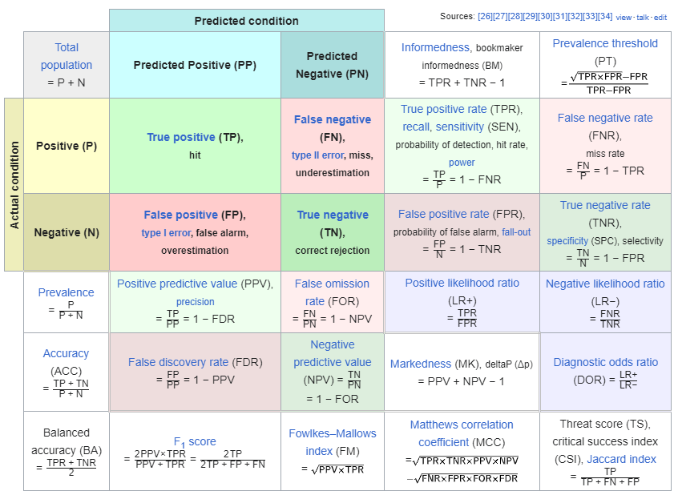
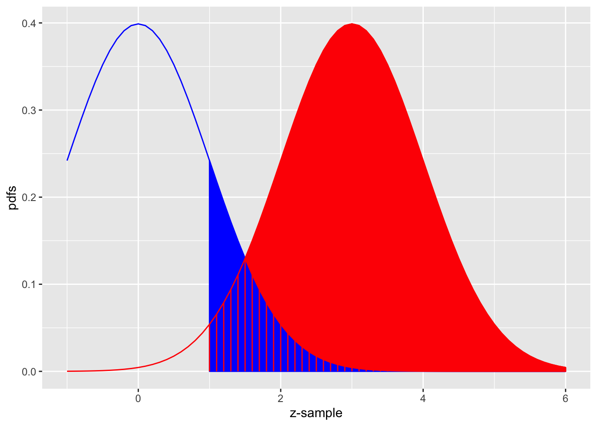
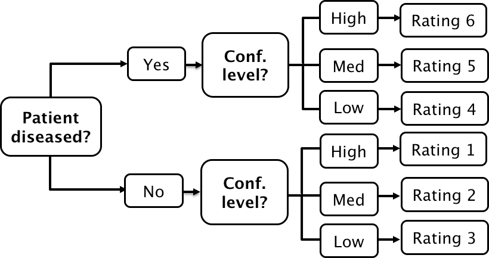
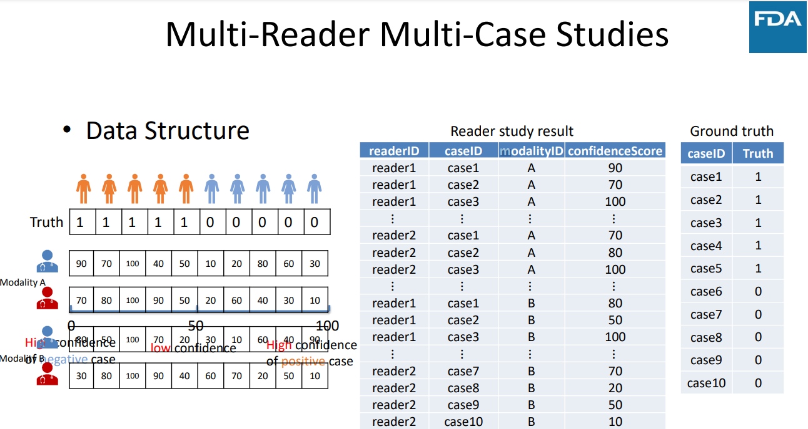

```{r setup, include=FALSE, echo = FALSE,message = FALSE, error = FALSE, warning = FALSE}
knitr::opts_chunk$set(echo = TRUE, fig.width = 10, fig.height = 6)

packages<-c("tidyverse", "kableExtra","RJafroc","iMRMC","MRMCaov")

ipak <- function(pkg){
  new.pkg <- pkg[!(pkg %in% installed.packages()[, "Package"])]
  if (length(new.pkg)) 
    install.packages(new.pkg, dependencies = TRUE)
  sapply(pkg, require, character.only = TRUE)
}
ipak(packages)

source_code_dir <- "./03_Functions/MRMC/"  
file_path_vec <- list.files(source_code_dir, full.names = T)
for(f_path in file_path_vec){source(f_path)}

 
 
setwd(dirname(rstudioapi::getSourceEditorContext()$path))
getwd()
Sys.setlocale("LC_ALL","English")
```

 
# ROC Paradigm

## Four Paradigm

**Measuring observer performance: four paradigms**

A given paradigm can lend itself to different analyses. In historical order the paradigms are: 

* (1) the receiver operating characteristic (ROC) paradigm; 
* (2) the free-response ROC (FROC) paradigm; 
* (3) the location ROC (LROC) paradigm 
* (4) the region of interest (ROI) paradigm. 

Each paradigm assumes that the truth is known independently of the modalities to be compared. This implies that one cannot use diagnoses from one of the modalities to define truth – if one did, the measurement would be biased in favor of the modality used to define truth. It is also assumed that the true disease status of the image is known to the researcher but the radiologist is “blinded” to this information.

**(1) the receiver operating characteristic (ROC) paradigm**

In the ROC paradigm the observer renders a single decision per image. The decision could be communicated using a binary scale (ex. 0 or 1) or declared by use of the terms “negative” or “positive,” abbreviations of “negative for disease” (the radiologist believes the patient is non-diseased) and “positive for disease” (the radiologist believes the patient is diseased), respectively. Alternatively, the radiologist could give an ordered numeric label, termed a rating, to each case where the rating is a number with the property that higher values correspond to greater radiologist’s confidence in presence of disease. A suitable ratings scale could be the consecutive integers 1 through 6, where “1” is “definitely non-diseased” and “6” is “definitely diseased”.

If data is acquired on a binary scale, then the performance of the radiologist can be plotted as a single operating point on an ROC plot. The x-axis of the plot is false positive fraction (FPF), i.e., the fraction of non-diseased cases incorrectly diagnosed as diseased. The y-axis of the plot is true positive fraction (TPF), i.e., the fraction of diseased cases correctly diagnosed as diseased. 


**(2) the free-response ROC (FROC) paradigm**

In the FROC paradigm the observer marks and rates all regions in the image that are sufficiently suspicious for disease. A mark is the location of the suspicious region and the rating is an ordered label, characterizing the degree of suspicion attached to the suspicious region. 

**(3) the location ROC (LROC) paradigm**

In the LROC paradigm the observer gives an overall ROC-type rating to the image, and indicates the location of the most suspicious region in the image. 

**(4) the region of interest (ROI) paradigm**

In the ROI paradigm the researcher divides each image into a number of adjacent non-overlapping regions of interest (ROIs) that cover the clinical area of interest. The radiologist’s task is to evaluate each ROI for presence of disease and give an ROC-type rating to it.


## Basic Analysis Approach 

The basic approach is to obtain data, according to one of the above paradigms, from a group of radiologists interpreting a common set of images in one or more modalities. The way the data is collected, and the structure of the data, depends on the selected paradigm. The next step is to adopt an objective measure of performance, termed a figure or merit (FOM) and a procedure for estimating it for each modality-reader combination. Assuming two modalities, e.g., a new modality and the conventional one, one averages FOM over all readers within each modality. If the difference between the two averages (new modality minus the conventional one) is positive, that is an indication of improvement. Next comes the statistical part: is the difference large enough so as to be unlikely to be due to chance. This part of the analysis, termed significance testing, yields a probability, or p-value, that the observed difference or larger could result from chance even though the modalities have identical performances. If the p-value is very small, that it is taken as evidence that the modalities are not identical in performance, and if the difference is in the right direction, the new modality is judged better.


## ROC

### Confusion Matrix

Let $\mathrm{D}$ represent the radiologist's decision with $\mathrm{D}=1$ representing the decision "case is diagnosed as non-diseased" and $\mathrm{D}=2$ representing the decision "case is diagnosed as diseased". Let $\mathbf{T}$ denote the truth with $\mathrm{T}=1$ representing "case is actually non-diseased" and $T=2$ representing "case is actually diseased". Each decision, one of two values, will be associated with one of two truth states, resulting in an entry in one of 4 cells arranged in a $2 \times 2$ layout, termed the decision vs. truth table, Table 2.1 which is of fundamental importance in observer performance. The cells are labeled as follows. The abbreviation $\mathrm{TN}$, for true negative, represents a $\mathrm{D}=1$ decision on a $\mathrm{T}=1$ case. $\mathrm{FN}$, for false negative, represents a $\mathrm{D}=1$ decision on a $\mathrm{T}=2$ case (also termed a "miss"). FP, for false positive, represents $\mathrm{a} \mathbf{D}=2$ decision on a $\mathrm{T}=1$ case (a "false-alarm") and $\mathrm{TP}$, for true positive, represents $\mathrm{a}=2$ decision on a $\mathrm{T}=2$ case (a "hit").

|         | **T=1** | **T=2** |
|:-------:|:-------:|:-------:|
| **D=1** |    TN   |    FN   |
| **D=2** |    FP   |    TP   |

```{r , echo=FALSE, fig.align="center", out.width = '100%',fig.cap="Formula for Sensitivity, Specificity, Positive Predictive Value (PPV), Negative Predictive Value (NPV) Calculation"}

```


### Analytic Expressions for Specificity and Sensitivity

Specificity corresponding to threshold $\zeta$ is the probability that a Z-sample from a non-diseased case is smaller than $\zeta$. By definition, this is the CDF corresponding to the threshold $\zeta$. In other words:

$$
\left.\begin{array}{rl}
S p(\zeta) & \equiv P\left(Z_{k_1 1}<\zeta \mid Z_{k_1 1} \sim N(0,1)\right) \\
& =\Phi(\zeta)
\end{array}\right\}
$$

The expression for sensitivity can be derived. Consider that the random variable obtaining by shifting the origin to $\mu$. A little thought should convince the reader that $Z_{k_2 2}-\mu$ is distributed as $N(0,1)$. Therefore, the desired probability is:
$$
\left.\begin{array}{rl}
S e(\zeta) & \equiv P\left(Z_{k_2 2} \geq \zeta\right) \\
& =P\left(\left(Z_{k_2 2}-\mu\right) \geq(\zeta-\mu)\right) \\
& =1-P\left(\left(Z_{k_2 2}-\mu\right)<(\zeta-\mu)\right) \\
& =1-\Phi(\zeta-\mu)
\end{array}\right\}
$$

A little thought, based on the definition of the CDF function and the symmetry of the unit-normal pdf function, should convince the reader that:
$$
\left.\begin{array}{rl}
1-\Phi(\zeta) & =-\Phi(\zeta) \\
1-\Phi(\zeta-\mu) & =\Phi(\mu-\zeta)
\end{array}\right\}
$$

Instead of carrying the "1 minus" around one can use the more compact notation. Summarizing, the analytical formulae for the specificity and sensitivity for the equal-variance binormal model are:
$$
\begin{gathered}
S p(\zeta)=\Phi(\zeta) \\
S e(\zeta)=\Phi(\mu-\zeta)
\end{gathered}
$$

Sensitivity and specificity are restricted to the range 0 to 1 . The observer's performance could be characterized by specifying sensitivity and specificity, i.e., a pair of numbers. If both sensitivity and specificity of an imaging system are greater than the corresponding values for another system, then the first system is unambiguously better than the second. But if sensitivity is greater for the first but specificity is greater for the second the comparison is ambiguous. A scalar measure is desirable that combines sensitivity and specificity into a single measure of diagnostic performance.

The parameter $\mu$ satisfies the requirements of a scalar performancer measure, termed a figure of merit (FOM). Eqn. (3.15) can be solved for $\mu$ as follows. Inverting the equations yields:
$$
\left.\begin{array}{rl}
\zeta & =\Phi^{-1}(\operatorname{Sp}(\zeta)) \\
\mu-\zeta & =\Phi^{-1}(\operatorname{Se}(\zeta))
\end{array}\right\}
$$

Eliminating $\zeta$ yields:
$$
\left.\mu=\Phi^{-1}(\operatorname{Sp}(\zeta))+\Phi^{-1}(\operatorname{Se}(\zeta))\right\}
$$

This is a useful relation, as it converts a pair of numbers into a scalar performance measure. Now it is almost trivial to compare two modalities: the one with the higher $\mu$ is better. In reality, the comparison is not trivial since like sensitivity and specificity $\mu$ has to be estimated from a finite dataset and one must account for sampling variability.

```{r , echo=FALSE, fig.align="center", out.width = '75%',fig.cap="The equal-variance binormal model"}

```

Fig. above shows the equal-variance binormal model for $\mu=3$ and $\zeta=1$. The blue-shaded area, including the "common" portion with the vertical red lines, is the probability that a z-sample from a non-diseased case exceeds $\zeta=1$, which is the complement of specificity, i.e., false positive fraction, which is 1 pnorm(1) $=0.159$. The red shaded area, including the "common" portion with the vertical red lines, is the probability that a $z$-sample from a diseased case exceeds $\zeta=1$, which is sensitivity or true positive fraction, which is pnorm(31) $=0.977$.

### ROC Curve

The receiver operating characteristic (ROC) is defined as the plot of sensitivity (y-axis) vs. 1-specificity (x-axis). Equivalently, it is the plot of TPF (y-axis) vs. FPF (x-axis).

$$
\left.\begin{array}{rl}
\operatorname{FPF}(\zeta) & \equiv 1-\operatorname{Sp}(\zeta) \\
& =\Phi(-\zeta) \\
\operatorname{TPF}(\zeta) & \equiv \operatorname{Se}(\zeta) \\
& =\Phi(\mu-\zeta)
\end{array}\right\}
$$

Specifying $\zeta$ selects a particular operating point on this curve and varying $\zeta$ from $+\infty$ to $-\infty$ causes the operating point to trace out the ROC curve from the origin $(0,0)$ to $(1,1)$. Note that as $\zeta$ increases the operating point moves down the curve. The operating point $O(\zeta \mid \mu)$ for the equal variance binormal model is:
$$
O(\zeta \mid \mu)=(\Phi(-\zeta), \Phi(\mu-\zeta))
$$

The operating point predicted by the above equation lies exactly on the theoretical ROC curve. This condition can only be achieved with very large numbers of cases. With finite datasets the operating point will almost never be exactly on the theoretical curve.
The ROC curve is the locus of the operating point for fixed $\mu$ and variable $\zeta$. Fig. below shows examples of equal-variance binormal model ROC curves for different values of $\mu$. Each has the property that TPF is a monotonically increasing function of FPF and the slope decreases monotonically as the operating point moves up the curve. As $\mu$ increases the curves get progressively upward-left shifted, approaching the top-left corner of the ROC plot. In the limit $\mu=\infty$ the curve degenerates into two line segments, a vertical one connecting the origin to $(0,1)$ and a horizontal one connecting $(0,1)$ to $(1,1)$ - the ROC plot for a perfect observer.


```{r , echo=FALSE, fig.align="center", out.width = '75%',fig.cap="ROC plots predicted by the equal variance binormal model for different values of mu"}
knitr::include_graphics("./02_Plots/MRMC/MRMC_ROC.png")
```

**The chance diagonal**

In Fig. above the ROC curve for $\mu=0$ is the positive diagonal of the ROC plot, termed the chance diagonal. Along this curve $\mathrm{TPF}=\mathrm{FPF}$ and the observer's performance is at chance level. For $\mu=0$ the pdf of the diseased distribution is identical to that of the non-diseased distribution: both are centered at the origin. Therefore, no matter the choice of threshold $\zeta$, $\mathrm{TPF}=\mathrm{FPF}$. Setting $\mu=0$ yields:
$$
\operatorname{TPF}(\zeta)=\operatorname{FPF}(\zeta)=\Phi(-\zeta)
$$

In this case the red and blue curves in Fig. above coincide. The observer is unable to find any difference between the two distributions. This can happen if the cancers are of such low visibility that diseased cases are indistinguishable from non-diseased ones, or the observer’s skill level is so poor that the observer is unable to make use of distinguishing characteristics between diseased and non-diseased cases that do exist.

**Area under the ROC curve**

The area AUC (abbreviation for area under curve) under the ROC curve suggests itself as a measure of performance that is independent of threshold and therefore circumvents the ambiguity issue of comparing sensitivity/specificity pairs, and has other advantages. It is defined by the following integrals:

$$
\begin{equation}
\begin{aligned}
A_{z;\sigma = 1} &= \int_{0}^{1}TPF(\zeta)d(FPF(\zeta))\\
&=\int_{0}^{1}FPF(\zeta)d(TPF(\zeta))\\
\end{aligned}
\end{equation}
$$

### ROC Counts table

In a positive-directed rating scale with five discrete levels, the ratings could be the ordered labels:

* “1”: definitely non-diseased,
* “2”: probably non-diseased,
* “3”: could be non-diseased or diseased,
* “4”: probably diseased,
* “5”: definitely diseased.

At the conclusion of the ROC study an ROC counts table is constructed. 

|                  | **r=5** | **r=4** | **r=3** | **r=2** | **r=1** |
|:----------------:|:-------:|:-------:|:-------:|:-------:|:-------:|
| **non-diseased** |    1    |    2    |    8    |    19   |    30   |
|   **diseased**   |    22   |    12   |    5    |    6    |    5    |
TABLE: Representative counts table.

Table below illustrates how ROC operating points are calculated from the cell counts. In this table: r>=5 means “counting ratings greater than or equal to 5”, r>=4 means “counting ratings greater than or equal to 4”, etc

|         | **r>=5** | **r>=4** | **r>=3** | **r>=2** | **r>=1** |
|:-------:|:--------:|:--------:|:--------:|:--------:|:--------:|
| **FPF** |  0.0167  |    0.05  |  0.1833  |     0.5  |       1  |
| **TPF** |  0.4400  |    0.68  |  0.7800  |     0.9  |       1  |
TABLE: Computation of operating points from cell counts.

## Score/Ratings

The ratings are to be thought of as ordered labels, not as numeric values.

The temptation to regard confidence levels / ratings as numeric values can be particularly strong when one uses a large number of bins to collect the data. One could use of quasi-continuous ratings scale, implemented for example, by having a slider-bar user interface for selecting the rating. The slider bar typically extends from 0 to 100, and the rating could be recorded as a floating-point number, e.g., 63.45. Here too one cannot assume that the difference between a zero-rated case and a 10 rated case is a tenth of the difference between a zero-rated case and a 100 rated case. So averaging the ratings is not allowed. Additionally, one cannot assume that different observers use the labels in the same way. One observer’s 4-rating is not equivalent to another observers 4-rating.

The reason for the quotes in the title to this section is that a single operating point on a laboratory ROC plot, no matter how obtained, has little relevance to how radiologists operate in the clinic. However, some consider it useful to quote an operating point from an ROC study. For a 5-rating ROC study, Table 4.1, it is not possible to unambiguously calculate the operating point of the observer in the binary task of discriminating between non-diseased and diseased cases. One possibility would be to use the “three and above” ratings to define the operating point, but one might jus have well have chosen “two and above”. A second possibility is to instruct the radiologist that a “four and above” rating, for example, implies the case would be reported “clinically” as diseased. However, the radiologist can only pretend so far that this study, which has no clinical consequences, is somehow a “clinical” study.

If a single laboratory study based operating point is desired (Nishikawa 2012), the best strategy, in my opinion, is to obtain the rating via two questions. This method is also illustrated in Table 3.1 of a book on detection theory (Macmillan and Creelman 2004). The first question is “is the case diseased?” The binary (Yes/No) response to this question allows unambiguous calculation of the operating point. The second question is: “what is your confidence in your previous decision?” and allow three responses, namely Low, Medium and High. The dual-question approach is equivalent to a 6-point rating scale, Fig. 4.3. The answer to the first question, is the patient diseased, allows unambiguous construction of a single “clinical” operating point for disease presence. The answer to the second question yields multiple operating points.


```{r , echo=FALSE, fig.align="center", out.width = '75%',fig.cap="A method for acquiring ROC data on an effectively 6-point scale that also yields an unambiguous single operating point for declaring patients diseased. Note the reversal of the ordering of the final ratings in the last “column” in the lower half of the figure"}

```

The ordering of the ratings can be understood as follows. The four, five and six ratings are as expected. If the radiologist states the patient is diseased and the confidence level is high that is clearly the highest end of the scale, i.e., six, and the lower confidence levels, five and four, follow, as shown. If, on the other hand, the radiologist states the patient is non-diseased, and the confidence level is high, then that must be the lowest end of the scale, i.e., “1”. The lower confidence levels in a negative decision must be higher than “1”, namely “2” and “3”, as shown. As expected, the low confidence ratings, namely “3” (non-diseased, low confidence) and “4” (diseased, low confidence) are adjacent to each other. With this method of data-collection, there is no confusion as to what rating defines the single desired operating point as this is determined by the binary response to the first question. The 6-point rating scale is also sufficiently fine to not smooth out the ability of the radiologist to maintain distinct different levels. In my experience, using this scale one expects rating noise of about ± 1/2 a rating bin, i.e., the same difficult case, shown on different occasions to the same radiologist (with sufficient time lapse or other intervening cases to minimize memory effects) is expected to elicit a “3” or “4”, with roughly equal probability.


# Binormal Model

## Equal Variance Binormal Model

The equal variance binormal model in ROC (Receiver Operating Characteristic) analysis is a statistical approach used to evaluate the performance of diagnostic tests. It assumes that the distributions of the test results for both the diseased and non-diseased groups follow normal (Gaussian) distributions and that these distributions have the same variance.

Here's a breakdown of the key components and how the model works:

1. **Binormal Assumption**: This model assumes that the test results for both positive (diseased) and negative (non-diseased) populations are normally distributed. This is a simplification often used to make the model more mathematically tractable.

2. **Equal Variance**: The assumption of equal variance means that while the means of the two distributions might differ (indicating that the test can distinguish between diseased and non-diseased cases), the spread (variance) of the results around the mean is the same for both groups.

3. **ROC Curve Construction**: The ROC curve is constructed by plotting the true positive rate (TPR, sensitivity) against the false positive rate (FPR, 1-specificity) at various threshold settings of the diagnostic test. Under the equal variance binormal model, the ROC curve can be characterized analytically using the cumulative distribution functions of the normal distributions.

4. **Analysis and Metrics**: The area under the ROC curve (AUC) is a common metric derived from ROC analysis. In the context of the equal variance binormal model, the AUC can be interpreted as the probability that a randomly chosen diseased subject has a higher test result than a randomly chosen non-diseased subject. Higher AUC values indicate better diagnostic performance.

This model is particularly useful because of its mathematical simplicity and the ease with which it can be used to calculate various statistics relevant to test performance. However, it's essential to verify that the equal variance assumption holds in practice for the specific diagnostic test being analyzed, as deviations from this assumption can lead to inaccuracies in the ROC analysis.

## Unequal Variance Binormal Model

- When the equal variance assumption does not hold (as you've observed), the unequal variance model becomes more appropriate. This model allows for each group to have its own variance, offering a potentially better fit for datasets where diseased and non-diseased groups exhibit different levels of score dispersion.

```{r , echo=FALSE, fig.align="center", out.width = '75%',fig.cap="The pdfs of the two binormal model distributions for μ=1.5 and  σ=1.5."}
knitr::include_graphics("./02_Plots/MRMC/MRMC_BinormalModel.png")
```

**Specificity and Sensitivity**

 
- **\(Z_t\)**: The random z-sample from truth state \(t\) (1 for non-diseased, 2 for diseased).
- For non-diseased cases (\(t=1\)), the z-scores are normally distributed as \(N(0,1)\).
- For diseased cases (\(t=2\)), the scores follow the transformation \(\frac{Z_2 - \mu}{\sigma} \sim N(0,1)\), where \(\mu\) and \(\sigma\) are the mean and standard deviation of the diseased group.
 
- **Specificity (Sp)** for a cutoff \(\xi\) is defined as:
  \[
  Sp(\xi) = P(Z_1 \leq \xi) = \Phi(\xi)
  \]
  where \(\Phi\) is the cumulative distribution function (CDF) of the standard normal distribution.
  
- **Sensitivity (Se)** for the same cutoff \(\xi\) in the context of the diseased group is:
  \[
  Se(\xi|\mu, \sigma) = P(Z_2 > \xi) = 1 - P\left(\frac{Z_2 - \mu}{\sigma} \leq \frac{\xi - \mu}{\sigma}\right) = 1 - \Phi\left(\frac{\xi - \mu}{\sigma}\right)
  \]
  which simplifies to:
  \[
  Se(\xi|\mu, \sigma) = \Phi\left(\frac{\mu - \xi}{\sigma}\right)
  \]

**ROC Curve Equations:**

- The **False Positive Fraction (FPF)**, which is 1 minus specificity, is expressed as:
  \[
  FPF(\xi) = 1 - Sp(\xi) = \Phi(-\xi)
  \]

- The **True Positive Fraction (TPF)**, which is sensitivity, is expressed as:
  \[
  TPF(\xi|\mu, \sigma) = \Phi\left(\frac{\mu - \xi}{\sigma}\right)
  \]

- The TPF as a function of FPF can be derived by expressing \(\xi\) in terms of FPF:
  \[
  \xi = -\Phi^{-1}(FPF)
  \]
  substituting back, the TPF in terms of FPF becomes:
  \[
  TPF = \Phi\left(\frac{\mu + \Phi^{-1}(FPF)}{\sigma}\right)
  \]


## Proper ROC models

1. **Issue with the Binormal Model**: 
   - The binormal model often generates ROC curves that cross the diagonal line of no discrimination, i.e., the line where the true positive rate equals the false positive rate. This crossing indicates regions where the diagnostic performance is worse than random chance, which is scientifically questionable and termed "improper."
   - The problem arises because the shape parameter \( b \) in the binormal model rarely equals exactly 1, the only value that would prevent the curve from crossing the chance diagonal. A value \( b < 1 \) results in a curve crossing near the upper right corner, while \( b > 1 \) leads to a crossing near the origin.

**Methods to Achieve Proper ROC Curves**

1. **Radiological Search Model (RSM)**:
   - Developed by Chakraborty and colleagues, implemented in the RJafroc package. This model is designed based on patterns observed in radiological searches, making it suitable for medical imaging applications.

2. **Contaminated Binormal Model (CBM)**:
   - Introduced by Dorfman, Berbaum, and Brandser, and available through DBM-MRMC software. It accounts for data contamination effects and is also implemented in the RJafroc package.

3. **Binormal Model-Based Proper ROC Fitting**:
   - Developed by Metz and Pan, this method is part of the PROPROC software, integrated within the DBM-MRMC software. It addresses the shortcomings of the traditional binormal model by ensuring the ROC curves are proper.

4. **Bigamma Model**:
   - Introduced by Dorfman et al., it offers a straightforward implementation approach, though specific software for it is not widely available.

5. **Location ROC (LROC) Fit (LROCFIT)**:
   - Based on the LROC paradigm by Swensson, which differs by requiring localization data. This model ensures proper ROC curves but requires specific types of data that include localization information.
  
  


# Empirical AUC

## Empirical AUC (Non-Par Model)

The ROC plot is defined as the plot of sensitivity (y-axis) vs. 1-specificity (x-axis). Equivalently, it is the plot of TPF vs. FPF . An equal variance binormal model was introduced in an earlier chapter which allows an ROC plot to be fitted to a single observed operating point. The more commonly used ratings paradigm was introduced in the previous chapter.

The empirical Area Under the Curve (AUC) in the context of ROC (Receiver Operating Characteristic) analysis is a non-parametric measure used to evaluate the performance of a diagnostic test or classifier. The AUC represents the probability that a classifier will rank a randomly chosen positive instance higher than a randomly chosen negative instance. Here’s how it is typically calculated and interpreted:


**Calculation of Empirical AUC**

1. **Data Preparation**: You start with a dataset where you have the actual outcomes (positive or negative) and the predicted probabilities or scores from the classifier.

2. **Ranking Scores**: Rank all instances by the classifier’s scores or probabilities, with higher scores indicating a stronger prediction for the positive class.

3. **Counting Pairs**: For each pair of one positive and one negative instance, count the pair as a "concordant pair" if the positive instance has a higher score than the negative instance. If they have the same score, it’s typically counted as a half of a concordant pair.

4. **Calculation**: The empirical AUC is calculated as the ratio of the number of concordant pairs (plus half the number of ties, if ties are accounted for) to the total number of pairs of positive and negative instances:
   \[
   \text{AUC} = \frac{\text{Number of concordant pairs} + 0.5 \times \text{Number of ties}}{\text{Total pairs of positive and negative instances}}
   \]


- **0.5**: An AUC of 0.5 suggests no discriminative ability between positive and negative classes. It’s as good as random guessing.
- **1.0**: An AUC of 1.0 indicates perfect discrimination. The classifier or test always ranks all positive instances higher than any negative instance.
- **Between 0.5 and 1.0**: Values greater than 0.5 but less than 1.0 indicate varying degrees of ability to discriminate between the classes. The closer to 1.0, the better the model is at distinguishing between the two classes.

**Advantages of Empirical AUC**

- **Non-parametric**: It does not make any assumptions about the underlying distributions of the classifier scores.
- **Robustness**: The AUC is often less affected by the imbalance in the dataset between the positive and negative classes.
- **Interpretability**: The value of AUC is easy to understand and communicate, making it a popular choice for evaluating binary classification models.

The empirical AUC provides a straightforward and effective way to measure how well a classifier can separate two classes without relying on assumptions about the score distributions. This makes it highly useful in practical applications where theoretical distributions might not be known or applicable.

## Wilcoxon Statistic

1. **AUC as Shaded Area**:
   - In ROC analysis, the area under the curve (AUC) represents the probability that a randomly chosen positive instance scores higher than a randomly chosen negative instance. It's a measure of the test's overall ability to discriminate between the conditions being tested (e.g., diseased vs. non-diseased).
   - Visually, this area can be conceptualized as the sum of areas under segments of the ROC curve, which could resemble a combination of triangles and trapezoids, depending on the curve's shape.

2. **Simplifying AUC Calculation**:
   - Directly calculating the areas of these geometric shapes can be complex. However, there's a simpler method using a statistical measure known as the Wilcoxon statistic (also known as the Mann-Whitney-Wilcoxon statistic). This statistic effectively quantifies the AUC by considering the ranks of individual scores from both groups.
   - The Wilcoxon statistic is calculated by ranking all observations from both groups together and then summing the ranks for one of the groups. It reflects the extent to which the scores of one group are consistently higher than the scores of the other group.
   
## Bamber’s Equivalence theorem

The empirical area (AUC) calculated via the Wilcoxon statistic has been proven equivalent to the geometric area under the ROC curve. This equivalence is part of what's known as Bamber's Theorem. It reassures analysts that using the Wilcoxon statistic to compute the AUC is not only simpler but also theoretically sound.

The Wilcoxon statistic, commonly used in non-parametric statistical tests, serves as a measure of the difference between two independent samples. In the context of ROC analysis, this statistic quantifies the degree to which the distribution of scores for the positive class (e.g., diseased) is shifted relative to the negative class (e.g., healthy). The mathematical representation suggests:

\[ W = \text{AUC} \]

This equation means that the Wilcoxon statistic (\(W\)) is numerically equivalent to the area under the empirical ROC curve (AUC). This AUC represents the probability that a randomly selected positive instance is correctly ranked higher than a randomly selected negative instance by the test.


Before Bamber's theorem was established, the relationship between plotting an empirical ROC curve and calculating the Wilcoxon statistic was not formally recognized. Bamber's equivalence theorem demonstrated that these two approaches are not only related but are quantitatively identical. This revelation has profound implications:

- **Validation of Non-Parametric Methods**: This theorem validates the use of the Wilcoxon statistic as a robust non-parametric method for evaluating the performance of diagnostic tests.
- **Enhanced Interpretation**: The equivalence provides a meaningful way to interpret the empirical AUC, linking it directly to a well-understood statistical measure, thus reinforcing its utility in medical decision-making and diagnostic test evaluation.

**Numerical Illustration Using the `trapz` Function**

To illustrate this theorem numerically, one could use the `trapz` function, which is available in many statistical and mathematical software packages (like MATLAB, Python's NumPy, or R). The function calculates the area under a curve defined by two arrays, \(x\) and \(y\), representing the false positive fraction (FPF) and the true positive fraction (TPF), respectively. Here's how it can be used:

```{r,echo = T,message = FALSE, error = FALSE, warning = FALSE}
trapz = function(x, y)
{ ### computes the integral of y with respect to x using trapezoidal integration.
  idx = 2:length(x)
  return (as.double( (x[idx] - x[idx-1]) %*% (y[idx] + y[idx-1])) / 2)
}


Wilcoxon <- function (zk1, zk2)
{
  K1 = length(zk1)
  K2 = length(zk2)
  W <- 0
  for (k1 in 1:K1) {
    W <- W + sum(zk1[k1] < zk2)
    W <- W + 0.5 * sum(zk1[k1] == zk2)
  }
  W <- W/K1/K2
  return (W)
}


RocOperatingPoints <- function( K1, K2 ) {
  nOpPts <- length(K1) - 1 # number of op points
  FPF <- array(0,dim = nOpPts)
  TPF <- array(0,dim = nOpPts)
   
  for (r in (nOpPts+1):2) {
    FPF[r-1] <- sum(K1[r:(nOpPts+1)])/sum(K1)
    TPF[r-1] <- sum(K2[r:(nOpPts+1)])/sum(K2)    
  }
  FPF <- rev(FPF)
  TPF <- rev(TPF)
  
  return( list(
    FPF = FPF,
    TPF = TPF
  ) )
}

RocCountsTable = array(dim = c(2,5))
RocCountsTable[1,]  <- c(30,19,8,2,1)
RocCountsTable[2,]  <- c(5,6,5,12,22)

zk1  <- rep(1:length(RocCountsTable[1,]),RocCountsTable[1,])#convert frequency table to array
zk2  <- rep(1:length(RocCountsTable[2,]),RocCountsTable[2,])#do:

w  <- Wilcoxon (zk1, zk2)
cat("The Wilcoxon statistic is = ", w, "\n")
#> The Wilcoxon statistic is =  0.8606667
ret <- RocOperatingPoints(RocCountsTable[1,], RocCountsTable[2,])
FPF <- ret$FPF;FPF <- c(0,FPF,1)
TPF <- ret$TPF;TPF <- c(0,TPF,1)
AUC <- trapz(FPF,TPF) # trapezoidal integration
cat("direct integration yields AUC = ", AUC, "\n")
#> direct integration yields AUC =  0.8606667
```


# AFROC

Commonly, an MRMC ROC study comprises a cohort of 'c' patients—some of whom are diagnosed with the disease of interest and others who are not. These individuals undergo multiple diagnostic evaluations, which may involve different display modes, or analysis via distinct computer algorithms. The resultant images are then interpreted by a group of 'r' readers, typically trained radiologists, who are blinded both to the actual disease status of the patients and to outcomes from other tests or readers. Table 1 exemplifies this factorial design, often described as a “paired-patient, paired-reader” layout. Alternative configurations are also viable, including “unpaired-patient paired-reader,” “paired-patient unpaired-reader,” and “unpaired-patient unpaired-reader” designs.


```{r , echo=FALSE, fig.align="center", out.width = '75%',fig.cap="Layout for Multi-Reader Factorial Design"}
knitr::include_graphics("./02_Plots/MRMC/MRMC_Layout.png")
```

The factorial, or paired-patient paired-reader, framework introduces several principal sources of variability in measuring diagnostic test accuracy. These include variability across patients, attributable to differences in tissue densities or disease characteristics, and variability among readers, due to variations in training, experience, and innate ability. Furthermore, the potential for correlated interpretations among readers introduces additional complexity. These correlations may arise due to the same patients undergoing all tests, the same readers evaluating all tests, or all readers assessing the same images. Some analytical models explicitly incorporate these correlations, while others do so implicitly through interaction terms.

The main sources of variability (noise) in MRMC studies include:
- Variability among patients.
- Variability among readers.
- Correlations between readers’ interpretations due to:
  - Same patients undergoing each test.
  - Same readers interpreting results from each test.
  - All readers interpreting the same images.
  
Potential modeling approaches include designing models for the confidence scores assigned by readers, transforming observed confidence scores (e.g., pseudovalues), directly modeling the summary measure of accuracy (e.g., ROC area), or combining models for both confidence scores and summary accuracy measures.

Variation in reader performance is another crucial aspect. In phase II studies, readers are typically selected from those available at the conducting institution, making these results less generalizable to a broader radiologist population. Thus, findings from such studies are applicable primarily to the specific readers involved, referred to as "fixed effects." Conversely, phase III studies aim to select readers who represent a well-defined broader population, making the study's accuracy estimates generalizable to other institutions. In this context, reader performance variation is treated as a "random effect."

Differences in test accuracy can manifest in various forms. The most commonly analyzed difference is the variation in mean accuracy (e.g., ROC areas) between two tests. However, differences may also occur in the distribution of accuracies or in how readers utilize the confidence scale for decision-making in patient management. These latter differences are critical even if summary measures of accuracy remain consistent. The reviewed methods address these various differences, with some focusing solely on mean differences and others extending to additional variability.

In Table below, the features of five multireader methods are delineated.

```{r , echo=FALSE, fig.align="center", out.width = '100%',fig.cap="Key Features of Five Methods"}
knitr::include_graphics("./02_Plots/MRMC/MRMC_KeyFeature.png")
```

## ANOVA of Pseudovalues or “Dorfman-BerbaumMetz Method” (DBM)


Dorfman et al. (12,14) introduced a novel approach to analyzing multireader ROC data by employing ANOVA on pseudovalues derived via a jackknife method. The core principle involves computing the jackknife pseudovalue for each patient, defined as the weighted difference between the accuracy estimated from all patients and the accuracy estimated excluding the specific patient. These pseudovalues act as transformed representations of the original dataset. Subsequently, a mixed-effects ANOVA is utilized to assess the null hypothesis asserting uniform mean accuracy across all diagnostic tests for the readers. Accuracy is assessed through various summary measures such as sensitivity, specificity, and the area under the ROC curve, which can be estimated through both parametric and nonparametric methods.

The statistical model is presented in the first row of Table below, adhering to the notation used by Dorfman et al. (12,14), where fixed effects are symbolized by Greek letters and random effects by uppercase English letters. The pseudovalue, denoted as Yijk, for the ith diagnostic test, jth reader, and kth patient, is modeled as a linear combination of an overall population mean, a fixed effect attributable to the diagnostic test, a random effect associated with the jth reader (which can also be treated as a fixed effect), a random effect due to the kth patient, interactions among these effects, and a random error component. The null hypothesis posits that the fixed effects of treatment are equivalent across all diagnostic tests.

```{r , echo=FALSE, fig.align="center", out.width = '100%',fig.cap="Statistical Models of Five Methods"}
knitr::include_graphics("./02_Plots/MRMC/MRMC_STATModel.png")
```

Dorfman et al. assume that the random effects and the error term in their model are normally and independently distributed. Notable contributions from Charles Metz at the University of Chicago and the late Donald Dorfman and his team at the University of Iowa include the development of computer programs LABMRMC (15) and MRMC2.0 (16), both of which are FORTRAN-based and operate on Windows platforms. These programs share several components and facilitate the execution of the Dorfman et al. MRMC analysis.

Furthermore, a new method for estimating sample size based on the Dorfman-Berbaum-Metz (DBM) method has been recently devised and is currently under evaluation, as detailed in the Appendix.

Song (17) proposed several modifications to the ANOVA of pseudovalues method. These adjustments involve generating pseudovalues by sequentially removing one patient with the disease and one without, thereby maintaining a balanced design. This methodology is particularly suited to studies with an equal number of diseased and non-diseased patients. It is crucial to note that the outcomes of Song's method are contingent upon the randomization process utilized, thereby rendering the results non-unique.

Song's variation of the pseudovalues ANOVA method, which allows for the treatment of readers as fixed but can also accommodate a random-readers model, is exemplified in example 2 of this article. This modification provides a nuanced approach that potentially enhances the robustness and applicability of the statistical analysis in multireader ROC studies.

## ANOVA with Corrected F-test or “ObuchowskiRockette Method” (OR)

Rather than adopting the approach of modeling jack-knife pseudovalues, Obuchowski and Rockette (18,19) opted to model the accuracy—such as the ROC curve area—of the j-th reader using the i-th diagnostic test on the l-th reading occasion (refer to Table below). Similar to the ANOVA of pseudovalues method, accuracy in their model can be represented by any chosen accuracy index, with both parametric and nonparametric estimates being viable options. Obuchowski and Rockette's methodology assumes that the accuracy indices adhere to a treatment-by-reader ANOVA framework, incorporating errors that are correlated. 

```{r , echo=FALSE, fig.align="center", out.width = '100%',fig.cap="Statistical Models of Five Methods"}
knitr::include_graphics("./02_Plots/MRMC/MRMC_STATModel.png")
```

This correlation structure is defined by three specific correlations: 

- \(r_1\) represents the correlation in the error terms for the same reader across different diagnostic tests.
- \(r_2\) is the correlation in the error terms among different readers using the same diagnostic test.
- \(r_3\) is the correlation in the error terms among different readers across different diagnostic tests.

These coefficients are critical in structuring the analysis model's error terms, particularly in the context of an ANOVA that accounts for correlated errors across multiple levels (diagnostic tests, readers, and patient interactions). Each correlation is defined as a function of various variance components:

- \(r_1 = \frac{\sigma^2_C + \sigma^2_{BC}}{\sigma^2_C + \sigma^2_{BC} + \sigma^2_{AC} + \sigma^2_{ABC}}\)
- \(r_2 = \frac{\sigma^2_C + \sigma^2_{AC}}{\sigma^2_C + \sigma^2_{BC} + \sigma^2_{AC} + \sigma^2_{ABC}}\)
- \(r_3 = \frac{\sigma^2_C}{\sigma^2_C + \sigma^2_{BC} + \sigma^2_{AC} + \sigma^2_{ABC}}\)

These correlations are systematically linked to functions of the interaction terms in the DBM model (10). Notably, these correlations play a crucial role in determining the sample size needed for future MRMC studies (19). In their analysis, Obuchowski and Rockette employ a mixed-effects ANOVA on the accuracy indices using the OR method, treating both patients and readers as random effects, although it's noteworthy that the model can also be applied with readers as fixed effects (18). They have adapted the standard ANOVA F-tests to accommodate the correlations among and between readers. These adapted correlations for the F-tests must be derived from empirical data. Publicly accessible FORTRAN software is available to facilitate these analyses (20).


## Multivariate WMW Statistic

Song (17) proposed an extension to the nonparametric methodology initially developed by DeLong et al. (6) for analyzing Receiver Operating Characteristic (ROC) areas, adapting it to encompass a multireader context. Whereas DeLong and colleagues employed U-statistics to assess ROC areas across several diagnostic tests with a singular reader per test, Song expanded this to a multivariate scenario to incorporate data from multiple readers.

Specifically, Song devised a Wald statistic to test the hypothesis that the accuracies of various diagnostic tests, as quantified by the area under the ROC curve, are equivalent across these tests. This extension does not stipulate a model, adhering instead to a fully nonparametric approach. Nonetheless, in the construction of the test statistic, readers are treated as a fixed effect, reflecting a consistent influence across evaluations of diagnostic accuracy.

This method enhances the flexibility and applicability of ROC analysis in settings where multiple readers are involved, providing a robust tool for statistical assessment without the constraints imposed by parametric assumptions.

## Bootstrap of Components-of-Variance or “BWC Method”

Beiden, Wagner, and Campbell (BWC method) adopted a components-of-variance approach to the MRMC ROC problem, building on the framework established by Roe and Metz (22). This method shares the same foundational components-of-variance model as the DBM method described in Table 3 and connects to the Obuchowski-Rockette (OR) method through equation 1. Roe and Metz provided a comprehensive framework that applies to a broad range of experimental designs involving a specific population of readers and cases. BWC illustrated how this framework could be applied to a subset of such experiments, allowing for the observation of specific variances and the solution of a system of equations to estimate the strengths of underlying, unobservable model variance components.

In practical applications where data sets are finite, bootstrap experiments are employed as surrogates for population experiments. From these, finite-sample estimates of variance components are derived using the same system of equations. The BWC method utilizes the jackknife-after-bootstrap technique for estimating the uncertainties of these variance component estimates, which can then be used to size future studies, as detailed in the Appendix.

Further, confidence intervals on the differences in accuracy estimates across different modalities, averaged over readers, are determined using the bias-corrected and accelerated bootstrap method. This method is noted for its accuracy to the second order and is a more refined, higher-order approach compared to standard methods.

The BWC method is fundamentally nonparametric and allows for the accuracy measure, such as the ROC area, to be obtained either parametrically or nonparametrically. While it incorporates components-of-variance models similar to those used in ANOVA, the BWC approach is distinct in its non-reliance on distributional assumptions for model implementation and analysis.  

## Hierarchical Ordinal Regression for ROC Curves

Ishwaran and Gatsonis (13) have introduced Bayesian hierarchical ordinal regression models (HROC) designed to effectively manage multireader ROC data and other multilevel clustered data typically encountered in radiology studies. The foundation of HROC models is a latent variable framework wherein the continuous latent variable scale is segmented into contiguous intervals defined by cutpoint parameters. The number of these cutpoints is one less than the number of ordinal categories. The placement of a latent variable within these intervals dictates the ordinal response.

In scenarios involving repeated ordinal responses, the model incorporates a multivariate latent variable. The specific ordinal outcomes are then determined by the intervals into which these multivariate latent variables fall. For repeated measurements, the HROC models postulate a conditional multivariate normal distribution for the latent variables. The mean and variance of this distribution are structured around a Bayesian hierarchical prior, which is configured to encapsulate potential influences from various sources such as patients, individual readers, different hospitals, and other relevant factors.

Additionally, the HROC models are adaptable to include more than one set of cutpoint parameters. This flexibility allows for unique cutpoints across different readers, thus facilitating an analysis of how distinct readers might interpret ordinal scales differently when assessing diagnostic scans. This hierarchical structure also supports a diverse array of marginal distributions for the unobserved latent variables; for instance, the well-known binormal distribution is a particular case within these models, and they can be extended to include normal location mixture distributions as well.

Due to the complex nature of computing parameter estimates, their 95% credible intervals (the Bayesian equivalent of 95% confidence intervals), and Bayesian P values for diagnostic test comparisons, Gibbs sampling algorithms are employed. These algorithms are crucial for the effective estimation of the model parameters, ensuring a robust analytical process within the Bayesian framework.

## Summary

**Methodological Spectrum:**

   - At one end of the spectrum, Song's method is entirely nonparametric, making no assumptions about the sources of variability.
   - The DBM and BWC methods utilize simple additive models that account for main effects and interactions among diagnostic tests, patients, and readers but differ primarily in how they estimate model parameters.
   - The OR method, similar to DBM and BWC in its use of additive models, specifically addresses correlations within and between readers and diagnostic modalities.
   - The HROC method at the other end of the spectrum is more structured, focusing on specific reader differences such as variations in readers' cutpoints.

**Comparative Findings:**

   - Fixed-reader models generally produced narrower confidence intervals (CIs) than random-reader models, which is expected due to fewer sources of variability needing estimation in fixed-reader models.
   - The choice between fixed and random-reader models should depend on whether results need to be generalized beyond the study's specific readers.
   - Nonparametric estimates tended to provide narrower CIs for differences in mean accuracy compared to parametric estimates, an unexpected but consistent finding across the datasets.

**Specific Observations and Extensions:**

   - The HROC method was notably comprehensive, capable of handling covariates and detecting differences in reader cutpoints between tests, providing a deeper understanding of variability among readers.
   - The BWC model was extended to better quantify differences in variance structures across modalities, particularly useful in evaluating the impact of computer-assisted modalities.
   
```{r,echo = T,message = FALSE, error = FALSE, warning = FALSE}
```

# wAFROC AUC 

**Weighted Alternative Free-Response Receiver Operating Characteristic (wAFROC)**

## Dice Similarity Coefficient

The Dice similarity coefficient, also known as the Sørensen–Dice index or simply Dice coefficient, is a statistical tool which measures the similarity between two sets of data. This index has become arguably the most broadly used tool in the validation of image segmentation algorithms created with AI, but it is a much more general concept which can be applied to sets of data for a variety of applications including NLP.

The equation for this concept is:
2 * |X ∩ Y| / (|X/Y| + |Y/X|)

* where X and Y are two sets
* a set with vertical bars either side refers to the cardinality of the set, i.e. the number of elements in that set, e.g. |X| means the number of elements in set X
* ∩ is used to represent the intersection of two sets, and means the elements that are common to both sets


## Jaccard Index

The Jaccard Index, also known as the Jaccard similarity coefficient, is a statistic used for gauging the similarity and diversity of sample sets. It's particularly common in the areas of data mining and computer vision, especially for tasks like image segmentation and object detection.    

The Jaccard Index is defined as the size of the intersection divided by the size of the union of two label sets. If we consider two sets, A and B, where A is the predicted set of pixels (from an algorithm or model) and B is the ground truth set of pixels (the actual area of interest, such as a lesion or a particular feature in a medical image), the Jaccard Index (JI) is calculated as:

JI = A ∩ B/A ∪ B

* Intersection (A ∩ B): This is the number of pixels that are common to both the predicted area and the ground truth. In medical imaging, this would be the area where both the CADe (Computer-Aided Detection) system and the ground truth agree on a feature's presence.  
* Union (A ∪ B): This is the total number of pixels that are in either the predicted area or the ground truth, or in both.

The Jaccard Index ranges from 0 to 1, where:    

* A JI of 1 means perfect agreement between the prediction and the ground truth.  
* A JI of 0 means no agreement.  

The Jaccard Index of 0.4 or 0.5 indicates the level of overlap between the CADe system's output and the actual truth. A higher JI indicates a better performance of the CADe system in correctly identifying and localizing lesions or pathologic features. The percentages (57% for JI of 0.4 and 67% for JI of 0.5) are theoretical values indicating the proportion of overlap between the device's output and the actual truth.
 
  


 
# Package iMRMC ROC Analysis

The doIMRMC requires the input dataframe contain both the groud truth and reader data.For more details on using doIMRMC see <https://cran.r-project.org/web/packages/iMRMC/iMRMC.pdf>. 


- **Purpose**: Designed for the validation of medical imaging systems using Multi-Reader Multi-Case (MRMC) ROC analysis. It is primarily used in studies where multiple readers interpret the same set of images, and the goal is to assess diagnostic performance.
- **Functionality**:
  - Automates the computation of variance and confidence intervals for AUC (Area Under the Curve) and other statistics.
  - Provides tools for handling both binary and ordinal ratings.
  - Offers extensive analysis options including fixed and random effects models.
- **Differences**:
  - `iMRMC` focuses more broadly on ROC analysis rather than specifically on localization performance (which is the focus of AFROC).
  - The package streamlines complex statistical calculations and error estimations that are otherwise manually coded in the script you provided.


## Data Structure

Multi-Reader Multi-Case (MRMC) Study

– Each case is reviewed by multiple clinicians/readers
– Each reader review multiple cases
- Account for reader and case variability
- Generalize results to the population of readers and cases


```{r , echo=FALSE, fig.align="center", out.width = '100%',fig.cap="Multi-Reader Multi-Case Studies - Data Structure"}

```

### U-statistics Analysis

The first variance estimation method uses U-statistics to provide unbiased estimates of the variance components. This method lacks a positivity constraint and can lead to negative estimates of variance components and total variance. 

### Maximum Likelihood Estimate (MLE) Analysis

The second variance estimation method uses the non-parametric maximum likelihood estimate (MLE) of the distribution of readers and cases, which is the empirical distribution of readers and cases. Efron and Tibshirani also refer to this estimation method as the “ideal” bootstrap. The MLE estimate of variance components and total variance cannot go negative. The tradeoff for positive variance estimates is a positive bias.

The analysis results contained within the `MLEstat` data frame are likely computed using V-statistics to approximate how reader performance varies across the population from which the sample of readers was drawn. This approximation uses the empirical distribution of the data, and the nonparametric MLE approach ensures that the estimation does not rely on predefined assumptions about the distribution shape.

The mention of the "ideal bootstrap estimate" implies that the methodology aims to achieve a robust estimate of the true distribution of reader performance, incorporating the variability and uncertainty inherent in empirical observations. Bootstrap methods involve resampling the original data (with replacement) to create many simulated samples. This process is used to estimate the sampling distribution of a statistic. The ideal bootstrap estimate refers to an estimate of a parameter that is considered to be highly accurate because it incorporates variability across multiple simulated samples. It uses the empirical distribution as the basis for generating these bootstrap samples.

## Apply the doIMRMC


```{r,echo = T,message = FALSE, error = FALSE, warning = FALSE}
library(iMRMC)
# Create a sample configuration file
config <- sim.gRoeMetz.config()
# Simulate an MRMC ROC data set
dFrame.imrmc <- sim.gRoeMetz(config)

## Apply sim.gRoeMetz to simulate MRMC data
## https://washstat.org/materials.html/20190923/Wen.pdf
## Page 26/29
df.MRMC <- sim.gRoeMetz(config)
ggplot(subset(df.MRMC, modalityID %in% c("testA", "testB")),
       aes(x=score,
           color=factor(unlist(lapply(as.character(caseID),
                                       function(x){strsplit(x, 'Case')[[1]][1]}))))) +
  geom_density(position = "identity", alpha=0.2) +
  facet_grid(~modalityID) +
  labs(x = "MRMC Reading Score", y = "Density") +
  theme(legend.title = element_blank())


# Analyze the MRMC ROC data
result <- doIMRMC(df.MRMC)

ROC.data <- rbind(data.frame(FPF = result$ROC$testA.pooled$fpf,
                             TPF = result$ROC$testA.pooled$tpf),
                  data.frame(FPF = result$ROC$testB.pooled$fpf,
                             TPF = result$ROC$testB.pooled$tpf))
ROC.data$modality <- rep(c("testA", "testB"), each = nrow(ROC.data)/2)

ggplot(ROC.data, aes(x=FPF,y=TPF,color=modality)) +
  geom_point(size=0.5) +
  labs(x="False Positive Fraction",y="True Positive Fraction")

ggplot(ROC.data, aes(x=FPF,y=TPF,color=modality)) +
  geom_point(size=0.5) +
  geom_line() +
  labs(title = "Reader Average of Empirical AUC Curve for Test A vs Test B",
       x="False Positive Rate (1 - specificity)",
       y="True Positive Rate (Sensitivity)",
       color = "") +
  theme_bw() +
  theme(legend.position = "bottom")


  
library(knitr)
library(kableExtra)
AUCDf_MLEstat <- data.frame(rbind(result$MLEstat$AUCA[1:2],result$MLEstat$varAUCA[1:2], 
                          sqrt(result$MLEstat$varAUCA[1:2])), 
                    row.names = c("AUC", "variance of AUC", "SE of AUC"))
names(AUCDf_MLEstat) <- result$MLEstat$modalityA[1:2]
AUCDf_MLEstat %>%
  kable(caption = "AUC for different modalities : MLEstat", format = "html") %>%
  kable_styling(latex_options = "striped")
 
 
AUCDf_Ustat <- data.frame(rbind(result$Ustat$AUCA[1:2],result$Ustat$varAUCA[1:2], 
                          sqrt(result$Ustat$varAUCA[1:2])), 
                    row.names = c("AUC", "variance of AUC", "SE of AUC"))
names(AUCDf_Ustat) <- result$Ustat$modalityA[1:2]
AUCDf_Ustat %>%
  kable(caption = "AUC for different modalities : Ustat", format = "html") %>%
  kable_styling(latex_options = "striped")
```


From the above tables, we can see that one of the variance estimation in the Ustat is negative. This is because this color scale study is a split-plot study but not fully crossed. That is, one reader only scored part of the cases, not all of them. 

## Difference of AUC 

The difference of AUC among different modalities  are also estimated by the two different estimation methods. 

In the `iMRMC` package, `Ustat` and `MLEstat` refer to different statistical methods used for analyzing medical imaging data, particularly in the context of evaluating the performance of imaging modalities.

1. **Ustat**: This is based on the non-parametric U-statistic, which is used to compare two medical imaging modalities. It provides an estimate of the area under the ROC curve (AUC) that does not rely on any assumptions about the distribution of the underlying data. U-statistic is useful for handling small sample sizes and non-normal data distributions. The first variance estimation method uses U-statistics to provide unbiased estimates of the variance components. This method lacks a positivity constraint and can lead to negative estimates of variance components and total variance. The second variance estimation method uses the non-parametric maximum likelihood estimate (MLE) of the distribution of readers and cases, which is the empirical distribution of readers and cases. Efron and Tibshirani also refer to this estimation method as the “ideal” bootstrap. The MLE estimate of variance components and total variance cannot go negative. The tradeoff for positive variance estimates is a positive bias.

2. **MLEstat**: This represents the maximum likelihood estimate (MLE) of the AUC. The MLE approach assumes a parametric model for the underlying data, typically a binormal model for ROC analysis. MLEstat can be more efficient in terms of statistical power compared to non-parametric methods like Ustat, but it relies on the correctness of the assumed data distribution.


```{r,echo = T,message = FALSE, error = FALSE, warning = FALSE}
AUCDf_MLEstat_Diff <- data.frame(rbind(result$MLEstat$AUCAminusAUCB[3],result$MLEstat$varAUCAminusAUCB[3],
                          sqrt(result$MLEstat$varAUCAminusAUCB[3]), 
              result$MLEstat$AUCAminusAUCB[3] - 1.96 * sqrt(result$MLEstat$varAUCAminusAUCB[3]),
              result$MLEstat$AUCAminusAUCB[3] + 1.96 * sqrt(result$MLEstat$varAUCAminusAUCB[3])),
              row.names = c("difference of AUC", "variance of difference of AUC", 
                            "SE of different of AUC", "95% CI lower bound", "95% CI upper bound"))
names(AUCDf_MLEstat_Diff) <- paste(result$MLEstat$modalityA[3], result$MLEstat$modalityB[3], sep = " vs. ")
AUCDf_MLEstat_Diff%>%
  kable(caption = "Difference of AUC among different modalities : MLEstat", format = "html") %>%
  kable_styling(latex_options = "striped")
 


AUCDf_Ustat_Diff <- data.frame(rbind(result$Ustat$AUCAminusAUCB[3],result$Ustat$varAUCAminusAUCB[3],
                          sqrt(result$Ustat$varAUCAminusAUCB[3]), 
              result$Ustat$AUCAminusAUCB[3] - 1.96 * sqrt(result$Ustat$varAUCAminusAUCB[3]),
              result$Ustat$AUCAminusAUCB[3] + 1.96 * sqrt(result$Ustat$varAUCAminusAUCB[3])),
              row.names = c("difference of AUC", "variance of difference of AUC", 
                            "SE of different of AUC", "95% CI lower bound", "95% CI upper bound"))
names(AUCDf_Ustat_Diff) <- paste(result$Ustat$modalityA[3], result$Ustat$modalityB[3], sep = " vs. ")
AUCDf_Ustat_Diff%>%
  kable(caption = "Difference of AUC among different modalities : Ustat", format = "html") %>%
  kable_styling(latex_options = "striped") 
```


# Package mitoticFigureCounts

## doMRMCaucORcluster

* https://github.com/DIDSR/mitoticFigureCounts/tree/5675b0beab5670a565b7614db356065bf0b0663d
* https://github.com/DIDSR/iMRMC/issues/147

```{r,echo = T,message = FALSE, error = FALSE, warning = FALSE}
doMRMCaucORcluster <- function(df) {
  modalities <- levels(df$modalityID)
  nModalities <- nlevels(df$modalityID)
  readers <- levels(df$readerID)
  nReaders <- nlevels(df$readerID)

  # Split the data frame by readers and modalities
  df.byModalityReader <- split(df, list(df$readerID, df$modalityID))

  # Calculate covariances for each reader/modality combination ####
  auc <- vector(mode = "numeric", nModalities*nReaders)
  cov <- matrix(-1.0,
                nrow = nModalities*nReaders,
                ncol = nModalities*nReaders)
  for (i in 1:(nModalities*nReaders)) {
    for (j in i:(nModalities*nReaders)) {

      print(i)
      print(j)
      df.merge <- merge(df.byModalityReader[[i]],
                        df.byModalityReader[[j]],
                        by = "targetID", all = TRUE)

      result <- doAUCcluster(
        predictor1 = df.merge$score.x,
        predictor2 = df.merge$score.y,
        response   = df.merge$truth.x,
        clusterID  = df.merge$caseID.x,
        alpha      = 0.05)

      cov[i,j] <- (result$auc.var.A + result$auc.var.B
                   - result$auc.var.AminusB)/2
      cov[j,i] <- cov[i,j]
    }
    auc[i] <- result$auc.A
  }

  # mrmcAnalysisOR ####
  auc <- matrix(auc, nrow = 2, ncol = nReaders, byrow = TRUE)

  aucMTG.OR.new <- mrmcAnalysisOR(auc, cov)

  aucMTG.OR.new$botCI <- aucMTG.OR.new$theta.i - qt(0.975, df = aucMTG.OR.new$df.sgl) * aucMTG.OR.new$se.i
  aucMTG.OR.new$topCI <- aucMTG.OR.new$theta.i + qt(0.975, df = aucMTG.OR.new$df.sgl) * aucMTG.OR.new$se.i

  print(aucMTG.OR.new)
}

# Initialize data #### 
df.orig <- read.csv("./01_Datasets/dfClassify20180627.csv",
                    sep=",",
                    header=TRUE)
# df.orig <- mitoticFigureCounts::dfClassify20180627

# Convert data to list-mode
readers <- c(
  "observer.1",
  "observer.2",
  "observer.3",
  "observer.4",
  "observer.5"
)

df.convert <- convertDF(df.orig, "matrixWithTruth", "listWithTruth", readers, nameTruth)
df.convert$caseID <- df.convert$targetID
df.convert$readerID <- factor(df.convert$readerID)
df.convert$locationID <- df.convert$roiID
df.convert$modalityID <- factor(df.convert$modalityID)

# Split the data by modality
df.convert <- split(df.convert, df.convert$modalityID)

# Analyze modality.A ####
start <- proc.time()

df.A <- rbind(df.convert$microscope, df.convert$scanner.A)
df.A$modalityID <- factor(df.A$modalityID)
result.A <- doMRMCaucORcluster(df.A)

finish <- proc.time()
print(finish - start)

# Analyze modality.B ####
start <- proc.time()

df.B <- rbind(df.convert$microscope, df.convert$scanner.B)
df.B$modalityID <- factor(df.B$modalityID)
result.B <- doMRMCaucORcluster(df.B)

finish <- proc.time()
print(finish - start)

# Analyze modality.C ####
start <- proc.time()

df.C <- rbind(df.convert$microscope, df.convert$scanner.C)
df.C$modalityID <- factor(df.C$modalityID)
result.C <- doMRMCaucORcluster(df.C)

finish <- proc.time()
print(finish - start)

# Analyze modality.D ####
start <- proc.time()

df.D <- rbind(df.convert$microscope, df.convert$scanner.D)
df.D$modalityID <- factor(df.D$modalityID)
names(df.D)
df.D2 <- df.D %>% select(truth,modalityID,readerID,score,caseID,targetID)
str(df.D2)

result.D <- doMRMCaucORcluster(df.D2) 
finish <- proc.time()
print(finish - start)

aucMRMCcluster <- list(result.A, result.B, result.C, result.D)
names(aucMRMCcluster) <- c("ScannerA", "ScannerB", "ScannerC", "ScannerD")

print(aucMRMCcluster)
```


## Bland-Altman Analysis for Tabata2019_Diagn-Pathol_v14p65

* https://raw.githubusercontent.com/DIDSR/mitoticFigureCounts/master/inst/extra/docs/Tabata2019comparingScannersMFcounting-BlandAltman.Rmd
* https://didsr.github.io/mitoticFigureCounts/inst/extra/docs/Tabata2019comparingScannersMFcounting-BlandAltman.pdf

```{r Initialize Data, message=FALSE}
# We know that the study has 5 participants and 157 candidate mitotic figures
nReaders <- 5
readers <- c("observer.1", "observer.2", "observer.3", "observer.4", "observer.5")
nCases <- 155
cases <- factor(1:155)
nModalities <- 5
modalities <- c("scanner.A", "scanner.B", "scanner.C", "scanner.D", "microscope")

# Create a list-mode data frame
inDFtype <- "matrixWithTruth"
outDFtype <- "listWithTruth"
nameTruth <- "truth"
#dfCount.ListMode <- convertDF(dfCountWSI, inDFtype, outDFtype, readers, nameTruth)
 
dfCountWSI20180627 <- read.csv("./01_Datasets/dfCountWSI20180627.csv",
                    sep=",",
                    header=TRUE)

dfCount.ListMode <- convertDF(dfCountWSI20180627, inDFtype, outDFtype, readers, nameTruth)
dfCount.ListMode$readerID <- factor(dfCount.ListMode$readerID)
dfCount.ListMode <- renameCol(dfCount.ListMode, "wsiName", "caseID")

# r Initialize Functions
getWRBM <- function(mcsData, modality.X, modality.Y) {

  # Make an "MRMClist" data frame for modality.X
  df.x <- mcsData[mcsData$modalityID == modality.X,
                  c("readerID", "caseID", "modalityID", "score")]
  # Make an "MRMClist" data frame for modality.Y
  df.y <- mcsData[mcsData$modalityID == modality.Y,
                  c("readerID", "caseID", "modalityID", "score")]
  # Merge the two data frames
  df <- merge(df.x, df.y, by = c("readerID", "caseID"), suffixes = c(".X",".Y"))

  main <- paste("Bland-Altman Plot:", modality.X, "vs", modality.Y, "\n N = ", nrow(df))
  xlab <- paste("Average of", modality.X, "&", modality.Y)
  ylab <- paste(modality.X, "minus", modality.Y)

  x <- df$score.X
  y <- df$score.Y
  df$xyDiff <- df$score.X - df$score.Y
  df$xyAvg <- (df$score.X + df$score.Y)/2

  return(df)

}

getBRBM <- function(mcsData, modality.X, modality.Y) {

  # This data frame will hold all the paired observations
  df <- data.frame()
  
  # Split the data by readers
  readers <- levels(mcsData$readerID)
  nReaders <- nlevels(mcsData$readerID)
  mcsData <- split(mcsData, mcsData$readerID)
  for (reader.x in 1:(nReaders - 1)) {
    for (reader.y in (reader.x + 1):nReaders) {
      
      # Grab the data frame corresponding to the i'th and j'th readers
      mcsData.x <- mcsData[[reader.x]]
      mcsData.y <- mcsData[[reader.y]]
      
      if (nrow(mcsData.x) == 0) next()
      if (nrow(mcsData.y) == 0) next()
      
      # Make an "MRMClist" data frame for modality.X
      df.x <- mcsData.x[mcsData.x$modalityID == modality.X,
                      c("readerID", "caseID", "modalityID", "score")]
      # Make an "MRMClist" data frame for modality.Y
      df.y <- mcsData.y[mcsData.y$modalityID == modality.Y,
                      c("readerID", "caseID", "modalityID", "score")]
      # Merge the two data frames
      df.temp <- merge(df.x, df.y, by = c("caseID"), suffixes = c(".X",".Y"))
      
      df <- rbind(df, df.temp)
      
    }
      
  }

  return(df)

}

 

# Identify the mitotic figure candidates not found by the microscope.
# Then investigate to yield talking points for the paper
dfClassify <- read.csv("./01_Datasets/dfClassify20180627.csv",
                    sep=",",
                    header=TRUE) 
dfClassify$sumObservers <- rowSums(
  dfClassify[ , c("observer.1", "observer.2", "observer.3", "observer.4", "observer.5")]
)

dfClassify.ByModality <- split(dfClassify, dfClassify$modalityID)
temp.micro <- dfClassify.ByModality$microscope[dfClassify.ByModality$microscope$sumObservers == 0, ]
candidatesNotFoundByMicroscope <- temp.micro$targetID

temp.A <- dfClassify.ByModality$scanner.A[ candidatesNotFoundByMicroscope, ]
temp.B <- dfClassify.ByModality$scanner.B[ candidatesNotFoundByMicroscope, ]
temp.C <- dfClassify.ByModality$scanner.C[ candidatesNotFoundByMicroscope, ]
temp.D <- dfClassify.ByModality$scanner.D[ candidatesNotFoundByMicroscope, ]

```


 


### Methods: Bland-Altman analysis

Intra-observer agreement between the scanner and microscope data was also analyzed with Bland-Altman plots and related summary statistics. For each modality we plot the differences in log counts between the paired scanner and microscope data for each pathologist against the average of each pair (citation: Bland1999_Stat-Methods-Med-Res_v8p135). The log transform stabilizes the variance in the count differences as a function of the mean (citation: Veta2016_PloS-One_v11pe0161286). The summary statistics include the mean differences in log counts and the standard deviation of the log-count differences (uncertainty). Twice the standard deviation of the log-count differences above and below the mean give the limits of agreement (LA). LA are similar to but different from confidence intervals, which typically quantify uncertainty in a mean. For this analysis, we counted all the cells marked as MFs for each reader in a WSI. This aligns with what is done in clinical practice (citation: clinical ref?). Therefore, we have four counts for each reader and modality. The uncertainties estimated in this Bland-Altman analysis account for the variability from the pathologists and the correlations that are arise when the pathologists evaluate the same cases, a so-called multi-reader multi-case analysis (citation: Gallas2007_J-Opt-Soc-Am-A_v24pB70).

* Bland1999_Stat-Methods-Med-Res_v8p135: Bland, J. M. & Altman, D. G. (1999), 'Measuring Agreement in Method Comparison Studies', *Stat Methods Med Res* **8**(2), 135-160.
* Veta2016_PloS-One_v11pe0161286: Veta, M.; van Diest, P. J.; Jiwa, M.; Al-Janabi, S. & Pluim, J. P. W. (2016), 'Mitosis counting in breast cancer: Object-level interobserver agreement and comparison to an automatic method', *PloS One* **11**(8), e0161286.
* Gallas2007_J-Opt-Soc-Am-A_v24pB70: Gallas, B. D.; Pennello, G. A. & Myers, K. J. (2007), 'Multireader Multicase Variance Analysis for Binary Data', *J Opt Soc Am A, Special Issue on Image Quality* **24**(12), B70-B80.

### Methods: Accuracy

Accuracy was analyzed using the average of sensitivity and specificity, giving the 2 x 2 tables of true and false MFs vs. positive and negative determinations of all candidate MFs. Sensitivity is defined as the number of MFs detected by an observer divided by the number of true MFs. Specificity is defined as one minus the false-positive fraction, where the false-positive fraction is the number of false MFs that were positively marked, divided by the total number of false MFs. This average is equivalent to the area under the receiver operating characteristic curve for binary scores and is proportional to Youden’s index (28, 29); it is also correlated with Cohen’s Kappa (30). We reported the accuracy for each reader and modality and then the average over readers for each modality. We also performed a multiple-reader multiple-case (MRMC) analysis of reader-averaged accuracy using the Obuchowski-Rockette (OR) method (cite: Obuchowski1995_Commun-Stat-Simulat_v24p285, Hillis2014_Stat-Med_v33p330). This method takes as input the covariances between the AUCs from all the reader by modality combinations (five readers times five modalities). These covariances account for within-slide correlation between measurements obtained on ROIs within the same slide (cite: Obuchowski1997_Biometrics_v53p567, Obuchowski1997_clusteredROC_software). 

Hillis, S. L. (2014), 'A marginal-mean ANOVA approach for analyzing multireader multicase radiological imaging data.', Stat Med 33(2), 330--360.

Obuchowski, N. A. & Rockette, H. E. (1995), 'Hypothesis Testing of Diagnostic Accuracy for Multiple Readers and Multiple Tests: An ANOVA Approach with Dependent Observations', Commun Stat B-Simul 24(2), 285-308.

Obuchowski, N. A. (1997), 'Nonparametric Analysis of Clustered ROC Curve Data', Biometrics 53(2), 567-578.

Obuchowski, N. (1997), 'funcs_clusteredROC.R: Nonparametric Analysis of Clustered ROC Curve Data', Department of Quantitative Health Sciences, Lerner Research Institute, Cleveland Clinic, Silver Spring, MD. URL: https://www.lerner.ccf.org/qhs/software/roc_analysis.php, accessed 5/22/2019.

\pagebreak

 

### Table

```{r Table4accuracy}

table4 <- data.frame(
  'ScannerA' = aucMRMCcluster$`ScannerA`$theta.hat[2, ],
  'ScannerB' = aucMRMCcluster$`ScannerB`$theta.hat[2, ],
  'ScannerC' = aucMRMCcluster$`ScannerC`$theta.hat[2, ],
  'ScannerD' = aucMRMCcluster$`ScannerD`$theta.hat[2, ],
  
  'Microscope' = aucMRMCcluster$`ScannerA`$theta.hat[1, ]
)
table4[6, ] <- c(
  aucMRMCcluster$`ScannerA`$theta.i[2],
  aucMRMCcluster$`ScannerB`$theta.i[2],
  aucMRMCcluster$`ScannerC`$theta.i[2],
  aucMRMCcluster$`ScannerD`$theta.i[2],
  
  aucMRMCcluster$`ScannerA`$theta.i[1]
)
table4[7, ] <- c(
  aucMRMCcluster$`ScannerA`$se.i[2],
  aucMRMCcluster$`ScannerB`$se.i[2],
  aucMRMCcluster$`ScannerC`$se.i[2],
  aucMRMCcluster$`ScannerD`$se.i[2],
  
  aucMRMCcluster$`ScannerA`$se.i[1]
)
table4[8, ] <- c(
  aucMRMCcluster$`ScannerA`$botCI[2],
  aucMRMCcluster$`ScannerB`$botCI[2],
  aucMRMCcluster$`ScannerC`$botCI[2],
  aucMRMCcluster$`ScannerD`$botCI[2],
  
  aucMRMCcluster$`ScannerA`$botCI[1]
)
table4[9, ] <- c(
  aucMRMCcluster$`ScannerA`$topCI[2],
  aucMRMCcluster$`ScannerB`$topCI[2],
  aucMRMCcluster$`ScannerC`$topCI[2],
  aucMRMCcluster$`ScannerD`$topCI[2],
  
  aucMRMCcluster$`ScannerA`$topCI[1]
)
table4[10, ] <- c(
  aucMRMCcluster$`ScannerA`$p,
  aucMRMCcluster$`ScannerB`$p,
  aucMRMCcluster$`ScannerC`$p,
  aucMRMCcluster$`ScannerD`$p,
  
  NA
)
rownames(table4) <- c(
  "Observer 1",
  "Observer 2",
  "Observer 3",
  "Observer 4",
  "Observer 5",
  "Average",
  "SE",
  "botCI",
  "topCI",
  "p-value"
)

print(round(table4, digits = 3))
#write.csv(table4, file.path("inst", "docs", "table4.csv"))
# write.csv(table4, file.path("table4.csv"))

```


 


# Package MRMCaov

The `MRMCaov` package is designed for the analysis of multi-reader, multi-case (MRMC) studies in medical imaging, evaluating the diagnostic performance of imaging systems across different readers and cases. Here's a detailed description:

- **Purpose**: `MRMCaov` is tailored for statistical analysis in MRMC studies to assess the consistency and reliability of imaging modalities across multiple readers and cases. It's particularly valuable in regulatory settings and research where validating the diagnostic accuracy of imaging technologies is essential.

- **Functionality**:
  - Provides tools to compute reader and case effects using analysis of variance (ANOVA) models, which help in understanding variance components attributed to different sources in the study.
  - Supports the calculation of generalized estimating equations (GEE) to account for the correlated data typical in MRMC designs.
  - Facilitates the estimation of the area under the ROC curve (AUC) and its confidence intervals to measure diagnostic accuracy comprehensively.
  
- **Differences**:
  - Unlike packages that focus on single-reader analyses, `MRMCaov` explicitly handles the complexity of multiple readers and cases, allowing for a more nuanced analysis of inter-reader variability and case difficulty.
  - It integrates advanced statistical methodologies specific to MRMC study designs, making it ideal for extensive and detailed analysis required in high-stakes regulatory submissions or academic research involving multiple imaging modalities and observer assessments.
  
## Single-Test Multi-Case Analysis

A single-test and single-reader multi-case (STMC) analysis involves a single reader of multiple cases to estimate a reader performance metric for one diagnostic test. 

```{r,echo = T,message = FALSE, error = FALSE, warning = FALSE} 
data(VanDyke, package = "MRMCaov")

## Subset VanDyke dataset by treatment 1 and reader 1
VanDyke11 <- subset(VanDyke, treatment == "1" & reader == "1") %>%
  select(-case2,-case3)

## Estimate ROC AUC for treatment 1 and reader 1
est <- stmc(empirical_auc(truth, rating), case, data = VanDyke11) 

### Show STMC ROC Curve Parameters
print(parameters(est))
plot(est)
summary(est)
```


## Multi-Reader Multi-Case Analysis


```{r,echo = T,message = FALSE, error = FALSE, warning = FALSE}
## Compare ROC AUC treatment means for the VanDyke example
est <- mrmc(
  binormal_auc(truth, rating), treatment, reader, case, data = VanDyke
)

## Show MRMC Performance Metrics
print(est)

## Show MRMC Test Results
summary(est)

plot(est)

## Calculation of ROC curve true positive rate (TPR) and false positive rate (FPR) pairs for values of a numeric rating of a true binary response.
print(parameters(est))
```


# Package RJafroc

- **Purpose**: This package is specifically designed for analyzing reader performance in detecting and localizing lesions using AFROC and FROC (Free-response ROC) methodologies. It is particularly useful in studies where the detection and precise localization of abnormalities are crucial.
- **Functionality**:
  - Supports the analysis of datasets where readers provide spatially localized responses (lesions) along with confidence scores.
  - Calculates various performance metrics such as lesion localization fraction (LLF) and false positive fraction (FPF), integral to AFROC analysis.
  - Offers robust statistical tools for bootstrapping, jackknife resampling, and fitting ROC curves specific to lesion detection and localization tasks.
- **Differences**:
  - `RJafroc` is specialized for lesion detection and localization analyses, directly aligning with the goals of AFROC analyses.
  - Provides a more sophisticated handling of data specific to medical imaging studies where localization is as important as detection, including the management of multiple lesions per image and varied reader confidence levels.
  
## JAFROC data format

* In the ROC paradigm the observer assigns a rating to each image. A rating is an ordered numeric label, and, in our convention, higher values represent greater certainty or confidence level for presence of disease. With human observers, a 5 (or 6) point rating scale is typically used, with 1 representing highest confidence for absence of disease and 5 (or 6) representing highest confidence for presence of disease. Intermediate values represent intermediate confidence levels for presence or absence of disease.
* Note that location information, if applicable, associated with the disease, is not collected.

### Truth worksheet

* The Truth worksheet contains 6 columns: CaseID, LesionID, Weight, ReaderID, ModalityID and Paradigm.
* The first five columns contain as many rows as there are cases (images) in the dataset.
* CaseID: unique integers, one per case, representing the cases in the dataset.
* LesionID: integers 0 or 1, with each 0 representing a non-diseased case and each 1 representing a diseased case.
* In the current dataset, the non-diseased cases are labeled 1, 2 and 3, while the diseased cases are labeled 70, 71, 72, 73 and 74. The values do not have to be consecutive integers; they need not be ordered; the only requirement is that they be unique integers.
* Weight: A floating point value, typically filled in with 0 or 1; this field is not used for ROC data.
* ReaderID: a comma-separated listing of reader labels, each represented by a unique integer, that have interpreted the case. In the example shown below each cell has the value 0, 1, 2, 3, 4 meaning that each of these readers has interpreted all cases (hence the “factorial” design).
* ModalityID: a comma-separated listing of modalities, each represented by a unique integer, that are applied to each case. In the example each cell has the value 0, 1.

ZB: https://dpc10ster.github.io/RJafrocBook/quick-start-data-format.html


```{r,echo = T,message = FALSE, error = FALSE, warning = FALSE}
# rocCr1R <- "./01_Datasets/Template Data/rocCr.xlsx"
rocCr1R <- "./01_Datasets/BDCA_wAFROC.xlsx"
x <- DfReadDataFile(rocCr1R, newExcelFileFormat = TRUE)
str(x)

lesDistr <- UtilLesionDistrVector(x)
retFit <- FitBinormalRoc(x, lesDistr)
retFit
# PlotEmpiricalOperatingCharacteristics(dataset = x, opChType="AFROC")$Plot
```

## Analysis

```{r,echo = T,message = FALSE, error = FALSE, warning = FALSE}
str(dataset01)
RJafroc::PlotEmpiricalOperatingCharacteristics(dataset = dataset01, opChType = "AFROC")$Plot

### RSM ROC/AFROC/wAFROC AUC calculator
mu <- 1;lambda <- 1;nu <- 0.9
lesDistr <- c(0.9, 0.1) 
## i.e., 90% of dis. cases have one lesion, and 10% have two lesions
relWeights <- c(0.05, 0.95)
## i.e., lesion 1 has weight 5 percent while lesion two has weight 95 percent

UtilAnalyticalAucsRSM(mu, lambda, nu, zeta1 = -Inf, lesDistr)

UtilAnalyticalAucsRSM(mu, lambda, nu, zeta1 = -Inf, lesDistr, relWeights)
```


# Reference

* Anthony D. Yao , Derrick L. Cheng, Ian Pan, Felipe Kitamura; Deep Learning in Neuroradiology: A Systematic Review of Current Algorithms and Approaches for the New Wave of Imaging Technology; Radiology: Artificial Intelligence. Published Online:Mar 4 2020 doi.org/10.1148/ryai.2020190026
* Genders, T. S. S., Spronk, S., Stijnen, T., Steyerberg, E. W., Lesaffre, E., & Hunink, M. G. M. (2012). Methods for Calculating Sensitivity and Specificity of Clustered Data: A Tutorial. Radiology, 265(3), 910–916. doi:10.1148/radiol.12120509 
* Observer Performance Methods for Diagnostic Imaging: Foundations, Modeling, and Applications with r-Based Examples. Boca Raton, FL: CRC Press.
* Chakraborty, Dev, and Xuetong Zhai. 2022. RJafroc: Artificial Intelligence Systems and Observer Performance. https://dpc10ster.github.io/RJafroc/.
* Obuchowski NA, Beiden SV, Berbaum KS, Hillis SL, Ishwaran H, Song HH, Wagner RF. Multireader, multicase receiver operating characteristic analysis: an empirical comparison of five methods. Acad Radiol. 2004 Sep;11(9):980-95. doi: 10.1016/j.acra.2004.04.014. PMID: 15350579.
* Gallas, Brandon D.; Bandos, Andriy; Samuelson, Frank W.; Wagner, Robert F. (2009). A Framework for Random-Effects ROC Analysis: Biases with the Bootstrap and Other Variance Estimators. Communications in Statistics - Theory and Methods, 38(15), 2586–2603. doi:10.1080/03610920802610084 
* [Modeling ROC data](https://dpc10ster.github.io/RJafrocRocBook/)
* [The RJafroc Book](https://dpc10ster.github.io/RJafrocBook/)
* https://stats.stackexchange.com/questions/195006/is-the-dice-coefficient-the-same-as-accuracy
* [Using MRMCaov for R](https://brian-j-smith.github.io/MRMCaov/using.html#5_Single-Reader_Multi-Case_Analysis)


Gallas BD, Bandos A, Samuelson FW, Wagner RF. A Framework for Random-Effects ROC Analysis: Biases with the Bootstrap and Other Variance Estimators. Communications in Statistics - Theory and Methods. 2009 Jul 23;38(15):2586–603. https://www.tandfonline.com/doi/abs/10.1080/03610920802610084

Dorfman DD, Berbaum KS, Metz CE. Receiver operating characteristic rating analysis. Generalization to the population of readers and patients with the jackknife method. Invest Radiol. 1992 Sep;27(9):723–31.

Davidson, A. C., Hinkley, D. V. (1997). Bootstrap methods and their applications. Cambridge University press.

Beiden SV, Wagner RF, Campbell G. Components-of-variance models and multiple-bootstrap experiments: An alternative method for random-effects, receiver operating characteristic analysis. Academic Radiology. 2000 May;7(5):341–9. https://www.academicradiology.org/article/S1076-6332(00)80008-2/pdf