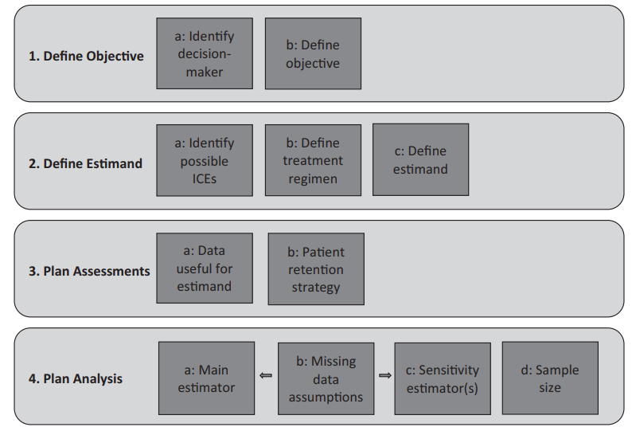

```{r setup, include=FALSE, echo = FALSE,message = FALSE, error = FALSE, warning = FALSE}
knitr::opts_chunk$set(echo = TRUE, fig.width = 10, fig.height = 6)

# <!-- ---------------------------------------------------------------------- -->
# <!--                    1. load the required packages                       -->
# <!-- ---------------------------------------------------------------------- --> 

## if(!require(psych)){install.packages("psych")}

packages<-c("tidyverse", "kableExtra",
            "mmrm",
            "gtsummary","inTextSummaryTable",
            "Hmisc","htmltools","clinUtils")

ipak <- function(pkg){
  new.pkg <- pkg[!(pkg %in% installed.packages()[, "Package"])]
  if (length(new.pkg)) 
    install.packages(new.pkg, dependencies = TRUE)
  sapply(pkg, require, character.only = TRUE)
}
ipak(packages)
 


# <!-- ---------------------------------------------------------------------- -->
# <!--                        2. Basic system settings                        -->
# <!-- ---------------------------------------------------------------------- -->
setwd(dirname(rstudioapi::getSourceEditorContext()$path))
getwd()
Sys.setlocale("LC_ALL","English")


## Open the folder
open_folder <-function(dir){
	if (.Platform['OS.type'] == "windows"){
	shell.exec(dir)  
	} else {
	system(paste(Sys.getenv("R_BROWSER"), dir))
  }
}
open_folder(getwd())

## convert backslash to forward slash in R
# gsub('"', "", gsub("\\\\", "/", readClipboard()))

### get the path
# rstudioapi::getSourceEditorContext()$path
# dirname(rstudioapi::getSourceEditorContext()$path)

### set working directory
# getwd()
# setwd("c:/Users/zbai/Desktop")
# Sys.setlocale("LC_ALL","English")

### get the R Version
# paste(R.Version()[c("major", "minor")], collapse = ".")

### convert backslash to forward slash 
# scan("clipboard",what="string")
# gsub('"', "", gsub("\\\\", "/", readClipboard())) 

## Load all r functions
## The directory where all source code files are saved.
source_code_dir <- "C:/Users/baiz/Downloads/Data-Analyst-with-R/00 R Function/ZB Function/"  
file_path_vec <- list.files(source_code_dir, full.names = T)
for(f_path in file_path_vec){source(f_path)}

# <!-- ---------------------------------------------------------------------- -->
# <!--                         3. Import the datasets                         -->
# <!-- ---------------------------------------------------------------------- -->

# <!-- ---------------------------- -->
# <!-- --3.1 Import csv data ------ -->
# <!-- ---------------------------- -->

# pfad <- "~/Desktop/SASUniversityEdition/myfolders/Daten"
# mydata1 <- read.csv(file.path(pfad, "yourcsv_data.csv"), 
#                     sep=";", 
#                     header=TRUE)   

## Import all csv data from folder
# list_csv_files <- list.files(path = "./csvfolder/")
# do.call(rbind, lapply(list_csv_files, function(x) read.csv(x, stringsAsFactors = FALSE)))

# <!-- ---------------------------- -->
# <!-- --3.2 Import xlsx data ----- -->
# <!-- ---------------------------- -->

# library(readxl)
# mydata2 <- read_excel("C:/Users/zbai/Documents/GitHub/R-Projects/SAS/Yimeng/results-text.xlsx")

# <!-- ---------------------------- -->
# <!-- --3.3 Import sas7dbat data - -->
# <!-- ---------------------------- -->

# library(sas7bdat)
# mydata3 <- read.sas7bdat("~/Desktop/SASUniversityEdition/myfolders/Daten/uis.sas7bdat")

## Import all sas7dbat data from SASfolder
# ZB.import.sas.folder("./SASfolder/")

# <!-- ---------------------------- -->
# <!-- --3.4 Import from copyboard --->
# <!-- ---------------------------- -->
# copdat <- read.delim("clipboard")
# Data_D01 <- copdat

# <!-- ---------------------------------------------------------------------- -->
# <!--                           4. Some Tools                                -->
# <!-- ---------------------------------------------------------------------- -->

## To check out vignettes for one specific package
# browseVignettes("sjPlot")      ## sjPlot for Models Summary
# browseVignettes("gtsummary")


# <!-- ---------------------------------------------------------------------- -->
# <!--                           5. Citation                                -->
# <!-- ---------------------------------------------------------------------- -->
# citation("gtsummary")
# <!-- ---------------------------------------------------------------------- -->
```


  
# Introduction

## ICH E9 R1

**Specifying estimands is a regulatory requirement in the ICH E9 R1 Draft Addendum (ICH, 2017).**

The analysis of clinical trial data often encounters challenges due to post-randomization events that impact both treatment and outcomes. These events, which occur after the initial random assignment of treatments to participants, can complicate the interpretation of trial results by obscuring what outcomes should be measured and how to accurately measure them. Initially, clinical trial analyses focused on simple methods for handling incomplete data resulting from these events, prioritizing computational convenience. However, there has been a shift towards more sophisticated approaches, driven in part by the 2010 report from the National Research Council (NRC) which emphasized the importance of not just how to estimate outcomes, but what outcomes should be estimated.

This evolution continued with the 2017 International Council for Harmonisation's (ICH) E9(R1) Draft Addendum, which broadened the scope of analysis beyond missing data. This addendum addressed the challenges posed by a range of post-randomization events, including what are known as "intercurrent events," which are incidents linked to the treatment and outcomes of the study.

In real-world clinical settings, patients may discontinue treatments for various reasons, at different times, and at different rates. They might receive subsequent treatments or continue to participate in the trial, adding complexity to the data analysis. These variables create uncertainties not only in how to analyze the data but also in what comparisons should be made.

Post-randomization events can undermine the causal relationship established by randomization, especially if these events are related to the treatment and its outcomes. Examples include premature cessation of the assigned treatment, or the need to switch to or add a rescue treatment due to the initial treatment's inefficacy or toxicity. These situations can weaken the link between the assigned treatment group and the actual treatment received, introducing potential biases and confounding factors.

An over-reliance on the initial randomization, while disregarding subsequent events, might lead to inaccurate conclusions about the treatment's effects. This is because such an approach may measure the effect of being assigned to a treatment rather than the effect of the treatment itself. The relevance of post-randomization events depends on whether the analysis aims to understand the effect of the treatment as it was actually followed or as it would have been had it been followed strictly.

A strict "intention-to-treat" (ITT) approach, which ignores all post-randomization treatment changes and includes all outcomes regardless of treatment adherence, preserves the randomization structure and minimizes missing data. However, this method can confound the relationship between the treatment and outcomes, making it difficult to attribute effects to the initially randomized treatments. Hence, the ICH E9(R1) addendum and subsequent discussions, such as those in Chapter 3, emphasize the importance of clearly defining the treatment or regimen of interest.

Finally, accurately describing a treatment effect involves constructing an "estimand," which represents the specific clinical question being addressed. This process requires careful consideration of intercurrent events, such as treatment discontinuation, additional or alternative treatments, and terminal events like death, to ensure clarity and precision in the analysis.


* We can improve drug development, clarify and simplify analysis plans, and more clearly characterize the benefits and risks of potential medicines if we utilize clearly specified estimands
* The description of an estimand should reflect the clinical question of interest in respect of these intercurrent events, the choice of strategies can influence how more conventional attributes of a trial are reflected when describing the clinical question, for example the treatments, population or the variable (endpoint) of interest. 
* The statistical analysis of clinical trial data should be aligned to the estimand. 


## Estimand Framework

Central questions for drug development and licensing are to establish the existence, and to estimate the magnitude, of treatment effects: how the outcome of treatment compares to what would have happened to the same subjects under alternative treatment (i.e. had they not received the treatment, or had they received a different treatment).  An estimand is a precise description of the treatment effect reflecting the clinical question posed by a given clinical trial objective.  It summarises at a population level what the outcomes would be in the same patients under different treatment conditions being compared.  The targets of estimation are to be defined in advance of a clinical trial.  Once defined, a trial can be designed to enable reliable estimation of the targeted treatment effect.

  
```{r, echo=FALSE, fig.align="center", out.width = '100%',fig.cap="Figure: Study development process chart."}

```

* **1a**: Identify who will use the trial results and what decisions they will make from those results. This is an essential first step because the estimand must align with the decision-maker(s) needs. Any one trial may need to address the diverse needs of multiple stakeholders, leading to the need for multiple objectives and estimands.
* **1b**: Define the general question of interest to the decision maker. This will typically include factors such as the interventions being compared, patient population, endpoint, and time scale.
* **2a**: List all the ICEs that are plausible to occur in the trial, noting their likelihood of occurrence. Doing this early in the process avoids overlooking aspects of the intervention effect that could cause confounding or bias in analysis
* **2b**: Define in detail the treatment regimen under investigation. The definition should include whether interest is exclusively in the initially randomized treatment or in treatment regimens that include the initially randomized treatment. It is therefore also necessary to specify whether each ICE is part of the regimen under investigation or is a departure from the intended regimen
* **2c**: There are four components needed to define an estimand: the population, the endpoint, the summary measure, and how ICEs will be handled. Each component is important. However, we are familiar with the first three, and therefore focus here is on handling ICEs. Based on the treatment regimen defined in 2B, specify the strategy to handle each type of ICE. The ICEs that are part of the regimen are handled using the treatment policy strategy. For those ICEs that are deviations from the treatment regimen, use the clinical question to determine which ICEs are outcomes (e.g., dropout due to adverse events is considered treatment failure). The remaining ICEs are confounding factors that may be problematic for the assessment of the outcome and treatment regimen of interest. To complete the definition of the estimand, define the population, endpoint, and summary measure considering the classifications of ICEs and chosen strategies to handle them. A  final step is to confirm that the estimand is aligned with the clinical objective and fits the stakeholder requirements.

The concept of an estimand in clinical research represents a precise definition of what is to be estimated from a trial to address a specific scientific question. An estimand framework helps align the trial design, conduct, and analyses with the objectives of the trial. It ensures that the study's findings are relevant and interpretable for decision-making by clinicians, regulators, and patients. Understanding the attributes of an estimand is crucial for the development and interpretation of clinical trials. Here's a detailed breakdown of each attribute:

1. Treatment Condition of Interest

This attribute defines the intervention(s) under study and the comparator(s). These can range from a single treatment to complex regimens involving multiple interventions, possibly including standard care additions or sequences of treatments. The definition should be clear whether the focus is on the direct effects of the interventions, their add-on effects, or the effects within a treatment sequence.

2. Target Population

The population attribute specifies the individuals to whom the research question is meant to apply. This can be the entire population enrolled in the trial, a specific subgroup identified by baseline characteristics, or a principal stratum defined by potential outcomes relative to intercurrent events. Identifying the target population helps in ensuring that the study findings are applicable and meaningful to those who would be receiving the intervention in a real-world setting.

3. Variable (Endpoint) of Interest

This involves specifying the outcome measure that will be used to assess the effect of the treatment. The definition of the variable should include considerations for how intercurrent events are handled, reflecting strategies such as treating certain events as treatment failures or successes, or focusing only on data collected while the patient was adherent to the treatment protocol. The variable should be directly relevant to the clinical question the trial seeks to answer.

4. Intercurrent Events (ICEs)

Intercurrent events are occurrences that take place after the initiation of treatment and can affect the interpretation or the very availability of the endpoint measurements. These events can complicate the analysis and interpretation of the trial outcomes, hence requiring careful consideration in the estimand strategy. Examples include treatment discontinuation, the initiation of an alternative therapy, death, and other significant health events not part of the endpoint itself. Strategies to address ICEs must be defined and aligned with the trial's objectives.

5. Population-Level Summary

The final attribute specifies how the outcomes (variables) will be summarized to compare the treatment conditions. This includes choosing an appropriate statistical measure such as risk difference, odds ratio, hazard ratio, or mean difference. The choice of summary measure should be informed by the nature of the variable, the study design, and the clinical question, ensuring that the summary provides a clear and interpretable comparison between the treatment conditions.

## Intercurrent Events (ICEs)

ICH E9 (R1) defines events that occur after randomization that alter the course of the randomized treatment as intercurrent (ICH, 2017). 
	
Therefore, ICEs are inherently connected to the definition of the treatment regimen. Some ICEs may not be a deviation from the treatment regimen of interest and therefore require no further consideration. Other ICEs are a deviation from the regimen of interest and must be dealt with in some manner, depending on the estimand of interest. 
	
ICH E9 (R1) provides several examples of ICEs: 

* use of an alternative treatment (e.g., a rescue medication, a medication prohibited by the protocol, or a subsequent line of therapy),
* discontinuation of treatment,
* treatment switching, 
terminal events such as death (ICH, 2017)

**Example**

To ground the discussion on identifying ICEs and to distinguish those that are deviations from the treatment of interest, we consider the following example of patient profiles in Table 3.1 from Ratitch et al. (2019a). We assume that the trial has three post-randomization visits. Patients have to take randomized treatment through visit 3 – the primary endpoint. The profiles in Table 3.1 describe treatment courses where various events may cause deviations from the initial randomized treatment.
	
Example Patient Profiles Depicting Various Intercurrent Events, X indicates adherence to the randomized treatment at an assessment, with all other symbols indicating ICEs that deviate from the randomized treatment.


|   | **    V1   ** | **    V2   ** | **    V3   ** | **    Treatment Received   **                                                                |
|---|---------------|---------------|---------------|----------------------------------------------------------------------------------------------|
| 1 |     X         |     X         |     X         |     Randomized   treatment alone through the end of study (ideal adherence)                  |
| 2 |     X         |     O         |     O         |     Randomized   treatment at V1; no treatment at V2, V3                                     |
| 3 |     X         |     ‡         |     ‡         |     Randomized   treatment at V1; randomized treatment + rescue at V2, V3                    |
| 4 |     X         |     +         |     +         |     Randomized   treatment at V1; rescue alone at V2, V3                                     |
| 5 |     X         |     ‡         |     +         |     Randomized   treatment at V1; randomized treatment + rescue at V2; rescue at V3          |
| 6 |     X         |     ‡         |     O         |     Randomized   treatment at V1; randomized treatment + rescue at V2; no treatment at V3    |
| 7 |     X         |     +         |     X         |     Randomized   treatment temporarily interrupted for rescue at V2                          |


## ITT Principle and  Treatment Regimen of Interest

- **Importance:** A clear definition is vital for all stakeholders, including researchers, clinicians, regulators, and payers. It sets expectations for the course of treatment, including dosages, concomitant medications, and rescue therapies.
- **Complexity:** Treatment regimens must account for initial treatments, dose adjustments, discontinuations due to adverse effects or lack of efficacy, and subsequent therapies.
- **Example:** A regimen may involve starting patients on an experimental drug or placebo, with provisions for discontinuation and subsequent management outlined.

The careful definition of treatment regimens and judicious application of ITT principles, whether traditional or modified, are foundational elements of clinical trial design and analysis. These methodologies serve to ensure that clinical trial outcomes are both scientifically robust and practically relevant, providing clear guidance for treatment decisions in real-world clinical settings. As clinical research continues to evolve, so too will the methodologies and frameworks used to define treatment regimens and analyze data, always with the goal of enhancing patient care and treatment outcomes.
 
- **Traditional ITT Approach:** Focuses on analyzing patients according to the treatment to which they were randomized, regardless of adherence or subsequent treatments. This approach helps to preserve the benefits of randomization, minimizing selection and treatment bias.
- **Components:**
  - **Inclusion of Patients:** All randomized patients are included in the analysis to maintain the causal link to randomization.
  - **Data Inclusion:** All data, including post-randomization events, are typically included, though this can introduce confounding.
- **Modified ITT Approach:** Adapts the traditional ITT principle to more accurately reflect the treatment effects of interest, especially in the presence of intercurrent events (ICEs) like rescue medication use.
  - **Adjustment for ICEs:** Inclusion of all randomized patients remains a constant, but the data included in the analysis may be modified to exclude post-rescue treatment data or other ICEs, aiming to reduce confounding and better isolate the effect of the initially randomized treatment.
  

## ICEs Strategies

Strategies for Addressing Intercurrent Events when Defining the Clinical Question of Interest

a. Composite variable strategies
b. While on treatment strategies
c. Hypothetical strategies
d. Principal stratum strategies
e. Principal stratum strategies
	
 

## Missing Data

Incomplete data must be addressed in the analyses. However, addressing missing data requires unverifiable assumptions because we simply do not have the missing data about which the assumptions are made (Verbeke and Molenberghs, 2000). Despite the occurrence of incomplete data, evaluation of relevant estimands may be valid provided the statistical methods used are sensible. Carpenter and Kenward (2007) define a sensible analysis as one where:

1. The variation between the intervention effect estimated from the trial data and that in the population is random. In other words, trial results are not systematically biased.

2. As the sample size increases, the variation between the intervention effect estimated from the trial data and that in the population gets smaller and smaller. In other words, as the size of the trial increases, the estimated intervention effect more closely reflects the true value in the population. Such estimates are called consistent in statistical terminology.

3. The estimate of the variability between the trial intervention effect and the true effect in the population (i.e., the standard error) correctly reflects the uncertainty in the data.

When drawing inferences from incomplete data, it is important to recognize that the potential bias from missing data can either mask or exaggerate the true difference between treatments for the relevant estimand (Mallinckrodt et al., 2008; NRC, 2010). Moreover, the direction of bias has different implications in different scenarios. For example, underestimating treatment differences in efficacy is bias against an experimental treatment that is superior to control but is bias in favor of an experimental treatment that is inferior to control. This situation has particularly important inferential implications in non-inferiority testing. Underestimating treatment differences in safety is bias in favor of an experimental treatment that is less safe than control but is bias against the experimental drug that is safer than control (Mallinckrodt and Lipkovich, 2017).


### Estimators for What Would Have Happened in the Absence of Relevant Intercurrent Events {-}

Typically, data after relevant intercurrent events are excluded from analyses (considered missing) either because they were not observed or the data that were observed are not relevant in estimating the estimand of interest. As such, methods commonly used in missing data situations are applicable. The choice of specific method depends on plausibility of assumptions. Therefore, missing data assumptions are central in choosing methods for hypothetical strategies. The distinction between missing at random (MAR) and missing not at random (MNAR) is particularly important (Mallinckrodt et al., 2019).

Methods valid under MAR include 

* maximum likelihood (ML), restricted ML, 
* multiple imputation (MI), 
* inverse probability weighting (IPW) (Molenberghs and Kenward, 2007). 

Some MNAR methods include the controlled imputation family of methods, selection models, shared parameter models, and a variety of pattern-mixture models (Verbeke and Molenberghs, 2000; Molenberghs and Kenward, 2007; Mallinckrodt and Lipkovich, 2017). Although no universally best approach exists, when modeling what would have happened if intercurrent events had not occurred, it is often reasonable to begin with approaches based on MAR and then use MNAR methods to assess sensitivity to departures from MAR.

* **Likelihood-Based Analyses**: These analyses can ignore the missing data process and still provide unbiased estimates if the missing data are either Missing Completely At Random (MCAR) or Missing At Random (MAR), and the model is correctly specified. For clinical trials, fitting a suitable likelihood-based repeated measures analysis is beneficial, especially when estimating scenarios like early termination of treatment or if patients had continued with the initially randomized medication.

* **Multiple Imputation (MI)**: MI, based on the MAR assumption, is a popular method for dealing with missing data. It involves creating multiple complete datasets by imputing missing values using a likelihood-based model, analyzing these datasets, and then combining the results. MI is flexible and particularly useful in scenarios where baseline covariates are missing, errors are not normally distributed, or inclusive modeling strategies are needed. Markov chain Monte Carlo (MCMC) sampling is a common technique used in MI for intermittent missing data.

* **Inverse Probability Weighting (IPW)**: IPW corrects for the bias introduced by non-random dropout or other ICEs. It weights the observed data by the inverse probability of the data not being missing, effectively creating a dataset that represents what the complete data might have looked like.

* **Considerations for Categorical and Time to Event Data**: Modeling considerations for categorical data differ from continuous outcomes, particularly in terms of inference. Separate models are needed for marginal and hierarchical inference in non-normal data due to differences in the link between the outcome variable means and covariates. Common time-to-event analysis methods, such as Kaplan-Meier and Cox regression, often assume censoring at random, meaning the censoring times are independent of the event times. This assumption allows for ignoring the censoring mechanism in the analysis.


### Estimators for Treatment Policies That Were Not Included in the Trial or Not Followed {-}

Examples of estimands for this category include the difference between treatments regardless of adherence and without initiation of rescue medication. One specific example of this is what would have happened if patients took placebo after discontinuing the initially randomized study drug. Recently, a family of methods referred to as reference-based controlled imputation has emerged that are specific versions of pattern-mixture models designed to address these switches in treatment (see Mallinckrodt et al., 2019 and references therein). 

**Reference-Based Approaches Using Multiple Imputation**

In reference-based methods, the common idea is to construct a principled set of imputations that model specific changes in treatment. After relevant ICEs, values are multiply imputed by making qualitative reference to another arm in the trial. In other words, imputed post-ICE values have the statistical behavior of otherwise similar patients in a reference group. Initial implementations of reference-based imputation used MI (Carpenter, Roger, and Kenward, 2013). Reference-based imputations can be tailored to specific scenarios. These methods are designed to estimate the effects of treatment under specific scenarios and include jump to reference (J2R), copy reference (CR), and copy increment from reference (CIR).

* **Jump to Reference (J2R)**: In this approach, after an ICE, patients in the experimental arm are treated as if they received the reference arm treatment (e.g., placebo) immediately following the ICE. This method assumes that the treatment effect disappears as soon as there is a deviation from the intended treatment regimen.

* **Copy Reference (CR)**: Here, the treatment effect gradually diminishes after an ICE, in line with the correlation structure of the imputation model. It credits the drug arm for any benefit observed before the ICE, which then decreases over time.

* **Copy Increment from Reference (CIR)**: This method maintains the treatment effect observed at the time of the ICE by assuming the same rate of change or increments between visits as in the reference group.

Application in Multiple Imputation (MI): Traditional MI based on MAR involves regression on residuals. In reference-based imputation, this concept is adapted:

* **For J2R**, residuals are added to the reference arm mean.
* **In CR**, the residuals are determined by the deviation from the reference arm mean.
* **For CIR**, residuals are similar to MAR-based MI and J2R, but imputed values are added to hypothetical means to match the trajectory of the reference group.

**Likelihood and Bayesian Approaches to Reference-Based Imputation**

Likelihood and Bayesian Approaches: These approaches provide alternatives to MI-based reference imputation. Unlike MI that creates multiple completed data sets, likelihood and Bayesian methods use a single analysis where means estimated from the data implicitly impute for missing or irrelevant data. This is conceptually similar to the J2R MI approach but can have technical challenges in estimating uncertainty and might estimate slightly different estimands.


## Sensitivity Analyses

### General Considerations

ICH E9 (R1) Draft Addendum (ICH, 2017) states that the purpose of sensitivity analyses is to assess whether inferences based on an estimand are robust to limitations in the data and deviations from the assumptions used in the statistical model for the main estimator. The addendum further notes the statistical assumptions underpinning the main estimator should be  documented, and that one or more analyses focused on the same estimand should be prespecified as sensitivity analyses. The addendum recommends that sensitivity analysis should not alter many aspects of the main analysis s imultaneously. It is preferable to alter one aspect at a time in order to clearly identify how each assumption impacts robustness (ICH, 2017).

The addendum also draws distinction between testable and untestable assumptions. The focus of this chapter is mostly on untestable assumptions because this is where sensitivity analyses are needed. Assumptions such as normality or linearity are testable. When these assumptions are proven to be invalid, an alternative statistical method or model will clearly be needed and usually readily found. For example, if normality assumptions are violated, a nonparametric method can be used instead, and inferences can be based on the alternative analysis. Alternatively, data transformations can be considered. In contrast, with untestable assumptions, there is no objective basis upon which to select or compare models; therefore, the goal of sensitivity analyses is to quantify to what degree inferences from the primary analysis are influenced by plausible departures from assumptions (ICH, 2017).

The addendum notes that missing data require attention in sensitivity analysis because the assumptions underlying any method may be hard to justify and may not be testable (ICH, 2017). However, given that the addendum focuses heavily on extending previous discussions on missing data into the broader context of handling of intercurrent events, so too should sensitivity analyses move beyond assessing the impact of missing data assumptions to more broadly assessing sensitivity to methods of accounting for intercurrent events.


### Supplementary Analyses

The ICH E9 (R1) Draft Addendum distinguishes sensitivity analyses from supplementary analyses. It states that interpretation of trial results should focus on the primary estimand and primary estimator, whereas supplementary analyses targeting different estimands play a secondary role in order to more fully understand the treatment effects (ICH, 2017). Supplementary analyses can include different estimands that involve the primary endpoint and/or the primary estimand based on secondary endpoints.

**Example**: A common supplementary analysis could be augmenting a mean change analysis (e.g., average improvement in a symptom) with a responder rate analysis (e.g., percentage of patients showing clinically relevant improvements). Supplementary analyses can assess different aspects of the same clinical outcome. For instance, alongside analyzing symptom severity, additional analyses might focus on quality of life, functional outcomes, or related secondary symptoms (like changes in sleep disturbances in a pain treatment trial).

Supplementary analyses can also be used to explore the impact of data limitations, such as protocol violations. Historically, analysts compared results from the full analysis set with a per-protocol subset (patients with no meaningful protocol violations). However, the ICH E9 (R1) Draft Addendum cautions that per-protocol sets might introduce bias due to the loss of randomization and that many protocol violations can be handled as intercurrent events within the construction of the estimands.

### Accounting for Missing Data Assumptions

It is important to keep missing data sensitivity analyses within the overall context of assessing uncertainty in clinical trial results. This uncertainty arises from different sources: 

* (1) inherent imprecision in parameters of the model estimated from a finite sample
* (2) model selection (e.g., for the mean and covariance functions)
* (3) the level of uncertainty due to  incomplete data. 

Differentiating between Missing At Random (MAR) and Missing Not At Random (MNAR) is challenging in practice, as the fit of an MNAR model can be replicated by an MAR model. The primary strategy is to assume MAR for the main analysis and then focus on sensitivity analyses to explore the impact of deviations from this assumption. These analyses aim to understand how treatment effect inferences change with different assumptions about the missing data.

**Method**

* **Multiple MNAR Models Comparison**: Involves comparing results from various MNAR models, though this can be challenging due to potential model inaccuracies.

* **Adding Sensitivity Parameters**: A more preferred method is to add sensitivity parameters to the primary analysis model and vary them across a plausible range to assess departures from MAR.

* **Controlled-Imputation Methods**: These methods, such as reference-based imputation and delta adjustment, are favored for their transparent assumptions. Delta adjustment, for example, involves varying a sensitivity parameter (delta) across values that increasingly deviate from MAR. This "tipping-point approach" assesses whether the treatment effect remains significant despite plausible departures from MAR.

* **Delta Adjustment Application**: Delta adjustment can be applied to different types of outcomes (continuous, time-to-event, categorical) to assess treatment effects under varying assumptions. It helps ascertain the values of delta where the treatment effect maintains or loses its clinical relevance.

* **Reference-Based Imputation**: This approach is used to model scenarios like treatment discontinuation, assuming no treatment benefit post-discontinuation by imputing values as if the patient were in a placebo group. This method is applicable to various outcome types.

### Accounting for Intercurrent Events

**Sensitivity Analyses for Hypothetical Strategies:**

* Focus on assessing robustness against assumptions in hypothetical scenarios, like estimating treatment effects assuming all patients adhered to their initial treatment.
* Utilize methods like delta-adjustment to evaluate the impact of deviations from these assumptions.
* Can be applied to various hypothetical settings, including effectiveness assessments and assumptions about non-adherence.


**Sensitivity Analyses for Composite Strategies:**

* Consider how adherence decisions in trials compare to those in clinical practice.
* Moreover, for composite strategies, it is also useful to assess s ensitivity to the actual outcomes that are assigned. For example, if patients who discontinue study drug are arbitrarily assigned an unfavorable value for a continuous value, that value should be specified and justified in the protocol with prespecified sensitivity analyses that include alternative values. 
* Similar considerations apply to ranked outcomes. For example, one might assume that early discontinuation is a worse outcome than any observed outcome, but this is an assumption and sensitivity to it should be investigated. 
* Furthermore, if it is assumed that all patients with a relevant ICE are treatment failures, sensitivity should be assessed by varying the failure rate; it can be especially useful to use rates based on the placebo group rather than assuming failure for all patients with the ICE.

**Sensitivity Analyses for Principal Stratification Strategies:**

* Focus on the assumption that stratum memberships (e.g., adherence levels) are correctly estimated.
* Involve testing alternative models or varying stratum membership to assess treatment effect variability.

**Sensitivity Analyses for While-on-Treatment Strategies:**

* Assess the assumption of constant rates or hazards over time in treatment effects.
* Useful for outcomes summarized by rates or hazards that are assumed to be stable over the treatment period.

**Sensitivity Analyses for Treatment Policy Strategies:**

* Evaluate the realism of treatment regimens followed in trials compared to clinical practice.
* Consider hypothetical regimens for patients who deviate from the trial protocol.
* For example, impute values for patients discontinuing treatment as if they switched to standard care, reflecting real-world scenarios.
* Address inevitable missing data and its impact on the analysis.

 
 
# Introduction
 
## Estimands and Missing Data 

Missing data in clinical studies is a major concern because it can compromise the validity, reliability, and generalizability of the study's findings. In clinical trials, data is collected at various points to monitor the effects of interventions, track patient progress, and assess outcomes. However, missing data can occur due to various reasons, and if not handled properly, it can lead to biased results and flawed conclusions.

Missing data may result from an intercurrent event (ICE) or simply due to a missed assessment. An **intercurrent event** refers to an event that happens after the treatment has started and affects either the collection of data or the interpretation of the treatment’s effect. For example, a patient might stop participating in the study due to adverse effects or an unrelated medical condition that prevents further follow-up. These events can complicate the interpretation of the data because they reflect disruptions that were not anticipated at the start of the trial. In contrast, a **missed assessment** refers to situations where data collection fails at a particular visit or time point. This could be due to logistical issues, scheduling conflicts, or patient non-compliance, and while it may not directly affect how the treatment’s effect is interpreted, it still results in incomplete data.

Baseline data in clinical trials is usually complete. This is the data collected at the start of the study before any intervention begins. Baseline measurements are critical because they provide the reference point for understanding how patients change over time. Since baseline data is essential for trial validity, efforts are made to ensure that this data is thoroughly collected from all participants. However, as the study progresses, subsequent visits may have various missed assessments. These missing data points are more likely to occur during follow-up visits or data collection stages later in the study, particularly in long-term trials or studies involving frequent visits or tests.

The potential impact of missing data on the interpretation of study findings is significant and needs to be carefully considered when designing the study protocol. If not managed properly, missing data can introduce **bias** into the study. This occurs when the missing data is not random but instead is related to specific factors that could affect the outcome. For example, if participants who drop out of the study tend to have worse health outcomes, then the study results may overestimate the treatment's effectiveness. Another issue caused by missing data is the **loss of statistical power**, which happens when fewer data points are available for analysis. This makes it more difficult to detect real differences between treatment groups, increasing the likelihood of false conclusions.

At the time of protocol development, researchers need to plan how to handle missing data and potential missing outcomes. Several strategies can be applied, including efforts to **prevent missing data** by ensuring robust follow-up processes or implementing strategies like reminder systems for patients. Additionally, statistical techniques such as **imputation** can be used to estimate missing values, or more advanced models that account for missing data can be employed. Sensitivity analysis, which tests how different assumptions about the missing data might affect the study's results, is another important consideration. This ensures that the final conclusions are robust to various scenarios of missing data.

One of the first steps in managing missing data is to identify the cause of the missing data. This can involve understanding whether the missing data is **Missing Completely at Random (MCAR)**, **Missing at Random (MAR)**, or **Missing Not at Random (MNAR)**. If data is MCAR, it means that the missing data is unrelated to any of the variables in the study, making the issue less concerning because it doesn't introduce bias. MAR means that the missing data is related to observed variables, such as younger patients being more likely to miss follow-up visits. MNAR means that the missing data is related to unobserved data, such as patients with worse outcomes dropping out of the trial.

When designing a study, it is important to clearly define the **research questions of interest** and how missing data may affect these questions. In clinical studies, **estimands** are used to define the quantity being estimated and answer the research questions. Estimands provide a framework that helps define the effect of the treatment or intervention under study. Handling missing data will depend on how the estimands are defined. For example, if the goal is to estimate the effect of the treatment assuming full adherence, missing data from participants who discontinue treatment could pose a problem and would need to be appropriately accounted for. Alternatively, if the estimand reflects real-world use of the treatment, data from participants who drop out might be considered part of the natural course of the study and handled differently.

In conclusion, missing data is a complex issue that requires careful planning and consideration in clinical studies. The source of missing data, whether due to intercurrent events or missed assessments, needs to be clearly understood, and strategies for handling missing data should be built into the study design from the beginning. Identifying the causes of missing data, understanding the impact on study results, and aligning with the research objectives and estimands are essential for ensuring valid and interpretable findings in clinical research.

## Estimand, Estimators and Estimation

**1. Trial Objective to Estimand Flow**
   - **Trial Objective**: This is the primary goal or question that the trial seeks to answer. It’s the starting point for defining what the trial will focus on.
   - **Estimand**: A precise definition of what is to be estimated in the trial. It translates the trial objective into a statistically quantifiable entity. It is essentially what the trial aims to measure or the specific effect that the trial intends to estimate.
   - **Main Estimator**: The statistical methodology or approach used to estimate the estimand. This could be a specific statistical model or analysis technique.
   - **Main Estimate**: The actual numerical estimate obtained from applying the main estimator to the trial data. This is the result that addresses the trial objective.
   - **Sensitivity Estimators and Estimates**: Additional analyses conducted to assess the robustness of the main estimate against different assumptions or conditions. These help validate the reliability of the findings under various scenarios.
   
```{r , echo=FALSE, fig.align="center", out.width = '75%'}
knitr::include_graphics("./02_Plots/Estimand/Estimand_Estimator.png") 
```

**2. Description of an Estimand: Attributes**
   - **Treatment**: Identification of both the treatment of interest and the comparator (control treatment). It specifies what is being tested and against what it is being compared.
   - **Variable**: The primary measure or outcome variable that the study aims to evaluate. This could be a clinical metric, patient-reported outcome, or a biomarker.
   - **Population**: The specific group of patients targeted by the scientific question. This defines who the trial results will apply to.
   - **Population-Level Summary**: How the results are summarized across the entire study population, such as differences between means, ratios of proportions, or hazard ratios. This summarizes the treatment effect at the group level.

```{r , echo=FALSE, fig.align="center", out.width = '75%'}
knitr::include_graphics("./02_Plots/Estimand/Estimand_4Att.png") 
```

**3. Intercurrent Events and Strategies to Address Them**
   - Intercurrent events are occurrences during the trial that could affect the interpretation of the treatment effect, such as participants taking additional medication.
   - **Treatment Policy**: Considers the effect of the treatment as it is used in practice, including any additional medications taken.
   - **Composite**: Defines the endpoint to include whether or not intercurrent events occur, considering events like additional medication intake as part of the treatment assessment.
   - **Hypothetical**: Estimates what the treatment effect would have been if the intercurrent event had not occurred.
   - **Principal Stratum**: Focuses on a subset of participants who would not experience the intercurrent event, assessing the effect in this more controlled scenario.
   - **While on Treatment**: Looks at the treatment effect only before any intercurrent event occurs, isolating the effect of the treatment itself.
   
## Causal

Causal estimands are a critical concept in the field of statistics, particularly when it comes to understanding the effect of interventions in clinical trials and observational studies. They are designed to estimate the impact of a treatment by considering what the outcome would have been under different treatment conditions.  

1. **Concept of Causal Estimands**

Causal estimands are aimed at answering "what if" questions in a formal, quantitative way. They focus on understanding the effect of a specific treatment by asking how the outcomes would differ if the treatment were applied versus not applied, or if an alternative treatment were used. This approach aligns with causal inference, which seeks to infer the cause-and-effect relationship from data.

2. **Framework of Potential Outcomes**

The potential outcomes framework is fundamental to causal inference and was originally formalized by Donald Rubin. It considers every subject in a study to have potential outcomes under each treatment condition. For example:
   - \( Y(1) \): Outcome if the subject receives the treatment.
   - \( Y(0) \): Outcome if the subject does not receive the treatment.

These potential outcomes help to define the causal effect of the treatment, which cannot be observed directly since we can only observe one of these outcomes for each individual — the one corresponding to the treatment they actually received.

3. **Causal Estimand Formula**

The basic causal estimand in a randomized controlled trial (RCT) can be expressed as:
   - \( E(Y(1)) - E(Y(0)) \)
This represents the expected difference in outcomes between subjects assigned to the treatment versus those assigned to the control. This difference is what statisticians aim to estimate through the trial.

4. **Challenges in Observational Studies**

In observational studies, where treatments are not randomly assigned, estimating causal effects becomes more complex due to potential confounding factors. Here, additional models and assumptions about how treatments are assigned to patients (assignment models) and how outcomes are generated (outcome models) are necessary. These models help to adjust for factors that may influence both the treatment assignment and the outcomes.

5. **International Council for Harmonization (ICH) and Causal Estimands**

The ICH guidelines emphasize the importance of causal estimands in clinical trials, suggesting that the trials should be designed to answer specific causal questions. Even though the term "causal" is not explicitly used, the guidelines align with causal reasoning principles to ensure that the results of clinical trials are robust and interpretable in terms of causal effects.

6. **Statistical Inference for Causal Estimands**

Statistical methods are employed to estimate causal estimands from the observed data. In RCTs, this often involves comparing the observed outcomes between the treatment and control groups, leveraging the randomization to argue that these groups are comparable. In non-randomized studies, more sophisticated statistical techniques, such as instrumental variable analysis, propensity score matching, or structural models, are required.

7. **Importance for Regulatory Authorities**

Regulatory authorities, such as the FDA or EMA, are particularly interested in causal estimands because they provide a clear basis for regulatory decisions regarding drug approvals. By focusing on causal estimands, regulators can better understand the true effect of a drug, independent of other confounding treatment or patient characteristics


## Missing data vs intercurrent event

Intercurrent events are incidents that occur after the initiation of treatment and may impact the interpretation of the trial outcomes or affect the continuity of the measurements related to the clinical question of interest. These can include events such as patients starting additional therapies, experiencing side effects leading to treatment discontinuation, or any other circumstances that alter the course of standard treatment administration.
 
Missing data refers to information that was intended to be collected but was not, due to various reasons such as patients dropping out of the study, missing visits, or failure to record certain outcomes. It's important to distinguish between data that is missing because it was not collected (but could have been under different circumstances) and data that is considered not meaningful due to an intercurrent event.

```{r , echo=FALSE, fig.align="center", out.width = '75%'}
knitr::include_graphics("./02_Plots/Estimand/Missing_QA.png") 
```

**Handling Strategies for Intercurrent Events and Missing Data**

**1. Treatment Policy Strategy:**
   - **Approach:** Includes all data up to and possibly including the intercurrent event, considering the measurements of interest regardless of subsequent therapies or changes.
   - **Missing Data Issue:** Here, the missing data problem may arise when assuming values for unobserved outcomes based on the observed data. For example, if patients are lost to follow-up but are assumed to continue on their projected path without treatment changes.

**2. Hypothetical Strategy:**
   - **Approach:** Assumes a scenario where the intercurrent event, such as treatment discontinuation, does not occur.
   - **Missing Data Issue:** Focuses on hypothetical data. For instance, it would not consider data from follow-up visits if a patient had not been lost to follow-up, imagining the patient remained in the trial under the initial treatment conditions.

**3. Composite Strategy:**
   - **Approach:** Combines multiple elements or outcomes into a single variable that incorporates the intercurrent event as part of the variable of interest.
   - **Missing Data Issue:** Typically, there is no missing data concern under this strategy as the intercurrent events are accounted for within the composite outcome measure.

**4. While-on-Treatment Strategy:**
   - **Approach:** Analyzes the response to treatment only up to the point of an intercurrent event.
   - **Missing Data Issue:** There is generally no missing data because the analysis only includes data collected while the patients were on treatment and before any intercurrent event.

**5. Principal Stratum Strategy:**
   - **Approach:** Focuses on specific subgroups (strata) that are not affected by the intercurrent events, based on their potential outcomes under different treatment scenarios.
   - **Missing Data Issue:** This strategy avoids missing data issues by defining the population such that the intercurrent event is not considered relevant for the stratum of interest. It inherently excludes patients from the analysis if they are outside the target strata.

## Sensitivity versus Supplementary Analysis

**Sensitivity Analysis**

- **Purpose**: Sensitivity analysis is performed to assess the robustness of the conclusions derived from the main analysis of a clinical trial. It involves testing how the main findings hold up under various assumptions or variations in the analysis model.
- **Process**: This type of analysis typically involves using multiple sensitivity estimators that deviate in specific ways from the main estimator's assumptions. For instance, sensitivity analyses may involve changing assumptions about the distribution of the data, the model used, or handling of missing data.
- **Objective**: The goal is to explore the extent to which the main findings are dependent on the assumptions made in the statistical modeling. This is crucial for verifying that the conclusions are not unduly influenced by these assumptions and therefore can be considered reliable under a variety of scenarios.

**Supplementary Analysis**

- **Purpose**: Supplementary analysis goes beyond sensitivity analysis to further explore and understand the treatment effects. These analyses are usually more exploratory in nature and are often conducted to address additional research questions or hypotheses that were not the primary focus of the main analysis.
- **Process**: This could include additional analyses as requested by regulatory authorities, or analyses planned after reviewing initial findings to probe deeper into specific areas of interest. Supplementary analyses may investigate different subgroups of patients, additional endpoints, or longer-term outcomes that were not part of the original estimand.
- **Objective**: The main aim is to provide a broader understanding of the data and treatment effects. This might involve confirming the findings from the main analysis, exploring areas where the main analysis was inconclusive, or generating new insights that could lead to further research questions.

```{r , echo=FALSE, fig.align="center", out.width = '75%'}
knitr::include_graphics("./02_Plots/Estimand/Estimand_Sen_Supp.png") 
```

**Key Differences and Interplay**

- **Scope**: Sensitivity analysis is more focused on testing the stability and reliability of the results under different assumptions directly linked to the main outcome of interest defined by the estimand. In contrast, supplementary analysis often has a broader scope, potentially addressing new or secondary questions that extend beyond the original estimand.
- **Outcome Dependency**: Sensitivity analyses are inherently tied to the outcomes of the main estimator and focus on the dependencies and variabilities around these outcomes. Supplementary analyses, however, might explore entirely new outcomes or expand on the findings of the main analysis in ways that provide additional context or insights.
- **Regulatory Impact**: Sensitivity analyses are critical for regulatory review, providing evidence that the study findings are robust and not unduly influenced by specific assumptions. Supplementary analyses, while informative, may not always be crucial for regulatory approval but can be important for labeling, post-marketing commitments, or future clinical development strategies.


## Disease Specific Guideline

European Medicines Agency (EMA) and the U.S. Food and Drug Administration (FDA) include estimands in their specific disease guidance documents

1. **EMA Guidance:**
   - **Diseases Covered**: The EMA has incorporated the use of estimands in the guidelines for several conditions and areas, including:
     - Diabetes
     - Alzheimer’s disease
     - Acute kidney injury
     - Chronic non-infectious liver diseases
     - Epileptic disorders
     - Medicinal products with genetically modified cells
     - Registry-based studies
 

2. **FDA Guidance:**
   - **Diseases Covered**: The FDA also specifies the use of estimands in their guidance for diseases such as:
     - Eosinophilic esophagitis
     - Acute myeloid leukemia
     - Chronic rhinosinusitis with nasal polyps


# Defining Estimands

## Scientific Question of Interest

**Strategies for Addressing Intercurrent Events:**

```{r , echo=FALSE, fig.align="center", out.width = '75%'}
knitr::include_graphics("./02_Plots/Estimand/Estimand_ScQA.png") 
```

   - **Treatment Policy Strategy:** This approach uses the value for a variable regardless of whether or not the intercurrent event occurs. It considers the intercurrent event as part of the treatment strategies being compared. This means that the analysis accepts the intercurrent event as a natural part of the treatment process and incorporates its occurrence into the overall treatment evaluation.
   
   - **Hypothetical Strategies:** These involve imagining a scenario in which the intercurrent event does not occur. This strategy is used to assess what the outcome would have been if the intercurrent event had been entirely absent, providing a clearer picture of the treatment's effect without the confounding impact of the event.
   
   - **Composite Variable Strategies:** This approach integrates the intercurrent event into the outcome variable itself, recognizing that the event provides meaningful information about the patient's outcome. By incorporating the intercurrent event into the analysis variable, this strategy allows for a comprehensive evaluation of the treatment's effect, including how it relates to the occurrence of specific events.
   
   - **While on Treatment Strategies:** This category was mentioned in the list but not further explained in the image. Typically, this strategy would involve analyzing data only from the period during which patients are actively receiving treatment, disregarding data from after treatment discontinuation or other deviations.
   
   - **Principal Stratum Strategies:** Also listed but not detailed in the image, this approach typically involves focusing on a subgroup of participants who are unaffected by the intercurrent event. This method aims to isolate the effect of the treatment in a "pure" form by evaluating only those who would adhere to the treatment regimen regardless of potential intercurrent events.
   

## Tinking Process

```{r , echo=FALSE, fig.align="center", out.width = '75%'}
knitr::include_graphics("./02_Plots/Estimand/Estimand_ThinkProcess.png") 
```

1. **Therapeutic Setting and Intent of Treatment Determining a Trial Objective**:
   - This initial step involves defining the therapeutic context and the specific goals of the treatment under investigation. It sets the foundation for the trial by clarifying its primary objectives based on the medical need and intended therapeutic benefits.

2. **Identify Intercurrent Events**:
   - Intercurrent events are occurrences that could potentially affect the interpretation of the trial’s outcome. This step involves identifying all possible events such as additional treatments, protocol deviations, or loss of follow-up that may interfere with the trial results.

3. **Discuss Strategies to Address Intercurrent Events**:
   - Once intercurrent events are identified, this step focuses on developing strategies to manage them. These strategies ensure that the trial can proceed as smoothly as possible and that the data remains reliable despite these events.

4. **Agree on the Estimand(s)**:
   - An estimand is a precise description of the effect to be estimated by the trial. This step involves reaching consensus on what exactly the trial aims to estimate regarding the treatment effect, taking into account the strategies for handling intercurrent events.

5. **Align Choices on Trial Design, Data Collection, and Method of Estimation**:
   - This step is about making informed decisions on the trial design, how data will be collected, and the methods used for estimating the treatment effect. These choices are crucial for ensuring that the trial will effectively address its objectives.

6. **Identify Assumptions for the Main Analysis and Suitable Sensitivity Analyses to Investigate These Assumptions**:
   - Assumptions related to the trial's main analysis are identified here. Sensitivity analyses are planned to test these assumptions, helping to understand how robust the findings are to changes in the assumptions.

7. **Document the Chosen Estimands**:
   - The final step involves formally documenting the agreed-upon estimands. This documentation is vital for clarity and ensures that all stakeholders have a clear understanding of what the trial aims to estimate and how it will be done.

## Case Study 1: Treatment efficacy in patients with chronic inflammatory conditions

### Background

1. **Study Purpose**
   - The primary objective of the study is to demonstrate the superiority of a novel biologic treatment over placebo in managing patients with a chronic inflammatory condition.
   
2. **Novel Treatment**
   - The treatment is a biologic administered once per month, aimed at controlling the inflammatory condition.
   
3. **Variable**
   - The primary outcome or endpoint of the study is the clinical response at 12 months, which is measured as a binary variable (yes/no response).
   
4. **Study Design**
   - The trial is set up as a double-blind, placebo-controlled, randomized, parallel-group design. This ensures that neither the participants nor the researchers know which treatment the participants are receiving, to prevent bias.

**Study Design and Assumptions**

```{r , echo=FALSE, fig.align="center", out.width = '75%'}
knitr::include_graphics("./02_Plots/Estimand/Estimand_S1_Case1.png") 
```

1. **Study Timeline and Patient Flow**
   - The study timeline is illustrated for six patients, showing their progress from randomization through to 12 months. For ethical reasons, patients in both the novel treatment and placebo groups are allowed to switch to an open-label novel treatment after the first 4 months.
   
2. **Open Label Treatment**
   - Indicates that after 4 months, regardless of their initial grouping (novel treatment or placebo), participants have the option to receive the novel treatment openly. This transition is visualized with red arrows indicating the switch.
   
3. **Planning Assumptions**
   - It's estimated that approximately 40% of patients in the novel treatment arm and 70-80% in the placebo arm will switch to the open-label novel treatment after 4 months.
   - Historical studies in similar conditions reported no deaths, which might influence the planning regarding safety monitoring and data analysis expectations.

### Estimands Proposed in the Study

**Estimand 1 (Hypothetical): 

1. **Estimand 1 (Hypothetical): The treatment difference in proportion of clinical responders that would be observed if patients could not switch to open-label treatment.**

   - **Description:** This estimand would evaluate the treatment difference in the proportion of clinical responders as if no patients were allowed to switch to open-label treatment. It aims to estimate the pure effect of the initial treatment regimens without the confounding effect of switching.
   - **Health Authority Feedback:** The HA expressed concerns about the feasibility of estimating this effect due to the assumptions required:
     - **Assumption of Comparability:** Assuming that patients who did not switch are comparable to those who would have switched.
     - **Identification of Representative Subset:** The ability to identify and appropriately use data from a representative subset of non-switching patients to predict outcomes for those who might have switched.
     - **Unverifiability of Assumptions:** Noting that these assumptions are largely theoretical and cannot be empirically verified, which undermines the reliability of the estimand.

*HA: Even if the estimand is considered clinically relevant (in this setting of a treatment targeting the symptoms of a chronic disease), we continue to have concerns about whether it can be estimated with minimal and plausible assumptions. First, we would have to assume that some of the patients who do not initiate biologic escape are similar enough (to the patients who escape) that their outcomes at the end of the study are representative of the hypothetical outcomes in those patients that initiated escape. Second, we would have to be able to identify that subset of representative patients and effectively use their collected data in the statistical model to predict the hypothetical outcomes in patients who escaped. It is not at all clear whether your proposed statistical model has identified such representative patients. Finally, any such assumptions are unverifiable, as you note*


2. **Estimand 2 (Treatment Policy): The treatment difference in proportion of clinical responders regardless of whether patients switched to open-label treatment.**

   - **Description:** This estimand considers the treatment difference in the proportion of clinical responders regardless of any switching to open-label treatment. It reflects a real-world scenario where treatment effects are evaluated inclusive of management changes like switching.
   
3. **Estimand 3 (Composite): The treatment difference in proportion of clinical responders where switching to open-label treatment is considered as no clinical response**
   - **Description:** This approach treats any switching to open-label treatment as equivalent to a non-response. It simplifies the analysis by directly associating the switching action with treatment failure or inadequacy.
   - **Selected by Study Team:** Following the HA's critique, the study team adopted this approach due to its straightforward interpretation and alignment with clinical trial objectives.
   

### Chosen Estimand Attributes (Composite Approach)

```{r , echo=FALSE, fig.align="center", out.width = '75%'}
knitr::include_graphics("./02_Plots/Estimand/Estimand_S1_Case1Es.png") 
```

- **Population:** Patients with a chronic inflammatory condition.
- **Variable:** Clinical response at 12 months, where switching is equated to non-response.
- **Treatments:** Novel biologic treatment administered monthly versus placebo.
- **Population Summary:** The difference in the proportion of patients achieving a clinical response between the novel treatment and placebo groups.

**Clinical Question of Interest:**

The key question is: "What is the difference in the proportion of patients achieving clinical response at 12 months for patients with a chronic inflammatory condition treated with a novel biologic treatment versus placebo, where the need for rescue (switch) would count as non-response?"

**Significance of the Chosen Estimand:**

The composite estimand was chosen because it provides a clear and straightforward method for dealing with the confounding factor of treatment switching. By considering switches as non-responses, it directly reflects the efficacy of the initial treatment in controlling the disease without the influence of additional interventions. This approach not only aligns with the trial's regulatory expectations but also addresses the HA's concerns about the practical challenges and verifiability associated with the hypothetical estimand.
     

   
## Case Study 2: Effectiveness of an oral treatment in chronic dermatological condition

### Background

1. **Study Purpose:**
   - The aim is to establish the superiority of a new oral treatment over placebo in patients with a chronic dermatological condition that does not respond well to standard therapies.
   
2. **Novel Treatment:**
   - This involves a new oral medication administered daily, targeting the specified dermatological condition.
   
3. **Variable:**
   - The primary endpoint is assessed using the Weekly Activity Score (WAS), which evaluates symptoms and their intensity over a week, scaled from 0 (no symptoms) to 50 (numerous severe symptoms). This score is assessed at baseline and then every week up to week 12.
   
4. **Study Design:**
   - The trial is structured as a double-blind, placebo-controlled, randomized, parallel-group design, maintaining the standard for clinical research to ensure objectivity and reliability of the results.

**Study Design and Assumptions**

1. **Primary Endpoints:**
   - Two potential primary endpoints are proposed:
     - **Change from baseline in WAS at Week 12:** This continuous measure is deemed clinically relevant and previously accepted by health authorities.
     - **WAS ≤ 10 at week 12 (binary):** This endpoint, representing a specific treatment goal (mild or no symptoms), is favored by experts but has not been previously used in registration studies.
   
2. **Medication Guidelines:**
   - **Background Medication:** Participants will receive either the novel treatment or placebo along with a second-generation antihistamine. The dose and type of this background medication are fixed throughout the study.
   - **Rescue Medication:** An alternative second-generation antihistamine can be used daily if symptoms are unbearable.
   - **Prohibited Medications:** Any corticosteroid or other treatments for the skin condition are forbidden during the trial to avoid confounding the study results.
   
3. **Assumptions:**
   - **Rescue Medication:** It's anticipated that more than 75% of participants may need rescue medication. This is expected in both treatment arms and is not thought to significantly affect the WAS at week 12.
   - **Prohibited Medications:** Less than 10% of participants are expected to use prohibited medications. However, if used, corticosteroids could significantly alter the WAS scores.

**Implications for Analysis**

- **Rescue and Background Medications:** The consistent use of background medication and the availability of rescue medication mimic typical clinical practices, potentially increasing the generalizability of the study results.
- **Assessment of Primary Endpoints:** The binary endpoint of WAS ≤ 10 adds a clear, practical measure of success, while the continuous change from baseline provides a detailed quantification of treatment effect.
- **Handling of Prohibited Medications:** The strict prohibition of certain medications ensures the integrity of the trial results but requires diligent monitoring and adherence from participants.

### Initial Proposed Estimand 

In Case Study 2, the study team initially proposed a hypothetical estimand for a clinical trial aimed at evaluating a new treatment for a chronic dermatological condition. This proposal and the subsequent feedback from the health authority led to a revision of the estimand approach.

**Hypothetical Estimand:**

- **Objective:** To measure the treatment difference in change from baseline in the Weekly Activity Score (WAS) at 12 weeks assuming no patient took corticosteroids.
- **Health Authority Feedback:** The authority criticized this approach because it does not reflect real-world clinical practice where patients might need prohibited medications. The hypothetical scenario was deemed inappropriate as it might not provide an accurate or feasible assessment of the treatment's effectiveness due to its detachment from typical clinical scenarios.

**Health Authority's Rationale**

- **Concerns:** The hypothetical estimand could not reliably estimate the treatment effect due to the unrealistic assumption that no patients would use prohibited medications. Furthermore, any necessity for such medications would suggest treatment inadequacy, thus affecting the reliability of the outcome.

### Chosen Estimand Attributes (Composite Approach)

**Composite Estimand:**

- **Population:** Patients with a chronic dermatological condition unresponsive to standard therapies.
- **Variable:** Change from baseline in WAS at 12 weeks, with the assignment of the worst possible value (50) to patients who take prohibited medication.
- **Treatments:** The novel oral treatment given daily, compared against placebo, with both groups allowed to take rescue antihistamines as needed.
- **Population Summary:** The mean difference in change from baseline to week 12 in the WAS score.
- **Clinical Question of Interest:** The question focuses on the difference in the mean change from baseline in WAS at week 12, considering the use of prohibited medications as a treatment failure.

```{r , echo=FALSE, fig.align="center", out.width = '75%'}
knitr::include_graphics("./02_Plots/Estimand/Estimand_S1_Case2Es.png") 
```

1. **Reflection of Real-World Scenarios:** This approach acknowledges that patients may require additional medications (deemed as treatment failures for the purpose of the study), which aligns with real-world treatment scenarios and regulatory expectations.
   
2. **Treatment Effectiveness:** By assigning the worst score to those who need prohibited medication, the study directly addresses the question of whether the new treatment can adequately manage the condition without additional interventions.


# Overview of Treatment Policy Strategy

## Introduction {-}

**Treatment Policy Strategy Context**
- **Basic Concept**: The treatment policy strategy incorporates all aspects of a treatment regimen, including the main drug (Drug X in this scenario) and any additional rescue medications taken as required. This approach assesses the overall effectiveness of the treatment strategy, rather than just the isolated effect of the drug.
- **Inclusion of Rescue Medication**: In clinical trials, rescue medication is often allowed to manage symptoms or adverse effects that are not adequately controlled by the study drug alone. Including rescue medication in the 'Treatment' attribute acknowledges its role as part of the therapeutic regimen, providing a more comprehensive evaluation of the treatment efficacy.

```{r , echo=FALSE, fig.align="center", out.width = '75%'}
knitr::include_graphics("./02_Plots/Estimand/Estimand_VisPat_Journeys_1.png") 
```


**Pretect the randomization arm**

```{r , echo=FALSE, fig.align="center", out.width = '75%'}
knitr::include_graphics("./02_Plots/Estimand/Estimand_S0_1.png") 
```

The **treatment policy strategy** is a framework used in clinical trials and medical research to handle **intercurrent events**. These events are occurrences that happen during a study that may affect the outcome or treatment of participants but are not part of the planned treatment protocol. A treatment policy strategy takes a pragmatic approach to dealing with these intercurrent events.

 **Variable Value Usage Regardless of Intercurrent Events**
In a treatment policy strategy:
- The value of the variable of interest (such as a clinical outcome like blood sugar level) is used regardless of whether or not the intercurrent event occurs.
- This approach considers the occurrence of unexpected events, such as the need for additional medication during the study, as part of the overall treatment strategy. The effect of the treatment is measured as if these events are integral to the treatment regimen.

**Intercurrent Event as Part of the Treatment Strategy**
- Intercurrent events are treated as part of the overall treatment plan. This approach contrasts with other strategies that might censor or exclude data if an intercurrent event occurs.
- By incorporating the intercurrent event into the treatment strategy, the analysis aims to reflect real-world treatment conditions where patients might experience various changes in their treatment paths.

**Example: Type 2 Diabetes Study**

**Treatments**
- **Test Treatment with Rescue Medication**: Patients receive a test medication for diabetes. If their blood sugar levels rise too high during the trial, they are given additional rescue medication to manage these levels.
- **Placebo with Rescue Medication**: Similarly, the control group receives a placebo but can also use rescue medication as needed.

**Clinical Question**
- The research question could be: What is the effect of the test treatment (with rescue medication as needed) compared to placebo (with rescue medication as needed) on HbA1c change from baseline to Week 26?
- HbA1c is a marker that reflects a person’s average blood glucose levels over the past 2-3 months. The study aims to measure how this marker changes after 26 weeks of treatment.

**Key Aspects of the Strategy in This Example**
- **Rescue medication** is considered an intercurrent event. Patients receive this medication if their blood sugar rises significantly during the study.
- Under the treatment policy strategy, the impact of rescue medication is neither excluded nor ignored. Instead, it is integrated into the treatment strategy because:
  - In real-world scenarios, patients often need additional medication to control their blood sugar.
  - The clinical question seeks to measure the overall effectiveness of the test treatment, including how often patients require rescue medication and its combined effect on their HbA1c levels.

This strategy assesses how the test treatment (with the option for rescue medication) compares to placebo (with the option for rescue medication) in a real-world setting. It acknowledges that not every patient responds the same way to treatment and that intercurrent events like needing additional medication can occur.

**Summary of the Treatment Policy Strategy**
- Intercurrent events, such as the use of rescue medication, are not disregarded but are incorporated into the analysis.
- This strategy mirrors real-world treatment scenarios, aiming to address practical clinical questions regarding the overall effectiveness of the treatment, including its performance amidst unplanned events like the need for additional medications.

This comprehensive approach provides a holistic view of the treatment's impact over time, considering the effect of the treatment alongside any additional interventions.

## Remark {-}

**Importance of Complete Follow-Up**
- **Data Collection**: It is crucial to follow all participants until the end of the trial and systematically collect data to ensure that the treatment effects are accurately captured. This comprehensive data collection supports robust statistical analysis and helps in addressing any potential biases caused by dropouts or missing data.

**Alignment with Intention-to-Treat Principle**
- **Definition**: The intention-to-treat (ITT) principle involves analyzing data from all randomized participants based on the treatment they were initially assigned, regardless of whether they completed the treatment as planned. 
- **Relevance**: The treatment policy strategy aligns with the ITT principle by including all participants' data in the analysis, regardless of deviations from the protocol such as the use of rescue medication. This method provides a realistic picture of the drug’s effectiveness in practical settings.

**Regulatory Considerations**
- **Acceptance**: Treatment policy strategies are widely accepted in regulatory decision-making because they reflect the treatment's effectiveness under typical clinical conditions. However, the appropriateness of this strategy can vary depending on the specific regulatory environment and study design.
- **Impact on Drug Labeling**: When a treatment policy strategy is used, it may influence how the treatment is described in drug labels. The labels might need to indicate that the effectiveness data includes the use of rescue medications, which could affect the drug's perceived efficacy.

**Critical Questions for Implementation**
1. **Influence of Rescue Medications**: It is essential to consider whether and how rescue medications might alter the perceived effectiveness of the primary treatment. Their use could mask or enhance the effects of the study drug, complicating the interpretation of results.
2. **Relevance in Placebo-Controlled Studies**: In placebo-controlled studies, where the control group receives a placebo instead of an active treatment, assessing the impact of rescue medication becomes even more critical. It's important to determine whether the use of rescue medication is balanced across study arms and how it might affect the comparability of the treatment effects.

**Presentation and Discussion of Limitations**
- **Transparency**: Results derived from a treatment policy strategy should be presented with a thorough discussion of any limitations related to trial design, data collection, or statistical analysis. This includes acknowledging the potential confounding effects of rescue medications and other protocol deviations.


## Considerations {-}

The treatment policy strategy is a nuanced approach within the framework of clinical trials that aims to assess the effect of treatments by considering all randomized patients in the analysis, regardless of subsequent events that might typically be considered deviations from the study protocol. This strategy embodies a specific interpretation of the intention-to-treat (ITT) principle, focusing on preserving the benefits of randomization while addressing the complexities introduced by intercurrent events (ICEs).

- **Irrelevance of ICEs:** In this strategy, the occurrence of ICEs, such as discontinuing the study treatment, switching medications, or deviations from the prescribed treatment regimen, is considered irrelevant for the definition of the treatment effect. This means the analysis aims to capture the effect of being allocated to a treatment, not necessarily the effect of strictly following that treatment.

- **Use of Observed Data:** The strategy utilizes observed outcomes for all participants as planned, without trying to adjust for or impute data based on whether an ICE occurred. This approach is sometimes referred to as a "pure ITT approach" because it includes all randomized participants in the analysis, adhering to the principle of evaluating the effect of assignment to treatment rather than the effect of the treatment itself.

- **Preservation of Randomization:** One of the primary motivations for this strategy is the preservation of the benefits of randomization, which helps to minimize bias and confounding, thereby providing a more reliable estimate of treatment effect.

- **Limitations for Certain ICEs:** The strategy has limitations, especially when dealing with ICEs such as death, which inherently prevent the observation of the outcome of interest. In these cases, the treatment policy strategy cannot be applied as intended unless death is the primary outcome. For trials where few deaths are expected, the strategy might still be relevant by treating death as a missing outcome.

- **Broadened Treatment Regimens:** By including all randomized participants and ignoring deviations from the treatment regimen, this strategy essentially broadens the scope of treatment regimens under evaluation. This broad approach can sometimes dilute the specificity of the treatment effect being measured, potentially making the results less directly applicable to clinical practice.

- **Assumptions on Missing Data:** Like all strategies dealing with missing data and deviations from the protocol, the treatment policy strategy requires assumptions about the nature and impact of missing data. These assumptions can influence the robustness and validity of the study's findings.

- **Real-World Relevance:** There's an assumption that the treatment regimens followed within the trial context mirror those in real-world clinical practice. This assumption supports the generalizability of the trial findings but may not always hold true, especially in trials with strict protocols that differ from typical clinical settings.

## Scenarios Application {-}


**Scenario 1:**Including Rescue Medication in the Treatment Regimen

- **Clinical Question:** The interest is in evaluating a treatment regimen that encompasses the initially randomized treatment, acknowledging that adding rescue medication may be part of the clinical reality for some patients. This scenario aims to assess the effectiveness of the initial treatment under more flexible, real-world conditions.
- **Handling Early Discontinuation:** A composite strategy is employed for early discontinuation, categorizing these patients as treatment failures. This approach simplifies the analysis by creating a binary outcome (success or failure), where failure includes not just lack of improvement but also inability to continue the treatment for whatever reason.
- **Handling Rescue Medication:** The use of rescue medication is integrated into the treatment regimen of interest, reflecting a treatment policy strategy. This approach recognizes that the addition of rescue medication is a part of the therapeutic strategy for some patients. The analysis does not penalize the initial treatment group for the use of rescue medication but instead considers it an integral part of the treatment pathway.


# Overview of Composite Strategy

### Introduction {-}

**Integration into Trial Endpoint:**
- **Endpoint Definition**: In a scenario where rescue intake is deemed undesirable, the trial's endpoint might include not only the primary measure (e.g., HbA1c level) but also whether rescue medication was used. For example, a responder endpoint might be defined as a patient achieving an HbA1c level ≤ 7% at 24 weeks without the use of any rescue medication.
- **Outcome Assessment**: This approach allows for a clearer assessment of the drug’s efficacy in controlling the condition without supplementary intervention. It distinguishes between those who meet the target solely through the use of the study drug and those who require additional medication, categorizing the latter group as non-responders.

**Example Scenario with Patient Data:**
- **Patients' Outcomes**: In your hypothetical patient data, patients are evaluated based on their HbA1c change from baseline at Week 24, and their responder status is determined based on whether they achieved this without rescue medication.
   - Patient 1 and Patient 6 are considered responders as they achieve HbA1c ≤ 7% without rescue medication.
   - Patient 2, despite achieving an HbA1c of 6.9%, is not considered a responder as they might have used rescue medication.
   - Patient 3, Patient 4, and Patient 5 are explicitly noted as non-responders either due to higher HbA1c or the intake of rescue medication.
   
```{r , echo=FALSE, fig.align="center", out.width = '75%'}
knitr::include_graphics("./02_Plots/Estimand/Estimand_VisPat_Journeys_2.png") 
```

In the **composite strategy**, the occurrence of an **intercurrent event** (such as the need for additional medication or other unexpected outcomes) is seen as **informative** about the patient's overall outcome. This strategy incorporates the intercurrent event directly into the clinical outcome or variable being studied, effectively altering the way the variable is analyzed.
 
```{r , echo=FALSE, fig.align="center", out.width = '75%'}
knitr::include_graphics("./02_Plots/Estimand/Estimand_S0_2.png") 
```

**Intercurrent Event as Informative**
Unlike the treatment policy strategy where the intercurrent event is treated as part of the overall treatment process but not directly tied to the outcome variable, the composite strategy views the intercurrent event as providing critical information about the patient's outcome. If a patient experiences an intercurrent event, such as needing rescue medication, it affects how the treatment outcome is interpreted.

**Altering the Outcome Variable**
The key difference in this strategy is that the outcome variable is modified based on the occurrence of the intercurrent event. The variable’s definition is changed to reflect both the intended treatment outcome and the intercurrent event. For instance, instead of just looking at whether the patient’s blood sugar improved, the outcome might also account for whether the patient needed rescue medication, combining these into a single variable that captures more information about the treatment's overall success.

**Example: Type 2 Diabetes Study**

In this case, the intercurrent event is the use of rescue medication, and it provides significant information about the patient’s response to the treatment. The strategy will incorporate this into the analysis of the treatment effect.

**Defining a Composite Outcome**

One way to apply a composite strategy is by dichotomizing (splitting the outcome into two categories) the variable based on both HbA1c improvement and whether or not rescue medication was needed:

- **Responder**: A patient who:
  - Achieves an improvement of x% in HbA1c from baseline to Week 26 AND
  - Does not need to take rescue medication at any point during the study.
  
- **Non-Responder**: A patient who:
  - Fails to achieve the target HbA1c improvement OR
  - Needs rescue medication at any time during the study.

By classifying patients as "responders" or "non-responders" based on these two criteria, the intercurrent event (needing rescue medication) is considered to be part of the outcome rather than just something that happened along the way.

**Clinical Question**
In this example, the clinical question might be framed as:

What is the effect of the test treatment vs placebo on achieving an improvement of x% in HbA1c from baseline to Week 26, without the need for rescue medication at any point during the study?

This question looks at two components:
- **Improvement in HbA1c**: How effective is the treatment at lowering blood sugar levels over time?
- **Use of Rescue Medication**: How effective is the treatment in maintaining blood sugar control without requiring additional medications?

**How This Composite Strategy Works**
- **Combination of Variables**: The outcome variable now combines two aspects:
  1. **Biochemical improvement** (HbA1c reduction),
  2. **Clinical management success** (no need for additional medications).
  
By creating a composite outcome, this strategy provides a more holistic measure of the treatment’s effectiveness. It answers the clinical question of whether the treatment not only improves blood sugar levels but also maintains stability without needing extra intervention.

**Key Points of the Composite Strategy**
- **Informative Event**: The intercurrent event (such as using rescue medication) tells us something critical about the patient's health and treatment success.
- **Modified Variable**: The variable used to measure success is changed to incorporate the intercurrent event, providing a richer picture of the treatment’s overall effect.
- **Dichotomization**: The composite variable can be dichotomized (e.g., responder vs non-responder) based on criteria that include the intercurrent event.

**Summary of the Composite Strategy**
- In the composite strategy, the intercurrent event (like needing rescue medication) is considered to provide meaningful information about the outcome and is integrated into the analysis.
- The clinical outcome variable is modified to reflect both the primary outcome (e.g., HbA1c improvement) and the occurrence of the intercurrent event, giving a more comprehensive assessment of the treatment’s effectiveness.
- In the Type 2 diabetes example, the outcome could be dichotomized into responders (those who both improve and don’t need rescue medication) and non-responders (those who either fail to improve or need rescue medication).

This approach helps to evaluate the treatment's success from a broader, more inclusive perspective.


### Remark {-}

- **Implications of the Strategy**:
   - **Outcome Categorization**: Using rescue medication reclassifies a patient's response status, directly impacting the overall assessment of treatment efficacy.
   - **Variable and Estimand Definition**: This method necessitates clear definitions in the trial protocol and analyses, affecting how outcomes are reported and interpreted.
   - **Drug Labeling**: Implementing this strategy can influence drug labeling, as the labels must clearly state that efficacy assessments exclude cases where rescue medication was used.
- **Broad Application**: While the example focuses on a dichotomous outcome, composite strategies can also be applied to continuous outcomes by defining specific thresholds or criteria that categorize continuous scores into binary outcomes, thus creating different estimands based on how the data are dichotomized.


## Considerations {-}
 
In composite strategies, the presence or absence of relevant intercurrent events is a component of the outcome variable (ICH, 2017). Composite variable strategies in clinical trials are designed to handle intercurrent events (ICEs) by incorporating them into the outcome measures. These strategies are a practical approach to ensure that the analysis remains robust in the face of deviations from the planned treatment regimen.

- **Composite Outcomes**: These are single measures that combine multiple individual endpoints into one. They are designed to capture a range of outcomes of interest and are particularly useful when any one of the components alone may not fully represent the therapeutic effect of the intervention.
- **Flexibility**: These strategies are adaptable to different trial designs and objectives. They allow for a comprehensive assessment of outcomes by considering all relevant events that occur during the study period.
- A key aspect of composite strategies is that the outcome definition results in no missing data due to intercurrent events although some data may still be missing due to other reasons (Mallinckrodt et al., 2019).
- **ICE as a Component**: The occurrence of an ICE is directly integrated into the outcome variable. This means the ICE itself is part of the composite measure. For instance, in a trial measuring the effectiveness of a heart disease medication, a composite outcome could be "myocardial infarction, stroke, or death."
- **Informative ICEs**: An ICE is considered informative about the patient's outcome. For example, if the ICE is treatment discontinuation due to adverse effects, it speaks to the tolerability of the treatment and is therefore an important part of the treatment's risk-benefit profile.
- **Surrogate Values**: When assigning surrogate values for ICEs in numerical outcomes, choosing an appropriate and justifiable value is critical. This decision can have significant effects on the data distribution and variance.
- **Statistical Methods**: Depending on the composite outcomes and the distribution of data, robust or nonparametric statistical methods might be necessary to handle skewed distributions or inflated variances.

## Scenarios Application {-}

**Scenario 1:**

- Focus: Treatment regimen includes the initially randomized treatment, with or without rescue medication. In cases where ICEs are relevant to the trial's outcomes, such as early discontinuation, they are accounted for in the composite strategy. Patients who discontinue early might be categorized as failures, while those who adhere are categorized based on their clinical response.
- Strategy: Composite and treatment policy strategies are used. Patients who discontinue early are considered treatment failures, and rescue medication is incorporated into the treatment regimen of interest.

**Scenario 2:**

- Focus: Initially randomized treatment without rescue medication. In composite strategies, ICEs such as death or treatment discontinuation provide critical information about treatment outcomes, and further data collection after an ICE is usually not considered informative for the original treatment outcome measure.
- Strategy: Composite strategy is applied, where early discontinuation and rescue medication use lead to classification as treatment failures.

**Scenario 3:**

- **Binary Endpoints**: In a binary responder/non-responder model, patients who experience an ICE like premature treatment discontinuation may automatically be classified as non-responders.

# Overview of Hypothetical Strategies

### Introduction {-}

**Hypothetical Strategy Overview:**
- **Scenario Definition**: The hypothetical strategy involves defining a scenario in which no rescue medication is used throughout the trial. It aims to isolate the pure effect of the treatment by assuming an idealized course of treatment.
- **Data Handling**: In this strategy, any data collected after the administration of rescue medication is disregarded, as the analysis focuses solely on data unaffected by the rescue intervention.
- **Modeling Approach**: To estimate what the outcomes would have been if rescue medications had not been administered, sophisticated statistical modeling techniques are employed. These models extrapolate the response trajectory of patients as if they had continued without any additional intervention.

```{r , echo=FALSE, fig.align="center", out.width = '75%'}
knitr::include_graphics("./02_Plots/Estimand/Estimand_VisPat_Journeys_3.png") 
```

A **hypothetical strategy** involves imagining a scenario where certain events, such as **intercurrent events**, did not occur and estimating what the treatment effect would have been in that scenario. This strategy is frequently used in clinical trials to explore **"what if"** questions. It can be particularly useful for understanding what the treatment’s impact might have been under different conditions, but it also comes with challenges related to feasibility, clinical plausibility, and interpretation.

**What is a Hypothetical Strategy?**
A hypothetical strategy asks the question: What would the treatment effect be in a scenario where some intercurrent event (such as taking rescue medication) did not happen? This creates an alternative reality where an event like rescue medication is imagined to have not occurred or where patients behave in a particular way (e.g., adhering strictly to treatment). The goal is to estimate the treatment effect under this hypothetical condition, which often requires assumptions about what would have happened. For instance, if analyzing the effect of a diabetes drug on blood sugar levels (HbA1c) and some patients took rescue medication during the study, a hypothetical strategy might ask: What would the treatment effect have been if rescue medication was never made available?

**Key Questions When Considering Hypothetical Scenarios**
Hypothetical strategies come with various considerations:
- What would the treatment effect be if patients had not taken rescue medication? This is a common hypothetical scenario but requires careful thought. Is it plausible to imagine patients not having access to rescue medication in real-world settings?
- What would the treatment effect be if rescue medication had not been made available? This could be more plausible in placebo-controlled trials, where we want to know the true effect of the test drug without rescue medication being used.
- What would the treatment effect be if patients had not needed rescue medication due to lack of efficacy? This scenario is typically less relevant because it assumes that patients simply would not need rescue medication, which is not something that can be controlled or predicted in practice.

**The Challenge of Precision in Defining Hypothetical Scenarios**
A major challenge with hypothetical strategies is that they can introduce ambiguity. There can be a broad range of hypothetical scenarios, each with different clinical relevance, so it’s essential to define them precisely. Speaking of "THE hypothetical strategy" leaves too much room for vagueness. Hypothetical strategies need to be carefully formulated to ensure they make sense in a clinical context. The strategy must define a clear hypothetical condition and outline exactly how the intercurrent event is imagined not to occur.

**Examples of Hypothetical Scenarios:**
- Relevant Hypotheticals: In placebo-controlled trials, it might be reasonable to ask what the effect of the treatment would be if rescue medication was not made available. This scenario is plausible because it reflects a condition where additional intervention is restricted.
- Irrelevant Hypotheticals: A scenario where patients fully adhere to treatment despite serious adverse events is unlikely to be useful. It is not realistic to assume that patients would always stick to treatment in real-world clinical settings, so such a scenario lacks clinical relevance.

**When is a Hypothetical Scenario Relevant?**
There are certain considerations that help determine whether a hypothetical strategy is relevant:
- Can You Intervene on the Intercurrent Event? If an intervention can be made on the intercurrent event (such as limiting the use of rescue medication), then a hypothetical scenario can be useful. If an event is uncontrollable (such as how patients react to treatment), then a hypothetical strategy may not be of interest because it is too far removed from reality.
- Clinical Plausibility: The clinical plausibility of the hypothetical scenario is key. If the scenario cannot plausibly happen in clinical practice (like patients always adhering to treatment despite severe side effects), then it may not offer any meaningful insights. Relevant scenarios are usually those that change the study design or treatment options, while changing patient behaviors tends to lead to irrelevant scenarios.

**Case Study: Type 2 Diabetes Example**
In the context of a Type 2 diabetes trial, a hypothetical scenario might be: What if rescue medication had not been made available?

**Clinical Question:**
What is the effect of test treatment vs placebo on HbA1c change from baseline to Week 26 as if rescue medication had not been made available? In this case, the hypothetical scenario assumes that no rescue medication was provided, meaning the analysis would estimate the treatment’s effect on blood sugar control (HbA1c) without any additional medications to influence the results.

**Regulatory Guidance:**
The European Medicines Agency (EMA) in 2024 guidance suggests using a hypothetical strategy for rescue medication in type 2 diabetes studies. Specifically, they recommend analyzing data under the assumption that rescue medication or other medications influencing HbA1c values were not introduced.

**Estimation Challenges**
Estimating estimands (the treatment effect or outcome of interest) with a hypothetical strategy often requires missing data or causal inference methods. Since the scenario is hypothetical, and patients did receive rescue medication, there is a need for advanced statistical techniques to estimate what would have happened if they had not. Methods such as causal inference and handling missing data (from patients who took rescue medication) play a role in these estimations.

**Summary of Hypothetical Strategies:**
Hypothetical strategies explore what if scenarios, imagining treatment effects in situations where intercurrent events (like taking rescue medication) did not occur. These strategies are relevant when the hypothetical scenario is clinically plausible, such as removing the option for rescue medication in a trial, but they lose relevance when the scenario assumes unrealistic patient behaviors. In the context of clinical trials, defining the hypothetical scenario clearly is crucial to avoid ambiguity and ensure that the strategy is meaningful for clinical practice. Estimation of hypothetical estimands typically requires advanced statistical methodologies to deal with missing data and causal inference challenges.


### Remark {-}

**Clinical Question and Relevance:**
- **Clinical Relevance**: The fundamental clinical question is whether Drug X can effectively manage the condition without the need for additional interventions (rescue medications). This question is crucial from a regulatory and clinical perspective as it tests the drug's adequacy in controlling the condition independently.
- **Regulatory Interest**: Such a scenario is particularly relevant for decision-making by regulatory bodies that may prefer data demonstrating a drug’s efficacy in the absence of confounding variables like rescue medications.

**Considerations for Implementation:**
- **Clinically Relevant Questions**: It's essential to assess whether this hypothetical scenario addresses a clinically relevant question. If a significant proportion of the trial population requires rescue medications, the relevance of the hypothetical scenario might be questioned, as it could diverge significantly from real-world conditions.
- **Modeling Assumptions**: The assumptions underpinning the modeling must be carefully considered and justified. These include assumptions about the progression of the disease and the drug’s effectiveness over time without supplemental treatment.
- **Proportion of Rescue Medication Intake**: An assessment of how many patients take rescue medication and at what point in their treatment journey they do so can influence the applicability of the hypothetical model's results.

**Language Precision and Estimand Definition:**
- **Clear Language**: Precise language is necessary to define what the hypothetical scenario entails and how it is realized in the context of the study. Vague terms can lead to misinterpretations of the study’s objectives and findings.
- **Formulating Hypothetical Estimands**: It's possible to formulate various hypothetical estimands, and selecting the most clinically plausible and relevant ones is critical. This selection should be guided by the specific needs of the study and its stakeholders.


## Considerations {-}

Hypothetical strategies in clinical trials offer a framework to estimate the effects of treatments under conditions that deviate from the observed trial protocol due to intercurrent events (ICEs). These strategies create a counterfactual scenario that answers "what if" questions, such as what the outcomes would have been if patients had adhered to the treatment protocol without the need for rescue medication or if they had not discontinued the study. 

- **Defining the Hypothetical Condition:** Clearly specifying the hypothetical scenario is crucial. This includes detailing what is assumed to happen (e.g., no rescue medication is used) and what is not to happen (e.g., patients do not discontinue the treatment).

- **Addressing Scientific Questions:** These strategies are designed to answer specific scientific or medical questions that are relevant to understanding the treatment's efficacy or safety under idealized conditions. This can include assessing the drug's effect if taken as directed or the potential outcomes if alternative treatment regimens were followed.

- **Treatment Effect Estimation:** Hypothetical strategies are particularly useful in estimating the pure effect of a treatment, abstracting from the real-world issues of non-adherence or the need for rescue medication. This can provide a clearer picture of the drug's efficacy under ideal conditions.

- **Assessing Drug Risk:** These strategies also play a crucial role in assessing drug risk by estimating what adverse effects might have occurred if patients remained adherent to a treatment that increases risk factors (e.g., blood pressure).

- **Ethical Considerations:** While hypothetical strategies allow for the estimation of outcomes under idealized conditions, they are based on assumptions that may not fully reflect real-world behavior. Ethical considerations arise, especially when estimating outcomes in scenarios that cannot be ethically implemented in a trial (e.g., withholding rescue medication).

- **Sensitivity Analyses:** Given the reliance on assumptions, conducting sensitivity analyses is crucial to assess the robustness of the hypothetical scenario estimates. This can help understand how changes in the underlying assumptions may affect the estimated treatment effects

- **Assumption Validity:** The validity of hypothetical strategy results depends heavily on the assumptions made about how patients would behave or respond in the counterfactual scenario. These assumptions are not directly testable, making the interpretations of such analyses speculative to some degree.

- **Complexity in Implementation:** Implementing hypothetical strategies, especially reference-based imputation methods, can be technically challenging. It requires careful consideration of the statistical methods and assumptions about the missing data mechanism.


## Scenarios Application {-}

**Scenario 1:**

- Focus: Initially randomized treatment with the aim to estimate what would have happened if patients had adhered to the treatment as directed.
- Strategy: Hypothetical or principal stratification strategies are used to estimate treatment effects as if ICEs (like early discontinuation or rescue medication use) did not occur.


# Overview of While-on-Treatment Strategy

### Introduction {-}

**Strategy Overview:**
- **Endpoint Restriction**: The primary endpoint of the trial is defined to include only data collected from the start of the treatment until the occurrence of the intercurrent event, which in this case is the intake of rescue medication. This approach effectively restricts the observation period to the time when patients were receiving their assigned treatment without any supplementary intervention.
- **Data Exclusion**: All data points collected after the initiation of rescue medication are discarded or ignored in the analysis. This ensures that the treatment effect being measured is attributed solely to the study drug, without the confounding effects of additional treatments.


```{r , echo=FALSE, fig.align="center", out.width = '75%'}
knitr::include_graphics("./02_Plots/Estimand/Estimand_VisPat_Journeys_4.png") 
```

```{r , echo=FALSE, fig.align="center", out.width = '75%'}
knitr::include_graphics("./02_Plots/Estimand/Estimand_S0_5.png") 
```


The **while-on-treatment strategy** focuses on the **response to treatment** that occurs **prior to the occurrence of an intercurrent event** (such as discontinuation of treatment, use of rescue medication, or death). This strategy is designed to estimate the treatment effect **only while the patient remains on the assigned treatment** and before any major event occurs that would disrupt the planned treatment regimen.

**Response to Treatment Prior to the Intercurrent Event**

The while-on-treatment strategy focuses on analyzing how patients respond to the treatment up until the point that an intercurrent event occurs. Once the event happens, such as the need for rescue medication or death, the data after that point is no longer used to measure treatment efficacy.

For example:
- In a diabetes trial, the focus would be on how much the test treatment affects HbA1c (a measure of blood sugar control) before the patient requires rescue medication.
- In trials where death is the intercurrent event, the strategy might be called the while-alive strategy, where the treatment’s impact is measured while the patient is still alive.

**Challenges of Interpretation**

One of the main challenges with the while-on-treatment strategy is that it can be difficult to interpret the results, particularly when the duration of treatment differs significantly between treatment arms.

- **Unequal treatment durations**: If patients in one treatment group remain on the treatment longer than those in the other group, comparisons between the two groups can become difficult. This is because the treatment effects might appear stronger in one group simply due to the fact that patients remained on treatment longer, rather than because the treatment is more effective.
  
In such cases, the treatment effect estimates may be biased or not fully comparable across groups.

**Changes in the Variable and Summary Measure**

This strategy changes the variable attribute (the way the outcome is measured) because the outcome is only measured up until the intercurrent event occurs. After the event, the data is not considered. Additionally, the summary measure (such as the average HbA1c reduction over time) may also change because the analysis only includes the time when patients are still on treatment.

In other words, the effectiveness of the treatment is evaluated based on the period when the patient is actively receiving it and before any other interventions (like rescue medication) occur.

**Type 2 Diabetes Example**

Let’s consider a Type 2 diabetes example:

**Variable of Interest:**
- The variable here could be HbA1c change from baseline to Week 26, or the time of rescue medication usage, whichever occurs earlier.
  
This means that for patients who need rescue medication during the trial, their HbA1c change is measured only until the point when they require rescue medication. After that, the data is no longer used, as the intercurrent event (rescue medication) alters the outcome being measured.

**Clinical Question:**
- The clinical question might be: What is the effect of test treatment vs placebo on HbA1c change from baseline to Week 26, or time of rescue medication usage, whichever occurs earlier?

This analysis would estimate the treatment effect on HbA1c before the intercurrent event (i.e., rescue medication) occurs. This means that the focus is on how effective the treatment is at controlling blood sugar up until the point when the patient needs additional intervention.

**Key Points of the While-on-Treatment Strategy**
- **Response before the event**: The primary focus is on analyzing the treatment’s effect before the intercurrent event, which means that the data used is limited to the time before rescue medication (or other events like death) is introduced.
  
- **Variable and summary measure change**: The way the outcome is measured changes because data collection stops once the intercurrent event occurs. This may also alter the summary measures used to describe the treatment effect (e.g., average HbA1c reduction over time).

- **Interpretation challenges**: If the treatment duration differs between the two arms (e.g., one group receives treatment for a longer period before needing rescue medication), comparing the results between groups may become difficult and could introduce bias.

**Summary of the While-on-Treatment Strategy**

- The while-on-treatment strategy focuses on estimating the treatment effect while patients remain on the assigned treatment and before any intercurrent event (like rescue medication or death) occurs.
- This approach is useful when the goal is to understand the effect of a treatment up until the point where other interventions are introduced or patients stop treatment.
- The strategy can introduce challenges in interpreting results, especially when treatment durations differ between groups, which may lead to biased or unclear comparisons.
- In the Type 2 diabetes example, this strategy would analyze HbA1c changes from baseline to Week 26 or until the patient needed rescue medication, providing insight into the treatment's impact before additional interventions are required.

This strategy is particularly relevant when it is important to measure the treatment effect in isolation before other factors come into play, but it requires careful consideration of potential biases introduced by differing treatment durations across groups.


### Remark {-}


**Clinical and Regulatory Considerations:**
- **Assessment of Initial Efficacy**: This strategy is particularly useful for assessing the initial efficacy of a treatment. It answers the question of how well the treatment performs under optimal conditions, before any need for additional intervention arises.
- **Regulatory Perspective**: Regulatory authorities often require evidence of a drug's effectiveness in a controlled environment, and this strategy provides such evidence. However, they may also be interested in understanding the drug's performance in a real-world setting, where rescue medications might commonly be used.
- **Relevance to Clinical Practice**: The results from this strategy can inform clinicians about the initial effectiveness of a treatment, which is crucial for understanding how quickly a treatment can act and the potential need for additional medications in practice.

  

## Considerations {-}

"While on treatment" strategies are a set of analytical approaches used in clinical trials to address intercurrent events (ICEs) that affect the continuity of treatment in study participants. The central premise of this strategy is to focus on the data collected while the patients are receiving the treatment as per the study protocol, up until the occurrence of any ICE, such as discontinuation of treatment for any reason. 

- **Outcome Focus**: The primary interest is in the outcomes that occur while the patients are on the treatment. Any data after the occurrence of an ICE, which interrupts the planned treatment regimen, is not considered when evaluating the treatment effect.
- **Repeated Measures**: When outcomes are measured repeatedly over time, the analysis will consider all available data up until the ICE. For instance, if a patient's response to treatment is measured weekly and the patient drops out of the study in week 5, only the first five weeks of data will be used in the analysis.
- **Endpoint Determination**: The endpoint for the analysis might be set at the last available measurement before the ICE, instead of a pre-specified time point that applies to all patients. This allows for the assessment of treatment effect based on actual treatment exposure.
- **Clinical Relevance**: This strategy is particularly applicable when the duration of treatment is not a critical factor in the clinical outcome, or when the outcome's occurrence is assumed to be constant over the time of treatment exposure.
-  **Statistical Analysis**: Techniques like slope analysis using linear mixed models or two-stage slope analysis can be utilized to assess the rate of change over time while the patients are on treatment.
- **Missing Data**: A notable advantage of this strategy is that it inherently addresses the issue of missing data due to ICEs, as the analysis only considers the on-treatment period.
- **Timing of ICEs**: The strategy assumes that the timing of ICEs does not impact the treatment effect, which means that early or late occurrence of an ICE is not supposed to affect the outcome.
- **Constancy Assumption**: There's an underlying assumption that the rate of change in the outcome, or the hazard of an event, is constant over time. This needs to be verified for validity, as it may not hold true for all clinical outcomes.


## Scenarios Application {-}

**Scenario 1:**

- **Palliative Treatments**: In cases where treatments are intended to alleviate symptoms, such as in terminal illnesses, the effectiveness of the treatment until the time of discontinuation due to death is of interest.
- **Constant Hazard**: If the event rate or the hazard is assumed to be consistent over the period of treatment, this strategy allows for an analysis that reflects the true treatment effect without the confounding influence of post-ICE data.


# Overview of Principal Stratum Strategy

## Introduction {-}
 
**Understanding Principal Stratification:**
Principal stratification defines subgroups (strata) based on hypothetical scenarios concerning potential outcomes with each treatment. For example, a principal stratum could include patients who would not require rescue medication under either the experimental or control treatment. This subgroup represents patients for whom the treatments are effective without additional interventions.

The **principal stratum strategy** is used to address intercurrent events in clinical trials by focusing on **specific subgroups** (or strata) of patients based on how they would respond to treatment or placebo in relation to the occurrence of an intercurrent event. This strategy seeks to isolate the treatment effect within **well-defined subgroups** of the population, often aiming to clarify the effect in people with particular characteristics related to the event.

**Principal Stratification: Splitting the Population**

The principal stratum strategy involves dividing the study population into four distinct strata based on their expected response to treatment or placebo in terms of whether or not they experience the intercurrent event.

**The Four Strata:**
1. **Stratum 1**: Patients who would not experience the intercurrent event regardless of whether they are assigned to the test treatment or placebo. These are people for whom the intercurrent event would not happen, regardless of treatment.

2. **Stratum 2**: Patients who would experience the intercurrent event regardless of whether they are assigned to the test treatment or placebo. For these people, the intercurrent event will occur no matter what treatment they receive.

3. **Stratum 3**: Patients who would not experience the intercurrent event if assigned to the test treatment, but would experience it if assigned to the placebo. These patients benefit from the test treatment in terms of avoiding the intercurrent event.

4. **Stratum 4**: Patients who would not experience the intercurrent event if assigned to the placebo, but would experience it if assigned to the test treatment. These are patients for whom the test treatment could increase the risk of the intercurrent event compared to the placebo.

**Clinical Question Within a Principal Stratum**

Once these strata are defined, the principal stratum strategy seeks to answer clinical questions within a specific stratum. For instance, instead of looking at the overall population, the study focuses on one subgroup (or stratum), such as patients who would not need rescue medication if they received the test treatment but would need it if they were on the placebo.

This changes the population attribute of the study because the analysis is restricted to just one stratum rather than the entire population. The objective is to estimate the treatment effect specifically for this subgroup, making the results more targeted.

**Principal Strata Are Not Identifiable with Certainty**

One of the main challenges with the principal stratum strategy is that the strata are not always identifiable with certainty. In other words, it can be difficult or impossible to know for sure which patients fall into which stratum based on observed data. This is because we cannot observe both potential outcomes (e.g., what happens under test treatment and what happens under placebo) for the same individual at the same time.

To overcome this, statistical methods are used to estimate the membership in each stratum, but these estimates can come with some level of uncertainty.

**Response to Treatment Before the Intercurrent Event**

In some cases, the response to treatment prior to the occurrence of the intercurrent event is of interest. This is particularly important when considering events like death, where the outcome after the event can no longer be measured. In such cases, the while-alive strategy or while-on-treatment strategy may be applied.

- **While-alive Strategy**: If the intercurrent event is death, the focus is on the treatment effect while the patient is still alive. After death, the outcome can no longer be measured, so the analysis is constrained to the time before the event.

- **While-on-treatment Strategy**: This strategy focuses on analyzing the data while the patient is still on the assigned treatment. If patients stop treatment early, their outcomes are considered only until the point of discontinuation. This can be difficult to interpret, especially if the treatment durations vary significantly between groups.

**Type 2 Diabetes Example**

Let’s apply this to a Type 2 diabetes example:

**Variable of Interest**
In a study where the intercurrent event is the use of rescue medication, the variable might be: HbA1c change from baseline to Week 26, or the time of rescue medication usage, whichever occurs earlier.

This variable focuses on measuring HbA1c (a marker of long-term blood sugar control) until the point when patients require rescue medication. Once rescue medication is introduced, the measurement stops, as the use of rescue medication significantly affects HbA1c values.

**Clinical Question**
The clinical question here might be: What is the effect of test treatment vs placebo on HbA1c change from baseline to Week 26 or the time of rescue medication usage, whichever occurs earlier?

This analysis would estimate the effect of the test treatment only up to the point when the intercurrent event (rescue medication) occurs. By doing so, the study focuses on the time when patients are still on the assigned treatment before the additional intervention (rescue medication) changes the dynamics of the outcome.

**Key Points of Principal Stratum Strategy**
- **Focus on Subgroups**: The strategy splits the population into different strata based on their likelihood of experiencing an intercurrent event, allowing for a more focused analysis of specific subgroups.
- **Changing Population Attribute**: The analysis is not on the entire population but rather on a specific subgroup, so the population attribute is changed.
- **Uncertainty in Strata Membership**: Identifying the exact members of each stratum can be difficult, and statistical methods must be used to estimate this with some level of uncertainty.
- **Treatment Effect Prior to Intercurrent Event**: The strategy often looks at the effect of treatment before the intercurrent event occurs, such as analyzing HbA1c levels before patients need rescue medication.

**Summary of the Principal Stratum Strategy**
- The principal stratum strategy focuses on estimating the treatment effect within a particular subgroup (or stratum) of patients based on how they would respond to treatment or placebo in relation to an intercurrent event.
- This strategy changes the population being studied, as the analysis is limited to specific subgroups rather than the entire population.
- Strata are based on the likelihood of experiencing an intercurrent event, but these strata are not identifiable with certainty, requiring advanced statistical estimation.
- In the Type 2 diabetes example, the analysis might focus on HbA1c changes until the point of rescue medication use, providing insight into the treatment effect before the intercurrent event alters the outcome.

This approach allows researchers to gain insights into how specific groups of patients respond to treatment, offering more targeted information than a population-wide analysis.

## Remark {-}

**Challenges in Identifying Strata:**
Identifying which patients belong to a particular stratum presents several challenges:
- **Predictive Limitations:** It is generally impossible to predict in advance which patients will require an intercurrent event like rescue medication, as these outcomes depend on numerous unknown factors until treatment is administered.
- **Observational Limitations:** In a typical randomized controlled trial, patients receive only one of the treatment options, making it impossible to directly observe how they would respond to the alternative treatment. This complicates accurate stratification based on potential outcomes.

**Focus of Analysis:**
The analysis within principal stratification concentrates on evaluating the treatment effect specifically within these strata. It aims to determine the efficacy of treatments for those who hypothetically would not need any rescue medication, using statistical models to estimate these unobserved outcomes.

**Distinction from Other Analytical Approaches:**
- **Subgroup Analyses:** Unlike standard subgroup analyses that categorize patients based on observable characteristics or responses, principal stratification uses potential outcomes to define groups, providing a more theoretical perspective on treatment effects.
- **Per-Protocol Analyses:** This strategy differs from per-protocol analyses, which include only participants adhering fully to the study protocol. Principal stratification explores hypothetical efficacy under ideal conditions, considering what would happen if no protocol deviations occurred.


## Considerations {-}

Principal stratification is a statistical technique used in causal inference to address the issue of intercurrent events (ICEs) in randomized clinical trials. It focuses on estimating the causal effect of a treatment within specific subgroups (strata) of participants, defined by their potential outcomes under different treatment scenarios. This approach is particularly useful for dealing with situations where not all participants adhere to the treatment protocol, or where events like death or the need for rescue medication may impact the analysis.

- **Strata Definition:** Principal strata are defined based on potential outcomes with respect to an ICE under different treatment conditions. For instance, strata might include patients who would adhere to treatment regardless of being in the experimental or control group, or patients who would survive under either treatment condition.

- **Estimating Causal Effects:** By focusing on these predefined strata, researchers can estimate the causal effect of a treatment within groups that are meaningful from a clinical perspective, such as the effect of a drug among those who would adhere to it in real-world settings.

- **Handling ICEs:** Principal stratification is particularly adept at handling ICEs like study discontinuation, use of rescue medication, or death, allowing for more nuanced analyses than simply treating these events as non-informative censoring or ignoring them.

- **Prescribing Guidance:** The results from principal stratification analyses can aid physicians in making more informed prescribing decisions, matching patient profiles to those of the trial subgroups for which positive effects were observed.

- **Treatment Candidates:** This approach can also help in identifying which patients are suitable candidates for a treatment, especially when considering the severity of illness and the likelihood of adherence.

- **Stratum Membership:** A key assumption is that it's possible to predict to which stratum a patient belongs based on observed covariates, despite the actual stratum membership being unobservable. This requires comprehensive modeling to ensure that all relevant factors are considered.

- **Causality Preservation:** The approach assumes that the causal effects estimated within strata are unbiased and that the probabilities of stratum memberships are accurately estimated, which is crucial for the validity of the conclusions drawn.

- **Clinical Practice Alignment:** Especially when accounting for adherence or rescue medication use, it's assumed that the decisions made in the trial context are reflective of those in real-world clinical practice. This alignment is essential for the applicability of the trial findings to actual patient care.

## Scenarios Application {-}

**Scenario 1:**
- Focus: Initially randomized treatment with the aim to estimate what would have happened if patients had adhered to the treatment as directed.
- Strategy: Hypothetical or principal stratification strategies are used to estimate treatment effects as if ICEs (like early discontinuation or rescue medication use) did not occur.

**Scenario 2:**

- **Survivor Average Causal Effect (SACE):** In studies where death is an ICE, SACE estimates the effect of treatment on the quality of life among the subgroup of patients who would survive under either treatment.

- **Adherence:** In the context of study drug discontinuation, principal stratification can help understand the effect of a treatment among those who would adhere to the treatment protocol, providing insights into its efficacy under ideal adherence conditions.

- **Vaccine Trials:** For vaccines aiming to reduce symptom severity, the focus can be on the stratum of patients who would have become infected regardless of vaccination status, avoiding bias from analyzing only those who got infected.

## Principal Stratification Methods
 
**Introduction**: Principal stratification is a causal inference framework developed to address the complications introduced by intercurrent events (ICEs) in randomized clinical trials. These events can undermine randomization, complicating causal treatment effect estimation. Principal stratification categorizes subjects based on potential outcomes, making it possible to examine causal effects within well-defined subgroups.

The methodology is based on key references such as Frangakis and Rubin (2002) and Roy, Hogan, and Marcus (2008). It has been applied to scenarios where intercurrent events like treatment changes or survival influence the interpretation of trial outcomes. These strata are defined by variables unaffected by randomization, similar to baseline covariates, enabling robust causal inference within these subgroups.

Principal stratification is particularly useful in:

- **Survival Analysis**: Adjusting for differential survival rates between treatment groups.
- **Treatment Compliance**: Estimating effects in subsets of participants adhering to treatment.
- **Handling Missing Data or ICEs**: Providing robust causal inferences when outcomes are influenced by ICEs.

Its utility depends on strong identification assumptions, such as predictable survival probabilities and no unmeasured confounders. However, challenges arise when observed data are sparse or assumptions are unverifiable. Principal stratification methods can simplify when comparing experimental treatments to placebo, leveraging assumptions about placebo behavior to streamline estimation.

### Principal Stratification Based on Intercurrent Events {-}

Principal stratification interprets ICEs by evaluating treatment effects within strata where these events do not disrupt randomization. For example, in trials studying survival or compliance, strata might include subjects who would survive or adhere to treatment under all conditions.

1. **Defining Strata**:
   - **LL (Always Alive)**: Subjects who survive to the end of follow-up regardless of treatment.
   - **DD (Always Deceased)**: Subjects who would die under both treatments.
   - **LD (Control Alive, Experimental Deceased)**: Subjects who survive under control but not under experimental treatment.
   - **DL (Experimental Alive, Control Deceased)**: Subjects who survive under experimental treatment but not under control.

2. **Survivor Average Causal Effect (SACE)**:
   - Within the "LL" stratum, where all outcomes are observed, causal effects of treatment on outcomes can be estimated, defined as SACE.

3. **Implementation**:
   - Strata are predicted using baseline covariates and imputation models, assuming no unmeasured confounders.
   - For survival scenarios, Rubin (1998) proposed multiple imputation to estimate unobserved survival statuses under alternative treatments.
   - Results from multiple imputations are combined using Rubin’s rules to estimate causal effects.

### Principal Stratification Based on Post-Randomization Treatments {-}

**Complier Average Causal Effect (CACE)** is a key application of principal stratification to assess treatment effects in subjects adhering to their assigned treatment:

1. **Defining Strata**:
   - **Compliers (C)**: Adhere to assigned treatment.
   - **Always Takers (A)**: Adhere to both treatments.
   - **Never Takers (N)**: Do not adhere to either treatment.
   - **Defiers (D)**: Adhere to control but not experimental treatment (often excluded under the monotonicity assumption).

2. **Key Assumptions**:
   - **Exclusion Restriction**: Outcomes for "Always Takers" and "Never Takers" are unaffected by treatment assignment.
   - **Monotonicity**: No "Defiers" exist; compliance is unidirectional.
   - **Positivity**: Non-zero probability of belonging to each stratum.

3. **Estimation**:
   - Causal effects within "Compliers" are derived by combining the overall treatment effect (estimated through intention-to-treat analysis) with probabilities of each stratum, calculated using observed marginal probabilities and assumptions about stratum behavior.
   
   
### Principal Stratification Based on Post-Randomization Outcomes {-}


Principal stratification offers a framework for estimating treatment effects in subgroups defined by post-randomization events. These events, such as adverse symptoms or compliance, may occur as intercurrent events (ICEs) and complicate causal inference. The goal is to evaluate treatment effects within strata defined by these outcomes (e.g., symptoms present or absent). For example, in a vaccine trial, interest may focus on evaluating viral load among subjects who become infected, as infection likelihood depends on treatment.

**Binary Outcomes**

Principal stratification can be applied to binary post-randomization outcomes, as illustrated below:  

**Strata Defined by Symptoms (S):**

| **S(0)** | **S(1)** | **Description**             |
|----------|-----------|-----------------------------|
| 0        | 0         | Immune (I)                 |
| 0        | 1         | Harmed (H)                 |
| 1        | 0         | Benefited (B)              |
| 1        | 1         | Doomed (D)                 |

- **Immune (I)**: Subjects who would not develop symptoms under either treatment.  
- **Harmed (H)**: Subjects who develop symptoms only under treatment.  
- **Benefited (B)**: Subjects who develop symptoms only under control.  
- **Doomed (D)**: Subjects who develop symptoms under both treatments.  

The primary interest is in estimating treatment effects for the **"Immune" (I)** stratum.  


For binary outcomes, the objective is to estimate the odds ratio (OR) for treatment in the "Immune" stratum. However, data limitations require incorporating sensitivity parameters to bridge gaps in estimation.  

**Continuous Outcomes**

For continuous outcomes, the objective shifts to comparing potential outcome distributions \( F_0(y|I) \) and \( F_1(y|I) \) in the "Immune" stratum. The same monotonicity and positivity assumptions apply.  


- The distribution \( F_1(y|I) \) is re-weighted based on sensitivity parameters (\( \beta \)), which quantify how treatment influences the likelihood of membership in the "Immune" stratum for a given outcome.  
- The weights \( w(y) \) take the form of a logistic model:  
\[ 
w(y) = \frac{P(S(0) = 0 | S(1) = 0, Y(1) = y)}{P(S(1) = 0)}  
\]  
where \( \beta \) influences the likelihood ratio for membership in the "Immune" group based on observed outcomes.  

   
# Technical Details on Selected Analyses

## Direct Maximum Likelihood

If missing data arises from Missing Completely at Random (MCAR) or Missing at Random (MAR) mechanisms, likelihood-based analyses can yield unbiased estimates from the observed data, allowing the missing data to be ignored if the models are correctly specified. For methods like Generalized Estimating Equations (GEEs) and least squares estimation, ignorable missing data typically requires an MCAR mechanism due to their non-likelihood basis, making likelihood-based or Bayesian analyses more suited for handling MAR missingness.

The technical details of likelihood-based estimation for repeated measures involve several key components that make it well-suited for analyzing data where observations are not independent, such as in longitudinal studies where the same subjects are measured over time.

### Maximum Likelihood Estimation (MLE) {-}

Maximum Likelihood Estimation (MLE) is a fundamental approach for estimating the parameters of a statistical model. It involves choosing the parameter values that maximize the likelihood function, which measures how likely it is that the observed data would be generated by the model with specific parameter values. For normally distributed data, this entails assuming that the observations come from a normal distribution and finding parameter estimates that maximize the probability of observing the actual data.

1. **Model Specification**: This involves defining a model that describes the data. In the context of repeated measures, this model typically includes terms for both fixed effects (which represent systematic effects of interest across all subjects) and random effects (which capture individual variations).

2. **Likelihood Function**: The likelihood function for a mixed-effects model, which is common in repeated measures data, involves the probability densities of all observations, considering both the fixed and random effects. For normally distributed outcomes, the likelihood function can be complex due to the inclusion of random effects, making the model specification and computational aspects more challenging.

3. **Variance Components**: Estimating the variance components is crucial in repeated measures because it helps to understand how much variability is within subjects (intra-subject variability) and between subjects (inter-subject variability). These components are integral to the model as they affect the estimates of the fixed effects and the generalizability of the results.

### Restricted Maximum Likelihood (REML) {-}

While MLE is highly effective, it can introduce bias in the estimates of variance components, especially with small sample sizes. Restricted Maximum Likelihood (REML) addresses this by adjusting the likelihood function to account only for the variation not explained by the fixed effects.

1. **Adjusting for Fixed Effects**: REML estimates the variance components after factoring out the influence of the fixed effects. This is achieved by focusing the likelihood function on the residuals of the model after the fixed effects have been accounted for.

2. **Degrees of Freedom**: REML also adjusts the degrees of freedom used in estimating the variance components, which helps in reducing the bias that can be introduced in smaller samples. This makes REML particularly useful in clinical trials and studies with complex designs or where the number of subjects is limited.

### Factoring the Likelihood Function for Ignorability {-}

Factoring the likelihood function for ignorability in the context of missing data involves understanding the theoretical framework where the "full" data consists of both observed and missing components (governed by the measurement process) and a missingness indicator (governed by the missingness process). This structure allows for a formal division of the likelihood function, focusing only on the parameters relevant to the observed data.

**Structure of the Full Data Likelihood**

The full data likelihood, which considers both the observed and missing parts, is divided into components that reflect the measurement of outcomes and the process determining missingness:

1. **Observed Data ( \( Y_i^{obs} \) )**: The observed data for a subject \( i \) is represented as a vector, \( Y_i^{obs} \), indicating the outcomes that are actually recorded.

2. **Missingness Indicators ( \( R_i \) )**: A parallel vector, \( R_i \), consists of indicators for each data point in \( Y_i^{obs} \), where \( r_{ij} = 1 \) if the outcome is observed and \( r_{ij} = 0 \) if it is missing.

The likelihood function for the observed data, \( f(Y_i^{obs}, R_i | X, \theta, \Psi) \), includes dependencies on:

- \( X \): The design matrix for fixed effects (e.g., baseline covariates, treatment, time).
- \( \theta \): A vector of parameters for the outcome process.
- \( \Psi \): A vector of parameters for the missingness process.

**Factorization and Ignorability**

The joint likelihood can be expressed as the product of marginal and conditional distributions:

\[ f(Y_i^{obs}, R_i | X, \theta, \Psi) = f(Y_i^{obs} | X, \theta) \cdot f(R_i | Y_i^{obs}, X, \Psi) \]

Or, in the log-likelihood form:

\[ \log f(Y_i^{obs}, R_i | X, \theta, \Psi) = \log f(Y_i^{obs} | X, \theta) + \log f(R_i | Y_i^{obs}, X, \Psi) \]

This separation allows us to focus on the parameter \( \theta \), which is typically of primary interest in clinical trials, while \( \Psi \), the parameters governing the missingness, can be ignored under certain conditions. The key condition is the **separability of \( \theta \) and \( \Psi \)**: if the missingness (MCAR or MAR) and the outcome parameters are functionally separable, the likelihood related to the missingness can be factored out, simplifying the estimation of \( \theta \).

In practice, the estimation involves:

- **Integrating Over Missing Data**: The observed data likelihood involves integrating over the unobserved components ( \( Y_i^{mis} \) ), considering the potential outcomes had the subjects not discontinued from the trial.
  
- **Using MAR**: Under MAR, the missingness does not depend on unobserved data after conditioning on observed data. This allows \( f(R_i | Y_i^{obs}, X, \Psi) \) to be factored out when estimating \( \theta \).

**Example in Longitudinal Trials**

- Consider a set of longitudinal trial data with outcomes missing due to dropout. The likelihood for the observed data \( Y_i^{obs} \) can be factored from the full likelihood function, focusing estimation efforts on \( \theta \) without the bias from non-observed \( Y_i^{mis} \).

- **Imputation and Analysis**: Even if missing data assumptions like MAR hold true, analyses must consider the potential for poor performance due to lack of similar historical data, especially in trials with specific dropout rules or mandatory discontinuation due to lack of efficacy.

- **Modeling Dependencies**: Factoring the likelihood helps isolate the effect of treatment from the missingness process, allowing for more accurate estimates of treatment effects, assuming that the models for the outcome and missingness are correctly specified.
 
### SAS and R code for fitting a model with unstructured time and unstructured within-patient error covariance {-}

```SAS
PROC MIXED DATA=ONE;
  CLASS SUBJECT TRT TIME;
  MODEL CHANGE = BASVAL TRT TIME BASVAL*TIME TRT*TIME / DDFM=KR; 
  REPEATED TIME /  SUBJECT=SUBJECT TYPE =UN R;  
  LSMEANS TRT*TIME/DIFFS;
  ODS OUTPUT DIFFS=_DIFFS (where=(TIME= _TIME))
    LSMEANS=_LSMEANS ;
RUN;
```


```R
require(nlme)
require(contrast)
fitgls.erun <- gls(change ~ basval +trt+ TIME +
 basval*TIME + trt*TIME, data = complete, 
weights = varIdent(form= ~ 1 | TIME),
correlation=corSymm(form=~ as.numeric(TIME)| subject))
summary(fitgls.erun)
# computing error variance-covariance matrix
getVarCov(fitgls.erun)
# evaluating least squares means at time 3
contrast(fitgls.erun ,a = list(trt = "1", basval=
  mean(complete$basval), TIME = "3"),type = "individual")
contrast(fitgls.erun ,a = list(trt = "2", basval
  = mean(complete$basval), TIME = "3"),type = "individual")
# evaluating treatment contrast at time 3
contrast(fitgls.erun ,a = list(trt = "1",
  basval  =mean(complete$basval), TIME = "3"),
  b = list(trt = "2",basval= mean(complete$basval),
  TIME = "3"),type  = "individual")
```

### Summary {-}

If missing data arises from an MCAR or MAR mechanism, a likelihoodbased analysis yields unbiased estimates and valid inferences from the available data such that the missing data process can be ignored. Factorization of the full data likelihood into parts that isolate the missingness parameters from the parameters underlying the outcome process provides the technical explanation for why MCAR and MAR missingness can be ignored in likelihood-based analyses.

A more intuitive explanation for ignorability stems from the definition of MAR. Recall the following two ways to consider MAR: 

* (1) The probability  of missingness does not depend on missing data given observed data and
* (2) the distribution of unobserved future outcomes is the same as the distribution of observed future outcomes, conditional on earlier outcomes.

The second condition means that the future outcomes for subjects who discontinued should be similar to future outcomes of subjects who continued if they had the same values of past (observed) outcomes, covariates, etc. Because of (2), models formulated from only the observed data yield unbiased estimates of parameters describing the full data.


## Multiple Imputation


### Introduction {-}

Multiple Imputation (MI) is a model-based method of imputation that is both popular and straightforward to understand. Standard references for MI include works by Rubin (1987) and Little and Rubin (2002). MI is highly flexible, which allows for its implementation in various ways. The three fundamental steps of MI are as follows:

1. **Imputation**: Typically, multiple complete datasets (m sets) are generated by estimating the missing data using the Bayesian predictive distribution based on the observed data.

2. **Analysis**: Each of the m complete datasets is analyzed using methods appropriate for complete data. This produces a set of m estimates (e.g., treatment effects).

3. **Pooling**: The m estimates are then combined into a single inferential statement using combination rules (or "Rubin's rules"), which account for the uncertainty due to the imputation of missing values, thereby providing valid inference.

MI can be applied to various types of data including continuous outcomes that are normally distributed, categorical outcomes, recurrent events (count data), or time-to-event (e.g., exponentially distributed) outcomes, where missing data occurs due to censoring. MI is also useful for simultaneously analyzing outcomes with different data types (e.g., continuous, discrete, count) as part of a composite clinical score.

**Under the assumption of Missing At Random (MAR), using the same imputation and analysis model (i.e., the analysis model used in Maximum Likelihood (ML) based analysis) in MI will produce asymptotically similar point estimates to ML. That is, as the size of the dataset and the number of imputations in MI increase, the estimates from MI and ML will converge to a common value. Although ML is more efficient (i.e., smaller standard errors) as noted by Wang and Robins (1998), MI offers greater flexibility.**


### Technical Details {-}

In MI, point estimates are obtained by simply averaging the estimates from the m complete datasets. The precision of these estimates is assessed using formulas that account for both between-imputation and within-imputation variability. Here are the technical details, assuming for simplicity that the test statistics and related estimates are univariate, though these formulas are easily generalized to multivariate test statistics:

Let \( \theta_i, i = 1, \ldots, m \) be the univariate estimates obtained by applying the appropriate analysis model to the m complete datasets (e.g., treatment contrast at the last scheduled visit), and let \( U_i, i = 1, \ldots, m \) be their estimated (squared) standard errors. The MI point estimate is:

\[
\theta_{MI} = \frac{1}{m} \sum_{i=1}^m \theta_i
\]

The total variance is obtained by combining the between-imputation variability \( B = \frac{1}{m-1} \sum_{i=1}^m (\theta_i - \theta_{MI})^2 \) and the within-imputation variability \( W = \frac{1}{m} \sum_{i=1}^m U_i \):

\[
V = W + \left(1 + \frac{1}{m}\right)B
\]

Inferences about \( \theta \) are based on the test statistic \( T = \frac{\theta_{MI}}{\sqrt{V}} \). Like ML, if the missing data arise from MCAR or MAR mechanisms, then the \( \theta_{MI} \) estimate is unbiased.

The null distribution of \( T \) does not follow a normal distribution. Hence, standard Wald-based inference (assuming \( T \) has a standard normal null distribution) is invalid because for finite \( m < \infty \), the total variance \( V \) is an inconsistent estimate of the true variance of \( \theta_{MI} \). That is, as the sample size \( n \) increases to infinity, \( nV \) does not converge to a constant but remains a random variable following a non-degenerate (chi-squared) distribution. This contrasts, for example, with the variance of a sample mean: \( \text{var}(\bar{x}) = \sigma^2/N \).

To account for this additional variability, Rubin (1987) suggested using the Student's t-distribution instead of the normal distribution, with degrees of freedom calculated as:

\[
\nu = \left( m - 1 \left(1 + \frac{W}{B}\right)\right)^2
\]

**The generality of the MI estimator comes at the cost of some conservatism (sometimes negligible). This overestimation of variability arises for three reasons (Wang and Robins, 1998; Robins and Wang, 2000):**

- The asymptotic variance of the MI point estimate (for finite m) exceeds that of the ML estimate.
- The standard errors of the MI point estimates obtained through Rubin's rules may exceed their true values (i.e., overestimated standard errors).
- The inconsistency of the Rubin variance estimator necessitates the use of a t-distribution rather than a normal distribution.

Each missing value is imputed multiple times, which explicitly accounts for the uncertainty arising from imputation/missing data by combining between-imputation variability. In MI, imputation is simulated based on the Bayesian posterior predictive distribution of the missing data given the observed data \( f(y_{\text{mis}} | y_{\text{obs}}) \), not based on the density \( f(y_{\text{mis}} | y_{\text{obs}}, \theta) \) where \( \theta \) is estimated as a specific value (e.g., via ML). The predictive distribution is obtained by integrating (averaging) over the parameters in the likelihood:

\[
f(y_{\text{mis}} | y_{\text{obs}}) = \int f(y_{\text{mis}} | y_{\text{obs}}, \theta) f(\theta | y_{\text{obs}}) d\theta
\]

Thus, estimates are drawn from a distribution that includes the uncertainty in the estimated model parameters and the uncertainty due to sampling data from the estimated model.

### Comparisons with Bayesian Methods and ML {-}

**Bayesian**

Rubin (1987) highlighted that MI is compatible with Bayesian analysis, as the point estimates and variance from MI approximate the posterior means and variances in Bayesian analysis. This compatibility arises because MI inherently uses a Bayesian framework for the imputation step—parameters are sampled from their posterior distributions based on the observed data, and missing values are then imputed from these parameter samples.

In practice, this process might seem somewhat circuitous as the posterior samples of the parameters, used only for imputation, are typically discarded after the missing data are imputed. Alternatively, one could continue to sample from the posterior distribution and use these samples for direct Bayesian inference of the parameters and any functions thereof.

**ML**

While MI may be less efficient than ML due to its larger variance, it offers significant advantages, particularly in handling missing covariate values. In likelihood-based analyses, entire records are often discarded if any covariates are missing unless more complex analyses are implemented where covariates are modeled as part of the outcome process. MI allows for straightforward imputation of missing covariates, preserving the inclusion of post-baseline data.

MI's flexibility is further evidenced by its distinct imputation and analysis phases, a feature not shared by ML, which only involves an analysis phase. This separation allows MI to incorporate additional covariates in the imputation model that may not be included in the analysis model but can predict outcomes or the probability of dropout.


### Situations Where Multiple Imputation (MI) is Particularly Useful


1. Scenarios Where Direct Likelihood Methods Are Challenging or Unavailable
2. Leveraging Separate Imputation and Analysis Phases
3. Sensitivity Analysis


**1. Scenarios Where Direct Likelihood Methods Are Challenging or Unavailable**

MI is especially valuable in situations where direct likelihood methods are difficult to implement or unavailable. For instance, the absence of baseline covariates makes direct likelihood methods, such as those employed by SAS PROC MIXED, less ideal because subjects with missing covariate data are excluded from the analysis even if they have complete post-baseline data. In contrast, MI allows for the joint imputation of baseline covariates and outcome variables, utilizing records with missing covariates.

Analyzing repeated categorical outcomes is difficult with direct likelihood methods due to the lack of simple and natural formulas for the multivariate distributions of binary or count data, unlike the multivariate normal distribution for repeated continuous outcomes. MI facilitates the imputation of missing categorical data, especially when sequential imputation strategies can be applied, such as in cases of monotonic missingness.

For mixed-type outcomes (continuous and categorical), MI can implement sequential imputation for monotonic patterns of missing data or perform repeated sampling from complete conditional distributions in cases of arbitrary missingness. The Fully Conditional Specification (FCS) method, implemented in the R package 'mice' (for multivariate imputation by chained equations) and recently in SAS PROC MI (through FCS statements in SAS 9.3 and later versions), specifies multivariate distributions by a series of conditional densities for each variable given the other variables. FCS allows even for the specification of models where a joint distribution (in a presumed form) does not exist, a situation known as incompatibility. While incompatibility is undesirable, it is a relatively minor issue in practice, especially when the rate of missing data is moderate.

**2. Leveraging Separate Imputation and Analysis Phases**

Another situation where MI is particularly beneficial is where separating the imputation and analysis phases can enhance efficiency compared to direct likelihood methods. Rubin (1978) initially motivated MI for analyzing complex surveys where the imputers had access to more information than analysts. The idea was that after imputing missing data using a richer dataset, analysts could use a complete dataset with a limited number of variables. Several clinical trial scenarios are considered where the imputation model could be based on more information than is included in the analysis model.

Sometimes, the primary analysis endpoints specified are based on latent outcomes. In such cases, an effective MI strategy might include four steps: estimating missing data for latent outcome indicators, deriving outcomes from the completed dataset, analyzing the completed data, and pooling results for inference.

An example of a derived variable is the analysis of 'clinical response,' defined as a certain percentage improvement in some continuous scales (or a combination of multiple scales). Inducing underlying continuous indicators might enhance efficiency compared to binary outcome analysis.

As described, MI can utilize auxiliary variables in the imputation model to help predict outcomes and/or dropout processes. These auxiliary variables might not be available or suitable for the analysis model. For example, the analysis model should not include intermediate outcomes or mediators of treatment effects, as this could dilute the estimated treatment effects in likelihood-based analysis. Typical examples of such variables are baseline covariates affected by treatment over time, such as secondary efficacy outcomes.

The use of pre-treatment covariates (demographic and disease characteristics) and their interactions with treatment included in the imputation model are examples of useful inclusive attribution strategies. The choice of covariates can be based on their ability to predict outcomes or predict dropout. This can be assessed in a separate modeling step, and a set of covariates can be selected from a broader candidate set using appropriate model selection techniques (e.g., stepwise selection, LASSO, or other machine learning methods).

**3. Sensitivity Analysis**

The flexibility of independent analysis and imputation steps aids in creating biases related to MAR, facilitating sensitivity analyses of the primary MAR-based analysis. The same imputation methods can be considered for modeling plausible outcomes post-treatment discontinuation or switching treatments as part of handling concurrent events. Implementing these MNAR analyses involves controlling the imputation process or manipulating imputation outcomes before data analysis.

It's crucial to understand that when implemented in a similar manner, MI and ML have similar assumptions and produce similar results. Thus, MI implemented in a way similar to ML is not a sensitivity analysis. However, controlling imputation can create biases related to MAR and help in sensitivity assessment or handling different hypothesis strategies for concurrent events.


### Summary {-}

MI is a popular and accessible method of model-based imputation. The three basic steps of MI include imputation, analysis, and inference. These steps can be applied to different types of outcomes, including continuous (e.g., imputed via a multivariate normal distribution), categorical (e.g., imputed via a logistic model), and time-to-event (e.g., imputed with a piece-wise exponential proportional hazard model) outcomes.

If MI is implemented using the same imputation and analysis model as the analysis model used in an ML-based analysis, MI and ML will yield asymptotically similar point estimates. However, ML will be somewhat more efficient. Nonetheless, with distinct steps for imputation and analysis, MI offers more flexibility than other methods. This flexibility can be exploited in several situations.

Scenarios where MI is particularly useful include those when covariates are missing, when data cannot be modeled via a multivariate normal distribution such that likelihood-based analyses are difficult to implement, and when inclusive modeling strategies are used to help account for missing data. MI can also be very useful for sensitivity analyses.


## Inverse Probability Weighted Generalized Estimated Equations
 

### Generalized Estimating Equations {-}

GEE was pioneered by Liang and Zeger (1986), with further elaborations by Diggle, Heagerty, Liang, and Zeger (2002). Essentially, GEE allows for the correlation between repeated measurements on the same subject without requiring a specific model for the origin of dependencies. Thus, compared to maximum likelihood, GEE is less sensitive to parametric assumptions and more computationally efficient. While some connections can be drawn between the origins of GEE and maximum likelihood, GEE is not a likelihood-based method and is frequentist in nature, similar to least squares, with restrictive assumptions about the MCAR (Missing Completely At Random) missing data mechanism often necessary for the ignorability of missing data in GEE.

In GEE, estimations are generalized from univariate to multivariate outcomes within a pseudo-likelihood framework and generalized linear models. It is a viable method for inferring parameters that can be represented by first-order moments of some underlying multivariate distribution (e.g., treatment contrasts in repeated measures analysis), particularly when specifying the entire multivariate distribution may pose a challenge. For instance, GEE can analyze non-normally distributed (e.g., binary) correlated data when maximum likelihood methods are challenging and/or computationally intensive.

The appeal of GEE lies in its non-requirement to model within-subject correlation structures. Even if the structure is incorrectly specified (e.g., assumed independent), the point estimates of parameters remain consistent, and correct standard errors can be computed using robust sandwich estimators based on the fitted model residuals. However, relaxing distributional assumptions and dependency on correlation structure comes at the cost of generally reduced statistical efficiency. That is, given other conditions being the same, GEE's parameter estimates will have larger standard errors compared to their maximum likelihood counterparts.

Estimates in GEE are obtained through the solution of estimating equations in the following form:

\[
\sum_{i=1}^N D_i^T V_i^{-1} (y_i - \mu_i(\beta)) = 0
\]

Here, the summation involves N subjects, \(y_i\) is the vector of \(n_i\) observed outcomes for the ith subject, and \(\mu_i\) is the vector of expected marginal means for the ith subject (i.e., a collection of \(n_i\) marginal means \(\mu_{ij}\) for the ith subject at visits \(j = 1, \ldots, n_i\)), represented by a suitable link function as a linear combination \(x_{ij}' \beta\). For example, when modeling binary data using a logit link, the marginal means are obtained through the inverse logit transformation \(pr(Y_{ij} = 1) = \mu_{ij} = \frac{1}{1 + \exp(-l_{ij})}\) where the linear predictor \(l_{ij} = x_{ij}' \beta\) is related to the probability of the event of interest. The linear combination \(l_{ij}\) is the product of a row vector \(x_{ij}'\) from the N × p design matrix \(X_j\) (at the jth visit) with the p-dimensional vector of parameters \(\beta\) (e.g., treatment interactions, baseline severity scores, etc.).

The \(n_i \times p\) matrix \(D_i\) contains derivatives of \(\mu_i\) with respect to parameters \(\beta\), and the \(n_i \times n_i\) matrix \(V_i\) is essentially the "working model" of the covariance of \(Y_i\), decomposed into so-called working correlation matrix \(R(\alpha)\) (where \(\alpha\) is a vector of estimated parameters), pre-multiplied and post-multiplied by the square root of a diagonal matrix \(A_i\) with marginal variances.

\[
V_i = \phi A_i R(\alpha) A_i
\]

Note that GEE comprises p equations. In the simplest case of univariate normal regression, these equations specifically serve p "normal equations," which are obtained by differentiating the log likelihood (or least squares) for the p parameters in \(\beta\).

GEE is not based on likelihood and under MAR, parameter estimation will be biased (Robins, Rotnitzky, and Zhao, 1995). Stronger MCAR assumptions are required because the expected root of the estimating equations usually does not equal the true parameters of the outcome process unless the missing values are MCAR. The MCAR requirement stems from basing the parameter estimates in the working correlation matrix on essentially complete case analyses. Only subjects observed at both visits \(t_1\) and \(t_2\) contribute to the estimation of within-subject correlation between \(t_1\) and \(t_2\). The bias under MAR is more apparent when within-subject correlation is not used in computing point estimates ("independent working correlation"), as the GEE point estimates of treatment effects at each time point are merely for given visit complete cases assessments of treatment contrasts.

By incorporating weights into GEE (wGEE), the bias induced by MAR missingness in GEE can be eliminated. The weights are based on the inverse probabilities (IP) of the missing patterns present in the observed data. The idea of weighting traces back to the well-known Horvitz and Thompson (1952) IP estimator.


### Inverse Probability Weighting (IPW) {-}
 
Inverse Probability Weighting (IPW) is used to address biases caused by non-random dropout in studies. It corrects for the likelihood that certain outcomes are more likely to be missing from the analysis due to selection mechanisms.
 
- **Benefit**: IPW can effectively adjust estimates to account for non-random data missingness, providing a more accurate representation of the entire population.
- **Limitation**: If the probability of selection \( \pi \) is zero (all instances of a condition are missing), IPW cannot be applied. Moreover, IPW can be sensitive to low probabilities, leading to high variance if certain outcomes are rare.

Imagine a study with a population where a variable \(Y\) can take on two values, \(y_1\) and \(y_2\). If a selection mechanism preferentially removes observations of \(y_1\) at a probability of \( \pi_1 = \frac{1}{2} \) but leaves \(y_2\) unaffected (\(\pi_2 = 1\)), the observed data is biased as it underrepresents \(y_1\).

To correct this, IPW uses weights that are inversely proportional to the probability of being observed. For \(y_1\), each observation is effectively counted twice, compensating for the higher likelihood of \(y_1\) being dropped. This adjustment allows the calculation of an unbiased estimate of the mean of \(Y\) as if no data had been missing.
 
In practice, the probabilities (\(\pi_1\) and \(\pi_2\)) are often unknown and must be estimated from the data, typically using logistic regression based on observed characteristics and outcomes.

For a variable \(Y\) with observed and missing components in a dataset:

- \(y_i = \text{{if }} r_i = 1 \text{ (observed), else missing}\)
- The true probability of an observation not being missing, given as \( \pi_i = Pr(R_i = 1) \), where \(R_i\) is the indicator variable for missingness.

The IPW estimate is then calculated as:
\[ \mu_{ipw} = \frac{1}{N} \sum_{i=1}^N \frac{y_{i, \text{obs}}}{\pi_i} \]
This formula adjusts each observed value \( y_{i, \text{obs}} \) by its inverse probability of selection, balancing the dataset as if all values had equal chance of being observed.

### SAS Code Fragments


Using the principles of Inverse Probability Weighting (IPW) and Generalized Estimating Equations (GEE), a weighted GEE (wGEE) analysis can effectively handle data with dropout to estimate treatment effects. This method incorporates weights that reflect the selection probability of completing all visits, thus adjusting for any bias introduced by dropout.

In this example, the weights are calculated using the approach of Fitzmaurice, Molenberghs, and Lipsitz (1995), where each subject's weight is computed based on the estimated probability of their observed dropout pattern. These weights are then used in a wGEE model, typically executed via statistical software like SAS PROC GENMOD.

The analysis makes certain assumptions:

- The weights, although estimated from the data, are treated as known quantities.
- The dropout model is correctly specified under the Missing at Random (MAR) condition.

The robust sandwich estimator for standard errors in GEE, though conservative, is employed to ensure validity. Resampling techniques may also be used to derive less conservative estimates of standard errors. 

It is crucial to recognize that while wGEE can provide valid estimates under MAR, the accuracy of these estimates depends heavily on the correct specification of the dropout model and the stability of the computed weights. Large weights, resulting from probabilities close to zero, can lead to unstable treatment effect estimates. Methods like truncation and stratification, as well as more stable weighting schemes proposed by researchers like Hernàn, Brumback, and Robins (2000), can mitigate these issues.

The analysis results, **including subject-level and observational-level IP weights, are typically presented alongside results from unweighted analyses for comparison.** These comparisons help illustrate the impact of the weighting on the treatment estimates and the robustness of the results across different models and assumptions.

**SAS code for obtaining IP weights**

```SAS
/* Create change at previous visit variable and dropout 
indicator variable */
PROC SORT DATA=ALL2; BY SUBJECT TIME; RUN;
DATA FOR_WGEE;
 SET ALL2;
 RETAIN DROP CHANGE_LAG1;
 BY SUBJECT TIME;
 IF FIRST.SUBJECT THEN DO;
  DROP=0;
     CHANGE_LAG1=.;
 END;
 IF DROP=1 THEN DELETE;
 IF CHGDROP=.THEN DROP=1;
 OUTPUT;
 CHANGE_LAG1=CHGDROP;
RUN;
/* Logistic regression analysis to obtain probabilities */   
PROC LOGISTIC DATA=FOR_WGEE DESC; 
 CLASS TRT; 
 MODEL DROP=TRT BASVAL CHANGE_LAG1;
 OUTPUT OUT =PRED P=PRED;
RUN;
/* Calculate and merge weights into data set */
DATA WEIGHTS_SUB (DROP=WEIGHT_OBS PB_OBS ) 
  WEIGHTS_OBS (DROP=WEIGHT_SUB PB_SUB);
SET  PRED;
BY SUBJECT TIME;
RETAIN PB_SUB PB_OBS;
IF FIRST.SUBJECT THEN DO;
 PB_OBS =1;  /* PROB. OF OBSERVING SUBJECT AT GIVEN TIME -
  FOR OBSERVATIONAL WEIGHTS */
 PB_SUB =1;  /* PROB. OF OBSERVED DROPOUT PATTERN -
  FOR SUBJECT WEIGHTS */
END; ELSE DO;
 IF DROP THEN PB_SUB =PB_SUB * PRED; ELSE PB_SUB =
  PB_SUB *(1-PRED);
 PB_OBS =PB_OBS * (1-PRED);
END;
WEIGHT_OBS=1/PB_OBS ; 
OUTPUT WEIGHTS_OBS;
IF LAST.SUBJECT THEN DO;
 WEIGHT_SUB =1/PB_SUB;
 OUTPUT WEIGHTS_SUB;
END;
RUN;
PROC SORT DATA=FOR_WGEE; BY SUBJECT; RUN;
PROC SORT DATA=WEIGHTS_SUB; BY SUBJECT; RUN;
DATA FOR_WGEE;
MERGE FOR_WGEE
  WEIGHTS_SUB (KEEP=SUBJECT WEIGHT_SUB);
BY SUBJECT;
RUN;
```

**SAS code for wGEE analysis using the PROC GENMOD**

```SAS
 ODS OUTPUT ESTIMATES=ES_CHDR_WGEE_IND
      LSMEANS=LS_CHDR_WGEE_IND;
PROC GENMOD DATA=FOR_WGEE (WHERE=(CHGDROP NE.));
 CLASS TRT TIME SUBJECT;
 MODEL CHGDROP= BASVAL TRT TIME TRT*TIME /LINK=ID DIST=NORMAL;
 WEIGHT WEIGHT_XXX1;
 REPEATED SUBJECT=SUBJECT /TYPE=IND;
 ESTIMATE "TRT EFFECT AT VIS 3" TRT -1 1 TRT*TIME 0 0
  -1 0 0 1;
 LSMEANS TRT*TIME; 
RUN

Note: 1. Use WEIGHT _ SUB for subject-level weights and WEIGHT _ OBS
for observation-level weights
```


**SAS code for wGEE analysis using the experimental PROC GEE**

```SAS
PROC GEE DATA=ALL2 DESC PLOTS=HISTOGRAM;
 CLASS SUBJECT TRT TIME;
 MISSMODEL PREVY TRT BASVAL / TYPE=SUBLEVEL;
 MODEL CHGDROP = BASVAL TRT TIME TRT*TIME BASVAL*TIME /
DIST=NORMAL LINK=ID;
 REPEATED SUBJECT=SUBJECT / WITHIN=TIME CORR=IND;
RUN;
```

### Summary {-}

Although GEE is valid only under MCAR, IPW can correct for MAR, provided an appropriate model for the missingness process (dropout) is used, where missingness depends on observed outcomes but not on unobserved outcomes. The weights are based on the inverse probability (IP) of dropout and effectively create a pseudo-population of data that would have been observed with no missing values in an infinitely large trial.

Weighting can be at the subject level, with one weight per subject reflecting the IP of observing the dropout pattern; alternatively, weighting can be at the observation level, with one weight per subject per visit that reflects the changing probability of dropout as outcomes evolve over time.

As with standard GEE, in wGEE, no assumptions about the correlation structure are required; therefore, wGEE yields semiparametric estimators. Although the wGEE estimates are generally not as efficient as maximum likelihood (parametric) estimators obtained using the correct model, they remain consistent, whereas maximum likelihood estimators from a misspecified parametric model are inconsistent.


## Doubly Robust Methods
 
### Introduction {-} 


Doubly Robust (DR) methods are considered an advanced area within statistical methodologies, with foundational references including works by Carpenter, Kenward, and Vansteelandt (2006), as well as Tsiatis (2006). DR methods can be viewed as an extension of Generalized Estimating Equations (GEE). GEE is only valid under the Missing Completely at Random (MCAR) condition. In contrast, Inverse Probability Weighting (IPW) can correct for Missing at Random (MAR) given an appropriate model for the dropout process, which assumes that missingness depends on observed outcomes but not on unobserved outcomes (Molenberghs and Kenward, 2007). The wGEE method produces semiparametric estimators, which do not model the entire distribution of the outcome variable, leading to estimators that are usually less efficient than those obtained using the correct maximum likelihood models but remain consistent even when the parametric models are misspecified (Molenberghs and Kenward, 2007).

The motivation behind doubly robust methods is to enhance the efficiency of wGEE by augmenting the estimation equation with the predicted distribution of unobserved data, given observed data (Molenberghs and Kenward, 2007). This enhancement not only improves efficiency but also introduces the characteristic of double robustness.

To grasp the concept of double robustness, consider that an effective IPW estimator requires three models:

1. **Substantive (Analytical) Model:** This links outcomes with explanatory variables and/or covariates.
2. **Probability Model for the Observed Data:** Typically, this is some form of a logistic model.
3. **Joint Distribution Model for Partially and Fully Observed Data:** This model should be compatible with the substantive model used.

If the substantive model (1) is incorrect, perhaps due to overlooked key confounders, the estimates for all parameters are usually inconsistent. A notable feature of augmented wGEE is that if either the probability model (2) or the joint distribution model (3) is incorrect—but not both simultaneously—the estimates in the substantive model (1) remain consistent (Molenberghs and Kenward, 2007).


### Technical Details {-}

Doubly Robust Methods simplify the complex challenge of estimating the average of a dataset where some values are missing. This approach uses something called Inverse Probability Weighting (IPW) which we discussed earlier. Essentially, IPW adjusts for the missing data by assuming the probability of a data point being missing depends only on observed data and not on what we haven't seen.
 
Imagine you have a dataset with some missing values, and these gaps in data occur not completely at random, but in a way that's somewhat predictable based on other data you can observe. Doubly Robust Methods help correct biases from these missing data points by using two models:

1. **A model that predicts the outcome:** This could be something like predicting the final score of students based on their previous scores and other factors.
2. **A model that predicts the probability of data being missing:** This would estimate the likelihood of a student's score being missing based on factors we know, like attendance.

The beauty of Doubly Robust Methods is in their name - "Doubly Robust." They are robust because they can still provide accurate estimates even if one of the two models (but not both) is slightly off. This means as long as either the outcome prediction model or the missing data model is correctly specified, you'll get reliable estimates.
 
In practice, these methods calculate weights for the observed data. If a data point has a higher probability of being missing, it gets a higher weight in the analysis, compensating for the missing counterparts. This way, we create a balanced view of what the complete data might have looked like.

Doubly Robust Methods are especially useful in complex studies where missing data can skew results significantly, such as in medical research where not all patients complete a study, or in survey data where not everyone responds to all questions.


Implementing the Augmented Inverse Probability Weighting (AIPW) method involves several steps and choices about which models to use. Here’s a breakdown of how AIPW is typically implemented in a clinical trial setting to evaluate treatment effects, often focusing on the final visit's outcomes.

**Step 1: Choosing the Substantive Model**
The substantive model (a) is your main model that relates the outcomes to explanatory variables or covariates. For instance, in an ANCOVA model for a time 3 outcome, it might look like this:

\[ E(Y_3 \mid Y_0, Z) = \beta_0 + \beta_1Z + \beta_2Y_0 \]

Here, \(Y_0\) is the baseline severity, and \(Z\) is the treatment indicator. This model estimates how treatment affects outcomes at the last scheduled visit.

**Step 2: Modeling the Missing Data Process**
The missing data model (b) is often a logistic regression model that predicts the probability of data being missing. This model is crucial for calculating the Inverse Probability Weights (IPW) which help adjust for data that's not missing at random (MAR). For repeated measures, you might extend the missingness probabilities across multiple visits, using logistic regression to model dropout at each stage.

**Step 3: Estimating the Outcome Model**
The outcome model (c) can use the same covariates as the substantive model but focuses more on predicting the actual results, not just the missing data probabilities. This model is used to fill in or predict missing outcomes, enhancing the accuracy of the substantive model under MAR conditions.

### SAS Code Fragments

Implementing doubly robust methods for analyzing clinical trial data to evaluate the treatment effect at the last scheduled visit involves a multi-step process that integrates logistic regression and linear regression models to handle missing data and to estimate treatment effects accurately. 

**Step 1: Estimating Probabilities of Continuation**

Firstly, logistic regression models are used to estimate the probability of participants remaining on treatment at both the second and third time points. For the second time point:

- **Model Inputs:** The model includes baseline severity, changes in outcome from baseline at Time 1, treatment indicator, and interactions between treatment and other covariates.
- **Data Used:** All subjects who completed the first post-baseline visit are included in this analysis.

For the third time point:

- **Model Inputs:** Similar to Time 2, but also includes changes from baseline at Time 2.
- **Probability Estimation:** The probability of remaining on treatment at Time 3 is modeled as the product of conditional probabilities from Time 2 to Time 3.
- **Data Used:** Only subjects who completed the first two post-baseline visits are considered for this estimation.

**Step 2: Imputing Missing Values at Time 2**

- **Modeling Approach:** A linear regression model is used to predict missing values for changes in the outcome variable at Time 2. 
- **Weights:** Inverse probability weights, calculated as \(1/\pi_{i2}\), are used for this estimation, ensuring that the predictions account for the likelihood of data being missing.

**Step 3: Fitting a Linear Regression Model for Completers**

- **Model Inputs:** For subjects with non-missing outcomes at Time 3, a linear regression model is fitted using the imputed data from Step 2 as part of the inputs.
- **Weights:** Similar to Step 2, weights (\(1/\pi_{i3}\)) are used for fitting this model, enhancing the robustness against missing data biases.

**Step 4: Estimating Treatment Effects**

- **Model:** The final ANCOVA model is fitted using the predicted values from Step 3 as "new data", with baseline score and treatment indicator as covariates.
- **Outcome:** The point estimate for the treatment effect at Time 3 is derived from this model, aiming to reflect the true treatment impact by accounting for all prior adjustments and imputations.

**Step 5: Validating Estimates via Bootstrap**

- **Procedure:** To assess the variability and confidence of the treatment effect estimates, bootstrap methods are used.
- **Execution:** 2000 bootstrap datasets are generated by resampling with replacement from the observed data matrix. The full analysis, including re-fitting the models to compute weights, is replicated for each bootstrap sample.
- **Outcome:** A valid estimate of the standard error is obtained from the standard deviation of the bootstrap distribution, and a 95% confidence interval is constructed using percentile points from this distribution.

**Challenges and Adjustments**

- **Model Convergence:** In cases where logistic regression models face issues like quasi-complete separation, Firth’s penalized likelihood approach is recommended to ensure stable parameter estimation.
- **Bootstrap Sampling Issues:** Some bootstrap samples might lead to challenges in model fitting, especially with small datasets. In such cases, samples causing instability might be excluded from analysis to maintain robust results.

**SAS code for augmenting IPW**

```SAS
%macro analyze(data= , out= );
/* predicting prob of dropping at vis 2 */
   ODS LISTING CLOSE;
   PROC LOGISTIC DATA=&DATA DESC; 
    %BYSTMT;
   MODEL R2 =TREAT BASVAL YOBS1 TREAT*YOBS1 TREAT*BASVAL/FIRTH
MAXITER=100 ;
   OUTPUT OUT =PREDR2 P=PROB_V2;
  RUN;
/* predicting prob of dropping at vis 3 */
  PROC LOGISTIC DATA=PREDR2 DESC; 
   %BYSTMT;
   MODEL R3 =TREAT BASVAL YOBS1 YOBS2 TREAT*YOBS1 TREAT*YOBS2
     TREAT*BASVAL/FIRTH MAXITER=100;
   OUTPUT OUT =PREDR3 P=PROB_V3;
  RUN;
 /* computing weights at vis 2 and 3 */
  DATA WEIGHTS_OBS ;
   SET  PREDR3;
   %BYSTMT;
   IF R2 =0 THEN DO;
     WEIGHT2=1/(1-PROB_V2);
   END;
   IF R3 =0 THEN DO;
     WEIGHT3=1/(1-PROB_V2)*1/(1-PROB_V3);
   END;
  RUN;
 /* predict missing outcomes for vis 2 using IPW model*/
      PROC GENMOD DATA=WEIGHTS_OBS ;
       %BYSTMT;
       MODEL YOBS2= TREAT BASVAL YOBS1 TREAT*BASVAL 
       TREAT*YOBS1;
       WEIGHT WEIGHT2;
       OUTPUT OUT=PREDY2 PRED=PRED_Y2;
      RUN;
       /* replace missing values for vis 2 with predicted */
       DATA PREDY2;
        SET PREDY2 ;
     %BYSTMT;
       IF YOBS2= . THEN YOBS2=PRED_Y2;
      RUN;
       /* predict outcomes for vis 3 using IPW model */
       PROC GENMOD DATA=PREDY2;
        %BYSTMT;
       MODEL YOBS3= TREAT BASVAL YOBS1 YOBS2 TREAT*BASVAL
TREAT*YOBS1 TREAT*YOBS2;
       WEIGHT WEIGHT3;
       OUTPUT OUT=PREDY3 PRED=PRED_Y3;
      RUN;
       ODS OUTPUT LSMEANS=LSDR1
                  ESTIMATES=ESDR1;
       PROC GENMOD DATA=PREDY3;
        %BYSTMT;
        CLASS TREAT;
        MODEL PRED_Y3= BASVAL TREAT;
        LSMEANS TREAT;
        ESTIMATE "DR ESTIMATE OF TRT" TREAT -1 1;
       RUN;
    PROC TRANSPOSE DATA=LSDR1  OUT= LSMEANS_TRANSP
(DROP=_NAME_)  PREFIX=LSMEANS;

       %BYSTMT;
     VAR ESTIMATE;
    ID  TREAT;
    RUN;
      DATA &OUT;
      MERGE ESDR1 (KEEP=MEANESTIMATE &BY RENAME=
(MEANESTIMATE =TRTDIFF3))
         LSMEANS_TRANSP;
    %BYSTMT;
     RUN;
     ODS LISTING; 
%MEND;
/* construct analysis data with single record per subject */
PROC TRANSPOSE DATA=DATALONG OUT= DATAWIDE (DROP=_NAME_)
PREFIX=YOBS;
      BY TRT SUBJECT BASVAL;
      VAR CHGDROP;
      ID  TIME;
RUN;
DATA FOR_ANALYSIS;
 SET DATAWIDE;
 R2=(YOBS2=.);
 R3=(YOBS3=.);
 TREAT=(TRT="2");
RUN;
/* applying analyze macro to observed data */
%LET BY=;
 %ANALYZE(DATA=FOR_ANAL, OUT=OUT_EST);
 %BOOT(DATA=FOR_ANAL, ALPHA=.05, SAMPLES=2000, RANDOM=123,
STAT = TRTDIFF3 LSMEANS0 LSMEANS1, CHART=0, BIASCORR=1);
 %BOOTCI(METHOD=PERCENTILE);

```

### Summary

Doubly robust methods enhance the efficiency of weighted generalized estimating equations (wGEE) by incorporating predictions of unobserved data based on observed data, thereby expanding the robustness of the estimations. This approach, known as double robustness, ensures that the estimation process remains resilient even if one of the auxiliary models is incorrectly specified.  

**1. Model Requirements for Doubly Robust Estimators:**

   - **Substantive Model (Model 1):** This is the core analytical model that relates the outcome variables to the explanatory variables and covariates. It forms the basis of the analysis and directly influences the interpretation of the results.
   - **Observation Model (Model 2):** Typically a logistic model, this predicts the probability of data being observed. This model accounts for the likelihood that certain data points will be available for analysis, which is critical in scenarios with missing data.
   - **Joint Distribution Model (Model 3):** This model describes how the partially observed and fully observed data relate, ensuring compatibility with the substantive model. It helps in understanding the overall data structure, including both observed and unobserved elements.

**2. Augmented wGEE and Double Robustness:**

   - In scenarios where either the observation model (Model 2) or the joint distribution model (Model 3) is incorrectly specified, the estimators from the substantive model (Model 1) remain consistent as long as not both auxiliary models are wrong. This resilience against model misspecification is a key feature of doubly robust methods.
   - However, if the substantive model (Model 1) itself is incorrect, the estimators become inconsistent, affecting the reliability of the entire analysis.

**3. Practical Application and Challenges:**

   - **Recent Development:** Doubly robust methods are relatively new and have not been extensively tested in practical applications, especially in complex scenarios like clinical trials. This makes their utility and effectiveness an area of emerging research.
   - **Limited Evaluations:** Due to their novelty, there are fewer rigorous evaluations of doubly robust methods in real-world settings. This limits comprehensive understanding of their performance and potential pitfalls in practical applications.

**Implications for Clinical Trials:**

   - The use of doubly robust methods in clinical trials is promising because these methods can potentially provide more reliable estimates even in the presence of incomplete data.
   - The ability to maintain estimator consistency despite some model inaccuracies makes doubly robust methods particularly valuable in clinical trials, where missing data and dropout are common.
   - However, the effectiveness and the best practices for implementing these methods in clinical trials are still under investigation, and continuous advancements in this area are expected as more trials adopt and adapt these methods.

 
## Reference-Based Imputation

Reference-based imputation is a technique used primarily in scenarios where participants in a clinical trial switch from their assigned treatment to a different one, typically a placebo or a standard treatment. This method helps researchers understand what the outcomes would have been if all participants had continued with their original or a reference treatment throughout the study period.

### Overview {-}

1. **Purpose**: The main goal is to handle situations where participants discontinue the study drug and possibly switch to a reference or rescue treatment, affecting the integrity of the trial outcomes.
2. **Methodology**: It involves creating a series of imputations that assume specific changes in treatment beyond the point of discontinuation, effectively modeling what would happen under a different treatment regime.
3. **Implementation**: Initially, multiple imputation techniques were employed for this purpose. However, developments have led to likelihood-based and Bayesian methods which provide a more integrated approach to dealing with such data.

**Technical Approach to Multiple Imputation-Based Reference Imputation:**

1. **Setting Up the Model**: 
   - Assume several variables: 
     - `n`: Total number of subjects.
     - `q`: Number of treatment groups.
     - `t`: Number of visits or assessment times.
     - Variables `i`, `j`, and `k` representing individual subjects, treatments, and visit times, respectively.

2. **Model Framework**:
   - The model used is typically a Gaussian repeated-measures model which considers quantitative data over time. It includes parameters for treatment-time interactions and baseline covariates.
   - The outcome for each subject is assumed to follow a multivariate normal distribution with a specific covariance matrix tailored to the treatment group.

3. **Handling Missing Data**:
   - If data were entirely available, the repeated-measures model would incorporate interactions across different times and treatments and other covariates.
   - When dealing with missing data, the model assumes data are Missing at Random (MAR). Parameters estimated from this model are then used to predict outcomes for the times when data are not observed.

4. **Models Required for Implementation**:
   - **Parameter Estimation Model**: This is a likelihood-based model assuming data are MAR. It provides a generalized estimation without focusing on specific withdrawal patterns.
   - **Imputation Model**: For each withdrawal pattern, this model predicts values using parameters from the parameter estimation model. It defines how these parameters relate to those in the substantive model.
   - **Analysis Model**: This model analyzes the complete dataset for each imputation draw, typically using a simple analysis of variance approach.

5. **Implementation Steps**:
   - First, model the probability of discontinuation using logistic regression, considering factors like baseline severity, changes in outcomes, and treatment indicators.
   - Impute missing values for outcome changes at specified times using predicted values derived from linear regression models.
   - Apply weights to these imputations based on the probability of treatment continuation, then fit a linear regression model for subjects who completed the study to finalize the analysis.

6. **Challenges**:
   - One of the main challenges is ensuring that the imputed values faithfully represent what could have occurred if the patient had not switched treatments.
   - Different models might yield varying results, depending on how well they capture the nuances of the data and treatment effects.


### Reference-Based Imputation Methods {-}

Certainly! Here’s an explanation of reference-based imputation methods, which are tailored for handling missing data due to treatment discontinuation in clinical trials:

1. **Missing at Random (MAR)**: 
   - **Assumption**: The probability of missing data is independent of unobserved data, conditional on the observed data.
   - **Implementation**: Imputations are drawn from the distribution of observed values under the assumption that missingness is random once conditioned on the observed data. All treatment patterns share the same statistical profile, and imputation reflects the group mean trajectory adjusted for "regression to the mean."
   - **Use Case**: Suitable when missingness is unrelated to unobserved outcomes, often employed to estimate the 'de jure' estimand, which defines the intended effect under ideal adherence.

2. **Copy Increment from Reference (CIR)**:
   - **Assumption**: After treatment discontinuation, patient outcomes follow a trajectory parallel to that of a reference group, assuming ongoing benefit from prior treatment but similar progression to the reference group thereafter.
   - **Implementation**: For post-withdrawal visits, outcomes are adjusted by the difference observed in the reference group, aligning post-withdrawal outcomes parallel to the reference group trajectory.
   - **Use Case**: Useful in chronic conditions where treatment may have lasting effects that persist even after discontinuation and disease progression is a concern.

3. **Jump to Reference (J2R)**:
   - **Assumption**: Upon treatment discontinuation, patient outcomes immediately match those of the reference group.
   - **Implementation**: Outcomes after withdrawal are directly imputed to reflect those of the reference group, effectively removing any transitional period.
   - **Use Case**: Applied when the effect of discontinuing treatment is assumed to immediately nullify any ongoing treatment benefits, aligning future outcomes entirely with the reference group.

4. **Copy Reference (CR)**:
   - **Assumption**: All patient outcomes, both before and after withdrawal, are assumed to follow the trajectory of the reference group.
   - **Implementation**: The entire profile, regardless of withdrawal status, is modeled after the reference group. This approach is unique as it alters even pre-withdrawal imputations to reflect the reference group's outcomes.
   - **Use Case**: Typically used when it’s assumed that the patient’s outcomes should have followed the reference group throughout the trial, disregarding their actual treatment arm.


### Group Mean Imputation Using a Likelihood-Based Approach {-}

Group Mean Imputation Using a Likelihood-Based Approach involves using a structured statistical model to estimate and impute missing data in clinical trials, especially when data is missing at random (MAR).   

**Model Definition**:

- Assume a standard Gaussian repeated-measures model where each patient i (i = 1, …, n) at each time k (k = 1, …, t) has an expected response modeled as:
  \[ E[Y_{ijk}] = \mu_{jk} + X_{ik} \beta \]
  Here, j (j = 1, …, q) denotes the treatment group to which patient i is assigned, \( X_{ik} \) is a matrix of covariates, \( \beta \) represents the vector of coefficients corresponding to these covariates, and \( \mu_{jk} \) symbolizes the treatment effect at time k.

**Statistical Handling**:

- Each patient's response vector \( Y_{ij} \) is assumed to follow a multivariate normal distribution with a mean vector \( \mu_j \) and an unstructured covariance matrix \( \Sigma \). The model parameters \( \beta \) and the covariance matrix \( \Sigma \) are assumed to be consistent across all treatment groups.
- The treatment effect for each time point k in treatment group j can be derived directly from the model parameters \( A_{jk} \), which represent the treatment effect at the mean of the covariates (set to zero for simplification).

**Treatment Effect Estimation**:

- In the context of a clinical trial comparing two treatments (e.g., a test drug and a placebo), the treatment difference at the last time point can be defined as:
  \[ \theta_{\text{MAR}} = A_{1t} - A_{2t} \]
  This formula calculates the mean difference between the test drug and placebo at time t, under the assumption that all patients adhered to their assigned treatments throughout the study period.

**Handling Missing Data**:

- When data are fully observed, the treatment difference \( \theta_{\text{MAR}} \) can be straightforwardly estimated using either a repeated measures model or a univariate ANCOVA model that includes treatment and baseline covariates as factors.
- If data are missing, the parameters \( \mu_{jk} \) and \( \beta \) can still be estimated using likelihood methods that incorporate only the observed data, assuming that the missing data mechanism is MAR. This approach effectively estimates the expected outcomes under the hypothetical scenario where all subjects comply with the study treatment.

**Implementation of the Likelihood-Based Approach**:

- The repeated measures model can be fitted to the observed data using maximum likelihood estimation, treating the missing data as ignorable under the MAR assumption.
- The estimated parameters from this model can then be used to predict the missing values, thus imputing missing responses based on the observed pattern of each patient and the overall treatment effect.

**Advantages**:

- This approach allows for a flexible handling of missing data and complex longitudinal data structures.
- It facilitates the estimation of treatment effects by leveraging all available data, assuming that the missingness is unrelated to the unobserved outcomes conditional on the observed data.


### Bayesian-Based Approach {-}

The Bayesian-based approach is an sophisticated method for modeling uncertainty from missing data in longitudinal clinical trials. This method uses Bayesian principles and computational techniques such as Markov Chain Monte Carlo (MCMC) to estimate missing data and derive inferences. 


**Core Concepts**

1. **Bayesian Framework**  
   Bayesian methods combine prior knowledge with observed data to form posterior distributions of model parameters. When prior information is limited, noninformative priors are often used, making the inference similar to likelihood-based methods.

2. **MCMC Sampling**  
   MCMC methods generate samples from the posterior distribution of parameters by simulating a chain that converges to an equilibrium distribution. Techniques such as Metropolis or Metropolis-Hastings algorithms are used for sampling from complex distributions.

3. **Model Definition**  
   In longitudinal studies, repeated measures models are often used. For a patient \(i\) at time \(k\):  
   \[
   Y_{ijk} \sim \text{MultiNormal}(\mu_j, \Sigma)
   \]  
   Here:  
   - \(\mu_j\) is the mean response vector for treatment \(j\),
   - \(\Sigma\) is the covariance matrix,  
   and  
   \[
   \mu_{jk} = A_{jk} + X_{ik}\beta
   \]  
   where:  
   - \(A_{jk}\) is the treatment effect at time \(k\),  
   - \(X_{ik}\) are covariates, centralized to simplify interpretation,  
   - \(\beta\) are coefficients for the covariates.

4. **Posterior Distribution**  
   The posterior distribution for model parameters combines the likelihood of observed data with prior distributions:
   \[
   f(A_{jk}, \beta, \Sigma | Y) \propto L(Y | A_{jk}, \beta, \Sigma) \cdot g_1(A_{jk}, \beta) \cdot g_2(\Sigma)
   \]  
   Here:  
   - \(g_1\) and \(g_2\) are priors for the mean and covariance parameters respectively.  
   - The posterior is sampled iteratively using MCMC to obtain estimates of interest.
   


**Application to Missing Data**

1. **Missing Data as Parameters**  
   In Bayesian analysis, missing data are treated as unknown parameters. The missing values (\(Y_{jm}\)) are sampled directly from their conditional distribution:  
   \[
   Y_{jm} | Y_{jo}, X, j \sim \text{Normal}(\mu_{jm} + \Sigma_{mo} \Sigma_{oo}^{-1} (Y_{jo} - \mu_{jo}), \Sigma_{mm} - \Sigma_{mo} \Sigma_{oo}^{-1} \Sigma_{om})
   \]  
   where:  
   - \(Y_{jo}\): observed data,  
   - \(Y_{jm}\): missing data,  
   - \(\mu_{jm}, \mu_{jo}\): mean vectors,  
   - \(\Sigma_{oo}, \Sigma_{mo}, \Sigma_{mm}\): covariance matrix partitions.

2. **Iterative Sampling Process**  
   The Bayesian approach involves iteratively sampling:  
   - Missing data (\(Y_{jm}\)) given the current parameter values,  
   - Model parameters (\(A_{jk}, \beta, \Sigma\)) given the complete data (observed and imputed).  

3. **Inference**  
   The posterior samples are used to estimate parameters like treatment differences. For example:  
   \[
   \theta_{12} = A_{1t} - A_{2t}
   \]  
   Statistical summaries (e.g., means, standard deviations, credible intervals) are derived from these posterior samples.

4. **Burn-In Period**  
   To minimize the influence of initial values, a "burn-in" period is used to discard early samples, ensuring convergence to the true posterior distribution.

---

**Reference-Based Imputation in Bayesian Framework**

1. **Reference-Based Models**  
   The Bayesian approach can extend to reference-based imputation methods, defining different mean structures for missing data (e.g., Jump to Reference, Copy Reference).  
   The imputed values for missing data are sampled based on assumptions about behavior in the reference treatment group.

2. **Incorporating Missing Data Patterns**  
   The proportion of missing data patterns (\(f_j\)) is sampled from a Dirichlet distribution:  
   \[
   p(f_1, \ldots, f_t | n) \propto \prod_{k=1}^t f_k^{n_k - 1}
   \]  
   where:  
   - \(f_k\): proportion of patients missing at time \(k\),  
   - \(n_k\): number of observed patients at time \(k\).

3. **Iterative Steps for Reference-Based Imputation**  
   - Sample missing data (\(Y_{jm}\)) for each patient.  
   - Sample model parameters (\(A_{jk}, \beta, \Sigma\)).  
   - Sample missing data pattern proportions (\(f_j\)).  
   - Calculate treatment differences, e.g., \(\theta_{12} = f_1(A_{1t} - A_{2t})\).

4. **Inference**  
   Credible intervals and other statistical estimates for treatment differences are obtained from posterior samples.

---

**Advantages and Challenges**

1. **Advantages**  
   - Incorporates uncertainty from missing data into parameter estimates.  
   - Flexible in handling complex missing data mechanisms.  
   - Facilitates advanced imputation strategies like reference-based imputation.

2. **Challenges**  
   - Computationally demanding, requiring tools like SAS PROC MCMC or STAN.  
   - Requires careful convergence diagnostics for MCMC (e.g., trace plots, convergence statistics).  
   - Sensitive to prior distributions and assumptions about missing data mechanisms.
   

### Considerations for the Variance of Reference-Based Estimators {-}


**Key Takeaways**

1. **Matching Variance Estimation to Assumptions**: Variance estimation methods must align with the estimand and assumptions behind the reference-based approach.

2. **MI vs. Group Mean Imputation**: MI-based methods are more conservative, incorporating individual-level uncertainty. Group mean imputation, while computationally simpler, assumes no uncertainty in mean definition, leading to smaller variance estimates.

3. **Conservatism vs. Accuracy**: Conservative methods like Rubin’s rule ensure adherence to the information-anchored principle, while likelihood- and Bayesian-based methods yield tighter variance estimates.

4. **Simulation Insights**: Simulations show that variance estimates from likelihood and Bayesian approaches align closely with empirical variance, offering robust alternatives to MI.


**1. Multiple Imputation (MI)-Based Variance**

In MI-based reference-based imputation, the variance and standard errors for treatment contrasts are calculated using Rubin’s rules. This involves combining the between- and within-imputation variances. 

- **Uncertainty Representation**: MI explicitly imputes missing values for each subject in the experimental group using models based on the reference group, incorporating uncertainty into the imputed values.
  
- **Independence**: The statistical independence of reference and experimental arms is maintained.  
   
- **Overestimation of Variance**: MI-based variance estimates can be conservative, often overestimating the true variability compared to empirical variance obtained from simulations. This is because MI incorporates uncertainty in imputation more comprehensively.

---

**2. Likelihood- and Bayesian-Based Variance**

Likelihood- and Bayesian-based approaches differ from MI in that they define the mean outcomes for the experimental group post-withdrawal rather than explicitly imputing individual values:

- **No Uncertainty in Mean Definition**: These methods define the mean of subjects who discontinue in the experimental group to be equal to the reference group’s mean. No additional variability is introduced through imputation.
  
- **Smaller Standard Errors**: Because individual variability in imputed values is not modeled, these approaches yield smaller standard errors compared to MI methods and even likelihood-based repeated measures analyses under MAR.


**Intuitive Expectations of Variance**

Imputation should not reduce uncertainty in estimates. In fact, if every subject in a group drops out, both the point estimate and variance would theoretically be zero. This highlights the critical assumption of variance shrinkage inherent to group mean imputation methods.

---

**3. Justification for Group Mean Imputation**

Group mean imputation relies on defining post-withdrawal outcomes for experimental drug dropouts as equivalent to the reference group mean. For example:

- **Zero Benefit Assumption**: If the experimental drug is assumed to confer no lasting benefit post-discontinuation, dropouts can be assigned the reference group mean. This is consistent with composite intercurrent event strategies, where dropout itself is considered an outcome (e.g., zero benefit).

- **Shrinkage of Variance**: This approach inherently reduces variance and standard error, aligning with methods like bootstrapping. Simulations indicate that likelihood- and Bayesian-based variance estimates approximate empirical variance closely.

---

**4. Alternative Variance Estimation Approaches**

Variance estimates can incorporate imputation uncertainty through alternative strategies. 

**Example: Variance with Single Time-Point Outcome**
Let us assume:
- \( T = 0, 1 \): Treatment arms (placebo and active).
- \( S = 0, 1 \): Rescue status (0 for meeting rescue criteria).
- \( f_j \): Proportion of patients meeting rescue criteria in group \( j \).

The interest lies in estimating the treatment effect \(\delta\), which combines observed outcomes and imputed outcomes for rescued patients. 

**Variance Estimation Scenarios**

1. **Assuming Independence**  
   If outcomes for rescued patients are independent, the variance is:
   \[
   \text{Var}(\delta) = \text{Var}(f_j) + \text{Var}(\mu_0)
   \]
   Here, \(\mu_0\) is the mean of the reference group.

2. **Assuming Dependency**  
   If imputed outcomes depend on observed data from the reference group:
   \[
   \text{Var}(\delta) = \text{Var}(f_j) + \text{Var}(\mu_0) + 2\text{Cov}(\mu_0, \mu_{1|S=0})
   \]
   This covariance term captures additional uncertainty due to imputation.

---

**6. Information-Anchored Sensitivity Analyses**

Cro et al. (2019) emphasize the principle of "information anchoring," which ensures that the loss of information in sensitivity analyses mirrors the primary analysis's loss due to missing data. 

- **Violation in Group Mean Imputation**: Directly imputing means from the reference arm cancels uncertainty, violating the information-anchored principle. Variance estimators like Rubin’s rule maintain this principle by treating imputed data as independent of observed data.

- **Trade-Off**: While information-anchored methods may yield higher variance estimates, they reflect realistic uncertainty levels.

### SAS Code for the copy reference method of referencebased imputation {-}

```SAS
PROC MI DATA=y1 SEED=1214 OUT=outmi round=1 NIMPUTE=1000;
       class trt;
   monotone method=reg;
   var basval y1 y2 y3;
     mnar model (y2 / modelobs=(trt='1'));
     mnar model (y3 / modelobs=(trt='1'));
run;

ods output diffs = diffs;
proc Mixed data=finalY;
   class trt time subject;
   model y= basval trt time trt*time basval*time/
ddfm=kr outp=check;
   repeated time / subject=subject type = un;
   by _Imputation_;
   lsmeans trt*time/diffs;
       id subject time ;
run;
data diffs2;
 set diffs;
 if time = _time and _time = 3;
run;
proc mianalyze data=diffs2;
  modeleffects estimate;
  stderr stderr;
run;
```

### Summary {-}

Reference-based imputation is a valuable approach for addressing estimands that involve treatment switching. In reference-based methods, the core idea is to construct a principled set of imputations that model specific changes in treatment. Following relevant intercurrent events (ICEs), values are imputed by qualitatively referencing another arm in the trial. In other words, the imputed post-ICE values are designed to have the statistical behavior of subjects in a reference group who are otherwise similar.

Reference-based imputation can be implemented using multiple imputation (MI) to mimic either the immediate or gradual disappearance of a treatment effect after discontinuation of the experimental treatment, as might be observed with symptomatic treatments. Alternatively, imputations can mimic the effects of disease-modifying treatments by preserving the treatment effect observed at the last visit prior to discontinuation.

Likelihood-based and Bayesian-based approaches to group mean reference-based imputation are also viable. Unlike MI-based approaches, which impute individual values with uncertainty, these methods define the mean outcome for subjects in the experimental group who discontinue treatment as equal to the mean of the control group. Since this approach relies on definition rather than probabilistic imputation, the variance and standard errors of treatment contrasts reflect no uncertainty in the imputed values. 

As a result, group mean-based methods typically produce smaller standard errors than MI-based methods. Moreover, the standard errors from group mean-based approaches are often smaller than those obtained from likelihood-based repeated measures analyses. This highlights their utility when assumptions underlying reference-based imputation are justifiable. 

   
## Delta Adjustment

### Introduction {-}

Delta adjustment is a statistical approach used in sensitivity analyses to assess the robustness of results to assumptions about missing data or intercurrent events (ICEs). This method is particularly relevant when dealing with hypothetical strategies under the ICH E9 R1 framework, where the validity of Missing At Random (MAR) assumptions depends on unobserved data, which are inherently unknown. By introducing a "delta" parameter to modify assumptions about the unobserved data, delta adjustment provides a structured way to explore departures from MAR assumptions.


1. **Sensitivity to Assumptions**:

   - MAR assumes that missing data are conditionally independent of unobserved outcomes, given the observed data. This assumption is often unverifiable in practice.
   - Delta adjustment introduces explicit adjustments to the assumed data-generating process for missing data, enabling a sensitivity analysis that challenges the MAR assumption.

2. **Controlled-Imputation Methods**:

   - Delta adjustment belongs to the family of controlled-imputation methods, alongside reference-based imputation. These methods explicitly model the missing data mechanism, making their assumptions transparent and interpretable.

3. **Applications**:

   - Delta adjustment is used for sensitivity analyses to test the robustness of primary results.
   - It can also be employed in primary analyses, particularly in cases where intercurrent events necessitate alternative strategies for estimating treatment effects.
   

### Technical Details {-}

Delta adjustment is a sensitivity analysis technique that modifies assumptions about missing data or intercurrent events (ICEs) in clinical trials. It assumes that outcomes for subjects affected by an ICE are systematically different from those who remain in the study without an ICE. This difference is expressed as a "delta" (Δ), which can reflect changes in means, slopes, proportions, or other metrics. 


**1. Delta Adjustment Concept**

- **Definition**:  
  Delta (Δ) represents a predefined adjustment applied to imputed outcomes for subjects with missing data due to an ICE.
  
- **Types of Adjustments**:  
  - Delta can cause increasing, decreasing, or constant departures from assumptions like MAR (Missing At Random).  
  - These adjustments are proportional to the amount of missing data. If missing data rates are consistent across treatment arms, the adjustment has a similar impact within each arm, often with minimal effect on treatment contrasts.

- **Treatment Arm Application**:  
  - Typically, delta adjustments are applied only to the treatment arm(s), leaving the control arm unadjusted.  
  - Adjustments can be tailored for each arm, applying identical or differing deltas.

---

**2. Marginal vs. Conditional Delta Adjustment**

**Marginal Delta Adjustment**:
- **Application**:  
  - Delta is applied after imputing all missing values for the endpoint.  
  - Adjustments at one visit do not affect other visits.
  
- **Effect**:  
  - Results in constant departures from assumed conditions.  
  - Straightforward and predictable for a given missing data pattern.

- **Analytical Determination**:  
  - Let:  
    - \( \pi \) = percentage of missing data at the endpoint.  
    - \( \Delta \) = delta adjustment at the endpoint.  
  - Change in endpoint contrast = \( \Delta \times \pi \).

**Conditional Delta Adjustment**:
- **Application**:  
  - Delta is applied sequentially on a visit-by-visit basis.  
  - Imputed values are influenced by observed and previously adjusted values.
  
- **Effect**:  
  - Leads to cumulative effects over time.  
  - If delta is applied to each missing visit, the adjustment accumulates, resulting in larger departures over time.  
  - Alternatively, applying delta only to the first missing visit creates diminishing effects over time.

---

**3. Single-Delta and Tipping Point Analysis**

- **Single-Delta Adjustment**:  
  - A specific delta is applied to test whether a predefined departure from MAR alters the statistical significance of results.

- **Tipping Point Approach**:  
  - Delta is progressively increased to identify the point at which results lose statistical significance.  
  - This approach assesses the robustness of conclusions to varying degrees of departure from MAR assumptions.

---

**4. Delta Adjustment for Different Outcome Types**

**Continuous Outcomes**:  
Delta adjustments modify mean or slope predictions directly, often using linear models.

**Binary Outcomes**:  
Delta is applied to the logistic function, shifting predicted probabilities for binary classifications.

**Ordinal Outcomes**:  
Delta is applied to the cumulative logit function, altering predicted probabilities for ordinal response levels.

**Nominal Outcomes**:  
Delta is applied to the generalized logit model, adjusting probabilities for nominal response levels.

**Time-to-Event Outcomes**:  
Kaplan-Meier Imputation (KMI) serves as the basis.  
Delta adjustments modify the Kaplan-Meier curve or hazard function, often by raising it to the power of \( \Delta \).


**How Delta Adjustment Works**

The essence of delta adjustment lies in modifying imputed values of missing data by introducing a "delta" parameter that shifts the predicted outcomes. This adjustment reflects plausible departures from MAR and helps evaluate the impact of these departures on the results.

1. **Delta Parameter**:
   - The delta parameter represents a systematic shift applied to the imputed values for missing data.
   - For example, if the MAR assumption predicts a missing outcome to have a certain mean, adding a delta adjustment modifies this mean by a specified amount (positive or negative).

2. **Implementation**:
   - **Step 1: Base Model Fit**:
     - Fit a model under MAR assumptions using the observed data (e.g., a mixed-effects model).
   - **Step 2: Imputation**:
     - Impute missing values based on the MAR-based model predictions.
   - **Step 3: Delta Adjustment**:
     - Apply the delta adjustment to the imputed values. For instance, if the predicted value for a missing observation is \( \hat{y} \), the adjusted value becomes \( \hat{y} + \delta \).
   - **Step 4: Reanalysis**:
     - Perform the analysis with the adjusted imputed dataset to evaluate the robustness of treatment effects or other outcomes.

3. **Directional Shifts**:
   - Positive delta values simulate more favorable outcomes for a specific group.
   - Negative delta values simulate less favorable outcomes, reflecting potential biases or deviations from MAR.


### SAS Code Fragments {-}

This SAS code implements a **delta adjustment** strategy for handling missing data in a clinical trial, focusing on the impact of intercurrent events (ICEs) on treatment contrasts. The process uses multiple imputation (MI) to estimate missing values under different assumptions for the placebo (treated as MAR) and experimental arms (adjusted with deltas). Delta values represent hypothesized deviations for missing data outcomes, with adjustments applied at specified visits (e.g., delta = 3 at the endpoint). The imputed datasets are combined and analyzed using a mixed-effects model to evaluate treatment effects and their sensitivity to these adjustments, with results aggregated across imputations for final inference.

```SAS
/* 3 point adjustment at last visit only (for treated arm,
   trt=2).  MAR imputation for placebo arm (trt=1).
   No missing values at first postbaseline visit */
PROC MI DATA=y1 (WHERE=(trt=1)) SEED=1214 OUT=outmi_1 ROUND=
1 NIMPUTE=1000;
       MONOTONE METHOD=REG;
       VAR basval y1 y2 y3;
RUN;
PROC MI DATA=y1 (WHERE=(trt=2)) SEED=1214 OUT=outmi_2 ROUND=
1 NIMPUTE=1000;
       CLASS trt;
       MONOTONE METHOD=REG;
       VAR basval y1 y2 y3;
       MNAR ADJUST(y2 /DELTA=0 ADJUSTOBS=(trt='2'));
       MNAR ADJUST(y3 /DELTA=3 ADJUSTOBS=(trt='2'));
RUN;
/* combine imputed data sets data sets outmi_1 and outmi_2
and transpose into a “long” format, data finalY */
ODS OUTPUT diffs = diffs;
PROC MIXED DATA=finalY;
  CLASS trt time subject;
  MODEL y= basval trt time trt*time basval*time/DDFM=kr
  OUTP=check;
  REPEATED time / SUBJECT=subject TYPE = UN;
  BY _Imputation_;
  LSMEANS trt*time/DIFFS; 
  ID subject time;
RUN;
DATA diffs2;
 SET diffs;  
 IF time = _time AND _time = 3;
RUN;
PROC MIANALYZE DATA=diffs2;
  MODELEFFECTS estimate;
  STDERR stderr;
RUN;
```

### Summary {-}

Delta adjustment is a straightforward method to assess the sensitivity of results to deviations from the Missing At Random (MAR) assumption. It assumes that individuals who discontinued or provided irrelevant data due to intercurrent events (ICEs) had worse outcomes compared to similar individuals who remained in the study or did not experience an ICE. The adjustment, represented as delta (Δ), can reflect shifts in means, slopes, absolute values, or proportions.

There are two key approaches to delta adjustment:

1. **Marginal Approach**: Delta is applied after all missing values are imputed, and adjustments at one visit do not affect other visits. This leads to a constant deviation from MAR or other assumed profiles (e.g., jump to reference or copy increment from reference).

2. **Conditional Approach**: Delta is applied sequentially, visit by visit, using observed and previously imputed delta-adjusted values. This method results in an accumulating effect over time, creating progressively larger deviations from initial assumptions.

Delta adjustment allows targeted testing to determine if specific deviations alter the results. Using a "tipping point" strategy, delta can be incrementally increased as a stress test to identify the extent of deviation needed to overturn the significance of the initial results. This makes it a useful tool for sensitivity analysis.


# Early-Phase Trials

Estimands in early-phase clinical trials serve as a critical foundation for defining the specific questions that the trial aims to answer, particularly when it comes to establishing proof of concept or initial evidence of efficacy. These trials often differ in their focus and methodology compared to late-phase trials, and understanding these differences is key to designing effective early-phase studies. 

- **Proof of Concept:** Early-phase trials, especially Phase I and II trials, are primarily designed to establish whether a new treatment has enough promise to warrant further investigation. The estimands in these trials often focus on the initial treatment's effect without the extensive treatment policies or comparisons typical of Phase III trials.

- **Treatment Policies:** While confirmatory trials may extensively explore treatment policies, such as adherence and management of ICEs, early-phase trials might adopt simpler strategies focusing on immediate treatment effects.

- **Regulatory Stakeholders:** Some early-phase trials, particularly in fields like oncology, are designed with regulatory submissions in mind. These might adopt a primary estimand akin to those seen in confirmatory trials to meet specific regulatory requirements.

**Single-Arm Trials**

- **Lack of Concurrent Control:** Early-phase trials frequently use a single-arm design without a control group. In such settings, estimands are crafted to assess treatment effects without direct within-trial comparisons.
- **Historical Comparisons:** When trials lack a control arm, estimands may involve comparisons to historical data or predefined targets. This approach requires careful consideration to ensure the relevance and validity of the comparison.

**Handling Intercurrent Events (ICEs)**

- **Similar Considerations for ICEs:** Despite differences in design and objectives, the approach to handling ICEs in early-phase trials involves considerations similar to those in late-phase trials. However, the strategies employed (e.g., hypothetical or composite strategies) might be simplified or adapted to the trial's exploratory nature.
- **Comparisons with Historical Controls:** For trials using historical comparisons, strategies like hypothetical or composite approaches can facilitate clearer, more defined scenarios that aid in making like-for-like comparisons or in understanding the differences between the trial conditions and historical data.

# Real-World Evidence Studies

Estimands in Real-World Evidence (RWE) studies introduce a complex yet insightful dimension to clinical research, aiming to bridge the gap between controlled clinical trial conditions and the diverse scenarios encountered in everyday healthcare settings. The unique characteristics of RWE studies demand a nuanced approach to defining estimands, incorporating the realities of patient heterogeneity, varied treatment regimes, and the multifaceted nature of intercurrent events (ICEs) and endpoints.


**1. Population**  
- **Diversity and Representation:** RWE studies often capture a broader and more heterogeneous patient population than traditional clinical trials (TCTs). This diversity enables a richer understanding of treatment effects across varying demographics and clinical conditions, ensuring findings are more representative and applicable to real-world scenarios.  
- **Eligibility Criteria:** Unlike TCTs, RWE studies may include patients with comorbidities, varying severity of disease, or non-standard treatment histories, reflecting real-world clinical practice.  
- **Relevance:** Properly defining the target population ensures that the study findings are actionable and meaningful for those who would receive the intervention in routine care.

**2. Treatment**  
- **Complexity of Real-World Regimens:** Treatments in RWE studies often involve variations in dosage, adherence, and administration sequences, capturing real-life prescribing behaviors and patient choices.  
- **Patient Preferences and Adherence:** Treatment adherence varies significantly in real-world settings due to behavioral and systemic factors. These variations must be accounted for in the estimand definition to ensure validity.  
- **Dynamic Nature:** Unlike TCTs, RWE studies often reflect adjustments over time, such as dose modifications, addition of therapies, or discontinuations, which should be incorporated into the analysis framework.

**3. Endpoints**  
- **Focus on Clinical Relevance:** Endpoints in RWE studies often prioritize direct clinical outcomes, such as survival or quality of life, over surrogate markers more commonly used in TCTs.  
- **Practicality and Data Availability:** Endpoint selection is influenced by the nature and quality of the available real-world data, requiring careful consideration to ensure reliability and clinical utility.  
- **Handling Intercurrent Events:** The choice of endpoint must reflect how intercurrent events (ICEs) are managed, such as by treating them as part of the outcome (e.g., treatment failure) or by censoring data post-ICE.

**4. Intercurrent Events (ICEs)**  
- **Definition and Impact:** ICEs are events that occur after treatment initiation and may affect the interpretation or availability of endpoint measurements. Examples include treatment discontinuation, initiation of rescue therapy, or adverse events.  
- **Categorization:** ICEs can be drug-induced, behavioral (e.g., non-adherence), or systemic (e.g., changes in healthcare coverage). Proper categorization aids in developing strategies to address them.  
- **Strategy Alignment:** The approach to handling ICEs should align with the study's objectives and estimand framework, ensuring that the analysis reflects real-world complexities.

**5. Population-Level Summary Measures**  
- **Choice of Statistical Measures:** Summary measures such as risk difference, odds ratio, hazard ratio, or mean difference should align with the endpoint and the clinical question.  
- **Interpretability:** Measures must be statistically robust while remaining comprehensible for stakeholders, enabling actionable insights from the study findings.  
- **Reflecting Real-World Variability:** The summary should account for the heterogeneity inherent in RWE populations, ensuring that findings are generalizable and applicable.

**6. Challenges and Considerations**  
- **Causal Inference Framework:** RWE studies benefit from applying causal inference frameworks to formalize estimands and address potential biases in observational data. However, these methods often involve complex statistical concepts, necessitating clear communication with stakeholders to ensure proper understanding.  
- **Data Quality and Integrity:** The robustness of RWE findings hinges on the quality and completeness of the underlying real-world data (RWD). Efforts to improve data capture, particularly for key variables like treatment adherence and ICEs, are critical for generating credible insights.  
- **Stakeholder Engagement:** Engaging a diverse group of stakeholders, including patients, clinicians, and policymakers, ensures that the study design and estimand definitions are relevant to real-world clinical and policy decisions.  


# COVID-19 pandemic Estimand (Cytel Webinar Series)

## Complications due to COVID-19

**Administrative and Operational Challenges:**
- **Treatment Discontinuation Due to Drug Supply Issues**: The pandemic disrupted global supply chains, leading to shortages of medications and other essential supplies. In clinical trials, this resulted in unexpected discontinuation of treatment for some patients, not due to health reasons but because the necessary drugs were simply unavailable.
- **Missed Visits Due to Lockdown**: Lockdown measures and restrictions on movement meant that many trial participants were unable to attend scheduled visits at clinical sites. This led to gaps in data collection and loss of follow-up data, complicating the analysis and interpretation of trial results.

**Health-Related Complications:**
- **Impact of COVID-19 on Health Status**: Participants contracting COVID-19 during the trial could experience a range of symptoms affecting their health status independently of the trial's intended measures. This includes severe cases leading to death, which not only affects the human aspect of the trial but also significantly impacts the statistical power and outcomes of the study.
- **Intake of Additional Medications Due to COVID-19 Symptoms**: Patients in the trial might have taken medications to manage COVID-19 symptoms or related complications, which could interact with the trial medications or confound the treatment effects being studied.

**Handling Intercurrent Events:**
- The complications introduced by COVID-19 represent intercurrent events, which are occurrences that affect the trial’s endpoints outside the planned experimental conditions. Handling these requires careful consideration and adjustment in the trial's statistical analysis to accurately reflect the treatment effects under these disrupted conditions.
- One common approach to managing these intercurrent events is to adjust the analysis plan to account for these deviations. This might involve using statistical methods that handle missing data, adjusting the analysis population to exclude affected subjects, or incorporating additional analytical models to estimate the impact of these events on the primary outcomes.

```{r , echo=FALSE, fig.align="center", out.width = '75%'}
knitr::include_graphics("./02_Plots/Estimand/Estimand_COVID19_Exa.png") 
```

**Examples:**
- **Patient 1 and Patient 2**: Both experienced treatment discontinuation due to drug supply issues. This event must be documented and factored into the analysis as it impacts the treatment continuity and efficacy assessment.
- **Patient 4**: The death of a patient due to COVID-19 is a significant event that needs to be addressed in the trial's safety and efficacy evaluations. It may require re-assessment of risk-benefit ratios and could lead to potential amendments in study protocols or informed consent documents.
- **Patient 3**: This patient's intake of additional medications to treat COVID-19 symptoms introduces additional variables into their treatment regimen, possibly requiring the use of methods like stratification or sensitivity analyses to separate the effects of the study drug from other medications.

## Treatment discontinuation due to drug supply issues

**1. Treatment Policy Strategy: Including Intercurrent Events in the Treatment**
- **Integration of COVID-19 Infections**: Under this approach, COVID-19 infections are considered a part of the overall treatment experience of the patient population. This means that the analysis of the treatment's effectiveness includes outcomes for patients who may have been infected with COVID-19 during the trial. This strategy acknowledges the reality that these infections are a part of the trial conditions and does not attempt to adjust or exclude these data from the analysis.
- **No Adaptation of the Estimand**: By not modifying the original estimand, the treatment policy strategy effectively accepts that the trial conditions include the impact of COVID-19. This approach does not separate the drug's effect from the pandemic's impact, reflecting a real-world scenario where the treatment might be used under similar conditions.

**2. Hypothetical Strategy: Excluding Specific Intercurrent Events**
- **Exclusion of Administrative and Operational Challenges**: This scenario involves analyzing what the treatment effect would have been if administrative and operational challenges caused by the pandemic (like lockdowns and supply chain disruptions) had not occurred. It requires a hypothetical adjustment to the data, estimating outcomes as if these disruptions were absent.
- **Precision in Language**: When defining multiple hypothetical scenarios, it’s crucial to use precise language to clearly delineate each scenario. This helps avoid ambiguity in understanding what each hypothetical estimand is intended to measure.

**Scenarios for Analysis:**
1. **Treatment Effect During the Pandemic**:
   - This scenario includes analyzing the treatment effect across the overall patient population recruited before, during, and after the pandemic. It incorporates real infections as part of the treatment policy strategy but excludes the impact of administrative and operational challenges using a hypothetical strategy.

2. **Treatment Effect in a Post-Pandemic World**:
   - This analysis assumes a world where society and healthcare systems have adapted to COVID-19, meaning that the disruptions experienced during the height of the pandemic are no longer present. This scenario uses the same hypothetical setting as the first, assuming normal operation without the initial pandemic-related disruptions.

3. **Treatment Effect in the Absence of COVID-19**:
   - This hypothetical scenario examines the treatment’s effectiveness in a setting where COVID-19 does not exist at all. It is aligned with the original trial objective, assuming no impact from the disease—neither direct health effects on patients nor indirect effects via administrative challenges.
   
## Handling administrative complications

Handling administrative complications, especially during events like the COVID-19 pandemic, presents unique challenges for clinical trial management and data analysis. The focus often shifts to understanding what the outcomes would have been in the absence of such disruptions. 

**Understanding the Impact of Administrative Complications:**
- **Assumption of Independence**: One key assumption in handling administrative complications such as treatment discontinuation due to drug supply issues is that these events are independent of the randomized treatment. This means that the likelihood of experiencing these complications is similar across all treatment groups, which simplifies the handling of such events in the analysis.
- **Continued Existence of COVID-19**: Even in a post-pandemic world, COVID-19 may still be present, but the administrative and operational challenges it initially caused (e.g., lockdowns, hospital overloads) might have been mitigated. The scenario becomes one of managing a known infectious disease without the extra layer of crisis-induced administrative hurdles.

**Hypothetical Estimand for Administrative Complications:**
- **Defining the Hypothetical Scenario**: A hypothetical estimand could be formulated to explore outcomes if there had been no treatment discontinuation due to drug supply issues. This approach asks what the trial results might have shown if all participants could have continued their prescribed treatments uninterrupted by such supply chain disruptions.
- **Estimation Challenges**: Estimating this hypothetical scenario requires robust statistical methods to model what the trial outcomes might have been under uninterrupted treatment conditions. This involves using techniques that can handle missing data, simulate missing intervention periods, or otherwise predict outcomes under these hypothetical conditions.

**Example of Handling Unplanned Disruptions**: 
- **Literature and Resources**: A useful resource in this context is the report from the NISS Ingram Olkin Forum Series on ‘Unplanned Clinical Trial Disruptions’ which discusses various approaches to handling and estimating the effects of unplanned disruptions in clinical trials. The report can be accessed at [arXiv:2202.03531](https://arxiv.org/abs/2202.03531) and provides detailed insights into the statistical methodologies that can be employed to address such issues.

**Steps to Robust Estimation**:
1. **Modeling Missing Data**: Use statistical models that can effectively handle missing data due to administrative disruptions. Techniques such as multiple imputation or mixed models that account for random effects might be appropriate.
2. **Adjusting the Analysis**: Adjust the analysis to account for the fact that some data points are missing not at random. Sensitivity analyses can be particularly useful here to test how sensitive results are to the assumptions made about the missing data.
3. **Simulating Potential Outcomes**: Employ simulation techniques to estimate what the data might have looked like had the disruptions not occurred. This often requires making assumptions about the progression of disease or response to treatment, which should be clearly justified and tested for their impact on the study conclusions.


# Reference

1. Bornkamp B, et al. Principal stratum strategy: Potential role in drug development[J]. Pharmaceutical Statistics, 2021.

2. EMA. Guideline on clinical investigation of medicinal products in the treatment or prevention of diabetes mellitus[S]. CPMP/EWP/1080/00 Rev.2, 2024.

3. Olarte Parra C, Daniel RM, Bartlett JW. Hypothetical estimands in clinical trials: a unification of causal inference and missing data methods[J]. Statistics in Biopharmaceutical Research, 2022.

4. Rubin DB. Multiple Imputation for Nonresponse in Surveys[M]. New York: Wiley, 1987.


5. Bartlett JW. Reference-Based Multiple Imputation—What is the Right Variance and How to Estimate It[J]. Statistics in Biopharmaceutical Research, 2021, 15(1): 178–186.

6. Carpenter JR, Roger JH, Kenward MG. Analysis of longitudinal trials with protocol deviation: a framework for relevant, accessible assumptions, and inference via multiple imputation[J]. Journal of Biopharmaceutical Statistics, 2013, 23(6): 1352-1371.

7. Cro S, Morris TP, Kenward MG, Carpenter JR. Sensitivity analysis for clinical trials with missing continuous outcome data using controlled multiple imputation: a practical guide[J]. Statistics in Medicine, 2020, 39(21): 2815-2842.

8. Polverejan E, Dragalin V. Aligning Treatment Policy Estimands and Estimators—A Simulation Study in Alzheimer’s Disease[J]. Statistics in Biopharmaceutical Research, 2020, 12(2): 142-154.

9. White I, Joseph R, Best N. A causal modeling framework for reference-based imputation and tipping point analysis in clinical trials with quantitative outcome[J]. Journal of Biopharmaceutical Statistics, 2020, 30(2): 334-350.

10. Wolbers M, Noci A, Delmar P, Gower-Page C, Yiu S, Bartlett JW. Reference-based imputation methods based on conditional mean imputation[J]. 
 

11. Cole SR, Hernan MA. Constructing inverse probability weights for marginal structural models[J]. American Journal of Epidemiology, 2008, 168(6): 656–664.

12. Olarte Parra C, Daniel RM, Bartlett JW. Hypothetical estimands in clinical trials: a unification of causal inference and missing data methods[J]. Statistics in Biopharmaceutical Research, 2022, 15(2): 421–432.

13. Olarte Parra C, Daniel RM, Wright D, Bartlett JW. Estimating hypothetical estimands with causal inference and missing data estimators in a diabetes trial[E]. arXiv e-prints, 2023, arXiv-2308.

14. Hernán MA, Robins JM. Causal inference: What if[M]. Boca Raton: Chapman & Hall/CRC, 2020.

* Mallinckrodt, Craig & Molenberghs, Geert & Lipkovich, Ilya & Ratitch, Bohdana. (2019). Estimands, Estimators and Sensitivity Analysis in Clinical Trials. 10.1201/9780429488825. 
* Chen, Jie & Scharfstein, Daniel & Wang, Hongwei & Yu, Binbing & Song, Yang & He, Weili & Scott, John & Lin, Xiwu & Lee, Hana. (2023). Estimands in Real-World Evidence Studies. 