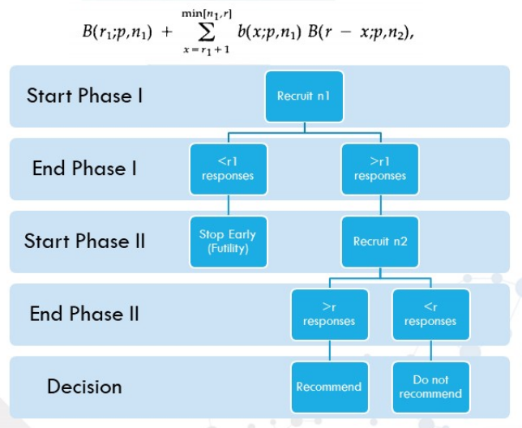

```{r setup, include=FALSE, echo = FALSE,message = FALSE, error = FALSE, warning = FALSE}
knitr::opts_chunk$set(echo = TRUE, fig.width = 10, fig.height = 6)

packages<-c("tidyverse", "kableExtra","clinfun","DescTools","coin")

ipak <- function(pkg){
  new.pkg <- pkg[!(pkg %in% installed.packages()[, "Package"])]
  if (length(new.pkg)) 
    install.packages(new.pkg, dependencies = TRUE)
  sapply(pkg, require, character.only = TRUE)
}
ipak(packages)
 
 
setwd(dirname(rstudioapi::getSourceEditorContext()$path))
getwd()
Sys.setlocale("LC_ALL","English")
```


# Phase II Trials Design

## Introduction

- **Phase IIa: Proof-of-Concept (50/100)**
  - Emphasize quick evaluation and early futility assessment.
  - Seek proof of positive response for proposed treatment to recommend it for further clinical trial evaluation.
  - Example Methods: One sample, Fleming Test, Simon's Design.

- **Phase IIb: Dose-Finding (100/1000)**
  - Explore unknown dose-response curves to find the right model/doses.
  - Determine the dose-response curve to assess the strength of the response and, if strong enough, select doses for Phase III.
  - Example Methods: Contrast tests, Cochran-Armitage test, MCP-Mod.

Phase II clinical trials primarily aim to evaluate the treatment effects in a relatively small number of patients to decide whether the treatment should be studied in a larger scale comparative trial. They play a crucial role in drug development, as the outcomes determine whether to proceed with Phase III trials. The multistage designs for Phase II clinical trials proposed by Gehan, Fleming, Simon, and Ensign are described and compared. Gehan and Simon's designs include two stages, Fleming's design may have two or more stages, and Ensign's three-stage design combines Gehan's first stage with Simon's two stages.

> Kramar, A., Potvin, D., & Hill, C. (1996). Multistage designs for phase II clinical trials: statistical issues in cancer research. *British Journal of Cancer*, 74(8), 1317–1320. doi:10.1038/bjc.1996.537


# Oncoloy Design

The response to treatment will be summarized as either success or failure. In oncology, success is often defined as a complete response or objective response, which includes partial responses.

The treatment effect is evaluated by the parameter \( \pi \), which is the true proportion of success in the given population. If this true proportion of success is less than or equal to a predefined value \( p_0 \) (known as the maximum ineffectiveness rate), the treatment is considered insufficiently effective. If the true proportion of success is greater than or equal to a predefined value \( p_1 \) (known as the minimum effectiveness rate), the treatment is considered sufficiently effective for further study in Phase III trials.

Most statistical methods for Phase II trials are developed to include patients in at least two stages. In the simplest case, \( r_1 \) patients are included in the first stage, and \( r_1 \) successes are observed. Based on the value of \( r_1 \), the trial either stops or continues to enroll \( n_2 \) patients into the second stage, where \( r_2 \) successes are observed. Across \( n_1 + n_2 \) patients, the cumulative number of successes is \( R_2 = r_1 + r_2 \). Depending on the observed cumulative number of successes \( R_k \), the trial continues to accumulate patients. The general procedure for each stage \( k \) is as follows:

- If the total number of successes \( R_k \) is less than the predefined lower decision cutoff point, the treatment is considered not effective enough, and the hypothesis of efficacy is rejected. The associated error risk \( \beta_k \) (Type II error) is the probability of rejecting the effectiveness at the end of stage \( k \), although the treatment leads to a success rate at least equal to \( p_1 \).
- If the total number of successes \( R_k \) is greater than or equal to the predefined upper decision point, the treatment is considered sufficiently effective for further study in Phase III trials. Therefore, the null hypothesis of ineffectiveness is rejected. The associated error risk \( x_k \) (Type I error) is the probability of concluding in favor of efficacy at the end of stage \( k \), although the treatment is ineffective, i.e., when the success rate is \( p_0 \) or less.
- If the total number of successes is between the lower and upper bounds, the trial continues and more patients are included in the next stage.

At the end of the last stage, there is a cutoff point. If the total number of successes is at least equal to this boundary, a conclusion in favor of efficacy is drawn; if the total number of successes is below this boundary, the treatment is concluded to be ineffective.


The primary purpose of Phase II clinical trials is to evaluate the treatment effects in a relatively small group of patients to determine whether the treatment should be studied further in large-scale comparative trials. They play a critical role in the drug development process, as the results decide whether to proceed to Phase III trials. The designs for Phase II clinical trials proposed by Gehan, Fleming, Simon, and Ensign are described and compared. Gehan and Simon's designs involve two stages, Fleming's design may include two or more stages, and Ensign's three-stage design combines elements from Gehan's first stage with Simon's two stages.

## Simon's 2-Stage Design

Simon (1989) proposed two designs, each with two stages. Simon's Optimum design minimizes the average number of patients receiving an ineffective treatment, while his Minimax design minimizes the maximum sample size required. In these designs, unlike Fleming's design, the number of patients in each stage is not specified by the investigator, but rather is the result of a minimization constraint.

In Simon's Ensign design, on the other hand, the sample size is not defined by the investigator but is determined by a minimization criterion. In Simon's Optimum design, the probability of early termination of the trial is high under the assumption that the treatment is ineffective, and the average number of patients is minimized. For extremely rare diseases, and therefore low accrual rates, Simoa's Minimax design will be superior to the Optimum design because it limits the maximum duration of the study.


**Reference**: Simon, R. (1989). Optimal two-stage designs for phase II clinical trials. *Controlled Clinical Trials*, 10(1), 1-10. doi:10.1016/0197-2456(89)90015-9

Phase II studies in cancer treatment are non-controlled trials used to obtain a preliminary estimate of the anti-tumor effect of a treatment.
- Phase I trials provide information about the maximum tolerated dose, which is crucial because most cancer treatments must be administered at high doses to achieve the best effect. However, Phase I trials usually treat only 3 to 6 patients per dose level, and the diagnoses of cancer vary among patients. Therefore, these trials offer little or no information about anti-tumor activity. The proportion of patients experiencing tumor reduction of at least 50% is the primary endpoint for most Phase II trials, although the duration of such responses is also of interest. These uncontrolled trials do not establish the "efficacy" or the role of the drug in treating the disease. The purpose of Phase II trials for new anticancer drugs is to determine whether the drug has sufficient activity against a particular type of tumor to justify further development. Further development might mean combining the drug with other drugs, assessing it in patients with milder conditions, or initiating Phase III studies to compare survival outcomes with those of standard treatments.

The combined protocol of Phase II trials aims to determine whether a treatment has enough promise to warrant a major comparative clinical assessment against standard treatments. The designs developed here are based on testing the null hypothesis \(H_0: P \le P_0\), i.e., the true response rate is less than some uninteresting level \(P_0\). If the null hypothesis is true, we require the probability of concluding that the drug has enough promise to warrant further clinical trials to be less than \(\alpha\). We also require that, if a specified alternative hypothesis \(P \ge P_1\)—where the true response rate is at least some desirable target level \(P_1\)—is true, the probability of rejecting the drug for further study should be less than \(\beta\). In addition to these constraints, we aim to minimize the number of patients receiving a low-activity treatment. For practical considerations of managing multicenter clinical trials, we focus on two-stage designs.

Simon's Design is a two-stage design with an early stopping rule for futility, testing a null hypothesis of a "poor" response against an alternative of a "good" response. If the numbers of patients studied in the first and second stages are denoted by \(n_1\) and \(n_2\) respectively, then the expected sample size is \(EN = n_1 + (1 - \text{PET}) n_2\), where PET represents the probability of early termination after the first stage. The decision of whether or not to terminate after the first stage will be based on the number of responses observed among those \(n_1\) patients. The expected sample size \(EN\) and the probability of early termination depend on the true probability of response \(p\). The experiment will be terminated at the end of the first stage and the drug rejected if \(r_1\) or fewer responses are observed. This occurs with probability \(PET = B(r_1; p, n_1)\), where \(B\) denotes the cumulative binomial distribution. The drug will be rejected at the end of the second stage if \(r\) or fewer responses are observed. Thus, the probability of rejecting a drug with a success probability \(p\) is:
\[
B(r_1; p, n_1) + \sum_{x = r_1 + 1}^{\min[n_1, r]} b(x; p, n_1) B(r - x; p, n_2),
\]
where \(b\) denotes the binomial probability mass function.

For specified values of \(p_0\), \(p_1\), \(\alpha\), and \(\beta\), optimal designs have been determined by enumeration using exact binomial probabilities. For each value of total sample size \(n\) and each value of \(n_1\) in the range \(1, n - 1\), we determined the integer values of \(r_1\) and \(r\), which satisfied the two constraints and minimized the expected sample size when \(p = p_0\). This was found by searching over the range \(r_1 \in (0, n_1)\). For each value of \(r_1\), we determined the maximum value of \(r\) that satisfied the type 2 error constraint. We then examined whether that set of parameters \((n, n_1, r_1, r)\) satisfied the type 1 error constraint. If it did, then we compared the expected sample size to the minimum achieved by previous feasible designs and continued the search over \(r_1\). Keeping \(n\) fixed, we searched over the range of \(n_1\) to find the optimal two-stage design for that maximum sample size \(n\). The search over \(n\) ranged from a lower value of about:
\[
\bar{p}(1 - \bar{p}) \left[\frac{z_{1 - \alpha} + z_{1 - \beta}}{p_1 - p_0}\right]^2,
\]
where \(\bar{p} = \left(p_0 + p_1\right) / 2\). We checked below this starting point to ensure that we had determined the smallest maximum sample size \(n\) for which there was a nontrivial \((n_1, n_2 > 0)\) two-stage design that satisfied the error probability constraints. The enumeration procedure searched upwards from this minimum value of \(n\) until it was clear that the optimum had been determined. The minimum expected sample size for fixed \(n\) is not a unimodal function of \(n\) because of the discreteness of the underlying binomial distributions. Nevertheless, eventually, as \(n\) increased, the value of the local minima increased, and it was clear that a global minimum had been found.

| Parameter | `ph2simon(pu, pa, ep1, ep2, nmax=100)`                             |
|-----------|--------------------------------------------------------------------|
| pu        | unacceptable response rate                                         |
| pa        | response rate that is desirable                                    |
| ep1       | threshold for the probability of declaring drug desirable under p0 |
| ep2       | threshold for the probability of rejecting the drug under p1       |


```{r, echo=T, fig.align="center", out.width = '70%',fig.cap="Figure: Simon’s 2-Stage Design"}


## `ph2simon(pu, pa, ep1, ep2, nmax=100)`
# library("clinfun")
Simon <- ph2simon(0.2, 0.35, 0.05, 0.05, nmax=150)
Simon
plot(Simon)
```


## Jonckheere-Terpstra (JT) trend test

In safety and efficacy studies, it is meaningful to determine if an increase in dose leads to an increase (or decrease) in response. The statistical analysis for such a situation is referred to as dose-response or trend analysis. Here, the goal is to observe a trend, not merely differences between groups. Typically, patients in a dose-response study are randomized into K + 1 treatment groups (a placebo group and K increasing doses of the drug). The response variables may be binary, ordinal, or continuous. In some instances, trend tests are sensitive and can reveal a mild trend where pairwise comparisons would not find significant differences.

For illustration, assume the response is continuous and we aim to determine if there is a trend across the K + 1 population means. A one-sided hypothesis testing framework for investigating an increasing trend could be:
\[ H_0: \mu_0 = \mu_1 = \cdots = \mu_K \]
versus
\[ H_1: \mu_0 \leq \mu_1 \leq \cdots \leq \mu_K \]
with at least one strict inequality.

A one-sided hypothesis testing framework for investigating a decreasing trend could be:
\[ H_0: \mu_0 = \mu_1 = \cdots = \mu_K \]
versus
\[ H_1: \mu_0 \geq \mu_1 \geq \cdots \geq \mu_K \]
with at least one

 strict inequality.

A two-sided hypothesis testing framework for investigating a trend could be:
\[ H_0: \mu_0 = \mu_1 = \cdots = \mu_K \]
versus
\[ H_1: \mu_0 \leq \mu_1 \leq \cdots \leq \mu_K \] or \[ \mu_0 \geq \mu_1 \geq \cdots \geq \mu_K \]
with at least one strict inequality.

**Jonckheere-Terpstra (JT) trend test**

For continuous responses, an appropriate test is the Jonckheere-Terpstra (JT) trend test, which is based on a sum of Mann-Whitney-Wilcoxon tests:
\[ JT = \sum_{k=0}^{K-1}\sum_{k'=1}^{K} MWW_{kk'} \]
where \( MWW_{kk'} \) is the Mann-Whitney-Wilcoxon test comparing group \( k \) to group \( k' \), with \( 0 \leq k < k' \leq K \). This test compares each pair of groups and sums up the results to look for trends.

Example of constructing the JT statistic:
Suppose there are four dose groups in a study (placebo, low dose, mid-dose, high dose). Then the JT trend test is the sum of six Mann-Whitney-Wilcoxon test statistics.

Next, assume that the \( K+1 \) groups have a homogeneous population variance, \( \sigma^2 \). The population variance is estimated by the pooled sample variance, \( s^2 \), with \( d \) degrees of freedom:
\[ s^2 = \frac{1}{d} \sum_{k=0}^{K} \sum_{i=1}^{n_k} (Y_{ki} - \bar{Y}_k)^2, \quad d = \sum_{k=0}^{K}(n_k - 1) \]
Letting \( c_k = 2k - K \), the numerator reduces to:
\[ \sum_{k=0}^{K} c_k \bar{Y}_k \]
The trend statistic is then:
\[ T = \left( \sum_{k=0}^{K} c_k \bar{Y}_k \right) / \left( \sqrt{s^2 \sum_{k=0}^{K} \frac{c_k^2}{n_k^2}} \right) \]

The JT trend test works well for binary and ordinal data, as well as for continuous data. Another trend test for binary data is the Cochran-Armitage (CA) trend test. The difference between the JT and CA trend tests is that for the CA test, the actual dose levels can be specified. In other words, instead of designating dose levels as low, mid, or high, the actual numerical dose levels can be used in the CA trend test, such as 20 mg, 60 mg, 180 mg.

```
*** Constructing JT trend tests;
proc format;
    value groupfmt 0='Placebo' 1='20 mg' 2='60 mg' 3='180 mg';
    value reactfmt 0='F' 1='S';
run;
data contin;
    input group subject response;
    cards;
    0 01 27
    0 02 28
    0 03 27
    0 04 31
    0 05 34
    0 06 32
    1 01 31
    1 02 35
    1 03 34
    1 04 32
    1 05 31
    1 06 33
    2 01 32
    2 02 33
    2 03 30
    2 04 34
    2 05 37
    2 06 36
    3 01 40
    3 02 39
    3 03 41
    3 04 38
    3 05 42
    3 06 43
    ;
run;

proc glm 
    data=contin;
    class group;
    model response=group;
    contrast 'Trend Test' group -1.5 -0.5 0.5 1.5;
    title "Parametric Trend Test for Continuous Data";
    run;
    proc freq 
    data=contin;
    tables group*response/jt;
    title "Jonckheere-Terpstra Trend Test for Continuous Data";
run;

data binary;
    set contin;
    if group=0 then dose=0;
    if group=1 then dose=20;
    if group=2 then dose=60;
    if group=3 then dose=180;
    if response<32 then react=0;
    if response>=32 then react=1;
    format react reactfmt.;
run;

proc freq 
    data=binary;
    tables react*group/jt trend;
    exact jt trend;
    title "Jonckheere-Terpstra and Cochran-Armitage Trend Tests for Binary Data";
    title2 "Ordinal Scores";
run;

proc freq 
    data=binary;
    tables react*dose/jt trend;
    exact jt trend;
    title "Jonckheere-Terpstra and Cochran-Armitage Trend Tests for Binary Data";
    title2 "Dose Scores";
run;
```

```{r,echo = T,message = FALSE, error = FALSE, warning = FALSE}
# library("clinfun")
set.seed(1234)
g <- rep(1:5, rep(10,5))
x <- rnorm(50)
jonckheere.test(x+0.3*g, g)

x[1:2] <- mean(x[1:2]) # tied data
jonckheere.test(x+0.3*g, g)
```


## Cochran-Armitage (CA) trend test

Perform a Cochran Armitage test for trend in binomial proportions across
the levels of a single variable. This test is appropriate only when one
variable has two levels and the other variable is ordinal. The two-level
variable represents the response, and the other represents an
explanatory variable with ordered levels. The null hypothesis is the
hypothesis of no trend, which means that the binomial proportion is the
same for all levels of the explanatory variable.


```{r,echo = T,message = FALSE, error = FALSE, warning = FALSE}
# library("DescTools")
dose <- matrix(c(10,9,10,7, 0,1,0,3), byrow=TRUE, nrow=2, dimnames=list(resp=0:1, dose=0:3))
Desc(dose)
CochranArmitageTest(dose)

### Test independence using permutation test
# library("coin")
lungtumor <- data.frame(dose = rep(c(0, 1, 2), c(40, 50, 48)),
                        tumor = c(rep(c(0, 1), c(38, 2)),
                                  rep(c(0, 1), c(43, 7)),
                                  rep(c(0, 1), c(33, 15))))
independence_test(tumor ~ dose, data = lungtumor, teststat = "quad")


## Test propotion 
tab <- table(lungtumor$dose, lungtumor$tumor)
CochranArmitageTest(tab)
## similar to
prop.trend.test(tab[,1], apply(tab,1, sum))
```


## MCP-Mod (Multiple Comparisons Procedure - Modeling)

MCP-Mod combines the principles of Multiple Comparisons Procedure (MCP) with modeling techniques to address the challenges in dose-response studies. This approach, introduced by Bretz et al. in 2005, enhances the flexibility in modeling dose estimation while maintaining robustness against model mis-specification associated with traditional MCP methods.

MCP-Mod is an innovative statistical methodology that has gained popularity due to its ability to produce robust statistical evidence in Phase II clinical trials, particularly concerning dose selection. Recognized and approved by both the FDA and EMA as fit-for-purpose (FFP), MCP-Mod serves as a two-step approach for analyzing dose-finding data in Phase II trials, aiming to:

- **Confirm the drug’s operational mechanism:** Ensuring that the drug performs as anticipated.
- **Identify appropriate dosing for Phase III trials:** Establishing the doses that will be used in more extensive testing phases.

### Process and Methodology

**1. MCP-Step (Multiple Comparisons Procedure Step):**
- **Objective:** To assess the presence of a dose-response signal effectively.
- **Method:** Utilizes a trend test derived from a set of pre-specified candidate models.
- **Steps Involved:**
  - **Model Specification:** Define a study population that accurately represents the underlying dose-response relationship.
  - **Candidate Models:** Pre-specify candidate dose-response models based on existing data, focusing on critical metrics such as Type I error rate, the power to detect significant dose-response, and the ability to identify the minimal effective dose.
  - **Dose Determination and Sample Size Calculation:** Establish doses and calculate sample sizes needed to meet specified performance characteristics, ensuring that the trial is neither underpowered nor excessively large.

**2. Mod-Step (Modeling Step):**
- **Objective:** To find the optimal dose for confirmatory trials using a more detailed modeling approach.
- **Method:** Involves parametric modeling or model averaging based on the best-fit model from the MCP step.
- **Steps Involved:**
  - **Model Selection:** After conducting the MCP-step, select the most suitable model using criteria like the Akaike Information Criterion (AIC) or Bayesian Information Criterion (BIC).
  - **Dose-Response Modeling:** Perform detailed modeling of the dose-response curve using the selected model to pinpoint the optimal dosages for further trials.

### Advantages of MCP-Mod

- **Flexibility:** Allows multiple models to be evaluated simultaneously, offering a comprehensive view of the potential dose-response relationship.
- **Efficiency:** Generates efficient results that effectively control error rates, crucial for progressing to Phase III trials.
- **Robustness:** Provides a safeguard against errors in model specification, which is vital for maintaining the integrity of the study's findings.


## Two Stage Phase II Design for Response and Toxicity

Phase II clinical trials are pivotal in determining whether a new treatment or procedure has sufficient efficacy and safety profiles to proceed to further stages of drug development. These trials are critical as they often decide if a drug candidate can advance to Phase III, where more extensive testing is conducted on larger populations.

### Focus of Phase II Trials

- **Phase IIa Trials**: These trials primarily assess the feasibility of a treatment or intervention and establish preliminary evidence regarding its safety and efficacy. The focus is on understanding the biological activity of the treatment and assessing whether it performs as expected in a human population.
  
- **Phase IIb Trials**: At this stage, the focus shifts to refining the understanding of the drug's efficacy, often involving dose-ranging studies to determine the optimal dose that maximizes therapeutic benefits while minimizing adverse effects.

### Two-Stage Design for Response and Toxicity

The two-stage design in Phase II trials is an adaptive approach that allows for early termination of the trial if the treatment proves to be ineffective or excessively toxic in the initial phase. This design is advantageous because it minimizes the exposure of patients to potentially ineffective or harmful treatments and conserves resources that could be better utilized on more promising therapies.

**Key Features of the Two-Stage Design:**

1. **Early Stopping for Futility or Toxicity**:
   - The trial is designed with predetermined criteria that, if met in the first stage, allow for early termination. This decision is based on the assessment of both therapeutic efficacy and adverse effects observed in the initial cohort of patients.

2. **Coprimary Endpoints**:
   - These trials typically have coprimary endpoints that assess both the efficacy and the toxicity of the treatment. This dual-focus ensures that any progression to the next phase of trials is justified on the grounds of acceptable safety and demonstrated efficacy.

3. **Flexibility**:
   - The design provides flexibility in modifying the trial protocol based on the data obtained from the first phase. This adaptive feature can lead to changes in the dosage, treatment protocol, or patient selection criteria for the second stage.

### Implementation of the Two-Stage Design

The method outlined by Bryant and Day (1995) serves as a classic example of how two-stage designs can be effectively implemented. Their approach allows for a comprehensive assessment of both response and toxicity, integrating these critical aspects into a unified framework that supports decision-making in clinical development.

**Steps Involved in the Two-Stage Design:**

1. **First Stage**:
   - A smaller group of patients is initially treated, and data on efficacy and adverse effects are collected.
   - Decision criteria are applied to determine whether to proceed to the second stage or stop the trial. These criteria are based on statistical thresholds for efficacy and safety.

2. **Second Stage**:
   - If the first stage shows promising results without crossing toxicity thresholds, the trial progresses to the second stage with a larger cohort to confirm the findings.
   - The second stage further refines the efficacy data and provides more robust safety data.

**Benefits of the Two-Stage Design:**

- **Resource Efficiency**: Limits the number of participants and resources expended on treatments that show early signs of being ineffective or harmful.
  
- **Ethical Considerations**: Reduces patient exposure to potentially ineffective or unsafe treatments.

- **Data-Driven Decisions**: Allows data from the initial cohort to inform adjustments and refinements, increasing the likelihood of successful outcomes in subsequent phases.