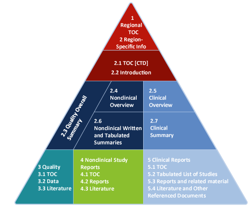

```{r setup, include=FALSE, echo = FALSE,message = FALSE, error = FALSE, warning = FALSE}
knitr::opts_chunk$set(echo = TRUE, fig.width = 10, fig.height = 6)

packages<-c("tidyverse", "kableExtra")

ipak <- function(pkg){
  new.pkg <- pkg[!(pkg %in% installed.packages()[, "Package"])]
  if (length(new.pkg)) 
    install.packages(new.pkg, dependencies = TRUE)
  sapply(pkg, require, character.only = TRUE)
}
ipak(packages)
 
 
setwd(dirname(rstudioapi::getSourceEditorContext()$path))
getwd()
Sys.setlocale("LC_ALL","English")
```


# Introductrion

## Common Technical Document (CTD) 

The Common Technical Document (CTD) serves as a standardized format for submitting new drug applications globally, developed by the International Conference on Harmonisation of Technical Requirements for Pharmaceuticals for Human Use (ICH) in 2002. This document facilitates the integration of quality, safety, and efficacy data, which regulatory agencies across all ICH regions accept. Structured like a triangle, the CTD segregates its content into various modules, with detailed data placed in lower modules and increasingly summarized data as one ascends the structure.

Statisticians and programmers primarily engage with the right side of this triangular structure, particularly with Module 5, which is dedicated to clinical data. This includes a specific subsection, Module 5.3.5.3, designated for "Reports of Analyses for More than One Study," where Integrated Summaries of Safety and Efficacy (ISS/ISE) are included. These summaries are crucial as they compile and contextualize safety and efficacy data across multiple studies, highlighting significant findings pertinent to specific safety or efficacy issues. The integration of data in ISS/ISE allows for a comprehensive review that may utilize individual study data or pooled data from several studies, depending on the nature of the drug development project.

Further summarization occurs in modules such as 2.5 (Clinical Overview), 2.7.3 (Summary of Clinical Efficacy), and 2.7.4 (Summary of Clinical Safety), where detailed factual summaries of the clinical data presented in the CTD are provided. These summaries (SCE/SCS) distill the essence of the integrated review data, providing a critical analysis of the efficacy and safety of the drug.

Given the regulated nature of data submissions, it is essential for statisticians to not only adhere to the guidelines but also understand the nuances of data integration and pooling, tailored to the specifics of the drug development in question. The guidelines such as the FDA's "Integrated Summaries of Effectiveness and Safety: Location Within the Common Technical Document" from April 2009, and the ICH's "M4E Common Technical Document for the Registration of Pharmaceuticals for Human Use — Efficacy" from 2016, offer detailed instructions on structuring ISS/ISE and SCS/SCE, emphasizing the flexibility required to adapt to various drug characteristics.



## Strategic Importance of Data Pooling

The decision to utilize data pooling in drug submission projects is critical and must be made early in the process, particularly when planning the Summary of Clinical Safety (SCS) and Summary of Clinical Efficacy (SCE). Data pooling is not always mandatory; it should only be employed when it can provide deeper insights than what is achievable through individual study analyses. When considering pooled analyses, the rationale behind such an approach must be clearly articulated, and the methodological validity of combining data across different studies needs to be thoroughly justified.

**Key Considerations for Data Pooling:**

1. **Applicability and Relevance:**
   - Determine whether pooled data will enhance understanding beyond individual trial results.
   - Assess the relevance of pooled analyses to the drug's safety and efficacy profiles.

2. **Alignment with Regulatory Guidelines:**
   - Follow the ICH M4E guidelines, which suggest pooling data from controlled studies that share similarities in design, duration, population, endpoints, and show consistent results across these parameters.
   - Ensure that any deviation from these criteria is well-supported by a robust justification.

3. **Development Plan Consistency:**
   - Align the pooling strategy with the drug’s clinical development plan, considering the number and types of studies involved.
   - Evaluate the homogeneity of study designs to ensure comparability and validity in pooled results.

4. **Statistical Analysis Plans (SAPs):**
   - For each ISS (Integrated Summary of Safety) and ISE (Integrated Summary of Efficacy), develop a dedicated SAP that outlines which studies' data will be pooled.
   - SAPs should detail any necessary data mapping or derivations required due to differences in data collection methods or other study-specific variables.
   - Include statistical methodologies such as tests for heterogeneity among studies and adjustment methods for varying exposure durations.

5. **Decision Points:**
   - At the outset of submission activities, decide if an ISS or ISE will be generated and whether pooled analyses are necessary to support these summaries or the SCS/SCE.
   - This decision should be part of an initial pooling strategy discussion to ensure all stakeholders understand the scope and implications of pooling data.

## From Initial Preparation to Post-Submission Interactions 

When approaching FDA data submissions, thorough preparation and a robust follow-through can significantly impact the successful approval of a drug. 

### The Good Start: Early Engagement and Standardization {-}

**Early Discussions with the FDA:**

Engaging early with the FDA is crucial. Regular meetings to discuss the status of clinical data standards ensure alignment with FDA expectations and provide an opportunity to address potential issues proactively.

**Study Data Standardization Plan (SDSP):**

According to the Study Data Technical Conformance Guide, the FDA advises sponsors to draft an SDSP early in the drug development process. This plan should outline the standardized study data to be submitted and be updated continually throughout the development cycle, including any new studies or changes in data integration plans. This document is pivotal for both CDER and CBER divisions, with CBER requiring additional details for vaccine studies, such as specific SDTM mapping requirements.

The SDSP serves as a dynamic record of:

- **New Studies:** Adding new studies as they are planned or updating the medical dictionary used.
- **Data Integration Plan:** As the submission target becomes clearer, updating the SDSP to reflect how data from different studies will be integrated—either at the SDTM level or directly into integrated ADaM datasets.
- **FDA Interactions:** Documenting past discussions and decisions with the FDA ensures transparency and continuity.
- **Noncompliance Tracking:** Any deviations from the standards that need FDA feedback should be recorded.

### Test Your Data Package: Mock Submissions {-}

**Mock Submission:**

The FDA allows for a test submission of your data package to identify any technical issues or noncompliance ahead of the final submission. This test, which often includes only one study, is not about the content but rather the technical aspects of the submission. Choosing a study with complexities, such as one involving complex legacy data transformations, is advisable to maximize the feedback from the FDA's technical team.

### The After: Responding to FDA Reviews {-}

**Post-Submission Interactions:**
Once the eCTD is submitted, it’s crucial to respond promptly to any FDA queries or requests for additional information. This phase is critical as timely and accurate responses can directly influence the review outcome.

**Best Practices for Successful Submission:**

1. **Utilize the PHUSE Template for the SDSP:** Employing standardized templates endorsed by initiatives like PHUSE helps maintain compliance and ensures all required information is comprehensively covered.
2. **Regularly Update the SDSP:** Keeping the SDSP current with all developments in the drug's testing ensures that all data submitted is consistent and up-to-date.
3. **Proactive FDA Engagement:** Continuous dialogue with the FDA helps anticipate potential issues and aligns the submission strategy with regulatory expectations.
4. **Prepare for Complexity in Test Submissions:** Use the mock submission process to iron out any technical kinks, particularly those involving complex data or standards deviations.
5. **Prompt Reaction to FDA Feedback:** Quick and thorough responses during the review phase can significantly smooth the pathway to approval.


### Supporting Bioresearch Monitoring (BIMO) Inspections: Enhancing Compliance and Efficiency {-}

The Bioresearch Monitoring (BIMO) program of the FDA is a critical component designed to ensure that clinical research adheres to regulatory standards. The success of FDA audits and inspections can hinge on how well sponsors prepare and provide specific data, enhancing both compliance and review efficiency. 

BIMO inspections are conducted to verify compliance with FDA regulations by clinical investigators, sponsors, and Institutional Review Boards (IRB). These inspections are crucial for ensuring the integrity of the clinical research and the validity of data submitted for regulatory review.

According to FDA guidelines, particularly those specified for the planning of BIMO inspections in CDER submissions, sponsors are asked to submit three specific types of information:

1. **Clinical Study Level Information:** General details about each clinical study involved, especially for pivotal studies.
   
2. **Subject-Level Data Listings by Clinical Site (By-Site Listings):** Detailed listings that allow reviewers to assess data integrity and compliance at the level of individual subjects at each site.
   
3. **Summary-Level Clinical Site Dataset (CLINSITE):** Aggregate data summaries by site to aid in the quick review and identification of potential issues across sites.

**Proactive Planning in the SDSP**

Proactively incorporating anticipated requests for BIMO-related information in the Study Data Standardization Plan (SDSP) is recommended. This should include plans for how and which trials will provide detailed By-Site Listings and CLINSITE datasets, even if these requirements are primarily for major or pivotal studies. Sponsors should also consider:
   
- **Anticipating Agency Requests:** The possibility of the FDA requesting additional information during the review period, even after the final eCTD submission, underscores the need for readiness in providing such data.
   
- **Automatic Generation of Listings:** The FDA plans to eventually automate the generation of By-Site Listings from submitted SDTM or ADaM datasets, which will affect how data needs to be prepared and organized.

## Technical Rejection Criteria (TRC)

The FDA’s implementation of Technical Rejection Criteria (TRC) on September 15, 2021, marked a significant shift in the submission process for Electronic Common Technical Documents (eCTD). These criteria are designed to automatically screen and potentially reject submissions that fail to meet specific technical standards, emphasizing the need for precision in regulatory documentation. 

TRCs are automated validation checks incorporated into the FDA’s inbound processing system. These criteria are intended to ensure that all submitted documents and datasets adhere strictly to specified standards. The criteria cover various aspects of the eCTD, including proper file tagging and the inclusion of essential datasets and metadata.

The TRCs for study data focus on the correct formatting and presence of specific files within the eCTD. The criteria include:

1. **Correct STF File-Tags (TRC 1735):**
   - Ensures that all standardized datasets and their corresponding `define.xml` files in specified sections of Modules 4 and 5 have the correct Study Tagging Files (STF) tags. This includes sections dealing with both clinical and non-clinical study data.

2. **Mandatory Datasets and Definitions (TRC 1736):**
   - For nonclinical data (SEND), a Demographic (DM) dataset and `define.xml` must be included in specific sections of Module 4.
   - For clinical data (SDTM and ADaM), a DM dataset for SDTM and an Analysis Data Model Subject Level Analysis Dataset (ADSL) for ADaM must be submitted in specified sections of Module 5, along with their `define.xml` files.

**The Importance of ts.xpt Dataset**

Regardless of the format of the data submission (CDISC or non-CDISC), the eCTD must include a dataset named `ts.xpt` in the datasets folder. This dataset should contain at least one record with the parameter `TSPARMCD=STSTDTC`, indicating the study start date. This is critical because the FDA system uses this dataset to determine whether the data standards apply to your study, specifically if the study started before or after December 17, 2016. For studies initiated on or before this date, at least a simplified TS dataset is required.


## FDA Guidelines for Pooled Datasets and PDF Submission Requirements

When preparing for an NDA submission, it's essential to follow the FDA's specific guidelines regarding pooled datasets and the submission of accompanying documentation in the eCTD format.  

### Pooled Datasets {-}

In scenarios where legacy studies (started before December 2016) are integrated into SDTM pooled datasets, the FDA provides specific guidance:

1. **eCTD Submission Section for Pooled Datasets:**
   - Pooled SDTM datasets should be submitted to eCTD section **5.3.5.3 “Reports of Analyses of Data from More than One Study.”** This section is designated for pooled analyses that integrate data across multiple studies.

2. **ts.xpt File for Pooled Datasets:**
   - The FDA confirmed that **a ts.xpt file is not required** for the pooled datasets submitted in section 5.3.5.3. This simplifies the submission process by not necessitating the inclusion of this file, which typically indicates the study start date and is used to determine data standard applicability.

3. **STUDYID Usage:**
   - For pooled datasets, the question of which STUDYID to use becomes irrelevant in the context of ts.xpt non-requirement, as ts.xpt itself is not needed for these submissions.

4. **Integration into Pooled ADaM Datasets:**
   - Similar to SDTM, when integrating study data directly into pooled ADaM datasets, it was also confirmed that **dm.xpt (Demographic dataset)** is not required. This decision helps streamline the preparation of integrated datasets for submission.

### PDF Requirements for eCTD Submissions  {-}

Alongside dataset submissions, the technical setup of PDF files included in the eCTD is critical. Here are the essential requirements to ensure your PDF files meet FDA standards and avoid technical rejection:

1. **Visibility of Bookmarks:**
   - Ensure that bookmarks are clearly visible in PDF documents, facilitating easier navigation through the document for FDA reviewers.

2. **Embedded Fonts:**
   - All non-standard fonts used in the document must be embedded. This ensures that the document appears as intended, regardless of the fonts available on the viewer's system.

3. **Fast Web View Enabled:**
   - PDFs should be optimized for Fast Web View. This setting allows the PDF to be displayed in a web browser one page at a time without having to download the entire document first.

4. **Initial View Settings:**
   - Set up the PDF to open in a particular way (e.g., showing bookmarks panel and page) to provide a standardized viewing experience for all reviewers.

5. **Removal of Author Information:**
   - Any reference to the author in the file properties should be removed to maintain the standardization and anonymization of the submission documents.

[FDA PDF requirements can be viewed](https://www.fda.gov/media/76797/download)


## Importance of Traceability 

Traceability in the context of clinical data handling, particularly within CDISC standards and the ADaM datasets, plays a crucial role in ensuring the integrity and verifiability of data from collection through to analysis. This process is vital for regulatory reviews, as it allows for the clear understanding and verification of the data's lineage—tracing back from the analysis outputs to the original data collected during the clinical study.
 
Both CDISC and the FDA emphasize the significance of traceability:

- **CDISC Definition**: Traceability is described as the attribute that enables an understanding of the data’s lineage, establishing a clear path between an element and its predecessor.
  
- **FDA Guidance**: The FDA highlights traceability as a critical component, often problematic in data conversions. Without effective traceability, the regulatory review process can be jeopardized, potentially impacting the evaluation and approval of a submission.

**Implementing Traceability in ADaM**

Traceability within ADaM can be achieved through two primary methods: data-point traceability and metadata traceability.

1. **Data-Point Traceability**: Data-point traceability involves maintaining a direct link between data points in the ADaM datasets and their origins in SDTM datasets. Here are some techniques to ensure data-point traceability:

  - **Preserving the --SEQ Variable**: Retaining the sequence variable (e.g., AESEQ from the SDTM AE dataset) in the ADaM dataset (e.g., ADAE) to track the origin of each record.
    
  - **Variable Derivations and Imputations**: When variables are derived or imputed in ADaM:
    - Create new variables while retaining the original ones from SDTM to allow clear tracing.
    - Use imputation flags for any altered date/time variables to document changes.
    - Keep original timepoint variables when applying visit windowing or imputations.
  
  - **Complex Derivations**: For complex data transformations, using intermediate datasets can be beneficial to maintain step-by-step traceability.

2. **Metadata Traceability**: When data-point traceability is complex or insufficient, metadata traceability becomes essential. This involves documenting the derivation logic and data handling in metadata files and supporting documentation:

  - **Define.xml Documentation**: This should include detailed metadata about the derivation of variables and the structure of the datasets.
    
  - **Analysis Data Reviewer Guide**: This document should outline algorithms used for data transformations and any exclusions or special handling of data points.

The document “ADaM Examples of Traceability,” released in May 2022, provides practical examples and guidance on implementing traceability across various scenarios. These examples help clarify how to maintain a clear and auditable record of data manipulations, which is crucial for regulatory compliance and scientific validity.


## Raising Awareness for Additional FDA Data Standards and Submission Recommendations

The evolving landscape of FDA recommendations and CDISC guidelines presents a significant challenge for data standards implementers, particularly within Contract Research Organizations (CROs) where specialization may be less common than among sponsor-side teams. The sheer volume of guidance documents and therapeutic area-specific user guides (TAUGs) complicates the implementation process, yet adherence to these documents is crucial for regulatory compliance and successful drug development and submission.  

1. **Utilization of Therapeutic Area User Guides (TAUGs)**
   - **Scope and Impact**: As of April 2023, 46 TAUGs covering various therapeutic areas are available. These guides provide detailed implementation examples that are crucial for the accurate representation of data in regulatory submissions. Adherence to these TAUGs is often recommended by the FDA in its Study Data Technical Conformance Guidance (SDTCG).
   - **Regulatory Expectations**: Despite the non-binding language typically used in FDA guidance documents, practical experience and feedback from regulatory meetings underscore that the FDA expects compliance with these recommendations.

2. **FDA Division-Specific Guidance**
   - **Specific Medical Aspects**: Additional guidances targeting specific FDA divisions or medical aspects aim to reduce ambiguities in CDISC Implementation Guidance. These documents often provide critical specifics not covered by more general guidelines and are particularly useful in fields like vaccines, where specialized data handling (e.g., reactogenicity data reporting) is required.

3. **Documentation and References**
   - **Reviewer Guides and SDSP**: It is important to document the use and implications of TAUGs and FDA-specific guidelines in the Study Data Standardization Plan (SDSP) and reviewer guides. This documentation helps ensure that all modifications and implementations are transparent and traceable.
   - **FDA's Technical Specification Documents**: All guidances are referenced in Section 5 of the FDA SDTCG and on the Study Data Standards Resources FDA webpage under “Technical Guidance.”

4. **Adapting to New and Evolving Standards**
   - **Continuous Monitoring**: Regularly monitoring updates to TAUGs, FDA guidances, and CDISC standards is crucial. This proactive approach helps in adapting processes and training materials to meet the latest regulatory expectations.
   - **Impact Assessment**: It is also vital to assess the impact of these guidances on ongoing and planned studies to ensure that data governance and management practices are up to date and compliant.


# Integration Document

## Aggregated Safety Analysis Plans (ASAP)

Aggregated Safety Analysis Plans (ASAPs) are comprehensive documents that outline the methods and procedures to be used for analyzing safety data across multiple clinical studies or entire programs. These plans are critical in pharmaceutical and biotechnological research, especially for meeting regulatory requirements and ensuring patient safety. Here’s what typically goes into an ASAP:

1. **Objective**: The main goal of the plan, which usually involves assessing the safety profile of a drug or treatment across different studies to identify any potential adverse effects that might not be apparent in individual studies.

2. **Scope**: Defines which studies or datasets will be included in the analysis. This might cover different phases of clinical trials, different indications, or a combination of studies conducted under similar conditions.

3. **Data Integration Strategy**: Describes how data from various studies will be harmonized and integrated. This involves standardizing data formats, coding terminologies, and resolving inconsistencies between datasets.

4. **Statistical Methods**: Details the statistical techniques and models that will be used to analyze the safety data. This includes methods for handling missing data, statistical tests for comparing adverse events across groups, and techniques for longitudinal data analysis, if applicable.

5. **Safety Endpoints**: Specifies which safety endpoints will be analyzed, such as specific adverse events, laboratory value changes, or other clinically relevant safety outcomes.

6. **Subgroup Analyses**: Outlines any planned analyses of subgroups within the data, which might include demographic categories (like age and sex), medical history, or other patient characteristics that could influence safety outcomes.

7. **Interim Analyses and Updates**: Includes provisions for interim analyses if the aggregated data will be reviewed periodically as new data become available, as well as how updates to the analysis plan will be handled.

8. **Reporting Standards**: Establishes the format and standards for reporting the results, including how detailed the safety data will be presented, the types of tables and figures to be used, and the level of detail required in textual descriptions.

9. **Regulatory Compliance**: Ensures that the plan complies with relevant regulatory guidelines, such as those from the FDA, EMA, or other regulatory bodies, concerning safety reporting in clinical trials.


The Aggregated Safety Analysis Plan (ASAP) plays a crucial role in ongoing safety monitoring and signal detection in several ways:

1. **Ongoing Monitoring and Signal Detection**: The ASAP includes methodologies for monitoring aggregate safety data from ongoing clinical trials, which might even be blinded. This systematic approach ensures continual safety evaluation, allowing for early detection of safety signals. Without such a plan, signals might not be detected until later, potentially leading to unexpected safety concerns at the end of the study.

2. **Identifying Safety Knowledge Gaps**: The ASAP prompts sponsors to identify key safety questions that may remain unanswered by the time of regulatory submission. This includes understanding the frequency and severity of adverse events, their reversibility, and risk factors, especially in specific subpopulations. By highlighting these gaps, sponsors can plan additional studies or post-marketing surveillance to address these questions proactively.

3. **Supporting Consistent Safety Messaging**: The ASAP helps establish a foundation for consistent safety messaging throughout a product’s lifecycle. It guides the creation of a "safety storyboard," a tool (whether a slide deck or document) that evolves over time to include safety data from various stages of clinical development. This storyboard helps in aligning safety communications to regulatory bodies, healthcare professionals, trial participants, and the public. It includes identified risks with established causal associations, suspected risks, and safety concerns of interest based on epidemiology or traditional concerns, like drug-induced liver injury. It also incorporates risk minimization measures, ensuring that key safety messages are clear and consistent across all communications.


## Data and Safety Monitoring Plan (DSMP)

[Details See](https://www.niams.nih.gov/grants-funding/conducting-clinical-trials/clinical-trial-policies-guidelines-and-templates/data-and)

A Data and Safety Monitoring Plan (DSMP) is designed to ensure the safety of participants and the integrity of data in clinical trials. Here are the essential components that should be included in a DSMP:

1. **Introduction**
   - **Purpose of the Plan**: Defines the goals and scope of the monitoring.
   - **Background Information**: Provides details about the study, including its objectives, design, and the rationale for safety monitoring.

2. **Study Oversight**
   - **Data and Safety Monitoring Board (DSMB)**: Details the composition, roles, and responsibilities of the DSMB or other monitoring committees.
   - **Interim Analysis and Meetings**: Specifies the schedule and frequency of interim analyses and DSMB meetings.

3. **Safety Monitoring Procedures**
   - **Adverse Event (AE) Monitoring**: Outlines procedures for the detection, recording, and reporting of adverse events and serious adverse events (SAEs).
   - **Reporting Guidelines**: Sets timelines for reporting different types of events (e.g., immediate for SAEs, periodically for AEs).
   - **Stopping Rules**: Establishes predefined criteria for pausing or stopping the study for safety reasons.

4. **Data Integrity and Quality Assurance**
   - **Data Management Procedures**: Describes methods for data collection, entry, verification, and correction.
   - **Quality Control Measures**: Defines processes to ensure data accuracy and protocol compliance.
   - **Audit Procedures**: Details internal and external audits, including the timing and scope of audits.

5. **Statistical Considerations**
   - **Interim Analysis**: Describes statistical methods and criteria used for interim reviews of efficacy and safety data.
   - **Adjustments for Multiplicity**: Explains approaches to adjust for multiple comparisons and interim analyses to control the Type I error rate.
   - **Blinding and Unblinding Procedures**: Outlines guidelines for maintaining or breaking the blind during the study, if applicable.

6. **Ethical Considerations**
   - **Informed Consent Updates**: Details procedures for updating and re-consenting participants if new safety information arises.
   - **Ethical Reporting Standards**: Ensures compliance with ethical standards and regulations, such as the Declaration of Helsinki and Good Clinical Practice (GCP).

7. **Communication Plan**
   - **Information Dissemination**: Describes how and when information about trial progress and safety issues will be communicated to stakeholders (participants, regulatory bodies, the public).
   - **Emergency Communication Protocols**: Sets procedures for urgent communications in case of an unexpected serious safety issue.

## Study Data Standardization Plan (SDSP)

A Study Data Standardization Plan (SDSP) is a critical document used in clinical trials to outline the standards and processes for collecting, managing, and reporting data in a consistent and regulatory-compliant manner. Here’s what an SDSP typically includes:

1. **Introduction**
   - **Study Overview**: Brief description of the study, including its objectives, design, and scope.
   - **Purpose of the SDSP**: Explanation of the plan’s goals and its importance in ensuring data standardization and compliance with regulatory guidelines.

2. **Data Standards**
   - **Adopted Standards**: Details on the data standards adopted for the study, such as CDISC (Clinical Data Interchange Standards Consortium) standards including SDTM (Study Data Tabulation Model), ADaM (Analysis Data Model), and Controlled Terminologies.
   - **Versioning**: Information on the versions of the standards used, including any anticipated updates during the study.

3. **Data Collection and Management**
   - **Case Report Form (CRF) Design**: Outline of how the CRFs are designed to comply with data standards and capture all necessary information.
   - **Database Design**: Description of the study database structure, including data capture, storage, and retrieval systems.

4. **Data Conversion and Mapping**
   - **Data Mapping Specifications**: Detailed plan for how data from CRFs will be mapped to the standard data models (e.g., SDTM).
   - **Conversion Procedures**: Steps and tools used for data conversion, including any custom scripts or software.

5. **Data Quality Management**
   - **Quality Assurance Procedures**: Processes for ensuring data quality, including validation checks and audit trails.
   - **Data Review and Cleaning**: Procedures for ongoing data monitoring, review, and cleaning to maintain data integrity.

6. **Statistical Analysis and Reporting**
   - **Analysis Data Sets**: Description of how analysis data sets (e.g., ADaM) will be prepared and used in statistical analysis.
   - **Statistical Analysis Plan (SAP)**: Integration of the SAP with the SDSP, detailing the analysis methods and presentation of results.

7. **Metadata Management**
   - **Metadata Repository**: Information on the creation, storage, and maintenance of metadata describing all data elements in the study.
   - **Documentation and Change Management**: Processes for documenting changes in data standards or management practices and their impact on the study.

8. **Regulatory Submission and Archiving**
   - **Submission Data Package**: Description of the final data package intended for regulatory submission, including datasets, metadata, and all supporting documentation.
   - **Archiving Procedures**: Plans for the long-term storage and preservation of study data and metadata, complying with regulatory requirements.


## Clinical Data Integration Plan (CDIP) 

A Clinical Data Integration Plan (CDIP) is crucial for coordinating and merging data across different clinical trials or healthcare databases, ensuring seamless data analysis and supporting broader research objectives. This plan helps to manage data from diverse sources, such as clinical trial systems, electronic health records (EHRs), patient registries, and more. Here's a detailed breakdown of what should be included in a Clinical Data Integration Plan:

1. **Overview and Objectives**
   - **Introduction**: Briefly describe the purpose and the strategic importance of integrating clinical data.
   - **Goals**: Define specific objectives, such as improving research efficiency, enhancing patient safety monitoring, or supporting regulatory submissions.

2. **Data Sources and Standards**
   - **Identification of Data Sources**: List all sources from which data will be integrated, including clinical trial databases, EHRs, biobanks, and other relevant databases.
   - **Data Standards**: Specify the clinical data standards to be used (e.g., CDISC standards including SDTM, ADaM) to facilitate data harmonization and ensure regulatory compliance.

3. **Data Management and Governance**
   - **Data Ownership and Stewardship**: Define the roles and responsibilities for managing the integrated data, including data ownership and stewardship.
   - **Data Governance Framework**: Outline the governance structure to ensure data quality, privacy, and ethical use of data.

4. **Integration Architecture and Tools**
   - **System Architecture**: Describe the architecture of the data integration system, whether it’s a centralized data warehouse, a federated system, or a cloud-based solution.
   - **Technology and Tools**: Identify the tools and technologies that will be used for data extraction, transformation, loading (ETL), and integration, including any specialized software for clinical data.

5. **Data Mapping and Transformation**
   - **Mapping Specifications**: Provide detailed documentation on how data from different sources will be mapped to a common format, including variable mappings and data transformation rules.
   - **Transformation Logic**: Detail the logic and processes for transforming disparate data into a standardized, analyzable format.


# ISS and ISE

In clinical research, Integrated Summary of Safety (ISS) and Integrated Summary of Efficacy (ISE) are critical components of a regulatory submission to health authorities like the FDA. These integrated summaries play a vital role in the review process for new drug applications (NDAs) or biologics license applications (BLAs). Here’s a brief overview of both components:

[Guidance for Industry Integrated Summaries of Effectiveness and Safety: Location Within the Common Technical Document](https://www.fda.gov/media/75783/download)


The Integrated Summary of Safety (ISS) and the Integrated Summary of Effectiveness (ISE) is useful for:

* Comparison of results across multiple studies
* Identification of common related adverse events (AEs)
* Identification of common serious adverse events (SAEs)
* Assessment of efficacy in subgroups
* Identifying rare, or unexpected trends in different subgroups
* Assessment of risks and benefits of the drug


## Integrated Summary of Safety (ISS)

The ISS is a comprehensive evaluation of the safety data collected from all relevant clinical trials conducted with the investigational drug. The main objective of the ISS is to provide a complete picture of the drug’s safety profile across different patient populations, dosages, and treatment durations. The ISS should:

- Aggregate safety data from various studies to assess the overall incidence and types of adverse events.
- Include detailed analyses of serious adverse events, withdrawals due to adverse events, and specific safety issues identified during the trials.
- Utilize pooled data to perform subgroup analyses based on demographics like age, sex, and race to identify any differential safety risks.
- Provide a comparative analysis if there are control groups involved, highlighting any differences in safety profiles between the investigational drug and comparators.

## Integrated Summary of Efficacy (ISE)

The ISE is a consolidated document that evaluates the efficacy of the drug based on data from multiple clinical studies. Its goal is to establish a clear and robust argument for the drug’s effectiveness across various patient populations and clinical settings. The ISE should:
- Combine efficacy data from individual studies to provide overall estimates of treatment effects.
- Include meta-analyses or pooled analyses when appropriate to strengthen the evidence of efficacy.
- Discuss consistency of the treatment effect across different demographic and geographic subgroups.
- Highlight any differences in the efficacy outcomes between the investigational drug and any control or comparator groups used in the trials.


## Challenges

Before integrating datasets, it is important to identify the following points but, not limited to:

* Number of individual studies involved in the process
* Whether individual studies follow CDISC (Clinical Data Interchange Standards Consortium)/SDTM (Study
Data Tabulation Model) format or non SDTM format
* Version of SDTM IG (Study Data Tabulation Model Implementation Guide)
* Version of Coding dictionary
* Version of Controlled Terminology


Compiling Integrated Summary of Safety (ISS) and Integrated Summary of Efficacy (ISE) reports presents a range of challenges that can be complex and demanding due to the nature of data integration, the breadth of analysis required, and regulatory expectations. Here are the key challenges often encountered with ISS and ISE:

1. **Data Integration and Standardization** {-}
- **Variability in Data**: Clinical trials often have data collected under different protocols, using varying data standards. Integrating these into a cohesive dataset that can be analyzed collectively is challenging.
- **Data Conversion**: Ensuring data from various studies is converted accurately into a common format, like CDISC standards (SDTM, ADaM), requires meticulous attention to detail and considerable effort.

2. **Management of Large Data Sets** {-}
- **Volume**: ISS and ISE require handling large volumes of data, which can be overwhelming and may stress existing data management systems.
- **Complexity**: Managing and navigating these large datasets, ensuring all data is accounted for and correctly aligned, can be technically challenging.

3. **Statistical Analysis Complexity** {-}
- **Harmonizing Analysis Methods**: Different studies might use different statistical methods, so harmonizing these for integrated analysis can be difficult.
- **Subgroup Analyses**: Conducting extensive subgroup analyses to explore drug effects across various patient demographics adds layers of complexity.

4. **Regulatory Standards and Compliance** {-}
- **Evolving Regulations**: Keeping up with changing regulatory requirements and ensuring compliance in terms of data reporting and analysis can be challenging.
- **Consistency in Reporting**: Ensuring consistent reporting across different regulatory submissions is crucial and requires a clear understanding of regulatory expectations.

5. **Quality Control** {-}
- **Error Identification**: With the large amount of data, identifying and correcting errors before submission can be daunting.
- **Validation**: Ensuring that all data used in ISS and ISE reports are validated and traceable back to the source is essential for regulatory compliance.

6. **Resource and Time Constraints** {-}
- **Expertise**: ISS and ISE preparation requires a team with expertise in biostatistics, clinical data management, medical writing, and regulatory affairs, which may be resource-intensive.
- **Deadlines**: Meeting submission deadlines while ensuring thoroughness in safety and efficacy analyses under tight timelines is a common challenge.

7. **Interpretation and Presentation of Results** {-}
- **Clarity of Presentation**: Effectively presenting complex data in a way that is understandable and accessible to regulatory reviewers is key.
- **Interpretative Challenges**: Drawing coherent conclusions from integrated analyses, especially when results from individual studies differ significantly, poses interpretative challenges.


## Method

Dataset integration is a critical process in the preparation of integrated summaries for safety or efficacy, involving the pooling of data from multiple studies to produce combined statistical results. Here's how this process typically unfolds:

1. **Identifying Studies for Integration**:
   - The process begins with the identification of studies that will be included in the integrated analysis, a decision typically made by the Sponsor and the Contract Research Organization (CRO).

2. **Planning the Integration**:
   - Each selected study is detailed by the study statistician in the integrated statistical analysis plan (SAP), which also lists the intended integrated analysis Tables, Listings, and Figures (TLF) outputs. Mock-ups of these outputs should be included in the SAP.

3. **Preparation for Integration**:
   - Once the analysis direction is defined and supporting documents such as electronic case report forms (CRFs) and dataset specifications are available, programmers can begin planning and designing integration datasets.

4. **Integration Methods**:
   - There are various methods to approach dataset integration, each suited to different scenarios:

     **Method 1: Integrating Using Individual ADaM Datasets**
     - In this method, individual Analysis Data Model (ADaM) datasets are created from Study Data Tabulation Model (SDTM) datasets. These ADaM datasets are then used to create integrated analysis datasets. This process requires waiting until the individual SDTM and ADaM datasets are validated and may involve standardizing programming logic, up-versioning coding dictionaries, and handling inconsistencies between study designs.

     **Method 2: Integrating Using Study Level Tabulation Datasets**
     - Suggested when integrating non-CDISC compliant studies or a mix of standard and non-standard studies. Study level tabulation datasets (SDTM datasets or raw datasets) are directly used to create integrated ADaM datasets. This method involves extensive programming and documentation to manage the transformations and standardization of datasets.

     **Method 3: Integrating Using Integrated SDTM Datasets**
     - This approach is highly recommended when all individual studies are CDISC/SDTM compliant. It involves creating integrated SDTM datasets by stacking processed SDTM datasets, which are then used to create integrated ADaM datasets and subsequently TLFs. This method provides greater traceability and allows for standardization and harmonization at the SDTM level, reducing programming efforts at the ADaM level.


## Integration Dilemma for ISS/ISE Submissions

When preparing Integrated Summaries of Safety (ISS) or Integrated Summaries of Effectiveness (ISE) for regulatory submissions, the selection of the appropriate data integration strategy is crucial but can often be complex due to the lack of definitive guidance from regulatory bodies. Based on the white paper released by PHUSE in October 2020, three primary integration strategies are identified, each with its pros and cons:


1. **SDTM(s) ➤ iADaM (Option 1)**
   - **Description**: iADaM is generated directly from individual study SDTM datasets.
   - **Pros**: Maintains a clear traceability back to the source SDTM data.
   - **Cons**: Potentially more complex and time-consuming as it requires transformations from SDTM to ADaM at the integrated level.


2. **ADaM(s) ➤ iADaM (Option 2)**
   - **Description**: Uses individual study ADaM datasets to create an integrated ADaM (iADaM).
   - **Pros**: Streamlined since it uses already processed analysis datasets; favored for its simplicity and consistency with study-level analyses.
   - **Cons**: Dependence on the consistency and quality of individual ADaM datasets, which can vary, especially if derived by different vendors.


3. **SDTM(s) ➤ iSDTM ➤ iADaM (Option 3)**
   - **Description**: Involves creating an intermediate set of SDTM datasets (iSDTM) from individual study SDTMs, which then are used to generate iADaM.
   - **Pros**: Allows reprogramming of endpoints and variables for integration, offering flexibility in handling diverse study data.
   - **Cons**: More labor-intensive and time-consuming due to additional steps in the data integration process.


**Note**: 

* From industry feedback, including perspectives shared during the PHUSE webinar, Option 2 emerges as the most popular due to its relative simplicity and quick turnaround. However, this preference is contingent on the uniformity and quality of individual study ADaM datasets. 
* Option 3, while more cumbersome, provides a robust approach when significant discrepancies exist between the study datasets or when new or modified endpoints are involved, necessitating redefinitions and validations.

**Factors to Consider in Choosing an Integration Strategy**

- **Traceability and Documentation**: Essential to ensure that the data's lineage is clear and verifiable, fulfilling regulatory expectations.
- **Complexity of the Studies**: The number of studies and the complexity of the data may dictate the best approach. For example, Option 3 might be necessary when integrating data with varying endpoints or when high consistency across datasets is required.
- **Consistency Across Studies**: For Option 2, it is crucial that all individual ADaM datasets are consistent in structure and definitions. Lack of consistency can lead to complications in the integrated dataset.
- **Regulatory Discussions**: It is advisable to discuss the planned integration strategy with the regulatory agency during pre-NDA/BLA meetings or other types of regulatory interactions, such as a type-C meeting. This can be anticipated in the Study Data Standardization Plan (SDSP).


     
## Data Harmonization

Data harmonization is a critical process in clinical research, especially when integrating data from multiple studies into a unified submission for regulatory review. Harmonization ensures that the data presented are consistent, accurate, and compliant with regulatory standards. The steps involved in data harmonization include:

1. **Upversioning Coding Dictionaries**:
   - Ensuring consistency in medical terminologies across all studies is crucial. As individual studies might use different versions of the Medical Dictionary for Regulatory Activities (MedDRA) and the WHODrug Dictionary, it is recommended to align all studies to a single version, preferably the latest. This standardization helps avoid inconsistencies and version mismatches, facilitating a smoother regulatory review process.

2. **Upversioning Controlled Terminology and Implementation Guidelines**:
   - Controlled terminologies and implementation guidelines are regularly updated. Harmonizing these across all studies by upgrading to a single version helps avoid discrepancies and potential programming errors during the analysis of integrated data.

3. **Unit Harmonization**:
   - For studies that are ongoing at the time of submission, it is essential to standardize units of measure, especially in datasets like laboratory data. Creating and maintaining a spreadsheet that tracks collected units, standard units, and conversion factors can be extremely beneficial. This spreadsheet should be regularly updated with new data to maintain consistency across submissions.

4. **Standardizing Variable Attributes**:
   - Discrepancies in variable attributes such as type, label, and length can complicate data integration. Tools such as PROC CONTENTS and PROC COMPARE in SAS can be used to identify and rectify these inconsistencies. Ensuring that all studies use the same maximum real length for variables in the integrated dataset can resolve many issues.

5. **Harmonizing USUBJID**:
   - Each subject should have a unique identifier across all trials included in the submission, in accordance with CDISC SDTM standards. While a subject may have different SUBJID (subject IDs within a study), the USUBJID (unique subject ID across studies) must be consistent. This ensures that if the same subject participates in multiple studies, their data are correctly linked and analyzed as pertaining to a single individual.

6. **Harmonizing Programming Logic and Value Level Information**:
   - Differences in the derivation logic of variables across studies, which may occur due to varying practices between different CROs or sponsors, need to be standardized. This includes ensuring that programming logic, such as calculations for analysis flags or derived variables in ADaM datasets, is consistent. Identifying and standardizing these elements before dataset integration is crucial to prevent errors and ensure the integrity of the analysis.
 
7. **Value Level Information Consistency**:
   - Before creating an integrated dataset, it's essential to ensure the consistency of value level information across variables. This includes ensuring that variables such as AETERM, SEX, and RACE have values in the same letter case across all datasets. Furthermore, related variables like AVISIT and AVISITN must have consistent one-to-one mapping across studies and domains to avoid discrepancies.

8. **Data Validation**:
   - After datasets have been standardized, harmonized, and integrated, the final ISS/ISE datasets need to undergo thorough validation to ensure compliance with CDISC standards. This validation can be performed using tools like the Pinnacle 21 validator, which helps identify and rectify compliance issues. Every issue reported by Pinnacle 21 should be checked and addressed. Any unresolved errors or warnings should be documented in the Study Data Reviewer’s Guide (SDRG) or Analysis Data Reviewer’s Guide (ADRG).

9. **Statistical Analysis Plan (SAP) Considerations**:
   - A comprehensive SAP is crucial for outlining the statistical analyses to be performed on the integrated data. This plan should clearly define analysis flags, baseline flags, treatment groups, analysis populations, and the approach for handling missing data. The SAP also guides the creation of mapping specifications for integrated SDTM and ADaM datasets, ensuring all analyses are pre-defined and transparent.


## Key Considerations for Integrating Data from Different Studies in ISS/ISE Submissions

Integrating data from multiple studies into a cohesive dataset for ISS (Integrated Summary of Safety) or ISE (Integrated Summary of Effectiveness) submissions involves several critical considerations to ensure consistency, compliance, and clarity in the final analysis. Here’s an in-depth look at the key factors and recommendations for successful data integration:

1. **Standardization of Medical Dictionaries**
   - **Up-versioning Dictionaries**: It's crucial to use a single version of medical dictionaries (e.g., MedDRA for Adverse Events) across all studies to ensure consistency in how events are coded. The changes due to up-versioning should be documented meticulously, potentially in a dedicated "Bridge" document or the reviewer guide, to clarify the impacts on study results.

2. **Concomitant Medications**
   - **Integration Guidance**: For integrating data related to medications, referring to specific industry papers like “The PHUSE Recommendations for Pooled Submissions with WHODrug B3 Format Data White Paper” provides valuable guidelines on handling data across different formats of the WHODrug classification.

3. **Data Harmonization**
   - **Harmonization in iSDTM**: If using Option 3 (SDTM ➤ iSDTM ➤ iADaM), it allows for the alignment of various data standards and terminologies in the pooled SDTM (iSDTM). This includes aligning units of measurement, visit naming, and numbering conventions, and other terminologies such as supplemental qualifiers.

4. **Documentation of Changes**
   - **Integrated Clinical Study Data Reviewer Guide (icSDRG)**: This document should describe any alterations or standardizations applied to the data from individual studies during the integration process, particularly under Option 3.

5. **Selective Integration**
   - **Relevance to ISS/ISE Analysis**: Only integrate domains that will be utilized in the ISS/ISE analysis. For instance, if the analysis does not cover summarization of prior and concomitant medications, there's no need to integrate the SDTM CM domains or the ADaM ADCM dataset.

6. **Validation and Conformance**
   - **Use of Validation Tools**: Tools like Pinnacle21 can be used to check the conformance of integrated datasets. Expect some CDISC conformance rules to be broken due to the complexities of integration; these should be well-documented in the reviewer guide.

7. **Subject Identifier Consistency**
   - **Unique Subject Identification**: Ensure that the SDTM variable USUBJID consistently identifies a single unique subject across all studies in the integrated dataset, particularly if subjects have participated in more than one study.

8. **Planning and Gap Analysis**
   - **Early Planning**: The integration strategy should be planned early during the drafting of the ISS/ISE Statistical Analysis Plan. Support biostatisticians with a data gap-analysis to assess the data standards and analysis readiness of all candidate studies.

9. **Regulatory Engagement**
   - **Discussion with Regulatory Bodies**: Early and ongoing discussions with relevant regulatory agencies about the planned integration strategy are crucial to align expectations and ensure compliance.

10. **Upcoming Industry Standards**
   - **Monitoring Evolving Standards**: Keep abreast of developments like the ADaM Data Structures for Integration Document by CDISC and PHUSE's efforts to develop integrated reviewer guide templates, as these will impact future integration strategies.

# Reference

## Overview

1. Tinazzi, A., & Marchand, C. (2017). An FDA Submission Experience Using the CDISC Standards. PHUSE.
2. The FDA Study Data Technical Conformance Guide.
3. PhUSE Study Data Standardization Plan” template in “PHUSE Regulatory Referenced Final Deliverables.
4. Kundarapu, K., & Gallegos, N. (2019). SDSP (Study Data Standardization Plan) Case Studies and Considerations. PharmaSUG.
5. LaPann, K., & Asam, E. (2018). Touchpoints for the Study Data Standardization Plan. PhUSE US Connect.
6. Submit an eCTD or Standardized Data Sample to the FDA.
7. Tinazzi, A. (2019). How to ensure quality in data submission. PharmaSUG-China.
8. Standardized Format for Electronic Submission of NDA and BLA Content for the Planning of Bioresearch Monitoring (BIMO) Inspections for CDER Submissions.
9. Bioresearch Monitoring Technical Conformance Guide - Technical Specifications Document. (2020, July).
10. Michel, D., & Maynard, J. (2019). Clinical Development Standards for FDA Bioresearch Monitoring (BIMO) Submissions. PharmaSUG.
11. [Cytel-Presenting Clinical Data for Regulatory Submission: A Stats Perspective](https://cytel.com/perspectives/presenting-clinical-data-for-regulatory-submission-a-stats-perspective/?utm_medium=social&utm_source=linkedin)
12. The Good Data Doctor on Data Submission and Data Integration


## The Importance of Traceability

1. Minjoe, S., Zhou, Q., & Watson, R. (2018). Traceability: Some Thoughts and Examples for ADaM Needs. PharmaSUG.
2. Lost in Traceability- From SDTM to ADaM. Cytel Blog. Retrieved from https://www.cytel.com/blog/lost-in-traceability, 2016.
3. Tinazzi, A. (2016). « Lost » in Traceability, from SDTM to ADaM …. finally, Analysis Results Metadata. CDISC EU Interchange.
4. Tinazzi, A., Curto, T., & Aggarwal, A. (2018). ADaM Intermediate Dataset: how to improve your analysis traceability. PHUSE US Connect.
5. Zhuo, Y. (2019). Leveraging Intermediate Data Sets to Achieve ADaM Traceability. PharmaSUG.
6. Anderson, J. (2021). CDER’S Experience with the ADaM Traceability Assessment and Common Data Quality Issues. CDISC EU Interchange.

## The Integration Dilemma

1. Integration Strategies in Support of ISS/ISE Submissions – PHUSE White Paper 2020.
2. Expert Answers to Community Questions. PHUSE webinar, March 26th, 2021.
3. Study Data Standardization Plan.
4. The PHUSE Recommendations for Pooled Submissions with WHODrug B3 Format Data White Paper. Retrieved from https://www.cytel.com/blog/the-integration-dilemma.

##  Raising the Awareness for Additional FDA Data Standards Submission Recommendations

1. CDISC Therapeutic Areas. Retrieved from https://www.cdisc.org/standards/therapeutic-areas.
2. Therapeutic Area User Guidance – The Hidden Gems. (July 2020). Cytel Blog. Retrieved from https://www.cytel.com/blog/therapeutic-area-user-guidance-the-hidden-gems.
3. Tinazzi, A. (2019). A Systematic Review of CDISC TAUGs. PharmaSUG-China, Shanghai. Retrieved from https://www.pharmasug.org/proceedings/china2019/DS/Pharmasug-China-2019-DS69.pdf.
4. FDA Study Data Technical Conformance Guidance. (March 2022). Retrieved from https://www.fda.gov/media/153632/download.
5. VanPelt Nguyen, S., & Zhang, L. (2020). Challenges with Implementation of New Standards and Guidance – A Sponsor’s Experience with the April 2018 CBER Vaccine Guidance. PHUSE US Connect. Retrieved from https://www.lexjansen.com/phuse-us/2020/ds/DS05.pdf.
6. Vaccines Technical Specification Guidance v2.1 (December 2019). Retrieved from https://www.fda.gov/media/112581/download.
7. FDA Study Data Standards Resources. Retrieved from https://www.fda.gov/industry/fda-data-standards-advisory-board/study-data-standards-resources.
8. Cornou, C., & Pontoppidan, H. (2022). Impact of FDA Technical Specifications on CDISC Implementation for NASH Trials. Novo Nordisk A/S, CDISC EU Interchange.
9. Therapeutic Area Data Standards User Guide for Vaccines Version 1.1. Retrieved from https://www.cdisc.org/standards/therapeutic-areas/vaccines/vaccines-therapeutic-area-user-guide-v11/html.
10. ADaM Structure for Occurrence Data Implementation Guide v1.1. Retrieved from https://www.cdisc.org/standards/foundational/adam/adam-structure-occurrence-data-implementation-guide-v1-1.
11. PHUSE Best Practices for Submission of Event Adjudication Data. Retrieved from https://phuse.s3.eu-central-1.amazonaws.com/Deliverables/Optimizing+the+Use+of+Data+Standards/Best+Practices+for+Submission+of+Event+Adjudication+Data.pdf.
12. PHUSE. “Study Data Standardization Plan (SDSP)”. Available at https://www.phuse.eu/css-deliverables
13. PHUSE. Integration Strategies in Support of ISS/ISE Submissions https://phuse.s3.eu-central-1.amazonaws.com/Deliverables/Optimizing+the+Use+of+Data+Standards/Integration+Strategies+in+Support+of+ISS+ISE+Submissions.pdf

