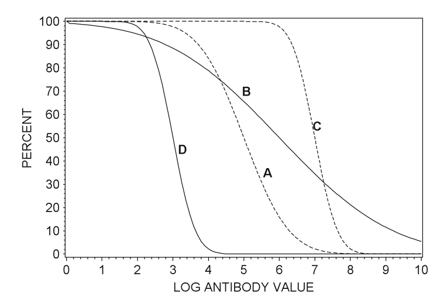

```{r setup, include=FALSE, echo = FALSE,message = FALSE, error = FALSE, warning = FALSE}
knitr::opts_chunk$set(echo = TRUE, fig.width = 10, fig.height = 6)

packages<-c("tidyverse", "kableExtra")

ipak <- function(pkg){
  new.pkg <- pkg[!(pkg %in% installed.packages()[, "Package"])]
  if (length(new.pkg)) 
    install.packages(new.pkg, dependencies = TRUE)
  sapply(pkg, require, character.only = TRUE)
}
ipak(packages)
 
 
setwd(dirname(rstudioapi::getSourceEditorContext()$path))
getwd()
Sys.setlocale("LC_ALL","English")
```


 

# Introduction

## Phases of Vaccine Trials 

Vaccine trials are a critical component of public health, designed to ensure that vaccines are both safe and effective before widespread use. They are uniquely complex compared to other clinical trials due to the preventive nature of vaccines and their administration to healthy populations. Below is a detailed explanation of vaccine trial designs and the challenges they present.

 
Vaccine development typically progresses through several phases:

* **Phase I**: Involves a small group of healthy volunteers to assess safety, determine appropriate dosage, and identify any immediate adverse effects.

* **Phase II**: Expands the participant pool to include individuals representative of the target population, focusing on immunogenicity (the ability to provoke an immune response) and continued safety assessment.

* **Phase III**: Encompasses large-scale trials with thousands to tens of thousands of participants to evaluate the vaccine's efficacy in preventing the disease and to monitor for rare side effects. Given that many vaccinated individuals may not be exposed to the pathogen, large sample sizes are necessary to detect statistically significant differences between vaccinated and unvaccinated groups.

* **Post-Marketing Surveillance (Phase IV)**: After regulatory approval, ongoing monitoring continues to detect any long-term or rare adverse events in the general population.

**Safety Considerations**

Safety is paramount in vaccine trials due to their administration to healthy individuals, including vulnerable populations like children and the elderly. Safety assessments occur at all trial phases, with particular emphasis during Phase III and post-marketing surveillance. Regulatory agencies employ systems such as the Vaccine Adverse Event Reporting System (VAERS) and the Vaccine Safety Datalink (VSD) to monitor and evaluate adverse events continuously.


To respond to the COVID-19 emergency, traditional timelines were compressed. Normally, vaccine development might take ten years, but several COVID-19 vaccines reached approval in just 18 to 20 months. This was achieved through parallel trial phases, early manufacturing scale-up, and the integration of computational tools. For example, Moderna's mRNA vaccine entered Phase I trials within ten weeks of the virus genome being published.


## Challenges of Vaccine Trial Design 

Vaccine trials are uniquely challenging because they aim to prevent diseases that may occur infrequently. This rarity of cases (e.g., a 1% attack rate) means that trials must involve very large sample sizes—often tens of thousands of participants—to accumulate enough disease events to properly assess efficacy. Unlike therapeutics, which are given only to sick patients, vaccines are administered to healthy individuals across a wide population, making safety concerns even more critical.

Due to this wide rollout, there is a strong emphasis on ensuring both short- and long-term safety. Vaccine trials are longer and more extensive than many other types of trials, often including post-marketing surveillance to detect rare adverse events that may not appear during the Phase III trial. Safety is assessed continuously throughout the process.

The design of vaccine trials also introduces unique terminology and methods. While concepts like attack rate, incidence, and vaccine efficacy are standard in vaccine studies, they often parallel familiar statistical concepts like proportions and time-to-event analysis found in other areas. The language around vaccine studies can seem specialized but usually maps back to more general clinical trial methodology.

**Challenges in Vaccine Trials**

Several challenges are inherent to vaccine trials:

* **Large Sample Sizes and Long Durations**: To detect rare adverse events and ensure statistical power, vaccine trials often require large participant numbers and extended follow-up periods, sometimes spanning 5-10 years.

* **Endpoint Selection**: Determining appropriate endpoints is complex. Endpoints may include disease incidence, severity, or composite measures combining multiple outcomes. The choice impacts trial design and statistical analysis.

* **Adaptive Designs**: While adaptive trial designs can offer flexibility and efficiency, their application in vaccine trials is limited due to the emphasis on safety and the complexity of implementing changes mid-trial.


 


# Statistical Methods for the Analysis of Immunogenicity Data

Historically, vaccine immunogenicity studies have primarily focused on evaluating the humoral immune response, specifically through the measurement of serum antibody levels. In recent years, however, there has been a growing emphasis on also assessing cellular immunity in such trials. Despite this development, the use of cellular immunity endpoints in vaccine trials largely remains at the investigational stage.

To summarize both humoral and cellular immunity data, four standard statistical measures are commonly used:

1. **Geometric Mean Response** (GMR)
2. **Geometric Mean Fold Increase** (GMFI)
3. **Seroprotection Rate**
4. **Seroconversion Rate**

The **GMR** and **Seroprotection Rate** provide absolute measures of immunogenicity, while the **GMFI** and **Seroconversion Rate** capture within-individual increases following vaccination. 


## Geometric Mean Titres and Concentrations

### Geometric Mean Titres (GMT) and Geometric Mean Concentrations (GMC)

Post-vaccination immunogenicity data, whether for humoral or cellular responses, tend to exhibit right-skewed distributions. However, applying a logarithmic transformation to these values often results in an approximately normal distribution, which allows the use of standard parametric statistical methods. For interpretability, the geometric means and confidence intervals are computed by taking the antilog of estimates derived from log-transformed data.

The **Geometric Mean (GM)** is the standard summary statistic for immunogenicity data:

For a set of *n* independent and identically distributed (i.i.d.) immunogenicity values *v₁, v₂, ..., vₙ*, the geometric mean is defined as:

$$
GM = (v_1 \times v_2 \times \ldots \times v_n)^{1/n}
$$

Alternatively, it can be expressed as:

$$
GM = \exp \left( \frac{1}{n} \sum_{i=1}^n \log_e v_i \right)
$$

The logarithmic base used for the transformation can vary, commonly log₂ or log₁₀, but consistency is crucial. For example, when log₁₀ is used:

$$
GM = 10^{\frac{1}{n} \sum_{i=1}^n \log_{10} v_i}
$$

---

### Geometric Mean Titres for Antibody Dilutions

In immunogenicity studies using antibody titres based on reciprocal two-fold serial dilutions (e.g., 1:8, 1:16, 1:32, etc.), a convenient log transformation is applied:

$$
u_i = \log_2 \left( \frac{t_i}{D/2} \right)
$$

Where *tᵢ* is the observed titre and *D* is the lowest dilution tested. The transformed *uᵢ* values correspond to dilution steps (1, 2, 3, etc.), simplifying interpretation. The geometric mean of these titres is then:

$$
GM = \left( \frac{D}{2} \right)^{\frac{1}{n} \sum_{i=1}^n u_i}
$$

**Illustrative Example: Rubella HI Test**

Rubella virus infection, while often mild in adults, poses significant risks during pregnancy. A haemagglutination inhibition (HI) test is frequently performed to assess immunity. Consider HI titres with a lowest tested dilution of 1:8, resulting in possible titres of 8, 16, 32, 64, etc.

Using the standard log₂ transformation:

* A titre of 8 becomes 1
* 16 becomes 2
* 32 becomes 3
* 64 becomes 4

For titres 8, 8, 16, 32, 64, the GMT is computed as:

$$
GMT = 4 \times 2^{(1+1+2+3+4)/5} = 18.379
$$

In this transformation, differences in log-transformed values directly correspond to dilution steps, simplifying interpretation.

---

### Geometric Standard Deviation (GSD) and Confidence Intervals

The **Geometric Standard Deviation (GSD)** is derived by taking the exponential of the standard deviation (SD) of the log-transformed data:

$$
GSD = \exp(SD)
$$

This allows calculation of the two-sided 95% confidence interval for the underlying geometric mean (denoted as *ē*) using:

$$
LCL_e = \frac{GMT}{GSD^{t_{n-1, 1-\alpha/2} / \sqrt{n}}}  
$$

$$
UCL_e = GMT \times GSD^{t_{n-1, 1-\alpha/2} / \sqrt{n}}
$$

Where:

* *tₙ₋₁,₁₋α/2* is the corresponding percentile of the Student’s t-distribution with *(n-1)* degrees of freedom.

**Rubella HI Test Example: Confidence Interval Calculation**

Continuing the Rubella example:

* Sample SD of the log-transformed titres: **0.904**
* GSD = **exp(0.904) = 2.469**
* Using *t₄, 0.975 = 2.776* for a 95% confidence interval

The lower and upper confidence limits for the GMT are calculated as:

$$
LCL_e = \frac{18.379}{2.469^{(2.776/\sqrt{5})}} = 5.98  
$$

$$
UCL_e = 18.379 \times 2.469^{(2.776/\sqrt{5})} = 56.4  
$$

### Single Vaccine Group

When immunogenicity values (*vi*) are log-transformed as *ui = logₑ(vi)* and the *ui* values follow a normal distribution with mean **μ** and variance **σ²**, the **arithmetic mean** of the *ui* values serves as a point estimate for μ. Consequently, the **geometric mean titre (GMT)** or **geometric mean concentration (GMC)** is estimated as:

$$
GMT = e^{\bar{u}}
$$

The distribution of the original *vi* values is thus log-normal.

Since the *ui* values are normally distributed, confidence intervals for μ can be calculated using the one-sample *t*-test. The antilog of these limits provides the corresponding confidence intervals for the geometric mean **e**

It is important to note that the **mean** of the log-normal distribution (expected value of *vi*) is not **e**, but:

$$
E(vi) = e^{μ + \frac{σ^2}{2}}
$$

A key property of the log-normal distribution is that its **geometric mean** and **median** are both equal to **e**.

**Example Single Vaccine Group**

Consider six IFN-γ (Th1-type) immunogenicity measurements in IU/L:
**3.51, 9.24, 13.7, 35.2, 47.4, 57.5**

Their natural logarithms are:
**1.256, 2.224, 2.617, 3.561, 3.859, 4.052**

The arithmetic mean of these log-transformed values is **2.928**, with a standard error of **0.444**. The geometric mean concentration (GMC) is thus:

$$
GMC = e^{2.928} = 18.7 \, \text{IU/L}
$$

Using a two-sided 95% confidence interval for μ with *t*(0.975, 5) = 2.571:

$$
\text{Lower limit} = 2.928 - 2.571(0.444) = 1.786  
\text{Upper limit} = 2.928 + 2.571(0.444) = 4.070  
$$

Exponentiating these limits yields the 95% confidence interval for the underlying geometric mean:

$$
e^{1.786} = 5.97 \quad \text{and} \quad e^{4.070} = 58.6  
$$

As expected with geometric means, these confidence intervals are asymmetrical.

 
### Two Vaccine Groups

When comparing two vaccine groups, statistical inference is performed using a **two-sample *t*-test** applied to the log-transformed immunogenicity values. Point and interval estimates for the difference in means **δ = μ₁ - μ₀** can be transformed back to estimates for the **geometric mean ratio (GMR)**, representing the ratio of the geometric means of the two groups:

$$
GMR = \frac{GM₁}{GM₀} = e^{\bar{u₁} - \bar{u₀}}
$$

Where:

* *GM₁* is the geometric mean of the investigational vaccine group
* *GM₀* is the geometric mean of the control group
* *ū₁*, *ū₀* are the means of the log-transformed values for the respective groups

The *p*-value from the two-sample *t*-test testing **δ = 0** corresponds to a test of whether **GMR = 1**, i.e., whether the geometric means differ significantly between the groups.

**Example: Two Vaccine Groups**

Assume the six IFN-γ values mentioned earlier are compared to a second group of six values, with:

* Arithmetic mean of log-transformed values: **2.754**
* Standard error: **0.512**

The geometric mean concentration of the control group is:

$$
GMC₀ = e^{2.754} = 15.7 \, \text{IU/L}
$$

The geometric mean ratio (GMR) comparing the investigational group to the control group is:

$$
GMR = \frac{18.7}{15.7} = e^{2.928 - 2.754} = 1.19  
$$

The estimated standard error of the difference is **0.677**. The 95% confidence interval for the underlying GMR is:

$$
\text{Lower limit} = e^{1.19 - 2.228(0.677)} = 0.73  
$$

$$
\text{Upper limit} = e^{1.19 + 2.228(0.677)} = 14.9  
$$

This provides an asymmetric confidence interval for the ratio of geometric means, consistent with the properties of log-normal distributions.


## Geometric Mean Fold Increase

In some infectious disease settings, participants may already have measurable pre-vaccination immune responses due to previous infections or vaccinations. A typical example is **influenza**, where most adults have been exposed to influenza viruses during their lifetime. In such cases, post-vaccination immune responses reflect both the effect of vaccination and existing pre-vaccination immunity.

For these scenarios, an alternative to geometric mean titres (GMT) or concentrations (GMC) is the **Geometric Mean Fold Increase (gMFI)**, also referred to as **Mean Fold Increase** or **Geometric Mean Fold Rise**, which specifically quantifies the relative increase in immune response following vaccination at the individual level.

### Single Arm

**Definition and Calculation**

For each individual:

$$
f_i = \frac{v_{post}}{v_{pre}}
$$

Where:

* *vₚᵣₑ* = pre-vaccination immunogenicity value
* *vₚₒₛₜ* = post-vaccination immunogenicity value
* *fᵢ* = fold increase

The **Geometric Mean Fold Increase (gMFI)** across *n* individuals is calculated as:

$$
gMFI = \exp \left( \frac{1}{n} \sum_{j=1}^{n} \log_e f_{ij} \right)
$$

Alternatively, if both pre- and post-vaccination data are available for all subjects:

$$
gMFI = \frac{GM_{post}}{GM_{pre}}
$$

Where:

* *GMₚₒₛₜ* = geometric mean of post-vaccination values
* *GMₚᵣₑ* = geometric mean of pre-vaccination values

**Note:** This relationship holds only if both pre- and post-vaccination data are available for all individuals.

---

**Example-Single Group gMFI Calculation**

In an influenza vaccine trial, pre- and post-vaccination antibody titres for six subjects are recorded as:

| Subject | Pre-Vaccination | Post-Vaccination | Fold Increase |
| ------- | --------------- | ---------------- | ------------- |
| 1       | 5               | 40               | 8             |
| 2       | 5               | 80               | 16            |
| 3       | 10              | 160              | 16            |
| 4       | 10              | 320              | 32            |
| 5       | 20              | 80               | 4             |
| 6       | 20              | 640              | 32            |

The calculated statistics are:

* **GMₚᵣₑ** = 10.0
* **GMₚₒₛₜ** = 142.5
* **gMFI** = 14.25
* **Geometric Standard Deviation (GSD)** = 2.249

The confidence intervals for the gMFI can be calculated using the same formulas applied to geometric means, as described earlier.

---

### Comparison of Two Groups: gMFI and gMFR

For comparing two vaccine groups, the **Geometric Mean Fold Ratio (gMFR)** is used, representing the ratio of fold increases between the groups.

The relationship between gMFR and geometric means is expressed as:

$$
gMFR = \frac{gMFI_1}{gMFI_0} = \frac{GMR_{post}}{GMR_{pre}}
$$

Where:

* *gMFI₁*, *gMFI₀* = gMFI of investigational and control groups, respectively
* *GMRₚₒₛₜ* = geometric mean ratio of post-vaccination values
* *GMRₚᵣₑ* = geometric mean ratio of pre-vaccination values

 

In randomized trials with no significant baseline imbalance (i.e., *GMRₚᵣₑ ≈ 1*), the gMFR effectively approximates *GMRₚₒₛₜ*. Thus, the analysis of fold increases yields results nearly identical to those obtained from analyzing post-vaccination immunogenicity values alone.

---

**Example: Two Group Comparison**

**Experimental Group:**

| Pre-Vaccination | Post-Vaccination | Fold Increase |
| --------------- | ---------------- | ------------- |
| 5               | 40               | 8             |
| 5               | 80               | 16            |
| 10              | 80               | 8             |
| 10              | 80               | 8             |

**Control Group:**

| Pre-Vaccination | Post-Vaccination | Fold Increase |
| --------------- | ---------------- | ------------- |
| 5               | 80               | 16            |
| 5               | 80               | 16            |
| 10              | 80               | 8             |
| 10              | 160              | 16            |

The calculated statistics are:

* *GMₚᵣₑ* = 7.1 (both groups)
* *GMₚₒₛₜ* Experimental = 67.27
* *GMₚₒₛₜ* Control = 95.14
* *gMFI₁* = 9.51
* *gMFI₀* = 13.45
* *gMFR* = 1.4
* *GMRₚₒₛₜ* = 1.4

The gMFR and GMRₚₒₛₜ are identical due to the absence of baseline imbalance.

**Efficiency Considerations**

When no baseline imbalance exists:

* Using fold increases introduces unnecessary variability because fold increases mathematically involve the difference between log-transformed post- and pre-vaccination values.
* If the correlation between pre- and post-vaccination values is weak (e.g., correlation < 0.5), the variance of fold increases is larger than the variance of post-vaccination values alone.
* As a result, analyses based on fold increases often produce larger *p*-values and wider confidence intervals compared to analyses based on post-vaccination data alone.

### Misconception: Do Fold Increases Correct for Baseline Imbalance?

It is a common but incorrect belief that analyzing fold increases eliminates bias due to baseline imbalance. In reality:

* On the log scale:

$$
\log(f_i) = \log(v_{post}) - \log(v_{pre})
$$

* Change scores (including fold increases) remain correlated with baseline values, often negatively.
* For bioassays, higher pre-vaccination values often result in smaller observed fold increases.
* If there is a baseline imbalance, with one group having lower pre-vaccination values, this group will tend to show artificially inflated fold increases, introducing bias **in favor of the group with lower pre-vaccination values**.

Thus, fold increase analysis does **not** inherently correct for baseline imbalance. The appropriate statistical method for addressing baseline imbalance is **analysis of covariance (ANCOVA)**, which explicitly adjusts for pre-vaccination differences.

## Two Seroresponse Rates

In vaccine clinical trials and immunogenicity studies, it is common to assess the immune response using binary endpoints that reflect the presence or increase of protective antibodies following vaccination. Two widely used binary measures are the *seroprotection rate* and the *seroconversion rate*. Both provide critical information regarding the effectiveness of a vaccine but capture different immunological phenomena.

### 1. Seroprotection Rate

The seroprotection rate is defined as the proportion of vaccinated individuals whose antibody levels reach or exceed a predetermined threshold that is considered to be associated with protection from infection or disease. This threshold is referred to as the **threshold of protection**.

For many infectious diseases, scientific research has identified specific antibody levels that are assumed to provide protection. If an individual’s antibody level is equal to or higher than this threshold after vaccination, the person is classified as *seroprotected*.

For example:

* In **influenza** vaccine studies, an anti-hemagglutinin (anti-HA) antibody titre of **40 or higher** is generally accepted as the threshold for seroprotection.
* For **diphtheria** and **tetanus**, the commonly cited threshold is an anti-diphtheria or anti-tetanus antibody concentration of **0.1 international units per millilitre (IU/ml)**.

The seroprotection rate is thus a binary measure: individuals are either classified as seroprotected or not seroprotected based on their antibody levels. The seroprotection rate expresses the percentage of vaccinated individuals who meet this criterion.

It is important to note that the phrase *associated with protection* does not always imply complete immunity. In many cases, this association indicates a **moderate to high probability** of protection rather than absolute prevention of disease. For instance, in the case of influenza, it is estimated that an anti-HA antibody titre of 40 corresponds to approximately a **50% probability** of being protected against infection. Therefore, while the seroprotection threshold is useful for evaluating vaccine responses, it should not be interpreted as guaranteeing full immunity.

### 2. Seroconversion Rate

The seroconversion rate refers to the proportion of individuals whose antibody status changes in response to vaccination, indicating the development or significant increase of detectable antibodies.

According to **Stedman’s Medical Dictionary**, seroconversion is defined as the appearance of detectable, specific antibodies in the blood as a result of infection or immunization.

An individual's antibody status, also called **serostatus**, is classified as follows:

* **Seronegative**: No detectable antibodies are present.
* **Seropositive**: Detectable antibodies are present.

If a person is seronegative before vaccination and becomes seropositive after vaccination, that individual is considered to have *seroconverted*.

Different studies may apply slightly different definitions of seroconversion, depending on the disease and the vaccine being evaluated.

Examples of seroconversion definitions include:

1. **Absolute Appearance of Detectable Antibodies**

   In a study of a live attenuated human rotavirus vaccine conducted by Vesikari and colleagues, seroconversion was defined as the appearance of serum IgA antibodies to rotavirus at a titre of **20 units per millilitre or higher** in infants who were seronegative at baseline. The proportion of infants who seroconverted varied between **73% and 96%**, depending on the vaccine dose.

2. **Fourfold Rise in Antibody Levels**

   Another common definition of seroconversion is based on a **fourfold increase** in antibody levels following vaccination. This definition is particularly relevant when some individuals may already be seropositive at the time of enrollment.

   For example, in a study evaluating a virus-like particle vaccine for human papillomavirus (**HPV**), Harro and colleagues defined seropositivity as an ELISA antibody titre equal to or greater than the reactivity of a standard pooled serum. Among the 72 female participants, six were seropositive at baseline. In this study, seroconversion was defined as a **fourfold or greater rise** in antibody titre after vaccination.

3. **Combined Definition**

   Many clinical studies, particularly influenza vaccine trials, adopt a combined approach to defining seroconversion. This definition takes into account both baseline serostatus and post-vaccination changes:

   * For individuals with a baseline antibody titre **below 10** (seronegative), seroconversion is defined as reaching a **post-vaccination titre of 40 or higher**, which is consistent with the seroprotection threshold in influenza studies.
   * For individuals with a baseline antibody titre **10 or higher** (seropositive), seroconversion is defined as achieving at least a **fourfold rise** in titre after vaccination.

It is important to highlight that such definitions may vary slightly between studies. For instance, some studies distinguish between becoming seropositive (titre ≥10) and achieving seroprotection (titre ≥40), especially in the context of influenza vaccines.

Regardless of the specific definition applied, seroconversion remains a binary endpoint. Individuals either meet the criteria for seroconversion or they do not. The **seroconversion rate** represents the proportion or percentage of study participants who seroconverted after vaccination.

## Analysis of Proportions

This section discusses statistical methods for analyzing **binary endpoints** in clinical vaccine trials—most notably **seroprotection** and **seroconversion** rates. However, these methods are broadly applicable to other binary outcomes, such as:

* Proportion of subjects reporting local/systemic reactions
* Proportion experiencing adverse vaccine events
* Proportion remaining disease-free post-vaccination

### Single Proportion Analysis
 
To test a null hypothesis about a single proportion (e.g., probability of seroprotection):

* **Distribution**: Use the Binomial Distribution $B(n, \pi)$, where:

  * $n$: number of observations
  * $\pi$: assumed proportion under $H_0$

* **One-sided test**:
  $H_0: \pi = \pi_0$ vs. $H_1: \pi > \pi_0$
  Compute $P(S \geq s \mid \pi_0)$, with $S \sim B(n, \pi_0)$

* **In SAS**: Use `PROBBNML(π; n; m)` to calculate tail probabilities.

To calculate confidence Intervals for a Single Proportion

Three common methods:

1. Clopper–Pearson (Exact)

* Based on binomial tail probabilities
* Conservative: always ≥ nominal coverage (e.g., 95%)

2. Wald Method (Asymptotic)

* Simple, but poor performance near $\pi \approx 0$ or $\pi \approx 1$

3. Wilson Method (Asymptotic)

* Better average coverage than Wald
* Confidence interval obtained by solving a quadratic inequality


### Comparing Two Proportions

Two main comparison metrics:

* **Rate Difference (RD)**: $r_1 - r_0$
* **Rate Ratio (RR)**: $r_1 / r_0$

**Hypothesis Testing**

* Test $H_0: RD = 0$ or $H_0: RR = 1$
* Use:

  * Pearson’s Chi-Square
  * Fisher’s Exact Test (for small samples)
  * Suissa and Shuster Test (exact, more powerful)

To calculate Confidence Intervals

For Rate Difference:

* **Wald-type**:
  $RD \pm z_{\alpha/2} \cdot SE(RD)$

  > Risk of inconsistent test statistic and interval due to differing standard error assumptions.

* **Wilson-type (Miettinen and Nurminen)**:
  Solves for values of RD satisfying:

  $$
  \frac{RD - RD_0}{SE^*(RD_0)} = \pm z_{\alpha/2}
  $$

  Iterative solution using constrained MLEs.

For Rate Ratio:

* **Wald-type (log-transform)**:

  $$
  CI = \exp\left[ \log(RR) \pm z_{\alpha/2} \cdot SE(\log RR) \right]
  $$

* **Wilson-type**:
  Also iterative, using constrained MLEs.
  
  
### Suissa and Shuster Exact Test

The Suissa and Shuster Exact Test is a statistical method for comparing two proportions, such as two groups in a clinical trial (e.g., treatment vs. placebo). Unlike Fisher’s Exact Test, which conditions on the margins (i.e., the row and column totals in a 2x2 contingency table), the Suissa and Shuster test conditions only on the sample sizes of the two groups, not on the number of events observed. This makes it a more flexible and often more powerful test than Fisher’s test, particularly when you want to test hypotheses beyond the standard "proportions are equal."

**Key Characteristics:**

1. **Exact Test**: It does not rely on large-sample approximations. The test remains valid regardless of the sample size.

2. **More Powerful than Fisher’s Test**: Studies have shown that the Suissa and Shuster test typically has greater power, meaning it's more likely to detect a true difference when one exists.

3. **Supports More General Hypotheses**:

   * It can test whether the difference in proportions equals a specific value other than zero (i.e., H₀: RD = Δ₀).
   * It can test whether the relative risk equals a value other than 1 (i.e., H₀: RR = RR₀).
   * Fisher’s test does not support this directly.

4. **Enables Exact Confidence Intervals**: Since it supports testing a range of null hypotheses, it can be used to derive exact confidence intervals by identifying the smallest and largest parameter values that would not be rejected at a given significance level.

**How the Test Works (Conceptually):**

* First, compute a Z-statistic based on your observed data and the hypothesis you're testing. The formula depends on whether you're testing a difference in proportions (risk difference) or a relative risk.

* Then, generate all possible 2x2 contingency tables for the fixed sample sizes. For each of these tables, calculate the same type of Z-statistic.

* The p-value is determined by finding the maximum tail probability over a range of assumed null parameter values (e.g., for RD or RR). This is why it’s called an "exact" test—it integrates over possible nuisance parameter values rather than assuming a fixed one.

* In practice, the test is implemented by discretizing the possible values of the nuisance parameter (e.g., from 0 to 1 in small steps like 0.001) and computing the p-value at each step.


**Procedure (Chan, 1998):**

1. Compute Z-statistic under null
2. Enumerate all 2x2 tables and calculate $Z_{ij}$
3. Compute P-value:

   $$
   P = \max_{\pi_0 \in D} \Pr(|Z| \geq |Z_{obs}| \mid \pi_0)
   $$

> *Where $D$ is the domain of nuisance parameter $\pi_0$, divided into small increments.*
 

**Why it is Useful in Vaccine Trials or Safety Studies:**

* Vaccine efficacy trials often deal with low event rates (e.g., infection rates), where approximations like the chi-square test or Wald test may perform poorly. The Suissa and Shuster test avoids these problems.

* It remains accurate when group sizes are small or event rates are extreme (close to 0 or 1).

**Example Use:**

Imagine you conduct a study with 15 participants in each group. The vaccine group has 7 people who develop illness, while the placebo group has 12. Using Fisher’s exact test, the two-sided p-value might be around 0.128. But using the Suissa and Shuster test, the p-value might be lower (e.g., 0.068), suggesting a stronger signal.

This difference in power can be crucial when working with small sample sizes or in early-phase clinical trials.
 
 
| Method                  | Use Case               | Pros                 | Cons                         |
| ----------------------- | ---------------------- | -------------------- | ---------------------------- |
| **Clopper–Pearson**     | Single proportion      | Exact, conservative  | Wider intervals              |
| **Wald**                | Single/two proportions | Simple               | Poor performance near 0 or 1 |
| **Wilson**              | Single/two proportions | Good coverage        | Slightly more complex        |
| **Miettinen–Nurminen**  | Rate diff./ratio CI    | Accurate, asymptotic | Needs iteration              |
| **Suissa–Shuster**      | Exact comparison       | Powerful, exact      | Computationally intensive    |
| **Jewell’s Correction** | RR bias correction     | Effective            | No gain in CI coverage       |


## Multiple Co-Primary Endpoints and the Intersection–Union Test

In clinical vaccine trials, researchers often need to assess **more than one key outcome**, or **co-primary endpoints**, to determine whether a vaccine is effective. These endpoints may reflect different aspects of vaccine performance—such as protection against various disease strains, or different types of immune response (e.g., antibody levels and seroprotection).
 
Co-primary endpoints are **multiple main outcomes that must all be met** to declare the trial a success. For example:

* A **combination vaccine** targeting multiple serotypes (e.g., pneumococcal vaccine for 10 serotypes) might require showing superiority against **each serotype** individually. That leads to **10 co-primary endpoints**.
* A vaccine might need to prove superiority on **both**:

  * **Seroprotection rate** (the proportion of subjects above a protective antibody threshold),
  * and the **geometric mean response** (a measure of average immune strength).

In these cases, a statistically sound method is required to **account for multiple testing**, which increases the chance of false positives.


---

**The Multiplicity Problem**

When testing multiple hypotheses (i.e., each endpoint), the chance of **at least one false positive** increases. Simply using a significance level (α) of 0.05 for each endpoint will no longer maintain an overall type I error rate of 5%.

The **Intersection–Union Test (IU test)** is a conservative but commonly used method to address this issue in regulatory trials.

* For each endpoint (e.g., each serotype or measure), define a **null hypothesis** $H_{0i}$: the experimental vaccine is not superior to control on endpoint *i*.
* Each null hypothesis is tested **individually at significance level α** (usually 0.05).
* **Only if all** individual hypotheses are rejected, can the overall conclusion of vaccine superiority be claimed.

**Mathematically**:

* Let there be *k* co-primary endpoints.
* The **overall null hypothesis** is the **union** of all individual nulls:

  $$
  H_0 = H_{01} \cup H_{02} \cup \cdots \cup H_{0k}
  $$
* The **alternative hypothesis** is their **intersection**:

  $$
  H_1 = H_{11} \cap H_{12} \cap \cdots \cap H_{1k}
  $$
* This is why it's called the **Intersection–Union Test**: to reject the union of nulls, all individual nulls must be rejected (i.e., prove all endpoints simultaneously).

---

**Advantages of the IU Test**

* **Simplicity**: Easy to implement and explain, even to non-statistical stakeholders.
* **No adjustment to α is required** because the approach itself controls the family-wise error rate by construction.

---

**Disadvantages of the IU Test**

* **Conservativeness**: The IU test is often **too strict**, meaning it may **fail to detect true effects**, especially if endpoints are **not strongly correlated**.

  * If endpoints are **independent**, the overall significance level becomes $\alpha^k$, which is very small for large *k*.
  * For example, with α = 0.05 and 5 endpoints, the joint level is $0.05^5 = 3.1 \times 10^{-7}$.

---

**Alternatives to IU: The Min Test**

When the outcomes (endpoints) are assumed to follow a **multivariate normal distribution**, an alternative is the **Min Test**, which is:

* Based on the **minimum** of the individual test statistics:

  $$
  Z_{\text{min}} = \min(Z_1, Z_2, ..., Z_k)
  $$
* More **statistically powerful** than the IU test under some conditions.
* **Problem**: The test distribution depends on the **covariance structure** of the endpoints, making it **computationally complex** and **hard to generalize**.

---

**Conclusion**

The IU Test is widely accepted in regulatory settings due to its **simplicity and conservativeness**, but it may **lack statistical power**, especially in cases with many co-primary endpoints. More powerful alternatives exist, such as the Min Test or other **multivariate modeling approaches**, but they require **more assumptions and computational effort**.

Ultimately, the choice depends on **regulatory expectations**, **study design**, and the **importance of detecting modest effects across multiple endpoints**.
* **Chuang-Stein et al.** discuss power and strategy for designing trials with multiple primary endpoints.
* **Senn and Bretz** explore the implications of multiple testing on drug development and offer insights into alternative designs.


## Reverse Cumulative Distribution Plot


The Reverse Cumulative Distribution (RCD) Plot is a graphical tool commonly used to display and compare the distribution of immunogenicity values between different vaccine groups. This visualization is particularly useful in vaccine trials where understanding the entire distribution—not just summary statistics like the mean or median—is crucial.

**Concept and Axes**

* **X-axis**: Represents immunogenicity values, usually plotted on a logarithmic scale.
* **Y-axis**: Indicates the percentage of subjects who have an immunogenicity value greater than or equal to the corresponding x-value.

This format means that the plot shows the *reverse* of the usual cumulative distribution. Instead of showing the proportion of subjects *below* a certain value, it shows the proportion *above*.

**Shape and Interpretation**

* The RCD curve starts at **100%** and decreases from left to right.
* The curve reflects the **log-transformed immunogenicity values**.

Different curve shapes imply different distribution characteristics:

* **Steep Middle Section (Curve A)**: Indicates a symmetric distribution with low variability. Most subjects cluster around the mean.
* **Flatter Middle Section (Curve B)**: Implies high variability among subjects’ immune responses.
* **Rectangular Shape (Curve C)**: Reflects a right-skewed distribution. Most subjects have high immune responses with a sharp drop at the end.
* **Left-Skewed Shape (Curve D)**: Most subjects have low responses; the curve declines sharply early and flattens toward the end.

**Comparing Groups Using RCD Curves**

* If one vaccine’s RCD curve lies entirely **above** another’s and they do **not intersect** (e.g., A vs. D), then the former induces higher immune responses at **every percentile**.
* If the curves **intersect**, interpretation becomes more nuanced:

  * One vaccine may produce **more high and low responses**, while the other is more consistent.
  * If the **point of intersection** is **above 50%**, it favors the curve that descends later (e.g., B over A), meaning more than half of the subjects in that group achieved higher immunogenicity.





# Efficacy Analysis


## Assessing Vaccine Efficacy


1. **Definition and Formula**
   Vaccine Efficacy (VE) measures how well a vaccine protects individuals from disease. It is defined as:

   **VE = 1 - Risk Ratio (RR)**
   Where:

   * **RR (Risk Ratio)** = ARV / ARU

     * **ARV**: Attack rate in vaccinated group
     * **ARU**: Attack rate in unvaccinated (control/placebo) group

   Interpreting VE:

   * The range of VE is from negative infinity to 1.
   * A VE of **1** (or 100%) means **complete protection** — no cases occurred in the vaccinated group.
   * A VE of **0** means **no effect** — the vaccine does not reduce the risk.
   * A **negative VE** suggests harm (higher risk in the vaccinated group than unvaccinated).

2. **Multiple Testing Approaches**
   The choice of statistical method to estimate VE depends on how disease occurrence is modeled:

   * **Counts**: Number of events (e.g., infections) across follow-up time.
   * **Proportions**: Percentage of individuals infected in each group.
   * **Time-to-Event**: Time from vaccination to disease onset (e.g., using survival analysis).

3. **VE as Primary Endpoint**
   In vaccine trials, VE is typically the **primary efficacy endpoint**, alongside key **safety endpoints**.

   * Trials may define a “case” not just based on lab-confirmed infection, but also by **symptom presentation**.
   * This is particularly relevant when mild/asymptomatic cases are common or underreported.


## Vaccine Efficacy Hypothesis into Binomial Testing Framework

**Goal:**
Compare two hypotheses:

* **Null Hypothesis (H₀): VE ≤ 0.3** (vaccine provides low or no protection)
* **Alternative Hypothesis (H₁): VE = 0.6** (vaccine provides strong protection)

**Step 1: Define Probabilities**

* Let **πₚₗₐcₑbₒ** be the probability of getting symptomatic COVID-19 in the **placebo group**
* Let **πᵥₐccᵢₙₑ** be the same for the **vaccine group**

**Step 2: Conditional Probability for Vaccine Case**
Derive the probability that a **random case** (symptomatic COVID-19) comes from the vaccine group, under a given hypothesis (VE):

$$
P_{H_x}(Vaccine\ Case\ |\ Case) = \frac{π_{Placebo}(1 - VE)}{π_{Placebo}(1 - VE) + π_{Placebo}} = \frac{0.08(1 - VE)}{0.08(1 - VE) + 0.08}
$$

**Step 3: Plug in VE under each hypothesis**

* Under **H₀ (VE = 0.3)**, the conditional probability becomes:

  $$
  P_{H₀} = \frac{0.08(1 - 0.3)}{0.08(1 - 0.3) + 0.08} = 0.4118
  $$
* Under **H₁ (VE = 0.6)**:

  $$
  P_{H₁} = \frac{0.08(1 - 0.6)}{0.08(1 - 0.6) + 0.08} = 0.2857
  $$

**Step 4: Modeling the Number of Vaccine Cases**
Assume:

* **N** is the total number of symptomatic cases observed.
* **V** is the number of those that are in the vaccine group.

Then:

* **V \~ Binomial(N, Pₕₓ)** depending on which hypothesis is true.
* **1 – β = P(V ≥ c | H₁) = 0.9**, meaning we want **90% power** to detect a VE of 0.6 if it’s true.


## Adjusting for Imbalance in Pre-Vaccination State

**Imbalance in Pre-Vaccination State**

In some vaccine studies, participants already have **non-zero antibody levels before vaccination**—this is common in diseases requiring repeated immunizations, such as tetanus or pertussis. When this happens, the **post-vaccination antibody level** reflects both the **effect of the vaccine** and the **pre-existing immunity**, which complicates comparisons between vaccine groups.

If there’s an imbalance in pre-vaccination levels between groups, then **any difference in post-vaccination values** might partly be due to this initial difference—not the vaccine. In such cases, the vaccine’s effect may be **overestimated**.

A common but flawed solution is to analyze **fold increases** (post/pre ratios). However, this doesn’t solve the problem. If **pre- and post-vaccination levels are positively correlated**, then higher pre-vaccination values predict both:

* higher post-vaccination values, and
* **lower fold increases** (because the baseline is larger).

This means that analyzing fold increases can **introduce bias** in the opposite direction.


Though **statistical theory doesn’t require balanced baselines**, correcting for imbalances **increases credibility**. Randomization ensures balance *on average*, but imbalances still arise due to chance.

---

**Adjusting for Baseline Imbalance**

Two major methods are:

1. **Stratification**:

   * Participants are grouped into strata based on baseline values.
   * In clinical practice, *pre-randomization stratification* is rare due to logistical challenges (e.g., needing two visits: one for blood draw and one for randomization).
   * A practical alternative is **post-randomization stratification**, done at the analysis stage—often using **quartiles** of baseline values.

2. **Analysis of Covariance (ANCOVA)**:

   * Adjusts for baseline differences by modeling post-vaccination values **as a function of pre-vaccination levels**.
   * This method assumes **parallel regression lines** for each group and estimates the treatment effect as the **vertical gap between these lines**.

---

ANCOVA models the relationship between:

* **Y**: log-transformed post-vaccination antibody level
* **X**: log-transformed pre-vaccination level

Using the model:
**Y = β₀ + β₁x + ε**

Here:

* β₀ is the intercept (mean post-vaccination level for seronegative individuals),
* β₁ is the slope (how much the log-post level increases with each log-pre unit),
* ε is the error term.

The log-transformed outcome is used to maintain normality and allow interpretation in terms of **geometric means**.

---

**Addressing Heteroscedasticity**

Usually, ANCOVA assumes **constant variance** (homoscedasticity). But **variance decreases as pre-vaccination levels increase**—called **heteroscedasticity**. Ignoring this can lead to **incorrect standard errors and p-values**.

Solution: Model the variance as a function of **x** (the pre-vaccination value). One such model:

**σ²ₓ = σ² (1 + c₁x + c₂x²)**
An alternative (easier to fit in software):

**σ²ₓ = σ² exp(C₁x + C₂x²)**

This model guarantees non-negative variance and gives stable estimates.

SAS Code to model heteroscedasticity:

```sas
proc mixed;
model y = x / solution;
repeated / local=exp(x x2);
run;
```

This outputs estimates for the regression line and the variance model. Comparing models under homoscedasticity vs heteroscedasticity shows:

* **Slope and intercept** are slightly different.
* **Standard errors** are more accurate under heteroscedasticity.
* **Seronegative-only estimates** are less precise due to smaller sample size.


## Equivalence and Noninferiority Vaccine Trials

### Equivalence and Noninferiority Trials with a Geometric Mean Response

In many vaccine trials, the **geometric mean** of antibody levels (titre or concentration) is used as the outcome. The main parameter of interest is the **geometric mean ratio (GMR)**:

 **θ = e₁ / e₀**

Where:

* **e₁** = geometric mean in the investigational group
* **e₀** = geometric mean in the control group

If you log-transform the data, equivalence in terms of GMR **θ** translates into equivalence in terms of the **difference Δ** of the log-transformed means:

 **Δ = log(e₁) − log(e₀) = log(θ)**

So, if your equivalence range for **θ** is \[1/δ, δ], then your equivalence range for **Δ** is \[−log(δ), +log(δ)]. The **FDA/CBER** often recommends using **0.67 to 1.5** as a standard equivalence margin for GMRs.

---

Example: Combination Hepatitis A and B Vaccine Trial

* **Design**: Combination vaccine vs. separate monovalent vaccines
* **Sample size** (per protocol): 264 (combination), 269 (monovalent)

**Hepatitis B (Anti-HBs):**

* **Geometric means**:
   Combination: 2099
   Monovalent: 1871
   GMR = 2099 / 1871 = **1.12**

* **Standard deviation of log titres**:
   log(6.8) = 1.92, log(9.5) = 2.25 → pooled SD = 2.09

* **Standard error of difference**:
   SE = 2.09 × √(1/264 + 1/269) = 0.18

* **Test statistic for equivalence**:
   Equivalence margin (log scale) = ±log(1.5) = ±0.41
   Observed difference = log(2099) − log(1871) = 7.65 − 7.53 = 0.12
   Z\_EQ = (0.41 − |0.12|) / 0.18 = 1.61 → p = 0.054 (not significant)

* **95% CI for log(θ)**:
   0.12 ± 1.964 × 0.18 = \[−0.23, 0.47]
   Exp back to θ scale → CI for GMR = \[0.79, 1.60] → does **not** lie within \[0.67, 1.5]

 **Conclusion**: Equivalence **not** demonstrated.

---

**Hepatitis A (Anti-HAV):**

* **Geometric means**:
   Combination: 4756
   Monovalent: 2948
   GMR = 1.61

* **Log means**:
   log(4756) = 8.47, log(2948) = 7.99
   SDs: log(3.1) = 1.13, log(2.5) = 0.92 → pooled SD = 1.03
   SE = 0.09

* **Lower bound of CI for Δ (noninferiority test)**:
   Δ = 8.47 − 7.99 = 0.48
   Lower bound = 0.48 − 1.964 × 0.09 = 0.30
   Back-transformed: exp(0.30) = **1.35**

 **Conclusion**: Lower bound > 0.67 → **noninferiority** confirmed


 
### Equivalence and Noninferiority with Seroresponse Rates

When the outcome is a **seroconversion rate** or **seroprotection rate** (i.e., a binary outcome), the parameter of interest is the **risk difference (RD)**.

* **Equivalence**: Two-sided CI for RD must lie within ±margin
* **Noninferiority**: One-sided CI lower bound must be above −margin
* **Margins**: Common values are ±5% or ±10%

---

**Example (Anti-HAV Seroconversion Rates):**

* **Observed rates**:
   Combination: 267 / 269 = 0.993
   Monovalent: 263 / 264 = 0.996
   Risk difference = 0.993 − 0.996 = **−0.003**

* **95% CI for RD**: \[−0.023, +0.014]
   Equivalence margin = \[−0.05, +0.05]

 **Conclusion**: CI lies within margin → **equivalence confirmed**

---

**SAS Implementation**

To perform the **TOST (Two One-Sided Tests)** approach using the **Wilson score method**, use this code:

```sas
proc freq;
  table vaccine*seroconverted /
  riskdiff(equivalence method=fm margin=0.05) alpha=0.025;
run;
```

* The output will give **two P-values** (one for each one-sided test).
* If both are <0.025, **equivalence is concluded**.
* You can use trial-and-error with `margin=` to find exact CI bounds.

 
## Vaccine Lot Consistency Trials

Before licensing a vaccine, **regulatory agencies** like the FDA (CBER) and EMA require proof that **different lots (batches)** of the vaccine induce **consistent immunogenicity**. This is evaluated via **lot consistency trials**, which are a type of **equivalence study**.

Trial Design

* Three **consecutively produced** vaccine lots are used.
* Participants are **randomly assigned** to one of the three lots.
* After vaccination, **antibody titers** are measured.
* **Lot consistency is demonstrated** if all **pair-wise comparisons** of post-vaccination **geometric mean titers (GMTs)** lie within a **predefined equivalence range**.
 

| Method              | Type            | Key Feature                               | Decision Rule         |
| ------------------- | --------------- | ----------------------------------------- | --------------------- |
| Confidence Interval | Estimation      | Requires 3 pairwise GMR CIs within margin | CI ∈ \[lower, upper]  |
| Wiens & Iglewicz    | Hypothesis Test | Uses min Z-statistic across pairs         | Zmin > critical value |

Both methods are valid and often give similar conclusions. The **CI method** is simpler and more common. The **Wiens & Iglewicz test** is more formal but needs careful consideration of sample size to control Type I error.

 
### Confidence Interval (CI) Method

The most common method involves calculating **two-sided 95% confidence intervals** for all **three pairwise geometric mean ratios (GMRs)**.

**Conclusion:**
If **all three** CIs are entirely within the pre-specified **equivalence margin**, lot consistency is declared.

**Example – Influenza Vaccine Trial**

* **Three lots** (n = 123, 123, 117)
* **GMTs** for A-H3N2 strain:

  * Lot #1: 192.9 (mean log titer = 5.27)
  * Lot #2: 162.2 (mean log titer = 5.02)
  * Lot #3: 202.5 (mean log titer = 5.34)
* **Pooled SD**: \~1.585
* **Equivalence margin** (in GMR): 0.35 to 2.83

Calculations (example: Lot #2 vs Lot #1):

* Difference in log means: 5.02 − 5.27 = −0.25
* Standard error:
  √(1.585² × 2 / 123) ≈ 0.203
* CI for difference:
  −0.25 ± 1.97 × 0.203 → \[−0.648, 0.148]
* Exponentiating → GMR CI: \[0.638, 1.108]

**Results for all pairs**:

* Lot #2 vs Lot #1: \[0.638, 1.108]
* Lot #3 vs Lot #1: \[0.796, 1.384]
* Lot #3 vs Lot #2: \[0.944, 1.651]

**Conclusion**: All three intervals fall within \[0.35, 2.83] → **Lot consistency confirmed**.
 

### Wiens and Iglewicz Test

This method treats lot consistency as a **formal hypothesis test**:

**Hypotheses:**

* **H0**: At least one pairwise difference in log means ≥ equivalence margin (in absolute value)
* **H1**: All pairwise differences in log means < equivalence margin

**Test Statistic:**

For each pairwise comparison (i, j), define:

* Difference: Dij = x̄j − x̄i
* SE of Dij: SE(Dij)
* Equivalence margin: δ (in log-scale)

Then compute:

 **Zmin = min over pairs of { (δ − |Dij|) / SE(Dij) }**

* Zmin is a **one-sided** test statistic.
* If Zmin exceeds the critical value (e.g., z₀.975 = 1.96), **reject H0** → lot consistency.

**Example (continued):**

* Differences:

  * D12 = −0.25
  * D13 = 0.07
  * D23 = 0.32
* SEs:

  * SE(D12) ≈ 0.202
  * SE(D13) ≈ 0.203
  * SE(D23) ≈ 0.205
* δ = log(2.83) ≈ 1.5

Then:

Zmin = min of

* (1.5 − 0.25)/0.202 ≈ 6.19
* (1.5 − 0.07)/0.203 ≈ 7.03
* (1.5 − 0.32)/0.205 ≈ 5.76

**Zmin = 5.76** → exceeds critical value → **reject H0** → lot consistency.

---

**Type I Error Control**

The Wiens & Iglewicz test is **not conservative** by default. To ensure Type I error is controlled, the sample size must be sufficiently large relative to δ/σ (equivalence margin to SD ratio).

Rule of thumb (based on equation 6.4):

 **n > 50 / (δ / σ)²**

Example:

* If δ = 1.5, σ = 1.6 → δ/σ = 0.94
* Then required n > 50 / (0.94)² ≈ 57 → met in example

**Simulation studies** confirm:

* Type I error is lowest when the ratio of mean differences is 0 or 1
* Highest when the ratio is \~0.5


# Sample Size Estimation

## Vaccine SSE Methods  

1. **Confidence Interval for VE**

   * Based on classical **case-control** or **cohort** designs.
   * Reference: **O'Neill (1988)**.
   * Focused on estimating VE along with its confidence interval to quantify uncertainty.

2. **One Proportion Tests**

   * Applied when comparing observed event proportion against a known benchmark (e.g., historical attack rate).
   * Often used in **event-driven designs** (study continues until a set number of events occurs).
   * Uses standard binomial tests.

3. **Two Proportion Tests**

   * Directly compares attack rates between vaccinated and control groups.
   * Computes VE using the formula: **VE = 1 – RR**, and then applies tests like the **z-test for proportions**.

4. **Composite Models**

   * Consider multiple outcomes (e.g., disease **incidence and severity**) together.
   * Reference: **Callegaro (2020)**.
   * Used to account for the **public health relevance** of various symptoms, not just whether infection occurred.

5. **Count Models (Poisson/Negative Binomial)**

   * Appropriate when tracking **event counts over time** (e.g., number of infections/person-time).
   * Poisson models work when events are rare and follow a constant rate.
   * Negative Binomial (NB) used when there is overdispersion (more variability than Poisson allows).
   * Applies both to standard and rare-event settings.

6. **Cox Regression**

   * A **time-to-event model** commonly used for survival analysis.
   * Used in **non-inferiority (NI)** or **superiority (SM)** hypotheses testing.
   * Can adjust for covariates and censoring (e.g., if participants drop out or are uninfected at study end).

7. **Cluster Randomized Designs**

   * Applied when randomizing **groups** (e.g., households, villages) instead of individuals.
   * Often used in **public health** or **epidemic settings**.
   * Statistical methods account for intra-cluster correlation.
   * Reference: **Hayes & Bennett (1999)**.

---


## SSD Consideration

### Comparing Two Geometric Mean Responses

There are many formulas for estimating the sample size in parallel-group trials with Normally distributed data. The simplest—but least accurate—uses the Normal approximation and can be found in any basic statistics textbook. The most accurate approach, which involves no approximation, is based on the noncentral t-distribution, as shown in Formula of Julious’s book \[20]. Sample sizes using this method can be estimated using the `POWER` procedure in SAS.

Two parameters must be specified:

* **Δ**: the difference in log-transformed geometric means (i.e., log(GMR)).
* **σ**: the within-group standard deviation of the log-transformed immunogenicity values.

The value of σ can be obtained from previous trials. Alternatively, a conservative estimate can be calculated as:

**4σ ≈ log(largest expected immunogenicity value) − log(lowest expected immunogenicity value)**

This is based on the rule that approximately 95% of Normally distributed data falls within the range **μ ± 2σ**. To get a less conservative estimate, the multiplier 4 can be replaced with 6.

**Example**:
Consider a clinical trial comparing a licensed influenza vaccine to a new investigational vaccine. The primary endpoint is the antibody response measured by the HI test. Suppose the investigator expects the new vaccine to be substantially more immunogenic, with a geometric mean ratio (GMR) of 2.0. In such trials, HI titers >5120 are rare, and the lowest measurable titer is usually 5. Therefore:

* Δ = logₑ(2.0) ≈ 0.69
* σ = \[logₑ(5120) − logₑ(5)] / 4 ≈ 1.73

The SAS code to estimate the required number of subjects per group to achieve a power of 0.9 is:

```sas
proc power;
  meandiff=0.69 stddev=1.73
  power=0.9 npergroup=.;
run;
```

**Output**: 134 subjects per group (268 total) to achieve \~90% power.


### Comparing Two Proportions

There are also many formulas for estimating the sample size required to compare two proportions. Most are asymptotic; detailed discussions can be found in Chapter 4 of Fleiss, Levin, and Paik \[21]. The recommended formulas—(4.14) for equal group sizes and (4.19) for unequal sizes—are implemented in the SAS `POWER` procedure.

For exact power calculations for 2x2 tables, see the work by Hirji et al. \[22].

**Example**:
Now suppose the investigator wants to compare seroprotection rates instead of GMTs and expects the rate to increase from 0.85 to 0.95. The required sample size for 90% power is computed using:

```sas
proc power;
  twosamplefreq test=pchi
  groupproportions=(0.85,0.95)
  power=0.9 npergroup=.;
run;
```

**Output**: 188 subjects per group to achieve \~90% power.

### Sample Size Estimation for Trials with Multiple Co-Primary Endpoints

Estimating power for a trial with multiple co-primary endpoints is complex. Power is highly dependent on the **correlation between endpoints**. If the endpoints are strongly correlated, power will be higher; if weakly correlated, it will be lower. Unfortunately, these correlations are often unknown in practice.

If the objective is to **demonstrate significance for all k co-primary endpoints**, a commonly used lower bound for overall power **P** is:

**P ≥ Π (Pᵢ), for i = 1 to k** — assuming all endpoints are non-negatively correlated. 

If you **don’t** want to assume anything about correlation, you can use this alternative bound:

**P ≥ Σ (Pᵢ) − (k − 1)** 

If k is large, then each individual power Pᵢ must be close to 1.0 to maintain a global power of ≥ 0.8. To achieve 90% overall power, each Pᵢ should satisfy:

**Pᵢ ≥ (0.9)^(1/k)**

For example, if k = 5, each endpoint’s power should be at least \~0.979.

**Example 3.8**:
A comparative trial has two co-primary endpoints: geometric mean concentration and seroprotection rate. A total of 2,150 subjects is planned. Using SAS code from earlier sections:

* Power for endpoint 1 = 0.93
* Power for endpoint 2 = 0.90

Under the assumption of non-negative correlation:

**P ≥ 0.93 × 0.90 = 0.837**

Using Equation above instead:

**P ≥ 0.93 + 0.90 − 1 = 0.83**

---

**Monte Carlo Simulation Alternative**
If prior trial data are available, power can be estimated using simulation. For example:

* Simulate 5,000+ trials by drawing random samples of size **n** with replacement.
* Count how many simulated trials achieve success on **both** endpoints (e.g., seroprotection and seroconversion rates exceed predefined thresholds).
* The proportion of “successful” simulations estimates global power for sample size **n**.

This method offers flexibility and accounts for complex correlation structures.


## Comparing Two Geometric Mean Responses

 
When designing a vaccine trial where the **primary endpoint** is either **equivalence** or **noninferiority** of immunogenicity based on a **geometric mean response**—such as a geometric mean titer (GMT) or concentration (GMC)—the statistical power of the trial depends on several factors:

1. The **equivalence or noninferiority margin** (denoted as delta, δ). This defines how close the responses from the two vaccine groups must be for the vaccines to be considered equivalent or for the new vaccine to be considered not inferior.
2. The **within-group standard deviation** (denoted as sigma, σ) of the **log-transformed** immunogenicity data.
3. The **true difference** between the mean log-transformed immunogenicity values of the two groups, delta = μ1 − μ0, where μ1 is the mean for the investigational vaccine and μ0 for the control.

The power is especially sensitive to the value of this true difference (Δ). If we assume no difference between groups (Δ = 0), the required sample size may be underestimated if in reality there is a small difference between them. Therefore, it's advisable not to assume Δ = 0 but to include plausible deviations in planning.

**Assumption and Distribution**

It is generally assumed that the **log-transformed immunogenicity values follow a Normal distribution**. Power and sample size are then calculated based on **noncentral t-distributions**.

**Equivalence Trial Power Estimation (Example)**

In the hepatitis B vaccine trial example, the investigator sets:

* Equivalence margin on the log scale: δ = log(1.5) ≈ 0.41
* Within-group standard deviation: σ = 2.0
* Assumed true difference Δ = 0
* Desired power: 0.90
* Significance level (one-sided alpha): 0.025

SAS Code (for estimating required sample size when Δ = 0):

```
proc power;
twosamplemeans test=equiv_diff alpha=0.025
meandiff=0 stddev=2.0
lower=-0.41 upper=0.41
power=0.9 npergroup=.;
run;
```

Result: 620 subjects per group are needed to achieve 90% power assuming no difference between vaccines.

**Robustness Check**

To evaluate how sensitive this estimate is, the investigator also calculates power under small deviations from equality:

* Case 1: Geometric mean ratio (GMR) = 0.95 → Δ = log(0.95) ≈ -0.051
* Case 2: GMR = 0.90 → Δ = log(0.90) ≈ -0.105

SAS Code:

```
proc power;
twosamplemeans test=equiv_diff alpha=0.025
meandiff=0, -0.051, -0.105
stddev=2.0
lower=-0.41 upper= 0.41
npergroup=620 power=.;
run;
```

Output:

* Power at Δ = 0: 0.900
* Power at Δ = −0.051: 0.866
* Power at Δ = −0.105: 0.760

Interpretation: A small deviation from equality (Δ = −0.105 or GMR = 0.90) reduces the power to 76%. To maintain 90% power under this assumption, a larger sample size would be needed—906 subjects per group.

**Noninferiority Trial Power Estimation**

Now, suppose the investigator wants to know the sample size for demonstrating **noninferiority** of the combination vaccine (hepatitis A) to the monovalent one.

Given:

* Standard deviation: σ = 1.25
* Assumed true difference Δ = 0
* Noninferiority margin (lower bound): −0.41
* Upper bound set to a large value (e.g., 999) since the focus is one-sided
* Desired power: 0.90

SAS Code:

```
proc power;
twosamplemeans test=equiv_diff alpha=0.025
meandiff=0 stddev=1.25
lower=-0.41 upper=999
power=0.9 npergroup=.;
run;
```

Result: The required sample size is 197 subjects per group.

**Conclusion**

* Power calculations for equivalence and noninferiority trials involving geometric means should **not assume zero difference** blindly.
* Assumptions about **standard deviation** and **expected difference** (Δ) critically affect the sample size.
* Simulation or sensitivity analysis under multiple scenarios is highly recommended during trial planning.


## Comparing Two Seroresponse Rates

When planning a **noninferiority clinical vaccine trial** with the endpoint being a **seroprotection rate** or **seroconversion rate** (i.e., comparing two proportions), the **risk difference** is often used as the effect measure. In this context, the key objective is to demonstrate that the investigational vaccine is not unacceptably worse than the control vaccine by more than a specified **noninferiority margin** (δ).

---

**Form of the Hypothesis**

In a noninferiority setting, the null hypothesis typically tested is:

**H₀: π₁ − π₀ ≤ −δ**
vs.
**H₁: π₁ − π₀ > −δ**

where:

* π₁ is the seroprotection (or seroconversion) rate of the **investigational** vaccine
* π₀ is the rate of the **control** vaccine
* δ is the **noninferiority margin** (e.g., −0.1 means the new vaccine cannot be worse by more than 10%)

---

**Sample Size Estimation Using SAS POWER Procedure**

To estimate the required number of subjects per group that ensures adequate **statistical power**, you can use the `PROC POWER` procedure in SAS. Here's an example:

**Scenario:**

* Investigational vaccine seroprotection rate (π₁) = 70%
* Control vaccine rate (π₀) = 75%
* Noninferiority margin δ = −0.1
* Desired power = 90%
* One-sided alpha = 0.025

**SAS Code:**

```
proc power;
twosamplefreq test=pchi
alpha=0.025 sides=1
groupproportions=(0.75 0.70)
nullpdifference=-0.10
power=0.9 npergroup=.;
run;
```

**Result:**
The computed required sample size is **1,674 subjects per group**.

This result assumes that the **difference in proportions** (π₁ − π₀ = −0.05) still lies **within the noninferiority bound** of −0.1. If the true difference were larger (e.g., −0.09), the required sample size would increase to maintain the same power.

---

**Equivalence Trials (Two-Sided)**

For **equivalence trials**, the hypothesis is two-sided:

**H₀: |π₁ − π₀| ≥ δ**
vs.
**H₁: |π₁ − π₀| < δ**

This means the new vaccine must not differ from the control by more than δ in either direction.

While SAS `PROC POWER` does **not support equivalence tests for proportions directly**, the sample size can still be calculated using **Formula 12.4** from Julious (2004), or programmed manually.

---

**Key Takeaways:**

* Sample size for comparing two seroresponse rates is highly sensitive to:

  * The expected rates
  * The noninferiority or equivalence margin
  * The significance level (alpha)
  * Desired power (commonly 80% or 90%)

* For noninferiority: `PROC POWER` with `twosamplefreq` and `test=pchi` works well.

* For equivalence: Manual programming or external tools are required, as SAS does not have a built-in equivalence test for proportions using risk differences.


## Lot Consistency Trials


Lot consistency trials aim to demonstrate that different manufacturing batches (lots) of a vaccine produce equivalent immune responses. Typically, **three lots** are compared in a randomized design using post-vaccination immunogenicity (e.g., geometric mean titres of antibodies). The analysis usually involves **three pair-wise comparisons**: Lot 1 vs Lot 2, Lot 1 vs Lot 3, and Lot 2 vs Lot 3.

---

**Standard Approach to Power Estimation**

The most common approach is:

1. **Estimate power separately** for each pair-wise comparison.
2. **Combine the results** to approximate the **overall power**.

Suppose each comparison is evaluated with an **equivalence range**, often in the form of geometric mean ratio (e.g., from 1/1.5 to 1.5, which equals log2 bounds of ±0.585).

If all three confidence intervals fall within this range, lot consistency is concluded.

---

**Example Summary**

In a meningococcal vaccine lot consistency study:

* Assume **standard deviation (SD)** of log2-transformed titres: √6.15 ≈ 2.48.
* Sample size: **500 subjects per lot**.
* Equivalence margin: ±0.585 (i.e., log2(1.5)).
* Each pair-wise test has identical setup → individual power per comparison: **0.963**.
* Assuming **independence**, overall power: 0.963³ ≈ **0.893**.
* More conservative combination: average power minus overlap → around **0.889**.

---

**Impact of Between-Lot Differences (δ12 and δ13)**

Power drops if you assume the lots have **some variation** (i.e., δ12 and δ13 are nonzero). For example:

* If δ13 = 0.10 and δ12 = 0.06:

  * Power(Lot1 vs Lot2): 0.949
  * Power(Lot1 vs Lot3): 0.923
  * Power(Lot2 vs Lot3): 0.956
* Overall power:

  * Conservative: (0.949 + 0.923 + 0.956)/2 = **0.828**
  * Independence assumption: 0.949 × 0.923 × 0.956 ≈ **0.837**

---

**Dependence Between Comparisons**

The three comparisons are **not independent**, since the difference between Lot2 and Lot3 can be inferred if Lot1 vs Lot2 and Lot1 vs Lot3 are known. Therefore:

* Assuming independence **overestimates** power slightly.
* Standard approach introduces minor bias but is often **acceptable** in practice.

---

**Alternative: Monte Carlo Simulation**

To address the correlation properly:

1. **Simulate** 5,000+ trials.
2. For each simulation:

   * Draw three samples of size *n*:

     * Lot1: from N(0, σ²)
     * Lot2: from N(δ12, σ²)
     * Lot3: from N(δ13, σ²)
   * Calculate three confidence intervals for geometric mean ratios.
   * Check if all intervals fall within the equivalence range.
3. **Overall power** = proportion of simulated trials that meet all three criteria.

For example, with:

* σ = 2.48
* δ13 = 0.10, δ12 = 0.06
* n = 500 per group

The **simulated power** = **0.887**

---

**Step 1: Power for Each Pairwise Comparison (δ = 0)**

```sas
proc power;
  twosamplemeans test=equiv_diff
  alpha = 0.05
  meandiff = 0
  stddev = 2.48
  lower = -0.585  /* log2(1/1.5) */
  upper = 0.585   /* log2(1.5) */
  npergroup = 500
  power = .;
run;
```

This gives the **power for each pairwise test** when assuming no between-lot difference (δ = 0). If power ≈ 0.963, the **approximate overall power** can be:

* Conservative: (0.963 + 0.963 + 0.963)/2 ≈ 0.889
* Assuming independence: 0.963³ ≈ 0.893

---

**Step 2: Power for Pairwise Comparisons with Small Differences (δ ≠ 0)**

```sas
proc power;
  twosamplemeans test=equiv_diff
  alpha = 0.05
  meandiff = 0.10 0.06 0.04
  stddev = 2.48
  lower = -0.585
  upper = 0.585
  npergroup = 500
  power = .;
run;
```

This code estimates the power for:

* Lot1 vs Lot3: δ = 0.10
* Lot1 vs Lot2: δ = 0.06
* Lot2 vs Lot3: δ = 0.04

Then combine the results:

* Conservative: (Power1 + Power2 + Power3)/2
* Independent: Power1 × Power2 × Power3

---

**Optional: Sample Size Estimation for Fixed Power**

You can also compute the **required sample size** per lot for a desired power (e.g., 90%):

```sas
proc power;
  twosamplemeans test=equiv_diff
  alpha = 0.05
  meandiff = 0
  stddev = 2.48
  lower = -0.585
  upper = 0.585
  power = 0.90
  npergroup = .;
run;
```

---

**Conclusion**

* Power in lot consistency trials is sensitive to assumptions about **between-lot variability**.
* **Assuming no variability (δ = 0)** often leads to **overly optimistic power**.
* The **standard approximation method** (individual pair-wise power + adjustment) is practical but not exact.
* **Monte Carlo simulation** is preferred when precise power estimation is needed and between-lot differences are expected.
 
 
 
# Vaccine Safety 

## Introduction

1. **Focus on Adverse Events**
   Vaccine safety revolves around the monitoring of **adverse events** (AEs) that occur after vaccination. These events could range from mild (e.g. injection site reactions) to severe or life-threatening (e.g. anaphylaxis or myocarditis). Because vaccines are administered to healthy people, including children and vulnerable groups, safety is held to an especially high standard.


2. **Primary Safety Endpoints**
   During clinical trials (especially Phase III), specific **safety endpoints** are defined—typically focusing on **severe adverse events (SAEs)**. These endpoints are carefully monitored in parallel with efficacy.

3. **Post-Marketing Surveillance**
   Some AEs may be too rare to detect even in large trials (e.g., with frequencies of less than 1 in 10,000). These events are captured through **post-market surveillance**, which continues after the vaccine is approved and in widespread use.

   * This includes **Phase IV studies** and ongoing data collection from **vaccine safety networks** (e.g., VAERS in the U.S.).
   * The goal is to identify **unexpected or delayed effects** that only become evident with broader population exposure.

4. **Use of Self-Controlled Studies**

   There’s a practical and ethical limitation post-approval:
    
   > You can't maintain a randomized control group once a vaccine is proven effective, since it would be unethical to deny the vaccine to people who need it.
    
   As a result, researchers rely on **observational methods** that don’t require a control group — this is where **SCCS** comes in.

   Among the most important tools in post-marketing safety surveillance are **self-controlled designs**, such as the **Self-Controlled Case Series (SCCS)**. These are useful for evaluating whether the rate of adverse events increases shortly after vaccination compared to other periods in the same individual.

5. **Phases of Clinical Safety Evaluation**:

   * **Phase I**: Early exploration of safety (no statistical testing usually).
   * **Phase II**: Measures the frequency of **local/systemic reactions** and lab abnormalities.
   * **Phase III**: Focuses on **less common but still expected adverse events**.
   * **Post-licensure**: Attention shifts to **rare and serious adverse events**, often using **large surveillance systems** like the **CDC's Vaccine Safety Datalink**.
   * Even a **small increase in risk** can lead to a **large number of additional cases** when vaccines are given to large populations.
   * For example, if a condition naturally occurs in 0.1% of people and the vaccine raises this to 0.2%, that means **1,000 extra cases per million people vaccinated**.
   
   
## Vaccine Safety Surveillance

Section 9.2: Vaccine Safety Surveillance – Summary Explanation

Vaccine safety surveillance is essential after a vaccine is licensed and released for public use. Its main function is to detect rare or serious adverse events that may not have been identified during pre-licensure clinical trials.

**Main concepts**

1. Reporting systems

Vaccine manufacturers are required to report all serious adverse events to regulatory authorities. In addition, systems like the U.S. Vaccine Adverse Event Reporting System (VAERS) rely on voluntary reporting from healthcare providers and the public.

Strength: The system can detect very rare but serious adverse events linked to vaccines.

Weaknesses: Reports may be incomplete, inconsistent, or biased. There is no unvaccinated control group. Events may be coincidental, and causality cannot be confirmed. True incidence rates cannot be calculated from such data due to underreporting and lack of denominator information.

2. Coincidental events

Some adverse events may occur naturally and appear to be linked to vaccination purely by coincidence. For example, Sudden Infant Death Syndrome (SIDS) affects about 1 in 1,300 infants. Based on timing, 50–100 SIDS cases might occur shortly after vaccination each year, even if vaccines are not the cause. This illustrates the challenge of distinguishing correlation from causation.

* Example: Menactra and Guillain-Barré Syndrome (GBS): After the meningococcal vaccine Menactra was introduced in 2005, five cases of GBS were reported in teens aged 17–18. GBS is a neurological condition that may lead to temporary or long-term paralysis. While GBS can be caused by infections or other factors, post-licensure surveillance did not establish a causal link between Menactra and GBS.
* Example: Rotashield and intussusception: Rotashield, a rotavirus vaccine approved in 1998, was withdrawn shortly after approval due to cases of intussusception, a serious bowel obstruction. VAERS reported 76 cases, 70% of which occurred after the first dose. The estimated risk was one in every 5,000–9,500 vaccinated infants. Despite its potential to save lives in developing countries, the vaccine’s withdrawal in the U.S. prevented its global use.

3. Limitations of statistical analysis

Because surveillance data are observational and subject to many biases, standard statistical tests like p-values and confidence intervals are not recommended for assessing vaccine risk based solely on this data. Ideally, safety signals should be confirmed through randomized controlled trials.

4. Self-controlled case series method

This is a specialized statistical method that analyzes only individuals who experienced an adverse event (cases). It estimates the relative incidence of the event by comparing risk periods and non-risk periods within the same individual. The model assumes Poisson-distributed event counts and controls for fixed confounders like sex or genetics.

Example: The method was used in the UK to confirm a link between the Urabe strain mumps vaccine and aseptic meningitis. As a result, vaccines using this strain were withdrawn.


## Self Controlled Case Studies

1. **Overview**
   SCCS is a **within-person** comparison method that estimates the **relative incidence (RI)** of an adverse event during defined risk windows (e.g., 0–28 days post-vaccination) versus control periods.

   * It uses **only individuals who experienced the adverse event** (i.e., case-only design).
   * The benefit is that **time-invariant confounders** (e.g., genetics, baseline health status) are automatically controlled for, since each person serves as their own control.

2. **How It Works**
   The observation period for each case is divided into:

   * **Risk period(s)**: When the event is suspected to be more likely due to vaccination.
   * **Control period(s)**: Baseline period when the event risk is assumed to be unaffected by the vaccine.

   The **RI** is the ratio of event incidence in the risk period vs. the control period.

3. **Statistical Methods**
   Estimation methods include:

   * **Likelihood functions** based on binomial models.
   * Signed root likelihood ratios and log-relative incidence estimates.
   * Modifications for **age effects**, which are common confounders in vaccine safety.

   The formula for RI without age effects is based on a likelihood function $l(\rho)$, where:

   * $x$: number of events in the risk window,
   * $n_1$: total number of events,
   * $r$: proportion of time at risk.

   With age effects, the likelihood becomes more complex, including terms to account for age groups and event timing (e.g., $\delta_j$ and $\beta$ in the likelihood).

4. **Why SCCS Is Useful**
   SCCS is particularly effective for vaccine safety because:

   * It **requires only case data**, which is often more readily available.
   * It handles **time-varying exposures** (like vaccines) and **rare events**.
   * It is robust against confounders that do not change over time (e.g., sex, ethnicity).
   

**Example**

“Miller et al. [13] studied the association between measles, mumps, rubella (MMR) vaccine
and idiopathic thrombocytopenic purpura (ITP) (abnormal bleeding into the skin due to low
blood platelet count) in children aged 12–23 months during the period from October 1991 to September 1994 within 42 days of receiving the vaccine.”

“The observation period includes the ages 366–730
days, which we subdivide into J = 4 periods of lengths e1 = e2 = e3 = 91 days, and e4 = 92 days. We take the proportions vaccinated in each of these age intervals to be p1 = 0.6, p2 = 0.2, p3 = 0.05, p4 = 0.05. We take the age effects to be e1 = 1, e2 = 0.6, e3 = e4 = 0.4. The risk period is e∗ = 42 days. We set ⍴ = 3, z⍺ = 1.96 and zꞵ = 0.8416 for 80 per cent power to detect a relative incidence of 3 at the 5 per cent significance level.”

| Parameter              | Overall                      |
|------------------------|------------------------------|
| Number of Periods      | 4                            |
| Observation Periods    | 91, 91, 91, 92 days          |
| Risk Period            | 42 days                      |
| P(Exposure)            | 0.6, 0.2, 0.05, 0.05         |
| Age Effects            | 1, 0.6, 0.4, 0.4             |
| Relative Incidence     | 3                            |
| Alpha (2-sided)        | 0.05                         |
| Power                  | 80%                          |


## Safety Data and the Problem of Multiplicity

**Section 9.3: Safety Data and the Problem of Multiplicity – Summary Explanation**

The analysis and interpretation of vaccine safety data is complicated by the issue of *multiplicity*—the statistical problem that arises when many tests are conducted simultaneously.

**1. Multiplicity Increases False Positives**

When multiple safety variables (like adverse events) are tested at once, the chance of finding at least one statistically significant result by random chance (type I error) increases. In large datasets, even small, clinically irrelevant differences can become statistically significant. However, adjusting for multiplicity to reduce false positives tends to increase the risk of *false negatives* (type II errors), meaning true safety signals might go undetected.

---

**2. Approaches to Handle Multiplicity in Safety Data**

**First approach: No correction**

* Many regulators and safety reviewers prefer not adjusting for multiplicity in safety analyses.
* The rationale is that false negatives are more dangerous in safety than false positives.
* Although the false-positive rate increases, regulatory agencies understand this and rarely base decisions solely on such signals.
* Post-marketing studies or further surveillance may be requested for clarification.

**Second approach: Control Family-Wise Error Rate (FWER)**

* Methods like **Bonferroni** or **Holm** corrections aim to reduce the chance of even one false positive across all tests.
* **Bonferroni**: Divide the significance level α by the number of tests (e.g., α/m).
* **Holm**: A step-wise method testing ordered p-values with progressively larger thresholds.
* These methods strongly control type I error but increase false negatives. Hence, they are seldom used in vaccine safety analyses.

**Third approach: Control False Discovery Rate (FDR)**

* Introduced by **Benjamini and Hochberg**, this method controls the expected proportion of false positives among all significant results.
* It is less strict than FWER methods and thus retains more power (more true positives).
* It works by ordering p-values and comparing each to a threshold that grows with the number of hypotheses.
* FDR strikes a balance: fewer false positives than uncorrected tests, but more true positives than Bonferroni/Holm.

**Example:**
If five p-values are all <0.05:

* **Bonferroni**: Only the smallest (e.g., p=0.0045) is considered significant.
* **Holm**: Might flag two.
* **FDR**: Might flag all five as significant.
 
FDR offers a good compromise between false positive control and detection of real safety signals.

---

**4. Fourth approach: Double FDR**

* **Mehrotra and Heyse** introduced a method for hierarchical testing:

  * First, adverse events are grouped by **body systems** (e.g., MedDRA categories).
  * A representative p-value is chosen per body system (e.g., the smallest).
  * FDR is applied at two levels:

    1. Across body systems (to control for multiplicity across groups)
    2. Within each group (for events in the same body system)
* This method helps account for dependencies between related events and reduces incorrect flagging.

**5. Fifth approach: Bayesian Hierarchical Model**

* **Berry and Berry** proposed a Bayesian method as an alternative to the double FDR.
* It uses a three-level hierarchical mixture model, grouping adverse events within body systems.
* It allows sharing of information both **within** and **across** groups.
* While complex, it’s powerful and increasingly popular in vaccine safety analysis.


## Vaccine Reactogenicity


**Vaccine Reactogenicity Summary:**

Reactogenicity refers to **common adverse reactions** that are expected or attributable to vaccination. These reactions are either:

* **Local reactions** (at injection site): pain, tenderness, swelling, redness, etc.
* **Systemic reactions** (generalized responses): fever, malaise, fatigue, headache, etc.

They are generally **collected by diary** over a short time (typically 3 or 7 days) after vaccination.

**Severity grading** is usually based on:

* **None** = 0 (no interference)
* **Mild** = 1 (not interfering with daily activities)
* **Moderate** = 2 (interferes with daily activities)
* **Severe** = 3 (prevents daily activities)

---

**Statistical Analyses of Reactogenicity:**

1. **Incidence Analysis**

   * Calculate the **proportion of subjects** reporting each reaction at least once.
   * Use **Clopper–Pearson confidence intervals**.
   * Example: If 3 out of 4,500 subjects report a reaction, and the upper 95% CI limit is 0.0019, we interpret it as "less than 1 in 500" vaccinated individuals.

2. **Relative Risk Comparison** (between two vaccines)

   * Use **risk ratios with confidence intervals** (e.g., Wilson-type).
   * Limit: Cannot compute CI when one group has 0 cases.

3. **Total Number of Reactions per Subject**

   * When many reactions are solicited, sum the number reported per individual.
   * Compare total counts using **Wilcoxon rank-sum test** via `proc freq` and Cochran-Mantel-Haenszel (CMH) statistics with rank scores.

**SAS Code Example for Total Number of Local Reactions:**

```sas
proc freq;
  table vaccine*number_of_local_reactions /
  nopercent nocol cmh scores=rank;
run;
```
 
4. **Severity Analysis (Ordinal Scale)**

   * Reactions rated on a 0–3 scale (none to severe).
   * Compare severity across vaccine groups using **Wilcoxon rank-sum test** with **modified ridit scores**.

**SAS Code Example for Ordinal Severity Comparison:**

```sas
proc freq;
  table vaccine*tenderness_score /
  nopercent nocol cmh scores=modridit;
run;
```

Make sure severity scores are numerically ordered (e.g., 0, 1, 2, 3) instead of text labels, or SAS will rank them alphabetically, causing wrong results.
 


## Vaccine Durability - Deferred Vaccine Designs

**Ethical Considerations**
Once a vaccine has been shown to be effective in early trials, continuing to keep participants in a placebo group becomes ethically problematic. Therefore:

* Placebo recipients are typically **offered the vaccine** after efficacy is established.
* This transition must be handled carefully to **preserve the integrity of the trial**, particularly in long-term (durability) follow-up.

---

**Crossover Design**
To address this ethical issue while still enabling long-term efficacy assessment, trials often use a **crossover design**:

* **All participants eventually receive the vaccine**, either at the beginning or after the placebo phase.
* This setup:

  * Maintains **blinding** in the early phases (so participants and investigators don’t know who has which treatment).
  * Still allows for **comparisons** of initial protection and long-term durability across groups.

---

**Less Precision Compared to Standard Designs**
Crossover and ethical adaptations can result in **less precise efficacy estimates**, especially over time:

* The estimates for long-term efficacy (durability) may be **less reliable** than those in traditional randomized controlled trials.
* In durability trials, any early misestimations can undermine later results—this is described as the study being only as **strong as its weakest link**.

---

**Subgroup Safety and Harm Analysis**
Durability trials also provide opportunities for **subgroup analysis**, such as:

* Assessing whether **efficacy or safety** varies by **demographic or clinical characteristics** (e.g., age, gender, comorbidities).
* These analyses help understand **differential vaccine performance**, contributing to more personalized or targeted vaccination strategies.


# Reference

Nauta, J. (2011). Statistics in clinical vaccine trials. Springer-Verlag.

nQuery Webinar, Sample Sizes for Vaccine Trials, Trial Designs for Assessing Vaccine Efficacy, Safety & Durability, https://www.statsols.com/guides/sample-sizes-for-vaccine-trials

nQuery Webinar, Design and Sample Size for Vaccine Trials, Case Study of COVID-19, https://www.statsols.com/guides/design-and-sample-size-for-vaccine-trials

Fleiss, J.L., Levin, B. and Paik, M.C., 2013. Statistical methods for rates and proportions. John Wiley & Sons.

Halloran, M.E., Longini, I.M., Struchiner, C.J. and Longini, I.M., 2010. Design and analysis of vaccine studies (Vol. 18). New York, NY: Springer.

Singh, K. and Mehta, S., 2016. The clinical development process for a novel preventive vaccine: An overview. Journal of postgraduate medicine, 62(1), p.4.

O’Neill, R.T., 1988. On sample sizes to estimate the protective efficacy of a vaccine. Statistics in Medicine, 7(12), pp.1279-1288.

Chan, I.S. and Bohidar, N.R., 1998. Exact power and sample size for vaccine efficacy studies. Communications in Statistics-Theory and Methods, 27(6), pp.1305-1322.

Gu, K., Ng, H.K.T., Tang, M.L. and Schucany, W.R., 2008. Testing the ratio of two poisson rates. Biometrical Journal: Journal of Mathematical Methods in Biosciences, 50(2), pp.283-298.

Schoenfeld, D.A., 1983. Sample-size formula for the proportional-hazards regression model. Biometrics, pp.499-503.

Callegaro, A., Curran, D. and Matthews, S., 2020. Burden‐of‐illness vaccine efficacy. Pharmaceutical statistics, 19(5), pp.636-645.

Chow, S.C., Shao, J., Wang, H. and Lokhnygina, Y., 2017. Sample size calculations in clinical research. CRC press.

## Vaccine Efficacy

Polack, F.P., Thomas, S.J., Kitchin, N., Absalon, J., Gurtman, A., Lockhart, S., Perez, J.L., Pérez Marc, G., Moreira, E.D., Zerbini, C. and Bailey, R., 2020. Safety and efficacy of the BNT162b2 mRNA Covid-19 vaccine. New England Journal of Medicine, 383(27), pp.2603-2615.

Baden, L.R., El Sahly, H.M., Essink, B., Kotloff, K., Frey, S., Novak, R., Diemert, D., Spector, S.A., Rouphael, N., Creech, C.B. and McGettigan, J., 2021. Efficacy and safety of the mRNA-1273 SARS-CoV-2 vaccine. New England Journal of Medicine, 384(5), pp.403-416.

Voysey, M., Clemens, S.A.C., Madhi, S.A., Weckx, L.Y., Folegatti, P.M., Aley, P.K., Angus, B., Baillie, V.L., Barnabas, S.L., Bhorat, Q.E. and Bibi, S., 2021. Safety and efficacy of the ChAdOx1 nCoV-19 vaccine (AZD1222) against SARS-CoV-2: an interim analysis of four randomised controlled trials in Brazil, South Africa, and the UK. The Lancet, 397(10269), pp.99-111.

Sadoff, J., Le Gars, M., Shukarev, G., Heerwegh, D., Truyers, C., de Groot, A.M., Stoop, J., Tete, S., Van Damme, W., Leroux-Roels, I. and Berghmans, P.J., 2021. Interim Results of a Phase 1–2a Trial of Ad26. COV2. S Covid-19 Vaccine. New England Journal of Medicine.

Logunov, D.Y., Dolzhikova, I.V., Shcheblyakov, D.V., Tukhvatulin, A.I., Zubkova, O.V., Dzharullaeva, A.S., Kovyrshina, A.V., Lubenets, N.L., Grousova, D.M., Erokhova, A.S. and Botikov, A.G., 2021. Safety and efficacy of an rAd26 and rAd5 vector-based heterologous prime-boost COVID-19 vaccine: an interim analysis of a randomised controlled phase 3 trial in Russia. The Lancet, 397(10275), pp.671-681.

Uttarilli, Anusha, Amalakanti, Sridhar, Kommoju, Phaneeswara-Rao, Sharma, Srihari, Goyal, Pankaj, Manjunath, Gowrang Kasaba, Upadhayay, Vineet, Parveen, Alisha, Tandon, Ravi, Prasad, Kumar Suranjit, Dakal, Tikam Chand, Ben Shlomo, Izhar, Yousef, Malik, Neerathilingam, Muniasamy and Kumar, Abhishek. "Super-rapid race for saving lives by developing COVID-19 vaccines" Journal of Integrative Bioinformatics, vol. 18, no. 1, 2021, pp. 27-43. https://doi.org/10.1515/jib-2021-0002


## Vaccine Safety

Petersen, I., Douglas, I. and Whitaker, H., 2016. Self controlled case series methods: an alternative to standard epidemiological study designs. BMJ, 354.Musonda, P., Paddy Farrington, C. and Whitaker, H.J., 2006. Sample sizes for self‐controlled case series studies. Statistics in Medicine, 25(15), pp.2618-2631.

Farrington CP. 1995. Relative incidence estimation from case series for vaccine safety evaluation. Biometrics 51:228-235. page 228.Dodd, C., Andrews, N., Petousis-Harris, H., Sturkenboom, M., Omer, S.B. and Black, S., 2021. Methodological frontiers in vaccine safety: qualifying available evidence for rare events, use of distributed data networks to monitor vaccine safety issues, and monitoring the safety of pregnancy interventions. BMJ global health, 6(Suppl 2), p.e003540.
Knipe, D.M., Levy, O., Fitzgerald, K.A. and Mühlberger, E., 2020. Ensuring vaccine safety. Science, 370(6522), pp.1274-1275.

Matz, K.M., Marzi, A. and Feldmann, H., 2019. Ebola vaccine trials: progress in vaccine safety and immunogenicity. Expert review of vaccines, 18(12), pp.1229-1242.

Pormohammad, A., Zarei, M., Ghorbani, S., Mohammadi, M., Razizadeh, M.H., Turner, D.L. and Turner, R.J., 2021. Efficacy and safety of COVID-19 vaccines: a systematic review and meta-analysis of randomized clinical trials. Vaccines, 9(5), p.467.


## Vaccine Durability

Choe, P.G., Kang, C.K., Suh, H.J., Jung, J., Song, K.H., Bang, J.H., Kim, E.S., Kim, H.B., Park, S.W., Kim, N.J. and Park, W.B., 2021. Waning antibody responses in asymptomatic and symptomatic SARS-CoV-2 infection. Emerging infectious diseases, 27(1), p.327.

Nason, M. and Follmann, D., 2010. Design and analysis of crossover trials for absorbing binary endpoints. Biometrics, 66(3), pp.958-965.

Makubate, B. and Senn, S., 2010. Planning and analysis of cross‐over trials in infertility. Statistics in medicine, 29(30), pp.3203-3210.

Follmann, D., 2006. Augmented designs to assess immune response in vaccine trials. Biometrics, 62(4), pp.1161-1169.

Palin, A.C., Alter, G., Crotty, S., Ellebedy, A.H., Lane, M.C., Lee, F.E.H., Locci, M., Malaspina, A., Mallia, C., McElrath, M.J. and Pulendran, B., 2022. The persistence of memory: defining, engineering, and measuring vaccine durability. Nature immunology, 23(12), pp.1665-1668.Fintzi, J. and Follmann, D., 2021. Assessing vaccine durability in randomized trials following placebo crossover. Statistics in Medicine, 40(27), pp.5983-6007.

Follmann, D., Fintzi, J., Fay, M.P., Janes, H.E., Baden, L.R., El Sahly, H.M., Fleming, T.R., Mehrotra, D.V., Carpp, L.N., Juraska, M. and Benkeser, D., 2021. A deferred-vaccination design to assess durability of COVID-19 vaccine effect after the placebo group is vaccinated. Annals of internal medicine, 174(8), pp.1118-1125.


Lin, D.Y., Zeng, D. and Gilbert, P.B., 2021. Evaluating the long-term efficacy of coronavirus disease 2019 (COVID-19) vaccines. Clinical Infectious Diseases, 73(10), pp.1927-1939.

Lipsitch, M., 2019. Challenges of vaccine effectiveness and waning studies. Clinical Infectious Diseases, 68(10), pp.1631-1633.


