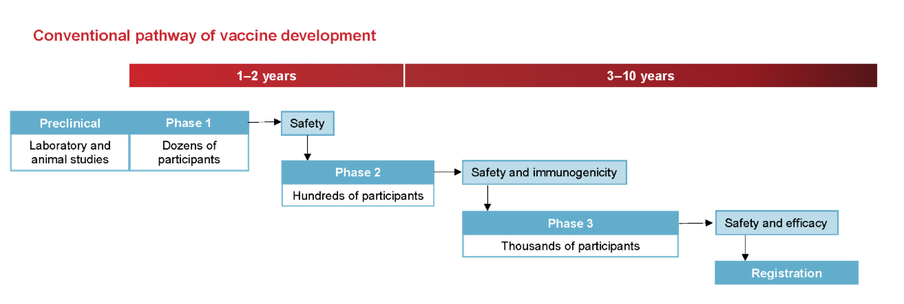
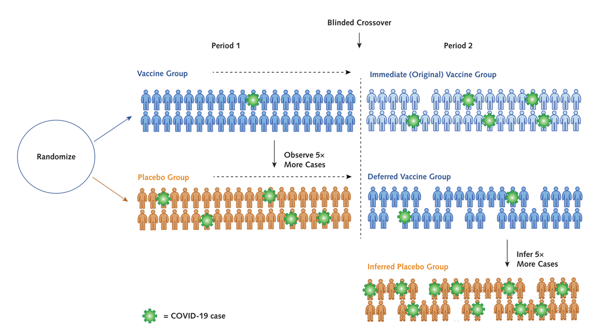

```{r setup, include=FALSE, echo = FALSE,message = FALSE, error = FALSE, warning = FALSE}
knitr::opts_chunk$set(echo = TRUE, fig.width = 10, fig.height = 6)

packages<-c("tidyverse", "kableExtra")

ipak <- function(pkg){
  new.pkg <- pkg[!(pkg %in% installed.packages()[, "Package"])]
  if (length(new.pkg)) 
    install.packages(new.pkg, dependencies = TRUE)
  sapply(pkg, require, character.only = TRUE)
}
ipak(packages)
 
 
setwd(dirname(rstudioapi::getSourceEditorContext()$path))
getwd()
Sys.setlocale("LC_ALL","English")
```


 

# Introduction

## Phases of Vaccine Trials 

Vaccine trials are a critical component of public health, designed to ensure that vaccines are both safe and effective before widespread use. They are uniquely complex compared to other clinical trials due to the preventive nature of vaccines and their administration to healthy populations. Below is a detailed explanation of vaccine trial designs and the challenges they present.

 
Vaccine development typically progresses through several phases:

* **Phase I**: Involves a small group of healthy volunteers to assess safety, determine appropriate dosage, and identify any immediate adverse effects.

* **Phase II**: Expands the participant pool to include individuals representative of the target population, focusing on immunogenicity (the ability to provoke an immune response) and continued safety assessment.

* **Phase III**: Encompasses large-scale trials with thousands to tens of thousands of participants to evaluate the vaccine's efficacy in preventing the disease and to monitor for rare side effects. Given that many vaccinated individuals may not be exposed to the pathogen, large sample sizes are necessary to detect statistically significant differences between vaccinated and unvaccinated groups.

* **Post-Marketing Surveillance (Phase IV)**: After regulatory approval, ongoing monitoring continues to detect any long-term or rare adverse events in the general population.

**Safety Considerations**

Safety is paramount in vaccine trials due to their administration to healthy individuals, including vulnerable populations like children and the elderly. Safety assessments occur at all trial phases, with particular emphasis during Phase III and post-marketing surveillance. Regulatory agencies employ systems such as the Vaccine Adverse Event Reporting System (VAERS) and the Vaccine Safety Datalink (VSD) to monitor and evaluate adverse events continuously.


To respond to the COVID-19 emergency, traditional timelines were compressed. Normally, vaccine development might take ten years, but several COVID-19 vaccines reached approval in just 18 to 20 months. This was achieved through parallel trial phases, early manufacturing scale-up, and the integration of computational tools. For example, Moderna's mRNA vaccine entered Phase I trials within ten weeks of the virus genome being published.


## Challenges of Vaccine Trial Design 

Vaccine trials are uniquely challenging because they aim to prevent diseases that may occur infrequently. This rarity of cases (e.g., a 1% attack rate) means that trials must involve very large sample sizes—often tens of thousands of participants—to accumulate enough disease events to properly assess efficacy. Unlike therapeutics, which are given only to sick patients, vaccines are administered to healthy individuals across a wide population, making safety concerns even more critical.

Due to this wide rollout, there is a strong emphasis on ensuring both short- and long-term safety. Vaccine trials are longer and more extensive than many other types of trials, often including post-marketing surveillance to detect rare adverse events that may not appear during the Phase III trial. Safety is assessed continuously throughout the process.

The design of vaccine trials also introduces unique terminology and methods. While concepts like attack rate, incidence, and vaccine efficacy are standard in vaccine studies, they often parallel familiar statistical concepts like proportions and time-to-event analysis found in other areas. The language around vaccine studies can seem specialized but usually maps back to more general clinical trial methodology.

**Challenges in Vaccine Trials**

Several challenges are inherent to vaccine trials:

* **Large Sample Sizes and Long Durations**: To detect rare adverse events and ensure statistical power, vaccine trials often require large participant numbers and extended follow-up periods, sometimes spanning 5-10 years.

* **Endpoint Selection**: Determining appropriate endpoints is complex. Endpoints may include disease incidence, severity, or composite measures combining multiple outcomes. The choice impacts trial design and statistical analysis.

* **Adaptive Designs**: While adaptive trial designs can offer flexibility and efficiency, their application in vaccine trials is limited due to the emphasis on safety and the complexity of implementing changes mid-trial.




 


# Standard Statistical Methods for the Analysis of Immunogenicity Data

Historically, vaccine immunogenicity studies have primarily focused on evaluating the humoral immune response, specifically through the measurement of serum antibody levels. In recent years, however, there has been a growing emphasis on also assessing cellular immunity in such trials. Despite this development, the use of cellular immunity endpoints in vaccine trials largely remains at the investigational stage.

To summarize both humoral and cellular immunity data, four standard statistical measures are commonly used:

1. **Geometric Mean Response** (GMR)
2. **Geometric Mean Fold Increase** (GMFI)
3. **Seroprotection Rate**
4. **Seroconversion Rate**

The **GMR** and **Seroprotection Rate** provide absolute measures of immunogenicity, while the **GMFI** and **Seroconversion Rate** capture within-individual increases following vaccination. 


## Geometric Mean Titres and Concentrations

### Geometric Mean Titres (GMT) and Geometric Mean Concentrations (GMC)

Post-vaccination immunogenicity data, whether for humoral or cellular responses, tend to exhibit right-skewed distributions. However, applying a logarithmic transformation to these values often results in an approximately normal distribution, which allows the use of standard parametric statistical methods. For interpretability, the geometric means and confidence intervals are computed by taking the antilog of estimates derived from log-transformed data.

The **Geometric Mean (GM)** is the standard summary statistic for immunogenicity data:

For a set of *n* independent and identically distributed (i.i.d.) immunogenicity values *v₁, v₂, ..., vₙ*, the geometric mean is defined as:

$$
GM = (v_1 \times v_2 \times \ldots \times v_n)^{1/n}
$$

Alternatively, it can be expressed as:

$$
GM = \exp \left( \frac{1}{n} \sum_{i=1}^n \log_e v_i \right)
$$

The logarithmic base used for the transformation can vary, commonly log₂ or log₁₀, but consistency is crucial. For example, when log₁₀ is used:

$$
GM = 10^{\frac{1}{n} \sum_{i=1}^n \log_{10} v_i}
$$

---

### Geometric Mean Titres for Antibody Dilutions

In immunogenicity studies using antibody titres based on reciprocal two-fold serial dilutions (e.g., 1:8, 1:16, 1:32, etc.), a convenient log transformation is applied:

$$
u_i = \log_2 \left( \frac{t_i}{D/2} \right)
$$

Where *tᵢ* is the observed titre and *D* is the lowest dilution tested. The transformed *uᵢ* values correspond to dilution steps (1, 2, 3, etc.), simplifying interpretation. The geometric mean of these titres is then:

$$
GM = \left( \frac{D}{2} \right)^{\frac{1}{n} \sum_{i=1}^n u_i}
$$

**Illustrative Example: Rubella HI Test**

Rubella virus infection, while often mild in adults, poses significant risks during pregnancy. A haemagglutination inhibition (HI) test is frequently performed to assess immunity. Consider HI titres with a lowest tested dilution of 1:8, resulting in possible titres of 8, 16, 32, 64, etc.

Using the standard log₂ transformation:

* A titre of 8 becomes 1
* 16 becomes 2
* 32 becomes 3
* 64 becomes 4

For titres 8, 8, 16, 32, 64, the GMT is computed as:

$$
GMT = 4 \times 2^{(1+1+2+3+4)/5} = 18.379
$$

In this transformation, differences in log-transformed values directly correspond to dilution steps, simplifying interpretation.

---

### Geometric Standard Deviation (GSD) and Confidence Intervals

The **Geometric Standard Deviation (GSD)** is derived by taking the exponential of the standard deviation (SD) of the log-transformed data:

$$
GSD = \exp(SD)
$$

This allows calculation of the two-sided 95% confidence interval for the underlying geometric mean (denoted as *ē*) using:

$$
LCL_e = \frac{GMT}{GSD^{t_{n-1, 1-\alpha/2} / \sqrt{n}}}  
$$

$$
UCL_e = GMT \times GSD^{t_{n-1, 1-\alpha/2} / \sqrt{n}}
$$

Where:

* *tₙ₋₁,₁₋α/2* is the corresponding percentile of the Student’s t-distribution with *(n-1)* degrees of freedom.

**Rubella HI Test Example: Confidence Interval Calculation**

Continuing the Rubella example:

* Sample SD of the log-transformed titres: **0.904**
* GSD = **exp(0.904) = 2.469**
* Using *t₄, 0.975 = 2.776* for a 95% confidence interval

The lower and upper confidence limits for the GMT are calculated as:

$$
LCL_e = \frac{18.379}{2.469^{(2.776/\sqrt{5})}} = 5.98  
$$

$$
UCL_e = 18.379 \times 2.469^{(2.776/\sqrt{5})} = 56.4  
$$

### Single Vaccine Group

When immunogenicity values (*vi*) are log-transformed as *ui = logₑ(vi)* and the *ui* values follow a normal distribution with mean **μ** and variance **σ²**, the **arithmetic mean** of the *ui* values serves as a point estimate for μ. Consequently, the **geometric mean titre (GMT)** or **geometric mean concentration (GMC)** is estimated as:

$$
GMT = e^{\bar{u}}
$$

The distribution of the original *vi* values is thus log-normal.

Since the *ui* values are normally distributed, confidence intervals for μ can be calculated using the one-sample *t*-test. The antilog of these limits provides the corresponding confidence intervals for the geometric mean **e**

It is important to note that the **mean** of the log-normal distribution (expected value of *vi*) is not **e**, but:

$$
E(vi) = e^{μ + \frac{σ^2}{2}}
$$

A key property of the log-normal distribution is that its **geometric mean** and **median** are both equal to **e**.

**Example Single Vaccine Group**

Consider six IFN-γ (Th1-type) immunogenicity measurements in IU/L:
**3.51, 9.24, 13.7, 35.2, 47.4, 57.5**

Their natural logarithms are:
**1.256, 2.224, 2.617, 3.561, 3.859, 4.052**

The arithmetic mean of these log-transformed values is **2.928**, with a standard error of **0.444**. The geometric mean concentration (GMC) is thus:

$$
GMC = e^{2.928} = 18.7 \, \text{IU/L}
$$

Using a two-sided 95% confidence interval for μ with *t*(0.975, 5) = 2.571:

$$
\text{Lower limit} = 2.928 - 2.571(0.444) = 1.786  
\text{Upper limit} = 2.928 + 2.571(0.444) = 4.070  
$$

Exponentiating these limits yields the 95% confidence interval for the underlying geometric mean:

$$
e^{1.786} = 5.97 \quad \text{and} \quad e^{4.070} = 58.6  
$$

As expected with geometric means, these confidence intervals are asymmetrical.

 
### Two Vaccine Groups

When comparing two vaccine groups, statistical inference is performed using a **two-sample *t*-test** applied to the log-transformed immunogenicity values. Point and interval estimates for the difference in means **δ = μ₁ - μ₀** can be transformed back to estimates for the **geometric mean ratio (GMR)**, representing the ratio of the geometric means of the two groups:

$$
GMR = \frac{GM₁}{GM₀} = e^{\bar{u₁} - \bar{u₀}}
$$

Where:

* *GM₁* is the geometric mean of the investigational vaccine group
* *GM₀* is the geometric mean of the control group
* *ū₁*, *ū₀* are the means of the log-transformed values for the respective groups

The *p*-value from the two-sample *t*-test testing **δ = 0** corresponds to a test of whether **GMR = 1**, i.e., whether the geometric means differ significantly between the groups.

**Example: Two Vaccine Groups**

Assume the six IFN-γ values mentioned earlier are compared to a second group of six values, with:

* Arithmetic mean of log-transformed values: **2.754**
* Standard error: **0.512**

The geometric mean concentration of the control group is:

$$
GMC₀ = e^{2.754} = 15.7 \, \text{IU/L}
$$

The geometric mean ratio (GMR) comparing the investigational group to the control group is:

$$
GMR = \frac{18.7}{15.7} = e^{2.928 - 2.754} = 1.19  
$$

The estimated standard error of the difference is **0.677**. The 95% confidence interval for the underlying GMR is:

$$
\text{Lower limit} = e^{1.19 - 2.228(0.677)} = 0.73  
$$

$$
\text{Upper limit} = e^{1.19 + 2.228(0.677)} = 14.9  
$$

This provides an asymmetric confidence interval for the ratio of geometric means, consistent with the properties of log-normal distributions.


## Geometric Mean Fold Increase

In some infectious disease settings, participants may already have measurable pre-vaccination immune responses due to previous infections or vaccinations. A typical example is **influenza**, where most adults have been exposed to influenza viruses during their lifetime. In such cases, post-vaccination immune responses reflect both the effect of vaccination and existing pre-vaccination immunity.

For these scenarios, an alternative to geometric mean titres (GMT) or concentrations (GMC) is the **Geometric Mean Fold Increase (gMFI)**, also referred to as **Mean Fold Increase** or **Geometric Mean Fold Rise**, which specifically quantifies the relative increase in immune response following vaccination at the individual level.

### Single Arm

**Definition and Calculation**

For each individual:

$$
f_i = \frac{v_{post}}{v_{pre}}
$$

Where:

* *vₚᵣₑ* = pre-vaccination immunogenicity value
* *vₚₒₛₜ* = post-vaccination immunogenicity value
* *fᵢ* = fold increase

The **Geometric Mean Fold Increase (gMFI)** across *n* individuals is calculated as:

$$
gMFI = \exp \left( \frac{1}{n} \sum_{j=1}^{n} \log_e f_{ij} \right)
$$

Alternatively, if both pre- and post-vaccination data are available for all subjects:

$$
gMFI = \frac{GM_{post}}{GM_{pre}}
$$

Where:

* *GMₚₒₛₜ* = geometric mean of post-vaccination values
* *GMₚᵣₑ* = geometric mean of pre-vaccination values

**Note:** This relationship holds only if both pre- and post-vaccination data are available for all individuals.

---

**Example-Single Group gMFI Calculation**

In an influenza vaccine trial, pre- and post-vaccination antibody titres for six subjects are recorded as:

| Subject | Pre-Vaccination | Post-Vaccination | Fold Increase |
| ------- | --------------- | ---------------- | ------------- |
| 1       | 5               | 40               | 8             |
| 2       | 5               | 80               | 16            |
| 3       | 10              | 160              | 16            |
| 4       | 10              | 320              | 32            |
| 5       | 20              | 80               | 4             |
| 6       | 20              | 640              | 32            |

The calculated statistics are:

* **GMₚᵣₑ** = 10.0
* **GMₚₒₛₜ** = 142.5
* **gMFI** = 14.25
* **Geometric Standard Deviation (GSD)** = 2.249

The confidence intervals for the gMFI can be calculated using the same formulas applied to geometric means, as described earlier.

---

### Comparison of Two Groups: gMFI and gMFR

For comparing two vaccine groups, the **Geometric Mean Fold Ratio (gMFR)** is used, representing the ratio of fold increases between the groups.

The relationship between gMFR and geometric means is expressed as:

$$
gMFR = \frac{gMFI_1}{gMFI_0} = \frac{GMR_{post}}{GMR_{pre}}
$$

Where:

* *gMFI₁*, *gMFI₀* = gMFI of investigational and control groups, respectively
* *GMRₚₒₛₜ* = geometric mean ratio of post-vaccination values
* *GMRₚᵣₑ* = geometric mean ratio of pre-vaccination values

 

In randomized trials with no significant baseline imbalance (i.e., *GMRₚᵣₑ ≈ 1*), the gMFR effectively approximates *GMRₚₒₛₜ*. Thus, the analysis of fold increases yields results nearly identical to those obtained from analyzing post-vaccination immunogenicity values alone.

---

**Example: Two Group Comparison**

**Experimental Group:**

| Pre-Vaccination | Post-Vaccination | Fold Increase |
| --------------- | ---------------- | ------------- |
| 5               | 40               | 8             |
| 5               | 80               | 16            |
| 10              | 80               | 8             |
| 10              | 80               | 8             |

**Control Group:**

| Pre-Vaccination | Post-Vaccination | Fold Increase |
| --------------- | ---------------- | ------------- |
| 5               | 80               | 16            |
| 5               | 80               | 16            |
| 10              | 80               | 8             |
| 10              | 160              | 16            |

The calculated statistics are:

* *GMₚᵣₑ* = 7.1 (both groups)
* *GMₚₒₛₜ* Experimental = 67.27
* *GMₚₒₛₜ* Control = 95.14
* *gMFI₁* = 9.51
* *gMFI₀* = 13.45
* *gMFR* = 1.4
* *GMRₚₒₛₜ* = 1.4

The gMFR and GMRₚₒₛₜ are identical due to the absence of baseline imbalance.

**Efficiency Considerations**

When no baseline imbalance exists:

* Using fold increases introduces unnecessary variability because fold increases mathematically involve the difference between log-transformed post- and pre-vaccination values.
* If the correlation between pre- and post-vaccination values is weak (e.g., correlation < 0.5), the variance of fold increases is larger than the variance of post-vaccination values alone.
* As a result, analyses based on fold increases often produce larger *p*-values and wider confidence intervals compared to analyses based on post-vaccination data alone.

### Misconception: Do Fold Increases Correct for Baseline Imbalance?

It is a common but incorrect belief that analyzing fold increases eliminates bias due to baseline imbalance. In reality:

* On the log scale:

$$
\log(f_i) = \log(v_{post}) - \log(v_{pre})
$$

* Change scores (including fold increases) remain correlated with baseline values, often negatively.
* For bioassays, higher pre-vaccination values often result in smaller observed fold increases.
* If there is a baseline imbalance, with one group having lower pre-vaccination values, this group will tend to show artificially inflated fold increases, introducing bias **in favor of the group with lower pre-vaccination values**.

Thus, fold increase analysis does **not** inherently correct for baseline imbalance. The appropriate statistical method for addressing baseline imbalance is **analysis of covariance (ANCOVA)**, which explicitly adjusts for pre-vaccination differences.

## Two Seroresponse Rates

In vaccine clinical trials and immunogenicity studies, it is common to assess the immune response using binary endpoints that reflect the presence or increase of protective antibodies following vaccination. Two widely used binary measures are the *seroprotection rate* and the *seroconversion rate*. Both provide critical information regarding the effectiveness of a vaccine but capture different immunological phenomena.

### 1. Seroprotection Rate

The seroprotection rate is defined as the proportion of vaccinated individuals whose antibody levels reach or exceed a predetermined threshold that is considered to be associated with protection from infection or disease. This threshold is referred to as the **threshold of protection**.

For many infectious diseases, scientific research has identified specific antibody levels that are assumed to provide protection. If an individual’s antibody level is equal to or higher than this threshold after vaccination, the person is classified as *seroprotected*.

For example:

* In **influenza** vaccine studies, an anti-hemagglutinin (anti-HA) antibody titre of **40 or higher** is generally accepted as the threshold for seroprotection.
* For **diphtheria** and **tetanus**, the commonly cited threshold is an anti-diphtheria or anti-tetanus antibody concentration of **0.1 international units per millilitre (IU/ml)**.

The seroprotection rate is thus a binary measure: individuals are either classified as seroprotected or not seroprotected based on their antibody levels. The seroprotection rate expresses the percentage of vaccinated individuals who meet this criterion.

It is important to note that the phrase *associated with protection* does not always imply complete immunity. In many cases, this association indicates a **moderate to high probability** of protection rather than absolute prevention of disease. For instance, in the case of influenza, it is estimated that an anti-HA antibody titre of 40 corresponds to approximately a **50% probability** of being protected against infection. Therefore, while the seroprotection threshold is useful for evaluating vaccine responses, it should not be interpreted as guaranteeing full immunity.

### 2. Seroconversion Rate

The seroconversion rate refers to the proportion of individuals whose antibody status changes in response to vaccination, indicating the development or significant increase of detectable antibodies.

According to **Stedman’s Medical Dictionary**, seroconversion is defined as the appearance of detectable, specific antibodies in the blood as a result of infection or immunization.

An individual's antibody status, also called **serostatus**, is classified as follows:

* **Seronegative**: No detectable antibodies are present.
* **Seropositive**: Detectable antibodies are present.

If a person is seronegative before vaccination and becomes seropositive after vaccination, that individual is considered to have *seroconverted*.

Different studies may apply slightly different definitions of seroconversion, depending on the disease and the vaccine being evaluated.

Examples of seroconversion definitions include:

1. **Absolute Appearance of Detectable Antibodies**

   In a study of a live attenuated human rotavirus vaccine conducted by Vesikari and colleagues, seroconversion was defined as the appearance of serum IgA antibodies to rotavirus at a titre of **20 units per millilitre or higher** in infants who were seronegative at baseline. The proportion of infants who seroconverted varied between **73% and 96%**, depending on the vaccine dose.

2. **Fourfold Rise in Antibody Levels**

   Another common definition of seroconversion is based on a **fourfold increase** in antibody levels following vaccination. This definition is particularly relevant when some individuals may already be seropositive at the time of enrollment.

   For example, in a study evaluating a virus-like particle vaccine for human papillomavirus (**HPV**), Harro and colleagues defined seropositivity as an ELISA antibody titre equal to or greater than the reactivity of a standard pooled serum. Among the 72 female participants, six were seropositive at baseline. In this study, seroconversion was defined as a **fourfold or greater rise** in antibody titre after vaccination.

3. **Combined Definition**

   Many clinical studies, particularly influenza vaccine trials, adopt a combined approach to defining seroconversion. This definition takes into account both baseline serostatus and post-vaccination changes:

   * For individuals with a baseline antibody titre **below 10** (seronegative), seroconversion is defined as reaching a **post-vaccination titre of 40 or higher**, which is consistent with the seroprotection threshold in influenza studies.
   * For individuals with a baseline antibody titre **10 or higher** (seropositive), seroconversion is defined as achieving at least a **fourfold rise** in titre after vaccination.

It is important to highlight that such definitions may vary slightly between studies. For instance, some studies distinguish between becoming seropositive (titre ≥10) and achieving seroprotection (titre ≥40), especially in the context of influenza vaccines.

Regardless of the specific definition applied, seroconversion remains a binary endpoint. Individuals either meet the criteria for seroconversion or they do not. The **seroconversion rate** represents the proportion or percentage of study participants who seroconverted after vaccination.

## Analysis of Proportions


## Multiple Co-Primary Endpoints and the Intersection–Union Test

## Reverse Cumulative Distribution Plot

# Vaccine Efficacy


## Assessing Vaccine Efficacy


1. **Definition and Formula**
   Vaccine Efficacy (VE) measures how well a vaccine protects individuals from disease. It is defined as:

   **VE = 1 - Risk Ratio (RR)**
   Where:

   * **RR (Risk Ratio)** = ARV / ARU

     * **ARV**: Attack rate in vaccinated group
     * **ARU**: Attack rate in unvaccinated (control/placebo) group

   Interpreting VE:

   * The range of VE is from negative infinity to 1.
   * A VE of **1** (or 100%) means **complete protection** — no cases occurred in the vaccinated group.
   * A VE of **0** means **no effect** — the vaccine does not reduce the risk.
   * A **negative VE** suggests harm (higher risk in the vaccinated group than unvaccinated).

2. **Multiple Testing Approaches**
   The choice of statistical method to estimate VE depends on how disease occurrence is modeled:

   * **Counts**: Number of events (e.g., infections) across follow-up time.
   * **Proportions**: Percentage of individuals infected in each group.
   * **Time-to-Event**: Time from vaccination to disease onset (e.g., using survival analysis).

3. **VE as Primary Endpoint**
   In vaccine trials, VE is typically the **primary efficacy endpoint**, alongside key **safety endpoints**.

   * Trials may define a “case” not just based on lab-confirmed infection, but also by **symptom presentation**.
   * This is particularly relevant when mild/asymptomatic cases are common or underreported.


## Vaccine Methods / SSD (Sample Size Determination) Examples

1. **Confidence Interval for VE**

   * Based on classical **case-control** or **cohort** designs.
   * Reference: **O'Neill (1988)**.
   * Focused on estimating VE along with its confidence interval to quantify uncertainty.

2. **One Proportion Tests**

   * Applied when comparing observed event proportion against a known benchmark (e.g., historical attack rate).
   * Often used in **event-driven designs** (study continues until a set number of events occurs).
   * Uses standard binomial tests.

3. **Two Proportion Tests**

   * Directly compares attack rates between vaccinated and control groups.
   * Computes VE using the formula: **VE = 1 – RR**, and then applies tests like the **z-test for proportions**.

4. **Composite Models**

   * Consider multiple outcomes (e.g., disease **incidence and severity**) together.
   * Reference: **Callegaro (2020)**.
   * Used to account for the **public health relevance** of various symptoms, not just whether infection occurred.

5. **Count Models (Poisson/Negative Binomial)**

   * Appropriate when tracking **event counts over time** (e.g., number of infections/person-time).
   * Poisson models work when events are rare and follow a constant rate.
   * Negative Binomial (NB) used when there is overdispersion (more variability than Poisson allows).
   * Applies both to standard and rare-event settings.

6. **Cox Regression**

   * A **time-to-event model** commonly used for survival analysis.
   * Used in **non-inferiority (NI)** or **superiority (SM)** hypotheses testing.
   * Can adjust for covariates and censoring (e.g., if participants drop out or are uninfected at study end).

7. **Cluster Randomized Designs**

   * Applied when randomizing **groups** (e.g., households, villages) instead of individuals.
   * Often used in **public health** or **epidemic settings**.
   * Statistical methods account for intra-cluster correlation.
   * Reference: **Hayes & Bennett (1999)**.

---


## Vaccine Efficacy Hypothesis into Binomial Testing Framework

**Goal:**
Compare two hypotheses:

* **Null Hypothesis (H₀): VE ≤ 0.3** (vaccine provides low or no protection)
* **Alternative Hypothesis (H₁): VE = 0.6** (vaccine provides strong protection)

**Step 1: Define Probabilities**

* Let **πₚₗₐcₑbₒ** be the probability of getting symptomatic COVID-19 in the **placebo group**
* Let **πᵥₐccᵢₙₑ** be the same for the **vaccine group**

**Step 2: Conditional Probability for Vaccine Case**
Derive the probability that a **random case** (symptomatic COVID-19) comes from the vaccine group, under a given hypothesis (VE):

$$
P_{H_x}(Vaccine\ Case\ |\ Case) = \frac{π_{Placebo}(1 - VE)}{π_{Placebo}(1 - VE) + π_{Placebo}} = \frac{0.08(1 - VE)}{0.08(1 - VE) + 0.08}
$$

**Step 3: Plug in VE under each hypothesis**

* Under **H₀ (VE = 0.3)**, the conditional probability becomes:

  $$
  P_{H₀} = \frac{0.08(1 - 0.3)}{0.08(1 - 0.3) + 0.08} = 0.4118
  $$
* Under **H₁ (VE = 0.6)**:

  $$
  P_{H₁} = \frac{0.08(1 - 0.6)}{0.08(1 - 0.6) + 0.08} = 0.2857
  $$

**Step 4: Modeling the Number of Vaccine Cases**
Assume:

* **N** is the total number of symptomatic cases observed.
* **V** is the number of those that are in the vaccine group.

Then:

* **V \~ Binomial(N, Pₕₓ)** depending on which hypothesis is true.
* **1 – β = P(V ≥ c | H₁) = 0.9**, meaning we want **90% power** to detect a VE of 0.6 if it’s true.


# Vaccine Safety 

## Introduction

1. **Focus on Adverse Events**
   Vaccine safety revolves around the monitoring of **adverse events** (AEs) that occur after vaccination. These events could range from mild (e.g. injection site reactions) to severe or life-threatening (e.g. anaphylaxis or myocarditis). Because vaccines are administered to healthy people, including children and vulnerable groups, safety is held to an especially high standard.


2. **Primary Safety Endpoints**
   During clinical trials (especially Phase III), specific **safety endpoints** are defined—typically focusing on **severe adverse events (SAEs)**. These endpoints are carefully monitored in parallel with efficacy.

3. **Post-Marketing Surveillance**
   Some AEs may be too rare to detect even in large trials (e.g., with frequencies of less than 1 in 10,000). These events are captured through **post-market surveillance**, which continues after the vaccine is approved and in widespread use.

   * This includes **Phase IV studies** and ongoing data collection from **vaccine safety networks** (e.g., VAERS in the U.S.).
   * The goal is to identify **unexpected or delayed effects** that only become evident with broader population exposure.

4. **Use of Self-Controlled Studies**

   There’s a practical and ethical limitation post-approval:
    
   > You can't maintain a randomized control group once a vaccine is proven effective, since it would be unethical to deny the vaccine to people who need it.
    
   As a result, researchers rely on **observational methods** that don’t require a control group — this is where **SCCS** comes in.

   Among the most important tools in post-marketing safety surveillance are **self-controlled designs**, such as the **Self-Controlled Case Series (SCCS)**. These are useful for evaluating whether the rate of adverse events increases shortly after vaccination compared to other periods in the same individual.


## Self Controlled Case Studies

1. **Overview**
   SCCS is a **within-person** comparison method that estimates the **relative incidence (RI)** of an adverse event during defined risk windows (e.g., 0–28 days post-vaccination) versus control periods.

   * It uses **only individuals who experienced the adverse event** (i.e., case-only design).
   * The benefit is that **time-invariant confounders** (e.g., genetics, baseline health status) are automatically controlled for, since each person serves as their own control.

2. **How It Works**
   The observation period for each case is divided into:

   * **Risk period(s)**: When the event is suspected to be more likely due to vaccination.
   * **Control period(s)**: Baseline period when the event risk is assumed to be unaffected by the vaccine.

   The **RI** is the ratio of event incidence in the risk period vs. the control period.

3. **Statistical Methods**
   Estimation methods include:

   * **Likelihood functions** based on binomial models.
   * Signed root likelihood ratios and log-relative incidence estimates.
   * Modifications for **age effects**, which are common confounders in vaccine safety.

   The formula for RI without age effects is based on a likelihood function $l(\rho)$, where:

   * $x$: number of events in the risk window,
   * $n_1$: total number of events,
   * $r$: proportion of time at risk.

   With age effects, the likelihood becomes more complex, including terms to account for age groups and event timing (e.g., $\delta_j$ and $\beta$ in the likelihood).

4. **Why SCCS Is Useful**
   SCCS is particularly effective for vaccine safety because:

   * It **requires only case data**, which is often more readily available.
   * It handles **time-varying exposures** (like vaccines) and **rare events**.
   * It is robust against confounders that do not change over time (e.g., sex, ethnicity).
   

**Example**

“Miller et al. [13] studied the association between measles, mumps, rubella (MMR) vaccine
and idiopathic thrombocytopenic purpura (ITP) (abnormal bleeding into the skin due to low
blood platelet count) in children aged 12–23 months during the period from October 1991 to September 1994 within 42 days of receiving the vaccine.”

“The observation period includes the ages 366–730
days, which we subdivide into J = 4 periods of lengths e1 = e2 = e3 = 91 days, and e4 = 92 days. We take the proportions vaccinated in each of these age intervals to be p1 = 0.6, p2 = 0.2, p3 = 0.05, p4 = 0.05. We take the age effects to be e1 = 1, e2 = 0.6, e3 = e4 = 0.4. The risk period is e∗ = 42 days. We set ⍴ = 3, z⍺ = 1.96 and zꞵ = 0.8416 for 80 per cent power to detect a relative incidence of 3 at the 5 per cent significance level.”

| Parameter              | Overall                      |
|------------------------|------------------------------|
| Number of Periods      | 4                            |
| Observation Periods    | 91, 91, 91, 92 days          |
| Risk Period            | 42 days                      |
| P(Exposure)            | 0.6, 0.2, 0.05, 0.05         |
| Age Effects            | 1, 0.6, 0.4, 0.4             |
| Relative Incidence     | 3                            |
| Alpha (2-sided)        | 0.05                         |
| Power                  | 80%                          |


# Vaccine Durability


 

## Deferred Vaccine Designs

**Ethical Considerations**
Once a vaccine has been shown to be effective in early trials, continuing to keep participants in a placebo group becomes ethically problematic. Therefore:

* Placebo recipients are typically **offered the vaccine** after efficacy is established.
* This transition must be handled carefully to **preserve the integrity of the trial**, particularly in long-term (durability) follow-up.

---

**Crossover Design**
To address this ethical issue while still enabling long-term efficacy assessment, trials often use a **crossover design**:

* **All participants eventually receive the vaccine**, either at the beginning or after the placebo phase.
* This setup:

  * Maintains **blinding** in the early phases (so participants and investigators don’t know who has which treatment).
  * Still allows for **comparisons** of initial protection and long-term durability across groups.

---

**Less Precision Compared to Standard Designs**
Crossover and ethical adaptations can result in **less precise efficacy estimates**, especially over time:

* The estimates for long-term efficacy (durability) may be **less reliable** than those in traditional randomized controlled trials.
* In durability trials, any early misestimations can undermine later results—this is described as the study being only as **strong as its weakest link**.

---

**Subgroup Safety and Harm Analysis**
Durability trials also provide opportunities for **subgroup analysis**, such as:

* Assessing whether **efficacy or safety** varies by **demographic or clinical characteristics** (e.g., age, gender, comorbidities).
* These analyses help understand **differential vaccine performance**, contributing to more personalized or targeted vaccination strategies.





# Reference

Nauta, J. (2011). Statistics in clinical vaccine trials. Springer-Verlag.

nQuery Webinar, Sample Sizes for Vaccine Trials, Trial Designs for Assessing Vaccine Efficacy, Safety & Durability, https://www.statsols.com/guides/sample-sizes-for-vaccine-trials

nQuery Webinar, Design and Sample Size for Vaccine Trials, Case Study of COVID-19, https://www.statsols.com/guides/design-and-sample-size-for-vaccine-trials

Fleiss, J.L., Levin, B. and Paik, M.C., 2013. Statistical methods for rates and proportions. John Wiley & Sons.

Halloran, M.E., Longini, I.M., Struchiner, C.J. and Longini, I.M., 2010. Design and analysis of vaccine studies (Vol. 18). New York, NY: Springer.

Singh, K. and Mehta, S., 2016. The clinical development process for a novel preventive vaccine: An overview. Journal of postgraduate medicine, 62(1), p.4.

O’Neill, R.T., 1988. On sample sizes to estimate the protective efficacy of a vaccine. Statistics in Medicine, 7(12), pp.1279-1288.

Chan, I.S. and Bohidar, N.R., 1998. Exact power and sample size for vaccine efficacy studies. Communications in Statistics-Theory and Methods, 27(6), pp.1305-1322.

Gu, K., Ng, H.K.T., Tang, M.L. and Schucany, W.R., 2008. Testing the ratio of two poisson rates. Biometrical Journal: Journal of Mathematical Methods in Biosciences, 50(2), pp.283-298.

Schoenfeld, D.A., 1983. Sample-size formula for the proportional-hazards regression model. Biometrics, pp.499-503.

Callegaro, A., Curran, D. and Matthews, S., 2020. Burden‐of‐illness vaccine efficacy. Pharmaceutical statistics, 19(5), pp.636-645.

Chow, S.C., Shao, J., Wang, H. and Lokhnygina, Y., 2017. Sample size calculations in clinical research. CRC press.

## Vaccine Efficacy

Polack, F.P., Thomas, S.J., Kitchin, N., Absalon, J., Gurtman, A., Lockhart, S., Perez, J.L., Pérez Marc, G., Moreira, E.D., Zerbini, C. and Bailey, R., 2020. Safety and efficacy of the BNT162b2 mRNA Covid-19 vaccine. New England Journal of Medicine, 383(27), pp.2603-2615.

Baden, L.R., El Sahly, H.M., Essink, B., Kotloff, K., Frey, S., Novak, R., Diemert, D., Spector, S.A., Rouphael, N., Creech, C.B. and McGettigan, J., 2021. Efficacy and safety of the mRNA-1273 SARS-CoV-2 vaccine. New England Journal of Medicine, 384(5), pp.403-416.

Voysey, M., Clemens, S.A.C., Madhi, S.A., Weckx, L.Y., Folegatti, P.M., Aley, P.K., Angus, B., Baillie, V.L., Barnabas, S.L., Bhorat, Q.E. and Bibi, S., 2021. Safety and efficacy of the ChAdOx1 nCoV-19 vaccine (AZD1222) against SARS-CoV-2: an interim analysis of four randomised controlled trials in Brazil, South Africa, and the UK. The Lancet, 397(10269), pp.99-111.

Sadoff, J., Le Gars, M., Shukarev, G., Heerwegh, D., Truyers, C., de Groot, A.M., Stoop, J., Tete, S., Van Damme, W., Leroux-Roels, I. and Berghmans, P.J., 2021. Interim Results of a Phase 1–2a Trial of Ad26. COV2. S Covid-19 Vaccine. New England Journal of Medicine.

Logunov, D.Y., Dolzhikova, I.V., Shcheblyakov, D.V., Tukhvatulin, A.I., Zubkova, O.V., Dzharullaeva, A.S., Kovyrshina, A.V., Lubenets, N.L., Grousova, D.M., Erokhova, A.S. and Botikov, A.G., 2021. Safety and efficacy of an rAd26 and rAd5 vector-based heterologous prime-boost COVID-19 vaccine: an interim analysis of a randomised controlled phase 3 trial in Russia. The Lancet, 397(10275), pp.671-681.

Uttarilli, Anusha, Amalakanti, Sridhar, Kommoju, Phaneeswara-Rao, Sharma, Srihari, Goyal, Pankaj, Manjunath, Gowrang Kasaba, Upadhayay, Vineet, Parveen, Alisha, Tandon, Ravi, Prasad, Kumar Suranjit, Dakal, Tikam Chand, Ben Shlomo, Izhar, Yousef, Malik, Neerathilingam, Muniasamy and Kumar, Abhishek. "Super-rapid race for saving lives by developing COVID-19 vaccines" Journal of Integrative Bioinformatics, vol. 18, no. 1, 2021, pp. 27-43. https://doi.org/10.1515/jib-2021-0002


## Vaccine Safety

Petersen, I., Douglas, I. and Whitaker, H., 2016. Self controlled case series methods: an alternative to standard epidemiological study designs. BMJ, 354.Musonda, P., Paddy Farrington, C. and Whitaker, H.J., 2006. Sample sizes for self‐controlled case series studies. Statistics in Medicine, 25(15), pp.2618-2631.

Farrington CP. 1995. Relative incidence estimation from case series for vaccine safety evaluation. Biometrics 51:228-235. page 228.Dodd, C., Andrews, N., Petousis-Harris, H., Sturkenboom, M., Omer, S.B. and Black, S., 2021. Methodological frontiers in vaccine safety: qualifying available evidence for rare events, use of distributed data networks to monitor vaccine safety issues, and monitoring the safety of pregnancy interventions. BMJ global health, 6(Suppl 2), p.e003540.
Knipe, D.M., Levy, O., Fitzgerald, K.A. and Mühlberger, E., 2020. Ensuring vaccine safety. Science, 370(6522), pp.1274-1275.

Matz, K.M., Marzi, A. and Feldmann, H., 2019. Ebola vaccine trials: progress in vaccine safety and immunogenicity. Expert review of vaccines, 18(12), pp.1229-1242.

Pormohammad, A., Zarei, M., Ghorbani, S., Mohammadi, M., Razizadeh, M.H., Turner, D.L. and Turner, R.J., 2021. Efficacy and safety of COVID-19 vaccines: a systematic review and meta-analysis of randomized clinical trials. Vaccines, 9(5), p.467.


## Vaccine Durability

Choe, P.G., Kang, C.K., Suh, H.J., Jung, J., Song, K.H., Bang, J.H., Kim, E.S., Kim, H.B., Park, S.W., Kim, N.J. and Park, W.B., 2021. Waning antibody responses in asymptomatic and symptomatic SARS-CoV-2 infection. Emerging infectious diseases, 27(1), p.327.

Nason, M. and Follmann, D., 2010. Design and analysis of crossover trials for absorbing binary endpoints. Biometrics, 66(3), pp.958-965.

Makubate, B. and Senn, S., 2010. Planning and analysis of cross‐over trials in infertility. Statistics in medicine, 29(30), pp.3203-3210.

Follmann, D., 2006. Augmented designs to assess immune response in vaccine trials. Biometrics, 62(4), pp.1161-1169.

Palin, A.C., Alter, G., Crotty, S., Ellebedy, A.H., Lane, M.C., Lee, F.E.H., Locci, M., Malaspina, A., Mallia, C., McElrath, M.J. and Pulendran, B., 2022. The persistence of memory: defining, engineering, and measuring vaccine durability. Nature immunology, 23(12), pp.1665-1668.Fintzi, J. and Follmann, D., 2021. Assessing vaccine durability in randomized trials following placebo crossover. Statistics in Medicine, 40(27), pp.5983-6007.

Follmann, D., Fintzi, J., Fay, M.P., Janes, H.E., Baden, L.R., El Sahly, H.M., Fleming, T.R., Mehrotra, D.V., Carpp, L.N., Juraska, M. and Benkeser, D., 2021. A deferred-vaccination design to assess durability of COVID-19 vaccine effect after the placebo group is vaccinated. Annals of internal medicine, 174(8), pp.1118-1125.


Lin, D.Y., Zeng, D. and Gilbert, P.B., 2021. Evaluating the long-term efficacy of coronavirus disease 2019 (COVID-19) vaccines. Clinical Infectious Diseases, 73(10), pp.1927-1939.

Lipsitch, M., 2019. Challenges of vaccine effectiveness and waning studies. Clinical Infectious Diseases, 68(10), pp.1631-1633.


