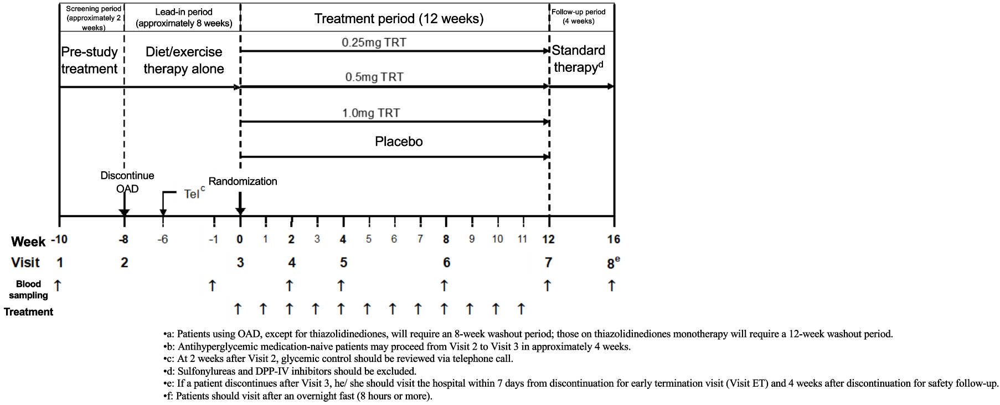
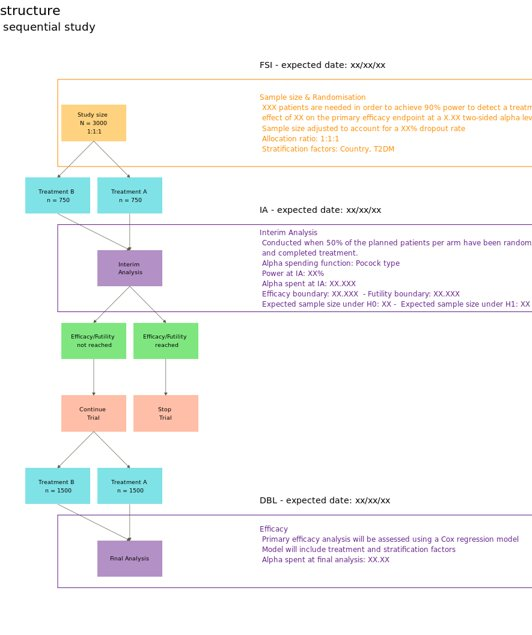
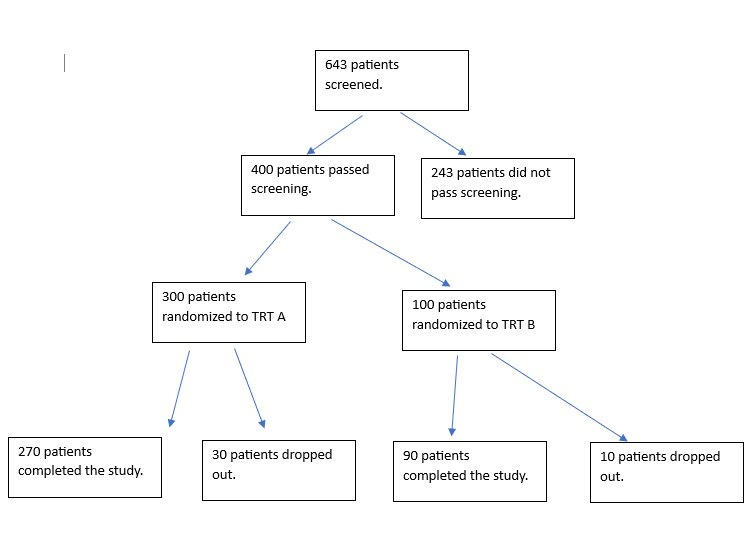
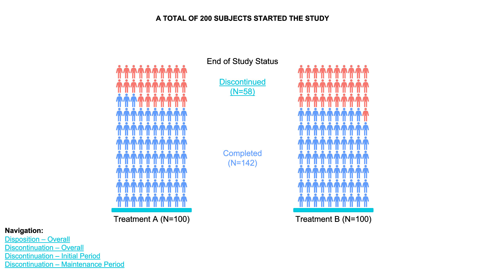
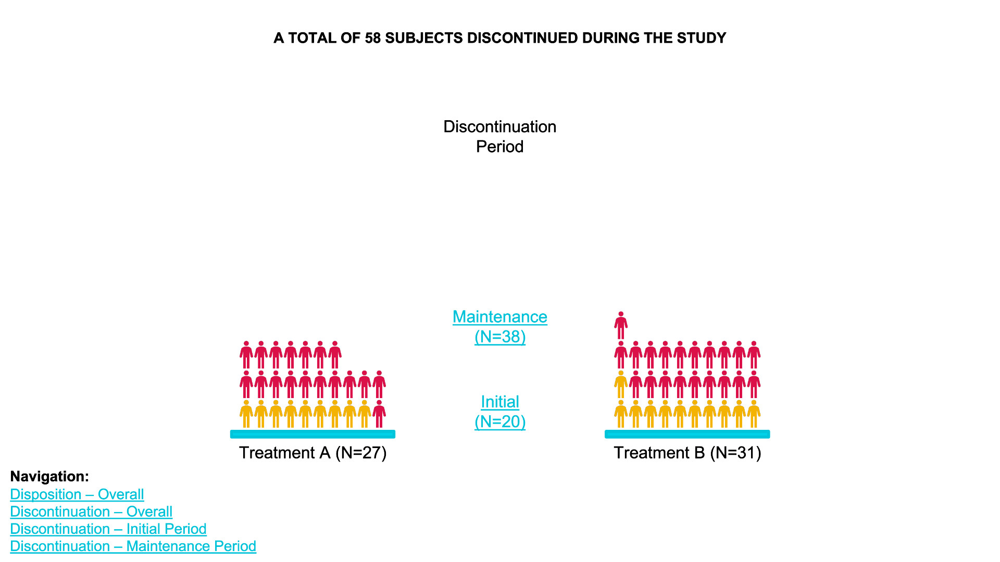
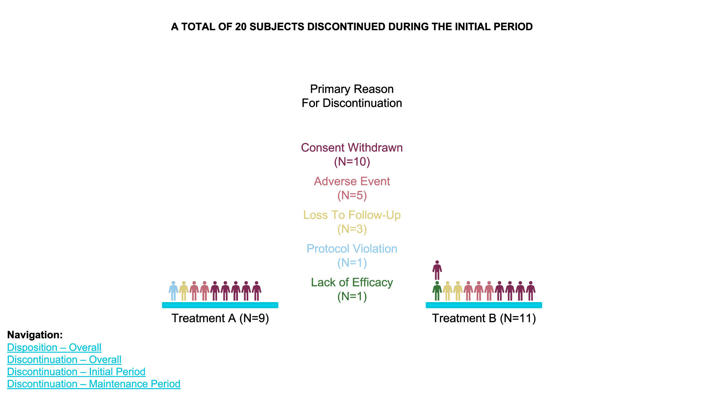
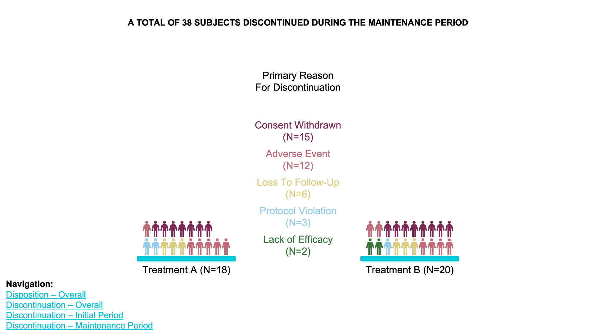
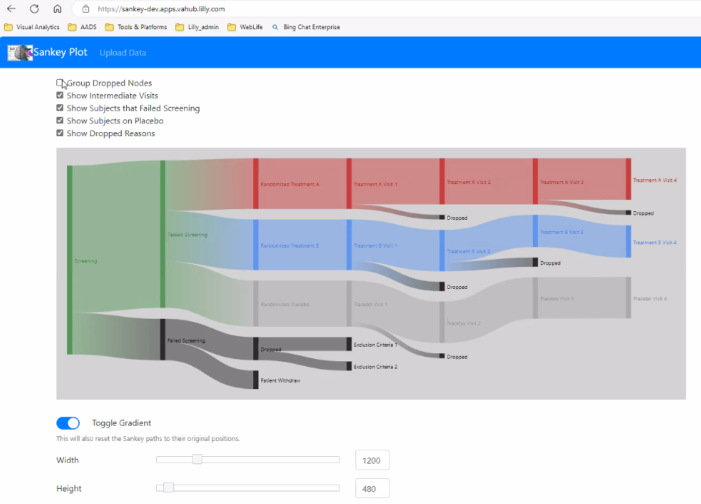

```{r setup, include=FALSE, echo = FALSE,message = FALSE, error = FALSE, warning = FALSE}
knitr::opts_chunk$set(echo = TRUE, fig.width = 10, fig.height = 6)

# <!-- ---------------------------------------------------------------------- -->
# <!--                    1. load the required packages                       -->
# <!-- ---------------------------------------------------------------------- --> 

## if(!require(psych)){install.packages("psych")}

packages<-c("tidyverse", "kableExtra",
            "ggpubr","gridExtra","ggtext")

ipak <- function(pkg){
  new.pkg <- pkg[!(pkg %in% installed.packages()[, "Package"])]
  if (length(new.pkg)) 
    install.packages(new.pkg, dependencies = TRUE)
  sapply(pkg, require, character.only = TRUE)
}
ipak(packages)
 


# <!-- ---------------------------------------------------------------------- -->
# <!--                        2. Basic system settings                        -->
# <!-- ---------------------------------------------------------------------- -->
setwd(dirname(rstudioapi::getSourceEditorContext()$path))
getwd()
Sys.setlocale("LC_ALL","English")

## convert backslash to forward slash in R
# gsub('"', "", gsub("\\\\", "/", readClipboard()))

### get the path
# rstudioapi::getSourceEditorContext()$path
# dirname(rstudioapi::getSourceEditorContext()$path)

### set working directory
# getwd()
# setwd("c:/Users/zbai/Desktop")
# Sys.setlocale("LC_ALL","English")

### get the R Version
# paste(R.Version()[c("major", "minor")], collapse = ".")

### convert backslash to forward slash 
# scan("clipboard",what="string")
# gsub('"', "", gsub("\\\\", "/", readClipboard())) 

## Load all r functions
## The directory where all source code files are saved.
source_code_dir <- "C:/Users/baiz/Downloads/Data-Analyst-with-R/00 R Function/ZB Function/"  
file_path_vec <- list.files(source_code_dir, full.names = T)
for(f_path in file_path_vec){source(f_path)}
 
```
 


# Introduction

Study flow charts in clinical trials are visual representations of the different stages and processes participants undergo from the beginning to the end of a clinical study. These charts provide a structured, step-by-step outline of the trial's flow, making it easier to understand participant progress and the timing of various assessments and interventions. Flow charts are particularly useful for stakeholders like clinical researchers, sponsors, regulatory agencies, and ethical review boards, as they provide a clear, at-a-glance summary of the study's design.

## Key Components of Study Flow Charts

1. **Enrollment Phase**
   - **Screening:** The initial step where potential participants are assessed against the study's eligibility criteria. This stage identifies who is eligible or ineligible for the study.
   - **Randomization (if applicable):** Eligible participants are randomly assigned to either the treatment or control group.

2. **Intervention Phase**
   - **Treatment Groups:** Participants may be divided into various arms, such as a treatment arm (receiving the drug/intervention) and a control arm (receiving a placebo or standard care).
   - **Assessments:** Flow charts outline when assessments (e.g., baseline, follow-up visits, and final evaluations) take place, detailing each visit or milestone.

3. **Follow-up Phase**
   - **Monitoring and Evaluations:** Key follow-up steps, including adverse event monitoring, efficacy assessments, and quality-of-life measures, are tracked over time.
   - **End of Study Visit:** The final visit marks the formal conclusion of each participant’s involvement.

4. **Outcome and Data Analysis Phase**
   - **Primary and Secondary Endpoints:** Flow charts may indicate the points at which primary and secondary outcomes are measured to evaluate the study’s success.
   - **Completion and Dropouts:** The flow chart shows completion rates, dropouts, and reasons for withdrawal.


## Benefits of Study Flow Charts

- **Clarity and Transparency:** They simplify complex processes, making it easier to communicate trial protocols.
- **Consistency:** By mapping the study’s course, they help ensure adherence to protocol and proper data collection at each stage.
- **Regulatory Compliance:** Flow charts provide a visual compliance document for regulatory agencies to ensure all ethical and procedural standards are met.
- **Efficiency in Data Collection:** They guide study personnel in tracking where each participant is in the trial, minimizing errors.
 
## Example










# CONSORT Diagramm in SAS

# CONSORT Diagramm in R

## Gmisc and grid Package

1. **`textGrob` for Text**: I’ve used `textGrob` for the text inside each box.
2. **`rectGrob` for Boxes**: Rectangles (`rectGrob`) are drawn around each `textGrob` to create visible boxes.
3. **`grid.segments` for Connections**: Connections are made with `grid.segments`, adding arrows to match the flow.

```{r,echo = T,message = FALSE, error = FALSE, warning = FALSE}
library(grid)
library(Gmisc)
library(gridExtra) 

grid.newpage()

# Define parameters
leftx <- 0.25
midx <- 0.5
rightx <- 0.75
width <- 0.4
gp <- gpar(fill = "lightgrey", col = "black", fontsize = 10, fontfamily = "sans")

# Create boxes with labels
total <- textGrob("Total\nN = NNN", x = midx, y = 0.9, gp = gp)
rando <- textGrob("Randomized\nN = NNN", x = midx, y = 0.75, gp = gp)
inel <- textGrob("Ineligible\nN = NNN", x = rightx, y = 0.825, gp = gp)


# Boxes for Group Allocation
g1 <- textGrob("Allocated to Group 1\nN = NNN", x = leftx, y = 0.5, gp = gp)
g2 <- textGrob("Allocated to Group 2\nN = NNN", x = rightx, y = 0.5, gp = gp)

# Boxes for Follow-up
g11 <- textGrob("Followed up\nN = NNN", x = leftx, y = 0.3, gp = gp)
g21 <- textGrob("Followed up\nN = NNN", x = rightx, y = 0.3, gp = gp)

# Boxes for Completion
g12 <- textGrob("Completed\nN = NNN", x = leftx, y = 0.1, gp = gp)
g22 <- textGrob("Completed\nN = NNN", x = rightx, y = 0.1, gp = gp)

# Draw rectangles around textGrob elements to resemble boxes
grid.draw(rectGrob(x = midx, y = 0.9, width = width, height = 0.1, gp = gp))
grid.draw(total)

grid.draw(rectGrob(x = midx, y = 0.75, width = width, height = 0.1, gp = gp))
grid.draw(rando)

grid.draw(rectGrob(x = rightx, y = 0.825, width = 0.25, height = 0.05, gp = gp))
grid.draw(inel)

grid.draw(rectGrob(x = leftx, y = 0.5, width = width, height = 0.1, gp = gp))
grid.draw(g1)

grid.draw(rectGrob(x = rightx, y = 0.5, width = width, height = 0.1, gp = gp))
grid.draw(g2)

grid.draw(rectGrob(x = leftx, y = 0.3, width = width, height = 0.1, gp = gp))
grid.draw(g11)

grid.draw(rectGrob(x = rightx, y = 0.3, width = width, height = 0.1, gp = gp))
grid.draw(g21)

grid.draw(rectGrob(x = leftx, y = 0.1, width = width, height = 0.1, gp = gp))
grid.draw(g12)

grid.draw(rectGrob(x = rightx, y = 0.1, width = width, height = 0.1, gp = gp))
grid.draw(g22)

# Draw connections
grid.segments(x0 = midx, y0 = 0.85, x1 = midx, y1 = 0.8, arrow = arrow(type = "closed", length = unit(0.15, "inches")))
grid.segments(x0 = midx, y0 = 0.85, x1 = rightx, y1 = 0.825, arrow = arrow(type = "closed", length = unit(0.15, "inches")))

grid.segments(x0 = midx, y0 = 0.7, x1 = leftx, y1 = 0.55, arrow = arrow(type = "closed", length = unit(0.15, "inches")))
grid.segments(x0 = midx, y0 = 0.7, x1 = rightx, y1 = 0.55, arrow = arrow(type = "closed", length = unit(0.15, "inches")))

grid.segments(x0 = leftx, y0 = 0.45, x1 = leftx, y1 = 0.35, arrow = arrow(type = "closed", length = unit(0.15, "inches")))
grid.segments(x0 = rightx, y0 = 0.45, x1 = rightx, y1 = 0.35, arrow = arrow(type = "closed", length = unit(0.15, "inches")))

grid.segments(x0 = leftx, y0 = 0.25, x1 = leftx, y1 = 0.15, arrow = arrow(type = "closed", length = unit(0.15, "inches")))
grid.segments(x0 = rightx, y0 = 0.25, x1 = rightx, y1 = 0.15, arrow = arrow(type = "closed", length = unit(0.15, "inches")))

```


## consort package

### Consort diagram produced with consort_plot

When the number of subjects in the final analysis is less than the number of subjects initially entering the study, it is important to detail the observation filtering process. This is often done with a consort diagram, and fortunately R has the consort package by Alim Dayim for drawing data-driven diagrams. To demonstrate its use let’s simulate a two-treatment randomized clinical trial in which 1000 subjects were screened for participation.

```{r,echo = F,message = FALSE, error = FALSE, warning = FALSE}
require(Hmisc)
require(data.table)
require(qreport)
hookaddcap()   # make knitr call a function at the end of each chunk
               # to try to automatically add to list of figure


N <- 1000
set.seed(1)
r <- data.table(
  id    = 1 : N,
  age   = round(rnorm(N, 60, 15)),
  pain  = sample(0 : 5, N, replace=TRUE),
  hxmed = sample(0 : 1, N, replace=TRUE, prob=c(0.95, 0.05))   )
# Set consent status to those not excluded at screening
r[age >= 40 & pain > 0 & hxmed == 0,
  consent := sample(0 : 1, .N, replace=TRUE, prob=c(0.1, 0.9))]
# Set randomization status for those consenting
r[consent == 1,
  randomized := sample(0 : 1, .N, replace=TRUE, prob=c(0.15, 0.85))]
# Add treatment and follow-up time to randomized subjects
r[randomized == 1, tx     := sample(c('A', 'B'), .N, replace=TRUE)]
r[randomized == 1, futime := pmin(runif(.N, 0, 10), 3)]
# Add outcome status for those followed 3 years
# Make a few of those followed 3 years missing
r[futime == 3,
  y := sample(c(0, 1, NA), .N, replace=TRUE, prob=c(0.75, 0.2, 0.05))]
# Print first 15 subjects
kabl(r[1 : 15, ])
```

Now show the flow of qualifications and exclusions in a consort diagram. consort_plot wants multiple reasons for exclusions to be prioritized in a hierarchy, and NA to be used to denote “no exclusion”. Use the Hmisc function seqFreq that creates a factor variable whose first level is the most common exclusion, second level is the most common exclusion after excluding subjects based on the first exclusion, and so on. seqFreq also returns an attribute obs.per.numcond with a frequency tabulation of the number of observations having a given number of conditions.


```{r,echo = F,message = FALSE, error = FALSE, warning = FALSE}
r[, exc := seqFreq('pain-free'  = pain  == 0,
                    'Hx med'    = hxmed == 1,
                                  age < 40,
                    noneNA=TRUE)]
eo  <- attr(r[, exc], 'obs.per.numcond')
mult <- paste0('1, 2, ≥3 exclusions: n=',
                eo[2], ', ',
                eo[3], ', ',
                eo[-(1:3)]  )

r[, .q(qual, consent, fin) :=
    .(is.na(exc),
      ifelse(consent == 1, 1, NA),
      ifelse(futime  >= 3, 1, NA))]
            
require(consort)
# consort_plot used to take a coords=c(0.4, 0.6) argument that prevented
# the collision you see here
consort_plot(r,
             orders = c(id      = 'Screened',
                        exc     = 'Excluded',
                        qual    = 'Qualified for Randomization',
                        consent = 'Consented',
                        tx      = 'Randomized',
                        fin     = 'Finished',
                        y       = 'Outcome\nassessed'),
             side_box = 'exc',
             allocation = 'tx',
             labels=c('1'='Screening', '3'='Consent', '4'='Randomization', '6'='Follow-up'))
```


### Consort diagram using component functions

consort provides another way to build the diagram that may be more flexible and intuitive after we define some helper functions. The built-in R pipe operator |> is used.

```{r,echo = F,message = FALSE, error = FALSE, warning = FALSE}
h <- function(n, label) paste0(label, ' (n=', n, ')')
htab <- function(x, label=NULL, split=! length(label), br='\n') {
  tab <- table(x)
  w <- if(length(label)) paste0(h(sum(tab), label), ':', br)
  f <- if(split) h(tab, names(tab)) 
  else
    paste(paste0('   ', h(tab, names(tab))), collapse=br)
  if(split) return(f)
  paste(w, f, sep=if(length(label))'' else br)
}  
count <- function(x, by=rep(1, length(x)))
  tapply(x, by, sum, na.rm=TRUE)

w <- r[, {
 g <-
   add_box(txt=h(nrow(r),       'Screened'))                    |>
   add_side_box(htab(exc,       'Excluded'))                    |>
   add_box(h(count(is.na(exc)), 'Qualified for Randomization')) |>
   add_box(h(count(consent),    'Consented'))                   |>
   add_box(h(count(randomized), 'Randomized'))                  |>
   add_split(htab(tx))                                          |>
   add_box(h(count(fin, tx),    'Finished'))                    |>
   add_box(h(count(! is.na(y), tx), 'Outcome\nassessed'))       |>
   add_label_box(c('1'='Screening',     '3'='Consent',
                   '4'='Randomization', '6'='Follow-up'))
 plot(g)
}
]
```


## DiagrammeR Package

### Basic flowchart using `grViz`

```{r DiagrammeR,echo = T,message = FALSE, error = FALSE, warning = FALSE}
library("DiagrammeR")

grViz("digraph flowchart {
      # node definitions with substituted label text
      node [fontname = Helvetica, shape = rectangle]        
      tab1 [label = '@@1']
      tab2 [label = '@@2']
      tab3 [label = '@@3']
      tab4 [label = '@@4']
      tab5 [label = '@@5']

      # edge definitions with the node IDs
      tab1 -> tab2 -> tab3 -> tab4 -> tab5;
      }

      [1]: 'Questionnaire sent to n=1000 participants'
      [2]: 'Participants responded to questionnaire n=850'
      [3]: 'Participants came to clinic for evaluation n=700'
      [4]: 'Participants eligible for the study n=600'
      [5]: 'Study sample n=600'
      ")

grViz("digraph flowchart {
      # node definitions with substituted label text
      node [fontname = Helvetica, shape = rectangle]        
      tab1 [label = '@@1']
      tab2 [label = '@@2']
      tab3 [label = '@@3']
      tab4 [label = '@@4']
      tab5 [label = '@@5']

      # edge definitions with the node IDs
      tab1 -> tab2;
      tab2 -> tab3;
      tab2 -> tab4 -> tab5
      }

      [1]: 'Questionnaire sent to n=1000 participants'
      [2]: 'Participants came to clinic for evaluation n=700'
      [3]: 'Participants non-eligible for the study n=100'
      [4]: 'Participants eligible for the study n=600'
      [5]: 'Study sample n=600'
      ")
```

### Graphviz Attributes
 
* Node Attributes
* Edge Attributes
* Colors
* Node Shapes
* Arrow Shapes

See more under `Graphviz and mermaid in DiagrammeR`


```{r Graphviz-Attributes,echo = T,message = FALSE, error = FALSE, warning = FALSE}
grViz(diagram = "digraph flowchart {
      # define node aesthetics
      node [fontname = Arial, shape = oval, color = Lavender, style = filled]        
      tab1 [label = '@@1']
      tab2 [label = '@@2']
      tab3 [label = '@@3']
      tab4 [label = '@@4']
# set up node layout
      tab1 -> tab2;
      tab2 -> tab3;
      tab2 -> tab4
      }
[1]: 'Learning Data Science'
      [2]: 'Industry vs Technical Knowledge'
      [3]: 'Python/R'
      [4]: 'Domain Experience'
      ")


grViz("digraph {
graph [layout = dot, rankdir = LR]
# define the global styles of the nodes. We can override these in box if we wish
node [shape = rectangle, style = filled, fillcolor = Linen]

data1 [label = 'Dataset 1', shape = folder, fillcolor = Beige]
data2 [label = 'Dataset 2', shape = folder, fillcolor = Beige]
process [label =  'Process \n Data']
statistical [label = 'Statistical \n Analysis']
results [label= 'Results']

# edge definitions with the node IDs
{data1 data2}  -> process -> statistical -> results
}")
```


 
# Individual subjects







**waffle chart**

1. **Data Definition**: `data_treatment_A` and `data_treatment_B` define the counts for "Discontinued" and "Completed" for each treatment group.
2. **Color Palette**: The colors for "Discontinued" and "Completed" are set with `colors`.
3. **Waffle Plots**: `waffle` is used to create individual waffle charts for Treatment A and Treatment B.
4. **Combining Plots**: `plot_grid` from the `cowplot` package is used to arrange the waffle plots side-by-side and add titles for the overall plot.

```{r,echo = F,message = FALSE, error = FALSE, warning = FALSE}
library(waffle) 
library(cowplot)

# Define the data for each treatment group
data_treatment_A <- c(`Discontinued` = 28, `Completed` = 72)  # Example counts for Treatment A
data_treatment_B <- c(`Discontinued` = 30, `Completed` = 70)  # Example counts for Treatment B

# Set colors for Discontinued and Completed
colors <- c("Discontinued" = "red", "Completed" = "blue")

# Create the waffle plots for Treatment A and Treatment B
waffle_A <- waffle(data_treatment_A, rows = 10, colors = colors, title = "Treatment A (N=100)")
waffle_B <- waffle(data_treatment_B, rows = 10, colors = colors, title = "Treatment B (N=100)")

# Combine the two waffle plots and add overall title
plot <- plot_grid(waffle_A, waffle_B, ncol = 2, align = "v")

# Add title and subtitle
title <- ggdraw() + 
  draw_label("A TOTAL OF 200 SUBJECTS STARTED THE STUDY", fontface = 'bold', size = 16, hjust = 0.5)

subtitle <- ggdraw() +
  draw_label("End of Study Status", size = 14, hjust = 0.5)

# Arrange the title, subtitle, and the waffle plots together
final_plot <- plot_grid(title, subtitle, plot, ncol = 1, rel_heights = c(0.1, 0.05, 1))

# Display the final plot
print(final_plot)
```


# Gantt Chart DiagrammeR Package


```{r,echo = T,message = FALSE, error = FALSE, warning = FALSE}
# Define the Gantt chart and plot the result (not shown)
# library(DiagrammeR)

Gantt <- mermaid("
gantt
    title Project Timeline
    dateFormat YYYY-MM-DD

    section Initiation
    Planning           :a1, 2016-01-01, 10d
    Data processing    :after a1, 30d
    Data analysis      :b1, 2016-03-01, 15d
")
```


# Sankey Plot

https://sankey-dev.apps.vahub.lilly.com



```{r,echo = F,message = FALSE, error = FALSE, warning = FALSE}
library(ggalluvial)  

# Create sample data for the Sankey plot
data <- data.frame(
  Stage = c(
    "Screening", "Passed Screening", "Randomized Treatment A", "Treatment A Visit 1", "Treatment A Visit 2", "Treatment A Visit 3", "Treatment A Visit 4",
    "Passed Screening", "Randomized Treatment B", "Treatment B Visit 1", "Treatment B Visit 2", "Treatment B Visit 3", "Treatment B Visit 4",
    "Passed Screening", "Randomized Placebo", "Placebo Visit 1", "Placebo Visit 2", "Placebo Visit 3", "Placebo Visit 4", "Placebo Visit 5"
  ),
  Next_Stage = c(
    "Passed Screening", "Randomized Treatment A", "Treatment A Visit 1", "Treatment A Visit 2", "Treatment A Visit 3", "Treatment A Visit 4", NA,
    "Randomized Treatment B", "Treatment B Visit 1", "Treatment B Visit 2", "Treatment B Visit 3", "Treatment B Visit 4", NA,
    "Randomized Placebo", "Placebo Visit 1", "Placebo Visit 2", "Placebo Visit 3", "Placebo Visit 4", "Placebo Visit 5", NA
  ),
  Group = c(
    "All", "Passed Screening", "Treatment A", "Treatment A", "Treatment A", "Treatment A", "Dropped",
    "Passed Screening", "Treatment B", "Treatment B", "Treatment B", "Treatment B", "Dropped",
    "Passed Screening", "Placebo", "Placebo", "Placebo", "Placebo", "Placebo", "Dropped"
  ),
  Count = c(
    1000, 800, 300, 280, 250, 230, 20,
    800, 300, 280, 260, 240, 40,
    800, 200, 190, 180, 170, 160, 30
  )
)

# Convert data to factors for ggalluvial plotting
data$Stage <- factor(data$Stage, levels = unique(data$Stage))
data$Next_Stage <- factor(data$Next_Stage, levels = unique(data$Next_Stage))
data$Group <- factor(data$Group, levels = c("All", "Passed Screening", "Treatment A", "Treatment B", "Placebo", "Dropped"))

# Create the Sankey plot using ggplot2 and ggalluvial
ggplot(data = data,
       aes(axis1 = Stage, axis2 = Next_Stage, y = Count, fill = Group)) +
  geom_alluvium(aes(fill = Group), width = 1/12) +
  geom_stratum(width = 1/12, color = "black") +
  geom_text(stat = "stratum", aes(label = after_stat(stratum)), size = 3) +
  scale_x_discrete(limits = c("Stage", "Next_Stage"), expand = c(0.15, 0.05)) +
  scale_fill_manual(values = c("green", "lightgreen", "red", "blue", "grey", "darkgrey")) +
  labs(title = "Clinical Trial Flow Diagram",
       x = "Stage",
       y = "Count") +
  theme_minimal() +
  theme(legend.position = "bottom")


```


[More Explor](https://rpubs.com/techanswers88/sankey-with-own-data-in-ggplot)

## ggalluvial package

A Sankey diagram allows to study flows. Entities (nodes) are represented by rectangles or text. Arrows or arcs are used to show flows between them. In R, the networkD3 package is the best way to build them

A Sankey Diagram is a visualisation technique that allows to display flows. Several entities (nodes) are represented by rectangles or text. Their links are represented with arrow or arcs that have a width proportional to the importance of the flow.

```{r, echo = T,message = FALSE, error = FALSE, warning = FALSE}
## https://stackoverflow.com/questions/74903359/sankey-diagram-with-ggplot
tribble(
~parm, ~value,
"b1", 0.009,
"g1", 0.664,
"b2", 0.000,
"ra", 0.000,
"rc", 0.000,
"ax", 0.084,
"cx", 0.086,
"ex", 0.179,
"ay", 0.045,
"cy", 0.043,
"ey", 0.102
) -> doc1

doc2 <- tribble(
  ~parm, ~value,
  "b1", 0.181,
  "g1", 0.289,
  "b2", 0.181,
  "ra", 0.000,
  "rc", 0.000,
  "ax", 0.001,
  "cx", 0.001,
  "ex", 0.002,
  "ay", 0.001,
  "cy", 0.001,
  "ey", 0.002,
  "re", 0.000,
  "rf", 0.000,
  "b3", 0.289
)

library("metan")
doc1 <- doc1 %>% mutate(model = "exp")
doc2 <- doc2 %>% mutate(model = "exp2")
finalpow <- doc1 %>% full_join(doc2)
a <- pivot_wider(finalpow, names_from = model, values_from = value)

library("ggalluvial")

## using your data frame a
finalpow <- a %>% pivot_longer(cols = c(exp, exp2)) %>%
  ## you need to manually drop all NA, because geom_alluvium won't do that for you
  drop_na()
## I'd  create a separate data frame for annotation
df_lab <- finalpow %>%
  filter(name == "exp") %>%
  ## for labelling, you need to manually arrange labels in correct position
  arrange(desc(parm))

ggplot(mapping = aes(y = value, x = name)) +
  geom_alluvium(
    data = finalpow,
    aes(fill = parm, alluvium = parm),
    color = "black", alpha = 1
  ) +
  ggrepel::geom_label_repel(
    data = df_lab,
    aes(label = parm, y = value),
    ## you cannot just use the y value, you need to stack
    position = position_stack(vjust = .5)
  )
```

  

 
# Network Chart

## ggnet network visualization

```{r, echo = T,message = FALSE, error = FALSE, warning = FALSE}
# devtools::install_github("briatte/ggnet")
# https://briatte.github.io/ggnet/
library(ggnet)
library(sna)
library(network)

# random graph
net = rgraph(10, mode = "graph", tprob = 0.5)
net = network(net, directed = FALSE)

# vertex names
network.vertex.names(net) = letters[1:10]

ggnet2(net, size = 6, color = "black", edge.size = 1, edge.color = "grey")
# ggnet2(net, mode = "circle")
# ggnet2(net, mode = "kamadakawai")
ggnet2(net, mode = "target", layout.par = list(niter = 100))
```

## Interactive network customization

```{r, echo = T,message = FALSE, error = FALSE, warning = FALSE}
# Libraries
library("igraph")
library("networkD3")

# create a dataset:
data <- data_frame(
  from=c("A", "A", "B", "D", "C", "D", "E", "B", "C", "D", "K", "A", "M"),
  to=c("B", "E", "F", "A", "C", "A", "B", "Z", "A", "C", "A", "B", "K")
)

# Plot
p <- simpleNetwork(data, height="100px", width="100px",        
        Source = 1,                 # column number of source
        Target = 2,                 # column number of target
        linkDistance = 10,          # distance between node. Increase this value to have more space between nodes
        charge = -900,                # numeric value indicating either the strength of the node repulsion (negative value) or attraction (positive value)
        fontSize = 14,               # size of the node names
        fontFamily = "serif",       # font og node names
        linkColour = "#666",        # colour of edges, MUST be a common colour for the whole graph
        nodeColour = "#69b3a2",     # colour of nodes, MUST be a common colour for the whole graph
        opacity = 0.9,              # opacity of nodes. 0=transparent. 1=no transparency
        zoom = T                    # Can you zoom on the figure?
        )
p

# save the widget
# library(htmlwidgets)
# saveWidget(p, file=paste0( getwd(), "/HtmlWidget/networkInteractive2.html"))
```

 


# Reference

SIG (2024, May 8). VIS-SIG Blog: Wonderful Wednesdays May 2024. Retrieved from https://graphicsprinciples.github.io/posts/2024-09-12-wonderful-wednesdays-may-2024/

Harrell, F. E., Jr. (2024). R Workflow for Reproducible Data Analysis and Reporting. Department of Biostatistics, School of Medicine, Vanderbilt University. Published September 26, 2024. https://hbiostat.org/rflow/ 

[Comparative Analysis of Sankey Diagram Generation Using Different R Packages {networkD3}, {plotly}, {ggalluvial} for TEAE Data Visualisation](https://jagadishkatam.github.io/SankeySlides/sankey.html#/title-slide)