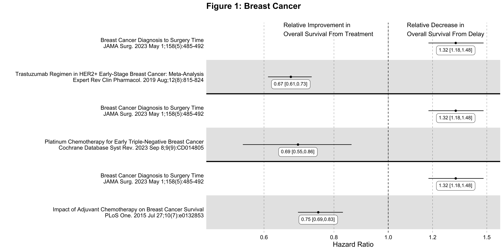
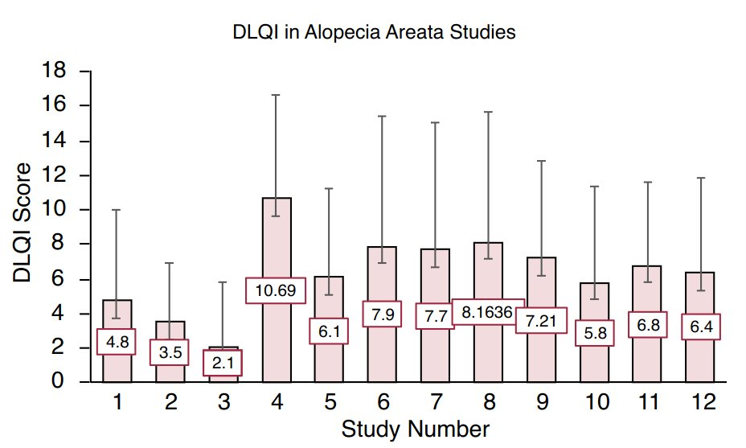
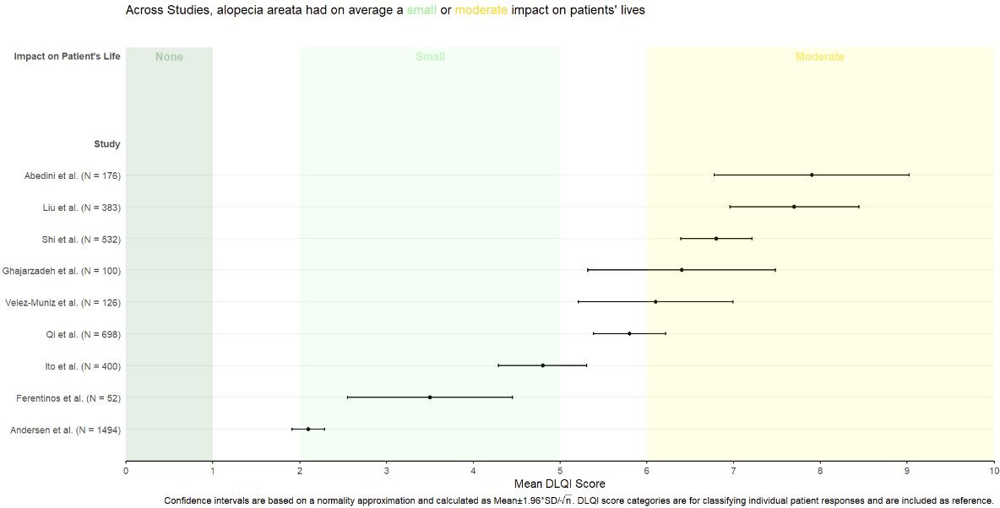
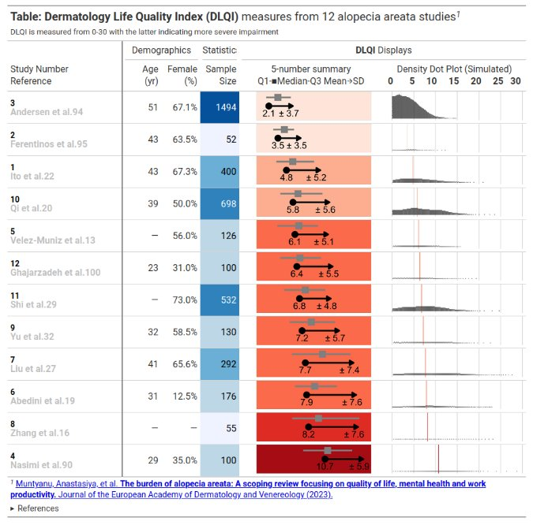
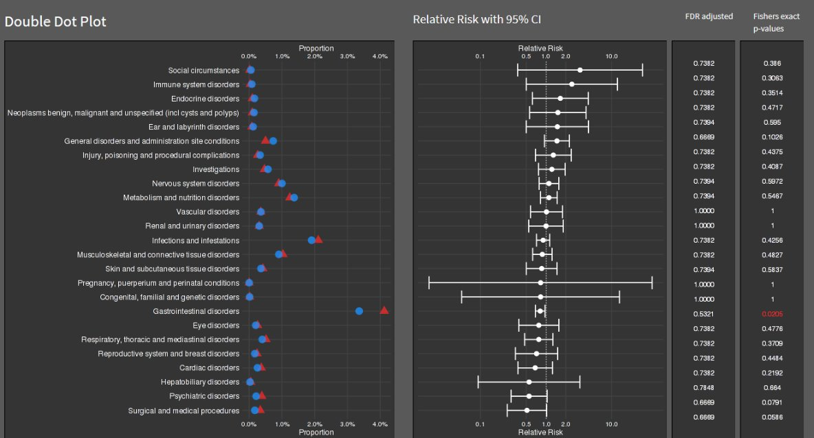

```{r setup, include=FALSE, echo = FALSE,message = FALSE, error = FALSE, warning = FALSE}
knitr::opts_chunk$set(echo = TRUE, fig.width = 10, fig.height = 6)

# <!-- ---------------------------------------------------------------------- -->
# <!--                    1. load the required packages                       -->
# <!-- ---------------------------------------------------------------------- --> 

## if(!require(psych)){install.packages("psych")}

knitr::opts_chunk$set(echo = TRUE)
knitr::opts_chunk$set(echo = TRUE, fig.width = 12, fig.height = 6)
setwd(dirname(rstudioapi::getSourceEditorContext()$path))
# getwd()
# Sys.setlocale("LC_ALL","English")

## devtools::install_github("kupietz/kableExtra")
packages<-c("tidyverse", "kableExtra", 
            "ggpubr","gridExtra","ggtext")
ipak <- function(pkg){
  new.pkg <- pkg[!(pkg %in% installed.packages()[, "Package"])]
  if (length(new.pkg)) 
    install.packages(new.pkg, dependencies = TRUE)
  sapply(pkg, require, character.only = TRUE)
}
ipak(packages)
```
 
 
# General Forest Plot
 

## Annotated Forest Plots Alternative 1


```{r, echo = T,message = FALSE, error = FALSE, warning = FALSE}
## Example data frame
dat <- data.frame(
  Index = c(1, 2, 3, 4), ## This provides an order to the data
  label = c("Age (65 and older versus <65)", "Male versus Female", "High income versus Low income", "High school or higher versus No High school"),
  OR = c(1.00, 2.00, 3.00, 0.50),
  LL = c(0.25, 0.90, 2.25, 0.2),
  UL = c(1.75, 3.10, 3.75, 0.8),
  CI = c("0.25, 1.75", "0.90, 3.10", "2.25, 3.75", "0.20, 0.80")
)
dat

plot1 <- ggplot(dat, aes(y = Index, x = OR)) +
  geom_point(shape = 18, size = 5) +  
  geom_errorbarh(aes(xmin = LL, xmax = UL), height = 0.25) +
  geom_vline(xintercept = 1, color = "red", linetype = "dashed", cex = 1, alpha = 0.5) +
  scale_y_continuous(name = "", breaks=1:4, labels = dat$label, trans = "reverse") +
  xlab("Odds Ratio (95% CI)") + 
  ylab(" ") + 
  theme_bw() +
  theme(panel.border = element_blank(),
        panel.background = element_blank(),
        panel.grid.major = element_blank(), 
        panel.grid.minor = element_blank(), 
        axis.line = element_line(colour = "black"),
        axis.text.y = element_text(size = 12, colour = "black"),
        axis.text.x.bottom = element_text(size = 12, colour = "black"),
        axis.title.x = element_text(size = 12, colour = "black"))


## Create the table-base pallete
table_base <- ggplot(dat, aes(y=label)) +
  ylab(NULL) + xlab("  ") + 
  theme(plot.title = element_text(hjust = 0.5, size=12), 
        axis.text.x = element_text(color="white", hjust = -3, size = 25), ## This is used to help with alignment
        axis.line = element_blank(),
        axis.text.y = element_blank(), 
        axis.ticks = element_blank(),
        axis.title.y = element_blank(), 
        legend.position = "none",
        panel.background = element_blank(), 
        panel.border = element_blank(), 
        panel.grid.major = element_blank(),
        panel.grid.minor = element_blank(), 
        plot.background = element_blank())

## OR point estimate table
tab1 <- table_base + 
  labs(title = "space") +
  geom_text(aes(y = rev(Index), x = 1, label = sprintf("%0.1f", round(OR, digits = 1))), size = 4) + ## decimal places
  ggtitle("OR")

## 95% CI table
tab2 <- table_base +
  geom_text(aes(y = rev(Index), x = 1, label = CI), size = 4) + 
  ggtitle("95% CI")

## Merge tables with plot
library("gridExtra") 
grid.arrange(plot1, tab1, tab2, 
             layout_matrix = matrix(c(1,1,1,1,1,1,1,1,1,1,2,3,3), nrow = 1))
```

## Annotated Forest Plots Alternative 2

```{r, echo = T,message = FALSE, error = FALSE, warning = FALSE}
library("gt")

res_log <- read_csv("https://raw.githubusercontent.com/kathoffman/steroids-trial-emulation/main/output/res_log.csv")
res <- read_csv("https://raw.githubusercontent.com/kathoffman/steroids-trial-emulation/main/output/res.csv")

# res <- res_log |>
#       rename_with(~str_c("log.", .), estimate:conf.high) |>
#   select(-p.value) |>
#   full_join(res)
ForestData <- res_log %>%
      rename_with(~str_c("log.", .), estimate:conf.high) %>%
  select(-p.value) %>%
  full_join(res)
## Get a glimpse of your data
## glimpse(ForestData)
ForestData %>% kbl() %>%
  kable_styling(bootstrap_options = c("striped", "hover", "condensed"))

## Make point and line range section of the plot
p_mid <- ForestData |>
  ## 1. Reverse order of factor levels
  ggplot(aes(y = fct_rev(model))) + 
  theme_classic() +
  ## 2. Show all of our information (point estimate and 95% confidence interval) on the graph
  geom_point(aes(x=log.estimate), shape=15, size=3) +
  geom_linerange(aes(xmin=log.conf.low, xmax=log.conf.high)) +
  ## 3. Add a vertical line at 0 and rename the x axis, zoom to the exact height and width
  geom_vline(xintercept = 0, linetype="dashed") +
  labs(x="Log Hazard Ratio", y="") +
  coord_cartesian(ylim=c(1,11), xlim=c(-1, .5)) +
  ## 4. Add text about protective vs. harmful using the annotate layer
  annotate("text", x = -.32, y = 11, label = "Corticosteroids protective") +
  annotate("text", x = .3, y = 11, label = "Corticosteroids harmful") +
  ## 5. remove everything on the y axis
  theme(axis.line.y = element_blank(),
        axis.ticks.y= element_blank(),
        axis.text.y= element_blank(),
        axis.title.y= element_blank())
p_mid

## Create estimate annotations plot
# wrangle results into pre-plotting table form
# res_plot <- ForestData |>
#   # round estimates and 95% CIs to 2 decimal places for journal specifications
#   mutate(across(
#     c(estimate, conf.low, conf.high),
#     ~ str_pad(
#       round(.x, 2),
#       width = 4,
#       pad = "0",
#       side = "right"
#     )
#   ),
#   # add an "-" between HR estimate confidence intervals
#   estimate_lab = paste0(estimate, " (", conf.low, "-", conf.high, ")")) |>
#   # round p-values to two decimal places, except in cases where p < .001
#   mutate(p.value = case_when(
#     p.value < .001 ~ "<0.001",
#     round(p.value, 2) == .05 ~ as.character(round(p.value,3)),
#     p.value < .01 ~ str_pad( # if less than .01, go one more decimal place
#       as.character(round(p.value, 3)),
#       width = 4,
#       pad = "0",
#       side = "right"
#     ),
#     TRUE ~ str_pad( # otherwise just round to 2 decimal places and pad string so that .2 reads as 0.20
#       as.character(round(p.value, 2)),
#       width = 4,
#       pad = "0",
#       side = "right"
#     )
#   )) |>
#   # add a row of data that are actually column names which will be shown on the plot in the next step
#   bind_rows(
#     data.frame(
#       model = "Model",
#       estimate_lab = "Hazard Ratio (95% CI)",
#       conf.low = "",
#       conf.high = "",
#       p.value = "p-value"
#     )
#   ) |>
#   mutate(model = fct_rev(fct_relevel(model, "Model")))
# saveRDS(res_plot, file = "res_plot.rds")
res_plot <- readRDS("./01_Datasets/res_plot.rds")

res_plot %>% kbl() %>%
  kable_styling(bootstrap_options = c("striped", "hover", "condensed"))

p_left <-
  res_plot  |>
  ggplot(aes(y = model)) +
  geom_text(aes(x = 0, label = model), hjust = 0, fontface = "bold") +
  geom_text(
    aes(x = 1, label = estimate_lab),
    hjust = 0,
    fontface = ifelse(res_plot$estimate_lab == "Hazard Ratio (95% CI)", "bold", "plain") 
  ) +
  ## Remove the background and edit the sizing
  theme_void() +
  coord_cartesian(xlim = c(0, 4))
p_left


## Create p-value annotations
p_right <-
  res_plot  |>
  ggplot() +
  geom_text(
    aes(x = 0, y = model, label = p.value),
    hjust = 0,
    fontface = ifelse(res_plot$p.value == "p-value", "bold", "plain")
  ) +
  theme_void() 
p_right

## Merge tables with plot
library("gridExtra")
grid.arrange(p_left, p_mid, p_right, 
             layout_matrix = matrix(c(1,1,1,2,2,2,2,2,2,2,2,2,3,3), nrow = 1))

## ggsave("forest-plot.eps", width=9, height=4)

```


## meta package

```{r, echo = T,message = FALSE, error = FALSE, warning = FALSE}
Forest.df <- data.frame(study=c('S1', 'S2', 'S3', 'S4', 'S5', 'S6', 'S7'),
                        index=1:7,
                        effect=c(-.4, -.25, -.1, .1, .15, .2, .3),
                        lower=c(-.43, -.29, -.17, -.02, .04, .17, .27),
                        upper=c(-.37, -.21, -.03, .22, .24, .23, .33))
## create forest plot
ggplot(data=Forest.df, 
       aes(y=index, x=effect, xmin=lower, xmax=upper,
           label=as.character(effect))) +
  geom_label(vjust=-0.1) + 
  geom_errorbarh(height=.1) +
  scale_y_continuous(breaks=1:nrow(Forest.df), labels=Forest.df$study) +
  labs(title='Effect Size by Study', 
       x='Effect Size', 
       y = 'Study') +
  geom_vline(xintercept=0, color='black', linetype='dashed', alpha=.5) +
  theme_classic() # theme_minimal()


## https://bookdown.org/MathiasHarrer/Doing_Meta_Analysis_in_R/forest.html
library("meta")
data(Fleiss93)
metaresult<-metabin(event.e, n.e,event.c,n.c,data=Fleiss93,sm="RR",
                    studlab=paste(study, year),random=FALSE)
forest(metaresult)
```


## ggforestplot package (based on SE)

The R package ggforestplot allows to plot vertical forest plots, a.k.a. blobbograms, and it’s based on ggplot2, see more click (here)[https://nightingalehealth.github.io/ggforestplot/articles/ggforestplot.html]

### Basic Forestplot 

```{r, echo = T,message = FALSE, error = FALSE, warning = FALSE}
# devtools::install_github("NightingaleHealth/ggforestplot")
library("ggforestplot")

df <-
  ggforestplot::df_linear_associations %>%
  filter(
    trait == "BMI",
    dplyr::row_number() <= 30
  )

ggforestplot::forestplot(
  df = df,
  name = name,
  estimate = beta,
  se = se,
  pvalue = pvalue,
  psignif = 0.002,
  xlab = "1-SD increment in BMI\nper 1-SD increment in biomarker concentration",
  title = "Associations of blood biomarkers to BMI"
)
```

### Comparing several traits

```{r, echo = T,message = FALSE, error = FALSE, warning = FALSE}
# Extract the biomarker names
selected_bmrs <- df %>% pull(name)

# Filter the demo dataset for the biomarkers above and all three traits:
# BMI, HOMA-IR and fasting glucose
df_compare_traits <-
  ggforestplot::df_linear_associations %>%
  filter(name %in% selected_bmrs) %>%
  # Set class to factor to set order of display.
  mutate(
    trait = factor(
      trait,
      levels = c("BMI", "HOMA-IR", "Fasting glucose")
    )
  )

# Draw a forestplot of cross-sectional, linear associations
# Notice how the df variable 'trait' is used here to color the points
ggforestplot::forestplot(
  df = df_compare_traits,
  estimate = beta,
  pvalue = pvalue,
  psignif = 0.002,
  xlab = "1-SD increment in cardiometabolic trait\nper 1-SD increment in biomarker concentration",
  title = "Biomarker associations to metabolic traits",
  colour = trait
)
```

### Grouping the biomarkers

```{r, echo = T,message = FALSE, error = FALSE, warning = FALSE}
library("ggforce")
# Filter df_NG_biomarker_metadata, that contain the groups, for only the 30
# biomarkers under discussion
df_grouping <-
  df_NG_biomarker_metadata %>%
  filter(name %in% df_compare_traits$name)
# Join the association data frame df_compare_traits with group data
df_compare_traits_groups <-
  df_compare_traits %>%
  # use right_join, with df_grouping on the right, to preserve the order of
  # biomarkers it specifies.
  dplyr::right_join(., df_grouping, by = "name") %>%
  dplyr::mutate(
    group = factor(.data$group, levels = unique(.data$group))
  )

# Draw a forestplot of cross-sectional, linear associations.
forestplot(
  df = df_compare_traits_groups,
  estimate = beta,
  pvalue = pvalue,
  psignif = 0.002,
  xlab = "1-SD increment in cardiometabolic trait\nper 1-SD increment in biomarker concentration",
  colour = trait
) +
  ggforce::facet_col(
    facets = ~group,
    scales = "free_y",
    space = "free"
  )
```

 
 
## ggplot2

```{r, echo = T,message = FALSE, error = FALSE, warning = FALSE, dev="cairo_pdf"}
library(readxl)
Master_Cancer_D01 <- read_excel("./01_Datasets/HR_Ratio_2024.02.09.xlsx")

Breast_Cancer_Factor <- c(
  "3. Impact of Adjuvant Chemotherapy on Breast Cancer Survival",
  "3. Breast Cancer Diagnosis to Surgery Time",
  "2. Platinum Chemotherapy for Early Triple-Negative Breast Cancer",
  "2. Breast Cancer Diagnosis to Surgery Time",
  "1. Trastuzumab Regimen in HER2+ Early-Stage Breast Cancer: Meta-Analysis",
  "1. Breast Cancer Diagnosis to Surgery Time"
  )
 
Breast_Cancer_Label<- c(
  " Impact of Adjuvant Chemotherapy on Breast Cancer Survival",
  " Breast Cancer Diagnosis to Surgery Time",
  "  Platinum Chemotherapy for Early Triple-Negative Breast Cancer",
  "  Breast Cancer Diagnosis to Surgery Time",
  "   Trastuzumab Regimen in HER2+ Early-Stage Breast Cancer: Meta-Analysis",
  "   Breast Cancer Diagnosis to Surgery Time"
  ) 
 
Breast_Cancer_Label <- paste0(Breast_Cancer_Label,
                              "\n",
                              rev(Master_Cancer_D01[which(Master_Cancer_D01$CancerType == "Breast Cancer"),]$Cite))

Breast_Cancer_Data <- Master_Cancer_D01 %>%
  filter(CancerType == "Breast Cancer") %>%
  mutate(Category = factor(Category, levels = Breast_Cancer_Factor, labels=Breast_Cancer_Label))
  
Breast_Cancer_Plot <- 
  Breast_Cancer_Data %>%
  ggplot(aes(x = Estimate, y = Category)) + 
  scale_x_continuous(trans = "log10", 
                breaks = c(0.6, 0.8, 1.0, 1.2, 1.5),
                limits = c(0.5, 1.5)) + 
  theme_forest() + 
  scale_colour_ng_d() + 
  scale_fill_ng_d() + 
  geom_stripes() + 
  geom_vline(xintercept = 1, linetype = "dashed", size = 0.5, colour = "black") + 
  geom_hline(yintercept = 4.5, linetype = "solid", size = 1.2, colour = "black") + 
  geom_hline(yintercept = 2.5, linetype = "solid", size = 1.2, colour = "black") + 
  geom_effect(ggplot2::aes(xmin = conf.low, xmax = conf.high), 
        position = ggstance::position_dodgev(height = 0.5)) + 
        ggplot2::scale_shape_manual(values = c(21L, 22L, 23L, 
            24L, 25L)) + guides(colour = guide_legend(reverse = TRUE), 
        shape = guide_legend(reverse = TRUE)) +
  annotate("text", x = 0.65, y = Inf, label = "Relative Improvement in\nOverall Survival From Treatment", 
           hjust = 0, vjust = 1, colour = "black",size = 5) +
  annotate("text", x = 1.08, y = Inf, label = "Relative Decrease in\nOverall Survival From Delay", 
           hjust = 0, vjust = 1, colour = "black",size = 5) +
  geom_textbox(aes(label = paste0(format(Estimate, digits = 3),
                             " [",
                             format(conf.low, digits = 3),",",
                             format(conf.high, digits = 3),
                             "]"), 
              x = Estimate), hjust = 0.5, vjust = 1.3, width = 0.132)+ 
  labs(title = "Figure 1: Breast Cancer") +
  labs(subtitle = "") +
  labs(x = "Hazard Ratio") +
  labs(y = "") +
  theme(text = element_text(size = 16)) 

png('./02_Plots/Visualization/ForestPlot/HR_Breast_Cancer.png',width=16, height=8,unit="in", res=600)
Breast_Cancer_Plot
dev.off()


```


# Alternative to Forest Plot

## Errorbar



**Source: Figure 2 in Muntyanu A, Gabrielli S, Donovan J, Gooderham M, Guenther L, Hanna S, et al. The burden of alopecia areata: A scoping review focusing on quality of life, mental health and work productivity. J Eur Acad Dermatol Venereol. 2023; 37: 1490–1520. https://doi.org/10.1111/jdv.18926**


```{r, echo = T,message = FALSE, error = FALSE, warning = FALSE}
# Example data frame
data <- data.frame(
  Study_Number = 1:12,
  Mean_DLQI = c(4.8, 3.5, 2.1, 10.69, 6.1, 7.9, 7.7, 8.1636, 7.21, 5.8, 6.8, 6.4),
  Lower_CI = c(2, 1, 1, 9, 4, 6, 5, 7, 6, 4, 5, 5),  # Example lower CI values
  Upper_CI = c(8, 6, 4, 12, 8, 10, 10, 10, 9, 8, 9, 8)  # Example upper CI values
)
 

ggplot(data, aes(x = factor(Study_Number), y = Mean_DLQI)) +
  geom_col(fill = "salmon", width = 0.7) +  # Bars with salmon fill
  geom_errorbar(aes(ymin = Lower_CI, ymax = Upper_CI), width = 0.2, color = "black") +  # Error bars
  geom_label(aes(label = round(Mean_DLQI, 2)), vjust = -1.5, fill = "white", color = "black", 
             fontface = "bold", label.size = 0.5) +  # Label with white background
  labs(
    title = "DLQI in Alopecia Areata Studies",
    x = "Study Number",
    y = "DLQI Score"
  ) +
  theme_minimal() +
  theme(
    plot.title = element_text(hjust = 0.5),  # Centering the title
    axis.title.x = element_text(face = "bold"),
    axis.title.y = element_text(face = "bold"),
    axis.text.x = element_text(angle = 90, hjust = 1)  # Angle x axis text for readability
  )

```


## Updated version 1



```{r, echo = T,message = FALSE, error = FALSE, warning = FALSE}
# Sample data
data <- data.frame(
  Study = c("Abedini et al.", "Liu et al.", "Shi et al.", "Ghajarzadeh et al.",
            "Velez-Muniz et al.", "Qi et al.", "Ito et al.", "Ferentinos et al.", "Andersen et al."),
  N = c(176, 383, 532, 100, 126, 698, 400, 52, 1494),
  Mean_DLQI = c(1.5, 2.5, 3.0, 4.0, 5.5, 4.5, 6.0, 6.5, 7.0),
  Lower_CI = c(0.5, 1.5, 2.5, 3.5, 4.0, 3.5, 5.5, 6.0, 6.0),
  Upper_CI = c(2.5, 3.5, 3.5, 4.5, 7.0, 5.5, 6.5, 8.0, 10.0)
)

data <- data %>%
  arrange(Mean_DLQI) %>%
  mutate(Study = factor(Study, levels = Study))

# Determine the number of studies to set the y position for annotations
num_studies <- nrow(data)

ggplot(data, aes(y = Study, x = Mean_DLQI, xmin = Lower_CI, xmax = Upper_CI)) +
  geom_rect(aes(xmin = 0, xmax = 1, ymin = -Inf, ymax = Inf), fill = "#FFD885", alpha = 0.2) +  # None
  geom_rect(aes(xmin = 2, xmax = 5, ymin = -Inf, ymax = Inf), fill = "#E4D383", alpha = 0.2) +  # Small
  geom_rect(aes(xmin = 6, xmax = 10, ymin = -Inf, ymax = Inf), fill = "#9BBC93", alpha = 0.2) +  # Moderate
  geom_pointrange(size = 0.5, color = "black") +
  annotate("text", x = 1, y = num_studies + 0.5, label = "None", vjust = 0) +
  annotate("text", x = 3.5, y = num_studies + 0.5, label = "Small", vjust = 0) +
  annotate("text", x = 7.5, y = num_studies + 0.5, label = "Medium", vjust = 0) +
  scale_y_discrete(limits = c(levels(data$Study), " "), expand = c(0, 0.1)) +  # Extend y-axis
  scale_x_continuous("Mean DLQI Score", breaks = 0:10) +
  labs(y = "Study", title = "Across Studies, alopecia areata had on average a small or moderate impact on patients' lives") +
  theme_minimal() +
  theme(panel.grid.major = element_blank(), panel.grid.minor = element_blank())
```


## Updated version 2



 
## Double Dot Plot 




# Reference

* SIG (2024, Feb. 8). VIS-SIG Blog: Wonderful Wednesdays February 2024. Retrieved from https://graphicsprinciples.github.io/posts/2024-09-01-wonderful-wednesdays-february-2024/