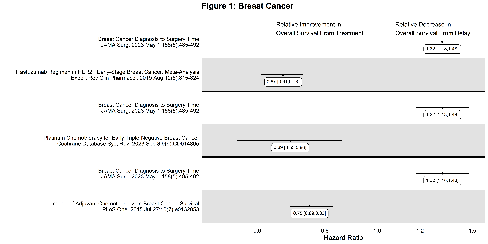
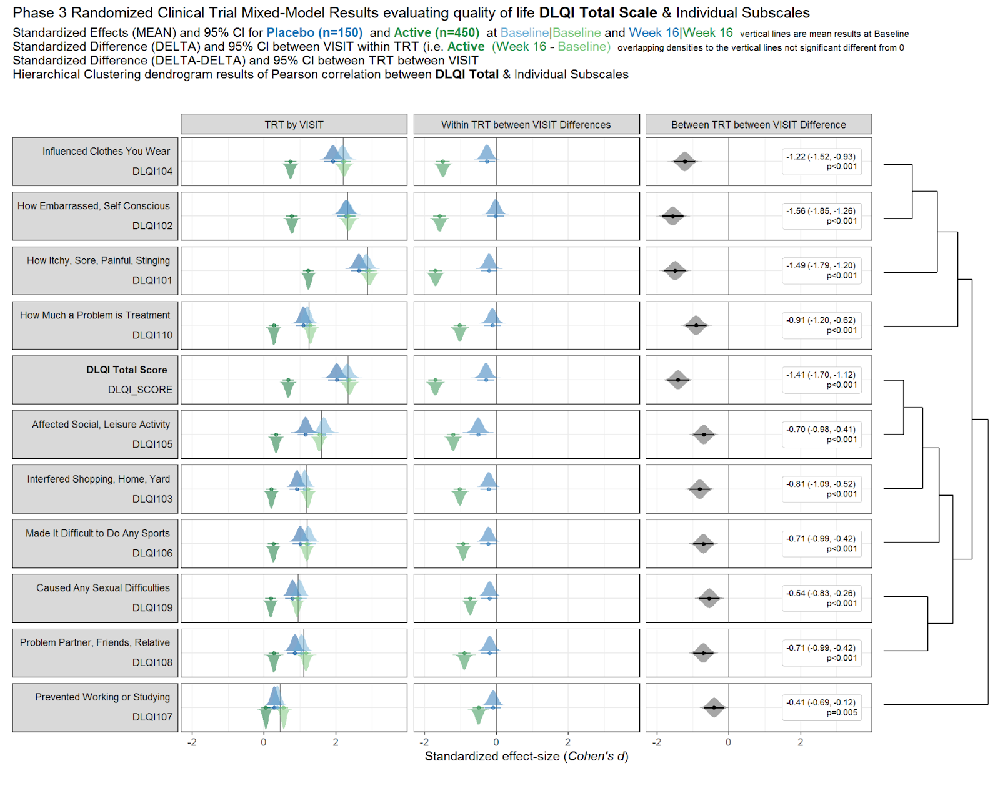

```{r setup, include=FALSE, echo = FALSE,message = FALSE, error = FALSE, warning = FALSE}
knitr::opts_chunk$set(echo = TRUE, fig.width = 10, fig.height = 6)

# <!-- ---------------------------------------------------------------------- -->
# <!--                    1. load the required packages                       -->
# <!-- ---------------------------------------------------------------------- --> 

## if(!require(psych)){install.packages("psych")}

knitr::opts_chunk$set(echo = TRUE)
knitr::opts_chunk$set(echo = TRUE, fig.width = 12, fig.height = 6)
setwd(dirname(rstudioapi::getSourceEditorContext()$path))
# getwd()
# Sys.setlocale("LC_ALL","English")

## devtools::install_github("kupietz/kableExtra")
packages<-c("tidyverse", "kableExtra", 
            "ggpubr","gridExtra","ggtext")
ipak <- function(pkg){
  new.pkg <- pkg[!(pkg %in% installed.packages()[, "Package"])]
  if (length(new.pkg)) 
    install.packages(new.pkg, dependencies = TRUE)
  sapply(pkg, require, character.only = TRUE)
}
ipak(packages)
```
 
 
# General Forest Plot
 

## Annotated Forest Plots Alternative 1


```{r, echo = T,message = FALSE, error = FALSE, warning = FALSE}
## Example data frame
dat <- data.frame(
  Index = c(1, 2, 3, 4), ## This provides an order to the data
  label = c("Age (65 and older versus <65)", "Male versus Female", "High income versus Low income", "High school or higher versus No High school"),
  OR = c(1.00, 2.00, 3.00, 0.50),
  LL = c(0.25, 0.90, 2.25, 0.2),
  UL = c(1.75, 3.10, 3.75, 0.8),
  CI = c("0.25, 1.75", "0.90, 3.10", "2.25, 3.75", "0.20, 0.80")
)
dat

plot1 <- ggplot(dat, aes(y = Index, x = OR)) +
  geom_point(shape = 18, size = 5) +  
  geom_errorbarh(aes(xmin = LL, xmax = UL), height = 0.25) +
  geom_vline(xintercept = 1, color = "red", linetype = "dashed", cex = 1, alpha = 0.5) +
  scale_y_continuous(name = "", breaks=1:4, labels = dat$label, trans = "reverse") +
  xlab("Odds Ratio (95% CI)") + 
  ylab(" ") + 
  theme_bw() +
  theme(panel.border = element_blank(),
        panel.background = element_blank(),
        panel.grid.major = element_blank(), 
        panel.grid.minor = element_blank(), 
        axis.line = element_line(colour = "black"),
        axis.text.y = element_text(size = 12, colour = "black"),
        axis.text.x.bottom = element_text(size = 12, colour = "black"),
        axis.title.x = element_text(size = 12, colour = "black"))


## Create the table-base pallete
table_base <- ggplot(dat, aes(y=label)) +
  ylab(NULL) + xlab("  ") + 
  theme(plot.title = element_text(hjust = 0.5, size=12), 
        axis.text.x = element_text(color="white", hjust = -3, size = 25), ## This is used to help with alignment
        axis.line = element_blank(),
        axis.text.y = element_blank(), 
        axis.ticks = element_blank(),
        axis.title.y = element_blank(), 
        legend.position = "none",
        panel.background = element_blank(), 
        panel.border = element_blank(), 
        panel.grid.major = element_blank(),
        panel.grid.minor = element_blank(), 
        plot.background = element_blank())

## OR point estimate table
tab1 <- table_base + 
  labs(title = "space") +
  geom_text(aes(y = rev(Index), x = 1, label = sprintf("%0.1f", round(OR, digits = 1))), size = 4) + ## decimal places
  ggtitle("OR")

## 95% CI table
tab2 <- table_base +
  geom_text(aes(y = rev(Index), x = 1, label = CI), size = 4) + 
  ggtitle("95% CI")

## Merge tables with plot
library("gridExtra") 
grid.arrange(plot1, tab1, tab2, 
             layout_matrix = matrix(c(1,1,1,1,1,1,1,1,1,1,2,3,3), nrow = 1))
```

## Annotated Forest Plots Alternative 2

```{r, echo = T,message = FALSE, error = FALSE, warning = FALSE}
library("gt")

res_log <- read_csv("https://raw.githubusercontent.com/kathoffman/steroids-trial-emulation/main/output/res_log.csv")
res <- read_csv("https://raw.githubusercontent.com/kathoffman/steroids-trial-emulation/main/output/res.csv")

# res <- res_log |>
#       rename_with(~str_c("log.", .), estimate:conf.high) |>
#   select(-p.value) |>
#   full_join(res)
ForestData <- res_log %>%
      rename_with(~str_c("log.", .), estimate:conf.high) %>%
  select(-p.value) %>%
  full_join(res)
## Get a glimpse of your data
## glimpse(ForestData)
ForestData %>% kbl() %>%
  kable_styling(bootstrap_options = c("striped", "hover", "condensed"))

## Make point and line range section of the plot
p_mid <- ForestData |>
  ## 1. Reverse order of factor levels
  ggplot(aes(y = fct_rev(model))) + 
  theme_classic() +
  ## 2. Show all of our information (point estimate and 95% confidence interval) on the graph
  geom_point(aes(x=log.estimate), shape=15, size=3) +
  geom_linerange(aes(xmin=log.conf.low, xmax=log.conf.high)) +
  ## 3. Add a vertical line at 0 and rename the x axis, zoom to the exact height and width
  geom_vline(xintercept = 0, linetype="dashed") +
  labs(x="Log Hazard Ratio", y="") +
  coord_cartesian(ylim=c(1,11), xlim=c(-1, .5)) +
  ## 4. Add text about protective vs. harmful using the annotate layer
  annotate("text", x = -.32, y = 11, label = "Corticosteroids protective") +
  annotate("text", x = .3, y = 11, label = "Corticosteroids harmful") +
  ## 5. remove everything on the y axis
  theme(axis.line.y = element_blank(),
        axis.ticks.y= element_blank(),
        axis.text.y= element_blank(),
        axis.title.y= element_blank())
p_mid

## Create estimate annotations plot
# wrangle results into pre-plotting table form
# res_plot <- ForestData |>
#   # round estimates and 95% CIs to 2 decimal places for journal specifications
#   mutate(across(
#     c(estimate, conf.low, conf.high),
#     ~ str_pad(
#       round(.x, 2),
#       width = 4,
#       pad = "0",
#       side = "right"
#     )
#   ),
#   # add an "-" between HR estimate confidence intervals
#   estimate_lab = paste0(estimate, " (", conf.low, "-", conf.high, ")")) |>
#   # round p-values to two decimal places, except in cases where p < .001
#   mutate(p.value = case_when(
#     p.value < .001 ~ "<0.001",
#     round(p.value, 2) == .05 ~ as.character(round(p.value,3)),
#     p.value < .01 ~ str_pad( # if less than .01, go one more decimal place
#       as.character(round(p.value, 3)),
#       width = 4,
#       pad = "0",
#       side = "right"
#     ),
#     TRUE ~ str_pad( # otherwise just round to 2 decimal places and pad string so that .2 reads as 0.20
#       as.character(round(p.value, 2)),
#       width = 4,
#       pad = "0",
#       side = "right"
#     )
#   )) |>
#   # add a row of data that are actually column names which will be shown on the plot in the next step
#   bind_rows(
#     data.frame(
#       model = "Model",
#       estimate_lab = "Hazard Ratio (95% CI)",
#       conf.low = "",
#       conf.high = "",
#       p.value = "p-value"
#     )
#   ) |>
#   mutate(model = fct_rev(fct_relevel(model, "Model")))
# saveRDS(res_plot, file = "res_plot.rds")
res_plot <- readRDS("./01_Datasets/res_plot.rds")

res_plot %>% kbl() %>%
  kable_styling(bootstrap_options = c("striped", "hover", "condensed"))

p_left <-
  res_plot  |>
  ggplot(aes(y = model)) +
  geom_text(aes(x = 0, label = model), hjust = 0, fontface = "bold") +
  geom_text(
    aes(x = 1, label = estimate_lab),
    hjust = 0,
    fontface = ifelse(res_plot$estimate_lab == "Hazard Ratio (95% CI)", "bold", "plain") 
  ) +
  ## Remove the background and edit the sizing
  theme_void() +
  coord_cartesian(xlim = c(0, 4))
p_left


## Create p-value annotations
p_right <-
  res_plot  |>
  ggplot() +
  geom_text(
    aes(x = 0, y = model, label = p.value),
    hjust = 0,
    fontface = ifelse(res_plot$p.value == "p-value", "bold", "plain")
  ) +
  theme_void() 
p_right

## Merge tables with plot
library("gridExtra")
grid.arrange(p_left, p_mid, p_right, 
             layout_matrix = matrix(c(1,1,1,2,2,2,2,2,2,2,2,2,3,3), nrow = 1))

## ggsave("forest-plot.eps", width=9, height=4)

```


## meta package

```{r, echo = T,message = FALSE, error = FALSE, warning = FALSE}
Forest.df <- data.frame(study=c('S1', 'S2', 'S3', 'S4', 'S5', 'S6', 'S7'),
                        index=1:7,
                        effect=c(-.4, -.25, -.1, .1, .15, .2, .3),
                        lower=c(-.43, -.29, -.17, -.02, .04, .17, .27),
                        upper=c(-.37, -.21, -.03, .22, .24, .23, .33))
## create forest plot
ggplot(data=Forest.df, 
       aes(y=index, x=effect, xmin=lower, xmax=upper,
           label=as.character(effect))) +
  geom_label(vjust=-0.1) + 
  geom_errorbarh(height=.1) +
  scale_y_continuous(breaks=1:nrow(Forest.df), labels=Forest.df$study) +
  labs(title='Effect Size by Study', 
       x='Effect Size', 
       y = 'Study') +
  geom_vline(xintercept=0, color='black', linetype='dashed', alpha=.5) +
  theme_classic() # theme_minimal()


## https://bookdown.org/MathiasHarrer/Doing_Meta_Analysis_in_R/forest.html
library("meta")
data(Fleiss93)
metaresult<-metabin(event.e, n.e,event.c,n.c,data=Fleiss93,sm="RR",
                    studlab=paste(study, year),random=FALSE)
forest(metaresult)
```


## ggforestplot package (based on SE)

The R package ggforestplot allows to plot vertical forest plots, a.k.a. blobbograms, and it’s based on ggplot2, see more click (here)[https://nightingalehealth.github.io/ggforestplot/articles/ggforestplot.html]

### Basic Forestplot 

```{r, echo = T,message = FALSE, error = FALSE, warning = FALSE}
# devtools::install_github("NightingaleHealth/ggforestplot")
library("ggforestplot")

df <-
  ggforestplot::df_linear_associations %>%
  filter(
    trait == "BMI",
    dplyr::row_number() <= 30
  )

ggforestplot::forestplot(
  df = df,
  name = name,
  estimate = beta,
  se = se,
  pvalue = pvalue,
  psignif = 0.002,
  xlab = "1-SD increment in BMI\nper 1-SD increment in biomarker concentration",
  title = "Associations of blood biomarkers to BMI"
)
```

### Comparing several traits

```{r, echo = T,message = FALSE, error = FALSE, warning = FALSE}
# Extract the biomarker names
selected_bmrs <- df %>% pull(name)

# Filter the demo dataset for the biomarkers above and all three traits:
# BMI, HOMA-IR and fasting glucose
df_compare_traits <-
  ggforestplot::df_linear_associations %>%
  filter(name %in% selected_bmrs) %>%
  # Set class to factor to set order of display.
  mutate(
    trait = factor(
      trait,
      levels = c("BMI", "HOMA-IR", "Fasting glucose")
    )
  )

# Draw a forestplot of cross-sectional, linear associations
# Notice how the df variable 'trait' is used here to color the points
ggforestplot::forestplot(
  df = df_compare_traits,
  estimate = beta,
  pvalue = pvalue,
  psignif = 0.002,
  xlab = "1-SD increment in cardiometabolic trait\nper 1-SD increment in biomarker concentration",
  title = "Biomarker associations to metabolic traits",
  colour = trait
)
```

### Grouping the biomarkers

```{r, echo = T,message = FALSE, error = FALSE, warning = FALSE}
library("ggforce")
# Filter df_NG_biomarker_metadata, that contain the groups, for only the 30
# biomarkers under discussion
df_grouping <-
  df_NG_biomarker_metadata %>%
  filter(name %in% df_compare_traits$name)
# Join the association data frame df_compare_traits with group data
df_compare_traits_groups <-
  df_compare_traits %>%
  # use right_join, with df_grouping on the right, to preserve the order of
  # biomarkers it specifies.
  dplyr::right_join(., df_grouping, by = "name") %>%
  dplyr::mutate(
    group = factor(.data$group, levels = unique(.data$group))
  )

# Draw a forestplot of cross-sectional, linear associations.
forestplot(
  df = df_compare_traits_groups,
  estimate = beta,
  pvalue = pvalue,
  psignif = 0.002,
  xlab = "1-SD increment in cardiometabolic trait\nper 1-SD increment in biomarker concentration",
  colour = trait
) +
  ggforce::facet_col(
    facets = ~group,
    scales = "free_y",
    space = "free"
  )
```

 
 
## ggplot2

```{r, echo = T,message = FALSE, error = FALSE, warning = FALSE, dev="cairo_pdf"}
library(readxl)
Master_Cancer_D01 <- read_excel("./01_Datasets/HR_Ratio_2024.02.09.xlsx")

Breast_Cancer_Factor <- c(
  "3. Impact of Adjuvant Chemotherapy on Breast Cancer Survival",
  "3. Breast Cancer Diagnosis to Surgery Time",
  "2. Platinum Chemotherapy for Early Triple-Negative Breast Cancer",
  "2. Breast Cancer Diagnosis to Surgery Time",
  "1. Trastuzumab Regimen in HER2+ Early-Stage Breast Cancer: Meta-Analysis",
  "1. Breast Cancer Diagnosis to Surgery Time"
  )
 
Breast_Cancer_Label<- c(
  " Impact of Adjuvant Chemotherapy on Breast Cancer Survival",
  " Breast Cancer Diagnosis to Surgery Time",
  "  Platinum Chemotherapy for Early Triple-Negative Breast Cancer",
  "  Breast Cancer Diagnosis to Surgery Time",
  "   Trastuzumab Regimen in HER2+ Early-Stage Breast Cancer: Meta-Analysis",
  "   Breast Cancer Diagnosis to Surgery Time"
  ) 
 
Breast_Cancer_Label <- paste0(Breast_Cancer_Label,
                              "\n",
                              rev(Master_Cancer_D01[which(Master_Cancer_D01$CancerType == "Breast Cancer"),]$Cite))

Breast_Cancer_Data <- Master_Cancer_D01 %>%
  filter(CancerType == "Breast Cancer") %>%
  mutate(Category = factor(Category, levels = Breast_Cancer_Factor, labels=Breast_Cancer_Label))
  
Breast_Cancer_Plot <- 
  Breast_Cancer_Data %>%
  ggplot(aes(x = Estimate, y = Category)) + 
  scale_x_continuous(trans = "log10", 
                breaks = c(0.6, 0.8, 1.0, 1.2, 1.5),
                limits = c(0.5, 1.5)) + 
  theme_forest() + 
  scale_colour_ng_d() + 
  scale_fill_ng_d() + 
  geom_stripes() + 
  geom_vline(xintercept = 1, linetype = "dashed", size = 0.5, colour = "black") + 
  geom_hline(yintercept = 4.5, linetype = "solid", size = 1.2, colour = "black") + 
  geom_hline(yintercept = 2.5, linetype = "solid", size = 1.2, colour = "black") + 
  geom_effect(ggplot2::aes(xmin = conf.low, xmax = conf.high), 
        position = ggstance::position_dodgev(height = 0.5)) + 
        ggplot2::scale_shape_manual(values = c(21L, 22L, 23L, 
            24L, 25L)) + guides(colour = guide_legend(reverse = TRUE), 
        shape = guide_legend(reverse = TRUE)) +
  annotate("text", x = 0.65, y = Inf, label = "Relative Improvement in\nOverall Survival From Treatment", 
           hjust = 0, vjust = 1, colour = "black",size = 5) +
  annotate("text", x = 1.08, y = Inf, label = "Relative Decrease in\nOverall Survival From Delay", 
           hjust = 0, vjust = 1, colour = "black",size = 5) +
  geom_textbox(aes(label = paste0(format(Estimate, digits = 3),
                             " [",
                             format(conf.low, digits = 3),",",
                             format(conf.high, digits = 3),
                             "]"), 
              x = Estimate), hjust = 0.5, vjust = 1.3, width = 0.132)+ 
  labs(title = "Figure 1: Breast Cancer") +
  labs(subtitle = "") +
  labs(x = "Hazard Ratio") +
  labs(y = "") +
  theme(text = element_text(size = 16)) 

png('./02_Plots/Visualization/ForestPlot/HR_Breast_Cancer.png',width=16, height=8,unit="in", res=600)
Breast_Cancer_Plot
dev.off()


```


# Alternative to Forest Plot DLQI Data


## Errorbar


**Source: Figure 2 in Muntyanu A, Gabrielli S, Donovan J, Gooderham M, Guenther L, Hanna S, et al. The burden of alopecia areata: A scoping review focusing on quality of life, mental health and work productivity. J Eur Acad Dermatol Venereol. 2023; 37: 1490–1520. https://doi.org/10.1111/jdv.18926**


```{r, echo = T,message = FALSE, error = FALSE, warning = FALSE}
# Example data frame
data <- data.frame(
  Study_Number = 1:12,
  Mean_DLQI = c(4.8, 3.5, 2.1, 10.69, 6.1, 7.9, 7.7, 8.1636, 7.21, 5.8, 6.8, 6.4),
  Lower_CI = c(2, 1, 1, 9, 4, 6, 5, 7, 6, 4, 5, 5),  # Example lower CI values
  Upper_CI = c(8, 6, 4, 12, 8, 10, 10, 10, 9, 8, 9, 8)  # Example upper CI values
)
 

ggplot(data, aes(x = factor(Study_Number), y = Mean_DLQI)) +
  geom_col(fill = "salmon", width = 0.7) +  # Bars with salmon fill
  geom_errorbar(aes(ymin = Lower_CI, ymax = Upper_CI), width = 0.2, color = "black") +  # Error bars
  geom_label(aes(label = round(Mean_DLQI, 2)), vjust = -1.5, fill = "white", color = "black", 
             fontface = "bold", label.size = 0.5) +  # Label with white background
  labs(
    title = "DLQI in Alopecia Areata Studies",
    x = "Study Number",
    y = "DLQI Score"
  ) +
  theme_minimal() +
  theme(
    plot.title = element_text(hjust = 0.5),  # Centering the title
    axis.title.x = element_text(face = "bold"),
    axis.title.y = element_text(face = "bold"),
    axis.text.x = element_text(angle = 90, hjust = 1)  # Angle x axis text for readability
  )

```


## Mean DLQI

This is a simple, but clean visualisation with logical ordering of studies based on mean DLQI score. As per some of the other submissions, the axes have been flipped here compared to the original, published visualisation. This allows for the author name and sample size to be displayed on the label, as well as sample size. However, sample size could more effectively be encoded within the plot itself, to save the reader from having to study the axis labels at length. There is a telling title added with colours nicely included to link the title to the plot itself. Additional information is deferred to a footnote, and here shading is used to display the meaningful DLQI categories (again, these categories are for DLQI scores at a total level). These categories motivate a panel discussion on how useful it is to display these categories, corresponding to individual patients, for a presentation of the mean. The issue here is that, due to DLQI only taking integer scores for each patient, the meaningful categories have gaps between their extremes. The author has chosen to leave these as blank space in the plot, which could be confusing for a reader who is not familiar with DLQI scores or the categories. An alternative would be to use the midpoints (1.5 and 5.5 for the displayed categories) as the values to change the shading at. This submission also lead to a nice discussion on minimising white space, while avoiding confusion. The user only takes the x-axis as far as a score of 10, which captures all the observed data, while presenting it in the maximum amount of space to allow comparison between the categories. However, it could mislead the reader that several studies have a mean DLQI score close to the upper limit of those which can be taken by the tool (which is not the case, DLQI scores can be as high as 30). Taking the x-axis as far as 30 here would give an easier interpretation of the overall experience of patients with alopecia areata, compared with what is possible.


```{r, echo = T,message = FALSE, error = FALSE, warning = FALSE}
# Sample data
data <- data.frame(
  Study = c("Abedini et al.", "Liu et al.", "Shi et al.", "Ghajarzadeh et al.",
            "Velez-Muniz et al.", "Qi et al.", "Ito et al.", "Ferentinos et al.", "Andersen et al."),
  N = c(176, 383, 532, 100, 126, 698, 400, 52, 1494),
  Mean_DLQI = c(1.5, 2.5, 3.0, 4.0, 5.5, 4.5, 6.0, 6.5, 7.0),
  Lower_CI = c(0.5, 1.5, 2.5, 3.5, 4.0, 3.5, 5.5, 6.0, 6.0),
  Upper_CI = c(2.5, 3.5, 3.5, 4.5, 7.0, 5.5, 6.5, 8.0, 10.0)
)

data <- data %>%
  arrange(Mean_DLQI) %>%
  mutate(Study = factor(Study, levels = Study))

# Determine the number of studies to set the y position for annotations
num_studies <- nrow(data)

ggplot(data, aes(y = Study, x = Mean_DLQI, xmin = Lower_CI, xmax = Upper_CI)) +
  geom_rect(aes(xmin = 0, xmax = 1, ymin = -Inf, ymax = Inf), fill = "#FFD885", alpha = 0.2) +  # None
  geom_rect(aes(xmin = 2, xmax = 5, ymin = -Inf, ymax = Inf), fill = "#E4D383", alpha = 0.2) +  # Small
  geom_rect(aes(xmin = 6, xmax = 10, ymin = -Inf, ymax = Inf), fill = "#9BBC93", alpha = 0.2) +  # Moderate
  geom_pointrange(size = 0.5, color = "black") +
  annotate("text", x = 1, y = num_studies + 0.5, label = "None", vjust = 0) +
  annotate("text", x = 3.5, y = num_studies + 0.5, label = "Small", vjust = 0) +
  annotate("text", x = 7.5, y = num_studies + 0.5, label = "Medium", vjust = 0) +
  scale_y_discrete(limits = c(levels(data$Study), " "), expand = c(0, 0.1)) +  # Extend y-axis
  scale_x_continuous("Mean DLQI Score", breaks = 0:10) +
  labs(y = "Study", title = "Across Studies, alopecia areata had on average a small or moderate impact on patients' lives") +
  theme_minimal() +
  theme(panel.grid.major = element_blank(), panel.grid.minor = element_blank())
```


```{r, echo = T,message = FALSE, error = FALSE, warning = FALSE}
# Clear environment and read in libraries
rm(list = ls())
library(tidyverse)
library(scales)
library(ggtext)

# Simulate 4 studies with different treatments/sample sizes
subjects <- as.character(seq(1, 850))

trts <- c(sample(c('Placebo', 'A', 'B'),
                 size = 300, replace = T),
          sample(c('Placebo', 'C'),
                 size = 100, replace = T),
          sample(c('B', 'C'),
                 size = 300, replace = T),
          sample(c('B', 'D'),
                 size = 150, replace = T))

studies <- c(rep('Study 1', 300),
             rep('Study 2', 100),
             rep('Study 3', 300),
             rep('Study 4', 150))

visits <- c(rep(seq(0, 100, length.out = 10), each = 300),
            rep(seq(0, 75,  length.out  = 8), each = 100),
            rep(seq(0, 100, length.out = 10), each = 300),
            rep(seq(0, 50,  length.out = 6),  each = 150))

# Random study effects
study_effs <- c(rep(rnorm(1, sd = 3), 300),
                rep(rnorm(1, sd = 3), 100),
                rep(rnorm(1, sd = 3), 300),
                rep(rnorm(1, sd = 3), 150))

# Random subject effects
sub_effs <- rnorm(850, 0, 3)

# Repeat values for each visit e.g. in study 1, each subject needs 10 records
split <- function(vec){
  return(
    c(rep(vec[1:300], 10),
      rep(vec[301:400], 8),
      rep(vec[401:700], 10),
      rep(vec[701:850], 6)))
}

# Create study dataframe
df <- data.frame(subject   = split(subjects),
                 study     = split(studies),
                 trt       = split(trts),
                 study_eff = split(study_effs),
                 sub_eff   = split(sub_effs),
                 time      = as.character(round(visits, 0)))

# Find each subject/treatment combo - will need to merge this on later
subject_df <- df %>%
              select(subject, trt) %>%
              mutate(trt = if_else(trt != 'Placebo',
                                   paste0('Treatment ', trt),
                                   trt)) %>%
              unique()

# Coefficients for treatment variables
beta0 <- 15
betaA <- 0.2
betaB <- -0.1
betaC <- 0.1
betaD <- 0.05

# Coefficients for interaction variables
gamma <- 0.01
gammaA <- 0.025
gammaB <- -0.1
gammaC <- 0.0001
gammaD <- -0.05


# Find DLQI score for each 
dlqi_calc <- function(n, A, B, C, D, time, study_eff, sub_eff){
  
  dlqi <- beta0 + betaA*A + betaB*B +
          betaC*C + betaD*D + 
          gamma*time + gammaA*A*time + gammaB*B*time +
          gammaC*C*time + gammaD*D*time +
          sub_eff + study_eff
  
  return(rnorm(n, dlqi, 3))
}


dlqi_df <- df %>%
  
           # Create variables needed for dlqi_calc
           pivot_wider(id_cols = c(subject, study, study_eff, sub_eff, time),
                       names_from = trt,
                       values_from = trt,
                       values_fn = length,
                       values_fill = 0) %>%
           mutate(time = as.numeric(time),
                  dlqi = dlqi_calc(n(), A, B, C, D, time, study_eff, sub_eff),
                  
                  # Apply cut-off thresholds
                  dlqi = case_when(
                                   dlqi < 0 ~ 0,
                                   dlqi > 30 ~ 30,
                                   T ~ dlqi)) %>%
           left_join(subject_df, by = 'subject') %>%
           group_by(trt, study, time) %>%
           mutate(mean = mean(dlqi),
                  
                  # Add some jitter so plot points are not over-layed
                  time = case_when(study == 'Study 1' & trt == 'Placebo' ~ time - 2,
                          study == 'Study 1' & trt == 'Treatment B' ~ time + 2,
                          study == 'Study 2' & trt == 'Placebo' ~ time - 1,
                          study == 'Study 2' & trt == 'Treatment C' ~ time + 1,
                          study == 'Study 3' & trt == 'Treatment B' ~ time - 1,
                          study == 'Study 3' & trt == 'Treatment C' ~ time + 1,
                          study == 'Study 4' & trt == 'Treatment D' ~ time + 1,
                          study == 'Study 4' & trt == 'Treatment B' ~ time - 1,
                          T ~ time))
  
# Color the subscript treatment labels
color_label <- function(color, trt){
    paste0("N",
    "<sub><span style = 'color:", color, ";'>", trt, "</span></sub></span>")
}

nP <- color_label(hue_pal()(5)[1], 'P')
nA <- color_label(hue_pal()(5)[2], 'A')
nB <- color_label(hue_pal()(5)[3], 'B')
nC <- color_label(hue_pal()(5)[4], 'C')
nD <- color_label(hue_pal()(5)[5], 'D')

# Create the desired facet labels
study.labs <- c(paste0('Study 1 <br><br>',
                       nP, ' = ', nA, ' = ', nB, ' = 100'),
                paste0('Study 2 <br><br>' ,
                       nP, ' = ', nC, ' = ', '50'),
                paste0('Study 3 <br><br>',
                       nB, ' = ', nC, ' = ', '100'),
                paste0('Study 4 <br><br>',
                       nB, ' = ', nD, ' = ', '75'))

names(study.labs) <- c('Study 1', 'Study 2', 'Study 3', 'Study 4')

# Create the plot
png("./02_Plots/Visualization/ForestPlot/DLQI_5.png", res = 500, height = 5, width = 7, units = 'in')

ggplot(data = dlqi_df) +
  
  geom_point(aes(x = time,
                 y = dlqi,
                 color = trt), alpha = 0.1, size = 0.3) +
  
  facet_wrap(~study, ncol = 1, strip.position = 'right',
             labeller = labeller(study = study.labs)) +
  
  geom_line(aes(x = time,
                y = mean,
                group = trt,
                color = trt),
            size = 0.5, alpha = 0.75) +
  
  theme(panel.background       = element_rect(fill = 'gray10'),
        panel.border           = element_rect(color = 'gray20', 
                                              size  = unit(1, 'in'), 
                                              fill  = NA),
        plot.margin            = margin(20, 20, 20, 20),
        panel.grid.minor       = element_blank(),
        plot.background        = element_rect(fill  = 'gray10', 
                                              color = 'gray10'),
        panel.grid.major       = element_line(color ='gray13'),

        legend.position        = c(0.43, 1.17),
        legend.justification   = 'top',
        legend.background      = element_rect(fill = 'gray10'),
        legend.title           = element_blank(),
        legend.key             = element_rect(fill = 'gray10'),
        legend.text.align      = 0,
        legend.text            = element_text(color = 'gray90',
                                              size = 8),
        
        strip.background       = element_rect(fill = 'gray20'),
        panel.spacing          = unit(0.15, 'in'),
        strip.text.y           = element_markdown(angle = 0, 
                                                  color = 'white',
                                                  face  = 'bold', 
                                                  size  = 8),

        axis.text             = element_text(color = 'gray70'),
        axis.title.x          = element_text(hjust  = 0, 
                                             color  = 'white',
                                             face   = 'bold',
                                             margin = margin(t = 12.5),
                                             size   = 8),
        plot.title            = element_text(color = 'white', 
                                             hjust = 0,
                                             face = 'bold',
                                             margin = margin(b = 7),
                                             size = 12),
        plot.subtitle         = element_text(color = 'gray90', 
                                             face = 'italic',
                                             size = 7, 
                                            margin = margin(b = 32)),
        plot.title.position   = 'plot',
        plot.caption.position = 'plot',
        plot.caption          = element_text(size = 7, 
                                             color = 'white', 
                                             face = 'bold.italic')) +
  
  
  coord_cartesian(ylim = c(0, 30), clip = 'off') +
  
  guides(color = guide_legend(nrow = 1)) +
  
  labs(x        = 'Relative Day',
       y        = NULL,
       title    = 'Mean DLQI Score over Time for Four Different Studies',
       caption  = 'Huw Wilson',
       subtitle = 'Lower DLQI scores indicate less severe symptoms.')

dev.off()
```


## Informative Panel

This is an informative submission which can be broken down into its different panels. These panels are supplemented by additional links and informative subheadings to aid understanding. The user is first presented with some general information about the studies (demographics, as well as sample size). The cells presenting sample size are shaded in accordance with the sample size, and these sample sizes are used to provide a logical ordering of the studies. The choice of the intense shade for the largest sample size immediately draws our attention to that study. The next panel then displays small 5-number summaries for the total DLQI in each study (presenting mean, medians, quartiles and SD). One panellist did pick out that the choice of display for the median and quartiles could confuse a reader who does not take care to read the legend, as they could interpret the display as a boxplot (which would have the quartiles displayed differently). A shaded is applied within this column, which is intuitive with ‘clearance’ of issues and the intense, dark red shade depicting the largest (negative) impact. It could be argued that the select shades should be based on the DLQI score range of 0 to 30, as opposed to the observed means for the selected studies (could mislead that the highest mean of 10.7, here, is towards the upper extreme of possible DLQI scores). The final panel presents density dot plots for simulated patient level data. While the individual points are a little small to make out (meaning we don’t see a lot for some of the smaller studies), this nicely highlights how summary stats may not capture the experience of many patients, per other submissions which have presented simulated patient level data. The mean is added as a reference line to aid interpretation, and the x-axis presents the full range of 0 to 30 here, indicating that across studies, the bulk of patients have DLQI scores towards the lower end of the DLQI range (mitigating against misunderstanding which could have been caused by the shading in the previous panel, as well as driving home just how different some of the sample sizes are)





## Individual Study DLQI 

The visualisation had simulated the DLQI scores of individual patients, to provide mean and standard deviations equal to those published for each of the studies. These individual data points are then plotted for each of the studies, with the corresponding densities displayed. This nicely highlights, in this case, how a simple presentation of mean and standard deviation may not capture the experience of many of the individual patients within the studies. The mean for each study is still displayed as a diamond, and has its size set proportional to the sample size for the respective study. Such a display is effectively used in some of the other submissions from this webinar, but here does sometimes cause the mean to be somewhat difficult to spot, particularly for small studies with a mean value close to an integer score (where it overlaps with individual data points – see for instance, study 11). Reference lines are added to display the meaningful score categories which exist for DLQI total score at a patient level. These in turn dictate the colours used for each study, with a telling title added to provide an interpretation of the overall patient experience. A more convincing message could have been delivered by applying a logical sorting based on e.g. mean score, rather than study number.


## Double Dot Plot 


## Lollipop/forest plot

```{r,echo = T,message = FALSE, error = FALSE, warning = FALSE} 
library(RCurl)
library(dplyr)
library(tidyr)
library(ggplot2)
library(ggrepel)
library(cowplot)
library(ggtext)

y <- read.csv("./01_Datasets/CGI_S_3_groups_csv.csv") %>%
   rename(Group = CGI)

l <- y %>%
  pivot_longer(cols = X1:X7,
               names_to = "Category",
               values_to = "n") %>%
  mutate(Category = as.numeric(gsub("X", "", Category))) %>%
  group_by(Week, Group) %>%
  arrange(Category) %>%
  mutate(
    CumN = cumsum(n),
    Week = paste("Week", Week),
    CumFreq = CumN / Total.sample.size,
    Freq = n / Total.sample.size,
    `Cumulative %` = round(CumFreq * 100, 1),
    `%` = round(Freq * 100, 1)
  ) %>%
  ungroup() %>%
  group_by(Week, Category) %>%
  arrange(Group, .by_group = T) %>%
  mutate(
    Odds = CumFreq / (1 - CumFreq),
    OR = ifelse(Group == "Active", round(Odds / Odds[2], 2), NA),
    selogOR = ifelse(Group == "Active", sqrt(
      1 / CumN + 1 / (Total.sample.size - CumN) + 1 / CumN[2] + 1 / (Total.sample.size[2] -
                                                                       CumN[2])
    ), NA),
    ORlower95CI = ifelse(Group == "Active", round(exp(log(OR) - 1.96 * selogOR), 2), NA),
    ORupper95CI = ifelse(Group == "Active", round(exp(log(OR) + 1.96 * selogOR), 2), NA)
  )
l

k = 3
labs <- c("Normal, not at all ill -   1",
          "Normal to borderline ill - <=2",
          "Normal to mildly ill - <=3")

p1 <-
  ggplot(data = l[l$Category <= k,], aes(x = `Cumulative %`, y = Category, col =
                                           Group)) +
  geom_point(size = 5) +
  facet_grid(rows = vars(Week)) +
  labs(title = "Cumulative percentage of response", y = "", x = "") +
  scale_y_continuous(breaks = 1:k, labels = labs) +
  scale_x_continuous(limits = c(0, 100)) +
  theme_bw() +
  theme(legend.position = "none",
        strip.text = element_blank()) +
  geom_text_repel(aes(label = paste(sprintf(
    "%.1f", `Cumulative %`
  ), "%")),
  nudge_y = 0.1)
p1

legend_b <- get_legend(p1 +
                         guides(color = guide_legend(nrow = 1)) +
                         theme(legend.position = "bottom",
                               legend.title = element_blank(),
                               legend.text = element_text(size = 12)))
p2 <-
  ggplot(data = l[l$Category <= k &
                    !is.na(l$OR),], aes(x = OR, y = Category)) +
  geom_point(size = 3, pch = 15) +
  geom_linerange(aes(xmin = ORlower95CI, xmax = ORupper95CI)) +
  geom_vline(xintercept = 1, linetype = 3) +
  facet_grid(rows = vars(Week)) +
  scale_y_continuous(breaks = 1:k, labels = labs) +
  scale_x_continuous(limits = c(0, 6)) +
  theme_bw() +
  theme(legend.position = "none",
        axis.text.y = element_blank()) +
  labs(x = "", y="", title = "OR (Active vs. Comparator)") +
  geom_text_repel(aes(label = sprintf("%.2f", OR)),
                  nudge_y = 0.1) +
  theme(strip.text = element_text(size=12))
p2

plot_row <- plot_grid(p1, p2, nrow = 1, rel_widths = c(2, 1))

title <- ggdraw() +
  draw_label(
    "Active treatment is more effective than comparator at Week 52",
    fontface = 'bold',
    x = 0,
    hjust = 0,
    size = 24,
  ) +
  theme(plot.margin = margin(0, 0, 0, 7))

p <- plot_grid(title,
               plot_row,
               legend_b,
               ncol = 1,
               rel_heights = c(0.1, 1, 0.05))
p
```


# Reference

* SIG (2024, Feb. 8). VIS-SIG Blog: Wonderful Wednesdays February 2024. Retrieved from https://graphicsprinciples.github.io/posts/2024-09-01-wonderful-wednesdays-february-2024/

* Warham (2023, March 8). VIS-SIG Blog: Wonderful Wednesdays March 2023. Retrieved from https://graphicsprinciples.github.io/posts/2023-04-16-wonderful-wednesdays-march-2023/