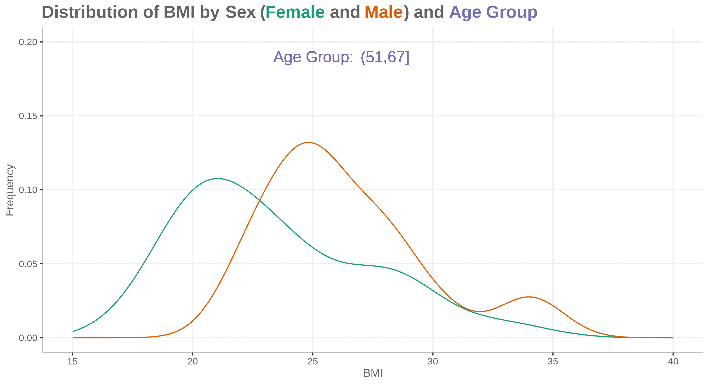

---
title: |
  {width=3in}  
  Histogram
output:
  html_document:
    df_print: paged
    number_sections: No
    toc: yes
    toc_float: yes
    code_folding: "hide" 
  word_document:
    toc: yes
fontsize: 10pt
editor_options:
  chunk_output_type: console
colorlinks: yes
--- 

```{r, include=FALSE, echo = FALSE,message = FALSE, error = FALSE, warning = FALSE}
knitr::opts_chunk$set(echo = TRUE)

setwd(dirname(rstudioapi::getSourceEditorContext()$path))
# getwd()
# Sys.setlocale("LC_ALL","English")

## devtools::install_github("kupietz/kableExtra")
packages<-c("tidyverse", "kableExtra", 
            "haven","GGally", "ggExtra",
            "ggpubr","gridExtra","ggtext","plotly","gt","psych",
            "ggridges","hrbrthemes","viridis")


ipak <- function(pkg){
  new.pkg <- pkg[!(pkg %in% installed.packages()[, "Package"])]
  if (length(new.pkg)) 
    install.packages(new.pkg, dependencies = TRUE)
  sapply(pkg, require, character.only = TRUE)
}
ipak(packages)
```


# Histogram

## General Appearance

```{r, message = FALSE, error = FALSE, warning = FALSE, cache=TRUE}
smaller <- diamonds %>% 
  filter(carat < 3)
p1 <- ggplot(data = smaller, mapping = aes(x = carat, fill=color))+
  geom_histogram(binwidth = 0.1, col="black", size=.1) +
  labs(title="Histogram with Auto Binning", 
       subtitle="Engine Displacement across Vehicle Classes")  
p1
# geom_histogram(bins=5, col="black", size=.1) 

# Change the color according the number of legend
# scale_color_manual(values = c("#00AFBB", "#E7B800")) 
# scale_fill_manual(values = c("#00AFBB", "#E7B800"))
```


## Change Scales using scale_x_log10()

Scales control the details of how data values are translated to visual properties. Many [different scales](https://ggplot2.tidyverse.org/reference/index.html#section-scales) are offered by ggplot2. The most widely one is probably the log scale.


```{r Change Scales, message = FALSE, error = FALSE, warning = FALSE, cache=TRUE}

# Load dataset from github
data <- read.table("./01_Datasets/OneNum.csv", header=TRUE)

# Make the histogram
data %>%
  ggplot( aes(x=price)) +
    geom_histogram(color="white", fill="steelblue4") +
    ggtitle("Night price distribution of Airbnb appartements") +
    xlab("Night price") +
    ylab("Number of apartments") +
  theme_bw()

data %>%
  ggplot( aes(x=price)) +
    geom_histogram(color="white", fill="steelblue4") +
    ggtitle("Night price distribution of Airbnb appartements") +
    xlab("Night price") +
    ylab("Number of apartments") +
    scale_x_log10() +
  theme_bw()
```


## Mirror Histogram/Density Chart

```{r, message = FALSE, error = FALSE, warning = FALSE, cache=TRUE}
# library(hrbrthemes)

# Dummy data
data <- data.frame(
  var1 = rnorm(1000),
  var2 = rnorm(1000, mean=2)
)


ggplot(data, aes(x=x) ) +
  geom_histogram( aes(x = var1, y = ..density..), fill="#69b3a2" ) +
  geom_label( aes(x=4.5, y=0.25, label="variable1"), color="#69b3a2") +
  geom_histogram( aes(x = var2, y = -..density..), fill= "#404080") +
  geom_label( aes(x=4.5, y=-0.25, label="variable2"), color="#404080") +
  theme_ipsum() +
  xlab("value of x")
 
ggplot(data, aes(x=x) ) +
  # Top
  geom_density( aes(x = var1, y = ..density..), fill="#69b3a2" ) +
  geom_label( aes(x=4.5, y=0.25, label="variable1"), color="#69b3a2") +
  # Bottom
  geom_density( aes(x = var2, y = -..density..), fill= "#404080") +
  geom_label( aes(x=4.5, y=-0.25, label="variable2"), color="#404080") +
  theme_ipsum() +
  xlab("value of x") 
```


## Marginal Histogram / Boxplot

This can be achieved using the ggMarginal() function in the "ggExtra" package. In addition to histograms, you can choose to draw marginal box plots or density plots by setting the corresponding type options.

```{r Marginal Plot, message = FALSE, error = FALSE, warning = FALSE, cache=TRUE}
# library("ggExtra")

mpg_select <- mpg[mpg$hwy >= 35 & mpg$cty > 27, ]
g <- ggplot(mpg, aes(cty, hwy)) + 
  geom_count() + 
  geom_smooth(method="lm", se=F) +
  theme_bw()
 
ggMarginal(g, type = "histogram", fill="transparent")
ggMarginal(g, type = "boxplot",   fill="transparent")
ggMarginal(g, type = "density",   fill="transparent")
```


## Interactive Plot 

```{r, message = FALSE, error = FALSE, warning = FALSE, cache=TRUE}
smaller <- diamonds %>% 
  filter(carat < 3)
p1 <- ggplot(data = smaller, mapping = aes(x = carat, fill=color))+
  geom_histogram(binwidth = 0.1, col="black", size=.1) +
  labs(title="Add Title for Histogram Here...", 
       subtitle="Add Subtitle Here...")  
ggplotly(p1) 
 
```

# Density plot

## General Density plot

### Multi density chart using geom_freqpoly()

```{r freqpoly, message = FALSE, error = FALSE, warning = FALSE, cache=TRUE}
smaller <- diamonds %>% 
  filter(carat < 3)
ggplot(data = smaller, mapping = aes(x = carat, colour = cut)) +
  geom_freqpoly(binwidth = 0.1)


# display density instead of count
ggplot(data = diamonds, mapping = aes(x = price, y = ..density..)) + 
  geom_freqpoly(mapping = aes(colour = cut), binwidth = 500)

# geom_density
ggplot(mpg, aes(cty)) +
  geom_density(aes(fill=factor(cyl)), alpha=0.5) + 
    labs(title="Density plot", 
         subtitle="City Mileage Grouped by Number of cylinders",
         caption="Source: mpg",
         x="City Mileage",
         fill="# Cylinders")
```

### Multi density chart using geom_density()

```{r, message = FALSE, error = FALSE, warning = FALSE, cache=TRUE}
# library("hrbrthemes") 
# library("viridis") 
# The diamonds dataset is natively available with R.

# Without transparency (left)
p1 <- ggplot(data=diamonds, aes(x=price, group=cut, fill=cut)) +
    geom_density(adjust=1.5) +
  theme_ipsum() +
  theme(legend.position = "bottom")
#p1

# With transparency (right)
p2 <- ggplot(data=diamonds, aes(x=price, group=cut, fill=cut)) +
    geom_density(adjust=1.5, alpha=.4) +
  theme_ipsum() +
  theme(legend.position = "bottom")

 
grid.arrange(p1, p2, nrow = 1)
```

### Small Multiple with facet_wrap()

```{r, message = FALSE, error = FALSE, warning = FALSE, cache=TRUE}
# Using Small multiple
ggplot(data=diamonds, aes(x=price, group=cut, fill=cut)) +
    geom_density(adjust=1.5) +
    theme_ipsum() +
    facet_wrap(~cut) +
    theme(
      legend.position="none",
      panel.spacing = unit(0.1, "lines"),
      axis.ticks.x=element_blank()
    )
```

### Stacked density chart

```{r, message = FALSE, error = FALSE, warning = FALSE, cache=TRUE}
# Stacked density plot:
ggplot(data=diamonds, aes(x=price, group=cut, fill=cut)) +
    geom_density(adjust=1.5, position="fill") +
    theme_ipsum()
```

### Density plot with annotation

```{r, message = FALSE, error = FALSE, warning = FALSE, cache=TRUE}
# Load dataset from github
data <- read.table("./01_Datasets/probly.csv", header=TRUE, sep=",")
data <- data %>%
  gather(key="text", value="value") %>%
  mutate(text = gsub("\\.", " ",text)) %>%
  mutate(value = round(as.numeric(value),0))

# A dataframe for annotations
annot <- data.frame(
  text = c("Almost No Chance", "About Even", "Probable", "Almost Certainly"),
  x = c(5, 53, 65, 79),
  y = c(0.15, 0.4, 0.06, 0.1)
)

# Plot
data %>%
  filter(text %in% c("Almost No Chance", "About Even", "Probable", "Almost Certainly")) %>%
  ggplot( aes(x=value, color=text, fill=text)) +
    geom_density(alpha=0.6) +
    scale_fill_viridis(discrete=TRUE) +
    scale_color_viridis(discrete=TRUE) +
    geom_text( data=annot, aes(x=x, y=y, label=text, color=text), hjust=0, size=4.5) +
    theme_ipsum() +
    theme(
      legend.position="none"
    ) +
    ylab("") +
    xlab("Assigned Probability (%)")
```


## Animated density plot


```{r, message = FALSE, error = FALSE, warning = FALSE, cache=TRUE}
# library(ggplot2)
# library(dplyr)
# library(tidyr)
# library(hsaven)
# library(emojifont)
# library(ggtext)

adsl <- read_xpt("./01_Datasets/adsl.xpt")

adsl2 <- adsl %>%
  mutate(agegp2 = cut(AGE, quantile(AGE, c(0:6/6)))) %>%
  group_by(agegp2) %>%
  arrange(AGE) %>%
  select(agegp2, BMIBL, SEX, AGE) %>%
  mutate(id = as.numeric(substr(agegp2,2,3))) %>%
  drop_na(id)

# Create a vector containing unique values for age group identifier
id <- adsl2 %>%
  group_by(id) %>%
  slice(1) %>%
  select(id) %>%
  unlist() %>%
  as.vector()

for (i in id) {
  
  ADSLloop <- adsl2 %>%
    filter(id == i)
  
  plot <- ggplot(ADSLloop, aes(x = BMIBL, colour = SEX)) +
    geom_density(show.legend = FALSE) +
    geom_text(aes(x=25, y=0.19, label="Age Group:"), size=16, color="#7570b3") +
    geom_text(aes(x=28, y=0.19, label=agegp2), size=16, color="#7570b3") +
    scale_x_continuous("BMI", limits=c(15, 40)) +
    scale_y_continuous("Frequency", limits=c(0, 0.2)) +
    scale_color_discrete(type=c("#1b9e77", "#d95f02")) +
    theme(plot.title = element_markdown(colour = "#636363",
                                        size = 50),
          panel.background=element_rect(fill="white"),
          panel.grid.major=element_line(colour = "#f0f0f0",
                                        linewidth = 0.5,
                                        linetype = 1),
          axis.line=element_line(colour = "#bdbdbd",
                                 linewidth = 0.5,
                                 linetype = 1),
          axis.text=element_text(
            colour = "#636363",
            size = 28),
          axis.title=element_text(
            colour = "#636363",
            size = 32)) +
    labs(title="<b>Distribution of BMI by Sex (<span style='color:#1b9e77'>Female</span> and <span style='color:#d95f02'>Male</span>) and  <span style='color:#7570b3'>Age Group</span></b>") 

  ggsave(
    filename = paste0("02_Plots/Visualization/Histogram/Animated", sprintf("%03d", i) , ".png"),
    plot = plot,
    device = "png",
    height = 1500,
    width = 2757,
    units = "px"
  )
}


# Additional steps to create animated gif file:
# 1. Install ImageMagick
# 2. Open a command line
# 3. cd to the folder containing the *.png files 
# 4. Enter the following command:
#   magick convert -delay 150 -loop 0 *.png -scale 4800x2700 WW_Dec23_SM01.gif
```





## Distribution plot by category I

This graph includes stacked density plots, sometimes known as a ridgeline plot. This graph type is useful where there are approximately 4-8 categories with a natural ordering, which is the case in this example. The graph is also showing patient level data as transparent dots on the X axis, and reference lines have been added. There is a lot of overplotting of the dots, so the opacity of dots is representing the data density at each value on the X-axis.

A title has been added to give a clear interpretation of the overall message.

```{r, message = FALSE, error = FALSE, warning = FALSE, cache=TRUE}
WW_data <- read.csv("./01_Datasets/WWW_example_minimal_clinical_improvement.csv")

# library(tidyverse)
# library(ggplot2)
# library(dplyr)
# library(ggridges)
# library(gt)
# library(psych)

#####
#1 - calculate SEM 
#The Standard Error of Measurement (SEM) quantifies 
#the precision of the individual measurements 
#and gives an indication of the absolute reliability

#2 - calculate SDC
#The SEM can be used to calculate the Minimal Detectable Change (MDC)
#which is the minimal amount of change that a measurement 
#must show to be greater than the within subject variability
#and measurement error, also referred to as the sensitivity to change

pre_post <- WW_data[,c(1:2)]
sd_baseline <- sd(WW_data$total.score.baseline, na.rm = T)

icc <- ICC(pre_post)#0.032 - reliability for SEM

sem_baseline <- psychometric::SE.Meas(sd_baseline, 0.032)

#Smallest detectable change(SDC)/Minimal detectable change (MDC)
#SEM*1.92*sqrt(2)
sdc <- sem_baseline*1.96*sqrt(2)
sdc_comp <- sdc*-1

WW_data <- rename(WW_data, baseline = total.score.baseline, followup = total.score.follow.up, CGI = CGI.I)
WW_data <- within(WW_data, CHG <- followup-baseline)
WW_data <- within(WW_data, {
            CGI_cat <- NA
            CGI_cat[CGI==1] <- "Very much improved"
            CGI_cat[CGI==2] <- "Much improved"
            CGI_cat[CGI==3] <- "Minimally improved"
            CGI_cat[CGI==4] <- "No change"
            CGI_cat[CGI==5] <- "Minimally worse"
            CGI_cat[CGI==6] <- "Much worse"
            CGI_cat[CGI==7] <- "Very much worse"
            })

WW_data <- WW_data <- WW_data %>% 
  filter(!is.na(CGI_cat))

WW_data$CGI_cat <- factor(WW_data$CGI_cat, levels = c("Very much improved",
                                   "Much improved",
                                   "Minimally improved",
                                   "No change",
                                   "Minimally worse",
                                   "Much worse",
                                   "Very much worse"
                                   ))

gg <- ggplot(WW_data, aes(x = CHG, 
                    y = CGI_cat)) +
  stat_density_ridges(
    geom = "density_ridges_gradient",
    quantile_lines = TRUE,
    quantiles = 2, scale = 1, rel_min_height = 0.01,
    jittered_points = TRUE) +
  scale_x_continuous(breaks=seq(-40,40,10),
                     limits = c(-40,40)) +
  ylab("CGI-I Response") + xlab("Change in PRO Score") +
  labs(title = "Minimally Improved & Minimally Worse CGI-I Categories\nAre Not Differentiated From No change",
       subtitle = "Smoothed Distributions with Individual Patients (dots) and Means (|) \nReference Lines Display Smallest Detectable Change of PRO Score",
       caption = "Smallest Detectable Change defined by Standard Error of Measurement of PRO Score at Baseline") +
  theme(
    plot.title = element_text(color = "black", size = 15),
    plot.subtitle = element_text(color = "black", size = 10),
    plot.caption = element_text(color = "black", size = 8)
  )

#theme_ridges(font_size = 12)

#Build ggplot and extract data
d <- ggplot_build(gg)$data[[1]]

# Add geom_ribbon for shaded area
rcc <- gg +
  geom_ribbon(
    data = transform(subset(d, x >= sdc), CGI_cat = group),
    aes(x, ymin = ymin, ymax = ymax, group = group),
    fill = "red",
    alpha = 0.2, 
    show.legend = TRUE) +
  geom_ribbon(
    data = transform(subset(d, x <= sdc_comp), CGI_cat = group),
    aes(x, ymin = ymin, ymax = ymax, group = group),
    fill = "green",
    alpha = 0.2,
    show.legend = TRUE) +
  geom_vline(xintercept =sdc, linetype="dashed") +
  geom_vline(xintercept =sdc_comp, linetype="dashed")+
  annotate("segment", x = -15, xend = -35, y = 0.7, yend = 0.7, colour = "black", size=0.5, arrow=arrow(length = unit(0.03, "npc"))) +
  annotate("segment", x = 15, xend = 35, y = 0.7, yend = 0.7, colour = "black", size=0.5, arrow=arrow(length = unit(0.03, "npc"))) +
  geom_text(aes(x = -30, y = 0.45, label = "Improvement"), 
             hjust = 0, 
             vjust = 0,
             colour = "black", 
             size = 2.5) +
  geom_text(aes(x = 20, y = 0.45, label = "Deterioration"), 
            hjust = 0, 
            vjust = 0,
            colour = "black", 
            size = 2.5) + 
  ylab("CGI-I Response") + xlab("Change in PRO Score")
  
rcc
# ggsave("reliable_clinical_change_plot_red_green_v0_2.png", plot = rcc, device = png)

```


## GGally Package

```{r, message = FALSE, error = FALSE, warning = FALSE, cache=TRUE}
# library(GGally)

adsl <- read_xpt("./01_Datasets/adsl.xpt")
adsl_data <- adsl[, c("AGE", "BMIBL", "HEIGHTBL", "WEIGHTBL","SEX")]


# Convert SEX to a factor if it’s not already
adsl_data$SEX <- as.factor(adsl_data$SEX)

# Create a pair plot with grouping by SEX
ggpairs(
  adsl_data,
  aes(color = SEX, fill = SEX),  # Color by SEX
  lower = list(continuous = wrap("smooth", alpha = 0.3, size = 0.5)),
  diag = list(continuous = wrap("densityDiag")),
  upper = list(continuous = wrap("cor", size = 4, color = "black"))
) +
  theme_minimal() +
  theme(
    strip.text = element_text(size = 10),
    axis.text = element_text(size = 8)
  ) +
  scale_fill_manual(values = c("pink", "lightblue")) +  # Customize colors if desired
  scale_color_manual(values = c("pink", "lightblue"))
```