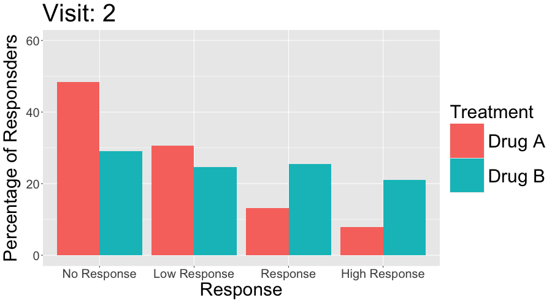
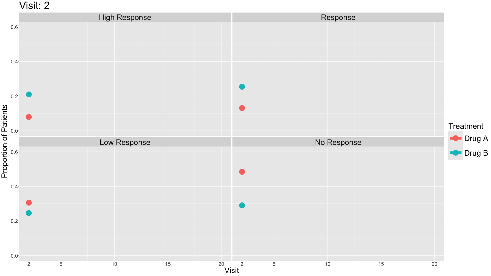

```{r setup, include=FALSE, echo = FALSE,message = FALSE, error = FALSE, warning = FALSE}
knitr::opts_chunk$set(echo = TRUE, fig.width = 10, fig.height = 6)
rm(list = ls())
# <!-- ---------------------------------------------------------------------- -->
# <!--                    1. load the required packages                       -->
# <!-- ---------------------------------------------------------------------- --> 
# Define the packages
packages <- c("tidyverse", "kableExtra", "ggtext", "RCurl", "here",
              "plyr","scales","forcats","psych",
              "ggplot2", "ggrepel", "cowplot", "lubridate", "readxl", 
              "plotly","shiny","gt",
              "gridExtra", "patchwork", "reshape2", "grid", "ggthemes", 
              "ggcharts","ggpubr","ggridges",
              "polycor", "ggalluvial","RColorBrewer","viridis")
 
 
 
ipak <- function(pkg){
  new.pkg <- pkg[!(pkg %in% installed.packages()[, "Package"])]
  if (length(new.pkg)) 
    install.packages(new.pkg, dependencies = TRUE)
  sapply(pkg, require, character.only = TRUE)
}
ipak(packages)
 


# <!-- ---------------------------------------------------------------------- -->
# <!--                        2. Basic system settings                        -->
# <!-- ---------------------------------------------------------------------- -->
setwd(dirname(rstudioapi::getSourceEditorContext()$path))
getwd()
Sys.setlocale("LC_ALL","English")
 

# Load all r functions
# The directory where all source code files are saved.
source_code_dir <- "C:/Users/baiz/Downloads/Data-Analyst-with-R/00 R Function/ZB Function/"  
file_path_vec <- list.files(source_code_dir, full.names = T)
for(f_path in file_path_vec){source(f_path)}
 
```
 
# DLQI

In this month’s dataset, DLQI has been administered in a phase 3 clinical trial to patients with psoriasis. There are two imbalanced treatment groups, with 150 patients randomised to Placebo (Treatment A) and 450 to the active treatment (Treatment B). DLQI responses are recorded at Baseline and Week 16 (although some DLQI assessment is missing at Week 16), allowing the treatment effect in terms of Quality of Life to be assessed. The Psoriasis Area and Severity Index (PASI) is also recorded at baseline.

## Change in mean scores

The dot plot displayed here is a great way to quickly see the effect of treatment on the different DLQI items. For each item and each group, we see mean scores for both Baseline and Week 16, which are coloured differently and consistently to allow patterns to be quickly and easily identified. Whilst it is not something commonly seen, the position of the legend in the middle of the page works really nicely and can be quickly referenced for each plot.

Overall, this is a very clean design and provides a clear message. However, there were some ways in which the panel felt that the layout of this example could be improved. Whilst it is easy to compare within treatment groups, it is not so easy to make comparisons between treatment groups here. The group proposed combining the two treatment groups in a vertical layout, possibly using different colours to differentiate between treatment groups and arrows to indicate the direction of the effect. This would also mean that labels of the different items would not need to be repeated as they currently are. This vertical structure could be accommodated by using less space for the first figure showing effect sizes on overall means. Having this so large is not necessarily a bad thing if it shows key information which needs to be emphasised, but we should be intentional about it when doing things such as this.

Unlike in the previous example, here the items are sorted in the order they appear on the questionnaire. Alternative ways to sort the items could be considered to highlight those which are most interesting, such as sorting by baseline means or by effect size. There are also a few tweaks to the horizontal axes which the group felt should be made. Firstly, it would be better to start from zero on the first dot plot, otherwise the effect size appears to be exaggerated. Further, the horizontal axes and spacing between labels should be made consistent for the two treatment groups, allowing for direct comparison between the two figures.

```{r,echo = T,message = FALSE, error = FALSE, warning = FALSE}
# Load data
dql <-  read_csv("./01_Datasets/ww2020_dlqi.csv") 
 

# Load library
library(tidyverse)
library(ggplot2)
library(ggthemes)
library(ggcharts)
library(ggalt)

# Seperate treatment arms
new_A <- 
  dql %>% 
  filter(TRT=="A")
new_B <- 
  dql %>% 
  filter(TRT=="B")

## Treatment A : Placebo

dtA <- new_A %>%
  filter(if_all(everything(), ~ !is.na(.))) %>% 
  # Select relevant variables
  select(
    DLQI101, DLQI102, DLQI103, DLQI104, DLQI105,
    DLQI106, DLQI107, DLQI108, DLQI109, DLQI110,
    VISIT
    ) %>%
  # Summarize mean score for each question grouped by visit
  # while also renaming variables to indicate the meaning of each score
  group_by(VISIT) %>%
  dplyr::summarize(
    Symptoms = mean(DLQI101, na.rm = T),
    Embarrassment = mean(DLQI102, na.rm = T),
   `Shopping and home care` = mean(DLQI103, na.rm = T),
    Clothes = mean(DLQI104, na.rm = T),
   `Social and leisure` = mean(DLQI105, na.rm = T),
    Sport = mean(DLQI106, na.rm = T),
    `Work and study` = mean(DLQI107, na.rm = T),
    `Close relationships` = mean(DLQI108, na.rm = T),
    Sex = mean(DLQI109, na.rm = T),
    Treatment = mean(DLQI110, na.rm = T)
   )

# Tidying data
dtA <- 
  dtA %>% 
  pivot_longer(
    !VISIT,
    names_to = "Domain",
    values_to = "Mean_Score"
    )

# Seperating the visit variable into baseline and week 16
dtA <-
  dtA %>% 
  pivot_wider(
    names_from = VISIT,
    values_from = Mean_Score
    )

# Ensuring the domain levels are ordered the same
dtA <-
  dtA %>% 
  mutate(
    Domain = factor(Domain,
                    levels = c("Symptoms", "Embarrassment",
                               "Shopping and home care",
                               "Clothes", "Social and leisure",
                               "Sport", "Work and study",
                               "Close relationships",
                               "Sex", "Treatment"))
    )

# Constructing a dumbbell plot using ggalt package with a ggchart theme

(a <- 
  ggplot()+
  geom_dumbbell(
    data = dtA,
    aes(
      y = Domain,
      x = Baseline,
      xend = `Week 16`
      ),
    size = 1.5,
    color = "lightgray",
    size_x = 3,
    colour_x = "violetred4",
    size_xend = 3,
    colour_xend = "maroon1"
    )
  + theme_ggcharts(grid = "Y")
  + labs(
    title = "Placebo"
    )
  + theme(
    plot.title = element_text(hjust = 0.5),
    axis.title.y = element_blank(),
    axis.title.x = element_blank(),
    axis.text.y = element_text(size = 9)
    ))

## Treatment B : Active Treatment
dtB <- new_B %>%
  # Remove missing data
  filter(if_all(everything(), ~ !is.na(.))) %>% 
  # Select relevant variables
  select(
    DLQI101, DLQI102, DLQI103, DLQI104, DLQI105,
    DLQI106, DLQI107, DLQI108, DLQI109, DLQI110,
    VISIT
    ) %>%
  # Summarize mean score for each question grouped by visit
  # while also renaming variables to indicate the meaning of each score
  group_by(VISIT) %>%
  summarise(
    Symptoms = mean(DLQI101, na.rm = T),
    Embarrassment = mean(DLQI102, na.rm = T),
    `Shopping and home care` = mean(DLQI103, na.rm = T),
    Clothes = mean(DLQI104, na.rm = T),
    `Social and leisure` = mean(DLQI105, na.rm = T),
    Sport = mean(DLQI106, na.rm = T),
    `Work and study` = mean(DLQI107, na.rm = T),
    `Close relationships` = mean(DLQI108, na.rm = T),
    Sex = mean(DLQI109, na.rm = T),
    Treatment = mean(DLQI110, na.rm = T)
    )

# Tidying data
dtB <- 
  dtB %>% 
  pivot_longer(
    !VISIT,
    names_to = "Domain",
    values_to = "Mean_Score"
    )

# Seperating the visit variable into baseline and week 16
dtB <-
  dtB %>% 
  pivot_wider(
    names_from = VISIT,
    values_from = Mean_Score
    )

# Ensuring the domain levels are ordered the same
dtB <-
  dtB %>% 
  mutate(
    Domain = factor(Domain,
                    levels = c("Symptoms", "Embarrassment",
                               "Shopping and home care",
                               "Clothes", "Social and leisure",
                               "Sport", "Work and study",
                               "Close relationships",
                               "Sex", "Treatment"))
    )

# Constructing a dumbbell plot using ggalt package with a ggchart theme

(b <- 
  ggplot()+
  geom_dumbbell(
    data = dtB,
    aes(
      y = Domain,
      x = Baseline,
      xend = `Week 16`
      ),
    size = 1.5,
    color = "lightgray",
    size_x = 3,
    colour_x = "violetred4",
    size_xend = 3,
    colour_xend = "maroon1")
  + theme_ggcharts(grid = "Y") 
  + labs(
    title = "Active Treatment"
    ) + theme(
    plot.title = element_text(hjust = 0.5),
    axis.title.y = element_blank(),
    axis.title.x = element_blank(),
    axis.text.y = element_text(size = 9)
        ))

## Mean total score for both treatment arms

totaldt <- 
  dql %>%
  # Remove missing data
  filter(if_all(everything(), ~ !is.na(.))) %>% 
  # select and summarizing relevant variables
  select(DLQI_SCORE, TRT, VISIT) %>%
  group_by(TRT, VISIT) %>%
  summarise(
    qtotal = mean(DLQI_SCORE, na.rm = T)
    )

# Tidying data
totaldt <- 
  totaldt %>% 
  pivot_wider(
    names_from = VISIT,
    values_from = qtotal
    )

totaldt$TRT[totaldt$TRT=="A"] <- "Placebo"
totaldt$TRT[totaldt$TRT=="B"] <- "Active Treatment"

# Constructing a dumbbell plot using ggcharts

(c <- 
  dumbbell_chart(
    data = totaldt,
    x = TRT,
    y1 = Baseline,
    y2 = `Week 16`,
    line_color = "lightgray",
    line_size = 3,
    point_color = c("violetred4", "maroon1"),
    point_size = 7
  ) + labs(
    x = NULL,
    y = NULL,
    title = "Dermatological Life Quality Index DLQI",
    subtitle = "Change in mean scores from Baseline to Week 16  (Top chart is total score)",
    caption = "Samah Abdelaal"
    ) + theme(
    axis.text.y = element_text(face = "bold"),
    plot.title = element_text(size = 14,
                              face = "bold"),
    plot.subtitle = element_text(size = 12),
    plot.caption = element_text(size = 11,
                                face = "italic"),
    legend.position = "bottom"
    ))

# Compine all three plots
library(gridExtra)

grid.arrange(c, arrangeGrob(b, a, ncol = 2), nrow = 2)
```

## Lineplots

These slope graphs provide a clear and meaningful picture of patient level changes in DLQI scores for the different items and treatment groups. Here, the circles are proportional to the percentage of patients with a given response to that item at that visit, and the strips represents the ‘flow’ of patients across response levels between the visits. The decision to make the circles proportional to percentages rather than counts is the correct one here and allows for meaningful comparison between the imbalanced treatment groups.

This is a really nice example of a plot type which we don’t often see and tells a good story. The consistent improvement for the active treatment is clear to see and we see that there is not too much happening in terms of a response for placebo. Whilst we do not get the same level of understanding of marginal distributions that we might with a histrogram, we do still get some notion and this is balanced by the additional level of patient understanding which we have.

The group liked how the flow of patients could easily be seen by the intensity of lines, but felt that either a greater level of ‘minimum’ intensity or a different colour to blue could be used to still allow even a single patient’s movement to be seen, which is currently slightly difficult. However, it was acknowledged that not being able to see a lot within certain items for placebo is in itself meaningful.

The consistent use of colour between plots and titles allows us to easily distinguish between treatment groups, although it was felt that a more telling title may have been used. It is great that item descriptions rather than just numbers are provided, and the panel really liked that we see the effects when certain items are combined together into different domains. Grouping of the ten DLQI items into these six domains is something which is commonly done in clinical practice but is not something which was considered by many of the other examples. It was acknowledged that the inclusion of these additional plots for the six domains justifies keeping the items ordered as they appear on the questionnaire, so we can clearly see which items correspond to which domains. However, there was still some discussion as to whether an alternative ordering of both individual items and domains could be considered.

This example has a long, vertical layout. This would be great for something like a poster, but is maybe less convenient for viewing on screen. There was a feeling that when being presented as a poster, a lighter background may be more suitable.

```{r,echo = T,message = FALSE, error = FALSE, warning = FALSE}
library(tidyverse)
library(data.table)
library(grid)
library(cowplot)
library(RCurl)

d <- read_csv("./01_Datasets/ww2020_dlqi.csv") 
d1a <- d %>%
  gather(key = PARAMCD,
         value = AVAL, DLQI101:DLQI_SCORE, factor_key=TRUE) %>%
  filter(!PARAMCD %in% c("DLQIMCID", "DLQIRESP")) %>%
  mutate(VISIT = ifelse(VISIT=="Baseline", "Wk 0", "Wk 16"),
         VISITN = if_else(VISIT=="Wk 0", 0, 1))
d1a

d1b <- d1a %>%
  group_by(TRT, PARAMCD, VISITN, VISIT, AVAL) %>%
  summarise(n = n())%>%
  mutate(freq = n / sum(n))
d1b

d1a$TRT <- relevel(as.factor(d1a$TRT), "B")
d1b$TRT <- relevel(as.factor(d1b$TRT), "B")


tit_col = "grey50"
cap_col = "grey50"

ggplotib <- function(paramcd = NULL,
                     title = NULL, 
                     caption = NULL, 
                     breaks = 0:3,
                     transparency = 0.01){
  d1a_2 <- d1a %>%
    filter(PARAMCD %in% paramcd) %>%
    group_by(TRT, USUBJID, VISITN, VISIT) %>%
    summarise(AVAL_SUB = sum(AVAL))
  
  d1b_2 <- d1a_2 %>%
    group_by(TRT, VISITN, VISIT, AVAL_SUB) %>%
    summarise(n = n())%>%
    mutate(freq = n / sum(n))
  p1 <- ggplot() +
    geom_line(data = d1a_2, aes(x = VISITN, y = AVAL_SUB, group = USUBJID, col=TRT),
              alpha = transparency, size = 2) +
    geom_point(data = d1b_2, aes(x = VISITN, y = AVAL_SUB, size = freq, col=TRT)) +
    facet_grid(cols = vars(TRT)) +
    scale_x_continuous(breaks = c(0, 1), labels = c("Wk 0", "Wk 16"), limits = c(-0.1,1.1)) +
    scale_y_continuous(breaks = breaks) +
    theme_minimal() +
    labs(x = "", y = "", title = title, subtitle = caption) +
    theme(panel.grid = element_blank(),
          title = element_text(size = 12, colour = tit_col),
          plot.subtitle = element_text(size = 10, colour = cap_col, hjust = 0), 
          axis.text.x = element_text(size = 12, colour = "grey50"),
          plot.background = element_rect(fill="black"),
          strip.text = element_blank()) +
    guides(color = F, size = F)
  p1
}


# Unidimensional ----------------------------------------------------------
p1 <- ggplotib(paramcd = "DLQI101",
              title="Item 1",
              caption="Itchy, sore, painful, or stinging skin") +
  theme(axis.text.y = element_text(colour = "grey50"))
p1
p2 <- ggplotib(paramcd = "DLQI102",
              title="Item 2",
              caption="Embarassment") + 
  theme(axis.text.y = element_text(colour = "grey50"))
p2
p3 <- ggplotib(paramcd = "DLQI103",
              title="Item 3",
              caption="Interference with shopping / home / gardening") + 
  theme(axis.text.y = element_text(colour = "grey50"))
p3
p4 <- ggplotib(paramcd = "DLQI104",
              title = "Item 4",
              caption = "Influence on clothing") + 
  theme(axis.text.y = element_text(colour = "grey50"))
p4
p5 <- ggplotib(paramcd = "DLQI105",
              title = "Item 5",
              caption = "Social or leisure activities affected") + 
  theme(axis.text.y = element_text(colour = "grey50"))
p5
p6 <- ggplotib(paramcd = "DLQI106",
              title = "Item 6",
              caption = "Difficult to do any sport?") +
  theme(axis.text.y = element_text(colour = "grey50"))
p6
p7 <- ggplotib(paramcd = "DLQI107",
              title = "Item 7",
              caption = "Prevented you from working / studying?") + 
  theme(axis.text.y = element_text(colour = "grey50"))
p7
p8 <- ggplotib(paramcd = "DLQI108",
               title = "Item 8",
               caption = "Problems with partner / close friends / relatives") + 
  theme(axis.text.y = element_text(colour = "grey50"))
p8
p9 <- ggplotib(paramcd = "DLQI109",
               title = "Item 9",
               caption = "Sexual difficulties") + 
  theme(axis.text.y = element_text(colour = "grey50"))
p9
p10 <- ggplotib(paramcd = "DLQI110",
                title = "Item 10",
                caption = "Problem from treatment") + 
  theme(axis.text.y = element_text(colour = "grey50"))
p10

pt <- ggplotib(paramcd = "DLQI_SCORE", 
               breaks = 0:30, 
               transparency = 0.02,
               title = "DLQI",
               caption = "Total Score") +
  theme(axis.text.y = element_text(colour = "grey50"))
pt

# t_b
tfs <- 24
x <- 0.05
t1 <- textGrob(expression(bold("Active treatment") * phantom(bold(" vs. Placebo"))),
               x = x, y = 0.7, gp = gpar(col = "#F8766D", fontsize = tfs), just = "left")
t2 <- textGrob(expression(phantom(bold("Active treatment vs.")) * bold(" Placebo")),
               x = x, y = 0.7, gp = gpar(col = "#00BFC4", fontsize = tfs), just = "left")
t3 <- textGrob(expression(phantom(bold("Active treatment ")) * bold("vs.") * phantom(bold(" Placebo"))),
               x = x, y = 0.7, gp = gpar(col = "grey", fontsize = tfs), just = "left")
t4 <- textGrob(expression("Strips describe the flow of the patients from different categories between visits"),
               x = x, y = 0.4, gp = gpar(col = "grey", fontsize = 10), just = "left")
t5 <- textGrob(expression("Circles are proportional to the percentage of patients at every visit"),
               x = x, y = 0.25, gp = gpar(col = "grey", fontsize = 10), just = "left")

tb <- ggplot(data = d) +
  theme(panel.grid = element_blank(),
        plot.background = element_rect(fill="black"))  +
  coord_cartesian(clip = "off") +
  annotation_custom(grobTree(t1, t2, t3, t4, t5)) +
  theme(legend.position = 'none')
tb

b <- plot_grid(tb, p1, p2, p3, p4, p5, p6, p7, p8, p9, p10,
             nrow = 6, rel_heights = c(0.5, rep(1, 10)))
b
# ggsave(plot=b, filename="b.png", path=("~") , width = 6, height = 32, device = "png")   

# Multidimensional --------------------------------------------------------
p12 <- ggplotib(paramcd = c("DLQI101", "DLQI102"),
                breaks = 0:6,
                transparency = 0.015,
                title="Item 1 + Item 2",
                caption="Symptoms and feelings") +
  theme(axis.text.y = element_text(colour = "grey50"))
p12

# p34 <- ggplotib(paramcd = c("DLQI103", "DLQI104"),
#                 breaks = 0:6,
#                 transparency = 0.015,
#                 title="Item 3 + Item 4",
#                 caption="Daily activities") +
#   theme(axis.text.y = element_text(colour = "grey50"))
# p34
# 
# p56 <- ggplotib(paramcd = c("DLQI105", "DLQI106"),
#                 breaks = 0:6,
#                 transparency = 0.015,
#                 title="Item 5 + Item 6",
#                 caption="Leisures") +
#   theme(axis.text.y = element_text(colour = "grey50"))
# p56
# 
# p89 <- ggplotib(paramcd = c("DLQI108", "DLQI109"),
#                 breaks = 0:6,
#                 transparency = 0.015,
#                 title="Item 8 + Item 9",
#                 caption="Interpersonal relationships") +
#   theme(axis.text.y = element_text(colour = "grey50"))
# p89
# 
# tfs <- 42
# x <- 0.0175
# t1 <- textGrob(expression(bold("Active treatment") * phantom(bold(" vs. Placebo"))),
#                x = x, y = 0.7, gp = gpar(col = "#F8766D", fontsize = tfs), just = "left")
# t2 <- textGrob(expression(phantom(bold("Active treatment vs.")) * bold(" Placebo")),
#                x = x, y = 0.7, gp = gpar(col = "#00BFC4", fontsize = tfs), just = "left")
# t3 <- textGrob(expression(phantom(bold("Active treatment ")) * bold("vs.") * phantom(bold(" Placebo"))),
#                x = x, y = 0.7, gp = gpar(col = "grey", fontsize = tfs), just = "left")
# t4 <- textGrob(expression("Strips describe the flow of the patients from different categories between visits"),
#                x = x, y = 0.4, gp = gpar(col = "grey", fontsize = 10), just = "left")
# t5 <- textGrob(expression("Circles are proportional to the percentage of patients at every visit"),
#                x = x, y = 0.25, gp = gpar(col = "grey", fontsize = 10), just = "left")
# 
# t <- ggplot(data = d) +
#   theme(panel.grid = element_blank(),
#         plot.background = element_rect(fill="black"))  +
#   coord_cartesian(clip = "off") +
#   annotation_custom(grobTree(t1, t2, t3, t4, t5)) +
#   theme(legend.position = 'none')
# t
# 
# t2 <- ggplot(data = d) +
#   theme(panel.grid = element_blank(),
#         plot.background = element_rect(fill="black"))  +
#   theme(legend.position = 'none')
# t2
# col1 <- plot_grid(p1, p2, p3, p4, p5, p6, p7, p8, p9, p10,
#                nrow = 10, rel_heights = c(rep(1, 10)))
# col2 <- plot_grid(p12, p34, p56, p7, p89, p10,
#                 nrow = 6, rel_heights = c(2, 2, 2, 1, 2, 1))
# col3 <- plot_grid(pt, t2,
#                 nrow = 2, rel_heights = c(4, 6))
# cols <- plot_grid(col1, col2, col3, ncol = 3, rel_widths = c(3, 3, 3))
# o <- plot_grid(t, cols, nrow = 2, rel_heights = c(0.5, 10))
# o
```


## Mixed models

we have the results of mixed models visualised in an interactive html document. The figure is split into three columns, allowing us to see all of the effects we may be interested in: treatment by visit; within treatment, between visit differences; between treatment, between treatment differences.

One of the features that is really nice about this example is that, unlike many other examples, it considers an alternative way to sort the different items using a dendrogram. This allows us to quickly see two clear clusters in the items, although it was felt that total score should not have been included in this clustering. It is also great that the distributions are shown around the estimated effects, allowing us to quickly see the uncertainty in these estimates.

There were mixed feelings around the large amount of white space included in some of the columns. In some ways, this could be seen as unnecessary, but it was pointed out that the white space provides a nice level of consistency, allowing us to get an immediate impression of effect sizes on the upper plots which are quite a way from the labels on the horizontal axis. The vertical reference lines included are also really nice for getting a quick impression of effect sizes and how meaningful these are.

Similarly, there were mixed feelings around the level of complexity of this example, with the conclusion being that its appropriateness would largely depend on how technical the audience was. Whilst it may be slightly difficult for a non-technical audience to understand, it was felt that this example would be great for providing a large amount of information to technical audiences, particularly given that tables of values were provided in additional tabs alongside the figure. The group envisaged many applications where similar figures would be great to have, such as meta-analyses and subgroup analyses.

The final thing discussed at length for this example was the representation of the effect sizes. The group really liked that the colours used correspond to those provided in the above text, allowing us to determine treatment groups without the need for a legend. Similarly, it was great to see the different effect sizes consistently pointing either upwards or downwards for the different treatment groups, although it would be beneficial to have this also described in the text. This would allow the figure to be interpreted without having to be able to distinguish between the colours.

The panel highlighted a really nice tool which allows us to see how easily certain colours are distinguished by individuals with different kinds of colour-blindness. Whilst it was shown that the blue and green used here are not too difficult to distinguish for most individuals, the tool was used to identify colours which could be even easier to differentiate between.

```{r,echo = T,message = FALSE, error = FALSE, warning = FALSE}
pacman::p_load(rio, tidyverse)
pacman::p_load(lme4, emmeans)
pacman::p_load(ggdist, distributional)
pacman::p_load(gtsummary)
#devtools::install_github("teunbrand/ggh4x")
library(ggh4x)
pacman::p_load(ggdendro)
pacman::p_load(ggtext)
pacman::p_load(patchwork)
pacman::p_load(gt)

df1 <- read_csv("./01_Datasets/ww2020_dlqi.csv") %>% 
   drop_na(DLQI_SCORE) %>% 
   mutate(VISIT_i = as.integer(as.factor(VISIT)))
# fun code to derive change
df1_chg <- read_csv("./01_Datasets/ww2020_dlqi.csv") %>% 
   select(USUBJID, VISIT, TRT, starts_with("DLQI")) %>% 
   arrange(USUBJID, VISIT) %>% 
   group_by(USUBJID, TRT) %>% 
   # filter(n() > 1) %>% # keep participants with 2 visits
   transmute(across(starts_with("DLQI"), ~.x - lag(.x), .names = "{.col}_CHG")) %>%
   rowwise() %>% 
   filter( sum(is.na(c_across(starts_with("DLQI")))) < 11 )
 
dl <- c(DLQI101 =	'How Itchy, Sore, Painful, Stinging <br><br>DLQI101',
        DLQI102 =	'How Embarrassed, Self Conscious <br><br>DLQI102',
        DLQI103 =	'Interfered Shopping, Home, Yard <br><br>DLQI103',
        DLQI104 =	'Influenced Clothes You Wear <br><br>DLQI104',
        DLQI105 =	'Affected Social, Leisure Activity <br><br>DLQI105',
        DLQI106 =	'Made It Difficult to Do Any Sports <br><br>DLQI106',
        DLQI107 =	'Prevented Working or Studying <br><br>DLQI107',
        DLQI108 =	'Problem Partner, Friends, Relative <br><br>DLQI108',
        DLQI109 =	'Caused Any Sexual Difficulties <br><br>DLQI109',
        DLQI110 =	'How Much a Problem is Treatment <br><br>DLQI110',
        DLQI_SCORE =	'**DLQI Total Score** <br><br>DLQI_SCORE')

cl <- c(MEAN  = "TRT by VISIT",
        DIFF  = "Within TRT between VISIT Differences",
        DELTA = "Between TRT between VISIT Difference")
 
# Mini Mixed-Model example
m <- lmer(DLQI_SCORE ~ VISIT*TRT + (1|USUBJID), data = df1)
e <- emmeans(m, ~ VISIT*TRT)
s <- eff_size(e, sigma = sigma(m), edf = 700, method = 'identity')
c <- contrast(e, method = list(diff_a = c(-1, 1,  0, 0),
                               diff_b = c( 0, 0, -1, 1),
                               diff_d = c(1, -1, -1, 1)))
f <- eff_size(c, sigma = sigma(m), edf = 700, method = 'identity')

summary(e, infer = TRUE)
summary(c, infer = TRUE)

# Mini Repeated Mixed-Model example
pacman::p_load(nlme)
m <- gls(DLQI_SCORE ~ VISIT*TRT,
         data = df1,
         method = "REML",
         correlation = nlme::corSymm( form = ~VISIT_i|USUBJID),
         weights     = nlme::varIdent(form = ~1|VISIT))

e <- emmeans(m, ~ VISIT*TRT, mode = "df.error")
s <- eff_size(e, sigma = sigma(m), edf = 700, method = 'identity')
c <- contrast(e, method = list(diff_a = c(-1, 1,  0, 0),
                               diff_b = c( 0, 0, -1, 1),
                               diff_d = c(1, -1, -1, 1)))
f <- eff_size(c, sigma = sigma(m), edf = 700, method = 'identity')

summary(e, infer = TRUE)
summary(c, infer = TRUE)

# Mini bayesian example
pacman::p_load(brms)
m <- brm(DLQI_SCORE ~ VISIT*TRT + (1 | USUBJID), data = df1, family = gaussian())
e <- emmeans(m, ~ VISIT*TRT, point.est = mean)
s <- contrast(e, method = list(diff_a = c(-1, 1,  0, 0),
                               diff_b = c( 0, 0, -1, 1),
                               diff_d = c(1, -1, -1, 1)))

summary(e, point.est = mean, infer = TRUE)
summary(s, point.est = mean, infer = TRUE)

df2 <- df1 %>% 
   pivot_longer(cols = contains("DLQI"),
                names_to = "VAR",
                values_to = "VAL") %>% 
   nest_by(VAR) %>% 
   mutate(m = list( lmer(VAL ~ VISIT*TRT + (1|USUBJID), data = data) ), 
          e = list( emmeans(m, ~ VISIT*TRT) ),
          s = list( eff_size(e, sigma = sigma(m), edf = 700, method = 'identity') ),
          c = list( contrast(e, method = list(diff_a = c(-1, 1,  0, 0),
                                              diff_b = c( 0, 0, -1, 1),
                                              diff_d = c(1, -1, -1, 1))) ),
          f = list( eff_size(c, sigma = sigma(m), edf = 700, method = 'identity') ),
          r = list(
             bind_rows(
                summary(e, infer = TRUE) %>% as.data.frame(),
                summary(c, infer = TRUE) %>% as.data.frame() %>% 
                   rename(emmean = estimate, TRT = contrast) ) %>% 
                mutate(contrast = paste(VISIT, TRT))
          ),
          g = list(
             bind_rows(
                summary(s, infer = TRUE) %>% as.data.frame(),
                summary(f, infer = TRUE) %>% as.data.frame()  )
          ),
   )


df3 <- df2 %>% 
   select(VAR, r) %>% 
   unnest(r) %>% 
   mutate(contrast = str_remove(contrast, "NA ")) %>% 
   mutate(GRP = case_when(
      contrast  %in% c("Baseline A", "Week 16 A",
                       "Baseline B", "Week 16 B") ~ "MEAN",
      contrast  %in% c("diff_a", "diff_b")        ~ "DIFF",
      contrast  %in% c("diff_d")                  ~ "DELTA")
   ) %>% 
   mutate(TRT = case_when(
      contrast  %in% c("Baseline A", "Week 16 A", "diff_a") ~ "A",
      contrast  %in% c("Baseline B", "Week 16 B", "diff_b") ~ "B")
   ) %>% 
   mutate(VISIT = case_when(
      contrast  %in% c("Baseline A", "Baseline B") ~ "Baseline",
      contrast  %in% c("Week 16 A", "Week 16 B")   ~ "Week 16")
   )

df3s <- df2 %>% 
   select(VAR, g) %>% 
   unnest(g) %>% 
   mutate(GRP = case_when(
      contrast  %in% c("Baseline A", "Week 16 A",
                       "Baseline B", "Week 16 B") ~ "MEAN",
      contrast  %in% c("diff_a", "diff_b")        ~ "DIFF",
      contrast  %in% c("diff_d")                  ~ "DELTA")
   ) %>% 
   mutate(TRT = case_when(
      contrast  %in% c("Baseline A", "Week 16 A", "diff_a") ~ "A",
      contrast  %in% c("Baseline B", "Week 16 B", "diff_b") ~ "B")
   ) %>% 
   mutate(VISIT = case_when(
      contrast  %in% c("Baseline A", "Baseline B") ~ "Baseline",
      contrast  %in% c("Week 16 A", "Week 16 B")   ~ "Week 16")
   ) 
 
y1 <- df1 %>% 
   #filter(VISIT == "Baseline") %>% 
   select(starts_with("DLQI"))

c1 <- cor(y1, method="pearson")
d1 <- as.dist(1-c1)
h1 <- hclust(d1, method = "complete")

gg_d1 <- ggdendrogram(h1, rotate = TRUE) +
   labs(title = " ") +
   theme_dendro() +
   theme(plot.margin = margin(0, 0, 0, 0, "pt"))

df3s <- df3s %>% 
   mutate(VAR = factor(VAR, levels = rev(h1$labels[h1$order]) ),
          GRP = factor(GRP, levels = c("MEAN","DIFF","DELTA")) )

df3 <- df3 %>% 
   mutate(VAR = factor(VAR, levels = rev(h1$labels[h1$order]) ),
          GRP = factor(GRP, levels = c("MEAN","DIFF","DELTA")) )

# Figure F1
gg_f1 <- ggplot(data = df3s,
                aes(x = effect.size,
                    y = VAR)) +
   geom_vline(data = tribble(~GRP, ~VAL,
                             "MEAN", NA,
                             "DIFF", 0,
                             "DELTA",0) %>% 
                 mutate(GRP = factor(GRP) %>% fct_relevel("MEAN","DIFF","DELTA")), 
              aes(xintercept = VAL), color = 'gray50' ) +
   geom_vline(data = df3s %>% 
                 filter(GRP == "MEAN", VISIT == "Baseline") %>% 
                 select(GRP, VAR, effect.size) %>% 
                 group_by(GRP, VAR) %>%
                 dplyr::summarize(xint = mean(effect.size)),
              aes(xintercept = xint), color = 'gray50') +
   stat_dist_halfeye(ggsubset(TRT == "A"),
                     mapping = aes(fill1 = contrast,
                                   color1 = contrast,
                                   dist = dist_student_t(df = df, mu = effect.size, sigma = SE)),
                     .width = c(0.95),
                     alpha = 0.5,
                     justification = -0.10,
                     size = 1,
                     side = 'top') +
   stat_dist_halfeye(ggsubset(TRT == "B"),
                     mapping = aes(fill2 = contrast,
                                   color2 = contrast,
                                   dist = dist_student_t(df = df, mu = effect.size, sigma = SE)),
                     .width = c(0.95),
                     alpha = 0.5,
                     justification = 1.10,
                     size = 1,
                     side = 'bottom') +
   stat_dist_halfeye(ggsubset(GRP == "DELTA"),
                     mapping = aes(dist = dist_student_t(df = df, mu = effect.size, sigma = SE)),
                     .width = c(0.95),
                     size = 1,
                     side = 'both') +
   geom_richtext(ggsubset(GRP == "DELTA"),
                 mapping = aes(y = 1,
                               x = 3.7,
                               label = str_glue("{style_ratio(effect.size)} 
                                             ({style_ratio(lower.CL)}, {style_ratio(upper.CL)}) <br>
                                              {style_pvalue(p.value, 2, prepend_p = TRUE)}")),
                 size = 2.5,
                 hjust = "inward",
                 color = 'gray75',
                 text.color = 'black',
                 fill = 'white') +
   scale_listed(scalelist = list(
      scale_fill_manual(values  = RColorBrewer::brewer.pal(9,"Blues")[c(5,7,8)],  aesthetics = "fill1"),
      scale_fill_manual(values  = RColorBrewer::brewer.pal(9,"Greens")[c(5,7,8)], aesthetics = "fill2"),
      scale_color_manual(values = RColorBrewer::brewer.pal(9,"Blues")[c(5,7,8)],  aesthetics = "color1"),
      scale_color_manual(values = RColorBrewer::brewer.pal(9,"Greens")[c(5,7,8)], aesthetics = "color2")), 
      replaces = c("fill", "fill", "color", "color")) +
   facet_grid(VAR ~ GRP,
              scales = 'free_y',
              switch = 'y',
              labeller = labeller(VAR = dl, GRP = cl)) +
   #force_panelsizes(cols = c(3,2,2)) +
   scale_y_discrete(position = "right") +
   labs(x = "Standardized effect-size (_Cohen's d_)",
        y = NULL) +
   theme_bw() +
   theme(plot.margin = margin(5.5, 0, 5.5, 5.5, "pt"),
         legend.position   = "none",
         strip.text.y.left = element_markdown(angle = 0, hjust = 1),
         strip.placement   = "outside", 
         axis.ticks.y.right = element_blank(),
         axis.text.y.right  = element_blank(),
         axis.title.x = element_markdown(hjust = 0.5)
   )


gg_f1 + gg_d1 +
   plot_layout(widths = c(6,1)) +
   plot_annotation(
      title     = "Phase 3 Randomized Clinical Trial Mixed-Model Results evaluating quality of life **DLQI Total Scale** & Individual Subscales",
      subtitle  = "Standardized Effects (MEAN) and 95% CI for 
      <span style='color:#2171B5;'><b>Placebo (n=150) </b></span> and 
      <span style='color:#238B45;'><b>Active (n=450) </b></span> at
      <span style='color:#6BAED6;'>Baseline</span>|<span style='color:#74C476;'>Baseline</span> and 
      <span style='color:#2171B5;'>Week 16</span>|<span style='color:#238B45;'>Week 16</span>
      <span style='font-size:8pt; color:black'>vertical lines are mean results at Baseline</span> <br>
      Standardized Difference (DELTA) and 95% CI between VISIT within TRT (i.e.
      <span style='color:#238B45;'><b>Active</b></span>
      <span style='color:#238B45;'>(Week 16</span> -
      <span style='color:#74C476;'>Baseline)</span>
      <span style='font-size:8pt; color:black'>overlapping densities to the vertical lines not significant different from 0</span> <br>
      Standardized Difference (DELTA-DELTA) and 95% CI between TRT between VISIT <br>
      Hierarchical Clustering dendrogram results of Pearson correlation between **DLQI Total** & Individual Subscales",
      theme = theme(plot.title.position = "plot",
                    plot.title    = element_markdown(lineheight = 1.1),
                    plot.subtitle = element_markdown(lineheight = 1.1))
   )
```

## Barplot to show the reduction in treatment effect on DLQI

This graphic is similar to the first one except it uses a barchart instead of a lollipop chart and it includes a completers analysis. The title explains the results and the reference line for the marginal treatment effect provides a good reference for the reader.


```{r,echo = T,message = FALSE, error = FALSE, warning = FALSE}
# Read in the data set:
dat <- read.csv("./01_Datasets/mediation_data.csv")

fit <- lm(dlqi ~ trt, data = dat)
t.val.pure <- coef(summary(fit))[2, 3]

t.val.vec <- numeric(3)
j <- 1
for (i in c(2, 4, 6)) {
  fit <- lm(dat$dlqi ~ dat[, i] + dat$trt)
  t.val.vec[j] <- coef(summary(fit))[3, 3]
  j <- j + 1
}

# Redo without imputed data:
t.val.vec.re <- numeric(3)
j <- 1
for (i in c(2, 4, 6)) {
  dat.re <- dat[which(dat[, i+1] == F), ]
  fit <- lm(dat.re$dlqi ~ dat.re[, i] + dat.re$trt)
  t.val.vec.re[j] <- coef(summary(fit))[3, 3]
  j <- j + 1
}

# Combine both vectors:
t.vals <- c(t.val.vec.re[3], t.val.vec[3],
            t.val.vec.re[2], t.val.vec[2],
            t.val.vec.re[1], t.val.vec[1])

# Calculate difference:
t.vals - t.val.pure

# Calculate the difference:
t.val.diff <- t.vals - t.val.pure
t.val.mat <- matrix(t.val.diff, ncol = 3)
fit <- lm(dlqi ~ trt, dat)
t.val.mat.pr <- t.val.mat/abs(coef(summary(fit))[2, 3]) * 100

# png("barplot.png", width = 7, height = 5, res = 300, units = "in")
par(xpd = T, cex.main = 0.9)
barplot(t.val.diff, horiz = T, col = c("darkcyan", "blue"), xlim = c(0, 5),
        space = rep(c(0.25, 0), 3),
        main = "Adjusting for itch leads to the greatest reduction
        in the absolute standardized treatment effect on dlqi (unadjusted effect: 4.7).
        Removing the locf imputed data diminishes the differences.",
        xlab = "Reduction in the absolute standardized treatment effect")
y.coord <- c(1.25, 3.5, 5.75)
text(-0.25, y.coord[3], "itch")
text(-0.25, y.coord[2], "BSA")
text(-0.35, y.coord[1], "redness")
for (i in 1:nrow(t.val.mat)) {
  for (j in 1:ncol(t.val.mat)) {
    t.val <- paste0(format(round(t.val.mat[i, j], 1), nsmall = 1), " (",
                    format(round(t.val.mat.pr[i, j], 1), nsmall = 1), "%)")
    text(t.val.mat[i, j] + .45, y.coord[j] + i - 1.5, t.val,
         col = c("darkcyan", "blue")[i])
  }
}
legend("topright", legend = c("locf", "Observed"), fill = c("blue", "darkcyan"), bty = "n")
# dev.off()
```

## Histogram


In data analysis, especially when dealing with questionnaire data, `geom_histogram()` in `ggplot2` can be an essential tool for visualizing the distribution of responses. Histograms are particularly effective for showing the frequency of score occurrences across a range of values, making them ideal for summarizing the results from questionnaires where responses are often scaled (e.g., Likert scales from 1 to 5).
 

1. **Data Structure Preparation**: Your dataset should contain numeric or ordinal scale responses to questionnaire items. Each response is treated as an individual data point.

2. **Plotting with `geom_histogram()`**:
   - **Bin Settings**: By default, `geom_histogram()` will attempt to create 30 bins of equal width, but for questionnaire data, you might set the `binwidth` to 1 if your data are integers representing something like a Likert scale. This will create a bin for each possible score, aligning perfectly with the questionnaire's scoring system.
   - **Aesthetic Mapping**: Map the x-axis to your questionnaire score variable. Optionally, you can fill the bars based on another variable, such as different groups or demographics within your survey population, to compare distributions across categories.
   - **Position Adjustment**: If you are filling based on a factor (like age group or gender), using `position = "dodge"` will place the groups side by side for easier comparison, rather than the default stacking.

3. **Customizations and Improvements**:
   - **Labels and Titles**: Adding clear labels for the x-axis and y-axis, as well as a descriptive title, can help in immediately understanding the plot’s purpose. For instance, x could be "Questionnaire Score" and y "Frequency of Responses".
   - **Theme Adjustments**: Customize the plot appearance using `theme()` to improve readability and presentation quality. For example, adjusting text size, changing the legend position, or modifying background colors.

4. **Statistical Overlays**:
   - **Adding Mean/Mode Lines**: You can overlay additional information such as a vertical line showing the mean or mode of the distribution using `geom_vline()`, which can provide insights into the central tendency of the responses.
   - **Annotations**: Annotate specific features of the histogram, like notable peaks or unusual gaps, to draw attention to important aspects of the data.

5. **Analysis Interpretation**:
   - Histograms allow you to quickly grasp the distribution of responses, identify common and outlier responses, and assess the skewness or symmetry of the data.
   - By comparing histograms from different demographic groups, you can explore how opinions or behaviors differ across these groups, potentially guiding more detailed statistical tests or reporting insights.
   
### General

```{r,echo = T,message = FALSE, error = FALSE, warning = FALSE}
data <- data.frame(
  Group = c(rep("Active Treatment", 200), rep("Placebo", 200)),
  Time = c(rep("Baseline", 100), rep("Week 16", 100), rep("Baseline", 100), rep("Week 16", 100)),
  DLQI_Score = c(sample(0:30, 100, replace = TRUE), sample(0:30, 100, replace = TRUE),
                 sample(0:30, 100, replace = TRUE), sample(0:30, 100, replace = TRUE))
)
 

# Create the plot
plot1 <- ggplot(data, aes(x = DLQI_Score, fill = Time)) +
  geom_histogram(stat = "count", binwidth = 1, position = position_dodge(width = 0.9)) +
  facet_wrap(~ Group, scales = "free_y") +
  labs(
    title = "Improved Quality of life after 16 weeks of treatment",
    x = "Total DLQI Score",
    y = "Patients"
  ) +
  scale_fill_brewer(palette = "Set1", labels = c("Baseline", "Week 16")) +
  theme_minimal() +
  theme(
    legend.title = element_blank(),
    plot.title = element_text(hjust = 0.5)
  )
# Print the plot
print(plot1)


plot2 <- ggplot(data, aes(x = DLQI_Score, fill = Time)) +
  geom_histogram(stat = "count", binwidth = 1, position = position_dodge(width = 0.9)) +
  facet_grid(Group ~ ., scales = "free_y", space = "free_y") +
  labs(
    title = "Improved Quality of life after 16 weeks of treatment",
    x = "Total DLQI Score",
    y = "Patients"
  ) +
  scale_fill_brewer(palette = "Set1", labels = c("Baseline", "Week 16")) +
  theme_minimal() +
  theme(
    legend.title = element_blank(),
    plot.title = element_text(hjust = 0.5),
    strip.background = element_blank(),
    strip.text = element_text(face = "bold")
  )

# Print the plot
print(plot2)

plot3 <- ggplot(data, aes(x = DLQI_Score, fill = Time)) +
  geom_histogram(stat = "count", binwidth = 1, position = position_dodge(width = 0.9)) +
  facet_grid(Time ~ Group, scales = "free_y", space = "free") +  # Adjust faceting
  labs(
    title = "Improved Quality of life after 16 weeks of treatment",
    x = "Total DLQI Score",
    y = "Patients"
  ) +
  scale_fill_brewer(palette = "Set1", labels = c("Baseline", "Week 16")) +
  theme_minimal() +
  theme(
    legend.title = element_blank(),
    plot.title = element_text(hjust = 0.5),
    strip.background = element_rect(fill = "gray90"),
    strip.text = element_text(face = "bold")
  )

# Print the plot
print(plot3)
```


### Clean Design 1


```{r,echo = T,message = FALSE, error = FALSE, warning = FALSE}
dql <- read.csv("./01_Datasets/ww2020_dlqi.csv")

attach(dql)
# View(dql)
# summary(dql)

# Load Library 
# library(ggthemes)
# library(ggcharts)

# Select relevant variables
dql_renamed <-
  dql %>%
  select(
    TRT, VISIT, DLQI_SCORE
    )

# Rename treatment levels
dql_renamed$TRT[dql_renamed$TRT=="A"] <- "Placebo"
dql_renamed$TRT[dql_renamed$TRT=="B"] <- "Active Treatment"

# Seperate visits

# Baseline visit
totalbaseline <- 
  dql_renamed %>% 
  filter(VISIT=="Baseline")

# Construct a histogram for each treatment arm at baseline visit
(d <- 
  ggplot(
    data = totalbaseline,
    aes(
      x = DLQI_SCORE
      ))
  + geom_histogram(
    binwidth = 1.5,
    color = "grey",
    fill = "deeppink3"
    ) +
  facet_grid(~ TRT)
  + theme_ng(grid = "X")
  + labs(
    x = "DLQI Score",
    y = "Count",
    title = "Total DLQI Score",
    subtitle = "At Baseline",
    caption = "Samah Abdelaal")
  + theme(
    axis.title.x = element_blank(),
    plot.title = element_text(size = 20,
                              face = "bold"),
    plot.subtitle = element_text(size = 18),
    plot.caption = element_text(size = 15,
                                face = "bold.italic")
    ))


# Week 16 visit
totalweek16 <- 
  dql_renamed %>% 
  filter(VISIT=="Week 16")

(e <- 
  ggplot(
    data = totalweek16,
    aes(
      x = DLQI_SCORE
      )
    )
  + geom_histogram(
    binwidth = 1.5,
    color = "grey",
    fill = "deeppink3"
    ) +
  facet_grid(~ TRT)
  + theme_ng(grid = "X")
  + labs(
    x = "DLQI Score",
    y = "Count",
    subtitle = "At Week 16"
    ) +
  theme(
    plot.subtitle = element_text(size = 18)
    ))

# Compine plots
library(gridExtra)

gridExtra::grid.arrange(d, e, nrow = 2)
```


### Clean Design 2

```{r,echo = T,message = FALSE, error = FALSE, warning = FALSE}
dql <- read.csv("./01_Datasets/ww2020_dlqi.csv")

attach(dql)
# View(dql)
# summary(dql)

# Load Library
# library(tidyverse)
# library(ggplot2)
# library(ggthemes)
# library(ggcharts)

# Select relevant variables
dql_renamed <-
  dql %>%
  select(
    TRT, VISIT, DLQI_SCORE
    )

# Rename treatment levels
dql_renamed$TRT[dql_renamed$TRT=="A"] <- "Placebo"
dql_renamed$TRT[dql_renamed$TRT=="B"] <- "Active Treatment"

# Seperate treatments

# Active
totalB <- 
  dql_renamed %>% 
  filter(TRT=="Active Treatment")

# Construct a histogram for each treatment arm at baseline visit
(d <- 
  ggplot(
    data = totalB,
    aes(
      x = DLQI_SCORE
      ))
  + geom_histogram(
    binwidth = 1,
    color = "grey",
    fill = "deeppink3"
    ) +
  facet_grid(~ VISIT)
  + theme_ng(grid = "X")
  + labs(
    x = "Total DLQI Score",
    y = "Patients",
    title = "Improved Quality of life after 16 weeks of treatment",
    subtitle = "Active Treatment")
  + theme(
    axis.title.x = element_blank(),
    axis.text.x = element_blank(),
    plot.title = element_text(size = 17,
                              face = "bold"),
    plot.subtitle = element_text(size = 15, color = "deeppink3")
    ))


# Week 16 visit
totalA <- 
  dql_renamed %>% 
  filter(TRT=="Placebo")

(e <- 
  ggplot(
    data = totalA,
    aes(
      x = DLQI_SCORE
      )
    )
  + geom_histogram(
    binwidth = 1,
    color = "grey",
    fill = "green4"
    ) +
  facet_grid(~ VISIT)
  + theme_ng(grid = "X")
  + labs(
    x = "Total DLQI Score",
    y = "Patients",
    subtitle = "Placebo",
    caption = "Lower score equals better quality of life"
    ) +
  theme(
    strip.text.x = element_blank(),
    plot.subtitle = element_text(size = 15, color = "green4"),
    plot.caption = element_text(size = 12,
                                face = "italic")
    ))

# Compine plots
# library(gridExtra)

gridExtra::grid.arrange(d, e, nrow = 2, heights = c(1.5,1))
```


#  CGI-S

## Barplot for

The clinical global impression – severity scale (CGI-S) is a 7-point scale that requires the clinician to rate the severity of the patient’s illness at the time of assessment, relative to the clinician’s past experience with patients who have the same diagnosis. The challenge was to provide data visualisations to show this data and also to provide comparisons between the different groups (e.g. based on response differences or odds ratios for the different response categories) using Clinical Global Impression Data.

```{r,echo = T,message = FALSE, error = FALSE, warning = FALSE} 
plot.fun <- function(dat, name, v.just = 1.5, gci.s = "<=3", y.max = 100,
                     title.text = "The <span style = 'color: #08519C'>Active</span> and
         <span style = 'color: #BDD7E7'>Comparator</span> result in similar clinical global impression",
                     col.ann = c(rep(c("black", "black", "white"), 2)),
                     title.h.just = 0.6) {
  require(ggplot2)
  require(ggtext)
  require(RColorBrewer)
  ggplot(dat, aes(y=Value, x=VISITNUM, fill=Treatment)) + 
    geom_bar(position="dodge", stat="identity") +
    ylab("") + xlab ("") +
    ylim(-12, y.max) +
    theme(panel.grid.major = element_blank(), panel.grid.minor = element_blank(),
          panel.background = element_blank(), axis.line = element_blank(),
          axis.ticks = element_blank(),# axis.text = element_text(size = 12),
          axis.text.x = element_blank(),
          axis.text.y = element_blank(),
          plot.subtitle = element_text(size = 15, color = "grey40", hjust = 0.14),
          plot.caption = element_text(color = "grey60", size = 12, hjust = 0.85),
          plot.title = element_markdown(color = "grey40", size = 20,
                                        face = "bold", hjust = title.h.just),
          plot.margin = margin(0.3, 0.2, -0.38, -0.2, "in")) +
    annotate("text", x=1, y=-4, label= "Week 12", size = 4.25, color = "grey40") +
    annotate("text", x=2, y=-4, label= "Week 52", size = 4.25, color = "grey40") +
    # annotate("text", x=3, y=-4, label= "Week 24", size = 4.25, color = "grey40") +
    # annotate("text", x=2.27, y=-12,
    #          label= "Good glycemic control is defined as Glucose values within a range of 72 and 140 mg/dL.",
    #          size = 3.5, color = "grey60") +
    scale_fill_manual(breaks = c("Active", "Comparator", "Placebo"),
                      values = c(brewer.pal(n = 5, name = "Blues")[c(5, 2)], "grey90")) +
    geom_text(aes(label=val.t), vjust = v.just, size = 4, position = position_dodge(.9),
              col = col.ann) +
    labs(title = title.text,
         subtitle = paste0("Bars show the relative frequency of subjects with CGI-S", gci.s))#,
  # caption = "Good glycemic control is defined as Glucose values within a range of 72 and 140 mg/dL.")
  # ggsave(name, width = 12, height = 6, units = "in", dpi = 150)
}

dat <- read.csv("./01_Datasets/CGI_S_3_groups_csv.csv")
dat$X1 <- (dat$X1 + dat$X2 + dat$X3) / dat$Total.sample.size * 100
# dat$X1 <- (dat$X1) / dat$Total.sample.size * 100
dat <- dat[, 1:3]
names(dat) <- c("VISITNUM", "Treatment", "Value")
dat$val.t <- paste(format(round(dat$Value, 1), nsmall = 1), "%")
dat$VISITNUM <- as.factor(dat$VISITNUM)
plot.fun(dat, "barplot_3.png")

dat <- read.csv("./01_Datasets/CGI_S_3_groups_csv.csv")
dat$X1 <- (dat$X1 + dat$X2) / dat$Total.sample.size * 100
# dat$X1 <- (dat$X1) / dat$Total.sample.size * 100
dat <- dat[, 1:3]
names(dat) <- c("VISITNUM", "Treatment", "Value")
dat$val.t <- paste(format(round(dat$Value, 1), nsmall = 1), "%")
dat$VISITNUM <- as.factor(dat$VISITNUM)
plot.fun(dat, "barplot_2.png", gci.s = "<=2", y.max = 70,
         title.text = "The <span style = 'color: #08519C'>Active</span> results
         in better clinical global impression than the
         <span style = 'color: #BDD7E7'>Comparator</span>",
         title.h.just = 1.25)

dat <- read.csv("./01_Datasets/CGI_S_3_groups_csv.csv")
dat$X1 <- (dat$X1) / dat$Total.sample.size * 100
# dat$X1 <- (dat$X1) / dat$Total.sample.size * 100
dat <- dat[, 1:3]
names(dat) <- c("VISITNUM", "Treatment", "Value")
dat$val.t <- paste(format(round(dat$Value, 1), nsmall = 1), "%")
dat$VISITNUM <- as.factor(dat$VISITNUM)
plot.fun(dat, "barplot_1.png", v.just = -0.5, gci.s = "=1", y.max = 50,
         title.text = "The <span style = 'color: #08519C'>Active</span> results
         in better clinical global impression than the
         <span style = 'color: #BDD7E7'>Comparator</span>",
         col.ann = c(rep(c("black", "black", "black"), 2)),
         title.h.just = 1.25)

```


# CGI-I

The **Clinical Global Impressions-Improvement (CGI-I)** scale is a widely used tool in clinical trials and practice to evaluate the overall change in a patient's clinical condition over time, as perceived by the clinician. It is often used in conjunction with patient-reported outcomes (PROs) to assess the relevance and clinical significance of observed changes.
 

1. **Purpose**:
   - The CGI-I measures the degree of improvement (or worsening) in a patient's condition compared to baseline, from the clinician's perspective.
   - It provides an overall, global impression, considering all available information, including clinical observations and patient-reported experiences.

2. **Scale**:
   - CGI-I is typically a 7-point scale, where:
     - 1 = Very much improved
     - 2 = Much improved
     - 3 = Minimally improved
     - 4 = No change
     - 5 = Minimally worse
     - 6 = Much worse
     - 7 = Very much worse

3. **Relation to Clinically Meaningful Differences**:
   - **Clinically meaningful differences** help define thresholds where changes in outcomes are considered significant or relevant to patients and clinicians.
   - By comparing changes in PROs (like pain scores or quality of life measures) to the CGI-I ratings, researchers can determine what magnitude of change on the PRO corresponds to meaningful improvement in the clinician's eyes.
   - For instance, if a 4-point decrease in a symptom severity score consistently aligns with a "Much improved" (rating of 2) on the CGI-I, this threshold can guide interpretation of treatment effects.

4. **Utility in Research**:
   - **Anchor-Based Methodology**: CGI-I often serves as an anchor in defining clinically meaningful changes in PROs because it reflects a holistic and intuitive judgment from the clinician.
   - **Validation**: PRO instruments may be validated by examining how well their scores correlate with CGI-I ratings.

## Line graphs


## Stacked Bar Chart

*Annotation (circling Site 4 in red) and sorting (Site 4 in the upper left hand corner) to make clear that Site 4 is a visual outlier. The visual idiom is a stacked bar chart, one color for each questionnaire. Stacked barcharts are limited when comparing any of the components except the one on the bottom. For the purpose of this data viz challenge, it was only necessary to compare the totals, ie the heights of the stacked bars. This is easy to do for the stacked bars from a visual perception point of view. But the colors for the different components (Q1, Q2, Q3 and Q4) can be distracting.*

```{r,echo = T,message = FALSE, error = FALSE, warning = FALSE}
data <- read.csv("./01_Datasets/PROdata.csv")

# Convert data to long format for easier plotting with ggplot2
data_long <- data %>%
  pivot_longer(cols = starts_with("Q"), names_to = "Question", values_to = "Score")

# Calculate average scores by SITE, TRT, and Question
avg_scores <- data_long %>%
  group_by(SITE, TRT, Question) %>%
  summarise(Average_Score = mean(Score, na.rm = TRUE)) %>%
  ungroup()

# Plot
ggplot(avg_scores, aes(x = TRT, y = Average_Score, fill = Question)) +
  geom_bar(stat = "identity", position = "stack") +
  facet_wrap(~ SITE, ncol = 2) +
  labs(
    title = "Average Scores by Site and Treatment Group",
    subtitle = "Site 04 is the only site with lower average scores for active and higher for control across all PROs",
    x = "Treatment Group",
    y = "Average Score",
    fill = "PRO"
  ) +
  theme_minimal() +
  theme(
    plot.title = element_text(hjust = 0.5),
    plot.subtitle = element_text(hjust = 0.5)
  )

```


## Slope Plots

Leverage visual analytics to identify data issues. Consider 4 questions on a Likert scale. 5 rating levels (Strongly disagree, Disagree, Neutral, Agree, Strongly Agree) coded as 1, 2, 3, 4 and 5, respectively. The higher the number the better. 400 Subjects (200 active, 200 control).

*We can clearly see that Site 4 is a visual outlier. The Active data for Site 4 looks like it belongs with the Control data from the other sites and likewise the Contorl data for Site 4 looks like it belo9ngs with the Active data from the other sites. Color and a useful title are used to highlight the difference.*


```{r,echo = T,message = FALSE, error = FALSE, warning = FALSE}

PROdata.vert <- read.csv("./01_Datasets/PROdata.csv")

PROdata.slopes <- PROdata.vert %>%
  mutate(total=Q1+Q2+Q3+Q4) %>%
  group_by(SITE, TRT) %>%
  summarise(total.score = sum(total, na.rm = TRUE)) %>%
  ungroup()

# apply a plot to a data set where this works

# library(ggrepel)

p <- ggplot(PROdata.slopes, aes(
  x = TRT,
  y = total.score,
  group = SITE 
)) +
  geom_line(
    size = 0.75,
    color = "grey" 
  ) +
  geom_point(
    size = 2.5,
    #color = unhcr_pal(n = 1, "pal_blue")
    color = "grey" 
  ) +
  labs(
    title = "Total Scores By Site",
    caption = "Site 04 is Visual Outlier"
  ) +
  geom_text_repel(
    data = PROdata.slopes |> filter(TRT=="Active"),
    aes(label = paste(SITE, TRT,"=", total.score)),
    size = 8 / .pt,
    hjust = 1,
    direction = "y",
    nudge_x = -0.3,
  ) + 
  geom_text_repel(
    data = PROdata.slopes |> filter(TRT=="Control"),
    aes(label = paste(SITE, TRT,"=", total.score)),
    size = 8 / .pt,
    hjust = 1,
    direction = "y",
    nudge_x = 0.5,
  ) +
 # Make Site 04 appear in blue
  geom_line(
    data=PROdata.slopes |> filter(SITE=="SITE04"),
    size = 0.75,
    color = "blue" 
  ) +
  geom_point(
    data=PROdata.slopes |> filter(SITE=="SITE04"),
    size = 2.5,
    #color = unhcr_pal(n = 1, "pal_blue")
    color = "blue" 
  ) + 
  xlab("Treatment") + ylab("Total Scores (Q1 + Q2 + Q3 + Q4)")

p
# ggsave(plot=p, ofile("slopes.png"))
```


## Cumulative distribution plot


## Exploring Uncertainty

This graph is formed in two panels, with the left panel showing the Cumulative Distribution Function (CDF) plots of percentage change from baseline in score, grouped by the anchor measure. A measure of variability has been added to the plot, derived using bootstrapping methods. The right panel is showing 95% CIs and 95% Prediction Intervals of scores for each category.

CDF plots used for comparing distributions are sometimes superimposed, so this approach may have been useful. However the confidence envelopes couldn’t then be shown simultaneously, so there’d need to be a way of interactively selecting one category at a time. Use of percentage change was discussed – absolute changes are often preferable in a scenario where clinical meaningful changes are being assessed.


```
# {r,echo = T,message = FALSE, error = FALSE, warning = FALSE}
# Data and packages ----
# library(readr)
# library(ggplot2)
# library(dplyr)
# library(cowplot)
# library(ggpubr)

# urlfile <- "https://raw.githubusercontent.com/VIS-SIG/Wonderful-Wednesdays/master/data/2021/2021-10-13/WWW_example_minimal_clinical_improvement.csv"

df <- read_csv("./01_Datasets/WWW_example_minimal_clinical_improvement.csv") %>%
  mutate(change=`total score follow up`-`total score baseline`,
         change_pct=(`total score follow up`-`total score baseline`)*100/`total score baseline`) %>%
  rename(CGI_I=`CGI-I`)

# Bootstrapping ECDFs ----
set.seed(1234)
nboot <- 100
boot <- NULL
for (i in 1:nboot){
  d <- df[sample(seq_len(nrow(df)), nrow(df), replace=T), ]
  d$sim <- i
  boot <- rbind(boot, d)
}

res1 <- boot %>%
  group_by(CGI_I, sim) %>%
  summarise(change_pct_median=mean(change_pct)) %>%
  ungroup() %>%
  group_by(CGI_I) %>%
  summarise(boot_median = median(change_pct_median),
            boot_lo95ci = quantile(change_pct_median, 0.025),
            boot_hi95ci = quantile(change_pct_median, 0.975)) 
res1

res2 <- boot %>%
  group_by(CGI_I) %>%
  summarise(boot_lo95pi = quantile(change_pct, 0.025),
            boot_hi95pi = quantile(change_pct, 0.975)) 
res2

res3 <- df %>%
  group_by(CGI_I) %>%
  summarise(n = n(),
            mean = mean(change_pct),
            sd = sd(change_pct),
            lo95pi = mean - 1.96*sd,
            hi95pi = mean + 1.96*sd,
            lo95ci = mean - 1.96*(sd/sqrt(n)),
            hi95ci = mean + 1.96*sd/sqrt(n)) 
res3

chg <- res1 %>%
  left_join(res2) %>%
  left_join(res3)
chg

no_chg <- res1 %>%
  left_join(res3) %>%
  filter(CGI_I==4) %>%
  select(lo95ci, hi95ci, lo95pi, hi95pi) %>%
  right_join(tibble(id=1:7), by = character())
no_chg

# Final plot ----
## CDFs
p1 <- ggplot() +
  stat_ecdf(aes(x=change_pct, group=as.factor(sim)), data = boot, colour = alpha("deepskyblue4", 0.2)) +
  stat_ecdf(aes(x=change_pct), data = df, size = 1.25, color = "orange2") +
  scale_x_continuous(limits = c(-80, 80)) +
  facet_grid(rows = vars(CGI_I))+
  labs(title = "Cumulative Distribution Functions of Score % Changes",
       subtitle = "Empirical CDF (Orange) with 1000 Bootstrap Samples (Blue)",
       y = "Cumulative Distribution Function",
       x = "Change %") +
  theme_minimal() +
  theme(strip.text = element_blank(),
        panel.grid.minor.y = element_blank(),
        panel.grid.major.y = element_blank(),
        plot.title = element_text(size = 18, face = "bold"),
        plot.subtitle = element_text(size = 12)) 
p1


labels_cgii <- as_labeller(c(`1` = "1\nVery Much\nImproved", 
                             `2` = "2\nMuch\nImproved",
                             `3` = "3\nMinimally\nImproved", 
                             `4` = "4\nNo Change",
                             `5` = "5\nMinimally\nWorse",
                             `6` = "6\nMuch\nWorse", 
                             `7` = "7\nVery Much\nWorse"))

## Forest plot
p2 <- ggplot(data=chg) +
  
  geom_rect(data=no_chg, aes(ymin=0, ymax=1,
                             xmin=lo95ci, xmax=hi95ci),
            fill="orange2", alpha=0.025) +
  
  geom_point(aes(x = boot_median, y=0.6),
             size = 4, color = "deepskyblue4") +
  geom_errorbarh(aes(xmin = boot_lo95ci, xmax = boot_hi95ci, y = 0.6), 
                 height = 0.1, size=1.25, color = "deepskyblue4") +
  geom_errorbarh(aes(xmin = boot_lo95pi, xmax = boot_hi95pi, y = 0.6), 
                 height = 0.0, size=0.75, color = "deepskyblue4", linetype="dotted") +
  
  geom_point(aes(x = mean, y = 0.4), 
             size = 4, color = "orange2") +
  geom_errorbarh(aes(xmin = lo95ci, xmax = hi95ci, y = 0.4), 
                 height = 0.1, size=1.25, color = "orange2") +
  geom_errorbarh(aes(xmin = lo95pi, xmax = hi95pi, y = 0.4), 
                 height = 0.0, size=0.75, color = "orange2", linetype="dotted") +

  facet_grid(rows = vars(CGI_I), labeller = labels_cgii)+
  ylim(0, 1) +
  theme_minimal() +
  labs(title = "Estimates, 95% Confidence Intervals and 95% Prediction Intervals",
       subtitle = "Parametric (Orange) and with 1000 Bootstrap Samples (Blue)",
       x = "Change %", 
       y = "") +
  theme(strip.text.y = element_text(size = 14, angle = 0),
        axis.text.y = element_blank(),
        panel.grid.major.y = element_blank(),
        panel.grid.minor.y = element_blank(),
        plot.title = element_text(size = 18, face = "bold"),
        plot.subtitle = element_text(size = 12)) +
  coord_cartesian(xlim = c(-50, 50), ylim=c(0,1), expand=F, clip = "on")
p2


## Legend
dummy1 <- chg[chg$CGI_I==4,]
dummy2 <- chg[chg$CGI_I==5,]

tl<-0.015 # tip.length
l1 <- ggplot(data=dummy2) +
  labs(title = "Legend") +
  geom_rect(data=dummy1, aes(ymin=0, ymax=1, xmin=lo95ci, xmax=hi95ci),
            fill="orange2", alpha = 0.15) +  
  geom_bracket(xmin=dummy1$lo95ci, xmax=dummy1$hi95ci,
               y.position = 0, 
               label = "95% CI - No Change", tip.length = c(-tl, -tl)) + 
  geom_point(aes(x = boot_median, y=0.75), 
             size = 4, color = "deepskyblue4") +
  geom_errorbarh(aes(xmin = boot_lo95ci, xmax = boot_hi95ci, y = 0.75),
                 height = 0.1, size=1.25, color = "deepskyblue4") +
  geom_errorbarh(aes(xmin = boot_lo95pi, xmax = boot_hi95pi, y = 0.75), 
                 height = 0.0, size=0.75, color = "deepskyblue4", linetype="dotted") +
  geom_bracket(xmin=dummy2$lo95ci, xmax=dummy2$hi95ci, y.position = 0.35,
               label = "95% Confidence Interval", tip.length = c(tl, tl)) +
  geom_bracket(xmin=dummy2$mean, xmax=dummy2$mean, y.position = 0.3,
               label = "Estimate", tip.length = c(tl, tl)) +
  geom_bracket(xmin=dummy2$lo95pi, xmax=dummy2$hi95pi, y.position = 0.15, vjust = 4,
               label = "95% Prediction Interval", tip.length = c(-tl, -tl)) +
  geom_point(aes(x = mean, y = 0.25), 
             size = 4, color = "orange2") +
  geom_errorbarh(aes(xmin = lo95ci, xmax = hi95ci, y = 0.25), 
                 height = 0.1, size=1.25, color = "orange2") +
  geom_errorbarh(aes(xmin = lo95pi, xmax = hi95pi, y = 0.25), 
                 height = 0.0, size=0.75, color = "orange2", linetype="dotted") +
  geom_bracket(xmin=dummy2$boot_lo95ci, xmax=dummy2$boot_hi95ci,
               y.position = 0.85,
               label = "95% Confidence Interval (Bootstrap)", tip.length = c(tl, tl)) +
  geom_bracket(xmin=dummy2$boot_median, xmax=dummy2$boot_median,
               y.position = 0.8,
               label = "Estimate (Bootstrap)", tip.length = c(tl, tl)) +
  geom_bracket(xmin=dummy2$boot_lo95pi, xmax=dummy2$boot_hi95pi, 
               y.position = 0.65, vjust = 4,
               label = "95% Prediction Interval (Bootstrap)", tip.length = c(-tl, -tl)) + 
  coord_cartesian(xlim = c(-30, 50), ylim=c(0,1)) +
  theme_void() +
  theme(plot.title = element_text(size = 18, face = "bold"),
        plot.subtitle = element_text(size = 12))
l1

pnull <- ggplot() +
  coord_cartesian(xlim = c(-30, 50), ylim=c(0,1)) +
  theme_void()
  
legend <- plot_grid(l1, pnull, ncol=1,
                    rel_heights = c(0.5, 0.5))

## Title
title <- ggdraw() + 
  draw_label(
    "Exploring uncertainty of minimally clinically relevant changes",
    fontface = 'bold', size = 36,
    x = 0,
    hjust = 0
  ) +
  theme(
    plot.margin = margin(0, 0, 0, 7)
  )
title

plot_row <- plot_grid(p1, p2, pnull , legend, nrow=1, rel_widths = c(3, 3, 0.25, 1.25))
g2 <- plot_grid(title, plot_row, ncol = 1, rel_heights = c(0.1, 1))
g2
f<-1.7
# ggsave(file="plot_par_nonpar.pdf", g2, width = 16*f, height = 9*f)
```


## Spaghetti and Distribution Plot

The upper part of the graph is showing the distribution of the score values within each CGI-I category, using density plots of scores on an absolute scale. Distributions are shown separately for baseline and follow-up visits within each category, rather than change from baseline. Individual patient and mean changes are shown using slope plots.

The lower part of the graph shows the distribution of change from baseline values, with a measure of variability being derived using bootstrapping methods. Colour has been used to show paired mean differences outside a +/- 10 unit range.

In general, the graph contains a lot of information and takes some time to understand. However the graph tells a clear story in terms of the distribution of score across different categories, and shows clearly that the Minimally Improved category does not seem to be well differentiated from No Change category.


## Distribution Plot by Category I

This graph includes stacked density plots, sometimes known as a ridgeline plot. This graph type is useful where there are approximately 4-8 categories with a natural ordering, which is the case in this example. The graph is also showing patient level data as transparent dots on the X axis, and reference lines have been added. There is a lot of overplotting of the dots, so the opacity of dots is representing the data density at each value on the X-axis.
 

```{r,echo = T,message = FALSE, error = FALSE, warning = FALSE}
WW_data <- read.csv("./01_Datasets/WWW_example_minimal_clinical_improvement.csv")

# library(tidyverse)
# library(ggplot2)
# library(dplyr)
# library(ggridges)
# library(gt)
# library(psych)

#####
#1 - calculate SEM 
#The Standard Error of Measurement (SEM) quantifies 
#the precision of the individual measurements 
#and gives an indication of the absolute reliability

#2 - calculate SDC
#The SEM can be used to calculate the Minimal Detectable Change (MDC)
#which is the minimal amount of change that a measurement 
#must show to be greater than the within subject variability
#and measurement error, also referred to as the sensitivity to change

pre_post <- WW_data[,c(1:2)]
sd_baseline <- sd(WW_data$total.score.baseline, na.rm = T)

icc <- ICC(pre_post)#0.032 - reliability for SEM

sem_baseline <- psychometric::SE.Meas(sd_baseline, 0.032)

#Smallest detectable change(SDC)/Minimal detectable change (MDC)
#SEM*1.92*sqrt(2)
sdc <- sem_baseline*1.96*sqrt(2)
sdc_comp <- sdc*-1

WW_data <- rename(WW_data, baseline = total.score.baseline, followup = total.score.follow.up, CGI = CGI.I)
WW_data <- within(WW_data, CHG <- followup-baseline)
WW_data <- within(WW_data, {
            CGI_cat <- NA
            CGI_cat[CGI==1] <- "Very much improved"
            CGI_cat[CGI==2] <- "Much improved"
            CGI_cat[CGI==3] <- "Minimally improved"
            CGI_cat[CGI==4] <- "No change"
            CGI_cat[CGI==5] <- "Minimally worse"
            CGI_cat[CGI==6] <- "Much worse"
            CGI_cat[CGI==7] <- "Very much worse"
            })

WW_data <- WW_data <- WW_data %>% 
  filter(!is.na(CGI_cat))

WW_data$CGI_cat <- factor(WW_data$CGI_cat, levels = c("Very much improved",
                                   "Much improved",
                                   "Minimally improved",
                                   "No change",
                                   "Minimally worse",
                                   "Much worse",
                                   "Very much worse"
                                   ))

gg <- ggplot(WW_data, aes(x = CHG, 
                    y = CGI_cat)) +
  stat_density_ridges(
    geom = "density_ridges_gradient",
    quantile_lines = TRUE,
    quantiles = 2, scale = 1, rel_min_height = 0.01,
    jittered_points = TRUE) +
  scale_x_continuous(breaks=seq(-40,40,10),
                     limits = c(-40,40)) +
  ylab("CGI-I Response") + xlab("Change in PRO Score") +
  labs(title = "Minimally Improved & Minimally Worse CGI-I Categories\nAre Not Differentiated From No change",
       subtitle = "Smoothed Distributions with Individual Patients (dots) and Means (|) \nReference Lines Display Smallest Detectable Change of PRO Score",
       caption = "Smallest Detectable Change defined by Standard Error of Measurement of PRO Score at Baseline") +
  theme(
    plot.title = element_text(color = "black", size = 15),
    plot.subtitle = element_text(color = "black", size = 10),
    plot.caption = element_text(color = "black", size = 8)
  )

#theme_ridges(font_size = 12)

#Build ggplot and extract data
d <- ggplot_build(gg)$data[[1]]

# Add geom_ribbon for shaded area
rcc <- gg +
  geom_ribbon(
    data = transform(subset(d, x >= sdc), CGI_cat = group),
    aes(x, ymin = ymin, ymax = ymax, group = group),
    fill = "red",
    alpha = 0.2, 
    show.legend = TRUE) +
  geom_ribbon(
    data = transform(subset(d, x <= sdc_comp), CGI_cat = group),
    aes(x, ymin = ymin, ymax = ymax, group = group),
    fill = "green",
    alpha = 0.2,
    show.legend = TRUE) +
  geom_vline(xintercept =sdc, linetype="dashed") +
  geom_vline(xintercept =sdc_comp, linetype="dashed")+
  annotate("segment", x = -15, xend = -35, y = 0.7, yend = 0.7, colour = "black", size=0.5, arrow=arrow(length = unit(0.03, "npc"))) +
  annotate("segment", x = 15, xend = 35, y = 0.7, yend = 0.7, colour = "black", size=0.5, arrow=arrow(length = unit(0.03, "npc"))) +
  geom_text(aes(x = -30, y = 0.45, label = "Improvement"), 
             hjust = 0, 
             vjust = 0,
             colour = "black", 
             size = 2.5) +
  geom_text(aes(x = 20, y = 0.45, label = "Deterioration"), 
            hjust = 0, 
            vjust = 0,
            colour = "black", 
            size = 2.5) + 
  ylab("CGI-I Response") + xlab("Change in PRO Score")
  
rcc
# ggsave("reliable_clinical_change_plot_red_green_v0_2.png", plot = rcc, device = png)

```


## Dot plot

This graph used a different approach, showing only the patient-level data within each category as a scatter plot, with added jittering. The trend between categories is clear, and the number of patients can be compared between groups visually. It was noted that some people find it hard to compare distributions from scatter plots, so a hybrid of scatter plot and a elements showing the distribution, e.g. boxplot or density plot, may have been useful. However the author of the graph mentioned that this graph was intended to be used at the first step of an assessment, to answer the question “is CGI a good enough measure to investigate the meaningful change threshold”

```{r,echo = T,message = FALSE, error = FALSE, warning = FALSE}
# library(tidyverse)
# library(ggridges)
# library(polycor)
# library(grid)

# Clear environment
# rm(list=ls())

# Colour scheme
Turquoise100 <- "#00a3e0"
Turquoise75 <- "#40bae8"
Turquoise50 <- "#7fd1ef"
Turquoise25 <- "#bfe8f7"
Blue100 <- "#005587"
Blue50 <- "#7FAAC3"
Green100 <- "#43b02a"
Green100a <- rgb(67, 176, 42, alpha = 0.5 * 255, maxColorValue = 255)
Green50 <- "#a1d794"
Purple100 <-"#830065"
Purple100a <- rgb(131, 0, 101, alpha = 0.5 * 255, maxColorValue = 255)
Purple50 <- "#c17fb2"
 
dat <- read.csv("./01_Datasets/WWW_example_minimal_clinical_improvement.csv")

# glimpse(dat)

dat$USUBJID <- c(1:nrow(dat)) #MAKE A NEW SUBJECT ID COLUMN

dat <- dat %>%
  rename("Time1" = `total.score.baseline`, "Time2" = `total.score.follow.up`, "CGI" =`CGI.I`) %>% #RENAME COLUMNS
  mutate(CHANGE = Time2 - Time1) # MAKE CHANGE SCORES. NEGATIVE SCORE IS IMPROVEMENT
dat$CGI <- as.factor(dat$CGI)  
  
corr <- round(polyserial(dat$CHANGE, dat$CGI),3)

#CREATE A PLOT SHOWING TH CORRELATION BETWEEN THE ANCHOR AND PRO MEASURE
p <- ggplot(dat, aes(x=CGI, y=CHANGE)) +
  geom_jitter(width = 0.15, height = 0.5,alpha = 0.6) + 
  ggtitle("The CGI-I is Appropriate for Meaningful Change Derivation", subtitle = "A correlation between an anchor and a COA change score of >0.37 is recommended")+      
  labs(x="CGI-I Score at Time 2", y = "COA Change Score from Baseline")+
  scale_y_continuous(breaks=-40:+40*10) +         # SET TICK EVERY 10
  scale_x_discrete(labels=c("1\nVery much improved", "2", "3","4\nNo change", "5", "6","7\nVery much worse")) +
  theme(panel.background = element_blank(), axis.line = element_blank(),
        axis.text=element_text(size=16),
        axis.title=element_text(size=16),
        legend.text=element_text(size=16),
        legend.title=element_text(size=16),
        plot.title = element_text(size=22, face="bold"),
        plot.subtitle = element_text(size=16, face="bold")) +
  annotate("text", x=6, y=-35, label=paste("polyserial correlation = ", corr), size=4, hjust=0)
p
```

# EORTC QLQ-C30

The EORTC QLQ-C30 is a 30-item questionnaire that has been designed for use in a wide range of cancer patient populations and is a reliable and valid measure of the quality of life in cancer patients. It includes a number of different scales, but this challenge is focussed on the global health and quality of life scale (QL).

## Line graphs

```{r,echo = T,message = FALSE, error = FALSE, warning = FALSE} 
# library(dplyr)
# library(tidyr)
# library(ggplot2)
# library(forcats)
# library(scales)

d0 <- read.csv2("./01_Datasets/ww eortc qlq-c30 missing.csv", sep=",") %>%
  as_tibble() 
# d0
d1 <- d0 %>%
  pivot_longer(cols=starts_with("WEEK"), names_to = "AVISIT", values_to = "AVAL") %>%
  mutate(AVAL=as.numeric(AVAL)) %>%
  select(USUBJID, ARM, LASTVIS, AGE:AVAL)
# d1  

d2 <- d1 %>%
  group_by(ARM, LASTVIS, AVISIT) %>%
  dplyr::summarize(AVAL = mean(AVAL, na.rm=TRUE)) %>%
  mutate(LASTVISC=as.factor(paste("Week", sprintf("%02.f", LASTVIS))),
         AVISITN = as.numeric(gsub("WEEK","",AVISIT))) %>%
  mutate(LASTVISC=fct_reorder(LASTVISC, LASTVIS))


cc <- scales::seq_gradient_pal("yellow", "blue", "Lab")(seq(0,1,length.out=14))
show_col(cc)

breaks <- sort(names(table(d2$LASTVISC)))
labels <- breaks

ggplot(data=d2, aes(x=AVISITN, y=AVAL, group=LASTVISC, color=LASTVISC)) +
  geom_line() +
  geom_point() +
  scale_y_continuous(breaks = round(seq(0, 100, 8.333333333),2),
                     limits = c(0, 100)) +
  scale_x_continuous(breaks = seq(0, 48, 3), labels = paste("Wk", seq(0, 48, 3))) +

  scale_color_manual(values = cc, labels=labels, breaks=breaks) +
  facet_grid(cols=vars(ARM)) +
  labs(title = "Dropout is associated with worsening in quality of life",
     y = "EORTC QLQ-C30 QL [0-100]",
     x = "Week on treatment") +
  theme(plot.background = element_rect(fill="black"),
        panel.background = element_rect(fill="black"),
        legend.background = element_rect(fill="black"),
        legend.box.background = element_rect(fill="black"),
        legend.key = element_blank(),
        legend.text = element_text(colour="grey"),
        panel.grid = element_line(colour="grey5"),
        panel.grid.minor = element_blank(),
        strip.background = element_blank(),
        plot.title=element_text(colour = "grey", size = 14, face = "bold"),
        strip.text = element_text(colour = "grey50", size = 10),
        axis.text = element_text(angle = 90))

# ggsave(filename = "line_plot.png", device = "png", width = 12, height = 6)
```


## Missing Patter
 


```{r,echo = T,message = FALSE, error = FALSE, warning = FALSE} 
# library(dplyr)
# library(tidyr)
# library(ggplot2)
# library(forcats)
# library(scales)
# library(ggalluvial)
# library(RColorBrewer)

df <- read.csv2("./01_Datasets/ww eortc qlq-c30 missing.csv", sep=",")  %>%
  as_tibble() 
# df
df_1 <- df %>%
  pivot_longer(cols=starts_with("WEEK"), names_to = "AVISIT", values_to = "AVAL") %>%
  select(USUBJID, ARM, LASTVIS, AGE:AVAL) %>%
  mutate(AVAL=as.factor(if_else(AVAL=="", "Missing", AVAL)))
# df_1  
levels(df_1$AVAL) <- c(as.character(rev(round(seq(0, 100, 8.333333333), 1))), "Missing")

cc <- scales::div_gradient_pal(low = "#a50026", mid="#ffffbf", high = "#313695", "Lab")(seq(0,1,length.out=13))

colors <- c(cc, "#D3D3D3")
show_col(colors)

ggplot(df_1,
       aes(
         x = AVISIT,
         stratum = AVAL,
         alluvium = USUBJID,
         fill = AVAL,
         label = AVAL
       )) +
  scale_fill_manual(values = colors) +
  scale_x_discrete(labels = paste("Wk", seq(0, 48, 3))) +

  geom_flow(stat = "alluvium", 
            lode.guidance = "frontback",
            color = "darkgray") +
  geom_stratum() +
  labs(title = "Quality of Life - Missing data depends on age and treatment received") +
  facet_wrap(AGEGR~ARM, nrow = 4, scales = "free_y", strip.position = c("left")) +
  # facet_grid(cols = vars(ARM), rows = vars(AGEGR), scales = "free") +
  theme_bw() +
  guides(fill = guide_legend(nrow = 1, reverse = T)) +
  theme(
    #panel.background = element_blank(),
    #axis.text.y = element_blank(),
    legend.title = element_blank(),
    axis.title.x = element_blank(),
    legend.position = "bottom",
    strip.text = element_text(size = 12),
    axis.text = element_text(angle = 90),
    legend.direction = "horizontal"
  ) 

# ggsave(filename = "sankey_chart.png", device = "png", width = 16, height = 9)
```


## Individual Patient Trajectories

EORTC QLQ-C30 is quality of life (QoL) questionnaire designed for use in cancer patients Each item is rated on a 4-point response scale ranging from 1 (“Not at all”) to 4 (“Very much”) or a 7-point scale ranging from 1 (“Very poor”) to 7 (“Excellent”).

Higher scores represent better outcomes for the global health scale (QL) and the functional scales (PF, RF, EF, CF, SF), whereas higher scores represent higher severe symptoms for the symptom scales/items (FA, NV, PA, DY, SL, AP, CO, DI, FI). The overall QLQ-C30 score is calculated using scoring rules to a range of 0-100.

This figure of change from baseline in QLQ-C30 over time is showing patient-level data as individual lines. Although this is technically a spaghetti plot, a lot of over-plotting occurs due to the discrete nature of the score values. Where this occurs, the opacity of the lines depends on the number of lines that are superimposed, so the figure gives an good general impression of the overall trend. In the left panel (control group), there seem to be more darker lines in the lower half of the plot, showing a worsening of QoL, while the opposite is true in the right panel (experimental group). The figure also includes a superimposed line plot of mean over time (+/- standard error), which shows a similar trend of improvement in global health status in the experimental group and a worsening in the control group.

The use of faint grey gridlines is quite effective. The possibility of using a greyscale for the patient-level data was discussed, because the colour isn’t coding any information and this would make the line plot of mean over time stand out, but it was agreed this would make the patient-level data difficult to distinguish against the gridlines. Some design improvements were suggested, making some of the labels a little larger, and there is also some scope for decluttering the graph, e.g. removing the Y-axis label from the right panel.

```{r,echo = T,message = FALSE, error = FALSE, warning = FALSE}
# library(tidyverse)
# library(lubridate)
# library(dplyr)
# library(ggplot2)
# library(readxl)
# library(cowplot)
# library(gridExtra)
# library(patchwork)
# library(reshape2)
# library(grid)

# ww eortc qlq-c30.csv
# X <- read.csv(url("https://raw.githubusercontent.com/VIS-SIG/Wonderful-Wednesdays/master/data/2022/2022-09-14/ww%20eortc%20qlq-c30.csv"))
X <- read.csv("./01_Datasets/ww eortc qlq-c30.csv")

X[X==0] <- NA;
X1 <- X[1:(nrow(X)/2), ]; # standard
Xe <- X[(nrow(X)/2+1):nrow(X),]; # experimental

X1 <-  X1 %>%
  group_by(USUBJID) %>%
  mutate(QL_diff = QL - QL[1], PF_diff = PF - PF[1], RF_diff = RF - RF[1], EF_diff = EF - EF[1])
X1_a <- X1 #save for second plot

Xe <-  Xe %>%
  group_by(USUBJID) %>%
  mutate(QL_diff = QL - QL[1], PF_diff = PF - PF[1], RF_diff = RF - RF[1], EF_diff = EF - EF[1])
Xe_a <- Xe #save for second plot

#need to replace NA's with 0's again when finding the mean
X1$QL_diff[is.na(X1$QL_diff)] <- 0 #We will only use QL in the plot below, but can use any sub-scale.
X1$PF_diff[is.na(X1$PF_diff)] <- 0
X1$RF_diff[is.na(X1$RF_diff)] <- 0
X1$EF_diff[is.na(X1$EF_diff)] <- 0
Xe$QL_diff[is.na(Xe$QL_diff)] <- 0
Xe$PF_diff[is.na(Xe$PF_diff)] <- 0
Xe$RF_diff[is.na(Xe$RF_diff)] <- 0
Xe$EF_diff[is.na(Xe$EF_diff)] <- 0

A <- aggregate(X1[, 20:23], list(X1$AVISITN), mean)
colnames(A) <- c("AVISITN", "QL_mean", "PF_mean", "RF_mean", "EF_mean")
B <- aggregate(X1[, 20:23], list(X1$AVISITN), sd)
B <- B[, 2:ncol(B)]/sqrt(100)
colnames(B) <- c("QL_se", "PF_se", "RF_se", "EF_se")
A <- data.frame(A, B)

Ae <- aggregate(Xe[, 20:23], list(Xe$AVISITN), mean)
colnames(Ae) <- c("AVISITN", "QL_mean", "PF_mean", "RF_mean", "EF_mean")
Be <- aggregate(Xe[, 20:23], list(Xe$AVISITN), sd)
Be <- Be[, 2:ncol(Be)]/sqrt(100)
colnames(Be) <- c("QL_se", "PF_se", "RF_se", "EF_se")
Ae <- data.frame(Ae, Be)

# library(plyr) #call this library here, not before.

A = A[c(1,2,3,4,5,6,7,8,10,11,12,13,14,15,16,17,9),] 
A[nrow(A)+nrow(X1)-nrow(A),] <- NA;
A1 <- cbind(X1_a, A);

Ae = Ae[c(1,2,3,4,5,6,7,8,10,11,12,13,14,15,16,17,9),] 
Ae[nrow(Ae)+nrow(Xe)-nrow(Ae),] <- NA;
A1e <- cbind(Xe_a, Ae);

X1count <- X1[complete.cases(X1$QL),] #To count dropout rate/N (number) per visit
Xecount <- Xe[complete.cases(Xe$QL),]
X1count <- count(X1count, "AVISITN")
Xecount <- count(Xecount, "AVISITN")

#Standard treatment plot
GG1<-ggplot(data=A1, aes(x=AVISITN...19, y=QL_diff, group=USUBJID, color="red")) +
  geom_line(size=1, alpha=0.15, color="tomato")+guides(color = "none")+
  xlab("Visit Number")+ylab("Change from Baseline")+
  scale_x_continuous(breaks=0:17)+
  scale_y_continuous(breaks=seq(-55, 55, by=10))+
  geom_hline(yintercept=c(-6,0,6), linetype='dotted', col = 'black')+
  geom_line(aes(x=AVISITN...24, y = QL_mean, colour = "Standard"),size=1) + 
  geom_point(aes(x=AVISITN...24, y = QL_mean, colour = "Standard"),size=2)+
  geom_errorbar(aes(ymin=QL_mean-QL_se, ymax=QL_mean+QL_se, colour = "Standard"),width=25, position=position_dodge(0))+
  scale_colour_manual(values="violet")+
  annotate(geom = "text", x = 1:17, y = -68, label = X1count$freq, size = 3)+
  coord_cartesian(ylim = c(-55, 55), expand = FALSE, clip = "off")+theme_bw()

GG1 <- GG1+theme(axis.text=element_text(size=8), axis.title=element_text(size=10),panel.grid.minor.x = element_blank(),panel.grid.minor.y = element_blank())

#Experimental treatment plot
GG2<-ggplot(data=A1e, aes(x=AVISITN...19, y=QL_diff, group=USUBJID, color="red")) +
  geom_line(size=1, alpha=0.15, color="dodgerblue")+guides(color = "none")+
  xlab("Visit Number")+ylab("")+
  scale_x_continuous(breaks=0:17)+
  scale_y_continuous(breaks=seq(-55, 55, by=10))+
  geom_hline(yintercept=c(-6,0,6), linetype='dotted', col = 'black')+
  geom_line(aes(x=AVISITN...24, y = QL_mean, colour = "Experimental"),size=1) + 
  geom_point(aes(x=AVISITN...24, y = QL_mean, colour = "Experimental"),size=2)+
  geom_errorbar(aes(ymin=QL_mean-QL_se, ymax=QL_mean+QL_se, colour = "Experimental"),width=25, position=position_dodge(0))+
  scale_colour_manual(values="aquamarine4")+
  annotate(geom = "text", x = 1:17, y = -68, label = Xecount$freq, size = 3)+
  coord_cartesian(ylim = c(-55, 55), expand = FALSE, clip = "off")+theme_bw()

GG2 <- GG2+theme(axis.text=element_text(size=8), axis.title=element_text(size=10),panel.grid.minor.x = element_blank(),panel.grid.minor.y = element_blank())

#Combining two plots
p1 <- plot_grid(GG1, GG2, labels=c("Standard", "Experimental"),hjust = -1.0, vjust = 0.5,label_size = 8)
title <- ggdraw() + draw_label("This looks nothing like real QLQ-C30 Global Heath Status data, real individual patient data has much more variability", size=15)
subtitle <- ggdraw() + draw_label("Higher Values & Positive Change from Baseline values for QLQ-C30 Global Heath Status indicate better Quality of Life", size=10)
footnote <- ggdraw() + draw_label("Individual patient data with arithmetic mean (+/- SE) overlaid. \n Horizontal Reference lines indicate the Minimal Important Change (MIC), at the group level, of -6 and 6 based on the 2012 Cocks publication.\n Line opacity is proportional to the number of patients, with more transparent lines indicating less patients. Total number of patients remaining per visit is given below the x-axis.", fontface='italic', size=10)

#plot results
plot_grid(title, subtitle, p1, footnote, ncol=1, rel_heights=c(0.1, 0.1, 1, 0.4, -0.1))
```


## Top four domains Trajectories Dashboard

[App](https://agstn.github.io/qlq-c30/qlq-c30_flexdashboard.html)

First tab: This tab focuses on only the top four domains, in terms of treatment effect. The left panel is showing patient-level data, similarly to the first entry, although data have been jittered to avoid over-plotting. The middle panel shows point estimates, credible intervals and posterior distributions for each treatment and timepoint from from a Bayesian MMRM model. Posterior distributions for the treatment differences are shown in the right panel, with cutpoints added to the density plots to indicate clinically-meaningful threshold values.The graph includes a lot of information but is highly effective in showing trends in the data.

Second tab: this shows the treatment differences for all domains, including point estimates, credible intervals and Bayesian posterior distributions. The domains are sorted in terms of treatment effect, so it is very clear which domains are driving the overall treatment effect. Shading has been used to represent different parts of the posterior distribution curve with respect to the threshold values.

Further tabs give the user a more focused view of what we saw in the first tab, i.e. patient-level data, results of the MMRM and treatment differences, for a single domain, e.g. quality of life, functional scales, symptoms and financial difficulties.

The consistent colour-coding across all panels is helpful, and the colours are similar with respect to their intensity. For the second tab, representing time on the vertical axis is unsual and possibly counter intuitive, but an alternative design may have difficult to implement. Also in the second tab, annotations hadn’t been added to show which direction represents a benefit for each of the scales (which was present on the first tab and was very helpful). But overall this package of graphs provides a rich source of information and clearly shows the important features of the data.


# SDQ-12

The dataset includes item level data for a 12 item (question) Simulated Disease Questionnaire (SDQ-12) at four different timepoints and for 2000 patients. Each item is scored on a 0-3 scale (0 representing worst possible health state/most severe symptoms, 3 representing best possible health state and no symptoms), and a sum score is also calculated by adding all item responses. Each of the 12 items has been simulated to represent a distinct symptom

## Item Response Distribution Plot

This visualization displays the distribution of the individual items over each of the four days available in the data. Each horizontal bar is coloured in varying shades of blue with darker shades indicating higher levels of severity in the corresponding item for that day.

The visualization allows the viewer to quickly identify the greater severities observed on Day 4, and to compare the individual items on each day. This provides a nice overview of the data which is quick and easy to understand. The use of darker shades to represent darker colours is intuitive.

```{r,echo = T,message = FALSE, error = FALSE, warning = FALSE}
library(tidyverse)
library(mirt)
library(ggpubr)

library(forcats)
library(psych)
library(polycor)
library(GPArotation)
library(xtable)
library(lavaan)
library(lavaanPlot)

library(WrightMap)
library(data.table)
library(ggcorrplot)
library(lme4)
library(Matrix) 
library(stringr)
library(hrbrthemes)
library(viridis)
library(gmodels)
library(pander)
library(rtf)
library(difR)

#Clear environment
rm(list=ls())

#Colour scheme
Turquoise100 <- "#00a3e0"
Turquoise75 <- "#40bae8"
Turquoise50 <- "#7fd1ef"
Turquoise25 <- "#bfe8f7"
Blue100 <- "#005587"
Blue50 <- "#7FAAC3"
Green100 <- "#43b02a"
Green50 <- "#a1d794"
Purple100 <-"#830065"
Purple50 <- "#c17fb2"

Names <- c(
  'Dry Cough',
  'Loss of Smell',
  'Skin Rash',
  'Fever',
  'Headache',
  'Short of Breath',
  'Diarrhoea',
  'Sore Throat',
  'Fatigue',
  'Runny Nose',
  'Ocular Issues',
  'Loss of Taste')

 
 
dat <-read.csv("./01_Datasets/sdq_raw.csv")

### Make dataset for each timepoint ====
dat_t1 <- dat %>%
  select(c(ends_with("T1"))) %>%
  select(-c(starts_with("PGIC")))

colnames(dat_t1) <- Names

dat_t2 <- dat %>%
  select(c(ends_with("T2"))) %>%
  select(-c(starts_with("PGIC")))

colnames(dat_t2) <- Names

dat_t3 <- dat %>%
  select(c(ends_with("T3"))) %>%
  select(-c(starts_with("PGIC")))

colnames(dat_t3) <- Names

dat_t4 <- dat %>%
  select(c(ends_with("T4"))) %>%
  select(-c(starts_with("PGIC")))

colnames(dat_t4) <- Names

# Start data manip =========

myplot <- function(df, timepoint,graphname){

Resp_Dist <<- df %>% #set the dataset
  apply(2, table) %>% # tabulate response distributions
  as.data.frame() %>% #apply on the above line makes a matrix. This converts to a dataframe.
  mutate(Response = as.factor(c(0:3))) #Here we make sure that we have a column labelling the response options
#select(Response, starts_with("item")) #And move response to the front of the dataset

colnames(Resp_Dist) <<- c(Names,"Response")

#Make a staked barchart for one of the timepoints
#First transpose the dataset to long format
Resp_Dist <<- Resp_Dist %>%
  pivot_longer(cols = c(1:12), names_to = "Item", values_to = "Frequency") %>% #this is the line which makes a long dataset. here we are selecting all columns (ie columns relating to time 3) and keeping the item names in a new variable called "item" and the number that select each response option in a new variable called  "Frequency"
  mutate(Item = as.factor(Item)) %>% #make item a factor rather than just a character variable. important for plotting
  mutate(Response = as.factor(if_else(Response == 0, "Severe", 
                                      (if_else(Response == 1, "Moderate", 
                                               (if_else(Response == 2, "Mild",
                                                        "None")))))))


Resp_Dist$Response <- factor(Resp_Dist$Response, levels = c("Severe", "Moderate", "Mild", "None"))


Plot_Resp_Dist <<- ggplot(data=Resp_Dist, mapping = aes(fill = Response, x=reorder(Item, desc(Item)), y=Frequency)) + #start with a ggplot statement
  geom_bar(aes(fill=factor(Response)),position="fill", stat="identity")+ #tell it you want a bar chart. position "fill" makes it a stacked bar chart
  scale_fill_manual(name = "Response Option",values=c(Turquoise100, Turquoise75, Turquoise50, Turquoise25), guide = guide_legend(reverse = TRUE)) + #set the colours. Reverse makes sure that the bars are 0-3 rather than 3-0
  theme_classic() + #just removes gridlines etc 
  ggtitle(paste(timepoint))+ 
  labs(y= "Frequency of response option use", x = NULL) +
  scale_y_continuous(labels = scales::percent) + #makes the axis percent
  coord_flip() + #flips to a horizontal chart 
  theme(panel.background = element_blank(), axis.line = element_blank(),
        axis.text=element_text(size=10),
        axis.title=element_text(size=10),
        legend.text=element_text(size=10),
        legend.title=element_text(size=10),
        plot.title = element_text(size=16, face="bold"),
        plot.subtitle = element_text(size=14, face="bold"),
        legend.position="right")

#view plot
Plot_Resp_Dist

assign(graphname, Plot_Resp_Dist, envir = .GlobalEnv)

}
DAY1 <- vector(mode = "list", length = 9)
myplot(dat_t1, "Day 1", "DAY1")

DAY2 <- vector(mode = "list", length = 9)
myplot(dat_t2, "Day 2", "DAY2")

DAY3 <- vector(mode = "list", length = 9)
myplot(dat_t3, "Day 3", "DAY3")

DAY4 <- vector(mode = "list", length = 9)
myplot(dat_t4, "Day 4", "DAY4")

DAY1
DAY2
DAY3
DAY4

Response_Distributions <- ggarrange(DAY1, DAY2, DAY3, DAY4, common.legend = TRUE, legend = "bottom")

Response_Distributions <- annotate_figure(Response_Distributions, 
                top = text_grob("Symptom severity increased each day", color = "black", face = "bold", size = 20),
                bottom = NULL,
                left = "SDQ-12 item name",
                right = NULL)

Response_Distributions
# png(filename = "Response Distributions.png",  width = 920, height = 540, units = "px", pointsize = 10,bg = "white")
# Response_Distributions
# dev.off()
```


## Waterfall plot

This waterfall plot displays the individual change score of each patient. The bars are coloured by the patients’ self-reported conditions, allowing us to easily see the tools’ ability to detect change. 

```{r,echo = T,message = FALSE, error = FALSE, warning = FALSE}
#Clear environment
rm(list=ls())

#Colour scheme
Turquoise100 <- "#00a3e0"
Turquoise75 <- "#40bae8"
Turquoise50 <- "#7fd1ef"
Turquoise25 <- "#bfe8f7"
Blue100 <- "#005587"
Blue50 <- "#7FAAC3"
Green100 <- "#43b02a"
Green50 <- "#a1d794"
Purple100 <-"#830065"
Purple50 <- "#c17fb2"

Names <- c(
  'Dry Cough',
  'Loss of Smell',
  'Skin Rash',
  'Fever',
  'Headache',
  'Short of Breath',
  'Diarrhoea',
  'Sore Throat',
  'Fatigue',
  'Runny Nose',
  'Ocular Issues',
  'Loss of Taste',
  'SDQ TOTAL',
  'FLU PRO',
  'Fatigue PRO')


dat <-read.csv("./01_Datasets/sdq_raw.csv")

dat_t4 <- dat %>%
  head(2000) %>%
  select(c(starts_with("T4"), "PGIC_T4" )) %>%
  mutate(Group = if_else(PGIC_T4<=3, "Improved",
                         if_else(PGIC_T4 == 4, "No change", 
                                 if_else(PGIC_T4 == 5, "Worsened a little", "Worsened a lot")))) %>%
  arrange(desc(T4_SDQ_PRO_SUM_CHG)) %>%
  mutate(x = seq(1:2000))

dat_t4$Group <- as.factor(dat_t4$Group)
dat_t4$x <- as.factor(dat_t4$x)


Plot <- dat_t4 %>%
  ggplot() + 
  geom_col(aes(x=x, y=T4_SDQ_PRO_SUM_CHG, fill=Group), width = 1,  na.rm = TRUE) +
  ggtitle("Patients self-reported improvement and worsening \nmatched their SDQ-12 change scores", subtitle = "Supporting the ability of the SDQ-12 to detect change") +
  xlab("Patients, in order of SDQ-12 change score") + 
  ylab("SDQ-12 change score") +
  scale_fill_manual(breaks = c("Improved", "No change", "Worsened a little", "Worsened a lot"), 
                    values=c(Green50, Turquoise100, Blue100, Purple100), name = "Self-Reported Condition") +
  scale_y_continuous(limits = c(-35,30), breaks=c(-35, -15, 0, 15)) +
  theme_classic() + #formatting
  theme(panel.background = element_blank(), axis.line = element_blank(),
        axis.text=element_text(size=14),
        axis.title=element_text(size=16),
        legend.text=element_text(size=14),
        legend.title=element_text(size=16),
        plot.title = element_text(size=22, face="bold"),
        plot.subtitle = element_text(size=14, face="bold")) +
  theme(axis.text.x=element_blank(), # remove the participant numbers 
        axis.ticks.x=element_blank())  # remove x-axis ticks 
Plot

# png(filename = "Ability_to_detect_change.png",  width = 920, height = 540, units = "px", pointsize = 10,bg = "white")
# Plot
# dev.off()
```


## Wright Map

This final visualization has two features: a histogram displaying the underlying characteristics of the patient population and a supplementary graph displaying the expected response thresholds for the different severity levels in relation to the underlying latent scores.

Again, the plot takes a moment to interpret, but once understood provides a message that is easy to understand. It may help the viewer understood more quickly if the vertical gridlines were continued up to the histogram (or alternatively if the x-axis was positioned between the two plots) to make clear that the two aspects of the visual are connected.


```{r,echo = T,message = FALSE, error = FALSE, warning = FALSE}
dat <--read.csv("./01_Datasets/sdq_raw.csv")

### Make dataset for each timepoint ====
dat_t1 <- dat %>%
  select(c(ends_with("T1"))) %>%
  select(-c(starts_with("PGIC")))

###### 4 - Cat Long Form ####### 
#run the model. remember that for rasch models, these are 1 parameter models and will have the same slope across all items
GRM_model <- mirt(data=dat_t1, model = 1, itemtype = 'graded', SE=TRUE, verbose=FALSE)


#extract the coefficients
GRM_model_coef <- coef(GRM_model, IRTpars=TRUE, simplify=TRUE)

#save them as a dataframe
GRM_model_items <- round(as.data.frame(GRM_model_coef$items), 2)
Items <- rownames(GRM_model_items)

GRM_model_items <- cbind(Items, GRM_model_items)
 
#create rasch based scores if this is necessary - are used in the person item map below. 
Scores <- (fscores(GRM_model, model = 'EAP'))


#Take threshold (b) parameters
thresholds <- GRM_model_items[3:5] 

#plot and save
###USING GGPLOT
#Data
thresholds_long <- thresholds %>%
  rownames_to_column() %>%
  rename(Item = rowname) %>%
  arrange(b1) %>%
  mutate(Item = fct_reorder(Item, b1)) %>%
  pivot_longer(cols=-Item, names_to = "threshold", values_to = "AVAL")
#Itemside
WrightMap_item <- ggplot(data = thresholds_long, aes(x=factor(Item), y=AVAL)) +
  geom_line(aes(group=factor(Item))) +
  geom_point(aes(colour=threshold), size=5) +
  scale_colour_manual(name="Response Threshold", labels = c("Severe/Moderate", "Moderate/Mild", "Mild/None"), values = c(Turquoise100, Blue100, Green100)) +
  labs( x = "Item", y = "Latent Score")  +
  theme_bw() + 
  theme(text = element_text(size=16),
        axis.text.x=element_text(colour="black"),
        axis.text.y=element_text(colour="black"))+
  theme(axis.text = element_text(size = 10)) + 
  theme(
    legend.title = element_text(size = 12),
    legend.text = element_text(size = 10)
  )+
  scale_y_continuous(breaks = seq(from = -2.5, to = 2.5, by = 1),limits=c(-2.5,2.5)) +
  coord_flip() +
  theme(legend.position="bottom") 
WrightMap_item

#PersonSide
Scores <- as.data.frame(Scores)
WrightMap_person <- ggplot(data = Scores) +
  geom_bar(aes(x=F1)) +
  scale_x_binned(breaks = seq(from = -2.5, to = 2.5, by = 0.25),limits=c(-2.5,2.5)) +
  #theme_bw()
  theme_void()
WrightMap_person

WrightMap <- ggarrange(WrightMap_person,WrightMap_item + font("x.text", size = 10),
                               ncol = 1, nrow = 2, align = "v", heights=c(0.75,2.25))

WrightMap

# png(filename = "Wrightmap.png",  width = 920, height = 540, units = "px", pointsize = 10,bg = "white")
# WrightMap
# dev.off()
```

# PASI (Psoriasis Area and Severity Index)

Psoriasis is a chronic, inflammatory skin disease. For such diseases, it is of interest to not only compare treatments in terms of patients achieving a response, but also in terms of patients sustaining this response once it is achieved. This is the focus of this month’s challenge: produce a visualization to compare treatments with regards to patients sustaining a response. The synthetic data contains PASI (Psoriasis Area and Severity Index) scores for three treatment groups: two receive an active treatment in different doses; the third receives a comparator. The three arms are balanced, with 300 patients in each. The data contains PASI scores at Baseline and eight follow-up visits, spread over the course of a year. PASI scores can range from 0 to 72, with higher scores indicating a worse condition state. The criteriafor response can be chosen, but typical thresholds include a 75%, 90% or 100% reduction in PASI scores relative to Baseline (PASI75/PASI90/PASI100). More than one threshold could also be considered in the same visualization.

**Sustained response data**

Different approaches could be considered to define a patient as having sustained their response. A simple definition of sustained response could be that having achieved a response at a given visit, a patient then has that response at all subsequent visits. More complex approaches may explore different methods for interpolating between visits.


## Lasagna plots

This visualization is based on patient level data and shows the PASI response over time. Each patient is represented by one line and the three groups are presented in three different blocks. The title is very clear and provides the reader with the main message. Furthermore, the color coding is presented (in the sub-title) as well as the imputation strategy. Therefore, it is very informative.

The selection of the colors is very reasonable. The colors go from red (no response) to yellow (PASI100) which makes intentionally sense considering that we are dealing with dermatology data. You can clearly see a step function over time and that the two active doses lead to a quicker response. Furthermore, at the right end of the plots, we see more yellow areas with the active doses than with the comparator.

The sorting of the patients is a challenge here. Even though the panelists considered the sorting as reasonable, there might be other options, for example, sorting by PASI100 at week 52. An interactive tool where the user can select the sorting might be an option and brings a lot of flexibility into this visualization.

```{r,echo = T,message = FALSE, error = FALSE, warning = FALSE}
SR_data <- readxl::read_xlsx("./01_Datasets/WWW_SustainedResponse.xlsx")

# Ensuring PASI score variables numeric
SR_data$BASELINE <- as.numeric(SR_data$BASELINE)
SR_data$WEEK01 <- as.numeric(SR_data$WEEK01)
SR_data$WEEK04 <- as.numeric(SR_data$WEEK04)
SR_data$WEEK08 <- as.numeric(SR_data$WEEK08)
SR_data$WEEK16 <- as.numeric(SR_data$WEEK16)
SR_data$WEEK24 <- as.numeric(SR_data$WEEK24)
SR_data$WEEK32 <- as.numeric(SR_data$WEEK32)
SR_data$WEEK40 <- as.numeric(SR_data$WEEK40)
SR_data$WEEK52 <- as.numeric(SR_data$WEEK52)

# Flags for different response levels

# Assigning value 3 for no response at any level
# A value of 2 for PASI75 response
# A value of 1 for PASI90 response
# A value of 0 for complete clearance
# Using NRI - Missing data assigned value 3
for(i in 1:length(SR_data$USUBJID)){
  
  if(is.na(SR_data$WEEK01[i])==TRUE){SR_data$WEEK01FL[i]=0}
  else if(SR_data$WEEK01[i]>0.25*SR_data$BASELINE[i]){SR_data$WEEK01FL[i]=0}
  else if(SR_data$WEEK01[i]>0.1*SR_data$BASELINE[i]){SR_data$WEEK01FL[i]=1}
  else if(SR_data$WEEK01[i]>0*SR_data$BASELINE[i]){SR_data$WEEK01FL[i]=2}
  else{SR_data$WEEK01FL[i]=3}
  
  if(is.na(SR_data$WEEK04[i])==TRUE){SR_data$WEEK04FL[i]=0}
  else if(SR_data$WEEK04[i]>0.25*SR_data$BASELINE[i]){SR_data$WEEK04FL[i]=0}
  else if(SR_data$WEEK04[i]>0.1*SR_data$BASELINE[i]){SR_data$WEEK04FL[i]=1}
  else if(SR_data$WEEK04[i]>0*SR_data$BASELINE[i]){SR_data$WEEK04FL[i]=2}
  else{SR_data$WEEK04FL[i]=3}
  
  if(is.na(SR_data$WEEK08[i])==TRUE){SR_data$WEEK08FL[i]=0}
  else if(SR_data$WEEK08[i]>0.25*SR_data$BASELINE[i]){SR_data$WEEK08FL[i]=0}
  else if(SR_data$WEEK08[i]>0.1*SR_data$BASELINE[i]){SR_data$WEEK08FL[i]=1}
  else if(SR_data$WEEK08[i]>0*SR_data$BASELINE[i]){SR_data$WEEK08FL[i]=2}
  else{SR_data$WEEK08FL[i]=3}
  
  if(is.na(SR_data$WEEK16[i])==TRUE){SR_data$WEEK16FL[i]=0}
  else if(SR_data$WEEK16[i]>0.25*SR_data$BASELINE[i]){SR_data$WEEK16FL[i]=0}
  else if(SR_data$WEEK16[i]>0.1*SR_data$BASELINE[i]){SR_data$WEEK16FL[i]=1}
  else if(SR_data$WEEK16[i]>0*SR_data$BASELINE[i]){SR_data$WEEK16FL[i]=2}
  else{SR_data$WEEK16FL[i]=3}
  
  if(is.na(SR_data$WEEK24[i])==TRUE){SR_data$WEEK24FL[i]=0}
  else if(SR_data$WEEK24[i]>0.25*SR_data$BASELINE[i]){SR_data$WEEK24FL[i]=0}
  else if(SR_data$WEEK24[i]>0.1*SR_data$BASELINE[i]){SR_data$WEEK24FL[i]=1}
  else if(SR_data$WEEK24[i]>0*SR_data$BASELINE[i]){SR_data$WEEK24FL[i]=2}
  else{SR_data$WEEK24FL[i]=3}
  
  if(is.na(SR_data$WEEK32[i])==TRUE){SR_data$WEEK32FL[i]=0}
  else if(SR_data$WEEK32[i]>0.25*SR_data$BASELINE[i]){SR_data$WEEK32FL[i]=0}
  else if(SR_data$WEEK32[i]>0.1*SR_data$BASELINE[i]){SR_data$WEEK32FL[i]=1}
  else if(SR_data$WEEK32[i]>0*SR_data$BASELINE[i]){SR_data$WEEK32FL[i]=2}
  else{SR_data$WEEK32FL[i]=3}
  
  if(is.na(SR_data$WEEK40[i])==TRUE){SR_data$WEEK40FL[i]=0}
  else if(SR_data$WEEK40[i]>0.25*SR_data$BASELINE[i]){SR_data$WEEK40FL[i]=0}
  else if(SR_data$WEEK40[i]>0.1*SR_data$BASELINE[i]){SR_data$WEEK40FL[i]=1}
  else if(SR_data$WEEK40[i]>0*SR_data$BASELINE[i]){SR_data$WEEK40FL[i]=2}
  else{SR_data$WEEK40FL[i]=3}
  
  if(is.na(SR_data$WEEK52[i])==TRUE){SR_data$WEEK52FL[i]=0}
  else if(SR_data$WEEK52[i]>0.25*SR_data$BASELINE[i]){SR_data$WEEK52FL[i]=0}
  else if(SR_data$WEEK52[i]>0.1*SR_data$BASELINE[i]){SR_data$WEEK52FL[i]=1}
  else if(SR_data$WEEK52[i]>0*SR_data$BASELINE[i]){SR_data$WEEK52FL[i]=2}
  else{SR_data$WEEK52FL[i]=3}
  
}

# Dataset for each treatment arm and sorting by response level at each visit

# Active Treatment Arm Dose 01

actarm01 <- SR_data %>% filter(TRT=='ACTIVE TREATMENT DOSE 01')
actarm01 <- actarm01[order(actarm01$WEEK01FL, actarm01$WEEK04FL, actarm01$WEEK08FL,
                           actarm01$WEEK16FL, actarm01$WEEK24FL, actarm01$WEEK32FL,
                           actarm01$WEEK40FL, actarm01$WEEK52FL),]
actarm01$subjord <- seq(from=1, to=300)
actarm01 <- actarm01 %>% dplyr::select(USUBJID, subjord, WEEK01FL, WEEK04FL, WEEK08FL, WEEK16FL,
                                WEEK24FL, WEEK32FL, WEEK40FL, WEEK52FL)

# Convert to long format
actarm01 <- gather(actarm01, visit, colour, WEEK01FL:WEEK52FL)
actarm01 <- actarm01[order(actarm01$subjord),]
# Evenly spaced bars for each visit
actarm01$bheight <- 1

act1plot <- ggplot() + scale_y_continuous(limits = c(0, 8), breaks = c(0.5,7.5), 
                                          labels = c("0.5"="", "7.5" = "")) +   
  geom_bar(data = actarm01, mapping = aes(x = subjord, y = bheight, fill = colour), stat = "identity", position = position_stack(reverse = TRUE), show.legend = TRUE) +
  coord_flip() + theme_bw() + theme_bw() + theme(panel.border = element_blank(), panel.grid.major = element_blank(),
                                                                                                                          panel.grid.minor = element_blank()) + 
  theme(axis.ticks.x = element_blank(),
        axis.ticks.y = element_blank(),
        axis.text.y = element_blank()) + labs(x = "", y = "") + 
  scale_fill_continuous(low="#660025", high="#edbf79", guide=FALSE) + labs(title="       Active Treatment Dose 01")


# Active Treatment Dose 02

actarm02 <- SR_data %>% filter(TRT=='ACTIVE TREATMENT DOSE 02')
actarm02 <- actarm02[order(actarm02$WEEK01FL, actarm02$WEEK04FL, actarm02$WEEK08FL,
                           actarm02$WEEK16FL, actarm02$WEEK24FL, actarm02$WEEK32FL,
                           actarm02$WEEK40FL, actarm02$WEEK52FL),]
actarm02$subjord <- seq(from=1, to=300)
actarm02 <- actarm02 %>% dplyr::select(USUBJID, subjord, WEEK01FL, WEEK04FL, WEEK08FL, WEEK16FL,
                                       WEEK24FL, WEEK32FL, WEEK40FL, WEEK52FL)

actarm02 <- gather(actarm02, visit, colour, WEEK01FL:WEEK52FL)
actarm02 <- actarm02[order(actarm02$subjord),]
actarm02$bheight <- 1


act2plot <- ggplot()  + scale_y_continuous(limits = c(0, 8), breaks = c(0.5, 7.5), 
                                           labels = c("0.5"="", "7.5" = "")) + 
  geom_bar(data = actarm02, mapping = aes(x = subjord, y = bheight, fill = colour), stat = "identity", position = position_stack(reverse = TRUE), show.legend = TRUE) +
  coord_flip() + theme_bw() + theme_bw() + theme(panel.border = element_blank(), panel.grid.major = element_blank(),
                                                 panel.grid.minor = element_blank()) + 
  theme(axis.ticks.x = element_blank(),
        axis.ticks.y = element_blank(),
        axis.text.y = element_blank()) + labs(x = "", y = "") + 
  scale_fill_continuous(low="#660025", high="#edbf79", guide=FALSE)+ labs(title="       Active Treatment Dose 02")

# Comparator Treatment
comparm <- SR_data %>% filter(TRT=='COMPARATOR TREATMENT')
comparm <- comparm[order(comparm$WEEK01FL, comparm$WEEK04FL, comparm$WEEK08FL,
                         comparm$WEEK16FL, comparm$WEEK24FL, comparm$WEEK32FL,
                         comparm$WEEK40FL, comparm$WEEK52FL),]
comparm$subjord <- seq(from=1, to=300)
comparm <- comparm %>% dplyr::select(USUBJID, subjord, WEEK01FL, WEEK04FL, WEEK08FL, WEEK16FL,
                                     WEEK24FL, WEEK32FL, WEEK40FL, WEEK52FL)

comparm <- gather(comparm, visit, colour, WEEK01FL:WEEK52FL)
comparm <- comparm[order(comparm$subjord),]
comparm$bheight <- 1


compplot <- ggplot()  + scale_y_continuous(limits = c(0, 8), breaks = c(0.5,1.5,2.5,3.5,4.5,5.5,6.5,7.5), 
                                           labels = c("0.5"="Week 1", "1.5" = "Week 4", "2.5" = "Week 8", "3.5" = "Week 16",
                                                      "4.5" = "Week 24", "5.5" = "Week 32", "Week 6.5" = "Week 40", "7.5" = "Week 52")) + 
  geom_bar(data = comparm, mapping = aes(x = subjord, y = bheight, fill = colour), stat = "identity", position = position_stack(reverse = TRUE), show.legend = TRUE) +
  coord_flip() + theme_bw() + theme_bw() + theme(panel.border = element_blank(), panel.grid.major = element_blank(),
                                                 panel.grid.minor = element_blank()) + 
  theme(axis.ticks.x = element_blank(),
        axis.ticks.y = element_blank(),
        axis.text.y = element_blank()) + labs(x = "", y = "") + 
  scale_fill_continuous(low="#660025", high="#edbf79", guide=FALSE)+ labs(title="       Comparator Treatment")

# Plotting together
                                             
text1 = paste("Patients receiving the active treatment respond quicker\nand are more likely to sustain this response.\n\n\n")
text2 = paste("\nEach row represents one patient.")
text3 = paste("\n\n\nKey:________________________________________________________________________")
text4 = paste("\n\n\n_____-_No Response__________________________________________________________")
text5 = paste("\n\n\n____________________-_PASI75 Response_______________________________________")
text6 = paste("\n\n\n_______________________________________-_PASI90 Response____________________")
text7 = paste("\n\n\n__________________________________________________________-_PASI100 Response")
# White overlay to cover coloured underscores used for spacing
text8 = paste("\n\n\n___________________________________________________________________________________")
text9 = paste("\n\n\n\n\n\nMissing data was imputed using non-responder imputation (NRI).")
blankplot <- ggplot() + 
  annotate("text", x = 4, y = 25, size=6, label = text1, fontface='bold') + 
  annotate("text", x = 4, y = 25, size=4, label = text2) + 
  annotate("text", x = 4, y = 25, size=4, label = text3) +
  annotate("text", x = 4, y = 25, size=4, label = text4, col="#660025", fontface='bold') + 
  annotate("text", x = 4, y = 25, size=4, label = text5, col="#93483f", fontface='bold') +
  annotate("text", x = 4, y = 25, size=4, label = text6, col="#c0825c", fontface='bold') +
  annotate("text", x = 4, y = 25, size=4, label = text7, col="#edbf79", fontface='bold')+
  annotate("text", x = 4, y = 25, size=4, label = text8, col="white", fontface='bold') +
  annotate("text", x = 4, y = 25, size=4, label = text8, col="white", fontface='bold') + 
  annotate("text", x = 4, y = 25, size=4, label = text8, col="white", fontface='bold') +
  annotate("text", x = 4, y = 25, size=4, label = text8, col="white", fontface='bold') +
  annotate("text", x = 4, y = 25, size=4, label = text8, col="white", fontface='bold') +
  annotate("text", x = 4, y = 25, size=4, label = text9) +
  theme_void()


# Multiplot function taken from cookbook for r:
# http://www.cookbook-r.com/Graphs/Multiple_graphs_on_one_page_%28ggplot2%29/

multiplot <- function(..., plotlist=NULL, file, cols=1, layout=NULL) {
  library(grid)

  # Make a list from the ... arguments and plotlist
  plots <- c(list(...), plotlist)
  
  numPlots = length(plots)
  
  # If layout is NULL, then use 'cols' to determine layout
  if (is.null(layout)) {
    # Make the panel
    # ncol: Number of columns of plots
    # nrow: Number of rows needed, calculated from # of cols
    layout <- matrix(seq(1, cols * ceiling(numPlots/cols)),
                     ncol = cols, nrow = ceiling(numPlots/cols))
  }
  
  if (numPlots==1) {
    print(plots[[1]])
    
  } else {
    # Set up the page
    grid.newpage()
    pushViewport(viewport(layout = grid.layout(nrow(layout), ncol(layout))))
    
    # Make each plot, in the correct location
    for (i in 1:numPlots) {
      # Get the i,j matrix positions of the regions that contain this subplot
      matchidx <- as.data.frame(which(layout == i, arr.ind = TRUE))
      
      print(plots[[i]], vp = viewport(layout.pos.row = matchidx$row,
                                      layout.pos.col = matchidx$col))
    }
  }
}

#Final Plot
multiplot(blankplot, act1plot, act2plot, compplot)
```

## BarChart

In the main panel, we see a barplot representing the percentage of responders over time. The groups are color-coded and can be easily distinguished due to the nice choice of colors. The (sub)title and the visualization itself have a clear message. Furthermore, the distance between the bars corresponds to the distance in time which is a nice detail.

This visualization has an interactive part: The user can select the percentage cut-off for response (in the left panel). When you select a different cut-off, the dimension of the y-axis remains the same which makes it very easy to compare the results even between the results based on different cut-offs. Furthermore, you can hover over the bars and it will provide you with additional information about the sustainability of the response.

```{r,echo = T,message = FALSE, error = FALSE, warning = FALSE}
# --- Parameters ---
pct_cutoff <- 75  # Set your response cut-off percentage (75, 90, or 100)

# --- Functions ---

# calculate response status
resp_fnc <- function(x, a){
  case_when(
    is.na(x) ~ "M",
    x <= -a ~ "R",
    TRUE ~ "N"
  )
}

# calculate no. of consecutive visits patient is a responder
find_max_non_r <- function(r_seq, no_visits){
  r_seq_week_x <- strsplit(r_seq, "")[[1]][1:no_visits]
  which_non_r <- which(!(r_seq_week_x == "R"))
  max_non_r <- ifelse(length(which_non_r) == 0, 0, max(which_non_r))
  if (max_non_r == no_visits) return("Non-responder")
  return(paste("Responder: consecutive visits in response =", as.character(no_visits - max_non_r)))
}

# function for creating hover labels
create_timepoint_df <- function(df, time_char, TIME_CHAR){
  df %>% 
    group_by(TRT, !!sym(time_char)) %>% 
    summarise(freq_week = paste0(round(sum(freq) / 300 * 100, 1), "%"), .groups = "drop") %>%
    mutate(cat_resp = paste(!!sym(time_char), freq_week, sep = ": ")) %>% 
    group_by(TRT) %>% 
    summarise(label = paste(rev(cat_resp), collapse = "\n"), .groups = "drop") %>% 
    mutate(timepoint = TIME_CHAR)
}

# --- Load and clean data ---

df <- readxl::read_xlsx("./01_Datasets/WWW_SustainedResponse.xlsx") %>% as.data.frame()

# Convert WEEK04 to WEEK52 to numeric (columns 5 to 11)
df[, 4:11] <- lapply(df[, 4:11], as.numeric)

# calculate %change from baseline
df[, 4:11] <- apply(df[, 4:11], 2, function(x) 100 * (x - df$BASELINE) / df$BASELINE)

# classify response based on threshold
df[, 4:11] <- apply(df[, 4:11], 2, resp_fnc, a = pct_cutoff)

# --- Frequency and sequence processing ---

df_freq <- df %>%
  group_by(TRT, WEEK01, WEEK04, WEEK08, WEEK16, WEEK24, WEEK32, WEEK40, WEEK52) %>%
  summarise(freq = n(), .groups = "drop") %>%
  mutate(resp_seq = paste0(WEEK01, WEEK04, WEEK08, WEEK16, WEEK24, WEEK32, WEEK40, WEEK52),
         week_1  = map_chr(resp_seq, find_max_non_r, no_visits = 1),
         week_4  = map_chr(resp_seq, find_max_non_r, no_visits = 2),
         week_8  = map_chr(resp_seq, find_max_non_r, no_visits = 3),
         week_16 = map_chr(resp_seq, find_max_non_r, no_visits = 4),
         week_24 = map_chr(resp_seq, find_max_non_r, no_visits = 5),
         week_32 = map_chr(resp_seq, find_max_non_r, no_visits = 6),
         week_40 = map_chr(resp_seq, find_max_non_r, no_visits = 7),
         week_52 = map_chr(resp_seq, find_max_non_r, no_visits = 8))

# --- Hover labels ---
df_labels <- bind_rows(
  create_timepoint_df(df_freq, "week_1", "WEEK01"),
  create_timepoint_df(df_freq, "week_4", "WEEK04"),
  create_timepoint_df(df_freq, "week_8", "WEEK08"),
  create_timepoint_df(df_freq, "week_16", "WEEK16"),
  create_timepoint_df(df_freq, "week_24", "WEEK24"),
  create_timepoint_df(df_freq, "week_32", "WEEK32"),
  create_timepoint_df(df_freq, "week_40", "WEEK40"),
  create_timepoint_df(df_freq, "week_52", "WEEK52")
)

# --- Long format and summarization ---

df_long <- df %>%
  pivot_longer(cols = starts_with("WEEK"), names_to = "timepoint", values_to = "value")

week_map <- c(WEEK01 = 1, WEEK04 = 4, WEEK08 = 8, WEEK16 = 16, WEEK24 = 24, WEEK32 = 32, WEEK40 = 40, WEEK52 = 52)

df_sum <- df_long %>%
  group_by(TRT, timepoint) %>%
  summarise(resp = 100 * mean(value == "R", na.rm = TRUE), .groups = "drop") %>%
  mutate(timepoint_n = week_map[timepoint]) %>%
  left_join(df_labels, by = c("TRT", "timepoint"))

# --- Plot ---

p <- ggplot(df_sum, aes(x = timepoint_n, y = resp, fill = TRT, text = label)) +
  geom_bar(stat = "identity", position = position_dodge(), colour = "black") +
  ylab("Percentage of responders") +
  ylim(0, 100) +
  scale_x_continuous("Week", breaks = unique(df_sum$timepoint_n)) +
  scale_fill_manual("", values = c("#E41A1C", "#377EB8", "lightgrey")) +
  theme_minimal()

# Plot with plotly
plotly::ggplotly(p, tooltip = "text")
```


## Trajectory Clustering

[Link to App](https://vis-sig.github.io/blog/posts/2021-05-09-wonderful-wednesdays-may-2021/images/kml_response%20-%20Agustin%20Calatroni.html) 
 
This is a very comprehensive visualization. Actually, it is not only a visualization, but also a presentation of a statistical analysis. A trajectory clustering has been performed to devide the patients into five different clusters with different characteristics in regards to their PASI percentage changes.

The row A presents the trajectories of all patients. This gives you a first overview over the data. In row B, the trajectories of the five clusters are provided. This gives you an overview over the different characteristics of the clusters. The first cluster seems to contain patients with a quick response and a very good sustainability of the response. This seems to be the cluster with the best performing patients. The second cluster is very similar, however, patients take a little longer until they respond and the overall level of the percentage change seems to be a bit worse. The third cluster is again a bit worse. The forth cluster still shows some improvement in PASI, however, quite many patients do not reach a good PASI response even at week 52. The fifth cluster contains patients who do not seem to improve in regards to the PASI score. (Note that there are only very few patients in this cluster.) Row C shows basically the same information as row B. An average trajectory per cluster is presented. Row D visualizes the number of patients per treatment group in each cluster using a “Waffle Chart”. And row E presents the percentages of patients per treatment group in each cluster.

The boxes below the plots and the footnote provide additional information about the difference between cluster in their treatment composition. This information is further outlined in the second tab of the app. Using a tree, the differences in the treatment composition between the clusters is visualized.

This is a very interesting and useful analysis and visulization. You can see that the first cluster (which was the best one) contains mainly patients in the two active treatment arms. Thus, we can say that those treatments seem to lead to a quicker and a sustained response compared to the comparator. In the “worse” cluster, we see more patients who were in the comparator arm.

One aspect that could be improved is the coloring in row C. Actually, we do not need any color here, because the colors only seem to be different between the clusters. This information is already given by the structure of the columns, though. Furthermore, the colors are very similar to the colors which are used in row D and E to code the treatment arms.

Overall, this is a very elaborated and advanced visualization which provides the user with a lot of information. At the same time, the structure is very clear which makes it easy to understand the message of the visualization.

```{r,echo = T,message = FALSE, error = FALSE, warning = FALSE}
pacman::p_load(tidyverse,ggtext,kml,
               waffle,readxl,mice,
               latrend)

d1_w <- read_xlsx("./01_Datasets/WWW_SustainedResponse.xlsx") 
d1_w[, 4:11] <- lapply(d1_w[, 4:11], as.numeric)
d1_w <- d1_w %>% 
   mutate(ID = parse_number(USUBJID),
          TRTC = factor(TRT, labels = c("D1","D2","C"))) 


# write.csv(d1_w, "WWW_SustainedResponse.csv")

d1_l <- d1_w %>% 
   pivot_longer(cols = c(BASELINE, WEEK01, WEEK04, WEEK08, WEEK16, WEEK24, WEEK32, WEEK40, WEEK52),
                names_to = "TIMEC",
                values_to = "PASI") %>% 
   select(ID, TRTC, TIMEC, PASI) %>% 
   mutate(TIMEN = ifelse(TIMEC == "BASELINE", 0, parse_number(TIMEC))) %>% 
   group_by(ID) %>% 
   mutate(PASI_CHG  =  PASI - PASI[TIMEC == "BASELINE"],
          PASI_PCHG = 100*(PASI - PASI[TIMEC == "BASELINE"]) / PASI[TIMEC == "BASELINE"]) %>% 
   ungroup()
  
d1_imp  <- mice(d1_w %>% select(-USUBJID, -TRT, -ID), m = 1, maxiter = 500, method = 'pmm', seed = 123)
d1_comp <- bind_cols( d1_w %>% select(ID),
                      complete(d1_imp))

d1_l_imp <- d1_comp %>% 
   pivot_longer(cols = c(BASELINE, WEEK01, WEEK04, WEEK08, WEEK16, WEEK24, WEEK32, WEEK40, WEEK52),
                names_to = "TIMEC",
                values_to = "PASI") %>% 
   select(ID, TRTC, TIMEC, PASI) %>% 
   mutate(TIMEN = ifelse(TIMEC == "BASELINE", 0, parse_number(TIMEC))) %>% 
   group_by(ID) %>% 
   mutate(PASI_CHG  =  PASI - PASI[TIMEN == 0],
          PASI_PCHG = 100*(PASI - PASI[TIMEN == 0]) / PASI[TIMEN == 0]) %>% 
   ungroup()
 

kmlMethod  <- lcMethodKML(response = "PASI_PCHG", id = "ID", time = "TIMEN", nbRedrawing = 25)
kmlMethods <- lcMethods(kmlMethod, nClusters = 1:5)
kmlModels  <- latrendBatch(kmlMethods, data = d1_l_imp, verbose = FALSE)
kmlModel5  <- subset(kmlModels, nClusters == 5, drop = TRUE)
clusterNames(kmlModel5) <- c('T2','T3','T1','T4','T5')

t_p <- data.frame(TRAJ   = clusterNames(kmlModel5),
                  P      = gtsummary::style_percent(
                     clusterProportions(kmlModel5) %>% as.vector(), 
                     symbol  = TRUE, digits = 1)) %>% 
   mutate(TRAJ = TRAJ %>% 
             fct_relevel('T1', 'T2', 'T3', 'T4', 'T5') ) %>% 
   mutate(TRAJ_P = str_glue("{TRAJ} ({P})") %>% 
             fct_relevel('T1', 'T2', 'T3', 'T4', 'T5')) %>% 
   select(-P)

d_per <- data.frame(ID   = ids(kmlModel5),
                    TRTC = d1_w$TRTC,
                    TRAJ = trajectoryAssignments(kmlModel5)) %>% 
   mutate(TRAJ = TRAJ %>% fct_relevel('T1','T2','T3','T4','T5')) %>%
   left_join(t_p) %>% 
   bind_cols(postprob(kmlModel5) %>% 
                data.frame())

d_vis <- d1_l %>% 
   left_join(d_per %>% select(ID, TRAJ, TRAJ_P))

d_traj <- clusterTrajectories(kmlModel5, at = seq(0,52)) %>% 
   as.data.frame() %>% 
   rename(TRAJ = Cluster) %>% 
   mutate(TRAJ = TRAJ %>% fct_relevel('T1','T2','T3','T4','T5')) %>% 
   left_join(t_p)

f0 <- ggplot(data = d_vis,
             aes(x = TIMEN, y = PASI_PCHG, group = factor(ID))) +
   geom_line(alpha = 0.20) +
   scale_x_continuous("Week",
                      breaks = c(0, 1, 4, 8, 16, 24, 32, 40, 52),
                      labels = c("B  ","1","4","8","16","24","32","40","52")) +
   scale_y_continuous("PASI Percent Change",
                      limits = c(-100, 25),
                      breaks = c( 25,    0,    -25,   -50,    -75,    -90,    -100),
                      labels = c('25%', '0%', '-25%', '50%', '-75%', '-90%', '-100%'),
                      sec.axis = dup_axis(name = "")
   ) +
   theme_minimal() +
   theme(panel.grid.minor = element_blank(),
         plot.margin = margin(0,0,0,0, 'pt'))

f1 <- ggplot(data = d_vis,
             aes(x = TIMEN, y = PASI_PCHG, group = factor(ID))) +
   geom_line(alpha = 0.20) +
   scale_x_continuous(name = NULL,
                      breaks = c(0, 1, 4, 8, 16, 24, 32, 40, 52),
                      labels = c("B  "," 1","4","8","16","24","32","40","52")) +
   scale_y_continuous("PASI Percent Change",
                      limits = c(-100, 25),
                      breaks = c( 25,    0,    -25,   -50,    -75,    -90,    -100),
                      labels = c('25%', '0%', '-25%', '50%', '-75%', '-90%', '-100%'),
                      sec.axis = dup_axis(name = "")) +
   guides(color = FALSE) +
   facet_wrap(~ TRAJ_P, nrow = 1) +
   theme_minimal() +
   theme(panel.grid.minor = element_blank(),
         plot.margin = margin(0,0,0,0, 'pt')) +
   theme(
      strip.background = element_blank(),
      strip.text = element_textbox(
         size = 12,
         color = "black", fill = "gray85", box.color = "gray85",
         halign = 0.5, linetype = 1, r = unit(5, "pt"), width = unit(1, "npc"),
         padding = margin(3, 0, 3, 0), margin = margin(3, 3, 3, 3)
      )
   )

f2 <- ggplot(data = d_traj,
             aes(x = TIMEN, y = PASI_PCHG, group = TRAJ_P, color = TRAJ_P)) +
   geom_line(lwd = 1.5) +
   scale_x_continuous(name = NULL,
                      breaks = c(0, 1, 4, 8, 16, 24, 32, 40, 52),
                      labels = c("B  "," 1","4","8","16","24","32","40","52")) +
   scale_y_continuous("PASI Percent Change",
                      limits = c(-100, 0),
                      breaks = c( 0,    -25,   -50,    -75,    -90,    -100),
                      labels = c('0%', '-25%', '50%', '-75%', '-90%', '-100%'),
                      sec.axis = dup_axis(name = "")) +
   ggthemes::scale_color_tableau(palette = 'Classic Cyclic') +
   guides(color = FALSE) +
   facet_wrap(~ TRAJ_P, nrow = 1) +
   theme_minimal() +
   theme(panel.grid.minor = element_blank(),
         strip.background = element_blank(),
         strip.text.x = element_blank(),
         plot.margin = margin(0,0,0,0, 'pt'))

d4 <- d_per %>% 
   dplyr::count(TRAJ_P, TRTC) %>% 
   mutate(TRTC = fct_rev(TRTC))

f3 <- ggplot(d4, aes(fill = TRTC, values = n)) +
   geom_waffle(color = "white", size = 0.50, n_rows = 10, flip = TRUE) +
   facet_wrap(~ TRAJ_P, nrow = 1) +
   scale_x_discrete() + 
   scale_y_continuous(name = "Treatment Counts",
                      labels = function(x) x * 10,
                      expand = c(0,0),
                      sec.axis = dup_axis(name = "")) +
   ggthemes::scale_fill_tableau(palette = 'Miller Stone', direction = -1,
                                name = NULL,
                                labels = c("Comparator (C)","TRT: Dose 1 (D1)","TRT: Dose 2 (D2)")) +
   theme_minimal() +
   theme(strip.background = element_blank(),
         strip.text.x = element_blank(),
         panel.grid   = element_blank(), 
         axis.ticks.y = element_line(),
         axis.title.x = element_blank(),
         axis.text.x  = element_blank(),
         axis.ticks.x = element_blank(),
         legend.position = c(0.90, 0.75),
         plot.margin = margin(0,0,0,0, 'pt')) 


f4 <- ggplot(d4, aes(fill = TRTC, y = n, x = 1)) +
   geom_bar(position="fill", stat="identity") +
   facet_wrap(~ TRAJ_P, nrow = 1, strip.position = 'bottom',
              labeller = as_labeller(c(`T1 (29.0%)` = "T1 (n=262) **x**",
                                       `T2 (30.9%)` = "T2 (n=278) **y**",
                                       `T3 (30.6%)` = "T3 (n=274) **z**",
                                       `T4 (8.15%)` = "T4 (n=74)  **z**",
                                       `T5 (1.33%)` = "T5 (n=12)  **z**"))) +
   scale_x_continuous(labels = NULL,
                      breaks = NULL) + 
   scale_y_continuous(name = "Treatment Percents",
                      breaks = c( 0,  0.25,  0.50,  0.75,    1),
                      labels = c('0%', '25%', '50%', '75%', '100%'),
                      expand = c(0,0),
                      sec.axis = dup_axis(name = "")) +
   ggthemes::scale_fill_tableau(palette = 'Miller Stone', direction = -1) +
   guides(fill = FALSE) +
   theme_minimal() +
   theme(strip.background = element_blank(),
         #strip.text.x = element_blank(),
         panel.grid   = element_blank(), 
         axis.ticks.y = element_line(),
         axis.title.x = element_blank(),
         axis.text.x  = element_blank(),
         axis.ticks.x = element_blank(),
         plot.margin = margin(0,0,0,0, 'pt')) +
   theme(
      strip.background = element_blank(),
      strip.text = element_textbox(
         size = 12,
         color = "black", fill = "gray85", box.color = "gray85",
         halign = 0.5, linetype = 1, r = unit(5, "pt"), width = unit(1, "npc"),
         padding = margin(3, 0, 3, 0), margin = margin(3, 3, 3, 3)
      )
   )


df <- data.frame(
   x = 0.00,
   y = 1.0,
   label = "**Figure Legend**: 
   **A** Individual patients response over time 
   **B** Individual patients response with 5 trajectories (T1, T2, T3, T4 & T5) cluster solution using a non-parametric k-means for longitudinal data 
   **C** Grouped patients response with 5 trajectories (T) cluster solution
   **D** Treatment composition counts by trajectories clusters (Waffle Chart) 
   **E** Treatment composition percents by trajectories clusters (Stacked Chart w/ pairwise differences#)")

t <- ggplot() +
   geom_textbox(
      data = df,
      aes(x, y, label = label),
      color = "black", fill = "gray85", box.color = "gray85",
      width = grid::unit(1.0, "npc"), # 73% of plot panel width
      hjust = 0, vjust = 1,
      size = 4
   ) +
   scale_x_continuous(expand  = c(0,0),
                      limits = c(0,1))+
   scale_y_continuous(expand  = c(0,0),
                      limits = c(0,1)) +
   theme_void()

pacman::p_load(patchwork)

(f0 + t)/f1/f2/f3/f4 + 
   plot_annotation(tag_levels = list(c('A',' ','B','C','D','E')),
                   caption = '#Trajectories clusters (T) not sharing the same letter (**x**,**y**,**z**) 
                   are significantly **p<0.01** different (i.e. T1 **x** different than T2 **y**) 
                   in their treament composition',
                   theme = theme(plot.caption = element_textbox(size = 12))
                   )
```


# Responder Rate

In a Phase III study involving patients suffering from hidradenitis suppurativa, an active drug was compared to a placebo. Each group consisted of 200 subjects, and the primary endpoint was the HiSCR, which is a binary endpoint. This endpoint is based on three continuous components:

1. Number of abscesses
2. Number of draining fistulae
3. Number of inflammatory nodules

A patient achieves a HiSCR response if all of the following three conditions are met when comparing baseline data to follow-up data (at week 16):

1. At least a 50% decrease in the AN count; AN count is defined as the sum of the number of abscesses and the number of inflammatory nodules.
2. No increase in the number of abscesses.
3. No increase in the number of draining fistulae.

The aim of the study was to compare the two treatment arms in regard to the HiSCR response.

The challenge lies in visualizing the impact of changing the definition of the HiSCR response on the results. For example, altering the first condition to assume that a decrease of 25% or 75% is needed to achieve a HiSCR response could be considered. The second and third conditions could be changed separately, or a mix of changes to two or all conditions can be applied. How does this impact the results?


## Waffle plot, bar chart, line plot  

Slide can be found [here](https://vis-sig.github.io/blog/posts/2022-06-06-wonderful-wednesdays-may-2022/images/slide_2.pdf)


## Line plots based on reduction in AN count

This visualization shows nicely that the difference between the groups is rather small, if the percentage change to be reached is large (focusing on the first part of the HiSCR responder definition). This is done by presenting a line plot for both groups using two different colors. There are three graphs. Each one of them keeps the second and/or the third part of the definition of a HiSCR responder fixed. Overall, it is a very clean visualization which very nicely tackles the challenge of showing the impact of chaning the definition of HiSCR response. 

```{r,echo = T,message = FALSE, error = FALSE, warning = FALSE}
# library(tidyverse)
# library(ggtext)

df <- read.csv("./01_Datasets/HiSCR_dat.csv")

# Create required variables for graph
df_new <- df %>%
          mutate(
            
            # If abscesses increase
            abscesses.incr = if_else(
              condition = abscesses.w16 > abscesses.base,
              true = "Yes",
              false = "No",
              missing = NA_character_
            ),
            
            # If draining fistulae increase
            drain.fist.incr = if_else(
              condition = drain.fist.w16 > drain.fist.base,
              true = "Yes",
              false = "No",
              missing = NA_character_
            ),
            
            # If abscesses and draining fistulae increase
            drain.fist.abscesses.incr = if_else(
              condition = abscesses.incr == "No" & drain.fist.incr == "No",
              true = "No",
              false = "Yes",
              missing = NA_character_
            ),
            
            an.count.base = abscesses.base + infl.nod.base,
            an.count.w16 = abscesses.w16 + infl.nod.w16,
            
            # Percentage change in AN count
            an.count.change = (an.count.w16 - an.count.base)/an.count.base*100
          ) %>%
  
         select(c(TRT, abscesses.incr, drain.fist.incr,
                  drain.fist.abscesses.incr, an.count.change))

active.df <- filter(df_new, TRT == "ACT")
placebo.df <- filter(df_new, TRT == "PBO")

results <- data.frame()

# Find the percentage assigned a positive HiSCR for each value of i
# where i is the minimum required percentage reduction.
for (i in 0:100){
  active.abscesses <- sum(active.df$an.count.change <= -i & active.df$abscesses.incr == "No")/nrow(active.df)*100
  active.drain.fist <- sum(active.df$an.count.change <= -i & active.df$drain.fist.incr == "No")/nrow(active.df)*100
  active.both <- sum(active.df$an.count.change <= -i & active.df$drain.fist.abscesses.incr == "No")/nrow(active.df)*100
  
  placebo.abscesses <- sum(placebo.df$an.count.change <= -i & placebo.df$abscesses.incr == "No")/nrow(placebo.df)*100
  placebo.drain.fist <- sum(placebo.df$an.count.change <= -i & placebo.df$drain.fist.incr == "No")/nrow(placebo.df)*100
  placebo.both <- sum(placebo.df$an.count.change <= -i & placebo.df$drain.fist.abscesses.incr == "No")/nrow(placebo.df)*100
  
  # Store results
  results <- rbind(results,
                   data.frame(percent = i,
                               active.abscesses,
                               active.drain.fist,
                               active.both,
                               placebo.abscesses,
                               placebo.drain.fist,
                               placebo.both))
}

# Create a row for each percentage reduction, treatment arm, and condition
# to get the data into the right form for the graph
graph_df <- results %>%
            pivot_longer(cols = -"percent") %>%
  
            mutate(
              # Extract treatment arm
              TRT = if_else(
                condition = str_detect(name, pattern = "active"),
                true = "Active",
                false = "Placebo",
                missing = NA_character_),
              
              # Extract condition (<br> is used to cause line break in subplot title)
              condition = case_when(
                str_detect(name, pattern = "abscesses") ~ "No Increase in Abscesses",
                str_detect(name, pattern = "fist") ~ "No Increase in Draining Fistulae",
                TRUE ~ "No Increase in <br>Abscesses & Draining Fistulae"
              )) %>%
  
            select(-name)

# Order conditions for the graph
graph_df$condition <- factor(graph_df$condition,
                             levels = c("No Increase in Abscesses",
                                        "No Increase in Draining Fistulae",
                                        "No Increase in <br>Abscesses & Draining Fistulae"))

# Annotation dataframe for the Placebo and Active labels
arm.ann <- data.frame(x = c(5, 3),
                      y = c(90, 35),
                      TRT = c("Active", "Placebo"),
                      condition = rep("No Increase in Abscesses", 2))

# Order condition variable to ensure labels appear in correct subplot.
arm.ann$condition <- factor(arm.ann$condition,
                             levels = c("No Increase in Abscesses",
                                        "No Increase in Draining Fistulae",
                                        "No Increase in <br>Abscesses & Draining Fistulae"))

axis.color <- "gray40"

# Create graph
ggplot(data = graph_df,
       aes(x = percent,
           y = value,
           group = TRT)) +

  # Add lines
  geom_line(aes(color = TRT)) +
  
  # Subplot by condition
  facet_wrap(~condition) +
  
  # Restrict plotting area
  coord_cartesian(expand = F) +
  
  # Add % labels to the axes ticks
  scale_x_continuous(labels = scales::percent_format(scale = 1)) +
  
  scale_y_continuous(limits = c(0, 100),
                     labels = scales::percent_format(scale = 1)) +
  
  # Add Active and Placebo labels
  geom_text(data = arm.ann,
            aes(x = x,
                y = y,
                group = condition,
                label = TRT,
                color = TRT),
            hjust = 0,
            size = 2.75) +

  # Define theme
  theme(panel.background    = element_rect(fill = "white"),
        axis.line           = element_line(color = axis.color),
        panel.grid.major    = element_line(color = "gray95"),
        axis.ticks          = element_line(color = axis.color),
        axis.text           = element_text(color = axis.color),
        axis.title          = element_text(color = axis.color,
                                           size = 8),
        axis.title.x        = element_text(hjust = 0,
                                           margin = margin(t = 15)),
        legend.position     = 'none',
        plot.margin         = margin(20, 20, 20, 20),
        strip.text          = element_markdown(size = 8),
        panel.spacing       = unit(0.4, 'in'),
        plot.title.position = 'plot',
        plot.subtitle       = element_markdown(color = "gray30",
                                               size = 9,
                                               margin = margin(b = 10)),
        plot.title          = element_markdown(size = 11),
        plot.caption        = element_markdown(size = 7,
                                               color = axis.color,
                                               margin = margin(t = 15))) +
  
  # Define plot labels
  labs(x = "Minimum Required Percentage Reduction in AN Count*",
       y = NULL,
       subtitle = " % of Patients assigned a Positive HiSCR Response (N<sub>P</sub> = N<sub>A</sub> = 200)",
       title = "____ <br> <br> How Changing the HiSCR Definition Changes the Results",
       caption = "*AN Count = Sum of the Number of Abscesses and Inflammatory Nodes <br> Author: Huw Wilson")
```


## Shiny Apps

The app can be found [here](https://bonorico.shinyapps.io/HiSCR/?_ga=2.91645274.1120831357.1651571388-1024467400.1644592220).

This visualization shows on the y-axis the inverse of the risk ratio and on the x-axis the threshold for the percentage decrease in AN count. It is actually an animation showing the impact of changing the threshold for the change of abscesses from baseline. This is a very useful graph to visualize what happens if you change different aspects of the definition. 


This is a very simple app which allows you to change the definition of the HiSCR definition (on the left-hand side) to see what happens in the results (on the right-hand side). See [*Shiny\Data Visualization\Responder Bar*]


This is a very advanced app which shows a volcano plot in the main panel and it shows what happends in the results when you change the definition on the left-hand side. On the right-hand side, you see a table with additional results based on different HiSCR definitions. The panel thinks that it is a not necessarily straightforward to see what is being shown here. However, it is still a very insightful and useful app to understand the impact of changing the definition of HiSCR.

The app can be found [here](https://vis-sig.github.io/blog/posts/2022-06-06-wonderful-wednesdays-may-2022/images/HiSCR_fig%20-%20Agustin%20Calatroni.html).


# Responder Markov Trace

Example from [PSI Webinar](https://vis-sig.github.io/blog/posts/2025-04-09-wonderful-wednesday-april-2025/)


Data set:

* 500 subjects randomised 1:1 to Drug A or Drug B
* Patients start in a state of No Response at Visit 1, and transition between four possible health states up to Visit 20 (No Response, Low Response, Response, High Response)

The Challenge:

* Visualise the efficacy of the two treatments with respect to state occupancy over time.

Options:

* Compare the treatments at an aggregate level (%s in each state over time)
* Visualise response gain/maintenance/loss over time at a patient level
* Explore decisions which may be made based on patient behaviour – e.g., if rules were introduced to discontinue subjects with suboptimal efficacy, how might different treatment discontinuation rules impact the numbers of subjects discontinuing each treatment?

```{r,echo = T,message = FALSE, error = FALSE, warning = FALSE}
if(!require("pacman")) install.packages("pacman")
p_load("tidyverse", "this.path", "readxl", "gganimate", "gifski")

dat<-read_xlsx("./01_Datasets/WWW_APR2025.xlsx", 1) %>%
  mutate(AVALC = reorder(AVALC, AVAL, decreasing = TRUE))
```


## Animated bar chart



```
bign <- dat %>%
  filter(AVISITN==1) %>%
  group_by(TRT) %>%
  mutate(N=n()) %>%
  select(TRT, N) %>%
  distinct()

#Proportion of subjects at each level at each time
prop <- dat %>%
  merge(bign) %>%
  group_by(TRT, AVISITN, AVALC) %>%
  mutate(count = n(), prp=count/N, perc = round(100*prp, 2)) %>%
  select(TRT, AVISITN, AVALC, AVAL, count, prp, perc) %>%
  distinct()

#Animated bar plot
bar<-prop %>%
  filter(AVISITN != 1) %>%
  ggplot(aes(x=reorder(AVALC, AVAL), y=perc, group=TRT, fill=TRT)) +
  geom_bar(stat="identity", position="dodge") +
  ylim(c(0,60)) +
  transition_time(AVISITN) +
  enter_grow() +
  exit_fade() +
  labs(x="Response", 
       y="Percentage of Responsders", 
       title="Visit: {frame_time}",
       fill = "Treatment") +
  theme(axis.text = element_text(size=20),
        axis.title = element_text(size=30),
        plot.title = element_text(size=40),
        legend.text = element_text(size=30),
        legend.title = element_text(size=30),
        legend.key.size = unit(2, "cm"))

animate(
  bar,
  nframes = 19,
  fps = 1,
  width = 900,
  height = 500,
  renderer = gifski_renderer(loop = TRUE)
)

anim_save("./02_Plots/Visualization/AEs/Animated_bar.gif")
```


## Animated line plot



``` 
bign <- dat %>%
  filter(AVISITN==1) %>%
  group_by(TRT) %>%
  mutate(N=n()) %>%
  select(TRT, N) %>%
  distinct()

#Proportion of subjects at each level at each time
prop <- dat %>%
  merge(bign) %>%
  group_by(TRT, AVISITN, AVALC) %>%
  mutate(count = n(), prp=count/N, perc = round(100*prp, 2)) %>%
  select(TRT, AVISITN, AVALC, AVAL, count, prp, perc) %>%
  distinct()

#Animated moving line plot
line<-prop %>%
  filter(AVISITN != 1) %>%
  ggplot(aes(x=AVISITN, y=prp, col=TRT)) +
  geom_point(size=10) +
  geom_line(linewidth=5) +
  facet_wrap(~AVALC) +
  scale_x_continuous(breaks=c(2,5,10,15,20)) +
  ylim(c(0,0.6)) +
  transition_reveal(AVISITN) +
  ease_aes("sine-in-out") +
  labs(x="Visit", 
       y="Proportion of Patients", 
       title="Visit: {frame_along}",
       col="Treatment") +
  theme(axis.text = element_text(size=20),
        axis.title = element_text(size=30),
        plot.title = element_text(size=40),
        legend.text = element_text(size=30),
        legend.title = element_text(size=30),
        legend.key.size = unit(2, "cm"),
        strip.text = element_text(size=30))
 
animate(line, nframes=19, fps=1.9, width=1920, height=1080, renderer=gifski_renderer())
anim_save("./02_Plots/Visualization/AEs/Animated_line.gif")
```

## Static line plot

```{r,echo = T,message = FALSE, error = FALSE, warning = FALSE}
bign <- dat %>%
  filter(AVISITN==1) %>%
  group_by(TRT) %>%
  mutate(N=n()) %>%
  select(TRT, N) %>%
  distinct()

#Proportion of subjects at each level at each time
prop <- dat %>%
  merge(bign) %>%
  group_by(TRT, AVISITN, AVALC) %>%
  mutate(count = n(), prp=count/N, perc = round(100*prp, 2)) %>%
  select(TRT, AVISITN, AVALC, AVAL, count, prp, perc) %>%
  distinct()

#Non-animated fitted line facet plots
line_static<-prop %>%
  filter(AVISITN != 1) %>%
  ggplot(aes(x=AVISITN, y=perc, group=TRT, col=TRT)) +
  geom_point(alpha=0.5) +
  geom_smooth(method="lm", se=FALSE) +
  xlim(0,20) +
  ylim(0,60) +
  xlab("Visit Number") +
  ylab("% of subjects") +
  labs(col="Treatment") +
  facet_wrap(~AVALC) +
  theme(panel.grid.minor = element_blank())

line_static
# ggsave("line_static.png", line_static, width=1920, height=1080, units="px")
```


## Heat map

```{r,echo = T,message = FALSE, error = FALSE, warning = FALSE}
# Ensure proper ordering
dat <- dat %>%
  mutate(
    AVISITN = as.numeric(AVISITN),
    USUBJID = fct_rev(factor(USUBJID))
  )

# Define color palette for responses
resp_colors <- c(
  "No Response"   = "#d73027",  # red
  "Low Response"  = "#fc8d59",  # orange
  "Response"      = "#fee08b",  # yellow
  "High Response" = "#1a9850"   # green
)

# Create heatmap with numeric x-axis
ggplot(dat, aes(x = AVISITN, y = USUBJID, fill = AVALC)) +
  geom_tile() +
  facet_wrap(~ TRT, nrow = 1, scales = "free_x") +
  scale_fill_manual(values = resp_colors, name = NULL) +
  scale_x_continuous(
    breaks = pretty(unique(dat$AVISITN),n = 10),  # auto-simplified numeric labels
    expand = c(0, 0)
  ) +
  theme_minimal(base_size = 12) +
  theme(
    panel.grid = element_blank(),
    strip.text = element_text(face = "bold", size = 12),
    axis.text.y = element_blank(),
    axis.ticks.y = element_blank(),
    legend.position = "right"
  ) +
  labs(
    title = "Patient Response Over Time by Treatment",
    x = "Visit (Numeric)",
    y = "Subjects"
  )
```

## Sankey diagrams

```{r,echo = T,message = FALSE, error = FALSE, warning = FALSE}
# ---- Color palette and levels ----
resp_levels <- c("No Response", "Low Response", "Response", "High Response")
resp_colors <- c(
  "No Response"   = "#d73027",
  "Low Response"  = "#fc8d59",
  "Response"      = "#fee08b",
  "High Response" = "#1a9850"
)

# ---- Prepare data ----
dat2 <- dat %>%
  mutate(
    AVISITN = as.integer(AVISITN),
    AVALC   = factor(AVALC, levels = resp_levels),
    Visit   = paste0("Visit ", AVISITN)
  )

# ---- Build wide subject-by-visit ----
wide_df <- dat2 %>%
  arrange(TRT, USUBJID, AVISITN) %>%
  select(TRT, USUBJID, Visit, AVALC) %>%
  pivot_wider(names_from = Visit, values_from = AVALC)

# Drop incomplete subjects (for simpler continuous flow)
complete_df <- wide_df %>% tidyr::drop_na()

# ---- Convert to lodes form for ggalluvial ----
all_visits <- paste0("Visit ", sort(unique(dat2$AVISITN)))

lodes <- to_lodes_form(
  complete_df,
  axes = all_visits,
  key = "Visit",
  value = "Response",
  id = "USUBJID"
) %>%
  mutate(
    TRT = factor(TRT),
    Response = factor(Response, levels = resp_levels),
    Visit = factor(Visit, levels = all_visits),
    y = 1
  )

# ---- Plot function per treatment ----
plot_sankey_trt <- function(trt_label) {
  df <- lodes %>% filter(TRT == trt_label)
  
  ggplot(df,
         aes(x = Visit,
             stratum = Response,
             alluvium = USUBJID,
             y = y,
             fill = Response)) +
    geom_flow(stat = "alluvium", lode.guidance = "front",
              color = "transparent", alpha = 0.65) +
    geom_stratum(width = 0.08, color = "white") +
    geom_text(stat = "stratum",
              aes(label = after_stat(stratum)),
              size = 3.2, vjust = -0.6) +
    scale_fill_manual(values = resp_colors, drop = FALSE, name = NULL) +
    scale_y_continuous(expand = c(0, 0)) +
    theme_minimal(base_size = 12) +
    theme(
      panel.grid = element_blank(),
      axis.text.y = element_blank(),
      axis.ticks = element_blank(),
      legend.position = "bottom",
      plot.title = element_text(size = 14, face = "bold", hjust = 0.5),
      plot.margin = margin(10, 15, 10, 15)
    ) +
    labs(
      title = paste("Response Over Time –", trt_label),
      x = NULL,
      y = "Subjects (equal weight)"
    )
}

# ---- Build Sankeys per treatment ----
trs <- unique(dat2$TRT)
plots <- lapply(trs, plot_sankey_trt)

combined <- wrap_plots(plots, ncol = 1) +
  plot_annotation(
    title = "Response Transitions Across Visits by Treatment (Fully Colored)",
    theme = theme(plot.title = element_text(size = 16, hjust = 0.5, face = "bold"))
  )

# ---- Display ----
combined
```

## Stacked area charts

```{r,echo = T,message = FALSE, error = FALSE, warning = FALSE}
# ---- Reverse order so "High Response" appears on top ----
resp_levels <- c("High Response", "Response", "Low Response", "No Response")

resp_colors <- c(
  "No Response"   = "#bdbdbd",
  "Low Response"  = "#9ecae1",
  "Response"      = "#3182bd",
  "High Response" = "#08519c"
)

# ---- Prepare data ----
dat2 <- dat %>%
  mutate(
    AVISITN = as.integer(AVISITN),
    AVALC = factor(AVALC, levels = resp_levels)
  )

# ---- Summarize to get percentage per treatment, visit, and response ----
prop_df <- dat2 %>%
  group_by(TRT, AVISITN, AVALC) %>%
  summarise(n = n(), .groups = "drop_last") %>%
  mutate(perc = n / sum(n)) %>%
  ungroup()

# ---- Plot stacked area ----
ggplot(prop_df, aes(x = AVISITN, y = perc, fill = AVALC)) +
  geom_area(color = "white", size = 0.3, alpha = 0.9) +
  facet_wrap(~TRT, ncol = 2) +
  scale_fill_manual(values = resp_colors, name = "Response Level", drop = FALSE) +
  scale_y_continuous(labels = scales::percent_format(accuracy = 1)) +
  scale_x_continuous(breaks = seq(min(dat2$AVISITN), max(dat2$AVISITN), by = 2)) +
  theme_minimal(base_size = 13) +
  theme(
    panel.grid.minor = element_blank(),
    legend.position = "right",
    strip.text = element_text(face = "bold", size = 12),
    axis.title.x = element_text(size = 12, margin = margin(t = 8)),
    axis.title.y = element_text(size = 12, margin = margin(r = 8)),
    plot.title = element_text(face = "bold", size = 14, hjust = 0.5),
    legend.title = element_text(size = 11),
    legend.text = element_text(size = 10)
  ) +
  labs(
    title = "A higher percentage of patients receiving Drug B achieved High Response at all visits",
    x = "Analysis Visit",
    y = "Proportion of Patients"
  )
```

# Variability plot

In this plot, the variability (represented by the standard deviation) is plotted over time and by treatment group. This is a very good idea to present the stability of the values.

The title is very nicely done. The first line provides already a very clear message. The second line uses a smaller font size and provides additional information. This plot is very clear and easy to read. Only the coloring could be chosen in a different way as already discussed above.

```{r,echo = T,message = FALSE, error = FALSE, warning = FALSE}
# ---- Color palette and category levels ----
resp_levels <- c("No Response", "Low Response", "Response", "High Response")
resp_colors <- c(
  "No Response"   = "#d73027",
  "Low Response"  = "#fc8d59",
  "Response"      = "#fee08b",
  "High Response" = "#1a9850"
)

# ---- Prepare data ----
dat2 <- dat %>%
  mutate(
    AVISITN = as.integer(AVISITN),
    AVALC   = factor(AVALC, levels = resp_levels)
  )

# ---- Build transition data between consecutive visits ----
transitions <- dat2 %>%
  arrange(TRT, USUBJID, AVISITN) %>%
  group_by(TRT, USUBJID) %>%
  mutate(next_AVALC = lead(AVALC),
         next_visit = lead(AVISITN)) %>%
  ungroup() %>%
  filter(!is.na(next_AVALC)) %>%
  dplyr::count(TRT, AVISITN, AVALC, next_AVALC, next_visit, name = "Freq")

# ---- Aggregate flows per visit (category-level) ----
flows <- transitions %>%
  mutate(
    Visit = paste0("Visit ", AVISITN),
    Next  = paste0("Visit ", next_visit)
  )

# ---- Function to plot Sankey per treatment ----
plot_sankey_by_trt <- function(trt_label) {
  df <- flows %>% filter(TRT == trt_label)
  
  ggplot(df,
         aes(axis1 = AVALC, axis2 = next_AVALC, y = Freq)) +
    geom_alluvium(aes(fill = AVALC), width = 1/12, alpha = 0.7, knot.pos = 0.4) +
    geom_stratum(width = 1/12, color = "white", fill = "grey95") +
    geom_text(stat = "stratum", aes(label = after_stat(stratum)), size = 3.5, vjust = -0.5) +
    scale_fill_manual(values = resp_colors, name = NULL) +
    scale_x_discrete(
      limits = unique(c(df$Visit, tail(df$Next, 1))),
      labels = paste("Visit", sort(unique(c(df$AVISITN, df$next_visit)))),
      expand = c(0.03, 0.03)
    ) +
    theme_minimal(base_size = 12) +
    theme(
      panel.grid = element_blank(),
      axis.text.y = element_blank(),
      axis.ticks = element_blank(),
      legend.position = "bottom",
      plot.title = element_text(size = 14, face = "bold", hjust = 0.5),
      plot.margin = margin(5, 10, 5, 10)
    ) +
    labs(title = paste("Response Over Time –", trt_label))
}

# ---- Build plots ----
trs <- unique(dat2$TRT)
plots <- lapply(trs, plot_sankey_by_trt)

combined <- wrap_plots(plots, ncol = 1) +
  plot_annotation(
    title = "Response Transitions Across Visits by Treatment (Category Level)",
    theme = theme(plot.title = element_text(size = 16, hjust = 0.5))
  )

combined

```

# Clinical Improvement 

The data reflects a phase III study - active vs placebo and the endpoint was Ordinal Scale for Improvement (OSCI). All patients started at OSCI=4 and daily measures over 35 days were performed. The challenge was to describe the treatment effect specifically taking into account the number and timing of patients who died, left the hospital or fully recovered.

The shiny app can be found [here](https://bonorico.shinyapps.io/oscicovid)

```{r,echo = T,message = FALSE, error = FALSE, warning = FALSE}
# packages
pacman::p_load(rio, tidyverse) 
pacman::p_load(RColorBrewer, ggtext)
pacman::p_load(patchwork)

# individual plots
source('./03_Functions/covid_tile_order.r')
source('./03_Functions/covid_histogram.r')
source('./03_Functions/covid_mean.r')
source('./03_Functions/covid_modal.r')

# layout
design <- "11114
           11114
           11114
           2222#
           2222#
           3333#"

# combine
(f_t + theme(plot.margin = unit(c(0, 0, 0, 0), "lines") ) ) +
   
   (f_h + theme(strip.background = element_blank(), 
                strip.text = element_blank(),
                axis.title.x=element_blank(),
                plot.margin = unit(c(0, 0, 0, 0), "lines") ) ) +
   
   # (f_mo + theme(strip.background = element_blank(), 
   #               strip.text = element_blank(),
   #               plot.margin = unit(c(0, 0, 0, 0), "lines") ) ) +
   (f_me) +
   
   
   plot_layout(design = design) +
   plot_annotation(
      title    = 'COVID-19 study comparing **Active vs Placebo** on Ordinal Scale for Clinical Improvement (OSCI) daily measures (35 days)',
      subtitle =
      '**A. Full Index Plot** representing all individual OSCI sequences sorted accordingly to the finished order. 
      **B. Frequency Plot** representing OSCI sequences distributions 
      **C. Sequences of modals** summary derived from the OSCI sequences distributions 
      **D. Mean time spent in each OSCI** summary of the mean number of times each OSCI is observed in a sequence. 
      This characterizes the overall OSCI distribution',
      #caption  = '**Data from Wonderful-Wednesdays** <span style="font-size:8pt">github.com/VIS-SIG[2022−03−09]</span>',
      theme = theme(plot.title.position = "plot",
                    plot.title = element_textbox_simple(
                       size = 16,
                       lineheight = 1,
                       r = unit(5, "pt"),
                       padding = margin(10, 10, 7, 10),
                       margin = margin(2, 6, 2, 6),
                       fill = "gray85"
                    ),
                    #plot.subtitle.position = "plot",
                    plot.subtitle = element_textbox_simple(
                       size = 14,
                       lineheight = 1,
                       r = unit(5, "pt"),
                       padding = margin(5, 5, 5, 5),
                       margin = margin(2, 6, 2, 6),
                       fill = "gray95"
                    ),
                    plot.caption  = element_markdown()) )

#save
# ggsave('./covid_combined.pdf', width = 13, height = 10)
# ggsave('./covid_combined.png', width = 13, height = 10, dpi = 600)

```

# Lollipop/forest plot

```{r,echo = T,message = FALSE, error = FALSE, warning = FALSE}
# dat <- read.csv("./01_Datasets/CGI_S_3_groups_csv.csv")

# library(RCurl)
# library(dplyr)
# library(tidyr)
# library(ggplot2)
# library(ggrepel)
# library(cowplot)
# library(ggtext)

y <- read.csv("./01_Datasets/CGI_S_3_groups_csv.csv") %>%
   rename(Group = CGI)

l <- y %>%
  pivot_longer(cols = X1:X7,
               names_to = "Category",
               values_to = "n") %>%
  mutate(Category = as.numeric(gsub("X", "", Category))) %>%
  group_by(Week, Group) %>%
  dplyr::arrange(Category) %>%
  mutate(
    CumN = cumsum(n),
    Week = paste("Week", Week),
    CumFreq = CumN / Total.sample.size,
    Freq = n / Total.sample.size,
    `Cumulative %` = round(CumFreq * 100, 1),
    `%` = round(Freq * 100, 1)
  ) %>%
  ungroup() %>%
  group_by(Week, Category) %>%
  dplyr::arrange(Group, .by_group = T) %>%
  mutate(
    Odds = CumFreq / (1 - CumFreq),
    OR = ifelse(Group == "Active", round(Odds / Odds[2], 2), NA),
    selogOR = ifelse(Group == "Active", sqrt(
      1 / CumN + 1 / (Total.sample.size - CumN) + 1 / CumN[2] + 1 / (Total.sample.size[2] -
                                                                       CumN[2])
    ), NA),
    ORlower95CI = ifelse(Group == "Active", round(exp(log(OR) - 1.96 * selogOR), 2), NA),
    ORupper95CI = ifelse(Group == "Active", round(exp(log(OR) + 1.96 * selogOR), 2), NA)
  )
l

k = 3
labs <- c("Normal, not at all ill -   1",
          "Normal to borderline ill - <=2",
          "Normal to mildly ill - <=3")

p1 <-
  ggplot(data = l[l$Category <= k,], aes(x = `Cumulative %`, y = Category, col =
                                           Group)) +
  geom_point(size = 5) +
  facet_grid(rows = vars(Week)) +
  labs(title = "Cumulative percentage of response", y = "", x = "") +
  scale_y_continuous(breaks = 1:k, labels = labs) +
  scale_x_continuous(limits = c(0, 100)) +
  theme_bw() +
  theme(legend.position = "none",
        strip.text = element_blank()) +
  geom_text_repel(aes(label = paste(sprintf(
    "%.1f", `Cumulative %`
  ), "%")),
  nudge_y = 0.1)
p1

legend_b <- get_legend(p1 +
                         guides(color = guide_legend(nrow = 1)) +
                         theme(legend.position = "bottom",
                               legend.title = element_blank(),
                               legend.text = element_text(size = 12)))
p2 <-
  ggplot(data = l[l$Category <= k &
                    !is.na(l$OR),], aes(x = OR, y = Category)) +
  geom_point(size = 3, pch = 15) +
  geom_linerange(aes(xmin = ORlower95CI, xmax = ORupper95CI)) +
  geom_vline(xintercept = 1, linetype = 3) +
  facet_grid(rows = vars(Week)) +
  scale_y_continuous(breaks = 1:k, labels = labs) +
  scale_x_continuous(limits = c(0, 6)) +
  theme_bw() +
  theme(legend.position = "none",
        axis.text.y = element_blank()) +
  labs(x = "", y="", title = "OR (Active vs. Comparator)") +
  geom_text_repel(aes(label = sprintf("%.2f", OR)),
                  nudge_y = 0.1) +
  theme(strip.text = element_text(size=12))
p2

plot_row <- plot_grid(p1, p2, nrow = 1, rel_widths = c(2, 1))

title <- ggdraw() +
  draw_label(
    "Active treatment is more effective than comparator at Week 52",
    fontface = 'bold',
    x = 0,
    hjust = 0,
    size = 24,
  ) +
  theme(plot.margin = margin(0, 0, 0, 7))

p <- plot_grid(title,
               plot_row,
               legend_b,
               ncol = 1,
               rel_heights = c(0.1, 1, 0.05))
p
```

# Dumbbell Plot


```{r,echo = T,message = FALSE, error = FALSE, warning = FALSE}
data <- read.csv("./01_Datasets/MAI.csv")
```

 
# Regression model-Prediction of health status (EQ-5D)

The data is based on a study to assess the health status in patients with coronary heart diseases (see Ose et al., 2012). The research question was: what factors are associated with health status in usual primary care?

The original data included 2,656 patients with 14 (patient and practice) characteristics (with clustered data structure). The outcome was EQ-5D VAS scale (Health related quality of life; range: [0; 1]). The data set for this challenge is a sub-sample of patients and variables and it is simulated data.


  
# Overall satisfaction with life

The question posed to the participants was: “How would you rate your satisfaction with your life overall on a scale from 0-10?”, where 10 means completely satisfied. There was only one observation per participant and no treatment groups, as no treatment was administered.

The objective of this survey was to explore the most relevant factors for satisfaction in life. Several factors, such as smoking status, working hours per week or number of doctor visits per year were collected.  

## CDF plot

This horizontal axis has been reversed, ranging from highest satisfaction (10; on the left) to lowest satisfaction (0; on the right). This is also highlighted by the arrow labelled “Less satisified”, which is very helpful. The curves show the proportion of subjects reaching a certain level of satisfaction or higher. The difference between non-smokers and smokers can be clearly seen in this graph, with non-smokers being more satisfied with life than smokers. This message is also communicated in the title of the graph.

The graph is very well designed with little to no visual clutter, which helps to focus on the actual data. A suggestion for improvement would be to place the subgroup labels directly next to the lines and to use the same color for the subgroup labels that was used for the lines which would allow removing the legend symbols.

To further highlight the difference between the two groups, it could be helpful to fill the area between the two curves using the color of the more satisfied group (or vice versa). This could even be shown as an additional bar chart below this visualization. This would facilitate comparing subgroup differences at the various cut-offs.

```{r,echo = T,message = FALSE, error = FALSE, warning = FALSE}
### Load data
data <- data.frame(read_csv("./01_Datasets/Satisfaction_wW2005.csv"))
data$smoker <- ifelse(data$smoker == "Y", "Smoker", ifelse(data$smoker == "N", "Non-smoker", NA))

### Only keep non-missing data
data_nonmiss <- na.omit(data[, c("satisfaction", "smoker")])

### Derive number of subjects within subgroups
n <- data_nonmiss %>% group_by(smoker) %>% dplyr::summarize(n = dplyr::n())
  
### Create label variable including number of subjects
data_n <- merge(data_nonmiss, n, by = "smoker")
data_n$group <- paste0(data_n$smoker, " (n = ", data_n$n, ")")
  
### Plot
ggplot(data = data_n, aes(x = satisfaction, colour = group)) +
  stat_ecdf(size = 1, alpha = 0.5) +
  theme_minimal(base_size = 15) +
  scale_x_reverse(name = "Satisfaction with life", breaks = seq(0, 10, 1), minor_break = NULL) +
  scale_y_continuous(name = "Cumulative proportion of subjects", breaks = seq(0, 1, 0.25), minor_break = NULL) +
  scale_color_manual(name = NULL, values = c("#E7B800", "#2E9FDF")) +
  theme(legend.position = c(0.15, 0.85)) +
  geom_segment(aes(x = 4.5, y = 0.5, xend = 2.5, yend = 0.5), colour = "black", size = 1, arrow = arrow(length = unit(0.5, "cm"))) +
  annotate("text", x = 3.5, y = 0.53, label = "Less satisfied", size = 5, colour = "black") +
  ggtitle("Non-smokers more satisfied with life than smokers") +
  NULL

# ggsave(file = here("cdf_smoker.png"), width = 35, height = 20, units = "cm")
```


## Bar plots

```{r,echo = T,message = FALSE, error = FALSE, warning = FALSE}
# library(tidyverse) 
# library(viridis)
# library(RColorBrewer)
library(IOHanalyzer)
library(car)
display.brewer.all(colorblindFriendly = TRUE)
library(cowplot)
library(dgof)

#Colour Scheme
Orange <- "#EF7F04"
Green <- "#68B937"
Blue <- "#00A6CB"
Grey <- "#4E5053"
Darkblue <- "#003569"
Yellow <- "#FFBB2D"

#Load in data and make satisfaction and all other variables a factor. Also make a numeric version of satisfation for use late
Cohort <- read_csv("./01_Datasets/Satisfaction_wW2005.csv") %>%
  mutate(satisfaction = factor(satisfaction, level=c(0, 1, 2, 3, 4, 5, 6, 7, 8, 9, 10))) %>%
  mutate_all(factor) %>%
  mutate(NumSat = as.numeric(satisfaction)) %>%
  mutate(NumSat = NumSat-1) #To put it back on a 0-10 scale

#Calculate means for the groups
means <- Cohort %>%
  group_by(smoker) %>% 
  summarise(
    NumSat = mean(NumSat, na.rm = TRUE) 
  ) %>%
  filter(!is.na(smoker)) #filter out the means for patients without a value for smoking (some implicit NA's)

#Significance test of mean differences
model <- lm(NumSat ~ smoker, data = Cohort)
summary(model)

#test of distributions
SmokerSat <- Cohort %>%
  select(smoker, NumSat) %>%
  filter(smoker=="Y")

NonSmokerSat <- Cohort %>%
  select(smoker, NumSat) %>%
  filter(smoker=="N")

KS <- ks.test(SmokerSat$NumSat, NonSmokerSat$NumSat)


#Make plot of means, 
p <- ggplot(means, aes(x=smoker, y=NumSat)) +
  geom_bar(stat="identity", fill=Darkblue, color="black", xpd = FALSE) +
  scale_y_continuous(name = "Satisfaction (0-10)") +
  scale_x_discrete(name = "Smoking History", 
                   labels=c("Non-Smoker","Current Smoker"))


#Fake plot for  aesthetic purporposes (remove the bar going below "6" on the chart with the reduced y axis)
   #Start with fake dataset
smoker <- c("N", "Y")
NumSat <-c(6,6)
fake.data <- data.frame(smoker,NumSat)


# make plot 1 where the scale is changed to emphasize difference
plot1 <- p+coord_cartesian(ylim=c(6,8.1))+
  theme_classic() +
  theme(line = element_blank()) +
  geom_bar(data=fake.data,stat="identity", fill="white", color="white") +  #Add a white rectangle below the "6.0" line using fake data
  ggtitle("A statistically significant difference in Satisfaction between Non-smokers and Smokers \n highlighted by using misleading axis... \n") +
  theme (plot.title = element_text(family = "sans", color=Grey, face="bold", size=14, hjust=0.5)) + #Edit font
  annotate("segment", x = "N", xend = "Y", y = 8.0, yend = 8.0,
           colour = "black") +
  annotate("segment", x = "N", xend = "N", y = 8.0, yend = 7.9,
           colour = "black") +
  annotate("segment", x = "Y", xend = "Y", y = 8.0, yend = 7.9,
           colour = "black") + 
  annotate("segment", x = 1.5, xend = 1.58, y = 8.0, yend = 8.1,
           colour = "black") +
  annotate(geom = "text", x = 1.6, y = 8.05, label = "Significant!", hjust = "left", vjust = "bottom", size = 6) +
  annotate(geom = "text", x = 2.0, y = 8.05, label = "(p<0.001)", hjust = "left", vjust = "bottom", size = 2) 
  

# make plot 2 which uses oringinal 0-10 scale
plot2 <- p+coord_cartesian(ylim=c(0,10)) +
  theme_classic() +
  theme(line = element_blank()) + 
  ggtitle(".. But when plotted using the 0-10 scale, the true (small) magnitude of \n this difference is apparent \n ") +
  theme (plot.title = element_text(family = "sans", color=Grey, face="bold", size=14, hjust=0.5)) + #Edit font
  annotate("segment", x = "N", xend = "Y", y = 9.6, yend = 9.6,
           colour = "black") +
  annotate("segment", x = "N", xend = "N", y = 9.6, yend = 9.1,
           colour = "black") +
  annotate("segment", x = "Y", xend = "Y", y = 9.6, yend = 9.1,
           colour = "black") + 
  annotate("segment", x = 1.5, xend = 1.33, y = 9.6, yend = 10,
           colour = "black") +
  annotate(geom = "text", x = 1.3, y = 9.8, label = "Meaningful?", hjust = "right", vjust = "bottom", size = 6) 


# make plot 3 - a staked bar chart to show distributional changes
Cohort <- Cohort %>% mutate(smoker=fct_reorder(smoker, NumSat, .fun="mean"))


plot3 <- ggplot(data=subset(Cohort, !is.na(smoker)), aes(y = reorder(smoker, NumSat))) +
  geom_bar(aes(fill = satisfaction), position = position_fill(reverse = TRUE)) +
  scale_fill_brewer(palette="BrBG") +
  guides(fill = guide_legend(nrow = 1)) +
  ggtitle("Significant difference between the two response distributions \n (D=0.14, p<.001)") +
  theme_classic() +
  theme(line = element_blank()) +
  theme(legend.position = "bottom", legend.box = "horizontal")+
  xlab("Proportion of participants selecting each 'Satisfaction' value") + 
  scale_y_discrete(name = "Smoking History", 
                   labels=c("Current Smoker","Non-Smoker")) +
  scale_x_continuous(breaks = c(0, .25, .50, .75, 1.00))
  ggtitle("The response distribution shows that smokers reported lower satisfaction scores (0-5) more often than non-smokers \n and higher satisfaction scores (9-10) less often than non-smokers") +
  theme (plot.title = element_text(family = "sans", color=Grey, face="bold", size=18, hjust=0.5))  #Edit font
  
#plot3 <- plot3 +  annotate(geom = "curve", x = 0.50, y = 2.60, xend = 0.65, yend = 2.45, 
#           curvature = -.25, arrow = arrow(length = unit(3, "mm"))
#  ) +
#  annotate(geom = "text", x = 0.5, y = 2.55, label = "Significant difference in distributions \n (D=0.14, p<.001)", hjust = "center", size = 3)

#design layout
  # Make a title
title <- ggdraw() + 
  draw_label(
    "How Meaningful is a Mean Difference?",
    fontface = 'bold',
    x = 0,
    hjust = 0,
    size = 22
  ) +
  theme(
    # add margin on the left of the drawing canvas,
    # so title is aligned with left edge of first plot
    plot.margin = margin(0, 0, 0, 7)
  )

top_row <- plot_grid(plot1, plot2, labels = c("A", "B"), align = "h")
Faceted_graphs <- plot_grid(top_row, plot3, labels = c(' ', 'C'), label_size = 12, ncol = 1)

plot_grid(title, Faceted_graphs,  
          ncol = 1,
          # rel_heights values control vertical title margins
          rel_heights = c(0.1, 1)
  )
```


# Reference

SIG (2025, April 9). VIS-SIG Blog: Wonderful Wednesday April 2025 (61). Retrieved from https://graphicsprinciples.github.io/posts/2025-04-09-wonderful-wednesday-april-2025/

SIG (2023, Sept. 13). VIS-SIG Blog: Wonderful Wednesdays September 2023. Retrieved from https://graphicsprinciples.github.io/posts/2023-12-17-wonderful-wednesdays-september-2023/

SIG (2023, June 11). VIS-SIG Blog: Visualisation SIG Showcase. Retrieved from https://graphicsprinciples.github.io/posts/2023-05-14-visualisation-sig-showcase/

SIG (2023, May 10). VIS-SIG Blog: Wonderful Wednesdays May 2023. Retrieved from https://graphicsprinciples.github.io/posts/2023-05-29-wonderful-wednesdays-may-2023/

SIG (2022, Nov. 9). VIS-SIG Blog: Wonderful Wednesdays November 2022. Retrieved from https://graphicsprinciples.github.io/posts/2023-04-09-wonderful-wednesdays-november-2022/

Mallett (2022, Oct. 12). VIS-SIG Blog: Wonderful Wednesdays October 2022. Retrieved from https://graphicsprinciples.github.io/posts/2023-04-09-wonderful-wednesdays-october-2022/

Uhlmann (2022, May 11). VIS-SIG Blog: Wonderful Wednesdays May 2022. Retrieved from https://graphicsprinciples.github.io/posts/2022-06-06-wonderful-wednesdays-may-2022/

SIG (2022, April 13). VIS-SIG Blog: Wonderful Wednesdays April 2022. Retrieved from https://graphicsprinciples.github.io/posts/2022-04-30-wonderful-wednesdays-april-2022/

Mallett (2021, Nov. 10). VIS-SIG Blog: Wonderful Wednesdays November 2021. Retrieved from https://graphicsprinciples.github.io/posts/2021-12-05-wonderful-wednesdays-november-2021/