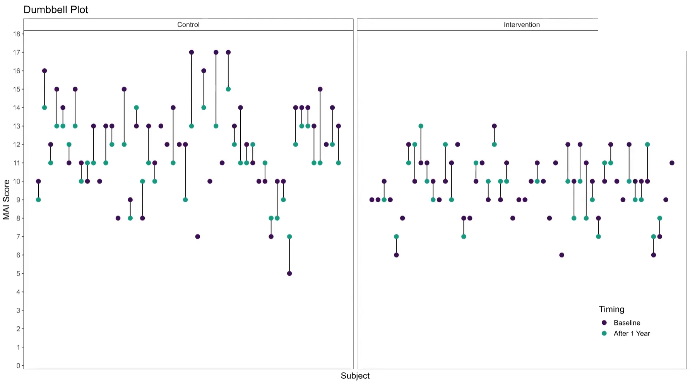
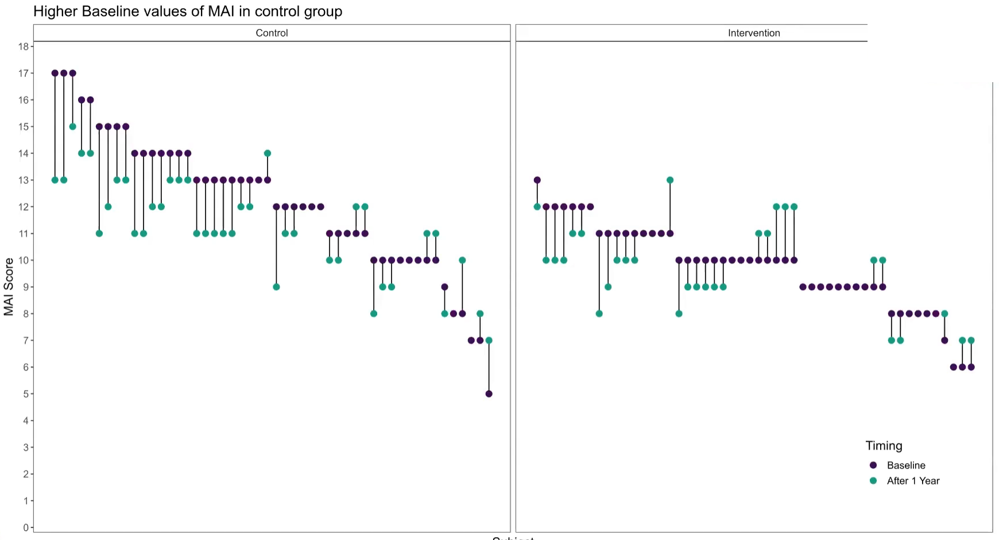
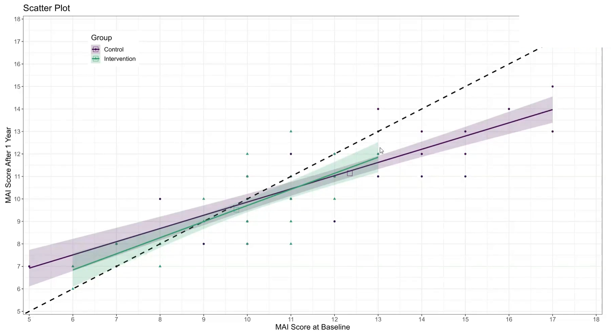

```{r setup, include=FALSE, echo = FALSE,message = FALSE, error = FALSE, warning = FALSE}
knitr::opts_chunk$set(echo = TRUE, fig.width = 10, fig.height = 6)

# <!-- ---------------------------------------------------------------------- -->
# <!--                    1. load the required packages                       -->
# <!-- ---------------------------------------------------------------------- --> 

## if(!require(psych)){install.packages("psych")}

packages<-c("tidyverse", "kableExtra")

ipak <- function(pkg){
  new.pkg <- pkg[!(pkg %in% installed.packages()[, "Package"])]
  if (length(new.pkg)) 
    install.packages(new.pkg, dependencies = TRUE)
  sapply(pkg, require, character.only = TRUE)
}
ipak(packages)
 


# <!-- ---------------------------------------------------------------------- -->
# <!--                        2. Basic system settings                        -->
# <!-- ---------------------------------------------------------------------- -->
setwd(dirname(rstudioapi::getSourceEditorContext()$path))
getwd()
Sys.setlocale("LC_ALL","English")

## convert backslash to forward slash in R
# gsub('"', "", gsub("\\\\", "/", readClipboard()))

### get the path
# rstudioapi::getSourceEditorContext()$path
# dirname(rstudioapi::getSourceEditorContext()$path)

### set working directory
# getwd()
# setwd("c:/Users/zbai/Desktop")
# Sys.setlocale("LC_ALL","English")

### get the R Version
# paste(R.Version()[c("major", "minor")], collapse = ".")

### convert backslash to forward slash 
# scan("clipboard",what="string")
# gsub('"', "", gsub("\\\\", "/", readClipboard())) 

## Load all r functions
## The directory where all source code files are saved.
source_code_dir <- "C:/Users/baiz/Downloads/Data-Analyst-with-R/00 R Function/ZB Function/"  
file_path_vec <- list.files(source_code_dir, full.names = T)
for(f_path in file_path_vec){source(f_path)}
 
```
 
 
# Introduction
  

## Histogram

In data analysis, especially when dealing with questionnaire data, `geom_histogram()` in `ggplot2` can be an essential tool for visualizing the distribution of responses. Histograms are particularly effective for showing the frequency of score occurrences across a range of values, making them ideal for summarizing the results from questionnaires where responses are often scaled (e.g., Likert scales from 1 to 5).
 

1. **Data Structure Preparation**: Your dataset should contain numeric or ordinal scale responses to questionnaire items. Each response is treated as an individual data point.

2. **Plotting with `geom_histogram()`**:
   - **Bin Settings**: By default, `geom_histogram()` will attempt to create 30 bins of equal width, but for questionnaire data, you might set the `binwidth` to 1 if your data are integers representing something like a Likert scale. This will create a bin for each possible score, aligning perfectly with the questionnaire's scoring system.
   - **Aesthetic Mapping**: Map the x-axis to your questionnaire score variable. Optionally, you can fill the bars based on another variable, such as different groups or demographics within your survey population, to compare distributions across categories.
   - **Position Adjustment**: If you are filling based on a factor (like age group or gender), using `position = "dodge"` will place the groups side by side for easier comparison, rather than the default stacking.

3. **Customizations and Improvements**:
   - **Labels and Titles**: Adding clear labels for the x-axis and y-axis, as well as a descriptive title, can help in immediately understanding the plot’s purpose. For instance, x could be "Questionnaire Score" and y "Frequency of Responses".
   - **Theme Adjustments**: Customize the plot appearance using `theme()` to improve readability and presentation quality. For example, adjusting text size, changing the legend position, or modifying background colors.

4. **Statistical Overlays**:
   - **Adding Mean/Mode Lines**: You can overlay additional information such as a vertical line showing the mean or mode of the distribution using `geom_vline()`, which can provide insights into the central tendency of the responses.
   - **Annotations**: Annotate specific features of the histogram, like notable peaks or unusual gaps, to draw attention to important aspects of the data.

5. **Analysis Interpretation**:
   - Histograms allow you to quickly grasp the distribution of responses, identify common and outlier responses, and assess the skewness or symmetry of the data.
   - By comparing histograms from different demographic groups, you can explore how opinions or behaviors differ across these groups, potentially guiding more detailed statistical tests or reporting insights.


```{r,echo = F,message = FALSE, error = FALSE, warning = FALSE}
data <- data.frame(
  Group = c(rep("Active Treatment", 200), rep("Placebo", 200)),
  Time = c(rep("Baseline", 100), rep("Week 16", 100), rep("Baseline", 100), rep("Week 16", 100)),
  DLQI_Score = c(sample(0:30, 100, replace = TRUE), sample(0:30, 100, replace = TRUE),
                 sample(0:30, 100, replace = TRUE), sample(0:30, 100, replace = TRUE))
)
 

# Create the plot
plot1 <- ggplot(data, aes(x = DLQI_Score, fill = Time)) +
  geom_histogram(stat = "count", binwidth = 1, position = position_dodge(width = 0.9)) +
  facet_wrap(~ Group, scales = "free_y") +
  labs(
    title = "Improved Quality of life after 16 weeks of treatment",
    x = "Total DLQI Score",
    y = "Patients"
  ) +
  scale_fill_brewer(palette = "Set1", labels = c("Baseline", "Week 16")) +
  theme_minimal() +
  theme(
    legend.title = element_blank(),
    plot.title = element_text(hjust = 0.5)
  )
# Print the plot
print(plot1)


plot2 <- ggplot(data, aes(x = DLQI_Score, fill = Time)) +
  geom_histogram(stat = "count", binwidth = 1, position = position_dodge(width = 0.9)) +
  facet_grid(Group ~ ., scales = "free_y", space = "free_y") +
  labs(
    title = "Improved Quality of life after 16 weeks of treatment",
    x = "Total DLQI Score",
    y = "Patients"
  ) +
  scale_fill_brewer(palette = "Set1", labels = c("Baseline", "Week 16")) +
  theme_minimal() +
  theme(
    legend.title = element_blank(),
    plot.title = element_text(hjust = 0.5),
    strip.background = element_blank(),
    strip.text = element_text(face = "bold")
  )

# Print the plot
print(plot2)

plot3 <- ggplot(data, aes(x = DLQI_Score, fill = Time)) +
  geom_histogram(stat = "count", binwidth = 1, position = position_dodge(width = 0.9)) +
  facet_grid(Time ~ Group, scales = "free_y", space = "free") +  # Adjust faceting
  labs(
    title = "Improved Quality of life after 16 weeks of treatment",
    x = "Total DLQI Score",
    y = "Patients"
  ) +
  scale_fill_brewer(palette = "Set1", labels = c("Baseline", "Week 16")) +
  theme_minimal() +
  theme(
    legend.title = element_blank(),
    plot.title = element_text(hjust = 0.5),
    strip.background = element_rect(fill = "gray90"),
    strip.text = element_text(face = "bold")
  )

# Print the plot
print(plot3)
```

## Slope Plots

Leverage visual analytics to identify data issues. Consider 4 questions on a Likert scale. 5 rating levels (Strongly disagree, Disagree, Neutral, Agree, Strongly Agree) coded as 1, 2, 3, 4 and 5, respectively. The higher the number the better. 400 Subjects (200 active, 200 control).

*We can clearly see that Site 4 is a visual outlier. The Active data for Site 4 looks like it belongs with the Control data from the other sites and likewise the Contorl data for Site 4 looks like it belo9ngs with the Active data from the other sites. Color and a useful title are used to highlight the difference.*


```{r,echo = F,message = FALSE, error = FALSE, warning = FALSE}

PROdata.vert <- read.csv("./01_Datasets/PROdata.csv")

PROdata.slopes <- PROdata.vert %>%
  mutate(total=Q1+Q2+Q3+Q4) %>%
  group_by(SITE, TRT) %>%
  summarise(total.score = sum(total, na.rm = TRUE)) %>%
  ungroup()

## apply a plot to a data set where this works

library(ggrepel)

p <- ggplot(PROdata.slopes, aes(
  x = TRT,
  y = total.score,
  group = SITE 
)) +
  geom_line(
    size = 0.75,
    color = "grey" 
  ) +
  geom_point(
    size = 2.5,
    #color = unhcr_pal(n = 1, "pal_blue")
    color = "grey" 
  ) +
  labs(
    title = "Total Scores By Site",
    caption = "Site 04 is Visual Outlier"
  ) +
  geom_text_repel(
    data = PROdata.slopes |> filter(TRT=="Active"),
    aes(label = paste(SITE, TRT,"=", total.score)),
    size = 8 / .pt,
    hjust = 1,
    direction = "y",
    nudge_x = -0.3,
  ) + 
  geom_text_repel(
    data = PROdata.slopes |> filter(TRT=="Control"),
    aes(label = paste(SITE, TRT,"=", total.score)),
    size = 8 / .pt,
    hjust = 1,
    direction = "y",
    nudge_x = 0.5,
  ) +
 ## Make Site 04 appear in blue
  geom_line(
    data=PROdata.slopes |> filter(SITE=="SITE04"),
    size = 0.75,
    color = "blue" 
  ) +
  geom_point(
    data=PROdata.slopes |> filter(SITE=="SITE04"),
    size = 2.5,
    #color = unhcr_pal(n = 1, "pal_blue")
    color = "blue" 
  ) + 
  xlab("Treatment") + ylab("Total Scores (Q1 + Q2 + Q3 + Q4)")

p
# ggsave(plot=p, ofile("slopes.png"))
```


## Stacked Bar Chart

*Annotation (circling Site 4 in red) and sorting (Site 4 in the upper left hand corner) to make clear that Site 4 is a visual outlier. The visual idiom is a stacked bar chart, one color for each questionnaire. Stacked barcharts are limited when comparing any of the components except the one on the bottom. For the purpose of this data viz challenge, it was only necessary to compare the totals, ie the heights of the stacked bars. This is easy to do for the stacked bars from a visual perception point of view. But the colors for the different components (Q1, Q2, Q3 and Q4) can be distracting.*

```{r,echo = F,message = FALSE, error = FALSE, warning = FALSE}
data <- read.csv("./01_Datasets/PROdata.csv")

# Convert data to long format for easier plotting with ggplot2
data_long <- data %>%
  pivot_longer(cols = starts_with("Q"), names_to = "Question", values_to = "Score")

# Calculate average scores by SITE, TRT, and Question
avg_scores <- data_long %>%
  group_by(SITE, TRT, Question) %>%
  summarise(Average_Score = mean(Score, na.rm = TRUE)) %>%
  ungroup()

# Plot
ggplot(avg_scores, aes(x = TRT, y = Average_Score, fill = Question)) +
  geom_bar(stat = "identity", position = "stack") +
  facet_wrap(~ SITE, ncol = 2) +
  labs(
    title = "Average Scores by Site and Treatment Group",
    subtitle = "Site 04 is the only site with lower average scores for active and higher for control across all PROs",
    x = "Treatment Group",
    y = "Average Score",
    fill = "PRO"
  ) +
  theme_minimal() +
  theme(
    plot.title = element_text(hjust = 0.5),
    plot.subtitle = element_text(hjust = 0.5)
  )

```

## Distribution plot by category I

This graph includes stacked density plots, sometimes known as a ridgeline plot. This graph type is useful where there are approximately 4-8 categories with a natural ordering, which is the case in this example. The graph is also showing patient level data as transparent dots on the X axis, and reference lines have been added. There is a lot of overplotting of the dots, so the opacity of dots is representing the data density at each value on the X-axis.

A title has been added to give a clear interpretation of the overall message.

```{r,echo = F,message = FALSE, error = FALSE, warning = FALSE}
WW_data <- read.csv("./01_Datasets/WWW_example_minimal_clinical_improvement.csv")

library(tidyverse)
library(ggplot2)
library(dplyr)
library(ggridges)
library(gt)
library(psych)

#####
#1 - calculate SEM 
#The Standard Error of Measurement (SEM) quantifies 
#the precision of the individual measurements 
#and gives an indication of the absolute reliability

#2 - calculate SDC
#The SEM can be used to calculate the Minimal Detectable Change (MDC)
#which is the minimal amount of change that a measurement 
#must show to be greater than the within subject variability
#and measurement error, also referred to as the sensitivity to change

pre_post <- WW_data[,c(1:2)]
sd_baseline <- sd(WW_data$total.score.baseline, na.rm = T)

icc <- ICC(pre_post)#0.032 - reliability for SEM

sem_baseline <- psychometric::SE.Meas(sd_baseline, 0.032)

#Smallest detectable change(SDC)/Minimal detectable change (MDC)
#SEM*1.92*sqrt(2)
sdc <- sem_baseline*1.96*sqrt(2)
sdc_comp <- sdc*-1

WW_data <- rename(WW_data, baseline = total.score.baseline, followup = total.score.follow.up, CGI = CGI.I)
WW_data <- within(WW_data, CHG <- followup-baseline)
WW_data <- within(WW_data, {
            CGI_cat <- NA
            CGI_cat[CGI==1] <- "Very much improved"
            CGI_cat[CGI==2] <- "Much improved"
            CGI_cat[CGI==3] <- "Minimally improved"
            CGI_cat[CGI==4] <- "No change"
            CGI_cat[CGI==5] <- "Minimally worse"
            CGI_cat[CGI==6] <- "Much worse"
            CGI_cat[CGI==7] <- "Very much worse"
            })

WW_data <- WW_data <- WW_data %>% 
  filter(!is.na(CGI_cat))

WW_data$CGI_cat <- factor(WW_data$CGI_cat, levels = c("Very much improved",
                                   "Much improved",
                                   "Minimally improved",
                                   "No change",
                                   "Minimally worse",
                                   "Much worse",
                                   "Very much worse"
                                   ))

gg <- ggplot(WW_data, aes(x = CHG, 
                    y = CGI_cat)) +
  stat_density_ridges(
    geom = "density_ridges_gradient",
    quantile_lines = TRUE,
    quantiles = 2, scale = 1, rel_min_height = 0.01,
    jittered_points = TRUE) +
  scale_x_continuous(breaks=seq(-40,40,10),
                     limits = c(-40,40)) +
  ylab("CGI-I Response") + xlab("Change in PRO Score") +
  labs(title = "Minimally Improved & Minimally Worse CGI-I Categories\nAre Not Differentiated From No change",
       subtitle = "Smoothed Distributions with Individual Patients (dots) and Means (|) \nReference Lines Display Smallest Detectable Change of PRO Score",
       caption = "Smallest Detectable Change defined by Standard Error of Measurement of PRO Score at Baseline") +
  theme(
    plot.title = element_text(color = "black", size = 15),
    plot.subtitle = element_text(color = "black", size = 10),
    plot.caption = element_text(color = "black", size = 8)
  )

#theme_ridges(font_size = 12)

#Build ggplot and extract data
d <- ggplot_build(gg)$data[[1]]

# Add geom_ribbon for shaded area
rcc <- gg +
  geom_ribbon(
    data = transform(subset(d, x >= sdc), CGI_cat = group),
    aes(x, ymin = ymin, ymax = ymax, group = group),
    fill = "red",
    alpha = 0.2, 
    show.legend = TRUE) +
  geom_ribbon(
    data = transform(subset(d, x <= sdc_comp), CGI_cat = group),
    aes(x, ymin = ymin, ymax = ymax, group = group),
    fill = "green",
    alpha = 0.2,
    show.legend = TRUE) +
  geom_vline(xintercept =sdc, linetype="dashed") +
  geom_vline(xintercept =sdc_comp, linetype="dashed")+
  annotate("segment", x = -15, xend = -35, y = 0.7, yend = 0.7, colour = "black", size=0.5, arrow=arrow(length = unit(0.03, "npc"))) +
  annotate("segment", x = 15, xend = 35, y = 0.7, yend = 0.7, colour = "black", size=0.5, arrow=arrow(length = unit(0.03, "npc"))) +
  geom_text(aes(x = -30, y = 0.45, label = "Improvement"), 
             hjust = 0, 
             vjust = 0,
             colour = "black", 
             size = 2.5) +
  geom_text(aes(x = 20, y = 0.45, label = "Deterioration"), 
            hjust = 0, 
            vjust = 0,
            colour = "black", 
            size = 2.5) + 
  ylab("CGI-I Response") + xlab("Change in PRO Score")
  
rcc
# ggsave("reliable_clinical_change_plot_red_green_v0_2.png", plot = rcc, device = png)

```

## Dumbbell Plot







```{r,echo = F,message = FALSE, error = FALSE, warning = FALSE}
data <- read.csv("./01_Datasets/MAI.csv")
```


## Scatter Plot




```{r,echo = F,message = FALSE, error = FALSE, warning = FALSE}
data <- read.csv("./01_Datasets/MAI.csv")

# Scatter plot with regression lines and confidence intervals
ggplot(data, aes(x = base.mai, y = mai, color = gr)) +
  geom_point(size = 2) +  # Add points
  geom_smooth(method = "lm", se = TRUE) +  # Add linear regression lines with confidence intervals
  geom_abline(intercept = 0, slope = 1, linetype = "dashed", color = "black") +  # Reference line
  labs(title = "Scatter Plot",
       x = "MAI Score at Baseline",
       y = "MAI Score After 1 Year",
       color = "Group") +
  theme_minimal() +
  theme(legend.position = "top")
```


# Reference
 
SIG (2023, Sept. 13). VIS-SIG Blog: Wonderful Wednesdays September 2023. Retrieved from https://graphicsprinciples.github.io/posts/2023-12-17-wonderful-wednesdays-september-2023/
