```{r setup, include=FALSE, echo = FALSE,message = FALSE, error = FALSE, warning = FALSE}
knitr::opts_chunk$set(echo = TRUE, fig.width = 10, fig.height = 6)

# <!-- ---------------------------------------------------------------------- -->
# <!--                    1. load the required packages                       -->
# <!-- ---------------------------------------------------------------------- --> 

# if(!require(psych)){install.packages("psych")}
 
 

# Define the packages
packages <- c("tidyverse", "kableExtra", "ggtext", "RCurl", "plyr","scales","forcats","psych",
              "ggplot2", "ggrepel", "cowplot", "lubridate", "readxl", "plotly","shiny","gt",
              "gridExtra", "patchwork", "reshape2", "grid", "ggthemes", "ggcharts","ggpubr","ggridges",
              "polycor", "ggalluvial","RColorBrewer")
 

ipak <- function(pkg){
  new.pkg <- pkg[!(pkg %in% installed.packages()[, "Package"])]
  if (length(new.pkg)) 
    install.packages(new.pkg, dependencies = TRUE)
  sapply(pkg, require, character.only = TRUE)
}
ipak(packages)
 


# <!-- ---------------------------------------------------------------------- -->
# <!--                        2. Basic system settings                        -->
# <!-- ---------------------------------------------------------------------- -->
setwd(dirname(rstudioapi::getSourceEditorContext()$path))
getwd()
Sys.setlocale("LC_ALL","English")

# convert backslash to forward slash in R
# gsub('"', "", gsub("\\\\", "/", readClipboard()))

## get the path
# rstudioapi::getSourceEditorContext()$path
# dirname(rstudioapi::getSourceEditorContext()$path)

## set working directory
# getwd()
# setwd("c:/Users/zbai/Desktop")
# Sys.setlocale("LC_ALL","English")

## get the R Version
# paste(R.Version()[c("major", "minor")], collapse = ".")

## convert backslash to forward slash 
# scan("clipboard",what="string")
# gsub('"', "", gsub("\\\\", "/", readClipboard())) 

# Load all r functions
# The directory where all source code files are saved.
source_code_dir <- "C:/Users/baiz/Downloads/Data-Analyst-with-R/00 R Function/ZB Function/"  
file_path_vec <- list.files(source_code_dir, full.names = T)
for(f_path in file_path_vec){source(f_path)}
 
```
 
  
  

# Histogram

In data analysis, especially when dealing with questionnaire data, `geom_histogram()` in `ggplot2` can be an essential tool for visualizing the distribution of responses. Histograms are particularly effective for showing the frequency of score occurrences across a range of values, making them ideal for summarizing the results from questionnaires where responses are often scaled (e.g., Likert scales from 1 to 5).
 

1. **Data Structure Preparation**: Your dataset should contain numeric or ordinal scale responses to questionnaire items. Each response is treated as an individual data point.

2. **Plotting with `geom_histogram()`**:
   - **Bin Settings**: By default, `geom_histogram()` will attempt to create 30 bins of equal width, but for questionnaire data, you might set the `binwidth` to 1 if your data are integers representing something like a Likert scale. This will create a bin for each possible score, aligning perfectly with the questionnaire's scoring system.
   - **Aesthetic Mapping**: Map the x-axis to your questionnaire score variable. Optionally, you can fill the bars based on another variable, such as different groups or demographics within your survey population, to compare distributions across categories.
   - **Position Adjustment**: If you are filling based on a factor (like age group or gender), using `position = "dodge"` will place the groups side by side for easier comparison, rather than the default stacking.

3. **Customizations and Improvements**:
   - **Labels and Titles**: Adding clear labels for the x-axis and y-axis, as well as a descriptive title, can help in immediately understanding the plot’s purpose. For instance, x could be "Questionnaire Score" and y "Frequency of Responses".
   - **Theme Adjustments**: Customize the plot appearance using `theme()` to improve readability and presentation quality. For example, adjusting text size, changing the legend position, or modifying background colors.

4. **Statistical Overlays**:
   - **Adding Mean/Mode Lines**: You can overlay additional information such as a vertical line showing the mean or mode of the distribution using `geom_vline()`, which can provide insights into the central tendency of the responses.
   - **Annotations**: Annotate specific features of the histogram, like notable peaks or unusual gaps, to draw attention to important aspects of the data.

5. **Analysis Interpretation**:
   - Histograms allow you to quickly grasp the distribution of responses, identify common and outlier responses, and assess the skewness or symmetry of the data.
   - By comparing histograms from different demographic groups, you can explore how opinions or behaviors differ across these groups, potentially guiding more detailed statistical tests or reporting insights.

## General

```{r,echo = T,message = FALSE, error = FALSE, warning = FALSE}
data <- data.frame(
  Group = c(rep("Active Treatment", 200), rep("Placebo", 200)),
  Time = c(rep("Baseline", 100), rep("Week 16", 100), rep("Baseline", 100), rep("Week 16", 100)),
  DLQI_Score = c(sample(0:30, 100, replace = TRUE), sample(0:30, 100, replace = TRUE),
                 sample(0:30, 100, replace = TRUE), sample(0:30, 100, replace = TRUE))
)
 

# Create the plot
plot1 <- ggplot(data, aes(x = DLQI_Score, fill = Time)) +
  geom_histogram(stat = "count", binwidth = 1, position = position_dodge(width = 0.9)) +
  facet_wrap(~ Group, scales = "free_y") +
  labs(
    title = "Improved Quality of life after 16 weeks of treatment",
    x = "Total DLQI Score",
    y = "Patients"
  ) +
  scale_fill_brewer(palette = "Set1", labels = c("Baseline", "Week 16")) +
  theme_minimal() +
  theme(
    legend.title = element_blank(),
    plot.title = element_text(hjust = 0.5)
  )
# Print the plot
print(plot1)


plot2 <- ggplot(data, aes(x = DLQI_Score, fill = Time)) +
  geom_histogram(stat = "count", binwidth = 1, position = position_dodge(width = 0.9)) +
  facet_grid(Group ~ ., scales = "free_y", space = "free_y") +
  labs(
    title = "Improved Quality of life after 16 weeks of treatment",
    x = "Total DLQI Score",
    y = "Patients"
  ) +
  scale_fill_brewer(palette = "Set1", labels = c("Baseline", "Week 16")) +
  theme_minimal() +
  theme(
    legend.title = element_blank(),
    plot.title = element_text(hjust = 0.5),
    strip.background = element_blank(),
    strip.text = element_text(face = "bold")
  )

# Print the plot
print(plot2)

plot3 <- ggplot(data, aes(x = DLQI_Score, fill = Time)) +
  geom_histogram(stat = "count", binwidth = 1, position = position_dodge(width = 0.9)) +
  facet_grid(Time ~ Group, scales = "free_y", space = "free") +  # Adjust faceting
  labs(
    title = "Improved Quality of life after 16 weeks of treatment",
    x = "Total DLQI Score",
    y = "Patients"
  ) +
  scale_fill_brewer(palette = "Set1", labels = c("Baseline", "Week 16")) +
  theme_minimal() +
  theme(
    legend.title = element_blank(),
    plot.title = element_text(hjust = 0.5),
    strip.background = element_rect(fill = "gray90"),
    strip.text = element_text(face = "bold")
  )

# Print the plot
print(plot3)
```


## Clean Design 1


```{r,echo = T,message = FALSE, error = FALSE, warning = FALSE}
dql <- read.csv("./01_Datasets/ww2020_dlqi.csv")

attach(dql)
# View(dql)
# summary(dql)

# Load Library 
# library(ggthemes)
# library(ggcharts)

# Select relevant variables
dql_renamed <-
  dql %>%
  select(
    TRT, VISIT, DLQI_SCORE
    )

# Rename treatment levels
dql_renamed$TRT[dql_renamed$TRT=="A"] <- "Placebo"
dql_renamed$TRT[dql_renamed$TRT=="B"] <- "Active Treatment"

# Seperate visits

# Baseline visit
totalbaseline <- 
  dql_renamed %>% 
  filter(VISIT=="Baseline")

# Construct a histogram for each treatment arm at baseline visit
(d <- 
  ggplot(
    data = totalbaseline,
    aes(
      x = DLQI_SCORE
      ))
  + geom_histogram(
    binwidth = 1.5,
    color = "grey",
    fill = "deeppink3"
    ) +
  facet_grid(~ TRT)
  + theme_ng(grid = "X")
  + labs(
    x = "DLQI Score",
    y = "Count",
    title = "Total DLQI Score",
    subtitle = "At Baseline",
    caption = "Samah Abdelaal")
  + theme(
    axis.title.x = element_blank(),
    plot.title = element_text(size = 20,
                              face = "bold"),
    plot.subtitle = element_text(size = 18),
    plot.caption = element_text(size = 15,
                                face = "bold.italic")
    ))


# Week 16 visit
totalweek16 <- 
  dql_renamed %>% 
  filter(VISIT=="Week 16")

(e <- 
  ggplot(
    data = totalweek16,
    aes(
      x = DLQI_SCORE
      )
    )
  + geom_histogram(
    binwidth = 1.5,
    color = "grey",
    fill = "deeppink3"
    ) +
  facet_grid(~ TRT)
  + theme_ng(grid = "X")
  + labs(
    x = "DLQI Score",
    y = "Count",
    subtitle = "At Week 16"
    ) +
  theme(
    plot.subtitle = element_text(size = 18)
    ))

# Compine plots
library(gridExtra)

gridExtra::grid.arrange(d, e, nrow = 2)
```


## Clean Design 2

```{r,echo = T,message = FALSE, error = FALSE, warning = FALSE}
dql <- read.csv("./01_Datasets/ww2020_dlqi.csv")

attach(dql)
# View(dql)
# summary(dql)

# Load Library
# library(tidyverse)
# library(ggplot2)
# library(ggthemes)
# library(ggcharts)

# Select relevant variables
dql_renamed <-
  dql %>%
  select(
    TRT, VISIT, DLQI_SCORE
    )

# Rename treatment levels
dql_renamed$TRT[dql_renamed$TRT=="A"] <- "Placebo"
dql_renamed$TRT[dql_renamed$TRT=="B"] <- "Active Treatment"

# Seperate treatments

# Active
totalB <- 
  dql_renamed %>% 
  filter(TRT=="Active Treatment")

# Construct a histogram for each treatment arm at baseline visit
(d <- 
  ggplot(
    data = totalB,
    aes(
      x = DLQI_SCORE
      ))
  + geom_histogram(
    binwidth = 1,
    color = "grey",
    fill = "deeppink3"
    ) +
  facet_grid(~ VISIT)
  + theme_ng(grid = "X")
  + labs(
    x = "Total DLQI Score",
    y = "Patients",
    title = "Improved Quality of life after 16 weeks of treatment",
    subtitle = "Active Treatment")
  + theme(
    axis.title.x = element_blank(),
    axis.text.x = element_blank(),
    plot.title = element_text(size = 17,
                              face = "bold"),
    plot.subtitle = element_text(size = 15, color = "deeppink3")
    ))


# Week 16 visit
totalA <- 
  dql_renamed %>% 
  filter(TRT=="Placebo")

(e <- 
  ggplot(
    data = totalA,
    aes(
      x = DLQI_SCORE
      )
    )
  + geom_histogram(
    binwidth = 1,
    color = "grey",
    fill = "green4"
    ) +
  facet_grid(~ VISIT)
  + theme_ng(grid = "X")
  + labs(
    x = "Total DLQI Score",
    y = "Patients",
    subtitle = "Placebo",
    caption = "Lower score equals better quality of life"
    ) +
  theme(
    strip.text.x = element_blank(),
    plot.subtitle = element_text(size = 15, color = "green4"),
    plot.caption = element_text(size = 12,
                                face = "italic")
    ))

# Compine plots
# library(gridExtra)

gridExtra::grid.arrange(d, e, nrow = 2, heights = c(1.5,1))
```


#  CGI-S

## Barplot for

The clinical global impression – severity scale (CGI-S) is a 7-point scale that requires the clinician to rate the severity of the patient’s illness at the time of assessment, relative to the clinician’s past experience with patients who have the same diagnosis. The challenge was to provide data visualisations to show this data and also to provide comparisons between the different groups (e.g. based on response differences or odds ratios for the different response categories) using Clinical Global Impression Data.

```{r,echo = T,message = FALSE, error = FALSE, warning = FALSE} 
plot.fun <- function(dat, name, v.just = 1.5, gci.s = "<=3", y.max = 100,
                     title.text = "The <span style = 'color: #08519C'>Active</span> and
         <span style = 'color: #BDD7E7'>Comparator</span> result in similar clinical global impression",
                     col.ann = c(rep(c("black", "black", "white"), 2)),
                     title.h.just = 0.6) {
  require(ggplot2)
  require(ggtext)
  require(RColorBrewer)
  ggplot(dat, aes(y=Value, x=VISITNUM, fill=Treatment)) + 
    geom_bar(position="dodge", stat="identity") +
    ylab("") + xlab ("") +
    ylim(-12, y.max) +
    theme(panel.grid.major = element_blank(), panel.grid.minor = element_blank(),
          panel.background = element_blank(), axis.line = element_blank(),
          axis.ticks = element_blank(),# axis.text = element_text(size = 12),
          axis.text.x = element_blank(),
          axis.text.y = element_blank(),
          plot.subtitle = element_text(size = 15, color = "grey40", hjust = 0.14),
          plot.caption = element_text(color = "grey60", size = 12, hjust = 0.85),
          plot.title = element_markdown(color = "grey40", size = 20,
                                        face = "bold", hjust = title.h.just),
          plot.margin = margin(0.3, 0.2, -0.38, -0.2, "in")) +
    annotate("text", x=1, y=-4, label= "Week 12", size = 4.25, color = "grey40") +
    annotate("text", x=2, y=-4, label= "Week 52", size = 4.25, color = "grey40") +
    # annotate("text", x=3, y=-4, label= "Week 24", size = 4.25, color = "grey40") +
    # annotate("text", x=2.27, y=-12,
    #          label= "Good glycemic control is defined as Glucose values within a range of 72 and 140 mg/dL.",
    #          size = 3.5, color = "grey60") +
    scale_fill_manual(breaks = c("Active", "Comparator", "Placebo"),
                      values = c(brewer.pal(n = 5, name = "Blues")[c(5, 2)], "grey90")) +
    geom_text(aes(label=val.t), vjust = v.just, size = 4, position = position_dodge(.9),
              col = col.ann) +
    labs(title = title.text,
         subtitle = paste0("Bars show the relative frequency of subjects with CGI-S", gci.s))#,
  # caption = "Good glycemic control is defined as Glucose values within a range of 72 and 140 mg/dL.")
  # ggsave(name, width = 12, height = 6, units = "in", dpi = 150)
}

dat <- read.csv("./01_Datasets/CGI_S_3_groups_csv.csv")
dat$X1 <- (dat$X1 + dat$X2 + dat$X3) / dat$Total.sample.size * 100
# dat$X1 <- (dat$X1) / dat$Total.sample.size * 100
dat <- dat[, 1:3]
names(dat) <- c("VISITNUM", "Treatment", "Value")
dat$val.t <- paste(format(round(dat$Value, 1), nsmall = 1), "%")
dat$VISITNUM <- as.factor(dat$VISITNUM)
plot.fun(dat, "barplot_3.png")

dat <- read.csv("./01_Datasets/CGI_S_3_groups_csv.csv")
dat$X1 <- (dat$X1 + dat$X2) / dat$Total.sample.size * 100
# dat$X1 <- (dat$X1) / dat$Total.sample.size * 100
dat <- dat[, 1:3]
names(dat) <- c("VISITNUM", "Treatment", "Value")
dat$val.t <- paste(format(round(dat$Value, 1), nsmall = 1), "%")
dat$VISITNUM <- as.factor(dat$VISITNUM)
plot.fun(dat, "barplot_2.png", gci.s = "<=2", y.max = 70,
         title.text = "The <span style = 'color: #08519C'>Active</span> results
         in better clinical global impression than the
         <span style = 'color: #BDD7E7'>Comparator</span>",
         title.h.just = 1.25)

dat <- read.csv("./01_Datasets/CGI_S_3_groups_csv.csv")
dat$X1 <- (dat$X1) / dat$Total.sample.size * 100
# dat$X1 <- (dat$X1) / dat$Total.sample.size * 100
dat <- dat[, 1:3]
names(dat) <- c("VISITNUM", "Treatment", "Value")
dat$val.t <- paste(format(round(dat$Value, 1), nsmall = 1), "%")
dat$VISITNUM <- as.factor(dat$VISITNUM)
plot.fun(dat, "barplot_1.png", v.just = -0.5, gci.s = "=1", y.max = 50,
         title.text = "The <span style = 'color: #08519C'>Active</span> results
         in better clinical global impression than the
         <span style = 'color: #BDD7E7'>Comparator</span>",
         col.ann = c(rep(c("black", "black", "black"), 2)),
         title.h.just = 1.25)

```


# CGI-I

The **Clinical Global Impressions-Improvement (CGI-I)** scale is a widely used tool in clinical trials and practice to evaluate the overall change in a patient's clinical condition over time, as perceived by the clinician. It is often used in conjunction with patient-reported outcomes (PROs) to assess the relevance and clinical significance of observed changes.
 

1. **Purpose**:
   - The CGI-I measures the degree of improvement (or worsening) in a patient's condition compared to baseline, from the clinician's perspective.
   - It provides an overall, global impression, considering all available information, including clinical observations and patient-reported experiences.

2. **Scale**:
   - CGI-I is typically a 7-point scale, where:
     - 1 = Very much improved
     - 2 = Much improved
     - 3 = Minimally improved
     - 4 = No change
     - 5 = Minimally worse
     - 6 = Much worse
     - 7 = Very much worse

3. **Relation to Clinically Meaningful Differences**:
   - **Clinically meaningful differences** help define thresholds where changes in outcomes are considered significant or relevant to patients and clinicians.
   - By comparing changes in PROs (like pain scores or quality of life measures) to the CGI-I ratings, researchers can determine what magnitude of change on the PRO corresponds to meaningful improvement in the clinician's eyes.
   - For instance, if a 4-point decrease in a symptom severity score consistently aligns with a "Much improved" (rating of 2) on the CGI-I, this threshold can guide interpretation of treatment effects.

4. **Utility in Research**:
   - **Anchor-Based Methodology**: CGI-I often serves as an anchor in defining clinically meaningful changes in PROs because it reflects a holistic and intuitive judgment from the clinician.
   - **Validation**: PRO instruments may be validated by examining how well their scores correlate with CGI-I ratings.

## Line graphs

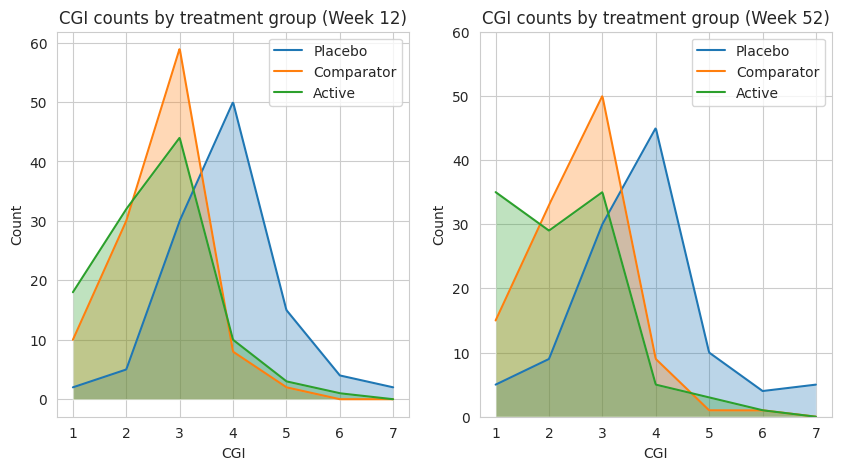


## Stacked Bar Chart

*Annotation (circling Site 4 in red) and sorting (Site 4 in the upper left hand corner) to make clear that Site 4 is a visual outlier. The visual idiom is a stacked bar chart, one color for each questionnaire. Stacked barcharts are limited when comparing any of the components except the one on the bottom. For the purpose of this data viz challenge, it was only necessary to compare the totals, ie the heights of the stacked bars. This is easy to do for the stacked bars from a visual perception point of view. But the colors for the different components (Q1, Q2, Q3 and Q4) can be distracting.*

```{r,echo = T,message = FALSE, error = FALSE, warning = FALSE}
data <- read.csv("./01_Datasets/PROdata.csv")

# Convert data to long format for easier plotting with ggplot2
data_long <- data %>%
  pivot_longer(cols = starts_with("Q"), names_to = "Question", values_to = "Score")

# Calculate average scores by SITE, TRT, and Question
avg_scores <- data_long %>%
  group_by(SITE, TRT, Question) %>%
  summarise(Average_Score = mean(Score, na.rm = TRUE)) %>%
  ungroup()

# Plot
ggplot(avg_scores, aes(x = TRT, y = Average_Score, fill = Question)) +
  geom_bar(stat = "identity", position = "stack") +
  facet_wrap(~ SITE, ncol = 2) +
  labs(
    title = "Average Scores by Site and Treatment Group",
    subtitle = "Site 04 is the only site with lower average scores for active and higher for control across all PROs",
    x = "Treatment Group",
    y = "Average Score",
    fill = "PRO"
  ) +
  theme_minimal() +
  theme(
    plot.title = element_text(hjust = 0.5),
    plot.subtitle = element_text(hjust = 0.5)
  )

```


## Slope Plots

Leverage visual analytics to identify data issues. Consider 4 questions on a Likert scale. 5 rating levels (Strongly disagree, Disagree, Neutral, Agree, Strongly Agree) coded as 1, 2, 3, 4 and 5, respectively. The higher the number the better. 400 Subjects (200 active, 200 control).

*We can clearly see that Site 4 is a visual outlier. The Active data for Site 4 looks like it belongs with the Control data from the other sites and likewise the Contorl data for Site 4 looks like it belo9ngs with the Active data from the other sites. Color and a useful title are used to highlight the difference.*


```{r,echo = T,message = FALSE, error = FALSE, warning = FALSE}

PROdata.vert <- read.csv("./01_Datasets/PROdata.csv")

PROdata.slopes <- PROdata.vert %>%
  mutate(total=Q1+Q2+Q3+Q4) %>%
  group_by(SITE, TRT) %>%
  summarise(total.score = sum(total, na.rm = TRUE)) %>%
  ungroup()

# apply a plot to a data set where this works

# library(ggrepel)

p <- ggplot(PROdata.slopes, aes(
  x = TRT,
  y = total.score,
  group = SITE 
)) +
  geom_line(
    size = 0.75,
    color = "grey" 
  ) +
  geom_point(
    size = 2.5,
    #color = unhcr_pal(n = 1, "pal_blue")
    color = "grey" 
  ) +
  labs(
    title = "Total Scores By Site",
    caption = "Site 04 is Visual Outlier"
  ) +
  geom_text_repel(
    data = PROdata.slopes |> filter(TRT=="Active"),
    aes(label = paste(SITE, TRT,"=", total.score)),
    size = 8 / .pt,
    hjust = 1,
    direction = "y",
    nudge_x = -0.3,
  ) + 
  geom_text_repel(
    data = PROdata.slopes |> filter(TRT=="Control"),
    aes(label = paste(SITE, TRT,"=", total.score)),
    size = 8 / .pt,
    hjust = 1,
    direction = "y",
    nudge_x = 0.5,
  ) +
 # Make Site 04 appear in blue
  geom_line(
    data=PROdata.slopes |> filter(SITE=="SITE04"),
    size = 0.75,
    color = "blue" 
  ) +
  geom_point(
    data=PROdata.slopes |> filter(SITE=="SITE04"),
    size = 2.5,
    #color = unhcr_pal(n = 1, "pal_blue")
    color = "blue" 
  ) + 
  xlab("Treatment") + ylab("Total Scores (Q1 + Q2 + Q3 + Q4)")

p
# ggsave(plot=p, ofile("slopes.png"))
```


## Cumulative distribution plot


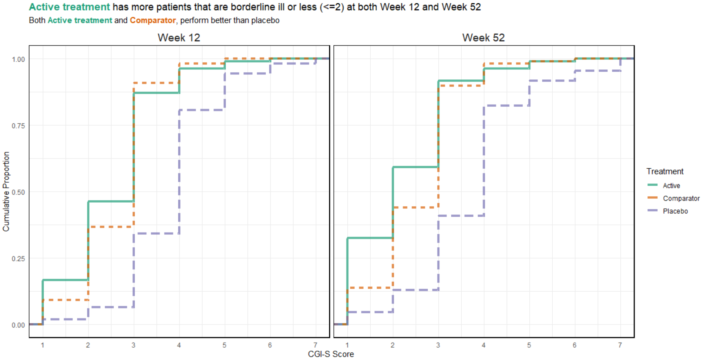


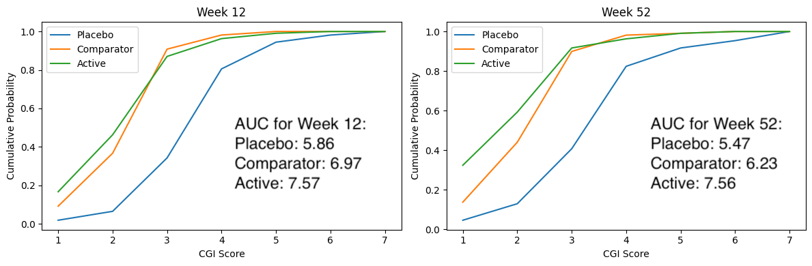


## Exploring Uncertainty

This graph is formed in two panels, with the left panel showing the Cumulative Distribution Function (CDF) plots of percentage change from baseline in score, grouped by the anchor measure. A measure of variability has been added to the plot, derived using bootstrapping methods. The right panel is showing 95% CIs and 95% Prediction Intervals of scores for each category.

CDF plots used for comparing distributions are sometimes superimposed, so this approach may have been useful. However the confidence envelopes couldn’t then be shown simultaneously, so there’d need to be a way of interactively selecting one category at a time. Use of percentage change was discussed – absolute changes are often preferable in a scenario where clinical meaningful changes are being assessed.

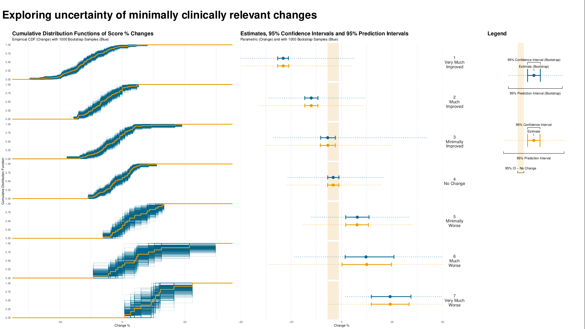

```
# {r,echo = T,message = FALSE, error = FALSE, warning = FALSE}
# Data and packages ----
# library(readr)
# library(ggplot2)
# library(dplyr)
# library(cowplot)
# library(ggpubr)

# urlfile <- "https://raw.githubusercontent.com/VIS-SIG/Wonderful-Wednesdays/master/data/2021/2021-10-13/WWW_example_minimal_clinical_improvement.csv"

df <- read_csv("./01_Datasets/WWW_example_minimal_clinical_improvement.csv") %>%
  mutate(change=`total score follow up`-`total score baseline`,
         change_pct=(`total score follow up`-`total score baseline`)*100/`total score baseline`) %>%
  rename(CGI_I=`CGI-I`)

# Bootstrapping ECDFs ----
set.seed(1234)
nboot <- 100
boot <- NULL
for (i in 1:nboot){
  d <- df[sample(seq_len(nrow(df)), nrow(df), replace=T), ]
  d$sim <- i
  boot <- rbind(boot, d)
}

res1 <- boot %>%
  group_by(CGI_I, sim) %>%
  summarise(change_pct_median=mean(change_pct)) %>%
  ungroup() %>%
  group_by(CGI_I) %>%
  summarise(boot_median = median(change_pct_median),
            boot_lo95ci = quantile(change_pct_median, 0.025),
            boot_hi95ci = quantile(change_pct_median, 0.975)) 
res1

res2 <- boot %>%
  group_by(CGI_I) %>%
  summarise(boot_lo95pi = quantile(change_pct, 0.025),
            boot_hi95pi = quantile(change_pct, 0.975)) 
res2

res3 <- df %>%
  group_by(CGI_I) %>%
  summarise(n = n(),
            mean = mean(change_pct),
            sd = sd(change_pct),
            lo95pi = mean - 1.96*sd,
            hi95pi = mean + 1.96*sd,
            lo95ci = mean - 1.96*(sd/sqrt(n)),
            hi95ci = mean + 1.96*sd/sqrt(n)) 
res3

chg <- res1 %>%
  left_join(res2) %>%
  left_join(res3)
chg

no_chg <- res1 %>%
  left_join(res3) %>%
  filter(CGI_I==4) %>%
  select(lo95ci, hi95ci, lo95pi, hi95pi) %>%
  right_join(tibble(id=1:7), by = character())
no_chg

# Final plot ----
## CDFs
p1 <- ggplot() +
  stat_ecdf(aes(x=change_pct, group=as.factor(sim)), data = boot, colour = alpha("deepskyblue4", 0.2)) +
  stat_ecdf(aes(x=change_pct), data = df, size = 1.25, color = "orange2") +
  scale_x_continuous(limits = c(-80, 80)) +
  facet_grid(rows = vars(CGI_I))+
  labs(title = "Cumulative Distribution Functions of Score % Changes",
       subtitle = "Empirical CDF (Orange) with 1000 Bootstrap Samples (Blue)",
       y = "Cumulative Distribution Function",
       x = "Change %") +
  theme_minimal() +
  theme(strip.text = element_blank(),
        panel.grid.minor.y = element_blank(),
        panel.grid.major.y = element_blank(),
        plot.title = element_text(size = 18, face = "bold"),
        plot.subtitle = element_text(size = 12)) 
p1


labels_cgii <- as_labeller(c(`1` = "1\nVery Much\nImproved", 
                             `2` = "2\nMuch\nImproved",
                             `3` = "3\nMinimally\nImproved", 
                             `4` = "4\nNo Change",
                             `5` = "5\nMinimally\nWorse",
                             `6` = "6\nMuch\nWorse", 
                             `7` = "7\nVery Much\nWorse"))

## Forest plot
p2 <- ggplot(data=chg) +
  
  geom_rect(data=no_chg, aes(ymin=0, ymax=1,
                             xmin=lo95ci, xmax=hi95ci),
            fill="orange2", alpha=0.025) +
  
  geom_point(aes(x = boot_median, y=0.6),
             size = 4, color = "deepskyblue4") +
  geom_errorbarh(aes(xmin = boot_lo95ci, xmax = boot_hi95ci, y = 0.6), 
                 height = 0.1, size=1.25, color = "deepskyblue4") +
  geom_errorbarh(aes(xmin = boot_lo95pi, xmax = boot_hi95pi, y = 0.6), 
                 height = 0.0, size=0.75, color = "deepskyblue4", linetype="dotted") +
  
  geom_point(aes(x = mean, y = 0.4), 
             size = 4, color = "orange2") +
  geom_errorbarh(aes(xmin = lo95ci, xmax = hi95ci, y = 0.4), 
                 height = 0.1, size=1.25, color = "orange2") +
  geom_errorbarh(aes(xmin = lo95pi, xmax = hi95pi, y = 0.4), 
                 height = 0.0, size=0.75, color = "orange2", linetype="dotted") +

  facet_grid(rows = vars(CGI_I), labeller = labels_cgii)+
  ylim(0, 1) +
  theme_minimal() +
  labs(title = "Estimates, 95% Confidence Intervals and 95% Prediction Intervals",
       subtitle = "Parametric (Orange) and with 1000 Bootstrap Samples (Blue)",
       x = "Change %", 
       y = "") +
  theme(strip.text.y = element_text(size = 14, angle = 0),
        axis.text.y = element_blank(),
        panel.grid.major.y = element_blank(),
        panel.grid.minor.y = element_blank(),
        plot.title = element_text(size = 18, face = "bold"),
        plot.subtitle = element_text(size = 12)) +
  coord_cartesian(xlim = c(-50, 50), ylim=c(0,1), expand=F, clip = "on")
p2


## Legend
dummy1 <- chg[chg$CGI_I==4,]
dummy2 <- chg[chg$CGI_I==5,]

tl<-0.015 # tip.length
l1 <- ggplot(data=dummy2) +
  labs(title = "Legend") +
  geom_rect(data=dummy1, aes(ymin=0, ymax=1, xmin=lo95ci, xmax=hi95ci),
            fill="orange2", alpha = 0.15) +  
  geom_bracket(xmin=dummy1$lo95ci, xmax=dummy1$hi95ci,
               y.position = 0, 
               label = "95% CI - No Change", tip.length = c(-tl, -tl)) + 
  geom_point(aes(x = boot_median, y=0.75), 
             size = 4, color = "deepskyblue4") +
  geom_errorbarh(aes(xmin = boot_lo95ci, xmax = boot_hi95ci, y = 0.75),
                 height = 0.1, size=1.25, color = "deepskyblue4") +
  geom_errorbarh(aes(xmin = boot_lo95pi, xmax = boot_hi95pi, y = 0.75), 
                 height = 0.0, size=0.75, color = "deepskyblue4", linetype="dotted") +
  geom_bracket(xmin=dummy2$lo95ci, xmax=dummy2$hi95ci, y.position = 0.35,
               label = "95% Confidence Interval", tip.length = c(tl, tl)) +
  geom_bracket(xmin=dummy2$mean, xmax=dummy2$mean, y.position = 0.3,
               label = "Estimate", tip.length = c(tl, tl)) +
  geom_bracket(xmin=dummy2$lo95pi, xmax=dummy2$hi95pi, y.position = 0.15, vjust = 4,
               label = "95% Prediction Interval", tip.length = c(-tl, -tl)) +
  geom_point(aes(x = mean, y = 0.25), 
             size = 4, color = "orange2") +
  geom_errorbarh(aes(xmin = lo95ci, xmax = hi95ci, y = 0.25), 
                 height = 0.1, size=1.25, color = "orange2") +
  geom_errorbarh(aes(xmin = lo95pi, xmax = hi95pi, y = 0.25), 
                 height = 0.0, size=0.75, color = "orange2", linetype="dotted") +
  geom_bracket(xmin=dummy2$boot_lo95ci, xmax=dummy2$boot_hi95ci,
               y.position = 0.85,
               label = "95% Confidence Interval (Bootstrap)", tip.length = c(tl, tl)) +
  geom_bracket(xmin=dummy2$boot_median, xmax=dummy2$boot_median,
               y.position = 0.8,
               label = "Estimate (Bootstrap)", tip.length = c(tl, tl)) +
  geom_bracket(xmin=dummy2$boot_lo95pi, xmax=dummy2$boot_hi95pi, 
               y.position = 0.65, vjust = 4,
               label = "95% Prediction Interval (Bootstrap)", tip.length = c(-tl, -tl)) + 
  coord_cartesian(xlim = c(-30, 50), ylim=c(0,1)) +
  theme_void() +
  theme(plot.title = element_text(size = 18, face = "bold"),
        plot.subtitle = element_text(size = 12))
l1

pnull <- ggplot() +
  coord_cartesian(xlim = c(-30, 50), ylim=c(0,1)) +
  theme_void()
  
legend <- plot_grid(l1, pnull, ncol=1,
                    rel_heights = c(0.5, 0.5))

## Title
title <- ggdraw() + 
  draw_label(
    "Exploring uncertainty of minimally clinically relevant changes",
    fontface = 'bold', size = 36,
    x = 0,
    hjust = 0
  ) +
  theme(
    plot.margin = margin(0, 0, 0, 7)
  )
title

plot_row <- plot_grid(p1, p2, pnull , legend, nrow=1, rel_widths = c(3, 3, 0.25, 1.25))
g2 <- plot_grid(title, plot_row, ncol = 1, rel_heights = c(0.1, 1))
g2
f<-1.7
# ggsave(file="plot_par_nonpar.pdf", g2, width = 16*f, height = 9*f)
```


## Spaghetti and Distribution Plot

The upper part of the graph is showing the distribution of the score values within each CGI-I category, using density plots of scores on an absolute scale. Distributions are shown separately for baseline and follow-up visits within each category, rather than change from baseline. Individual patient and mean changes are shown using slope plots.

The lower part of the graph shows the distribution of change from baseline values, with a measure of variability being derived using bootstrapping methods. Colour has been used to show paired mean differences outside a +/- 10 unit range.

In general, the graph contains a lot of information and takes some time to understand. However the graph tells a clear story in terms of the distribution of score across different categories, and shows clearly that the Minimally Improved category does not seem to be well differentiated from No Change category.


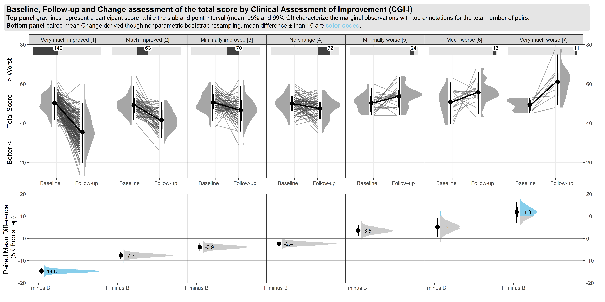


## Distribution Plot by Category I

This graph includes stacked density plots, sometimes known as a ridgeline plot. This graph type is useful where there are approximately 4-8 categories with a natural ordering, which is the case in this example. The graph is also showing patient level data as transparent dots on the X axis, and reference lines have been added. There is a lot of overplotting of the dots, so the opacity of dots is representing the data density at each value on the X-axis.
 

```{r,echo = T,message = FALSE, error = FALSE, warning = FALSE}
WW_data <- read.csv("./01_Datasets/WWW_example_minimal_clinical_improvement.csv")

# library(tidyverse)
# library(ggplot2)
# library(dplyr)
# library(ggridges)
# library(gt)
# library(psych)

#####
#1 - calculate SEM 
#The Standard Error of Measurement (SEM) quantifies 
#the precision of the individual measurements 
#and gives an indication of the absolute reliability

#2 - calculate SDC
#The SEM can be used to calculate the Minimal Detectable Change (MDC)
#which is the minimal amount of change that a measurement 
#must show to be greater than the within subject variability
#and measurement error, also referred to as the sensitivity to change

pre_post <- WW_data[,c(1:2)]
sd_baseline <- sd(WW_data$total.score.baseline, na.rm = T)

icc <- ICC(pre_post)#0.032 - reliability for SEM

sem_baseline <- psychometric::SE.Meas(sd_baseline, 0.032)

#Smallest detectable change(SDC)/Minimal detectable change (MDC)
#SEM*1.92*sqrt(2)
sdc <- sem_baseline*1.96*sqrt(2)
sdc_comp <- sdc*-1

WW_data <- rename(WW_data, baseline = total.score.baseline, followup = total.score.follow.up, CGI = CGI.I)
WW_data <- within(WW_data, CHG <- followup-baseline)
WW_data <- within(WW_data, {
            CGI_cat <- NA
            CGI_cat[CGI==1] <- "Very much improved"
            CGI_cat[CGI==2] <- "Much improved"
            CGI_cat[CGI==3] <- "Minimally improved"
            CGI_cat[CGI==4] <- "No change"
            CGI_cat[CGI==5] <- "Minimally worse"
            CGI_cat[CGI==6] <- "Much worse"
            CGI_cat[CGI==7] <- "Very much worse"
            })

WW_data <- WW_data <- WW_data %>% 
  filter(!is.na(CGI_cat))

WW_data$CGI_cat <- factor(WW_data$CGI_cat, levels = c("Very much improved",
                                   "Much improved",
                                   "Minimally improved",
                                   "No change",
                                   "Minimally worse",
                                   "Much worse",
                                   "Very much worse"
                                   ))

gg <- ggplot(WW_data, aes(x = CHG, 
                    y = CGI_cat)) +
  stat_density_ridges(
    geom = "density_ridges_gradient",
    quantile_lines = TRUE,
    quantiles = 2, scale = 1, rel_min_height = 0.01,
    jittered_points = TRUE) +
  scale_x_continuous(breaks=seq(-40,40,10),
                     limits = c(-40,40)) +
  ylab("CGI-I Response") + xlab("Change in PRO Score") +
  labs(title = "Minimally Improved & Minimally Worse CGI-I Categories\nAre Not Differentiated From No change",
       subtitle = "Smoothed Distributions with Individual Patients (dots) and Means (|) \nReference Lines Display Smallest Detectable Change of PRO Score",
       caption = "Smallest Detectable Change defined by Standard Error of Measurement of PRO Score at Baseline") +
  theme(
    plot.title = element_text(color = "black", size = 15),
    plot.subtitle = element_text(color = "black", size = 10),
    plot.caption = element_text(color = "black", size = 8)
  )

#theme_ridges(font_size = 12)

#Build ggplot and extract data
d <- ggplot_build(gg)$data[[1]]

# Add geom_ribbon for shaded area
rcc <- gg +
  geom_ribbon(
    data = transform(subset(d, x >= sdc), CGI_cat = group),
    aes(x, ymin = ymin, ymax = ymax, group = group),
    fill = "red",
    alpha = 0.2, 
    show.legend = TRUE) +
  geom_ribbon(
    data = transform(subset(d, x <= sdc_comp), CGI_cat = group),
    aes(x, ymin = ymin, ymax = ymax, group = group),
    fill = "green",
    alpha = 0.2,
    show.legend = TRUE) +
  geom_vline(xintercept =sdc, linetype="dashed") +
  geom_vline(xintercept =sdc_comp, linetype="dashed")+
  annotate("segment", x = -15, xend = -35, y = 0.7, yend = 0.7, colour = "black", size=0.5, arrow=arrow(length = unit(0.03, "npc"))) +
  annotate("segment", x = 15, xend = 35, y = 0.7, yend = 0.7, colour = "black", size=0.5, arrow=arrow(length = unit(0.03, "npc"))) +
  geom_text(aes(x = -30, y = 0.45, label = "Improvement"), 
             hjust = 0, 
             vjust = 0,
             colour = "black", 
             size = 2.5) +
  geom_text(aes(x = 20, y = 0.45, label = "Deterioration"), 
            hjust = 0, 
            vjust = 0,
            colour = "black", 
            size = 2.5) + 
  ylab("CGI-I Response") + xlab("Change in PRO Score")
  
rcc
# ggsave("reliable_clinical_change_plot_red_green_v0_2.png", plot = rcc, device = png)

```


## Dot plot

This graph used a different approach, showing only the patient-level data within each category as a scatter plot, with added jittering. The trend between categories is clear, and the number of patients can be compared between groups visually. It was noted that some people find it hard to compare distributions from scatter plots, so a hybrid of scatter plot and a elements showing the distribution, e.g. boxplot or density plot, may have been useful. However the author of the graph mentioned that this graph was intended to be used at the first step of an assessment, to answer the question “is CGI a good enough measure to investigate the meaningful change threshold”

```{r,echo = T,message = FALSE, error = FALSE, warning = FALSE}
# library(tidyverse)
# library(ggridges)
# library(polycor)
# library(grid)

# Clear environment
# rm(list=ls())

# Colour scheme
Turquoise100 <- "#00a3e0"
Turquoise75 <- "#40bae8"
Turquoise50 <- "#7fd1ef"
Turquoise25 <- "#bfe8f7"
Blue100 <- "#005587"
Blue50 <- "#7FAAC3"
Green100 <- "#43b02a"
Green100a <- rgb(67, 176, 42, alpha = 0.5 * 255, maxColorValue = 255)
Green50 <- "#a1d794"
Purple100 <-"#830065"
Purple100a <- rgb(131, 0, 101, alpha = 0.5 * 255, maxColorValue = 255)
Purple50 <- "#c17fb2"
 
dat <- read.csv("./01_Datasets/WWW_example_minimal_clinical_improvement.csv")

# glimpse(dat)

dat$USUBJID <- c(1:nrow(dat)) #MAKE A NEW SUBJECT ID COLUMN

dat <- dat %>%
  rename("Time1" = `total.score.baseline`, "Time2" = `total.score.follow.up`, "CGI" =`CGI.I`) %>% #RENAME COLUMNS
  mutate(CHANGE = Time2 - Time1) # MAKE CHANGE SCORES. NEGATIVE SCORE IS IMPROVEMENT
dat$CGI <- as.factor(dat$CGI)  
  
corr <- round(polyserial(dat$CHANGE, dat$CGI),3)

#CREATE A PLOT SHOWING TH CORRELATION BETWEEN THE ANCHOR AND PRO MEASURE
p <- ggplot(dat, aes(x=CGI, y=CHANGE)) +
  geom_jitter(width = 0.15, height = 0.5,alpha = 0.6) + 
  ggtitle("The CGI-I is Appropriate for Meaningful Change Derivation", subtitle = "A correlation between an anchor and a COA change score of >0.37 is recommended")+      
  labs(x="CGI-I Score at Time 2", y = "COA Change Score from Baseline")+
  scale_y_continuous(breaks=-40:+40*10) +         # SET TICK EVERY 10
  scale_x_discrete(labels=c("1\nVery much improved", "2", "3","4\nNo change", "5", "6","7\nVery much worse")) +
  theme(panel.background = element_blank(), axis.line = element_blank(),
        axis.text=element_text(size=16),
        axis.title=element_text(size=16),
        legend.text=element_text(size=16),
        legend.title=element_text(size=16),
        plot.title = element_text(size=22, face="bold"),
        plot.subtitle = element_text(size=16, face="bold")) +
  annotate("text", x=6, y=-35, label=paste("polyserial correlation = ", corr), size=4, hjust=0)
p
```

# EORTC QLQ-C30

The EORTC QLQ-C30 is a 30-item questionnaire that has been designed for use in a wide range of cancer patient populations and is a reliable and valid measure of the quality of life in cancer patients. It includes a number of different scales, but this challenge is focussed on the global health and quality of life scale (QL).

## Line graphs

```{r,echo = T,message = FALSE, error = FALSE, warning = FALSE} 
# library(dplyr)
# library(tidyr)
# library(ggplot2)
# library(forcats)
# library(scales)

d0 <- read.csv2("./01_Datasets/ww eortc qlq-c30 missing.csv", sep=",") %>%
  as_tibble() 
# d0
d1 <- d0 %>%
  pivot_longer(cols=starts_with("WEEK"), names_to = "AVISIT", values_to = "AVAL") %>%
  mutate(AVAL=as.numeric(AVAL)) %>%
  select(USUBJID, ARM, LASTVIS, AGE:AVAL)
# d1  

d2 <- d1 %>%
  group_by(ARM, LASTVIS, AVISIT) %>%
  dplyr::summarize(AVAL = mean(AVAL, na.rm=TRUE)) %>%
  mutate(LASTVISC=as.factor(paste("Week", sprintf("%02.f", LASTVIS))),
         AVISITN = as.numeric(gsub("WEEK","",AVISIT))) %>%
  mutate(LASTVISC=fct_reorder(LASTVISC, LASTVIS))


cc <- scales::seq_gradient_pal("yellow", "blue", "Lab")(seq(0,1,length.out=14))
show_col(cc)

breaks <- sort(names(table(d2$LASTVISC)))
labels <- breaks

ggplot(data=d2, aes(x=AVISITN, y=AVAL, group=LASTVISC, color=LASTVISC)) +
  geom_line() +
  geom_point() +
  scale_y_continuous(breaks = round(seq(0, 100, 8.333333333),2),
                     limits = c(0, 100)) +
  scale_x_continuous(breaks = seq(0, 48, 3), labels = paste("Wk", seq(0, 48, 3))) +

  scale_color_manual(values = cc, labels=labels, breaks=breaks) +
  facet_grid(cols=vars(ARM)) +
  labs(title = "Dropout is associated with worsening in quality of life",
     y = "EORTC QLQ-C30 QL [0-100]",
     x = "Week on treatment") +
  theme(plot.background = element_rect(fill="black"),
        panel.background = element_rect(fill="black"),
        legend.background = element_rect(fill="black"),
        legend.box.background = element_rect(fill="black"),
        legend.key = element_blank(),
        legend.text = element_text(colour="grey"),
        panel.grid = element_line(colour="grey5"),
        panel.grid.minor = element_blank(),
        strip.background = element_blank(),
        plot.title=element_text(colour = "grey", size = 14, face = "bold"),
        strip.text = element_text(colour = "grey50", size = 10),
        axis.text = element_text(angle = 90))

# ggsave(filename = "line_plot.png", device = "png", width = 12, height = 6)
```


## Missing Patter
 

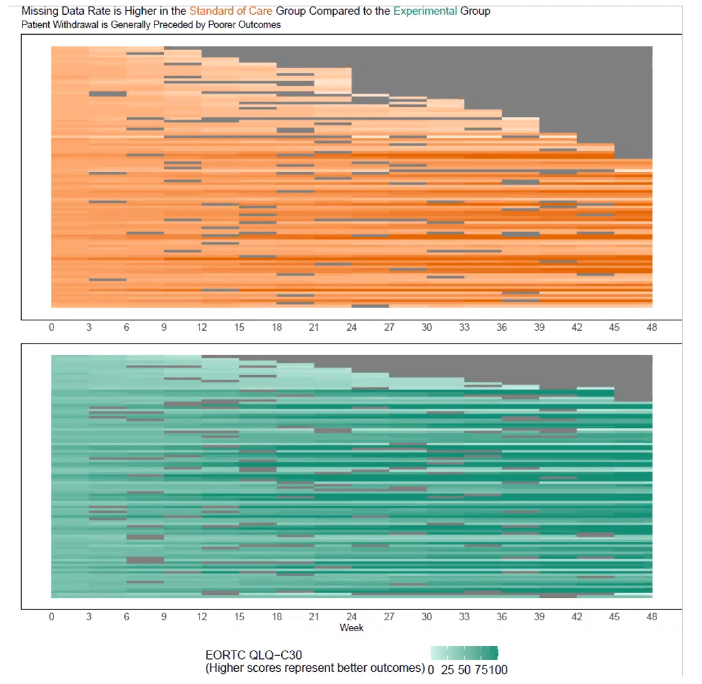

```{r,echo = T,message = FALSE, error = FALSE, warning = FALSE} 
# library(dplyr)
# library(tidyr)
# library(ggplot2)
# library(forcats)
# library(scales)
# library(ggalluvial)
# library(RColorBrewer)

df <- read.csv2("./01_Datasets/ww eortc qlq-c30 missing.csv", sep=",")  %>%
  as_tibble() 
# df
df_1 <- df %>%
  pivot_longer(cols=starts_with("WEEK"), names_to = "AVISIT", values_to = "AVAL") %>%
  select(USUBJID, ARM, LASTVIS, AGE:AVAL) %>%
  mutate(AVAL=as.factor(if_else(AVAL=="", "Missing", AVAL)))
# df_1  
levels(df_1$AVAL) <- c(as.character(rev(round(seq(0, 100, 8.333333333), 1))), "Missing")

cc <- scales::div_gradient_pal(low = "#a50026", mid="#ffffbf", high = "#313695", "Lab")(seq(0,1,length.out=13))

colors <- c(cc, "#D3D3D3")
show_col(colors)

ggplot(df_1,
       aes(
         x = AVISIT,
         stratum = AVAL,
         alluvium = USUBJID,
         fill = AVAL,
         label = AVAL
       )) +
  scale_fill_manual(values = colors) +
  scale_x_discrete(labels = paste("Wk", seq(0, 48, 3))) +

  geom_flow(stat = "alluvium", 
            lode.guidance = "frontback",
            color = "darkgray") +
  geom_stratum() +
  labs(title = "Quality of Life - Missing data depends on age and treatment received") +
  facet_wrap(AGEGR~ARM, nrow = 4, scales = "free_y", strip.position = c("left")) +
  # facet_grid(cols = vars(ARM), rows = vars(AGEGR), scales = "free") +
  theme_bw() +
  guides(fill = guide_legend(nrow = 1, reverse = T)) +
  theme(
    #panel.background = element_blank(),
    #axis.text.y = element_blank(),
    legend.title = element_blank(),
    axis.title.x = element_blank(),
    legend.position = "bottom",
    strip.text = element_text(size = 12),
    axis.text = element_text(angle = 90),
    legend.direction = "horizontal"
  ) 

# ggsave(filename = "sankey_chart.png", device = "png", width = 16, height = 9)
```


## Individual Patient Trajectories

EORTC QLQ-C30 is quality of life (QoL) questionnaire designed for use in cancer patients Each item is rated on a 4-point response scale ranging from 1 (“Not at all”) to 4 (“Very much”) or a 7-point scale ranging from 1 (“Very poor”) to 7 (“Excellent”).

Higher scores represent better outcomes for the global health scale (QL) and the functional scales (PF, RF, EF, CF, SF), whereas higher scores represent higher severe symptoms for the symptom scales/items (FA, NV, PA, DY, SL, AP, CO, DI, FI). The overall QLQ-C30 score is calculated using scoring rules to a range of 0-100.

This figure of change from baseline in QLQ-C30 over time is showing patient-level data as individual lines. Although this is technically a spaghetti plot, a lot of over-plotting occurs due to the discrete nature of the score values. Where this occurs, the opacity of the lines depends on the number of lines that are superimposed, so the figure gives an good general impression of the overall trend. In the left panel (control group), there seem to be more darker lines in the lower half of the plot, showing a worsening of QoL, while the opposite is true in the right panel (experimental group). The figure also includes a superimposed line plot of mean over time (+/- standard error), which shows a similar trend of improvement in global health status in the experimental group and a worsening in the control group.

The use of faint grey gridlines is quite effective. The possibility of using a greyscale for the patient-level data was discussed, because the colour isn’t coding any information and this would make the line plot of mean over time stand out, but it was agreed this would make the patient-level data difficult to distinguish against the gridlines. Some design improvements were suggested, making some of the labels a little larger, and there is also some scope for decluttering the graph, e.g. removing the Y-axis label from the right panel.

```{r,echo = T,message = FALSE, error = FALSE, warning = FALSE}
# library(tidyverse)
# library(lubridate)
# library(dplyr)
# library(ggplot2)
# library(readxl)
# library(cowplot)
# library(gridExtra)
# library(patchwork)
# library(reshape2)
# library(grid)

# ww eortc qlq-c30.csv
# X <- read.csv(url("https://raw.githubusercontent.com/VIS-SIG/Wonderful-Wednesdays/master/data/2022/2022-09-14/ww%20eortc%20qlq-c30.csv"))
X <- read.csv("./01_Datasets/ww eortc qlq-c30.csv")

X[X==0] <- NA;
X1 <- X[1:(nrow(X)/2), ]; # standard
Xe <- X[(nrow(X)/2+1):nrow(X),]; # experimental

X1 <-  X1 %>%
  group_by(USUBJID) %>%
  mutate(QL_diff = QL - QL[1], PF_diff = PF - PF[1], RF_diff = RF - RF[1], EF_diff = EF - EF[1])
X1_a <- X1 #save for second plot

Xe <-  Xe %>%
  group_by(USUBJID) %>%
  mutate(QL_diff = QL - QL[1], PF_diff = PF - PF[1], RF_diff = RF - RF[1], EF_diff = EF - EF[1])
Xe_a <- Xe #save for second plot

#need to replace NA's with 0's again when finding the mean
X1$QL_diff[is.na(X1$QL_diff)] <- 0 #We will only use QL in the plot below, but can use any sub-scale.
X1$PF_diff[is.na(X1$PF_diff)] <- 0
X1$RF_diff[is.na(X1$RF_diff)] <- 0
X1$EF_diff[is.na(X1$EF_diff)] <- 0
Xe$QL_diff[is.na(Xe$QL_diff)] <- 0
Xe$PF_diff[is.na(Xe$PF_diff)] <- 0
Xe$RF_diff[is.na(Xe$RF_diff)] <- 0
Xe$EF_diff[is.na(Xe$EF_diff)] <- 0

A <- aggregate(X1[, 20:23], list(X1$AVISITN), mean)
colnames(A) <- c("AVISITN", "QL_mean", "PF_mean", "RF_mean", "EF_mean")
B <- aggregate(X1[, 20:23], list(X1$AVISITN), sd)
B <- B[, 2:ncol(B)]/sqrt(100)
colnames(B) <- c("QL_se", "PF_se", "RF_se", "EF_se")
A <- data.frame(A, B)

Ae <- aggregate(Xe[, 20:23], list(Xe$AVISITN), mean)
colnames(Ae) <- c("AVISITN", "QL_mean", "PF_mean", "RF_mean", "EF_mean")
Be <- aggregate(Xe[, 20:23], list(Xe$AVISITN), sd)
Be <- Be[, 2:ncol(Be)]/sqrt(100)
colnames(Be) <- c("QL_se", "PF_se", "RF_se", "EF_se")
Ae <- data.frame(Ae, Be)

# library(plyr) #call this library here, not before.

A = A[c(1,2,3,4,5,6,7,8,10,11,12,13,14,15,16,17,9),] 
A[nrow(A)+nrow(X1)-nrow(A),] <- NA;
A1 <- cbind(X1_a, A);

Ae = Ae[c(1,2,3,4,5,6,7,8,10,11,12,13,14,15,16,17,9),] 
Ae[nrow(Ae)+nrow(Xe)-nrow(Ae),] <- NA;
A1e <- cbind(Xe_a, Ae);

X1count <- X1[complete.cases(X1$QL),] #To count dropout rate/N (number) per visit
Xecount <- Xe[complete.cases(Xe$QL),]
X1count <- count(X1count, "AVISITN")
Xecount <- count(Xecount, "AVISITN")

#Standard treatment plot
GG1<-ggplot(data=A1, aes(x=AVISITN...19, y=QL_diff, group=USUBJID, color="red")) +
  geom_line(size=1, alpha=0.15, color="tomato")+guides(color = "none")+
  xlab("Visit Number")+ylab("Change from Baseline")+
  scale_x_continuous(breaks=0:17)+
  scale_y_continuous(breaks=seq(-55, 55, by=10))+
  geom_hline(yintercept=c(-6,0,6), linetype='dotted', col = 'black')+
  geom_line(aes(x=AVISITN...24, y = QL_mean, colour = "Standard"),size=1) + 
  geom_point(aes(x=AVISITN...24, y = QL_mean, colour = "Standard"),size=2)+
  geom_errorbar(aes(ymin=QL_mean-QL_se, ymax=QL_mean+QL_se, colour = "Standard"),width=25, position=position_dodge(0))+
  scale_colour_manual(values="violet")+
  annotate(geom = "text", x = 1:17, y = -68, label = X1count$freq, size = 3)+
  coord_cartesian(ylim = c(-55, 55), expand = FALSE, clip = "off")+theme_bw()

GG1 <- GG1+theme(axis.text=element_text(size=8), axis.title=element_text(size=10),panel.grid.minor.x = element_blank(),panel.grid.minor.y = element_blank())

#Experimental treatment plot
GG2<-ggplot(data=A1e, aes(x=AVISITN...19, y=QL_diff, group=USUBJID, color="red")) +
  geom_line(size=1, alpha=0.15, color="dodgerblue")+guides(color = "none")+
  xlab("Visit Number")+ylab("")+
  scale_x_continuous(breaks=0:17)+
  scale_y_continuous(breaks=seq(-55, 55, by=10))+
  geom_hline(yintercept=c(-6,0,6), linetype='dotted', col = 'black')+
  geom_line(aes(x=AVISITN...24, y = QL_mean, colour = "Experimental"),size=1) + 
  geom_point(aes(x=AVISITN...24, y = QL_mean, colour = "Experimental"),size=2)+
  geom_errorbar(aes(ymin=QL_mean-QL_se, ymax=QL_mean+QL_se, colour = "Experimental"),width=25, position=position_dodge(0))+
  scale_colour_manual(values="aquamarine4")+
  annotate(geom = "text", x = 1:17, y = -68, label = Xecount$freq, size = 3)+
  coord_cartesian(ylim = c(-55, 55), expand = FALSE, clip = "off")+theme_bw()

GG2 <- GG2+theme(axis.text=element_text(size=8), axis.title=element_text(size=10),panel.grid.minor.x = element_blank(),panel.grid.minor.y = element_blank())

#Combining two plots
p1 <- plot_grid(GG1, GG2, labels=c("Standard", "Experimental"),hjust = -1.0, vjust = 0.5,label_size = 8)
title <- ggdraw() + draw_label("This looks nothing like real QLQ-C30 Global Heath Status data, real individual patient data has much more variability", size=15)
subtitle <- ggdraw() + draw_label("Higher Values & Positive Change from Baseline values for QLQ-C30 Global Heath Status indicate better Quality of Life", size=10)
footnote <- ggdraw() + draw_label("Individual patient data with arithmetic mean (+/- SE) overlaid. \n Horizontal Reference lines indicate the Minimal Important Change (MIC), at the group level, of -6 and 6 based on the 2012 Cocks publication.\n Line opacity is proportional to the number of patients, with more transparent lines indicating less patients. Total number of patients remaining per visit is given below the x-axis.", fontface='italic', size=10)

#plot results
plot_grid(title, subtitle, p1, footnote, ncol=1, rel_heights=c(0.1, 0.1, 1, 0.4, -0.1))
```


## Top four domains Trajectories Dashboard

[App](https://agstn.github.io/qlq-c30/qlq-c30_flexdashboard.html)

First tab: This tab focuses on only the top four domains, in terms of treatment effect. The left panel is showing patient-level data, similarly to the first entry, although data have been jittered to avoid over-plotting. The middle panel shows point estimates, credible intervals and posterior distributions for each treatment and timepoint from from a Bayesian MMRM model. Posterior distributions for the treatment differences are shown in the right panel, with cutpoints added to the density plots to indicate clinically-meaningful threshold values.The graph includes a lot of information but is highly effective in showing trends in the data.

Second tab: this shows the treatment differences for all domains, including point estimates, credible intervals and Bayesian posterior distributions. The domains are sorted in terms of treatment effect, so it is very clear which domains are driving the overall treatment effect. Shading has been used to represent different parts of the posterior distribution curve with respect to the threshold values.

Further tabs give the user a more focused view of what we saw in the first tab, i.e. patient-level data, results of the MMRM and treatment differences, for a single domain, e.g. quality of life, functional scales, symptoms and financial difficulties.

The consistent colour-coding across all panels is helpful, and the colours are similar with respect to their intensity. For the second tab, representing time on the vertical axis is unsual and possibly counter intuitive, but an alternative design may have difficult to implement. Also in the second tab, annotations hadn’t been added to show which direction represents a benefit for each of the scales (which was present on the first tab and was very helpful). But overall this package of graphs provides a rich source of information and clearly shows the important features of the data.


# Responder Rate

In a Phase III study involving patients suffering from hidradenitis suppurativa, an active drug was compared to a placebo. Each group consisted of 200 subjects, and the primary endpoint was the HiSCR, which is a binary endpoint. This endpoint is based on three continuous components:

1. Number of abscesses
2. Number of draining fistulae
3. Number of inflammatory nodules

A patient achieves a HiSCR response if all of the following three conditions are met when comparing baseline data to follow-up data (at week 16):

1. At least a 50% decrease in the AN count; AN count is defined as the sum of the number of abscesses and the number of inflammatory nodules.
2. No increase in the number of abscesses.
3. No increase in the number of draining fistulae.

The aim of the study was to compare the two treatment arms in regard to the HiSCR response.

The challenge lies in visualizing the impact of changing the definition of the HiSCR response on the results. For example, altering the first condition to assume that a decrease of 25% or 75% is needed to achieve a HiSCR response could be considered. The second and third conditions could be changed separately, or a mix of changes to two or all conditions can be applied. How does this impact the results?


## Waffle plot, bar chart, line plot  

Slide can be found [here](https://vis-sig.github.io/blog/posts/2022-06-06-wonderful-wednesdays-may-2022/images/slide_2.pdf)


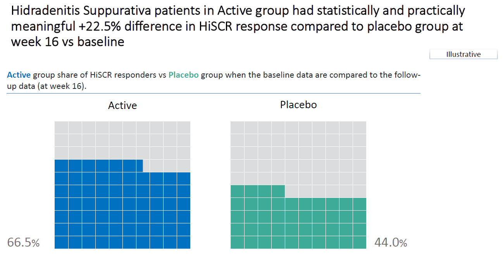
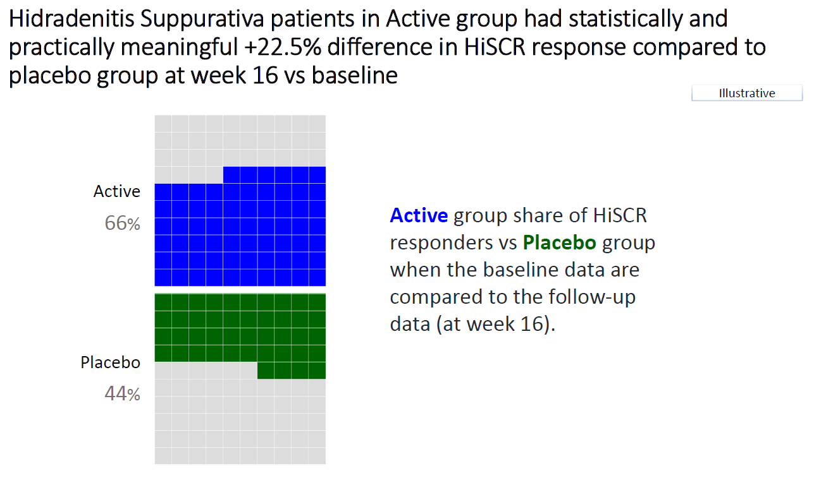
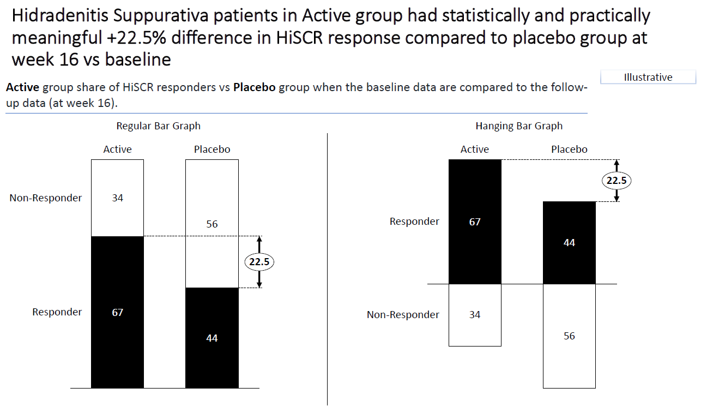
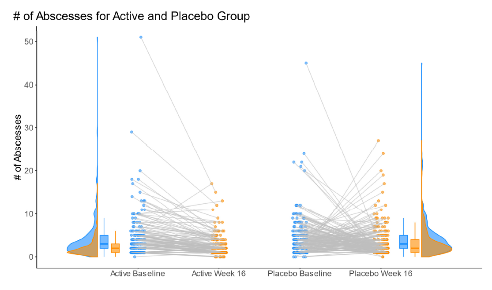


## Line plots based on reduction in AN count

This visualization shows nicely that the difference between the groups is rather small, if the percentage change to be reached is large (focusing on the first part of the HiSCR responder definition). This is done by presenting a line plot for both groups using two different colors. There are three graphs. Each one of them keeps the second and/or the third part of the definition of a HiSCR responder fixed. Overall, it is a very clean visualization which very nicely tackles the challenge of showing the impact of chaning the definition of HiSCR response. 

```{r,echo = T,message = FALSE, error = FALSE, warning = FALSE}
# library(tidyverse)
# library(ggtext)

df <- read.csv("./01_Datasets/HiSCR_dat.csv")

# Create required variables for graph
df_new <- df %>%
          mutate(
            
            # If abscesses increase
            abscesses.incr = if_else(
              condition = abscesses.w16 > abscesses.base,
              true = "Yes",
              false = "No",
              missing = NA_character_
            ),
            
            # If draining fistulae increase
            drain.fist.incr = if_else(
              condition = drain.fist.w16 > drain.fist.base,
              true = "Yes",
              false = "No",
              missing = NA_character_
            ),
            
            # If abscesses and draining fistulae increase
            drain.fist.abscesses.incr = if_else(
              condition = abscesses.incr == "No" & drain.fist.incr == "No",
              true = "No",
              false = "Yes",
              missing = NA_character_
            ),
            
            an.count.base = abscesses.base + infl.nod.base,
            an.count.w16 = abscesses.w16 + infl.nod.w16,
            
            # Percentage change in AN count
            an.count.change = (an.count.w16 - an.count.base)/an.count.base*100
          ) %>%
  
         select(c(TRT, abscesses.incr, drain.fist.incr,
                  drain.fist.abscesses.incr, an.count.change))

active.df <- filter(df_new, TRT == "ACT")
placebo.df <- filter(df_new, TRT == "PBO")

results <- data.frame()

# Find the percentage assigned a positive HiSCR for each value of i
# where i is the minimum required percentage reduction.
for (i in 0:100){
  active.abscesses <- sum(active.df$an.count.change <= -i & active.df$abscesses.incr == "No")/nrow(active.df)*100
  active.drain.fist <- sum(active.df$an.count.change <= -i & active.df$drain.fist.incr == "No")/nrow(active.df)*100
  active.both <- sum(active.df$an.count.change <= -i & active.df$drain.fist.abscesses.incr == "No")/nrow(active.df)*100
  
  placebo.abscesses <- sum(placebo.df$an.count.change <= -i & placebo.df$abscesses.incr == "No")/nrow(placebo.df)*100
  placebo.drain.fist <- sum(placebo.df$an.count.change <= -i & placebo.df$drain.fist.incr == "No")/nrow(placebo.df)*100
  placebo.both <- sum(placebo.df$an.count.change <= -i & placebo.df$drain.fist.abscesses.incr == "No")/nrow(placebo.df)*100
  
  # Store results
  results <- rbind(results,
                   data.frame(percent = i,
                               active.abscesses,
                               active.drain.fist,
                               active.both,
                               placebo.abscesses,
                               placebo.drain.fist,
                               placebo.both))
}

# Create a row for each percentage reduction, treatment arm, and condition
# to get the data into the right form for the graph
graph_df <- results %>%
            pivot_longer(cols = -"percent") %>%
  
            mutate(
              # Extract treatment arm
              TRT = if_else(
                condition = str_detect(name, pattern = "active"),
                true = "Active",
                false = "Placebo",
                missing = NA_character_),
              
              # Extract condition (<br> is used to cause line break in subplot title)
              condition = case_when(
                str_detect(name, pattern = "abscesses") ~ "No Increase in Abscesses",
                str_detect(name, pattern = "fist") ~ "No Increase in Draining Fistulae",
                TRUE ~ "No Increase in <br>Abscesses & Draining Fistulae"
              )) %>%
  
            select(-name)

# Order conditions for the graph
graph_df$condition <- factor(graph_df$condition,
                             levels = c("No Increase in Abscesses",
                                        "No Increase in Draining Fistulae",
                                        "No Increase in <br>Abscesses & Draining Fistulae"))

# Annotation dataframe for the Placebo and Active labels
arm.ann <- data.frame(x = c(5, 3),
                      y = c(90, 35),
                      TRT = c("Active", "Placebo"),
                      condition = rep("No Increase in Abscesses", 2))

# Order condition variable to ensure labels appear in correct subplot.
arm.ann$condition <- factor(arm.ann$condition,
                             levels = c("No Increase in Abscesses",
                                        "No Increase in Draining Fistulae",
                                        "No Increase in <br>Abscesses & Draining Fistulae"))

axis.color <- "gray40"

# Create graph
ggplot(data = graph_df,
       aes(x = percent,
           y = value,
           group = TRT)) +

  # Add lines
  geom_line(aes(color = TRT)) +
  
  # Subplot by condition
  facet_wrap(~condition) +
  
  # Restrict plotting area
  coord_cartesian(expand = F) +
  
  # Add % labels to the axes ticks
  scale_x_continuous(labels = scales::percent_format(scale = 1)) +
  
  scale_y_continuous(limits = c(0, 100),
                     labels = scales::percent_format(scale = 1)) +
  
  # Add Active and Placebo labels
  geom_text(data = arm.ann,
            aes(x = x,
                y = y,
                group = condition,
                label = TRT,
                color = TRT),
            hjust = 0,
            size = 2.75) +

  # Define theme
  theme(panel.background    = element_rect(fill = "white"),
        axis.line           = element_line(color = axis.color),
        panel.grid.major    = element_line(color = "gray95"),
        axis.ticks          = element_line(color = axis.color),
        axis.text           = element_text(color = axis.color),
        axis.title          = element_text(color = axis.color,
                                           size = 8),
        axis.title.x        = element_text(hjust = 0,
                                           margin = margin(t = 15)),
        legend.position     = 'none',
        plot.margin         = margin(20, 20, 20, 20),
        strip.text          = element_markdown(size = 8),
        panel.spacing       = unit(0.4, 'in'),
        plot.title.position = 'plot',
        plot.subtitle       = element_markdown(color = "gray30",
                                               size = 9,
                                               margin = margin(b = 10)),
        plot.title          = element_markdown(size = 11),
        plot.caption        = element_markdown(size = 7,
                                               color = axis.color,
                                               margin = margin(t = 15))) +
  
  # Define plot labels
  labs(x = "Minimum Required Percentage Reduction in AN Count*",
       y = NULL,
       subtitle = " % of Patients assigned a Positive HiSCR Response (N<sub>P</sub> = N<sub>A</sub> = 200)",
       title = "____ <br> <br> How Changing the HiSCR Definition Changes the Results",
       caption = "*AN Count = Sum of the Number of Abscesses and Inflammatory Nodes <br> Author: Huw Wilson")
```


## Shiny Apps

The app can be found [here](https://bonorico.shinyapps.io/HiSCR/?_ga=2.91645274.1120831357.1651571388-1024467400.1644592220).

This visualization shows on the y-axis the inverse of the risk ratio and on the x-axis the threshold for the percentage decrease in AN count. It is actually an animation showing the impact of changing the threshold for the change of abscesses from baseline. This is a very useful graph to visualize what happens if you change different aspects of the definition. 


This is a very simple app which allows you to change the definition of the HiSCR definition (on the left-hand side) to see what happens in the results (on the right-hand side). See [*Shiny\Data Visualization\Responder Bar*]


This is a very advanced app which shows a volcano plot in the main panel and it shows what happends in the results when you change the definition on the left-hand side. On the right-hand side, you see a table with additional results based on different HiSCR definitions. The panel thinks that it is a not necessarily straightforward to see what is being shown here. However, it is still a very insightful and useful app to understand the impact of changing the definition of HiSCR.

The app can be found [here](https://vis-sig.github.io/blog/posts/2022-06-06-wonderful-wednesdays-may-2022/images/HiSCR_fig%20-%20Agustin%20Calatroni.html).

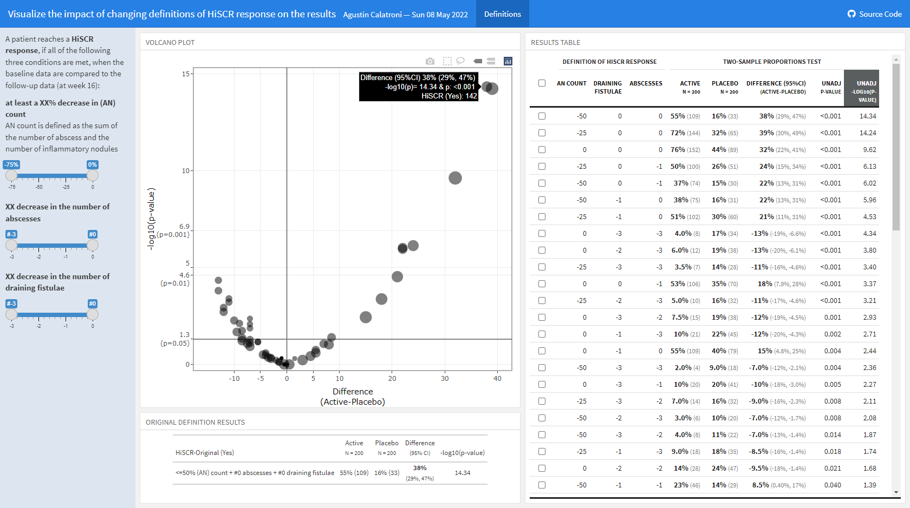


# Clinical Improvement 

The data reflects a phase III study - active vs placebo and the endpoint was Ordinal Scale for Improvement (OSCI). All patients started at OSCI=4 and daily measures over 35 days were performed. The challenge was to describe the treatment effect specifically taking into account the number and timing of patients who died, left the hospital or fully recovered.

The shiny app can be found [here](https://bonorico.shinyapps.io/oscicovid)

```{r,echo = T,message = FALSE, error = FALSE, warning = FALSE}
# packages
pacman::p_load(rio, tidyverse) 
pacman::p_load(RColorBrewer, ggtext)
pacman::p_load(patchwork)

# individual plots
source('./03_Functions/covid_tile_order.r')
source('./03_Functions/covid_histogram.r')
source('./03_Functions/covid_mean.r')
source('./03_Functions/covid_modal.r')

# layout
design <- "11114
           11114
           11114
           2222#
           2222#
           3333#"

# combine
(f_t + theme(plot.margin = unit(c(0, 0, 0, 0), "lines") ) ) +
   
   (f_h + theme(strip.background = element_blank(), 
                strip.text = element_blank(),
                axis.title.x=element_blank(),
                plot.margin = unit(c(0, 0, 0, 0), "lines") ) ) +
   
   # (f_mo + theme(strip.background = element_blank(), 
   #               strip.text = element_blank(),
   #               plot.margin = unit(c(0, 0, 0, 0), "lines") ) ) +
   (f_me) +
   
   
   plot_layout(design = design) +
   plot_annotation(
      title    = 'COVID-19 study comparing **Active vs Placebo** on Ordinal Scale for Clinical Improvement (OSCI) daily measures (35 days)',
      subtitle =
      '**A. Full Index Plot** representing all individual OSCI sequences sorted accordingly to the finished order. 
      **B. Frequency Plot** representing OSCI sequences distributions 
      **C. Sequences of modals** summary derived from the OSCI sequences distributions 
      **D. Mean time spent in each OSCI** summary of the mean number of times each OSCI is observed in a sequence. 
      This characterizes the overall OSCI distribution',
      #caption  = '**Data from Wonderful-Wednesdays** <span style="font-size:8pt">github.com/VIS-SIG[2022−03−09]</span>',
      theme = theme(plot.title.position = "plot",
                    plot.title = element_textbox_simple(
                       size = 16,
                       lineheight = 1,
                       r = unit(5, "pt"),
                       padding = margin(10, 10, 7, 10),
                       margin = margin(2, 6, 2, 6),
                       fill = "gray85"
                    ),
                    #plot.subtitle.position = "plot",
                    plot.subtitle = element_textbox_simple(
                       size = 14,
                       lineheight = 1,
                       r = unit(5, "pt"),
                       padding = margin(5, 5, 5, 5),
                       margin = margin(2, 6, 2, 6),
                       fill = "gray95"
                    ),
                    plot.caption  = element_markdown()) )

#save
# ggsave('./covid_combined.pdf', width = 13, height = 10)
# ggsave('./covid_combined.png', width = 13, height = 10, dpi = 600)

```

# Lollipop/forest plot

```{r,echo = T,message = FALSE, error = FALSE, warning = FALSE}
# dat <- read.csv("./01_Datasets/CGI_S_3_groups_csv.csv")

# library(RCurl)
# library(dplyr)
# library(tidyr)
# library(ggplot2)
# library(ggrepel)
# library(cowplot)
# library(ggtext)

y <- read.csv("./01_Datasets/CGI_S_3_groups_csv.csv") %>%
   rename(Group = CGI)

l <- y %>%
  pivot_longer(cols = X1:X7,
               names_to = "Category",
               values_to = "n") %>%
  mutate(Category = as.numeric(gsub("X", "", Category))) %>%
  group_by(Week, Group) %>%
  arrange(Category) %>%
  mutate(
    CumN = cumsum(n),
    Week = paste("Week", Week),
    CumFreq = CumN / Total.sample.size,
    Freq = n / Total.sample.size,
    `Cumulative %` = round(CumFreq * 100, 1),
    `%` = round(Freq * 100, 1)
  ) %>%
  ungroup() %>%
  group_by(Week, Category) %>%
  arrange(Group, .by_group = T) %>%
  mutate(
    Odds = CumFreq / (1 - CumFreq),
    OR = ifelse(Group == "Active", round(Odds / Odds[2], 2), NA),
    selogOR = ifelse(Group == "Active", sqrt(
      1 / CumN + 1 / (Total.sample.size - CumN) + 1 / CumN[2] + 1 / (Total.sample.size[2] -
                                                                       CumN[2])
    ), NA),
    ORlower95CI = ifelse(Group == "Active", round(exp(log(OR) - 1.96 * selogOR), 2), NA),
    ORupper95CI = ifelse(Group == "Active", round(exp(log(OR) + 1.96 * selogOR), 2), NA)
  )
l

k = 3
labs <- c("Normal, not at all ill -   1",
          "Normal to borderline ill - <=2",
          "Normal to mildly ill - <=3")

p1 <-
  ggplot(data = l[l$Category <= k,], aes(x = `Cumulative %`, y = Category, col =
                                           Group)) +
  geom_point(size = 5) +
  facet_grid(rows = vars(Week)) +
  labs(title = "Cumulative percentage of response", y = "", x = "") +
  scale_y_continuous(breaks = 1:k, labels = labs) +
  scale_x_continuous(limits = c(0, 100)) +
  theme_bw() +
  theme(legend.position = "none",
        strip.text = element_blank()) +
  geom_text_repel(aes(label = paste(sprintf(
    "%.1f", `Cumulative %`
  ), "%")),
  nudge_y = 0.1)
p1

legend_b <- get_legend(p1 +
                         guides(color = guide_legend(nrow = 1)) +
                         theme(legend.position = "bottom",
                               legend.title = element_blank(),
                               legend.text = element_text(size = 12)))
p2 <-
  ggplot(data = l[l$Category <= k &
                    !is.na(l$OR),], aes(x = OR, y = Category)) +
  geom_point(size = 3, pch = 15) +
  geom_linerange(aes(xmin = ORlower95CI, xmax = ORupper95CI)) +
  geom_vline(xintercept = 1, linetype = 3) +
  facet_grid(rows = vars(Week)) +
  scale_y_continuous(breaks = 1:k, labels = labs) +
  scale_x_continuous(limits = c(0, 6)) +
  theme_bw() +
  theme(legend.position = "none",
        axis.text.y = element_blank()) +
  labs(x = "", y="", title = "OR (Active vs. Comparator)") +
  geom_text_repel(aes(label = sprintf("%.2f", OR)),
                  nudge_y = 0.1) +
  theme(strip.text = element_text(size=12))
p2

plot_row <- plot_grid(p1, p2, nrow = 1, rel_widths = c(2, 1))

title <- ggdraw() +
  draw_label(
    "Active treatment is more effective than comparator at Week 52",
    fontface = 'bold',
    x = 0,
    hjust = 0,
    size = 24,
  ) +
  theme(plot.margin = margin(0, 0, 0, 7))

p <- plot_grid(title,
               plot_row,
               legend_b,
               ncol = 1,
               rel_heights = c(0.1, 1, 0.05))
p
```

# Dumbbell Plot


```{r,echo = T,message = FALSE, error = FALSE, warning = FALSE}
data <- read.csv("./01_Datasets/MAI.csv")
```


# Scatter Plot


```{r,echo = T,message = FALSE, error = FALSE, warning = FALSE}
data <- read.csv("./01_Datasets/MAI.csv")

# Scatter plot with regression lines and confidence intervals
ggplot(data, aes(x = base.mai, y = mai, color = gr)) +
  geom_point(size = 2) +  # Add points
  geom_smooth(method = "lm", se = TRUE) +  # Add linear regression lines with confidence intervals
  geom_abline(intercept = 0, slope = 1, linetype = "dashed", color = "black") +  # Reference line
  labs(title = "Scatter Plot",
       x = "MAI Score at Baseline",
       y = "MAI Score After 1 Year",
       color = "Group") +
  theme_minimal() +
  theme(legend.position = "top")
```


# Regression model-Prediction of health status (EQ-5D)

The data is based on a study to assess the health status in patients with coronary heart diseases (see Ose et al., 2012). The research question was: what factors are associated with health status in usual primary care?

The original data included 2,656 patients with 14 (patient and practice) characteristics (with clustered data structure). The outcome was EQ-5D VAS scale (Health related quality of life; range: [0; 1]). The data set for this challenge is a sub-sample of patients and variables and it is simulated data.


# Reference
 
SIG (2023, Sept. 13). VIS-SIG Blog: Wonderful Wednesdays September 2023. Retrieved from https://graphicsprinciples.github.io/posts/2023-12-17-wonderful-wednesdays-september-2023/

SIG (2023, June 11). VIS-SIG Blog: Visualisation SIG Showcase. Retrieved from https://graphicsprinciples.github.io/posts/2023-05-14-visualisation-sig-showcase/

SIG (2023, May 10). VIS-SIG Blog: Wonderful Wednesdays May 2023. Retrieved from https://graphicsprinciples.github.io/posts/2023-05-29-wonderful-wednesdays-may-2023/

SIG (2022, Nov. 9). VIS-SIG Blog: Wonderful Wednesdays November 2022. Retrieved from https://graphicsprinciples.github.io/posts/2023-04-09-wonderful-wednesdays-november-2022/

Mallett (2022, Oct. 12). VIS-SIG Blog: Wonderful Wednesdays October 2022. Retrieved from https://graphicsprinciples.github.io/posts/2023-04-09-wonderful-wednesdays-october-2022/

Uhlmann (2022, May 11). VIS-SIG Blog: Wonderful Wednesdays May 2022. Retrieved from https://graphicsprinciples.github.io/posts/2022-06-06-wonderful-wednesdays-may-2022/

SIG (2022, April 13). VIS-SIG Blog: Wonderful Wednesdays April 2022. Retrieved from https://graphicsprinciples.github.io/posts/2022-04-30-wonderful-wednesdays-april-2022/

Mallett (2021, Nov. 10). VIS-SIG Blog: Wonderful Wednesdays November 2021. Retrieved from https://graphicsprinciples.github.io/posts/2021-12-05-wonderful-wednesdays-november-2021/