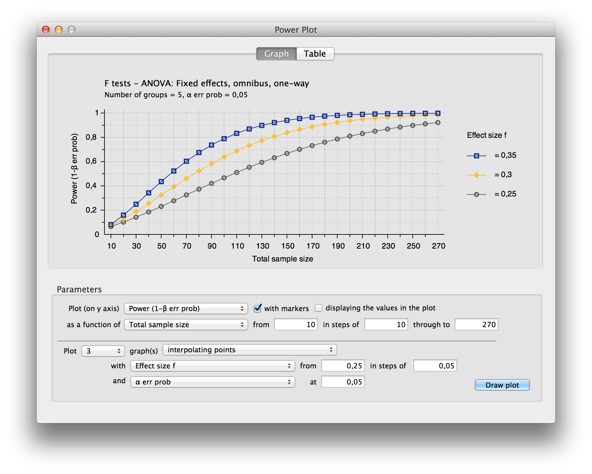
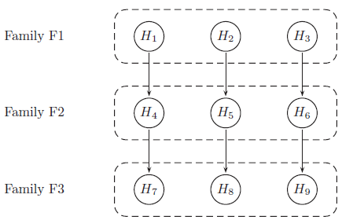
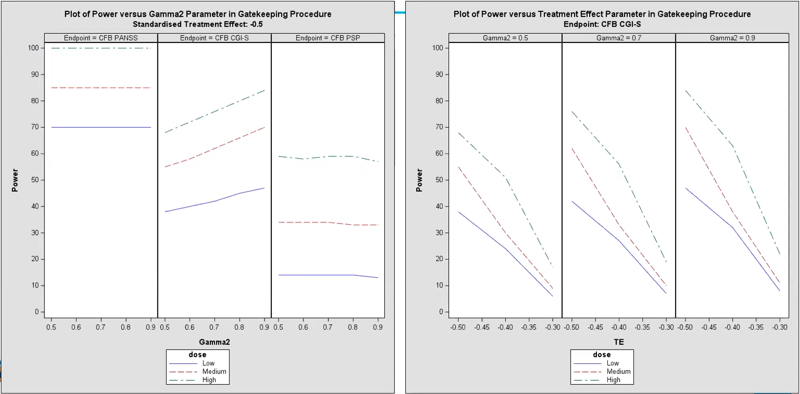

```{r setup, include=FALSE, echo = FALSE,message = FALSE, error = FALSE, warning = FALSE}
knitr::opts_chunk$set(echo = TRUE, fig.width = 10, fig.height = 6)

# <!-- ---------------------------------------------------------------------- -->
# <!--                    1. load the required packages                       -->
# <!-- ---------------------------------------------------------------------- --> 

## if(!require(psych)){install.packages("psych")}

packages<-c("tidyverse","kableExtra")

ipak <- function(pkg){
  new.pkg <- pkg[!(pkg %in% installed.packages()[, "Package"])]
  if (length(new.pkg)) 
    install.packages(new.pkg, dependencies = TRUE)
  sapply(pkg, require, character.only = TRUE)
}
ipak(packages)
 
# <!-- ---------------------------------------------------------------------- -->
# <!--                        2. Basic system settings                        -->
# <!-- ---------------------------------------------------------------------- -->
setwd(dirname(rstudioapi::getSourceEditorContext()$path))
getwd()
Sys.setlocale("LC_ALL","English")
```


# Introduction

As statisticians, we often have to deal with power or sample size calculations. It can be very beneficial to visualise the impact that different factors have on the sample size or power. Produce data visualisation(s) or share tools that help your audience understand how power and sample size calculations work and what impacts the actual results of these calculations.

Power and sample size calculations are fundamental components in the design of any clinical trial or scientific study. These calculations ensure that a study has a sufficient number of participants (sample size) to detect a statistically significant effect if one exists, while controlling for the risk of Type I (false positive) and Type II (false negative) errors. Visualizing these calculations can enhance understanding and decision-making in study planning by demonstrating the relationships between power, sample size, effect size, and significance level.

## Key Components of Power and Sample Size Visualizations

1. **Power Curves**:
   - A power curve is a plot of statistical power against sample size, often for a range of effect sizes or significance levels.
   - Power curves help researchers visualize how power increases as sample size grows, holding effect size constant. These plots are valuable for understanding how much data is needed to achieve a desired power level, such as 80% or 90%.
   - A typical power curve demonstrates the diminishing returns in power gained by increasing sample size beyond a certain point.

2. **Effect Size vs. Power**:
   - Effect size represents the magnitude of the difference or association being tested. The larger the effect size, the easier it is to detect with a smaller sample.
   - Visualizations plotting effect size against power can show how detectable a given effect is at different sample sizes, helping researchers assess whether their study design is practical for detecting meaningful differences.

3. **Power vs. Significance Level (Alpha)**:
   - This type of plot illustrates how changes in the significance level (alpha) affect statistical power, usually for a fixed sample size and effect size.
   - Lowering alpha (e.g., from 0.05 to 0.01) increases the burden of proof, which can reduce power unless the sample size is adjusted. This visualization can highlight the trade-off between Type I error control and the power to detect true effects.

4. **Sample Size Needed for Various Power Levels**:
   - Visualizations can be used to estimate the sample size needed to achieve different power levels (e.g., 80%, 90%) for various effect sizes and significance levels.
   - This type of visualization often appears as a line or bar chart showing required sample sizes to achieve specific power levels, given certain assumptions about effect size and alpha.

5. **Interactive Visualization Tools**:
   - Interactive tools allow researchers to dynamically adjust parameters like effect size, sample size, and alpha level to see how these changes impact power. These tools are highly beneficial in the planning phase, where researchers can experiment with different configurations.
   
# Shiny App

## Power and Sample Size Tool

[Power and Sample Size Tool](https://steve-mallett.shinyapps.io/WWApr24Power/)


## pwrss shiny app

[pwrss shiny app](https://pwrss.shinyapps.io/index/)


# R Implementation

## pwr built-in visualization

```{r,echo = T,message = FALSE, error = FALSE, warning = FALSE}
library(pwr)

power1 <-pwr.2p.test(h = ES.h(p1 = 0.60, p2 = 0.50), sig.level = 0.05, power = .80)
plot(power1)
```


## Trellised Power Curves::pwr

```{r,echo = T,message = FALSE, error = FALSE, warning = FALSE}
fn_pwr <- function(n, d) {
  power <- pwr.t.test(n = n,
                      d = d,
                      sig.level = 0.05,
                      alternative = "two.sided",
                      type = "two.sample")$power
  return(power * 100)
}

ssize = c(2:12)
msd <- tibble(effect = rep(c(6, 8, 10), each = 3),
              sd_inc = rep(c(1, 1.25, 1.5), 3)) %>%
  mutate(sd = 4 * sd_inc) %>%
  mutate(delta = effect / sd)

pwr_tab <- tibble(effect = factor(rep(msd$effect, each = length(ssize)),
                                  levels = c(6, 8, 10),
                                  labels = c("6%", "8%", "10%")),
                  sd_inc = as.factor(rep(msd$sd_inc, each = length(ssize))),
                  n = rep(ssize, length(msd$delta)),
                  d = rep(msd$delta, each = length(ssize))) %>%
  mutate(power = fn_pwr(n, d)) 

pwr_fig <- ggplot(data = pwr_tab,
                  aes(x = n, y = power, colour = sd_inc)) +
  geom_line() +
  geom_hline(yintercept = 80) +
  geom_line(linewidth = 1) +
  scale_x_continuous(breaks = ssize, name = "Sample size") +
  scale_y_continuous(breaks = seq(0, 100, by = 20)) +
  labs(
    y = "Power (%)",
    title = "Power to detect deltas of 6, 8 and 10% in ejection fraction",
    subtitles = "Two-sided, two-sample t-test, alpha=0.05, sd=4",
    colour = "SD increase"
  ) +
  geom_point(size = 2, shape = 21, fill = "white") +
  theme_bw() +
  theme(
    axis.text = element_text(size = 10),
    axis.title = element_text(size = 12),
    panel.grid.minor = element_blank(),
    legend.position = "bottom") +
  scale_colour_viridis_d() +
  facet_wrap(effect ~ .)

pwr_fig
```


## Trellised Power Curves::pwrss

The `pwrss` R package enables statistical power and minimum required sample size calculations for:

1. Testing a proportion (one-sample) against a constant.
2. Testing a mean (one-sample) against a constant.
3. Testing the difference between two proportions (independent samples).
4. Testing the difference between two means/groups (parametric and non-parametric tests for independent and paired samples).
5. Testing a correlation (one-sample) against a constant.
6. Testing the difference between two correlations (independent samples).
7. Testing a coefficient (with standardized or unstandardized coefficients, with no covariates or covariate adjustment) in multiple linear regression, logistic regression, and Poisson regression.
8. Testing an indirect effect (with standardized or unstandardized coefficients, with no covariates or covariate adjustment) in mediation analysis (Sobel, Joint, and Monte Carlo methods).
9. Testing an \( R^2 \) against zero in linear regression.
10. Testing an \( R^2 \) difference against zero in hierarchical regression.
11. Testing an \( \eta^2 \) or \( f^2 \) (for main and interaction effects) against zero in analysis of variance (ANOVA), which can be one-way, two-way, or three-way.
12. Testing an \( \eta^2 \) or \( f^2 \) (for main and interaction effects) against zero in analysis of covariance (ANCOVA), which can be one-way, two-way, or three-way.
13. Testing an \( \eta^2 \) or \( f^2 \) (for between, within, and interaction effects) against zero in one-way repeated measures analysis of variance (RM-ANOVA), with non-sphericity correction and repeated measures correlation.
14. Testing goodness-of-fit or independence in contingency tables.

The alternative hypothesis can be formulated as “not equal,” “less,” “greater,” “non-inferior,” “superior,” or “equivalent” in (1), (2), (3), and (4); as “not equal,” “less,” or “greater” in (5), (6), (7), and (8); and always as “greater” in (9), (10), (11), (12), (13), and (14). 
 
```{r,echo = F,message = FALSE, error = FALSE, warning = FALSE}
library(pwrss)
library(binom)

n_chronos <- seq(250,350,by=5)

# Create a data frame with n_chronos values and their corresponding confidence intervals
data_listing <- data.frame(n_chronos)

# Calculate and store the confidence intervals using binom.confint
data_listing <- data_listing %>%
  rowwise() %>%
  mutate(
    lower_ci = binom.confint(x = ceiling(0.25 * n_chronos), n = n_chronos, conf.level = 0.95)%>%filter(method == "exact") %>% select(lower),
    upper_ci = binom.confint(x = ceiling(0.25 * n_chronos), n = n_chronos, conf.level = 0.95)%>%filter(method == "exact") %>% select(upper),
    ci_width = upper_ci-lower_ci
  )  

data_listing %>% 
  kable(col.names = c("Sample Size CHRONOS US", "CI Lower Limit", "CI Upper Limit", "CI Width"),
        caption = "95% Clopper-Pearson confidence interval (two-sided) for 25% ORR") %>%
  add_footnote(c("Confidence Interval based on Clopper-Pearson method")) %>%
  kable_styling(latex_options = "striped")
```


```{r,include=F,echo = F,message = FALSE, error = FALSE, warning = FALSE}
# Define a function to calculate power for given n2 values
calculate_power <- function(n2) {
  power <- sapply(seq(100, 200, by = 5), function(n1) {
    pwrss.z.2props(p1 = 0.25, p2 = 0.45, 
                   kappa = n1 / n2, n2 = n2, alpha = 0.05, 
                   alternative = "not equal", arcsin.trans = FALSE)$power
  })
  data.frame(power = power, n = seq(100, 200, by = 5), nARES = n2)
}

# Calculate power for each n2 value and combine into one data frame
Power <- do.call(rbind, lapply(c(90, 110, 138), calculate_power))
Power$nARES <- factor(Power$nARES)
```


```{r,echo = F,message = FALSE, error = FALSE, warning = FALSE}
# Plot the results 
ggplot(Power, aes(x = n, y = power, color = nARES)) +
  geom_point() +
  labs(x = "Sample Size", y = "Power") +
  scale_x_continuous(breaks = seq(100, 200, by = 10)) +
  scale_y_continuous(breaks = seq(0.75, 0.99, by = 0.01)) +
  geom_hline(yintercept = 0.8, linetype = "dashed", color = "red") +
  ggtitle("Power Analysis vs Sample Size (25% ORR)") +
  theme_bw() +
  guides(color = guide_legend(title = "Senario", 
                              title.position = "top", 
                              title.hjust = 0.5))
```


## Effect Size


```{r,include=F, echo = F,message = FALSE, error = FALSE, warning = FALSE}
power.p.curve <- function(n){
  
cd <- seq(.1,1.5,.1)  #Vector of effect size
pwr.2p.test(h=.33,power = .8,sig.level = .05)
samp.p.out <- NULL
for(i in 1:length(cd)){
  power <-  pwr.2p.test(h=cd[i],n=n,sig.level=.05)$power
  power <-  data.frame(effect.size=cd[i],power=power)
  samp.p.out <- rbind(samp.p.out,power)
}
ggplot(samp.p.out, aes(effect.size,power))+
  geom_line() + 
  geom_point() +
  theme_minimal() +
  geom_hline(yintercept = .8,lty=2, color='blue') +
  labs(title=paste0("2 proportion test power curve for n=", n),
       subtitle = "Two proportions",
       x="Cohen's d",
       y="Power")
}

n <- 50
power.p.curve(n)
```

 
## Hit Point 

```{r,include=F, echo = F,message = FALSE, error = FALSE, warning = FALSE}
pwrss.z.2props(p1 = 0.431, p2 = 0.60,
               kappa = 1.33,
               alpha = 0.05,
               power = 0.85,
               alternative = "not equal",
               arcsin.trans = F)

n1=vector("numeric", length = 0)
n2=vector("numeric", length = 0)
for (p1 in seq(0.20, 0.45, by = 0.01)) {
  # Compute power for each iteration
  SSC <- pwrss.z.2props(p1 = p1, 
                        p2 = 0.60, 
                        kappa = 1.33,
                        alpha = 0.05, 
                        power = 0.85,
                        alternative = "not equal",
                        arcsin.trans = F)
  # Append the result to the vector
  n1 <- c(n1, SSC$n[1]) 
  n2 <- c(n2, SSC$n[2]) 
}

percent <- function(x, digits = 2, format = "f", ...) {
  paste0(formatC(100 * x, format = format, digits = digits, ...), "%")
}

SSC_60 <- data.frame(CHRONOS_p = seq(0.20, 0.45, by = 0.01), 
                     ARES_p = 0.60,
                     Power = "80%",
                     CHRONOS_n = ceiling(n1),
                     ARES_n = ceiling(n2))  
SSC_60 <- SSC_60 %>% 
  mutate(ARES_EU_n = 75,
         ARES_US_n = if_else(ARES_n >= 75, ARES_n - 75, 0))
```


```{r,echo = F,message = FALSE, error = FALSE, warning = FALSE}
SSC_60 %>%
  mutate(CHRONOS_p = percent(CHRONOS_p), 
         ARES_p = percent(ARES_p)) %>%
  `rownames<-`(NULL) %>% 
  kable(caption = "Sample Size Calculation for ORR 60%", format = "html") %>%
  kable_styling(latex_options = "striped")

# Create the scatter plot
corresponding_x <- as.numeric(SSC_60$CHRONOS_p[which.min(abs(SSC_60$ARES_n - 138))])

SSC_60 %>% ggplot(aes(x = CHRONOS_p, y = ARES_n)) +
  geom_point() +
  labs(x = "CHRONOS_p", y = "ARES_n") +
  scale_x_continuous(breaks = seq(0.20, 0.45, by = 0.01)) +
  scale_y_continuous(breaks = seq(0,400,by = 50)) +
  geom_hline(yintercept = 138, linetype = "dashed", color = "red") +
  geom_vline(xintercept = corresponding_x, linetype = "dashed", color = "blue") +
  geom_text(aes(x = corresponding_x+0.005, y = 138, label = "138"), color = "red")+
  xlab("CHRONOS ORR") +   
  ylab("Total Sample Size in ARES") + 
  ggtitle("Scatter Plot ARES Total Sample Size vs ORR") +
  theme_bw()
```

# Other Tools

## Statulator Tool

* https://statulator.com/SampleSize/ss2M.html#/


## Power Analysis Software::G*Power

* https://www.psychologie.hhu.de/arbeitsgruppen/allgemeine-psychologie-und-arbeitspsychologie/gpower



 
# Multiplicity Adjustments

Results are provided from a simulation of a phase III study in schizophrenia patients, investigating efficacy at 3 dose levels (Low, Medium, High) versus placebo. The study includes a primary endpoint and two key secondary endpoints. The study includes a total of 9 hypotheses, and multiplicity adjustments are required to control for type I error. The endpoints can be considered as 3 families of hypotheses as defined below:

* Family 1: Change from baseline PANSS total score at week 8 (primary endpoint)
* Family 2: Change from baseline CGI-S at week 8 (secondary endpoint)
* Family 3: Change from baseline PSP at week 8 (secondary endpoint)

Hypotheses to be tested (labelled as H1 to H9) are tested using a serial gatekeeping procedure, as illustrated below:




Below is a detailed description of the multiple testing procedure:

1. Test hypotheses in family F1 (H1, H2 and H3). A truncated Hochberg procedure is used to control for type I error within the family. This procedure requires a “gamma1” parameter, where values close to 0 approximate the Bonferroni procedure, and values close to 1 approximate the Hochberg procedure. (This method ensures that “unused alpha” can be passed on to the next family.)
2. Test hypotheses in family F2 (H4, H5 and H6). Again the truncated Hochberg procedure is used, using a parameter “gamma2”. Each hypothesis is only testable if the corresponding hypothesis in family F1 has been rejected.
3. Test hypotheses in family F3 (H7, H8 and H9). The Hochberg procedure is used here. Each hypothesis is only testable if the corresponding hypotheses in families F1 and F2 have been rejected.

p-values are produced for each of the 9 hypotheses, adjusted using an appropriate method [1] that ensures that the overall type I error rate for the study is maintained at 0.05. Simulations work has been carried out with the purpose of finding optimum values of parameters gamma1 and gamma2, in terms of operating characteristics (i.e. maximising power while controlling for type I error). The simulations included a range of true treatment effects, and implemented the multiple testing procedure described above using a range of values for gamma1 and gamma2. 

Produce data visualisation(s) to provide insights into the relationships between the variables. For example:

* What is the relationship between the true treatment effect and power?
* Compare the power to reject hypotheses within the same endpoint (dose effect)?
* For each dose level, compare the power across endpoints (effect of serial testing)?
* What are the effects of the gamma1 and gamma2 parameters on these relationships?
* Can we select optimum values for gamma1 and gamma2?


## Panel plot

- **Dose Response**: Across both plots, the High dose consistently demonstrates the highest power, followed by Medium and Low doses, indicating a dose-response relationship.
- **Endpoint Variability**: Different endpoints show varying levels of sensitivity to dose and gatekeeping parameters, with CFB PANSS showing consistently high power across doses, while CFB CGI-S and CFB PSP display more nuanced responses.
- **Effect of Gamma2**: The Gamma2 parameter in the gatekeeping procedure influences power, with higher values generally improving power for detecting effects in secondary endpoints.
- **Treatment Effect Size Impact**: Power increases with larger treatment effects, emphasizing the importance of effect size in determining the study’s ability to detect efficacy at each dose level.




1. **Left Plot - Power vs. Gamma2 Parameter (Gatekeeping Procedure):**
   - This plot shows the relationship between power and the Gamma2 parameter for each dose level (Low, Medium, High) across the primary endpoint (CFB PANSS) and two secondary endpoints (CFB CGI-S and CFB PSP).
   - **Gamma2** represents a parameter in the gatekeeping procedure, which influences the power for testing secondary endpoints.
   - **Observations**:
     - Higher dose levels (Medium and High) generally show higher power across all Gamma2 values compared to the Low dose.
     - The response varies by endpoint:
       - For the CFB PANSS endpoint, the power is mostly high (close to 100%) for all dose levels, indicating a strong effect.
       - For the CFB CGI-S endpoint, power increases as Gamma2 increases, showing a dose-response relationship where higher doses yield higher power.
       - For the CFB PSP endpoint, power remains relatively stable across Gamma2 values, with higher doses showing slightly higher power but less variation.

2. **Right Plot - Power vs. Treatment Effect (TE) Parameter (Gatekeeping Procedure):**
   - This plot shows the power for the CFB CGI-S endpoint at varying levels of treatment effect (TE) and fixed Gamma2 values (0.5, 0.7, and 0.9).
   - **TE** represents the standardized treatment effect size, with higher values indicating a stronger effect.
   - **Observations**:
     - As TE increases (moving towards zero or less negative), power also increases for all doses, demonstrating that a larger treatment effect improves the probability of detecting a significant result.
     - For each fixed Gamma2 value, the High dose consistently shows the highest power, followed by the Medium and Low doses, reflecting the dose-response relationship.
     - Differences in Gamma2 values (0.5, 0.7, and 0.9) also impact power slightly, with higher Gamma2 values generally correlating with higher power across dose levels.

 


# Reference

Bulus, M., & Polat, C. (2023). pwrss R paketi ile istatistiksel güç analizi [Statistical power analysis with pwrss R package]. Ahi Evran Üniversitesi Kırşehir Eğitim Fakültesi Dergisi, 24(3), 2207-2328. https://doi.org/10.29299/kefad.1209913

SIG (2023, Nov. 8). VIS-SIG Blog: Wonderful Wednesdays November 2023. Retrieved from https://graphicsprinciples.github.io/posts/2023-12-17-wonderful-wednesdays-november-2023/

Dmitrienko A et al. 2016. Mixture-based gatekeeping procedures for multiplicity problems with multiple sequences of hypotheses. J. Biopharm. Stats. (26), 758–780


