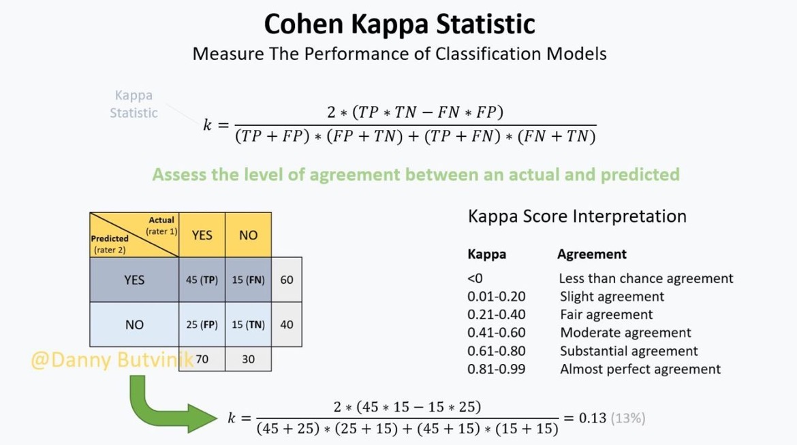
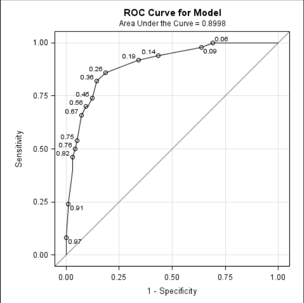
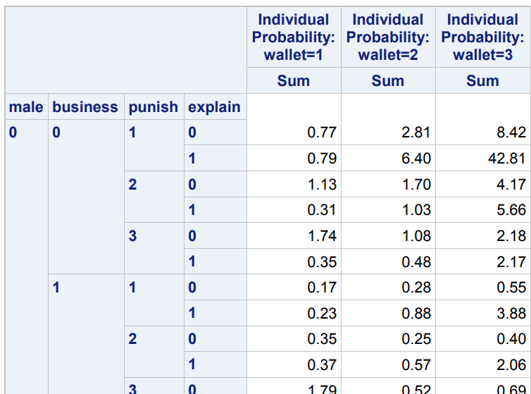
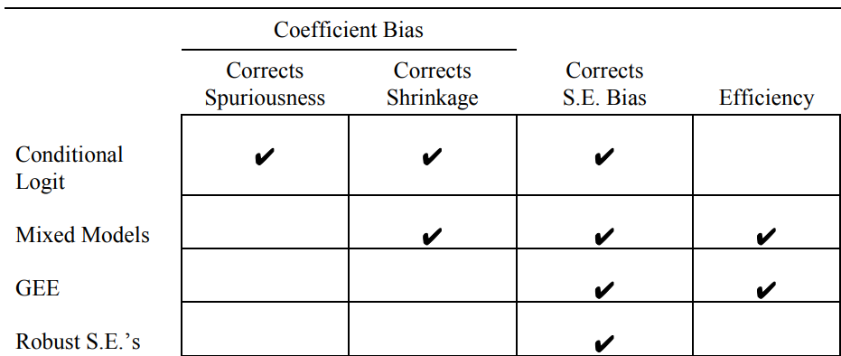

```{r setup, include=FALSE, echo = FALSE,message = FALSE, error = FALSE, warning = FALSE}
knitr::opts_chunk$set(echo = TRUE)

# <!-- ---------------------------------------------------------------------- -->
# <!--                    1. load the required packages                       -->
# <!-- ---------------------------------------------------------------------- --> 

# if(!require(psych)){install.packages("psych")}

packages<-c("tidyverse", "kableExtra", "gtsummary",
            "Hmisc","htmltools","clinUtils","sjPlot")
ipak <- function(pkg){
  new.pkg <- pkg[!(pkg %in% installed.packages()[, "Package"])]
  if (length(new.pkg)) 
    install.packages(new.pkg, dependencies = TRUE)
  sapply(pkg, require, character.only = TRUE)
}
ipak(packages)
 


# <!-- ---------------------------------------------------------------------- -->
# <!--                        2. Basic system settings                        -->
# <!-- ---------------------------------------------------------------------- -->
setwd(dirname(rstudioapi::getSourceEditorContext()$path))
getwd()
Sys.setlocale("LC_ALL","English")

# convert backslash to forward slash in R
# gsub('"', "", gsub("\\\\", "/", readClipboard()))

## get the path
# rstudioapi::getSourceEditorContext()$path
# dirname(rstudioapi::getSourceEditorContext()$path)

## set working directory
# getwd()
# setwd("c:/Users/zbai/Desktop")
# Sys.setlocale("LC_ALL","English")

## get the R Version
# paste(R.Version()[c("major", "minor")], collapse = ".")

## convert backslash to forward slash 
# scan("clipboard",what="string")
# gsub('"', "", gsub("\\\\", "/", readClipboard())) 

# Load all r functions
# The directory where all source code files are saved.
source_code_dir <- "C:/Users/baiz/Downloads/Data-Analyst-with-R/Function/ZB Function/"  
file_path_vec <- list.files(source_code_dir, full.names = T)
for(f_path in file_path_vec){source(f_path)}

# <!-- ---------------------------------------------------------------------- -->
# <!--                         3. Import the datasets                         -->
# <!-- ---------------------------------------------------------------------- -->

# <!-- ---------------------------- -->
# <!-- --3.1 Import csv data ------ -->
# <!-- ---------------------------- -->

# pfad <- "~/Desktop/SASUniversityEdition/myfolders/Daten"
# mydata1 <- read.csv(file.path(pfad, "yourcsv_data.csv"), 
#                     sep=";", 
#                     header=TRUE)   

# Import all csv data from folder
# list_csv_files <- list.files(path = "./csvfolder/")
# do.call(rbind, lapply(list_csv_files, function(x) read.csv(x, stringsAsFactors = FALSE)))

# <!-- ---------------------------- -->
# <!-- --3.2 Import xlsx data ----- -->
# <!-- ---------------------------- -->

# library(readxl)
# mydata2 <- read_excel("C:/Users/zbai/Documents/GitHub/R-Projects/SAS/Yimeng/results-text.xlsx")

# <!-- ---------------------------- -->
# <!-- --3.3 Import sas7dbat data - -->
# <!-- ---------------------------- -->

# library(sas7bdat)
# mydata3 <- read.sas7bdat("~/Desktop/SASUniversityEdition/myfolders/Daten/uis.sas7bdat")

# Import all sas7dbat data from SASfolder
# ZB.import.sas.folder("./SASfolder/")

# <!-- ---------------------------- -->
# <!-- --3.4 Import from copyboard --->
# <!-- ---------------------------- -->
# copdat <- read.delim("clipboard")
# Data_D01 <- copdat

# <!-- ---------------------------------------------------------------------- -->
# <!--                           4. Some Tools                                -->
# <!-- ---------------------------------------------------------------------- -->

# To check out vignettes for one specific package
# browseVignettes("sjPlot")      # sjPlot for Models Summary
# browseVignettes("kableExtra")
# browseVignettes("gtsummary")
# <!-- ---------------------------------------------------------------------- -->
```

 
 

# Introduction

Use probability-based linear models to predict qualitative response variables, three methods:

1. Logistic regression
2. Linear discriminant analysis  
3. Multivariate adaptive regression spline 


## Violation of assumptions of OLS 

The basic assumptions of Ordinary least squares (OLS) regression

1. $y_{i}=\alpha+\beta x_{i}+\varepsilon_{i} \mid$
2. $\mathrm{E}\left(\varepsilon_{i}\right)=0$
3. $\operatorname{var}\left(\varepsilon_{i}\right)=\sigma^{2}$
4. $\operatorname{cov}\left(\varepsilon_{i}, \varepsilon_{j}\right)=0$
5. $\varepsilon_{i} \sim$ Normal

**Normal residuals assumption**

Assuming y is a dichotomy, the possible values are 1 or 0. Assume yi = 1. Then hypothesis 1 means εi = 1–α–βxi. On the other hand, if yi = 0, we have εi = –α–βxi. Since εi can only take two values, it is impossible to have a normal distribution


**Consistant variance assumption**

$$E\left(y_{i}\right)=1 \times \operatorname{Pr}\left(y_{i}=1\right)+0 \times \operatorname{Pr}\left(y_{i}=0\right)$$

If we define $p i=\operatorname{Pr}(y i=1)$,Then
$$E\left(y_{i}\right)=p_{i}$$

$$
\begin{array}{c}
E\left(y_{i}\right)=E\left(\alpha+\beta x_{i}+\varepsilon_{i}\right) 
=E(\alpha)+E\left(\beta x_{i}\right)+E\left(\varepsilon_{i}\right) 
=\alpha+\beta x_{i}
\end{array}
$$
Putting these two results together, we get
$$
\begin{array}{c}
p_{i}=\alpha+\beta x_{i} \\
\operatorname{var}\left(\varepsilon_{i}\right)=p_{i}\left(1-p_{i}\right)=\left(\alpha+\beta x_{i}\right)\left(1-\alpha-\beta x_{i}\right)
\end{array}
$$
For different observations, the variance of $ε_i$ must be different, especially as it changes with changes in x. When pi = 0.5, the disturbance variance is the largest, and when pi is close to 1 or 0, the disturbance variance becomes smaller.

**Problems**

If the sample is quite large, the normality assumption is not required. The **central limit theorem** assures us that even if ε is not normally distributed, the coefficient estimates will have an approximately normal distribution. This means that we can still use ordinary tables to calculate p-values and confidence intervals. However, if the sample is small, these approximations may be poor.

 

**Violation of the homoscedasticity assumption has two undesirable consequences.**

1. First, the coefficient estimates are no longer **effective**. In statistical terms, this means that there are other selection methods with smaller standard errors.
2. Second, the standard error estimates are no longer consistent estimates of the true standard errors. That means that the estimated standard errors could be biased (either upward or downward) to unknown degrees. And because the standard errors are used in calculating test statistics, the test statistics could also be problematic.

 

**Heteroscedasticity consistent covariance estimator “sandwich”**

Even if the homogeneity assumption is violated, this method will produce a consistent estimate of the standard error. To implement this method in PROC REG, just put the option HCC on the MODEL statement

```
PROC REG DATA=penalty;
  MODEL death=blackd whitvic serious / HCC; 
RUN;
```

<!-- 尽管HCC标准误差很容易解决，但是请注意，它们固有地具有比常规标准误差更大的采样变异性（Kauermann和Carroll 2001），并且在小样本中可能尤其不可靠。但是，对于大样本，它们应该是令人满意的. -->


**More fundamental problem outside [0,1]**

For Linear probability model $p_{i}=\alpha+\beta x_{i}$, If x has no upper or lower limit, then for any value of β, there is a value of x whose pi is greater than 1 or less than 0.

## Logistic Regression Model 

Probability is bounded by 0 and 1, while linear functions are inherently unbounded. The solution is to convert the probability so that it is no longer restricted. Converting probabilities to odds eliminates the upper limit. For k explanatory variables
$$\log \left[\frac{p_{i}}{1-p_{i}}\right]=\alpha+\beta_{1} x_{i 1}+\beta_{2} x_{i 2}+\ldots+\beta_{k} x_{i k}$$
$$p_{i}=\frac{\exp \left(\alpha+\beta_{1} x_{i 1}+\beta_{2} x_{i 2}+\ldots+\beta_{k} x_{i k}\right)}{1+\exp \left(\alpha+\beta_{1} x_{i 1}+\beta_{2} x_{i 2}+\ldots+\beta_{k} x_{i k}\right)}$$
$$p_{i}=\frac{1}{1+\exp \left(-\alpha-\beta_{1} x_{i 1}-\beta_{2} x_{i 2}-\ldots-\beta_{k} x_{i k}\right)}$$


There is **no random disturbance term** in the equation of the logic model. This does not mean that the model is deterministic, because there is still room for random variation in the probability relationship between pi and yi.


## Estimation 

* **Ordinary least squares**
    +  OLS is primarily used for linear regression models, not logistic regression. It assumes that the response variable is continuous and normally distributed.
    + OLS aims to minimize the sum of squared differences between the observed and predicted values. It's not suitable for logistic regression because the logistic function used in logistic regression does not produce a linear relationship between predictors and the log-odds of the response.
* **Weighted least squares**
    + WLS is a variant of OLS that can be adapted for logistic regression, but it's not the most common method for logistic regression.
    + WLS assigns different weights to individual observations based on their variances or other criteria. It can be used to handle heteroscedasticity, where the variance of the residuals varies across levels of the predictors. In logistic regression, it can be used when the assumption of constant error variance does not hold.
* **Maximum likelihood**
   + ML is the most common method for estimating the parameters of logistic regression models.
   + ML estimates the model parameters (coefficients) by maximizing the likelihood function, which represents the probability of observing the given data under the assumed logistic regression model. In other words, it finds the parameter values that make the observed data most probable
   
### Maximum Likelihood Estimation

1. **Consistency** means that as the sample size gets larger the probability that the estimate is within some small distance of the true value also gets larger. No matter how small the distance or how high the specified probability, there is always a sample size that yields an even higher probability that the estimator is within that distance of the true value. One implication of consistency is that the ML estimator is approximately unbiased in large samples.
2. **Asymptotic efficiency** means that, in large samples, the estimates will have standard errors that are, approximately, at least as small as those for any other estimation method. And, finally, the sampling distribution of the estimates will be approximately normal in large samples, which means that you can use the normal and chi-square distributions to compute confidence intervals and p-values. All these approximations get better as the sample size gets larger. The fact that these desirable properties have only been proven for large samples does not mean that ML has bad properties for small samples. It simply means that we usually don’t know exactly what the small-sample properties are. And in the absence of attractive alternatives, researchers routinely use ML estimation for both large and small samples.

### Details

**1. Data Description and Probability of yi = 1**

We have data for n individuals (i = 1, ..., n), and these individuals are considered statistically independent. For each i, the data consists of yi and xi, where yi is a random variable with possible values 0 and 1, and xi = [1 xi1...xik]' is a vector of explanatory variables (1 is the intercept).) Let pi The probability of yi = 1
$$p_{i}=\frac{1}{1+e^{-\boldsymbol{\beta} \mathbf{x}_{i}}}$$

**2. Likelihood Function**

The likelihood of observing the values of $y$ for all the observations can be written as
$$L=\operatorname{Pr}\left(y_{1}, y_{2,} \ldots, y_{n}\right)$$

Because we are assuming that observations are independent, the overall probability of observing all the $y_{i}, \mathrm{~s}$ can be factored into the product of the individual probabilities:
$$
L=\operatorname{Pr}\left(y_{1}\right) \operatorname{Pr}\left(y_{2}\right) \ldots \operatorname{Pr}\left(y_{n}\right)=\prod_{i=1}^{n} \operatorname{Pr}\left(y_{i}\right)
$$
By definition, $\operatorname{Pr}\left(y_{i}=1\right)=p_{i}$ and $\operatorname{Pr}\left(y_{i}=0\right)=1-p_{i} .$ That implies that we can write
$$
\begin{array}{c}
\operatorname{Pr}\left(y_{i}\right)=p_{i}^{y_{i}}\left(1-p_{i}\right)^{1-y_{i}} \\
L=\prod_{i=1}^{n} p_{i}^{y_{i}}\left(1-p_{i}\right)^{1-y_{i}}=\prod_{i=1}^{n}\left(\frac{p_{i}}{1-p_{i}}\right)^{y_{i}}\left(1-p_{i}\right) .
\end{array}
$$

**3. Log-Likelihood**

At this point we take the logarithm of both sides of the equation to get
$$
\log L=\sum_{i} y_{i} \log \left(\frac{p_{i}}{1-p_{i}}\right)+\sum_{i} \log \left(1-p_{i}\right)
$$
And for equation
$$
\log L=\sum_{i} \boldsymbol{\beta} \mathbf{x}_{i} y_{i}-\sum_{i} \log \left(1+e^{\boldsymbol{\beta} \mathbf{x}_{i}}\right)
$$
**4. Derivative and Solving**

Taking the derivative of equation and setting it equal to 0 gives us:
$$
\begin{aligned}
\frac{\partial \log L}{\partial \boldsymbol{\beta}} &=\sum_{i} \mathbf{x}_{i} y_{i}-\sum_{i} \mathbf{x}_{i}\left(1+e^{-\boldsymbol{\beta} \mathbf{x}_{i}}\right)^{-1} \\
&=\sum_{i} \mathbf{x}_{i} y_{i}-\sum_{i} \mathbf{x}_{i} \hat{y}_{i}=0
\end{aligned}
$$
$$\hat{y}_{i}=\frac{1}{1+e^{-\beta \mathbf{x}_{i}}}$$

**5. Newton-Raphson iterative methods**

Due to the lack of a clear solution, iterative methods are used. The Newton-Raphson algorithm is one such iterative method, which updates the parameter estimates iteratively until convergence.

There is no clear solution to the equation. Instead, we must rely on iterative methods, which are equivalent to successive approximations to the solution until the approximation "converges" to the solution. Until the approximation "converges" to the correct value. Again, there are many different ways to do this. All methods produce the same solution, but they differ in factors such as convergence speed, sensitivity to initial values, and computational difficulty of each iteration. The Newton-Raphson algorithm is one of the most widely used iterative methods.
$$
\begin{array}{l}
\mathbf{U}(\boldsymbol{\beta})=\frac{\partial \log L}{\partial \boldsymbol{\beta}}=\sum_{i} \mathbf{x}_{i} y_{i}-\sum_{i} \mathbf{x}_{i} \hat{y}_{i} \\
\mathbf{I}(\boldsymbol{\beta})=\frac{\partial^{2} \log L}{\partial \boldsymbol{\beta} \partial \boldsymbol{\beta}^{\prime}}=-\sum_{i} \mathbf{x}_{i} \mathbf{x}_{i}^{\prime} \hat{y}_{i}\left(1-\hat{y}_{i}\right)
\end{array}
$$

 
The Newton-Raphson algorithm is then $$\boldsymbol{\beta}_{j+1}=\boldsymbol{\beta}_{j}-\mathbf{I}^{-1}\left(\boldsymbol{\beta}_{j}\right) \mathbf{U}\left(\boldsymbol{\beta}_{j}\right)$$

**6. Convergence Criterion**

We need a set of initial values $\beta_0$. PROC LOGISTIC starts by setting all slope coefficients to 0. Set the intercept to be equal to log [p /(1-p)], where p is the total proportion of events. These initial values are substituted into the right side of the equation, resulting in the result of the first iteration $\beta_1$. Then substitute these values into the right side, recalculate the first and second derivatives, and the result is $\beta_2$ Repeat this process until you get "convergence".

This means that what is inserted on the right is obtained on the left. In fact, you will never get exactly the same thing, so it is necessary to adopt a convergence criterion to judge whether the proximity is close enough. But since every successful run of PROC LOGISTIC reports “Convergence criterion (GCONV=1E-8) satisfied,” 
$$\frac{\mathbf{U}\left(\boldsymbol{\beta}_{j}\right)^{\prime} \mathbf{I}^{-1}\left(\boldsymbol{\beta}_{j}\right) \mathbf{U}\left(\boldsymbol{\beta}_{j}\right)}{\left|\log L\left(\boldsymbol{\beta}_{j}\right)\right|+.000001}$$

If the number is less than .00000001, convergence is declared and the algorithm stops.


## Convergence Problems


Maximum likelihood estimation in logistic regression is an iterative process used to find parameter estimates through successive approximations. Typically, this process proceeds smoothly without much concern. In most cases, convergence is achieved in fewer than 10 iterations, meaning that the parameter estimates stabilize.
 
**1. Increase the Maximum Number of Iterations**: One common approach is to increase the maximum number of iterations allowed in the optimization algorithm. Logistic regression software (e.g., LOGISTIC) often imposes a default limit on the number of iterations, such as 25 iterations. If convergence is not reached within this limit, the software issues a warning message and prints the results from the final iteration. While it's possible to attempt to solve the issue by increasing the iteration limit (using the MAXITER option in the MODEL statement), this rarely helps in cases where convergence is unattainable.

**2. Change the Optimization Algorithm**: Logistic regression algorithms use various optimization techniques, such as Newton-Raphson, Fisher scoring, or gradient descent. Some algorithms may be more robust in handling convergence issues than others.

**3. Scale or Standardize Predictor Variables**: In some cases, predictor variables with very different scales can lead to convergence problems. Try standardizing or scaling your predictor variables to have similar ranges. Standardization can improve the numerical stability of the optimization process.

**4. Check for Perfect Separation or Near Separation**: 
    + Perfect separation or near separation occurs when one or more predictor variables perfectly or almost perfectly predict the outcome variable. This can lead to convergence problems. Identify and address any variables causing separation by recoding, collapsing categories, or excluding them from the model if necessary.
    + The most common reason for quasi-complete separation is when a dummy predictor variable exhibits one of the following properties:
    + At one level of the dummy variable, the outcome variable is always 1, or At one level of the dummy variable, the outcome variable is always 0.

**Retain the model with quasi-complete separation but use likelihood-ratio tests.** The reported standard error and Wald's chi-square of this variable are also of no avail. Nevertheless, it is still possible to obtain a valid likelihood ratio test, *Profile Likelihood confidence interval.*

```
PROC LOGISTIC DATA=penalty;
 WHERE blackd=0;
 CLASS culp /PARAM=REF;
 MODEL death(EVENT='1') = culp serious / CLPARM=PL ALPHA=.01;
RUN;

################################
Parameter Estimate   99% Confidence Limits
culp 1    -15.5467          . -3.2344
```


**5. Simplify the Model**: Simplify the model by removing non-essential predictor variables or interactions. A complex model with too many predictors may be more prone to convergence issues.


**6. Regularization**: Consider using regularization techniques like L1 or L2 regularization (e.g., ridge or lasso regression) if you suspect overfitting or multicollinearity is contributing to convergence problems. Regularization can stabilize parameter estimation.

**7. Nonexistence of Maximum Likelihood Estimates**: In most instances where the model fails to converge within the allotted number of iterations (e.g., 25 iterations), it suggests that maximum likelihood estimates may not exist. This means that the model cannot find appropriate parameter estimates, and it may necessitate a reevaluation of the model or data handling.
 
  
## Alternative

### Exact Method 

**Limitations of Maximum Likelihood Estimation (MLE):**

* MLE provides standard errors and p-values that are asymptotic or large-sample approximations.
* In small sample sizes or cases of data separation, the accuracy of these approximations may be less than desired.

**Exact Logistic Regression:**

* An alternative estimation method called "exact logistic regression" is introduced.
* This method can be viewed as a generalization of Fisher's exact test for contingency tables.
* In exact logistic regression, p-values are calculated by enumerating all possible sample outcomes under the null hypothesis.
* Even in situations of complete or quasi-complete separation, the exact method can produce valid p-values.。

**SAS PROC LOGISTIC Example:**

The code includes the "EXACT" statement to request exact logistic regression, and it estimates both parameters and p-values using this method.

```
PROC LOGISTIC DATA=penalty;
 WHERE blackd=0;
 CLASS culp /PARAM=REF;
 MODEL death(EVENT='1') = culp serious;
 EXACT culp serious / ESTIMATE=BOTH;
RUN; 
```
**Conditional Tests:**

* The tests performed in exact logistic regression are conditional in nature. They rely on the conditional distribution of sufficient statistics for each parameter, given the sufficient statistics for all other parameters.
* These tests are exact in the sense that they provide the correct probability of obtaining a result as extreme as the observed one in the sample, assuming the null hypothesis that a variable has no effect.

### Penalized Likelihood

处理拟完全分离的最简单，最有效的方法之一是一种被称为惩罚似然估计的方法，该方法由Firth（1993）引入，因此通常被称为Firth方法。 众所周知，传统的最大似然估计可能会在小样本中产生偏差。 惩罚似然法旨在减少这种偏差，适用于最大似然的广泛应用。 Heinze和Schemper（2002）表明，这种方法在处理准完全分离的情况下特别有效。 运作方式如下。 在牛顿-拉夫森算法（方程3.7）中，一阶导数U（β）

$$\mathbf{U}(\boldsymbol{\beta})=\frac{\partial \log L}{\partial \boldsymbol{\beta}}=\sum_{i} \mathbf{x}_{i} y_{i}-\sum_{i} \mathbf{x}_{i} \hat{y}_{i}-\sum_{i} h_{i} \mathbf{x}_{i}\left(.5-\hat{y}_{i}\right)$$
In PROC LOGISTIC, the method is implemented with the FIRTH option on the MODEL statement

```
PROC LOGISTIC DATA=penalty;
 WHERE blackd=0;
 CLASS culp /PARAM=REF;
 MODEL death(EVENT='1') = culp serious / FIRTH
 CLPARM=PL;
RUN;
```

## Confounder

### Stratified analysis

Source <https://www.linkedin.com/pulse/conducting-stratified-analysis-test-confounding-navneet-dhand/>

Stratified analysis is a powerful statistical approach that allows you to test for confounding and interaction, but unlike logistic regression, it is quite simple and doesn't distance you from your data. You can 'see' the associations and enjoy the insights gained from analysis.
This approach is useful when you are interested in testing association between two categorical variables - say exposure and disease - by adjusting for a third categorical variable. If done correctly, it also enables you to investigate whether the third variable is a confounder or an effect modifier.
For example, you might be interested in evaluating an association between obesity and cardiovascular disease after stratifying by age or you might want to investigate acceptances rates for males and females in a university program stratified by department. In both these situations you could conduct stratified analysis to identify confounding and interaction.
A systematic approach to stratified analysis involves the following steps:

  1. Test crude association of the explanatory variable with the outcome or response variable, i.e. conduct a chi-square test to evaluate significance of the association and calculate a crude odds ratio or relative risk (along with their confidence intervals) to measures the strength of the association. 
	2. Conduct stratified analysis after stratifying data by the third variable. Similar to the first step, this includes testing the significance and measuring the strength of the association, but for each contingency table created after stratification. 
	3. Test homogeneity of odds ratios or relative risks to determine whether these measures of association are significantly different. This can be done by conducting a Breslow-Day or Woolf's test of homogeneity. A significant test indicates a significant interaction or effect modification. If this is the case, then it is preferable to report separate odds ratio and relative risk for each strata.
	4. Calculate Mantel- Haenszel odds ratios and relative risk along with their confidence interval, if the test of homogeneity is not significant. This is a weighted measure of association after adjusting for the third variable. The adjusted measure of association can be compared with the crude measure of association calculated in the first step to evaluate percentage change in the measure after adjusting for the third variable. A 'substantial' change is indicative of confounding. There are no set rules of deciding what change is substantial but generally more than 20% change is considered important.
Conduct a Cochran- Mantel-Haenszel chi-square test to evaluate significance of the adjusted odds ratio or relative risk calculated in the fifth step. 

Note that if the test of homogeneity in Step 3 is significant, it is not appropriate to calculate an adjusted odds ratio (Step 4) or test its significance (Step 5).

Also note that many tests are available for testing homogeneity, but most of them have low power, and therefore, non-significance of the test should be interpreted with caution.

Stratified analysis can be conducted using many statistical programs such as Freq procedure in SAS and epiR package in R. Alternatively, you could use a free online program, Statulator, to conduct Steps 2 to 4 in one go:  http://statulator.com/stat/StratifiedAnalysis.html. 

Crude associations (Step 1) can be similarly evaluated using Statulator's Chi-square test page.

Statulator not only conducts chi-square and stratified analyses but also interprets the results and provides suggestions about presentation of results in journal articles or technical reports.


# Binomial CI

## Introduction

### Chi-Square Approximation

The chi-square distribution with $\nu$ degrees of freedom can be defined as the sum of the squares of $\nu$ independent standard normal random variables. In particular, if $Z$ is standard normal, then $Z^2$ is chi-square with one degree of freedom. For the approximation above, we have (with $Y=\sum_i X_i$ ) that
$$
\left(\frac{\bar{X}-\pi}{\sqrt{\pi(1-\pi) / n}}\right)^2=\left(\frac{Y-n \pi}{\sqrt{n \pi(1-\pi)}}\right)^2
$$
is approximately chi-square with one degree of freedom, provided $n$ is large. The advantage of working with a chi-square distribution is that it allows us to generalize readily to multinomial data when more than two outcomes are possible.


### Tests and CIs for a Binomial Parameter

For the discussion here, we assume that $X_1, \ldots, X_n$ are a random sample from the Bernoulli (or binomial with $n=1$ ) distribution with success probability $\pi$ so that, equivalently, $Y=\sum_i X_i$ is binomial with $n$ trials and success probability $\pi$. In either case, the MLE of $\pi$ is $\hat{\pi}=\bar{X}=Y / n$, with $E(\hat{\pi})=\pi$ and $V(\hat{\pi})=\pi(1-\pi) / n$, and the quantity
$$
\frac{\bar{X}-\mu}{\sigma / \sqrt{n}}
$$
is approximately standard normal for large $n$. The following approaches make use of this.

#### Wald Test and CI
 
If wish to test the null hypothesis $H_0: \pi=\pi_0$ versus $H_a: \pi \neq \pi_0$ for some specified value $\pi_0$, the Wald test statistic uses the MLE for $\pi$ in the variance expression:
Wald Test Statistic
$$
Z_w=\frac{\hat{\pi}-\pi_0}{\sqrt{\hat{\pi}(1-\hat{\pi}) / n}}
$$

For large $n, Z_w$ is approximately standard normal (the MLE is very close to $\pi$ when $n$ is large), and we can use standard normal quantiles for thresholds to determine statistical significance. That is, at significance level $\alpha$, then would reject $H_0$ if $\left|Z_w\right| \geq z_{\alpha / 2}$, the upper $\alpha / 2$ quantile. The reason for the absolute value is because we want to reject $H_0$ if the MLE significantly differs from $\pi_0$ in either direction.

Note that $\pi_0$ will not be rejected if
$$
-z_{\alpha / 2}<\frac{\hat{\pi}-\pi_0}{\sqrt{\hat{\pi}(1-\hat{\pi}) / n}}<z_{\alpha / 2}
$$

Rearranging slightly, we can write the equivalent result
$$
\hat{\pi}-z_{\alpha / 2} \sqrt{\frac{\hat{\pi}(1-\hat{\pi}}{n}}<\pi_0<\hat{\pi}+z_{\alpha / 2} \sqrt{\frac{\hat{\pi}(1-\hat{\pi}}{n}}
$$

The limits are the familiar $(1-\alpha) 100 \%$ confidence interval for $\pi$, which we refer to as the Wald interval:
$$
\hat{\pi} \pm z_{\alpha / 2} \sqrt{\frac{\hat{\pi}(1-\hat{\pi}}{n}} \text { (Wald Interval) }
$$

The most common choice for $\alpha$ is 0.05 , which gives $95 \%$ confidence and multiplier $z_{.025}=1.96$. We should also mention here that one-sided confidence intervals can be constructed from one-sided tests, although they're less common.

The continuity correction is an adjustment that is made when a discrete distribution is approximated by a continuous distribution: 

$$
{\displaystyle Z={\frac {k-n\pi \pm {\frac {1}{2}}}{\sqrt {n\pi (1-\pi )}}}}
$$
#### Score Test and CI

Another popular way to test $H_0: \pi=\pi_0$ is with the Score test statistic:
Score Test Statistic
$$
Z_s=\frac{\hat{\pi}-\pi_0}{\sqrt{\pi_0\left(1-\pi_0\right) / n}}
$$

Considering that a hypothesis test proceeds by assuming the null hypothesis is true until significant evidence shows otherwise, it makes sense to use $\pi_0$ in place of $\pi$ in both the mean and variance of $\hat{\pi}$. The score test thus rejects $\pi_0$ when $\left|Z_s\right| \geq z_{\alpha / 2}$, or equivalently, will not reject $\pi_0$ when
$$
-z_{\alpha / 2}<\frac{\hat{\pi}-\pi_0}{\sqrt{\pi_0\left(1-\pi_0\right) / n}}<z_{\alpha / 2}
$$

Carrying out the score test is straightforward enough when a particular value $\pi_0$ is to be tested. Constructing a confidence interval as the set of all $\pi_0$ that would not be rejected requires a bit more work. Specifically, the score confidence interval limits are roots of the equation $\left|Z_s\right|-z_{\alpha / 2}=0$, which is quadratic with respect to $\pi_0$ and can be solved with the quadratic formula. The full expressions are in the $\mathrm{R}$ file below, but the center of this interval is particularly noteworthy (we'll let $z$ stand for $z_{\alpha / 2}$ for convenience):
$$
\frac{\hat{\pi}+z^2 / 2 n}{1+z^2 / n}
$$

```
ci = function(y,n,conf)
{   pi.hat = y/n
    z = qnorm(1-(1-conf)/2)
    wald = pi.hat+c(-1,1)*z*sqrt(pi.hat*(1-pi.hat)/n)
    score = (pi.hat+z^2/2/n+c(-1,1)*z*sqrt(pi.hat*(1-pi.hat)/n+z^2/4/n^2))/(1+z^2/n)
    cbind(wald, score) }
ci(6,20,.95)
```

#### Likelihood Ratio Test and CI

The third approach to binomial inference follows the same idea of inverting a test statistic to construct a confidence interval but utilizes the likelihood ratio test (LRT) for the binomial parameter. Recall the likelihood function for $Y \sim \operatorname{Bin}(n, \pi):$
$$
\ell(\pi)=\left(\begin{array}{l}
n \\
y
\end{array}\right) \pi^y(1-\pi)^{(n-y)}
$$

The LRT statistic for $H_0: \pi=\pi_0$ versus $H_a: \pi \neq \pi_0$ is
$$
G^2=2 \log \frac{\ell(\hat{\pi})}{\ell\left(\pi_0\right)}=2\left(y \log \frac{\hat{\pi}}{\pi_0}+(n-y) \log \frac{1-\hat{\pi}}{1-\pi_0}\right)
$$

For large $n, G^2$ is approximately chi-square with one degree of freedom, and $\pi_0$ will be rejected if $G^2 \geq \chi_{1, \alpha}^2$. Like the Wald and score test statistics, the LRT statistic is essentially a measure of disagreement between the sample estimate and the hypothesized value for $\pi$. Larger values indicate more disagreement and more evidence to reject $H_0$. And we can likewise construct a confidence interval as the set of all values of $\pi_0$ that would not be rejected. Unfortunately, we must resort to numerical approximation for these limits.

Like the score interval the limits for the LRT interval are centered at a value closer to 0.5 , compared with the Wald limits, which are centered at the MLE.

```
library('rootSolve')
ci = function(y,n,conf)
{   pi.hat = y/n
    z = qnorm(1-(1-conf)/2)
    wald = pi.hat+c(-1,1)*z*sqrt(pi.hat*(1-pi.hat)/n)
    score = (pi.hat+z^2/2/n+c(-1,1)*z*sqrt(pi.hat*(1-pi.hat)/n+z^2/4/n^2))/(1+z^2/n)
    loglik = function(p) 2*(y*log(pi.hat/p)+(n-y)*log((1-pi.hat)/(1-p)))-z^2
    lrt = uniroot.all(loglik,c(0.01,0.99))
    cbind(wald,score,lrt) }
ci(6,20,.95)
``` 

### Correlated Data

The Clopper-Pearson method is a commonly used method for constructing confidence intervals (CIs) for a binomial proportion. However, this method assumes that the data points are independent, which may not be the case for correlated data.

E.g. in ophthalmologystudy, When an ocular test is performed in both eyes of some or all of the study subjects, the statistical analyses are best performed at the eye-level and account for the inter-eye correlation by using either the GEE or cluster bootstrap. Ignoring the inter-eye correlation results in 95% CIs that are inappropriately narrow and analyzing data from two eyes separately are not efficient.

**1. GLMM**

For correlated data, one approach for constructing a CI for a binomial proportion is to use a generalized linear mixed-effects model (GLMM). In this approach, the correlation among the data points is accounted for by including a random effect in the model. The fixed effects in the model would include the predictor variables that are hypothesized to be associated with the binomial outcome.

Once the GLMM is fitted, the CI for the binomial proportion can be obtained using a profile likelihood method. This involves fitting the model for different values of the binomial proportion and computing the likelihood for each value. The CI is then obtained by finding the values of the binomial proportion that correspond to a specified level of the likelihood ratio test.


**2. Generalized estimating equations (GEE)**

Generalized estimating equations (GEE) to account for inter-correlation, GEE is a model-based approach, and its 95% CIs were calculated based on a working independence covariance matrix. 


**3. Bootstrap**

Another approach for constructing a CI for a binomial proportion with correlated data is to use a bootstrap method (cluster bootstrap). This involves resampling the data with replacement and computing the CI from the bootstrap distribution. However, this method can be computationally intensive and may not be feasible for large datasets.


## SAS Implementation

### General Proc Freq

See more ["ODS Table Names"](https://documentation.sas.com/doc/en/statcdc/14.2/statug/statug_freq_details116.htm)

| ODS Table Name    | Description                            | Statement | Option           |
|-------------------|----------------------------------------|-----------|------------------|
| BinomialCLs       | Binomial confidence limits             | TABLES    | BINOMIAL(CL=)    |
| BinomialEquivTest | Binomial equivalence test              | TABLES    | BINOMIAL(EQUIV)  |
| BinomialNoninf    | Binomial noninferiority test           | TABLES    | BINOMIAL(NONINF) |
| BinomialTest      | Binomial proportion test               | TABLES    | BINOMIAL         |
| CMH               | Cochran-Mantel-Haenszel test           | TABLES    | CMH              |
| ChiSq             | Chi-square tests                       | TABLES    | CHISQ            |
| EqualKappaTests   | Tests for equal kappas                 | TABLES    | AGREE            |
| EqualOddsRatios   | Tests for equal odds ratios            | EXACT     | EQOR             |
| GammaTest         | Gamma test                             | TEST      | GAMMA            |
| LRChiSq           | Likelihood ratio chi-square exact test | EXACT     | LRCHI            |
| MHChiSq           | Mantel-Haenszel chi-square exact test  | EXACT     | MHCHI            |
| OneWayChiSq       | One-way chi-square test                | TABLES    | CHISQ            |
| PearsonCorr       | Pearson correlation                    | TEST      | PCORR            |


### Clopper-Pearson 

The confidence interval using Clopper-Pearson method can be easily calculated with SAS Proc Freq procedure. Alternatively, it can also be calculated directly using the formula or using R function. 
Using Venetoclax NDA as an example, the primary efficacy endpoint ORR (overall response rate) is calculated as 85 / 107 = 79.4. 95% confidence interval can be calculated using Clopper-Pearson method as following: 

```
*Using SAS Proc Freq;
data test2;
	  input orr $ count @@;
	datalines;
	have 85
	no 22
	;
	ods output BinomialCLs=test;
	proc freq data=test2 order=data;
	  weight count;
	  tables orr/binomial(exact) alpha=0.05 ;
run;
```

```
Using formula:
	data test;
	  input n n1 alpha;
	  phat = n1/n;
	  fvalue1 = finv( (alpha/2), 2*n1, 2*(n-n1));
	  fvalue2 = finv( (1-alpha/2), 2*(n1+1), 2*(n-n1));
	  pL =  (1+   ((n-n1+1)/(n1*fvalue1) ))**(-1);
	  pU =  (1+   ((n-n1)/((n1+1)*fvalue2) ))**(-1);
	datalines;
	107 85 0.05
;
```

### CI_Single_Proportion Macro

These codes is currently hosted in my Github page:
https://raw.githubusercontent.com/Jiangtang/Programming-SAS/master/CI_Single_Proportion.sas

```
filename CI url 'https://raw.github.com/Jiangtang/ProgrammingSAS/master/CI_Single_Proportion.sas';
%include CI;
%CI_Single_Proportion(r=81,n=263);
```

Compute two-sided confidence intervals for single proportion with 11 methods:  

1.  Simple asymptotic, Without CC | Wald 
2.  Simple asymptotic, With CC 
3.  Score method, Without CC | Wilson
4.  Score method, With CC
5.  Binomial-based, 'Exact' | Clopper-Pearson
6.  Binomial-based, Mid-p 
7.  Likelihood-based 
8.  Jeffreys   
9.  Agresti-Coull, pseudo frequency, z^2/2 successes| psi = z^2/2 
10. Agresti-Coull, pseudo frequency, 2 successes and 2 fail| psi = 2
11. Agresti-Coull, pseudo frequency, psi = 1                           
12. Agresti-Coull, pseudo frequency, psi = 3                           
13. Logit                                                              
14. Blaker


### Correlated CI using GLMM

In the context of a binomial proportion analysis using a GLMM in SAS, the simultaneous 95% confidence limits refer to the range of possible values for the true binomial proportion for each group, while taking into account the correlation within each group. Simultaneous 95% confidence limits provide a range of values within which the true parameter of interest (e.g., a mean or a proportion) is expected to fall with 95% confidence, across all groups or comparisons being made simultaneously.

To interpret the simultaneous 95% confidence limits,  

* If the estimated binomial proportion falls within the confidence limits, it means that the observed proportion is a likely estimate of the true proportion for that group, with 95% confidence.
* If the lower limit of the confidence interval is close to 0 or the upper limit is close to 1, it suggests that the sample size may be too small to provide a precise estimate of the true proportion, or that there may be other facto
	
**Option in SAS**
	
* Use the RANDOM statement to specify the grouping variable(s) that define the clusters or groups with correlated data.
* Use the DIST=BINOMIAL and LINK=LOGIT options to specify the binomial distribution with a logit link function.
* Use the ESTIMATE statement to estimate the binomial proportion for each group defined by the grouping variable(s).
* Use the ADJUST=TUKEY option to obtain a simultaneous confidence interval for all the groups.


```
proc glimmix data=mydata;
  class group;
  model outcome = indep / dist=binomial link=logit;
  random group;
  estimate 'Binomial Proportion' group / adjust=tukey alpha=0.05;
run;
```
* Look for the "Estimates of Fixed Effects" table in the output to find the estimated coefficients for the independent variable(s).
* Look for the "Estimates of Random Effects" table in the output to find the estimated variance components for the grouping variable(s).
* Look for the "Estimates of Covariance Parameters" table in the output to find the estimated covariance matrix for the random effects.
* Look for the "Estimates" table in the output to find the estimated binomial proportion for each group defined by the grouping variable(s).
* Look for the "Simultaneous 95% Confidence Limits" column in the output to find the lower and upper limits of the CI for each estimated binomial proportion.


### Correlated CI using GEE

SAS macro for calculating the sensitivity, specificity and their 95% CI at
the eye level using GEE approach

```
%macro gee(data=, disease=, test=);
  proc genmod data=&data descending;
  class id &disease;
  model &test=&disease/dist=bin;
  repeated subject=id/type=ind;
  estimate 'Sensitivity' intercept 1 &disease 0 1/exp;
  estimate 'Spec.ficity' intercept 1 &disease 1 0/exp;
  ods output Genmod.Estimates=sensdata;
  run;
  data CI;
  set sensdata (rename=(LBetaestimate=estimate LBetaLowerCL=LowerCL
  LBetaUpperCL=UpperCL));
  if label='Exp(Sensitivity)' then do;
   point=estimate/(1+estimate);
   lower=lowerCL/(1+lowerCL);
   upper=upperCL/(1+upperCL);
   end;
  if label='Exp(Specificity)' then do;
   point=1/(1+estimate);
   upper=1/(1+lowerCL);
   lower=1/(1+upperCL);
  end;
  if label in ('Exp(Sensitivity)', 'Exp(Specificity)');
  run;
  proc print data=ci;
  var label point lower upper;
  run;
%mend;
%gee(data=subsample, disease=RWROP_de, test=RWROP_rc);
```

## R Implementation

### Package binom

Package [binom](https://cran.r-project.org/web/packages/binom/binom.pdf) can provide different binomial CI and Test such as

* exact - Pearson-Klopper method. See also binom.test.
* asymptotic - the text-book definition for confidence limits on a single proportion using the Central Limit Theorem.
* wilson - Wilson method.
* prop.test - equivalent to prop.test(x = x, n = n, conf.level = conf.level)$conf.int.
* bayes - see binom.bayes.
* logit - see binom.logit.
* cloglog - see binom.cloglog.
* probit - see binom.probit.
* profile - see binom.profile.


|  Function           |  Description                                                                  |
|---------------------|------------------------------------------------------------------------------------------------------------------------------------------------------------------------------------------------------------------------------------------------------------------------------------------------------------------------------------------------------------------------------------------------------|
| binom.bayes         | Binomial confidence intervals using Bayesian inference |
| binom.logit         | Binomial confidence intervals using the logit parameterization                      |
| binom.probit        | Binomial confidence intervals using the probit parameterization                     |
| binom.cloglog       | Parameterize on observed proportions (cloglog) to construct confidence intervals, The complementary-log-log link function says that $$\eta(x) = \log(-\log(1-\pi_x))=\mathbf{x}\beta$$|
| binom.lrt           | Binomial confidence intervals using the lrt likelihood -- likelihood ratio test (LRT) Confidence intervals are based on the analysis of the binomial deviation around the MLE|
| binom.profile       | Binomial confidence intervals using the profile likelihood  Contour likelihood is often used when the shape of the log-likelihood function is highly non-normal or has a large number of troublesome parameters. When the likelihood function has multiple parameters, only some of the parameters are focused on, and the other parameters are treated as constants. This The likelihood function is called profile likelihood|
| binom.sim           | Simulates confidence intervals for binomial data                              |
| binom.confint       | Binomial confidence intervals                                                 |
| binom.coverage      | Probability coverage for binomial confidence intervals                        |
| binom.plot          | Coverage plots for binomial confidence intervals                              |
| binom.length        | Expected length for binomial confidence intervals                             |
| binom.power         | Power curves for binomial parameterizations                                   |
| cloglog.sample.size | Power and sample size for a binomial proportion using the cloglog parameterization  |
| cloglog.sample.size | Power and sample size for a binomial proportion using the cloglog parameterization  |


```{r, echo = T,message = FALSE, error = FALSE, warning = FALSE}
library(binom)
binom.test(x = 24, n = 30, p = 0.22,
           alternative = c("greater"),
           conf.level = 0.975)


binom.confint(x = 24, n = 30, conf.level = 0.95) %>% 
  filter(method=="exact") %>% 
  kable(caption = "95% Clopper-Pearson confidence interval (two-sided) for ORR") %>%
  add_footnote(c("ORR at D28 after first dosing, defined as the proportion of patients demonstrating ORR (Complete Response (CR), Very Good Partial Response (VGPR), or Partial Response (PR)) of GI symptoms without requirement for additional systemic therapies for an earlier progression, mixed response or non-response.")) %>%
  kable_styling(latex_options = "striped")
```

 


### Clopper-Pearson

```
Using formula:
	n=107
	n1=85
	alpha=0.05
	f1=qf(1-alpha/2, 2*n1, 2*(n-n1+1), lower.tail=FALSE)
	f2=qf(alpha/2, 2*(n1+1), 2*(n-n1), lower.tail=FALSE)
	pl=(1+(n-n1+1)/(n1*f1))^(-1)
	pu=(1+(n-n1)/((n1+1)*f2))^(-1)
	f1
	f2
	pl
pu
```

# Accuracy Diagnostic

## Introduction

The sensitivity is defined as the proportion of positive results out of the number of samples which were actually positive. When there are no positive results, sensitivity is not defined and a value of NA is returned. Similarly, when there are no negative results, specificity is not defined and a value of NA is returned. Similar statements are true for predictive values.

The positive predictive value is defined as the percent of predicted positives that are actually positive while the negative predictive value is defined as the percent of negative positives that are actually negative.

Suppose a 2x2 table with notation:

|           | Reference |          |
|:---------:|:---------:|:--------:|
| Predicted |   Event   | No Event |
|   Event   |     A     |     B    |
|  No Event |     C     |     D    |

* Sensitivity=A/(A+C)
* Specificity=D/(B+D)
* Prevalence=(A+C)/(A+B+C+D)
* PPV=(sensitivity∗Prevalence)/((sensitivity∗Prevalence)+((1−specificity)∗(1−Prevalence)))
* NPV=(specificity∗(1−Prevalence))/(((1−sensitivity)∗Prevalence)+((specificity)∗(1−Prevalence)))

```{r, echo=FALSE, fig.align="center", out.width = '100%',fig.cap="2×2 contingency table or confusion matrix"}
knitr::include_graphics("./02_Plots/Logit/confussion-matrix.png")
knitr::include_graphics("./02_Plots/Logit/confussion-matrix2.png")
```


```{r, echo=FALSE, fig.align="center", out.width = '100%',fig.cap="Kappa Statistic"}
 
```


## R Implementation

### General based on caret package 

|           | Reference |          |
|:---------:|:---------:|:--------:|
| Predicted |   Event   | No Event |
|   Event   |    670    |    202   |
|  No Event |     74    |    640   |


```{r,echo = F,message = FALSE, error = FALSE, warning = FALSE}
library(caret)
## https://search.r-project.org/CRAN/refmans/caret/html/sensitivity.html
data <- as.table(matrix(c(670,202,74,640), nrow = 2, byrow = TRUE))

## data <- table(Standalone_D05$truth,Standalone_D05$pred)
## specificity(pred, truth)

sensitivity(data)
specificity(data)
posPredValue(data)
negPredValue(data)


confusionMatrix(data)

## 95% Confident Interval

## Sensitivity
sens_errors <- sqrt(sensitivity(data) * (1 - sensitivity(data)) / sum(data[,1]))
sensLower <- sensitivity(data) - 1.96 * sens_errors
sensUpper <- sensitivity(data) + 1.96 * sens_errors

## Specificity
spec_errors <- sqrt(specificity(data) * (1 - specificity(data)) / sum(data[,2]))
specLower <- specificity(data) - 1.96 * spec_errors
specUpper <- specificity(data) + 1.96 * spec_errors

## Positive Predictive Values
ppv_errors <- sqrt(posPredValue(data) * (1 - posPredValue(data)) / sum(data[1,]))
ppvLower <- posPredValue(data) - 1.96 * ppv_errors
ppvUpper <- posPredValue(data) + 1.96 * ppv_errors


## Negative Predictive Values
npv_errors <- sqrt(negPredValue(data) * (1 - negPredValue(data)) / sum(data[2,]))
npvLower <- negPredValue(data) - 1.96 * npv_errors
npvUpper <- negPredValue(data) + 1.96 * npv_errors

Accuracy_Output <- data.frame(
  Label = c("Sensitivity","Specificity","Positive Predictive Value","Negative Predictive Value"),
  Value = c(sensitivity(data), specificity(data), posPredValue(data), negPredValue(data)),
  SE = c(sens_errors,spec_errors,ppv_errors,npv_errors),
  Lower = c(sensLower,specLower,ppvLower,npvLower),
  Upper = c(sensUpper,specUpper,ppvUpper,npvUpper)
)
 
Accuracy_Output %>% 
  kable(caption = "Accuracy and 95% CI", format = "html")%>%
  kable_styling()


 
```
 


### CI based on epiR package 

CI options are method = "exact", method = "wilson", method = "agresti", method = "clopper-pearson" and method = "jeffreys".

* When method = "exact" exact binomial confidence limits are calculated for test sensitivity, specificity, and positive and negative predictive value (see Collett 1999 for details).

* When method = "wilson" Wilson's confidence limits are calculated for test sensitivity, specificity, and positive and negative predictive value (see Rothman 2012 for details).

* When method = "agresti" Agresti's confidence limits are calculated for test sensitivity, specificity, and positive and negative predictive value (see Agresti and Coull 1998 for details).

* When method = "clopper-pearson" Clopper-Pearson's confidence limits are calculated for test sensitivity, specificity, and positive and negative predictive value (see Clopper and Pearson 1934 for details).

* When method = "jeffreys" Jeffrey's confidence limits are calculated for test sensitivity, specificity, and positive and negative predictive value (see Brown et al., 2001 for details).
 

```{r,echo = F,message = FALSE, error = FALSE, warning = FALSE}
library("epiR")
rval <- epi.tests(data, 
                  method = "clopper-pearson", 
                  digits = 3,
                  conf.level = 0.95)
## rval$detail
print(rval)
## S3 method for class 'epi.tests'
summary(rval)
```


### Kappa statistic

Kappa is a measure of agreement beyond the level of agreement expected by chance alone. The observed agreement is the proportion of samples for which both methods (or observers) agree.

The bias and prevalence adjusted kappa (Byrt et al. 1993) provides a measure of observed agreement, an index of the bias between observers, and an index of the differences between the overall proportion of ‘yes’ and ‘no’ assessments. Bias and prevalence adjusted kappa are only returned if the number of rows and columns of argument dat equal 2.

Common interpretations for the kappa statistic are as follows: < 0.2 slight agreement, 0.2 - 0.4 fair agreement, 0.4 - 0.6 moderate agreement, 0.6 - 0.8 substantial agreement, > 0.8 almost perfect agreement (Sim and Wright, 2005).

Confidence intervals for the proportion of observations where there is agreement are calculated using the exact method (Collett 1999).

The argument alternative = "greater" tests the hypothesis that kappa is greater than 0.
 

```{r,echo = F,message = FALSE, error = FALSE, warning = FALSE}
library("epiR")
# epi.about()

data <- as.table(matrix(c(670,202,74,640), nrow = 2, byrow = TRUE)) 
colnames(data) <- c("Event","No Event")
rownames(data) <- c("Event","No Event")

epi.kappa(data, method = "fleiss", alternative = "greater", 
   conf.level = 0.95)

epi.kappa(data, method = "watson", alternative = "greater", 
   conf.level = 0.95)
```


```{r,echo = F,message = FALSE, error = FALSE, warning = FALSE}

```


## SAS Implementation

### Calculate PPV and NPV from Se and Sp

|           | Reference |          |
|:---------:|:---------:|:--------:|
| Predicted |   Event   | No Event |
|   Event   |    670    |    202   |
|  No Event |     74    |    640   |

```
/****************************************************************************
Calculate the PPV, NPV and their 95% CI using the Wald-type formulation
based on the paper by Mercaldo ND et al
Se=Sensitivity
Sp=Specificity
n1=# of subjects with disease of interest that the sensitivity calculation
was based on
n0=# of controls without disease of interest that the specificity calculation
was based on
p=Prevalence of disease in the population that the diagnostic test will be
applied to
****************************************************************************/
%macro PPV_NPV(Se=, Sp=, n1=, n0=, p=);
data PPV_NPV;
Se=&se;
Sp=&sp;
n1=&n1;
n0=&n0;
p=&p;
PPV=(Se*p)/(Se*p+(1-Sp)*(1-p));
NPV=(Sp*(1-p))/((1-Se)*p+(Sp*(1-p)));
 /*** for 95% CI of PPV **/
var_PPV_nu=(p*(1-Sp)*(1-p))**2*Se*(1-Se)/n1 +(p*Se*(1-p))**2*Sp*(1-Sp)/n0;
var_PPV_de=(Se*p+(1-Sp)*(1-p))**4;
var_PPV= var_PPV_nu/var_PPV_de;
PPV_lower=max(0, PPV-1.96*sqrt(var_PPV));
PPV_upper=min(1, PPV+1.96*sqrt(var_PPV));
 /*** for 95% CI of NPV **/
var_NPV_nu=(Sp*(1-p)*p)**2*Se*(1-Se)/n1 + ((1-Se)*(1-p)*p)**2*Sp*(1-Sp)/n0;
var_NPV_de=((1-Se)*p+Sp*(1-p))**4;
var_NPV= var_NPV_nu/var_NPV_de;
NPV_lower=max(0, NPV-1.96*sqrt(var_NPV));
NPV_upper=min(1, NPV+1.96*sqrt(var_NPV));
 /***** calculate 95% CI using logit transformation *****/
logit_PPV=log(PPV/(1-PPV));
logit_NPV=log(NPV/(1-NPV));
var_logit_PPV=((1-Se)/Se)*(1/n1)+(Sp/(1-Sp))*(1/n0);
var_logit_NPV=(Se/(1-Se))*(1/n1)+((1-Sp)/Sp)*(1/n0);
logit_PPV_lower=logit_PPV-1.96*sqrt(var_logit_PPV);
logit_PPV_upper=logit_PPV+1.96*sqrt(var_logit_PPV);
logit_NPV_lower=logit_NPV-1.96*sqrt(var_logit_NPV);
logit_NPV_upper=logit_NPV+1.96*sqrt(var_logit_NPV);
PPV_logit_lower=exp(logit_PPV_lower)/(1+exp(logit_PPV_lower));
PPV_logit_upper=exp(logit_PPV_upper)/(1+exp(logit_PPV_upper));
NPV_logit_lower=exp(logit_NPV_lower)/(1+exp(logit_NPV_lower));
NPV_logit_upper=exp(logit_NPV_upper)/(1+exp(logit_NPV_upper));
run;
proc print data=PPV_NPV;
var PPV PPV_Lower PPV_upper NPV NPV_lower NPV_upper
 PPV_logit_Lower PPV_logit_upper NPV_logit_lower NPV_logit_upper;
run;
%mend;

%PPV_NPV(Se=0.9005, Sp=0.7601, n1=744, n0=842, p=0.4691);
```

### Correlated Data using GEE

To maximize the use of the available data, sensitivity and specificity can be calculated at the eye-level (i.e. using the eye as the unit of analysis), whereas the correlation between the two eyes (i.e. the inter-eye correlation) is accounted for. When each subject contributes both eyes for the study, the standard method previously described above for a sample of independent observations provides unbiased point estimates of sensitivity and specificity for correlated eye data. However, calculating their 95% CIs needs to account for the inter-eye correlation. Ignoring the inter-eye correlation (i.e. treating data from two eyes of the same subject in the same way as data from two eyes from two different subjects) yields 95% CIs that are too narrow. When some subjects contribute only one eye whereas other subjects contribute both eyes for the study, using the previously described analysis approaches for independent samples that ignore the inter-eye correlation could lead to biased estimates for sensitivity and specificity and their 95% CIs.
 
One approach for adjusting for the inter-eye correlation is through use of generalized estimating equations (GEEs).7 In applying the GEE approach to estimating sensitivity and specificity, the ocular test result for each eye (T+ or T-) is modeled as the outcome variable, the variable for true eye disease status (D+ or D-) from the reference standard procedure is considered as a predictor, and the logit link is used. By convention, a positive test result is assigned a value of 1 and a negative value is assigned a value of 0, and likewise for disease presence. One way to use the GEE approach is to specify in the statistical software code that the data are “independent” and rely on the approach's robust estimator to provide accurate variance estimates to be used for calculation of 95% CIs. This specification is often the default option for procedures using GEE. Although this appears to be an incorrect choice for correlated data, this method works well for the case of modeling a 2 × 2 table.

> Ying et al, 2020, Calculating Sensitivity, Specificity, and Predictive Values for Correlated Eye Data


```
%macro gee(data=, repeat=,disease=, test=);

proc genmod data=&data descending;
	class &repeat &disease &test;
	model &disease=&test/dist=bin;
	repeated subject=&repeat/type=ind;
	estimate 'Specificity' intercept 1 &test 0 1/exp;
	estimate 'Sensitivity' intercept 1 &test 1 0/exp; 
	ods output Genmod.Estimates=sensdata;
run;
 
data CI_a;
	set sensdata (rename=(LBetaestimate=estimate LBetaLowerCL=LowerCL
	LBetaUpperCL=UpperCL));
	if label='Exp(Specificity)' then do;
	 point=estimate/(1+estimate);
	 lower=lowerCL/(1+lowerCL);
	 upper=upperCL/(1+upperCL);
	 end;
	if label='Exp(Sensitivity)' then do;
	 point=1/(1+estimate);
	 upper=1/(1+lowerCL);
	 lower=1/(1+upperCL);
	end;
	if label in ('Exp(Sensitivity)', 'Exp(Specificity)');
run;

proc genmod data=&data descending;
	class &repeat &disease &test;
	model &test=&disease/dist=bin;
	repeated subject=&repeat/type=ind;
	estimate 'NPV' intercept 1 &disease 0 1/exp;
	estimate 'PPV' intercept 1 &disease 1 0/exp;
	ods output Genmod.Estimates=sensdata_b;
run;
data CI_b;
	set sensdata_b (rename=(LBetaestimate=estimate LBetaLowerCL=LowerCL
	LBetaUpperCL=UpperCL));
	if label='Exp(NPV)' then do;
	 point=estimate/(1+estimate);
	 lower=lowerCL/(1+lowerCL);
	 upper=upperCL/(1+upperCL);
	 end;
	if label='Exp(PPV)' then do;
	 point=1/(1+estimate);
	 upper=1/(1+lowerCL);
	 lower=1/(1+upperCL);
	end;
	if label in ('Exp(NPV)', 'Exp(PPV)');
run;

data CI;
	set CI_a CI_b;
run;
proc print data=CI;
	var label point lower upper;
run;
%mend;
%gee(data=Dummydata, repeat=Image_Name, disease=truth_n, test=pred_n);
```

### Correlated Data using bootstrap

Another approach to account for the inter-eye correlation is the cluster bootstrap. Various bootstrap approaches have been proposed for clustered data.9 Bootstrapping is a resampling technique involving computing a statistic of interest (e.g. sensitivity, specificity, predictive values, etc.) repeatedly based on a large number of random samples drawn from the original sample, so that the variability of the statistic of interest can be determined. The bootstrap provides a way to draw probability-based, assumption-free inference for a statistic of interest.10 Operationally, bootstrapping involves repeatedly taking a random sample of size n with replacement from an original sample of size n, and computing a statistic of interest θ (e.g. sensitivity, specificity, and predictive values). Because the sampling is done with replacement, some observations may appear more than once and other observations may not be selected. The process of drawing a new sample and computing the statistic of interest is performed B times (e.g. 1000 times) to generate B estimates of θ. From this large number of θ estimates, the median is taken as the estimate of θ and the nonparametric CIs (e.g., 95% CI) use the 2.5th and 97.5th percentiles of the ordered distribution of the θs.

For the cluster bootstrap of correlated eye data, the subjects need to be stratified by both the number of study eyes per subject (e.g. 1 or 2) and by the number of eyes with the ocular disease of interest (e.g. 0, 1, or 2). For each stratum, the first step is to randomly select the same number of subjects with replacement as the number of subjects in a given stratum.11 For each subject selected from sampling with replacement, all eligible eyes of the selected subjects are included in the bootstrapped sample. The desired statistic is computed using the bootstrapped sample and the process is repeated B times. The nonparametric CIs can be derived in the same way as the standard bootstrapping procedure.

# Logit Model

## Introduction

### Probability

The logistic regression model uses the logistic function (also called the sigmoid function) to model the relationship between the independent variables and the log-odds of the dependent variable taking the value of 1 (or the positive class).  

The probability $\pi{i}=\mathrm{P}\left(y{i}=1 \mid x{i 1}, \ldots, x{i k}\right)$ and the linear predictor $\eta_{i}=\beta_{0}+\beta_{1} x_{i 1}+\ldots+\beta_{k} x_{i k}=\boldsymbol{x}_{i}^{\prime} \boldsymbol{\beta}$ are linked by a response function $\pi_{i}=h\left(\eta_{i}\right) $:

For Logit-Modell:
$$\pi=\frac{\exp (\eta)}{1+\exp (\eta)} \Longleftrightarrow \log \frac{\pi}{1-\pi}=\eta$$
For Complementary log-log model:
$$\pi=1-\exp (-\exp (\eta)) \quad \Longleftrightarrow \quad \log (-\log (1-\pi))=\eta$$


### Interpretation

The odds ratio is given by the formula. This equation represents the odds of the positive outcome (y=1) relative to the odds of the negative outcome (y=0) for an individual with predictor values $x_i$. Each $\beta_k$ represents the change in the log-odds for a one-unit change in the predictor variable $x_k$ , assuming all other variables are held constant.

$$\frac{\mathrm{P}\left(y_{i}=1 \mid \boldsymbol{x}_{i}\right)}{\mathrm{P}\left(y_{i}=0 \mid \boldsymbol{x}_{i}\right)}=\exp \left(\beta_{0}\right) \cdot \exp \left(x_{i 1} \beta_{1}\right) \cdot \ldots \cdot \exp \left(x_{i k} \beta_{k}\right)$$

$$\frac{\mathrm{P}\left(y_{i}=1 \mid x_{i 1}, \ldots\right)}{\mathrm{P}\left(y_{i}=0 \mid x_{i 1}, \ldots\right)} / \frac{\mathrm{P}\left(y_{i}=1 \mid x_{i 1}+1, \ldots\right)}{\mathrm{P}\left(y_{i}=0 \mid x_{i 1}+1, \ldots\right)}=\exp \left(\beta_{1}\right)$$

$$
\begin{array}{l}
\beta_{1}>0: \text {Chance} \mathrm{P}\left(y_{i}=1\right) / \mathrm{P}\left(y_{i}=0\right) \text {will be greater},\\
\beta_{1}<0: \text { Chance } \mathrm{P}\left(y_{i}=1\right) / \mathrm{P}\left(y_{i}=0\right) \text { will be smaller, } \\
\beta_{1}=0: \text { Chance } \mathrm{P}\left(y_{i}=1\right) / \mathrm{P}\left(y_{i}=0\right) \text { remains the same. }
\end{array}
$$
- If $\beta_1>0$, it means that an increase in $x_1$ (the predictor variable) leads to an increase in the odds of the positive outcome $(y=1)$, assuming all other variables are constant. In other words, as $x_1$ increases, the chance of the positive outcome becomes greater.
- If $\beta_1<0$, it means that an increase in $x_1$ leads to a decrease in the odds of the positive outcome. In this case, as $x_1$ increases, the chance of the positive outcome becomes smaller.
- If $\beta_1=0$, it implies that changes in $x_1$ do not have any effect on the odds of the positive outcome. The chance of the positive outcome remains the same regardless of the value of $x_1$


  

## SAS Implementation

### Fit Model

An option specified in the MODEL statement is EVENT = '1' after the dependent variable. The default in LOGISTIC is to estimate a model that predicts the lowest value of the dependent variable. So if I omit EVENT='1', the result will be a logistic model predicting the probability that the dependent variable DEATH is equal to 0. The EVENT='1' option inverts this so that the model predicts that the dependent variable is equal to 1.

Below we run the logistic regression model. To model 1s rather than 0s, we use the descending option. We do this because by default, proc logistic models 0s rather than 1s, in this case that would mean predicting the probability of not getting into graduate school (admit=0) versus getting in (admit=1). Mathematically, the models are equivalent, but conceptually, it probably makes more sense to model the probability of getting into graduate school versus not getting in. The class statement tells SAS that rank is a categorical variable. The param=ref option after the slash requests dummy coding, rather than the default effects coding, for the levels of rank.

```
proc logistic data="c:\data\binary" descending;
  class rank / param=ref ;
  model admit = gre gpa rank;
run;
```

Change the default reference category (5 in this example) and hope it is the minimum value of CULP instead of the maximum value

`CLASS rank / PARAM=REF DESCENDING;`

Particular value, say 3

`CLASS rank(REF='3') / PARAM=REF;`
 
SAS is modeling admit using a binary logit model and that the probability that of admit = 1 is being modeled. (If we omitted the descending option, SAS would model admit being 0 and our results would be completely reversed.)

```
          Response Profile

 Ordered                      Total
   Value        ADMIT     Frequency

       1            1           127
       2            0           273

Probability modeled is ADMIT=1.


      Class Level Information

Class     Value     Design Variables

RANK      1          1      0      0
          2          0      1      0
          3          0      0      1
          4          0      0      0


                    Model Convergence Status

         Convergence criterion (GCONV=1E-8) satisfied.
```

* The portion of the output labeled Model Fit Statistics describes and tests the overall fit of the model. The -2 Log L (499.977) can be used in comparisons of nested models
* In the next section of output, the likelihood ratio chi-square of 41.4590 with a p-value of 0.0001 tells us that our model as a whole fits significantly better than an empty model. The Score and Wald tests are asymptotically equivalent tests of the same hypothesis tested by the likelihood ratio test, not surprisingly, these tests also indicate that the model is statistically significant.
* The section labeled Type 3 Analysis of Effects, shows the hypothesis tests for each of the variables in the model individually. The chi-square test statistics and associated p-values shown in the table indicate that each of the three variables in the model significantly improve the model fit. For gre and gpa, this test duplicates the test of the coefficients shown below. However, for class variables (e.g., rank), this table gives the multiple degree of freedom test for the overall effect of the variable.

```
         Model Fit Statistics

                             Intercept
              Intercept            and
Criterion          Only     Covariates

AIC             501.977        470.517
SC              505.968        494.466
-2 Log L        499.977        458.517
                
                
        Testing Global Null Hypothesis: BETA=0

Test                 Chi-Square       DF     Pr > ChiSq

Likelihood Ratio        41.4590        5         <.0001
Score                   40.1603        5         <.0001
Wald                    36.1390        5         <.0001 

Type 3 Analysis of Effects 

                        Wald 
Effect       DF   Chi-Square    Pr > ChiSq
GRE          1        4.2842        0.0385
GPA          1        5.8714        0.0154
RANK         3       20.8949        0.0001
```
 

The above table shows the coefficients (labeled Estimate), their standard errors (error), the Wald Chi-Square statistic, and associated p-values. 


### Interpret Coefficients 

The coefficients for gre, and gpa are statistically significant, as are the terms for rank=1 and rank=2 (versus the omitted category rank=4).  The logistic regression coefficients give the change in the log odds of the outcome for a one unit increase in the predictor variable

* For every one unit change in gre, the log odds of admission (versus non-admission) increases by 0.002.
* For a one unit increase in gpa, the log odds of being admitted to graduate school increases by 0.804.
* The coefficients for the categories of rank have a slightly different interpretation. For example, having attended an undergraduate institution with a rank of 1, versus an institution with a rank of 4, increases the log odds of admission by 1.55.

```
             Odds Ratio Estimates

                  Point          95% Wald
Effect         Estimate      Confidence Limits

GRE               1.002       1.000       1.004
GPA               2.235       1.166       4.282
RANK 1 vs 4       4.718       2.080      10.701
RANK 2 vs 4       2.401       1.170       4.927
RANK 3 vs 4       1.235       0.572       2.668


Association of Predicted Probabilities and Observed Responses

Percent Concordant     69.3    Somers' D    0.386
Percent Discordant     30.7    Gamma        0.386
Percent Tied            0.0    Tau-a        0.168
Pairs                 34671    c            0.693
```

The first table above gives the coefficients as odds ratios. An odds ratio is the exponentiated coefficient, and can be interpreted as the multiplicative change in the odds for a one unit change in the predictor variable. For example, for a one unit increase in gpa, the odds of being admitted to graduate school (versus not being admitted) increase by a factor of 2.24. 

The output gives a test for the overall effect of rank, as well as coefficients that describe the difference between the reference group (rank=4) and each of the other three groups. We can also test for differences between the other levels of rank. For example, we might want to test for a difference in coefficients for rank=2 and rank=3, that is, to compare the odds of admission for students who attended a university with a rank of 2, to students who attended a university with a rank of 3. We can test this type of hypothesis by adding a contrast statement to the code for proc logistic. The syntax shown below is the same as that shown above, except that it includes a contrast statement. Following the word contrast, is the label that will appear in the output, enclosed in single quotes (i.e., ‘rank 2 vs. rank 3’). This is followed by the name of the variable we wish to test hypotheses about (i.e., rank), and a vector that describes the desired comparison (i.e., 0 1 -1). In this case the value computed is the difference between the coefficients for rank=2 and rank=3. After the slash (i.e., / ) we use the estimate = parm option to request that the estimate be the difference in coefficients.

```
proc logistic data="c:\data\binary" descending;
  class rank / param=ref ;
  model admit = gre gpa rank;
  contrast 'rank 2 vs 3' rank 0 1 -1 / estimate=parm;
run;
```

Because the models are the same, most of the output produced by the above proc logistic command is the same as before. The only difference is the additional output produced by the contrast statement. Under the heading Contrast Test Results we see the label for the contrast (rank 2 versus 3) along with its degrees of freedom, Wald chi-square statistic, and p-value. Based on the p-value in this table we know that the coefficient for rank=2 is significantly different from the coefficient for rank=3. The second table, shows more detailed information, including the actual estimate of the difference (under Estimate), it’s standard error, confidence limits, test statistic, and p-value. We can see that the estimated difference was 0.6648, indicating that having attended an undergraduate institution with a rank of 2, versus an institution with a rank of 3, increases the log odds of admission by 0.67.

```
             Contrast Test Results

                             Wald
Contrast         DF    Chi-Square    Pr > ChiSq

rank 2 vs 3       1        5.5052        0.0190


                      Contrast Estimation and Testing Results by Row

                                   Standard                                Wald
Contrast    Type      Row Estimate    Error  Alpha Confidence Limits Chi-Square Pr > ChiSq

rank 2 vs 3 PARM        1   0.6648   0.2833   0.05   0.1095   1.2200     5.5052     0.0190
```


### Confidence Intervals

* Wald CI: `CLPARM = WALD`
* Profile likelihood CI: Can produce better approximations, especially in smaller samples using `CLPARM = PL`
* Two confidence intervals: 

```
PROC LOGISTIC DATA=penalty;
 MODEL death(EVENT='1') = blackd whitvic culp / CLPARM=BOTH;
RUN;
```

### Predicted Probabilities

You can also use predicted probabilities to help you understand the model. The contrast statement can be used to estimate predicted probabilities by specifying estimate=prob. In the syntax below we use multiple contrast statements to estimate the predicted probability of admission as gre changes from 200 to 800 (in increments of 100). When estimating the predicted probabilities we hold gpa constant at 3.39 (its mean), and rank at 2. The term intercept followed by a 1 indicates that the intercept for the model is to be included in estimate.

The predicted probabilities are included in the column labeled Estimate in the second table shown above. Looking at the estimates, we can see that the predicted probability of being admitted is only 0.18 if one’s gre score is 200, but increases to 0.47 if one’s gre score is 800, holding gpa at its mean (3.39), and rank at 2.

```
proc logistic data="c:\data\binary" descending;
  class rank / param=ref ;
  model admit = gre gpa rank;
  contrast 'gre=200' intercept 1 gre 200 gpa 3.3899 rank 0 1 0  / estimate=prob;
  contrast 'gre=300' intercept 1 gre 300 gpa 3.3899 rank 0 1 0  / estimate=prob;
  contrast 'gre=400' intercept 1 gre 400 gpa 3.3899 rank 0 1 0  / estimate=prob;
  contrast 'gre=500' intercept 1 gre 500 gpa 3.3899 rank 0 1 0  / estimate=prob;
  contrast 'gre=600' intercept 1 gre 600 gpa 3.3899 rank 0 1 0  / estimate=prob;
  contrast 'gre=700' intercept 1 gre 700 gpa 3.3899 rank 0 1 0  / estimate=prob;
  contrast 'gre=800' intercept 1 gre 800 gpa 3.3899 rank 0 1 0  / estimate=prob;
run;
           Contrast Test Results

                          Wald
Contrast      DF    Chi-Square    Pr > ChiSq

gre=200        1        9.7752        0.0018
gre=300        1       11.2483        0.0008
gre=400        1       13.3231        0.0003
gre=500        1       15.0984        0.0001
gre=600        1       11.2291        0.0008
gre=700        1        3.0769        0.0794
gre=800        1        0.2175        0.6409


                         Contrast Estimation and Testing Results by Row

                                    Standard                                    Wald
Contrast  Type       Row  Estimate     Error   Alpha   Confidence Limits  Chi-Square  Pr > ChiSq

gre=200   PROB         1    0.1844    0.0715    0.05    0.0817    0.3648      9.7752      0.0018
gre=300   PROB         1    0.2209    0.0647    0.05    0.1195    0.3719     11.2483      0.0008
gre=400   PROB         1    0.2623    0.0548    0.05    0.1695    0.3825     13.3231      0.0003
gre=500   PROB         1    0.3084    0.0443    0.05    0.2288    0.4013     15.0984      0.0001
gre=600   PROB         1    0.3587    0.0399    0.05    0.2847    0.4400     11.2291      0.0008
gre=700   PROB         1    0.4122    0.0490    0.05    0.3206    0.5104      3.0769      0.0794
gre=800   PROB         1    0.4680    0.0685    0.05    0.3391    0.6013      0.2175      0.6409
```

### Marginal Effect

For each variable, we obtain the predicted change in the probability of death penalty for each additional unit of the variable according to the predicted probability of the person.
Get them easily with PROC QLIM

```
PROC LOGISTIC DATA=penalty;
 MODEL death(EVENT='1')=blackd whitvic serious;
RUN; 

PROC QLIM DATA=penalty;
 ENDOGENOUS death~DISCRETE(DIST=LOGISTIC);
 MODEL death = blackd whitvic serious;
 OUTPUT OUT=a MARGINAL;
PROC PRINT DATA=a(OBS=10);
 VAR meff_p2_blackd meff_p2_whitvic meff_p2_serious;
RUN; 
```
### Multicollinearity

Multicollinearity indeed occurs when there is a strong linear correlation between explanatory variables (independent variables) in a regression model. It can have several important implications for the interpretation of the model's results:

**1. Difficulty in Isolating Effects**: When two or more variables are highly correlated with each other, it becomes challenging to isolate and quantify their individual effects on the dependent variable. This is because the model may attribute the shared variance between the correlated variables to each of them, making it unclear which variable is primarily responsible for the observed changes in the dependent variable.

**2. Instability of Coefficients**: While multicollinearity doesn't bias the coefficients themselves, it can make them more unstable. Small changes in the data can lead to significant changes in coefficient estimates. This instability can be problematic for making reliable predictions or drawing meaningful conclusions.

**3. Large Standard Errors**: Multicollinearity can result in large standard errors for the coefficient estimates. Large standard errors imply that the estimated coefficients are imprecise, and this can reduce the statistical significance of individual predictors. As a result, it may be difficult to determine which variables are statistically significant in explaining the dependent variable.

**4. Misleading Variable Importance**: Variables that appear to have a weak effect individually (based on their p-values) may actually have a substantial combined effect on the dependent variable when considered together. In cases of multicollinearity, it's important to look beyond individual p-values and consider the overall contribution of a group of correlated variables.

**5. Model Interpretation Challenges**: Multicollinearity can make it challenging to interpret the practical implications of the model. For example, it can be difficult to answer questions like "How does a one-unit change in a particular variable affect the outcome?" when multicollinearity is present.


**How to Diagnose Multicollinearity**

Multicollinearity issues are usually related to correlations among the explanatory variables (independent variables) rather than with the dependent variable. Therefore, when suspecting multicollinearity in a logistic regression model, a common approach is to estimate an equivalent regression model in PROC REG and then request multicollinearity diagnostics using the COLLINOINT option. This can provide more comprehensive information about multicollinearity.

* **Correlation Matrix Check (PROC CORR)**: Checking the correlation matrix generated by PROC CORR can be helpful but may not be sufficient. It's possible to have no highly correlated pairs of variables, but several variables together may exhibit high mutual dependence.

* **TOL, VIF, and COLLINOINT Options (PROC REG)**: These options are available in SAS's PROC REG and provide more detailed diagnostics for diagnosing multicollinearity:

    + TOL (Tolerance): TOL is a measure of the degree of independence between predictor variables. When TOL is close to 1, it suggests no multicollinearity issues between variables. When TOL is close to 0, it indicates a multicollinearity problem.
    + VIF (Variance Inflation Factor): VIF is the reciprocal of TOL and is commonly used for diagnosing multicollinearity. Higher VIF values indicate the presence of multicollinearity. Typically, VIF values greater than 10 or 20 may be considered problematic.
    + COLLINOINT Option: The COLLINOINT option provides detailed results for multicollinearity diagnostics, including correlation matrices, TOL, VIF values, and more.


  

```
PROC REG DATA=penalty;
 MODEL death = blackd whitvic serious serious2 / TOL VIF;
RUN; 
```

$$
\begin{array}{|l|r|r|r|r|r|r|r|}
\hline \text { Variable } & \text { DF } & \text {Parameter} & \text { Standard } & \text { t Value } & \text { Pr }>\mid \text { |t| }& \text { Tolerance }& \text { Variance } \\
& \text {   } & \text {Estimate  } & \text {Error  } &  & & & \text { Inflation } \\
\hline \text { Intercept } & 1 & -0.14164 & 0.18229 & -0.78 & 0.4384 & & 0 \\
\hline \text { blackd } & 1 & 0.12093 & 0.08242 & 1.47 & 0.1445 & 0.85428 & 1.17058 \\
\hline \text { whitvic } & 1 & 0.05739 & 0.08451 & 0.68 & 0.4982 & 0.84548 & 1.18276 \\
\hline \text { serious } & 1 & 0.01924 & 0.03165 & 0.61 & 0.5442 & 0.14290 & 6.99788 \\
\hline \text { serious2 } & 1 & 0.07044 & 0.10759 & 0.65 & 0.5137 & 0.14387 & 6.95081 \\
\hline
\end{array}
$$


In the vast majority of cases, these diagnostic methods should be entirely satisfactory. However, there may be instances where severe multicollinearity is overlooked (Davis et al., 1986). This is because, ideally, adjustments to linear combinations should be made through the weighting matrix used in the maximum likelihood algorithm. As example below

```
PROC LOGISTIC DATA=penalty;
 MODEL death(EVENT='1') = blackd whitvic serious serious2;
 OUTPUT OUT=a PRED=phat;
DATA b;
 SET a;
 w = phat*(1-phat);
PROC REG DATA=b;
 WEIGHT w;
 MODEL death = blackd whitvic serious1 serious2 / TOL VIF;
RUN; 
```


### Pearson Deviance

 
AGGREGATE and SCALE options in the LOGISTIC procedure are used to control how goodness-of-fit statistics are calculated and whether they are adjusted for overdispersion. These options provide flexibility in assessing the fit of logistic regression models to your data, taking into account various considerations related to the distribution of the statistics and the presence of overdispersion.

**1. AGGREGATE Option**: When you specify the AGGREGATE option in the LOGISTIC procedure, SAS aggregates the data at each level of the predictor variables. This can be useful when you want to obtain goodness-of-fit statistics that follow a chi-square distribution, which is often the case in logistic regression. Aggregating the data at predictor levels can help simplify the calculations of these statistics.

**2. SCALE Option**: The SCALE option is used to request goodness-of-fit statistics in the logistic regression model. These statistics help assess how well the model fits the data. The SCALE option is especially important when dealing with overdispersion, which occurs when the variance of the response variable is greater than what would be expected based on the model. By specifying the SCALE option, you are telling LOGISTIC to adjust the goodness-of-fit statistics for potential overdispersion.

**3. SCALE=NONE**: Specifying SCALE=NONE in the LOGISTIC procedure instructs SAS not to adjust the goodness-of-fit statistics for overdispersion. This means that the statistics will not be scaled or corrected for potential overdispersion. This option might be used when you have reasons to believe that overdispersion is not a concern in your data or when you want to obtain unadjusted statistics.

```
PROC LOGISTIC DATA=penalty;
 MODEL death(EVENT='1') = blackd whitvic culp / AGGREGATE
SCALE=NONE;
RUN;
```


### Goodness-of-Fit Statistics

**Akaike's Information Criterion (AIC)**: AIC is a goodness-of-fit statistic used for model selection. It balances the trade-off between the goodness of fit of the model and the complexity of the model (the number of parameters). It is calculated as AIC = -2 * log-likelihood + 2 * number of parameters. Lower AIC values indicate a better balance between model fit and complexity.

**Schwarz Criterion (SC) or Bayesian Information Criterion (BIC)**: Similar to AIC, SC (or BIC) is a goodness-of-fit statistic used for model selection. It also considers the trade-off between model fit and complexity but places a stronger penalty on models with more parameters. It is calculated as SC = -2 * log-likelihood + k * log(n), where k is the number of parameters and n is the sample size. Lower SC values indicate a better-fitting model.

**Deviance**: Deviance is a goodness-of-fit statistic used for assessing how well a statistical model fits the data. It is often used in maximum likelihood estimation. Deviance compares the likelihood of the data under the fitted model to the likelihood under a saturated model (a model that perfectly fits the data). A lower deviance indicates a better fit to the data.

$${\displaystyle D(y,{\hat {\mu }})=2{\Big (}\log {\big (}p(y\mid {\hat {\theta }}_{s}){\big )}-\log {\big (}p(y\mid {\hat {\theta }}_{0}){\big )}{\Big )}.\,}$$

**Note:**

* Akaike’s Information Criterion (AIC) $A I C=-2 \log L+2 k$
* Schwarz Criterion (SC), also known as the Bayesian Information Criterion (BIC) $S C=-2 \log L+k \log n$

The higher the value of L, the worse the data fit. Keep in mind, however, that the overall size of this statistic depends heavily on the number of observations. Furthermore, there are no absolute standards for what conditions are suitable, so one can only use this statistic to compare different models that fit the same data set. The problem with -2 Log L is that models with more covariates tend to fit better by chance alone. The other two fit statistics avoid this problem by penalizing models with more covariates.

### Hosmer and Lemeshow Goodness-of-Fit Test

The Hosmer and Lemeshow (HL) Goodness-of-Fit Test is a statistical test used to assess the goodness of fit of a logistic regression model. It is particularly useful when the assumption of a chi-square distribution for Pearson's chi-square statistic is not appropriate, especially when dealing with individual-level data or when there are many explanatory variables, some of which are continuous.

To compute the Hosmer-Lemeshow statistic, the following steps are typically followed:

* Based on the estimated model, predicted probabilities are generated for all observations.
* These predicted probabilities are sorted in ascending order.
* The sorted data is divided into approximately 10 intervals (or bins).
* Within each interval, the predicted probabilities are summed to obtain the expected number of events.
* The expected number of non-events is obtained by subtracting the expected events from the total number of cases in the interval.
* The observed and expected frequencies are compared within each interval using a standard Pearson's chi-square statistic.

To implement the Hosmer-Lemeshow test in SAS using the PROC LOGISTIC procedure, you can use the LACKFIT option in the MODEL statement. Here's an example of how to do it:

```
PROC LOGISTIC DATA=penalty;
 MODEL death(EVENT='1') = blackd whitvic culp / LACKFIT;
RUN; 
```
**Interpretation**: The Hosmer-Lemeshow test provides a p-value. A high p-value (as indicated in your example) suggests that the fitted model cannot be rejected, and you can conclude that the model fits well. In other words, there is no significant improvement in model fit by adding nonlinearity and/or interactions.


### Analysis Methods Consideration

* Probit regression.  Probit analysis will produce results similar tologistic regression. The choice of probit versus logit depends largely onindividual preferences.
* OLS regression.  When used with a binary response variable, this model is knownas a linear probability model and can be used as a way todescribe conditional probabilities. However, the errors (i.e., residuals) from the linear probability model violate the homoskedasticity andnormality of errors assumptions of OLSregression, resulting in invalid standard errors and hypothesis tests. Fora more thorough discussion of these and other problems with the linearprobability model, see Long (1997, p. 38-40).
* Two-group discriminant function analysis. A multivariate method for dichotomous outcome variables.
* Hotelling’s T2.  The 0/1 outcome is turned into thegrouping variable, and the former predictors are turned into outcomevariables. This will produce an overall test of significance but will notgive individual coefficients for each variable, and it is unclear the extentto which each “predictor” is adjusted for the impact of the other”predictors.”

### Statistics Measuring Predictive Power $R^2$

**Generalized $R^2$**:

* Generalized $R^2$ is a statistic that quantifies the goodness of fit of a logistic regression model.
* It is based on the log-likelihood and is calculated as $R^{2}=1-\exp \left\{-\frac{L^{2}}{n}\right\}$, where $L^2$ is a statistic reported by the LOGISTIC procedure, and $n$ is the sample size.
* Generalized $R^2$ is a generalization of the traditional R-squared to logistic regression.
* It has properties such as being invariant to grouping, not diminishing when adding variables, and being readily obtained with most statistical software.
* SAS RSQ Option
 
**McFadden $R^{2}$**

* McFadden's $R^2$ is another statistic used to assess the goodness of fit of a logistic regression model.
* It is also based on the log-likelihood and is calculated as $R_{McF}^2 = \frac{L^2}{-2 \log \ell_0}$, where $L^2$ is a likelihood ratio chi-square statistic, and $\ell_0$ is the log-likelihood of the model with no covariates.
* McFadden's $R^2$ has the advantage of having an upper limit of 1.


**Tjur's $R^{2}$**

* Tjur's $R^2$ is a model-free statistic used to assess the goodness of fit of a logistic regression model.
* It is calculated as the difference between the average predicted probabilities for outcomes with $y=1$ and $y=0$.
* Tjur's $R^2$ has an upper limit of 1 and is relatively easy to compute.

```
PROC LOGISTIC DATA=penalty;
 MODEL death(EVENT='1')=culp whitvic blackd;
 OUTPUT OUT=a PRED=yhat;
PROC MEANS;
 CLASS death;
 VAR yhat;
RUN; 
```


### Association of Predicted Probabilities and Observed Responses

**https://stats.oarc.ucla.edu/sas/output/proc-logistic/*

* Percent Concordant – A pair of observations with different observed responses is said to be concordant if the observation with the lower ordered response value (honcomp = 0) has a lower predicted mean score than the observation with the higher ordered response value (honcomp = 1). See Pairs, superscript aa, for what defines a pair.

* Percent Discordant – If the observation with the lower ordered response value has a higher predicted mean score than the observation with the higher ordered response value, then the pair is discordant.

* Percent Tied – If a pair of observations with different responses is neither concordant nor discordant, it is a tie.

* Pairs – This is the total number of distinct pairs in which one case has an observed outcome different from the other member of the pair. In the Response Profile table in the Model Information section above, we see that there are 53 observations with honcomp=1 and 147 observations with honcomp=0. Thus the total number of pairs with different outcomes is 53*147=7791.

* Somers’ D – Somer’s D is used to determine the strength and direction of relation between pairs of variables. Its values range from -1.0 (all pairs disagree) to 1.0 (all pairs agree). It is defined as (nc-nd)/t where nc is the number of pairs that are concordant, nd the number of pairs that are discordant, and t is the number of total number of pairs with different responses. In our example, it equals the difference between the percent concordant and the percent discordant divided by 100: (85.6-14.2)/100 = 0.714.

* Gamma – The Goodman-Kruskal Gamma method does not penalize for ties on either variable. Its values range from -1.0 (no association) to 1.0 (perfect association). Because it does not penalize for ties, its value will generally be greater than the values for Somer’s D.

* Tau-a – Kendall’s Tau-a is a modification of Somer’s D that takes into the account the difference between the number of possible paired observations and the number of paired observations with a different response. It is defined to be the ratio of the difference between the number of concordant pairs and the number of discordant pairs to the number of possible pairs (2(nc-nd)/(N(N-1)). Usually Tau-a is much smaller than Somer’s D since there would be many paired observations with the same response.

* c – c is equivalent to the well known measure ROC. c ranges from 0.5 to 1, where 0.5 corresponds to the model randomly predicting the response, and a 1 corresponds to the model perfectly discriminating the response.

**Whenever you run binary (or ordinal) logistic regression, PROC LOGISTIC reports four such metrics by default.**

$$
\begin{array}{|l|c|l|l|}
\hline \text { Percent Concordant } & 88.3 & \text { Somers' } \mathbf{D} & 0.800 \\
\hline \text { Percent Discordant } & 8.4 & \text { Gamma } & 0.827 \\
\hline \text { Percent Tied } & 3.3 & \text { Tau-a } & 0.361 \\
\hline \text { Pairs } & 4850 & \mathrm{C} & 0.900 \\
\hline
\end{array}
$$

If the answer is yes, we call that pair concordant. If no, the pair is discordant. If the two cases have the same predicted value, we call it a tie. Let C be the number of concordant pairs, D the number of discordant pairs, T the number of ties, and N the total number of pairs (before eliminating any).

$$
\begin{array}{c}
\text { Tau }-a=\frac{C-D}{N} \\
G a m m a=\frac{C-D}{C+D} \\
\text { Somer }^{\prime} s D=\frac{C-D}{C+D+T} \\
c=.5(1+\text { Somer's } D)
\end{array}
$$

### Predicted Values, Residuals

PROC LOGISTIC can use the OUTPUT statement to generate a large number of case statistics, which writes the selected diagnostic statistics into the SAS data set. Here are some statistics that can be selected:

- Linear predictor- Predicted log-odds for each case. In matrix notation, this is $\mathbf{x} \boldsymbol{\beta}$, so it's commonly
referred to as XBETA.
- Standard error of linear predictor-Used in generating confidence intervals.
- Predicted values-Predicted probability of the event, based on the estimated model and values of the explanatory variables. For grouped data, this is the expected number of events.
- Confidence intervals for predicted values -Confidence intervals are first calculated for the linear predictor by adding and subtracting an appropriate multiple of the standard error. Then, to get confidence intervals around the predicted values, the upper and lower bounds on the linear predictor
are substituted into $1 /\left(1+e^{-x}\right)$, where $x$ is either an upper or a lower bound.
- Deviance residuals - Contribution of each observation to the deviance chi-square.
- Pearson residuals - Contribution of each observation to the Pearson chi-square.

### Influence Statistics


In addition to these commonly used statistics, PROC LOGISTIC also provides various influence statistics that measure the impact of individual observations on the model. These influence statistics are approximate due to the computational complexity of logistic regression. Some of the influence statistics available are:

**DFBETAS**:

Measures how much each regression coefficient changes when a specific observation is deleted, divided by the standard error of the coefficient.

**DIFDEV**:

Measures the change in deviance when a specific observation is deleted, divided by the standard error of the coefficient.

**DIFCHISQ**:

Measures the change in Pearson chi-square when a specific observation is deleted.

**C and CBAR**:

These statistics quantify the overall change in the regression coefficients, similar to Cook's distance in linear regression.

**LEVERAGE**:

Measures how extreme an observation is in the space of explanatory variables. Leverage is related to the diagonal of the "hat" matrix.

 request any of these statistics by specifying the appropriate options in the OUTPUT statement in PROC LOGISTIC. Additionally, you can use the PLOTS option in the PROC statement to request ODS (Output Delivery System) plots, which can provide graphical representations of many of these statistics, with variations based on the horizontal axis variable used in the plot. For example, you can plot influence statistics against case numbers, predicted probabilities, or leverage values depending on your analysis needs.

Here is the [example](https://documentation.sas.com/doc/en/pgmsascdc/9.4_3.3/statug/statug_logistic_examples06.htm)

```
PROC LOGISTIC DATA=penalty PLOTS(UNPACK LABEL)=
 (INFLUENCE DFBETAS PHAT DPC LEVERAGE);
 MODEL death(EVENT='1')=blackd whitvic culp ;
RUN; 
```


### Unobserved Heterogeneity

σ is the coefficient disturbance term ε. The random disturbance term can be regarded as representing all omitted explanatory variables that have nothing to do with the measured x variable, usually referred to as unobserved heterogeneity

$$
\log \left[\frac{\operatorname{Pr}(y=1 \mid \varepsilon)}{\operatorname{Pr}(y=0 \mid \varepsilon)}\right]=\beta_{0}+\beta_{1} x_{1}+\beta_{2} x_{2}+\ldots+\beta_{k} x_{k}+\sigma \varepsilon
$$

We assume that ε has nothing to do with x and has a standard logarithmic distribution, (Allison 1987) the result is approximately

$$
\log \left[\frac{\operatorname{Pr}(y=1)}{\operatorname{Pr}(y=0)}\right]=\beta_{0}^{*}+\beta_{1}^{*} x_{1}+\beta_{2}^{*} x_{2}+\ldots+\beta_{k}^{*} x_{k}
$$
The transformation of the original coefficients βj to βj* is given by:

$$\beta_{i}^{*}=\frac{\beta_{j}}{\sqrt{1+\sigma^{2}}}$$
This transformation adjusts the original coefficients to account for the variability introduced by the random effects ε. The larger the value of σ, the more the coefficients are adjusted, indicating a greater influence of the random effects on the model.
 

1. First, in interpreting the results of a logistic regression, we should keep in mind that the magnitudes of the coefficients and the corresponding odds ratios are likely to be conservative to some degree. 
2. Second, to keep such shrinkage to a minimum, it’s always desirable to include important explanatory variables in the model—even if we think those variables are not correlated with the variables already in the model. This advice is especially relevant to randomized experiments where there is a tendency to ignore covariates and look only at the effect of the treatment on the response. That may be okay for linear models, but logit models yield superior estimates of the treatment effect when all relevant covariates are included. 
3. A third problem is that differential heterogeneity can confound comparisons of logit coefficients across different groups. If, for example, you want to compare logit coefficients estimated separately for men and women, you must implicitly assume that the degree of unobserved heterogeneity is the same in both groups.


**Adjusting for differential heterogeneity using HETERO in Proc QLIM**

```
PROC QLIM DATA=promo;
 ENDOGENOUS promo~DISCRETE(DIST=LOGISTIC);
 MODEL promo = female dur dur*dur select arts prestige
arts*female;
 HETERO promo~female / NOCONST;
run; 

#######################################
Parameter DF   Estimate   StandardError    t Value   Approx Pr > |t|
_H.FEMALE 1    0.354838   0.325341         1.09      0.2754

There don’t have much evidence of heterogeneity in sex differences: the p-value for the effect of FEMALE on σ is .28. Although not significantly different from 0, the size of the effect can be explained by calculating exp(.354838) = 1.43. Therefore, we say that the female difference is estimated to be 43% higher than the male difference.
```

   

## R Implementation

* Compare models `anova(fit.model1, fit.model2, test = "Chisq")`
* Change Referenz  `relevel(factor(school2$RANK),ref=4)`
* Interpret coefficients Odds `exp(coef(fit.reduced))`
* Predict using new datasets `predict(fit.model, newdata = testdata, type = "response")`
* CIs using profiled log-likelihood `confint(fit.model)`
* CIs using standard errors `confint.default(fit.model)`
* VIF statistics `library(car), vif(fit.model)`
* Wald Test `library(aod) ,wald.test()`
* Log likelihood ratio test `logLik()`
* Marginal effects `library(mfx), logitmfx`


### Fit Model

```{r, echo = T,message = FALSE, error = FALSE, warning = FALSE}
# get summary statistics 
data(Affairs, package = "AER")
summary(Affairs)
table(Affairs$affairs)
 
# create binary outcome variable
Affairs$ynaffair[Affairs$affairs > 0] <- 1
Affairs$ynaffair[Affairs$affairs == 0] <- 0
Affairs$ynaffair <- factor(Affairs$ynaffair, levels = c(0, 
    1), labels = c("No", "Yes"))
table(Affairs$ynaffair)

# fit full model
fit.full <- glm(ynaffair ~ gender + age + yearsmarried + 
    children + religiousness + education + occupation + rating, 
    data = Affairs, family = "binomial")
summary(fit.full)

```

### Compare Models

```{r, echo = T,message = FALSE, error = FALSE, warning = FALSE}
## From the p-value of the regression coefficient (the last column), we can see that gender, whether you have children, education and occupation do not contribute significantly to the equation (you cannot reject the hypothesis that the parameter is 0). Remove these variables and refit the model to check whether the new model fits well.
## fit reduced model
fit.reduced <- glm(ynaffair ~ age + yearsmarried + 
    religiousness + rating, data = Affairs, family = binomial())
summary(fit.reduced)

# compare models
anova(fit.reduced, fit.full, test = "Chisq")
```


### Global Test

```{r, echo = T,message = FALSE, error = FALSE, warning = FALSE}
# Globale Test
library(aod)
wald.test(b = coef(fit.reduced), Sigma = vcov(fit.reduced), Terms = 1:4)

# the three terms for the levels of rank.
wald.test(b = coef(fit.reduced), Sigma = vcov(fit.reduced), Terms = 1:3)

# likelihood ratio test
# An indicator to measure the degree of model fit. The test statistic is the residual deviation between the model with predictor variables and the zero model.
# The degree of freedom of the chi-square distribution of the test statistic is equal to the degree of freedom difference between the current model and the zero model (that is, the number of predictors in the model)
with(fit.reduced, null.deviance - deviance)            # The chi-square value is 41.46
with(fit.reduced, df.null - df.residual)               # degrees of freedom 
with(fit.reduced, pchisq(null.deviance - deviance, 
     df.null - df.residual, lower.tail = FALSE))       # the p-value
# called a likelihood ratio test (the deviance residual is -2*log likelihood).
logLik(fit.reduced)
```

### Interpret Coefficients and CI


```{r, echo = T,message = FALSE, error = FALSE, warning = FALSE}
# interpret coefficients
coef(fit.reduced)
exp(coef(fit.reduced))

# CIs using profiled log-likelihood
confint(fit.reduced)
# CIs using standard errors
confint.default(fit.reduced)
```


### Predict 

```{r, echo = T,message = FALSE, error = FALSE, warning = FALSE}

## Explore the impact of each predictor variable on the probability of the outcome 
# calculate probability of extramariatal affair by marital ratings
testdata <- data.frame(rating = c(1, 2, 3, 4, 5), 
    age = mean(Affairs$age), yearsmarried = mean(Affairs$yearsmarried), 
    religiousness = mean(Affairs$religiousness))
testdata$prob <- predict(fit.reduced, newdata = testdata, 
    type = "response")
testdata

# calculate probabilites of extramariatal affair by age
testdata <- data.frame(rating = mean(Affairs$rating), 
    age = seq(17, 57, 10), yearsmarried = mean(Affairs$yearsmarried), 
    religiousness = mean(Affairs$religiousness))
testdata$prob <- predict(fit.reduced, newdata = testdata, 
    type = "response")
testdata
```


# ROC Plot

## ROC Plot in R


```{r, echo = T,message = FALSE, error = FALSE, warning = FALSE}
# Read Excel data
library("readxl")
Cepheid_D01 <- read_excel("./01_Datasets/lab_figure.xlsx")

# suppress warnings globally
options(warn=-1)

# ROC ER
library("pROC")
rocobj <- roc(Cepheid_D01$ER_central, Cepheid_D01$ER_Cepheid)
auc_value <- round(auc(Cepheid_D01$ER_central, Cepheid_D01$ER_Cepheid),4)
ROC_ER_Overall <- ggroc(rocobj, colour = 'steelblue', size = 1) +
  theme_classic() +
  labs(title="ROC Curve - ER Overall",
       subtitle=paste0('ER dCt vs. ER central pathology, ROC Curve ', '(AUC = ', auc_value, ')'),
       y="Sensitivity", 
       x="Specificity")
ROC_ER_Overall

# compute the Youden Index, and find the highest one in your ROC curve.
coords(rocobj, "best", ret=c("threshold", "sens", "spec", "ppv", "npv"))
coords(rocobj, x="best", input="threshold", best.method="youden")


# my.cutoff <- 0.6
my.cutoff <- 0.6
plot.roc(Cepheid_D01$ER_central, Cepheid_D01$ER_Cepheid, print.thres = 0.5)
plot.roc(Cepheid_D01$ER_central, Cepheid_D01$ER_Cepheid, print.thres = my.cutoff)

options(warn=1)
```


## ROC Plot in SAS

Another way to evaluate the predictive ability of a model for binary outcomes is the ROC curve. ROC is the abbreviation of Receiver Operating Characteristic. Let pi be the predicted probability of yi = 1 for individual i. If you want to use the predicted probability to generate an actual forecast for y = 1, you need some pointcut values. The natural choice is .5. If i pˆ≥.5, we predict yi =1. If i pˆ <.5, we predict yi = 0. Then we can build the following classification table:
 
```
PROC LOGISTIC DATA=penalty PLOTS(ONLY)=ROC;
 MODEL death(EVENT='1')=blackd whitvic culp ;
RUN;
```

The 45-degree line represents the expected ROC curve of a model with only intercept (ie, no predictive power). The farther the curve is from the 45-degree line, the greater the predictive power. The standard statistic for summarizing deviations is the area under the curve

There are many options for ROC curves, and a convenient option allows you to place tangent points on the curve. This can be achieved by changing the PLOTS option to PLOTS(ONLY)=ROC(ID=CUTPOINT),

```{r ROC logistic, echo=FALSE, fig.align="center", out.width = '100%',fig.cap="Figure: ROC PLOTS（ONLY）= ROC（ID = CUTPOINT）"}

```


Compare the ROC curve and c statistics of different models. In the following code, I request the ROC curve and c statistics of the basic model and three different sub-models

```
PROC LOGISTIC DATA=penalty;
 MODEL death(EVENT='1')=blackd whitvic culp;
 ROC 'omit culp' blackd whitvic;
 ROC 'omit blackd' whitvic culp;
 ROC 'omit whitvic' blackd culp;
 ROCCONTRAST / ESTIMATE=ALLPAIRS;
RUN; 
```
 

## Other Plots Illustration in SAS

`PLOTS <(global-plot-options)> =(plot-request <(options)> <…plot-request <(options)>>)`
controls the plots produced through ODS Graphics. When you specify only one plot-request, you can omit the parentheses from around the plot-request. For example:

    PLOTS = ALL
    PLOTS = (ROC EFFECT INFLUENCE(UNPACK))
    PLOTS(ONLY) = EFFECT(CLBAR SHOWOBS)


* If the INFLUENCE or IPLOTS option is specified in the MODEL statement, then the INFLUENCE plots are produced unless the MAXPOINTS= cutoff is exceeded.
* If you specify ROC statements, then an overlaid plot of the ROC curves for the model (or the selected model if a SELECTION= method is specified) and for all the ROC statement models is displayed.
* If you specify the CLODDS= option in the MODEL statement or if you specify the ODDSRATIO statement, then a plot of the odds ratios and their confidence limits is displayed.

### Effects Plot  of Predictor Variables

Since logistic regression models are inherently nonlinear, The EFFECTPLOT statement in PROC LOGISTIC allows to create plots to visualize the effects of predictor variables on the predicted probabilities of an event occurring. This can be particularly helpful in understanding the impact of predictor variables in logistic regression models, especially when dealing with nonlinear relationships or interactions.

```
**Model that contains no interactions or polynomial functions:
PROC LOGISTIC DATA=promo;
 MODEL promo(EVENT='1') = female dur select arts;
 EFFECTPLOT FIT(X=arts);
run; 

PROC LOGISTIC DATA=promo;
 MODEL promo(EVENT='1') = female dur select arts arts*arts;
 EFFECTPLOT FIT(X=arts);
run;

# SLICEFIT option to produce curves for men and women: 
PROC LOGISTIC DATA=promo;
 MODEL promo(EVENT='1') = female dur select arts prestige
arts*female ;
 EFFECTPLOT SLICEFIT(X=arts SLICEBY=female=0 1);
run;
```

### Odds ratio plot

```
ods graphics on;
proc logistic data=prostate
  plots(only)=(effect oddsratio (type=horizontalstat));
  model capsule (event="1") = psa /clodds=both;
  unit psa = 10;
run;
ods graphics off;
```
 
 

# Probit Model

## Introduction

Probit model is an alternative to the logit model and is used for binary classification problems, where the outcome variable is binary (0 or 1) and you want to model the probability of the event occurring as a function of predictor variables. 

The probit model starts with a latent variable model, similar to the logit model. The latent variable z is given by:
$$z=\alpha_{0}+\alpha_{1} x_{1}+\alpha_{2} x_{2}+\ldots+\alpha_{k} x_{k}+\sigma \varepsilon$$
Here, ε represents a random error term.

* If ε has a standard logistic distribution, then the dependence of y on x is given by the logit model. 
* Now assume that ε has a standard normal distribution. This means that y depends on x through a probabilistic model. 
* If ε has the standard extreme value distribution (also called Gumbel or double exponential distribution), we obtain the complementary log-log model.


The probability $\pi_i = \mathrm{P}(y_i = 1 \mid x_{i1}, \ldots, x_{ik})$ of the event happening is modeled as a function of the latent variable z. In the probit model, the response function is the cumulative distribution function (CDF) of the standard normal distribution, denoted as $\Phi(\cdot)$. So, the probability is linked to the latent variable via:$\pi_{i}=\Phi\left(\eta_{i}\right) $:

Here, $\eta_i = \beta_{0} + \beta_{1} x_{i1} + \ldots + \beta_{k} x_{ik} = \boldsymbol{x}_{i}^{\prime} \boldsymbol{\beta}$ is the linear predictor.


**Comparison**

* For Logit-Modell: $\pi=\frac{\exp (\eta)}{1+\exp (\eta)} \Longleftrightarrow \log \frac{\pi}{1-\pi}=\eta$
* For Probit-Modell: $\pi=\Phi(\eta) \Longleftrightarrow \Phi^{-1}(\pi)=\eta$, So the probit model is often written as $\Phi^{-1}\left(p_{i}\right)=\beta_{0}+\beta_{1} x_{i 1}+\beta_{2} x_{i 2}+\ldots+\beta_{k} x_{i k}$
* For Complementary log-log model:$\pi=1-\exp (-\exp (\eta)) \quad \Longleftrightarrow \quad \log (-\log (1-\pi))=\eta$


## SAS Implementation

```
PROC LOGISTIC DATA=penalty;
 MODEL death(EVENT='1') = culp blackd whitvic / LINK=PROBIT
 STB;
RUN; 
```

For logit and probit models, the chi-square, p-value, and standardized coefficient are usually very close, although they will never be exactly the same. On the other hand, compared with the logit model, the **parameter estimates and standard errors** of the probit model are much lower.

## R Implemetation

### Fit Model

```{r, echo = T,message = FALSE, error = FALSE, warning = FALSE}
## rfe: https://stats.oarc.ucla.edu/r/dae/probit-regression/
mydata <- read.csv("./01_Datasets/binary.csv")
mydata$rank <- factor(mydata$rank)
xtabs(~rank + admit, data = mydata)

myprobit <- glm(admit ~ gre + gpa + rank, family = binomial(link = "probit"), 
    data = mydata)
summary(myprobit)

confint(myprobit)

# Wald test
library("aod")
l <- cbind(0, 0, 0, 1, -1, 0)
wald.test(b = coef(myprobit), Sigma = vcov(myprobit), L = l)
wald.test(b = coef(myprobit), Sigma = vcov(myprobit), Terms = 4:6)
```

### Predicted probabilities
 
```{r, echo = T,message = FALSE, error = FALSE, warning = FALSE}
newdata <- data.frame(gre = rep(seq(from = 200, to = 800, length.out = 100), 
    4 * 4), gpa = rep(c(2.5, 3, 3.5, 4), each = 100 * 4), rank = factor(rep(rep(1:4, 
    each = 100), 4)))

newdata[, c("p", "se")] <- predict(myprobit, newdata, type = "response", se.fit = TRUE)[-3]

ggplot(newdata, aes(x = gre, y = p, colour = rank)) + geom_line() + facet_wrap(~gpa)
```

 

### Goodness-of-Fit Statistics

We may also wish to see measures of how well our model fits. This can be particularly useful when comparing competing models. The output produced by summary(mylogit) included indices of fit (shown below the coefficients), including the null and deviance residuals and the AIC. One measure of model fit is the significance of the overall model. This test asks whether the model with predictors fits significantly better than a model with just an intercept (i.e. a null model). The test statistic is the difference between the residual deviance for the model with predictors and the null model. The test statistic is distributed chi-squared with degrees of freedom equal to the differences in degrees of freedom between the current and the null model (i.e. the number of predictor variables in the model). To find the difference in deviance for the two models (i.e. the test statistic) we can compute the change in deviance, and test it using a chi square test—the change in deviance distributed as chi square on the change in degrees of freedom.

```{r, echo = T,message = FALSE, error = FALSE, warning = FALSE}
## change in deviance
with(myprobit, null.deviance - deviance)

## change in degrees of freedom
with(myprobit, df.null - df.residual)

## chi square test p-value
with(myprobit, pchisq(null.deviance - deviance, df.null - df.residual, lower.tail = FALSE))

## likelihood ratio test (the deviance residual is -2*log likelihood).
logLik(myprobit)
```

> The chi-square of 41.56 with 5 degrees of freedom and an associated p-value of less than 0.001 tells us that our model as a whole fits significantly better than an empty model. 


# Complementary log-log-Model

## Introduction


The Complementary Log-Log model (CLogLog model) is a statistical model used in regression analysis and survival analysis. It is a transformation of the linear regression model and is commonly used for binary or dichotomous dependent variables, where the goal is to model the probability of a specific event or outcome.

Cloglog regression is an extension of the logistic regression model and is particularly useful when the probability of an event is very small or very large. Most of the time cloglog regression is used while dealing with rare events or situations where the outcome is extremely skewed.

 

The probability $\pi{i}=\mathrm{P}\left(y{i}=1 \mid x{i 1}, \ldots, x{i k}\right)$ and the linear predictor $\eta_{i}=\beta_{0}+\beta_{1} x_{i 1}+\ldots+\beta_{k} x_{i k}=\boldsymbol{x}_{i}^{\prime} \boldsymbol{\beta}$ are linked by a response function $\pi_{i}=h\left(\eta_{i}\right) $:


### Model Comparison

* For Logit-Modell: $\pi=\frac{\exp (\eta)}{1+\exp (\eta)} \Longleftrightarrow \log \frac{\pi}{1-\pi}=\eta$
* For Probit-Modell: $\pi=\Phi(\eta) \Longleftrightarrow \Phi^{-1}(\pi)=\eta$, So the probit model is often written as $\Phi^{-1}\left(p_{i}\right)=\beta_{0}+\beta_{1} x_{i 1}+\beta_{2} x_{i 2}+\ldots+\beta_{k} x_{i k}$
* For Complementary log-log model:$\pi=1-\exp (-\exp (\eta)) \quad \Longleftrightarrow \quad \log (-\log (1-\pi))=\eta$

Where:  
$$\log \left[-\log \left(1-p_{i}\right)\right]=\beta_{0}+\beta_{1} x_{i 1}+\beta_{2} x_{i 2}+\ldots+\beta_{k} x_{i k}$$
$$p_{i}=1-\exp \left\{-\exp \left[\beta_{0}+\beta_{1} x_{i 1}+\beta_{2} x_{i 2}+\ldots+\beta_{k} x_{i k}\right]\right\}$$

The Complementary Log-Log (CLogLog) model indeed has a key difference from the Logit and Probit models. The Logit and Probit transformations are symmetric around p = 0.5, meaning they approach 1 and 0 at roughly the same rate as you move away from p = 0.5. In contrast, the Complementary Log-Log transformation is asymmetric. It forms an S-shaped curve, but it approaches 1 much faster than it approaches 0 as you move away from p = 0.5. This asymmetry can make the CLogLog model more suitable for situations where you want to model probabilities that are heavily skewed towards one end or the other.

**Visualize the curves generated using the logit, probit, and cloglog transformations below**

```{r , echo = T,message = FALSE, error = FALSE, warning = FALSE}
# Create a sequence of values for the x-axis
x <- seq(-5, 5, by = 0.1)

# Calculate the values for the logit and probit functions
logit_vals <- plogis(x)
probit_vals <- pnorm(x)

# Calculate the values for the cloglog function manually
cloglog_vals <- 1 - exp(-exp(x))

# Create a data frame to store the values
data <- data.frame(x, logit_vals, probit_vals, cloglog_vals)

# Create the plot using ggplot2
ggplot(data, aes(x = x)) +
  geom_line(aes(y = logit_vals, color = "Logit"), size = 1) +
  geom_line(aes(y = probit_vals, color = "Probit"), size = 1) +
  geom_line(aes(y = cloglog_vals, color = "CLogLog"), size = 1) +
  labs(title = "Logit, Probit, and CLogLog Functions",
       x = "x", y = "Probability") +
  scale_color_manual(values = c("Logit" = "red", "Probit" = "blue", "CLogLog" = "green")) +
  theme_minimal()
```

From the graph, we observe a distinct difference: while logit and probit transformations are symmetric around the value 0.5, the cloglog transformation exhibits asymmetry. In logistic and probit functions, the probability changes at a similar rate when approaching both 0 and 1. In cases where the data is not symmetric within the [0, 1] interval and increases slowly at small to moderate values but sharply near 1, the logit and probit models may not be suitable choices. In such situations, where asymmetry in the response variable is evident, the complementary log-log model (cloglog) emerges as a promising alternative, offering improved modelling capabilities. From the graph of the Cloglog function, we can see that P(Y = 1) approaches 0 relatively slowly and approaches 1 sharply.


In survival analysis, the most popular method is Cox Regression, which is based on a model called the Proportional Hazards model (Cox, 1972). Special cases of this model include the Weibull regression model and the exponential regression model. The Proportional Hazards model can be written as: $\log h(t)=\alpha(t)+\beta_{1} x_{i 1}+\beta_{2} x_{i 2}+\ldots+\beta_{k} x_{i k}$, where $h(t)$ is something called the hazard of an event at time $t$ and $\alpha(t)$ is an unspecified function of time.

## SAS Implemetation

### Infection Rates

This infection rate $\gamma$ is given by
$$
\gamma=1-e^{-\mu}
$$

For the $i$ th group with the age midpoint $A_i$, the probability of being seropositive is $p_i=1-\exp \left(-\mu A_i\right)$. It follows that

$$
\log \left(-\log \left(1-p_i\right)\right)=\log (\mu)+\log \left(A_i\right)
$$

**Ref: https://documentation.sas.com/doc/en/pgmsascdc/9.4_3.3/statug/statug_logistic_examples18.htm**

The following statements create the data set sero, which contains the results of a serological survey of malarial infection. Individuals of nine age groups (Group) were tested. 
* The variable A represents the midpoint of the age range for each age group. 
* The variable N represents the number of individuals tested in each age group, 
* The variable R represents the number of individuals that are seropositive.

By fitting a binomial model with a complementary log-log link function and by using X=log(A) as an offset term, you can estimate  as an intercept parameter. The following statements invoke PROC LOGISTIC to compute the maximum likelihood estimate of $\alpha$. The LINK=CLOGLOG option is specified to request the complementary log-log link function. Also specified is the CLPARM=PL option, which requests the profile-likelihood confidence limits

```
data sero;
   input Group A N R;
   X=log(A);
   label X='Log of Midpoint of Age Range';
   datalines;
1  1.5  123  8
2  4.0  132  6
3  7.5  182 18
4 12.5  140 14
5 17.5  138 20
6 25.0  161 39
7 35.0  133 19
8 47.0   92 25
9 60.0   74 44
;

proc logistic data=sero;
   model R/N= / offset=X
                link=cloglog
                clparm=pl
                scale=none;
   title 'Constant Risk of Infection';
run;

proc logistic data=sero;
   ods output ClparmPL=ClparmPL;
   class Group / param=glm;
   model R/N=Group / noint
                     offset=X
                     link=cloglog
                     clparm=pl;
   title 'Infectious Rates and 95% Confidence Intervals';
run;

data ClparmPL;
   set ClparmPL;
   Estimate=round( 1000*( 1-exp(-exp(Estimate)) ) );
   LowerCL =round( 1000*( 1-exp(-exp(LowerCL )) ) );
   UpperCL =round( 1000*( 1-exp(-exp(UpperCL )) ) );
run;
```
 


### Interval-Censored Survival Times

Often survival times are not observed more precisely than the interval (for instance, a day) within which the event occurred. Survival data of this form are known as grouped or interval-censored data. 
Suppose $T_i$ is the discrete survival time variable of the $i$ th subject with covariates $\mathbf{x}_i$. The discrete-time hazard rate $\lambda_{i t}$ is defined as
$$
\lambda_{i t}=\operatorname{Pr}\left(T_i=t \mid T_i \geq t, \mathbf{x}_i\right), \quad t=1,2, \ldots
$$

Using elementary properties of conditional probabilities, it can be shown that
$$
\operatorname{Pr}\left(T_i=t\right)=\lambda_{i t} \prod_{j=1}^{t-1}\left(1-\lambda_{i j}\right) \quad \text { and } \operatorname{Pr}\left(T_i>t\right)=\prod_{j=1}^t\left(1-\lambda_{i j}\right)
$$

Suppose $t_i$ is the observed survival time of the $i$ th subject. Suppose $\delta_i=1$ if $T_i=t_i$ is an event time and 0 otherwise. The likelihood for the grouped survival data is given by
$$
\begin{aligned}
L & =\prod_i\left[\operatorname{Pr}\left(T_i=t_i\right)\right]^{\delta_i}\left[\operatorname{Pr}\left(T_i>t_i\right)\right]^{1-\delta_i} \\
& =\prod_i\left(\frac{\lambda_{i t_i}}{1-\lambda_{i t_i}}\right)^{\delta_i} \prod_{j=1}^{t_i}\left(1-\lambda_{i j}\right) \\
& =\prod_i \prod_{j=1}^{t_i}\left(\frac{\lambda_{i j}}{1-\lambda_{i j}}\right)^{y_{i j}}\left(1-\lambda_{i j}\right)
\end{aligned}
$$
where $y_{i j}=1$ if the $i$ th subject experienced an event at time $T_i=j$ and 0 otherwise.
Note that the likelihood $L$ for the grouped survival data is the same as the likelihood of a binary response model with event probabilities $\lambda_{i j}$. If the data are generated by a continuoustime proportional hazards model, Prentice and Gloeckler (1978) have shown that
$$
\lambda_{i j}=1-\exp \left(-\exp \left(\alpha_j+\boldsymbol{\beta}^{\prime} \mathbf{x}_i\right)\right)
$$
which can be rewritten as
$$
\log \left(-\log \left(1-\lambda_{i j}\right)\right)=\alpha_j+\boldsymbol{\beta}^{\prime} \mathbf{x}_i
$$
where the coefficient vector $\boldsymbol{\beta}$ is identical to that of the continuous-time proportional hazards model, and $\alpha_j$ is a constant related to the conditional survival probability in the interval defined by $T_i=j$ at $\mathbf{x}_i=\mathbf{0}$. The grouped data survival model is therefore equivalent to the binary response model with complementary log-log link function. To fit the grouped survival model by using PROC LOGISTIC, you must treat each discrete time unit for each subject as a separat observation. For each of these observations, the response is dichotomous, corresponding whether or not the subject died in the time unit.

**Ref:https://documentation.sas.com/doc/en/pgmsascdc/9.4_3.3/statug/statug_logistic_examples19.htm**

```
data Beetles(keep=time sex conc freq);
   input time m20 f20 m32 f32 m50 f50 m80 f80;
   conc=.20; freq= m20; sex=1; output;
             freq= f20; sex=2; output;
   conc=.32; freq= m32; sex=1; output;
             freq= f32; sex=2; output;
   conc=.50; freq= m50; sex=1; output;
             freq= f50; sex=2; output;
   conc=.80; freq= m80; sex=1; output;
             freq= f80; sex=2; output;
   datalines;
 1   3   0  7  1  5  0  4  2
 2  11   2 10  5  8  4 10  7
 3  10   4 11 11 11  6  8 15
 4   7   8 16 10 15  6 14  9
 5   4   9  3  5  4  3  8  3
 6   3   3  2  1  2  1  2  4
 7   2   0  1  0  1  1  1  1
 8   1   0  0  1  1  4  0  1
 9   0   0  1  1  0  0  0  0
10   0   0  0  0  0  0  1  1
11   0   0  0  0  1  1  0  0
12   1   0  0  0  0  1  0  0
13   1   0  0  0  0  1  0  0
14 101 126 19 47  7 17  2  4
;

data Days;
   set Beetles;
   do day=1 to time;
      if (day < 14) then do;
         y= (day=time);
         output;
      end;
   end;
run;

proc logistic data=Days outest=est1;
   class day / param=glm;
   model y(event='1')= day sex conc
         / noint link=cloglog technique=newton;
   freq freq;
run;
```

## R Implemetation
 
binomial(link = "logit"):  the binomial family the links logit, probit, cauchit, (corresponding to logistic, normal and Cauchy CDFs respectively) log and cloglog (complementary log-log)

```{r , echo = T,message = FALSE, error = FALSE, warning = FALSE}
mydata <- read.csv("./01_Datasets/binary.csv")
mydata$rank <- factor(mydata$rank) 

mylogit <- glm(admit ~ gre + gpa + rank, family = binomial(link = "logit"), 
    data = mydata)
myprobit <- glm(admit ~ gre + gpa + rank, family = binomial(link = "probit"), 
    data = mydata)
myloglog <- glm(admit ~ gre + gpa + rank, family = binomial(link = "cloglog"), 
    data = mydata) 

tab_model(mylogit, myprobit, myloglog)
```
 
 
# Multicategory Logit Models 
 
## Polytomous (Multinomial) Logit Model (Nomial Response)

For multivariate distribution,

$$
f(\boldsymbol{y} \mid \boldsymbol{\pi})=\pi_{1}^{y_{1}} \cdot \ldots \cdot \pi_{q}^{y_{q}}\left(1-\pi_{1}-\ldots-\pi_{q}\right)^{1-y_{1}-\ldots-y_{q}}
$$
given in generalization of the Bernoulli distribution. For m independent repetitions, in generalization to the binomial distribution,$y r, r=1, \ldots, c$ now the number of repetitions in which the category r occurred. Then $\boldsymbol{y}=\left(y 1, \ldots, y_{q}\right)^{\prime}$ has the probability function
$$
\begin{aligned}
f(\boldsymbol{y} \mid \boldsymbol{\pi}) &=\frac{m !}{y_{1} ! \cdot \ldots \cdot y_{q} !\left(m-y_{1}-\ldots-y_{q}\right) !} \pi_{1}^{y_{1}} \cdot \ldots \cdot \pi_{q}^{y_{q}}\left(1-\pi_{1}-\ldots-\pi_{q}\right)^{1-y_{1}-\ldots-y_{q}} \\
&=\frac{m !}{y_{1} ! \cdot \ldots \cdot y_{c} !} \pi_{1}^{y_{1}} \cdot \ldots \cdot \pi_{c}^{y_{c}}
\end{aligned}
$$
a multinomial distribution, in short
$$
\boldsymbol{y} \sim M(m, \boldsymbol{\pi})
$$
with the parameters $\mathrm{m}$ and $\boldsymbol{\pi}=(\pi 1, \ldots, \pi q)^{\prime}$. For the first two moments this results
$$
\mathrm{E}(\boldsymbol{y})=m \boldsymbol{\pi}=\left(\begin{array}{c}
m \pi_{1} \\
\vdots \\
m \pi_{q}
\end{array}\right), \quad \operatorname{Cov}(\boldsymbol{y})=\left(\begin{array}{ccc}
m \pi_{1}\left(1-\pi_{1}\right) & \cdots & -\pi_{1} \pi_{q} \\
\vdots & \ddots & \vdots \\
-\pi_{q} \pi_{1} & \cdots & m \pi_{q}\left(1-\pi_{q}\right)
\end{array}\right)
$$

In a Multinomial Logit Model, the response variable is nominal, meaning it represents unordered categories.

* Response Variable: The nominal response variable is divided into multiple categories (more than two). Each category is represented by a separate outcome variable. For example, if you're analyzing political affiliation, you might have three categories: Democrat, Republican, and Independent.
* Predictor Variables: These are the independent variables that you believe influence the probability of each category of the response variable. Predictor variables can be continuous, categorical, or a combination of both.
* Log-Odds: In a multinomial logit model, you calculate the log-odds (logit) of each category relative to a chosen reference category. The logit is a linear combination of the predictor variables. Assume the last category $(J)$ is the baseline category, then the baseline logits are
$\log \left(\pi_{i} / \pi_{J}\right), \quad i=1,2, \ldots, J-1$

The baseline category logit model with one predictor $x$ is given by $J-1$ equations:
$$
\log \left(\pi_{i} / \pi_{J}\right)=\alpha_{i}+\beta_{i} x, \quad i=1,2, \ldots, J-1
$$
(For $J=2$ (two categories) this becomes the binary logistic regression model.)
Observe that for each category $i$ compared with the baseline category, a new set of parameters is introduced.
The baseline category logit model permits the comparison of any two categories since, for categories $a$ and $b$
$$
\log \left(\pi_{a} / \pi_{b}\right)=\log \left(\frac{\pi_{a} / \pi_{J}}{\pi_{b} / \pi_{J}}\right)=\log \left(\pi_{a} / \pi_{J}\right)-\log \left(\pi_{b} / \pi_{J}\right)=\left(\alpha_{a}-\alpha_{b}\right)+\left(\beta_{a}-\beta_{b}\right) x
$$
The choice of baseline category has no effect on the parameter estimates for comparing two categories $a$ and $b$.


**Important Assumption**

It's important to note that the Multinomial Logit Model assumes the independence of irrelevant alternatives (IIA) assumption, which means that the odds ratios between any two categories are not affected by the presence or absence of other categories. Violations of this assumption can lead to biased parameter estimates.


### SAS Implementation

**Fit the model**

The unordered multinomial model is invoked by the LINK=GLOGIT option. If this option is omitted, LOGISTIC estimates the cumulative logit, which assumes that the response levels are ordered.

```
PROC LOGISTIC DATA=wallet;
 MODEL wallet = male business punish explain / LINK=GLOGIT;
RUN; 
```

**Change reference category**

There are three types of wallet, (1) keep the wallet and the money, (2) keep the money and return the wallet, or (3) return both the wallet and the money. The default setting category 3 is the reference category. You can specify category 2 as the reference category `MODEL wallet(REF='2') = male business punish explain / LINK=GLOGIT;`


**Test the null hypothesis using TEST**

```
PROC LOGISTIC DATA=wallet;
 MODEL wallet = male business punish explain / LINK=GLOGIT;
 TEST male_1=male_2, business_1=business_2,
 punish_1=punish_2, explain_1=explain_2;
RUN; 
```
**Goodness-of-fit statistics using the AGGREGATE and SCALE=NONE options**

```
PROC LOGISTIC DATA=wallet;
 MODEL wallet = male business punish explain / LINK=GLOGIT
 AGGREGATE SCALE=NONE;
 OUTPUT OUT=predicted PREDPROBS=I;
RUN; 
```

**Output predicted probabilities**

The OUTPUT statement appears. It generates a data set (named PREDICTED) containing the predicted probabilities of being in each category of the dependent variable. This dataset has one record for each of the 195 cases. The PREDPROBS = I option requires the generation of three new variables: IP_1 is the predicted probability of belonging to category 1, IP_2 is the predicted probability of belonging to category 2, and IP_3 is the predicted probability of belonging to category 3. With these predicted probabilities in each profile, we can obtain the expected frequencies. We can do this using PROC TABULATE

```
PROC TABULATE DATA=predicted;
 CLASS male business punish explain;
 var IP_1 IP_2 IP_3;
 TABLE male*business*punish*explain, IP_1 IP_2 IP_3;
RUN; 
```

```{r, echo=FALSE, fig.align="center", out.width = '100%',fig.cap="Figure: Goodness-of-fit statistics"}

```

**Visualizing the effect of a variable**

NOLIMITS option suppresses the 95% confidence bands around the plots

```
PROC LOGISTIC DATA=wallet;
 MODEL wallet = male business punish explain / LINK=GLOGIT;
 EFFECTPLOT FIT(X=punish) / NOOBS NOLIMITS GRIDSIZE=3;
RUN; 
```


### R Implementation

```{r mehrkategorical, echo = T,message = FALSE, error = FALSE, warning = FALSE}

## <1. Check the data>
library(foreign)
ml <- read.dta("./01_Datasets/hsbdemo.dta")
with(ml, table(ses, prog))
with(ml, do.call(rbind, tapply(write, prog, function(x) c(M = mean(x), SD = sd(x)))))

## <2. Fit Multinomial Log-linear Models nnet::multinom>
library(nnet)
ml$prog2 <- relevel(ml$prog, ref = "academic")
test <- nnet::multinom(prog2 ~ ses + write, data = ml)
# summary(test)
# exp(coef(test))
tab_model(test)
 

## <3. calculate and store p values>
# does not include the calculation of the p-value of the regression coefficient, so the Wald test (here z-test) is used to calculate the p-value
# 2-tailed z test
z <- summary(test)$coefficients/summary(test)$standard.errors
p <- (1 - pnorm(abs(z), 0, 1)) * 2

# Use a fitting function to calculate the probability of each result level
head(fitted(test))
```

**Interpretation**

$$\begin{aligned} ln\left(\frac{P(prog=general)}{P(prog=academic)}\right) = b_{10} + b_{11}(ses=2) + b_{12}(ses=3) + b_{13}write\\ ln\left(\frac{P(prog=vocation)}{P(prog=academic)}\right) = b_{20} + b_{21}(ses=2) + b_{22}(ses=3) + b_{23}write \end{aligned}$$


## Cumulative Logit Model (Ordinal Response)

If the multicategory response is ordinal a model should be used which reflects the order of the categories. A model taking the ordinal nature of the response variable into account should be easier to interpret and tests have greater power.

**Definition:**

Assume that $Y$ is an ordinal variable with categories $1,2, \ldots, J$, then the cumulative probability for category $j$ is the probability to fall at most into category $j$
$$
P(Y \leq j)=\pi_{1}+\cdots+\pi_{j}, \quad j=1,2, \ldots, J
$$
It is
$$
P(Y \leq 1) \leq P(Y \leq 2) \leq \cdots \leq P(Y \leq J)=1
$$
To model an ordinal response variable one models the cumulative response probabilities or cumulative odds. In the model cumulative odds for the last category do not have to be modeled since the cumulative probability for the highest category is always one (no category falls above).

The cumulative logits are the logits for the cumulative probabilities
$$
\operatorname{logit}(P(Y \leq j))=\log \left(\frac{P(Y \leq j)}{1-P(Y \leq j)}\right)=\log \left(\frac{\pi_{1}+\cdots+\pi_{j}}{\pi_{j+1}+\cdots+\pi_{J}}\right)
$$


A model for cumulative logit $j$ is equivalent to a binary logistic regression model for combined categories 1 to $j$ (I) versus the combined category $j+1$ to $J$ (II)
categories: $\underbrace{12 \quad \ldots \quad j}_{I} \underbrace{j+1 \quad \ldots \quad J}_{I I}$
For one predictor variable $x$ the proportional odds model becomes for $j=1,2 \ldots, J-1$ :
$$
\operatorname{logit}(P(Y \leq j))=\log \left(\frac{P(Y \leq j)}{1-P(Y \leq j)}\right)=\alpha_{j}+\beta x
$$
The slope $\beta$ is the same for all cumulative logits, and therefore this model has a single slope parameter instead of $J-1$ in the multicategory logistic regression model.
The parameter $\beta$ describes the effect of $x$ on the odds for falling into categories 1 to $j$. The effect is assumed to be the same for all cumulative odds.

Given the cumulative probabilities in dependency on predictor variable $x$ if $\beta>0$, We can obtain the probabilities to fall within category $j$ in dependency on $x$ sing that 
$$P(Y=j)=P(Y \leq j)-P(Y \leq j-1)$$


The cumulative logit link is the following:
$$\operatorname{logit}[P(Y \leq j)]=\log \left[\frac{P(Y \leq j)}{1-P(Y \leq j)}\right]=\log \left[\frac{\pi_{0}+\ldots \pi_{j}}{\pi_{j+1}+\ldots \pi_{j}}\right]$$ where $\mathrm{j}=0$ to J $-1$

Note that the highest category is not in the model, as the cumulative probability of the highest category is always 1 .

**Proportional odds assumption**

The proportional odds assumption is that the number added to each of these logarithms to get the next is the same in every case. In other words, these logarithms form an arithmetic sequence.[2] The model states that the number in the last column of the table—the number of times that that logarithm must be added—is some linear combination of the other observed variables.

Ordinal logistic regression assumes that the coefficients that describe the relationship between the lowest versus all higher categories of the response variable

**Note**

* **Multiple Observations:** In the merged dataset, the same individual may appear multiple times, especially in long-term longitudinal studies or repeated measurements. This typically does not pose a problem because the estimation in the proportional odds (cumulative logit) method is based on observations within the same individual, rather than treating them as independent observations. Each individual's multiple observations are considered dependent within that individual and do not introduce issues.
* **Relationship with Survival Analysis:** The proportional odds method is closely related to survival analysis. In survival analysis, the focus is on the time to event occurrence, often measured in discrete time units (such as years). The fundamental idea of the proportional odds method is similar to the proportional hazards model in survival analysis, as both involve modeling how the probability of an event occurring changes over time or other factors.

### SAS Implementation

cumulative logit model—also known as the ordered logit or ordinal logit model. It is the most widely used method and the easiest model to use in SAS (default). In PROC LOGISTIC, specifying LINK=CLOGIT produces a model which utilizes a cumulative logit link. 

Using the default settings, the procedure conducts a Score Test for the Proportional Odds Assumption. If it rejects the null hypothesis that proportional odds may be assumed, the user has two additional modeling techniques utilizing the cumulative logit link.
A general cumulative logit model **generates separate parameter estimates (effects) for each predictor across all $J-1$ response levels (see Agresti, 2007)**. This model replaces $\beta$ in the proportional odds model with $\beta_{j}$ and uses the same cumulative logit link:
$$
\operatorname{logit}[P(Y \leq j)]=\alpha_{j}+\beta_{j} x, \text { where } \mathrm{j}=0 \text { to J - } 1
$$
The model allows for probability distribution curves that climb or fall at different rates for different response levels. This raises the possibility of these curves crossing each other at certain predictor values. This is inappropriate, because this violates the order that cumulative probabilities must have:
$P(Y \leq X) \leq P(Y \leq X+1)$ for all values of the predictors
This result could lead to negative predicted probabilities at individual response levels. Therefore, such a model can only fit adequately over a narrow range of predictor values. Using the proportional odds form of model ensures that the cumulative probabilities have the proper order for all predictor values. If a model of this form is desirable, PROC LOGISTIC will generate a general cumulative logit model if the option UNEQUALSLOPES is specified in the options for the MODEL statement.

 
```
PROC LOGISTIC DATA=wallet;
 MODEL wallet = male business punish explain;
RUN;
```

**“Score Test for the Proportional Odds Assumption”**

This is the Chi-Square Score Test for the Proportional Odds Assumption. Since the ordered logit model estimates one equation over all levels of the dependent variable (as compared to the multinomial logit model, which models, assuming low ses is our referent level, an equation for medium ses versus low ses, and an equation for high ses versus low ses), the test for proportional odds tests whether our one-equation model is valid. If we were to reject the null hypothesis, we would conclude that ordered logit coefficients are not equal across the levels of the outcome and we would fit a less restrictive model (i.e., multinomial logit model). If we fail to reject the null hypothesis, we conclude that the assumption holds. For our model, the Proportional Odds Assumption appears to have held.


### R Implementation

```{r  Cumulative Logit Model, echo = T,message = FALSE, error = FALSE, warning = FALSE}
require(foreign)
require(ggplot2)
require(MASS)
require(Hmisc)
require(reshape2)

## <1. Check the data>
dat <- read.dta("./01_Datasets/ologit.dta")
# three way cross tabs (datas) and flatten the table
xtabs(~ public + apply + pared, data = dat)
# Check the gpa distribution of each application level
ggplot(dat, aes(x = apply, y = gpa)) +
  geom_boxplot(size = .75) +
  geom_jitter(alpha = .5) +
  facet_grid(pared ~ public, margins = TRUE) +
  theme(axis.text.x = element_text(angle = 45, hjust = 1, vjust = 1))+
  theme_bw()

## <2. Fit Ordered Logistic or Probit Regression MASS::polr> 
## Hess = TRUE to cause the model to return the observed information matrix (called the Hessian) from optimization
Fit_Ordered <- MASS::polr(apply ~ pared + public + gpa, data = dat, 
          Hess=TRUE)
summary(Fit_Ordered)
tab_model(Fit_Ordered)

# CI and odds ratios
ci <- confint(Fit_Ordered)
# default method gives profiled CIs
confint.default(Fit_Ordered)                        
exp(coef(Fit_Ordered))                              
exp(cbind(OR = coef(Fit_Ordered), ci))  
 

## <3. calculate and store p values>
ctable <- coef(summary(Fit_Ordered))
p <- pnorm(abs(ctable[, "t value"]), lower.tail = FALSE) * 2
ctable <- cbind(ctable, "p value" = p)    # combined table
ctable


## <4. Predict and marginal effects> 
# Use "probs" for predicted probabilities
m1.pred <- predict(Fit_Ordered, type="probs") 
summary(m1.pred)

# marginal effects
library(erer)
m.marginal <- ocME(Fit_Ordered, rev.dum	=TRUE)
m.marginal

# want t and p-values
m.marginal$out
```


## Adjacent Categories Model (Ordinal Response)

**Logit Model for Adjacent Categories**

In adjacent category model, probabilities denoted as $p_{ij}$ represent the probability of individual $i$ falling into category $j$ of the dependent variable, assuming that the categories are ordered as $j=1, \ldots, J$. Specifically, for any adjacent pair of categories, such as $j$ and $j+1$, a logit model is constructed to compare the probabilities based on explanatory variables as follows:
 
$$
\begin{array}{c}
\log \left(\frac{p_{i, j+1}}{p_{i j}}\right)=\alpha_{j}+\boldsymbol{\beta}_{j} \mathbf{x}_{i} \quad j=1, \ldots, J-1 \\
\boldsymbol{\beta}_{j} \mathbf{x}_{i}=\beta_{j 1} x_{i 1}+\ldots+\beta_{j k} x_{i k}
\end{array}
$$
Let us suppose that the response categories $1,2, \ldots, r$ are ordered, (e.g., nine responses in ice cream rating). Rather than considering the probability of each category versus a baseline, it now makes sense to consider the probability of
* outcome 1 versus 2 ,
* outcome 2 versus 3 ,
* outcome 3 versus 4 , $\cdots$
* outcome $r-1$ versus $r$.

This comparison of adjacent-categories will make more sense for the mortality data example. For the mortality data, consider the logits of "alive vs. dead", "cancer death vs. non-cancer death", etc.

The adjacent-category logits are defined as:
$$
\begin{aligned}
L_1 & =\log \left(\frac{\pi_1}{\pi_2}\right) \\
L_2 & =\log \left(\frac{\pi_2}{\pi_3}\right) \\
& \vdots \\
L_{r-1} & =\log \left(\frac{\pi_{r-1}}{\pi_r}\right)
\end{aligned}
$$

This is similar to a baseline-category logit model, but the baseline changes from one category to the next. Suppose we introduce covariates to the model:
$$
\begin{aligned}
L_1 & =\beta_{10}+\beta_{11} x_1+\cdots+\beta_{1 p} x_p \\
L_2 & =\beta_{20}+\beta_{21} x_1+\cdots+\beta_{2 p} x_p \\
& \vdots \\
L_{r-1} & =\beta_{r-1,0}+\beta_{r-1,1} x_1+\cdots+\beta_{r-1, p} x_p
\end{aligned}
$$

It is easy to see that the $\beta$-coefficients from this model are linear transformations of the $\beta$ s from the baseline-category model. To see this, suppose that we create a model in which category 1 is the baseline.

Then
$$
\begin{aligned}
\log \left(\frac{\pi_2}{\pi_1}\right) & =-L_1, \\
\log \left(\frac{\pi_3}{\pi_1}\right) & =-L_2-L_1, \\
& \vdots \\
\log \left(\frac{\pi_r}{\pi_1}\right) & =-L_{r-1}-\cdots-L_2-L_1
\end{aligned}
$$

Without further structure, the adjacent-category model is just a reparametrization of the baseline-category model. But now, let's suppose that the effect of a covariate in each of the adjacent-category equations is the same:
$$
\begin{aligned}
L_1 & =\alpha_1+\beta_1 x_1+\cdots+\beta_p x_p \\
L_2 & =\alpha_2+\beta_1 x_1+\cdots+\beta_p x_p \\
& \vdots \\
L_{r-1} & =\alpha_{r-1}+\beta_1 x_1+\cdots+\beta_p x_p
\end{aligned}
$$

What does this model mean? Let us consider the interpretation of $\beta_1$, the coefficient for $x_1$. Suppose that we hold all the other $x^{\prime}$ 's constant and change the value of $x_1$. Think about the $2 \times r$ table that shows the probabilities for the outcomes $1,2, \ldots, r$ at a given value of $x_1=x$ and at a new value $x_1=x+1$ :


**Shared Coefficients**

To simplify the model and reduce the number of parameters, a key assumption is made: all $\beta_{j}$ values are assumed to be equal for all adjacent pairs of categories. In other words, instead of having a different set of coefficients for each adjacent pair, there is only one set of coefficients shared across all adjacent pairs. This constraint helps in estimating the model with fewer parameters.

**Comparison with Cumulative Logit Model**

The primary advantage of the Adjacent Categories Model is that it allows for selective constraints on coefficients to be specified more easily compared to other ordinal regression models like the Cumulative Logit Model. By constraining the coefficients to be equal for all adjacent pairs, you simplify the model and make it more interpretable.

Although cumulative logit models and adjacent category models have distinct formular and interpretations, in practice, these two models often yield very similar results. Cumulative models are favored for their appealing latent variable interpretation and ease of use in software. However, adjacent category models have an advantage in principle: they allow for selective constraints on coefficients to be specified more easily.

### SAS Implementation

While the adjacent category model is a specific instance of the multinomial logit model, PROC LOGISTIC in SAS does not allow for these constraints. If you can organize your data into contingency tables, you can use PROC CATMOD to estimate the model. However, CATMOD uses weighted least squares instead of maximum likelihood estimation and does not have a FREQ statement, but you can use the WEIGHT statement for a similar purpose.

The RESPONSE statement with the ALOGIT option in CATMOD is used to specify the dependent variable as adjacent categories. Placing the RESPONSE statement before the MODEL statement informs CATMOD to estimate a set of coefficients for all adjacent category pairs, instead of estimating a set of coefficients for each category pair. By default, CATMOD treats all predictor variables as CLASS variables, but you can use the PARAM = REF option to override this default and produce indicator variable coding. Unlike LOGISTIC, CATMOD parameterizes the model to predict higher category values rather than lower category values. However, because MARRIED is treated as a CLASS variable, the reference category is 1 instead of 0.


```
PROC CATMOD DATA=happy;
 WEIGHT count;
 RESPONSE ALOGIT;
 MODEL happy = _RESPONSE_ married year / PARAM=REF;
RUN;
```

### R Implementation

Ordinal Regression with Adjacent Categories Probabilities using VGAM::vglm
 
```{r, echo = T,message = FALSE, error = FALSE, warning = FALSE}
library("VGAM")
## https://users.stat.ufl.edu/~aa/ordinal/R_examples.pdf
pneumo <- transform(pneumo, let = log(exposure.time))
aclit_fit <- VGAM::vglm(cbind(normal, mild, severe) ~ let, acat, pneumo)
summary(aclit_fit)

coef(aclit_fit, matrix = TRUE)
# constraints(aclit_fit)
# model.matrix(aclit_fit)
```


## Continuation Ratio Model

As variation of the ordinal logistic regression model, Continuation Ratio Model is used when ordered categories represent a progression through stages, and individuals must pass through each lower stage before they can reach higher stages. This type of model is suitable for modeling ordinal data with a natural progression or hierarchy, such as educational attainment or career advancement.

**Model Description**

* $A_{ij}$ is defined as the probability that an individual will enter stage $j+1$ given that they are at stage $j$ or higher.
* The cumulative log-odds of progressing to stage $j+1$ versus staying at or below stage $j$ is modeled as a function of predictor variables $\mathbf{x}_i$.
* The model is applied for each adjacent pair of stages ($j$ to $j+1$) from $j=1$ to $J-1$, where $J$ is the total number of stages.
* The cumulative log-odds equation for the progression from stage $j$ to $j+1$ is given as:
$$
\begin{array}{c}
A_{i j}=\operatorname{Pr}\left(y_{i}>j \mid y_{i} \geq j\right) \\
\log \left(\frac{A_{i j}}{1-A_{i j}}\right)=\alpha_{j}+\boldsymbol{\beta} \mathbf{x}_{i} \quad j=1, \ldots, J-1
\end{array}
$$
where $\alpha_j$ is the intercept for the transition from stage $j$ to $j+1$, and $\boldsymbol{\beta}$ is a vector of coefficients for the predictor variables $\mathbf{x}_i$.

**Estimation and Data Construction**

* The model can be estimated using standard binary logistic regression procedures for each pair of adjacent stages ($j$ to $j+1$).
* To estimate this model, you construct separate datasets for each transition between stages. For each dataset, you include individuals who have reached at least stage $j$ and use a binary variable to indicate whether they progress to stage $j+1$.
* After constructing these separate datasets, you can combine them into one dataset and include a variable to indicate from which stage each data point originates.


### SAS Implementation

$$
\begin{array}{lcc|ccc}
\hline & & \text { Father's } & \text { Grammar } & \text { Some High } & \text { High School } \\
\text { Race } & \text { Age } & \text { Education* } & \text { School } & \text { School } & \text { Graduate } \\
\hline \text { White } & <22 & 1 & 39 & 29 & 8 \\
& & 2 & 4 & 8 & 1 \\
& & 3 & 11 & 9 & 6 \\
& & 4 & 48 & 17 & 8 \\
& \geq 22 & 1 & 231 & 115 & 51 \\
& & 2 & 17 & 21 & 13 \\
& & 3 & 18 & 28 & 45 \\
& & 4 & 197 & 111 & 35 \\
\text { Black } & <22 & 1 & 19 & 40 & 19 \\
& & 2 & 5 & 17 & 7 \\
& & 3 & 2 & 14 & 3 \\
& \geq 22 & 4 & 49 & 79 & 24 \\
& & 1 & 110 & 133 & 103 \\
& & 2 & 18 & 38 & 25 \\
& & 3 & 11 & 25 & 18 \\
& & 4 & 178 & 206 & 81 \\
\hline
\end{array}
$$

```
DATA afqt;
 INPUT white old faed ed count @@;
 DATALINES;
1 0 1 1 39
1 0 1 2 29
1 0 1 3 8
1 0 2 1 4
1 0 2 2 8
1 0 2 3 1
1 0 3 1 11
1 0 3 2 9
1 0 3 3 6
1 0 4 1 48
1 0 4 2 17
1 0 4 3 8
1 1 1 1 231
1 1 1 2 115
1 1 1 3 51
1 1 2 1 17
1 1 2 2 21
1 1 2 3 13
1 1 3 1 18
1 1 3 2 28
1 1 3 3 45
1 1 4 1 197
1 1 4 2 111
1 1 4 3 35
0 0 1 1 19
0 0 1 2 40
0 0 1 3 19
0 0 2 1 5
0 0 2 2 17
0 0 2 3 7
0 0 3 1 2
0 0 3 2 14
0 0 3 3 3
0 0 4 1 49
0 0 4 2 79
0 0 4 3 24
0 1 1 1 110
0 1 1 2 133
0 1 1 3 103
0 1 2 1 18
0 1 2 2 38
0 1 2 3 25
0 1 3 1 11
0 1 3 2 25
0 1 3 3 18
0 1 4 1 178
0 1 4 2 206
0 1 4 3 81
;

#  first stage
DATA first;
 SET afqt;
 stage=1;
 advance = ed GE 2;
RUN; 

# second stage
DATA second;
 SET afqt;
 stage=2;
 IF ed=1 THEN DELETE;
 advance = ed EQ 3;
RUN; 

# concatenated into a single set
DATA concat;
 SET first second;
RUN; 

# Alternatively
DATA combined;
 SET afqt;
 stage=1;
 advance = ed GE 2;
 OUTPUT;
 stage=2;
 IF ed=1 THEN DELETE;
 advance = ed EQ 3;
 OUTPUT;
RUN; 

# estimate the model with PROC LOGISTIC:
PROC LOGISTIC DATA=combined;
 FREQ count;
 CLASS faed / PARAM=REF;
 MODEL advance(EVENT='1')=stage white old faed / AGGREGATE
 SCALE=NONE;
RUN;
```


### R Implementation

Ordinal Regression with Continuation Ratios using VGAM::vglm
 
```{r, echo = T,message = FALSE, error = FALSE, warning = FALSE}
library("VGAM")
## https://search.r-project.org/CRAN/refmans/VGAM/html/cratio.html
pneumo <- transform(pneumo, let = log(exposure.time))
(fit <- vglm(cbind(normal, mild, severe) ~ let,
             cratio(parallel = TRUE), data = pneumo))
coef(fit, matrix = TRUE)
constraints(fit)
predict(fit)
predict(fit, untransform = TRUE)
margeff(fit)
```


#  Contingency Tables

## Logit Analysis

 
The history and evolution of statistical methods for contingency table analysis have indeed seen significant developments over time.

* **Chi-Square Test:** The chi-square test, proposed by Karl Pearson in 1900, has been a foundational method for analyzing contingency tables. It's used to assess the association between two categorical variables by comparing observed and expected frequencies. While it remains a valuable tool, especially for 2x2 contingency tables, its limitations become more apparent when dealing with larger and more complex tables.
* **Log-Linear Models:** Log-linear models, developed in the late 1960s and early 1970s, marked a significant advancement in contingency table analysis. These models extend the chi-square test to multi-way contingency tables, allowing for the analysis of associations among multiple categorical variables simultaneously. Log-linear analysis provides a more flexible and comprehensive framework for exploring complex relationships within contingency tables.
* **Logit Analysis (Logistic Regression):** Logistic regression, commonly known as logit analysis, emerged as a powerful tool for analyzing categorical data with binary outcomes. It models the log-odds of an event occurring as a function of predictor variables. While originally designed for binary outcomes, logistic regression has been extended to handle multinomial and ordinal response variables, making it applicable to a wide range of contingency table situations.
    + There exists a close relationship between logit analysis and log-linear analysis, particularly in the context of contingency tables. Each logit model has an equivalent log-linear model that describes the same relationships among variables. 
    + Log-linear models are often favored when the primary goal is to explore the associations and interactions among categorical variables in a contingency table. They provide a straightforward way to examine complex patterns and hypotheses.
    + Logit analysis (logistic regression) is valuable when the focus is on predicting or modeling binary or multinomial outcomes based on predictor variables. It excels in providing probabilistic predictions and estimating the effects of predictors on outcomes.
 

### Two-Way Table

**SAS FREQ statement**

```
DATA tab4_1a;
 INPUT f blackd death;
 DATALINES;
22 0 1
28 1 1
52 0 0
45 1 0
; 
PROC LOGISTIC DATA=tab4_1a;
 FREQ f;
 MODEL death(EVENT='1') = blackd
RUN; 

PROC FREQ DATA=tab4_1a;
 WEIGHT f;
 TABLES blackd*death / CHISQ RELRISK;
RUN;

#########################
Estimates of the Relative Risk (Row1/Row2)

Type of Study                   Value 95%     Confidence Limits
Case-Control (Odds Ratio)       1.4707        0.7404 2.9214
```

**Alternative using events/trials syntax**

Instead of entering all four internal cell counts in the table,  enter the cell frequency of death sentences as well as the total number in the column

```
DATA tab4_1b;
 INPUT death total blackd;
 DATALINES;
22 74 0
28 73 1
; 

*** not need the EVENT='1' option;
PROC LOGISTIC DATA=tab4_1b;
 MODEL death/total = blackd;
RUN
```

### Three-Way Table

$$
\begin{array}{llcc}
\hline & & {\text { \quad Intercourse }} \\
\text { Race } & \text { Gender } & \text { Yes } & \text { No } \\
\hline & & & \\
\text { White } & \text { Male } & 43 & 134 \\
& & & \\
& \text { Female } & 26 & 149 \\
\text { Black } & \text { Male } & 29 & 23 \\
& & & \\
& \text { Female } & 22 & 36 \\
\hline
\end{array}
$$

**Events/trials syntax in LOGISTIC**

```
 total=yes+no;
 DATALINES;
1 1 43 134
1 0 26 149
0 1 29 23
0 0 22 36
;
PROC LOGISTIC DATA=interco;
 MODEL yes/total=white male / SCALE=NONE;
RUN; 

# saturated logit model 
# The saturated logit model includes the interaction between the effects of two explanatory variables on the dependent variable

PROC LOGISTIC DATA=interco;
 MODEL yes/total=white male white*male/ SCALE=NONE ;
RUN; 
```

### Four-Way Table

$$
\begin{array}{lllccc}
\hline & & & {\text { Identifies with the Working }} & \\
 \text { Country } & \text { Occupation } & \begin{array}{l}
\text { Father's } \\
\text { Occupation }
\end{array} & \text { Yes } & \text { No } & \text { Total } \\
\hline \text { France } & \text { Manual } & \text { Manual } & 85 & 22 & 107 \\
& & \text { Non-manual } & 44 & 21 & 65 \\
& \text { Non-manual } & \text { Manual } & 24 & 42 & 66 \\
& & \text { Non-manual } & 17 & 154 & 171 \\
\text { U.S. } & \text { Manual } & \text { Manual } & 24 & 63 & 87 \\
& & \text { Non-manual } & 22 & 43 & 65 \\
& \text { Non-manual } & \text { Manual } & 1 & 84 & 85 \\
& & \text { Non-manual } & 6 & 142 & 148 \\
\hline
\end{array}
$$

```
 INPUT france manual famanual total working;
 DATALINES;
1 1 1 107 85
1 1 0 65 44
1 0 1 66 24
1 0 0 171 17
0 1 1 87 24
0 1 0 65 22
0 0 1 85 1
0 0 0 148 6
; 

PROC LOGISTIC DATA=working;
 MODEL working/total = france manual famanual / SCALE=NONE;
RUN; 

# Odds Ratios for Variables in a Two-Way Interaction
ODDSRATIO famanual / AT(france=0 1);
ODDSRATIO france / AT(famanual=0 1);
```

### Overdispersion


Overdispersion is a common issue encountered when estimating logistic regression models or other generalized linear models. It refers to a situation where the model does not fit the data well, with higher than expected deviance and Pearson chi-square statistics relative to the degrees of freedom. Overdispersion can be caused by two main reasons:

1. **Incorrect Model Specification:** One common reason is that the model is not correctly specified. This means that the model may require additional predictor variables, interactions, or nonlinear terms to better explain the variability in the data. If the model is too simplistic and cannot capture the complex structure in the data, it can lead to overdispersion. In such cases, improving the model specification by adding relevant variables or terms can help address the issue of overdispersion.
2. **Lack of Independence in Observations:**
    + Another possible reason is the lack of independence among observed data points. Overdispersion can occur when unobserved heterogeneity operates at the group (population) level rather than at the individual level. This is often referred to as "group effects" or "clustering effects."
    + For example, in medical research, patients may be treated by different doctors or in different hospitals, and doctors or hospitals may have varying preferences or practices in treatment or diagnosis. In such cases, observations among individuals may not be completely independent, as they are influenced by shared characteristics of the group.
    + Addressing overdispersion in such cases often requires considering random effects models or mixed-effects models, which can capture group effects and provide more accurate parameter estimates.
 

```
DATA nihdoc;
 INPUT nih docs pdoc;
 DATALINES;
.5 8 1
.5 9 3
.835 16 1
.998 13 6
1.027 8 2
2.036 9 2
2.106 29 10
2.329 5 2
2.523 7 5
2.524 8 4
2.874 7 4
3.898 7 5
4.118 10 4
4.130 5 1
4.145 6 3
4.242 7 2
4.280 9 4
4.524 6 1
4.858 5 2
4.893 7 2
4.944 5 4
5.279 5 1
5.548 6 3
5.974 5 4
6.733 6 5
7 12 5
9.115 6 2
9.684 5 3
12.154 8 5
13.059 5 3
13.111 10 8
13.197 7 4
13.433 86 33
13.749 12 7
14.367 29 21
14.698 19 5
15.440 10 6
17.417 10 8
18.635 14 9
21.524 18 16
; 


PROC LOGISTIC DATA=nihdoc;
 MODEL pdoc/docs=nih / SCALE=NONE;
RUN;

# the model doesn’t fit well. The deviance is nearly 70%
# larger than the degrees of freedom, with a p-value less than .01. 
```

This lack of independence will produce what is called extra-binomial variation—the variance of the dependent variable will be greater than what is expected under the assumption of a binomial distribution. Besides producing a large deviance, extra-binomial variation can result in underestimates of the standard errors and overestimates of the chi-square statistics.

One approach to this problem is to adjust the chi-squares and test statistics, leaving the coefficient estimates unchanged. The adjustment is quite simple: Take the ratio of the goodness-of-fit chi-square to its degrees of freedom, and then divide all the individual chi-squares by that ratio. Equivalently, take the square root of the ratio and multiply all the standard errors by that number. This adjustment, which can be based either on the Pearson chi-square or the deviance, is easily implemented in LOGISTIC by changing the SCALE option. SCALE=D makes the adjustment with the deviance chi-square and SCALE=P uses the Pearson chi-square

```
PROC LOGISTIC DATA=nihdoc;
 MODEL pdoc/docs=nih / SCALE=D;
RUN;
```


PROC LOGISTIC offers an alternative overdispersion correction proposed by Williams (1982) that modifies the coefficients as well as the standard errors and chi-squares. Based on the method of quasi-likelihood, these coefficients should be more statistically efficient than the conventional estimates; that is, they should have smaller true standard errors.

```
PROC LOGISTIC DATA=nihdoc;
 MODEL pdoc/docs=nih / SCALE=WILLIAMS;
RUN;
```
 
## Log-linear Analysis

The primary goal of log-linear analysis is to examine the relationships and associations among categorical variables in a contingency table. It does so by estimating the expected cell counts under the assumption of independence between variables and comparing them to the observed cell counts. Deviations from the expected counts suggest associations between variables.

* Collect categorical data and organize it into a contingency table, with rows representing one categorical variable and columns representing another. The cells of the table contain the observed frequencies or counts of data points that fall into each combination of categories.
* The starting point for log-linear analysis is the **assumption of independence between the categorical variables**. Under this assumption, the expected cell counts in the contingency table can be calculated by multiplying the row and column marginal frequencies and dividing by the total sample size.
* Log-linear analysis involves building a statistical model to describe the relationships among the variables. This model aims to estimate the expected cell counts based on the assumed associations between variables.
* Models can range from simple to complex, involving main effects and interaction terms. The choice of model depends on the research question and the complexity of the relationships in the data.

### Two-way Table

To check saturated log-linear model for a 2x2 contingency table of frequency counts. This model is used to examine the association or independence between two categorical variables, and it includes main effects and an interaction term represented by $\beta_3$.

$$
\begin{array}{|c|c|}
\hline m_{11} & m_{12} \\
\hline m_{21} & m_{22} \\
\hline
\end{array}
$$
The log-linear model is expressed in terms of log counts ($\log m_{ij}$), where $m_{ij}$ represents the observed frequencies in each cell of the 2x2 table.

Dummy variables $R_i$ and $C_j$ are used to represent the rows and columns, respectively. They take on values of 1 or 0 based on the row and column indices.

The model includes intercept ($\beta_0$), main effects for rows ($\beta_1$) and columns ($\beta_2$), and an interaction term ($\beta_3$):

$$
\begin{array}{l}
\log m_{11}=\beta_{0}+\beta_{1}+\beta_{2}+\beta_{3} \\
\log m_{12}=\beta_{0}+\beta_{1} \\
\log m_{21}=\beta_{0}+\beta_{2} \\
\log m_{22}=\beta_{0}
\end{array}
$$
**Interpretation of $\beta_3$:**

* $\beta_3$ represents the coefficient for the interaction term. In this context, it is used to assess the association between the two categorical variables represented by the rows and columns of the table.
* The formula for $\beta_3$ is $\beta_3 = \log\left(\frac{m_{11}m_{22}}{m_{12}m_{21}}\right)$. This formula calculates the log of the cross-product ratio, which is equivalent to the odds ratio in the context of contingency tables.
* When $\beta_3 = 0$, it suggests that the two categorical variables are independent (no association). If $\beta_3$ is significantly different from 0, it indicates an association between the variables.
* To estimate $\beta_3$, you replace the expected frequencies with the observed frequencies ($n_{ij}$) in the formula: $\hat{\beta}3 = \log\left(\frac{m{11}m_{22}}{m_{12}m_{21}}\right) = \log\left(\frac{28\times52}{45\times22}\right) \approx 0.3857$
* To test the hypothesis of independence between the two categorical variables, you can perform a significance test for $\beta_3$. If $\hat{\beta}_3$ is significantly different from 0, it suggests an association. The significance can be determined using standard statistical tests, such as a chi-square test.

  
**Calculate using PROC GENMOD**

```
DATA penalty;
 INPUT n death black;
 DATALINES;
28 1 1
22 1 0
45 0 1
52 0 0
;
PROC GENMOD DATA=penalty;
 MODEL n = death black death*black / DIST=POISSON;
RUN; 
```

$$
\begin{array}{|l|r|r|r|r|r|r|r|}
\hline \text { Parameter } & \text { DF } & \text { Estimate } & \text { Standard } & \text { Error } & {\begin{array}{c}
\text { Wald 95\% } \\
\text { Confidence } \\
\text { Limits }
\end{array}} & \begin{array}{r}
\text { Chi- } \\
\text { Square }
\end{array} & \text { Pr }\\
\hline \text { Intercept } & 1 & 3.9512 & 0.1387 & 3.6794 & 4.2230 & 811.84 & <.0001 \\
\hline \text { death } & 1 & -0.8602 & 0.2543 & -1.3587 & -0.3617 & 11.44 & 0.0007 \\
\hline \text { black } & 1 & -0.1446 & 0.2036 & -0.5436 & 0.2545 & 0.50 & 0.4776 \\
\hline \text { death* black } & 1 & 0.3857 & 0.3502 & -0.3006 & 1.0721 & 1.21 & 0.2706 \\
\hline \text { Scale } & 0 & 1.0000 & 0.0000 & 1.0000 & 1.0000 & & \\
\hline
\end{array}
$$


### Problem of Zeros

Contingency tables sometimes have cells with a frequency count of zero. These may cause problems or require special handling. There are two kinds of zero

1. Structural zeros: These are cells for which a nonzero count is impossible because of the nature of the phenomenon or the design of the study. The classic example is a cross-tabulation of sex by type of surgery in which structural zeros occur for male hysterectomies and female vasectomies. 
2. Random zeros: In these cells, nonzero counts are possible (at least as far we know), but a zero occurs because of random variation. Random zeros are especially likely to arise when the sample is small and the contingency table has many cells. 

PROC GENMOD easily accommodates structural zeros. Just remove the structural zeros from the data set before estimating the model. Random zeros can be a little tricky. In most cases they do not pose any difficulty, except that the expected number of cells may be small, thus relegating the chi-square approximation to bias and Pearson's statistics. However, a more serious problem arises when random zeros appear in the fitted marginal table. When the fitted edge table contains zero frequency counts, at least one of the ML parameter estimates is infinite and the fitting algorithm will not converge. The same problem arises when fitting a logit model via its equivalent log-linear model, and the potential solutions are the same. However, problems arise more frequently when fitting log-linear models because it is necessary to fit a complete marginal table that describes the relationship between all independent variables. Consider the following ternary table of binary variables X, Y and Z


|       | X (1) |       | X (0) |       |
|:-----:|:-----:|:-----:|:-----:|:-----:|
|       | Z (1) | Z (0) | Z (1) | Z (0) |
| Y (1) |   20  |   5   |   4   |   0   |
| Y (0) |   5   |   5   |   11  |   0   |
| Total |   25  |   10  |   15  |   0   |


```
DATA zero;
 INPUT x y z f;
 DATALINES;
1 1 1 20
1 0 1 5
1 1 0 5
1 0 0 5
0 1 1 4
0 0 1 11
0 1 0 0
0 0 0 0
; 

PROC GENMOD DATA=zero DESC;
 FREQ f;
 MODEL y = x z / D=B AGGREGATE;
RUN;
```
AGGREGATE option requires deviation and Pearson chi-square. There are no obvious issues here. The coefficient of X is large and statistically significant, while the coefficient of Z is small and less significant. Both goodness-of-fit statistics are 0, with 0 degrees of freedom. This is because the model has three parameters, but we can only observe three combinations of X and Z for the dependent variable Y

$$
\begin{array}{|l|r|r|r|}
\hline \text { Criterion } & \text { DF } & \text { Value } & \text { Value/DF } \\
\hline \text { Deviance } & 0 & 0.0000 & \\
\hline \text { Scaled Deviance } & 0 & 0.0000 & \\
\hline \text { Pearson Chi-Square } & . & 0.0000 & \\
\hline \text { Scaled Pearson X2 } & . & 0.0000 & \\
\hline \text { Log Likelihood } & & -28.1403 & \\
\hline \text { Full Log Likelihood } & & -4.5114 & \\
\hline
\end{array}
$$

The solution is to treat the random zeros generated by edge zeros as structural zeros, that is, to remove them from the data before fitting the model. (Cell deletion with a frequency of zero should only be used if the parameter corresponding to the margin table with zeros is a nuisance parameter.)


# Longitudinal and Clustered Data

## Introduction

**Clustering of Data**: In many real-world scenarios, data can be naturally or artificially grouped into clusters or clusters. For example, longitudinal data tracks individuals over time, family members are clustered in households, or students are clustered in classrooms. These clusters introduce a level of similarity among observations within the same cluster.

**Correlation within Clusters**: Within the same cluster, observations tend to be correlated or similar to each other. For example, if you measure a person's response at multiple time points, it is expected these observations to be positively correlated. Recognizing and accounting for this correlation is important in statistical analysis.

**Issues with Ignoring Clustering**: Ignoring the clustering structure and treating observations as independent can lead to several problems.
* One major issue is that it underestimates standard errors and overestimates test statistics. This can result in misleading conclusions and incorrect hypothesis tests.
* Inefficiency of Coefficient Estimates, Conventional logistic regression applied to clustered data may produce coefficient estimates that are not efficient. In other words, there are alternative methods that could yield coefficient estimates with smaller true standard errors.

Logistic regression should take clustering into account for several reasons:

* Ignoring the clustering and treating the observations as though they are independent usually produces standard errors that are **underestimated and test statistics that are overestimated**. All methods for dealing with clustered data are designed to correct this problem. 
* Conventional logistic regression applied to clustered data produces coefficient estimates that are **not efficient**. That means that there are, in principle, other methods whose coefficients have smaller true standard errors.
* In addition to these problems, clustered data also presents opportunities to **correct for biases** that may occur with any application of binary regression. One method for clustered data can correct for heterogeneity shrinkage. Another method can correct for bias due to omitted explanatory variables.

There are **5 different methods for clustered data** that can be implemented in SAS:

* **Robust standard errors with PROC GENMOD and PROC SURVEYLOGISTIC**
* **Generalized estimating equations (GEE) with PROC GENMOD**
* **Conditional logit (fixed-effects) models with PROC LOGISTIC** 
* **Mixed models (random effects) with PROC GLIMMIX**
* **A hybrid method that combines fixed-effects with mixed models**


```{r Logistic clustered, echo=FALSE, fig.align="center", out.width = '100%',fig.cap="Figure: 5 different methods for clustered data"}

```

## Robust Standard Errors

CONTROL A scale of a person’s perceived control over several areas of life.
PROBLEMS The total number of problems reported in several areas of life.
SEVENT The number of stressful events reported since the last interview.
COHES A scale of family cohesion.

```
# assumes 3 observations for each person are independent.
PROC LOGISTIC DATA=ptsd;
 CLASS time / PARAM=GLM;
 MODEL ptsd(EVENT='1') = control problems sevent cohes time;
RUN; 
```

**Consequences**


Even with dependence among the observations, the coefficients should be consistent estimates of the true coefficients, and, therefore, approximately unbiased. They are not efficient, however. That means that there are other ways of estimating the coefficients that make better use of the data, thereby producing estimates with less sampling variability. A more serious problem is that the standard errors are likely to be underestimates of the true standard errors. And because the formula for the Wald chi-squares has the standard error in the denominator, the chi-squares likely to be overestimates. So, maybe the p-values aren’t as small as they appear

**Address the inefficient**

lack of efficiency in the coefficient estimates and focus on the more serious problem of biased estimates of the standard errors

* Using SURVEYLOGISTIC
* Using GENMOD

They estimate logistic regression models with "robust" standard errors that correct for dependence between repeated measurements. The method used by these two processes is called the Huber-White method, the sandwich method, or the Taylor series expansion method.


* **Robust standard errors**: Calculate correlations among the Pearson residuals for the response variable within individuals, and then use those correlations to appropriately adjust the standard errors.
* **PROC SURVEYLOGISTIC**: Designed to handle complex sample surveys with stratification, clustering and weighting. Repeated measures can be viewed as just a form of clustering (repeated measures within each individual)
```
PROC SURVEYLOGISTIC DATA=ptsd;
 CLASS time / PARAM=GLM;
 MODEL ptsd(EVENT='1') = control problems sevent cohes time;
 CLUSTER subjid;
RUN;
```

* **PROC GENMOD**: PROC GENMOD (Generalized Linear Models) is a SAS procedure used for estimating a wide range of generalized linear models, including linear models, logistic models, and count data models. It provides a flexible framework for modeling various types of response variables. 
    + Unlike PROC LOGISTIC, which uses the EVENT='1' or DESCENDING options in the MODEL statement, PROC GENMOD uses the DESCENDING option in the PROC statement (abbreviated as DESC) to specify that descending response values should be used. Additionally, you can use the DIST=BINOMIAL option (abbreviated as D=B) to specify the distribution of the response variable.
    + TYPE3 Option: The TYPE3 option is useful for conducting overall tests of CLASS variables without relying on their parameterization. It allows you to perform tests that are not affected by the parameterization of these variables.
    + REPEATED Statement: If you are working with repeated measures or clustered data, you must specify the SUBJID variable not only in the REPEATED statement but also in the CLASS statement. This ensures that the procedure correctly handles the clustering or repeated measures structure.
 
```
PROC GENMOD DATA=ptsd DESC;
 CLASS subjid time;
 MODEL ptsd = control problems sevent cohes time /
 DIST=BINOMIAL TYPE3;
 REPEATED SUBJECT=subjid;
RUN;
```


## GEE Estimation with PROC GENMOD

The robust standard error solves the biggest problem that arises from repeated observations of the same person. But the coefficient estimates are still not valid enough, which means their true standard errors are higher than needed. In principle, in terms of sample variability, better estimates should be obtained. One way to achieve this is the method of generalized estimating equations


In ordinary logistic regression, the maximum likelihood estimates can be obtained by an algorithm known as iteratively reweighted least squares. What that means is that each step in the algorithm is accomplished by weighted least squares, with both the weights and the constructed dependent variable changing at each iteration as functions of the results at the last iteration. In the matrix formulation of weighted least squares, there is an N ×N weight matrix W, which has off-diagonal elements equal to 0 and diagonal elements equal to pi (1–pi ), where pi is the predicted probability from the previous iteration. The GEE algorithm extends this approach to do iterative generalized least squares. In this method, **the matrix W has nonzero off-diagonal elements that are functions of the correlations among the observations**. These correlations are re-estimated at each iteration based on correlations among the Pearson residuals.

```
PROC GENMOD DATA=ptsd DESC;
 CLASS subjid time;
 MODEL ptsd = control problems sevent cohes time / D=B;
 REPEATED SUBJECT=subjid / WITHIN=time TYPE=UN CORRW;
RUN;
```

**Alternating logistic regression**


One potential criticism of the GEE models we have seen so far is that they are based on Pearson correlations for the residuals of a dichotomous response. Those correlations should vary, in part, as a function of the predicted value of the dichotomous variable. Predicted values near 0 or 1 should lead to lower correlations. It might be preferable to specify the model in terms of measures of association that do not depend on the predicted values. GENMOD offers a solution to that problem by parameterizing the over-time associations in terms of odds ratios rather than correlations. The method is called “alternating logistic regression” because the iterative algorithm alternates between (1) a GEE step for the main model and (2) a conventional logistic regression for the odds ratios that describe the relationships among the repeated measures. GENMOD allows for some fairly complex models for these odds ratios, such as different values for different subgroups, and odds ratios that depend on other explanatory variables. Here, we’ll look at two of the simpler models that are analogs of the TYPE=UN and TYPE=EXCH.

```
REPEATED SUBJECT=subjid / WITHIN=time LOGOR=FULLCLUST;
REPEATED SUBJECT=subjid / WITHIN=time LOGOR=EXC

# LOGOR refers to the logarithm of the odds ratio, 
# FULLCLUST: full set of odds ratios within each cluster
```

## Mixed Models with PROC GLIMMIX

**Mixed Models vs. GEE**: 

Both mixed models and GEE produce efficient coefficient estimates with minimal sampling variability. 
* In mixed models, **clustering is treated as a random effect—so named because it includes both fixed and random effects**, which allows for more flexibility in modeling complex structures, including multiple levels of clustering, overlapping clusters, and random coefficients. This makes mixed models suitable for a wider range of applications.
* **Heterogeneity Shrinkage**: One of the advantages of mixed models is their ability to correct for heterogeneity shrinkage. Unlike GEE models, which provide population-averaged estimates, mixed models are subject-specific. Each subject is treated as having their own specific effects. This can account for unobserved heterogeneity and individual variability.
 
In mixed models, a random intercept model is often used, where the individual-specific effects (represented by αi) are assumed to be random variables. These effects capture the combination of unobserved variables that affect the outcome but remain stable over time. The αi's are typically assumed to follow a normal distribution with a mean of 0 and independent of the covariates xit. This model allows for correlation between repeated measurements within the same subject.

The mixed model directly incorporates the correlation structure among repeated measurements. It assumes that the individual-specific effects, αi, introduce correlation between measurements over time. The level of correlation depends on the values of αi. Subjects with higher αi values tend to have responses that tend toward 1, while those with lower αi values tend to have responses that tend toward 0. This results in higher within-subject correlation.

SAS provides two procedures, PROC NLMIXED and PROC GLIMMIX, for estimating mixed logistic regression models. These procedures allow you to specify and estimate models that account for the complexities mentioned above.

```
PROC GLIMMIX DATA=ptsd METHOD=QUAD;
 CLASS subjid time;
 MODEL ptsd = control problems sevent cohes time / D=B
 SOLUTION;
 RANDOM INTERCEPT / SUBJECT=subjid;
 COVTEST 0;
RUN; 
```

* For obtaining maximum likelihood estimation instead of pseudo-likelihood estimation, the option METHOD = QUAD is essential. QUAD refers to Gaussian orthogonality, which is a method used to integrate the likelihood function on the distribution of a random intercept.
* The SOLUTION option (can be abbreviated as S) requires the reporting of coefficient estimates in addition to regular hypothesis testing.
* The COVTEST statement provides a test of the null hypothesis that the variance of $\alpha$ is 0.


## Fixed-Effects with Conditional Logistic Regression

Although GEE and mixed models are excellent tools, they don’t correct for bias resulting from omitted explanatory variables at the cluster level。

Fixed-effects estimation is less prone to bias because it conditions on individual-specific effects and discards information that may be confounded by unobserved variables. On the other hand, random-effects estimation includes both fixed and random effects, allowing for more flexibility but potentially introducing some inefficiency.

The choice between fixed-effects and random-effects depends on the specific characteristics of the data, the research design, and the goals of the analysis. In randomized experiments where spuriousness is less of a concern, fixed-effects may be less attractive. However, in observational data where spuriousness is a concern, conditional logit analysis becomes appealing.

Depending on the research context, it can be beneficial to use both conditional logit analysis and Generalized Estimating Equations (GEE) analysis (or mixed models). This dual approach can provide deeper insights into the data and help account for different aspects of the study design.

The feasibility and appropriateness of each approach depend on the specific data design. For example, GEE analysis may not be suitable for certain designs, while conditional logit analysis may be limited in others.


```
PROC LOGISTIC DATA=ptsd ;
 CLASS time / PARAM=GLM;
 MODEL ptsd(EVENT='1') = control problems sevent cohes time;
 STRATA subjid;
RUN; 
```
 
## Hybrid Method      

The fifth method combines the advantages of the conditional logit method with those of GEE or mixed models. The method can be summarized in four steps:

1. Calculate the means of the time-varying explanatory varia
2. Calculate the deviations of the time-varying explanatory variables from the individual-specific means
3. Estimate the model with variables created in steps 1 and 2, along with any additional time-constant explanatory variables.
4. Use GEE or a mixed model to adjust for residual dependence.


# Discrete Choice Analysis

Discrete choice analysis is a statistical and econometric approach used to model and analyze the choices individuals or entities make among a set of discrete alternatives. Discrete choice analysis focuses on situations where individuals or entities face a finite set of mutually exclusive alternatives. Examples include choosing a mode of transportation, a brand of product, a place to live, or a candidate to vote for.

A choice model is a mathematical and statistical representation of how individuals make choices among available alternatives. Different choice models can be used to capture various decision-making processes.

IIA is an assumption in some choice models, such as the conditional logit model. It posits that the relative odds of choosing one alternative over another are independent of the presence or absence of other alternatives. However, this assumption may not always hold in practice.

## Conditional logit model

The Conditional Logit model, also known as the Discrete Choice Model, is a statistical model used for analyzing choices among discrete alternatives. It is particularly suited for situations where individuals are faced with multiple choices and must select one from a set of mutually exclusive options. The model assumes that the choice probabilities depend on the attributes or characteristics of the alternatives and the preferences of the decision-makers.

* **Choice Set:** Consider a choice set where there are several discrete alternatives (options or choices). For each decision-maker or individual, there is a set of alternatives to choose from.
* **Choice Indicator:** For each individual and each alternative in the choice set, there is a binary choice indicator variable. It takes the value of 1 if the individual chooses that specific alternative and 0 if not.
* **Utility Function:** The model defines a utility function for each alternative. The utility of an alternative is a linear combination of the explanatory variables associated with that alternative, plus a random error term representing unobservable factors or individual-specific preferences.
* **Conditional Probability:**The choice probability of selecting a particular alternative is modeled as a conditional probability. It is calculated as the ratio of the exponentiated utility (or the deterministic part) of that alternative to the sum of the exponentiated utilities of all alternatives in the choice set. The probability of choosing alternative i among J alternatives for individual n is given by:
$$
\operatorname{Pr}\left(y_{i j}=1\right)=\frac{e^{\beta \mathbf{x}_{i j}}}{e^{\beta \mathbf{x}_{i 1}}+e^{\beta \mathbf{x}_{i 2}}+\ldots+e^{\beta \mathbf{x}_{i / i}}}
$$
* In a multinomial logit model, each individual has an X vector and each possible outcome has a separate vector of coefficients $\beta j_{0}$
* For the conditional logarithmic model, there is only one coefficient vector for each outcome, but the x vector is different.Comparing any two options and the logarithm of k is given by:
$$
\log \left(\frac{\operatorname{Pr}\left(y_{i j}=1\right)}{\operatorname{Pr}\left(y_{i k}=1\right)}\right)=\boldsymbol{\beta}\left(\mathbf{x}_{i j}-\mathbf{x}_{i k}\right)
$$
Equivalently, the odds that person $i$ will choose $j$ over $k$ is given by $\exp \left\{\boldsymbol{\beta}\left(\mathbf{x}_{i j}-\mathbf{x}_{i k}\right)\right\}$

* **Independence of Irrelevant Alternatives (IIA):** One key assumption of the Conditional Logit model is the Independence of Irrelevant Alternatives (IIA). It means that the relative odds of choosing one alternative over another are independent of the presence or absence of other alternatives in the choice set. This assumption simplifies the model but may not always hold in practice.
* **Parameter Estimation:** The model involves estimating the coefficients associated with the explanatory variables for each alternative. These coefficients are typically estimated using maximum likelihood estimation (MLE) techniques.

Ref: https://stats.oarc.ucla.edu/sas/faq/how-do-i-do-a-conditional-logit-model-analysis-in-sas/


## Heteroscedastic extreme value (HEV) Model

The Heteroscedastic Extreme Value (HEV) model and the Multinomial Probit (MPROBIT) model are advanced models used for modeling choices in the context of discrete choice analysis. These models relax some of the assumptions of the conditional logit model, such as the Independence of Irrelevant Alternatives (IIA) assumption, and allow for heteroscedasticity in the error terms.

Both the HEV and MPROBIT models are advanced techniques that are useful when the simpler conditional logit model assumptions do not hold. They provide greater flexibility in capturing the complexities of choice behavior and are valuable tools in discrete choice analysis.

* The HEV model is an extension of the conditional logit model that relaxes the assumption of equal variances for the error terms associated with each choice alternative. It assumes that the error terms $\epsilon_{ij}$, which capture the unobserved utility of choosing alternative $j$ for individual $i$, follow standard extreme value distributions but have different variances.
* The HEV model allows for variations in the variances of the error terms across choice alternatives, which can capture the heteroscedasticity in the choice behavior.
* In SAS PROC MDC, you can specify the HEV model using the TYPE=HEV option in the MODEL statement. Additionally, you can use the HEV=(INTEGRATE=HARDY) option to specify numerical integration methods for estimation.

```
PROC MDC DATA=travel;
 MODEL choice = ttme time cost / CHOICE=(mode)
 TYPE=HEV;
 ID id;
RUN; 
 

MODEL choice = ttme time cost / CHOICE=(mode)
TYPE=HEV HEV=(INTEGRATE=HARDY);
```

## Multinomial Probit (MPROBIT) Model:

* The MPROBIT model is a more complex choice model that allows for heteroscedasticity in the error terms and can also account for correlations between the error terms associated with different choice alternatives.
* Unlike the conditional logit model, which assumes that the error terms follow extreme value distributions, the MPROBIT model assumes that the error terms $\epsilon_{ij}$ follow a multivariate normal distribution.
* This model is particularly useful when the assumptions of the conditional logit model are violated, and there is a need to account for complex error structures.
* In SAS PROC MDC, you can specify the MPROBIT model using the TYPE=MPROBIT option in the MODEL statement. The example provided demonstrates how to specify and run the MPROBIT model for choice modeling.
```
PROC MDC DATA=travel2;
 MODEL choice = ttme time cost / CHOICE=(mode)
 TYPE=MPROBIT;
 ID id;
RUN; 
```

## Nested logit (NLOGIT) model

The Nested Logit (NLOGIT) model is another advanced choice model available in PROC MDC that relaxes the Independence of Irrelevant Alternatives (IIA) assumption by allowing choice alternatives to be nested within groups. This model assumes that choice alternatives can be grouped into nests, and the utility of each alternative is correlated within the same nest, while nests are assumed to be independent of each other.

The Nested Logit model is particularly useful when you believe that certain choice alternatives share unobserved characteristics that make them correlated in their utilities, and these correlated alternatives form nests. This model allows you to capture the within-nest correlation while assuming independence between nests.

* `LEVEL(1)=(1 2 3 @1, 4@2)` specifies that alternatives 1, 2, and 3 are in the first nest, and alternative 4 is in the second nest.
* `LEVEL(2)=(1 2@1)`  indicates that alternatives 1 and 2 are in the first nest, with nest correlation parameter @1.

```
PROC MDC DATA=travel2;
 MODEL choice = ttme time cost / CHOICE=(mode)
 TYPE=NLOGIT;
 UTILITY U(1,)=ttme time cost;
 NEST LEVEL(1)=(1 2 3 @1, 4@2),
 LEVEL(2)=(1 2@1);
 ID id;
RUN;
``` 
 