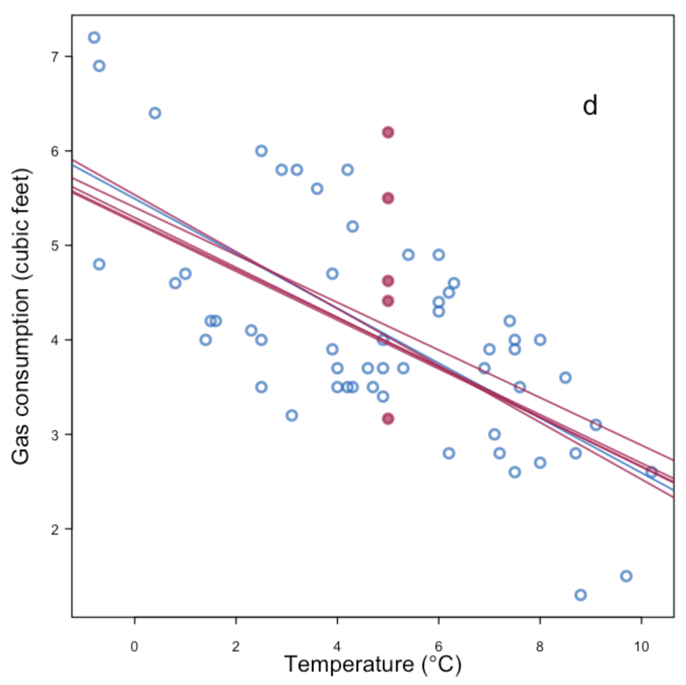
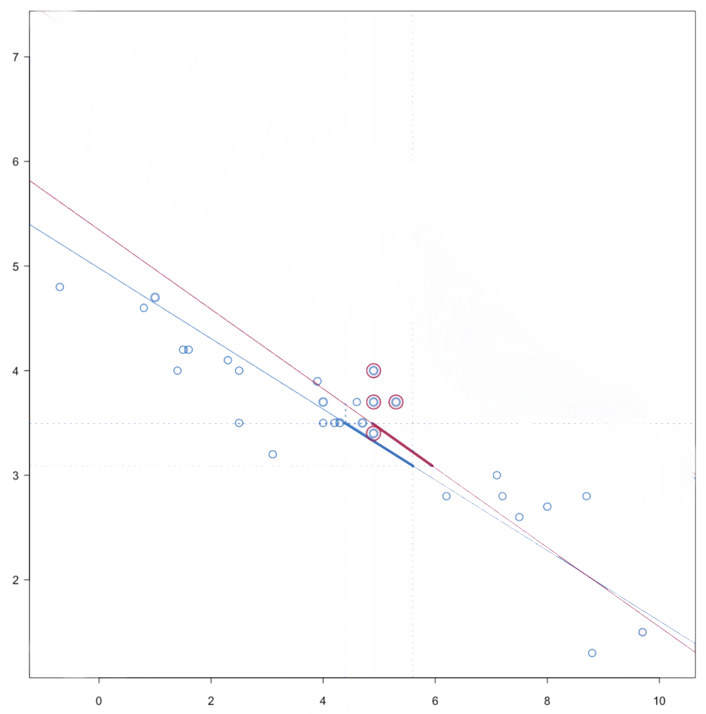
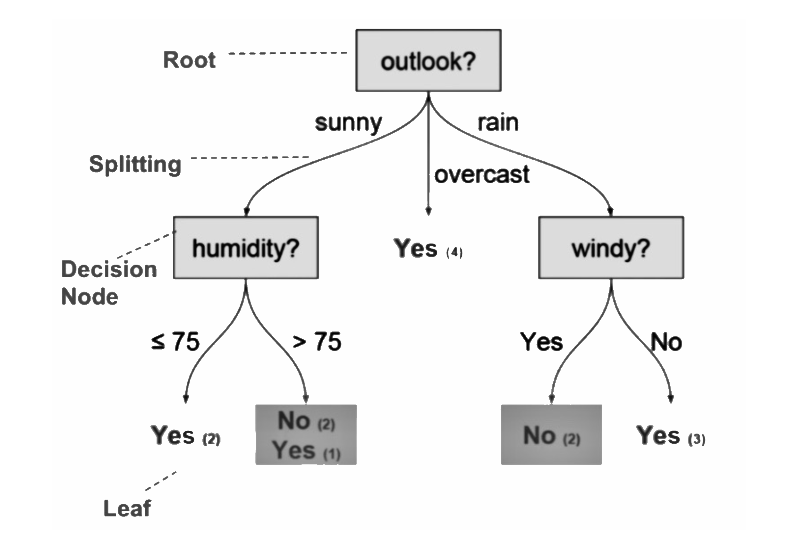
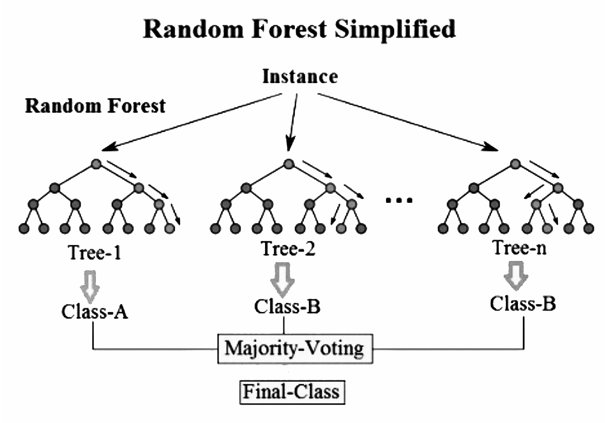

 

```{r setup, include=FALSE, echo = FALSE,message = FALSE, error = FALSE, warning = FALSE}
knitr::opts_chunk$set(echo = TRUE)

# <!-- ---------------------------------------------------------------------- -->
# <!--                    1. load the required packages                       -->
# <!-- ---------------------------------------------------------------------- --> 

# if(!require(psych)){install.packages("psych")}

packages<-c("tidyverse", "kableExtra", "gtsummary",
            "Hmisc","htmltools","clinUtils","sjPlot",
            "lme4","lattice","minqa","nlme","lmerTest")
ipak <- function(pkg){
  new.pkg <- pkg[!(pkg %in% installed.packages()[, "Package"])]
  if (length(new.pkg)) 
    install.packages(new.pkg, dependencies = TRUE)
  sapply(pkg, require, character.only = TRUE)
}
ipak(packages)
 

# <!-- ---------------------------------------------------------------------- -->
# <!--                        2. Basic system settings                        -->
# <!-- ---------------------------------------------------------------------- -->
setwd(dirname(rstudioapi::getSourceEditorContext()$path))
getwd()
Sys.setlocale("LC_ALL","English")

# convert backslash to forward slash in R
# gsub('"', "", gsub("\\\\", "/", readClipboard()))

## get the path
# rstudioapi::getSourceEditorContext()$path
# dirname(rstudioapi::getSourceEditorContext()$path)

## set working directory
# getwd()
# setwd("c:/Users/zbai/Desktop")
# Sys.setlocale("LC_ALL","English")

## get the R Version
# paste(R.Version()[c("major", "minor")], collapse = ".")

## convert backslash to forward slash 
# scan("clipboard",what="string")
# gsub('"', "", gsub("\\\\", "/", readClipboard())) 

# Load all r functions
# The directory where all source code files are saved.
source_code_dir <- "C:/Users/baiz/Downloads/Data-Analyst-with-R/Function/ZB Function/"  
file_path_vec <- list.files(source_code_dir, full.names = T)
for(f_path in file_path_vec){source(f_path)}

# <!-- ---------------------------------------------------------------------- -->
# <!--                         3. Import the datasets                         -->
# <!-- ---------------------------------------------------------------------- -->

# <!-- ---------------------------- -->
# <!-- --3.1 Import csv data ------ -->
# <!-- ---------------------------- -->

# pfad <- "~/Desktop/SASUniversityEdition/myfolders/Daten"
# mydata1 <- read.csv(file.path(pfad, "yourcsv_data.csv"), 
#                     sep=";", 
#                     header=TRUE)   

# Import all csv data from folder
# list_csv_files <- list.files(path = "./csvfolder/")
# do.call(rbind, lapply(list_csv_files, function(x) read.csv(x, stringsAsFactors = FALSE)))

# <!-- ---------------------------- -->
# <!-- --3.2 Import xlsx data ----- -->
# <!-- ---------------------------- -->

# library(readxl)
# mydata2 <- read_excel("C:/Users/zbai/Documents/GitHub/R-Projects/SAS/Yimeng/results-text.xlsx")

# <!-- ---------------------------- -->
# <!-- --3.3 Import sas7dbat data - -->
# <!-- ---------------------------- -->

# library(sas7bdat)
# mydata3 <- read.sas7bdat("~/Desktop/SASUniversityEdition/myfolders/Daten/uis.sas7bdat")

# Import all sas7dbat data from SASfolder
# ZB.import.sas.folder("./SASfolder/")

# <!-- ---------------------------- -->
# <!-- --3.4 Import from copyboard --->
# <!-- ---------------------------- -->
# copdat <- read.delim("clipboard")
# Data_D01 <- copdat

# <!-- ---------------------------------------------------------------------- -->
# <!--                           4. Some Tools                                -->
# <!-- ---------------------------------------------------------------------- -->

# To check out vignettes for one specific package
# browseVignettes("sjPlot")      # sjPlot for Models Summary
# browseVignettes("kableExtra")
# browseVignettes("gtsummary")
# <!-- ---------------------------------------------------------------------- -->
```


<!-- ----------------------------------------- -->
<!-- -----------Mind Map of ToC--------------- -->
<!-- ----------------------------------------- -->


<!-- ----------------------------------------- -->
<!-- --------------CSS Define----------------- -->
<!-- ----------------------------------------- -->
<style>
.bold-list-257f96 + ol {
    font-weight: 900;
    color: #257f96;
}
.bold-list-ff9900 + ol {
    font-weight: 900;
    color: #ff9900;
}
</style>
<!-- ----------------------------------------- -->


# Multiple Imputation 

## Introduction 
 
### MI Attributes {-}
 
**MI is model-based**. It ensures statistical transparency and integrity of the imputation process. To ensure robustness in analysis, the imputation model should be broader than the analysis models that will be analyzed using the imputed data (see Section 2.2). The model that underlies the imputation process is often an explicit distributional model (e.g., multivariate normal), but good results may also be obtained using techniques where the imputation model is implicit (e.g., nearest neighbor imputation).

**MI is stochastic**. It imputes missing values based on draws of the model parameters and error terms from the predictive distribution of the missing data, $Y_{\text {mis. }}$. For example, in linear regression imputation of the missing values of a continuous variable, the conditional predictive distribution may be:
$\hat{Y}_{k, m i s}=\hat{\beta}_0+\hat{\beta}_{j \neq k} \cdot y_{j \neq k}+e_k$. In forming the imputed values of $y_{k, \text { mis }}$, the individual predictions incorporate multivariate draws of the $\hat{\beta}$ s and independent draws of $e_k$ from their respective estimated distributions. In a hot deck, predictive mean, or propensity score matching imputation, the donor value for $y_{k, \text { mis }}$ is drawn at random from observed values in the same hot deck cell or in a matched "neighborhood" of the missing data case.

**MI is multivariate**. It preserves not only the observed distributional properties of each single variable but also the associations among the many variables that may be included in the imputation model. It is important to note that under the assumption that the data are missing at random (MAR), the multivariate relationships that are preserved are those relationships that are reflected in the observed data, $Y_{o b s .}$

**MI employs multiple independent repetitions** of the imputation procedure that permit the estimation of the uncertainty (the variance) in parameter estimates that is attributable to imputing missing values. This is variability that is in addition to the recognized variability in the underlying data and the variability due to sampling.

**MI is robust against minor departures from strict theoretical assumptions**. No imputation model or procedure will ever exactly match the true distributional assumptions for the underlying random variables, $Y$, nor the assumed missing data mechanism. Empirical research has demonstrated that if the more demanding theoretical assumptions underlying MI must be relaxed that applications to data can produce estimates and inferences that remain valid and robust (Herzog and Rubin 1983).


**Theoretical Foundation and SAS Implementation**: - **Bayesian Framework:** MI fundamentally relies on the Bayesian framework, where imputations are considered random draws from the posterior predictive distribution of the missing data, conditioned on the observed data and a set of parameters.


### MAR Assumption in MI {-}
 
- **MAR (Missing At Random)**: This assumption posits that the missingness of the data is related to the observed data but not to the values of the data that are missing. In simpler terms, after accounting for the observed data, the missingness is random and does not depend on unobserved data.
- **Usage in MI**: Under MAR, MI assumes that any systematic differences between missing and observed values can be explained by the observed data. Thus, if the model correctly incorporates all variables that influence the propensity for missing data, the imputations should be unbiased.
- **MNAR**: MI is not limited to MAR situations. It can also be employed under Missing Not At Random (MNAR) assumptions, where missingness depends on unobserved data. MI can incorporate techniques like pattern-mixture models, which are particularly useful in MNAR contexts to model the different missing data mechanisms explicitly.
- **Sensitivity Analysis**: MI allows for the testing of various scenarios under which the missingness mechanism might operate, providing a robust tool for understanding the potential biases introduced by different types of missing data.
- **Choosing Variables**: When implementing MI, selecting appropriate ancillary variables is crucial. These choices can be made prospectively (based on prior knowledge about the data and subject matter considerations) or retrospectively (based on observed patterns in the data).

**Comparing MI with MMRM**

- **Similar Base Assumptions**: Both MI and MMRM operate under the MAR framework. They assume that once we account for the observed data, the reasons for the missing data are effectively random and not dependent on unknown factors.
- **Flexibility in Model Specification**:
  - **MMRM**: Uses all available data and incorporates assumptions about the missingness directly into its model. It’s typically used for analyzing data from clinical trials where the interest is in the change from baseline and where missing data occur in longitudinal measurements.
  - **MI**: Unlike MMRM, MI can include ancillary or auxiliary variables in the imputation model. These are variables that might correlate with the likelihood of missing data but do not necessarily correlate with the outcome variable. This inclusion can enhance the quality of the imputations and allow for sensitivity analyses regarding the missingness assumptions.
  
### MI and Maximum Likelihood (ML) {-}

Multiple Imputation (MI) and Maximum Likelihood (ML) methods are both powerful statistical techniques used to handle missing data, but they differ significantly in their approaches and underlying assumptions. 
 
**Maximum Likelihood Estimation (ML)**

1. **Approach and Methodology**:
   - ML methods involve constructing a log-likelihood function based on the assumed probability distribution that best describes the observed data.
   - By maximizing this function, ML estimates the parameters that are most likely to have generated the observed data.
   - Inference, such as hypothesis testing or estimation of effects, is performed using these parameter estimates, which represent the best single set of values under the model assumptions.

2. **Handling of Missing Data**:
   - In the context of longitudinal data, such as with a Mixed Model for Repeated Measures (MMRM), ML methods use all available data, including data from subjects with missing values at some time points.
   - ML does not impute missing data but instead leverages the longitudinal relationships and covariances between observed data points across time to inform the estimates.
   - This allows for inferences about the overall mean effects, integrating information from incomplete cases without the need for imputation.

3. **Estimation Focus**:
   - ML produces a single set of parameter estimates and standard errors, reflecting the most probable state of the underlying population given the model and the data.


**Multiple Imputation (MI)**

1. **Approach and Methodology**:
   - MI explicitly handles missing data by creating multiple imputations or predicted values for missing entries.
   - This is achieved by estimating an imputation model that includes the primary outcome and relevant covariates, reflecting how these variables interact in the observed data.

2. **Handling of Missing Data**:
   - MI fills in missing data points by predicting values based on the relationships identified in the imputation model.
   - Unlike ML, MI does not rely on a single set of parameter estimates. Instead, it generates multiple datasets by drawing repeatedly from the posterior distribution of the imputation model's parameters.

3. **Estimation Focus**:
   - MI acknowledges the uncertainty in the estimates of the parameters themselves by using multiple sets of imputations. Each set of imputed data is analyzed separately, and the results are then combined to provide overall estimates and standard errors.
   - This process not only fills in missing data but also incorporates the variability of the parameter estimates into the final analysis, providing a more robust measure of uncertainty.

**Key Differences**

- **Imputation vs. Direct Analysis**: ML directly analyzes the available data using all observed values and the relationships among them, without imputing missing data. In contrast, MI explicitly imputes missing values using a model-based approach and then analyzes each complete dataset.
- **Uncertainty and Variability**: ML estimates focus on obtaining the most likely parameter values and their variability from a single model. MI, however, considers multiple potential outcomes and the inherent uncertainty in the parameters themselves, reflecting a broader spectrum of possibilities that could have led to the observed data.
- **Final Inference**: MI provides a way to account for the uncertainty in predicting missing values by averaging over multiple plausible data completions, which can potentially lead to more accurate and credible inference, especially when the pattern of missing data is complex.
   
## MI Algorithms 

The general three-step process for handling missing data using Multiple Imputation (MI) in statistical analyses is crucial for maintaining the integrity and robustness of study findings when complete data are not available. Each step is integral to ensuring that the imputed results are as reliable and accurate as possible. Here's an expanded explanation of each step involved in the MI process:

**Step 1: Imputation**

**Objective:** The goal here is to replace missing data with plausible values based on the observed data. This step involves creating multiple complete datasets to reflect the uncertainty about the right value to impute.

**Methods:**
- **Continuous vs. Categorical Data:** The approach to imputation may differ based on whether the missing values are for continuous or categorical variables.
- **Imputation Model:** This model includes the variables that will help predict the missing values effectively. Choosing the right predictors and the form of the relationship (e.g., linear, logistic) is critical.
- **Multiple Datasets:** Typically, M different complete datasets are created (where M could be 5, 10, 20, etc.), each representing a different plausible scenario of what the missing data could have been.

**Step 2: Analysis**

**Objective:** Each of the M completed datasets is analyzed independently using the statistical methods appropriate for the study design and research questions.

**Process:**
- **Independent Analyses:** The same statistical method is applied separately to each imputed dataset. This could be ANCOVA, regression analysis, or any other method suitable for the complete data.
- **Replication of Standard Procedures:** The method chosen is the one that would have been used if the dataset had no missing values, ensuring that the analysis aligns with standard scientific inquiry practices.

**Step 3: Pooling**

**Objective:** The results from the M separate analyses are combined to produce a single result that accounts for the uncertainty in the imputed values.

**Methods:**
- **Pooling Results:** Techniques like Rubin’s Rules are used to combine the results. This involves calculating the overall estimates (e.g., means, regression coefficients), their variances, and confidence intervals from the separate analyses.
- **Final Inference:** The pooled results are used to make statistical inferences. This step ensures that the variability between the multiple imputations is incorporated into the final estimates, providing a comprehensive assessment of the results.


## Imputation Model vs Analysis Model

The distinction between the imputation and analysis models in the context of multiple imputation (MI) is a crucial aspect of handling missing data effectively while maintaining the integrity of statistical analyses. This differentiation allows for a more nuanced approach to modeling data, whereby different sets of variables can be utilized during the imputation and analysis phases to best reflect their relevance and relationships within the dataset.

One of the strengths of MI is that the imputation and analysis models operate independently:

- **Separate Models:** Variables included in the imputation model do not need to be included in the analysis model. This separation allows for the inclusion of variables in the imputation phase that are necessary for accurately predicting missing values but may dilute or confuse the analysis of treatment effects if included in the analysis model.
- **Flexibility in Analysis:** After the imputation phase, the analysis can proceed as if the data were originally complete, using the most appropriate statistical methods for the study objectives without the constraint of accommodating all variables used in the imputation model.

### Imputation Model {-}

The **imputation model** in the context of multiple imputation (MI) is a statistical framework designed to predict missing values in a dataset. This model is crucial for handling missing data effectively, ensuring that the subsequent analyses are robust and reliable.  The primary goal of the imputation model is to generate plausible values for missing data points in a dataset. These values are not meant to be exact predictions but rather plausible substitutes that reflect the uncertainty inherent in predicting missing data.

The imputation model is constructed to predict missing values accurately, based on the available data and assumptions about the mechanism of missingness. Key considerations for building an effective imputation model include:

- **Inclusion of Variables:** Variables that explain the mechanism of missingness or are highly correlated with variables having missing values should be included. This helps in accurately estimating the missing values by leveraging all relevant information that could influence or explain the missingness.
- **Complexity and Appropriateness:** The imputation model can be more complex than the analysis model, incorporating additional variables that may not be directly related to the primary outcomes of interest but are instrumental in accounting for the pattern and nature of the missing data.


**Components of the Imputation Model**

1. **Predictive Variables:** 
   - The imputation model includes variables that are known (observed) that can help predict the missing values. These variables may be directly related to the outcome or may be correlates of the missing values.
   - Variables that influence the probability of missingness should also be included to adhere to the Missing At Random (MAR) assumption, where missingness can be explained by the observed data.

2. **Statistical Methods:** 
   - Depending on the nature of the missing data (continuous, binary, categorical), different statistical methods are used. Common approaches include linear regression for continuous data, logistic regression for binary data, and multinomial logistic regression or other categorical data techniques for multi-category variables.

3. **Distribution Assumptions:**
   - The imputation model assumes a distribution for the missing data based on the type of data and the observed patterns. For continuous data, a normal distribution might be assumed; for binary or categorical data, a binomial or multinomial distribution might be appropriate.

**Construction of the Imputation Model**

1. **Variable Selection:**
   - Selecting the right variables for the imputation model is crucial. This includes both predictors of the missing values and variables that explain the mechanism of missingness.
   - Ancillary variables, which might not be of interest in the analysis model but can predict the missing values effectively, are also included.

2. **Model Specification:**
   - The relationships between predictors and the missing variable are specified based on theoretical knowledge or exploratory data analysis.
   - Interactions and non-linear effects can be included if they are believed to impact the missing values significantly.

3. **Parameter Estimation:**
   - Parameters of the imputation model are estimated using available (complete) data. This step often involves fitting the specified model to the observed data to understand the relationships between variables.

### Analysis/Substantive Model {-}

The **analysis model** in the context of multiple imputation (MI) plays a critical role after the completion of the imputation process. This model is used to analyze the datasets that have been made complete through the imputation of missing values.  The primary goal of the analysis model is to conduct statistical analyses on the completed datasets provided by the imputation model. It aims to draw inferences or test hypotheses about the underlying data, focusing on the relationships and effects that are of primary interest in the research study.

The analysis model, also known as the substantive model, is used to analyze the imputed datasets. This model:

- **Focuses on Main Objectives:** It includes variables that are directly relevant to the primary objectives of the study. It does not necessarily include all the variables used in the imputation model, especially those included solely for the purpose of accurately imputing missing values.
- **Simplicity and Relevance:** While the analysis model may be simpler than the imputation model, it focuses on variables that are crucial for the analysis and interpretation of the primary outcomes of the study.


**Components of the Analysis Model**

1. **Variables Included**:
   - The analysis model includes the main variables of interest—those directly related to the research questions or hypotheses being tested.
   - Unlike the imputation model, the analysis model does not necessarily include all the variables used in the imputation process, especially those included solely to account for the pattern of missingness.

2. **Statistical Techniques**:
   - The choice of statistical techniques depends on the research objectives, the nature of the data, and the specific hypotheses being tested. Common techniques include regression analysis (linear, logistic, Cox proportional hazards), ANOVA, ANCOVA, and more sophisticated models like structural equation modeling or mixed-effects models.
   - Each technique is chosen based on its suitability to address the specific structure and needs of the data as well as the study design.

3. **Model Specification**:
   - This involves defining the functional form of the model, including the selection of interaction terms, polynomial terms, and other transformations of the variables if needed.
   - The specification should align with theoretical expectations and empirical evidence about the relationships between variables.

**Construction of the Analysis Model**

1. **Variable Selection**:
   - Critical variables are selected based on their relevance to the study objectives. This includes outcome variables, key predictors, control variables, and potential confounders.
   - The model should focus on variables hypothesized to have significant effects or relationships within the study’s framework.

2. **Model Fitting**:
   - The model is fitted to each of the imputed datasets separately. This process involves estimating the parameters of the model using standard statistical procedures that would be appropriate if the data were completely observed.
   - Techniques such as maximum likelihood estimation, least squares, or others appropriate for the data type and analysis method are used.

**Role in Multiple Imputation**

- **Independent Analyses**: Each of the M imputed datasets is analyzed independently using the same analysis model. This step is crucial as it treats each imputed dataset as a valid realization of the complete data, reflecting different plausible scenarios of the missing data.
- **Pooling Results**: After analyzing each dataset, results (e.g., coefficients, standard errors, p-values) are pooled using techniques such as Rubin’s Rules to generate single inference statistics. This pooling accounts for both within-imputation and between-imputation variability, providing a comprehensive assessment of the uncertainty due to missing data.

## Proper Imputation and Compatibility {-}

For imputations to be considered proper, they must meet certain criteria:

- **Bayesian Posterior Distribution:** Imputations should ideally be drawn following the Bayesian paradigm, using a posterior distribution of the missing values that reflects an accurate and comprehensive model of the data and missingness mechanism.
- **Model Compatibility:** While the imputation and analysis models are independent, they must be compatible in the sense that the imputation model adequately captures the relationships necessary to make accurate imputations for variables analyzed in the substantive model.
- **Unbiased Estimation:** Both compatibility and congeniality are essential for ensuring that the parameter estimates and inferences from the substantive model are unbiased and valid.
- **Challenges:** Categorical variables, interactions, and non-linear terms can complicate the compatibility and congeniality between models. For instance, logistic regression for binary outcomes or proportional odds models for ordinal outcomes may not align perfectly with linear analysis models.
- **Solutions:** Predictive mean matching (PMM) is often used as a compromise technique, especially when the linear assumptions of the Bayesian model used in the imputation are not perfectly congenial with the substantive model. PMM involves using observed values as donors for imputation, which helps mitigate issues arising from non-congenial imputation models.

### Details {-}

The concepts of compatibility and congeniality introduced in this section refer to the connection between the imputation model and the analysis model (substantive model), they may be beneficial for unbiased estimation in the substantive model (White et al., 2009; Burgess et al., 2013).

The imputation model and substantive model are considered compatible, if

* 1. **there exists a joint model (e.g. multivariate normal distribution) for a set of density functions ($f_1, f_2, ..., f_n$), and from the joint model the imputations could be drawn,**
* 2. **the imputation model and the substantive model can be expressed as conditional models of the joint model (Liu et al., 2013).**

For example, if a joint bivariate normal model $g(x,y|\theta), \theta \in \Theta$ exists, the imputation model to impute $X$ is $f(x|y,\omega),\omega \in \Omega$, and the substantive model is $f(y|x,\phi),\phi \in \Phi$, with the surjective function $f_1:\Theta \rightarrow \Omega$ and $f_2:\Theta \rightarrow \Phi$. The imputation model is compatible with the substantive models, if the two conditional densities $f(x|y,\omega)$ and $f(y|x,\phi)$ use the given densities from the joint model as its conditional density, which means $f(x|y,\omega) = g(x|y,\theta)$ and $f(y|x,\phi) = g(y|x,\theta)$ (Morris et al., 2015).

Compatibility affects the FCS effectiveness (Fully Conditional Specification is also called MICE, detailed introduction in Section 3.5), and it may benefit unbiased parameter estimation. However, the conditional normality of dependent variables $X$ with homoscedasticity is insufficient to justify the linear imputation model for the predictor variable $y$, when only $y$ has missing observations (Morris et al., 2015). The imputation model and the real substantive model may be incompatible when the linear imputation model is assumed for $y$, as a consequence, the imputation model may be misspecified. Furthermore, the compatibility in MICE is easily broken by the categorical variables, interactions, or non-linear terms in the imputation model, which results in the implicitly joint distribution or even not exist. Although parameter estimation may be biased in the substantive model under incompatibility, incompatibility between the analysis model and the imputation model only slightly impacted the final inferences if the imputation model is well specified (Van Buuren, 2012).

In addition to compatibility, there is another important consideration "Congeniality" in multiple imputation presented by Meng (1994), which appoints the required relationship between the analysis model and the imputation model. Congeniality is, essentially, a special case of compatibility, the joint model is the Bayesian joint model $f$. The analysis model and the imputation congenial is congenial if

* 1. **for incomplete data, mean estimates using the imputation model are asymptotically equal to the posterior predictive mean using the joint model $f$ given missing data, and the associated variance estimates using the imputation model are asymptotically equal to the posterior predictive variance using the joint model $f$ given missing data;**
* 2. **for observed data, mean estimates using the analysis model are asymptotically equal to the posterior mean from the joint model $f$, and the associated variance estimates using the analysis model are asymptotically equal to the posterior variance from the joint model $f$ (Burgess et al., 2013). **


<!-- An important consideration for a multiple imputation analysis is the congeniality of the models used in imputation and analysis of data. Imputation and analysis models are compatible if a joint model exists under which both models are conditionals [18]. The concept of congeniality, introduced by Meng [13] in the context of multiple imputation, states that as follows: (i) given complete data, the analysis model asymptotically gives the same mean and variance estimates as the posterior mean and variance from a Bayesian joint model, and (ii) given incomplete data, the imputation model gives the same posterior predictive distribution for missing values as the Bayesian joint model. Congeniality is similar to compatibility in a non-Bayesian context with the regularity condition that the priors in the Bayesian model are nonzero over the entire parameter space. -->


If the interaction terms and non-linear relationships do not exist in the imputation model, and the variables are continuous, each univariate imputation model specified as Bayesian linear regression is congenital to the substantive model. Under these circumstances, imputations for variables with missingness are derived independently from the conditional posterior predictive distribution given other variables, and the multiple imputation variance estimates are consistent (Murray, 2018). However, when categorical variables are also included in the imputation model, the analysis model and the imputation model are not congenial, because the relationship between categorical variables and outcome given other variables cannot be linear or log-linear.

Alternatively, there are two ways to deal with categorical variables. By default, logistic regression is specified as the imputation model in $R$ package $mice$ for binary variables and proportional odds model for ordered categorical variables. Notwithstanding, the imputation model using the logistic regression model or proportional odds model is not congenital to the analysis models. As another option, predictive mean matching (PMM) may be an option for the imputation model. Although PMM is not congenital, the first step of PMM is based on a congenital Bayesian linear model, and the missing data are imputed using the observed donors, which also avoids meaningless imputed values. PMM is a compromise method, because the Bayesian linear regression is actually used first, and then in the next step it adjusts the imputed values from the observed values instead of directly drawing from the linear regression.

### Compatibility {-}

Compatibility refers to the relationship between the imputation model and the substantive (analysis) model, ensuring that both models can logically coexist within a single, unified statistical framework.
 
1. **Joint Model Existence:**
   - Compatibility requires that there exists a joint statistical model covering all variables involved in both the imputation and analysis models. This joint model should be able to generate the imputations as well as serve the analytical needs of the substantive model.
   - For instance, if a joint bivariate normal model is assumed for variables \(X\) and \(Y\), then the imputation for \(X\) can be conducted using the conditional model \(f(x|y,\omega)\) and the substantive analysis of \(Y\) using \(f(y|x,\phi)\), provided these conditionals are derived from the joint distribution.

2. **Conditional Model Expression:**
   - Both the imputation and substantive models should be expressible as conditional models stemming from the joint model. This ensures that the imputations are not only appropriate for the missing data but also suitable for the analyses that follow.
   
 
### Congeniality {-}

Congeniality, a related but distinct concept, deals with the alignment between the imputation and analysis models, specifically in terms of their ability to produce consistent statistical inferences.
 
1. **Asymptotic Agreement:**
   - For incomplete data, the mean and variance estimates using the imputation model should asymptotically align with those from the posterior predictive mean and variance using the joint model, given the missing data.
   - For observed data, the analysis model should yield mean and variance estimates that asymptotically agree with the posterior estimates derived from the joint model.

2. **Practical Implications:**
   - Congeniality ensures that the imputation method does not introduce biases that could affect the estimates and conclusions drawn from the analysis model.
   - It is particularly important when dealing with complex data structures where different types of variables (continuous, categorical) and relationships (linear, non-linear) are present.
  
  
# Imputation Phase   
   
## Missing patterns: Monotone and non-monotone

Understanding the patterns of missing data—specifically monotone and non-monotone missingness—is crucial for selecting the appropriate imputation methods and ensuring that the imputation process aligns with the structure of the dataset. 

```{r, echo=FALSE, fig.align="center", out.width = '75%',fig.cap="Figure: SAS PROC MI Imputation Methods"}
knitr::include_graphics("./02_Plots/MI/MI_SASMI_Methods.png")
```

**For Monotone Missingness**

A **monotone missing pattern** occurs when the missing data for any subject follow a sequential order such that once data are missing, all subsequent measurements for that subject are also missing. This pattern often occurs in longitudinal studies where participants drop out and no further data are collected for them.

Characteristics:

- **Sequential Dropouts:** Once a participant fails to provide data at a time point, all subsequent data from that participant are missing.
- **Imputation Simplicity:** Monotone missingness simplifies the imputation process because the missing data can be imputed sequentially using methods that take advantage of the ordered structure.


**For Non-Monotone Missingness**

A **non-monotone missing pattern** is more complex and occurs when missing data do not follow a sequential pattern. Participants might miss certain visits but return for later assessments, leading to gaps in the data that are not necessarily followed by continuous missing data points.

Characteristics:

- **Intermittent Missing Data:** Participants may miss some assessments but return for later ones, creating a non-sequential pattern of missing data.
- **Imputation Complexity:** This pattern complicates the imputation process because the missing data cannot be handled sequentially. More complex imputation methods are needed to adequately address the random gaps.


**Methods for Addressing Different Missing Patterns**

- **Monotone Missingness:** For datasets with a monotone pattern, methods like last observation carried forward, next observation carried backward, or even simpler forms of single imputation or regression imputation can be effectively employed. These methods can sequentially address the missing data from the point of dropout to the end of the dataset.
- **Non-Monotone Missingness:** For non-monotone patterns, more sophisticated methods such as multiple imputation using chained equations (MICE), which can handle arbitrary patterns of missingness, are appropriate. MICE performs multiple imputations by specifying a series of regression models conditional on the rest of the variables in the dataset, thus accommodating the complexity of non-monotone missingness.


## How do we get multiple imputations?

To understand how multiple imputations are generated in practice, it's helpful to explore the Bayesian statistical framework that underpins the process. The method essentially involves two primary steps: drawing parameter samples from their posterior distributions and then using these parameters to predict missing values. Here’s a detailed step-by-step explanation of how multiple imputations are generated:

**Step 1: Estimation of the Imputation Model Parameters**

1. **Model Specification**:
   - First, specify an imputation model \( P_{\text{imp}}(Y | X, \theta) \), where \( Y \) represents the variable with missing data, \( X \) represents the observed covariates, and \( \theta \) represents the parameters of the model.

2. **Bayesian Framework**:
   - In a Bayesian context, you assume a prior distribution for the parameters \( \theta \). This prior could be informative (based on previous studies or expert knowledge) or non-informative (flat priors, which do not weight any outcome more than others).

3. **Posterior Distribution**:
   - Using the observed data, update the prior distribution of \( \theta \) to obtain the posterior distribution \( p(\theta | X, Y_{\text{obs}}) \). This updating is done via Bayes’ Rule, which combines the likelihood of observing the data given the parameters with the prior distribution of the parameters.

**Step 2: Generating Multiple Imputations**

1. **Drawing Parameter Samples**:
   - From the posterior distribution \( p(\theta | X, Y_{\text{obs}}) \), draw multiple sets of parameter samples. Each set of parameters, denoted \( \theta^*_m \) (where \( m = 1, \ldots, M \)), represents a possible realization of the model parameters given the data and the prior knowledge.

2. **Predicting Missing Values**:
   - For each drawn set of parameters \( \theta^*_m \), use the imputation model \( P_{\text{imp}}(Y | X, \theta^*_m) \) to predict the missing values in \( Y \). This step involves generating values of \( Y \) that are consistent with the observed data \( X \) and the drawn parameters \( \theta^*_m \).

3. **Creating Completed Datasets**:
   - Each set of predictions for \( Y \) (using a different \( \theta^*_m \)) results in a different "completed" dataset. If you draw \( M \) different samples of \( \theta \), you will end up with \( M \) imputed datasets. Each dataset represents a plausible scenario of what the complete data might look like, reflecting both the uncertainty in the parameters and the model's predictions.


## Sequential Univariate versus Joint Multivariate Imputation

The discussion of sequential univariate versus joint multivariate imputation strategies provides insight into how to handle different patterns of missing data, especially when considering the complexity of the missingness and the types of variables involved. 

### Sequential Univariate Imputation (Often Used in Monotone Missingness) {-}

**Overview:**
- Sequential univariate imputation is applied when the missingness pattern is monotone, meaning once a subject begins missing data, all subsequent data points for that subject are also missing.
- This method assumes conditional independence between variables, allowing the joint distribution to be approximated through a series of univariate models.

**Process:**

1. **Model Construction:** Univariate models are built one at a time. Each variable \(Y_j\) is modeled based on all previous variables in a specified order that aligns with the monotone missing pattern.
2. **Parameter Sampling:** Parameters for each univariate model are drawn from their Bayesian posterior distributions.
3. **Data Imputation:** Missing values for each variable \(Y_j\) are imputed sequentially, using the sampled parameters and all previously observed or imputed variables as predictors.


**Detailed Process of Sequential Univariate Imputation**

1. **Ordering the Variables**: 
   - Assume variables \(X_1, X_2, \ldots, X_S\) and \(Y_1, Y_2, \ldots, Y_J\), where \(X_i\) are fully observed covariates and \(Y_j\) are variables with missing data.
   - The variables are ordered such that the earlier in the sequence a variable appears, the fewer missing values it has.

2. **Modeling Each Variable**:
   - For each variable \(Y_j\) that has missing values, a univariate model is constructed using all previously ordered variables as predictors. This includes both \(X\) variables and any \(Y\) variables that have been previously imputed.
   
   \[ \theta^{(m)}_j \sim P(\theta_j | x_1, \ldots, x_S, y_1^{\text{obs}}, \ldots, y_{j-1}^{\text{obs}}, y_j^{\text{obs}}) \]
   
   Here, \(\theta^{(m)}_j\) represents the parameters of the imputation model for \(Y_j\) drawn from the Bayesian posterior given the observed data up to \(Y_{j-1}\).

3. **Imputation of Missing Values**:
   - Once the parameters \(\theta^{(m)}_j\) are drawn, missing values of \(Y_j\) are imputed using the predictive distribution conditioned on the drawn parameters and all available predictors (both observed and previously imputed).
   
   \[ y^{(m)}_j(\text{imp}) \sim P(Y_j | \theta^{(m)}_j, x_1, \ldots, x_S, y^{(m)}_1(\text{obs+imp}), \ldots, y^{(m)}_{j-1}(\text{obs+imp})) \]

   In this formula:
   - \(y_j(\text{obs})\) are the observed values of \(Y_j\),
   - \(y^{(m)}_j(\text{obs+imp})\) represents the combination of observed and previously imputed values for \(Y_j\),
   - \(y^{(m)}_j(\text{imp})\) are the new imputed values for \(Y_j\).

4. **Sequential Progression**:
   - This process is repeated for each variable \(Y_j\) from \(j = 1\) to \(J\), where each step incorporates all previous imputations and observations. Each variable \(Y_j\) is imputed based on the assumption that all variables before it, in the sequence, either have no missing values or have been already imputed.


**Advantages:**
- **Simplicity**: The method is computationally straightforward as it breaks down a potentially complex multivariate imputation into simpler, manageable univariate imputations.
- **Flexibility**: Different types of regression models can be used depending on the nature of the variable being imputed (e.g., linear regression for continuous variables, logistic regression for binary variables).

**Limitations:**
- **Dependency on Order**: The quality of imputations depends heavily on the ordering of variables, which may not always be clear or optimal.
- **Assumption of Conditional Independence**: The method assumes that the conditional distributions adequately capture the relationships among variables, which might not hold in more complex datasets.


### Joint Multivariate Imputation (Used for Non-Monotone Missingness) {-}

Joint multivariate imputation treats the entire set of variables in a dataset as part of a single, cohesive statistical model. Unlike sequential univariate imputation, which imputes one variable at a time using only the previously imputed or observed variables as predictors, joint multivariate imputation simultaneously considers all variables to capture the complex interdependencies among them.

**Overview:**
- Joint multivariate imputation addresses more complex non-monotone missingness patterns, where missing data can occur at any point in a subject’s record.
- This approach typically utilizes a model that captures the joint distribution of all variables involved, facilitating the simultaneous imputation of all missing values.

**Mathematical Formulation**

Assume a dataset with variables \(X_1, X_2, \ldots, X_p\) where any of these variables can have missing entries. The goal is to estimate the joint distribution:

\[ P(X_1, X_2, \ldots, X_p | \theta) \]

where \(\theta\) represents the parameters of the joint distribution model. This model could assume a specific form, such as a multivariate normal distribution, especially when dealing with continuous variables:

\[ \mathbf{X} \sim \mathcal{N}(\boldsymbol{\mu}, \boldsymbol{\Sigma}) \]

where \(\boldsymbol{\mu}\) is the mean vector and \(\boldsymbol{\Sigma}\) is the covariance matrix of the distribution.


**Process:**
1. **Model Specification**:
   - Specify a multivariate model that fits the data well. Common choices include the multivariate normal model for continuous data or more complex models like multivariate mixed models that can handle a combination of continuous and categorical data.

2. **Parameter Estimation**:
   - Estimate the parameters of the joint model using available (complete) data. Techniques like Maximum Likelihood Estimation (MLE) or Bayesian estimation methods can be used. In Bayesian settings, priors are specified for \(\theta\), and the posterior distribution \(P(\theta | X_{\text{obs}})\) is computed.

3. **Data Imputation**:
   - Using techniques such as Markov Chain Monte Carlo (MCMC), sample from the joint distribution \(P(X_1, X_2, \ldots, X_p | \theta)\) to generate imputed values for the missing data points. This sampling reflects the correlations and relationships among all variables in the model.
   - Each iteration of the sampling process results in a complete dataset, where missing values are filled based on the joint distribution conditioned on the observed data.

4. **Multiple Imputations**:
   - Repeat the sampling process multiple times to generate multiple imputed datasets. This reflects the uncertainty in the imputations due to the inherent randomness in the missing data and the estimation of \(\theta\).
   

**Advantages:**
- **Comprehensive Handling of Relationships**: This method captures the complete dependency structure among all variables, which is particularly beneficial in datasets where variables are highly interrelated.
- **Flexibility**: It can accommodate various types of data (continuous, ordinal, nominal) by choosing an appropriate joint model.


**Limitations:**
- **Computational Intensity**: Estimating a joint model, especially one involving many variables or complex dependencies, can be computationally intensive and challenging.
- **Assumption Sensitivity**: The performance of the imputation heavily depends on the correctness of the assumed joint model. A poor choice of model can lead to biased and unreliable imputations.


## Methods for Monotone Missing Data Patterns

```{r, echo=FALSE, fig.align="center", out.width = '75%',fig.cap="Figure: Monotone Multivariate Missing Data Pattern"}
knitr::include_graphics("./02_Plots/MI/MI_PatterMonotone2.png")
```

In this example, the sequence of imputations in the monotone pattern therefore begins with imputation of missing values of $Y_3$.

The P-step in the imputation of missing $Y_3$ will utilize the relationship of the observed values of $Y_3$ to the corresponding observed values of $Y_1$ and $Y_2$ to estimate the parameters of the predictive distribution, $\mathrm{p}\left(Y_{3, \text { mis }} \mid Y_1, Y_2, \theta_3\right)$. The predictive distribution and the parameters to be estimated will depend on the variable type for $Y_3$. PROC MI will use either linear regression or predictive mean matching (continuous), logistic regression (binary or ordinal categorical), or the discriminant function method (nominal categorical) to estimate the predictive distribution. For example, if $Y_3$ is a continuous scale variable, the default predictive distribution is the linear regression of $Y_{3, o b s}$ on $Y_1, Y_2$ with parameters, $\theta_3=\{\beta$-the vector of linear regression coefficients, and $\sigma_3^2$ the residual variance\}. To ensure that all sources of variability are reflected in the imputation of $Y_{3, \text { mis }}$, the values of the parameters for the predictive distribution, $\mathrm{p}\left(Y_{3, \text { mis }} \mid Y_1, Y_2, \theta_3\right)$, are randomly drawn from their estimated posterior distribution, $\mathrm{p}\left(\theta_3 \mid Y_1, Y_2\right)$.

**Linear Regression in PROC MI**

* Usage: Default imputation method for continuous variables under monotone or Fully Conditional Specification (FCS) imputation methods.
* Process: Involves regressing observed values of a continuous variable on other more fully observed variables, then using these regression estimates to define the posterior distribution for the model parameters.
* Imputation Steps: Consists of two steps, the Prediction (P) step and the Imputation (I) step, where parameters are drawn from their posterior distribution and missing values are imputed based on these parameters.$$Y_{3^*}=\beta_{0^*}+\beta_{1^*} Y_1+\beta_{2^*} Y_2+z \sigma_{* 3}$$

**Predictive Mean Matching (PMM)**

* For Continuous Variables: An alternative to linear regression in PROC MI for imputing continuous variables.
* Process: Utilizes the initial steps of linear regression to predict values, then defines a neighborhood of similar cases for each missing value. The missing value is imputed by randomly selecting from observed values within this neighborhood.
* Advantage: Ensures that imputed values lie within the range of actual observed values.

**Logistic Regression**

* For Binary or Ordinal Variables: Used to impute binary or ordinal classification variables.
* Methodology: Involves fitting a logistic regression model to the observed values, then using this model to impute missing values based on the probability distribution it defines. $$\operatorname{logit}\left(\mathrm{p}\left(\mathrm{Y}_4=1\right)\right)=\log \left(\frac{\mathrm{p}}{1-\mathrm{p}}\right)=\hat{\beta}_0+\hat{\beta}_1 \mathrm{Y}_1+\hat{\beta}_2 \mathrm{Y}_2+\hat{\beta}_3 \mathrm{Y}_3$$

**Discriminant Function Method**

* For Nominal Classification Variables: Used to impute missing data for variables with nominal category groups.
* Process: Relies on the assumption that covariates are multivariate normal with constant variance-covariance across groups. It employs discriminant analysis to estimate the probability of belonging to each category, which is then used to impute missing values.

**Propensity Score Method**

* PROC MI also offers a propensity score option (Schafer 1999) for performing imputation of missing data. This is a univariate method that was developed for use in very specialized missing data applications.
* Limitation: Does not preserve associations among variables in the imputation model, thus not recommended for applications where multivariate analysis is the ultimate goal.

## Methods for Non-Monotone (Arbitrary) Missing Data Patterns

In such cases of a “messy” pattern of missing data where exact methods do not strictly apply, the authors of multiple imputation software have generally followed one of three general approaches. Each of these three approaches to an arbitrary pattern of missing data are available in PROC MI.

1. The Markov chain Monte Carlo (MCMC) Method: Using an Explicit Multivariate Normal Model and Applying Bayesian Posterior Simulation Methods
2. Transform the Arbitrary Missing Data Pattern to a Monotonic Missing Data Structure
3. FCS, Sequential Regression, and Chained Regressions

```{r, echo=FALSE, fig.align="center", out.width = '75%',fig.cap="Figure: Arbitrary Multivariate Missing Data Pattern"}
knitr::include_graphics("./02_Plots/MI/MI_PatterArbitrary.png")
```


### MCMC Method {-}

MCMC is a statistical method used to estimate the posterior distribution of parameters in cases where the distribution cannot be derived in a closed form, especially with missing data. It is most effective when the underlying data reasonably follows a multivariate normal distribution.

**Underlying Assumptions:**

* Assumes a multivariate normal distribution for the variables.
* Uses a noninformative or Jeffries prior distribution for parameters $\mu$ (mean) and $Σ$ (covariance matrix).

**Algorithm Process:** Involves iterative steps, alternating between Imputation (I-step) and Prediction (P-step).

* I-Step: Draws imputations for missing data based on the current iteration's predictive distribution.
* P-Step: Updates the parameter values for the predictive distribution based on the completed data.
* Convergence: The process aims to converge so that the imputation draws simulate the true joint posterior distribution. There is no exact test for convergence, but several graphical tools in SAS (like trace plots and autocorrelation plots) can help evaluate it. They should ideally show the posterior mean and variance stabilizing as iterations increase.

**Considerations and Recommendations**

* Transformations for Non-normal Data: PROC MI allows specifying transformations for continuous variables that are not normally distributed.
* Data Type Assumptions: The MCMC method assumes that the variables follow a multivariate normal distribution, which may not be suitable for highly skewed or non-normal continuous variables. 
* Mixed Data Types: For mixed data types, PROC MI allows imputing and then applying post-imputation rounding, although this is not recommended for classification variables. With the availability of FCS methods, it is advised to use methods directly appropriate for the variable type.

### Transforming to Monotonic Missing Data Structure {-}

1. Initial Step: Use simple imputation methods or an MCMC posterior simulation approach to fill in missing values for variables with very low rates of item missing data.
2. Sequential Imputation for Remaining Missing Values: After transforming to a monotonic pattern, noniterative monotone regression or predictive mean matching imputations can be applied to sequentially fill in the remaining missing values.

 
For datasets where all variables are assumed to be continuous, the MCMC method with the MONOTONE option in PROC MI can be used.

**Advantages of This Approach**

1. Simplification: By transforming the data into a monotonic missing pattern, the imputation process is simplified to a sequence of single-variable imputations.
2. Efficiency: This approach is particularly effective when the generalized pattern of missing data is primarily due to missing data in one or two variables
3. Flexibility: It allows for the combination of different imputation techniques, starting with MCMC and then using regression or predictive mean matching.
 

### Fully Conditional Specification (MICE) {-}
 
Multiple imputation by Fully Conditional Specification (FCS) is an iterative procedure, it also called Multiple Imputation by Chained Equations (MICE) (Van Buuren et al., 2006). FCS specifies an imputation model for each incomplete variable given other variables and formulates the posterior parameter distribution for the given model. Finally, imputed values for each variable are iteratively created until the imputation converges. 

**Algorithm Process:**

* Iterative Nature: Involves multiple iterations, where each iteration goes through all variables in the imputation model sequentially.
* P-Step (Prediction): For each variable, current observed and imputed values are used to derive the predictive distribution for the missing values of the target variable.
* I-Step (Imputation): Imputations are updated by drawing from the predictive distribution defined by the updated regression model.
* Convergence: The process continues through multiple cycles until a pre-defined convergence criterion or system default (e.g., a certain number of iterations) is met. Assumes convergence to a stable joint distribution, representing draws from an unknown joint posterior distribution.

**Variable-Specific Methods:** FCS Uses different regression methods depending on the type of variable:

* Linear regression or predictive mean matching (PMM) for continuous variables.
* Ordinal logistic regression for binary or ordinal variables.
* Discriminant function method for nominal variables.
 

Algorithm 2 (Table Below) introduces the MICE process (taking imputation of the variable "age" using Bayesian linear regression as an example).

 
| |                       Algorithm: MICE (FCS)                                           |
|-|---------------------------------------------------------------------------------------|
|1.|The missing data $Y_{\text{mis}}(\text{age})$ is filled using values randomly drawn from the observed $Y_{\text{obs}}(\text{age})$|
|2.|For $i=1,...,p$ in $Y_{\text{mis}}(\text{isced})$, parameter $\Theta_i^* (\beta_{0i}^*,\beta_{1i}^*,\beta_{2i}^*,\beta_{3i}^*,\beta_{4i}^*)$ is randomly drawn from the posterior distribution.|
|3.|$Y_i^*(\text{age})$ is imputed from the conditional imputation model given other variables $f_i(Y_i |Y_{i^-}, \Theta_i^*)$, where $Y_i^*(\text{age}) = \beta_{0i}^* + \beta_{1i}^*X_i(\text{isced}) + \beta_{2i}^*X_i(\text{bmi}) + \beta_{3i}^*X_i(\text{sex}) + \beta_{4i}^*X_i(\text{log.waist}) + \epsilon.$|
|4.|Steps 2-3 are Repeated $m$ times to allow the Markov chain to reach convergence and finally $m$ imputed datasets are generated.|


 
**Advantage**
 
* FCS directly specifies the conditional distribution for each variable and it avoids specifying a multivariate model for the entire data like Joint Model (MCMC). 
* As another advantage, FCS can deal with different variable types, because each variable can be imputed using a customized imputation model (Bartlett et al., 2015). For instance, linear regression could be used for continuous variables; binary variables can be modeled by logistic regression; predictive mean matching (PMM) applies to any variable type, which was specified as the parametric MICE method in this thesis. However, it is important to correctly specify the imputation model to get the unbiased estimation (Van Buuren, 2012). 
* Implicit Posterior Distribution: Unlike methods that define a specific multivariate distribution $f(Y \mid \theta)$, FCS operates under the assumption that such a distribution exists and that the imputations reflect draws from this distribution.
* Empirical Validation: The method has been shown empirically to produce results comparable to other approaches like the EM algorithm and Bayesian posterior simulation methods.
* Utility and Effectiveness: The FCS method is particularly useful for complex data structures with mixed variable types and has been proven effective in various applications.


## Overview of the imputation methods

### Regression method {-}

The **regression method** described is a powerful tool for imputation, particularly when dealing with datasets that have missing values either in a monotone pattern or under the Fully Conditional Specification (FCS) approach for non-monotone patterns. This approach fits into the broader framework of sequential imputation procedures, where each variable with missing data is imputed one at a time using a regression model that includes previously imputed or observed variables as predictors. Regression imputation involves using linear regression models to estimate the missing values in a dataset. The variables are imputed sequentially based on the order determined by the missing data pattern:

- **Monotone Missingness**: Variables are imputed in the order they appear in the dataset, using all previously available variables as predictors.
- **FCS for Non-Monotone Patterns**: Each variable is still imputed one at a time, but the order does not depend on a sequential missingness pattern and can be cycled through multiple times until convergence.


Imputation using linear regression is a simple imputation mothod, the regression model $y_{\text{obs}}=\hat\beta_0+X_{\text{obs}}\hat\beta_1$ is calculated from the complete dataset ($X_{\text{obs}}, y_{\text{obs}}$), and the missing value $y_{\text{mis}}$ is estimated from the regression model $\dot y=\hat\beta_0+X_{\text{mis}}\hat\beta_1$. Where 

* $y$ is assigned as the $n \times1$ vector of the incomplete variable y,
* $y_{\text{obs}}$ is $n_1 \times 1$ vector of observed data,
* $y_{\text{mis}}$ is $n_0 \times 1$ vector of data with missingness,
* $X_{\text{obs}}$ is $n_1 \times q$ matrix of predictors for rows with observed data in $y$,
* $X_{\text{mis}}$ is $n_0 \times q$ matrix of predictors for rows with mising data in $y$. 

However, this imputation method can not be used in multiple imputation, beacuse each imputed dataset produces same estimated values, and the imputed value $\dot y$ cannot reflect the uncertainty of imputation. As an improvement to achieve multiple imputation using linear regression, an appropriate random noise can be added in the regression model $\dot y=\hat\beta_0+X_{\text{mis}}\hat\beta_1+\dot\epsilon$ (Van Buuren, 2012), where the random noise $\dot\epsilon$ is randomly drawn from the normal distribution $N(0,\hat\sigma^2)$, but this method is more suitable for large samples and has limitations in application. 

Bayesian linear regression is more widely applicable in multiple imputation, where the statistical analysis is conducted within the Bayesian inference. We denote the existing sample (such as IDEFICS data) as D, and the real sample as X, and sample D is randomly drawn from sample X. Bayesian inference considers the entire data X distribution with a fixed but unknown probability density function $\mathrm P(X)$ (**Prior**). And core problem of Bayesian inference is to estimate the probability distribution of D based on prior information X, denoted as $\mathrm P(D\mid X)$ (**Posterior**). Bayesian inference is a big topic beyond the scope of this thesis and will not be further expanded here, for more information see "Bayesian Methods for Data Analysis" (Carlin et al., 2008). 


```{r Bayesian multiple imputation, echo=FALSE, fig.align="center", out.width = '75%',fig.cap="Figure: Bayesian multiple imputation"}

```

Compared with the general linear regression, which calculates the parameter estimates of existing data set D (e.g., $\hat\beta_0,\hat\beta_1,\hat\sigma$), Bayesian linear regression supplements additional information on the basis of standard linear regression ${\displaystyle Y=\mathbf {X}^{\rm {T}}{\boldsymbol {\beta}}+\varepsilon}$ (e.g., $\boldsymbol {\beta}=(\hat\beta_0,\hat\beta_1)$), it assumes that the data has a specific prior distribution (${\displaystyle \mathrm P ({\boldsymbol {\beta }},\sigma ^{2})}$). The posterior probability distribution of parameters ${\boldsymbol {\beta }}$ and $\sigma$ ($\mathrm P({\boldsymbol {\beta }},\sigma ^{2}\mid \mathbf {y} ,\mathbf {X} )$) is obtained by combining prior beliefs about parameters with the likelihood function of the data ($\mathrm P (\mathbf {y} \mid \mathbf {X} ,{\boldsymbol {\beta}},\sigma ^{2})$) according Bayesian inference, it can be parametrized as
$$\mathrm P({\boldsymbol {\beta }},\sigma ^{2}\mid \mathbf {y} ,\mathbf {X} ) \propto \mathrm P (\mathbf {y} \mid \mathbf {X} ,{\boldsymbol {\beta }},\sigma ^{2}) {\displaystyle \mathrm P ({\boldsymbol {\beta }},\sigma ^{2})}.$$ Bayesian linear regression can incorporate parameter uncertainties, for predictive models $\dot y =\dot\beta_0 + X_{\text{mis}}\dot\beta_1+\dot\epsilon$ ($\dot\epsilon \sim N(0,\dot\sigma^2)$) given the data D, parameters $\dot\beta_0,\dot\beta_1,\dot\sigma$ are randomly obtained from their posterior distribution e.g. $N(\beta_0,\sigma_{\beta_0}^2)$ (Van Buuren, 2012).

 
 

**Mathematical Model for Regression Imputation**

Consider a variable \(Y_j\) to be imputed and a set of predictors \(W_1, W_2, \ldots, W_{K_j}\) derived from the variables \(X_1, \ldots, X_S, Y_1, \ldots, Y_{j-1}\). The linear regression model used for imputation is given by:

\[
Y_j = \beta_0 + \beta_1 W_1 + \beta_2 W_2 + \cdots + \beta_{K_j} W_{K_j} + \epsilon
\]

Where:
- \( \beta_0, \beta_1, \ldots, \beta_{K_j} \) are the regression coefficients.
- \( \epsilon \) is the error term, typically assumed to be normally distributed.
 
1. **Model Estimation**:
   - Fit the regression model using observed data to estimate the coefficients \(\hat{\beta} = (\hat{\beta}_0, \hat{\beta}_1, \ldots, \hat{\beta}_{K_j})\).
   - Estimate the covariance matrix of the regression coefficients, which is essential for the next step of drawing samples from the Bayesian posterior distribution.

2. **Parameter Sampling**:
   - Draw new parameter values \(\beta^{(m)}\) from the Bayesian posterior distribution of the coefficients. This often involves adding variability to the estimated coefficients to reflect uncertainty:
     \[
     \beta^{(m)} = \hat{\beta} + z \cdot SE(\hat{\beta})
     \]
     where \(z\) is a draw from a standard normal distribution and \(SE(\hat{\beta})\) is the standard error of the estimated coefficients.

3. **Imputation of Missing Values**:
   - Use the newly sampled parameters \(\beta^{(m)}\) to impute missing values for \(Y_j\):
     \[
     Y_j^{(m)} = \beta_0^{(m)} + \beta_1^{(m)} W_1 + \ldots + \beta_{K_j}^{(m)} W_{K_j} + \epsilon^{(m)}
     \]
   - Here, \(\epsilon^{(m)}\) is a random draw from the distribution of the residuals to add randomness to the imputations.

**Advantages**:
- Allows for the inclusion of interactions and non-linear terms.
- Can handle different types of variables (continuous and categorical) by selecting appropriate regression models (linear, logistic).

**Limitations**:
- The quality of imputation depends heavily on the model's accuracy.
- Sequential regression may introduce biases if the order of variables or the model specification is not optimal.


### Logistic regression for categorical variables {-}

Logistic regression is a robust statistical method used extensively for imputing missing values in binary and ordinal categorical variables. It models the log odds of the probability of an outcome based on predictor variables.  
 
**Model Overview:**
For a binary variable \( Y_j \), the logistic regression model used for imputation can be expressed as:

\[
\text{logit}(p_j) = \log\left(\frac{p_j}{1 - p_j}\right) = \beta_0 + \beta_1 W_1 + \beta_2 W_2 + \ldots + \beta_{K_j} W_{K_j}
\]

where:
- \( p_j = \Pr(Y_j = 1 | W_1, \ldots, W_{K_j}) \) is the probability of the event \( Y_j = 1 \) given the predictors \( W_1, \ldots, W_{K_j} \).
- \( W_k \) are the predictor variables, which can include both continuous and other categorical variables, as well as potential interactions and transformations.
 

1. **Parameter Estimation**:
   - Fit the logistic regression model using available (non-missing) data to estimate the coefficients \( \hat{\beta} = (\hat{\beta}_0, \hat{\beta}_1, \ldots, \hat{\beta}_{K_j}) \).
   - Estimate the variance-covariance matrix of the estimated coefficients, important for the next step involving Bayesian updating.

2. **Bayesian Parameter Sampling**:
   - Parameters for the logistic regression model are drawn from their Bayesian posterior distribution. This involves sampling new parameter sets \( \beta^{(m)} \) based on the posterior:
     \[
     \beta^{(m)} = \hat{\beta} + z \cdot \text{SE}(\hat{\beta})
     \]
     where \( z \) is a vector of random draws from a standard normal distribution, reflecting the uncertainty in parameter estimates.

3. **Imputation of Missing Values**:
   - For each draw of \( \beta^{(m)} \), compute the logit and subsequently the probability \( p_j^{(m)} \) for the missing values:
     \[
     p_j^{(m)} = \frac{\exp(\beta_0^{(m)} + \beta_1^{(m)} W_1 + \ldots + \beta_{K_j}^{(m)} W_{K_j})}{1 + \exp(\beta_0^{(m)} + \beta_1^{(m)} W_1 + \ldots + \beta_{K_j}^{(m)} W_{K_j})}
     \]
   - Generate imputed values for \( Y_j \) by sampling from the Bernoulli distribution with probability \( p_j^{(m)} \).
 
**Considerations**

- **Model Specification**: Ensure that the logistic model is well-specified with appropriate predictors and interactions as needed.
- **Diagnostics**: After imputation, it's crucial to assess the quality of imputations, examining aspects like convergence and the distribution of imputed values.
 
### Markov chain Monte Carlo {-} 

The **Markov Chain Monte Carlo (MCMC)** method is a powerful statistical technique used extensively in situations where direct sampling from complex, high-dimensional distributions is not feasible. Its application in handling missing data, particularly under Bayesian frameworks, is both efficient and effective, enabling the estimation of posterior distributions that are otherwise difficult to compute analytically.
 
**Markov Chain Basics**:
- A **Markov chain** is a sequence of random variables where the distribution of each variable depends only on the state of the previous variable, making this dependency a "memoryless" property.
- **Stationary Distribution**: After many iterations, the Markov chain reaches equilibrium, where the distribution of the chain's states no longer changes with further steps. This equilibrium is known as the stationary distribution, denoted as \( \pi(E) \).

**MCMC Process**:
1. **Initialization**: Start with arbitrary initial estimates of the parameters \( \theta^{(0)} \), such as mean vector and covariance matrix for a multivariate normal distribution.
2. **Iteration**:
   - **I-step (Imputation Step)**: Impute missing data \( y_{\text{mis}} \) using the current parameter estimates \( \theta^{(\eta)} \). This involves sampling from the conditional distribution \( P(y_{\text{mis}} | x, y_{\text{obs}}, \theta^{(\eta)}) \).
   - **P-step (Posterior Step)**: Update the parameter estimates \( \theta \) based on the now complete data matrix (including the newly imputed values). This step involves sampling \( \theta^{(\eta+1)} \) from the posterior distribution \( P(\theta | x, y_{\text{obs}}, y_{\text{mis}}^{(\eta)}) \).

3. **Convergence**: Repeat the I-step and P-step until the Markov chain converges to its stationary distribution, at which point the samples of \( y_{\text{mis}} \) and \( \theta \) can be considered draws from the joint posterior distribution \( P(y_{\text{mis}}, \theta | x, y_{\text{obs}}) \).
    - Monitor the convergence of the Markov chain to ensure that it reaches a stationary distribution.
    - This may involve checking the stability of parameter estimates across successive iterations.

4. **Thinning and Independence**:
    - To ensure independence of the imputed datasets used in the final analysis, it is common to select samples at intervals (thinning) from the Markov chain.
    - This is done by choosing iterations that are sufficiently spaced apart to minimize the correlation between successive samples.

**Considerations and Challenges**

- **Missing Data Imputation**: MCMC is particularly useful in scenarios where the pattern of missing data is complex and the underlying data distribution involves numerous parameters (such as multivariate normal with unknown mean and covariance).
- **Parameter Estimation**: In Bayesian statistics, MCMC methods are used to estimate parameters of complex models where traditional methods fail due to the intractability of the likelihood function.
- **Convergence**: Ensuring that the MCMC chain has converged to the stationary distribution is crucial. Diagnostics like trace plots and convergence diagnostics (e.g., Gelman-Rubin statistic) are commonly used.
- **Burn-in**: Early samples in the MCMC sequence may not represent the target distribution well, so they are often discarded in a phase known as "burn-in".
- **Autocorrelation**: MCMC samples are not independent. High autocorrelation can lead to inefficient sampling and increased variance in estimates. Techniques such as thinning (selecting every nth sample) are used to reduce this issue.

### Predictive mean matching method {-}

The predictive mean matching (PMM), proposed by Rubin (1986) and Little (1988), is a hot deck imputation method, where the missing value is imputed with a similarly observed observation. Compared with the standard imputation method linear regression, the imputed values produced by PMM is more real. PMM can avoid strong parametric assumptions and can be easily applied to various variable types. If the variable is categorical, the imputed values are also categorical. If the variable is continuous, the imputed values are also continuous. They do not exceed the boundary of the original variable, and the distribution of imputed values is consistent with the original variable. Table 6 details the PMM MICE algorithm in this thesis (take the example of imputing variable "ISCED"):

| |                       Algorithm: MICE PMM                                           |
|-|---------------------------------------------------------------------------------------|
|1.|Coefficient $\mathbf{\hat\beta}$ is estimated using Bayesian linear regression given other variables ${\displaystyle Y_{\text{isced}}=\beta_0 + {\beta_{\text{1}}}\mathbf{x_{\text{age}}}+ {\beta_{\text{2}}} \mathbf{x_{\text{sex}}}+ {\beta_{\text{3}}}\mathbf{x_{\text{bmi}}}+ {\beta_{\text{4}}}\mathbf{x_{\text{log.waist}}}+ \varepsilon}$, expressed as ${\displaystyle Y_{\text{isced}}=\mathbf{x}{\mathbf{\beta}}+\varepsilon}$.|
|2.|Parameter $\mathbf{\dot\beta}$ is randomly drawn from its posterior multivariate normal distribution $N(\hat\beta,\text{Var}(\hat\beta))$.|
|3.|For each missing data of variable, calculate the distance $\dot d(i,j)=|X_i^\mathrm{obs}\hat\beta-X_j^\mathrm{mis}\dot\beta|$, where $i=1,\dots,n_1$ and $j=1,\dots,n_0$|
|4.|For each missing data $Y_j^\mathrm{mis}$, from $\dot d(i,j)$ create a set of $d$ donors, from $Y_\mathrm{obs}$ such that $\sum_d\dot\eta(i,j)$ is minimum.|
|5.|Sort $d_{\text{PMM}}$ and create a set of $k$ donors with smallest distances from the observed data for each missing case, which means the predicted values with observed data are close to predicted value with missing data.|
|6.|From those $k$ donors, randomly select one and assign its observation value $\displaystyle \dot y_{i'}$ to impute the missing value, where $\displaystyle \dot y_{i}=\displaystyle \dot y_{i'}$.|
|7.|Repeat steps 2 to 6 $m$ times for multiple imputations to generate $m$ imputed datasets.|
 

```{r MICE PMM, echo=FALSE, fig.align="center", out.width = '75%',fig.cap="Figure: MICE PMM"}

```


PMM is built on a two-step process, where the first step is common to standard regression imputation:

1. **Parameter Estimation:**
   - For each complete data set, the parameters (coefficients) of a regression model are estimated. This is often done by drawing samples from the Bayesian posterior distribution of the parameters, which accounts for the uncertainty in parameter estimation.

2. **Prediction and Imputation:**
   - Predictions are made for each subject using their available data. However, instead of using these predictions directly to impute missing values (as done in regression imputation), PMM uses these predictions to find donor matches from among those with observed data.

PMM utilizes the same regression model to estimate parameters, but the imputation process differs significantly in the final step:

- **Step a:** Similar to standard regression imputation, PMM begins by drawing a sample of the parameters from the posterior distribution of the regression model.

- **Step b.1:** For each individual with observed data, the model predicts a value based on available predictors.
    - For each individual \(i\) with a completely observed set of data on the outcome \(Y_j\), calculate a predicted value using the regression model:
  \[
  y^{(m)}_{j,i} = \beta^{(m)}_0 + \beta^{(m)}_1 w_{1,i} + \ldots + \beta^{(m)}_{Kj} w_{Kj,i}
  \]
  This equation uses the regression coefficients drawn from the Bayesian posterior and the predictor values for individual \(i\).
  
- **Step b.2:** For individuals with missing data, the model also predicts values. Instead of using these predicted values directly, PMM identifies a set of donors—individuals whose predicted values are closest to the predicted value for the missing case.
    - For each individual \(q\) missing the outcome \(Y_j\), compute a predicted value in a similar manner:
  \[
  y^{(m)}_{j,q} = \beta^{(m)}_0 + \beta^{(m)}_1 w_{1,q} + \ldots + \beta^{(m)}_{Kj} w_{Kj,q}
  \]
  This prediction uses the available predictors for the individual with missing data.

- **Donor Selection and Imputation**
    - Identify a subset of \(N_j\) individuals from the complete cases whose predicted outcomes \(y^{(m)}_{j,i}\) are closest to the predicted missing value \(y^{(m)}_{j,q}\).
    - Randomly select one individual from this subset and use their actual observed outcome \(y_{j,i}\) to impute the missing value for individual \(q\). This step ensures that the imputed values are actual observed values from the dataset, maintaining data integrity and preventing out-of-range imputation.


**Benefits of PMM:**
- **Plausibility and Range Consistency:** Since PMM uses actual observed values for imputation, it naturally respects the empirical distribution of the data. This method avoids unrealistic imputation results that might occur with pure prediction strategies, especially in cases with bounded or restricted data ranges (like scores or scales).
- **Robustness to Model Misspecification:** PMM does not rely as heavily on the assumption of the correct specification of the parametric form of the distribution of the data. By using observed values, it sidesteps potential biases that can occur if the model assumptions are incorrect.
- **Choosing \(N_j\):** The size of \(N_j\) (the number of close matches considered for donor selection) can affect the variability and bias of the imputed values. A smaller \(N_j\) ensures closer matches but might increase variance among the imputed datasets, while a larger \(N_j\) makes the method more robust to model mis-specifications but could dilute the predictive power of the model.


### Propensity score method {-}

The propensity score method for handling missing data utilizes the concept of estimating the probability of missingness based on observed covariates, then grouping subjects by similar probabilities, and finally performing imputation within these groups.  
 
1. **Estimation of Propensity Scores**
   - **Model Construction**: A logistic regression model is built where the dependent variable is an indicator \( A_j \) representing whether \( Y_j \) is observed (1) or missing (0). The logistic model predicts the probability of missingness based on a set of covariates \( W_1, W_2, ..., WK_j \) which can include prior outcomes \( Y_1, ..., Y_{j-1} \) and other explanatory variables \( X_1, ..., X_S \).
   - **Equation**:
     \[
     \text{logit}(p_j) = \beta_0 + \beta_1W_1 + \beta_2W_2 + \cdots + \beta_{Kj}WKj
     \]
   - **Outcome**: This results in a propensity score for each subject \( i \), denoted as \( p_{j,i} \), representing the probability that \( Y_j \) is missing given the covariates.


2. **Group Formation**
   - Subjects are grouped based on the similarity of their calculated propensity scores. This stratification aims to ensure that within each group, subjects have a similar likelihood of having missing data.


3. **Approximate Bayesian Bootstrap Imputation**
   - Within each group, the following steps are performed:
     - **(a) Bootstrap Sampling**: Draw \( n_1 \) values randomly with replacement from the observed values \( yk(obs) \) within the group to create a new sample set \( y^{(m)}k(obs) \).
     - **(b) Imputation**: Draw \( n_0 \) values randomly with replacement from \( y^{(m)}k(obs) \) to impute the missing values \( yk(mis) \).
   - These steps are designed to simulate drawing from the posterior distribution of the imputation model, providing a non-parametric approach to imputation within each propensity-score group.

4. **Repetition and Finalization**
   - The steps are repeated for each variable with missing values and are carried out \( M \) times to generate \( M \) complete datasets. This repetition helps in capturing the uncertainty about the imputed values.

**Considerations and Limitations**

- **User-Defined Parameters**: The number of groups to form based on propensity scores can significantly affect the imputation results. The default in many software implementations like SAS PROC MI is typically 5 groups.
- **Focus on Missingness, Not Relationships**: Since the propensity score focuses on the likelihood of missingness rather than the relationships between variables, this method might not be suitable for analyses that require understanding inter-variable relationships, such as multivariate or repeated measures analyses.
- **Risk of Bias**: If the missingness is not correctly modeled or if it is completely random (MCAR), using propensity scores might not offer any benefit over simple random imputation and might even introduce bias due to inappropriate grouping.


### Discriminant function method {-}

The discriminant function method is a statistical technique used to classify subjects into groups (categories) based on their characteristics, which can also be adapted for imputation purposes.  
 
1. **Assumptions**:
   - **Predictor Variables**: This method requires that all predictor variables are continuous.
   - **Distribution**: These predictors should ideally follow a multivariate normal distribution.
   - **Covariance**: The within-group covariance matrices should be approximately equal across the groups.

2. **Process**:
   - **Classification Basis**: It utilizes linear combinations of the continuous predictors to create a discriminant function that maximizes the separation between predefined groups.
   - **Discriminant Score**: Each subject gets a score based on this function that predicts their group membership.
   - **Group Assignment**: Based on the discriminant score, subjects can be classified into the most likely category.

**Application to Imputation**

- **Imputing Missing Data**: In the context of imputation, the discriminant function can estimate the most likely category (group) for a missing categorical variable based on other available continuous variables.
- **Monotone Missingness**: It is particularly suited for scenarios with monotone missing patterns, where the presence of missing values can be systematically ordered across variables.

**Limitations in Clinical Trials**

1. **Binary or Categorical Predictors**:
   - Clinical trials often involve treatment arms and other variables that are inherently categorical (e.g., gender, treatment received).
   - The discriminant function method is not well-suited for categorical predictors unless they are converted to continuous scores, which might not always be appropriate or feasible.

2. **Categorical Outcomes**:
   - If the outcome or endpoint itself is categorical and has missing values, using this method becomes problematic as previous values of these endpoints (also categorical) cannot serve as predictors under the discriminant function method's assumptions.


### Fully conditional specifications {-}


The Fully Conditional Specifications (FCS) method, also known as "chained equations" or "chained regression," is a flexible technique for handling missing data in both monotone and non-monotone patterns.  

**Core Principles of FCS**

1. **Univariate Models**:
   - Unlike methods that rely on a joint multivariate distribution (like MCMC), FCS uses a series of univariate models.
   - Each variable with missing data is imputed separately using its own model.

2. **Sequential Imputation**:
   - The process involves cycling through each variable sequentially and imputing missing values using the rest of the variables as predictors.
   - This cycling is repeated across multiple iterations to ensure that the imputations for all variables are mutually consistent and stable.

3. **Iterative Process**:
   - Initially, all missing values are filled in (fill-in step) using a temporary model to start the iterative process.
   - During the imputation step, the values are updated iteratively, where each variable can use all other variables as predictors, regardless of their order.
   - This is akin to a Gibbs sampling approach, where each cycle through the variables aims to draw closer to a stable joint distribution of imputed values.

**Implementation Steps**

1. **Fill-In Step**:
   - Start by filling in missing values for each variable based on a univariate model that only uses previously listed variables as predictors.
   - These initial values are temporary and serve only to kick-start the iterative process.

2. **Imputation Step**:
   - Update each missing value by fitting a univariate model that can include any of the other variables in the dataset as predictors.
   - This step is repeated for several iterations (similar to burn-in in MCMC), allowing the imputed values to stabilize.

3. **Convergence**:
   - The iterative updates continue until the changes in imputed values reach a minimal threshold, suggesting convergence.
   - Only after these iterations are the imputed values considered stable enough to be used in subsequent analyses.


**Theoretical and Practical Considerations**

- **Convergence and Distribution**:
   - FCS theoretically operates like a Gibbs sampler, but there's a caveat: the method does not guarantee that the imputed values conform to any specific joint multivariate distribution. The compatibility of conditional distributions is not assured, meaning that the exact distribution to which the imputations converge may be unknown or non-existent.
   - Despite these theoretical concerns, empirical evidence from simulation studies generally shows that FCS performs well, even when conditional models are theoretically incompatible.

- **Model Flexibility**:
   - FCS allows for different models for each variable, accommodating various types of data (continuous, binary, categorical) more naturally than some multivariate methods.
   - This flexibility helps in maintaining data integrity and reduces the bias that could arise from inappropriate assumptions about data distribution (e.g., forcing binary data into a normal distribution framework).
   
   
# Analysis Phase & Pooling Phase  

## Analysis phase: Analyzing multiple imputed datasets

Analyzing multiply-imputed datasets is a critical step in handling missing data comprehensively. This approach allows for robust statistical inference by addressing the variability introduced by the imputation process. 

**Step-by-Step Analysis of Multiply-Imputed Datasets**

1. **Performing Separate Analyses**: Each of the M imputed datasets is analyzed separately using the same statistical method that would be applied if the dataset were complete. For instance, if the research question involves comparing groups, analyses such as ANCOVA, t-tests, or regression models are performed on each imputed dataset.

2. **Extracting Estimates and Errors**: From each dataset's analysis, extract estimates of interest (e.g., mean differences, regression coefficients) and their standard errors. These are necessary to synthesize the results in the final step.

3. **Pooling Results**: The estimates and their errors from each imputed dataset are combined to produce a single inference. This step often involves calculating a pooled estimate of the parameter of interest and an overall standard error that accounts for both within-imputation and between-imputation variability.

   - **Combining Estimates**: The overall estimate is typically calculated as the average of the estimates from each imputed dataset.
   - **Calculating Variability**: The total variability in the estimates is a combination of the variability within each imputed dataset and the variability across different imputations.


Example: Analyzing Imputed Data in SAS

```sas
* Analyze each imputed dataset separately;
PROC MIXED DATA=tst_reg1vc;
    CLASS trt;
    MODEL tstc = trt tst_0 / solution;
    LSMEANS trt / DIFF=CONTROL("1") CL;
    ODS OUTPUT DIFFS=lsmdiffs LSMEANS=lsm SOLUTIONF=parms;
    BY visit _Imputation_;
RUN; QUIT;

* Combine results using PROC MIANALYZE;
PROC MIANALYZE PARMS=parms;
    MSEDF = COMPLETE;
    MODELEFFECTS Intercept trt;
RUN;
```

This example illustrates how each multiply-imputed dataset is analyzed using `PROC MIXED` and the results are pooled using `PROC MIANALYZE`. The `BY` statement is crucial as it ensures that each imputation is treated as a separate analysis.
 
- **Consistency**: Ensure that the same analysis model is applied to each imputed dataset. Variations in model specifications across datasets can lead to biased and inconsistent results.
- **Model Suitability**: The analysis model does not necessarily have to be the same as the imputation model, particularly if certain variables were included in the imputation phase only to enhance the accuracy and MAR assumption compliance.
- **Handling Complex Data Structures**: For data with hierarchical or longitudinal structures, make sure that the analysis method accounts for these complexities, such as using mixed effects models or specifying appropriate covariance structures.


## Pooling Phase: Combining Results from Multiple Datasets
  
After the multiple imputation process, each of the M imputed datasets has been independently analyzed using suitable statistical methods. The final step involves pooling the results from these analyses to make a comprehensive inference. This process uses standardized combination rules developed by Rubin (1978, 1987), which are designed to account for the variability within and between the imputed datasets.
 

1. **Combined Point Estimate**:
   - Calculate the point estimate \( \hat{Q} \) for a parameter Q as the average of the estimates from each of the M complete-data analyses.
   \[
   \hat{Q} = \frac{1}{M} \sum_{m=1}^{M} \hat{Q}_m
   \]

2. **Within-Imputation Variance**:
   - Compute the within-imputation variance, which is the average of the variances from each dataset:
   \[
   \hat{Var}_{\text{within}}(Q) = \frac{1}{M} \sum_{m=1}^{M} \hat{Var}(Q)_m
   \]

3. **Between-Imputation Variance**:
   - Determine the between-imputation variance to account for variability across the different imputations:
   \[
   \hat{Var}_{\text{between}}(Q) = \frac{1}{M-1} \sum_{m=1}^{M} (\hat{Q}_m - \hat{Q})^2
   \]

4. **Total Variance**:
   - Calculate the total variance associated with the combined estimate, incorporating an additional factor to adjust for the number of imputations:
   \[
   \hat{Var}(Q) = \hat{Var}_{\text{within}}(Q) + \left(1 + \frac{1}{M}\right) \hat{Var}_{\text{between}}(Q)
   \]

5. **Degrees of Freedom**:
   - The degrees of freedom for hypothesis testing are adjusted to reflect both the number of imputations and the within- and between-imputation variance:
   \[
   \nu_M = \left(M - 1\right) \left[\frac{1 + \frac{1}{M} \frac{\hat{Var}_{\text{between}}(Q)}{\hat{Var}_{\text{within}}(Q)}}{2}\right]^2
   \]

6. **Hypothesis Testing**:
   - Conduct hypothesis tests using a t-statistic derived from the combined estimates:
   \[
   t = \frac{\hat{Q} - Q_{\text{null}}}{\sqrt{\hat{Var}(Q)}}
   \]
   - Where \( Q_{\text{null}} \) is the parameter value under the null hypothesis.


SAS Implementation:

```sas
PROC MIANALYZE DATA=analysis_results;
   PARMS / MODEL=effects;
   COVB / MODEL=effects;
   STDERR / MODEL=effects;
   DFMETHOD=DFCOMB;
RUN;
```
This SAS procedure will pool the results from the analyses of each imputed dataset using the appropriate formulas to compute overall estimates, variances, and conduct hypothesis tests. The output provides a unified result that can be reported and used for decision-making.
<!-- ------------------------------- -->
<!-- ------------------------------- -->
<!-- ------------------------------- -->


## Adjust Degrees of Freedom - Pooling analyses of Conti outcomes

In the analysis of multiply-imputed datasets, determining the correct degrees of freedom is crucial, especially when applying Rubin's rules for combining results from multiple datasets. Proper computation of degrees of freedom is essential for hypothesis testing and constructing confidence intervals as it influences the stringency of statistical tests and the reliability of conclusions.

### Basic Calculation of Degrees of Freedom {-} 

Rubin provided a formula for calculating the degrees of freedom for the analysis results from multiply-imputed datasets, considering both between-imputation and within-imputation variance. The formula is:

\[
\nu_M = (M - 1) \left[1 + \frac{\operatorname{Var}_{\text{within}}(Q)}{(1 + \frac{1}{M})\operatorname{Var}_{\text{between}}(Q)}\right]^2
\]

Where:
- \( M \) is the number of imputations.
- \( \operatorname{Var}_{\text{within}}(Q) \) is the average of the variances of the analysis results from each imputed dataset.
- \( \operatorname{Var}_{\text{between}}(Q) \) is the average of the squared differences between each dataset's estimate and the overall mean estimate.

**Necessity of Adjusting Degrees of Freedom**

Although Rubin's method for calculating degrees of freedom is generally applicable, in certain scenarios, especially with small sample sizes or a low proportion of imputed data, these degrees of freedom might overestimate or underestimate what is appropriate. Overestimating the degrees of freedom can lead to overly optimistic significance tests.


### Method for Adjusting Degrees of Freedom {-} 

To address this issue, Barnard and Rubin proposed an adjusted formula for degrees of freedom that more accurately reflects the reliability of statistical inference, especially in small samples:

\[
\nu^* = \left[\frac{1}{\nu_M} + \frac{1}{\hat{\nu}_{\text{obs}}}\right]^{-1}
\]

Here, \( \hat{\nu}_{\text{obs}} \) is an adjusted value calculated based on the complete-data degrees of freedom:

\[
\hat{\nu}_{\text{obs}} = (1-r)\nu_0 \frac{\nu_0 + 1}{\nu_0 + 3}
\]

- \( \nu_0 \) is the degrees of freedom from the complete-data analysis before imputation.
- \( r \) is the relative increase in variance due to non-response, calculated as:

\[
r = \left(1 + \frac{1}{M}\right) \frac{\operatorname{Var}_{\text{between}}(Q)}{\operatorname{Var}_{\text{within}}(Q)}
\]
 

This adjustment is typically used when the number of imputations \( M \) is large, or when the proportion of imputed data is low, to ensure that statistical tests remain stringent. Using the adjusted degrees of freedom for hypothesis testing and constructing confidence intervals provides more accurate and conservative statistical inferences.

In practical applications using SAS, the adjusted degrees of freedom can be specified in `PROC MIANALYZE` using the `EDF` option to ensure that the correct degrees of freedom are used for statistical testing and confidence interval calculation in the combined results.


### Example Adjusted EDF {-}

1. **Performing ANCOVA on Imputed Data**
   - **PROC MIXED**: This procedure is employed to perform the Analysis of Covariance (ANCOVA) on each of the imputed datasets. Here, the variable `trt` (treatment) is specified as a class variable. The model includes `trt` and `tst_0` (baseline test score) as predictors in the model equation. The `LSMEANS` statement with `DIFF=CONTROL("1")` computes the least squares means for `trt`, comparing all levels against the control group (`"1"`).
   - **ODS OUTPUT**: This statement captures the different outputs like differences (`DIFFS`), least squares means (`LSMEANS`), and model parameters (`SOLUTIONF`), separately for each imputed dataset. These outputs are specified to be saved in different datasets (`lsmdiffs`, `lsm`, `parms`).

2. **Pooling the Results**
   - **PROC MIANALYZE**: This procedure is used for combining results from multiple analyses of imputed datasets.
     - The `PARMS(CLASSVAR=FULL)` option in the `PROC MIANALYZE` statement indicates that the dataset provided (`lsmdiffs`, `lsm`, `parms`) includes full class variable information.
     - `CLASS trt;` specifies that `trt` is a classification variable within the models.
     - `MODELEFFECTS` are used to define which effects (parameters) from the `PROC MIXED` analysis are to be combined. For example, for `lsmdiffs`, it combines the treatment effects across all imputed datasets.
     - `BY visit;` ensures that the results are combined within each visit level, maintaining the structure necessary for longitudinal analysis.

3. **Output**
   - **ODS OUTPUT**: The `PARAMETERESTIMATES` output from `PROC MIANALYZE` contains the pooled parameter estimates, their standard errors, confidence intervals, and potentially the results of hypothesis tests (like t-values and p-values). This output provides a comprehensive view of the treatment effects across all imputed datasets after accounting for the uncertainty due to missing data.
   
```SAS
*** Analyze imputed data using an ANCOVA model;
PROC MIXED DATA=tst_reg1vc;
CLASS trt;
MODEL tstc = trt tst_0 / solution;
LSMEANS trt / DIFF=CONTROL(“1”) CL;
ODS OUTPUT DIFFS=lsmdiffs LSMEANS=lsm SOLUTIONF=parms;
BY visit _Imputation_ ;
RUN; QUIT;
*** Combine LMS estimates for difference between treatments;
PROC MIANALYZE PARMS(CLASSVAR=FULL)=lsmdiffs;
CLASS trt;
MODELEFFECTS trt;
ODS OUTPUT PARAMETERESTIMATES=mian_lsmdiffs;
BY visit;
RUN;
*** Combine estimates of LMSs in each treatment arm;
PROC MIANALYZE PARMS(CLASSVAR=FULL)=lsm;
CLASS trt;
MODELEFFECTS trt;
ODS OUTPUT PARAMETERESTIMATES=mian_lsm;
BY visit;
RUN;
*** Combine ANCOVA model parameter estimates;
PROC MIANALYZE PARMS(CLASSVAR=FULL)=parms;
CLASS trt;
MODELEFFECTS Intercept trt tst_0;
ODS OUTPUT PARAMETERESTIMATES=mian_parms;
BY visit;
RUN;
```

In the initial insomnia example, the need to adjust degrees of freedom arises during the analysis of multiply-imputed data using ANCOVA. Specifically, the need for adjustment is noticed when the between-imputation variance (Var_between(Q)) equals zero, as this results in undefined degrees of freedom for subsequent statistical tests. This situation typically occurs when there is no missing data at a certain time point, which was the case at Visit 1 in the insomnia study. Here, all imputed values ended up being the same across multiple imputations, resulting in zero between-imputation variance.

This scenario is indicated by a warning in the SAS log, which states: "WARNING: Between-imputation variance is zero for the effect trt. NOTE: The above message was for the following BY group: visit=1." This warning suggests that, since the between-imputation variance is zero, there is no variability between the different imputed datasets for this particular effect and time point. Therefore, the degrees of freedom derived from the standard formula would be inaccurately high, leading potentially to overly optimistic statistical significance tests.

To address this, when large numbers of imputations are used or when between-imputation variance is significantly small compared to the within-imputation variance, adjusted degrees of freedom are recommended. This adjustment helps to align the degrees of freedom used in the hypothesis testing more closely with those that would be used if the complete dataset were available. The adjusted degrees of freedom can be calculated using a formula that accounts for the ratio of between-imputation variance to within-imputation variance, incorporating the number of imputations (M) and the inherent variance components:

\[ \nu^* = \left(\frac{1}{\nu_M} + \frac{1}{\hat{\nu}_{obs}}\right)^{-1} \]

where:
- \( \nu_M \) is the unadjusted degrees of freedom based on MI.
- \( \hat{\nu}_{obs} \) is a correction factor calculated from the complete-data degrees of freedom (\( \nu_0 \)), the proportion of missing information (r), and other model specifics.

In practice, if the SAS output suggests zero between-imputation variance at any point (especially when there is a large number of imputations or minimal missing data), researchers should consider applying these adjustments to ensure that the statistical inferences made are robust and reflective of the true variability in the data. This approach was exemplified in the SAS code fragments and the related outputs, where the PROC MIANALYZE was used to properly combine the results and apply the adjusted degrees of freedom.

```{r LOCF, echo=FALSE, fig.align="center", out.width = '60%',fig.cap="Overall (pooled) estimates of LSM differences between treatments from an ANCOVA analysis with multiply-imputed data for the insomnia example."}
knitr::include_graphics("./02_Plots/MI/MI_AdjustEDF.png")
```
 

```
WARNING: Between-imputation variance is zero for the effect trt.
NOTE: The above message was for the following BY group: visit=1
```

Here is the adjusted freedom

```SAS
PROC MIANALYZE PARMS(CLASSVAR=FULL)=lsmdiffs EDF=637;
CLASS trt visit;
MODELEFFECTS trt*visit;
ODS OUTPUT PARAMETERESTIMATES=mian_lsmdiffs ;
RUN;
PROC MIANALYZE PARMS(CLASSVAR=FULL)=lsm EDF=637;
CLASS trt visit;
MODELEFFECTS trt*visit;
ODS OUTPUT PARAMETERESTIMATES=mian_lsm;
RUN;
```

## Pooling analyses of categorical outcomes

### Pooling logistic regression analyses {-}

When pooling logistic regression analyses from multiply-imputed datasets, like in the example of the mania dataset where the primary endpoint is responder status at various visits, the process involves a few crucial steps which ensure that the final inference appropriately reflects the combined information across all imputed datasets.  

**Step 1: Imputation**

Using the PROC MI statement, logistic regression is applied to impute missing binary outcomes (e.g., responder status). This method assumes that missingness follows a monotone pattern, which is often the case in clinical trials where dropouts happen progressively over time. The logistic regression model would typically adjust for relevant baseline covariates and treatment variables that could influence the outcome.

**Example SAS Code for Imputation**:
```sas
PROC MI DATA=maniah SEED=883960001 NIMPUTE=1000 OUT=mania_logreg;
    VAR base_YMRS country trt resp_1-resp_5;
    CLASS country trt resp_1-resp_5;
    MONOTONE LOGISTIC;
RUN;
```
This code performs the imputation for missing responder statuses using baseline YMRS scores, country, treatment group, and previous responder statuses.

**Step 2: Analysis**

Each imputed dataset is then analyzed using PROC LOGISTIC. This analysis aims to assess the effect of the treatment and other covariates on the likelihood of being a responder at the last visit. The PROC LOGISTIC here will produce estimates of treatment effects for each imputed dataset.

**Example SAS Code for Analysis**:
```sas
PROC LOGISTIC DATA=mania_logreg;
    CLASS country trt(DESC);
    MODEL resp_5(EVENT="1") = base_ymrs country trt;
    ODS OUTPUT PARAMETERESTIMATES=lgsparms;
    BY _Imputation_;
RUN;
```
This step models the probability of a subject being a responder on the last day of the study, adjusted for baseline YMRS, country, and treatment, separately for each imputed dataset.

**Step 3: Pooling**

Finally, results from the logistic regression analyses of all the imputed datasets are pooled using PROC MIANALYZE. This procedure combines the parameter estimates to provide an overall effect estimate and its statistical significance, accounting for the variability both within and between the imputed datasets.

**Example SAS Code for Pooling**:
```sas
PROC MIANALYZE PARMS(CLASSVAR=CLASSVAL)=lgsparms;
    CLASS trt;
    MODELEFFECTS trt;
    ODS OUTPUT PARAMETERESTIMATES=mania_mian_logres;
RUN;
```
This code combines the logistic regression parameter estimates across all imputed datasets to derive a pooled estimate of the treatment effect on responder status at Visit 5. The `CLASSVAR=CLASSVAL` option tells PROC MIANALYZE to treat variables listed in the CLASS statement in PROC LOGISTIC as categorical variables.


### Pooling results of the Cochran–Mantel–Haenszel and similar tests {-}

When dealing with multiple imputation and subsequent statistical tests, adjustments may be necessary to account for non-normal distributions of test statistics, particularly when the test's sampling distribution is skewed or otherwise non-normal. This situation often arises with statistics like Pearson's correlation coefficient, Cochran–Mantel–Haenszel (CMH) statistics, or other statistics that follow a chi-square distribution, especially when the number of categories or sample sizes are small, making the chi-square distribution significantly skewed.

**Why Adjustments Are Necessary:**

1. **Validity of Inferences**: Most statistical tests assume normality in their sampling distributions to derive confidence intervals and p-values. If the test statistic is non-normally distributed, these inferences may be inaccurate or misleading.
2. **Reducing Bias**: Transformations can help reduce bias introduced by skewness or extremes in the distribution, which is particularly important in the context of multiple imputation where the variance between imputations can contribute significantly to the overall variance of the estimator.
3. **Improving Efficiency**: By transforming skewed distributions into more normal ones, the efficiency of the estimates can be improved, as the properties of the normal distribution (like symmetry and light tails) often lend to better performance in statistical tests.

**Common Adjustments and Transformations:**

1. **Fisher’s z Transformation**: Used for Pearson's correlation coefficients, which can become skewed as correlations near ±1. This transformation converts the correlation coefficient into a z-score, which approximates normality better, especially for correlations near the boundaries of the possible range.
   
   **Formula**:
   \[
   z_{\rho} = \frac{1}{2} \log\left(\frac{1 + \rho}{1 - \rho}\right)
   \]
   where \( \rho \) is the sample correlation coefficient. The variance of \( z_{\rho} \) is approximately \( \frac{1}{n-3} \), where \( n \) is the sample size.

2. **Wilson-Hilferty Transformation**: Applies to chi-square distributed statistics to normalize them. This transformation is particularly useful for CMH statistics or any chi-square tests used in the analysis of multiply-imputed datasets.

   **Formula**:
   \[
   WH = \sqrt[3]{\frac{\chi^2}{df}} - \left(1 - \frac{2}{9 \times df}\right)
   \]
   divided by \( \sqrt{\frac{2}{9 \times df}} \), where \( \chi^2 \) is the chi-square statistic and \( df \) is the degrees of freedom.
   
   
To effectively pool results from Cochran–Mantel–Haenszel (CMH) tests and similar analyses on multiply-imputed datasets, adjustments may be necessary to account for non-normal distributions of the test statistics. This is especially relevant in cases where the chi-square distribution, which the CMH statistic follows, becomes increasingly skewed with fewer degrees of freedom. Here’s how to handle such situations using SAS:

**Step 1: Compute CMH Statistic for Each Imputed Dataset**

Perform the CMH test for each imputed dataset using PROC FREQ. This step calculates the CMH statistic for the association between treatment groups and response adjusted by stratification variables like baseline severity.

**Example SAS Code:**
```sas
PROC FREQ DATA=mania_logreg;
    TABLES basegrp_YMRS*country*trt*resp_5 / CMH;
    ODS OUTPUT CMH=cmh;
    BY _Imputation_;
RUN;
```

**Step 2: Normalize the CMH Statistic**

Given the skewness of the chi-square distribution, it is beneficial to apply a transformation that normalizes the CMH statistic. The Wilson-Hilferty transformation is commonly used to convert the chi-square distributed statistic to a more normally distributed statistic.

**Example SAS Code for Transformation:**
```sas
DATA cmh_wh; SET cmh(WHERE=(AltHypothesis="General Association"));
    cmh_value_wh = ((VALUE/DF)**(1/3) - (1 - 2/(9*DF))) / SQRT(2/(9*DF));
    cmh_sterr_wh = 1.0;  // Assuming a standardized error
RUN;
```

**Step 3: Combine Results Using PROC MIANALYZE**
The transformed and normalized statistics are then combined using PROC MIANALYZE. This step calculates a pooled estimate and assesses its significance based on the normalized distribution.

**Example SAS Code for Combining Results:**
```sas
PROC MIANALYZE DATA=cmh_wh;
    MODELEFFECTS cmh_value_wh;
    STDERR cmh_sterr_wh;
    ODS OUTPUT PARAMETERESTIMATES=mania_mian_cmh;
RUN;
```

**Step 4: Interpret Combined Results**
The output from PROC MIANALYZE will include the combined test statistic and its p-value, providing a summary measure of the association adjusted for multiple imputations and the skewness of the original test statistic distribution.


# General Consideration of MI

## MI Repetitions Needed  

Theoretically, the statistical efficiency of multiple imputation methods is maximized when the number of repetitions is infinite, $M=\infty$. Fortunately, the same theory tells us that if we make the practical choice of using only a modest, finite number of repetitions (e.g., $M=5,10$, or 20), that loss of efficiency compared to the theoretical maximum is relatively small. A measure of relative efficiency reported in SAS outputs from MI analysis is:
$$
\begin{aligned}
& \mathrm{RE}=\left(1+\frac{\lambda}{M}\right)^{-1} \\
& \text { where : }
\end{aligned}
$$
where:
$\lambda$ is the fraction of missing information; and $M$ is the number of MI repetitions

If the rates of missing data and therefore fraction of missing information are modest $(<20 \%)$, MI analyses based on as few as $M=5$ or $M=10$ repetitions will achieve $>96 \%$ of the maximum statistical efficiency. If the fraction of missing information is high ( $30 \%$ to $50 \%$ ), analysts are advised to specify $M=20$ or $M=30$ to maintain a minimum relative efficiency of $95 \%$ or greater. Historically, the rule of thumb for most practical applications of MI was to use $M=5$, and this is the current default in PROC MI. Recent research has shown benefits in using larger numbers of repetitions to achieve better nominal coverage for MI confidence intervals or nominal power levels for MI hypothesis tests. Van Buuren (2012) suggests a practical "stepped" approach in which all initial MI analyses are conducted using $M=5$ repetitions. When the analyses have reached the point where a final model has been identified, the imputation can be repeated with $M=30$ or $M=50$ repetitions to ensure that the final results do not suffer from a relative efficiency loss. 

## Required number of imputations

In the context of Multiple Imputation (MI), the number of imputations needed to obtain reliable results is a critical consideration. The theoretical ideal, as posited by Rubin in 1987, is an infinite number of imputations (M = ∞), which equates the MI method to maximum likelihood estimation in terms of efficiency and accuracy. However, since an infinite number of imputations is impractical, determining an adequate finite number becomes essential for practical applications.

**Key Concepts and Formulae for Determining the Number of Imputations**

1. **Fraction of Missing Information (λ̂)**:
   \[
   \lambdâ = \frac{(r + 2/(ν_M + 3))}{(r + 1)}
   \]
   Here, \( r \) is the relative increase in variance due to non-response, and \( ν_M \) represents the degrees of freedom related to the MI analysis. This fraction indicates how much information is missing due to non-response, influencing the total variance of the estimates.

2. **Relative Efficiency (RE)**:
   \[
   RE = \left(1 + \frac{\lambdâ}{M}\right)^{-1}
   \]
   This formula shows that the efficiency of the MI analysis relative to an analysis with no missing data increases as the number of imputations (M) increases.

**Practical Guidelines for Selecting M**

- **Initial Recommendations**: Rubin initially suggested that as few as three to five imputations might often suffice for most practical situations.
  
- **Assessing Variability and Efficiency**: It is advised to monitor the change in estimates and their variability with different numbers of imputations. If relative efficiency stabilizes with an increasing number of imputations, then further increase might not be necessary.

- **Simulation Studies and Higher Recommendations**: More recent studies and recommendations suggest using a number of imputations close to the percentage of missing data. For instance, if 20% of the data is missing, at least 20 imputations might be warranted. Some studies even recommend between 20 to 100 imputations, depending on the fraction of missing information and the desired level of analysis precision. 


## Variables to Include in a MI  

The crucial first step in a multiple imputation (MI) analysis: identifying the "Imputation Model." This process, essential in preparing for the use of PROC MI in SAS, involves two key tasks: 

1. **selecting the variables to be included in the imputation** 
2. **making assumptions about their joint distribution**.

**Selecting Variables for Imputation**

* Key Analysis Variables: Include all variables that are central to your analysis, whether or not they have missing data. This ensures that the imputation model captures the primary relationships and patterns in your data.

* Correlated or Associated Variables: Include variables that are correlated with or associated with the key analysis variables. Even if these variables won't be part of the final analysis, their inclusion can help improve the accuracy of the imputed values.

* Predictors of Missingness: Incorporate variables that predict the missingness in your analysis variables. Understanding the patterns and predictors of missingness can be crucial in creating a robust imputation model.

* General Advice: When unsure, it's better to include more variables in the imputation model rather than fewer. This approach can help capture a more comprehensive picture of the underlying data structure.

**Distributional Assumptions**

* Depends on Variable Types and Missing Data Pattern: The distributional assumption for the selected variables is contingent on the types of variables you choose to impute and the pattern of their missing data.

* Common Assumption: For example, a multivariate normal distribution is a common assumption for continuous variables. The specific choice should align with the nature of your data.

**Practical Application and Analysis**

Establishing Correlation/Association: Perform correlation or regression analysis or tests of association among variables to identify relevant variables for imputation.

Key method to examine the missing data pattern  and group means: PROC MI with NIMPUTE=0 and a SIMPLE option. This approach to exploring missing data  patterns and rates is used extensively because it provides a concise grid display of the missing data pattern, the  amount of missing data for each variable and group as well as group means, and univariate and correlation  statistics for the specified variables.

```
proc contents data=teen_behavior;
run;

proc mi data=teen_behavior nimpute=0 simple;
class preteenintercourse stdpast12months;
fcs;
var Id FamilyIncomePastYear NumberDrinksPast30Days NumberDrugsPast30Days
PreTeenIntercourse STDPast12Months age;
run;
```
> Check SAS output under ".\04_Output\NIMPUTE_0.htm"  


## Check Distribution of Vairables

Normal Distribution of Contineious Variable

```
proc sgplot data=houseprice3;
histogram sqfeet; density sqfeet;
run;
```

Check vertical boxplots looking for extreme outliers as well as the overall distribution of each variable.

```
proc sgplot data=houseprice3;
vbox price;
run;
```
Horizontal Bar for Categorical Variable

```
proc sgplot data=houseprice3;
hbar bedrm;
run;
```

## Reusing Multiply-Imputed Datasets

Reusing multiply-imputed datasets for various analyses not only maximizes efficiency but also ensures consistency across different analytical outputs. Once the imputation process is completed, these datasets can be employed in several ways, such as in subgroup analyses, overall group analyses, or even different types of statistical tests, without the need to regenerate new imputations each time. This approach is advantageous because it maintains the integrity and coherence of statistical inferences drawn from the data.

* **Questionnaires Data**
    +  **Traditional Handling of Missing Items**: Conventionally, when some items in a questionnaire are missing but others are available, methodologies recommended in scoring manuals may include using the mean of available items or other related item responses to estimate the missing values. These conventional methods are generally applied before any statistical imputation method like MI and are based on the assumption that the missing items are missing at random (MAR).
    +  **Advantages of Item-Level Imputation** Performing MI at the item level rather than at the scale level can offer several advantages:
        - **Enhanced Statistical Power**: Research, such as the study by Gottschall et al. (2012), suggests that item-level imputation can lead to better statistical power and more accurate estimates than scale-level imputation.
        - **Flexibility and Detail**: Item-level imputation allows for the capture and utilization of the relationships among items within a questionnaire, potentially revealing patterns or correlations that could be missed by broader scale-level imputations.
    

## Selecting Imputation Models

Choosing the right imputation model for multiple imputation (MI) is crucial, as the validity of the imputation process hinges on the assumption that the model accurately represents the relationships in the complete data. Including ancillary variables that might explain the mechanism of missingness or are strongly correlated with the outcome variables can significantly enhance the quality and effectiveness of the imputations. Here’s a detailed discussion on how to select these variables and the strategic considerations involved:

1. **Understanding MAR and MNAR**:
   - **Missing at Random (MAR)**: The probability of missingness is related to observed data but not the missing data itself.
   - **Missing Not at Random (MNAR)**: The probability of missingness is related to the missing data.
   - By incorporating relevant ancillary variables into the imputation model, a scenario initially classified as MNAR can often be reclassified as MAR, provided these variables capture the essence of why data are missing.

2. **Selection of Ancillary Variables**:
   - Variables that are potential predictors of missingness should be included. This can be informed by:
     - **Expert knowledge**: Understanding of the disease, treatment patterns, and historical data can guide which variables might be influencing missingness.
     - **Statistical analysis**: Conduct preliminary analyses such as t-tests or chi-square tests to identify differences between completers and dropouts, or use regression models to predict missingness.
   
3. **Using Baseline and Post-Baseline Variables**:
   - Baseline characteristics (e.g., age, sex, baseline scores) often influence continuation in a study.
   - Post-baseline assessments can indicate trends such as deterioration or improvement that might precede dropout.
   - Example: In a clinical trial, participants who show early signs of non-response to treatment might be more likely to drop out.

4. **Statistical Tools to Identify Relevant Variables**:
   - **T-tests** and **chi-square tests** for univariate analysis to check correlations between variables and missingness.
   - **Logistic regression** to model the probability of dropout or missingness, potentially using stepwise selection to refine the choice of included variables.

5. **Longitudinal Models**:
   - Longitudinal data presents additional challenges and opportunities for MI. Variables that change over time (like symptom scores) can provide insights into dropout patterns and should be modeled accordingly.

6. **Interaction Terms**:
   - If the analysis model includes interaction terms (e.g., treatment by baseline interactions), these should also be considered in the imputation model to preserve the relationships in the data.
   
   
## Multivariate Normality

Multivariate normality is a critical assumption in many imputation methods used for handling missing data in statistical analysis, especially methods like multiple imputation by chained equations (MICE) and regression-based imputation for monotone missingness patterns. This assumption posits that the variables in the dataset follow a multivariate normal distribution. However, in practical scenarios, this assumption might not hold, which can potentially impact the performance and accuracy of the imputation.

**Impact of Non-Normality**

- **Bias and Efficiency:** When the distribution of the data deviates significantly from normality, imputation methods that rely on the assumption of normality may introduce bias or inefficiencies in the estimates. The degree of bias depends on factors such as the degree of skewness and kurtosis, the proportion of missing data, and the total sample size.
  
- **Simulation Studies:** Extensive simulation studies have shown that while normality-based imputation methods can still perform reasonably well under moderate deviations from normality, significant non-normality can adversely affect the imputation results. These studies have highlighted that larger sample sizes tend to mitigate some of the adverse effects of non-normal data distributions.


**Dealing with Non-Normality in Imputation**

1. **Transformation of Variables:**
   - Applying transformations such as logarithmic, square root, or inverse transformations can help in stabilizing variance and making the distribution more symmetrical, which approximates normality.
   - Post-imputation, these transformations need to be reversed (back-transformed), which can complicate the interpretation and potentially reintroduce bias if not handled correctly.

2. **Robust Imputation Methods:**
   - Methods such as MCMC can sometimes accommodate non-normality better than simpler regression methods due to their flexibility in specifying the distribution of the data.
   - Using flexible distributional assumptions, such as t-distributions for errors, can provide a more robust framework for handling outliers and skewed data.

3. **Alternative Non-Parametric Methods:**
   - Non-parametric imputation methods, such as predictive mean matching or hot deck imputation, do not rely on the assumption of normality and can be effective alternatives when normality is seriously violated.

**Strategies at the Analysis Stage**

- **Corrective Measures in Analysis:** Post-imputation analysis can include corrective measures to adjust for any residual effects of non-normality. For instance:
   - **Sandwich Estimators:** These are robust variance estimators that adjust standard errors to account for non-normality and heteroscedasticity.
   - **Bootstrap Methods:** These methods provide a way to estimate standard errors through resampling techniques, which do not rely on normality assumptions and are effective in estimating the variability and confidence intervals of estimates robustly.


## Rounding and restricting the range for the imputed values

In the context of handling missing data, especially with methods like Multiple Imputation (MI), managing imputed values that need to conform to the realistic and categorical nature of original data is crucial. This involves addressing challenges like rounding fractional outputs to integer categories and ensuring that imputed values fall within clinically or logically acceptable ranges.

**Rounding Imputed Values**

1. **Necessity for Categorical Data**:
    - Imputed values for categorical data, especially when using methods that treat them as continuous (like MCMC), often result in fractional values. These values are not practical without conversion to integer categories, which requires rounding.
    - Rounding is straightforward for binary or simple categorical variables but can become complex when dealing with multiple categories or when fractional outputs need interpretation back into original categorical scales.
    - **Adaptive Rounding**:
      - Instead of a fixed threshold, adaptive rounding uses a threshold calculated based on the normal approximation for a binomial distribution. This approach adjusts the rounding threshold dynamically based on the mean of the unrounded imputed values (`̂𝜇UR`), which can reduce bias in the rounding process.
      - The formula for the threshold in adaptive rounding is: 
     \[
     \text{threshold} = \hat{\mu}_{UR} - \Phi^{-1}(\hat{\mu}_{UR}) \sqrt{\hat{\mu}_{UR}(1 - \hat{\mu}_{UR})}
     \]
     where `Φ^{-1}` is the inverse of the standard normal cumulative distribution function.
     
     
2. **Methods and Implications**:
    - Simple rounding to the nearest integer might introduce bias. Advanced techniques like adaptive rounding or calibration have been proposed to minimize this bias, particularly for binary and multinomial variables.
    - For instance, adaptive rounding adjusts the rounding threshold based on the distribution of the imputed values to ensure a more accurate categorical representation.
    
**Restricting the Range of Imputed Values**

1. **Handling Out-of-Range Values**:
    - Imputation techniques, particularly regression-based methods and MCMC, can sometimes produce values that fall outside the plausible range of the data (e.g., a negative age).
    - It’s crucial to either adjust these values within the permissible range or use statistical techniques that inherently prevent such outcomes.

2. **Methodological Approaches**:
    - Using the `MIN` and `MAX` options in the imputation software to set allowable ranges for imputed values.
    - If excessive out-of-range values are generated, this might indicate a need to revisit the imputation model or the assumptions underlying the data distribution.


**Practical Recommendations**

- **When to Round**: If the subsequent analysis treats the variable as categorical, rounding might be necessary. For variables intended to be used in continuous scales, rounding should generally be avoided as it can reduce the precision and introduce unnecessary bias.
- **Handling Extreme Values**: Modify the imputation model to better accommodate the known limits of the data. Use software features that allow specifying bounds to ensure that imputed values fall within a realistic range.
- **Post-Imputation Adjustments**: Consider post-imputation adjustments if the imputation method frequently generates values outside the expected range. This could involve truncating values at the extremes or using alternative imputation strategies that better reflect the distribution of the data.


## Pre-specifying details of analysis with multiple imputation

Pre-specifying all aspects of an analysis that involves multiple imputation (MI) is crucial for maintaining the integrity and credibility of clinical trial results, particularly when dealing with sensitive data and complex statistical methodologies. Here’s an outline to ensure rigorous planning and documentation:
  
**1. Imputation Model Specification**
- **Model Type**: Clearly define whether regression, MCMC, or other non-parametric methods will be used, tailored to the data's missingness pattern (monotone or non-monotone).
- **Predictors and Interactions**: List all variables and interaction terms to be included in the imputation model. This should encompass primary variables affected by missingness and any ancillary variables that might influence the imputed values.
- **User-Defined Parameters**: If the imputation method involves parameters like the number of propensity score groups, these should be predefined.
- **Variable Transformations**: Specify any transformations applied to variables prior to imputation to ensure consistency and replicability.

**2. Handling of Missingness**
- **Order of Variables**: Define the sequence of variables for establishing monotone missing patterns, crucial when dealing with time-sequential data.
- **Method Details for Non-Monotone Data**: If different imputation methods are used for different types of missing data, these should be described separately.

**3. MCMC Specifics (if applicable)**
- **Chain Configuration**: Specify whether single or multiple chains will be used.
- **Burn-in and Iteration Settings**: Detail the number of burn-in iterations and the spacing between imputations in a Markov chain.
- **Starting Points and Prior Distributions**: Explain the method for choosing starting points for Markov chains and the form of any prior distributions used.
- **Convergence Monitoring**: Outline the tools and criteria for assessing convergence, including planned responses to non-convergence.

**4. Imputation Quantity**
- **Number of Imputations**: Define how many imputations will be generated to balance computational efficiency with statistical robustness.

**5. Randomization**
- **Random Seeds**: Specify the random seeds for all instances of imputation to enable exact replication of the study.

**6. Analysis Model**
- **Complete-Data Method**: The analysis model for each imputed dataset should be specified in detail, mirroring the precision of the imputation model specification.

**7. Pooling Phase**
- **Pooling Options**: Define any special considerations for pooling results, such as the use of adjusted degrees of freedom, handling specific statistical estimates, or transformations required before pooling the results.

**8. Documentation and Justification**
- **Deviations**: Any deviations from the pre-specified analysis plan must be thoroughly documented and justified in the clinical study report.
 

# MI Implementation in SAS

## MI in SAS

The process of handling missing data in SAS using Multiple Imputation (MI) involves three main steps, each utilizing specific SAS procedures designed to manage different stages of the imputation and analysis workflow.

1. Formulating the imputation model and imputing missing data using PROC MI.
2. Analyzing the complete datasets using standard or SURVEY SAS procedures.
3. Analyzing the output using PROC MIANALYZE.

```{r, echo=FALSE, fig.align="center", out.width = '75%',fig.cap="Figure: Three Steps in the Multiple Imputation Approach (adapted with permission from Heeringa, West, and Berglund 2010)"}
knitr::include_graphics("./02_Plots/MI/MI_SAS_Step.png")
```


**Step 1: Imputing Missing Data Using PROC MI**

**Objective**: The first step is to address the missing data by creating multiple imputations. Multiple imputation helps to account for the uncertainty of the missing data by creating several different plausible imputations.

**Process**:
- **Model Formulation**: You, as the user, need to define which variables are included in the imputation model and the assumptions regarding their distributions. This step is crucial because the quality of the imputation depends significantly on the appropriateness of these specifications.
- **Algorithm Selection**: PROC MI offers various algorithms for performing the imputation, depending on the nature of the data and the missingness pattern. For example, the Fully Conditional Specification (FCS) method is used for data sets with mixed types of variables and does not require specifying a multivariate distribution for the imputation variables.
- **Imputation Execution**: PROC MI then performs the imputation process, generating `M` complete datasets where `M` represents the number of imputations.

**Advice**:
- Including a broader range of variables in the imputation model generally provides better results, as it helps in capturing the relationships and dependencies among variables that might influence the missing data mechanism.

**Step 2: Analyzing the Complete Datasets**

**Objective**: After imputation, the next step is to analyze each of the completed datasets as if they were complete datasets without missing data.

**Process**:
- **Data Analysis**: Use standard statistical procedures in SAS (like PROC REG, PROC GLM) or SURVEY procedures for more complex sample designs. Each dataset created by PROC MI is analyzed independently.
- **BY Statement**: The `BY _IMPUTATION_` statement in SAS allows you to cycle through each imputed dataset and perform the analysis separately on each.
- **Output Handling**: Capture the estimated statistics and their standard errors from each analysis as these are required for the next step.

**Step 3: Combining the Results Using PROC MIANALYZE**

**Objective**: The final step involves aggregating the results from the multiple analyses to produce a single inference that accounts for the uncertainty due to the missing data.

**Process**:
- **Input Data**: PROC MIANALYZE takes the parameter estimates and their standard errors from each of the `M` analyses.
- **Combination Formulae**: This procedure uses Rubin's rules and other relevant statistical methods to combine the results. It computes overall estimates, standard errors, confidence intervals, and test statistics that reflect the variability across the multiple imputed datasets.
- **Final Output**: The output provides a statistically sound basis for inference, considering both the within-imputation variance and the between-imputation variance, thus acknowledging the uncertainty introduced by the missing data.

## SAS MI of Continuous Variables

### Introduction {-}

The SAS PROC MI (Multiple Imputation) procedure is a powerful statistical tool used for handling missing data in datasets, particularly when dealing with continuous variables. This procedure offers various methods for imputation, each suitable for different types of missing data patterns:

**Monotone Method with Linear Regression or Predictive Mean Matching**: This approach is ideal for datasets with a true monotone missing data pattern. In this pattern, once a value is missing for a variable, all subsequent variables for that case are also missing. The monotone method can use either linear regression or predictive mean matching for imputing missing values.

**MCMC Monotone Method for Nearly Monotone Patterns**: In cases where the missing data pattern is almost but not entirely monotone, the MCMC (Markov Chain Monte Carlo) monotone method can be employed. This technique first fills in missing values for variables with low rates of missing data, effectively converting the problem into a monotone pattern. After this transformation, the monotone method is used for the remaining variables.

**MCMC Method for Multivariate Normal Distribution**: When all variables in the imputation model are continuous and approximately follow a multivariate normal distribution, the MCMC method can be used for posterior simulation. This approach involves drawing imputations of missing values from the specified multivariate normal distribution.

**Fully Conditional Specification (FCS) for Mixed Data Types**: For datasets with an arbitrary pattern of missing data and a mix of continuous and categorical variables, the FCS method is recommended. This method allows the analyst to choose between linear regression or predictive mean matching for continuous variables. For categorical variables, logistic regression (for binary or ordinal data) or discriminant techniques (for nominal data) are used.

<!-- ------------------------------- -->
<!-- ------------------------------- -->
<!-- ------------------------------- -->

### Arbitrary Missing Data using MCMC {-}

Highlights of this example include use of the MCMC method for imputation of continuous variables (step 1),  Trace and ACF plots to assess MCMC convergence, use of PROC REG for a linear regression analysis of the  multiply imputed data sets (step 2) and PROC MIANALYZE to combine the results to form multiple  imputation estimates and inferential statistics (step 3).

**Step 1**

* An initial exploratory analysis of the baseball data is performed using PROC MI with the NIMPUTE=0 and  SIMPLE options. The exploratory step provides us a summary of the amount and pattern of missing data.
* Seed Value: Specifying a seed value ensures reproducibility of the results. The random number generator uses this seed to start the sequence of numbers that are used in the simulation process.
* Number of Imputations: The code specifies 10 imputations, which means it will create 10 complete datasets, each with imputed values for missing data.
* ROUND, MIN, and MAX Options:

    + The ROUND option is used to round the imputed values to a specified number of decimal places, matching the precision of the observed data in the dataset.
    + The MIN= and MAX= options set bounds on the imputed values for specific variables. For example, setting a minimum salary of 50 (thousands of dollars) and a maximum of 6100 limits the range of imputed salary values to this observed range. Similarly, for the number of strikeouts, a range of 1 to 100 is set.
    
* Diagnostic Plots for MCMC Convergence:

    + Convergence is a critical aspect of MCMC simulation. It refers to the point where the simulation has "settled" into the desired distribution. The code includes diagnostics to assess this.
    + Trace plots of the simulated posterior mean of variables like SALARY and STRIKE_OUTS are used to evaluate whether the MCMC algorithm has stabilized. In a converged state, these plots show a random fluctuation around an average value without noticeable trends.
    + The ACF() option (AutoCorrelation Function) plots are used to assess correlations among successive simulated parameter values. A lack of significant autocorrelation suggests good convergence.

**Step 2**

* Now use PROC REG to estimate the separate linear regression models for each of M=10 imputed data sets. We use the BY _IMPUTATION_ statement to request separate regressions for  each imputation repetition and create an output data set through use of the OUTEST=OUT_EST_C5EX1 with  the COV option on the PROC statement. 

**Step 3**

* In the third and final step of our analysis of the MLB baseball salaries data, we use PROC MIANALYZE with a  DATA=out_est_c5ex1 statement and list the model predictors including the intercept in the MODELEFFECTS  statement. This instructs the procedure to calculate MI estimates of the regression model parameters for our  analytic model, along with their standard errors and confidence intervals. The order of the variables in the  MODELEFFECTS statement must match the order used in the PROC REG analysis with the intercept always  listed first.

```
data c5_ex1;
  set d1.c5_ex1;
run; 
proc mi data=c5_ex1 nimpute=0;
var Batting_average On_base_percentage Runs Hits Doubles Triples HomeRuns Runs_batted_in Walks Strike_Outs Stolen_bases Errors salary;
run; 
ods graphics on;
proc mi data=c5_ex1  out=outc5ex1 seed=192 nimpute=10 
	min=. . . . . . . . . . . 50 1   
	max=. . . . . . . . . . . 6100  100   
	round =1; 
var Batting_average On_base_percentage Runs Hits Doubles Triples HomeRuns Runs_batted_in Walks Stolen_bases Errors salary Strike_Outs;
mcmc
	plots=(
	trace(mean(salary) mean(strike_outs)) 
	acf(mean(salary) mean(strike_outs)));
run;

proc means data=outc5ex1 nonobs;
class _imputation_ impute_salary ;
var salary;
run;
proc means data=outc5ex1 nonobs;
class _imputation_ impute_strikeouts;
var strike_outs;
run;
proc reg data=outc5ex1 outest=out_est_c5ex1 covout;
model salary =strike_outs runs_batted_in walks stolen_bases errors;
by _imputation_;
run;
proc print data=out_est_c5ex1;
run;
proc mianalyze data=out_est_c5ex1;
modeleffects intercept strike_outs runs_batted_in walks stolen_bases errors;
run;
```

> Check SAS output under ".\04_Output\Conti_MCMC.htm"  

<!-- ------------------------------- -->
<!-- ------------------------------- -->
<!-- ------------------------------- -->

### Monotone Missing Data Pattern using monotone regression and PMM {-}

Note: One step that is often overlooked in regression imputation of continuous variables is a standard check of the linear regression model assumptions including: normality, model specification, and regression diagnostics. Of course, any preliminary diagnostics are limited to the observed data. But even with this limitation, it is important to conduct some preliminary investigation of variable and model properties to ensure that the estimated regression that is the basis for subsequent imputations conforms in a reasonable way to the underlying assumptions of the model.

PROC SURVEYMEANS with a  VARMETHOD=JACKKNIFE (OUTWEIGHTS=) option is used to create an output data set with replicate  weights to be used in subsequent analysis of completed data sets with the jackknife repeated replication method  rather than the default Taylor Series Linearization method. We also request an output data set of jackknife  coefficients for use in subsequent analyses with the OUTJKCOEFS=REPWT_COEF_C5_EX2 option of the  SURVEYMEANS statement. These coefficients are used to correctly adjust the JRR variance estimates for the  count of “delete one” replicates created for each design stratum. For example, the NHANES 2009–2010 data set  has 2 or 3 clusters per stratum and use of the coefficients ensures that the variances are not overestimated as  JRR variance estimation (VARMETHOD=JK) will default to a value of 1.0 for the JRR coefficients if replicate  weights are provided without the JKCOEFS option in the REPWEIGHTS statement.  

In general, the imputation methods  available in PROC MI assume that the missing data are generated by a missing at random (MAR) mechanism.  The rates of missing data and underlying true values may well differ across key subgroups (e.g., men and  women, young and old) in the study population. Therefore, it is reasonable to expect some differences in the  distributions of the observed and the imputed values. In general though, these distributions of observed and  imputed values for any variables should not be extremely different. If simple exploratory analysis of the form  illustrated in Output 5.11 shows large differences (observed versus imputed) in the measures of central tendency  (means, medians) or the extremes of the distributions (e.g., 95th percentile, maximum), there may be a problem  with poor fit or a missing variable in the imputation model. If this is the case, more in-depth investigation of the  set of variables included in the imputation model or the specific form of the regression or discriminant  classification model used to impute the specific variable is warranted.

For higher numbers of replicates, use of an output data set is an  equally effective method of supplying the coefficients to the SURVEY procedure. The specification  (AGE20P*RIAGENDR) in the DOMAIN statement instructs PROC SURVEYMEANS to generate separate  estimates for the age and gender subpopulations. In addition, the BY `_IMPUTATION_` statement is used to  produce separate SURVEYMEANS analyses within each imputed data set. This is an important distinction. The  BY statement is used to process entire repetition data sets while the DOMAIN statement defines subpopulations  within the repetition data sets.

Note: This sort is needed for PROC MIANALYZE to correctly identify  the estimated means and standard errors for each combination of the values of the VARNAME, AGE20P,  RIAGENDR (gender), and `_IMPUTATION_` variables.

To complete the MI process, PROC MIANALYZE is used to combine the estimates saved in the newly sorted  output data set from step 2. This step generates the final MI estimates, standard errors and confidence intervals  for the estimates of the subpopulation means

```SAS
data c5_ex2;
  set d1.c5_ex2;
run;
proc mi nimpute=0 data=c5_ex2 simple;
  where ridstatr=2 and ridageyr >=8;
  var riagendr ridreth1 ridageyr wtmec2yr sdmvstra_sdmvpsu bpxpls bpxdi1_1;
run;
title "Pulse Rate";
proc sgplot data=c5_ex2;
  where ridstatr=2 and ridageyr >=8;
  histogram bpxpls / nbins=100;
  density bpxpls;
run;
title "Diastolic Blood Pressure";
proc sgplot data=c5_ex2;
  where ridstatr=2 and ridageyr >=8;
  histogram bpxdi1_1/ nbins=100;
  density bpxdi1_1;
run;
proc surveymeans data=c5_ex2 varmethod=jk (outweights=repwt_c5_ex2 outjkcoefs=repwt_coef_c5_ex2);
strata sdmvstra; cluster sdmvpsu; weight wtmec2yr;
var ridageyr;
run;
proc means data=repwt_c5_ex2;
  var repwt_1-repwt_31;
run;
proc print data=repwt_coef_c5_ex2; 
run;
proc mi data=repwt_c5_ex2 nimpute=5 seed=41 out=c5ex2imp_reg;
  where ridstatr=2 and ridageyr >= 8;
  class sdmvstra_sdmvpsu ridreth1 riagendr;
  monotone regression (bpxpls bpxdi1_1/details );
  var riagendr ridreth1 ridageyr sdmvstra_sdmvpsu wtmec2yr bpxpls bpxdi1_1;
run;
proc means data=c5ex2imp_reg;
  class _imputation_ impute_bpxpls;
  var bpxpls;
run;
proc surveymeans data=c5ex2imp_reg varmethod=jk;
  repweights repwt_1-repwt_31 / jkcoefs= .5 .5 .5 .5 .5 .5 .5 .5 .5 .5 .5 .5 .5 .5 .5 .5 .5 .5 .5 .5 .5 .5 .66667 .66667 .66667 .5 .5 .5 .5 .5 .5 ; 
  weight wtmec2yr; 
  by _imputation_;
  domain age20p*riagendr;
  var bpxpls bpxdi1_1;
  ods output domain=c5ex2imp_reg_m; 
run;
proc print noobs data=c5ex2imp_reg_m;
  var _imputation_ age20p riagendr varname varlabel mean stderr;
run;
proc sort data=c5ex2imp_reg_m;
  by varname age20p riagendr _imputation_;
run;
proc mianalyze data=c5ex2imp_reg_m edf=16;
  by varname age20p riagendr;
  modeleffects mean;
  stderr stderr;
run;
```

> Check SAS output under ".\04_Output\Conti_Monotone_Regression.htm"

<!-- ------------------------------- -->
<!-- ------------------------------- -->
<!-- ------------------------------- -->


Note, the MONOTONE REGPMM statement requests use of the monotone regression Predictive Mean Matching method  but the remainder of the SAS code is basically unchanged. As explained previously, with use of the PMM  method, there is no need for use of the MIN, MAX, or ROUND statements. PROC MI’s K option allows the  user to specify the number of closest observed values to be considered as “donors” in the imputation of the  missing data value. Here, we use the default of K=5. Once again, we use the WHERE statement to impute  missing data only for NHANES 2009–2010 sample individuals who were 8+ years of age and participated in  the MEC examination. The replicate weights and output data set plus the JK coefficients generated for the  previous example are used for the JRR variance estimation in PROC SURVEYMEANS.

In general,  we should not expect significant differences in analysis results between imputations of continuous variables performed by the linear regression and the predictive mean matching alternatives. Some analysts favor the  predictive mean matching technique since it constrains draws of imputed values to the range of observed values  (van Buuren 2012). As noted above, this implicit “bounding” of the imputation draws may introduce a small  and mostly negligible bias into the process of simulating draws from the posterior predictive distribution. On  the plus side, it is robust in that it protects against extreme draws that while “probable” in a probability  distribution sense are unlikely to be observed in the real world.


```SAS
proc mi data=repwt_c5_ex2 nimpute=5 seed=41 out=c5ex2imp_regpmm;
  where ridstatr=2 and ridageyr >=8;
  class riagendr ridreth1 sdmvstra_sdmvpsu;
  monotone regpmm (bpxpls bpxdi1_1);
  var riagendr ridreth1 ridageyr sdmvstra_sdmvpsu wtmec2yr bpxpls bpxdi1_1;
run;
proc surveymeans data=c5ex2imp_regpmm varmethod=jk;
  repweights repwt_1-repwt_31 / jkcoefs= .5 .5 .5 .5 .5 .5 .5 .5 .5 .5 .5 .5 .5 .5 .5 .5 .5 .5 .5 .5 .5 .5 .66667 .66667 .66667 .5 .5 .5 .5 .5 .5 ; 
  weight wtmec2yr; 
  by _imputation_; 
  domain age20p*riagendr;
  var bpxpls bpxdi1_1;
  ods output domain=c5ex2imp_regpmm_m; 
run;
proc print data=c5ex2imp_regpmm_m;
run;
proc sort data=c5ex2imp_regpmm_m;
  by varname age20p riagendr;
run;
proc mianalyze data=c5ex2imp_regpmm_m edf=16;
  by varname age20p riagendr;
  modeleffects mean;
  stderr stderr;
run;
```

> Check SAS output under ".\04_Output\Conti_Monotone_RegPMM.htm"

<!-- ------------------------------- -->
<!-- ------------------------------- -->
<!-- ------------------------------- -->

### Arbitrary Missing Data Pattern Using FCS Method {-}

The MCMC and FCS methods use iterative algorithms designed to simulate draws from a joint multivariate predictive posterior distribution. The MCMC algorithm (Schafer 1997) was one of the first MI procedures implemented in SAS. In theory, it is designed to impute missing values in a vector of continuous variables that are assumed to be jointly distributed as multivariate normal, $Y \sim \operatorname{MVN}(\mu, \Sigma)$. The MCMC option in PROC MI is flexible in that it allows the use of default Jeffreys (non-informative) Bayesian priors for $\mu$ and $\Sigma$ or user-specified alternative priors for these parameters. Like MCMC, the FCS method is an iterative algorithm designed to simulate the joint predictive posterior for a multivariate set of variables and an arbitrary missing data pattern. But, unlike MCMC, the FCS method makes no strong distributional assumptions about the nature of the joint distribution of the variables in the imputation model. It easily handles mixtures of categorical and continuous variables. The presumption of the FCS method is that even though the exact form of the posterior distribution is unknown, the iterative algorithm will converge to the correct predictive posterior and that imputation draws created by FCS will, in fact, correctly simulate draws from the correct, but unknown posterior distribution.

An output data set is created called repwt_c5_ex3 containing all variables in our working data set plus the  31 replicate weights needed for MI step 2. The code below reads in the c5_ex3 work data set, creates replicate  weights for the JRR variance estimation method and stores the replicate weights in the variables REPWT_1-  REPWT_31

The PROC MI code below includes a number of options including a SEED= option, use of the complex sample  combined strata and cluster variable and the appropriate weight in the VAR statement, a WHERE statement, an  ordered list of variables in the VAR statement (from no missing to most missing), and a CLASS statement to  define categorical variables. The FCS regression method is used to impute each of the variables with missing  data. The number of burn-in iterations of the FCS algorithm is set to NBITER=10. We request regression model  details from each iteration (DETAILS) for the imputation model predicting total cholesterol. The minimum and  maximum values for total cholesterol are set to 66 and 305 respectively and 72 and 232 for systolic blood  pressure.


```SAS
data c5_ex3;
  set d1.c5_ex3;
run;
proc format; 
  value agegpf 1='Age <=18' 2='Age 19-29' 3='Age 30-39' 4='Age 40-49' 5='Age 50+'; 
  value ynf 1='Yes' 0='No';
run;
proc mi nimpute=0 data=c5_ex3;
  where ridstatr=2 and ridageyr >=8;
  var male mexam othhisp white black other ridageyr sdmvstra_sdmvpsu wtmec2yr lbxtc bpxsy1; 
run;
proc surveymeans data=c5_ex3 varmethod=jk (outweights=repwt_c5_ex3 outjkcoefs=repwt_coef_c5_ex3);
strata sdmvstra; cluster sdmvpsu; weight wtmec2yr;
run;
proc mi data=repwt_c5_ex3 nimpute=10 seed=891 out=c5ex3_imp 
  min= . . . . . . . . 66 72    
  max= . . . . . . . . 305 232  
  round= . . . . . . . . 1.0 1.0;
  where ridstatr=2 and ridageyr >=8; 
  var male mexam othhisp white black ridageyr sdmvstra_sdmvpsu wtmec2yr lbxtc bpxsy1;
  class sdmvstra_sdmvpsu; 
  fcs nbiter=10 regression (lbxtc /details) regression (bpxsy1);
run;
proc means data=c5ex3_imp;
  class _imputation_ agegp impute_lbxtc;
  var lbxtc;
  format agegp agegpf. impute_lbxtc ynf.;
run;
proc means data=c5ex3_imp;
  class _imputation_ agegp impute_bpxsy1;
  var bpxsy1;
  format agegp agegpf. impute_bpxsy1 ynf.;
run;
proc surveyreg data=c5ex3_imp varmethod=jackknife;
  repweights repwt_1-repwt_31 / jkcoefs= .5 .5 .5 .5 .5 .5 .5 .5 .5 .5 .5 .5 .5 .5 .5 .5 .5 .5 .5 .5 .5 .5 .66667 .66667 .66667 .5 .5 .5 .5 .5 .5 ; 
  weight wtmec2yr;
  by _imputation_;
  domain age25_35;
  model lbxtc = bpxsy1 mexam male / solution;
  ods output parameterestimates=c5ex3imp_regparms;
run;
data c5ex3imp_regparms_1;
  set c5ex3imp_regparms;
  where domain eq 'Age 25-35=1';
run;
proc print; 
run;
proc mianalyze parms=c5ex3imp_regparms_1 edf=16; 
  modeleffects intercept bpxsy1 mexam male;
run;

```

> Check SAS output under ".\04_Output\Conti_FCS.htm"


<!-- ------------------------------- -->
<!-- ------------------------------- -->
<!-- ------------------------------- -->


## SAS MI of Categorical Variables

### Introduction {-}

**Monotone Missing Data Pattern:**

* Applicable when: The missing data pattern is monotone (i.e., once a value is missing for a variable, all subsequent variables for that case are also missing) and the imputation model includes solely classification variables or a mix of classification and continuous variables.
* Method Used: PROC MI monotone.
* Techniques:
    + Logistic Regression: Used for binary and ordinal classification variables.
    + Discriminant Function: Employed for nominal classification variables.

**Arbitrary Missing Data Pattern:**

* Applicable when: The missing data pattern is arbitrary (not monotone) and the imputation model includes mixtures of classification and continuous variables.
* Method Used: Fully Conditional Specification (FCS).
* Techniques:
    + The FCS method uses iterative cycles to individually impute missing values for each classification variable.
    + Logistic Regression: For binary and ordinal-valued variables.
    + Discriminant Function Method: For nominal classification variables.

**Nearly Monotone Missing Data Pattern:**

* Applicable when: The missing data pattern is nearly monotone, and a small number of imputations are required to complete the monotone pattern.
* Method Used: MCMC method with the MONOTONE modifier, followed by the standard application of the MONOTONE method.
* Process:
    + The MCMC method is initially used to fill in the few missing values, transforming the pattern to a complete monotone pattern.
    + The MONOTONE method is then applied to impute missing data for the remaining variables.


### Monotone Missing Data Pattern Using the Logistic Method {-}

Step 1: The following block of SAS code performs the multiple imputation with NIMPUTE=5 to produce five  imputation repetitions. A SEED value is specified to ensure that the results of this PROC MI imputation can be  exactly repeated at a future time. The five repetitions of the imputed data set will be output to the SAS file,  c6_ex1out. The CLASS statement is used to declare ORAL_CON, SMOKE, INFARC, and SELF_HEALTH as  classification variables. The monotone order is specified in the VAR statement by listing all of the fully  observed variables first followed in order of increasing percentage of missing data by SELF_HEALTH and  INFARC. The MONOTONE LOGISTIC statement defines the imputation method for the binary and ordinal  variables with missing data, INFARC and SELF_HEALTH. The DETAILS option requests output showing the  estimated logistic regression model parameters in the predictive equation for SELF-HEALTH, based on the  original observed data and each completed imputation repetition.

Step 2: Estimation of Category Percentages and Standard Errors.

Step 3: Processing with PROC MIANALYZE to process the dataset (named c6_ex1outfreqs_se) and produce MI estimated percentages and standard errors for each level of the myocardial infarction (INFARC) and self-rated health (SELF_HEALTH) variables.


```SAS
libname d1  "\\na1sasfile1\SVNSandbox\BaiZ\CAD\CADGS350-GSN350\IA Macro\MI\01_Datasets";

data c6_ex1 ;
  set d1.c6_ex1;
run;
proc mi nimpute=0 data=c6_ex1 simple;
run;
proc format;
value ynf 1='Yes' 0='No';
value shf 1='Excellent' 2='Very Good' 3='Neutral' 4='Fair' 5='Poor';
run;
proc mi data=c6_ex1 nimpute=5 seed=608 out=c6_ex1out;
class oral_con smoke infarc self_health;
var oral_con age smoke self_health infarc;
monotone logistic (self_health/details) logistic (infarc);
run;
proc tabulate data=c6_ex1out;
class _imputation_ impute_infarc infarc;
table _imputation_ * impute_infarc='Imputed' , 
infarc='Infarction' *(n rowpctn='Row %' ) all  / rts=40 ;
format impute_infarc infarc ynf.;keylabel all='Total';
run;
proc freq data=c6_ex1out;
by _imputation_;
tables infarc self_health / nofreq;
format infarc ynf. self_health shf.;
ods output onewayfreqs=c6_ex1outfreqs;
run;
proc print;
run;
data c6_ex1outfreqs_se;
 set c6_ex1outfreqs;
 stderr=sqrt(percent*(100-percent)/199);
run;
proc print data=c6_ex1outfreqs_se;
run;
proc sort data=c6_ex1outfreqs_se;
by infarc self_health _imputation_ ;
run ;
proc mianalyze data=c6_ex1outfreqs_se;
ods output parameterestimates=outmi_c6_ex1;
by infarc self_health;
modeleffects percent;
stderr stderr;
run;
proc print noobs data=outmi_c6_ex1;
var infarc self_health estimate stderr;
run;
```

> Check SAS output under ".\04_Output\Cate_Monotone.htm"


### Arbitrary Missing Data Pattern Using the FCS {-}

* Step 1: Imputation Using PROC MI
    + Missing Data Pattern Analysis: Performed using PROC MI, identifying the missing data pattern in OBESE6CA and WKSTAT3C `nimpute=0`.`
    + FCS Discriminant function for WKSTAT3C (nominal variable).
    + FCS Logistic regression for OBESE6CA (ordinal variable).
* Step 2: Frequency Table Analysis Using PROC SURVEYFREQ
    + PROC SURVEYFREQ is utilized to generate design-adjusted frequency tables and standard errors for the imputed data.
* Step 3: Analysis with PROC MIANALYZE
    + The output data is sorted by the variables of interest and imputation number.
    + PROC MIANALYZE is used, specifying the correct degrees of freedom for the NCS-R complex sample design (using EDF=42) and analyzing the variables separately.


```SAS
data c6_ex2;
  set d1.c6_ex2;
run;
proc mi nimpute=0 data=c6_ex2 simple;
var age male racecat povindex ncsrwtlg sestrat_seclustr dsm_so mde dsm_ala obese6ca wkstat3c;
run;
proc mi nimpute=3 data=c6_ex2 seed=987 out=c6_ex2_imp;
class wkstat3c obese6ca sestrat_seclustr;
fcs discrim(wkstat3c=age male white black other povindex ncsrwtlg dsm_so mde dsm_ala) logistic (obese6ca/details);
var age male white black other povindex ncsrwtlg sestrat_seclustr dsm_so mde dsm_ala wkstat3c obese6ca;
run;
proc surveyfreq data=c6_ex2_imp;
strata sestrat;cluster seclustr;weight ncsrwtlg;
tables obese6ca wkstat3c / row nofreq nototal;
by _imputation_;
ods output oneway=c6_ex2_freq;
run;
proc format;value obf 1='Underweight' 2='Healthy Weight' 3='Overweight' 4='Obese Class I' 5='Obese Class II' 6='Obese Class III';
value wkf 1='Employed' 2='Unemployed' 3='OOLF';
run;
proc print data=c6_ex2_freq;
var _imputation_ obese6ca wkstat3c percent stderr;
format obese6ca obf. wkstat3c wkf.;
run;
title;
proc sort data=c6_ex2_freq;
by obese6ca wkstat3c _imputation_;
run;
proc mianalyze data=c6_ex2_freq edf=42;
by obese6ca wkstat3c;
modeleffects percent;
stderr stderr;
ods output parameterestimates=c6_ex2_mianalyze_parms varianceinfo=c6_ex2_mianalyze_varinfo ;
run;
proc print data=c6_ex2_mianalyze_varinfo;
format obese6ca obf. wkstat3c wkf.;
run;
proc print data=c6_ex2_mianalyze_parms ;
format obese6ca obf. wkstat3c wkf.;
run;
```


> Check SAS output under ".\04_Output\Cate_FCS.htm"


### Arbitrary Missing Data Pattern using MCMC/Monotone Methods {-}

**Initial Step with MCMC Monotone Method:**

* To impute just enough missing data to convert the arbitrary missing data pattern into a monotone pattern.
* Implementation: MCMC method with IMPUTE=MONOTONE option. Use of ROUND, MIN, and MAX options to restrict imputed values within realistic ranges.
* Output: Imputation of missing data on OBESE variable to create a monotone pattern, without additional output like variance information or parameter estimates.

**Second Imputation Step with Monotone LOGISTIC Method:**

* To complete the imputation process for the remaining missing data.
* Implementation: Single second-step imputation for each of the MI repetitions generated in the initial MCMC monotone step.
 
**Analysis and Results**

* PROC SURVEYLOGISTIC Analysis: Conducted on the imputed data using replicate weights and jackknife variance estimation.
* PROC MIANALYZE: Used to combine results from the first and second steps of the MI process.

```
data c6_ex3;
  set d1.c6_ex3;
run;
proc mi data=repwgts_c6_ex3 nimpute=0 simple;
where ridstatr=2 and ridageyr >=2;
var riagendr ridreth1 ridageyr wtmec2yr sdmvstra sdmvpsu obese irrpulse;
run;
proc mi data=repwgts_c6_ex3 nimpute=5 seed=2013 out=c6ex3_2_imp_1ststep 
round= . . . . . 1 1
min=   . . . . . 0 0 
max=   . . . . . 1 1;
where ridstatr=2 and ridageyr >= 2;
mcmc impute=monotone;
var riagendr ridreth1 ridageyr wtmec2yr sdmvstra_sdmvpsu obese irrpulse;
run;
proc mi data=c6ex3_2_imp_1ststep nimpute=0;
var riagendr ridreth1 ridageyr wtmec2yr sdmvstra_sdmvpsu obese irrpulse;
run;
proc mi data=c6ex3_2_imp_1ststep nimpute=1 seed=2013 out=c6ex3_2_imp_2ndstep;
where ridstatr=2 and ridageyr >=2;
by _imputation_;
class riagendr ridreth1 sdmvstra_sdmvpsu irrpulse obese;
var riagendr ridreth1 ridageyr wtmec2yr sdmvstra_sdmvpsu obese irrpulse;
monotone logistic (obese) logistic (irrpulse);
run;
proc sort;
by _imputation_;
run;
proc freq data=c6ex3_2_imp_2ndstep compress;
by _imputation_;
tables impute_obese*obese impute_irrpulse*irrpulse;
run;
proc surveylogistic data=c6ex3_2_imp_2ndstep varmethod=jk;
repweights repwt_1-repwt_31 / jkcoefs= .5 .5 .5 .5 .5 .5 .5 .5 .5 .5 .5 .5 .5 .5 .5 .5 .5 .5 .5 .5 .5 .5 .66667 .66667 .66667 .5 .5 .5 .5 .5 .5 ; 
weight wtmec2yr;
by _imputation_;
class riagendr ridreth1 / param=reference ;
model obese (event='1')=riagendr ridreth1 ridageyr irrpulse;
format ridreth1 racef. riagendr sexf.;
ods output parameterestimates=c6ex3imp_2steps_est;
run;
proc mianalyze parms(classvar=classval)=c6ex3imp_2steps_est edf=16;
class riagendr ridreth1;
modeleffects intercept riagendr ridreth1 ridageyr irrpulse;
run;
```


> Check SAS output under ".\04_Output\Cate_MCMC_Monotone.htm"


## Data Sets for Use in PROC MIANALYZE

PROC MIANALYZE may be used to conduct multiple imputation estimation and inference for a variety of  SAS standard and SURVEY procedures. However, depending on the type of output produced in either standard  or SURVEY procedures, preparation of output data sets for subsequent input to PROC MIANALYZE can differ.

You can specify input data sets based on the type of inference you requested. For univariate inference, you can  use one of the following options:

```
DATA= data set
DATA=EST, COV, or CORR data set
PARMS= data set
```

For multivariate inference, which includes the testing of linear hypotheses about parameters, you can use one of  the following option combinations:

```
DATA=EST, COV, or CORR data set
PARMS= and COVB= data sets
PARMS=, COVB=, and PARMINFO= data sets
PARMS= and XPXI= data sets
```

### PROC GLM Output Data Set {-}

**Note**: 
* Processing the glmest Data Set: The glmest data set requires processing to ensure that the parameter names are in a valid SAS format. This involves using SAS functions to manipulate strings and create appropriate variable names for the analysis.
* Using PROC MIANALYZE: The processed glmest dataset is then sorted and provided as input to PROC MIANALYZE. In the MIANALYZE procedure, various model effects (including the intercept and covariates) are specified. Note that the reference category of the categorical variable is not included in the model effects as its parameter estimates are already set to zero or missing in the glmest dataset.
* Finally, PROC MIANALYZE provides the variance information and parameter estimates, which include the combined results from the multiple imputations.

```
data c8_ex1;
  set d1.c8_ex1;
run;
proc mi data=c8_ex1 out=outc8ex1 seed=2012 nimpute=5 
round= 	.01 
min=  	109  
max= 	6100; 
var  Batting_average On_base_percentage HomeRuns Runs_batted_in Walks Strike_Outs Stolen_bases Errors arbitration salary;
run;
data outc8ex1_1;
  set outc8ex1;
  if errors >=0 and errors <=8 then errors_cat=2; else if 9 <= errors then errors_cat=1; 
run;
proc glm data=outc8ex1_1;
  class errors_cat;
  model salary = on_base_percentage homeruns errors_cat arbitration / solution;
  ods output parameterestimates=glmest;
  by _imputation_;
run;
proc print data=glmest;
run;
data glmest;
  set glmest; 
if parameter in ('errors_cat         1', 'errors_cat         2') then do;
  FirstLevel = scan(parameter,2,' ');
  LevelsPos  = indexw(parameter,FirstLevel);
  LevelsList = substr(parameter,LevelsPos);
  parameter = 'errors_cat'||(compress(LevelsList)); 
end; 
proc print;
run;     
proc sort data=glmest; by _imputation_; run;
proc mianalyze parms=glmest;
modeleffects intercept on_base_percentage homeruns errors_cat1 arbitration;
run;
```

> Check SAS output under ".\04_Output\Mianalyse_GLM.htm"

### PROC MIXED Output Data Set {-}

**Note**:
* PROC MIXED is then used for the regression analysis. The SOLUTION option in the model statement is used to request a fixed effects solution. The COVB option is included to produce a covariance data set.
* In the PROC MIANALYZE step, the PARMS and COVB options are used to specify the parameter estimates and covariance data sets. The MODELEFFECTS statement includes the model covariates, and a TEST statement is used for a multivariate F test of certain parameters.

```
data outc8ex1_1;
  set outc8ex1_1;
  higherrors=(errors_cat=1);
run;
proc mixed data=outc8ex1_1;
  model salary = on_base_percentage homeruns higherrors arbitration / solution covb;
  ods output solutionf=mixedest covb=mixedcovb;
  by _imputation_;
run;
proc print data=mixedest noobs;
run;
proc mianalyze parms=mixedest covb(effectvar=rowcol)=mixedcovb;
  modeleffects intercept on_base_percentage homeruns higherrors arbitration;
  test homeruns,on_base_percentage / mult; 
run;
```

> Check SAS output under ".\04_Output\Mianalyse_Mixed.htm"


# Analyses under MNAR Assumptions


## Sensitivity Analysis


### Introduction {-}

Sensitivity analyses in clinical trials are crucial for assessing the robustness of trial outcomes, particularly in the face of missing data. These analyses are designed not to identify the most fitting assumption for missing data—since such data are inherently unknown—but rather to determine how dependent the trial's conclusions are on the assumptions made about these missing entries. Typically, the analysis explores scenarios that might be less favorable to the experimental arm to check if the trial's conclusions remain credible under adverse conditions. This approach provides a means to evaluate the trial results’ credibility and ensures that conclusions drawn are robust and reliable even when data is incomplete. 

   - **Main Question Addressed**: Sensitivity analyses typically seek to test the robustness of a trial's results under less favorable assumptions, particularly focusing on the experimental arm. The primary question is whether the trial's conclusions remain credible even if adverse assumptions are considered for participants who withdraw.
   - **Robustness to Other Assumptions**: Apart from assessing the impact of missing data, sensitivity analyses are also used to check the trial's robustness against other assumptions like outliers and the distributional assumptions of the outcome variables.
   - **MAR Assumptions for Control Group**: Usually, MAR is assumed for the control group, simplifying the sensitivity analysis since only the assumptions about the experimental arm are varied.
   - **Importance of Credible Assumptions**: Sensitivity analyses should employ assumptions that are sufficiently adverse to stress test the primary results but remain clinically plausible. Overly pessimistic assumptions can undermine the trial's credibility without providing useful insights.
   
### Strategies {-}

Sensitivity analysis is a quantitative approach to assess how changes in related factors impact the outcomes of interest. Specifically, it involves using alternative strategies to handle missing data, different from the primary analysis method, and demonstrates how various assumptions about data missingness affect the results.

When there is a significant amount of missing data, sensitivity analysis should support the main statistical methods. If the results of the sensitivity analysis are consistent with the main statistical analysis and the estimates of the treatment effect are also close, it ensures that the lost information and the methods used to handle missing data do not significantly impact the overall study results. Conversely, if the sensitivity analysis results differ from the statistically significant primary analysis, the impact of these differences on the trial conclusions should be discussed.

It's important to note that the research protocol and statistical analysis plan should specify the content of the sensitivity analysis, and any changes made during the study should be documented and justified in the research report. General strategies for sensitivity analysis include:

1. Comparing the results of the analysis based on the full analysis set (FAS) with those of the complete dataset.
2. Considering results obtained from different missing data mechanism assumptions.
3. Comparing the effects of different model settings on the analysis results: for example, using multiple imputation and repeated measures mixed-effects models for data that adhere to the missing completely at random (MCAR) assumption, and explaining the differences between the models.
4. Treating all missing data as treatment failure, followed by the primary statistical analysis.
5. Worst-case scenario analysis: for the control group, missing data are carried forward using the best possible outcomes, and for the treatment group, using the worst possible outcomes. If the conclusions are consistent, then the results obtained from the missing data handling methods are considered robust.
6. Using selection models or pattern-mixture models under a non-random missingness mechanism.

Among these strategies, pattern-mixture models are commonly used in sensitivity analysis. As mentioned earlier, pattern-mixture models decompose the distribution of the response variable into two parts: the distribution with observed values and the distribution with missing values. Here, the missing values are assumed to be non-randomly missing and are imputed under plausible scenarios. If the results obtained in this way deviate from those obtained under the assumption of random missingness, this indicates that there may be issues with the assumption of random missingness.


## Pattern-mixture models as sensitivity analyses

Pattern-Mixture Models (PMMs), a concept first introduced by Glynn et al. in 1986 and expanded upon by Little in 1993, play a crucial role in handling missing data in clinical trials. 

**Mathematical Formulation of PMMs**

- **Data Decomposition**: The complete data matrix \(Y\) is divided into \(Y_{obs}\) for observed outcomes and \(Y_{mis}\) for missing outcomes.
- **Covariates and Missingness Indicators**: \(X\) represents observed covariates, and \(R\) is a matrix indicating missingness at certain time points, reflecting different patterns of missing data.
- **Probability Model**: The joint probability of observing any set of outcomes given the covariates is modeled as:
  \[
  p(Y_{obs}, Y_{mis}, R | X) = p(R | X) \times p(Y_{obs}, Y_{mis} | R, X)
  \]
  Here, \(p(R | X)\) models the likelihood of different missingness patterns given the covariates, and \(p(Y_{obs}, Y_{mis} | R, X)\) models the complete data outcomes conditioned on these patterns.


**Objectives and Applications**

- **Assessing Treatment Effects**: The primary goal in clinical trials using PMMs is not to focus on specific patterns but to derive an overall assessment of the treatment effect, taking into account all potential outcomes, both observed and missing.
- **Estimation and Mixing**: Individual components \(p(Y_{obs}, Y_{mis} | R, X)\) are first estimated for each missingness pattern and then aggregated using the probabilities \(p(R | X)\) to form a comprehensive model that can offer a generalized conclusion about the treatment's effectiveness.
- **Patterns of Missingness**: Patterns can be defined by various criteria like dropout timing or reasons for discontinuation, which influences the assumptions and modeling of missing data.
- **Imputation and Analysis**: Imputations for missing data are derived from the observed-data models, either directly or with adjustments based on specific assumptions about how the missing data differ from the observed data. This method aligns with the multiple imputation methodology suggested by Rubin and others.


## Two implementations of pattern-mixture models

### Sequential Modeling Method {-}

The discussion on pattern-mixture models (PMMs) for sensitivity analyses in clinical trials elaborates on two specific methods of implementation via controlled imputations—sequential modeling and joint modeling. 

The Sequential Modeling Method is a strategy used in pattern-mixture models for handling missing data, particularly in the context of sensitivity analyses in clinical trials. This method is one of the controlled imputation techniques utilized to address missing data that may not be missing at random (MNAR). 

The Sequential Modeling Method is based on the principle of using a single statistical model to both estimate parameters from observed data and impute missing values. This method typically involves the following steps:

1. **Estimation of a Baseline Model**: A statistical model is first fitted using the available observed data. This model is meant to capture the relationships between outcomes and explanatory variables as accurately as possible with the data at hand.

2. **Modification for Missing Data Patterns**: The method acknowledges different patterns of missingness. For each distinct pattern, the model estimated from the observed data might be adjusted or modified to better reflect the characteristics of data missing under that particular pattern.

**Implementation Steps**

Here are the detailed steps typically involved in implementing the Sequential Modeling Method in clinical trials:

1. **Identify Data Subsets**: The data is segmented based on different patterns of missingness. These patterns can be predefined based on clinical insights, such as the time or reason for dropout.

2. **Model Estimation and Imputation**: For each subset of data:
   - A model is estimated that best captures the relationships within the subset of observed data.
   - This model is then used to impute values for the missing data within the same pattern. The initial imputations are directly based on the observed data model.

3. **Controlled Adjustments (Delta Adjustment)**: Imputations are not always used as is. They may be adjusted in a controlled manner to account for potential biases introduced by the MNAR nature of the missing data. This is typically done by adding or subtracting a pre-specified amount (δ, delta) to the imputed values to make them "worse" or "better," based on what the sensitivity analysis requires.

**Note**

**Subset-Specific Modeling**:
   - Instead of using all trial data in a single multiple imputation (MI) step, the Sequential Modeling Method uses subsets of data to model the distribution of missing values visit-by-visit under assumptions other than missing at random (MAR). This approach allows for a tailored analysis that can better accommodate the nuances of different missing data patterns.

**Assumption of MAR for Non-monotone Data**:
   - Intermediate or non-monotone missing data are generally imputed under the assumption of MAR. This means that such missing data are assumed to be independent of unobserved data, relying instead on the relationships observed in the remaining data.
   
**Treatment Group-Specific Modeling**:
   - The method can be adapted to model non-monotone missing data separately for each treatment group, allowing analyses to be sensitive to the specifics of each group’s data.
   
**Limited Data Usage in Parameter Estimation**:
   - The regression parameters for MNAR imputations are often estimated using only a subset of the observed data that is considered most relevant under the specific MNAR assumption. While this targeted approach can enhance the relevance of the model to the specific missing data pattern, it may limit the statistical power and precision that could be achieved by using a broader data set.

**Consistency with Specific Assumptions**:
   - Parameters are estimated in a way that aligns with the particular MNAR assumption being tested. For example, if the assumption is that withdrawals from the experimental arm are similar to the control arm, the parameters might be estimated using only data from the control arm. This selective use of data ensures consistency with the MNAR assumption but may not capture broader trends in the trial data.
   
**Complex Interactions and Pattern Definitions**:
   - The Sequential Modeling Method requires careful definition of missingness patterns, particularly when patterns are defined by the visit of discontinuation. Imputation models must be estimated separately for each visit, which can complicate the modeling process and require detailed interaction terms in the model to match the nuanced patterns of missingness.

**Treatment-by-Visit Interactions**:
   - Similar to mixed-effects models, the Sequential Modeling Method can incorporate interactions between treatment effects and visit times. This is important for accurately modeling the impact of treatments over time and across different patterns of discontinuation.
   
   
### Joint Modeling Method {-}

The Joint Modeling Method is another approach used in pattern-mixture models for handling missing data, especially under the context of sensitivity analyses in clinical trials. This method differs from the Sequential Modeling Method in its use of a comprehensive statistical model that includes all available data and variables to address the complexities introduced by missing data.
 
The Joint Modeling Method integrates all observed and potentially observable data into a single, cohesive statistical framework. This holistic approach is designed to simultaneously model multiple aspects of the data, including temporal changes, covariate effects, and the interactions between them. The key feature of this method is the joint estimation of parameters across all patterns of missingness, leveraging the entirety of the data to provide a robust and unified analysis.
 
The implementation of the Joint Modeling Method typically involves several key steps:

1. **Joint Model Estimation**:
   - **Data Integration**: All data points, including all time points and covariates (e.g., treatment effects), are included in the model. This comprehensive approach allows the model to capture the underlying structure and relationships within the entire dataset.
   - **Model Type**: Often, a mixed-effects model or a multivariate response model (MMRM-like) is used, which is capable of handling longitudinal data and accommodating repeated measurements from the same subjects.

2. **Bayesian Posterior Estimation**:
   - **Parameter Sampling**: Parameters are estimated using a Bayesian framework, where the posterior distributions of the model parameters are derived. This approach provides a probabilistic basis for parameter estimation and allows for the incorporation of prior knowledge or assumptions.
   - **Sampling from the Posterior**: Samples from the posterior distribution of the parameters are then used to construct the imputation model for the missing data. This step ensures that the imputations are consistent with the observed data and the overall data structure.

3. **Reflecting MNAR Assumptions**:
   - **Model Flexibility**: The imputation model can be adjusted to reflect various MNAR (Missing Not at Random) assumptions. This flexibility allows researchers to test how different assumptions about the missing data affect the study conclusions.
   - **Controlled Manipulation**: Parameters from the joint model's posterior are manipulated to model the missing data under different hypothetical scenarios. This manipulation is done in a controlled and transparent manner, enabling a clear understanding of the impact of these assumptions.


**Key Features of Roger's Joint Modeling Method**

- **Invariance to Covariate Design**: Roger modifies the typical MMRM-like model to ensure that the intercepts and effects are invariant to how the covariate design matrix is structured. This is achieved by adjusting the model to account for the average covariate effects across subjects, thus ensuring that the estimated parameters reflect a consistent treatment effect irrespective of individual variations.
  
- **Imputation Model**: The imputation model, distinct yet derived from the main analysis model, allows for varying assumptions based on the missingness pattern. This flexibility is crucial for exploring the impact of different missing data assumptions on the study conclusions.

- **What-If Assumptions**: Roger's method enables specifying different scenarios about how the missing data might relate to observed outcomes. For example, the "copy reference" assumption imputes missing data as if the subjects had followed the reference (often control) group's trajectory, irrespective of their actual treatment. This approach models the potential impact of treatment discontinuation or other forms of missingness on the trial's outcomes.

- **Controlled Assumptions**: By allowing specific control over how missing data are imputed (e.g., "copy increment from reference" or "jump to reference"), Roger’s method provides a powerful tool for sensitivity analyses. This controlled approach helps assess how robust the trial results are to variations in the assumptions about missing data.

- **Comparison with Sequential Modeling**: While both the joint and sequential modeling methods can implement similar assumptions, the joint modeling method does so in a more integrated and statistically rigorous framework. This method estimates all model parameters simultaneously, considering all available data, which may lead to more precise and potentially more reliable estimates.

- **Implementation Challenges**: The joint modeling method can be computationally intensive due to its reliance on Bayesian estimation techniques and the need to handle complex data structures and interactions. However, its comprehensive approach to modeling provides a robust basis for handling missing data and making reliable inferences about treatment effects.

## Joint Modeling Framework Methods

The joint modeling method as implemented by Roger (2012) for pattern-mixture models in clinical trials offers a comprehensive approach for handling missing data, particularly within the framework of sensitivity analyses. This method utilizes a robust statistical model that integrates all trial data to estimate regression parameters, allowing for the application of various assumptions about missing data patterns. 

**Key Characteristics of the Joint Modeling Method**

1. **Use of Comprehensive Data**:
   - The method uses all available trial data to estimate the regression parameters for explanatory variables that are then used in the imputation model. This comprehensive use of data enhances the robustness of the parameter estimates.

2. **Assumptions for Discontinuations**:
   - Various assumptions can be implemented for discontinuations from the experimental arm, such as:
     - **Missing at Random (MAR)**: Assumes that missing data mechanisms are not dependent on unobserved data.
     - **Copy Increment from Reference (CIR)**: Adjusts missing data based on changes observed in a reference group, applied only after the point of dropout.
     - **Jump to Reference (J2R)**: Aligns the post-dropout outcomes directly with those of the reference group.
     - **Copy Reference (CR)**: Assumes that all missing data follow the trajectory of the reference group.
     - **Average Last Mean Carried Forward (ALMCF)** and **Own Last Mean Carried Forward (OLMCF)**: These assume continuation of the subject's last observed mean or an average of such means.

3. **Handling of Covariates**:
   - **Non-monotone Missing Data**: Intermediate or non-monotone missing data are imputed assuming MAR, with all baseline and demographic variables estimated across treatment groups.
   - **Missing Covariates**: No covariates can be missing in the analysis.
   - **Binary/Categorical Covariates**: Treated similarly to normally distributed covariates, but binary/categorical responses cannot be imputed.
   - **Ancillary Variables**: Cannot be included straightforwardly in the model.

4. **Model Flexibility**:
   - The method allows for significant flexibility in specifying how the statistical model estimated from the trial data should be used to impute missing data. This includes detailed options to tailor the assumptions based on the outcomes of subjects on the reference treatment, or based on a subject’s own last observed mean.

5. **Interaction of Variables**:
   - **With Time**: Statisticians can specify whether an explanatory variable should be interacted with visit time, accommodating the dynamic nature of clinical trial data.
   - **With Treatment Arm**: Interactions between treatment and visit are included, but no other explanatory variables may interact with treatment, limiting the ability to capture certain interactions unless they are specifically included in the initial model setup.

6. **Estimation of Variance-Covariance Matrix**:
   - This can be estimated either separately for each treatment arm or across treatment arms, affecting how correlations between visits post-discontinuation are modeled. This choice impacts the assumptions about how similar the visit correlations are across different treatment arms.

```{r, echo=FALSE, fig.align="center", out.width = '75%',fig.cap="MAR: schematic plot showing likely imputations for a subject from the experimental arm who withdraws after Visit 2. Lower values of the response are better. The stars represent the subject’s observed values and, post-withdrawal, the mean of the posterior distribution of the subject’s imputed values, which reflect the subject’s residual at observed visits. The sideways bell curves indicate the posterior distribution."}
knitr::include_graphics("./02_Plots/MI/MI_Mixpatter_aMAR.png")
```

### Copy Reference (CR) {-}

The "Copy Reference" (CR) approach is a specific method used in the joint modeling of missing data, particularly in the context of controlled imputation strategies for clinical trials. It's designed to address the challenge of missing data by assuming that subjects who have incomplete data will follow the same response pattern as a reference group, typically the control group in a clinical trial.  
 

**1. Basic Principle:**
- The CR approach assumes that the missing outcomes for subjects who drop out of the study or otherwise have missing data will mimic those of a reference group. This group is usually the control or a baseline comparison group, which provides a standard or baseline against which other outcomes are measured.

**2. Statistical Implementation:**
- When missing data are encountered, the CR method imputes these values by essentially "copying" the response pattern from the reference group. This is done mathematically by setting the imputed values to reflect the average outcomes observed in the reference group, adjusted for the specific time points of the missing data.

**How It Works in a Joint Modeling Framework**

**1. Estimating the Model:**
- In the joint modeling framework, all available data (including data from subjects with complete and incomplete datasets across all treatment groups) are used to estimate a joint model. This model typically captures the dynamics of the treatment effects over time and across different subjects.

**2. Imputation Using CR:**
- Once the model is estimated, imputation for missing data is conducted under the assumption that the missing outcomes will follow the trajectory of the reference group. Specifically, for a subject with missing data, the imputed values are set based on the mean outcomes of the reference group at corresponding time points.

**3. Practical Implementation:**
- Mathematically, this can be represented as setting the imputed values \( B_{pjk} \) (where \( p \) denotes the pattern of missingness, \( j \) the treatment group, and \( k \) the time point) equal to \( A_{rk} \), where \( r \) denotes the reference group and \( k \) the time point. Here, \( A_{rk} \) represents the average outcome for the reference group at time \( k \).
 
 
```{r , echo=FALSE, fig.align="center", out.width = '75%',fig.cap="Copy reference (CR): schematic plot showing likely imputations for a subject from the experimental arm who withdraws after Visit 2."}
knitr::include_graphics("./02_Plots/MI/MI_Mixpatter_bCR.png")
```
 

**Advantages:**
- **Simplicity and Clarity:** The CR approach provides a clear and straightforward way to handle missing data, making the assumptions behind the imputation easily understandable.
- **Robustness Testing:** It allows researchers to test how conclusions might change if subjects who dropped out had followed the same progression as those in the control group, providing a form of stress test for the study’s findings.

**Limitations:**
- **Assumption Validity:** The biggest challenge is the assumption that the missing data can legitimately be represented by the control group’s outcomes. This might not always be valid, especially if the reasons for missing data are related to treatment effects or other factors not represented in the control group.
- **Potential Bias:** If the reference group’s trajectory is not representative of what the subjects with missing data would have experienced, this method can introduce bias into the study results.

### Copy increment from reference (CIR) {-}

The "Copy Increment from Reference" (CIR) method is another specialized approach used within the framework of joint modeling for handling missing data in clinical trials, particularly under assumptions that are not Missing At Random (MNAR). This method builds upon the idea of using a reference group to inform the imputation of missing data but goes further by incorporating dynamic changes observed in the reference group over time.
 
**1. Basic Principle:**
- CIR is designed to impute missing data by referencing the progression or changes observed in a reference group, typically the control group. This approach not only uses the static outcome levels of the reference group as a baseline but also incorporates how these outcomes change over time, particularly past the point of dropout or missing data.

**2. Statistical Implementation:**
- In the joint modeling context, the CIR method calculates the imputed values by considering the increment or change in outcomes over time as observed in the reference group. This increment is then applied to the imputed values for subjects with missing data.

**How It Works in a Joint Modeling Framework**

**1. Estimating the Model:**
- A joint model incorporating all observed data across time points and treatment groups is used to estimate the overall dynamics of the treatment effects, including how these effects evolve over time.

**2. Imputation Using CIR:**
- For each missing data point, the imputation is based on both the observed data from the subject’s own treatment group up to the point of dropout and the progression patterns observed in the reference group thereafter. This allows the imputed values to reflect not just where the subject was before dropout but also how similar subjects in the reference group changed over time.

**3. Practical Implementation:**
- Mathematically, for a subject who drops out at time \( p \), the imputed values for time \( k > p \) (future points where data are missing) are calculated using the formula:
  \[
  B_{pjk} = A_{jp} + (A_{rk} - A_{rp})
  \]
  Here, \( A_{jp} \) is the outcome for the subject’s own treatment group at the time of dropout, \( A_{rk} \) and \( A_{rp} \) are the outcomes for the reference group at future and dropout time points, respectively. This formulation ensures that the trajectory of the subject’s outcomes follows the trend observed in the reference group, adjusted for where the subject was at the time of dropout.
  
```{r , echo=FALSE, fig.align="center", out.width = '75%',fig.cap="Copy increment from reference (CIR): schematic plot showing likely imputations for a subject from the experimental arm who withdraws after Visit 2."}
knitr::include_graphics("./02_Plots/MI/MI_Mixpatter_cCIR.png")
```


**Advantages:**
- **Dynamic Adaptation:** CIR adapts the imputation to account for changes over time in the reference group, making it a dynamic and responsive method for handling missing data.
- **Contextual Relevance:** By incorporating both the subject’s last observed data and the reference group's trends, CIR offers a nuanced approach that can more accurately reflect possible outcomes had the subject not dropped out.

**Limitations:**
- **Complexity:** The method requires careful consideration of the time dynamics and can be more complex to implement correctly compared to simpler methods like "Copy Reference."
- **Assumption Sensitivity:** The validity of CIR depends critically on the assumption that the reference group's changes over time are applicable to the subjects with missing data. If this assumption does not hold, the imputation can lead to biased results.


### Jump to reference (J2R) {-}

The "Jump to Reference" (J2R) method in the context of joint modeling for missing data is designed to address how outcomes are imputed when a subject in a clinical trial discontinues participation or has missing data. The key feature of this approach is the assumption that, upon dropout, the subject's subsequent outcomes follow the trajectory of a reference group, typically the control group, regardless of their prior treatment group.
  
**1. Basic Principle:**
- J2R operates under the assumption that once a subject drops out or has missing data, their future unobserved outcomes will align with the outcomes of a reference group from that point forward. This method essentially "jumps" the subject's future outcomes to those expected of the reference group, thus the name "Jump to Reference."

**2. Statistical Implementation:**
- In the joint modeling framework, the J2R method explicitly adjusts the imputation model to reflect that post-dropout outcomes are not just influenced by the subject’s previous data but are assumed to align with the reference group’s trajectory. This can dramatically change the treatment effect estimation, especially if the reference group's outcomes differ significantly from those of the treatment group to which the subject originally belonged.

**How It Works in a Joint Modeling Framework**

**1. Estimating the Model:**
- As with other joint modeling techniques, a comprehensive model incorporating all available data is first estimated. This model usually involves various treatment groups over multiple time points.

**2. Imputation Using J2R:**
- For subjects with missing data at time \( p \) and beyond, instead of extrapolating their future outcomes based on their own treatment's trajectory or blending it with the control, the outcomes are directly aligned to those observed in the reference group at corresponding future times.

**3. Practical Implementation:**
- Mathematically, for missing outcomes at time \( k > p \), where \( p \) is the last observed time point for the subject, the imputed values are set equal to the outcomes of the reference group at time \( k \). This method does not consider the subject's prior responses or treatment group beyond the last observed point.
  
```{r , echo=FALSE, fig.align="center", out.width = '75%',fig.cap="Jump to reference (J2R) implemented via joint modeling: schematic plot showing likely imputations for a subject from the experimental arm who withdraws after Visit 2."}
knitr::include_graphics("./02_Plots/MI/MI_Mixpatter_dJ2R.png")
```


**Advantages:**
- **Simplicity in Assumptions:** The method simplifies the assumptions about the nature of missingness by assuming that post-dropout outcomes are best represented by the reference group.
- **Robustness in Certain Contexts:** J2R can be particularly robust in scenarios where the dropout mechanism is believed to be strongly related to the treatment effects, providing a conservative estimate of the treatment efficacy by aligning dropouts with the control outcomes.

**Limitations:**
- **Potential Bias:** If the reasons for dropout are unrelated to treatment effects (e.g., logistic reasons, side effects not impacting outcomes), then aligning these subjects' outcomes with the control group may introduce bias.
- **Loss of Information:** This approach disregards any individual-specific trends observed before dropout, potentially oversimplifying the complex dynamics of individual responses to treatment.

 

## Two Common Forms

There are two common forms of pattern-mixture models used in sensitivity analysis: one is based on inferring the missing values of the response variable from the control group information, and the other is adjusting the imputed values for selected subjects through methods like shifting (shift) and scaling (scale).

### Missing Values of Response Variable based on Control Group Information {-}

In superiority trials, for subjects with missing values of the response variable, this method uses information from the control group to infer their missing values, regardless of whether the subjects are from the experimental group or the control group. Ratitch and O'Kelly (2011) believe that in most clinical trials, once patients in the experimental group terminate their participation, they no longer receive experimental interventions, and thus it is reasonable to assume that the future course of the disease for these patients who dropped out of the experimental group may be similar to that of the control group patients (since the control group patients also did not receive experimental interventions). Of course, it is even more reasonable to assume that the future disease progression of control group dropouts will be similar to those control group patients who did not drop out. Based on the above reasoning, Ratitch and O'Kelly (2011), among other scholars, proposed a general sensitivity analysis method that infers the missing values of the response variable based on control group information. The following is an example to specifically illustrate the implementation process of this method.

Suppose a clinical trial to verify the efficacy of a new drug divides the patients into an experimental group and a placebo control group, where the experimental group takes the new drug, and the control group takes a placebo. Trt indicates the patient's group, with Trt=1 for the experimental group and Trt=0 for the placebo control group. Y1 is the patient's last follow-up efficacy index, and Y0 represents the baseline value of this index. To simplify the explanation, assume Y1 can be represented by a linear regression model composed of Trt and Y0:
\[ Y_1 = b_0 + b_1 \times Trt + b_2 \times Y_0 \]

Here, Trt and Y0 have complete observations, while Y1 has missing values in both the experimental group and the placebo control group. In SAS/STAT (V13.1), the following program is used to perform the operation that infers the missing values of the response variable based on control group information:

```sas
PROC MI data= input dataset name nimpute= number of imputations out= output dataset name;
CLASS Trt;
MONOTONE reg(Y1);
MNAR model(Y1 | modelobs=(Trt='0'));
VAR Y0 Y1;
RUN;
```

Based on the basic idea of the method, the MNAR statement uses only the information from Trt=0 (i.e., the placebo control group) to infer the missing values of the response variable. Therefore, only Y0 and Y1 are listed in the VAR statement, without listing Trt again.

After obtaining the imputed dataset through the MI process, one can analyze each imputed dataset according to the statistical analysis plan of the clinical trial. Finally, the results are combined and statistical inferences are made using the MIANALYZE process.

### Adjusting Imputed Values for Certain Patients {-}

**Adjustment Under Random Missingness Assumption (MCAR):**
Under the MCAR assumption, missing data are assumed to occur randomly, without any relationship to observed or unobserved data. In such cases, imputed values are typically not adjusted after imputation because the imputations are considered unbiased and reflective of the population from which the data are drawn.

**Adjustment Under Non-Random Missingness Assumption (Non-MCAR):**
In contrast, when data are missing not at random (MNAR) or missing at random (MAR), the missingness is related to the observed data or to both observed and unobserved data. Imputed values in such scenarios can be biased if they do not account for the mechanism of missingness. Therefore, adjustments to imputed values under MNAR or MAR are necessary to reflect more accurately the distribution of the underlying population.

For example, when imputing continuous missing variables using regression models or predictive mean matching methods, adjustments can be made directly to the imputed values. When using logistic regression models to impute categorical variables, the predicted probabilities of different categories can be adjusted by changing the log odds ratios (log OR) for different levels of the category, thereby achieving the purpose of adjusting the imputed values for categorical variables.


**Implementation in SAS:**

Similar to the method of inferring the missing values of the response variable based on control group information, the method of adjusting the imputed values for certain patients can also be implemented using the MNAR statement in SAS software.

In SAS, these adjustments can be made using the MNAR statement within certain procedures like PROC MI, which is designed for multiple imputations. The MNAR statement allows the user to specify a model that reflects the assumed missingness mechanism. For example, the MNAR model in SAS allows for specifying different patterns of missingness and adjusting the imputation accordingly. After imputation and adjustment, each completed dataset can be analyzed, and results can be aggregated using procedures like PROC MIANALYZE to make statistical inferences.


## Decision-Making in Sensitivity Analysis 

The regulatory authorities in the United States and the European Union, specifically the FDA (2008), EMA (2010), and ICH (1998), have made it a clear requirement that sensitivity analysis related to assumptions of the missing data mechanism must be a part of the final clinical trial report.

Although there are many methods for conducting sensitivity analysis on missing data, there is not yet a single method (or consensus) that can combine the results of all these methods. Consequently, conclusions about sensitivity analysis can only be specific to each clinical trial. In forming the final conclusion based on the sensitivity analysis, the following approaches can be used:

1. **Range of Treatment Effect Results from Sensitivity Analyses:** Form an interval of treatment effect results obtained through different sensitivity analyses, where the lower and upper limits of the interval represent the worst and best results obtained from all sensitivity analyses, respectively.

In fact, this range of analysis results can replace a point estimate to reflect the treatment effect. Based on these results, a 95% confidence interval can be derived. The length of the interval reflects variability due to random sampling and inherent uncertainties in the model itself (such as the uncertainty of sensitivity parameters within the model).

2. **Statistical Inference under Random Missingness Assumption:** Perform statistical inference assuming random missingness and identify the set of sensitivity parameters that would cause the results of the sensitivity analysis to contradict the current analysis results.

After obtaining the set of sensitivity parameters, researchers should further analyze the values of these parameters in the set. If it is found that the values of these parameters are not meaningful (i.e., the situations corresponding to these parameters are unlikely to occur in reality), then the results of the sensitivity analysis suggest that the current analysis results are robust. Conversely, if the values of these parameters are found to be meaningful (i.e., the situations corresponding to these parameters could occur in reality), then the results of the sensitivity analysis suggest that the current analysis results are unstable.

3. **Combining All Sensitivity Analysis Results:** Integrate all sensitivity analysis results in some way to use the combined result as the outcome of the sensitivity analysis.

For example, different weight coefficients can be assigned to different sensitivity analyses based on their importance and real-world implications, using a weighted average method to obtain a combined sensitivity analysis result. Of course, the chosen sensitivity analysis method and corresponding weight coefficients must be set before the start of the trial.
Consistency across multiple sensitivity analyses can increase the reliability of the conclusions.


# Tipping Point Analysis

Tipping point analysis in the context of phase 3 clinical trials is an important sensitivity analysis technique that helps determine the robustness of the primary analysis results under the assumption that missing data are not missing at random (MNAR). This contrasts with the more common assumption that missing data are missing at random (MAR). 

## Introduction

Missing data are a common challenge in clinical trials, impacting the validity and efficiency of analyses. The reasons for missing data can vary widely, from patients withdrawing consent or being lost to follow-up, to logistical issues leading to missing measurements for ongoing participants. Ignoring such missing data can compromise the intention-to-treat (ITT) analysis, often leading to biased outcomes.
 
The categorization of missing data mechanisms by Rubin and Little is pivotal in addressing missing data issues. They define three types of mechanisms:

1. **Missing Completely At Random (MCAR)**: The missingness of data is independent of both observed and unobserved data.
2. **Missing At Random (MAR)**: Missingness depends only on observed data.
3. **Missing Not At Random (MNAR)**: Missingness depends on unobserved data.
 
Regulatory authorities have increasingly emphasized the need for prespecification of methods for handling missing data, accommodating different assumptions about the nature of missingness. MAR is commonly assumed for primary efficacy analyses, employing methods valid under this assumption:

- **Likelihood-based approaches** and **multiple imputation (MI)** are standard for primary efficacy analysis.
- **Linear Mixed-Effects Model for Repeated Measurements (MMRM)** is often used for continuous data.
- **Generalized Linear Mixed-Effects Model (GLMM)** and **Generalized Estimating Equation (GEE)** are recommended for categorical or count data and are highlighted in regulatory guidelines like those from the CHMP and FDA.
 
Given that the true missing data mechanism may be unknown and MNAR cannot be entirely dismissed, sensitivity analyses assuming MNAR are crucial. Tipping point analysis is a key sensitivity analysis technique used to identify scenarios under which the significance of treatment effects reverses, indicating the robustness of the primary analysis. This method involves:

- **Step One**: Imputing missing data under MAR using MI.
- **Step Two**: Adjusting the imputed values under MNAR using pre-specified shift parameters for each treatment group.

For continuous data, adjustments can be made using the MNAR statement along with MONOTONE or FCS statements in SAS PROC MI. For binary data, implementing the MNAR statement presents challenges in achieving specific shifts on the probability scale. Alternatives, such as direct Bernoulli sampling without PROC MI, might be considered.


## Delta adjustment 

Delta adjustment and tipping point analysis are potent tools in the sensitivity analysis toolbox, particularly in the context of clinical trials where missing data can complicate the interpretation of results. These methods explicitly address the scenario where subjects from the experimental treatment arm who discontinue at a given time point would, on average, have their unobserved efficacy scores worsen by some amount \( \delta \) compared to those who continue. This approach is especially relevant when there is concern that discontinuation might be associated with adverse outcomes.

**1. Concept:**
- **Delta Adjustment** involves artificially adjusting the imputed efficacy scores downward (or upward, depending on the direction that indicates worsening) by a fixed amount \( \delta \). This adjustment reflects a hypothesized worsening in unobserved outcomes due to discontinuation.

**2. Application Variants:**
- **Single Event Adjustment**: Applies \( \delta \) once at the first visit with missing data, affecting all subsequent imputations indirectly through the model's inherent correlations.
- **Repeated Adjustments**: Applies \( \delta \) at each subsequent visit after dropout, maintaining a consistent worsening throughout the remainder of the trial.
- **MAR-based Adjustment**: First imputes missing values assuming Missing At Random (MAR), then applies \( \delta \) to these values, potentially increasing \( \delta \) at each subsequent time point to reflect continuous worsening.

### 1. Single Event Adjustment {-}

**Concept:**
- This method involves applying a delta adjustment (\(\delta\)) a single time at the first occurrence of missing data for each subject. This approach assumes that the event of dropout precipitates a change in the trajectory of the subject's outcome, which is not observed directly but is modeled through the adjustment.

**Implementation:**
- When a subject first misses a scheduled visit or drops out, their missing efficacy score at that time point is adjusted downwards by \(\delta\) to reflect a hypothesized worsening due to discontinuation.
- The adjusted value at this point is then utilized to impute subsequent missing data, leveraging the inherent correlations within the data as estimated by the statistical model. This means the single adjustment indirectly influences all subsequent imputations through the model's structure.

**Implications:**
- This method is straightforward and reflects the assumption that the initial discontinuation has a significant but singular impact on the subject’s outcome trajectory. It is less complex computationally and conceptually simpler to communicate to stakeholders.

### 2. Repeated Adjustments {-}

**Concept:**
- In contrast to the single event adjustment, repeated adjustments involve applying \(\delta\) at every subsequent visit after the initial dropout, continuously reflecting a worsening condition at each time point.

**Implementation:**
- After the initial dropout, each subsequent missing value is independently decreased by \(\delta\), compounding the effect of the worsening condition throughout the remainder of the trial.
- This approach enforces the assumption that the discontinuation is associated with a continuous and persistent decline in the patient’s condition, which is independent at each time point and does not merely rely on the statistical correlations between visits.

**Implications:**
- This method provides a more aggressive modeling of worsening conditions, making it suitable for trials where the effect of discontinuation is expected to be progressively detrimental. It’s particularly useful when the condition being studied is degenerative or expected to worsen over time without continued treatment.

### 3. MAR-based Adjustment {-}

**Concept:**
- MAR-based adjustment first assumes that missing data are Missing At Random (MAR), where missingness is independent of unobserved data, conditional on the observed data. The trial data are initially imputed under this assumption, and then \(\delta\) adjustments are applied to these imputed values.

**Implementation:**
- Initial imputation is performed under the MAR assumption, providing a complete dataset based on observed patterns and relationships.
- Post-imputation, each imputed value for missing data post-dropout is adjusted by \(\delta\), which can be constant or varied across time points. This step can also incorporate increasing values of \(\delta\) at each subsequent time point to model a steady worsening.

**Implications:**
- This hybrid approach allows for a base level imputation that reflects the observed data trends while subsequently integrating a hypothesized decline due to discontinuation. It is particularly effective in situations where the progression of the disease or condition after dropout is uncertain but suspected to be negative.


## Implementation in SAS

### Overview of the Simulated Dataset {-}

- **Design**: Two treatment groups (active vs. control), each with 200 subjects.
- **Visits**: A total of 6 visits per subject, with Visit 1 as baseline and Visit 6 as the target visit where the treatment effect is analyzed.
- **Outcomes**:
  - **Continuous Outcome**: Mean=17 for the control group and Mean=13 for the active group at the target visit.
  - **Binary Outcome**: Generated by dichotomizing the continuous outcome, with response rates of 17% for the control group and 30% for the active group.
- **Missing Data**: 20% missing data at the target visit for both groups, assumed to be Missing At Random (MAR) with a monotone missing pattern.


### TP Analysis for Continuous Endpoints {-}

#### General Considerations {-}

1. **Imputation under MAR**:
   - Use SAS PROC MI to impute missing data, creating \( M \) complete datasets (in this example, \( M=30 \)).
   
2. **Adjusting Imputed Values under MNAR**:
   - Pre-specify shift parameters \( K1 \) for the active group and \( K2 \) for the control group.
   - For each set of parameters \( k1 \in K1 \) and \( k2 \in K2 \), adjust the imputed values using the MNAR statement in PROC MI.
   
3. **Statistical Analysis and Integration**:
   - Conduct a specified statistical analysis for each of the \( M \) complete datasets under each pair of shift parameters (k1, k2).
   - Integrate results across all datasets using Rubin's Rules via PROC MIANALYZE.


#### Considerations for PROC MI MONOTONE {-}

```
PROC MI DATA=indata out=outdata NIMPUTE=30 SEED=12345;
  CLASS group;
  BY group;
  MONOTONE REG; 
  VAR Y1 Y2 Y3 Y4 Y5 Y6;
  MNAR ADJUST (Y6 / SHIFT=k1 ADJUSTOBS=(group='Active'));
  MNAR ADJUST (Y6 / SHIFT=k2 ADJUSTOBS=(group='Control'));
RUN; 
```

- By default, when the MONOTONE statement is applied, missing values are imputed sequentially for the variables in the order specified in
the VAR statement.
- Note, the MONOTONE statement only works when the dataset has a monotone missing pattern. Our example dataset was simulated with a monotone missing pattern. If a dataset has intermittent missing data, an additional step is needed to fill in the intermittent missing data to obtain a dataset with only monotone missing pattern before implementing MI using the MONOTONE option. One option is to use the MCMC statement in PROC MI to fill in the intermittent missing data and transform the data into monotone missing pattern. 
- **K1 and K2**: Defined as sequences that systematically alter the imputed mean outcomes for each group, affecting the perceived treatment effect. This allows for exploration of scenarios where missing outcomes might reverse the significant findings of the treatment effect.
- **Active Group (K1)**: Decreasing sequence of negative values, worsening the outcomes for missing data points.
- **Control Group (K2)**: Increasing sequence of positive values, improving the outcomes for missing data points.
- The incremental sequences of K1 and K2 help in identifying the tipping points—scenarios where the treatment effect significance is reversed, providing valuable insights into the potential impact of missing data on the study's findings. For example, if higher values of the outcome mean better treatment effect, K1 can be set as a decreasing sequence of negative values to allow the mean of the missing outcomes in the active group to be increasingly worse. Similarly, K2 can be set as an increasing sequence of positive values to allow the mean of the missing outcomes in the control group to be increasingly better
- The visit of interest in this example is visit 6 and the MNAR statement adjusts the imputed values in visit 6 for the 2 treatment groups respectively. Visit 6 outcome is specified as the last variable in VAR statement and therefore is the last variable to be imputed. Since no other imputation are dependent upon visit 6 outcome, the adjusted values by the MNAR statement will not be used to impute missing values for other visits. Therefore, the adjustment applied to visit 6 imputed outcomes in the final datasets will equal exactly the pre-specified shift parameter k1 for the active group and k2 for the control group. 

 


#### Considerations for PROC MI FCS {-}

When using the Fully Conditional Specification (FCS) approach with the MNAR statement in SAS to conduct tipping point analysis, understanding the influence of variable interactions within the imputation model is crucial. FCS assumes a joint distribution of all variables in the imputation model, allowing each missing value to be imputed based on all other variables in the model, including those collected at subsequent visits. This iterative process can inadvertently cause the shifts specified in the MNAR statement to be altered through repeated interactions across the different variables and visits:

```
PROC MI DATA=indata out=outdata NIMPUTE=30 SEED=12345;
  CLASS group;
  BY group;
  FCS REG;
  VAR Y1 Y2 Y3 Y4 Y5 Y6;
  MNAR ADJUST (Y6 / SHIFT=k1 ADJUSTOBS=(group='Active'));
  MNAR ADJUST (Y6 / SHIFT=k2 ADJUSTOBS=(group='Control'));
RUN;
```

- **Default FCS REG Model**: Typically, each variable is imputed using regression on all other variables specified in the model. For instance, missing values for a response at visit 1 might be imputed based on data from visits 2 through 6.
- **Impact of Iterative Imputation**: Since the imputed values from one iteration are used in subsequent iterations, there can be a recursive adjustment effect where earlier imputations influence later ones, potentially diluting or misaligning the intended MNAR adjustments (shifts k1 and k2).

To ensure that the MNAR shifts are accurately reflected in the imputed dataset, and to prevent recursive adjustments from altering these shifts, the following strategies can be employed:

```
PROC MI DATA=indata out=outdata NIMPUTE=30 SEED=12345;
  CLASS group;
  BY group;
  VAR Y1 Y2 Y3 Y4 Y5 Y6;
  /* There are no missing data in Y1 and Y2 in this example, so the FCS REG statements start with Y3 */
  FCS REG (Y3= Y1 Y2 );
  FCS REG (Y4= Y1 Y2 Y3);
  FCS REG (Y5= Y1 Y2 Y3 Y4);
  FCS REG (Y6= Y1 Y2 Y3 Y4 Y5);
  MNAR ADJUST (Y6 / SHIFT=k1 ADJUSTOBS=(group='Active'));
  MNAR ADJUST (Y6 / SHIFT=k2 ADJUSTOBS=(group='Control'));
RUN; 
```

1. **Separate FCS REG Statements for Each Visit**:
   - By defining specific regression models for each visit separately, you can control which variables influence the imputation of missing values at each specific visit.
   - For visit 6 (the target visit), ensure it is not used as a predictor in the regression models for other visits. This prevents the adjusted outcomes at visit 6 from affecting the imputation of earlier visit data.

2. **Sequential FCS Statements**:
   - Align the FCS imputation process with the natural order of data collection by ensuring that the imputation for each visit depends only on data from previous visits. This approach respects the temporal sequence of data collection and prevents future data from influencing past imputations.

3. **Handling of Baseline Variables**:
   - Ensure no missing values are present in baseline variables. If baseline variables are missing, explicitly specify FCS REG statements for these, being careful not to use target visit outcomes as predictors for baseline imputation.
   - If not managed properly, using the target visit outcome to impute baseline variables could again lead to shifts that do not match the specified MNAR adjustments.
   

### TP Analysis for Binary Endpoints {-}

#### Non-MI Tipping Point Analysis by Yan2009 {-}

For binary endpoints, tipping point analysis can be conducted without using MI, by enumerating the response rate of the missing data systematically from 0% to 100% in a stepwise manner. For example, let M1 be the number of subjects missing outcome in the active group, and let M2 be the number of subjects missing outcome in the control group; let X1 be the number of subjects imputed as responders out of the M1 subjects with missing outcome in the active group – the rest are imputed as non-responders. X1 can take values from 0 to M1. Similarly define X2, with values from 0 to M2. 

**Statistical Analysis:**
   - **M1 and M2**: The number of subjects with missing outcomes in the active and control groups, respectively.
   - **X1 and X2**: The number of subjects imputed as responders in the active and control groups, respectively. X1 can range from 0 to M1, and X2 can range from 0 to M2.
   - For each combination of \(X_1\) and \(X_2\), the combined dataset of observed and imputed data is analyzed to determine the p-value for the treatment effect between the active and control groups.
   - The analysis identifies tipping points—specific combinations of \(X_1\) and \(X_2\) that reverse the conclusion of the study, typically a shift from a significant (p-value ≤ 0.05) to a non-significant result (p-value > 0.05).

**Considerations and Limitations**

- **Covariate Adjustment**: This method does not allow for adjustment of covariates in the analysis except in extreme scenarios, such as assuming the worst-case scenario where all missing outcomes in the active group are non-responders and all in the control group are responders.
  
- **Imputation Uncertainty**: A significant drawback of this approach is the lack of accounting for imputation uncertainty. Since the response rates are assigned systematically without considering individual patient characteristics or the variability that might exist in a more probabilistic approach like MI, the robustness and the generalizability of the findings might be limited.

- **Regulatory Feedback**: According to feedback from regulatory agencies, this enumeration approach is not recommended because it does not incorporate imputation uncertainty. Instead, MI is suggested as a more robust method for conducting tipping point analysis for binary outcomes.


#### PROC MI FCS - Not Exact Shift {-}

The tipping point analysis methods for continuous endpoints using PROC MI with the MNAR statement can be directly extended to binary endpoints. However, the shift parameter k is applied on the logit scale, rather than directly on the probability scale. 

\[ p = \frac{e^{\alpha + x\beta + k}}{e^{\alpha + x\beta + k} + 1} \]

\[ k = \log\left(\frac{p}{1-p}\right) - \log\left(\frac{p_0}{1-p_0}\right) \]

   - In the logit scale, the relationship between the covariates, the baseline response rate \( p_0 \), and the adjusted response rate \( p \) under MNAR is modeled logarithmically. This scale is preferred for binary logistic regression because it transforms the bounded probability scale (0 to 1) into an unbounded scale, which simplifies the computation and interpretation of coefficients.
   - The shift parameter \( k \) is added to the linear predictor \( \alpha + x\beta \), representing baseline logits obtained under MAR.
   - The probability of a response given the presence of covariates and the shift \( k \) is calculated using the logistic function. However, because the logistic function is non-linear, a constant shift \( k \) on the logit scale does not translate into a constant shift on the probability scale.
   - This non-linearity means that even if \( k \) is constant, the actual impact on probability \( p \) varies depending on the values of \( \alpha + x\beta \).

**MNAR STATEMENT WITH MONOTONE OR FCS STATEMENT CANNOT ACHIEVE EXACT SHIFT**

The pre-determined response rate from 0% to 100% in the missing population cannot be achieved by the specified parameter k via the MNAR statement in PROC MI. This is demonstrated using the simulated dataset described in section 2. When the same sequential FCS specification model as used for continuous endpoints was applied to the binary outcomes, Table below shows that the actual response rates in the final datasets are different from the pre-specified response rates. 


#### Direct Bernoulli Sampling for Exact Shift {-}

Bernoulli sampling approach described here offers a solution for handling missing binary data in tipping point analysis, providing a more precise control over the response rates of subjects with missing outcomes in clinical trials. 

Objective is to enable a two-dimensional tipping point analysis where the response rates for missing data in the active and control groups can be varied independently. This allows for the exploration of scenarios where dropouts from the active group might have worse outcomes compared to the control group.

   - Assume `p1` and `p2` are the response rates in the missing population for the active group and the control group, respectively, with possible values ranging from 0% to 100%.
   - For each pair `(p1, p2)`, assign responder or non-responder status to each patient with missing outcomes in each group by directly sampling from a Bernoulli distribution based on the specified `p1` and `p2`.
   - This sampling is repeated to generate `M` datasets, where `M` is typically between 20 and 50. For illustrative purposes, `M=30` is used.
   - Implement a pre-specified statistical analysis such as logistic regression for each of the `M` imputed datasets.
   - Use PROC MIANALYZE to integrate the results from all datasets, thereby obtaining a comprehensive analysis that accounts for imputation uncertainty and variability.
   
```
/* Generating 30 datasets */
%do imp=1 %to 30;
 %let seed=%sysevalf(&seed+1);
 DATA outmis; set indata;
 &Z6= input(&Z6,1.);
 if &group=”Active” then do;
 if &Z6=. then &Z6=ranbin(&seed.,1,&p1.);
 end;
 else if &group=”Control” then do;
 if &Z6=. then &Z6=ranbin(&seed.,1,&p2.);
 end;
 Imputation=&nimp.;
%end;

/* Assuming logistic regression analysis for the binary outcome */
proc logistic data=binary_impute;
    class group(ref='control') / param=ref;
    model response(event='1') = group;
    by i; /* Analyzing each dataset separately */
run;

/* Integrating results using PROC MIANALYZE */
proc mianalyze;
    modeleffects Intercept group;
    stderr Intercept_stderr group_stderr;
run;
```

- **Accurate Imputation**: The direct Bernoulli sampling approach facilitates precise control over the imputed response rates, achieving results very close to the intended response rates with minimal variability, as demonstrated in Table 3 of the accompanying document.
- **Robustness in Analysis**: This approach allows for a robust analysis that incorporates the variability inherent in sampling, thus providing more reliable conclusions regarding the impact of missing data on the study outcomes.


 

# Doubly Robust Estimation

**Key Points Summary:**

1. **Inverse Probability Weighting (IPW):** 
   - Subjects are weighted by the inverse probability of being fully observed.
   - Fully observed subjects with a low probability of being observed are given larger weights to represent those with missing values.
   - This compensates for missing data by making observed subjects stand in for similar, but missing, cases.

2. **Doubly Robust (DR) Estimators:** 
   - DR estimators enhance IPW by also incorporating partially observed subjects to predict or impute missing outcomes.
   - They involve three models:
     1. **Missingness model:** Estimates the probability of data being observed.
     2. **Imputation model:** Predicts missing values by modeling the relationship between observed data and the response.
     3. **Analysis model:** Addresses the main scientific question.

3. **Advantages of DR Estimators:** 
   - If either the imputation model or the missingness model is correctly specified (but not both), the estimates remain unbiased.
   - This approach provides two chances to specify a correct model and obtain unbiased estimates.
 
## Introduction

Doubly Robust (DR) estimators are a sophisticated statistical method designed to handle missing data in observational studies and clinical trials. These estimators are unique because they combine three critical models:

1. **Imputation Model:**
   - This model predicts or imputes the response variable \( Y \) (i.e., the main outcome of interest) based on the covariates \( X \) (other known variables). The imputation model estimates the missing data by examining the relationship between observed data and the outcome.
   
2. **Missingness Model:**
   - This model calculates \( \pi_{ij} \), the probability of being observed for each subject \( i \) at trial visit \( j \). The missingness model essentially estimates the likelihood that a particular subject has complete or incomplete data based on patterns of missingness.
   
3. **Final Analysis Model:**
   - The final analysis model is the model that would have been used if there were no missing values. This model directly answers the scientific question of interest. It provides the unbiased estimates needed for the research while accounting for missing data by incorporating the other two models (imputation and missingness).


 **Key Feature of DR Estimators:**

One of the most appealing aspects of DR estimators is their **resilience to model misspecification**. Either the imputation model or the missingness model can be incorrectly specified, but **not both**. If one of these models is specified correctly, the DR estimator will still provide unbiased estimates, meaning it gives the analyst two chances to specify a correct model and obtain valid, reliable results. This feature adds flexibility and robustness to the method.

**How DR Estimators Work:**

DR estimators are an extension of **Inverse Probability Weighting (IPW)**. The basic concept of IPW is that subjects are weighted based on the inverse probability of being observed (i.e., those with a low probability of being fully observed are given more weight to represent missing subjects). 

However, DR estimators improve on IPW by incorporating an **imputation term** based on the imputation model. This term has an expected value of zero if the IPW model is correctly specified. By including this imputation term, DR estimators use not only fully observed subjects but also **partially observed subjects**, making them **more efficient** than IPW estimators. 


**Assumptions, Advantages, and Limitations:**

1. **Assumptions:**
   - For DR estimators to work, one of the models (either the imputation or the missingness model) must be correctly specified. If both models are wrong, the estimates will be biased.
   - The imputation model assumes that the relationship between covariates and the response variable can be accurately modeled. The missingness model assumes that the probability of being observed can be correctly estimated from the available data.

2. **Advantages:**
   - **Efficiency:** DR estimators make better use of the data by incorporating both fully observed and partially observed subjects, leading to more precise estimates.
   - **Robustness:** If either the imputation or missingness model is correct, the estimates remain unbiased, providing flexibility in model specification.
   - **Flexibility:** Analysts have two opportunities to correctly specify the models, reducing the risk of biased estimates compared to methods that require perfect specification.

3. **Limitations:**
   - If both the imputation and missingness models are misspecified, DR estimators will not provide unbiased results.
   - The complexity of the method can make it harder to implement correctly, particularly when modeling assumptions are difficult to justify or validate.

##  Inverse probability weighted estimation

Inverse Probability Weighted (IPW) estimators are used in cases where some data points are missing, but we still want to make unbiased inferences about the population. These estimators assume the **Missing at Random (MAR)** condition, where the probability of missing data is related to observed data, but not the unobserved outcome itself. 

IPW is a form of **complete case analysis**, meaning only data from subjects with observed outcomes are used in the analysis. However, unlike standard complete case analysis, IPW estimators assign **weights** to observed subjects based on how likely they were to be observed, correcting for the potential bias caused by missing data.

**Summary of IPW Estimators:**

- IPW estimators are valuable for handling missing data in clinical trials, particularly when estimating model parameters (such as treatment effects).
- They work by weighting subjects based on the inverse probability of being observed, allowing for unbiased estimates when the missingness model is correctly specified.
- However, IPW is sensitive to the specification of the missingness model, and large weights for rare observations can make the analysis unstable. Techniques like truncating large weights can help mitigate this issue, but care must be taken to avoid removing important observations.


### How IPW Works {-}

1. **Probability of Observation \( \pi_{ij} \):**
   - The core idea of IPW is that for each subject \( i \), the probability \( \pi_{ij} \) of being observed at visit \( j \) is calculated. This probability is often a function of covariates (denoted as \( X \)), which are variables that are fully observed and may influence whether the outcome is observed.

2. **Weighting by the Inverse Probability:**
   - Once the probability of observation \( \pi_{ij} \) is determined, the **inverse of this probability** is applied as a weight to the subject’s outcome \( Y_i \). Subjects with low probabilities of being observed (i.e., those who are under-represented in the observed data) are given **higher weights** to reflect what would have been observed if their data weren’t missing. Conversely, subjects with higher probabilities of being observed (i.e., those who are over-represented) are given **lower weights**.
   - This process effectively creates a **"pseudo-population"**, where the distribution of observed outcomes is adjusted to represent the entire population, including those with missing data.

3. **Purpose of Weighting:**
   - Weighting by the inverse of the probability ensures that the inference drawn from the data applies not just to the fully observed subjects but also extends to those with missing outcomes. The resulting estimates are intended to reflect the entire population, including both observed and missing subjects.
   
```{r, echo=FALSE, fig.align="center", out.width = '75%',fig.cap="Figure: Decision tree"}
knitr::include_graphics("./02_Plots/MI/MI_IPWestimation.png")
```

**The Intuition of IPW:**

An excellent intuitive explanation of IPW is given by Carpenter and Kenward (2006) through a simple example:

- **Objective:** The goal is to estimate the **mean** of a response variable \( Y \) in a population where some data is missing.
- **Indicator Variable \( r_i \):** A variable \( r_i \) is introduced, which takes a value of **1** if the outcome for subject \( i \) is observed, and **0** otherwise.

The IPW estimator for the mean is expressed below:

\[
\mu_{ipw} = \frac{\sum_{i=1}^{N} (r_i / \pi_i) y_i}{\sum_{i=1}^{N} (r_i / \pi_i)}
\]

- \( r_i \): Indicator variable (1 if the outcome for subject \( i \) is observed, 0 otherwise).
- \( y_i \): Outcome or response for subject \( i \).
- \( \pi_i \): Probability of subject \( i \) being observed.

The formula adjusts the mean by giving more weight to subjects who had a low probability of being observed, ensuring they represent those with missing data.


### Challenges and Limitations of IPW Estimators {-}

**Challenges and Limitations of IPW Estimators:**

1. **Model Misspecification:**
   - If the model used to estimate the probability of being observed \( \pi_i \) is misspecified, the weights assigned to the observations will be incorrect, leading to biased estimates. Since the accuracy of the missingness model is crucial, misspecification is a significant risk when applying IPW.

2. **High Weights for Rare Observations:**
   - If some subjects have a very low probability of being observed, they will receive **extremely large weights**, which can dominate the analysis and cause instability. This is counterintuitive because it can make the analysis unstable even though the high weights are given to subjects who are most representative of the missing data.

3. **Boundary Problems:**
   - When probabilities approach 0 or 1 (e.g., due to study protocols that discontinue subjects based on certain criteria), the weights become extreme. This can lead to misleading results, as the logic of IPW assumes probabilistic missingness.

4. **Small Sample Sizes and Bias:**
   - If there are few or no observed representatives for certain types of missing data, it becomes difficult to make reliable inferences. This is especially problematic when there is a small sample size or when certain subgroups are underrepresented in the observed data.

**Mitigating Issues with IPW:**

1. **Truncation of Large Weights:**
   - To avoid the problem of a small subset of subjects receiving extremely large weights, Kang and Schafer (2007) suggest **truncating large weights**. This reduces the influence of highly weighted observations and makes the analysis more stable.

2. **Avoiding Removal of Subjects with Extreme Weights:**
   - While it may seem logical to remove subjects with extreme weights, Kang and Schafer warn against this. These subjects are often the most representative of the missing data and their removal could lead to biased estimates.


### Advantages and Disadvantages of IPW Estimators {-}

**Advantages of IPW Estimation:**

1. **Bias Correction:**
   - IPW is specifically designed to correct for bias in complete-case analysis by incorporating a missingness model and weighting subjects according to their probability of being observed.
   
2. **Unbiased Estimates under MAR:**
   - If the missingness model is correctly specified and the **Missing at Random (MAR)** assumption holds, IPW provides unbiased estimates, even in the presence of missing data.

**Disadvantages of IPW Estimation:**

1. **Dependence on Correct Specification of Missingness Model:**
   - The major limitation of IPW is that the **missingness model must be correctly specified**. If the model is wrong, the resulting weights will be incorrect, leading to biased estimates.

2. **Influence of Low-Probability Observations:**
   - When some observations have a very low probability of being observed, the resulting large weights can dominate the analysis and make it unstable, even though these weights are intended to correct for missing data.

3. **Correct Specification of the Analysis Model:**
   - As with all missing data approaches, the **analysis model** (the model that would have been used if no data were missing) must also be correctly specified to obtain unbiased estimates.

## Doubly robust estimation


**Summary of DR Estimators:**

- **DR methods provide robust estimates** by combining IPW with imputation models, offering protection against misspecification of either model.
- They are **more efficient** than IPW alone, as they make use of both observed and partially observed data.
- However, the **final analysis model** must be correctly specified, and care must be taken to avoid issues related to extreme weights.

Doubly robust estimators are an essential tool for handling missing data, offering a flexible and efficient solution to problems encountered in clinical trials and observational studies where data may be missing at random.

**Practical Considerations:**

1. **Truncation of Large Weights**: To mitigate the impact of large weights, researchers often **truncate** the largest weights, thereby reducing their influence on the analysis. However, this must be done carefully to avoid introducing new biases.
  
2. **Software Implementation**: DR methods can be implemented using standard statistical software. For example, the approach described by **Vansteelandt et al. (2010)** can be implemented using **SAS procedures**. This makes DR methods accessible to researchers working with clinical trial data.

### Introduction to Doubly Robust (DR) Estimation {-}

Doubly robust (DR) estimation is a method for estimating model parameters from incomplete data while protecting against potential misspecification of the models involved. This approach builds on **Inverse Probability Weighting (IPW)** by incorporating an additional model to account for missing data, thereby providing more flexibility and robustness than IPW or imputation methods alone.

DR methods rely on three main models:
1. **Missingness Model**: This model estimates the probability \( \pi_i \) of being observed. It's often called the missingness or propensity model.
2. **Imputation Model**: This model predicts the response for subjects with missing data using the relationship between the observed data and the covariates.
3. **Analysis Model**: This is the model that would have been used to estimate parameters if there were no missing values.

The **doubly robust property** means that even if either the missingness model or the imputation model is misspecified (but not both), the estimator will still provide consistent, unbiased estimates. This method was introduced by **Robins et al. (1994)** and has been further explored by researchers like **Vansteelandt et al. (2010)**.

**DR Estimator Formula**

The general form of a DR estimator is shown

$$
\sum_{i=1}^n[\overbrace{\frac{r_i}{\hat{\pi}_i} U_\theta\left(\boldsymbol{W}_i, \boldsymbol{\theta}^{D R}\right)}^{\text {first term }}-\overbrace{\left(\frac{r_i}{\hat{\pi}_i}-1\right) \Psi\left(r_i, \boldsymbol{W}^{o b s}, \boldsymbol{\theta}^{D R}\right)}^{\text {second term }}]=0
$$


- \( r_i \) is an indicator variable (1 if the data is observed, 0 otherwise).
- \( \hat{\pi}_i \) is the estimated probability of being observed (from the missingness model).
- \( U_\theta(W_i, \theta_{DR}) \) is the score function for the analysis model, representing the relationship between covariates and outcomes.
- \( \Psi(r_i, W_{obs}, \theta_{DR}) \) is the imputation model for the missing data, based on the observed data \( W_{obs} \).
  
**Key components:**
- The **first term** is the IPW estimator, which weights the observed data by the inverse of the probability of being observed.
- The **second term** adjusts for the missing data using the imputation model. Its expectation is zero if the imputation model is correctly specified, ensuring the consistency of the estimator.

This combination of models offers protection against misspecification because if either the missingness or imputation model is correct, the estimates will still be unbiased.

### Linear Regression Example {-}

For a linear regression model, estimation can be written as:

$$
\sum_{i=1}^N\left[\frac{r_i}{\hat{\pi}_i} \boldsymbol{X}_i\left(y_i-\boldsymbol{X}_i^T \boldsymbol{\beta}\right)-\left(\frac{r_i}{\hat{\pi}_i}-1\right)\left\{\hat{E}\left\{\boldsymbol{X}_i\left(y_i-\boldsymbol{X}_i^T \boldsymbol{\beta}\right) \mid \boldsymbol{X}\right\}\right\}\right]=0
$$

In this equation:
- \( X_i \) is the matrix of covariates, \( y_i \) is the outcome variable, and \( \beta \) is the vector of regression coefficients.
- The **first term** corresponds to the IPW estimator (weighted residuals of a linear regression).
- The **second term** adjusts for missing data using the imputation model.

If the missingness model is correctly specified, the second term is expected to be zero. Conversely, if the imputation model is correctly specified, the predicted values \( \hat{E}(y_i | X_i) \) will be consistent, and the estimator will remain unbiased even if the missingness model is incorrect.

**How DR Estimation Works:**

- If the **missingness model** is correct, the IPW estimator (first term) provides unbiased estimates, while the second term contributes nothing (since its expectation is zero).
- If the **imputation model** is correct, the second term ensures consistency, even if the IPW weights (from the missingness model) are incorrect.
- **Key insight**: DR estimators remain consistent as long as one of the two models (either the missingness model or the imputation model) is correct.


### Advantages and Diadvantages of Doubly Robust Methods {-}

**Advantages of Doubly Robust Methods:**

1. **Increased Protection Against Misspecification**: DR methods provide consistent estimates even if **one** of the models (missingness or imputation) is misspecified. This dual protection is a significant improvement over IPW or imputation alone, where both models must be correctly specified for unbiased results.
  
2. **Efficiency**: DR methods use both observed and imputed data, potentially improving the efficiency of the estimates compared to IPW, which only uses fully observed cases.

3. **Flexibility**: DR methods can accommodate different kinds of models, including regression, generalized estimating equations (GEEs), or even multiple imputation (MI). This flexibility allows for more versatile applications in different settings.


**Limitations of Doubly Robust Methods:**

1. **Final Analysis Model Must Be Correct**: Even though DR methods provide robustness against misspecification of the missingness or imputation model, the **final analysis model** (the model that would have been used if no data were missing) must still be correctly specified. If this model is wrong, the resulting estimates will be biased.

2. **Assumption of MAR (Missing at Random)**: DR methods assume that the missingness mechanism is MAR. If the missingness is not at random (MNAR), then the estimates will likely be biased.

3. **Weighting Issues**: Like IPW, DR methods can suffer from large weights when some subjects have a very low probability of being observed. These large weights can dominate the analysis, leading to instability in the estimates. This issue is especially problematic when the sample size is small or when subjects with extreme weights are highly influential.


 

# Machine Learning Method

In recent years, machine learning techniques have made significant strides in **missing data imputation**, offering more sophisticated and accurate methods compared to traditional approaches like mean imputation or regression imputation. These traditional methods are often limited in capturing the complex relationships in large-scale, high-dimensional datasets, whereas machine learning can model intricate patterns to effectively handle missing data.

## Summary of Key Research Outcomes

1. **Multiple Imputation by Chained Equations (MICE) with Machine Learning**
   - **MICE** is a well-known statistical method that imputes missing values by iterating through conditional models for each variable with missing data. Recent research has extended MICE by incorporating machine learning algorithms (e.g., decision trees, random forests) to enhance the imputation quality.
   - These models have been found to perform better in complex datasets where relationships between variables are non-linear or involve interactions.

2. **K-Nearest Neighbors (KNN) Imputation**
   - **KNN imputation** identifies the closest neighbors based on the similarity of observed data and uses their values to fill in missing data. This method is particularly effective in situations where missingness is localized, and similar patterns exist among observations.
   - Machine learning extensions to KNN allow for more flexible similarity measures, improving its robustness and accuracy.

3. **Random Forest Imputation**
   - **Random forest-based imputation** has emerged as a powerful method, using an ensemble of decision trees to predict missing values. Random forest algorithms can model non-linear relationships and interactions between variables, making them suitable for more complex imputation tasks.
   - Research shows that random forest imputations often outperform simpler methods in terms of accuracy and generalization across various data types.

4. **Deep Learning for Imputation**
   - **Deep learning methods**, especially autoencoders, have been adapted for missing data imputation. Autoencoders, which are neural networks trained to reconstruct input data, can learn latent representations of the data and predict missing values based on those representations.
   - Variants like **Denoising Autoencoders** and **Generative Adversarial Networks (GANs)** are gaining traction for handling missing data, particularly in highly dimensional and complex datasets like images or time series data.

5. **Matrix Factorization and Tensor-Based Methods**
   - **Matrix factorization** techniques (like Singular Value Decomposition, SVD) have been adapted to fill in missing values by factoring large datasets into lower-dimensional spaces and reconstructing the missing values. These methods have proven useful in recommendation systems and collaborative filtering tasks.
   - Similarly, **tensor-based imputation** extends matrix factorization to multi-dimensional data structures, showing promising results in areas such as healthcare and sensor networks.

6. **Bayesian Networks and Probabilistic Models**
   - **Bayesian networks** and probabilistic graphical models provide a structured way to model the relationships between variables and can be used to estimate missing data by inferring the most probable values given the observed data.
   - **Gaussian Process Imputation** and other probabilistic approaches are also used to account for uncertainty in missing data, providing a probabilistic framework that accommodates complex dependency structures.

7. **Gradient Boosting and XGBoost for Imputation**
   - Gradient boosting algorithms, particularly **XGBoost**, have been successfully applied to missing data imputation. These methods can model non-linear relationships and handle interactions effectively, making them powerful tools for imputing missing data in complex datasets.
   - They are often combined with ensemble methods to further enhance imputation accuracy and are particularly effective in large datasets with diverse missing data patterns.

8. **Generative Adversarial Networks (GANs)**
   - **GAN-based imputation** leverages generative models to learn the distribution of data and generate plausible imputations for missing values. GANs have shown promise in imputation for image datasets, text, and time-series data where capturing intricate data distributions is essential.
   - **GAIN (Generative Adversarial Imputation Networks)** is a specific GAN variant designed for missing data imputation that has been demonstrated to outperform conventional imputation methods.
   
## MICE using Random Forest


**Multiple Imputation by Chained Equations (MICE)** is a widely used method for imputing missing data, particularly in datasets where multiple variables have missing values. It is a flexible, iterative algorithm that models each variable with missing data conditionally on the others, generating multiple imputed datasets that reflect the uncertainty around the missing values.

While MICE traditionally relies on parametric models such as linear or logistic regression to perform imputation, recent research has shown that using **Random Forests (RF)** for MICE imputation can significantly improve performance, especially in cases with complex relationships or when parametric assumptions may not hold.

### Introduction {-}

1. **Overview of MICE**

MICE is a procedure for **multiple imputation** that works iteratively by filling in missing values for each variable in turn, conditional on the observed and imputed values of the other variables. The process can be summarized as follows:
   1. **Initialization**: Replace missing values with initial estimates (e.g., mean, median).
   2. **Imputation by Iteration**:
      - For each variable with missing data, treat it as the target variable, and impute the missing values using a model based on the other variables.
      - The procedure repeats for each variable with missing data, cycling through them until a stable imputation is reached.
   3. **Multiple Imputation**: This process is repeated multiple times (often 5-10) to generate several imputed datasets, each reflecting a different plausible set of values for the missing data.

In classical MICE, each variable is imputed using a parametric model (e.g., linear regression for continuous data or logistic regression for binary data). However, if relationships between variables are non-linear or interactions are present, these simple models may fail to capture the true underlying data structure. This is where **Random Forests** come into play.

2. **Why Use Random Forests for MICE?**

Random Forests (RF) are a non-parametric, ensemble machine learning method that can capture complex relationships between variables, making them particularly suitable for imputing missing data in scenarios where parametric models might fall short. **MICE using Random Forests** leverages the strengths of RF, including:
- **Flexibility**: RF does not rely on assumptions about the underlying data distribution or linearity.
- **Handling Interactions**: RF can capture interactions between variables and non-linear relationships, which parametric models might miss.
- **Robustness**: RF can handle datasets with mixed data types (continuous, categorical) and is less sensitive to outliers.

3. **How MICE Using Random Forest Works**

MICE using Random Forest works similarly to the traditional MICE approach but replaces the parametric models (e.g., linear regression) with Random Forest models for imputing each variable. The steps for MICE with Random Forest are as follows:

Step 1: **Initialization**
   - Initialize the missing values by filling them with simple imputations, such as the mean (for continuous variables) or the most frequent category (for categorical variables).

Step 2: **Iterative Imputation with Random Forest**
   - For each variable with missing values, treat it as the **dependent (target) variable**, and all other variables (including those with previously imputed values) as **predictors**.
   - Build a **Random Forest model** using the complete cases for that variable (i.e., observations where the target variable is not missing).
   - Use the Random Forest model to predict the missing values for that variable.
   - Replace the missing values with these predicted values.

Step 3: **Cycle Through All Variables**
   - Repeat the process for all variables with missing data, one at a time. The method iterates over all variables with missing values in a loop (hence the "chained equations" approach).
   - As each iteration progresses, the previously imputed values are updated, leading to improved imputations over several iterations.

Step 4: **Multiple Imputation**
   - Repeat the entire process multiple times (usually 5 to 10 times) to generate multiple imputed datasets, each with slightly different imputed values reflecting the uncertainty about the missing data.

Step 5: **Combine Results**
   - After imputation, each dataset is analyzed separately using the model of interest, and the results are pooled using **Rubin’s rules** to account for the uncertainty in the imputed values.


### Classification and Regression Tree (CART)


The **decision tree** model is a type of tree structure used for both classification and regression tasks. Specifically, the **Classification and Regression Tree (CART)** framework encompasses two variations: **classification trees**, which are used for categorical dependent variables, and **regression trees**, which are used for continuous dependent variables. In both cases, the tree consists of a **root node**, **internal decision nodes** (which involve logical operations), and **leaf nodes** (representing the outcomes). The decision-making process begins at the root, where a comparison is made at each decision node. Based on the comparison, a branch is selected, and the process continues until a leaf node is reached, which provides the final output.

In CART:
- **Classification trees** predict categorical outcomes.
- **Regression trees** predict continuous outcomes.

```{r, echo=FALSE, fig.align="center", out.width = '75%',fig.cap="Figure: Decision tree"}

```


CART can be implemented in various frameworks, including **Multiple Imputation by Chained Equations (MICE)**, a popular method for handling missing data (Burgette & Reiter, 2010). The MICE CART algorithm replaces the typical regression models used in MICE with decision trees to impute missing values. Below is a brief explanation of how the MICE CART algorithm works:

| |                       Algorithm: MICE CART                                            |
|-|---------------------------------------------------------------------------------------|
|1.|A bootstrap sample {$\dot y_{\text{obs}},\dot X_{\text{obs}}$} with sample size $n_{\text{obs}}$ is drawn from {$y_{\text{obs}},X_{\text{obs}}$}.|
|2.|A decision tree $T(X)$ is fitted to the bootstrapped data.|
|3.|For each missing value $y_j^{\text{mis}}$, a series of donors $D_j$ is generated using the decision tree model $T(X_j)$.|
|4.|The missing value $y_j^{\text{mis}}$ is imputed by randomly drawing from the donors $D_j$.|
|5.|Steps 1-4 are repeated $m$ times to generate $m$ imputed datasets.|

In this algorithm, CART is used to predict missing values, and the tree structure is trained on the available observed data. Although CART improves over simpler methods by capturing non-linear relationships, it has limitations:
- **Overfitting**: CART tends to overfit, especially in small datasets where slight changes in the data can result in vastly different trees (Bartlett, 2014).
- **Confidence Interval Issues**: MICE CART may lead to **poor confidence interval coverage** compared to linear models in MICE (Burgette & Reiter, 2010).

 
### Random Forest in MICE {-}

To mitigate CART’s limitations, **Random Forest (RF)**, an ensemble method that builds multiple decision trees, can be used to reduce variance and improve predictive performance. Random forests average the results of many decision trees to produce a more stable and accurate prediction, particularly for missing data imputation. In contrast to CART, random forests use the following techniques:
- **Bagging (Bootstrap Aggregating)**: Randomly selecting samples with replacement to build multiple decision trees.
- **Feature Randomness**: Randomly selecting a subset of features at each split to reduce the correlation between trees and improve generalization (James et al., 2013).


```{r random-forest, echo=FALSE, fig.align="center", out.width = '75%',fig.cap="Figure: Random forest"}

```
 
Random forests can be used in the **Fully Conditional Specification (FCS)** framework of MICE. This is known as **MICE Random Forest**. Below is the algorithm proposed by **Doove et al. (2014)**:

| |                            Algorithm: Random Forest MICE (Doove et al.)              |
|-|---------------------------------------------------------------------------------------|
|1.|Draw $B$ bootstrap datasets {$\dot y_b^{\text{obs}},\dot X_b^{\text{obs}}$} for $\mathrm{b}=1,...,B$ from the observed data.|
|2.|Fit a decision tree $T_b(X)$ to each bootstrap dataset, where $m_b$ features are randomly selected at each node (with $m_b$ < $m_{\text{total}}$).|
|3.|Impute missing data using the fitted trees, with the final prediction randomly chosen from the set of $B$ donors.|
|4.|Repeat steps 1-3 $m$ times to generate $m$ imputed datasets.|

The random forest algorithm works similarly to CART but improves upon it by averaging the predictions from multiple trees, reducing variance and preventing overfitting. Unlike MICE CART, where a single tree predicts missing values, random forest MICE uses multiple trees, and the final imputation is randomly drawn from the predictions.


A different approach to random forest imputation was proposed by **Shah et al. (2014)**, which was implemented in the **R package `CALIBERrfimpute`**. For categorical variables, the random forest method is similar to Doove et al., but for continuous variables, the method assumes the predicted values follow a normal distribution. Each imputed value is drawn from a normal distribution based on the mean and variance of the predictions from the random forest:

| |                            Algorithm: Random Forest MICE (Shah et al.)               |
|-|---------------------------------------------------------------------------------------|
|1.|Draw $B$ bootstrap datasets {$\dot y_b^{\text{obs}},\dot X_b^{\text{obs}}$} for $\mathrm{b}=1,...,B$.|
|2.|Fit a decision tree $T_b(X)$ to each bootstrap dataset.|
|3.|Impute missing data by drawing from a normal distribution $N(\mu_T, \sigma_T)$, where $\mu_T$ is the mean prediction and $\sigma_T$ is the variance.|
|4.|Repeat steps 1-3 $m$ times to generate $m$ imputed datasets.|

Shah et al. tested this approach on both simulated and real data under **Missing Completely at Random (MCAR)** and **Missing at Random (MAR)** mechanisms. The method was found to produce **slightly biased hazard ratios** in survival analysis but still provided correct confidence interval coverage.
 


# Reference
 
1. Agresti A. Categorical Data Analysis. 2nd ed. John Wiley & Sons, New York, 2002[M].
2. Allison PD. Multiple Imputation for Missing Data: A Cautionary Tale. *Sociological Methods and Research*, 2000, 28: 301–309[J].
3. Allison PD. Missing Data. Sage, Newbury Park, CA, 2002[M].
4. Allison PD. Imputation of Categorical Variables with PROC MI. *Proceedings of the Thirtieth Annual SAS® Users Group International Conference*[C]//Proceedings of the Thirtieth Annual SAS® Users Group International Conference. 2005, Available at: http://www2.sas.com/proceedings/sugi30/113-30.pdf, Accessed 7 July 2013.
5. Barnard J, Rubin DB. Small-sample degrees of freedom with multiple imputation. *Biometrika*, 1999, 86: 948–955[J].
6. Bernaards CA, Belin TR, Schafer JL. Robustness of multivariate normal approximation for imputation of incomplete binary data. *Statistics in Medicine*, 2007, 26: 1368–1382[J].
7. Bhatt NB, Gudo ES, Sema C, et al. Loss of correlation between HIV viral load and CD4+ T-cell counts in HIV/HTLV-1 co-infection in treatment-naive Mozambican patients. *International Journal of STD and AIDS*, 2009, 20(12): 863–868[J].
8. Bodner TE. What improves with increased missing data imputations? *Structural Equation Modeling*, 2008, 15(4): 651–675[J].
9. Bollen KA, Stine RA. Bootstrapping goodness-of-fit measures in structural equation models. *Sociological Methods and Research*, 1992, 21: 205–229[J].
10. Boulware LE, Liu Y, Fink NE, et al. Temporal relation among depression symptoms, cardiovascular disease events, and mortality in end-stage renal disease: contribution of reverse causality. *Clinical Journal of American Society of Nephrology*, 2006, 1: 496–504[J].
11. Brand JPL. Development, Implementation and Evaluation of Multiple Imputation Strategies for the Statistical Analysis of Incomplete Data Sets. Ph.D. dissertation, Erasmus University, Rotterdam, 1999[D].
12. Burnham KP, Anderson DR. Model Selection and Multimodel Inference. 2nd ed. Springer-Verlag, New York, 2002[M].
13. Carpenter JR, Kenward MG. Missing data in randomised controlled trials – a practical guide, available at http://missingdata.lshtm.ac.uk/downloads/rm04_jh17_mk.pdf, Accessed 7 July 2013[E].
14. Carpenter JR, Kenward MG. Multiple Imputation and its Application. John Wiley & Sons, Ltd., West Sussex, 2013[M].
15. Casella G, George EI. Explaining the Gibbs sampler. *The American Statistician*, 1992, 46: 167–174[J].
16. Collins LM, Schafer JL, Kam CM. A comparison of inclusive and restrictive strategies in modern missing data procedures. *Psychological Methods*, 2001, 6: 330–351[J].
17. Cowles MK, Carlin BP. Markov chain Monte Carlo convergence diagnostics: a comparative review. *Journal of the American Statistical Association*, 1996, 91: 883–904[J].
18. Demirtas H, Freels SA, Yucel RM. Plausibility of multivariate normality assumption when multiple imputing non-Gaussian continuous outcomes: a simulation assessment. *Journal of Statistical Computation and Simulation*, 2008, 78: 69–84[J].
19. Dempster AP, Laird NM, Rubin DB. Maximum likelihood from incomplete data via EM algorithm. *Journal of the Royal Statistical Society, Series B*, 1977, 39: 1–38[J].
20. Efron B, Tibshirani RJ. An introduction to the bootstrap. Chapman & Hall, New York, 1993[M].
21. Enders CK. Applying the Bollen-Stine bootstrap for goodness-of-fit measures to structural equation models with missing data. *Multivariate Behavioral Research*, 2002, 37: 359–377[J].
22. Enders CK. Applied Missing Data Analysis. The Guilford Press, New York, 2010[M].
23. Freedman DA. On the so-called “Huber sandwich estimator” and “robust standard errors.” *The American Statistician*, 2006, 60: 299–302[J].
24. Gelman A, Raghunathan TE. Discussion of Arnold et al. ‘Conditionally specified distributions’. *Statistical Science*, 2001, 16: 249–274[J].
25. Gelman A, Rubin DB. Inference from iterative simulation using multiple sequences. *Statistical Science*, 1992, 7: 457–472[J].
26. Goria MN. On the fourth root transformation of chi-square. *Australian Journal of Statistics*, 1992, 34(1): 55–64[J].
27. Gottschall AC, West SG, Enders CK. A comparison of item-level and scale-level multiple imputation for questionnaire batteries. *Multivariate Behavioral Research*, 2012, 47(1): 1–25[J].
28. Graham JW, Olchowski AE, Gilreath TD. How many imputations are really needed? Some practical clarifications of multiple imputation theory. *Prevention Science*, 2007, 8: 206–213[J].
29. Graham JW, Schafer JL. On the performance of multiple imputation for multivariate data with small sample size. In: R Hoyle (ed.), *Statistical Strategies for Small Sample Research*. Sage, Thousand Oaks, CA, 1999[M].
30. Hartley HO, Hocking RR. The analysis of incomplete data. *Biometrics*, 1971, 27: 783–808[J].
31. Heitjan F, Little RJA. Multiple imputation for the fatal accident reporting system. *Applied Statistics*, 1991, 40: 13–29[J].
32. Horton NJ, Lipsitz SR. Multiple imputation in practice: comparison of software packages for regression models with missing variables. *The American Statistician*, 2001, 55: 244–254[J].
33. Horton NJ, Lipsitz SR, Parzen M. A potential for bias when rounding in multiple imputation. *The American Statistician*, 2003, 57: 229–232[J].
34. Huber P. The behaviour of maximum likelihood estimates under nonstandard conditions. *Proceedings of the 5th Berkeley Symposium on Mathematical Statistics and Probability*[C]//Proceedings of the 5th Berkeley Symposium on Mathematical Statistics and Probability, 1967, 1: 221–233.
35. Landis RJ, Heyman ER, Koch GG. Average partial association in three-way contingency tables: a review and discussion of alternative tests. *International Statistical Review*, 1978, 46: 237–254[J].
36. Lavori PW, Dawson R, Shera D. A multiple imputation strategy for clinical trials with truncation of patient data. *Statistics in Medicine*, 1995, 14: 1913–1925[J].
37. Lee KJ, Carlin JB. Multiple imputation for missing data: fully conditional specification versus multivariate normal imputation. *American Journal of Epidemiology*, 2010, 171(5): 624–632[J].
38. Leite WL, Beretvas N. The performance of multiple imputation for Likert-type items with missing data. *Journal of Modern Applied Statistical Methods*, 2010, 9(1): 64–74[J].
39. Little TD, Howard WJ, McConnell EK, Stump KN. Missing Data in Large Data Projects: Two methods of missing data imputation when working with large data projects, available at http://crmda.ku.edu/resources/kuantguides/11_ImputationWithLargeDataSets.pdf, Accessed 7 July 2013[E].
40. Little RJA, Yau L. Intent-to-treat analysis in longitudinal studies with dropouts. *Biometrics*, 1996, 52: 1324–1333[J].
41. Mantel N, Haenszel W. Statistical aspects of the analysis of data from retrospective studies of disease. *Journal of the National Cancer Institute*, 1959, 22: 719–748[J].
42. Meng X-L. Multiple imputation inferences with uncongenial sources of input. *Statistical Science*, 1994, 9: 538–558[J].
43. Molenberghs G, Kenward MG. Missing Data in Clinical Studies. John Wiley & Sons Ltd, West Sussex, 2007[M].
44. National Research Council, Panel on Handling Missing Data in Clinical Trials, Committee on National Statistics, Division of Behavioral and Social Sciences and Education. The Prevention and Treatment of Missing Data in Clinical Trials. The National Academies Press, Washington, DC, 2010[M].
45. Oudshoorn CGM, van Buuren S, Rijckevorsel JLA. Flexible Multiple Imputation by Chained Equations of the AVO-95 survey. TNO Prevention and Health, TNO Report G/VGZ/99.045, 1999[R].
46. Raghunathan TE, Lepkowski JM, Van Hoewyk J, Solenberger P. A multivariate technique for multiply imputing missing values using a sequence of regression models. *Survey Methodology*, 2001, 27(1): 85–95[J].
47. Rosenbaum PR, Rubin DB. The central role of the propensity score in observational studies for causal effects. *Biometrika*, 1983, 70: 41–55[J].
48. Rubin DB. Multiple imputation in sample surveys - a phenomenological Bayesian approach to nonresponse. *Proceedings of the Survey Research Methods Section of the American Statistical Association*[C]//Proceedings of the Survey Research Methods Section of the American Statistical Association, 1978, 1: 20–34.
49. Rubin DB. Multiple Imputation for Nonresponse in Surveys. John Wiley and Sons, New York, 1987[M].
50. Rubin DB. Multiple imputations after 18+ years. *Journal of the American Statistical Association*, 1996, 91(434): 473–489[J].
51. Rubin DB, Schenker N. Multiple imputation for interval estimation from simple random samples with ignorable response. *Journal of the American Statistical Association*, 1986, 81: 366–374[J].
52. SAS Institute Inc. SAS/STAT® 9.3 User’s Guide. SAS Institute Inc., Cary, NC, 2011[M].
53. Schafer JL. Analysis of Incomplete Multivariate Data. Chapman and Hall, New York, 1997[M].
54. Schafer JL. Multiple imputation: a primer. *Statistical Methods in Medical Research*, 1999, 8: 3–15[J].
55. Schafer JL, Graham JW. Missing data: our view of the state of the art. *Psychological Methods*, 2002, 7: 147–177[J].
56. Schafer JL. Multiple imputation in multivariate problems when the imputation and analysis models differ. *Statistica Neerlandica*, 2003, 57: 19–35[J].
57. Schafer JL, Olsen MK. Multiple imputation for multivariate missing-data problems: a data analyst’s perspective. *Multivariate Behavioral Research*, 1998, 33: 545–571[J].
58. Schenker N, Taylor JMG. Partially parametric techniques for multiple imputation. *Computational Statistics and Data Analysis*, 1996, 22: 425–446[J].
59. Stine R. An introduction to bootstrap methods: Examples and ideas. *Sociological Methods and Research*, 1989, 18: 243–291[J].
60. Tanner MA, Wong WH. The calculation of posterior distributions by data augmentation (with discussion). *Journal of the American Statistical Association*, 1987, 82: 528–550[J].
61. Thijs H, Molenberghs G, Michiels B, Verbeke G, Curran D. Strategies to fit pattern-mixture models. *Biostatistics*, 2002, 3: 245–265[J].
62. van Buuren S. Multiple imputation of discrete and continuous data by fully conditional specification. *Statistical Methods in Medical Research*, 2007, 16: 219–242[J].
63. van Buuren S. Flexible Imputation of Missing Data. Chapman & Hall/CRC Press, Boca Raton, FL, 2012[M].
64. van Buuren S, Brand JPL, Groothuis-Oudshoorn CGM, Rubin DB. Fully conditional specification in multiple imputation. *Journal of Statistical Computation and Simulation*, 2006, 76: 1049–1064[J].
65. van Buuren S, Oudshoorn CGM. Flexible multivariate imputation by MICE. TNO-rapport PG 99.054. TNO Prevention and Health, Leiden, 1999[R].
66. van Ginkel JR, Van der Ark LA, Sijtsma K. Multiple imputation for item scores when test data are factorially complex. *British Journal of Mathematical and Statistical Psychology*, 2007a, 60: 315–337[J].
67. van Ginkel JR, Van der Ark LA, Sijtsma K. Multiple imputation of test and questionnaire data and influence on psychometric results. *Multivariate Behavioral Research*, 2007b, 42: 387–414[J].
68. Von Hippel PT. How to impute interactions, squares, and other transformed variables. *Sociological Methodology*, 2009, 39(1): 265–291[J].
69. White H. Maximum likelihood estimation of misspecified models. *Econometrica*, 1982, 50: 1–26[J].
70. White IR, Royston P, Wood AM. Multiple imputation using chained equations: issues and guidance for practice. *Statistics in Medicine*, 2011, 30: 377–399[J].
71. Wilson EB, Hilferty MM. The distribution of chi-squared. *Proceedings of the National Academy of Sciences, Washington*, 1931, 17: 684–688[J].
72. Yucel RM, He Y, Zaslavsky AM. Using calibration to improve rounding in imputation. *The American Statistician*, 2008, 62: 1–5[J].
 
 
## Sensitivity Analysis & Tipping Point Analysis
 


1. Altshuler L, Suppes T, Black D, Nolen W, Keck P, Frye M, et al. Impact of anti-depressant discontinuation after acute bipolar depression remission on rates of depressive relapse at 1-year follow-up[J]. American Journal of Psychiatry, 2003, 160: 1252–1262.

2. Bunouf P, Grouin J-M, Molenberghs G. Analysis of an incomplete binary outcome derived from frequently recorded longitudinal continuous data: application to daily pain evaluation[J]. Statistics in Medicine, 2012, 31: 1554–1571.

3. Carpenter JR, Kenward MG. Missing Data in Randomized Controlled Trials – A Practical Guide[M]. National Health Service Co-ordinating Centre for Research Methodology, Birmingham, 2007. Available at www.hta.nhs.uk/nihrmethodology/reports/1589.pdf. Accessed 18 June 2013.

4. Carpenter JR, Kenward MG. Multiple Imputation and its Application[M]. James Wiley and Sons, New York, 2013.

5. Carpenter JR, Roger JH, Kenward MG. Analysis of longitudinal trials with protocol deviation: a framework for relevant, accessible assumptions and inference via multiple imputation[J]. Journal of Biopharmaceutical Statistics, 2013, 23(6): 1352–1371.

6. Cavanagh J, Smyth R, Goodwin G. Relapse into mania or depression following lithium discontinuation: a 7 year follow-up[J]. Acta Psychiatrica Scandinavica, 2004, 109: 91–95.

7. Chen F. Missing no more: using the PROC MCMC procedure to model missing data[C]// Proceedings of SAS Global Forum 2013. Available at http://support.sas.com/resources/papers/proceedings13/436-2013.pdf. Accessed 29 November 2013.

8. European Medicines Agency. Guideline on missing data in confirmatory clinical trials[R]. EMA/CPMP/EWP/1776/99 Rev.1, 2010. Available at http://www.ema.europa.eu/docs/en_GB/document_library/Scientific_guideline/2009/09/WC500003460.pdf. Accessed 22 March 2013.

9. Glynn R, Laird N, Rubin DB. Selection modeling versus mixture modeling with nonignorable nonresponse[C]// Proceedings of Drawing Inferences from Self-Selected Samples. Springer-Verlag, New York, 1986.

10. Glynn R, Laird N, Rubin DB. Multiple imputation in mixture models for nonignorable nonresponse with follow-ups[J]. Journal of the American Statistical Association, 1993, 88: 984–993.

11. Hedeker D. Missing data in longitudinal studies[R]. Available at http://www.uic.edu/classes/bstt/bstt513/missbLS.pdf. Accessed 20 June 2013.

12. Hedeker D, Gibbons R. Longitudinal Data Analysis[M]. John Wiley and Sons, New York, 2006.

13. Jungquist C, Tra Y, Smith M, Pigeon W, Matteson-Rusby S, Xia Y, et al. The Durability of Cognitive Behavioral Therapy for Insomnia in Patients with Chronic Pain[J]. Sleep Disorders, 2012. Available at http://www.hindawi.com/journals/sd/2012/679648/. Accessed 20 June 2013.

14. Kenward M, Carpenter J. Multiple imputation[C]// Proceedings of Longitudinal Data analysis: A Handbook of Modern Statistical Methods. Chapman and Hall, London, 2009: 477–500.

15. Lin Q, Xu L. Shared parameter model for informative missing data[R]. Available at http://missingdata.lshtm.ac.uk/dia/Selection%20Model_20120726.zip. Accessed 20 June 2013.

16. Lipkovich I, Houston J, Ahl J. Identifying patterns in treatment response profiles in acute bipolar mania: a cluster analysis approach[J]. BMC Psychiatry, 2008, 8: 65.

17. Little R. Pattern-mixture models for multivariate incomplete data[J]. Journal of the American Statistical Association, 1993, 88: 125–134.

18. Little R, Yau L. Intention-to-treat analysis for longitudinal studies with drop-outs[J]. Biometrics, 1996, 52: 1324–1333.

19. Mallinckrodt C. Preventing and Treating Missing Data in Longitudinal Clinical Trials[M]. Cambridge University Press, Cambridge, 2013.

20. Mayer G, Wang-Weigand S, Roth-Schechter B, Lehmann R, Staner C, Partinen M. Efficacy and safety of 6-month nightly ramelteon administration in adults with chronic primary insomnia[J]. Sleep, 2009, 32: 351–360.

21. National Research Council. Panel on Handling Missing Data in Clinical Trials. Committee on National Statistics, Division of Behavioral and Social Sciences and Education. The Prevention and Treatment of Missing Data in Clinical Trials[R]. The National Academies Press, Washington, DC, 2010.

22. Post R, Altshuler L, Frye M, Suppes T, McElroy S, Keck P, et al. Preliminary observations on the effectiveness of levetiracetam in the open adjunctive treatment of refractory bipolar disorder[J]. Journal of Clinical Psychiatry, 2005, 66: 370–374.

23. Ratitch B. Fitting Control-Based Imputation (Using Monotone Sequential Regression) Macro Documentation[R]. Available at http://missingdata.lshtm.ac.uk/dia/PMM%20Delta%20Tipping%20Point%20and%20CBI_20120726.zip. Accessed 20 June 2013.

24. Ratitch B. Tipping Point Analysis with Delta-Adjusting Imputation (Using Monotone Sequential Regression) Macro Documentation[R]. Available at http://missingdata.lshtm.ac.uk/dia/PMM%20Delta%20Tipping%20Point%20and%20CBI_20120726.zip. Accessed 20 June 2013.

25. Ratitch B, O’Kelly M. Implementation of Pattern-Mixture Models Using Standard SAS/STAT Procedures[C]// Proceedings of PharmaSUG 2011. Available at http://pharmasug.org/proceedings/2011/SP/PharmaSUG-2011-SP04.pdf. Accessed 20 June 2013.

26. Ratitch B, O’Kelly M, Tosiello R. Missing data in clinical trials: from clinical assumptions to statistical analysis using pattern mixture models[J]. Pharmaceutical Statistics, 2013, 12: 337–347.

27. Roger J. Discussion of Incomplete and Enriched Data Analysis and Sensitivity Analysis, presented by Geert Molenberghs[C]// Proceedings of Drug Information Association (DIA) Meeting, Special Interest Area Communities (SIAC) – Statistics, 2010.

28. Roger J. Fitting pattern-mixture models to longitudinal repeated-measures data[R]. Available at http://missingdata.lshtm.ac.uk/dia/Five_Macros20120827.zip. Accessed 20 June 2013.

29. Roger J, Ritchie S, Donovan C, Carpenter J. Sensitivity Analysis for Longitudinal Studies with Withdrawal[C]// Proceedings of PSI Conference, 2008. Available at http://www.psiweb.org/docs/2008finalprogramme.pdf. Accessed 20 June 2013.

30. Rubin DB. Multiple Imputation for Nonresponse in Surveys[M]. John Wiley and Sons, New York, 1987.

31. Rubin DB. Multiple imputation after 18+ years[J]. Journal of the American Statistical Association, 1996, 91: 473–489.

32. Shulman L, Gruber-Baldini A, Anderson K, Fishman P, Reich S, Weiner W. The clinically important difference on the unified Parkinson’s disease rating scale[J]. Archives of Neurology, 2010, 67: 64–70.

33. Xu L, Lin Q. Shared parameter model for informative missing data[R]. Available at http://missingdata.lshtm.ac.uk/dia/Selection%20Model_20120726.zip. Accessed 20 June 2013.

34. Yan X, Lee S, Li N. Missing data handling methods in medical device clinical trials[J]. Journal of Biopharmaceutical Statistics, 2009, 19: 1085–1098.

35. Yan X, Li H, Gao Y, Gray G. Case study: sensitivity analysis in clinical trials[C]// Proceedings of AdvaMed/FDA conference, 2008. Available at http://www.amstat.org/sections/sigmedd/Advamed/advamed08/presentation/Yan_sherry.pdf. Accessed 20 June 2013.

36. Zheng W, Lin Q. Sensitivity Analysis on Incomplete Longitudinal Data with Selection Model[R]. Available at http://missingdata.lshtm.ac.uk/dia/Selection%20Model_20120726.zip. Accessed 20 June 2013.
 
37. Sui, Y., Bu, X., Duan, Y., Li, Y., & Wang, X. (2023). Application of Tipping Point Analysis in Clinical Trials using the Multiple Imputation Procedure in SAS. In PharmaSUG 2023 - Paper SD-069. AbbVie Inc.; Sanofi; Bristol Myers Squibb.

38. Yan, X., Lee, S., Li, N. (2009) “Missing Data Handling Methods in Medical Device Clinical Trials” Journal of Biopharmaceutical Statistics 19:6, 1085-1098  

## Doubly Robust Estimation 
 
1. Carpenter JR, Kenward MG. A comparison of multiple imputation and doubly robust estimation for analyses with missing data[J]. Journal of the Royal Statistical Society Series A, 2006, 169: 571–584.
2. Daniel R, Kenward MG. A method for increasing the robustness of multiple imputation[J]. Computational Statistics and Data Analysis, 2012, 56: 1624–1643.
3. Efron B, Tibshirani RJ. An introduction to the bootstrap[M]. Chapman and Hall/CRC, Boca Raton, FL, 1993.
4. Freund RJ, Wilson WJ, Sa P. Regression analysis: statistical modelling of a response variable[M]. Academic Press, San Diego, CA, 2006.
5. Kang JDY, Schafer JL. Demystifying double robustness: a comparison of alternative strategies for estimating a population mean from incomplete data[J]. Statistical Science, 2007, 22(4): 523–539.
6. Molenberghs G, Kenward MG. Missing data in clinical studies[M]. John Wiley & Sons Ltd., West Sussex, 2007.
7. Robins J, Rotnitzky A, Zhao L. Estimation of regression coefficients when some regressors are not always observed[J]. Journal of the American Statistical Association, 1994, 89(427): 846–866.
8. Tchetgen E. A simple implementation of doubly robust estimation in logistic regression with covariates missing at random[J]. Journal of Epidemiology, 2009, 20: 391–394.
9. Teshome B, Molenberghs G, Sotto C, Kenward MG. Doubly robust and multiple-imputation-based generalized estimating equations[J]. Journal of Biopharmaceutical Statistics, 2011, 21: 202–225.
10. Vansteelandt S, Carpenter J, Kenward MG. Analysis of incomplete data using inverse probability weighting and doubly robust estimators[J]. Methodology: European Journal of Research Methods for the Behavioral and Social Sciences, 2010, 6(1): 37–48.

## Machine Learning Method

1. **MICE and Machine Learning Extensions**:
   - van Buuren, S., & Groothuis-Oudshoorn, K. (2011). *mice: Multivariate imputation by chained equations in R*. Journal of Statistical Software, 45(3), 1-67. doi:10.18637/jss.v045.i03
   - Doove, L. L., Van Buuren, S., & Dusseldorp, E. (2014). *Recursive partitioning for missing data imputation in the presence of interaction effects*. Computational Statistics & Data Analysis, 72, 92-104. doi:10.1016/j.csda.2013.10.027
   - Bartlett, P. (2014). *Theoretical aspects of ensemble methods*. Foundations and Trends® in Machine Learning, 7(1), 1-22.
   - Burgette, L. F., & Reiter, J. P. (2010). *Multiple imputation for missing data via sequential regression trees*. American Journal of Epidemiology, 172(9), 1070-1076.
   - Doove, L. L., Van Buuren, S., & Dusseldorp, E. (2014). *Recursive partitioning for missing data imputation in the presence of interaction effects*. Computational Statistics & Data Analysis, 72, 92-104.
   - James, G., Witten, D., Hastie, T., & Tibshirani, R. (2013). *An introduction to statistical learning: with applications in R*. Springer.
   - Shah, A. D., Bartlett, J. W., Carpenter, J., Nicholas, O., & Hemingway, H. (2014). *Comparison of random forest and parametric imputation models for missing data in cardiovascular risk factors*. Statistical Methods in Medical Research, 23(6), 571-590.
     
2. **KNN Imputation**:
   - Troyanskaya, O., Cantor, M., Sherlock, G., Brown, P., Hastie, T., Tibshirani, R., Botstein, D., & Altman, R. B. (2001). *Missing value estimation methods for DNA microarrays*. Bioinformatics, 17(6), 520-525. doi:10.1093/bioinformatics/17.6.520

3. **Random Forest Imputation**:
   - Stekhoven, D. J., & Bühlmann, P. (2012). *MissForest—non-parametric missing value imputation for mixed-type data*. Bioinformatics, 28(1), 112-118. doi:10.1093/bioinformatics/btr597

4. **Deep Learning for Imputation**:
   - Gondara, L., & Wang, K. (2018). *MIDA: Multiple imputation using denoising autoencoders*. Proceedings of the 8th ACM International Conference on Bioinformatics, Computational Biology, and Health Informatics, 1-7. doi:10.1145/3233547.3233666
   - Yoon, J., Jordon, J., & Schaar, M. (2018). *GAIN: Missing data imputation using generative adversarial nets*. Proceedings of the 35th International Conference on Machine Learning, PMLR, 31-40.

5. **Matrix Factorization and Tensor-Based Methods**:
   - Candes, E. J., & Recht, B. (2009). *Exact matrix completion via convex optimization*. Foundations of Computational Mathematics, 9(6), 717-772. doi:10.1007/s10208-009-9045-5
   - Acar, E., Kolda, T. G., & Dunlavy, D. M. (2011). *All-at-once optimization for coupled matrix and tensor factorizations*. In KDD Workshop on Mining and Learning with Graphs.

6. **Bayesian Networks and Probabilistic Models**:
   - Rubin, D. B. (1976). *Inference and missing data*. Biometrika, 63(3), 581-592. doi:10.1093/biomet/63.3.581
   - Marlin, B. M., & Zemel, R. S. (2009). *Collaborative prediction and ranking with non-random missing data*. In Proceedings of the Third ACM International Conference on Web Search and Data Mining, 5-14.

7. **Gradient Boosting and XGBoost for Imputation**:
   - Friedman, J. H. (2001). *Greedy function approximation: A gradient boosting machine*. Annals of Statistics, 29(5), 1189-1232.
   - Chen, T., & Guestrin, C. (2016). *XGBoost: A scalable tree boosting system*. Proceedings of the 22nd ACM SIGKDD International Conference on Knowledge Discovery and Data Mining, 785-794.

8. **Generative Adversarial Networks (GANs) for Imputation**:
   - Yoon, J., Jordon, J., & Schaar, M. (2018). *GAIN: Missing data imputation using generative adversarial nets*. Proceedings of the 35th International Conference on Machine Learning, PMLR, 31-40.
   - Li, C., & Hu, Y. (2019). *Missing data imputation using generative adversarial networks*. Neurocomputing, 365, 134-142. doi:10.1016/j.neucom.2019.07.065
 
  

 
 