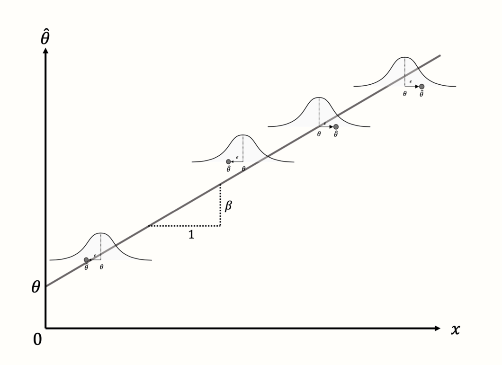

 
```{r setup, include=FALSE, echo = FALSE,message = FALSE, error = FALSE, warning = FALSE}
knitr::opts_chunk$set(echo = TRUE, fig.width = 10, fig.height = 6)

# <!-- ---------------------------------------------------------------------- -->
# <!--                    1. load the required packages                       -->
# <!-- ---------------------------------------------------------------------- --> 

# if(!require(psych)){install.packages("psych")}
# devtools::install_github("MathiasHarrer/dmetar")
packages<-c("tidyverse","gdata",
            "meta","rmeta","metafor","dmetar", "metasens",
            "brms",
            "kableExtra")

ipak <- function(pkg){
  new.pkg <- pkg[!(pkg %in% installed.packages()[, "Package"])]
  if (length(new.pkg)) 
    install.packages(new.pkg, dependencies = TRUE)
  sapply(pkg, require, character.only = TRUE)
}
ipak(packages)

# get the wd path
setwd(dirname(rstudioapi::getSourceEditorContext()$path))
getwd()


# source("./03_Functions/gmeta.r")
# source("./03_Functions/np.gmeta.r")
 


data1 <- read.csv("./01_Datasets/dataset01.csv", as.is=TRUE)
data2 <- read.csv("./01_Datasets/dataset02.csv", as.is=TRUE)
data3 <- read.csv("./01_Datasets/dataset03.csv", as.is=TRUE)
data4 <- read.csv("./01_Datasets/dataset04.csv", as.is=TRUE)
data5 <- read.csv("./01_Datasets/dataset05.csv", as.is=TRUE)
data6 <- read.csv("./01_Datasets/dataset06.csv", as.is=TRUE)
data7 <- read.csv("./01_Datasets/dataset07.csv", as.is=TRUE)
data8 <- read.csv("./01_Datasets/dataset08.csv", as.is=TRUE)


data(ThirdWave)
# glimpse(ThirdWave)
```


# Introduction
 
Meta-analysis is a statistical method used to systematically combine and synthesize results from multiple independent studies that address the same or closely related research question. Its primary purpose is to increase the overall power and precision of the findings, resolve uncertainty when individual studies disagree, and provide a more comprehensive understanding of the evidence base.

Unlike traditional narrative reviews, which rely on qualitative summaries and are often subject to author bias, meta-analysis follows a structured and quantitative approach. It typically involves extracting effect sizes or summary statistics from each study, assessing consistency among studies, and calculating an overall pooled estimate using appropriate statistical models.

Meta-analysis is especially valuable in fields such as medicine, psychology, education, and public health, where multiple studies may exist on a single intervention, treatment, or phenomenon. It allows researchers to answer questions with greater statistical confidence than any single study can provide, and it plays a critical role in evidence-based decision-making, such as developing clinical guidelines or informing public policy.

A well-conducted meta-analysis begins with a clearly defined research question and a written protocol. It includes systematic literature searches, predefined inclusion and exclusion criteria, careful data extraction, assessment of study quality, evaluation of heterogeneity among results, and application of suitable analytical techniques. When properly designed, a meta-analysis offers a rigorous and transparent synthesis of scientific evidence.


## What Are Meta-Analyses

**Definition and Purpose**
Meta-analysis is a method used to statistically combine and interpret the results of multiple independent studies addressing the same research question. Coined by Gene V. Glass in 1976 as an “analysis of analyses,” it shifts the unit of analysis from individual participants or observations to entire studies. The aim is to create a comprehensive, quantitative summary of the available evidence in a specific research area.

**Types of Evidence Synthesis**
There are several approaches to synthesizing results from multiple studies. These methods vary in terms of structure, objectivity, and the type of conclusions they allow.

**1. Narrative Reviews**

* Narrative reviews are qualitative summaries of a research field.
* They are typically written by experts based on their knowledge and experience.
* There are no formal rules for how studies are selected or how evidence is interpreted.
* Because of this flexibility, narrative reviews can be biased and reflect the personal opinions of the author.
* However, when done carefully, they can provide valuable overviews and help identify key themes and questions in a field.

**2. Systematic Reviews**

* Systematic reviews use predefined methods to locate, assess, and synthesize all relevant studies on a specific topic.
* The review process is transparent, reproducible, and designed to minimize bias.
* Inclusion and exclusion criteria are clearly specified beforehand.
* Study quality is assessed using objective criteria.
* Results are summarized systematically, though not necessarily in a quantitative form.

**3. Meta-Analyses**

* Meta-analyses are typically conducted as part of a systematic review but go further by statistically combining study results.
* The process starts with a clearly defined research question and selection criteria.
* Only studies with quantitative data are included.
* The outcome is a single numerical estimate that reflects the overall effect size, prevalence, or correlation derived from the selected studies.
* Because of this quantitative focus, meta-analyses often require that studies be relatively homogeneous in design, interventions, and measurement methods.

**Key Distinction**
While both systematic reviews and meta-analyses involve structured, transparent methods, the hallmark of meta-analysis is the quantitative integration of results. This allows for more precise estimates and statistical evaluation of consistency across studies.

**4. Individual Participant Data (IPD) Meta-Analysis**

* IPD meta-analysis involves collecting raw, individual-level data from each study, rather than relying on published summary statistics.
* The combined dataset allows for more flexible and detailed analyses.
* Advantages include the ability to apply consistent statistical methods across studies, handle missing data uniformly, and explore participant-level moderators (e.g., age, gender) that cannot be examined using aggregated data.
* Despite its advantages, IPD meta-analysis is still rare due to the difficulty of obtaining individual-level data from all relevant studies.
* In practice, many IPD meta-analyses are limited by incomplete data availability. For example, a review found that IPD could be obtained from only about 64% of eligible studies, with most analyses using fewer studies than initially intended.
 


## Meta-Analysis Protocol

Writing a protocol is the **first and most critical step** in conducting a meta-analysis. It is comparable to designing a clinical trial: the protocol defines the research question, outlines inclusion and exclusion criteria, and specifies how data will be identified, abstracted, and synthesized.

Key benefits:

* **Minimizes bias** in study selection and analysis.
* **Enhances scientific rigor** and reproducibility.
* **Clarifies scope and eligibility** of studies for inclusion.

---

**[1] Defining the Research Objective**

A clearly defined objective is crucial for guiding all subsequent steps. For example:

> *"To assess the overall evidence of the effectiveness of calcium-channel blockers in treating mild-to-moderate hypertension."*

However, to operationalize this question, further specifications are required, such as:

* Definition of “mild-to-moderate” hypertension (blood pressure thresholds have evolved over time).
* Outcome measures (e.g., change in diastolic BP).
* Control group type (placebo or active comparator).
* Study design (e.g., parallel, crossover), randomization methods, and blinding.
* Patient characteristics (e.g., age, gender, comorbidities).
* Study duration.

These specifications form the foundation for establishing **eligibility criteria** for selecting studies.

---

**[2] Criteria for Identifying Eligible Studies**

 
To ensure consistency, validity, and scientific rigor in a meta-analysis, the following six criteria should be clearly defined in the research protocol:

**1. Clarifying the Disease or Condition Under Study**

* Definitions of disease or outcome must be consistent with contemporary clinical standards.
* Historical definitions may differ (e.g., older studies may define hypertension differently).

The specific medical condition or area of application must be precisely defined. For instance, if the focus is on "mild-to-moderate hypertension," the protocol must clarify what blood pressure ranges constitute this category. Clinical definitions may have changed over time—what was once considered mild may now be classified as moderate or even normal. Failing to standardize this definition could result in the inclusion of heterogeneous populations that compromise the validity of pooled estimates.

**2. Defining the Effectiveness Measure or Outcome**

* Define primary endpoints (e.g., change in diastolic blood pressure).
* Include methods of measurement (position, device).
* Ensure that chosen outcomes are consistently reported across studies.

Meta-analyses require a common outcome measure to aggregate data meaningfully. In hypertension trials, this might be the change in diastolic blood pressure (DBP) from baseline. However, outcomes may be reported differently across studies—mean change, percentage reaching normal levels, or alternative metrics like mean arterial pressure. The protocol must specify which outcomes are acceptable, how they are measured (e.g., sitting vs. standing BP), and whether they can be harmonized across studies.

**3. Specifying the Type of Control Group**

* Control types (placebo or active comparator) influence interpretation of efficacy.
* Meta-analysis should include studies with **comparable control groups**.

The type of comparator used in each study (e.g., placebo, active control, usual care) has major implications for the interpretation of efficacy. Placebo-controlled trials provide direct evidence, while active-controlled trials offer relative comparisons. The meta-analysis should either restrict inclusion to studies with the same type of control group or account for differences analytically (e.g., through subgroup or sensitivity analyses). The protocol should define acceptable control types and explain how variations will be handled.

**4. Outlining Acceptable Study Designs and Quality Characteristics**

* Design (parallel vs. crossover), randomization, stratification, blinding, and bias control.
* Design consistency helps maintain internal validity across synthesized studies.

Different experimental designs (parallel vs. crossover, randomized vs. non-randomized) can introduce variability in treatment effects. Additional factors such as blinding, allocation concealment, and stratification should be specified. The protocol must outline which study designs are acceptable and whether criteria like randomization method or blinding status are mandatory for inclusion. High-quality design features reduce bias and increase the reliability of synthesized results.

**5. Characterizing the Patient Population**

* Include demographic variables, inpatient vs. outpatient status, concurrent diseases, and concomitant medications.
* Abstracting subgroup-level summary statistics helps evaluate heterogeneity.

Eligible studies must include similar populations in terms of demographics and clinical characteristics. Age range, sex distribution, race or ethnicity, inpatient vs. outpatient setting, presence of comorbidities, and use of concomitant medications should be considered. If these factors vary widely, stratified analyses or subgroup extraction may be necessary. The protocol should state clearly which patient characteristics are required and how heterogeneity will be managed.

**6. Determining the Acceptable Length of Follow-Up or Treatment Duration**

* Treatment duration significantly affects clinical outcomes.
* Must be accounted for in both selection and interpretation.

The duration of each study must be taken into account, as it affects the stability and magnitude of treatment effects. A 4-week intervention may yield different results compared to a 6-month study. The protocol should define acceptable minimum and/or maximum follow-up durations, or describe how differences in length will be addressed in the analysis (e.g., through meta-regression).

---

**[3] Searching and Collecting Studies**

Numerous databases should be consulted based on the research field:

For Major Medical Databases:

* **PubMed/MEDLINE**
* **Embase**
* **Web of Science**
* **ClinicalTrials.gov**
* **Cochrane Central (CENTRAL)**

Inclusion/exclusion criteria are applied at the **study level** (unlike patient-level in clinical trials).

---

**[4] Data Abstraction and Extraction**

A **Data Extraction Form (DAF)** is essential for:

* Standardizing data capture from multiple studies.
* Ensuring clarity and reproducibility.
* Supporting quality assurance and future meta-analysis updates.
 

Data abstraction should be guided by:

* Disease definition
* Outcomes
* Control group type
* Study design
* Patient population
* Duration of follow-up


---

**[5] Meta-Analysis Methods**

The statistical methods must be pre-specified in the protocol:

* Determined by study design and type of outcome data.
* Must account for **heterogeneity** across studies.
* May need adjustment based on study characteristics identified during data abstraction.

---

**[6] Reporting the Meta-Analysis Results**

A comprehensive meta-analysis report should mirror the structure of the protocol and include:

* **Executive Summary / Abstract**
* **Objective**
* **Study Search and Inclusion Criteria**
* **Data Extraction and Methods**
* **Results (with figures, forest plots, heterogeneity analysis)**
* **Discussion and Conclusion**
* **Appendices**

This final report serves as:

* Documentation of the research process.
* A source for publications.
* A benchmark for transparency and methodological rigor.


## Data Extraction and Coding in Meta-Analysis

Once the selection of studies for a meta-analysis is finalized, the next essential step is data extraction. This step forms the foundation for all subsequent analyses and must be conducted systematically and thoroughly. According to best practices, there are three major types of information that should be extracted from each study:

1. Characteristics of the studies
2. Data necessary to calculate effect sizes
3. Study quality or risk of bias information

Each category serves a distinct purpose in ensuring transparency, reproducibility, and validity in the meta-analytic process.

**1. Characteristics of the Studies**

A high-quality meta-analysis typically presents a table summarizing the key features of the included studies. While the exact content may vary depending on the research field and specific question, the following information should always be included:

* First author's name
* Year of publication
* Sample size

In addition, it is common to include characteristics that correspond to the PICO framework (Population, Intervention, Comparison, Outcome), which helps define the scope and context of the analysis:

* Country where the study was conducted
* Mean or median age of participants
* Proportion of female and male participants
* Description of the intervention or exposure
* Type of control group or comparator, if applicable
* Primary and secondary outcomes assessed

If certain details are not available in a study, it is important to clearly indicate that the information is missing or not reported.

**2. Data for Calculating Effect Sizes**

In addition to descriptive characteristics, numerical data must be extracted to compute effect sizes or outcome measures. This could include means and standard deviations, proportions, odds ratios, or correlation coefficients, depending on the metric chosen for synthesis.

If subgroup analyses or meta-regressions are planned, any relevant variables that could act as moderators or covariates must also be collected. These may include intervention duration, dosage levels, study setting, or publication year. Structuring this data properly in a spreadsheet or database is critical for efficient analysis and minimizes the risk of error.

**3. Assessment of Study Quality or Risk of Bias**

Assessing the quality or risk of bias of the primary studies is an essential component of meta-analysis. The specific approach depends on the study design:

* For randomized controlled trials, the **Cochrane Risk of Bias Tool** is the standard. This tool evaluates various domains where bias could occur, such as random sequence generation, allocation concealment, blinding, incomplete outcome data, and selective reporting. Each domain is rated as “low risk,” “high risk,” or “some concerns.”

* The focus of the risk of bias tool is not on the overall methodological quality of the study but on whether specific aspects of the design or conduct increase the likelihood of systematic errors in the findings. A study might follow all standard practices in its field and still have a high risk of bias due to subtle flaws in execution or reporting.

* For non-randomized studies, the **ROBINS-I tool** (Risk Of Bias In Non-randomized Studies - of Interventions) is commonly used. It adapts the risk of bias framework for studies where participants are not randomly assigned to conditions.

Visual summaries of risk of bias assessments are often created to clearly communicate the findings. These summaries allow readers to quickly understand the potential weaknesses in the included studies and judge how much confidence to place in the results.

In some disciplines, particularly outside of medicine, standardized assessments of study quality or bias are less common. For example, in fields like psychology, quality assessments may be inconsistent or entirely absent. In such cases, researchers can try to adapt existing tools to fit their needs or refer to high-quality meta-analyses in related areas to identify practical strategies for evaluating study credibility.

**Distinguishing Study Quality from Risk of Bias**
Although the terms are sometimes used interchangeably, study quality and risk of bias refer to different concepts:

* **Study quality** generally refers to the extent to which a study follows accepted methodological standards and reporting practices.
* **Risk of bias** focuses specifically on whether the results of the study may be distorted due to systematic errors in the design, conduct, or reporting.

A study might be considered high quality based on standard criteria yet still be at risk of bias in ways that could affect the trustworthiness of its results. Therefore, evaluating risk of bias directly is essential to determine whether the findings are credible and usable in a meta-analysis.

 

## Simpson’s Paradox and Visualization
 

**What Is Simpson’s Paradox?**

Simpson’s paradox, sometimes called the *ecological fallacy*, occurs when the relationship between two variables reverses when a third variable is taken into account. In other words, a trend present within multiple subgroups can disappear or even reverse when the data are aggregated.

In meta-analysis, this paradox often arises when the size of treatment arms is imbalanced across studies. For example, in the rosiglitazone meta-analysis, individual trials suggested that the treatment increased myocardial infarction (MI) risk, yet when data were pooled across all trials without stratification, the overall effect appeared reversed or null.

**Why Does It Happen?**

The paradox occurs because a confounding variable (like study size or allocation imbalance) distorts the aggregated association. This confounder may not be random but instead structured—such as when trials with more rosiglitazone patients also have shorter follow-ups and fewer events, giving misleading overall results.

**How to Perform Stratification**

To avoid Simpson’s paradox, one must stratify the analysis by the confounding variable—in meta-analysis, this is usually the study (trial). Rather than pooling all 2×2 tables directly, meta-analytic methods like the Mantel-Haenszel or inverse-variance weighting approach stratify by trial and then combine effect estimates.


**How to Visualize Simpson’s Paradox**


1. **Scatter Plot**

   * X-axis: Proportion of patients receiving active treatment in each trial
   * Y-axis: Event rate (e.g., MI incidence)
   * Each point represents a trial. If there's a negative trend, it may misleadingly suggest treatment reduces risk—hence potential for Simpson's paradox.


2. **Line Plot**

   * X-axis: Treatment (0 = control, 1 = active)
   * Y-axis: Event rate for each arm within a trial
   * Each line shows the within-trial risk difference.
   * Additional lines include:

     * Green: unweighted average risk difference
     * Blue: precision-weighted meta-analytic estimate
     * Red: naive pooled result (without stratification), which may show a reversed effect

   Diamond symbols can indicate the size of treatment/control arms to reflect influence.

3. **Overlay Plot**

   * Combines scatter and line plots
   * Each line represents a trial (with risk difference slope), and a point on the line indicates the overall event rate for that trial, based on its treatment allocation.
   * Useful for visualizing how varying treatment proportions influence trial outcomes and contribute to the paradox.


```{r,message = FALSE, error = FALSE, warning = FALSE, cache=TRUE}
df <-  read.csv("./01_Datasets/Simpson_Meta-Analysis_Data.csv")  

# 1. Scatterplot: Treatment Proportion vs Overall Event Rate
ggplot(df, aes(x = Treatment_Prop, y = Overall_Rate)) +
  geom_point(size = 3) +
  geom_smooth(method = "lm", se = FALSE, linetype = "dashed", color = "blue") +
  ggtitle("Scatterplot of Event Rate vs Treatment Proportion") +
  xlab("Proportion Treated") +
  ylab("Overall Event Rate")


# 2. Line Plot: Within-Trial Risk Difference
line_data <- df %>%
  select(Trial, Treated_Rate, Control_Rate) %>%
  pivot_longer(cols = c("Treated_Rate", "Control_Rate"),
               names_to = "Group",
               values_to = "Event_Rate") %>%
  mutate(Group = ifelse(Group == "Control_Rate", 0, 1))

ggplot(line_data, aes(x = Group, y = Event_Rate, group = Trial)) +
  geom_line(alpha = 0.6) +
  geom_point() +
  stat_summary(fun = mean, geom = "line", aes(group = 1), color = "green", linetype = "dashed", size = 1) +
  ggtitle("Line Plot of Event Rate by Treatment Group (Per Trial)") +
  xlab("Treatment Group (0 = Control, 1 = Treated)") +
  ylab("Event Rate")

# 3. Overlay Plot: Combine Scatter and Line Plot
overlay_data <- line_data %>%
  group_by(Trial) %>%
  summarise(slope = diff(Event_Rate),
            intercept = first(Event_Rate)) %>%
  left_join(df %>% select(Trial, Treatment_Prop, Overall_Rate), by = "Trial")

ggplot() +
  geom_abline(data = overlay_data,
              aes(intercept = intercept, slope = slope, group = Trial),
              alpha = 0.5) +
  geom_point(data = overlay_data,
             aes(x = Treatment_Prop, y = Overall_Rate),
             size = 3, color = "red") +
  ggtitle("Overlay Plot Showing Simpson’s Paradox") +
  xlab("Proportion Treated") +
  ylab("Event Rate")
```

## Fixed-Effects and Random-Effects

In meta-analysis, we aim to combine results from multiple independent studies to arrive at an overall conclusion about a treatment or effect. Two fundamental statistical models used in meta-analysis are the **fixed-effects model** and the **random-effects model**. 

The typical aim of a clinical trial is to compare the efficacy of a treatment (such as a new drug D) against a control (e.g., placebo P). This comparison is made using a treatment effect size, denoted by δ, which is a numerical summary of the difference in outcomes between the treatment and control groups.

* For **binary data** (e.g., death vs. survival), effect sizes may include:

  * Difference in proportions
  * Log odds ratio
  * Relative risk

* For **continuous data** (e.g., blood pressure, exercise capacity), effect sizes may include:

  * Difference in means
  * Standardized mean difference

The hypotheses are:

* Null hypothesis (H₀): δ = 0 (no difference between treatment and control)
* Alternative hypothesis (Hₐ): δ ≠ 0 or δ > 0 (depending on the test direction)

Each study provides an estimate of the treatment effect (denoted $\hat{\delta}_i$) and its variance $\hat{\sigma}_i^2$. Meta-analysis combines these estimates across studies to evaluate the overall effect.


In the context of meta-analysis, the model’s role is to explain the distribution of effect sizes across studies. Even though each study reports a slightly different effect size, we typically believe that there is some *true* underlying effect, and that differences between studies arise due to random sampling error—or possibly due to other systematic factors like study design, sample characteristics, or measurement methods.

So, the purpose of a meta-analytic model is twofold:

1. **To estimate the overall (true) effect size** across all studies.
2. **To account for and explain the variation** in effect sizes between studies.

This means our model must not only compute an average effect but also describe how and why the results of individual studies deviate from this average.

**Two Primary Models in Meta-Analysis**

There are two main statistical models used in meta-analysis, each offering a different explanation for between-study variability:

1. **Fixed-Effect Model**

   * Assumes that all studies share one true effect size.
   * Differences in observed effect sizes are solely due to sampling error.
   * Appropriate when studies are highly similar in design, population, and measurement.
   * **The idea behind the fixed-effect model is that observed effect sizes may vary from study to study, but this is only because of the sampling error. In reality, their true effect sizes are all the same: they are fixed. For this reason, the fixed-effect model is sometimes also referred to as the “equal effects” or “common effect” model.**

2. **Random-Effects Model**

   * Assumes that the true effect size may vary from study to study.
   * Observed differences reflect both sampling error and real differences in underlying effects.
   * More appropriate when studies differ in methods, populations, or interventions.
   * **The random-effects model assumes that there is not only one true effect size but a distribution of true effect sizes. The goal of the random-effects model is therefore not to estimate the one true effect size of all studies, but the mean of the distribution of true effects.**

Although these models are based on different assumptions, they are conceptually linked. Both aim to estimate a central tendency of effect sizes, but they do so in different ways depending on their view of heterogeneity—the degree to which effect sizes genuinely differ across studies.

### Fixed-Effects Model
 

**Assumption**: All studies estimate the **same true effect** δ. Any variation among study results is due to **random error** or **sampling variability**, not due to differences in the underlying populations or study conditions.

This model assumes that:

$$
\hat{\delta}_i = \delta + \varepsilon_i
$$

where $\varepsilon_i \sim N(0, \hat{\sigma}_i^2)$ represents the random error in study $i$.

Thus,

$$
\hat{\delta}_i \sim N(\delta, \hat{\sigma}_i^2)
$$

The objective is to compute a **weighted average** of the individual study estimates to derive an overall estimate $\hat{\delta}$ of δ:

$$
\hat{\delta} = \sum_{i=1}^K w_i \hat{\delta}_i
$$

where the weights $w_i$ are typically chosen to give more weight to more precise studies. A common choice is:

$$
w_i = \frac{1}{\hat{\sigma}_i^2}
$$

The variance of the pooled estimate is:

$$
\text{Var}(\hat{\delta}) = \sum_{i=1}^K w_i^2 \hat{\sigma}_i^2
$$

A 95% confidence interval for the overall effect size is:

$$
\hat{\delta} \pm 1.96 \times \sqrt{\text{Var}(\hat{\delta})}
$$

A test statistic to assess statistical significance of the combined estimate is:

$$
T = \frac{\hat{\delta} - 0}{\sqrt{\text{Var}(\hat{\delta})}}
$$

**Weighting Schemes** in fixed-effects meta-analysis:

1. Equal weights: $w_i = \frac{1}{K}$, where K is the number of studies.
2. By sample size: $w_i = \frac{N_i}{N}$, where $N_i$ is the sample size in study $i$ and $N$ is the total across studies.
3. By treatment group sizes: $w_i = \frac{N_{iD} \cdot N_{iP}}{N_{iD} + N_{iP}} \times \frac{1}{w}$
4. **Inverse-variance weighting** (most common): $w_i = \frac{1}{\hat{\sigma}_i^2}$

In fixed-effects meta-analysis for binary data, a special case is the **Mantel-Haenszel method**, which is used to combine odds ratios or risk ratios across 2x2 tables using the hypergeometric distribution.


### Random-Effects Model
 
**Assumption**: Each study estimates its **own true effect** $\delta_i$, which itself is a random draw from a distribution of true effects centered at the global mean effect δ. This accounts for **between-study variability**, such as differences in study design, populations, or measurement protocols.

The model assumes:

$$
\hat{\delta}_i = \delta_i + \varepsilon_i \quad \text{with} \quad \delta_i \sim N(\delta, \tau^2)
$$

and

$$
\varepsilon_i \sim N(0, \hat{\sigma}_i^2)
$$

So, the total variance in observed effects is:

$$
\text{Var}(\hat{\delta}_i) = \tau^2 + \hat{\sigma}_i^2
$$

Here, $\tau^2$ is the **between-study variance**, and it must be estimated (e.g., using the DerSimonian-Laird method).

The pooled estimate under the random-effects model is:

$$
\hat{\delta}_{RE} = \sum_{i=1}^K w_i^* \hat{\delta}_i \quad \text{with} \quad w_i^* = \frac{1}{\hat{\sigma}_i^2 + \tau^2}
$$

The confidence interval and hypothesis testing proceed in a similar way as with fixed-effects, but with the adjusted weights accounting for both within- and between-study variability.


### Compare


The decision between using a fixed-effects model or a random-effects model in meta-analysis is **not solely determined by statistical tests for heterogeneity**, such as the Cochran’s Q test or the I² statistic. Rather, the choice should depend on both **the scientific context** and **the objectives** of the meta-analysis. Analysts must make a judgment based on the **design of the studies**, **clinical and methodological similarities**, and **the rationale behind combining the studies in the first place**.


A **fixed-effects model** is appropriate when the **true treatment effect is assumed to be the same across all included studies**. The variation in observed results from one study to another is believed to be entirely due to **sampling error** or **random within-study variation**, not due to differences in populations, interventions, or study procedures.

To justify this model, the analyst should evaluate whether there is an **a priori reason** to believe all studies are estimating the **same underlying treatment effect**. For example, this is plausible when the studies:

* Use **identical protocols** or designs,
* Involve **similar patient populations**,
* Use **uniform interventions** and **outcomes**,
* Are conducted in **similar settings**.

* Use **fixed-effects** model when:

  * Studies are **homogeneous** (similar population, methods, settings)
  * There is **no evidence** of between-study heterogeneity (e.g., I² close to 0%)
  * You believe that all studies estimate the same true effect
 

A **random-effects model** is used when there is **no strong reason to assume that the treatment effect is identical across all studies**. This model assumes that each study estimates its **own effect size**, which itself is drawn from a **distribution of effect sizes** centered around a population mean. Thus, the model incorporates **both within-study variation** and **between-study heterogeneity**.

A random-effects model is more appropriate when:

* Studies differ in **designs, populations, treatment settings**, or **outcome definitions**,
* There is **clinical or methodological diversity** among the studies,
* The treatment might **interact with population characteristics**, such as age, gender, disease severity, geography, etc.

* Use **random-effects** model when:

  * Studies are **heterogeneous** in population, protocol, or design
  * You wish to generalize the results beyond the observed studies
  * The test for heterogeneity is significant (e.g., high I² or significant Q test)
  
  
| Feature                | Fixed-Effects Model              | Random-Effects Model                         |
| ---------------------- | -------------------------------- | -------------------------------------------- |
| True Effect Assumption | One common true effect           | Distribution of true effects                 |
| Heterogeneity Allowed  | No                               | Yes                                          |
| Weighting              | Inverse of within-study variance | Inverse of (within + between-study variance) |
| Suitable When          | Studies are very similar         | Studies differ (clinical/methodological)     |
| Confidence Intervals   | Narrower                         | Wider                                        |
| Example Use            | Repeated trials in same setting  | Multi-center studies across regions          |


In practice, many analysts compute **both fixed-effects and random-effects models**, even if they believe one is theoretically more appropriate. This dual approach provides:

* A **comparison** of effect sizes and confidence intervals,
* Insight into the **influence of between-study variability**,
* A **sensitivity analysis** for model assumptions.

The confidence intervals from the random-effects model are usually **wider** than those from the fixed-effects model because they account for **both within-study and between-study variance**. If there is **no heterogeneity** (i.e., τ² = 0), both models will produce **identical results**.

However, even when the heterogeneity tests (e.g., Q or I²) are not significant, if there is **clinical or contextual reason to expect variation**, the random-effects model is typically preferred for **generalizability** and **conservative inference**.

## Implementation in R

The **rmeta** package (by Thomas Lumley) and **meta** package (by Guido Schwarzer) provide functions for both models:

* For binary data:

  * Fixed-effects (Mantel-Haenszel): `meta.MH` in `rmeta`
  * Random-effects: `meta.DSL` (DerSimonian-Laird method)

* For continuous data:

  * `metacont` function in `meta` package allows analysis under both fixed and random models.

These tools help analysts perform meta-analyses and produce key outputs such as:

* Forest plots
* Funnel plots
* Estimates of heterogeneity (I², τ²)
* Confidence intervals for pooled effect size

**meta Package: Analysis for Different Data**

* Meta-analysis of binary outcome data `metabin`
* Meta-analysis of continuous outcome data `metacont`
* Meta-analysis of correlations `metacor`
* Meta-analysis of incidence rates `metainc`
* Meta-regression `metareg`
* Meta-analysis of single proportions `metaprop`
* Meta-analysis of single means `metamean`
* Merge pooled results of two meta-analyses `metamerge`
* Combine and summarize meta-analysis objects `metabind`


Meta-Analysis with Survival Outcomes

```{r,message = FALSE, error = FALSE, warning = FALSE, cache=TRUE}
mg1 <- metagen(logHR, selogHR,
               studlab=paste(author, year), data=data4,
               sm="HR")
print(mg1, digits=2)

## Forest plot
plot(mg1)

## To assess potential publication bias informally, we generate the funnel plot and visually assess whether it is symmetric. 
funnel(mg1)
```

 
Meta-Analysis of Cross-Over Trials

```{r,message = FALSE, error = FALSE, warning = FALSE, cache=TRUE}
# meta-analysis of these cross-over trials
mg2 <- metagen(mean, SE, studlab=paste(author, year),
               data=data5, sm="MD")
print(summary(mg2), digits=2)

plot(mg2)
funnel(mg2)
```


## Combining p-Values in Meta-Analysis

**Combining p-values in meta-analysis** is a statistical approach used when studies report only p-values rather than full effect sizes or variance estimates. This situation often arises in systematic reviews where only minimal information is available from each individual study. The goal is to aggregate the evidence from several such studies to determine whether, collectively, they support or refute a common hypothesis.

One of the most widely used methods for this purpose is **Fisher's combined probability test**, proposed by Ronald Fisher. It allows researchers to combine the results of multiple independent hypothesis tests into a single test statistic.

---

**Theoretical Basis of Fisher’s Method**

Suppose you have **K independent studies**, each testing the same null hypothesis (**H₀**) and each reporting a p-value:
**p₁, p₂, ..., pₖ**

Under the null hypothesis, each individual p-value follows a **uniform distribution** on the interval \[0, 1]. Mathematically:
**pᵢ \~ U\[0, 1]**

If you take the **negative natural logarithm** of a uniform random variable, the result follows an **exponential distribution** with mean 1. Specifically:
**−ln(pᵢ) \~ Exp(1)**

Multiplying this value by 2 gives a value that follows a **chi-square distribution** with 2 degrees of freedom:
**−2ln(pᵢ) \~ χ²(2)**

If the p-values are independent, the sum of K such terms will follow a **chi-square distribution** with **2K degrees of freedom**:

**X² = −2 ∑ ln(pᵢ)**
This statistic follows a **χ² distribution with 2K degrees of freedom** under the null hypothesis.

A large value of X² suggests that at least some of the studies are showing significant results, and that the overall null hypothesis may be false.

---


**Step-by-Step R Implementation**

You can easily implement Fisher’s method in R without using any external packages. Here's how:

1. **Define a function** that takes a vector of p-values and calculates the combined p-value.
2. **Apply the chi-square distribution function** (`pchisq`) to obtain the p-value from the combined statistic.

Here is the full function:

```{r,message = FALSE, error = FALSE, warning = FALSE, cache=TRUE}
# Function to compute Fisher's combined p-value
fishers.pvalue <- function(x) {
  # x: a numeric vector of p-values
  test_stat <- -2 * sum(log(x))
  pchisq(test_stat, df = 2 * length(x), lower.tail = FALSE)
}
```
 

**Worked Example**

Assume we have 4 independent studies on the effectiveness of statins. The reported p-values from these studies are:

* 0.106
* 0.0957
* 0.00166
* 0.0694

Let’s use the function above to combine them:

```{r,message = FALSE, error = FALSE, warning = FALSE, cache=TRUE}
# Vector of p-values
x <- c(0.106, 0.0957, 0.00166, 0.0694)

# Apply Fisher's method
combined.pval <- fishers.pvalue(x)

# Print the result
print(combined.pval)
```


However, a few important points should be noted:

* This method **does not account for effect size heterogeneity**.
* It is **sensitive to very small p-values**, which can dominate the result.
* All included studies must test the **same hypothesis**, and the tests must be **independent**.

---

**Conclusion**

Fisher’s method is a powerful and simple tool to combine p-values when full meta-analytic data (like effect sizes and variances) are not available. It is particularly useful in early-phase systematic reviews, meta-analyses of hypothesis tests, or when only limited summary data are accessible.


## Effect Size Correction

Effect sizes estimated from individual studies do not always perfectly reflect the true population effect. These deviations may be due to two types of errors:

* **Random (sampling) error**: inherent variability due to sample size
* **Systematic error (bias)**: distortions caused by small sample sizes, measurement error, or limited range of data

To improve the accuracy of meta-analytic estimates, specific correction techniques can be applied. These include adjustments for small sample bias, unreliability in measurement, and range restriction.

---

**1. Small Sample Bias Correction – Hedges’ g**

When using standardized mean differences (SMDs), studies with small sample sizes (especially n ≤ 20) tend to overestimate the true effect size. Hedges’ g corrects for this upward bias.

* **Correction Formula**:
  Hedges’ g = SMD × (1 − 3 / (4n − 9))
  where *n* is the total sample size

* **R Implementation**:

  ```r
  library(esc)
  SMD <- 0.5
  n <- 30
  g <- hedges_g(SMD, n)
  ```

* **Key Point**:
  Hedges’ g is always less than or equal to the uncorrected SMD. The smaller the sample size, the larger the correction.

---

**2. Correction for Unreliability (Measurement Error)**

Instruments used in studies often introduce error, reducing the reliability of the measurements. This unreliability attenuates correlations or SMDs, underestimating the true effect.

* **Key Terms**:
  Reliability coefficient (rₓₓ): ranges from 0 (unreliable) to 1 (perfectly reliable)

* **Correction for SMD**:
  Corrected SMD = SMD / √rₓₓ

* **Correction for Correlation**:

  * If only x has unreliability:
    rₓy(corrected) = rₓy / √rₓₓ
  * If both x and y have unreliability:
    rₓy(corrected) = rₓy / (√rₓₓ × √ryy)

* **Correction for Standard Error**:
  Adjust SEs using the same logic:

  * SE(corrected) = SE / √rₓₓ (or divided by both reliabilities if correcting both variables)

* **R Example**:

  ```r
  r_xy <- 0.34
  se_r_xy <- 0.09
  smd <- 0.65
  se_smd <- 0.18
  r_xx <- 0.8
  r_yy <- 0.7

  smd_c <- smd / sqrt(r_xx)
  se_c_smd <- se_smd / sqrt(r_xx)
  r_xy_c <- r_xy / (sqrt(r_xx) * sqrt(r_yy))
  se_c_r <- se_r_xy / (sqrt(r_xx) * sqrt(r_yy))
  ```

* **Important Note**:
  This correction can only be used if the reliability coefficients are available for all studies, or if a reasonable and justifiable estimate is used across all.

---

**3. Correction for Range Restriction**

Range restriction occurs when the variability of a variable in a study is smaller than in the population, leading to attenuated effect sizes.

* **Example**:
  A study looking at age and cognition but only including participants aged 65–69 would likely report a weak correlation due to limited age variation.

* **Correction involves calculating a ratio U**:

  * U = SD(unrestricted population) / SD(restricted sample)

* **Correction Formula for Correlation**:
  rₓy(corrected) = (U × rₓy) / √\[(U² − 1) × rₓy² + 1]

* **Correction Formula for SMD**:
  SMD(corrected) = (U × SMD) / √\[(U² − 1) × SMD² + 1]

* **Standard Error Correction**:

  * SE(corrected) = (corrected effect / original effect) × SE(original)

* **R Example**:

  ```r
  r_xy <- 0.34
  se_r_xy <- 0.09
  sd_restricted <- 11
  sd_unrestricted <- 18
  U <- sd_unrestricted / sd_restricted

  r_xy_c <- (U * r_xy) / sqrt((U^2 - 1) * r_xy^2 + 1)
  se_r_xy_c <- (r_xy_c / r_xy) * se_r_xy
  ```

* **Usage Caveat**:
  Like reliability corrections, this adjustment should be applied consistently across all studies. It is especially useful when range restriction is severe and clearly documented.

---

**Summary of Key Corrections**

| Correction Type        | Bias Addressed             | Input Needed                              | Applies To                    |
| ---------------------- | -------------------------- | ----------------------------------------- | ----------------------------- |
| Hedges’ g              | Small sample size          | Total sample size (n)                     | Standardized Mean Differences |
| Attenuation Correction | Measurement unreliability  | Reliability coefficients (rₓₓ, ryy)       | Correlations and SMDs         |
| Range Restriction      | Limited variable variation | SD of restricted and unrestricted samples | Correlations and SMDs         |


# Between-Study Heterogeneity 

 
In meta-analysis, **heterogeneity** refers to the variation in study outcomes beyond what would be expected by random sampling alone. In other words, it captures how different the effect sizes are across studies. Understanding and quantifying heterogeneity is essential because it influences the choice of meta-analytic model (fixed-effect vs random-effects) and the interpretation of results.

When using the `meta` package in R (e.g., through functions like `metacont()` or `metabin()`), the output includes a section called **“Quantifying heterogeneity”** and **“Test of heterogeneity”**, which provides several statistics to assess this variability. 

**Summary of Interpretation**

* **Q statistic** tells you whether heterogeneity is present (yes/no)
* **τ²** tells you how much true heterogeneity exists (in raw variance units)
* **H** tells you how much more variability is observed than expected
* **I²** tells you the proportion of observed variance that is true heterogeneity


## Cochran’s Q

 
In meta-analysis, one of the key questions is whether the variability among the observed study effect sizes can be explained by sampling error alone or whether there is true variability in the underlying effects across studies. Cochran’s Q statistic is one of the oldest and most widely used tools to assess this question.

**Purpose of Cochran’s Q**

Cochran’s Q is used to test the **null hypothesis** that all studies in a meta-analysis share a **common true effect size**. In other words, it tests whether the differences we see between studies are due to chance (sampling error) or if there is **real, underlying heterogeneity** between study effects.

In reality, two sources of variation influence the observed effect sizes:

* **Sampling error** (εₖ): random variation due to finite sample size.
* **Between-study heterogeneity** (ζₖ): true differences in effect sizes caused by study-level differences (e.g., population, intervention method).

Cochran’s Q tries to disentangle these by testing if the observed dispersion in effect sizes exceeds what would be expected from sampling error alone.

**The Formula for Cochran’s Q**

The statistic is calculated as a **weighted sum of squared deviations** of each study’s effect estimate (θ̂ₖ) from the overall summary effect (θ̂):

  **Q = ∑ₖ wₖ (θ̂ₖ − θ̂)²**

Where:

* **θ̂ₖ** is the observed effect size from study *k*.
* **θ̂** is the pooled effect size under the fixed-effect model.
* **wₖ** is the inverse-variance weight for study *k* (usually 1 / variance of θ̂ₖ).

Because the weights depend on the precision of the study, studies with smaller standard errors (i.e. larger sample sizes) contribute more to Q.

**Interpreting Q**

Under the null hypothesis of homogeneity (i.e. no between-study heterogeneity), Cochran’s Q follows a **chi-squared distribution** with **K−1 degrees of freedom**, where K is the number of studies. If Q is significantly larger than this expected distribution, it suggests **excess variation**—a sign of **true heterogeneity** among studies.
  

**Limitations and Cautions**

Despite its popularity, Cochran’s Q has several limitations:

1. **Sensitivity to Study Count (K)**:
   Q increases with the number of studies. With many studies, even small differences can lead to a significant Q, possibly **overstating heterogeneity**.

2. **Sensitivity to Study Precision**:
   High-precision studies (e.g., with large samples) contribute more to Q. Even small deviations from the mean can yield large Q values, which may **inflate the signal** of heterogeneity.

3. **Interpretation Is Not Binary**:
   It’s not sufficient to simply rely on the **p-value of the Q-test** to decide whether to use a fixed-effect or random-effects model. A significant Q does not always mean true heterogeneity is practically important.

4. **Chi-Squared Distribution May Be Misleading**:
   The actual distribution of Q in real-world meta-analyses may differ from the theoretical chi-squared distribution. As noted by Hoaglin (2016), this misfit can lead to biases, especially in methods like DerSimonian-Laird which rely on Q.

**Conclusion and Best Practice**

Cochran’s Q is a foundational tool for assessing heterogeneity in meta-analysis. However, its interpretation requires caution:

* Do not use Q alone to determine model choice.
* Consider the **magnitude** and **consistency** of heterogeneity.
* Complement Q with **other heterogeneity statistics**, such as I² or τ², which quantify heterogeneity rather than simply test for its presence.
 


## Tau-squared (τ²)

Tau-squared estimates the **between-study variance**, i.e., the variance of the true effect sizes across studies. This value is crucial in **random-effects models**, where it directly influences the weights assigned to each study.

Tau-squared is estimated using the **DerSimonian and Laird method**:

**τ² = (Q − (K − 1)) / U**

Where:

* Q is Cochran’s Q statistic
* K is the number of studies
* U is a function of the study weights

If Q < K − 1 due to sampling error, τ² is set to zero. A larger τ² indicates more dispersion in the true effects.

 

## H² Statistic: Ratio-Based Measure of Heterogeneity

The H² statistic, also introduced by Higgins and Thompson (2002), is another measure of between-study heterogeneity in meta-analyses. Like I², it is based on Cochran’s Q statistic but offers a slightly different interpretation.
 

H² quantifies the ratio between the observed variability (as measured by Q) and the amount of variability expected from sampling error alone (i.e., under the null hypothesis of homogeneity). It is calculated as:

**H² = Q / (K − 1)**

Where:

* **Q** is Cochran’s Q statistic.
* **K** is the number of studies.
* **K − 1** represents the degrees of freedom under the null hypothesis.

**Interpretation**

* **H² = 1**: All variation is due to sampling error (i.e., no between-study heterogeneity).
* **H² > 1**: Suggests that additional variability exists beyond what would be expected by chance, indicating the presence of heterogeneity.

Unlike I², there is no need to adjust H² values if Q is smaller than (K − 1). H² values are always ≥ 1.

A confidence interval for H can be constructed by assuming that **ln(H)** is approximately normally distributed. If the lower bound of this interval is above 1, it suggests statistically significant heterogeneity.

The formula for the standard error of ln(H) depends on the value of Q:

* If Q > K: SE is estimated using log transformations
* If Q ≤ K: SE uses a different approximation due to boundary issues


## Higgins & Thompson’s I² Statistic

The I² statistic, introduced by Higgins and Thompson in 2002, provides a clear way to quantify the proportion of variability in effect sizes that is due to true heterogeneity, rather than random sampling error. It is derived from Cochran’s Q statistic and is expressed as a percentage.

**Purpose and Interpretation**

I² indicates the proportion of observed variation across studies that is real and not due to chance:

* An I² value of 0% suggests all variability is due to random error.
* An I² value of 100% suggests all variability is due to actual differences between studies.

This makes I² a helpful indicator when assessing consistency in meta-analysis results.

**Formula**

The I² statistic is calculated as:

 I² = (Q - (K - 1)) / Q

Where:

* Q is Cochran’s Q value.
* K is the number of studies.
* K − 1 is the degrees of freedom.

If the result is negative (i.e., when Q < K − 1), I² is set to 0, since negative variance proportions are not meaningful.

This value ranges from 0% to 100%:

* **0–25%**: low heterogeneity
* **25–50%**: moderate heterogeneity
* **50–75%**: substantial heterogeneity
* **75–100%**: considerable heterogeneity
* Negative values of I² are set to 0 by convention. If the **lower bound of the confidence interval for I² is greater than zero**, heterogeneity is considered statistically significant.

Alternatively, I² can be computed from H:

**I² = (H² − 1) / H² × 100%**

This formulation is used to derive confidence intervals for I² from those for H.

**Strengths of the I² Statistic**

* It offers a standardized, easy-to-understand measure of heterogeneity.
* It is commonly included by default in meta-analysis software outputs.
* It allows comparison across meta-analyses with different sample sizes or outcomes.

**Limitations**

* Since I² depends on Cochran’s Q, it inherits Q’s sensitivity to the number of studies and study precision.
* Low I² values might appear even when real heterogeneity exists if studies are small or imprecise.
* It does not express the **magnitude** of heterogeneity in absolute terms, unlike τ².


## Assessing Heterogeneity in R

### Basic Outlier Removal in R

In meta-analysis, some studies may report unusually extreme results that differ substantially from the overall effect size. These studies are called outliers. Removing such outliers can help improve the accuracy of the pooled effect estimate and the measures of heterogeneity. One simple method to detect outliers is based on comparing confidence intervals.

A study is considered an outlier if its 95% confidence interval does not overlap with the confidence interval of the pooled effect estimate. Specifically, this means:

* The upper bound of the study’s confidence interval is lower than the lower bound of the pooled effect’s confidence interval, suggesting the study shows an extremely small effect.

* The lower bound of the study’s confidence interval is higher than the upper bound of the pooled effect’s confidence interval, suggesting the study shows an extremely large effect.

This method is straightforward and practical. Studies with large standard errors often have wide confidence intervals that are more likely to overlap with the pooled effect. Therefore, they are less likely to be flagged as outliers. However, if a study has a narrow confidence interval and still shows a strong deviation from the pooled effect, it is more likely to be classified as an outlier.

**Using the find.outliers Function from the dmetar Package**

The `find.outliers` function, available in the R package `dmetar`, automates the process of detecting outliers using the method described above. This function requires a meta-analysis object created using the `meta` package (such as from the `metagen` function).

```{r,message = FALSE, error = FALSE, warning = FALSE, cache=TRUE}
m.gen <- metagen(TE = TE,
                 seTE = seTE,
                 studlab = Author,
                 data = ThirdWave,
                 sm = "SMD",
                 fixed = FALSE,
                 random = TRUE,
                 method.tau = "REML",
                 method.random.ci = "HK",
                 title = "Third Wave Psychotherapies")
summary(m.gen)
find.outliers(m.gen)
```

The function outputs:

* A list of studies identified as outliers.
* A new meta-analysis object excluding these outliers.
* Updated heterogeneity statistics and pooled effect estimates.

**Advantages of This Method**

* It is simple and intuitive.
* It helps to quickly identify influential studies that may distort the results.
* It supports sensitivity analyses by allowing comparison of results before and after outlier removal.

**Limitations to Consider**

* The method is rule-based and does not rely on statistical testing, which can sometimes lead to over-identification of outliers.
* It is not suitable for automatic or blind removal of studies. Each flagged study should be reviewed for methodological quality or reasons for its deviation.
* The presence of moderate or high heterogeneity can make interpretation more complex.

### Influence Analysis

While detecting and removing outliers is a useful step in meta-analysis, it only partially addresses the issue of robustness. Some studies might not have extreme effect sizes, but they can still exert a large influence on the overall meta-analytic results. Influence analysis helps us identify such cases.

For instance, if a meta-analysis finds a significant pooled effect, but this significance disappears once a single study is removed, that study is considered influential. Recognizing such studies is crucial, particularly when we want to evaluate the reliability of our findings.

**Distinction Between Outliers and Influential Studies**

Outliers and influential studies are related but not identical:

* Outliers are identified by the **magnitude** of their effect size—i.e., their result is extreme compared to the pooled average.
* Influential studies are those that significantly **impact the meta-analysis results**, such as the pooled effect size or heterogeneity, **regardless** of their effect size value.

A study can be an outlier without being influential (if it does not change the overall result much), and vice versa. However, in practice, some outliers are indeed influential.

**Methodology: Leave-One-Out Analysis**

The most common way to detect influential studies is through the **leave-one-out method**. This method involves repeating the meta-analysis multiple times, each time leaving out one study from the dataset. If there are `K` studies, the meta-analysis is run `K` times.

Each of these iterations provides an updated pooled effect estimate. By comparing how the overall results change when each study is excluded, we can evaluate which studies have the most influence.

**Influence Diagnostics**

The results from leave-one-out analyses can be used to compute several diagnostic metrics. These include:

* The change in the pooled effect size
* The change in heterogeneity (I²)
* Measures like DFBETAs and Cook’s distance, similar to regression diagnostics

These metrics help us systematically assess the influence of each individual study.

**Using the `InfluenceAnalysis()` Function from dmetar**

The `InfluenceAnalysis()` function from the `dmetar` R package makes it easy to perform influence diagnostics for any meta-analysis object created using functions from the `meta` package.

```{r,message = FALSE, error = FALSE, warning = FALSE, cache=TRUE}
m.gen.inf <- InfluenceAnalysis(m.gen, random = TRUE)
m.gen.inf
```

**Generated Diagnostic Plots**

The function produces four different types of plots to visualize influence:

1. **Baujat Plot**
   This plot displays studies based on their contribution to heterogeneity (x-axis) and to the pooled effect size (y-axis). Studies in the top right corner are both highly heterogeneous and influential.

2. **Influence Diagnostics (Viechtbauer and Cheung)**
   A panel of diagnostic statistics like DFBETAs, Cook’s distance, and covariance ratios is calculated and visualized. These are adapted from influence analysis in regression models.

3. **Leave-One-Out Results (Sorted by Effect Size)**
   This plot shows how the overall pooled effect estimate changes when each study is excluded, sorted by effect size.

4. **Leave-One-Out Results (Sorted by I²)**
   This shows how heterogeneity changes when each study is excluded, helping to identify studies responsible for most of the between-study variability.


```{r,message = FALSE, error = FALSE, warning = FALSE, cache=TRUE}
plot(m.gen.inf, type = "baujat")
plot(m.gen.inf, type = "influence")
plot(m.gen.inf, type = "es.id")
plot(m.gen.inf, type = "i2.id")
```


**Interpreting Results**

* If the pooled effect size or I² changes significantly after excluding a particular study, that study may be influential.
* If several studies affect the results, it may indicate that your meta-analysis is sensitive and that the pooled effect is not robust.
* These findings can be used in sensitivity analyses and discussed in the results section of your report or publication.


### GOSH Plot Analysis

After conducting leave-one-out influence analyses, another powerful approach to exploring heterogeneity in a meta-analysis is the Graphic Display of Heterogeneity (GOSH) plot, introduced by Olkin, Dahabreh, and Trikalinos (2012). A GOSH plot visualizes the effect size and heterogeneity across all possible subsets of included studies. Unlike leave-one-out methods, which generate K models (one per study excluded), the GOSH approach fits 2^K − 1 meta-analysis models, corresponding to every possible subset of studies.

Due to the computational intensity of fitting this many models, the R implementation limits the number of combinations to a maximum of one million randomly selected subsets. Once calculated, the effect sizes are plotted on the x-axis, and the corresponding heterogeneity statistics (typically I²) on the y-axis. The distribution of these points can indicate clusters or patterns. For example, the presence of several distinct clusters may suggest the existence of different subpopulations in the dataset.

To use GOSH plots in R, the {metafor} package is required. Additionally, since GOSH relies on {metafor}, the original {meta} analysis object must be translated into a format accepted by the rma function from {metafor}. The required arguments are the effect sizes (TE), their standard errors (seTE), and the between-study heterogeneity estimator method.tau. Knapp-Hartung adjustments can also be specified.

```{r,message = FALSE, error = FALSE, warning = FALSE, cache=TRUE}
## save the newly generated {metafor}-based meta-analysis under the name m.rma.
m.rma <- rma(yi = m.gen$TE,
             sei = m.gen$seTE,
             method = m.gen$method.tau,
             test = "knha")
res.gosh <- gosh(m.rma)
plot(res.gosh, alpha = 0.01)
```

To investigate which studies contribute to clusters in the GOSH plot, use the gosh.diagnostics function from the {dmetar} package. This function applies three clustering algorithms: k-means, DBSCAN (density-based clustering), and Gaussian Mixture Models. It highlights studies that frequently appear in specific clusters—especially those associated with high heterogeneity or large influence.

```{r,message = FALSE, error = FALSE, warning = FALSE, cache=TRUE}
res.gosh.diag <- gosh.diagnostics(res.gosh, 
                                  km.params = list(centers = 2),
                                  db.params = list(eps = 0.08, 
                                                   MinPts = 50))
res.gosh.diag
```

**Sensitivity Analysis After GOSH Diagnostics**

To assess the impact of removing potentially influential studies (e.g., study 3, 4, and 16), rerun the meta-analysis without them:

update(m.gen, exclude = c(3, 4, 16)) %>% summary()

In the example given, the revised meta-analysis showed:

* A reduced I² of 4.6%, indicating much lower between-study heterogeneity.
* A slightly smaller pooled effect size (g = 0.48 vs. 0.58).
* Similar statistical significance, suggesting robustness of the result.


**Reporting Influence Analysis Results**

When studies are identified as influential, report both the original results and a sensitivity analysis excluding those studies. A table is an effective format:

| Analysis             | g    | 95% CI    | p-value | 95% PI     | I²  | 95% CI (I²) |
| -------------------- | ---- | --------- | ------- | ---------- | --- | ----------- |
| Main Analysis        | 0.58 | 0.38–0.78 | <0.001  | –0.06–1.22 | 63% | 39–78       |
| Infl. Cases Removed¹ | 0.48 | 0.36–0.60 | <0.001  | 0.36–0.61  | 5%  | 0–56        |

¹Removed as outliers: DanitzOrsillo, de Vibe, Shapiro

This kind of presentation ensures transparency and clearly shows the robustness of the meta-analytic conclusions. Additional rows can be added for other sensitivity analyses, such as risk-of-bias restrictions.


# Continuous Outcomes using Fixed Effect Model

## Effect Measures  

Meta-analysis typically focuses on comparing two interventions, which we refer to as experimental and control. When the response is continuous (i.e. quantitative) typically the mean, standard deviation and sample size are reported for each group.
 
Suppose the goal is to evaluate whether the two groups differ in terms of their population means. Let:

* **µ₁** = true mean of the Treated group
* **µ₂** = true mean of the Control group
* **Δ = µ₁ − µ₂** = difference in population means (also called the **mean difference**)
* **δ = (µ₁ − µ₂)/σ** = standardized mean difference (or **effect size**), where **σ** is a standard deviation (either pooled or from the control group)

**Summary**

* Use raw **mean differences** (D) when outcome scales are consistent across studies
* Use **standardized mean differences** (δ, Cohen’s d, Hedges’ g) when outcome scales differ
* Hedges’ g is preferred in meta-analysis due to its bias correction
* Statistical inference (Z-tests, confidence intervals) depends on the variance of the effect size estimate
* Correction factors and variance formulas vary slightly in the literature but typically lead to very similar results for reasonably sized samples


### Estimating the Mean Difference (Δ)

When all studies in the meta-analysis report outcomes using the same scale or unit, we can directly compute and combine the raw **mean differences**.

For a single study:

* Let **X̄₁** and **X̄₂** be the sample means of the Treated and Control groups, respectively
* Let **S₁** and **S₂** be the corresponding sample standard deviations
* Let **n₁** and **n₂** be the sample sizes of the two groups

Then, the sample mean difference **D** is estimated by:

**D = X̄₁ − X̄₂**

To compute confidence intervals or perform hypothesis testing, we need the **variance** of D.

There are two cases:

**Case 1: Unequal Variances (Heteroscedasticity)**

Assume the two groups have different variances (σ₁² ≠ σ₂²). Then the variance of D is:

**Var(D) = (S₁² / n₁) + (S₂² / n₂)**

**Case 2: Equal Variances (Homoscedasticity)**

If variances are assumed equal (σ₁ = σ₂ = σ), a **pooled variance** is used:

**S²\_pooled = \[ (n₁ − 1)S₁² + (n₂ − 1)S₂² ] / (n₁ + n₂ − 2)**

Then, the variance of D is:

**Var(D) = (n₁ + n₂) / (n₁n₂) × S²\_pooled**

The **standard error** of D (SED) is simply the square root of its variance:

**SED = √Var(D)**

In meta-analysis, we combine the D estimates from multiple studies, weighting them by the inverse of their variances.


```{r,message = FALSE, error = FALSE, warning = FALSE, cache=TRUE}
# use the metacont function to calculate mean difference and confidence interval
# sm="MD" (i.e. summary measure is the Mean Difference) as default setting.
data(Fleiss1993cont) 
m1_MD <- metacont(n.psyc, mean.psyc, sd.psyc, n.cont, mean.cont, sd.cont,
                  data = Fleiss1993cont, 
                  studlab=rownames(Fleiss1993cont),
                  sm = "MD")
summary(m1_MD)
plot(m1_MD)
```

 
### Estimating the Standardized Mean Difference (δ)

When different studies use **different measurement scales**, it's not meaningful to compare or pool raw mean differences directly. Instead, we use the **standardized mean difference (SMD)**, which removes scale effects.

SMD is defined as:

**δ = (µ₁ − µ₂) / σ**

where **σ** is a standard deviation, either from the control group or pooled from both.

---

**Two Common Estimators of δ:**

1. **Cohen's d** (proposed by Cohen, 1988)

This is calculated as:

**d = (X̄₁ − X̄₂) / S**

Where **S** is the pooled standard deviation:

**S² = \[ (n₁ − 1)S₁² + (n₂ − 1)S₂² ] / (n₁ + n₂)**

Then, **S = √S²**

Note: Cohen’s d slightly **overestimates** the true δ when sample sizes are small.

---

2. **Hedges’ g** (proposed by Hedges, 1982)

This is a corrected version of Cohen’s d for small sample bias:

**g = (X̄₁ − X̄₂) / S∗**

Where:

**S∗² = \[ (n₁ − 1)S₁² + (n₂ − 1)S₂² ] / (n₁ + n₂ − 2)**
This is the traditional **pooled sample variance**. Taking the square root gives **S∗**.

However, **g is biased**, and this bias can be corrected using a **correction factor J**:

**g∗ = J × g**, where **J = 1 − (3 / (4N − 9))** and **N = n₁ + n₂**

Then **g∗** is an approximately **unbiased estimate** of δ.

An approximate formula for the variance of g∗ is:

**Var(g∗) ≈ (1 / ñ) + (g∗² / (2(N − 3.94)))**

Where:

**ñ = (n₁ × n₂) / (n₁ + n₂)** is the **harmonic mean** of sample sizes

This variance formula is compatible with the **R `meta` package**, although other literature might use alternatives such as 2N, 2(N − 2), etc. These make very little difference unless **n₁ and n₂ are very small**.

**Hypothesis Testing for Effect Size δ**

To test **H₀: δ = 0** (no effect) versus **H₁: δ ≠ 0**, we use a **Z-statistic**:

**Z = g∗ / √Var(g∗)**

We reject the null hypothesis if |Z| exceeds the critical value from the standard normal distribution (typically zₐ/2 = 1.96 for a 95% confidence level).

A **confidence interval** for δ can be constructed as:

**CI = g∗ ± zₐ/2 × √Var(g∗)**

> There is a proportional relationship:

**d = (n₁ + n₂) / (n₁ + n₂ − 2) × g = (n₁ + n₂) / (n₁ + n₂ − 2) × g∗ / J**
 

 
* use the metacont function to calculate mean difference and confidence interval

```{r,message = FALSE, error = FALSE, warning = FALSE, cache=TRUE}
# use the metacont function to calculate mean difference and confidence interval
# sm="MD" (i.e. summary measure is the Mean Difference) as default setting.
data(Fleiss1993cont) 
m1_SMD <- metacont(n.psyc, mean.psyc, sd.psyc, n.cont, mean.cont, sd.cont,
                   data = Fleiss1993cont, 
                   studlab=rownames(Fleiss1993cont),
                   sm = "SMD")
data.frame(
  Study      = m1_SMD$studlab,
  SMD        = round(m1_SMD$TE, 3),
  SE         = round(m1_SMD$seTE, 3),
  CI_lower   = round(m1_SMD$lower, 3),
  CI_upper   = round(m1_SMD$upper, 3)
)

m1_SMD

plot(m1_SMD)

# Use Cohen's d instead of Hedges' g as effect measure
update(m1_SMD, method.smd = "Cohen")
```


## Inverse Variance-Weighted Average Method

There are two methods for the fixed effects model meta-analysis: the IVW and weighted SZ. The fixed effects model assumes that all studies in a meta-analysis share a single true effect size. 


固定效应模型假设荟萃分析中成分研究 component studies 的估计效应来自单个同质群体 single homogeneous populatio。 因此，为了计算总体估算值，我们对每项研究的估算值取平均值，从而考虑到某些估算值比其他估算值更为精确的事实（来自较大的研究）

More formally, let $k=1, \ldots, K$ index study, $\hat{\theta}_{k}$ denote the intervention effect estimate from study $k$,
and $\theta$ denote the intervention effect in the population, which we wish to estimate. Denote by $\hat{\sigma}_{k}^{2}$ the sample estimate of $\operatorname{Var}\left(\hat{\theta}_{k}\right)$. The fixed effect model is
$$
\hat{\theta}_{k}=\theta+\sigma_{k} \epsilon_{k}, \quad \epsilon_{k}^{\mathrm{i} . \mathrm{i} . \mathrm{d} .} N(0,1)
$$
We now consider the fixed effect estimate of $\theta$, denoted by $\hat{\theta}_{F}$. Given estimates $\left(\hat{\theta}_{k}, \hat{\sigma}_{k}\right), k=1, \ldots, K$, the maximum-likelihood estimate under model (2.7) is
$$
\hat{\theta}_{F}=\frac{\sum_{k=1}^{K} \hat{\theta}_{k} / \hat{\sigma}_{k}^{2}}{\sum_{k=1}^{K} 1 / \hat{\sigma}_{k}^{2}}=\frac{\sum_{k=1}^{K} w_{k} \hat{\theta}_{k}}{\sum_{k=1}^{K} w_{k}}
$$
Accordingly, $\hat{\theta}_{F}$ is a weighted average of the individual effect estimates $\hat{\theta}_{k}$ with weights $w_{k}=1 / \hat{\sigma}_{k}^{2}$. Therefore, this method is called the **inverse variance method**. The variance of $\hat{\theta}_{F}$ is estimated by
$$
\widehat{\operatorname{Var}}\left(\hat{\theta}_{F}\right)=\frac{1}{\sum_{k=1}^{K} w_{k}}
$$
$(1-\alpha)$ confidence interval for $\hat{\theta}_{F}$ can be calculated by
$$\hat{\theta}_{F} \pm z_{1-\frac{\alpha}{2}} \text { SE }\left(\hat{\theta}_{F}\right)$$


```{r,message = FALSE, error = FALSE, warning = FALSE, cache=TRUE}
# The fixed effect estimate and its variance can be calculated using base R code

# 1. Calculate mean difference, variance and weights
MD <- with(data1, Me - Mc)
varMD <- with(data1, Se^2/Ne + Sc^2/Nc)
weight <- 1/varMD

# 2. Calculate the inverse variance estimator
# the standard weighted.mean function is used to calculate theta_F.
round(weighted.mean(MD, weight), 4)

# 3. Calculate the variance
round(1/sum(weight), 4)


# Alternative easier using the metacont function which yields identical results
mc1 <- metacont(Ne, Me, Se, Nc, Mc, Sc,
                data=data1,
                studlab=paste(author, year))
round(c(mc1$TE.fixed, mc1$seTE.fixed^2), 4)


# Forest Plot
# pdf(file="Schwarzer-Fig2.3.pdf", width=9.6) 
# uncomment line to generate PDF file
forest(mc1, comb.random=FALSE, xlab=
         "Difference in mean response (intervention - control)
units: maximum % fall in FEV1",
       xlim=c(-50,10), xlab.pos=-20, smlab.pos=-20)
# invisible(dev.off()) 
# uncomment line to save PDF file


```

## Generic inverse variance meta-analysis `metagen`

Fixed effect and random effects meta-analysis based on estimates (e.g. log hazard ratios) and their
standard errors. The inverse variance method is used for pooling.

* sm: A character string indicating underlying summary measure, e.g., "RD", "RR", "OR", "ASD", "HR", "MD", "SMD", or "ROM".
* Confidence intervals for individual studies: For the mean difference (argument sm = "MD"), the confidence interval for individual studies can be based on the
    + standard normal distribution (method.ci = "z"), or
    + t-distribution (method.ci = "t").
* Estimation of between-study variance:
    + `method.tau = "DL"` DerSimonian-Laird estimator (DerSimonian and Laird, 1986)
    + `method.tau = "PM"` Paule-Mandel estimator (Paule and Mandel, 1982)
    + `method.tau = "REML"` Restricted maximum-likelihood estimator (Viechtbauer, 2005)
    + `method.tau = "ML"` Maximum-likelihood estimator (Viechtbauer, 2005)
    + `method.tau = "HS"` Hunter-Schmidt estimator (Hunter and Schmidt, 2015)
    + `method.tau = "SJ"` Sidik-Jonkman estimator (Sidik and Jonkman, 2005)
    + `method.tau = "HE"` Hedges estimator (Hedges and Olkin, 1985)
    + `method.tau = "EB"` Empirical Bayes estimator (Morris, 1983)
* Confidence interval for the between-study variance:
    + `method.tau.ci = "J"` Method by Jackson (2013)
    + `method.tau.ci = "BJ"` Method by Biggerstaff and Jackson (2008)
    + `method.tau.ci = "QP"` Q-Profile method (Viechtbauer, 2007)
    + `method.tau.ci = "PL"` Profile-Likelihood method for three-level meta-analysis model (Van den Noortgate et al., 2013)


```{r,message = FALSE, error = FALSE, warning = FALSE, cache=TRUE}
mc1.gen <- metagen(TE, seTE, data=mc1, sm="MD")
# Print results for fixed effect and random effects method
c(mc1$TE.fixed, mc1$TE.random)
c(mc1.gen$TE.fixed, mc1.gen$TE.random)
```


## Weighted Sum of Z-Scores

Another popular method for the fixed effects model meta-analysis is calculating the weighted SZ from the follows studies. Let $Z_{i}$ be the z-score from study $i$, which $N(0,1)$ under the null hypothesis of no effects. Then, the weighted SZ statistic is
$$
Z_{S Z}=\frac{\sum w_{S Z, i} Z_{i}}{\sqrt{\sum w_{S Z, i}{ }^{2}}}
$$
By the characteristic of a normal distribution, $\mathrm{Z}_{\mathrm{SZ}}$ also follows $N(0,1)$ under the null hypothesis. To combine z-scores from multiple studies, a per-study sample size was suggested as weights of each study, as follows:
$$
w_{S Z, i}=\sqrt{N_{i}}
$$


# Continuous Outcomes using Random Effects Model 

## Introduction

The random effects model seeks to account for the fact that the study effect estimates $\hat{\theta}_{k}$ are often
more variable than assumed in the fixed effect model. Under the random effects model,
$$
\hat{\theta}_{k}=\theta+u_{k}+\sigma_{k} \epsilon_{k}, \quad \epsilon_{k}^{\text {i.i.d. }} N(0,1) ; u_{k}^{\text {i.i.d. }} N\left(0, \tau^{2}\right)
$$
where the $u$ 's and $\epsilon$ 's are independent. Define
$$
Q=\sum_{k=1}^{K} w_{k}\left(\hat{\theta}_{k}-\hat{\theta}_{F}\right)^{2}
$$
the weighted sum of squares about the fixed effect estimate with $w_{k}=1 / \hat{\sigma}_{k}^{2}$. This is usually referred to as either the homogeneity test statistic or the heterogeneity statistic. Next define
$$
S=\sum_{k=1}^{K} w_{k}-\frac{\sum_{k=1}^{K} w_{k}^{2}}{\sum_{k=1}^{K} w_{k}}
$$
If $Q<(K-1)$, then $\hat{\tau}^{2}$ is set to 0 and the random effects estimate $\hat{\theta}_{R}$ is set equal to the fixed effect estimate $\hat{\theta}_{F}$. Otherwise, the **Dersimonian-Laird estimator of the between-study variance** is
defined as
$$
\hat{\tau}^{2}=\frac{Q-(K-1)}{S}
$$
and the random effects estimate and its variance are given by
$$
\begin{array}{c}
\hat{\theta}_{R}=\frac{\sum_{k=1}^{K} w_{k}^{*} \hat{\theta}_{k}}{\sum_{k=1}^{K} w_{k}^{*}} \\
\operatorname{Var}\left(\hat{\theta}_{R}\right)=\frac{1}{\sum_{k=1}^{K} w_{k}^{*}}
\end{array}
$$
with weights $w_{k}^{*}=1 /\left(\hat{\sigma}_{k}^{2}+\hat{\tau}^{2}\right)$. The random effects estimator $\hat{\theta}_{R}$ is a weighted average of the individual effect estimates $\hat{\theta}_{k}$ with weights $1 /\left(\hat{\sigma}_{k}^{2}+\hat{\tau}^{2}\right)$. Accordingly, this method is often called "**Inverse variance method**", too. A $(1-\alpha)$ confidence interval for $\hat{\theta}_{R}$ can be calculated by
$$\hat{\theta}_{R} \pm z_{1-\frac{\alpha}{2}} \text { S.E. }\left(\hat{\theta}_{R}\right)$$

## Implementation

**Estimation of Between-Study Variance**

* DerSimonian–Laird estimator (method.tau="DL") (default) 
* Paule–Mandel estimator (method.tau="PM") 
* Restricted maximum-likelihood estimator (method.tau="REML") 
* Maximum-likelihood estimator (method.tau="ML") 
* Hunter–Schmidt estimator (method.tau="HS") 
* Sidik–Jonkman estimator (method.tau="SJ") 
* Hedges estimator (method.tau="HE")
* Empirical Bayes estimator (method.tau="EB").

```{r,message = FALSE, error = FALSE, warning = FALSE, cache=TRUE}
# 1. Conduct meta-analyses
# 1a. DerSimonian-Laird estimator (default)
mg1.DL <- metagen(TE, seTE, data=mc1)
# 1b. Paule-Mandel estimator
mg1.PM <- metagen(TE, seTE, data=mc1, method.tau="PM")
# 1c. Restricted maximum-likelihood estimator
mg1.RM <- metagen(TE, seTE, data=mc1, method.tau="REML")
# 1d. Maximum-likelihood estimator
mg1.ML <- metagen(TE, seTE, data=mc1, method.tau="ML")
# 1e. Hunter-Schmidt estimator
mg1.HS <- metagen(TE, seTE, data=mc1, method.tau="HS")
# 1f. Sidik-Jonkman estimator
mg1.SJ <- metagen(TE, seTE, data=mc1, method.tau="SJ")
# 1g. Hedges estimator
mg1.HE <- metagen(TE, seTE, data=mc1, method.tau="HE")
# 1h. Empirical Bayes estimator
mg1.EB <- metagen(TE, seTE, data=mc1, method.tau="EB")
# 2. Extract between-study variance tau-squared
tau2 <- data.frame(tau2=round(c(0,
                                mg1.DL$tau^2, mg1.PM$tau^2,
                                mg1.RM$tau^2, mg1.ML$tau^2,
                                mg1.HS$tau^2, mg1.SJ$tau^2,
                                mg1.HE$tau^2, mg1.EB$tau^2), 2),
                   row.names=c("FE", "DL", "PM", "REML", "ML",
                               "HS", "SJ", "HE", "EB"))
# 3. Print tau-squared values
t(tau2)
# 4. Create dataset with summaries
res <- data.frame(MD=c(mg1.DL$TE.fixed,
                       mg1.DL$TE.random, mg1.PM$TE.random,
                       mg1.RM$TE.random, mg1.ML$TE.random,
                       mg1.HS$TE.random, mg1.SJ$TE.random,
                       mg1.HE$TE.random, mg1.EB$TE.random),
                  seMD=c(mg1.DL$seTE.fixed,
                         mg1.DL$seTE.random, mg1.PM$seTE.random,
                         mg1.RM$seTE.random, mg1.ML$seTE.random,
                         mg1.HS$seTE.random, mg1.SJ$seTE.random,
                         mg1.HE$seTE.random, mg1.EB$seTE.random),
                  method=c("",
                           "DerSimonian-Laird",
                           "Paule-Mandel",
                           "Restricted maximum-likelihood",
                           "Maximum-likelihood",
                           "Hunter-Schmidt",
                           "Sidik-Jonkman",
                           "Hedges",
                           "Empirical Bayes"),
                  tau2=tau2,
                  model=c("Fixed-effect model",
                          rep("Random-effect model", 8)))
knitr::kable(res)

# 5. Do meta-analysis
m <- metagen(MD, seMD, data=res,
             studlab=method,
             sm="MD",
             comb.fixed=FALSE, comb.random=FALSE,
             byvar=model)
knitr::kable(m)

# 6. Do forest plot
# pdf(file="Schwarzer-Fig2.5.pdf", width=8.1, height=4.0) 
# uncomment line to generate PDF file
forest(m,
       xlim=c(-20, -12),
       hetstat=FALSE, smlab="",
       leftcols=c("studlab", "tau2"),
       leftlabs=c("Method", "Between-study\nheterogeneity"),
       print.byvar=FALSE)
# invisible(dev.off()) # uncomment line to save PDF file   
```

## Hartung-Knapp Adjustment

Hartung and Knapp (2001a,b) proposed an alternative method for random effects meta-analysis
based on a refined variance estimator for the treatment estimate. Simulation studies (Hartung and
Knapp, 2001a,b; IntHout et al., 2014; Langan et al., 2019) show **improved coverage probabilities**
compared to the classic random effects method. 


Hartung and Knapp introduced a new convergent analysis method based on an improved variance estimator in the random effects model. The Hartung-Knapp method is preferred over the DerSimonianLaird method.
$$
\widehat{\operatorname{Var}}\left(\hat{\theta}_{R}\right)=\frac{1}{\sum_{k=1}^{K} w_{k}^{*}}
$$
Instead of using the variance estimate given in Eq. (2.14), Hartung and Knapp propose to use the following variance estimator for $\hat{\theta}_{R}$ :
$$
\widehat{\operatorname{Var}}_{\mathrm{HK}}\left(\hat{\theta}_{R}\right)=\frac{1}{K-1} \sum_{k=1}^{K} \frac{w_{k}^{*}}{w^{*}}\left(\hat{\theta}_{k}-\hat{\theta}_{R}\right)^{2}
$$
with weights $w_{k}^{*}$ as given in above and $w=\sum k=1^{K} w k$. Hartung showed that
$$
\frac{\hat{\theta}_{R}-\theta}{\text { S.E. } \mathrm{HK}\left(\hat{\theta}_{R}\right)}
$$
with standard error s.E. $\mathrm{HK}\left(\hat{\theta}_{R}\right)=\sqrt{\widehat{\operatorname{Var}}_{\mathrm{HK}}\left(\hat{\theta}_{R}\right)}$ follows a $t$ -distribution with $K-1$ degrees of freedom. Accordingly, a $(1-\alpha)$ confidence interval for $\hat{\theta}_{R}$ based on the Hartung-Knapp method
can be calculated by
$$
\hat{\theta}_{R} \pm t_{K-1 ; 1-\frac{\alpha}{2}} \text { S.E. } \mathrm{HK}\left(\hat{\theta}_{R}\right)
$$


```{r,message = FALSE, error = FALSE, warning = FALSE, cache=TRUE}
 # use the metacont function to conduct the Hartung–Knapp adjustment
mc2.hk <- metacont(Ne, Me, Se, Nc, Mc, Sc, sm="SMD",
                   data=data2, comb.fixed=FALSE,
                   hakn=TRUE)
```


However, in rare settings with very homogeneous
treatment estimates, the Hartung-Knapp (HK) variance estimate can be arbitrarily small resulting
in a very narrow confidence interval (Knapp and Hartung, 2003; Wiksten et al., 2016). In such
cases, an ad hoc variance correction has been proposed by utilising the variance estimate from
the classic random effects model with the HK method (Knapp and Hartung, 2003; IQWiQ, 2020).
An alternative approach is to use the wider confidence interval of classic fixed or random effects
meta-analysis and the HK method (Wiksten et al., 2016; Jackson et al., 2017).

* `adhoc.hakn = ""` Ad hoc method not used
* `adhoc.hakn = "se"` use variance correction if HK standard error is smaller than standard error from classic random effects meta-analysis (Knapp and Hartung, 2003)
* `adhoc.hakn = "iqwig6"` use variance correction if HK confidence interval is narrower than CI from classic random effects model with DerSimonian-Laird estimator (IQWiG, 2020)
* `adhoc.hakn = "ci"` use wider confidence interval of classic random effects and HK meta-analysis (Hybrid method 2 in Jackson et al., 2017)


# Meta-Regression

**Meta-regression** is an extension of meta-analysis designed to explain **residual heterogeneity** among study results by incorporating **study-level moderators** (also called covariates or independent variables). These moderators might include characteristics such as study year, mean age of participants, treatment dosage, study quality score, or geographic region.

In essence, meta-regression allows us to model how the **effect size** changes across studies depending on these moderators. This helps uncover patterns and improve understanding of why studies differ in their results.

## Basic Concept 


**Meta-Regression in Meta-Analysis: A Detailed Explanation**

Meta-regression is a method used in meta-analysis to examine how study-level characteristics (also known as *moderators*) explain variation in effect sizes across studies. It is an extension of the methods discussed in subgroup analysis, but it offers more flexibility and statistical power. While subgroup analysis tests for differences between groups of studies (e.g., comparing studies in adults vs. children), meta-regression allows for **continuous** or **multiple predictors** and provides a **quantitative** relationship between predictors and effect sizes.

Subgroup analysis is essentially a **special case of meta-regression**, where the predictor variable is categorical (like a factor with two or more levels). Meta-regression generalizes this approach and allows us to:

* Use continuous predictors (e.g., year of publication, treatment dose).
* Model multiple predictors at once.
* Explore interactions between predictors.

 
**Core Concept of Regression**

In standard regression (outside meta-analysis), we typically model a relationship like this:

  ŷᵢ = β₀ + β₁xᵢ

Here:

* ŷᵢ is the predicted value of the dependent variable (for example, test score of person *i*),
* xᵢ is the predictor (for example, number of hours studied),
* β₀ is the intercept,
* β₁ is the slope or regression coefficient.

In this model, individual observations (often people or samples) are used to estimate the relationship between the predictor and the outcome.

---

**Applying Regression to Meta-Analysis: Study-Level Model**

In **meta-regression**, the logic of regression is applied, not to individuals, but to **studies**.

* Each study provides an effect size (such as a mean difference or odds ratio).
* Each study may also report a study-level characteristic, such as sample size, country, intervention dose, or study year.
* We use these study characteristics to explain variation in the effect sizes across studies.

The model used in meta-regression is:

  θ̂ₖ = θ + βxₖ + εₖ + ζₖ

Where:

* θ̂ₖ is the **observed effect size** in study *k*.
* xₖ is the **predictor variable** for study *k* (such as year of publication).
* β is the **regression coefficient** that quantifies how much the effect size changes per unit change in x.
* θ is the **intercept**, representing the average effect size when x = 0.
* εₖ is the **sampling error** (variation due to within-study uncertainty).
* ζₖ is the **between-study heterogeneity** (variation in true effect sizes between studies).

This equation reflects a **mixed-effects model**, because it includes both fixed effects (θ and β) and random effects (ζₖ). The random effects capture the unmeasured variability among the true effects of different studies.

---

**Understanding the Components of the Model**

1. **Fixed Effect (βxₖ):**
   This is the main part of the model that captures the relationship between the predictor and the outcome (effect size). For instance, if β = 0.1 and xₖ is the study year, then for every one-year increase in publication year, the effect size increases by 0.1.

2. **Random Effects (ζₖ):**
   These represent variability in true effect sizes that cannot be explained by the predictor. This component is characterized by the **between-study variance**, denoted τ². It acknowledges that studies differ in ways we cannot fully measure.

3. **Sampling Error (εₖ):**
   This accounts for the fact that even if we knew the true effect size of each study, the observed value still varies due to chance (e.g., smaller sample sizes lead to less precise estimates).

---

**Why Use Meta-Regression**

Meta-regression is useful when:

* Heterogeneity (I² or τ²) is substantial, and we want to understand its sources.
* We have **continuous moderators** (like year or dosage), which cannot be handled easily in traditional subgroup analysis.
* We want to **control for multiple moderators simultaneously** (e.g., comparing dosage while adjusting for study quality).

---

**Limitations and Considerations**

1. **Sample Size:**
   While meta-regression works with study-level data, it still requires a sufficient number of studies to yield meaningful results. As a general guideline, at least 10 studies are recommended per predictor, but this is not a strict rule.

2. **Ecological Fallacy:**
   Because meta-regression uses **study-level** data, there is a risk of drawing incorrect conclusions about individuals (known as ecological fallacy). For example, just because studies with older participants show higher effects does not mean older individuals themselves benefit more.

3. **Collinearity:**
   When using multiple predictors, high correlation among them (multicollinearity) can distort estimates, just as in standard regression.

4. **Overfitting:**
   With too many predictors and too few studies, the model can become overly complex and unstable. Simpler models with theoretically meaningful predictors are usually more reliable.
   
### Meta-Regression with a Categorical Predictor

A **categorical predictor** represents a variable with discrete levels or groups—such as "drug vs. placebo," "adult vs. child," or "high quality vs. low quality" studies.

In standard subgroup analysis, we manually compare mean effect sizes between such groups. Meta-regression offers a mathematically equivalent but more general approach: **dummy coding** categorical variables and fitting them into a regression model.

Here’s how that works:

Let’s say you have a binary subgroup variable with two categories:

* Subgroup A (reference group)
* Subgroup B (comparison group)

You define a **dummy variable** `Dg`:

* `Dg = 0` if the study belongs to subgroup A
* `Dg = 1` if the study belongs to subgroup B

The meta-regression formula looks like this:

  **θ̂ₖ = θ + β·Dg + εₖ + ζₖ**

Where:

* **θ̂ₖ** is the observed effect size in study *k*
* **θ** is the intercept (mean effect size for subgroup A)
* **β** is the regression coefficient: the **difference** in effect size between subgroup B and A
* **Dg** is the dummy-coded group variable (0 or 1)
* **εₖ** is the within-study sampling error
* **ζₖ** is the between-study random effect (heterogeneity)

Because the dummy variable takes values of 0 or 1, it acts like a switch:

* If **Dg = 0**, the formula simplifies to θ̂ₖ = θ + εₖ + ζₖ → the predicted value is just θ, the mean of subgroup A
* If **Dg = 1**, then θ̂ₖ = θ + β + εₖ + ζₖ → the predicted value is θ + β, i.e., the mean of subgroup B

Thus, β represents the difference in average effect size **between the two subgroups**.

When this model is estimated, the regression result will give you:

* An intercept: the average effect for subgroup A
* A slope: the estimated difference between subgroup B and A
* A p-value for the slope: indicating whether the subgroup difference is statistically significant

This shows that subgroup analysis is a special case of meta-regression—when the predictor is categorical and dummy-coded.


### Meta-Regression with a Continuous Predictor

While subgroup analyses (or categorical meta-regression) allow us to compare discrete groups, **continuous meta-regression** enables analysis of predictors that take on a range of values, such as:

* Year of publication
* Age of participants
* Dosage of a drug
* Duration of treatment

In this case, the model looks like:

  **θ̂ₖ = θ + β·xₖ + εₖ + ζₖ**

Where:

* **xₖ** is the continuous predictor (e.g., treatment dose in study *k*)
* **β** is the slope of the regression line
* All other terms are as described above

Here, the interpretation of **β** is:

* For every **unit increase** in x (e.g., each additional mg of dose), the predicted effect size increases by **β** units.

The model estimates a **regression line** through the scatter of study effect sizes and predictor values. This line expresses a pattern: how the effect changes in relation to x. A **positive β** indicates increasing effect size with increasing x; a **negative β** indicates the opposite.

---

**Understanding the Regression Terms**

A key aspect of the formula is the distinction between *fixed* and *random* terms:

* **θ** and **β** are *fixed* across all studies. They summarize the overall pattern in the data.
* **εₖ** varies across studies because each study has a different standard error.
* **ζₖ** represents random variation in the true effect size across studies that cannot be explained by xₖ.

Together, this combination makes the meta-regression a **mixed-effects model**, because it blends fixed effects (predictable, consistent components) with random effects (unexplained variability).





## Assessing the Model Fit 

Meta-regression is a statistical tool that allows us to model how study-level characteristics (predictors) explain variation in effect sizes across studies. Just like in regular regression, once a meta-regression model is built, we need to evaluate how well it fits the data. This is critical because it helps us determine whether the predictor(s) meaningfully explain the heterogeneity (i.e., between-study variation) in the meta-analysis.

---

**The Relationship Between Meta-Regression and Random-Effects Meta-Analysis**

Before we explore model fit, it’s important to recognize that meta-regression is an **extension of the random-effects model**:

* The standard random-effects model can be seen as a meta-regression with **no slope**—that is, it assumes there is **one pooled effect size**, and every study deviates from this average due to sampling error and heterogeneity.
* In contrast, meta-regression **adds predictors** (covariates) to explain differences in effect sizes across studies.

In this way, meta-regression is more flexible: it still models random variation across studies, but it also allows **systematic variation** based on study-level characteristics.

---

**Step 1: Estimating Between-Study Variance (τ²)**

In the first step, meta-regression begins by estimating **τ²**, the between-study variance. This step is shared with the random-effects model and typically uses methods such as:

* **DerSimonian-Laird**
* **REML (Restricted Maximum Likelihood)**

This initial τ² estimate represents how much variation exists between study effect sizes **before** including any predictors.

---

**Step 2: Estimating Regression Coefficients (θ and β)**

In the second step, the model estimates the regression parameters:

* **θ** is the intercept: the predicted effect when the predictor is 0.
* **β** is the slope: how much the effect size increases (or decreases) per unit of the predictor.

Instead of ordinary least squares (OLS), meta-regression uses **weighted least squares (WLS)**. This is because:

* Not all studies are equally reliable—some have larger standard errors and thus more uncertainty.
* WLS gives **more weight** to studies with smaller standard errors, which are considered to provide more precise estimates of effect sizes.

---

**Step 3: Evaluating Model Fit Using Explained Heterogeneity**

Once we fit the meta-regression model, we want to know: **Did the predictor help explain the variation in effect sizes across studies?**

To answer this, we compare:

* The **original between-study variance** (before regression): τ²\_total (or τ²\_REM)
* The **residual between-study variance** (after regression): τ²\_unexplained (or τ²\_MEM)

If τ² becomes smaller after adding the predictor, then the model **explains part of the heterogeneity**.

To quantify this improvement, we calculate an index called **R²**\* (R-squared star), which tells us the **proportion of heterogeneity variance explained** by the model:

  **R²* = 1 − (τ²\_unexplained / τ²\_total)*\*

Alternatively, it can be written as:

  **R²* = (τ²\_REM − τ²\_MEM) / τ²\_REM*\*

Where:

* **τ²\_REM** is the between-study variance from the random-effects model (no predictor).
* **τ²\_MEM** is the residual variance from the mixed-effects meta-regression model.

The higher the R²\*, the more variance is explained by the predictor. For example, an R²\* of 0.40 means that 40% of the original heterogeneity has been explained.

---

**Step 4: Testing the Significance of Predictors**

Aside from knowing that the model explains more variance, we want to test whether the **slope β is significantly different from zero**. This tells us whether the predictor has a statistically meaningful association with effect size.

To test this, we calculate a **z-statistic**:

  **z = β̂ / SE(β̂)**

Where:

* **β̂** is the estimated slope coefficient,
* **SE(β̂)** is its standard error.

This z-statistic is then compared to the **standard normal distribution** to compute a **p-value**. If p < 0.05, we typically conclude that the predictor is statistically significant.

---

**Alternative: Knapp-Hartung Adjustment**

The z-test is the conventional method, but it can sometimes **underestimate uncertainty**, especially in meta-analysis where the number of studies is small.

An improved method is the **Knapp-Hartung adjustment**, which:

* Adjusts the standard error of β̂.
* Uses a **t-distribution** instead of a z-distribution for hypothesis testing.
* Is more conservative, reducing the risk of false positives (Type I errors).

Because of its robustness, the Knapp-Hartung method is **often recommended** over the basic z-test in meta-regression.


---

**Summary: How to Assess Meta-Regression Model Fit**

1. **Fit the Model**

   * Estimate τ² using REML or another method.
   * Use WLS to estimate θ (intercept) and β (slope).

2. **Check Residual Heterogeneity**

   * Calculate the new τ² after fitting the model.
   * Compare it with the original τ² to see if the predictor reduced unexplained heterogeneity.

3. **Compute R²**\*

   * Quantifies the proportion of heterogeneity explained by the model.

4. **Test Predictor Significance**

   * Use either the z-test or (preferably) the Knapp-Hartung method.
   * A significant β indicates that the predictor explains systematic variation in effect sizes.


## Implementing Meta-Regression using meta::metareg

Meta-regression is a technique used to investigate whether certain study-level characteristics (predictors or moderators) can explain differences in effect sizes across studies. In R, the `{meta}` package provides the `metareg()` function to perform meta-regression on a meta-analysis object created with one of `{meta}`'s core functions, such as `metagen()`, `metacont()`, or `metabin()`.

   * **I²** tells us that after including `year` as a predictor, about **29% of the remaining variance** is still unexplained.
   * **R²**\* (marked as just R² here) indicates that `year` explains **77% of the between-study heterogeneity**—a large and meaningful portion.
   
```{r,message = FALSE, error = FALSE, warning = FALSE, cache=TRUE}
year <- c(2014, 1998, 2010, 1999, 2005, 2014, 
          2019, 2010, 1982, 2020, 1978, 2001,
          2018, 2002, 2009, 2011, 2011, 2013)
m.gen <- metagen(TE = TE,
                 seTE = seTE,
                 studlab = Author,
                 data = ThirdWave,
                 sm = "SMD",
                 fixed = FALSE,
                 random = TRUE,
                 method.tau = "REML",
                 method.random.ci = "HK",
                 title = "Third Wave Psychotherapies")

m.gen.reg <- metareg(m.gen, ~year)
m.gen.reg

## Visualizing with Bubble Plot
bubble(m.gen.reg, studlab = TRUE)
```

## Implementing Meta-Regression using metafor

The `meta` and `rmeta` packages do not support meta-regression. Instead, the **`metafor`** package is used, which is designed for flexible meta-analysis and includes advanced features like meta-regression.

To perform **meta-analysis** using the `rma()` function in the **`metafor`** R package, you must specify the **method** used to estimate the **between-study variance τ²**, which is critical for random-effects models. The choice of method can impact the estimated τ² and, consequently, the weighting of studies and the overall meta-analytic result.


**When to Choose Which Method?**

* Use `"REML"` when you want **accurate τ² estimation** and plan to use meta-regression.
* Use `"DL"` when replicating older studies or when simplicity and speed are needed.
* Use `"SJ"` or `"EB"` if you're concerned about **underestimating** between-study heterogeneity.
* Use `"ML"` if you want to compare models using likelihood criteria (e.g., AIC).


**Fixed-Effects Model**

If you assume **no between-study heterogeneity** (i.e., τ² = 0), you are using a **fixed-effects model**. You can specify it explicitly with:

```r
method = "FE"
```

This method assumes that all studies estimate the same true effect size, and any observed differences are due to sampling error alone.

---

**Random-Effects Models and τ² Estimation Methods**

For **random-effects meta-analysis**, τ² must be estimated. The `rma()` function provides multiple estimators for τ², each with different theoretical backgrounds and properties.

Here are the main methods you can choose from:

1. **DerSimonian-Laird ("DL")**

   * Classic method used in most meta-analyses historically.
   * Based on method of moments.
   * **Quick and easy**, but known to **underestimate τ²**, especially with few studies or when heterogeneity is large.
   * Use:

     ```r
     rma(yi, vi, data = dat, method = "DL")
     ```

2. **Hunter-Schmidt ("HS")**

   * Used mostly in psychological and behavioral science meta-analyses.
   * Assumes **true score variance model**, often used with correlation coefficients.
   * Less common in medical or epidemiological contexts.
   * Use:

     ```r
     method = "HS"
     ```

3. **Hedges ("HE")**

   * Based on Hedges and Olkin’s method.
   * Also a **method-of-moments** estimator, more robust than DL under certain conditions.
   * Known to produce **less biased τ² estimates** when variances are unequal.
   * Use:

     ```r
     method = "HE"
     ```

4. **Sidik-Jonkman ("SJ")**

   * A newer estimator.
   * Tends to **overestimate τ²** in small samples but is **very conservative**.
   * Good when aiming for **wider confidence intervals** to avoid overconfidence.
   * Use:

     ```r
     method = "SJ"
     ```

5. **Empirical Bayes ("EB")**

   * Uses Bayesian principles to shrink individual study estimates toward the overall mean.
   * Especially useful when the number of studies is **very small**.
   * Use:

     ```r
     method = "EB"
     ```

6. **Maximum Likelihood ("ML")**

   * Optimizes the likelihood of observing the data given a model.
   * Biased in small samples (underestimates τ²), but still widely used.
   * Allows model comparisons (e.g., AIC).
   * Use:

     ```r
     method = "ML"
     ```

7. **Restricted Maximum Likelihood ("REML")**

   * Default method in `rma()`.
   * Adjusts for degrees of freedom used in estimating fixed effects.
   * **Asymptotically unbiased and efficient**.
   * Recommended for most applications.
   * Use:

     ```r
     method = "REML"
     ```
     
     
     
 

**Practical Notes**

* Use only study-level covariates (not individual participant-level variables).
* Be cautious when including many moderators in a model with a small number of studies.
* Avoid overfitting; meta-regression should be guided by theory or prior knowledge.
* Meta-regression is observational—**associations do not imply causation**.


## Meta-regression vs. Weighted Regression

**Meta-regression vs. Weighted Regression** is a subtle but important distinction in statistical modeling, especially in the context of meta-analysis.

At first glance, meta-regression appears very similar to ordinary **weighted linear regression**, where the **effect size estimates** (e.g., log odds ratios, SMDs, or risk differences from individual studies) are regressed on **study-level covariates** using a set of **weights**. However, while the **parameter estimates** (the regression coefficients) from both approaches will typically match, the **standard errors**, **confidence intervals**, and **p-values** can differ significantly. The key lies in the **assumed error structure** of the models.

In **meta-regression**, the goal is to estimate how **study-level moderators** (like geographic region, year, or sample size) explain variations in the effect sizes across studies. The correct meta-regression model assumes:

* Known and fixed variances for each study's effect size (provided as input)
* Residuals that have a **known variance structure**, namely:

  **Var(εᵢ) = σ̂ᵢ² + τ²**

This combined variance includes:

* **σ̂ᵢ²**, the within-study variance (from each study)
* **τ²**, the between-study variance (heterogeneity), estimated by `rma()` from the data

These two components make up the weights:

**wᵢ = 1 / (σ̂ᵢ² + τ²)**

---

**The Mistake with `lm()` and Weighted Regression**

The R function `lm()` can perform weighted linear regression via the `weights` argument, and it will indeed **give the correct point estimates** for the regression coefficients if you use **wᵢ** as the weights. However, it does **not make the correct distributional assumption** for the residuals.

Specifically:

* `lm()` assumes residuals εᵢ are from **N(0, σ² × wᵢ)**, where σ² is an **unknown common error variance** that is **estimated from the data**
* Meta-regression assumes εᵢ ∼ **N(0, 1 / wᵢ)** — i.e., the weights are already the known inverse variances, and no additional σ² scaling is needed

Because of this mismatch, `lm()` will inflate the standard errors by a factor of √(σ̂²), which results in **incorrect inference** (i.e., p-values and confidence intervals will be wrong).

---

**Conclusion**

* **Meta-regression** and **weighted regression** use the same formula for calculating coefficient estimates, but they differ in the assumed variance model of the residuals.
* **lm() incorrectly estimates an extra residual variance term (σ²)**, leading to inflated standard errors and incorrect inference.
* Always use `rma()` or manual calculations with fixed weights and no additional residual variance term when performing meta-regression.


 
# Binary Outcomes

## Effect Measures

In meta-analysis, especially when dealing with binary outcomes (such as "event occurred" vs. "event did not occur"), choosing an appropriate **effect measure** is crucial for meaningful interpretation and synthesis across studies. The most commonly used effect measures include:


**Study Summary Data (2×2 Table)**

In each study $k$ included in the meta-analysis (where $k = 1, ..., K$), the outcome data can be summarized in a 2×2 contingency table:

$$
\begin{array}{l|c|c|c}
\hline
 & \text{Event} & \text{No Event} & \text{Group Size} \\
\hline
\text{Experimental Group} & a_k & b_k & n_{ek} = a_k + b_k \\
\text{Control Group} & c_k & d_k & n_{ck} = c_k + d_k \\
\hline
\text{Totals} & a_k + c_k & b_k + d_k & n_k = n_{ek} + n_{ck} \\
\hline
\end{array}
$$

From this, the **estimated probabilities** of event occurrence in each group are calculated as:

$$
\hat{p}_{e k} = \frac{a_k}{n_{e k}} \quad \text{and} \quad \hat{p}_{c k} = \frac{c_k}{n_{c k}}
$$

These probabilities are then used to compute the chosen effect measure (OR, RR, RD, ASD) for each study $k$, which are subsequently pooled using either a **fixed-effects** or **random-effects** model, depending on heterogeneity and modeling assumptions.
 
 
---

**1. Odds Ratio (OR)**

The **odds ratio** compares the odds of the event occurring in the treatment group to the odds in the control group.

$$
\text{OR}_k = \frac{a_k / b_k}{c_k / d_k} = \frac{a_k d_k}{b_k c_k}
$$

* **Odds**: the ratio of the probability that the event occurs to the probability that it does not occur.
* Often used in **case-control studies** or where outcomes are **rare**.
* **Log(OR)** is approximately normally distributed, making it suitable for statistical modeling and meta-analysis.

---

**2. Risk Ratio (RR)**

Also called the **relative risk**, this measure compares the **probability** of the event between the two groups.

$$
\text{RR}_k = \frac{\hat{p}_{e k}}{\hat{p}_{c k}} = \frac{a_k / (a_k + b_k)}{c_k / (c_k + d_k)} = \frac{a_k / n_{e k}}{c_k / n_{c k}}
$$

* Indicates how many times more (or less) likely an event is in the treatment group compared to the control.
* Intuitive and widely used in **randomized controlled trials**.
* Less statistically stable than OR when event probabilities approach 0 or 1.

---

**3. Risk Difference (RD)**

The **risk difference** measures the absolute difference in event probabilities between groups.

$$
\text{RD}_k = \hat{p}_{e k} - \hat{p}_{c k}
$$

* Directly interpretable as the percentage point difference in risk.
* More sensitive to **baseline risk**; can vary substantially across populations.
* **Less stable** across studies than OR or RR, which are **relative** measures.

---

**4. Arcsine Difference (ASD)**

The **arcsine difference** is used less frequently but is especially useful for detecting **small-study effects** (e.g., publication bias) in meta-analysis.

$$
\text{ASD}_k = \arcsin\left(\sqrt{\hat{p}_{e k}}\right) - \arcsin\left(\sqrt{\hat{p}_{c k}}\right)
$$

* Stabilizes variance, especially in studies with small sample sizes or rare events.
* Used in certain **regression-based tests** for funnel plot asymmetry or bias detection.

---

**Why Are OR and RR Usually Preferred?**

The **odds ratio** and **risk ratio** are preferred in most meta-analyses for several reasons:

* They are **relative measures**, which tend to remain more **consistent** across studies with different baseline risks (a concept known as **effect measure homogeneity**).
* **Log(OR)** and **log(RR)** are approximately normally distributed, enabling the use of standard meta-analytic methods (e.g., inverse-variance weighting).
* They are less affected by the absolute event rate compared to risk difference, making them more **robust** in diverse clinical settings.

 

## Analysis with Risk-Ratio [Fixed Effect - Inverse Variance Method]

The risk ratio (RR), also known as relative risk, is a widely used measure of treatment effect in clinical trials with binary outcomes (e.g., event/no event). In a meta-analysis, RR quantifies how the probability of an event (e.g., death, MI) differs between a treatment group and a control group across multiple studies.
  
 

The risk ratio is defined as the ratio of the event probability (risk) in the experimental group to the event probability in the control group:

$$
\text{RR} = \frac{p_E}{p_C} = \frac{x_E / n_E}{x_C / n_C}
$$

* $p_E$: Risk (probability of event) in the **experimental** group
* $p_C$: Risk (probability of event) in the **control** group
* $x_E$: Number of events in the experimental group
* $n_E$: Total number of patients in the experimental group
* $x_C$: Number of events in the control group
* $n_C$: Total number of patients in the control group

Interpretation:

* RR = 1: No difference between the groups
* RR < 1: Lower risk in the experimental group (treatment is beneficial)
* RR > 1: Higher risk in the experimental group

For example, in a statin study, RR < 1 would indicate that high-dose statins reduce risk of death or MI compared to standard-dose statins.

---

**Confidence Interval for RR using Log Transformation**

Since the distribution of the RR is skewed, it's common to perform inference on its **logarithmic scale** using:

$$
\ln(\text{RR}) = \ln(p_E) - \ln(p_C)
$$

The variance of $\ln(\text{RR})$ is approximated by the delta method as:

$$
\text{Var}(\ln(\text{RR})) = \frac{1}{x_E} - \frac{1}{n_E} + \frac{1}{x_C} - \frac{1}{n_C}
$$

The **standard error** (SE) is the square root of the variance. A **95% confidence interval** on the log scale is:

$$
\ln(\text{RR}) \pm 1.96 \times SE
$$

Exponentiating the lower and upper limits gives the 95% CI for RR:

$$
RR = \exp(\ln(\text{RR})) \\
LRR = \exp(\ln(\text{RR}) - 1.96 \times SE) \\
URR = \exp(\ln(\text{RR}) + 1.96 \times SE)
$$

This CI helps determine statistical significance: if the interval **does not include 1**, the RR is statistically significant.

 
**Assessing Statistical Significance**

1. **Confidence Interval Method**
   Calculate the 95% CI using the log RR and its variance. Example results:

* Study 3 (TNT) 95% CI: \[0.697, 0.922] → significant
* Other studies’ CIs include 1 → not significant

2. **P-Value Method**
   Compute the Z-statistic:

$$
z = \frac{\ln(\text{RR})}{SE}
$$

Then compute p-value:

$$
p = 2(1 - \Phi(|z|))
$$

Example:

* TNT study p-value = 0.00166 → significant
* Others > 0.05 → not significant

3. **Post-Hoc Power Analysis**
   Using the `pwr` package in R, power calculations showed:

* TNT study: power ≈ 88.5% (high)
* Others: power ≈ 36–44% (low)

Low power explains why some studies didn’t show significance despite lower RR values.

---

**Risk Ratio Meta-Analysis Step-by-Step (Fixed-Effects Model)** Before considering a random-effects model, check for **between-study heterogeneity**.

1. Compute the Q statistic:

$$
Q = \sum w_i (\ln(\text{RR}_i))^2 - \frac{(\sum w_i \ln(\text{RR}_i))^2}{\sum w_i}
$$

2. Compare Q to a chi-square distribution with $K - 1$ degrees of freedom.

**Automated Meta-Analysis in R using `meta` package**

```
metabin(Ee, Ne, Ec, Nc, sm="RR", method="I",
        data=data7, subset=study=="Milpied")
```

## Analysis with Risk Difference [Fixed Effect - Inverse Variance Method]

While the **risk ratio (RR)** is widely used for summarizing binary outcome data in meta-analysis, the **risk difference (RD)** is also an important effect measure due to its **simplicity and intuitive interpretation**. It tells us the **absolute difference in event rates** between the treatment and control groups.

**Definition of Risk Difference (RD)**

The **risk difference** is calculated as the difference between the observed risks in the experimental and control groups:

$$
\text{RD} = \hat{p}_E - \hat{p}_C = \frac{x_E}{n_E} - \frac{x_C}{n_C}
$$

Where:

* $\hat{p}_E$: estimated risk (probability of event) in the **experimental** group
* $\hat{p}_C$: estimated risk in the **control** group
* $x_E$, $x_C$: number of events in the experimental and control groups
* $n_E$, $n_C$: total number of patients in each group

**Interpretation**:

* RD = 0: No difference between groups
* RD < 0: Lower risk in the experimental group → treatment **beneficial**
* RD > 0: Lower risk in the control group → treatment **harmful**

This measure is especially appealing to clinicians and policy-makers because it reflects the **actual difference in event rates**, which can be used to estimate metrics such as **number needed to treat (NNT = 1 / |RD|)**.

---

**Variance and Standard Error of RD**

To construct confidence intervals and conduct hypothesis tests, we need to estimate the **variance** of the risk difference. This is derived from the binomial distribution under the assumption that each group’s outcomes are independent:

$$
\text{Var(RD)} = \frac{\hat{p}_E(1 - \hat{p}_E)}{n_E} + \frac{\hat{p}_C(1 - \hat{p}_C)}{n_C}
$$

Then the **standard error** is:

$$
\text{SE(RD)} = \sqrt{\text{Var(RD)}}
$$

---

**Example: RD Calculation in Statin Trials**

Using the statin trial data, suppose we have:


```{r,message = FALSE, error = FALSE, warning = FALSE, cache=TRUE}
# Estimated risks
pE = c(0.0700, 0.0905, 0.0669, 0.0926)
pC = c(0.0834, 0.1053, 0.0835, 0.1041)

# Risk differences
RD = pE - pC
# Result:
# [1] -0.0133 -0.0148 -0.0166 -0.0115
```

Now calculate the **variance and standard error** for each RD:

```{r,message = FALSE, error = FALSE, warning = FALSE, cache=TRUE}
# Sample sizes (example values)
nE = c(2099, 2265, 4995, 4439)
nC = c(2063, 2232, 5006, 4449)

# Variance of RD
VarRD = pE*(1 - pE)/nE + pC*(1 - pC)/nC
# Standard Error
SERD = sqrt(VarRD)
SERD
```


This allows us to construct **95% confidence intervals** for each RD:

$$
\text{RD} \pm 1.96 \times \text{SE}
$$


---

**Meta-Analysis of Risk Differences (Fixed-Effects Model)**

To combine the RD values from all studies and improve precision, a meta-analysis is performed using a **fixed-effects model**. In this model, each study is **weighted by the inverse of the variance** of its RD:

$$
w_i = \frac{1}{\text{Var(RD)}_i}
$$

The combined (pooled) RD is then calculated as a **weighted average**:

$$
\text{RD}_{\text{pooled}} = \frac{\sum w_i \cdot \text{RD}_i}{\sum w_i}
$$

And the variance of the pooled RD:

$$
\text{Var}(\text{RD}_{\text{pooled}}) = \frac{1}{\sum w_i}
$$

The standard error and 95% confidence interval follow directly from this.

---

**Performing Meta-Analysis Using the R Package `meta`**

The `meta` package allows for straightforward implementation of RD meta-analysis with the function `metabin()`:


```{r,message = FALSE, error = FALSE, warning = FALSE, cache=TRUE}
# Create the statin study data
dat <- data.frame(
  Study = c("Prove-It", "A-to-Z", "TNT", "IDEAL"),
  evhigh = c(147, 205, 334, 411),   # number of events in high-dose group
  nhigh  = c(2099, 2265, 4995, 4439),  # total in high-dose group
  evstd  = c(172, 235, 418, 463),   # number of events in standard-dose group
  nstd   = c(2063, 2232, 5006, 4449)   # total in standard-dose group
)
RD.Statin = metabin(evhigh, nhigh, evstd, nstd,
                    studlab = Study,
                    data = dat,
                    method = "Inverse",
                    sm = "RD")
summary(RD.Statin)
plot(RD.Statin)
```


```
metabin(Ee, Ne, Ec, Nc, sm="RD", method="I",
        data=data7, subset=study=="Milpied")
```


## Meta-Analysis with Odds Ratio 

### Fixed Effect - Inverse Variance Method

The odds ratio for study $k, \psi_{k}$, is defined as the ratio of the odds of an event in the experimental arm
to that in the control arm. That is
$$
\psi_{k}=\frac{\left(\frac{p_{e k}}{1-p_{e k}}\right)}{\left(\frac{p_{c k}}{1-p_{c k}}\right)}=\frac{p_{e k}\left(1-p_{c k}\right)}{p_{c k}\left(1-p_{e k}\right)}
$$
- If either of the two estimated event probabilities is zero the log odds ratio, $\log \psi_{k}$, is either
$-\infty$ or $+\infty$
- If both are zero, the log odds ratio is undefined.
The odds ratio from study $k$ is estimated by
$$
\hat{\psi}_{k}=\frac{a_{k} d_{k}}{b_{k} c_{k}}
$$
variance of the natural logarithm of the odds ratio is well approximated by
$$
\widehat{\operatorname{Var}}\left(\log \hat{\psi}_{k}\right)=\frac{1}{a_{k}}+\frac{1}{b_{k}}+\frac{1}{c_{k}}+\frac{1}{d_{k}}
$$
where the approximation improves as nek and $n_{c k}$ increase. Using the estimate of the log odds
ratio, and its estimated variance, an approximate two-sided $(1-\alpha)$ confidence interval for the
odds ratio is given by

$$\exp \left(\log \hat{\psi}_{k} \pm z_{1-\frac{\alpha}{2}} \text { S.E. }\left(\log \hat{\psi}_{k}\right)\right)$$

* The `metabin` function can smoothly realize the combination of effect sizes

```{r,message = FALSE, error = FALSE, warning = FALSE, cache=TRUE}
data(Fleiss93)
# Can taking aspirin after a heart attack reduce mortality?
# 7 studies information
# event.e indicates the number of deaths in the treatment group
# n.e indicates the total number of people in the treatment group
# event.c indicates the total number of people in the control group
# n.c indicates the total number of people in the control group

metabin(event.e, n.e, event.c, n.c, data=Fleiss93, sm="OR")

# Meta-analysis forest plot is generally indispensable
# The OR value and 95% confidence interval, weight, combined effect size value and heterogeneity test results of each study are all in this figure
# comb.random=FALSE, the random effect model is not used for effect size combination, but the fixed effect model is used
metaresult<-metabin(event.e, n.e,event.c,n.c,data=Fleiss93,sm="OR",
                    studlab=paste(study, year),random=FALSE)
plot(metaresult)
```


**Unfortunately, for sparse data, the pooled estimates based on the inverse variance method are biased**


### Meta-Analysis using Mantel-Haenszel Method (Fixed Effect)

**Detailed Explanation of the Mantel-Haenszel (MH) Method in Meta-Analysis**

The **Mantel-Haenszel method** is a classical and widely used approach in meta-analysis for combining binary outcome data (e.g., event vs. non-event) across multiple studies. It estimates a **pooled odds ratio** under the assumption of a **fixed effect**, meaning that the true treatment effect (odds ratio) is assumed to be the same in all studies, and differences arise purely from sampling variability.

---

**Data Structure and Odds Ratio Definition**

For each study, data are typically organized in a 2-by-2 contingency table:

| Group        | Events $(A, C)$ | Non-Events $(B, D)$ | Total $(n_1, n_2)$ |
| ------------ | --------------- | ------------------- | ------------------ |
| Experimental | $A$             | $B$                 | $A + B$            |
| Control      | $C$             | $D$                 | $C + D$            |

The **odds** of the event in each group is calculated as:

* Experimental: $\text{Odds}_E = A / B$
* Control: $\text{Odds}_C = C / D$

The **odds ratio (OR)** for each study is:

$$
\text{OR}_i = \frac{A_i \cdot D_i}{B_i \cdot C_i}
$$

---

**Mantel-Haenszel Pooled Odds Ratio**

The **Mantel-Haenszel pooled OR** is calculated as:

$$
\text{OR}_{MH} = \frac{\sum_{i=1}^K \frac{A_i D_i}{N_i}}{\sum_{i=1}^K \frac{B_i C_i}{N_i}}
$$

where:

* $N_i = A_i + B_i + C_i + D_i$, the total sample size in the ith study.
* This estimator is **more robust** than inverse variance methods when individual studies have **small cell counts**.

It can be viewed as a **weighted average** of individual study odds ratios, where each weight is:

$$
w_i = \frac{B_i C_i}{N_i}
$$

This leads to a relative weight for each study:

$$
\text{relWeight}_i = \frac{w_i}{\sum w_i}
$$

and the pooled estimate becomes:

$$
\text{OR}_{MH} = \sum \text{relWeight}_i \cdot \text{OR}_i
$$

---

**Naïve Variance and Confidence Interval (Not Recommended)**

A simple variance estimate for $\text{OR}_{MH}$ is the inverse of the total weight:

$$
\text{Var}(\text{OR}_{MH}) = \frac{1}{\sum w_i}
$$

This is used to construct an approximate 95% confidence interval:

$$
\text{CI} = \text{OR}_{MH} \pm 1.96 \times \sqrt{\text{Var}}
$$

However, this method is not ideal because the **distribution of the odds ratio is skewed**, especially for small probabilities, and the variance of the OR itself does not follow a normal distribution.

---

**Improved Confidence Interval Using Emerson’s Approximation**

To improve accuracy, it is common to perform inference on the **log scale** and construct a confidence interval for the **log odds ratio**, then exponentiate the limits. Emerson’s method uses an advanced formula proposed by Robins et al. (1986) to estimate the **variance of the log odds ratio** more precisely.

The steps are:

1. For each study, define:

   * $T1_i = \frac{A_i + D_i}{N_i}$
   * $T2_i = \frac{B_i + C_i}{N_i}$
   * $T3_i = \frac{A_i D_i}{N_i}$
   * $T4_i = \frac{B_i C_i}{N_i}$

2. Sum across all studies:

   * $ST3 = \sum T3_i$
   * $ST4 = \sum T4_i$

3. Compute the **variance of the log odds ratio**:

$$
\text{Var}(\log(\text{OR}_{MH})) = \frac{1}{2} \sum \left[
\frac{T1_i T3_i}{ST3^2} +
\frac{T1_i T4_i + T2_i T3_i}{ST3 \cdot ST4} +
\frac{T2_i T4_i}{ST4^2}
\right]
$$

4. The confidence interval is then:

* Lower bound on log scale:

  $$
  \log(\text{OR}_{MH}) - 1.96 \cdot \sqrt{\text{Var}}
  $$

* Upper bound on log scale:

  $$
  \log(\text{OR}_{MH}) + 1.96 \cdot \sqrt{\text{Var}}
  $$

* Exponentiate both bounds to return to the original scale.

---
 


```{r,message = FALSE, error = FALSE, warning = FALSE, cache=TRUE}
# Create the statin study dataset
dat <- data.frame(
  Study  = c("Prove-It", "A-to-Z", "TNT", "IDEAL"),
  evhigh = c(147, 205, 334, 411),    # events in high-dose group
  nhigh  = c(2099, 2265, 4995, 4439),# total in high-dose group
  evstd  = c(172, 235, 418, 463),    # events in standard-dose group
  nstd   = c(2063, 2232, 5006, 4449) # total in standard-dose group
)

# Odds ratios from individual studies
OR <- c(0.828, 0.846, 0.787, 0.878)

# Step 1: compute raw Mantel-Haenszel weights
w0 <- (dat$nhigh - dat$evhigh) * dat$evstd / (dat$nhigh + dat$nstd)

# Step 2: total weight and relative weights
TotWeight <- sum(w0)
relWt <- w0 / TotWeight

# Step 3: compute pooled MH OR
OR.MH <- sum(relWt * OR)

# Step 4: naive variance
Var.ORMH1 <- 1 / TotWeight
lowCI_naive <- OR.MH - 1.96 * sqrt(Var.ORMH1)
upCI_naive <- OR.MH + 1.96 * sqrt(Var.ORMH1)

print(paste0("MH estimate = ",round(OR.MH,3), 
             ", 95% CI (naive) = [",
             round(lowCI_naive,3),",",
             round(upCI_naive,3),"]"))
```

**R Implementation: Emerson's Improved Method**


```{r,message = FALSE, error = FALSE, warning = FALSE, cache=TRUE}
A <- dat$evhigh
B <- dat$nhigh - dat$evhigh
C <- dat$evstd
D <- dat$nstd - dat$evstd
N <- A + B + C + D

T1 <- (A + D) / N
T2 <- (B + C) / N
T3 <- A * D / N
T4 <- B * C / N

ST3 <- sum(T3)
ST4 <- sum(T4)

Var.lnOR <- 0.5 * (
  (T1 * T3) / ST3^2 +
  (T1 * T4 + T2 * T3) / (ST3 * ST4) +
  (T2 * T4) / ST4^2
)

Var.lnMH <- sum(Var.lnOR)

# 95% CI on log scale
lowCI_lnMH <- log(OR.MH) - 1.96 * sqrt(Var.lnMH)
upCI_lnMH <- log(OR.MH) + 1.96 * sqrt(Var.lnMH)

# Convert to OR scale
lowCI_MH <- exp(lowCI_lnMH)
upCI_MH <- exp(upCI_lnMH)

print(paste0("MH estimate = ",round(OR.MH,3), 
             ", 95% CI (Emerson) = [",
             round(lowCI_MH,3),",",
             round(upCI_MH,3),"]"))
```

This confidence interval matches the output from the `meta` package.


```{r,message = FALSE, error = FALSE, warning = FALSE, cache=TRUE}
ORMH.Statin <- metabin(
  event.e = evhigh, n.e = nhigh,
  event.c = evstd,  n.c = nstd,
  studlab = Study,
  data = dat,
  method = "MH",   # Mantel-Haenszel
  sm = "OR"
)

summary(ORMH.Statin)
plot(ORMH.Statin)
```

The **Mantel-Haenszel method** is a reliable and efficient approach to pooling odds ratios across studies, especially when:

* The event is rare
* Some cell counts are small
* The number of studies is moderate to large


### Estimation in Sparse Data - Continuity correction

 
**Sparse data** refers to cases where the number of events is very low—sometimes **zero**—in one or more groups of a 2×2 contingency table:

|              | Event (Yes) | Event (No) | Total                |
| ------------ | ----------- | ---------- | -------------------- |
| Experimental | $a_k$       | $b_k$      | $n_{ek} = a_k + b_k$ |
| Control      | $c_k$       | $d_k$      | $n_{ck} = c_k + d_k$ |

If **either $a_k = 0$ or $c_k = 0$** (i.e. no events in the treatment or control group), then:

* The **odds ratio (OR)** becomes either 0 or ∞ (undefined on the log scale).
* The **risk ratio (RR)** becomes either 0 or 1, but the **variance estimate becomes unstable or unreliable**.

This results in high **statistical uncertainty** and **biased estimates**, especially when you try to combine such studies in a meta-analysis.

---

To address this problem, researchers typically consider two approaches:

**1. Exclude the study**:
Omitting studies with zero events may avoid the distortion of summary statistics, but it **discards potentially valuable data** and can introduce **selection bias**.

**2. Apply continuity correction**:
This involves **adding a small constant** to each cell of the 2×2 table to avoid zeros and make OR and RR computable. This is the more commonly used method.

The **standard correction** is to add **0.5** to every cell of the table:

$$
\hat{\psi}_{k}^{\text{mod}} = \frac{(a_k + 0.5)(d_k + 0.5)}{(b_k + 0.5)(c_k + 0.5)}
$$

This adjusted odds ratio becomes computable even if some original counts were zero.

The variance of the **log-transformed adjusted odds ratio** is:

$$
\widehat{\operatorname{Var}}(\log \hat{\psi}_{k}^{\text{mod}}) = \frac{1}{a_k + 0.5} + \frac{1}{b_k + 0.5} + \frac{1}{c_k + 0.5} + \frac{1}{d_k + 0.5}
$$

This method is easy to implement and prevents division by zero. However, it is **sensitive to the choice of increment**, especially in small studies.

* Using 0.5 may **artificially shrink** or **inflate** estimates.
* To assess this, one can try other small constants like 0.01 or 0.1 to check **sensitivity**.

---

Sweeting et al. (2004) proposed a **more refined continuity correction** that adjusts for **imbalance in sample sizes** between treatment groups.

Define:

* $n_e$: sample size in the **experimental** group
* $n_c$: sample size in the **control** group

Then the continuity corrections for each arm are:

$$
\text{incr}_e = \frac{n_e}{n_e + n_c}, \quad \text{incr}_c = \frac{n_c}{n_e + n_c}
$$

**Key points:**

* The sum of $\text{incr}_e + \text{incr}_c = 1$
* If sample sizes are equal, both are 0.5 (same as the standard method)
* If **sample sizes are unbalanced**, the group with the smaller size gets a **smaller correction**, leading to **less bias**

This approach helps produce more accurate estimates of ORs in **asymmetric studies** where one group is much larger than the other.

---

**Summary of Continuity Correction Techniques**

| Method                       | Increment Type       | When Used                        | Advantage                            |
| ---------------------------- | -------------------- | -------------------------------- | ------------------------------------ |
| **Standard (0.5 rule)**      | 0.5 to each cell     | Common, default in many packages | Simple, avoids zero counts           |
| **Smaller fixed increments** | e.g. 0.01, 0.1       | Sensitivity analysis             | Tests robustness of results          |
| **Sweeting’s method**        | Based on group sizes | Unbalanced study arms            | Reduces bias in odds ratio estimates |

---

**Practical Recommendation**

When working with sparse data in meta-analysis:

1. **Do not blindly discard studies** with zero events.
2. Use a **continuity correction**, especially if using OR or RR.
3. Prefer **Sweeting’s method** when arms are highly unbalanced.
4. Always perform a **sensitivity analysis** using different corrections to ensure robustness of conclusions.

These approaches are implemented in most statistical software packages (e.g., R `meta`, `metafor`) via options for continuity correction (e.g., `add=0.5` or `add="tacc"` for treatment-arm continuity correction).


```{r,message = FALSE, error = FALSE, warning = FALSE, cache=TRUE}
# With 0.5 continuity correction for sparse data
metabin(Ee, Ne, Ec, Nc, sm="OR", method="I",
        data=data8, subset=study=="Australian")

# With 0.1 continuity correction for sparse data
metabin(Ee, Ne, Ec, Nc, sm="OR", method="I",
        data=data8, subset=study=="Australian",
        incr=0.1)

# conduct an analysis based on the treatment arm continuity correction
# using argument incr="TACC"
metabin(Ee, Ne, Ec, Nc, sm="OR", method="I",
        data=data8, subset=study=="Australian",
        incr="TACC")        
```

**Calculating the risk ratio with sparse data, (Pettigrew et al)**

$$\hat{\phi}_{k}^{\mathrm{mod}}=\frac{a_{k}+0.5}{a_{k}+b_{k}+0.5} / \frac{c_{k}+0.5}{c_{k}+d_{k}+0.5}$$
$$\widehat{\operatorname{Var}}\left(\log \hat{\phi}_{k}^{\bmod }\right)=\frac{1}{a_{k}+0.5}+\frac{1}{c_{k}+0.5}-\frac{1}{a_{k}+b_{k}+0.5}-\frac{1}{c_{k}+d_{k}+0.5} \cdot$$

### Peto Odds Ratio (Fixed Effect)

The **Peto method** is another fixed-effect approach to meta-analyzing binary outcomes, particularly when effect sizes are small and events are relatively rare. This method provides an approximation of the **pooled odds ratio (OR)** without requiring the individual odds ratios from each study to be calculated directly. It's especially suited for **unbalanced designs** (i.e., differing group sizes) or **sparse data**, although it can become biased if the treatment and control group sizes are very unequal or if the treatment effect is large.


---

**1. Peto's Odds Ratio: Concept**

The **Peto odds ratio** for each study is based on the **difference between observed and expected event counts** under the null hypothesis (no effect), and uses this difference to construct the log odds ratio.

For study $i$, define:

* $O_i$: Observed number of events in the **experimental** group (i.e., $A_i$)
* $E_i$: Expected number of events in the experimental group under the null:

  $$
  E_i = \frac{(A_i + B_i)(A_i + C_i)}{N_i}
  $$
* $V_i$: Variance of $O_i - E_i$:

  $$
  V_i = \frac{(A_i + B_i)(C_i + D_i)(A_i + C_i)(B_i + D_i)}{N_i^2(N_i - 1)}
  $$

Using these, the **Peto odds ratio** for each study is:

$$
\hat{\Psi}_i = \exp\left(\frac{O_i - E_i}{V_i}\right)
$$

And the **95% confidence interval** for this estimate is:

$$
\text{CI}_i = \exp\left(\frac{O_i - E_i \pm 1.96 \cdot \sqrt{V_i}}{V_i}\right)
$$

---

**2. Pooled Peto’s Odds Ratio Across Studies**

The **pooled odds ratio** is calculated as:

$$
\hat{\Psi}_{\text{pooled}} = \exp\left(\frac{\sum_{i=1}^K (O_i - E_i)}{\sum_{i=1}^K V_i}\right)
$$

And its **95% confidence interval** is:

$$
\exp\left( \frac{\sum (O_i - E_i) \pm 1.96 \cdot \sqrt{\sum V_i}}{\sum V_i} \right)
$$

This method avoids direct computation of individual study ORs and variances, focusing instead on the **expected vs. observed** framework.

---


**3. Manual Calculation in R (Step-by-Step)**

 

```{r ,message = FALSE, error = FALSE, warning = FALSE, cache=TRUE}
dat <- data.frame(
  Study  = c("Prove-It", "A-to-Z", "TNT", "IDEAL"),
  evhigh = c(147, 205, 334, 411),
  nhigh  = c(2099, 2265, 4995, 4439),
  evstd  = c(172, 235, 418, 463),
  nstd   = c(2063, 2232, 5006, 4449)
)

## First, define the 2×2 table components:

A <- dat$evhigh
B <- dat$nhigh - A
C <- dat$evstd
D <- dat$nstd - C
N <- A + B + C + D
 
# Now compute the Peto components for each study:
# Observed
Oi <- A

# Expected under null
Ei <- (A + B) * (A + C) / N

# Variance
Vi <- (A + B) * (C + D) * (A + C) * (B + D) / (N^2 * (N - 1))

# Peto’s OR
psii <- exp((Oi - Ei) / Vi)
print(psii)


## Compute confidence intervals for each study:
lowCIi <- exp((Oi - Ei - 1.96 * sqrt(Vi)) / Vi)
upCIi  <- exp((Oi - Ei + 1.96 * sqrt(Vi)) / Vi)

print(lowCIi)
print(upCIi)

print("Interpretation: Only the third study may have a CI that excludes 1 → statistically significant")


## Now compute the **pooled Peto’s OR**:
psi <- exp(sum(Oi - Ei) / sum(Vi))
lowCI <- exp((sum(Oi - Ei) - 1.96 * sqrt(sum(Vi))) / sum(Vi))
upCI  <- exp((sum(Oi - Ei) + 1.96 * sqrt(sum(Vi))) / sum(Vi))

cat("Pooled Peto OR =", round(psi, 3), "\n")
cat("95% CI = [", round(lowCI, 3), ",", round(upCI, 3), "]\n")
```

 
---

**4. Using the `meta` R Package for Peto’s Method**

The `meta` package automates this calculation. Here’s how to perform Peto’s OR meta-analysis using `metabin()`:


```{r,message = FALSE, error = FALSE, warning = FALSE, cache=TRUE}

ORPeto.Statin <- metabin(
  event.e = evhigh, n.e = nhigh,
  event.c = evstd,  n.c = nstd,
  studlab = Study,
  data = dat,
  method = "Peto",  # use Peto's method
  sm = "OR"
)

summary(ORPeto.Statin)
plot(ORPeto.Statin)
```
 

**When to Use Peto’s Method**

Peto’s method is most appropriate when:

* Treatment effects are small (i.e., odds ratios close to 1)
* Event rates are low (rare outcomes)
* Treatment and control group sizes are approximately balanced

However, **Peto’s method can be biased** if:

* There are large treatment effects
* Treatment and control groups are imbalanced
* There are studies with zero events in one arm

For general applications with more robust statistical properties, the **Mantel-Haenszel method** or **inverse-variance method** is typically preferred.


 
 
## Random Effect Model

In real-world meta-analysis of binary outcomes (e.g., treatment success/failure, survival/death), the differences between study results often cannot be explained by random sampling error alone. These differences may come from:

* Varying populations across studies
* Differences in study design or quality
* Variations in intervention delivery or control conditions

The **random effects model** explicitly models this extra variability between studies.

---

**Model Specification**


Suppose each study $k$ provides an estimate $\hat{\theta}_k$, such as the **log odds ratio** or **log risk ratio**. The random effects model assumes:

$$
\hat{\theta}_{k} = \theta + u_k + \sigma_k \epsilon_k
$$

Where:

* $\hat{\theta}_k$: Observed treatment effect (e.g., log OR) in study $k$
* $\theta$: The **overall average effect size** across all studies (the pooled estimate)
* $u_k \sim N(0, \tau^2)$: Random **between-study deviation**, capturing heterogeneity
* $\sigma_k \epsilon_k \sim N(0, \sigma_k^2)$: Within-study error due to sampling variability
* $\tau^2$: The **between-study variance**, a key quantity that reflects the extent of heterogeneity
* $\epsilon_k$: Standard normal error, i.i.d. $N(0,1)$

In words, this model says that each study’s effect estimate deviates from the overall effect due to:

* **Between-study variability** ($u_k$) → heterogeneity
* **Within-study sampling error** ($\sigma_k \epsilon_k$)

Both sources of error are assumed to be independent.

---

**Key Assumption: Distribution of Effects**

Instead of assuming all studies estimate the **same true effect** ($\theta$), we assume that the **true effect for each study** is **drawn from a distribution** centered at $\theta$, with variability $\tau^2$:

$$
\theta_k^{\text{true}} = \theta + u_k, \quad \text{with } u_k \sim N(0, \tau^2)
$$

So, the treatment effect itself is **random across studies**, and the observed effect $\hat{\theta}_k$ is a noisy version of that random effect.

Given the above, the **total variance** of the observed effect in each study is:

$$
\operatorname{Var}(\hat{\theta}_k) = \sigma_k^2 + \tau^2
$$

Where:

* $\sigma_k^2$: **Within-study variance**, often derived from 2×2 tables (as in log OR variance)
* $\tau^2$: **Between-study variance**, to be estimated

---


**Estimating Between-Study Variance: DerSimonian–Laird Method**

The **DerSimonian–Laird (DL) method** is a widely used approach for estimating $\tau^2$.

**Step 1: Compute Q Statistic (Cochran’s Q)**

$$
Q = \sum_{k=1}^{K} w_k (\hat{\theta}_k - \hat{\theta}_F)^2
$$

* $\hat{\theta}_F$: Fixed-effect estimate (weighted average of study estimates)
* $w_k = \frac{1}{\widehat{\operatorname{Var}}(\hat{\theta}_k)}$: Inverse variance weights

**Step 2: Compute the DL estimator of $\tau^2$:**

$$
\hat{\tau}^2 = \frac{Q - (K - 1)}{\sum_{k=1}^{K} w_k - \frac{\sum_{k=1}^{K} w_k^2}{\sum_{k=1}^{K} w_k}}
$$

* If $Q < K - 1$, then $\hat{\tau}^2$ is **set to 0** (i.e., no detected heterogeneity)

**Interpretation:**

* $Q > K - 1$ → significant heterogeneity → $\tau^2 > 0$
* $Q \approx K - 1$ → little/no heterogeneity → $\tau^2 \approx 0$

---

**Pooled Effect and Weighting**

Once $\tau^2$ is estimated, the weights used for the random effects pooled estimate become:

$$
w_k^{\text{RE}} = \frac{1}{\sigma_k^2 + \hat{\tau}^2}
$$

Then the random effects pooled estimate is:

$$
\hat{\theta}_{\text{RE}} = \frac{\sum w_k^{\text{RE}} \hat{\theta}_k}{\sum w_k^{\text{RE}}}
$$

With variance:

$$
\widehat{\operatorname{Var}}(\hat{\theta}_{\text{RE}}) = \frac{1}{\sum w_k^{\text{RE}}}
$$

---

| Concept                | Random Effects Model                                        |
| ---------------------- | ----------------------------------------------------------- |
| Treatment Effect       | Varies across studies: $\theta_k = \theta + u_k$            |
| Between-Study Variance | $\tau^2$ (heterogeneity across true effects)                |
| Within-Study Variance  | $\sigma_k^2$ (sampling error)                               |
| Pooled Estimate        | Weighted average using total variance $\sigma_k^2 + \tau^2$ |
| Weight Formula         | $w_k^{RE} = \frac{1}{\sigma_k^2 + \tau^2}$                  |
| Estimator of $\tau^2$  | DerSimonian–Laird (DL)                                      |
| Best for               | Heterogeneous studies, moderate to large number of studies  |

# Meta-Analysis for Rare Events


# Subgroup Analyses in Meta-Analysis

Subgroup analyses are a key tool in meta-analysis that allow us to explore why effect sizes differ between studies. While traditional meta-analysis aims to estimate a single overall effect size across all studies, subgroup analyses take a step further: they investigate **sources of heterogeneity**, which refers to variation in study results beyond what would be expected by chance.

## Introduction

 


 
To ensure rigor and avoid bias, subgroup analyses should ideally be pre-specified—that is, planned **before** seeing the results of the meta-analysis. This prevents researchers from selectively reporting subgroups that happen to support their preferred narrative.

The choice of subgroup variables should be driven by theoretical or practical considerations. Common examples include:

* Type of treatment (e.g., drug A vs. drug B)
* Length of follow-up (e.g., short vs. long)
* Study region (e.g., Western vs. non-Western countries)
* Patient characteristics (e.g., children vs. adults)
* Study quality (e.g., high vs. low risk of bias)

**What Subgroup Analyses Actually Do**

Technically, subgroup analysis proceeds in two steps:

1. **Estimate the pooled effect size** within each subgroup.
2. **Statistically compare** these subgroup-level pooled estimates to test if the observed differences are likely due to more than just sampling error.

This process helps answer the question: **Are differences in effects across studies linked to the subgroup characteristic, or are they simply due to random variation?**

**The Fixed-Effects (Plural) Model**

Subgroup analysis relies on a statistical model that is often called the **fixed-effects (plural) model**—a term coined by Borenstein and Higgins to distinguish it from the standard fixed-effect model used in traditional meta-analysis.


 
## Subgroup Analysis in R

```{r,message = FALSE, error = FALSE, warning = FALSE, cache=TRUE}
# Show first entries of study name and 'RiskOfBias' column
head(ThirdWave[,c("Author", "RiskOfBias")])

m.gen <- metagen(TE = TE,
                 seTE = seTE,
                 studlab = Author,
                 data = ThirdWave,
                 sm = "SMD",
                 fixed = FALSE,
                 random = TRUE,
                 method.tau = "REML",
                 method.random.ci = "HK",
                 title = "Third Wave Psychotherapies")
summary(m.gen)

update(m.gen, 
       subgroup = RiskOfBias, 
       tau.common = FALSE)
```

In the output, we see a new section called Results for subgroups. This part of the output shows the pooled effect size separately for each subgroup. We see that there are 
k=7 studies with a high risk of bias, and 11 with a low risk of bias. The estimated between-study heterogeneity differs considerably, with I2=77% in high risk of bias studies, but only 26% in studies with a low risk.

The effect sizes of the subgroups also differ. With g=0.43, the effect estimate in low risk of bias studies is smaller than in studies with a high risk of bias. This is a common finding because biased studies are more likely to overestimate the effects of a treatment.

But is the difference statistically significant? We can check this by looking at the results of the Test for subgroup differences. This shows us the Q-test, which, in our example with 2 subgroups, is based on one degree of freedom. The p-value of the test is 0.09, which is larger than the conventional significance threshold, but still indicates a difference on a trend level.

We can also check the results if were to assume a common τ2 estimate in both subgroups. We only have to set tau.common to TRUE.


```{r,message = FALSE, error = FALSE, warning = FALSE, cache=TRUE}
update(m.gen, subgroup = RiskOfBias, tau.common = TRUE)
```


In this model:

* We assume that **each subgroup has its own true effect size**.
* We are **not assuming** that these subgroups are drawn randomly from a broader population of subgroups.
* Instead, we treat the subgroups as **fixed and exhaustive** categories (e.g., employed vs. unemployed), meaning they cover all levels we are interested in.

This leads to a hybrid model:

* **Within subgroups**, studies are modeled using a **random-effects model**, recognizing that variation exists within each group.
* **Between subgroups**, the variation in subgroup means is treated using a **fixed-effects perspective**, since we are only interested in the specific categories we defined.

Because this model mixes random and fixed effects, it is also referred to as a **mixed-effects model**.

**Pooling the Effect in Each Subgroup**

Each subgroup is analyzed as if it were its own mini-meta-analysis:

* The pooled effect size is estimated using a fixed or random-effects model.
* When subgroup sizes are small (fewer than 5 studies), estimating heterogeneity within that subgroup becomes unstable.
* For practical reasons, a **pooled estimate of heterogeneity (τ²)** is often calculated across all subgroups and applied uniformly, rather than estimating τ² separately for each small group.

**Comparing the Subgroups**

After obtaining the pooled effect for each subgroup, we test whether these pooled effects **differ more than would be expected by chance**.

This is done using a **Q statistic**, similar to what is used for assessing heterogeneity in a standard meta-analysis:

* The **observed Q** reflects how different the subgroup effect sizes are from each other.
* It is compared to a **chi-squared distribution** with degrees of freedom equal to the number of subgroups minus one (G − 1).
* A significant Q suggests that at least one subgroup differs meaningfully from the others.

This **Q test for subgroup differences** is an **omnibus test**: it tells you that there is a difference somewhere, but not where exactly. Follow-up comparisons or graphical analysis may be needed to interpret the direction and magnitude of differences.

**Fixed vs. Random Subgroup Levels**

Not all subgroup variables are fixed. Consider a case where studies are categorized by **country of origin**: if your meta-analysis includes only a handful of countries, and they are not chosen to represent all countries systematically, then it may be more appropriate to treat "country" as a **random effect**.

In such cases, instead of a fixed-effects (plural) model, a **multi-level (hierarchical) model** is more appropriate, the key idea is that the variation among subgroups is treated as another layer of random variability.

**Examples of Subgroup Variables with Fixed Levels**

Subgroup analyses are appropriate when the variable of interest represents meaningful, non-random categories. Some examples include:

* Age groups: children, adults, elderly
* Geographic regions: Western vs. non-Western
* Type of outcome measure: self-report vs. clinician-rated
* Type of intervention: no treatment vs. active treatment
* Setting: school, hospital, community

Each of these defines **specific, theoretically grounded categories** that are relevant to the topic being studied.


# Publication Bias  

## Publication Bias

Publication bias refers to the **systematic distortion** of meta-analytic findings that arises when the **likelihood of a study being published depends on the direction, magnitude, or significance of its results**. This means that **positive, statistically significant, or hypothesis-confirming results are more likely to be published and accessible**, whereas studies with negative or null findings are often left unpublished or harder to find. As a result, the body of literature available for meta-analysis may **not be representative of all the research that has actually been conducted**.

**Why Does Publication Bias Matter in Meta-Analysis?**

Meta-analysis aims to provide a **comprehensive and unbiased summary** of the available evidence on a specific research question. This goal assumes that the data included are:

* Representative of all relevant studies,
* Unaffected by systematic exclusion,
* And sufficiently diverse to reflect the full picture of the field.

**However, if certain kinds of results (e.g., negative or null) are systematically underreported or hidden**, the meta-analytic estimate will likely be **biased**, often **overestimating the true effect size**.

A classic metaphor is trying to estimate the size of an iceberg while only measuring its visible tip — no matter how accurate the measurement is, it won’t reflect the true size if most of the iceberg is submerged and unseen.


**Causes of Publication Bias**

1. **Editorial and reviewer preferences**
   Journals are more likely to accept papers with “positive” or novel findings.

2. **Author decisions**
   Researchers may choose not to write up or submit studies with insignificant or contrary results.

3. **Funding and stakeholder influence**
   Industry sponsors may suppress findings that are unfavorable to their products.

4. **Academic pressures**
   The "publish or perish" culture incentivizes striking findings, not careful or null results.

**Different Types of Bias Related to Publication Bias**

In addition to classic publication bias, other *non-reporting biases* can distort meta-analytic evidence:

| Type of Bias                  | Description                                                                     |
| ----------------------------- | ------------------------------------------------------------------------------- |
| **File Drawer Problem**       | Studies with null results are left "in the file drawer" and never published.    |
| **Citation Bias**             | Positive results are cited more often, making them easier to locate.            |
| **Time-Lag Bias**             | Positive studies are published faster than negative ones.                       |
| **Multiple Publication Bias** | Positive results are more likely to be published multiple times.                |
| **Language Bias**             | Studies published in English are more accessible than those in other languages. |
| **Outcome Reporting Bias**    | Only favorable outcomes are reported, while unfavorable ones are suppressed.    |

**How Can We Address Publication Bias?**

1. **During Study Selection/Search**

* Search *beyond* peer-reviewed journals (e.g., **grey literature**, such as dissertations, preprints, clinical trial registries).
* Contact study authors for **unpublished data**.
* Check **study registries** (e.g., ClinicalTrials.gov, OSF Registries) to compare registered protocols vs. published outcomes.

2. **Using Statistical Techniques**

Meta-analysts can apply methods to detect and adjust for publication bias:

* **Funnel plots**: Visual tool where asymmetry suggests missing studies (especially small ones with null results).
* **Egger’s regression test**: Statistically tests for funnel plot asymmetry.
* **Trim-and-fill** method: Imputes and adds hypothetical missing studies to estimate an adjusted effect size.
* **Selection models**: Model the probability that studies are published based on their results.

While none of these methods can **prove** publication bias, they can provide **evidence consistent with its presence** and help **assess its potential impact**.


## Small-Study Effect Methods in Assessing Publication Bias

### Funnel Plot

**Small-Study Effect Methods in Assessing Publication Bias**

Small-study effect methods are a family of diagnostic tools and statistical techniques used to **identify and address publication bias** in meta-analysis. The term "small-study effects" refers to the tendency for **smaller studies to report larger treatment effects** than larger studies. This phenomenon may not necessarily stem from bias alone, but when combined with selective reporting practices, it can signal **systematic distortions** in the data — most notably, **publication bias**.

These methods rest on the assumption that **publication bias disproportionately affects smaller studies**, which typically have **higher standard errors and lower statistical power**.

---

**The Logic Behind Small-Study Effect Assumptions**

According to Borenstein et al. (2011), the rationale for small-study effect methods relies on three key points:

1. **Large studies** are expensive and labor-intensive to conduct. Because of this investment, they are almost always published — regardless of whether their findings are statistically significant. Therefore, large studies are less likely to be missing from the literature.

2. **Medium-sized studies** have a moderate chance of producing significant results. Some may fail to achieve significance and therefore might not be published. Consequently, there’s a moderate risk of non-publication among these studies.

3. **Small studies** are particularly vulnerable. Due to their low statistical power, they tend to produce non-significant findings unless the true effect is very large. Therefore, only small studies with **large, significant effect sizes** are likely to be published, while others remain hidden in the proverbial “file drawer.”

This publication filter leads to a **biased selection**: small studies with large effects are overrepresented, while small studies with modest or null effects are underrepresented. This skews the evidence base and inflates the pooled effect size in meta-analyses.

---

**The Funnel Plot**

A **funnel plot** is a widely used graphical tool to detect small-study effects. It is a **scatter plot** where each study in a meta-analysis is plotted based on:

* The **effect size** (x-axis), and
* A measure of **study precision** (typically the standard error, on the y-axis — often inverted so that higher precision appears at the top).

When there is **no publication bias**, and the effect sizes only vary due to sampling error, studies should scatter symmetrically around the overall effect size. As precision decreases (i.e., standard error increases), the spread of observed effect sizes should widen — producing an **inverted funnel shape**. Large studies (at the top of the plot) will cluster near the pooled effect, while smaller studies (at the bottom) will fan out.

However, **asymmetry in the funnel plot** — especially if small studies disproportionately show large effects — suggests potential **publication bias** or other small-study effects.

---

**Illustrative Example with R Code**
 
In this plot:

* Each point represents a study.
* The vertical line shows the average (pooled) effect size from a random-effects model.
* The spread around the line helps detect symmetry or asymmetry.

If small studies with large effects appear only on one side (e.g., the right), and are not mirrored on the other side (e.g., the left), this suggests a **lack of negative or non-significant small studies**, which may not have been published.

```{r,message = FALSE, error = FALSE, warning = FALSE, cache=TRUE}
m.gen <- metagen(TE = TE,
                 seTE = seTE,
                 studlab = Author,
                 data = ThirdWave,
                 sm = "SMD",
                 fixed = FALSE,
                 random = TRUE,
                 method.tau = "REML",
                 method.random.ci = "HK",
                 title = "Third Wave Psychotherapies")

# Produce funnel plot
meta::funnel(m.gen,
             xlim = c(-0.5, 2),
             studlab = TRUE)

# Add title
title("Funnel Plot (Third Wave Psychotherapies)")
```

---

**Contour-Enhanced Funnel Plots**

To improve interpretation, **contour-enhanced funnel plots** add **shaded regions indicating statistical significance levels**. This allows us to see **whether missing studies would fall in non-significant regions**, suggesting they were less likely to be published.

This visualization helps differentiate **true heterogeneity** from **bias-related asymmetry**. If most small studies fall within shaded (significant) regions and there are none in the non-significant zones, publication bias becomes a more likely explanation.

Here’s how you can generate such a plot in R:

```{r,message = FALSE, error = FALSE, warning = FALSE, cache=TRUE}
# Define fill colors for contour
col.contour = c("gray75", "gray85", "gray95")

# Generate funnel plot (we do not include study labels here)
meta::funnel(m.gen, xlim = c(-0.5, 2),
             contour = c(0.9, 0.95, 0.99),
             col.contour = col.contour)

# Add a legend
legend(x = 1.6, y = 0.01, 
       legend = c("p < 0.1", "p < 0.05", "p < 0.01"),
       fill = col.contour)

# Add a title
title("Contour-Enhanced Funnel Plot (Third Wave Psychotherapies)")
```

**NOTE**: While funnel plot asymmetry **may indicate publication bias**, it is not conclusive on its own. Other plausible reasons include:

* **Between-study heterogeneity**: Differences in populations, interventions, or settings may cause true effect sizes to differ across studies.
* **Differential study quality**: Smaller studies may be more prone to bias due to weaker methodology, leading to inflated effect sizes.
* **Implementation fidelity**: Smaller trials might have more tightly controlled conditions, exaggerating treatment effects compared to real-world large-scale studies.
* **Random chance**: Especially when the number of studies is small, asymmetry can arise by chance alone.

Therefore, **funnel plots are suggestive, not definitive**. Interpretation should be combined with statistical testing and examination of study-level characteristics.
 
To move beyond subjective visual inspection, statistical tests such as **Egger’s regression test** are often used. These methods provide **formal, quantitative assessments** of whether asymmetry is statistically significant 

### Egger’s Regression Test


Egger’s regression test, introduced by Egger et al. (1997), is one of the most widely used **statistical methods to detect funnel plot asymmetry** in meta-analyses. While it does **not directly identify publication bias**, it provides a **quantitative measure of small-study effects**, which are often a consequence of such bias.
 
Egger’s test is based on a simple linear regression framework, where each study's **standardized effect size** (i.e. the effect size divided by its standard error) is regressed on its **precision**, which is the inverse of the standard error. The regression equation looks like this:

```
(Effect Size / Standard Error) = Intercept + Slope × (1 / Standard Error)
```

This means we are regressing the **z-score** of the effect (i.e., how many standard errors the effect size is from zero) on the **precision** of each study.

---

**What the Intercept Tells Us**

In this regression, we are primarily interested in the **intercept**, not the slope. Here’s why:

* If there is **no funnel plot asymmetry**, we expect that **effect sizes from studies with low precision (i.e. high standard errors)** will be symmetrically distributed around the overall effect size.
* Therefore, when **precision is zero** (theoretically, an infinitely imprecise study), the **expected z-score should be zero**.
* However, if **small studies with non-significant results are missing**, only small studies with large, significant results are included in the meta-analysis. This leads to a **non-zero intercept**.

A **significantly non-zero intercept** thus suggests that the funnel plot is **asymmetrical**, consistent with **small-study effects** and potential **publication bias**.


---

**Running Egger’s Test in R**

```{r,message = FALSE, error = FALSE, warning = FALSE, cache=TRUE}
# m.gen <- metagen(TE = TE,
#                  seTE = seTE,
#                  studlab = Author,
#                  data = ThirdWave,
#                  sm = "SMD",
#                  fixed = FALSE,
#                  random = TRUE,
#                  method.tau = "REML",
#                  method.random.ci = "HK",
#                  title = "Third Wave Psychotherapies")

m.gen$data %>% 
  mutate(y = TE/seTE, x = 1/seTE) %>% 
  lm(y ~ x, data = .) %>% 
  summary()
```

Interpretation:

* The intercept is significantly greater than zero, suggesting **funnel plot asymmetry**.
* The **t-test and p-value** indicate that the asymmetry is statistically significant.

To streamline the process, `{meta}` offers a function `metabias()`:


```{r,message = FALSE, error = FALSE, warning = FALSE, cache=TRUE}
metabias(m.gen, method.bias = "linreg")
```

**Reporting the Results**

When reporting Egger’s test, it’s standard to include:

* The intercept estimate and its 95% confidence interval
* The test statistic (t-value)
* The p-value

You can automate this reporting with the `{dmetar}` package:


```{r,message = FALSE, error = FALSE, warning = FALSE, cache=TRUE}
dmetar::eggers.test(m.gen)
```

---

**Caution with Standardized Mean Differences (SMDs)**

Egger’s test can produce **inflated false positives** when used on **standardized mean differences (SMDs)** like Hedges’ g. This is because:

* The SMD and its standard error are **not independent**.
* The formula for the SE of SMD includes the SMD itself, causing **artifactual correlations**.

---

**Pustejovsky-Rodgers Correction**

To address this problem, Pustejovsky and Rodgers (2019) proposed a corrected standard error that **removes dependence on the effect size**. The adjusted formula is:

```
SE*_SMD = sqrt((n1 + n2) / (n1 * n2))
```

Where:

* `n1` and `n2` are the group sample sizes.
* This correction reduces spurious detection of asymmetry.


```{r,message = FALSE, error = FALSE, warning = FALSE, cache=TRUE}
# Add experimental (n1) and control group (n2) sample size
n1 <- c(62, 72, 44, 135, 103, 71, 69, 68, 95, 
        43, 79, 61, 62, 60, 43, 42, 64, 63)

n2 <- c(51, 78, 41, 115, 100, 79, 62, 72, 80, 
        44, 72, 67, 59, 54, 41, 51, 66, 55)

m.gen$n.e = n1; m.gen$n.c = n2
metabias(m.gen, method.bias = "Pustejovsky")
```

### Peters’ Regression Test
 

Peters’ regression test is a statistical method designed to detect **funnel plot asymmetry in meta-analyses based on binary outcomes** — such as odds ratios, risk ratios, or proportions. It provides an **alternative to Egger’s test** when using **log-transformed binary effect sizes**, because Egger’s method can yield **inflated false positives** in this context due to mathematical dependencies between effect sizes and their standard errors.

---

**Why Is Peters’ Test Needed?**

When working with **binary outcome data**, such as log odds ratios or log risk ratios, the **standard error of the effect size is not independent of the effect size itself**. This dependency is particularly problematic for Egger’s regression test, because:

* It assumes independence between predictor (standard error or precision) and the outcome (z-score).
* That assumption fails for binary effect sizes, making the test **prone to detecting false positives**.

To address this, Peters et al. (2006) proposed an alternative approach that uses **sample size** rather than **standard error** as the predictor in the regression model.
 
Peters’ regression is defined by the equation:

```
log(ψₖ) = β₀ + β₁ × (1 / nₖ)
```

Where:

* `log(ψₖ)` is the **log-transformed effect size** (e.g., log odds ratio) for study `k`,
* `nₖ` is the **total sample size** in study `k`,
* `β₀` is the intercept,
* `β₁` is the **slope**, which is the focus of the asymmetry test.

In contrast to Egger’s test, Peters’ method uses **β₁ (the slope)** as the key indicator:

* If **β₁ is significantly different from 0**, it suggests **funnel plot asymmetry**, indicating possible **publication bias or small-study effects**.
 
The regression is **weighted**, meaning each study contributes differently based on its data characteristics. The weight `wₖ` for each study is computed as:

```
wₖ = 1 / (1/aₖ + 1/cₖ + 1/bₖ + 1/dₖ)
```

Where:

* `aₖ` = number of events in the treatment group,
* `cₖ` = number of events in the control group,
* `bₖ` = non-events in the treatment group,
* `dₖ` = non-events in the control group.

This weighting ensures that studies with **more precise event estimates** (i.e., larger sample sizes and event counts) have greater influence in the regression.


```{r,message = FALSE, error = FALSE, warning = FALSE, cache=TRUE}
m.bin <- metabin(event.e = event.e, 
                 n.e = n.e,
                 event.c = event.c,
                 n.c = n.c,
                 studlab = author,
                 data = DepressionMortality,
                 sm = "RR",
                 method = "MH",
                 MH.exact = TRUE,
                 fixed = TRUE,
                 random = TRUE,
                 method.tau = "PM",
                 method.random.ci = "HK",
                 title = "Depression and Mortality") 
meta::metabias(m.bin, method.bias = "peters")
```

**Interpretation:**

* The **t-value is very close to zero** and the **p-value is high (0.94)**, meaning there is **no evidence of funnel plot asymmetry** in this data.
* The regression slope `β₁ = -11.17` is not significantly different from zero.

---

**Key Differences Between Egger’s and Peters’ Tests**

| Feature              | Egger’s Test                    | Peters’ Test                       |
| -------------------- | ------------------------------- | ---------------------------------- |
| Best suited for      | Continuous outcomes (e.g., SMD) | Binary outcomes (e.g., OR, RR)     |
| Regression predictor | Precision (1/SE)                | Inverse of sample size (1/n)       |
| Key test statistic   | Intercept (β₀)                  | Slope (β₁)                         |
| Susceptible to bias  | With dependent SEs (e.g., SMDs) | Less sensitive for binary outcomes |

### Duval & Tweedie Trim and Fill Method
 

The **Duval and Tweedie Trim and Fill method** is a popular technique used in meta-analysis to **adjust for funnel plot asymmetry**, which often arises due to **small-study effects** — particularly those driven by **publication bias**. Unlike methods that merely detect asymmetry, the trim-and-fill method offers a **bias-adjusted estimate** of the pooled effect size by imputing missing studies that might not have been published.

When we observe asymmetry in a funnel plot, it raises the concern that **some studies—likely those with non-significant or unfavorable results—are missing from the literature**. This potentially inflates the overall effect size in a meta-analysis. The trim-and-fill method attempts to **simulate what the meta-analytic effect size would be if these missing studies were included**.

The process involves two main steps:

**1. Trimming**

* The algorithm first **identifies asymmetry** in the funnel plot by locating **outlying studies**, typically smaller studies with **large positive effects** that skew the plot.
* These outliers are then **trimmed**, i.e., temporarily removed.
* A **new center (pooled effect size)** is calculated using the remaining data, typically using a **fixed-effect model**.

**2. Filling**

* The trimmed studies are **reflected across the new center line**, simulating **imputed missing studies** that would restore symmetry to the funnel plot.
* These **"filled" studies** are added to the data set.
* The final pooled effect size is recalculated using **all observed + imputed studies**, typically using a **random-effects model**.

The resulting effect size represents a **bias-adjusted estimate**, assuming that the observed asymmetry was caused by small-study effects such as publication bias.

---

**Limitations**

While useful, the method has some important caveats:

1. **Not reliable under high heterogeneity**:

   * When between-study variance is large (e.g., high I²), even **large studies** can deviate from the mean.
   * This may lead to the method incorrectly trimming and filling **valid studies**, distorting the correction.

2. **Assumes asymmetry is due to bias**:

   * The method **cannot differentiate** between bias and other sources of asymmetry (e.g., study design differences, true heterogeneity, chance).

3. **Only estimates potential bias**:

   * It **does not prove publication bias** exists—it only estimates what the effect size would be if the asymmetry was due to missing studies.


```{r,message = FALSE, error = FALSE, warning = FALSE, cache=TRUE}
# Run trim and fill on the full dataset
tf <- trimfill(m.gen)
summary(tf)

# Run trim and fill after excluding outliers (e.g., studies 3 and 16)
tf.no.out <- trimfill(update(m.gen, subset = -c(3, 16)))
summary(tf.no.out)
```

 
These results show that:

* The adjusted pooled effect size (`g = 0.34`) is **considerably lower** than the original (`g = 0.58`).
* This suggests **substantial small-study effects**, likely related to publication bias.


**Visualizing Trim-and-Fill Results with Funnel Plots**

In these plots:

* **Observed studies** are solid circles.
* **Imputed studies** are **open circles** (no fill).
* Symmetry around the center line improves after imputation.

```{r,message = FALSE, error = FALSE, warning = FALSE, cache=TRUE}
# Contour settings
contour <- c(0.9, 0.95, 0.99)
col.contour <- c("gray75", "gray85", "gray95")
ld <- c("p < 0.1", "p < 0.05", "p < 0.01")

# Side-by-side plots
par(mfrow=c(1,2))

# Funnel plot with full data
meta::funnel(tf, 
             xlim = c(-1.5, 2), 
             contour = contour,
             col.contour = col.contour)
legend(x = 1.1, y = 0.01, legend = ld, fill = col.contour)
title("Funnel Plot (Trim & Fill Method)")

# Funnel plot with outliers removed
meta::funnel(tf.no.out, 
             xlim = c(-1.5, 2), 
             contour = contour,
             col.contour = col.contour)
legend(x = 1.1, y = 0.01, legend = ld, fill = col.contour)
title("Funnel Plot (Trim & Fill) - Outliers Removed")
```

### PET-PEESE

PET-PEESE is a modern method designed to adjust for small-study effects in meta-analysis, especially when working with standardized mean differences (SMDs). It is based on the idea that small studies are more likely to show exaggerated effects—often due to publication bias or low methodological quality—and that this bias can be modeled and corrected using regression techniques.

The method combines two models:

* PET (Precision Effect Test)
* PEESE (Precision Effect Estimate with Standard Error)

Each of these models estimates the relationship between effect size and study precision, but they do so in slightly different ways.

The PET model regresses the observed effect size on the standard error of the effect size. The key coefficient of interest is the intercept, which estimates the effect size that would be observed if the standard error were zero—that is, the estimate we would get in an infinitely large, perfectly precise study. This intercept is interpreted as the bias-corrected true effect size.

The PEESE model works similarly, but it uses the squared standard error (i.e., the variance) as the predictor instead. This model tends to be more accurate when the true effect is non-zero.

Both models are weighted by the inverse of the variance of the effect sizes, just like in a fixed-effect meta-analysis. This gives more weight to more precise studies.

To decide which of the two estimates to use, PET-PEESE applies a decision rule. If the intercept from the PET model is significantly greater than zero (using a one-sided test with alpha = 0.05, i.e., p < 0.10), then the intercept from the PEESE model is used. Otherwise, the PET intercept is used as the final estimate.

In practice, this rule is used to guard against overestimation or underestimation, depending on whether the true effect is null or not.

In a typical implementation using R, the process involves preparing a data frame that includes the effect sizes (usually under TE), the corrected standard errors (to reduce correlation between SE and TE), their squares, and inverse variance weights. Two regression models are then fit—one using SE as a predictor (PET), and one using SE squared (PEESE). The appropriate estimate is then selected based on the PET intercept’s value and significance.

$$
\begin{equation}
  \hat\theta_{\text{PET-PEESE}}=\begin{cases}
    \mathrm{P}(\beta_{0_{\text{PET}}} = 0) <0.1~\mathrm{and}~\hat\beta_{0_{\text{PET}}} > 0: & \hat\beta_{0_{\text{PEESE}}}\\
    \text{else}: & \hat\beta_{0_{\text{PET}}}.
  \end{cases}
  \tag{9.9}
\end{equation}
$$

PET-PEESE has limitations. It can both overcorrect and undercorrect, especially when fewer than 20 studies are included or when heterogeneity is very high (I² > 80%). It assumes that any relationship between effect size and precision is due to bias, but this is not always the case—heterogeneity and other factors can also create such patterns.

Another important consideration is the type of regression used. The lm function in R assumes multiplicative error, while meta-analyses typically rely on additive error models. For this reason, a better implementation of PET-PEESE in meta-analysis is through the rma.uni function from the metafor package, which allows meta-regression with appropriate assumptions.

```{r,message = FALSE, error = FALSE, warning = FALSE, cache=TRUE} 
# Build data set, starting with the effect size
dat.petpeese <- data.frame(TE = m.gen$TE)
# Experimental (n1) and control group (n2) sample size
n1 <- c(62, 72, 44, 135, 103, 71, 69, 68, 95, 
        43, 79, 61, 62, 60, 43, 42, 64, 63)

n2 <- c(51, 78, 41, 115, 100, 79, 62, 72, 80, 
        44, 72, 67, 59, 54, 41, 51, 66, 55)

# Calculate modified SE
dat.petpeese$seTE_c <- sqrt((n1+n2)/(n1*n2))

# Add squared modified SE (= variance)
dat.petpeese$seTE_c2 <- dat.petpeese$seTE_c^2

## Lastly, we need to calculate the inverse-variance weights w_k for each study. Here, we also use the squared modified standard error to get an estimate of the variance.
dat.petpeese$w_k <- 1/dat.petpeese$seTE_c^2

# PET
pet <- lm(TE ~ seTE_c, weights = w_k, data = dat.petpeese)
summary(pet)$coefficients

# PEESE
peese <- lm(TE ~ seTE_c2, weights = w_k, data = dat.petpeese)
summary(peese)$coefficients
```

### Rücker’s Limit Meta-Analysis Method
 

Rücker’s limit meta-analysis is a statistical approach designed to adjust for **small-study effects** in meta-analyses. These small-study effects are commonly driven by **publication bias**, where smaller studies with non-significant results are less likely to be published, and thus excluded from the evidence base. Rücker’s method goes beyond merely detecting such bias—it attempts to **estimate an adjusted pooled effect size** that accounts for it.

This approach is more advanced than PET-PEESE and other regression-based adjustments. It builds on a more **sophisticated meta-analytic model** that incorporates **bias directly into the estimation process**.

---

**The Basic Random-Effects Meta-Analysis Model**

In a standard random-effects meta-analysis, the observed effect size in study *k*, written as θ̂ₖ, is modeled as the sum of:

* μ: the true overall effect size
* ϵₖ: the sampling error (random noise)
* ζₖ: the between-study deviation (heterogeneity)

This relationship can be written as:

θ̂ₖ = μ + ϵₖ + ζₖ

This model assumes that the observed variation between studies comes from sampling error and heterogeneity, but **not from publication bias or other systematic distortions**.

---

**Extension for Small-Study Effects: Adding Bias to the Model**

Rücker’s limit meta-analysis modifies this model by introducing a bias component that interacts with study-level error:

θ̂ₖ = μ\* + θ\_Bias × (ϵₖ + ζₖ)

Here:

* μ\* is the **adjusted global mean**, not equivalent to μ in the unadjusted model.
* θ\_Bias is a term that **quantifies the impact of small-study effects** on the observed data.
* The bias term scales with the level of error: the larger the standard error or heterogeneity, the larger the distortion.

This formula captures the idea that **less precise studies are more biased**, and it allows us to estimate how the true effect size would look **if those biases were removed**.

---

**The Limit Concept: What Happens as Standard Error Shrinks**

In PET-PEESE, we assume that smaller standard errors represent more precise studies, and the bias disappears as SE → 0. Rücker’s method applies a similar idea. It evaluates the **limit of the model** as ϵₖ (sampling error) approaches zero.

When we take the expected value of θ̂ₖ as ϵₖ → 0, we get:

E(θ̂ₖ) → μ\* + θ\_Bias × ζₖ

This provides the basis for estimating the **bias-adjusted average effect size**. Since ζₖ is often represented by the standard deviation τ (the square root of the between-study variance τ²), we derive:

θ\* = μ\* + θ\_Bias × τ

Here, θ\* is the **bias-corrected pooled effect size**. It reflects what the pooled effect would be if the influence of small-study effects were neutralized.

---

**Shrinkage of Individual Study Estimates**

The method also allows for calculating a **bias-adjusted effect size for each individual study**. This “shrinking” pulls overly large effects toward the adjusted mean, especially for small studies with large standard errors. The adjusted estimate for each study is:

θ̂*ₖ = μ* + √(τ² / (SEₖ² + τ²)) × (θ̂ₖ − μ\*)

This shrinks each observed effect θ̂ₖ based on how imprecise it is (reflected by SEₖ²). The higher the standard error, the more aggressive the shrinkage.

---

**Implementation in R Using the metasens Package**

The limitmeta method is implemented in the `limitmeta()` function from the `{metasens}` package. This package is designed to work with meta-analysis objects created using the `{meta}` package.


In this example, `m.gen` is a meta-analysis object built using standardized mean differences (SMDs). The output shows:

1. **Original study-level effect sizes and confidence intervals**
2. **Shrinkage-adjusted effect sizes and confidence intervals**
3. **The adjusted pooled effect size (θ*)*\*
4. **The unadjusted pooled effect size for comparison**

```{r,message = FALSE, error = FALSE, warning = FALSE, cache=TRUE} 
# Create object
lmeta <- limitmeta(m.gen)
lmeta
```

You can also visualize the results of limitmeta using a funnel plot with an adjustment curve:#

These plots resemble traditional funnel plots but include:

* A **gray curve** representing the predicted bias as standard error increases
* Optionally, **adjusted study estimates** plotted to show how each effect was corrected
  
```{r,message = FALSE, error = FALSE, warning = FALSE, cache=TRUE} 
# Basic funnel plot with bias curve
funnel.limitmeta(lmeta, xlim = c(-0.5, 2))

# Funnel plot with shrunken estimates
funnel.limitmeta(lmeta, xlim = c(-0.5, 2), shrunken = TRUE)
```


**Advantages of Rücker’s Method**

1. **Explicit bias modeling**: It directly incorporates a bias term into the meta-analysis framework.
2. **Handles heterogeneity better** than PET-PEESE by including τ² in the estimation.
3. **Robust adjustment**: Shrinks individual effect sizes proportionally to their precision.
4. **Applicable across effect size types**: Can be used with continuous or binary outcome data.

---

**Limitations**

* The method assumes that the bias increases proportionally with standard error and heterogeneity. This may not hold in all fields.
* The model is more complex and can be harder to interpret for non-specialists.
* Like other methods, it **does not prove that publication bias exists**—it assumes small-study effects and adjusts accordingly.

## P-Curve

In scientific publishing, one major issue is **publication bias**—the tendency for studies with statistically significant results to be more likely to be published. Traditional methods to detect this bias often focus on **small-study effects**, assuming that studies with small sample sizes are more likely to show exaggerated effects due to selective reporting.

However, this perspective might miss a crucial point: **researchers and journals prioritize statistically significant *p*-values (< 0.05)** rather than large effect sizes per se. This insight leads to the development of **P-Curve**, a method that assesses publication bias by analyzing the distribution of *p*-values instead of effect sizes.

---

**What Is a P-Curve?**

A **p-curve** is the distribution (or histogram) of the statistically significant *p*-values from studies included in a meta-analysis. For example, it may group studies by their *p*-values:

* *p* < 0.01
* *p* < 0.02
* *p* < 0.03
* ... up to *p* < 0.05

The **shape** of this distribution reveals important information:

* A **flat p-curve** suggests that the results could be false positives (i.e. no real effect).
* A **right-skewed p-curve** (many very small *p*-values) suggests **evidential value** (a true underlying effect).
* A **left-skewed p-curve** suggests **p-hacking**, where researchers manipulate analysis until a just-barely-significant *p*-value is achieved.

---

**How Does P-Curve Work?**

P-curve analysis involves:

1. **Selecting only significant studies** (*p* < 0.05).
2. **Assessing skewness** in the distribution of these *p*-values to infer evidential value.
3. **Testing for flatness** to rule out the presence of only small or no effects.
4. **Estimating the true effect size** based on how well the shape of the p-curve matches different non-central distributions.

---

**Statistical Tests in P-Curve Analysis**

P-curve offers **two main tests** to assess evidential value:

1. **Test for Right-Skewness**

   * Based on the assumption that a right-skewed p-curve indicates true effects.
   * Methods used:

     * **Binomial test** (counts how many p-values fall below 0.025).
     * **Fisher’s method** (aggregates transformed *p*-values into a χ² statistic).

2. **Test for Flatness**

   * Based on the assumption that a flat distribution indicates no or negligible effect.
   * Compares the observed p-curve against a theoretical distribution assuming 33% power (chosen arbitrarily to represent a small, borderline-meaningful effect).

These tests can be performed on:

* The **full p-curve** (all significant *p*-values).
* The **half p-curve** (only *p* < 0.025), to guard against p-hacking.

---

**Summary interpretation rules:**

* **Evidential value present**:

  * Right-skewness test (full or half curve) has *p* < 0.05 or < 0.1.
* **Evidential value absent**:

  * Flatness test is significant on either the full or half curve.
* **Unclear (no-no)**:

  * Neither test is significant.
  
---

**Conducting P-Curve in R**

The `pcurve()` function (from the `{dmetar}` package) takes a `meta` object and returns:

* Number of significant studies included.
* Results of right-skewness and flatness tests.
* Graph of the p-curve.
* (Optionally) an estimate of the **true effect size**.


```{r,message = FALSE, error = FALSE, warning = FALSE, cache=TRUE}
# Remove outliers before analysis
m.gen_update <- update(m.gen, subset = -c(3, 16))

# Run basic p-curve analysis
dmetar::pcurve(m.gen_update)
```

To include **effect size estimation**, provide sample sizes and use the `effect.estimation = TRUE` argument:

The function estimates the **effect size (Cohen’s d)** that best fits the observed p-curve by simulating various non-central distributions and comparing how closely their predicted p-curves resemble the observed one.

```{r,message = FALSE, error = FALSE, warning = FALSE, cache=TRUE}  
# Add experimental (n1) and control group (n2) sample size
# Sample sizes of study 3 and 16 removed
n1 <- c(62, 72, 135, 103, 71, 69, 68, 95, 
        43, 79, 61, 62, 60, 43, 64, 63)

n2 <- c(51, 78, 115, 100, 79, 62, 72, 80, 
        44, 72, 67, 59, 54, 41, 66, 55)

# Run p-curve analysis with effect estimation
pcurve(m.gen_update, 
       effect.estimation = TRUE,
       N = n1+n2, 
       dmin = 0,
       dmax = 1)
```

---

**How to Report P-Curve Results**

A comprehensive report should include:

* Results of right-skewness and flatness tests (binomial, full, and half curves).
* Interpretation of evidential value presence/absence.
* Estimated effect size (if applicable).
* p-curve plot.
* A **disclosure table** showing how and from where the effect sizes were extracted.

## Which Publication Bias Method Should I Use?

As the research literature and practical experience show, **no single method** consistently outperforms all others. The best strategy is often **triangulation**—applying several publication bias methods and comparing their results.

---

**Why Use Multiple Methods?**

* **No method is flawless**: Each method makes different assumptions and has unique sensitivities.
* **Results can vary dramatically**: The same data may yield different conclusions depending on the method used.
* **Greater confidence through convergence**: If multiple methods agree, you can be more confident in your conclusions.
* **Understanding uncertainty**: Disagreement between methods reveals uncertainty in the robustness of the effect size.

---

**Interpreting Conflicting Results**

When methods disagree:

* Consider the **plausibility of each method’s assumptions** in the context of your data.
* Reflect on **heterogeneity**, **study size**, and **number of included studies**.
* A wide range of corrected estimates suggests **greater uncertainty** and **lower trust** in the pooled effect.
* Use this range to present **a spectrum of possible true effects**, rather than a single value.

---

**Best Practices**

* Always **report multiple estimates**: pooled effect, and those corrected by different bias methods.
* Be transparent about which **assumptions each method makes**.
* Avoid over-interpreting any one method's result in isolation.
* Consider performing **sensitivity analyses** (e.g., exclude outliers, run subgroup analyses).
* Above all, try to **include unpublished studies** and **preregister your meta-analysis protocol**.

---

| **Method**              | **Advantages**                                                            | **Disadvantages**                                                                        |
| ----------------------- | ------------------------------------------------------------------------- | ---------------------------------------------------------------------------------------- |
| **Trim-and-Fill**       | Easy to use and widely recognized.                                        | Often under-corrects; performs poorly with large heterogeneity.                          |
| **PET-PEESE**           | Simple, regression-based, intuitive.                                      | Sensitive to small sample sizes, few studies, or high heterogeneity.                     |
| **Limit Meta-Analysis** | Adjusts for heterogeneity; builds on PET-PEESE logic.                     | Less well studied; unreliable when <10 studies or very high heterogeneity.               |
| **P-Curve**             | Effective if assumptions met; highlights evidential value.                | Requires many significant studies; assumes no heterogeneity; harder to explain.          |
| **Selection Models**    | Flexible; can model realistic bias patterns; good simulation performance. | Dependent on model accuracy; hard to interpret; not robust to other small-study effects. |

---

**When to Avoid Publication Bias Methods**

* If your meta-analysis has **very high heterogeneity** (e.g. *I²* ≥ 75%), **none of the current methods are reliable**.
* In such cases, consider:

  * **Removing outliers**.
  * **Analyzing more homogeneous subgroups**.
  * **Reporting findings without correction**, but clearly stating limitations.


# Bayesian Meta-Analysis

## Bayesian hierarchical model

Bayesian meta-analysis still serves the same primary goal as conventional meta-analysis: to estimate a pooled effect size from multiple studies. However, it does so within a probabilistic framework, offering several benefits in modeling uncertainty and incorporating prior information.

At its core, Bayesian meta-analysis uses a *Bayesian hierarchical model*. This model recognizes the multi-level structure of meta-analytic data, where individual observations are nested within studies, and study-level parameters are themselves random variables drawn from higher-level distributions.

---

**Model Specification**

To formalize this hierarchical model, consider the following components:

* Let \$\hat{\theta}\_k\$ be the observed effect size in study \$k\$.
* Let \$\theta\_k\$ be the true (but unobserved) effect size in study \$k\$.
* Let \$\mu\$ represent the overall pooled effect size.
* Let \$\tau^2\$ be the between-study variance (heterogeneity).
* Let \$\sigma\_k^2\$ be the sampling variance of study \$k\$.

The model can be written in two levels:

1. **Sampling level (within-study variability):**

   $$
   \hat{\theta}_k \sim \mathcal{N}(\theta_k, \sigma_k^2)
   $$

2. **Study-level (between-study variability):**

   $$
   \theta_k \sim \mathcal{N}(\mu, \tau^2)
   $$

This structure reflects that each study's observed effect is a noisy estimate of its true effect, and each true effect varies around an overall mean.

---

**Marginal Form**

By integrating out the latent variable \$\theta\_k\$, we get the marginal distribution for the observed effect size:

$$
\hat{\theta}_k \sim \mathcal{N}(\mu, \sigma_k^2 + \tau^2)
$$

This form is equivalent to the random-effects model discussed in frequentist meta-analysis. The resemblance emphasizes that Bayesian meta-analysis is not fundamentally different in structure—it differs in its interpretation and estimation.

---

**Adding the Bayesian Layer**

What makes the model Bayesian is the addition of **prior distributions**:

$$
(\mu, \tau^2) \sim p(\cdot) \quad \text{with} \quad \tau^2 > 0
$$

This step introduces prior beliefs about the parameters before seeing the data. For example:

* A prior for \$\mu\$ might be a normal distribution centered around a plausible value.
* A prior for \$\tau^2\$ might be a half-Cauchy distribution, often used for variance components.

Specifying priors is both a strength and a responsibility. Thoughtful priors can improve estimation, especially when data is sparse. Poorly chosen priors, however, can bias results.

---

**Estimation via MCMC**

Posterior distributions for \$\mu\$ and \$\tau^2\$ are not typically available in closed form. Instead, we use **Markov Chain Monte Carlo (MCMC)** methods to approximate them. 

---

**Why Use Bayesian Methods?**

Bayesian meta-analysis provides several advantages over frequentist approaches:

* **Uncertainty modeling**: Bayesian methods naturally model uncertainty in \$\tau^2\$, leading to more reliable estimates, especially in small-sample contexts.
* **Posterior distributions**: Instead of fixed point estimates and confidence intervals, Bayesian analysis yields full distributions for each parameter. From these, we can calculate the probability that, say, \$\mu > 0.2\$ or \$\tau^2 < 0.1\$—a feature not available in frequentist methods.
* **Prior knowledge**: Prior distributions allow us to incorporate external evidence or expert opinion, which is particularly useful when data is limited or heterogeneous.

---

**Relation to Other Models**

This Bayesian formulation generalizes the random-effects model. In fact:

* If we set \$\tau^2 = 0\$, the model reduces to a fixed-effect model.
* If priors are set to be very vague (non-informative), Bayesian results may closely resemble frequentist results.

Thus, Bayesian meta-analysis can be seen as a more flexible and expressive generalization of standard meta-analytic models.

## Setting Prior Distributions

Before fitting a Bayesian hierarchical model for meta-analysis, we must specify **prior distributions** for the key parameters:

* the pooled effect size **μ**, and
* the between-study heterogeneity **τ²**.

Priors are a fundamental component of Bayesian analysis. They represent our beliefs about the values of the parameters before observing the data. Especially in meta-analyses with few studies, the choice of priors can heavily influence the results.

---

**Types of Priors**

* **Non-informative priors** assume all parameter values are equally plausible. These are often uniform distributions and are used when we want the data to "speak for itself."
* **Weakly informative priors** encode general, reasonable assumptions without being overly restrictive. These are usually preferred, as they help stabilize estimation while avoiding extreme biases.

---

**Prior for μ (Pooled Effect Size)**

In many applied meta-analyses, the standardized mean difference (SMD) is unlikely to be extremely large in magnitude. It is reasonable to believe that the true effect size **μ** lies somewhere between −2 and 2. Therefore, a sensible weakly informative prior is:

```
μ ~ Normal(0, 1)
```

This prior implies that we assign about 95% of prior probability to μ being between −2 and 2. It reflects weak but reasonable belief, without asserting strong prior knowledge.

---

**Prior for τ² (Between-Study Variance)**

Specifying a prior for **τ²** is more nuanced:

* τ² must be **non-negative**.
* It can be close to zero (low heterogeneity) or large (high heterogeneity).
* Priors must reflect this asymmetry.

A popular and appropriate choice is the **Half-Cauchy distribution**, which is defined only for non-negative values. It has a peak at 0 and heavy tails, allowing for both small and large values with decreasing probability.

The Half-Cauchy distribution is specified as:

```
τ ~ HC(0, s)
```

Where:

* `0` is the location (mode),
* `s` is the scale parameter, controlling the "spread" or heaviness of the tails.

Common choices for `s`:

* `s = 0.3`: assumes τ is likely near 0.3 (50% of prior probability is below 0.3).
* `s = 0.5`: a more conservative choice, with a flatter distribution giving more weight to higher τ values.


---

**Complete Hierarchical Model with Priors**

Putting it all together, the full Bayesian hierarchical model for meta-analysis looks like this:

1. Sampling model (observed data):

   ```
   θ̂_k ~ Normal(θ_k, σ²_k)
   ```

2. Study-level model (true effects across studies):

   ```
   θ_k ~ Normal(μ, τ²)
   ```

3. Priors:

   ```
   μ ~ Normal(0, 1)
   τ ~ Half-Cauchy(0, 0.5)
   ```

This model structure enables Bayesian estimation of the pooled effect size and heterogeneity, incorporating uncertainty at each level and allowing prior information to be transparently included.


## Bayesian Meta-Analysis in R
 

Once we have established the hierarchical model and prior distributions, we can implement our Bayesian meta-analysis using the `{brms}` package in R. `{brms}` is built on top of Stan and allows flexible Bayesian modeling using a familiar formula syntax.

 

**Fitting the Model**

We use the `ThirdWave` dataset, which includes 18 studies on third-wave psychotherapies for college students.

First, define the **priors** for the model:


```{r,message = FALSE, error = FALSE, warning = FALSE, cache=TRUE} 
priors <- c(
  prior(normal(0, 1), class = Intercept),
  prior(cauchy(0, 0.5), class = sd)
)
```

Then, fit the random-effects meta-analysis model:


```{r,message = FALSE, error = FALSE, warning = FALSE, cache=TRUE} 
m.brm <- brm(
  TE | se(seTE) ~ 1 + (1 | Author),
  data = ThirdWave,
  prior = priors,
  iter = 4000
)
```

* `TE`: the observed effect size.
* `seTE`: the standard error of `TE`.
* `1`: indicates an intercept-only model.
* `(1 | Author)`: random effects by study.

---

**Assessing Convergence and Model Validity**

Check convergence with:


```{r,message = FALSE, error = FALSE, warning = FALSE, cache=TRUE} 
summary(m.brm)
```

Key things to look at:

* **Rhat** values should be close to 1 (ideally < 1.01).
* **Bulk\_ESS** and **Tail\_ESS** should be reasonably large.

Perform posterior predictive checks:


```{r,message = FALSE, error = FALSE, warning = FALSE, cache=TRUE} 
pp_check(m.brm)
```

If model and data agree well, the observed data and simulated data should align closely.

---

**Interpreting the Results**

From the model summary, inspect:

* **Group-Level Effects**:

  * `sd(Intercept)` = τ: between-study heterogeneity.
* **Population-Level Effects**:

  * `Intercept` = μ: pooled effect size (overall SMD).

Extract random effects (study-level deviations):


```{r,message = FALSE, error = FALSE, warning = FALSE, cache=TRUE} 
ranef(m.brm)
```

---

**Accessing Posterior Distributions**

Retrieve posterior samples:


```{r,message = FALSE, error = FALSE, warning = FALSE, cache=TRUE} 
post.samples <- posterior_samples(m.brm, c("^b", "^sd"))
names(post.samples) <- c("smd", "tau")
```

Visualize the posteriors:


```{r,message = FALSE, error = FALSE, warning = FALSE, cache=TRUE} 
# μ (SMD)
ggplot(post.samples, aes(x = smd)) +
  geom_density(fill = "lightblue", color = "lightblue", alpha = 0.7) +
  geom_point(x = mean(post.samples$smd), y = 0) +
  labs(x = expression(italic(SMD)), y = NULL) +
  theme_minimal()

# τ (heterogeneity)
ggplot(post.samples, aes(x = tau)) +
  geom_density(fill = "lightgreen", color = "lightgreen", alpha = 0.7) +
  geom_point(x = mean(post.samples$tau), y = 0) +
  labs(x = expression(tau), y = NULL) +
  theme_minimal()
```

Estimate the probability that the pooled effect is less than 0.3:


```{r,message = FALSE, error = FALSE, warning = FALSE, cache=TRUE} 
smd.ecdf <- ecdf(post.samples$smd)
smd.ecdf(0.3)  # Example output: [1] 0.002125
```

This tells us the probability that the true overall effect is smaller than SMD = 0.30.

---

**Generating a Forest Plot**

 

Extract study-level posterior draws:

```{r,message = FALSE, error = FALSE, warning = FALSE, cache=TRUE} 
library(ggridges)
library(glue) 
study.draws <- spread_draws(m.brm, r_Author[Author,], b_Intercept) %>%
  mutate(b_Intercept = r_Author + b_Intercept)
 
## Get pooled effect:
pooled.effect.draws <- spread_draws(m.brm, b_Intercept) %>%
  mutate(Author = "Pooled Effect")

## Merge and clean the data:
 
forest.data <- bind_rows(study.draws, pooled.effect.draws) %>%
  ungroup() %>%
  mutate(Author = str_replace_all(Author, "[.]", " ")) %>%
  mutate(Author = reorder(Author, b_Intercept))

## Summarize posterior draws:
forest.data.summary <- group_by(forest.data, Author) %>%
  mean_qi(b_Intercept)

## Generate the plot:
ggplot(forest.data, aes(b_Intercept, relevel(Author, "Pooled Effect", after = Inf))) +
  geom_vline(xintercept = fixef(m.brm)[1, 1], color = "grey", size = 1) +
  geom_vline(xintercept = fixef(m.brm)[1, 3:4], color = "grey", linetype = 2) +
  geom_vline(xintercept = 0, color = "black", size = 1) +
  geom_density_ridges(fill = "blue", rel_min_height = 0.01, col = NA, scale = 1, alpha = 0.8) +
  geom_pointintervalh(data = forest.data.summary, size = 1) +
  geom_text(data = mutate_if(forest.data.summary, is.numeric, round, 2),
            aes(label = glue("{b_Intercept} [{.lower}, {.upper}]"), x = Inf),
            hjust = "inward") +
  labs(x = "Standardized Mean Difference", y = NULL) +
  theme_minimal()
```

---

**Understanding Model-Based Estimates**

The effect sizes in the forest plot represent **model-based estimates** of the true study-specific effects (`θ_k`), not the raw observed effect sizes. This is a key distinction:

* Bayesian hierarchical models **shrink** extreme effect estimates toward the overall mean.
* This "borrowing of strength" improves estimation, especially when some studies have low precision.

Outlier studies (e.g., with high standard errors) show more shrinkage, producing more stable meta-analytic conclusions.


# Reference (APA Style)

## Book

Harrer, M., Cuijpers, P., Furukawa, T.A., & Ebert, D.D. (2021). _Doing Meta-Analysis with R: A Hands-On Guide_. Boca Raton, FL and London: Chapmann & Hall/CRC Press. ISBN 978-0-367-61007-4.
https://bookdown.org/MathiasHarrer/Doing_Meta_Analysis_in_R/

Chen, D.-G. (Din), & Peace, K. E. (2021). Applied Meta-Analysis with R and Stata (2nd ed.). Chapman & Hall/CRC Press. https://doi.org/10.1201/9780429061240

Schwarzer, G., Carpenter, J. R., & Rücker, G. (2015). Meta-Analysis with R. Springer. https://doi.org/10.1007/978-3-319-21416-0


## Meta Analysis

Berkey, C. S., D. C. Hoaglin, A. Antezak-Bouckoms, F. Mosteller, and G. A.
Colditz (1998). Meta-analysis of multiple outcomes by regression with random effects. Statistics in Medicine 17, 2537–2550.

Berkey, C. S., D. C. Hoaglin, F. Mosteller, and G. A. Colditz (1995).
A random-effects regression model for meta-analysis. Statistics in
Medicine 14(4), 395–411.

Berman, N. G. and R. A. Parker (2002). Meta-analysis: Neither quick nor
easy. BMC Medical Research Methodology 2(10), 1–9.

Bhaumik, D. K., A. Amatya, S. T. Normand, J. Greenhouse, E. Kaizar,
B. Neelon, and R. D. Gibbons (2012). Meta-analysis of rare binary adverse event data. Journal of the American Statistical Association 107(498),
555–567.

Bohning, D., E. Dietz, P. Schlattmann, C. Viwatwonkasem, A. Biggeri, and
J. Bock (2002). Some general points in estimating heterogeneity variance
with the dersimonianUlaird estimator. ˝ Biostatistics 3, 445–457.

Borenstein, M., L. V. Hedges, J. P. T. Higgins, and H. R. Rothstein (2009).
Introduction to Meta-Analysis. West Sussex, United Kingdom: Wiley.

Cai, T., L. Parast, and L. Ryan (2010). Meta-analysis for rare events. Statistics
in Medicine 29(20), 2078–2089.

Chen, H., A. K. Manning, and J. Dupuis (2012). A method of moments
estimator for random effect multivariate meta-analysis. Biometrics, (Epub
May 2, 2012).

Cooper, H., L. V. Hedges, and J. C. Valentine (2009). The Handbook of
Research Synthesis and Meta-Analysis (2nd edition). New York: Russell
Sage Foundation.

DerSimonian, R. and N. Laird (1986). Meta-analysis in clinical trials. Controlled Clinical Trials 7, 177–188.

Hartung, J., G. Knapp, and B. K. Sinha (2008). Statistical Meta-Analysis
with Applications. Hoboken, New Jersey: John Wiley & Sons, Inc.

Rucker2008-Simpson's paradox visualized The example of the Rosiglitazone meta-analysis
