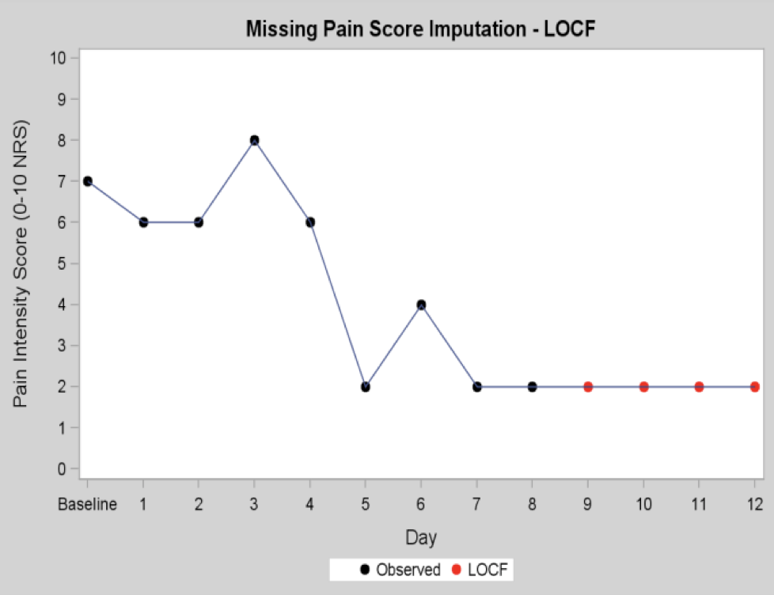
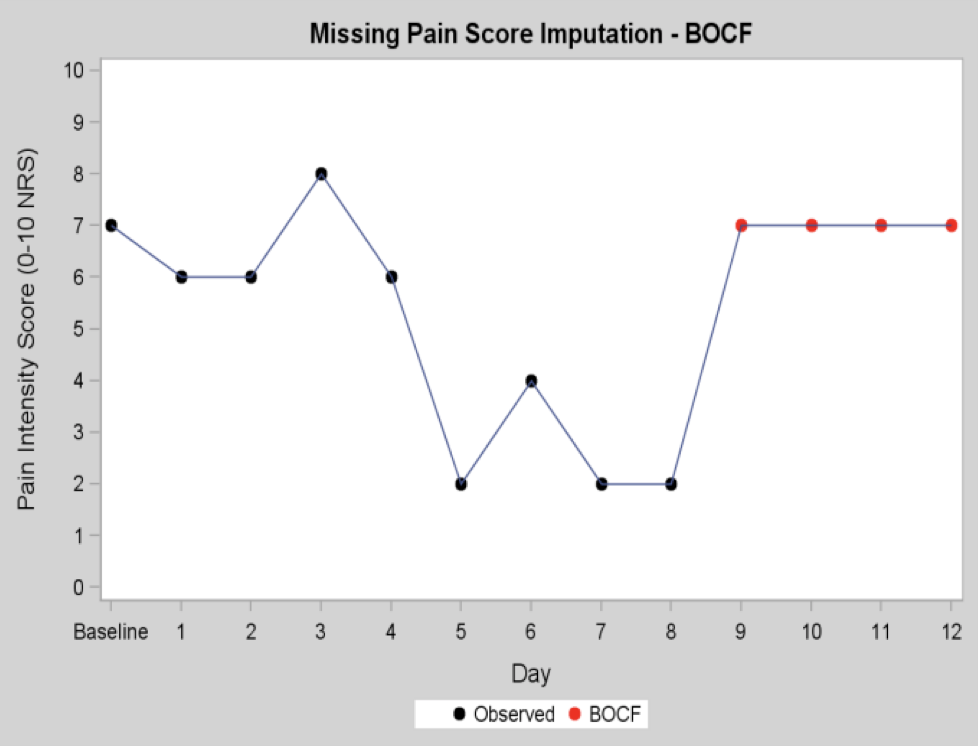
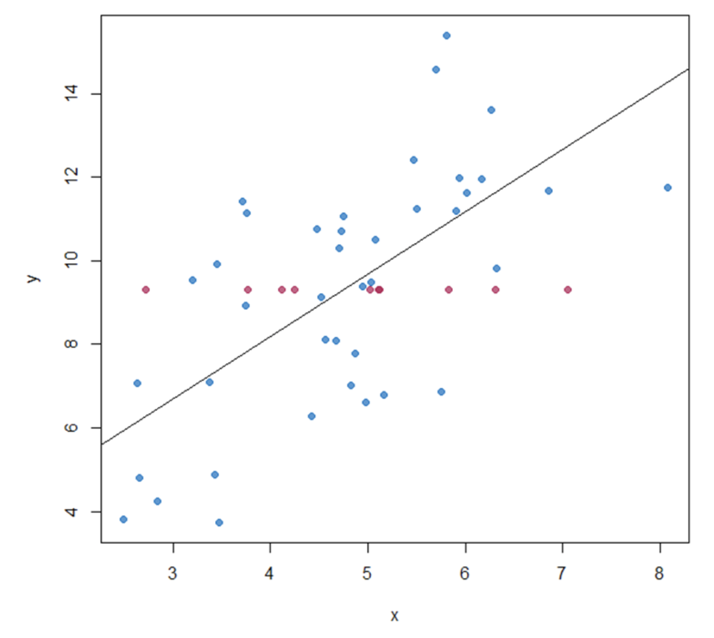
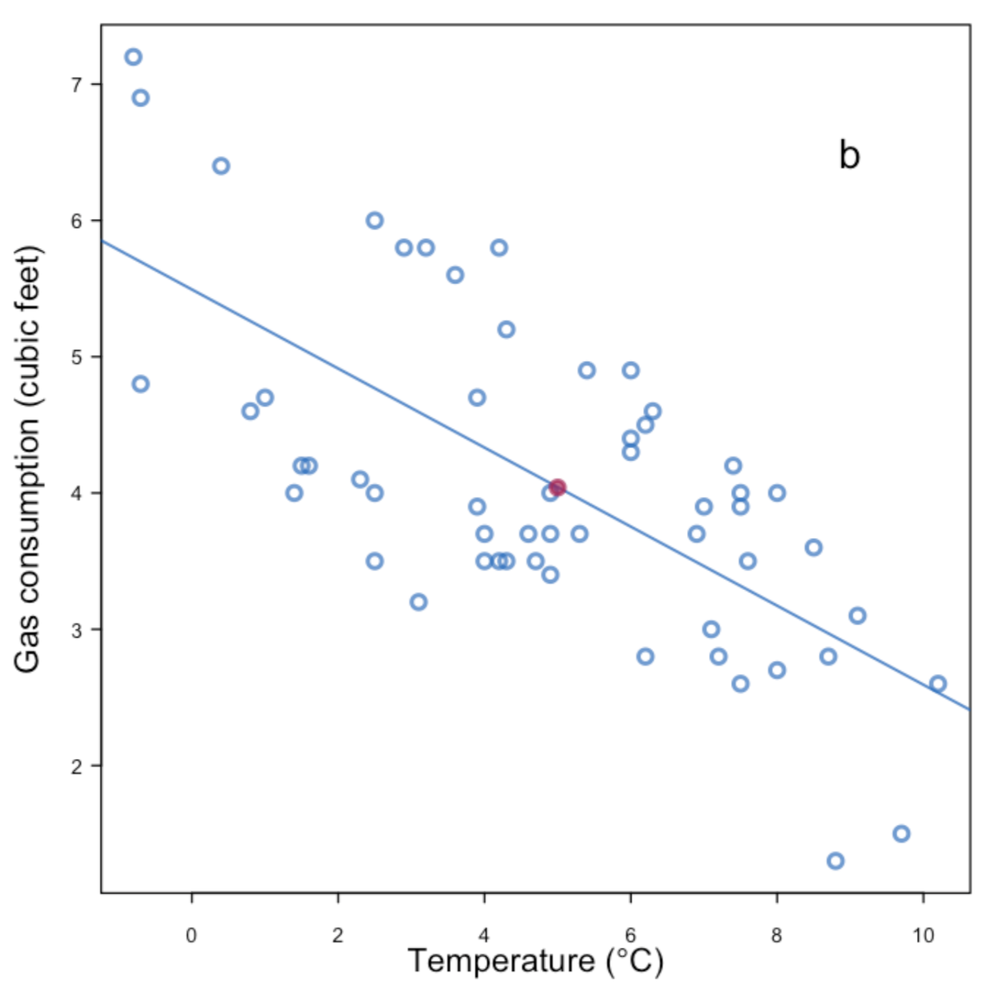
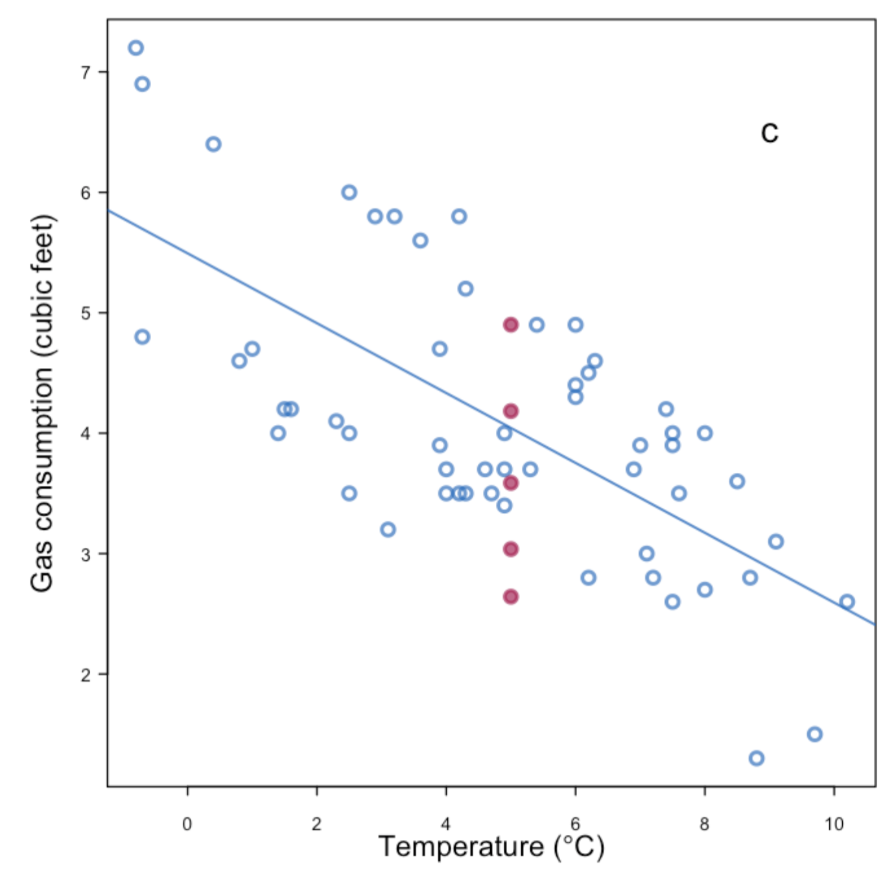
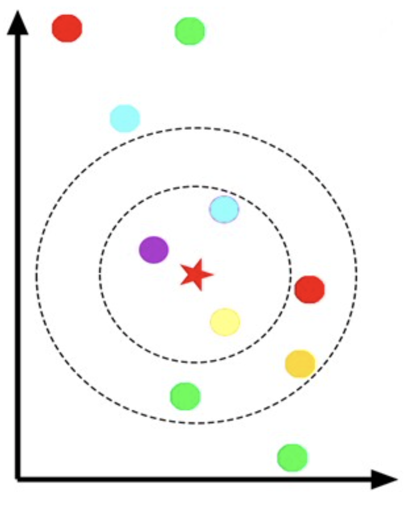
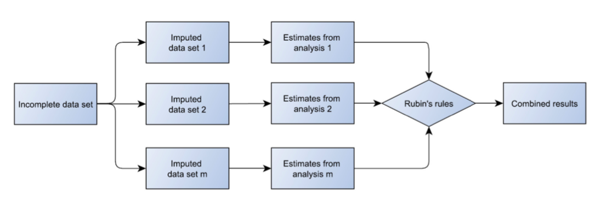
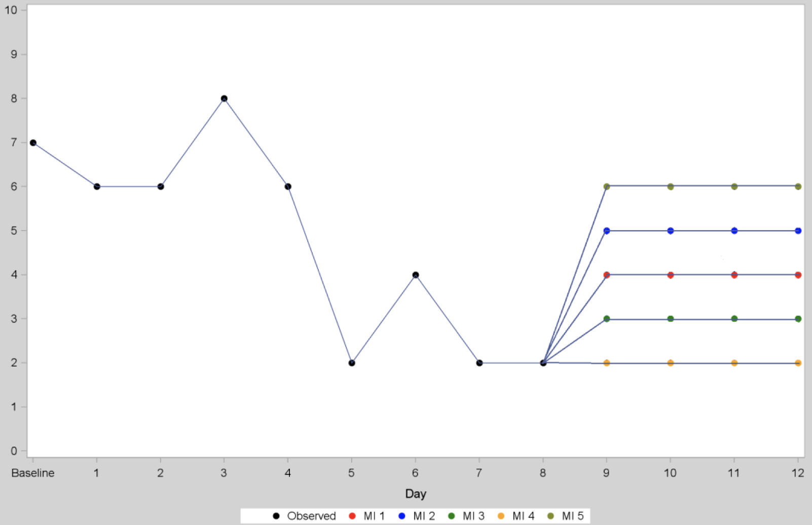

 

```{r setup, include=FALSE, echo = FALSE,message = FALSE, error = FALSE, warning = FALSE}
knitr::opts_chunk$set(echo = TRUE)

# <!-- ---------------------------------------------------------------------- -->
# <!--                    1. load the required packages                       -->
# <!-- ---------------------------------------------------------------------- --> 

# if(!require(psych)){install.packages("psych")}

packages<-c("tidyverse", "kableExtra", "gtsummary",
            "Hmisc","htmltools","clinUtils","sjPlot",
            "lme4","lattice","minqa","nlme","lmerTest")
ipak <- function(pkg){
  new.pkg <- pkg[!(pkg %in% installed.packages()[, "Package"])]
  if (length(new.pkg)) 
    install.packages(new.pkg, dependencies = TRUE)
  sapply(pkg, require, character.only = TRUE)
}
ipak(packages)
 

# <!-- ---------------------------------------------------------------------- -->
# <!--                        2. Basic system settings                        -->
# <!-- ---------------------------------------------------------------------- -->
setwd(dirname(rstudioapi::getSourceEditorContext()$path))
getwd()
Sys.setlocale("LC_ALL","English")

# convert backslash to forward slash in R
# gsub('"', "", gsub("\\\\", "/", readClipboard()))

## get the path
# rstudioapi::getSourceEditorContext()$path
# dirname(rstudioapi::getSourceEditorContext()$path)

## set working directory
# getwd()
# setwd("c:/Users/zbai/Desktop")
# Sys.setlocale("LC_ALL","English")

## get the R Version
# paste(R.Version()[c("major", "minor")], collapse = ".")

## convert backslash to forward slash 
# scan("clipboard",what="string")
# gsub('"', "", gsub("\\\\", "/", readClipboard())) 

# Load all r functions
# The directory where all source code files are saved.
source_code_dir <- "C:/Users/baiz/Downloads/Data-Analyst-with-R/Function/ZB Function/"  
file_path_vec <- list.files(source_code_dir, full.names = T)
for(f_path in file_path_vec){source(f_path)}

# <!-- ---------------------------------------------------------------------- -->
# <!--                         3. Import the datasets                         -->
# <!-- ---------------------------------------------------------------------- -->

# <!-- ---------------------------- -->
# <!-- --3.1 Import csv data ------ -->
# <!-- ---------------------------- -->

# pfad <- "~/Desktop/SASUniversityEdition/myfolders/Daten"
# mydata1 <- read.csv(file.path(pfad, "yourcsv_data.csv"), 
#                     sep=";", 
#                     header=TRUE)   

# Import all csv data from folder
# list_csv_files <- list.files(path = "./csvfolder/")
# do.call(rbind, lapply(list_csv_files, function(x) read.csv(x, stringsAsFactors = FALSE)))

# <!-- ---------------------------- -->
# <!-- --3.2 Import xlsx data ----- -->
# <!-- ---------------------------- -->

# library(readxl)
# mydata2 <- read_excel("C:/Users/zbai/Documents/GitHub/R-Projects/SAS/Yimeng/results-text.xlsx")

# <!-- ---------------------------- -->
# <!-- --3.3 Import sas7dbat data - -->
# <!-- ---------------------------- -->

# library(sas7bdat)
# mydata3 <- read.sas7bdat("~/Desktop/SASUniversityEdition/myfolders/Daten/uis.sas7bdat")

# Import all sas7dbat data from SASfolder
# ZB.import.sas.folder("./SASfolder/")

# <!-- ---------------------------- -->
# <!-- --3.4 Import from copyboard --->
# <!-- ---------------------------- -->
# copdat <- read.delim("clipboard")
# Data_D01 <- copdat

# <!-- ---------------------------------------------------------------------- -->
# <!--                           4. Some Tools                                -->
# <!-- ---------------------------------------------------------------------- -->

# To check out vignettes for one specific package
# browseVignettes("sjPlot")      # sjPlot for Models Summary
# browseVignettes("kableExtra")
# browseVignettes("gtsummary")
# <!-- ---------------------------------------------------------------------- -->
```


<!-- ----------------------------------------- -->
<!-- -----------Mind Map of ToC--------------- -->
<!-- ----------------------------------------- -->


<!-- ----------------------------------------- -->
<!-- --------------CSS Define----------------- -->
<!-- ----------------------------------------- -->
<style>
.bold-list-257f96 + ol {
    font-weight: 900;
    color: #257f96;
}
.bold-list-ff9900 + ol {
    font-weight: 900;
    color: #ff9900;
}
</style>
<!-- ----------------------------------------- -->


# Introduction

## Monotone and non-monotone missing data


In clinical trials, a participant may miss some visits, leading to gaps in data collection. This type of missing data is often referred to as “non-monotone missing,” “intermediate missing,” or “intermittent missing.” This occurs because the status of the measurement for a participant can fluctuate between missing and non-missing as the trial progresses. Often, this kind of missingness is not related to the study condition or treatment. However, in some instances, it may reflect a temporary but significant worsening of the participant’s health condition, such as pulmonary exacerbations in lung diseases.

In contrast, "monotone missingness" describes a scenario where data for a participant is consistently unavailable after a certain time point in the trial. Once data starts to be missing in this pattern, it remains missing for all subsequent visits. This type of missingness typically arises when participants discontinue their involvement in the study early. In most trials, the volume of monotone missing data is substantially greater than non-monotone missing data. Although intermittent missing data might have less impact on the primary analysis in trials where the primary endpoint involves measurements at specific times, it can still influence the study conclusions. This influence occurs particularly when intermediate data are included in statistical models, as their absence can skew the estimated parameters of these models.

**Types of Missing Data Patterns:**

- **Univariate Missing Data:** This is the simplest form where data is missing from a single variable.
- **Multivariate Missing Data:** This involves missing data across multiple variables and presents more complex patterns:
  - **Monotone Pattern:** If one variable is missing, it implies that subsequent measurements will also be missing. This pattern often occurs in longitudinal studies where a participant's dropout leads to missing subsequent data. Monotone patterns are typically easier to address with imputation methods that require simpler assumptions, efficiently handled by procedures like PROC MI.
  - **Non-monotone Pattern:** There is no systematic relationship between the missingness of different variables. The most common is the generalized or arbitrary pattern, where missing observations are distributed across cases and variables without any systematic approach. This pattern might be addressed using more complex imputation methods such as Markov chain Monte Carlo (MCMC) or fully conditional specification (FCS), both of which are available in PROC MI.

Understanding these patterns is crucial for appropriately addressing missing data in clinical trials to ensure the reliability and validity of the study outcomes.


```{r, echo=FALSE, fig.align="center", out.width = '60%',fig.cap="Figure: Monotone Missing Data Pattern"}
knitr::include_graphics("./02_Plots/MI/MI_PatterMonotone.png")
```


```{r, echo=FALSE, fig.align="center", out.width = '60%',fig.cap="Figure: Generalized Pattern of Missing Data"}
knitr::include_graphics("./02_Plots/MI/MI_PatterGeneralized.png")
```


##  Missing Mechanisms

The classifications of missing data mechanisms introduced by Rubin (1976; 1987) and Little and Rubin (2002) provide a formal framework that describes how missingness mechanism may affect inferences about the clinical outcome. A value of a clinical outcome variable is said to be missing completely at random (MCAR) when its missingness is independent of observed and unobserved data, that is, when observed outcomes are a simple random sample from complete data; missing at random (MAR) when, given the observed outcomes and the statistical model, missingness is independent of the unobserved outcomes; and missing not at random (MNAR) when missingness is not independent of unobserved data, even after accounting for the observed data. 
* **Missing completely at random (MCAR)**: The probability of a data point being missing is the same for all cases. The missing data is independent of both observed and unobserved data. For example, responses missing due to a random technical error in data collection.
* **Missing at random (MAR)**: The probability of a data point being missing is related to the observed data but not the unobserved data. For example, younger individuals are less likely to respond to a survey question about retirement plans, but the missingness is not related to their actual retirement plans (which is unobserved).
* **Missing not at random (MNAR)**: The probability of a data point being missing is related to unobserved data. For example, individuals with lower income might not disclose their income levels, and thus, the missingness is related to the actual values of the missing data.

We can test for dependence of missingness on observed outcomes, and so test for MAR versus MCAR. However, we cannot test whether the mechanism is MAR versus MNAR, because that would require testing for a relationship between missingness and unobserved data. Unobserved data, we think it is no harm to repeat, is not there, and so the relationship with missingness cannot be tested.

To better understand the three missing mechanisms, we can define:

* $\mathrm{X} = (X_0, X_1, ..., X_T)$ are observations of independent variables $\mathrm{X}$ (in this thesis, the dependent variable "waist" was fully observed, but the missingness of dependent variables also applies to the following mechanism),
* $\mathrm{X_{\text{obs}}}, \mathrm{X_{\text{miss}}}$ are observed and missing part of $\mathrm{X}$,
* $\mathrm{R} = (R_0, R_1, ..., R_T)$ is a vector of missingness indicators, where $R_t = 1$ if $X_t$ is observed and $R_t = 0$ otherwise, $t=1,...,T$.


Data are considered MCAR when the missing of observation is completely independent of the observed and the missing data, e.g., data missing due to measurement equipment failure. Under MCAR, for all missing patterns $\mathrm{r}$,
$$\mathbb{P} (\mathrm{R} = \mathrm{r} | \mathrm{X}) = \mathbb{P} (\mathrm{R} = \mathrm{r}).$$
The observed and missing data distribution is identical, data missing is completely unsystematic, and the observed (or missing) data are random sub-samples of complete data. Theoretically, estimation ignoring the missing values can provide unbiased results but maybe less precise (loss of power). However, MCAR is a strict assumption and is unlikely to be satisfied in practice, so this study did not assume MCAR.

This study assumed that the data missing were MAR. Compared with MCAR, MAR requires less strict assumptions about missing reasons. Under MAR, there is a connection between the probability of missingness and observed data. E.g., poor health of the patient at the study start may increase the possibility of research discontinuation. Formally, 
$$\mathbb{P} (\mathrm{R} = \mathrm{r} | \mathrm{X}) = \mathbb{P} (\mathrm{R} = \mathrm{r}|\mathrm{X_{\text{obs}}}).$$
Given the observed data, the probability of missing is independent of the missing value, the missing values can be predicted from the observed values. Although imputing predicted values without accounting for the uncertainty may lead to over-optimistic prediction (Roderick et al., 2002), multiple imputation can compensate for this. 

When the data is neither MCAR nor MAR, the probability of missing is systematically related to the missing observations, the data are MNAR, i.e., the probability of data being missing depends not only on observed but also on unobserved values. 
$$\mathbb{P} (\mathrm{R} = \mathrm{r} | \mathrm{X}) \neq \mathbb{P} (\mathrm{R} = \mathrm{r}|\mathrm{X_{\text{obs}}}).$$
E.g., patients with depression often do not provide information about their emotional state. However, the multiple imputation only applicable to MAR and MCAR, when the data contains MNAR, the parameter estimation using multiple imputation may be biased. 

### MAR vs LOCF{-}

Assuming that data are Missing At Random (MAR) can offer a more credible and robust approach for estimating treatment efficacy in clinical trials compared to the Last Observation Carried Forward (LOCF) method. Here’s why the MAR assumption generally provides better results:

1. **Realistic Handling of Missing Data**: The MAR assumption posits that the missingness of data depends only on observed data, not on unobserved data. This means that any differences in missing data can be explained by differences in observed data, which can be adjusted for in the analysis. In contrast, LOCF assumes that there is no change after the last observed data point, which can be unrealistic, especially in progressive diseases like Parkinson's disease.

2. **Better Statistical Techniques**: Under the MAR assumption, advanced statistical methods such as Mixed Models for Repeated Measures (MMRM) or Multiple Imputation (MI) can be used. These methods utilize all available data, including the partial data from subjects who discontinued the study, to make inferences about the missing values. This contrasts with LOCF, which simply extends the last observed data point without considering subsequent data or trends.

3. **Incorporation of Uncertainty**: Methods like MI that are used under the MAR assumption acknowledge the uncertainty associated with missing data by creating multiple imputed datasets. These methods estimate the missing values based on the distribution of observed data and provide a range of plausible values, which are then averaged to get more robust estimates. This process reflects the inherent variability in clinical data, unlike LOCF, which treats the imputed value as a certain and fixed data point.

4. **Reflecting Disease Progression**: MAR-based methods can more accurately model the likely trajectory of a disease or condition because they use patterns found in the observed data. For instance, if patients typically show worsening symptoms as a trial progresses, MAR-based imputation can reflect this trend in the imputed values for dropouts, whereas LOCF would not adjust for this progression.

5. **Regulatory and Scientific Acceptance**: The MAR assumption is often more aligned with regulatory guidelines and scientific consensus, which increasingly favor methods that can handle the complexities of real-world data. Regulatory bodies often require demonstration that analyses have adequately dealt with the issue of missing data, and MAR provides a framework for this.

6. **Utilization of All Data**: Unlike LOCF, which disregards any changes after the last observed point, MAR allows for the use of all observed data up to the point of dropout to inform the imputation of missing values. This makes full use of the data collected and can lead to more accurate and informative results.


### MNAC vs MAR {-}

However, sometimes we may feel we cannot justify the assumption of MAR clinically. In other instances, the regulator may judge that MAR is too favorable an assumption with regard to the experimental arm, and an outcome worse than that assumed by MAR should be imputed.

When data may be missing not at random (MNAR), this indicates that the missingness depends on unobserved data, which complicates the analysis as standard methods like MAR (Missing At Random) might not be suitable. Several approaches can help handle this situation more appropriately, ensuring that the analysis accounts for the potential biases introduced by MNAR data:

1. **Selection Models**

Selection models are useful for handling MNAR data by jointly modeling the missingness and the outcomes. These models:

- Assume a dependency between the probability of missingness and the unobserved outcomes.
- Can be specified with assumptions about the relationship's strength (e.g., forcing the coefficient to a particular value).
- Help to quantify the influence of missingness on the study conclusions.

2. **Shared Parameter Models**

Shared parameter models introduce a latent variable that correlates with both the outcomes and the missingness mechanism. This approach:

- Assumes that, conditional on this latent variable, the missingness is independent of the unobserved outcomes.
- Is often used to investigate the strength of the MNAR link and to adjust the analysis accordingly.

3. **Pattern-Mixture Models (PMMs)**

Pattern-mixture models explicitly model the different missing data patterns as distinct 'mixtures' or groups. They:

- Allow for different assumptions about outcomes for different missing data patterns.
- Can be customized to reflect worse outcomes for dropouts if clinically justified, such as in chronic conditions where discontinuations might indicate worsening symptoms.

4. **Multiple Imputation (MI) for MNAR**

Multiple Imputation can be adapted to handle MNAR assumptions by modifying the imputation model to include variables related to the likelihood of missingness. This involves:
- Using external information or expert opinion to specify how the missing data process depends on unobserved values.
- Imputing missing data several times under varied assumptions to reflect uncertainty and assess sensitivity to the MNAR assumption.

5. **Sensitivity Analyses**

Sensitivity analyses are crucial when dealing with MNAR data, as they help to understand how robust the study findings are to different assumptions about the missing data. These analyses:
- Test various scenarios regarding the relationship between missingness and unobserved data.
- Often use supplementary methods like inverse probability weighting or supplementary variables that might influence the probability of missingness.

**Stress-testing study results for robustness to missing data assumptions is a crucial aspect of ensuring that clinical trial findings are reliable and valid. This involves assessing how sensitive the results are to various assumptions about the nature of the missing data.**

### Formal definitions of MCAR, MAR and MNAR {-}

Missing data mechanisms are often classified as missing completely at random (MCAR), missing at random (MAR) or missing not at random (MNAR) as per the terminology introduced by Rubin (1976) and Little and Rubin (2002). These types of missingness can be formally defined as follows, using notation similar to that of Molenberghs and Kenward (2007). Consider the full data density of the study outcome (including both missing and observed outcomes):
$$
f(\boldsymbol{y}, \boldsymbol{r} \mid \boldsymbol{W}, \boldsymbol{F}, \boldsymbol{\theta}, \psi)=f(\boldsymbol{y} \mid \boldsymbol{W}, \boldsymbol{\theta}) f(\boldsymbol{r} \mid \boldsymbol{y}, \boldsymbol{F}, \psi)
$$
where $\boldsymbol{y}$ is a matrix of outcomes, $\boldsymbol{r}$ is the matrix of missingness indicators, $\boldsymbol{W}$ and $\boldsymbol{F}$ are the design matrices for $\boldsymbol{y}$ and $\boldsymbol{r}$, respectively, and the corresponding parameter vectors are $\theta$ and $\psi$. Under MCAR, missingness is independent of outcomes, and we can transform (1.1) as follows:
$$
\begin{gathered}
f(\boldsymbol{y}, \boldsymbol{r} \mid \boldsymbol{W}, \boldsymbol{F}, \boldsymbol{\theta}, \psi)=f(\boldsymbol{y} \mid \boldsymbol{W}, \boldsymbol{\theta}) f(\boldsymbol{r} \mid \boldsymbol{F}, \boldsymbol{\psi}) \\
\text { and consequently } \\
f\left(\boldsymbol{y}_{\text {obs }}, \boldsymbol{r} \mid \boldsymbol{W}, \boldsymbol{F}, \boldsymbol{\theta}, \psi\right)=f\left(\boldsymbol{y}_{\text {obs }} \mid \boldsymbol{W}, \boldsymbol{\theta}\right) f(\boldsymbol{r} \mid \boldsymbol{F}, \psi)
\end{gathered}
$$
where $\boldsymbol{y}_{\text {obs }}$ is the observed subset of outcomes $\boldsymbol{y}$. In this case, we can treat $\boldsymbol{y}$ as independent of the missingness $\boldsymbol{r}$.

Under MAR, $\boldsymbol{y}$ is independent of missingness $\boldsymbol{r}$, given the observed subset of outcomes $\boldsymbol{y}_{\text {obs }}$ :
$$
\begin{gathered}
f(\boldsymbol{y}, \boldsymbol{r} \mid \boldsymbol{W}, \boldsymbol{F}, \boldsymbol{\theta}, \psi)=f(\boldsymbol{y} \mid \boldsymbol{W}, \boldsymbol{\theta}) f\left(\boldsymbol{r} \mid y_{o b s}, \boldsymbol{F}, \boldsymbol{\psi}\right) \\
\text { and consequently } \\
f\left(\boldsymbol{y}_{o b s}, \boldsymbol{r} \mid \boldsymbol{W}, \boldsymbol{F}, \boldsymbol{\theta}, \psi\right)=f\left(\boldsymbol{y}_{o b s} \mid \boldsymbol{W}, \boldsymbol{\theta}\right) f\left(\boldsymbol{r} \mid y_{o b s}, \boldsymbol{F}, \boldsymbol{\psi}\right)
\end{gathered}
$$

Under MNAR, missingness depends on unobserved outcomes, and we cannot transform (1.1) using independent factors for observed outcomes and missingness as we can under the MCAR and MAR assumptions. In this case, the joint distribution has to be treated as follows:

$$
f\left(\boldsymbol{y}_{o b s}, \boldsymbol{r} \mid \boldsymbol{W}, \boldsymbol{F}, \boldsymbol{\theta}, \psi\right)=\int f(\boldsymbol{y} \mid \boldsymbol{W}, \boldsymbol{\theta}) f(\boldsymbol{r} \mid \boldsymbol{y}, \boldsymbol{F}, \psi) d \boldsymbol{y}_{m i s}
$$

These definitions of the types of missingness are conditional on the statistical model used. Some authors (including Little and Rubin as cited) do not make the definitions conditional on the statistical model, but since the correctness of the model is important in practice, we follow Verbeke and Molenberghs (2000) and Molenberghs and Kenward (2007) in including it in the definition.

 

## Missing Data and Study Objectives

Clinical trial researchers and regulatory authorities are concerned about the effect of missing data on two aspects of the clinical data analysis: 

1. **the estimates of the difference between experimental and control treatments**, and 
2. **the variance of this estimate**

With respect to the difference between treatments, missing data can affect (and can bias) the magnitude of that estimate and make the experimental treatment look more or less clinically efficacious than it is (in the extreme cases even reverse a true comparison) or obscure an important interplay between treatment efficacy and tolerability. With regard to the variance of this estimate, missing data can either compromise the power of the study or, on the contrary, lead to underestimation of the variance, depending on the method chosen for analysis. Regulatory authorities require reasonable assurances that the chosen method of analysis in the presence of missing data is not likely to introduce an important bias in favor of the experimental treatment and will not underestimate the variance


## Formulate Strategies for Missing Data

Formulating a strategy for handling missing data in clinical trials involves several critical steps, from the design phase through to the analysis and reporting stages. Here’s a comprehensive approach to creating an effective strategy:

1. **Preventive Measures**
- **Design and Implementation**: From the outset, the study design should aim to minimize missing data. This can involve choosing robust study methods, ensuring frequent follow-ups, offering participant incentives, and using electronic data capture systems to prevent data loss.
- **Training and Monitoring**: Training staff and monitoring data collection processes regularly can reduce errors and improve data completeness.

2. **Assumption Setting**
- **Identifying Likely Patterns**: Use historical data and preliminary studies to predict and understand potential patterns of missingness and outcome. This understanding will guide the selection of appropriate statistical methods.
- **Choosing Primary Assumptions**: Often, the MAR assumption is used because it's generally less biased under many scenarios. However, each trial might require a different approach based on the characteristics of the disease, treatment, and patient population.

3. **Statistical Modeling and Analysis**
- **Primary Analysis**: The main analysis should be robust under reasonable assumptions (often MAR). The method should ideally not overestimate the efficacy of the treatment under study.
- **Sensitivity Analysis**: Implement sensitivity analyses to evaluate the impact of different missing data assumptions, including MNAR scenarios that might unfavorably affect the treatment. This helps understand the robustness of the primary results.
- **Using Advanced Models**: Depending on the complexity and amount of missing data, consider employing advanced models like Multiple Imputation, Pattern-Mixture Models, and Selection or Shared Parameter Models.

4. **Regulatory Guidance and Reporting**
- **Following Guidance**: Ensure that the study design and analysis conform to the latest regulatory guidelines issued by bodies such as the FDA or EMA.
- **Transparency**: Be clear and transparent about the assumptions made, the rationale behind them, and the methods used for handling missing data in both the study protocol and reports.
- **Documentation**: Document all analyses, including sensitivity analyses, thoroughly in the clinical study report.

5. **Continuous Evaluation**
- **Review and Adjust**: Continually review the effectiveness of the missing data strategy throughout the trial and adjust as necessary based on interim analyses and feedback.
- **Learning from Each Phase**: Use insights gained from handling missing data in early-phase trials to refine strategies for later-phase trials.


# Regulatory Guidance


**Key Points**

- The ICH E9 guideline, issued in 1998, covers many important aspects regarding missing data. This guideline has the advantage of being widely accepted in Japan and other countries outside the United States and Europe that utilize clinical trial results.
  
- Current positions of the European Union (EU) and US regulatory agencies on handling missing data are outlined in an official European Medicines Agency (EMA) guideline and in a U.S. Food and Drug Administration (FDA) sponsored report by a U.S. National Research Council (NRC) panel.
  
- The EU guideline and the US NRC report, hereafter referred to as “the regulatory documents,” agree on most important areas.
  
- Regulators concur that methods for handling missing data are crucial in interpreting study results; that missing data should be prevented; that no single method will "cure" the missing data problem; that primary analysis requires sensitivity analyses to assess its robustness to assumptions about missing data; that methods for handling missing data should be described and justified in the study protocol; and that better use should be made of post-withdrawal data.
  
- There are differences in emphasis between the NRC report and the EU guidance document regarding the use of the last observation carried forward (LOCF); the importance of a “conservative” approach; post hoc analyses; and handling intermediate or non-monotone missing data.
  
- The NRC report emphasizes the importance of clearly describing the assumptions made about missing data in terms that can be understood by clinicians.
  
- The regulatory documents offer some useful comments on classes of methods for handling missing data, including the use of available cases; the assumption of missing at random (MAR); and methods assuming that data are missing not at random (MNAR).
  
- In practice, while the latest regulatory documents are not always adhered to by regulators, there is a growing tendency for regulators to treat the handling of missing data as important and to apply the principles outlined in these documents.

## International conference on harmonization guideline: Statistical principles for clinical trials: E9

The International Conference on Harmonization (ICH) guideline, "Statistical Principles for Clinical Trials: E9," established in 1998, remarkably addresses many concepts that were later echoed in more recent regulatory documents by the European Medicines Agency (EMA, 2010) and the National Research Council (NRC, 2010), a full 12 years prior to their publication. This guideline is notably recognized and utilized by Japan and other countries outside the United States and Europe that depend on clinical trial results. Here are key points of overlap with the NRC report and EU guidance, along with page references to the ICH guideline:

- **Prevention of Missing Data**: Emphasized as a priority where possible (pp. 8, 22, 24).
- **Handling Missing Data**: Acknowledged that there are “no universally applicable methods” for managing missing data (p. 22).
- **Sensitivity Analysis**: The guideline advises investigating the “sensitivity of the results to the method of handling missing data” (p. 24).
- **Protocol Definitions**: Stresses that methods for dealing with missing data should be “pre-defined in the protocol” (p. 24).
- **Documentation of Withdrawals**: Calls for making a record of the reasons for withdrawal; “frequency and type of ... missing values should be documented” (p. 22).

Furthermore, similar to the recent EU guidance, the ICH E9 specifically recommends that the study report should describe the extent of missing data and the reasons for discontinuation (ICH E9, p. 30).

However, the ICH E9 guideline differs from the more recent regulatory documents regarding the approach to single imputation. Unlike newer guidelines, the ICH E9 mentions the use of last observation carried forward (LOCF) without expressing disapproval, suggesting: “Imputation techniques, ranging from the carrying forward of the last observation to the use of complex mathematical models, may also be used in an attempt to compensate for missing data” (ICH E9, p. 23). This approach marks a significant divergence from more recent guidelines, which discuss in detail the strengths and weaknesses of common assumptions about missing data. 

## US and EU Regulatory Documents

The regulatory approaches to handling missing data in clinical trials differ notably between the United States and the European Union, although the core principles tend to align. These differences are embodied in the documents each region has issued, which were both released in July 2010, reflecting their perspectives and regulatory frameworks.

### United States: NRC Report {-}

In the US, the document titled **"The Prevention and Treatment of Missing Data in Clinical Trials,"** commissioned by the FDA and authored by a panel from the National Research Council (NRC, 2010), serves a dual purpose. Not only does it provide recommendations on addressing the issue of missing data in clinical trials, but it also delves into the statistical theories underpinning various methods used to analyze missing data. This comprehensive report, which spans 145 pages, functions partially as an educational resource, detailing the statistical methodology with an academic tone that includes extensive references to the literature on missing data—featuring more than seven pages of citations.

**NRC Principles for Handling Missing Data**

1. **Examine the Nature of Missingness**:
   - **Context-Specific Approaches**: Understand the specific circumstances leading to missing data. For example, a missing CD4 count due to patient death cannot be treated as Missing At Random (MAR) and requires a specific approach that acknowledges the reason for missingness.

2. **Define a Robust Estimand**:
   - **Regulatory and Practical Acceptance**: Choose an estimand (the target of estimation) that remains meaningful despite missing data. This should align with the study's objectives and be acceptable to all stakeholders including clinicians, patients, and regulators.

3. **Document Reasons for Missing Data**:
   - **Comprehensive Tracking**: Maintain detailed records of why data are missing, which can help in understanding patterns and reasons behind the missingness and aid in subsequent analyses.

4. **Transparent Assumptions**:
   - **Accessibility**: Establish primary assumptions about missing data that are clear and justifiable, making them easily understandable for clinicians involved in the study.

5. **Valid Analysis Under Assumptions**:
   - **Consistent Methodology**: Ensure that the analysis method chosen is valid under the set assumptions about the nature of the missing data.

6. **Perform Sensitivity Analyses**:
   - **Testing Robustness**: Conduct sensitivity analyses to explore the impact of deviations from the primary assumptions. This helps to assess how changes in these assumptions could affect the study conclusions.
   
### European Union: EMA Guideline {-}

Conversely, the European Medicines Agency (EMA) issued the **"Guideline on Missing Data in Confirmatory Clinical Trials"** (2010), which is considerably more succinct, totaling just 12 pages. Unlike the expansive NRC report, the EMA guideline focuses primarily on the regulatory acceptability of different approaches to handling missing data, commenting on the statistical basis only to the extent necessary for regulatory discussions. The guideline is straightforward, with minimal references, citing only two other guidance documents, emphasizing its function as a direct regulatory tool rather than an educational text.

**EU Guidelines on Planning for Missing Data**

- **Pre-specification of Analyses**:
  - **Use of Historical Data**: Utilize data from previous studies to inform the assumptions about missing data, such as the likely proportion and timing of withdrawals.
  - **Analysis Planning**: Clearly define the primary analysis and the range of sensitivity analyses in the study protocol based on expected patterns and reasons for missing data.

- **Consideration of Withdrawal Factors**:
  - **Anticipating Differences**: Consider potential differences in the reasons for withdrawals across treatment groups which could influence the analysis.
  - **Trajectory of Response**: Anticipate the likely trajectory of the primary response over time, which can help in selecting appropriate methods for handling missing data.
  
### Key Points {-}

The regulatory documents from both the NRC (National Research Council) and the EU (European Medicines Agency) present a logical and rigorous approach to handling missing data in clinical trials. Here's a summary of the key points articulated in these documents:

1. **Importance of Handling Missing Data**:
   - **Impact on Validity**: Missing data can significantly impact the validity, bias, and interpretation of clinical trial results. Both documents stress that ignoring missing data is not acceptable.
   - **Regulatory Scrutiny**: The EU guideline, as official guidance, underscores that future regulatory reviews of missing data will be more stringent.

2. **Prevention of Missing Data**:
   - **Proactive Measures**: Both the NRC and EU emphasize the importance of preventing missing data wherever possible. The NRC report dedicates extensive discussion to this topic, illustrating various preventive strategies.

3. **Limitations of Assumptions About Missing Data**:
   - **Uncertainty of Assumptions**: Since missing data are inherently unverifiable, no single method can comprehensively address all issues related to missing data. This underlines the need for multiple approaches and sensitivity analyses.

4. **Necessity of Sensitivity Analyses**:
   - **Robustness Testing**: Sensitivity analyses are crucial to test how robust the study results are to the assumptions made in the primary analysis. This helps validate the findings despite the presence of missing data.

5. **Pre-specification and Justification in Protocol**:
   - **Scientific Justification**: Approaches to handling missing data should be specified in advance in the study protocol and justified based on scientific reasoning. The EU guideline acknowledges the inherent imperfections in any planned approach but demands that any biases should not unduly favor the experimental treatment.

6. **Handling Post-withdrawal Data**:
   - Post-withdrawal data may be helpful in estimating treatment effect or in sensitivity analyses, but will need to be put in context. Sponsors are “strongly encouraged” to collect post-withdrawal data (EU guideline, p. 6, and see NRC Recommendation 3, p. 3). Such data could be used to provide a true intent-to-treat (ITT) analysis. However, both documents note that if “participants are offered an alternative treatment that is not part of the study following discontinuation …subsequent data collection may be considered to uninformative” (NRC report, p. 9). Therefore, such “retrieved dropout” information will need “to be put in context” (EU guideline, p. 6).
   - **Use in Analyses**: Post-withdrawal data collection is encouraged to potentially aid in estimating treatment effects or conducting sensitivity analyses. Both guidelines discuss how such data should be contextualized, especially if participants receive alternative treatments post-discontinuation.

7. **Documentation of Withdrawal Reasons**:
   - **Detailed Recording**: Reasons for participant withdrawal should be meticulously documented, as they are vital for understanding and addressing the patterns of missing data.


8. **Flexibility for Post Hoc Analyses**:
   - The EMA guideline again recognizes the difficulty in specifying missing data analyses in advance by allowing for the possibility of post hoc analyses: “If unexpected missing data patterns are found in the data, it will be necessary to conduct some post hoc sensitivity analyses in addition to those pre-defined in the statistical analysis plan” (p. 7). The important proviso is that “It is not envisaged that these post hoc analyses can be used to rescue a trial which otherwise fails.”
   - **Adaptability to Unexpected Patterns**: The EU guideline allows for post hoc sensitivity analyses if unexpected patterns of missing data emerge, although these are not intended to "rescue" a failing trial.

## Regulatory Guidance on Particular Statistical Approaches

The regulatory documents from both the European Union (EU) and the U.S. National Research Council (NRC) express concerns and provide guidance on handling missing data in clinical trials, particularly addressing the use of available cases and single imputation methods like Last Observation Carried Forward (LOCF) and Baseline Observation Carried Forward (BOCF). 

The regulatory documents underscore a critical, common viewpoint: there is no one-size-fits-all method for handling missing data, and each approach carries its limitations and biases that must be carefully considered and addressed in the context of each specific clinical trial. Both the EU and NRC documents guide towards a nuanced, cautious approach to managing missing data, advocating for comprehensive planning, analysis, and reporting to enhance the credibility and reliability of clinical trial outcomes.

- **Documentation and Justification**: Both documents emphasize the importance of pre-specifying the methods for handling missing data in the study protocol and justifying them scientifically.
- **Sensitivity Analyses**: There is a consensus on the need for sensitivity analyses to test the robustness of the results against the assumptions made about the missing data.
- **Handling Post-Withdrawal Data**: While collecting data post-withdrawal is encouraged to potentially aid in sensitivity analyses, the utility of such data must be evaluated carefully, especially if participants receive alternative treatments after discontinuation.

### Available Cases {-}

- **EU and NRC Stance**: Both documents discourage using available cases as the primary analysis method because it assumes that data are Missing Completely at Random (MCAR) -- provides valid inference only under the assumption that data are missing completely at random (MCAR) and adds that “this method is generally inappropriate for a regulatory setting.” This approach might lead to biased results and affect the external validity of the trial by making the results applicable only to those who complete the study, potentially excluding a significant subset of the target population.
- **Implications**: Using only available cases might skew the study results towards those who are less likely to drop out, failing to represent the broader, intended population and potentially undermining the reliability of the trial outcomes.

### Single Imputation Methods {-}

- **Concerns with LOCF and BOCF**: Both the EU and NRC reports critique single imputation methods for potentially understating the variability and uncertainty of imputed values, thereby overestimating the statistical precision.
- **Specific Issues with LOCF**:
  - **Biased Estimates**: LOCF can be particularly misleading in studies of conditions expected to deteriorate, as it might artificially favor the treatment group if participants in this group withdraw earlier.
  - **Potential Appropriateness**: The EU acknowledges that in conditions expected to improve, LOCF might be conservatively acceptable if it can be shown that participants in the experimental group tend to withdraw earlier. This would imply that even with early withdrawal, the treatment is effective enough to show benefits at the last observation.
- **BOCF Appropriateness**: The EU guidance suggests that BOCF may be suitable in certain contexts, such as chronic pain trials, where it reflects a lack of ongoing benefit from the treatment.


### Methods that generally assume MAR {-}

The regulatory documents from both the European Union (EMA) and the U.S. National Research Council (NRC) provide a critical analysis of methods that generally assume Missing At Random (MAR), highlighting the potential pitfalls and biases associated with these assumptions in clinical trials.

- **EMA Guidance**: It acknowledges that while MAR can provide an unbiased estimate of the treatment effect if all patients had continued treatment, it is likely to overestimate the effect that would be observed in real-world practice. This is because MAR essentially ignores those who drop out, who may have worse outcomes.
- **NRC Report**: Similarly, the NRC report points out that relying on MAR generally does not yield a valid estimate of the intention-to-treat effect, as it presumes that all participants continued on treatment without accounting for dropouts.
-  The FDA-commissioned report agrees: “any method that relies on MAR is estimating the mean on the condition that everyone had remained on treatment. This generally will not provide a valid estimator of the intention-to-treat effect” (NRC report, p. 55). The NRC report also reminds us that where the mean of the response is non-linear in the explanatory variables (e.g., where the response is binary and logistic regression is used) the protocol or SAP must be clear as to whether the between-subject (population-averaged) or withinsubject (subject-specific) treatment effect is being estimated. These are identical for some variables, for example, normally distributed, but may be different for others, for example, binary variables.
- Both documents agree that any analysis based on MAR assumptions must be accompanied by sensitivity analyses. These analyses are crucial to test how the results might change if the assumptions do not hold true, addressing the inherent uncertainties and potential biases.


**Statistical Models Involving MAR**

- **Mixed Models with Repeated Measures (MMRM)**: The NRC report cautions about the dependence of MMRM on the correctness of its parametric model, noting the potential issues with the assumptions involved in estimating the variance-covariance matrix, such as the assumption of normality.
- **Multiple Imputation (MI)**: Both documents emphasize the need for careful specification and justification of the MI model used, including specifying the random seed in the case of MI to ensure reproducibility and avoid data dredging.
- **Weighted Generalized Estimating Equations (GEE)**: The EMA guideline advises pre-specifying the model to prevent data dredging, a common risk in statistical modeling. A recent improvement in GEE methodology includes a version that is doubly robust, which remains valid if either the model for missingness or the model for responses is correct. However, the NRC report indicates that more real-world applications and simulation studies are needed to fully understand the operating characteristics of this method.


- **Estimands**: The NRC report discusses various possible estimands that can be meaningful even when there is missing data. It notes the importance of defining what exactly is being estimated, particularly in trials with significant dropout rates.
- **Handling of MAR in Practice**: Despite the reservations about MAR, it is not entirely ruled out as a viable assumption in many cases. The NRC report acknowledges that MAR might often be the primary assumption, while the EU guideline suggests that the analysis should not be biased significantly in favor of the experimental treatment under reasonable assumptions, leaving room for MAR to be justified in certain contexts.
- **Caution with Random Effects Models**: The NRC report advises using random effects models with caution, ensuring that all assumptions are clearly spelled out and justified.

### Methods that are used assuming MNAR {-}

Methods for handling missing data under the assumption that data are Missing Not at Random (MNAR) include more sophisticated statistical models that acknowledge the possible dependency of missingness on unobserved data. Below is a detailed discussion of three principal methods mentioned in regulatory guidelines: Pattern-Mixture Models (PMMs), Selection Models (SEMs), and Shared Parameter Models (SPMs).

- **Regulatory Guidance**: Both the EMA and NRC emphasize the need for clarity and justification of the assumptions used in these models. They suggest that these methods should be detailed in the study protocol and that the chosen methods should be justifiable in the context of the study's design and objectives.
- **Future Research**: Non-monotone missingness, where the patterns of missing data are not systematically related to observed variables, remains a challenging area, with ongoing research needed to develop appropriate methodologies.

#### Pattern-Mixture Models (PMMs) {-}

- **Overview**: PMMs segment data into distinct groups based on the pattern of missingness, which could be determined by factors like time of discontinuation, reason for discontinuation, or other clinically relevant categories.
- **Assumptions**: Different assumptions about the missing data can be applied to each group. For example, subjects who discontinued due to lack of efficacy might be assumed to worsen over time, a distinct assumption from those who left for administrative reasons who might be assumed to follow a MAR pattern.
- **Advantages for Sensitivity Analyses**: These models are well suited for sensitivity analyses as they explicitly distinguish between observed data distributions and the predictive distributions of missing data. This separation allows for transparent modeling, making it easier for clinicians to understand the implications of the missing data.
- **Regulatory Perspective**: The EMA guideline sees merit in presenting results under such a mixture of assumptions: “It may be appropriate to treat data missing for different reasons in different ways” (p. 11). The NRC report states that “Many pattern mixture formulations are well suited to sensitivity analyses because they explicitly separate the observed data distribution from the predictive distribution of missing data given observed data.” It adds “The models are transparent with respect to how missing observations are being imputed because the within-pattern models specify the predictive distribution directly”

#### Selection Models (SEMs) {-}

- **Methodology**: SEMs model the complete data distribution, including both observed and missing values, together with the indicator of missingness.
- **Challenges**: The main challenge with SEMs is the reliance on parametric and structural assumptions that cannot be verified since the missing data are not observed. This dependency makes it crucial to exercise caution when interpreting results from SEMs.
- **Use in Sensitivity Analyses**: SEMs allow for the estimation of the dependence of missingness on unobserved values through model parameters, making them useful for sensitivity analyses. However, the unverifiable nature of these parameters calls for a careful approach.

#### Shared Parameter Models (SPMs) {-}

- **Concept**: SPMs introduce a latent variable that affects both the likelihood of missingness and the outcomes, attempting to model the relationship between them.
- **Implementation for Sensitivity Analyses**: By manipulating the latent variable, researchers can explore different scenarios ranging from near MAR to various MNAR conditions, thus assessing the robustness of the results to the assumptions about missing data.
- **Interpretation and Use**: While potentially valuable for complex data structures, SPMs require cautious use due to the multiple layers of assumptions involved. Their complexity can make it challenging to communicate findings clearly to non-specialists.

# Handling of Missing Data

## Complete Case Analysis (CCA)

### Introduction of CCA {-}

The first and simplest approach to the problem of missing data is complete case analysis. The majority of SAS  analytic procedures default to list-wise deletion and will automatically strike any case with item missing data  from the analysis. 

**Concerns and Limitations**
  
* Minimal Impact for Small Missing Data Rates: For univariate estimates, missing data rates of 1% to 5% per variable are unlikely to cause significant bias.
* Significant Impact in Multivariate Analysis: In complex multivariate analyses, list-wise deletion can lead to substantial loss of statistical information due to a reduction in the effective sample size.
* The varying sample size due to list-wise deletion makes it difficult to maintain a consistent set of inputs across analyses.
* Reduced Precision and Potential Bias: List-wise deletion can lead to loss of precision in the results. If the missing data are Missing at Random (MAR), it can result in biased analyses.

**Solutions and Best Practices**
  
* Maximum Likelihood Estimation (MLE): In cases of higher missing data rates (5% to 10%), MLE methods are recommended. These methods use all available data (complete and incomplete cases) to make statistical inferences.
* Missing Data Imputation: Imputation involves replacing missing data with substituted values based on the observed data. This approach can maximize the use of available data, preserving sample size and reducing bias.

### CCA with Weighting Adjustments {-}

A second option for handling missing data is to analyze complete cases but introduce additional weighting  adjustments to compensate for item missing data on a key variable or set of variables.

It is mainly used in situations with monotonic missing data patterns, where large numbers of variables are missing for each case. This is common in unit nonresponse in surveys, phase nonresponse, and longitudinal attrition in panel surveys. For such patterns, a global weighting adjustment can be applied across various analyses of the data. This helps to compensate for the missing observations.

**Concerns and Limitations**
  
  * Variable-Specific Adjustments: Adjusting base weight variables for item missing data on single variables can lead to complications. Different adjustment factors might be needed for each target variable.
* Multivariate Analysis Dilemma: In a multivariate context, it becomes challenging to decide which variable-specific weights to use, as each variable might require a different adjustment.
* Restricted Access to Base Weight Data: Often, the data used for constructing the base weights is restricted, making subsequent adjustments difficult or impossible.

**Solutions and Best Practices**
  
  Imputation is generally considered a more effective strategy for addressing generalized patterns of item missing data. Imputation involves replacing missing data with estimated values, which can be a more comprehensive and flexible approach, especially when dealing with non-monotonic missing data patterns.


### Why can’t I use only the available primary {-}

The central issue with using only the available primary endpoint data from completers in clinical trials is the potential for biased results. This issue arises because the group of subjects who complete a trial without any missing data may not be representative of the entire population initially randomized. Here are the key points explaining why relying solely on this data could be problematic:

1. **Representativeness of the Sample**: The subjects who complete all trial visits and for whom complete data are available are often not representative of all subjects originally enrolled in the study. They might exhibit different characteristics, such as a higher tolerance or better response to the treatment, skewing efficacy outcomes favorably.

2. **Impact of Missing Data**: Example a significant portion of the subjects (38%) discontinued early, which creates a substantial amount of missing data. This high rate of discontinuation can reduce the statistical power of the study, meaning that the study may not detect a treatment effect that actually exists. Moreover, the reasons for discontinuation, such as adverse effects or lack of efficacy, could differ between treatment groups, introducing further bias.

3. **Bias Towards Completers**: By only analyzing data from completers, you potentially ignore the experiences of those who discontinued. This can lead to a bias where the estimated treatment effect is overly optimistic, as it reflects the outcomes of those who possibly had a better prognosis or fewer adverse reactions.

4. **Intent-to-Treat Principle**: Regulatory guidelines and best practices in clinical trials often endorse the intent-to-treat (ITT) approach, where all randomized subjects are included in the analysis regardless of their compliance with the protocol or presence at all visits. This approach provides a more realistic measure of the treatment effect across all participants, offering a view that is likely more relevant to general clinical practice.

5. **Waste of Information**: Excluding subjects who have missing data means losing any information they could provide. Even partial data from early discontinuations could be informative, especially when sophisticated statistical methods like multiple imputation or model-based approaches are used to handle the missing data.

6. **Estimating a Broader Treatment Effect**: The purpose of clinical trials is often to assess the treatment effect in a broad patient population, not just among the best-case scenario of completers. By considering all participants, including those who drop out, the trial can provide insights that are more applicable to typical clinical situations.

In summary, relying solely on data from completers can lead to biased conclusions that do not accurately reflect the true efficacy and safety of a treatment across the diverse range of patients typically treated in clinical practice. Employing methods to include or account for missing data ensures that the trial results are robust, comprehensive, and reflective of real-world outcomes.

## Inverse Probability Treatment Weighting

When dealing with the analysis of missing data, the inverse probability treatment weighting (IPTW) method is one of the fundamental approaches we can use. Its basis lies in creating weights from the inverse of the probability of receiving the treatment or being observed. These probabilities are often modeled through logistic regression or other suitable statistical methods. Specifically, for each individual \( i \) in a study with \( N \) subjects, if the individual receives the treatment, then the weight \( R_i = 1/M \), where \( M \) is the number of individuals who received the treatment, and if not, \( R_i = 0 \). This method, however, demands that every \( R_i \) is non-zero to ensure that each treated individual's probability of being included in the analysis is also non-zero, maintaining the consistency of the estimator.

For response probability models, a logistic regression model (response model) can be used to estimate the probability of response, which further refines the adjustment for selection bias. 

The average treatment effect can be estimated using the formula:

\[ \hat{\mu} = \frac{1}{N} \sum_{i=1}^{N} \frac{R_iY_i}{\pi(X_i;\hat{\theta})} \]

where \( \pi(X_i;\hat{\theta}) \) is the estimated probability of receiving treatment.

Oehlert (1992) proposed a delta method for variance estimation that can be used in conjunction with the bootstrap technique.

---

**Augmented IPW Estimator**

as suggested by Robins (1999), which is a hybrid estimator combining the IPW with an additional modeling step for the outcome (g-model). This combination is designed to improve efficiency and reduce bias even further.

The formula provided may be for the AIPW estimator, which is used to calculate an adjusted estimate of the outcome while correcting for missing data and potential confounding factors:

\[ \hat{\mu} = \frac{1}{N} \sum_{i=1}^{N} \left( \frac{R_iY_i}{\pi(X_i;\hat{\theta})} + \frac{1}{N} \sum_{i=1}^{N} (1 - \frac{R_i}{\pi(X_i;\hat{\theta})}) \hat{g}(X_i,\hat{\beta}) \right) \]

This estimator would provide an expected value of the outcome \( Y \) conditional on the covariates \( X \) while adjusting for non-response or treatment assignment bias.


## Likelihood Function

The probability of observing the outcome \( Y \) is potentially dependent on both the treatment received and the covariates \( X \). To account for this, we use the probability of the observed outcome given the treatment and covariates, \( p(Y_{obs} | X, R) \). For the missing data, the probability \( p(Y_{mis} | X, R) \) must be modeled as well, which is integrated over the missing data space to obtain a full likelihood function that can be used for estimation. When estimating the causal effect of treatment, we consider the potential outcomes framework, where \( Y(1) \) and \( Y(0) \) represent the outcome if the treatment was received and if it was not, respectively.

An assumption commonly made in this context is the assumption of "ignorable treatment assignment," where the assignment to treatment is independent of potential outcomes given covariates, symbolized as \( R \perp\!\!\!\perp (Y(1), Y(0)) | X \). This assumption allows the simplification of the full likelihood function to only consider the observed data, ignoring the counterfactuals.

We also consider the assumption of "ignorable missingness," where the missingness is independent of the potential outcomes given the observed data and covariates \( Y_{mis} \perp\!\!\!\perp (Y(1), Y(0)) | (Y_{obs}, X, R) \). This leads to a further simplification of the likelihood function and is critical in creating an unbiased estimator of the treatment effect.

The full likelihood function for the observed data is then given by integrating over the distribution of the missing data, assuming it is ignorable, which leads to the following expression:

\[ L(\theta | Y_{obs}, X, R) = \int p(Y_{obs} | X, R; \theta) p(Y_{mis} | X, R; \theta) dY_{mis} \]

In practice, the \( p(Y_{mis} | X, R; \theta) \) part of the function is ignored due to the ignorability assumption, simplifying the estimation process.

A key concept in causal inference is the assumption of "no unmeasured confounders," also known as the "exchangeability" assumption or \( Y(1), Y(0) \perp\!\!\!\perp R | X \). This implies that within levels of covariates, the potential outcomes are independent of the treatment assignment.

Schafer (1997) highlights the need for "distinctness" or "separability" of the mechanisms of treatment assignment and the outcome process, emphasizing that both processes should be considered in the estimation to avoid bias.

The likelihood function for the ignorability of the missing outcomes is expressed as:

\[ L(\theta | Y_{obs}, X, R) = \int p(Y_{obs} | X, R; \theta) dY_{mis} = p(Y_{obs} | X; \theta) \]

In the end, when we estimate the treatment effects, it is imperative to consider the treatment and outcome processes as distinct but interrelated components that together inform our understanding of the causal effect.


### Full Information Maximum Likelihood {-}
 
FIML is a maximum likelihood estimation method designed for handling missing data. It maximizes the likelihood function $L\left(\theta \mid Y_{\mathrm{obs}}\right)$, where $\theta$ represents the parameter estimates of interest, and $Y_{\text {obs }}$ represents the observed data.

In FIML, incomplete cases contribute to the estimation of parameters for which sufficient statistics are functions of the observed values. For example, if only $Y_1$ is observed, it contributes to estimating parameters like $\mu_1$ and $\sigma_1$, while observed pairs like $\left\{Y_1, Y_2\right\}$ would contribute to estimating parameters like $\sigma_{12}$. Common Applications: FIML is frequently used in structural equation modeling (SEM) and other latent variable model analyses. These analyses often assume that the full data follows a multivariate normal distribution with a parameter vector $\theta=\{\mu, \Sigma\}$.

FIML is implemented in SAS through PROC CALIS, a standard procedure for conducting SEM or related latent variable modeling.

**Challenges in FIML Applications**

* Defining Parametric Likelihood: FIML requires users to define the parametric likelihood for the data, which can be challenging, especially in complex sample survey data where weighting and informative stratification are involved.
* Complex Sample Survey Data: In such data, the presence of informative stratification and clustering makes it difficult to specify the true form of the data likelihood.

### Expectation-Maximization Algorithm {-}

The Expectation-Maximization (EM) algorithm  is an iterative method used to find maximum likelihood estimates of parameters in statistical models, particularly when the model depends on unobserved latent variables.

The EM algorithm is composed of two steps:

1. **Expectation (E) step:** Calculate the expected value of the log-likelihood function, with respect to the conditional distribution of the latent variables given the observed data, using the current estimate of the parameters.

2. **Maximization (M) step:** Find the parameters that maximize the expected log-likelihood found in the E step.

This process is repeated until the algorithm converges to a set of parameters that maximize the likelihood function.

The EM algorithm is a statistical technique used for finding ML estimates in cases with missing data. It's particularly useful when the complete data's parametric likelihood function is known.

 Iteration and Convergence: The EM cycle (E step followed by M step) repeats iteratively until the model parameters converge to stable values.

In SAS, the EM algorithm is implemented in PROC MI. If the complete data is assumed to be multivariate normal (MVN), the EM statement in PROC MI can compute ML estimates of the mean and covariance parameters.

**Limitations**

* Does Not Account for Variability: The key limitation of EM in missing data treatment is that it does not account for two sources of variability: residual variance (variability of the true values about their expectations) and imputation variability (inherent in the estimation of expected values).
* The completed dataset generated by EM is used as the starting matrix for the iterative Markov Chain Monte Carlo (MCMC) multiple imputation procedure, which addresses the variability not accounted for in the basic EM approach.


 

## Single Imputation of Missing Values {-}

Single imputation involves replacing missing values with estimated ones to create a complete dataset. Common single imputation methods include hot deck, regression imputation, and predictive mean matching. Simpler methods like mean, median, or mode imputation are generally discouraged unless the missing data is minimal.

* **Advantages:**
    * Simplicity: It creates a complete dataset that is easy to handle and analyze.
    * Bias Reduction: For data missing at random (MAR), proper multivariate single imputation can potentially reduce bias.
* **Disadvantages:**
    * Underestimation of Variability: It does not fully capture the uncertainty due to missing data, leading to underestimation of variance and overconfidence in estimates.

### Type of Simple Imputation Method {-}

  * Last-observation-carry-forward (LOCF)
  * Baseline-observation-carry-forward (BOCF)
  * Mean imputation
  * Regression imputation
  * Hoc deck imputation

**Last-observation-carry-forward (LOCF)**

```{r LOCF, echo=FALSE, fig.align="center", out.width = '60%',fig.cap="Figure: LOCF"}

```


**Baseline-observation-carry-forward (BOCF)**

```{r BOCF, echo=FALSE, fig.align="center", out.width = '60%',fig.cap="Figure: BOCF"}

```


**Mean imputation**

```{r Mean-imputation, echo=FALSE, fig.align="center", out.width = '60%',fig.cap="Figure: Mean imputation"}

```


**Regression imputation**

* $\dot y=\hat\beta_0+X_\mathrm{mis}\hat\beta_1$
* where $\hat\beta_0$ and $\hat\beta_1$ are least squares estimates calculated from the observed data.

```{r Regression-imputation, echo=FALSE, fig.align="center", out.width = '60%',fig.cap="Figure: Regression imputation"}

```


**Stochastic regression imputation**

* $\dot y=\hat\beta_0+X_\mathrm{mis}\hat\beta_1+\dot\epsilon$
* where $\dot\epsilon$ is randomly drawn from the normal distribution as $\dot\epsilon \sim N(0,\hat\sigma^2)$.
    
```{r Stochastic-regression-imputation, echo=FALSE, fig.align="center", out.width = '60%',fig.cap="Figure: Stochastic regression imputation"}

```


    
    
**Hoc deck imputation**

* Find an object that is most similar to it in the database, and then impute it with the value of this similar object (different criteria to judge similarity).

```{r Hoc-deck-imputation, echo=FALSE, fig.align="center", out.width = '40%',fig.cap="Figure: Hoc deck imputation"}

```


### Problem with Last Observation Carried Forward {-}

The argument can be made for LOCF, that the observation just before a subject discontinues is likely to give evidence unfavorable to the study treatment – because the subject is likely to have left the study when his/her health was at a low point (unless he/she left for reasons unrelated to the condition under study). Last observation carried forward could thus be regarded as leading to a conservative estimate of efficacy for a treatment 

However, using the Last Observation Carried Forward (LOCF) method to handle missing data in clinical trials has several significant drawbacks that can affect the validity and reliability of the study's outcomes. Here are the main problems associated with LOCF:

1. **Unrealistic Assumptions**: LOCF assumes that a subject's condition remains unchanged after their last observed data point. This is a particularly strong and often unrealistic assumption, especially in conditions like Parkinson's disease, which are progressive. Assuming no change after the last observation does not reflect the natural course of many diseases, which can worsen or improve over time.

2. **Bias Due to Missing Patterns**: If the missing data is not completely random (Missing Not at Random - MNAR), the LOCF method introduces bias. For example, if patients drop out due to severe side effects or lack of efficacy, the LOCF will carry forward a potentially poorer health state, underestimating any possible recovery or worsening that could have occurred if they had continued the treatment.

3. **Ignoring Data Trends**: LOCF does not take into account the overall trend observed in other subjects. For progressive diseases, ignoring the trend of worsening means that the LOCF estimates may be overly optimistic or pessimistic, depending on when during the study period the last observation was recorded. This can lead to incorrect conclusions about a treatment's efficacy or safety.

4. **Overestimation of Treatment Efficacy**: In situations where the condition naturally worsens over time, discontinuations at points where subjects are temporarily doing well (perhaps due to the cyclical nature of their symptoms) will lead to an overestimation of treatment efficacy. This is because their last, unusually good outcomes are carried forward as if they maintained that state until the end of the study.

5. **Misrepresentation of Variability and Uncertainty**: LOCF treats the imputed values as actual observed values, which does not reflect the true variability and uncertainty inherent in missing data. This can lead to underestimation of the standard errors and confidence intervals, potentially resulting in misleadingly precise estimates.

6. **Regulatory and Statistical Acceptance**: Regulators and statistical communities are increasingly recognizing the limitations of LOCF and other single imputation methods. These methods are now often discouraged, especially for diseases with well-known progression or fluctuation patterns, because they can lead to biased efficacy and safety profiles.


## Multiple Imputation {-}
  
MI is considered a more robust and flexible option for handling missing data in many practical problems. Multiple imputation (MI) was proposed by Rubin (1986). MI models the missing values by using the observed data distribution, each missing value is imputed with a set of reasonable values. At length, several complete imputed datasets are generated. 

**Comparison with Single Imputation**: While single imputation is simpler, MI provides a more comprehensive treatment of missing data by accounting for the inherent variability and uncertainty.

The following Figure displays the multiple imputation process, and the algorithm is detailed in Table below.

```{r, echo=FALSE, fig.align="center", out.width = '75%',fig.cap="Figure: The multiple imputation process by Rubin (1986)"}

```
 
```{r, echo=FALSE, fig.align="center", out.width = '75%',fig.cap="Figure: The imputed datasets"}

```


| |                       Algorithm: Multiple imputation                                  |
|-|---------------------------------------------------------------------------------------|
|1.|**Imputation**: The missing data are imputed with random values generated from an explicit or implicit imputation model, and a completed dataset is created. This process repeats $m$ times ($m>1$).|
|2.|**Analysis**: These $m$ imputed datasets are analyzed using a statistical method of interest (linear regression and conditional independence test are applied separately in this thesis).|
|3.|**Pooling**: The final step combines the $m$ results from each imputed dataset. Take linear regression as an example, the parameter estimators $\theta_1,...,\theta_i,...,\theta_m$ drawn from the $m$ datasets are averaged: $\bar{\theta} = \frac{1}{m}\left (\sum_{i=1}^m{\theta_i}\right )$. The total variance $V_{\text{total}}$ is calculated by combining the within imputation variance and between imputation variance using Rubin (1987) formula $V_{\text{total}} = V_W + V_B + \frac{V_B}{m}$, where the within imputation variance $V_W$ is defined as $V_W = \frac{1}{m}\left (\sum_{i=1}^m{SE_i^2}\right)$, $SE_i^2$ is the sum of the squared Standard Error which is estimated in the imputed dataset; the between imputation variance $V_B$ is defined as $V_B=\sqrt{\frac{\sum_{i=1}^m (\theta_i - \overline{\theta})^2}{N-1}}.$|


# Planning for Missing Data

In clinical trials, planning for missing data is a crucial aspect that requires careful consideration and strategic planning. Statisticians play a vital role in this process, not only by contributing quantitatively but also by guiding the development of study protocols that account for potential missing data.


## Prevention of Missing Data

Statisticians play a vital, often overlooked role in preventing missing data in clinical trials. Their expertise is not only essential in analyzing data but also in proactive measures to minimize data gaps before they occur. Here’s a detailed look at the multifaceted contributions statisticians make towards this goal:

1. **Data Analysis and Impact Assessment**
Statisticians analyze historical data from previous trials within the same disease area to understand patterns and reasons for missing data. This analysis helps predict potential challenges in future trials and assess the impact of missing data on trial outcomes. By quantifying and communicating these impacts, statisticians inform the trial design process, guiding decisions on sample size and the statistical methods to be used.

2. **Identification of High-Risk Subgroups**
Statisticians can identify subgroups that are more prone to dropping out or missing follow-up appointments. This information is crucial for implementing targeted retention strategies. However, it's important to balance these findings with the need to maintain demographic diversity within the trial to ensure the generalizability of the results. Statisticians must work to ensure that these insights do not inadvertently lead to biased sampling or exclusion of these high-risk groups in future studies.

E.g. Using statistical models like Cox proportional hazards, statisticians can identify demographic and trial-specific factors that correlate with higher dropout rates. This involves analyzing various attributes such as ethnicity, age, gender, and mode of transmission of HIV, to pinpoint which subgroups are more likely to discontinue the study. By identifying these high-risk groups, trial designers can tailor retention strategies more effectively, thereby potentially reducing avoidable dropouts.


3. **Translating Data into Actionable Insights**
The role of a statistician extends beyond the mere provision of summary statistics. They must translate these data into actionable insights that can be used by clinical site staff to improve patient care. This involves converting complex statistical data into understandable and practical information that helps predict and manage the course of the trial, enhancing the support provided to each participant.

For example, translating the multivariable Cox model results into simple risk estimates helps site staff understand who might need more support to remain in the trial.

4. **Education and Collaborative Planning**
Statisticians are central to educating other members of the clinical trial team about the implications of missing data. They play a key role in training teams on how missing data affects the power and integrity of the study, guiding the development of comprehensive missing data prevention plans. By sharing their knowledge, statisticians ensure that all team members are equipped to handle and possibly prevent issues related to data gaps. The training must be accessible, engaging, and impactful, tailored to the various roles within the trial team.

This involves:
- Conducting educational sessions to explain the nature and impact of missing data on trial outcomes.
- Simplifying complex statistical information into digestible formats, such as color-coded risk tables, to communicate risks effectively to non-statistical team members.
- Working with clinical, operational, and monitoring staff to develop targeted retention strategies based on the identified risk factor

## CRF & Non-Statistical Sections of Protocol 

**Objective and Estimand:** The trial statistician should review the study objective and estimand to ensure that it is estimable given the expected types of missing data, consistent with the trial's goals. For example, the estimand "Outcome improvement during adherence to treatment" might be the study's goal and is estimable even with a high rate of early discontinuations. Conversely, if an estimate for a degenerative disease after 52 weeks is needed and the trial lacks effective retention strategies, the estimand won't be estimable unless such strategies are implemented.

**Control or Reference Treatment:** When the trial’s objective permits, the statistician may recommend including a control or reference arm that closely aligns with the standard of care for the trial’s indication and population. This alignment has dual benefits: reducing the likelihood of withdrawal from the control or reference arm and facilitating a range of valuable sensitivity analyses. For instance, it would be feasible to assume that participants withdrawing from the experimental arm would receive the standard of care, reflecting a realistic clinical scenario. However, a control arm close to the standard of care might not always align with the trial's objectives, such as when a placebo control is adequate for demonstrating efficacy in non-serious conditions.

**Enriching the Study Population:** The statistician might suggest selecting a population less likely to discontinue through strategies like a run-in period. This "enriched" population might be more likely to comply, benefit from the treatment, or not experience side effects. While this strategy reduces early dropouts, it may limit the generalizability of the results as compared to a standard intention-to-treat (ITT) population. This approach is often used in therapeutic areas like pain and some psychiatric conditions where an initial trial period is feasible in clinical practice.

**Data Collection Volume and Frequency:** The statistician should assess the optimal level of data collection, weighing the benefits of frequent and comprehensive data collection against the potential burden on participants, which could increase dropout rates.

**Endpoints with Inherent Missing Data Probability:** If suitable, the statistician should make the team aware of potential issues with primary endpoints that might inherently lead to missing data. Examples include:
   - Composite endpoints where issues with any component could result in a missing overall result.
   - Endpoints like the 6-minute walk test for pulmonary indications, where some trial participants might be physically unable to perform the test.
   - Laboratory parameters as primary endpoints, especially in studies where a significant proportion of subjects might die during the study period, such as CD4 counts in HIV research.

**Handling Protocol Violations and Discontinuations:** Trial statisticians should consider whether to collect data after treatment discontinuation due to protocol violations. If it is decided not to collect data, statisticians must determine if the data would still be suitable for analysis and ensure that the research team discusses the credibility and generalizability of the analysis without such data. If data collection after discontinuation is to continue, its potential impact on the analysis and conclusions should be considered.

**Measures to Reduce Attrition:** Statisticians should encourage the team to consider various strategies to reduce dropout rates, such as accommodating visit schedules, providing transportation, offering childcare, making reminder calls, and minimizing burdensome measurements (like pharmacokinetic measurements that require long hours or overnight stays in a hospital). Managing expected side effects with acceptable concomitant medications is also vital. If available, historical data summaries of concomitant medication usage by participants who completed or discontinued previous studies might help in planning this strategy.

**Reasons for Withdrawal:** As awareness of the impact of missing data on outcomes increases, the withdrawal page of the Case Report Form (CRF) becomes crucial for statisticians to handle missing data reliably. When collecting reasons for withdrawal, consider the following:

- **Identification of Helpful Reasons for Analysis:** Determine which reasons for withdrawal can be integrated into the imputation mechanism or sensitivity analysis. For instance, subjects who discontinue due to "lack of efficacy" might be assumed to have values Missing At Random (MAR); knowing that a participant discontinued due to safety or tolerability reasons could suggest their data are Missing Not At Random (MNAR), indicating that discontinuation could not be predicted through usual MAR models; understanding that a participant discontinued due to administrative reasons can justify the assumption that their values are Missing Completely At Random (MCAR).

- **Risks and Benefits of Collecting a Single Primary Reason:** Evaluate the trade-offs between collecting a single primary reason versus allowing multiple reasons for withdrawal. While using a single primary reason for discontinuation simplifies data analysis and reduces complexity, it might also result in the loss of valuable information.

- **Allowing for Discontinuation Due to Lack of Efficacy or Positive Outcomes:** Ensure that the CRF allows for discontinuation reasons that include both lack of efficacy and positive outcomes such as cure or symptom relief.

- **Detailed Reasons for Withdrawal of Consent:** Consider whether it is feasible to collect more detailed explanations for "withdrawal of consent," which could vary widely in meaning. More detailed reasons could clarify whether the withdrawal was due to perceived lack of efficacy, insufficient tolerability of the treatment, or inability to comply with study requirements.

- **Collection of Specific Reasons for Protocol Violations:** If a participant is withdrawn due to a protocol violation, it's essential to allow the investigator to indicate the primary underlying cause of the violation, whether it be an efficacy issue (e.g., taking prohibited efficacy treatments) or a safety issue (e.g., actions taken to alleviate side effects). Make sure that reasons are clear and unambiguous, and collect additional information if necessary.

- **Capturing Reasons Related to 'Lost to Follow-Up':** Consider methodologies to capture situations where 'lost to follow-up' may be related to the outcome, such as deteriorating health requiring relocation for care by a relative, and distinguish it from cases where contact was simply lost for unknown reasons.

- **Communicating Changes in CRF Design:** Consider how to measure and communicate any positive impacts resulting from changes in the CRF design, especially regarding the entry of reasons for discontinuation. This ensures that the data collected are both relevant and useful for handling missing data effectively.

**Collecting post-withdrawal data:** 

- The NRC report repeatedly emphasizes the importance of collecting post-discontinuation data, sparking extensive discussions about whether such data are genuinely useful. If effective treatments for the condition are available outside the trial, post-discontinuation treatments could "contaminate" the efficacy scores, potentially leading to falsely positive outcomes for early withdrawals. A seemingly rigorous strategy of strict ITT data collection for all participants, including those who withdraw early, could benefit a risky treatment if many early withdrawals gain access to a more tolerable alternative treatment. However, while the NRC report and EU guidelines highlight the importance of post-discontinuation data, they cautiously point out the challenges associated with using such data.

- The use of post-withdrawal data in clinical trials remains complex and contentious, though it is considered crucial for enhancing the credibility of trial results under conditions of missing data. Guidance documents advocate for the contextualization of post-withdrawal data, particularly emphasizing the need to consider any concomitant treatments that participants might receive after leaving a study. This inclusion is crucial, as it affects the interpretation of the primary efficacy outcomes and the overall study results. However, incorporating this context quantitatively into the statistical analysis remains challenging without a clear methodology.

- Carpenter and Kenward (2007) suggest a novel approach using Bayesian frameworks to incorporate clinicians' prior beliefs about expected outcomes of early withdrawals into the analysis, providing a methodological example through WinBUGS code. This method could potentially handle the biases associated with post-withdrawal outcomes more effectively by aligning the analysis closer to real-world expectations.

- Little and Yau (1996) presented a strategy where post-discontinuation values are imputed based on control arm outcomes, assuming that subjects who discontinue from the experimental arm receive equivalent treatment. This strategy has been influential in addressing missing data issues by providing a more realistic estimation of treatment effects under withdrawal conditions.

- However, Keene (2010) highlights the difficulties in preventing the dilution of treatment effects when alternative treatments are available, especially when the control group is not ideal. His observations in a COPD trial showed significant differences in treatment effect estimates between treatment-based and strict ITT analyses, underscoring the impact of withdrawals on study results.

- Overall, while collecting post-withdrawal data is recognized as valuable for supporting the robustness of clinical trial findings and planning future studies, it introduces complexities in analysis, especially when the withdrawn subjects receive alternative treatments that are not part of the study. These complexities necessitate careful planning and justification of missing data strategies, supported by empirical data on post-withdrawal outcomes. Future trials can benefit from such data to develop more scientifically sound approaches to handling missing data, ensuring that the estimations made are reflective of both the intended treatment effects and the realistic scenarios following early withdrawals.

## Statistical Sections of Protocol/SAP 

The statistical sections of a clinical trial protocol or SAP should comprehensively address how missing data will be managed. This includes:

1. **Handling of Missing Data in Primary Analysis:**
   - Detail the selected method for managing missing data in the primary analysis, justifying its appropriateness based on the clinical context.
   - Discuss the implications of the assumptions made about missing data on the conclusions drawn from the primary test.

2. **Sensitivity Analyses:**
   - Clearly define what deviations from primary assumptions regarding missing data will be tested in sensitivity analyses.
   - Provide clinical motivation for these tests and describe how they will be translated into statistical terms, specifying different statistical models and their assumptions.

3. **Exploration of Missing Data Patterns:**
   - Describe how observed missing data patterns will be analyzed, such as through Kaplan-Meier analysis for time to discontinuation, logistic regression to identify predictors of withdrawal, and comparison of outcome measures over time between completers and withdrawals.
   - Explain how these findings could influence the design of additional sensitivity analyses.

4. **Distributional Assumptions of Statistical Models:**
   - Discuss the distributional assumptions of the statistical models used and their capacity to adequately model outcomes.
   - Propose assessments to check the sensitivity of the primary result to these distributional assumptions.

5. **Pre-specification and Flexibility in Planning:**
   - Pre-specify the methods for handling missing data, providing a detailed description and justification for the chosen methods to ensure they summarize the results appropriately and minimize bias.
   - Include the possibility of adjusting the missing data strategy based on actual study data, such as updating strategies during a blind data review or in response to unexpected patterns of missingness.

6. **Handling Unexpected Missing Data:**
   - Allow for protocol amendments if unexpected high levels of missing data occur, potentially proposing alternative primary analyses or additional secondary analyses treating missing data as failures.
   - Mention that post hoc sensitivity analyses may be conducted if necessary, but emphasize that they should not be used to artificially enhance the statistical significance of the study results.

## Using Historical Data to Inform Primary and Sensitivity Analyses

In planning for primary and sensitivity analyses, statisticians must carefully consider various factors influenced by historical data, including:

1. **Study Objective**: Whether the study aims for superiority, non-inferiority, or equivalence will significantly affect the choice of analytical approaches. Each objective may require different statistical handling of missing data to ensure the integrity and applicability of the trial results.

2. **Type of Primary Outcome Measure**: The nature of the outcome measure—whether continuous, categorical, or a composite of several measures—affects the analysis strategy. Co-primary endpoints may also necessitate specialized approaches due to their complexity.

3. **Expected Changes Over Time**: Understanding the natural progression of the disease under study, with or without treatment, helps in anticipating changes in the primary outcome over time. This includes knowing whether the condition is expected to improve, deteriorate, or remain stable, and at what rate these changes might occur.

4. **Relationship Between Missingness and Other Factors**:
   - Differences in dropout rates and timing between treatment groups.
   - Reasons for dropout, categorized by efficacy, safety, or other issues, and how these reasons are distributed across treatment groups.
   - The connection between the observed outcome and dropout, considering whether dropouts are planned due to specific adverse events or prohibited medications.

5. **Impact of Secondary Endpoints and Baseline Characteristics on Dropout**: Analyzing how secondary endpoints and baseline characteristics relate to dropout can provide insights into the patterns of missing data.


## Sources of Bias in Analyses of Missing Data 

Before discussing how to select and justify a primary analysis, it's important to acknowledge the potential biases in commonly used methods for handling missing data. Both the NRC report and EU guidance documents recognize that a primary analysis alone is insufficient when data are missing, hence the need for sensitivity analyses. Statisticians can use previous studies and literature to develop a scientific understanding of likely patterns between missingness and efficacy, which aids in selecting and justifying a primary analysis. Below, we discuss some typical sources of bias in common methods used to handle missing data:

1. **Available Data**: Using only data from subjects who complete the trial at the primary time point can bias the treatment effect estimation. Subjects who complete are often healthier than those who drop out early, which can lead to an overestimation of the treatment effect if more subjects in the experimental arm complete the study. Conversely, if more subjects in the control arm complete, the power to detect superior efficacy in the experimental arm may be reduced. Though using available data only provides valuable background information for assessing the primary and sensitivity analyses, it's generally recommended to plan an available cases analysis in the protocol or SAP for this purpose.

2. **Single Imputation Methods**: These methods replace unknown missing values with a single imputed value, treating it as if it were observed. This approach, which includes methods like last observation carried forward (LOCF), baseline observation carried forward (BOCF), and worst-case imputation, removes any uncertainty associated with missingness, artificially inflating the sample size for the primary statistical test. This often results in a biased reduction of the variability of the treatment effect estimate, leading to potentially false positive outcomes. However, more sophisticated implementations using multiple imputation (MI) can mitigate these issues by reflecting the uncertainty associated with missing data more accurately.

3. **Impact of Disease Progression on Imputation**: For progressive diseases, LOCF-like approaches can impute more favorable outcomes for subjects who discontinue early, thus potentially overestimating the treatment effect if discontinuations are more frequent in the experimental arm. On the other hand, these approaches could lead to false negative findings if they fail to capture disease progression in the control arm due to earlier discontinuations.

4. **Regulatory Recommendations for BOCF**: Often recommended for trials where symptoms are the endpoint, such as chronic pain, BOCF is argued to be clinically plausible as subjects off medication are likely to revert to pre-trial pain levels. However, this method may still introduce bias, particularly in situations where the control group experiences better outcomes due to a placebo effect or longer study retention driven by transient effects of the study treatment.

5. **Use and Misuse of Worst-case Approaches**: These approaches, while reducing the variability that is appropriate when data are missing, can be problematic, especially with continuous outcomes. The worst-case imputation often implies using the worst observed value, which can disproportionately influence the results. This method is often critiqued for its lack of clinical plausibility and its potential to overly influence study outcomes based on extreme values.

6. **Assumptions of Missing At Random (MAR)**: Methods assuming MAR posit that missing values are similar to observed values, based on available study data. This assumption may not hold if post-withdrawal data are not collected, which is common in clinical trials. The efficacy estimates for subjects who discontinued might then be based on those who remained on treatment—often a healthier, "elite" subset. This could lead to an overestimation of efficacy in an ITT analysis, especially if the withdrawn subjects had favorable responses to the treatment before discontinuation. On the other hand, MAR considers previous outcomes when imputing missing data; if these outcomes were poor, the imputed values might also reflect poorer results, potentially balancing out the bias. **Implementation of MAR Assumptions**: Multiple imputation and direct likelihood methods like Mixed Models for Repeated Measures (MMRM) are employed to operationalize MAR assumptions. MI can incorporate ancillary variables, including post-baseline variables, which helps model missing outcomes more effectively than MMRM. However, since the actual missing data cannot verify the correctness of the model used, MAR is susceptible to model misspecification, a potential source of bias.

7. **Control- or Reference-Based Imputation in Missing Data Analysis**
  + When a specific set of Missing Not at Random (MNAR) assumptions seems most clinically plausible for a trial, it should be chosen as the basis for the primary analysis instead of the Missing At Random (MAR) assumptions. Sensitivity analyses can then be implemented to explore alternative MNAR assumptions or even revert to MAR assumptions. A justifiable MNAR assumption might be that subjects who withdraw from the experimental treatment group exhibit efficacy similar to that observed in a reference group, usually the control treatment group, post-withdrawal.
  + This strategy is beneficial because it is straightforward to explain to clinicians and can be easily scrutinized for clinical plausibility. A potential source of bias with this approach is the assumption that control group subjects who remain in the study may represent an "elite" subset with better outcomes compared to those who discontinued. Hence, using the control group to impute data for the experimental group might presuppose overly favorable outcomes. Contrarily, the relatively poorer outcomes of partially observed control subjects who withdraw are included in the control-based imputation model, which should theoretically balance the imputation bias.
  + Despite this, if imputations based on the control group still appear optimistic, it's important to recognize that these imputed values are used for both the control and experimental treatment groups. This does not alleviate the bias in estimating efficacy for each treatment but should make this bias less severe for the estimate of treatment effect. This is because the potentially elite group of control completers would be used to impute missing data for both the experimental and control groups contrasted against each other.
  + Finally, if clinically plausible, it's possible to reflect in some variants of control-based imputation that withdrawals tend to have poorer outcomes relative to others in their own treatment group, by imputing outcomes that are relatively poor compared to the control group. This nuanced approach ensures that the imputation realistically represents the probable clinical outcomes of withdrawals, fostering a more balanced and scientifically valid analysis.

8. **Other MNAR Approaches**: The variety of MNAR assumptions is essentially infinite, making it challenging to discuss inherent biases within MNAR. However, if MNAR assumptions are implemented via Multiple Imputation (MI), the variance in the estimate of treatment effect is likely to be reasonable. Statisticians, clinicians, and regulators must collaborate to identify MNAR assumptions that are plausible for the missing data of each study, indication, and treatment. This collaboration aims to produce estimates of treatment effect that are "unlikely to be biased in favor of the experimental treatment to an important degree," as stipulated by the European Medicines Agency in 2010. For instance, a primary MNAR analysis might postulate that subjects who discontinued due to adverse events or lack of efficacy have an efficacy distribution similar to their baseline, while for those who discontinued for other reasons, efficacy might be modeled similar to mid-study visits. Such assumptions need thorough discussion and agreement with regulatory authorities to ensure they are robust and justifiable.

## Implementation Example 

Using historical data, we can draw some general conclusions that apply across the three illustrative examples discussed:

1. **Missing at Random (MAR) for Primary Analysis:** MAR is a robust method for primary analysis because it leverages observed data trends to infer missing outcomes. This approach can model improvements or deteriorations in symptoms up to the point of discontinuation, which makes it versatile and applicable regardless of the specific dynamics of each disease or treatment scenario.

2. **Delta Adjustment in Sensitivity Analyses:** Delta adjustment is a useful sensitivity analysis technique. It involves modifying the assumed outcome of discontinued subjects by a certain degree (delta) to test the robustness of the primary analysis results. This method is particularly valuable when the clinical outcomes are continuous and when there is uncertainty about the effect of discontinuation on the treatment effect.

3. **Sensitivity Analyses Assuming Different Outcomes Based on Reasons for Discontinuation:** This type of sensitivity analysis is critical when there are significant differences in the reasons for dropout between treatment groups or when specific reasons might influence outcomes differently. By assuming different outcomes for subjects who discontinued due to efficacy, safety, or personal reasons, researchers can further investigate how these factors might skew the results of the primary analysis.

### Case 1 Parkinson’s disease {-}

In designing trials for early Parkinson's Disease (PD), statisticians can derive substantial insights from historical data to select and justify appropriate methods for handling missing data. This involves understanding the progression and typical response patterns in PD, which often exhibit initial improvement followed by deterioration, even with placebo treatments. Here’s how historical data can shape the strategy for a study evaluating a new therapy against a standard treatment:

**Understanding Disease Progression**: For PD, the disease naturally progresses over time, typically showing some initial improvement that eventually reverts as the disease progresses. This pattern needs to be considered when choosing how to handle missing data, particularly because patients might drop out as the disease worsens or improves. 


```{r,echo = F,message = FALSE, error = FALSE, warning = FALSE}
# Create sample data
weeks <- c(0, 4, 8, 12, 16, 20, 24, 28)
placebo <- c(0, -0.5, -1.0, -1.2, -1.1, -0.8, -0.6, 0)
rasagiline1mg <- c(0, -0.8, -1.3, -1.5, -1.2, -0.9, -0.7, -0.5)
rasagiline2mg <- c(0, -1.0, -1.5, -1.8, -1.6, -1.2, -1.0, 0.5)

# Combine into a data frame
data <- data.frame(
  Week = rep(weeks, times = 3),
  Change = c(placebo, rasagiline1mg, rasagiline2mg),
  Group = rep(c("Placebo", "Rasagiline 1mg", "Rasagiline 2mg"), each = length(weeks))
)

# Generate the plot
p <- ggplot(data, aes(x = Week, y = Change, group = Group, color = Group, linetype = Group)) +
  geom_line(size = 1) +
  geom_point() +
  scale_color_manual(values = c("Placebo" = "black", "Rasagiline 1mg" = "black", "Rasagiline 2mg" = "black")) +
  labs(title = "Efficacy scores in early Parkinson’s disease",
       x = "Week",
       y = "Mean Change in UPDRS",
       color = "Treatment Group",
       linetype = "Treatment Group") +
  theme(legend.position = "bottom") +
  theme_minimal()

print(p)
```


**Choice of Analysis Method**:

1. **LOCF-like Methods**: Historical studies indicate that PD symptoms, despite initial improvements, generally worsen over time. Using Last Observation Carried Forward (LOCF) could be problematic in PD trials because it may not accurately capture the progressive worsening typical of PD if a patient drops out after the initial improvement phase. Given the progressive nature of PD, LOCF could inadvertently bias results by not accounting for subsequent deterioration.
   
2. **BOCF-like Methods**: Given the progressive worsening in PD, Baseline Observation Carried Forward (BOCF) might not be suitable either. If patients' conditions are likely to be worse at study end than at baseline, BOCF might provide unrealistically favorable outcomes by assuming baseline conditions for dropouts, potentially biasing efficacy estimations towards treatments with higher dropout rates.

3. **Worst-case Scenarios**: Continuously applying worst-case imputation for continuous outcomes in PD might not be ideal due to the progressive nature of the disease. However, responder analysis, which considers missing participants as non-responders, could be relevant in contexts where the experimental treatment group is expected to have higher dropout rates, especially due to adverse effects. This method aligns with the worst-case scenario but may be more justifiable if it reflects the actual treatment challenges within the trial.

4. **Assuming MAR**: Methods that model missing outcomes based on observed data (MAR) could consider the typical trajectory of symptoms in PD. MAR might better reflect the overall deterioration observed in PD compared to LOCF, making it less likely to unduly favor the treatment group with higher dropout rates. However, this approach should also be complemented by sensitivity analyses to test the robustness of results under different assumptions about the impact of the study treatment on dropouts.

5. **Control- or Reference-based Imputation**: If it is clinically plausible that the symptom trajectories of dropouts from the experimental group are similar to those observed in a control or reference group, this MNAR method can be utilized. This approach is straightforward to explain to clinicians and can be vetted for clinical plausibility. It may be particularly apt when considering treatments that may result in significant side effects leading to dropouts.

6. **Other MNAR approaches:** Depending again on clinical opinion and evidence from historic data, particularly about the likely outcomes of subjects who discontinue treatment, other MNAR assumptions may be justified for the primary analysis. Many useful MNAR options can be implemented using variations on reference-based imputation. For example, as noted earlier it could be judged clinically reasonable for some indications to assume a BOCF-like outcome for withdrawals due to side effects, and a mid-study own-treatment value for other withdrawals. Alternatively, it may be judged reasonable to assume that certain withdrawals are worse than modeled by MAR, by some chosen amount delta. Both these sets of assumptions use in-study values in a flexible way to impute missings.

In the Parkinson's Disease (PD) study, utilizing historic data is instrumental in narrowing down the choice of primary analysis and sensitivity analyses. Here’s how this can be implemented effectively:

**Primary Analysis Options**
1. **MAR Approach**: This can be implemented either via Multiple Imputation (MI) or direct likelihood approaches such as Mixed Models for Repeated Measures (MMRM). This method is beneficial as it allows for the inclusion of auxiliary variables post-baseline, which can better model the missing values of the outcome, providing a more accurate representation of the data.
   
2. **Control-Based Imputation**: Specifically for the experimental arm, this approach uses data from the control group to estimate outcomes for subjects who have missing data in the experimental group. This method would be selected based on its clinical plausibility and the nature of the disease progression in PD.

**Sensitivity Analyses Options**

1. **Control-Based Imputation (If Not Primary)**: This could involve imputing efficacy for subjects in the experimental arm as worse than or similar to those in the control group, depending on a clinically selected delta. This helps in understanding the potential worst-case scenario outcomes and their impact on the study conclusions.
   - Assuming that the efficacy for withdrawals from the experimental arm is as bad as, or worse than, the control arm. This could be adjusted further based on a clinically reasoned delta, which alters the expected outcome severity based on treatment received.
   - Alternatively, withdrawals could be assumed to have outcomes worse than other subjects within the experimental arm itself, adjusted by a different clinically-selected delta.
   
2. **Assumptions Based on Discontinuation Reasons**: Tailoring the missing data assumptions based on the specific reasons for discontinuation (administrative, efficacy, or safety reasons) provides a nuanced approach that reflects the real-world scenarios more closely.
   - Administrative reasons could continue to use a MAR assumption, reflecting a neutral impact on the study results.
   - Withdrawals due to lack of efficacy might have their missing outcomes modeled similar to or worse than the control arm, acknowledging that their treatment was less effective.
   - For safety-related withdrawals, outcomes might be modeled worse than the control arm, compounded by an additional negative adjustment to reflect the serious reason for their discontinuation.
   
3. **Tipping Point Analysis**: This involves adjusting the delta (difference in expected outcomes) for the experimental arm increasingly until the primary study conclusion is negated. This method tests the robustness of the study's findings against extreme adverse scenarios.

4. **Responder Analysis**: Particularly if the experimental arm shows significantly more discontinuations due to adverse effects, treating these missing outcomes as treatment failures could provide conservative insights into the treatment's effectiveness.

**Implementation Considerations**

- **Available Cases Analysis**: Always included to provide a baseline view of the data, helping to contextualize the primary and sensitivity analyses.
  
- **Matching MI with MMRM**: If MMRM is used for the primary analysis, a matching MI should be included to ensure that changes in the estimates are due to changes in assumptions about missing data and not due to the analytical method used.

- **Full MI Analysis**: A more comprehensive MI model that includes additional variables associated with missingness can be used for a deeper sensitivity analysis, contrasting it with the primary MMRM analysis.


### Parkinson’s disease SAP Text {-}
 

**Primary Analysis:** The primary efficacy variable will be the change from baseline in the UPDRS subscore at Week 24. A mixed model for repeated measures (MMRM) will be utilized, incorporating treatment group, visit, and pooled country as fixed effects, with baseline as a covariate. The analyses will be conducted using SAS PROC MIXED (SAS Institute Inc., 2011). Interactions with visit will be included for the treatment group and baseline. A restricted maximum likelihood (REML) approach will be employed, and an unstructured variance-covariance structure will be used to model the within-subject errors. This variance-covariance matrix will be estimated across treatment groups. Should the model fail to converge, a heterogeneous Toeplitz structure (the TOEPH option in SAS PROC MIXED) will be utilized. The Kenward-Roger approximation will be employed to estimate denominator degrees of freedom and adjust standard errors. The primary comparison will involve contrasting treatments at the last visit (Week 24).

**Handling of Missing Data in Primary Analysis:** The MMRM model assumes that missingness is at random (MAR), positing that missingness, given the statistical model and observed values, is independent of unobserved values. This suggests that the missing values of subjects who withdraw can be estimated based on similar subjects who remain in the study. According to EMA guidance on missing data (European Medicines Agency, 2010, p. 3), the primary analysis should be unbiased in favor of the experimental treatment to a significant degree, with a confidence interval that accurately reflects variability. Although the MAR assumption may not hold for all subjects, it is justifiable as it acknowledges the differences between withdrawing subjects and those who continue treatment. This is supported by studies indicating that all treatment arms exhibit worsening symptoms from about Week 15 onwards, a pattern that should be reflected in inferences about missing data (Emre et al., 2004; Parkinson Study Group, 2004a, 2004b). Historical data from non-levodopa studies indicate a higher withdrawal rate in the experimental arm, suggesting that the relatively poor efficacy imputed by MAR for withdrawals would favor the control arm (Emre et al., 2004; Parkinson Study Group, 2004a).

**Alternative Approaches to Handling Missing Data:** Other methods for handling missing data, such as analyzing the last available observation (LOCF) and baseline observation carried forward (BOCF), were considered but rejected due to their tendency to bias outcomes favorably towards the treatment group experiencing earlier or more frequent withdrawals, particularly given the progressive nature of Parkinson's disease (PD).

**Sensitivity Analysis:** To assess the robustness of study conclusions with regard to missing data, models assuming missing not at random (MNAR) will be employed. These sensitivity analyses will "stress test" the MAR assumptions of the primary analysis by positing outcomes for discontinuing subjects that, while clinically plausible, are likely to be worse for the experimental arm than those assumed by MAR.

**Multiple Imputation Analyses:** Models for all multiple imputation (MI) analyses, covering both non-monotone and monotone missing data imputation, will be detailed in the Statistical Analysis Plan (SAP). The SAP will outline all necessary parameters, including the number of imputations, transformations of explanatory variables, and the values of seeds for the stochastic elements of MI. Any necessary modifications to the MI models due to convergence issues or data sparsity will be fully documented in an appendix of the study report. Final pooling of the imputed datasets will utilize least squares mean estimates calculated from observed data to represent the covariates.

**Auxiliary Analyses:** Additional MI analyses will utilize auxiliary data to enhance imputation quality. These analyses will estimate relationships between visits and UPDRS scores separately for each treatment group, providing a baseline for assessing the sensitivity analyses, which will employ this larger, more comprehensive MI model.

**Distribution and Outcome Models:** As the UPDRS score is generally considered to be approximately normally distributed (Schenkman et al., 2011), non-parametric analyses will not be included. Outcome models for UPDRS are well-established, and therefore, a sensitivity analysis using doubly robust estimation is deemed unnecessary.
 
**Control-Based Imputation:** The first proposed MNAR sensitivity analysis assumes that the trajectory of withdrawals from the experimental arm is as severe as that of the placebo subjects. This approach imputes an outcome likely worse than that assumed by MAR, serving as a robust stress test. This approach follows the pattern mixture model (PMM) as defined by Molenberghs and Kenward (2007, p. 221), where "patterns" are defined by the treatment group and the time of withdrawal. This approach accounts for the observed worsening over time in all subjects. By the end of the study, earlier withdrawals are likely to have worsened more compared to their last observed symptoms than late withdrawals. Specifically, for subjects who drop out, correlations with future visits will be assumed similar to those in the placebo group. For instance, if placebo group values are positively correlated with future visits, subjects in the experimental treatment group who drop out after visit t will have their scores for visit t + n imputed close to the mean score at visit t plus the difference in means of the placebo group at visits t and t + n, adjusted for observed covariates and outcomes prior to withdrawal. Following imputation, the datasets are analyzed using standard MI processes. Note that placebo missing observations are imputed under MAR, following the pattern of observed placebo data, while missings for the experimental arm are assumed MNAR.

**Analysis Where Assumptions for Missing Data Depend on Reason for Discontinuation:** A second sensitivity analysis will be performed, identical to the control-based imputation analysis, except that for subjects who withdraw due to lack of efficacy or adverse events (AE), the UPDRS score at each visit will be imputed to be consistently worse than that imputed by MAR by a fixed amount, delta. This delta-adjustment analysis posits that outcomes for subjects who discontinued are worse than for similar subjects who remained in the study. The delta adjustment starts by imputing all missing data for the first post-baseline visit, then applying the delta for each subsequent visit. This process accumulates adjustments over time, realistically mimicking the carry-over of side effects or poor efficacy that might lead to withdrawal due to lack of efficacy or AE. Only the experimental treatment arm receives these delta adjustments, while the control arm is handled using a MAR-based approach.

**Clinical Interpretation of CID:** It has been suggested that a minimal clinically important difference (CID) in Parkinson's Disease (PD) might range from 2.3 to 2.7 points on the UPDRS motor subscore. In contrast, a larger CID for the motor subscore might be around 10.7 to 10.8 points. For the total UPDRS score, a slightly smaller CID has been argued for, placing the minimal CID at approximately 3.5 points, compared to 4.1 to 4.5 points as suggested by other studies. Following these guidelines, we impose a delta of 2 points per visit for subjects who discontinue due to lack of efficacy or AE, aligning closely with a minimally significant CID for each month a subject remains in the study.

**MAR Imputation with Successively More Severe Delta Adjustment:** This method will also be used in further sensitivity analyses, where the robustness of the primary result is assessed by applying progressively more severe deltas to MAR imputations. The delta that overturns the primary result is termed the "tipping point." The deltas will range from 1 to 5 in steps of 1, providing a basis to assess the credibility of the primary result from a clinical perspective. If a relatively low delta is required to nullify the primary result, it suggests that the result should be viewed with caution.

**Assessment of Sensitivity Analyses:** Results from these analyses will help interpret the overall study conclusions, particularly in evaluating the impact of the MAR assumption on dropout rates between treatment groups. Although absolute criteria for confirming the robustness of study results through sensitivity analyses have not been established, these analyses will be discussed in the study report to justify or qualify the credibility of study results based on the evidence.

**Presentation of Missingness and Missing Values:** Data on enrollment, participation, and discontinuations will be detailed by visit and treatment group. The probability of remaining in the study will be presented using Kaplan–Meier plots, with separate plots for subjects who discontinued due to AE or lack of efficacy and those who discontinued for other reasons. Plots of mean UPDRS subscore by visit, treatment group, and time of discontinuation will be included, with additional plots for reasons for discontinuation. These plots will be instrumental in finalizing the MI model used in sensitivity analyses. Logistic regression may be employed to explore associations between efficacy scores and missingness. Additionally, spaghetti plots showing individual subjects' efficacy scores may be presented if they help clarify aspects of missing data.

**Post Hoc Analyses and Responder Analysis:** If unexpected associations between missingness and other study variables emerge, post hoc sensitivity analyses will be conducted, not to "rescue" a failed study but to clarify the robustness of the primary analysis to missing data. A responder analysis will also be conducted where "success" is defined as an improvement of 2.5 or more in the UPDRS subscore from baseline at Week 24, counting subjects with missing data at Week 24 as failures. This analysis will likely favor the control arm, thus being "conservative" according to EMA guidance.
 
### Case 2 Insomnia {-}

In the insomnia study aimed at demonstrating superiority over a placebo control, the primary efficacy parameter is the median wake time after sleep onset (WASO) at 3 months. Historical data suggests an overall improvement in WASO scores over time, although improvements in the placebo group may occur at a slower pace compared to the experimental group. This trend contrasts with Parkinson’s disease studies where efficacy scores initially improve and then worsen.

Historical studies indicate a higher discontinuation rate in the control arm compared to the active arm for various reasons, including lack of efficacy and patient or investigator requests. This pattern may differ across studies, adding an element of uncertainty regarding dropout rates in the insomnia study.

```{r,echo = F,message = FALSE, error = FALSE, warning = FALSE}
# Create sample data
weeks <- c(0, 2, 4, 6, 8, 10, 12)
placebo <- c(45, 40, 38, 36, 33, 32, 31)
eszopiclone <- c(60, 45, 35, 30, 25, 25, 25)

# Combine into a data frame
data <- data.frame(
  Week = rep(weeks, times = 2),
  Median_WASO = c(placebo, eszopiclone),
  Group = rep(c("Placebo", "Eszopiclone"), each = length(weeks))
)

# Generate the plot
p <- ggplot(data, aes(x = Week, y = Median_WASO, group = Group, color = Group, linetype = Group)) +
  geom_line(size = 1) +
  geom_point(size = 2, shape = 21, fill = "white") +
  scale_color_manual(values = c("Placebo" = "black", "Eszopiclone" = "black")) +
  scale_linetype_manual(values = c("Placebo" = "solid", "Eszopiclone" = "dashed")) +
  labs(title = "Median WASO, eszopiclone study",
       x = "Week",
       y = "Median WASO (mins)",
       color = "Treatment Group",
       linetype = "Treatment Group") +
  theme(legend.position = "bottom") +
  theme_minimal()

print(p)
```

 

1. **LOCF-like methods**: These might disadvantage treatment groups with earlier or more frequent dropouts, although they might not be clinically rational. However, historical data suggests higher dropout rates in the control group, potentially favoring the experimental group with LOCF. This makes LOCF less attractive for primary analysis and as a method for stress-test sensitivity analysis. Instead, a mixed approach could be considered, where the control group is modeled with MAR and the experimental group with LOCF-like methods, although justifying this clinically might be challenging.

2. **BOCF and Worst-case methods**: These share the advantages and disadvantages of LOCF-like methods.

3. **MAR Assumption**: Like with PD, MAR can capture the general efficacy trend over time and apply it to dropouts, which may be seen as advantageous. However, clinicians, regulators, and patients might hesitate over the MAR assumption that symptoms of subjects who stop medication would improve over time. Evidence suggests that symptoms might temporarily worsen after cessation, even with placebo treatment. On the other hand, it could be argued that symptoms in placebo-treated groups have shown improvement in past studies, hence a similar improvement might occur for those who discontinue treatment in the medium to long term. A case for MAR might be strengthened by using observed data from subjects to model missing data, where observed efficacy scores of those who discontinue tend to be slightly worse than the treatment group average. MAR generally estimates similarly worse values at major time points, reflecting this.

4. **Control-based Attribution**: Statisticians need to consult clinicians and review literature to understand potential outcomes for subjects who stop treatment. If it is reasonable to assume that subjects who receive experimental treatment but drop out have a symptom trajectory similar to observed subjects in the control group, then using a control or reference-based attribution in the primary analysis could be justified. Despite evidence suggesting that the overall trajectory of the control group might be less steep than that of the experimental group, making control-based attribution potentially less favorable for the dropout subjects in the experimental group.

5. **Other MNAR Methods**: Consider MNAR methods if there is evidence that outcomes could be poor after switching to standard treatment post-dropout. Evidence suggests that insomnia worsening is associated with treatment cessation, at least initially, making MNAR assumptions relevant here. These methods could be particularly suitable for sensitivity analyses if not deployed in the primary analysis.

Summary: Based on clinical input regarding potential outcomes of discontinuation, the following methods might be suitable for the main analysis of an illustrative insomnia study:
- MAR approach implementable either via MI or direct likelihood methods such as MMRM.
- Control-based attribution for the experimental arm.
- Delta adjustment of MAR outcomes for experimental group subjects discontinuing due to lack of efficacy, adverse events, or personal choice.

Possible useful sensitivity analyses include:
- Control-based attribution for the experimental group (if not used as primary).
- Responder analysis inferring treatment failure for subjects with missing data.
- Experimental group using LOCF-like assumption, control group using MAR assumption.
- Assuming a variety of outcomes for missing values depending on the reason for discontinuation.
- Tipping point analysis, adjusting deltas for subjects in the experimental arm until the primary conclusion is negated.


### Case 3 Mania {-}

In the study on mania, using a treatment similar to valproate and aiming to demonstrate superiority over lithium, the primary efficacy measure is set as a binary responder variable based on the Young Mania Rating Scale (YMRS) scores, where lower scores indicate better outcomes. The efficacy assessment is scheduled for Week 6. Historical data suggests that, generally, subjects on treatment show improvement in YMRS scores; however, mania symptoms are often cyclical, and a subset of subjects may experience relapse or non-response, as shown in studies by Lipkovich et al. (2008) and Post et al. (2005).

The data from studies in mania indicate an expectation of general symptom improvement but with considerable instances of relapse. The historic lack of strong evidence supporting the superiority of experimental treatments similar to those planned for the current study suggests a need for careful consideration in choosing the assumptions for primary and sensitivity analyses. The overall high withdrawal rates observed suggest a potential for significant missing data issues, emphasizing the importance of robust sensitivity analyses to validate the MAR assumption and explore the impact of poor outcomes among withdrawals. This approach would ensure a comprehensive assessment of the treatment's effectiveness, considering the cyclic nature of mania symptoms and the commonality of sudden changes in individual efficacy scores.

```{r,echo = F,message = FALSE, error = FALSE, warning = FALSE}
days <- c(0, 5, 10, 15, 20, 25, 30, 35, 40, 45)
maintained <- c(30, 27, 20, 16, 10, 9, 8, 8, 8, 8)
relapsed <- c(30, 23, 22, 21, 21, 21, 22, 23, 24, 25)

# Combine into a data frame
data <- data.frame(
  Day = rep(days, times = 2),
  Mean_YMRS_Score = c(maintained, relapsed),
  Group = rep(c("Maintained response", "Relapsed"), each = length(days))
)

# Generate the plot
library(ggplot2)
p <- ggplot(data, aes(x = Day, y = Mean_YMRS_Score, group = Group, color = Group, linetype = Group)) +
  geom_line(size = 1) +
  geom_point(size = 2, shape = 21, fill = "white") +
  scale_color_manual(values = c("Maintained response" = "black", "Relapsed" = "black")) +
  scale_linetype_manual(values = c("Maintained response" = "solid", "Relapsed" = "dashed")) +
  labs(title = "YMRS in subjects treated with olanzapine or divalproex",
       x = "Day",
       y = "Mean YMRS Score",
       color = "Group",
       linetype = "Group") +
  theme(legend.position = "bottow") +
  theme_minimal()

print(p)

```


1. **LOCF-like methods**: These methods might disadvantage treatment groups with earlier or more frequent discontinuations and are thus somewhat appealing, though they might not be clinically reasonable. Historical data suggests a higher discontinuation rate in the control group, so LOCF might more adversely affect the control group than the experimental group, making LOCF less appealing for primary analysis and not very useful for stress-testing in sensitivity analyses.

2. **BOCF and worst-case methods**: These methods share the advantages and disadvantages of LOCF-like methods. They might be an option for this study if planned studies have similar dropout rates, making the worst-case assumption less likely to bias in favor of the experimental group. However, the worst-case assumption may be too pessimistic since not all discontinuations will relapse, and with high expected dropout rates in both groups, this option should be used cautiously.

3. **MAR assumption**: As with PD, MAR captures the general trend of efficacy over time and applies it to discontinuations, which could be seen as an advantage. However, there may be hesitation about the MAR assumption improving symptoms over time even after discontinuation, as evidence suggests symptoms may temporarily worsen after treatment cessation, even with placebo. On the other hand, it could be argued that symptoms in placebo groups have improved in past studies, suggesting that discontinued subjects might also improve in the mid and long term. MAR is a potential primary analysis assumption but requires careful argumentation.

4. **Control-based imputation**: The appeal of control-based imputation in this indication and study is not clear. Since lithium is highly effective, and current evidence of superiority of the experimental group primarily comes from animal studies, assuming a similar dropout rate for the experimental group might not be particularly disadvantageous and could even bias the study towards that group. Control-based imputation could be used as one of several sensitivity analyses.

5. **Other MNAR methods**: Data suggests that symptoms trajectories for some subjects could change suddenly. If a subject's symptoms worsen suddenly post-withdrawal and this is not recorded, it could be challenging to infer this deterioration from the study data. Insights into reasons for discontinuation might be valuable for these subjects. Including sensitivity analysis options that incorporate various different assumptions about outcomes for the experimental group depending on the reason for discontinuation is sensible.

**delta adjustment**

When a continuous variable underlies a binary response, delta adjustments and tipping point analyses can be performed on the continuous variable, possibly including other relevant variables. This process can then be used to compute the binary response after the adjustments. For instance, as described by Bunouf et al. (2012), such analyses are straightforward and provide an example of this approach.

If a direct delta adjustment is desired for a binary response that is not derived from any other variable, various delta and tipping point analyses can be conducted. The FDA's Yan et al. (2008) describe a tipping point analysis for such scenarios, which includes repeating the primary analysis for each possible scenario of missing endpoints. This is termed an "exhaustive scenario tipping point analysis." For example, 

* three failures in the experimental arm with two successes in the control arm;
* three failures in the experimental arm with one success and one failure in the control arm;
* three failures in the experimental arm with two failures in the control arm;
* two failures and one success in the experimental arm with two successes in the control arm;
* two failures and one success in the experimental arm with one success and one failure in the control arm; and so on, up to 
* three successes in the experimental arm with two failures in the control arm.

The robustness of the main result can be evaluated by the plausibility of scenarios that render the p-value insignificant.

If the number of missing responses is relatively large, a wide variety of success/failure combinations might be possible in the treatment group. If adjustments are planned only for a subset of subjects who discontinue treatment, then this would not be problematic. As mentioned, from a clinical perspective, adjusting increments for a subset often makes more sense than applying adjustments indiscriminately to all dropouts.

When the primary analysis uses multiple imputation (MI) or can be approximated by MI, performing a tipping point analysis using the aforementioned subset of scenarios is straightforward. This process can be referred to as a "tipping point analysis by deviating from estimated success," as follows: Assuming that mi subjects in the experimental group are estimated as responders, the primary analysis is repeated for each imputed dataset, where 1,..., mi estimated responders in the experimental group are changed to non-responders.

Alternatively, rather than changing the statuses of 1,..., mi subjects, it's possible to randomly change subjects in the experimental group with a probability p, and then increase p until the primary analysis's p-value is no longer significant. This is known as "tipping point analysis by deviating from the success probability."

These methods of implementing delta adjustments are valuable for the illustrative dataset on mania discussed in the study.


**Summary**: The following methods might be suitable for preliminary analysis of the mania study:

- MAR method implementable either via MI or direct likelihood approaches such as MMRM;
- Worst-case attribution, where missing responders are considered treatment failures (responders = N).

Options not selected for primary analysis should all be considered for sensitivity analysis. In this case, other possible sensitivity analyses include:
- Assuming various outcomes for missing values based on the reason for discontinuation;
- Tipping point analysis, using increasingly extreme scenarios until the primary conclusion is overturned (note, this sensitivity analysis is a development of the previous analysis):
  - Tipping point analysis through deviation of the estimated success probability;
  - Tipping point analysis through deviation of the estimated success rate.


## Key points in choosing an approach for missing data

### Assumptions for missing data {-}

**Missing Data Assumptions: When to Consider and When to Avoid**

**MAR (Missing at Random)**
- **Consider Using:** When subjects who discontinue are likely to exhibit post-withdrawal efficacy that can be reasonably inferred from study data. Particularly suitable for studies targeting equivalence or non-inferiority, as MAR assumes observed treatment differences extend to post-withdrawal missing data, reducing bias towards false equivalence.
- **Avoid Using:** If evidence suggests that early discontinuations lead to outcomes not predictable from the study data, indicating that MNAR (Missing Not at Random) is more applicable, especially if these subjects are likely to fare worse than those who remain in the study.

**LOCF (Last Observation Carried Forward)**
- **Consider Using:** When the condition under study is expected to improve over time, and the experimental group has a higher dropout rate. Best used for sensitivity analyses rather than primary analyses to avoid potential underestimation of treatment effects.
- **Avoid Using:** 
  - If the condition is expected to worsen, as LOCF could underestimate the progression of the disease.
  - If efficacy improves but the control group drops out earlier or more frequently, potentially underestimating control group efficacy.
  - If the trajectory of efficacy is unknown, making the bias from LOCF unpredictable.
  - In studies aiming to demonstrate non-inferiority or equivalence due to its potential to affect treatment difference sensitivity negatively.

**BOCF (Baseline Observation Carried Forward) and Worst-Case Methods**
- **Consider Using:** If historical data or expert opinion suggests that symptoms of subjects who withdraw are likely to revert to pre-study levels. Use in clinical settings where regulators require accounting for discontinuations without attributing any treatment benefit, as commonly required in pain studies.
- **Avoid Using:** In studies aiming to demonstrate non-inferiority or equivalence, as these methods tend to equalize missing data impacts across treatment groups, potentially leading to biased similarity conclusions. Avoid in studies with a continuous primary parameter unless clinically justified.

**Control- or Reference-Based Imputation**
- **Consider Using:** When clinically plausible to attribute similar efficacy to discontinued subjects as seen in the control group. Particularly compelling when the control treatment approximates standard care, making the efficacy trajectory attributed to dropouts neither overly favorable nor unfavorable.
- **Avoid Using:** If there is a chance that the experimental group is not superior to, or has worse outcomes than, the control group.

**Assuming Various Outcomes for Missing Data Based on Discontinuation Reasons**
- **Consider Using:** Generally advisable as it allows for nuanced handling of missing data by reason for discontinuation. When used as a primary analysis, justify each assumption with historical data. As a sensitivity analysis, ensure assumptions do not significantly overestimate the treatment effect.
 
### Methods of implementing assumptions {-}

**Implementing Assumptions for Missing Data: When to Consider and When to Avoid**

**Likelihood-Based Analysis of Continuous Outcome Variables**
- **Consider Using:** 
  - Employ a direct likelihood approach such as Mixed Models for Repeated Measures (MMRM) for MAR analyses when outcomes are continuous. This approach is preferred if the stochastic nature of Multiple Imputation (MI) is considered a barrier to acceptance or understanding among the audience of the study report.
  - Suitable when there are no significant post-baseline ancillary variables that could inform the MAR assumption (i.e., variables strongly related to dropout or missing outcomes).
- **Avoid Using:** 
  - If there are valuable post-baseline ancillary data available that could help estimate missing values. These can be effectively utilized in MI approaches but not in models like MMRM.
  - MMRM is also not suitable for directly implementing control-based pattern-mixture models (PMMs) due to challenges in estimating variance of treatment effects which complicates statistical testing.

**Likelihood-Based Analysis of Binary Response Variables Using Longitudinal Generalized Linear Mixed Models (GLMM)**
- **Consider Using:** 
  - To implement MAR assumptions effectively across different distributions, especially when model convergence is expected (e.g., simpler models or non-sparse data).
  - GLMM may be preferable for practical reasons in certain cases, like outcomes poorly modeled by MI in available software.
- **Avoid Using:** 
  - In scenarios where model or data characteristics predict convergence difficulties.
  - When estimating population-averaged effects which might not align well with the subject-specific estimates from GLMM.

**Doubly Robust Estimation (GEE)**
- **Consider Using:** 
  - As supportive or sensitivity analysis especially when there are concerns about the accuracy of the model for either treatment efficacy or missingness prediction.
  - Doubly robust methods offer an unbiased estimate even if one of the models (efficacy or missingness) is incorrect.
- **Avoid Using:** 
  - If efficacy and missingness are likely to be estimated accurately by other models. Doubly robust methods may not be as powerful as parametric models like MMRM or MI.

**Multiple Imputation (MI)**
- **Consider Using:** 
  - For binary or normally-distributed variables, particularly when there are informative post-baseline variables that can enhance the modeling of missing values.
  - Suitable for implementing a variety of assumptions about missing data efficiently.
- **Avoid Using:** 
  - For outcomes not binary or normally distributed, unless the software used by the research team supports MI for these distributions.

**Pattern-Mixture Models (PMM)**
- **Consider Using:** 
  - Generally for implementing sensitivity analyses to address various missing data scenarios effectively across studies.

**Selection Models and Shared Parameter Models**
- **Consider Using:** 
  - For sensitivity analyses that require modeling the distribution of observed and missing data comprehensively.
  - Only if the assumptions and results can be clearly interpreted and explained, especially to non-statisticians.
- **Avoid Using:** 
  - Unless there is a compelling reason, as these models often make complex assumptions about the missingness mechanism that are intertwined with outcome distributions, making them difficult to interpret and explain.

## Exploring and Presenting Missingness

**Exploring and Presenting Missingness in Clinical Trials**

In the context of clinical trials, understanding and presenting the pattern of missing data is crucial for assessing its impact and adjusting analysis strategies accordingly. Here are some effective methods and visual tools for exploring missingness:

1. **Kaplan–Meier Plots:**
   - Utilize Kaplan–Meier plots to depict the probability of subjects remaining in the study over time, categorized by treatment group. This provides a visual representation of retention rates and dropout patterns across different treatment arms.
   - Consider generating Kaplan–Meier plots segmented by the reason for discontinuation. Grouping withdrawals by reasons that are clearly unfavorable to the treatment (such as Adverse Events (AEs) and Lack of Efficacy) versus other reasons can provide insights into the impact of the treatment on retention.

2. **Mean Outcome Over Time Plots:**
   - Plotting the mean outcome over time for different categories of discontinuation, including those who complete the study, can illuminate differences in efficacy profiles. Such plots might reveal that subjects who withdraw typically exhibit worse efficacy profiles than completers, suggesting a pattern where missingness is related to observed outcomes, indicative of Missing At Random (MAR).
   - Differences in the efficacy profile between early and late withdrawals could inform improvements in the model used to impute missing data or identify additional variables that explain changes over time.

3. **Use of Related Variables:**
   - Alongside the primary outcome, consider plotting related variables like subscores of the primary score or secondary measures. These plots can provide clinicians with valuable insights to help identify variables that correlate with patterns of missingness.

4. **Blinded Analysis:**
   - Plan for these plots to be blinded to treatment allocation, using them before database lock to refine the statistical models for the primary analysis. This ensures that the analysis remains unbiased and driven by pre-specified plans rather than post-hoc adjustments.

5. **Post Hoc Analyses:**
   - While post hoc analyses related to missingness should not be used to "rescue" a failed primary analysis, they are recognized as useful for understanding and adjusting for missingness. Utilizing unblinded plots in supportive post hoc analyses can enable the use of better-informed models of missingness.

6. **Spaghetti Plots:**
   - Spaghetti plots, which display individual outcomes over time for each subject, are particularly useful. These can be presented for all subjects or selected groups, such as a random sample or specific categories like completers versus those who withdrew due to AEs.

7. **Logistic Regression:**
   - Employ logistic regression with the missingness indicator at the final visit as a response to investigate variables that may explain missingness. This method can be used to explore or confirm factors associated with missingness, providing a quantitative basis for the observed patterns.

**Implementing these strategies not only aids in the robust analysis of the data but also enhances the credibility of the study's conclusions by addressing missingness transparently and scientifically.** These methods are also instrumental during Phase 2 trials to gather critical information that can shape the design and analysis strategies for Phase 3 trials.


## Interpreting model results when there is missing data

It is widely acknowledged that we lack a way, finally, of deciding on the credibility of an analysis in the face of missing data. Interpreting model results when dealing with missing data in clinical trials involves weighing the credibility of the analysis and the impact of missingness on the results. 

1. **Estimating Treatment Effect with Bounds**:
   - **Option 1**: Calculate the treatment effect using the lower and upper bounds of selected sensitivity parameters and establish a 95% confidence region based on these bounds. This approach might result in a wide confidence interval, making it less appealing for clinical trial developers who fear overly conservative or ambiguous results.

2. **Averaging Over Sensitivity Parameters**:
   - **Option 2**: Estimate the treatment effect by averaging over values of sensitivity parameters in a principled manner. This method depends on having reliable prior information about the sensitivity parameters and typically needs a confidence interval for the estimates, though it might skew the treatment effect if an unexpected result from a sensitivity analysis heavily influences the average.

3. **MAR Inference with Sensitivity Analysis**:
   - **Option 3**: Perform inference under the assumption that data are Missing At Random (MAR) and identify the range of sensitivity parameter values that could overturn the MAR-based conclusion. This approach is seen as scientifically appealing because it allows for the utilization of additional study information to interpret the significance of deviations in the sensitivity analyses. If the sensitivity analysis shows that plausible values of the sensitivity parameters could change the study's conclusion, the results are considered equivocal.

**Challenges with Options 1 and 2**:
- These approaches can restrict the breadth of sensitivity analyses that developers are willing to implement due to potentially broadening confidence intervals and requiring larger sample sizes.
- They may also oversimplify the outcomes of a study by combining various analyses into a single estimate, which might not adequately reflect the clinical importance or irrelevance of each analysis.

**Preferable Approach – Option 3**:
- This method does not provide a definitive decision-making rule but allows for a nuanced interpretation of the study results in light of additional contextual information.
- It supports using "tipping point" analyses to assess the robustness of the study results to missing data. For example, a criterion might be set that a study result is credible if to nullify the result, a delta adjustment equivalent to a Clinically Important Difference (CID) or a fraction thereof is necessary.
- Adjusting for delta based on CIDs helps in aligning the sensitivity analysis more closely with clinically meaningful outcomes, especially when focusing on specific reasons for withdrawal such as adverse events or lack of efficacy.
- Options 1 and 2 are not seen as scientifically viable due to their limitations. A refined version of Option 3, with specific criteria defined for interpreting sensitivity analyses, appears to be the most practical strategy for assessing the impact of missing data and making informed decisions about the robustness of clinical trial results.
- Further exploration and methodological development are needed to enhance the evaluation of sensitivity analyses in clinical trials involving missing data. 
   
##  Sample size and missing data

Estimating sample size for clinical trials with potential missing data presents unique challenges, and strategies often depend on assumptions about dropout rates and their impact on the study's power. 


1. **Assumption of MCAR (Missing Completely at Random):**
   - Commonly, it is assumed that subjects who withdraw from the study will not provide useful information for the primary analysis. This assumption simplifies the calculation but may not always reflect the true impact of missing data.
   - To compensate for potential dropouts, the initial sample size is often increased by the inverse of one minus the anticipated dropout rate. This method, while straightforward, might not accurately capture the complex effects of missingness on the study's power.

2. **Using Simulations to Estimate Effects of Missingness:**
   - Due to the complexities involved, simulations might be needed to more accurately estimate the impact of missing data on study power. These simulations would require a variety of assumptions about dropout behavior and rates, which might not be well-supported by existing data.
   - The National Research Council (NRC) highlights these challenges and suggests that determining sample size in the presence of expected missing data remains an area requiring further research.

**Practical Approaches to Account for Missing Data**

1. **Worst-Case Scenario Analysis:**
   - If missing responses are counted as failures, data from similar studies can help estimate probable rates of failure. This involves adding the expected proportion of discontinuations to the expected failure rate to derive an overall estimate of likely failures in the new study.
   - This approach can be applied symmetrically across both experimental and control arms, allowing for balanced and straightforward calculations.

2. **Example Calculation:**
   - Consider a hypothetical study where the primary endpoint is based on a success/failure criterion, such as the ACR20 score in a rheumatoid arthritis (RA) study.
   - Assume varying discontinuation rates between experimental and control arms and different success rates among completers. Also consider the effects of last observed outcomes on those who discontinue.

   For instance:
   - **Completion rates:** 60% overall.
   - **Discontinuation rates:** 30% in the experimental arm and 50% in the control arm.
   - **Responder rates among completers:** 60% in the experimental arm and 40% in the control arm.
   - **Last observed success rates among discontinuers:** 25% in the experimental arm and 15% in the control arm.
   - These assumptions allow the statistician to estimate the overall success and failure rates and thus the expected improvement of the experimental arm over the control arm using different methods such as Available Cases, Worst-Case Imputation, LOCF (Last Observation Carried Forward), and PP+LOCF (Per-Protocol plus LOCF).
   
```{r, echo=FALSE, fig.align="center", out.width = '75%'}
knitr::include_graphics("./02_Plots/MI/MI_SSC Consider.png")
```

**Considerations for Variance in Treatment Effect Estimation**

- The proportion and timing of missing data, the correlation between visits, and the distribution of observed outcomes of withdrawals versus completers significantly influence the variance of the treatment effect estimate. MAR (Missing At Random) analysis can use earlier visits to infer outcomes for missing data, potentially reducing the variance compared to available cases analysis, where missing data cannot be used.


# Mixed models for repeated measures using categorical time effects (MMRM)

MMRM is an advanced extension of the analysis of covariance (ANCOVA) tailored for repeated assessments in clinical trials. It specifically addresses the scenario where data may be missing from subjects who drop out before the study concludes.

- **Treatment Group Differences:** MMRM estimates differences between treatment groups at the primary endpoint, typically the final visit of the treatment phase, while utilizing all available data, including that from subjects who dropped out early.
- **Assumption of Data:** The model operates under the assumption that data is missing at random (MAR), which simplifies the handling of incomplete data sets.
- **Model Configuration:** MMRM is a specific form of the mixed linear model, often implemented without random effects. It treats the timing of post-baseline visits as categorical variables and imposes a structure on the variance-covariance pattern across these visits.
- **Variance-Covariance Structure:** An unstructured variance-covariance pattern is preferred due to its minimal assumptions, enhancing the model's flexibility in estimating outcomes at each visit. However, this choice may sometimes lead to issues with model convergence.
- **Planning and Backup:** The variance-covariance pattern must be specified in the analysis plan, with an alternative pattern pre-specified in case the primary model fails to converge.
- **Preliminary Data Analysis:** Before starting the analysis, it's crucial to assess the amount and pattern of missing data through appropriate descriptive displays.
- **Extension to Binary Data:** For repeated binary outcomes, an extension of MMRM can be implemented using a Generalized Linear Mixed Model (GLMM), which typically assumes that data are missing completely at random (MCAR). Despite this assumption, the estimates from GLMM can remain robust even with mild deviations from MCAR.
- **Sensitivity Analysis:** Sensitivity analysis should be pre-planned to test the robustness of the study findings against the assumptions of MAR


## Introduction

Mixed linear models represent a comprehensive family of likelihood-based models that estimate linear functions of correlated data. These models uniquely blend fixed and random effects to evaluate repeated measurements, making them particularly useful in contexts where the data points are interrelated within subjects over time. Such models are invaluable in handling incomplete data sets, common in scenarios where patients might discontinue a study. The concept of "mixed model for repeated measures" (MMRM), as introduced by Mallinckrodt et al., is a specialized adaptation within this family designed to compare treatment groups at the final time point of a clinical trial with minimal assumptions about the trends in the outcome measure (Mallinckrodt et al., 2003; 2008).

Traditional approaches to modeling repeated measurements often involve fitting linear or quadratic regression slopes to time-series data. This method, however, presupposes the accuracy of the modeled slope as the true trajectory of symptom progression, a significant assumption that can be problematic in clinical trials seeking regulatory approval. Unlike these approaches, MMRM categorizes time as a classification variable, avoiding assumptions about the progression pattern over time. The model leverages the intrinsic mixed model functionality to account for correlations between repeated visits, using these estimated correlations to infer outcomes at the primary endpoint, even in the presence of missing data from patient dropouts.

Historically, the analysis of covariance with last observation carried forward (LOCF) imputation was the standard for analyzing primary continuous outcomes in FDA new drug applications. However, the LOCF method often assumes no subsequent change post-discontinuation, which can inadvertently bias results in favor of the experimental arm. MMRM, by assuming that missing data are missing at random (MAR), generally provides less biased estimates at crucial endpoints compared to LOCF (Mallinckrodt et al., 2001a; 2001b; 2004; Siddiqui et al., 2009).

MMRM shares structural similarities with ANCOVA, making it straightforward to describe, present, and interpret results. This similarity has been emphasized in the FDA-endorsed National Research Council report on the prevention and treatment of missing data, which highlights the importance of choosing interpretable methods for handling missing data (National Research Council, 2010).

In addition to handling continuous outcomes, MMRM can be adapted for binary data, such as responder or relapse status, by employing a generalized linear mixed model (GLMM) approach. This adaptation allows for the computation of odds ratios (ORs) comparing treatment effects at the final study visit.


## Mixed Model and MMRM 

Consider a clinical trial dataset where each participant \( i \) is subject to multiple post-baseline assessments. While all participants follow a standardized visit schedule, instances of missing measurements arise due to "skipped" visits or premature trial discontinuation.

For a continuous outcome variable \( y \) for subject \( i \) at visit \( j \) under treatment \( t \), the model is formulated as:
\[ y_{ij} = \beta_{0jt} + \sum_{s} x_{ijs} \beta_s + e_{ij} \]
where:
- \( \beta_{0jt} \) represents the interaction term between visit and treatment,
- \( \beta_1 \) to \( \beta_s \) are coefficients for explanatory variables \( x_1 \) to \( x_s \),
- \( e_{ij} \) denotes the residuals.

Explanatory variables can either be consistent across all visits for a subject or vary between visits. Using matrix notation for clarity, the model for all observations across subjects is expressed as:
\[ Y = X\beta + e \]
where:
- \( Y \) is the vector of outcomes for each visit,
- \( X \) is the matrix of explanatory variables (including visit, treatment, and interactions),
- \( \beta \) represents fixed regression coefficients,
- \( e \) is the vector of residuals.

In a standard linear model, observations are considered independent, leading to a simplified variance-covariance matrix:
\[ V = \sigma^2 I_{NJ} \]
However, because repeated measures within a subject are correlated, a mixed effects model is more appropriate:
\[ Y = X\beta + Z\gamma + e \]
Here:
- \( \gamma \) is a vector of random parameters,
- \( Z \) is the design matrix for random effects,
- \( G \) and \( R \) are the variance-covariance matrices for \( \gamma \) and \( e \), respectively.

The overall variance-covariance matrix of outcomes \( Y \) is:
\[ V = ZGZ^T + R \]

MMRM focuses on the correlation of errors within a subject without incorporating random effects, making it distinct within mixed models:
\[ \Omega_i = R_i \ \text{(for all i)} \]
where \( R_i \) defines the covariance structure of residuals for subject \( i \).

Each \( R_i \) forms a block in the overall diagonal matrix \( R \), aligning with the data's structure per subject. The matrix \( R \) is customized per the data's needs (discussed in Section 5.2.2), and parameters are estimated using Restricted Maximum Likelihood (REML).


## Covariance Structures

Covariance Structures
When choosing a covariance matrix R, there are several options available. It might seem tempting to delay selecting a covariance structure until the end of a study to find the best fit for the data. However, this approach might be considered data dredging, as it seeks to favorably adjust the results for the test treatment. To avoid this bias, it is crucial to specify the covariance structure beforehand in the study's protocol or analysis plan. In regulatory contexts, pre-defining the covariance structure is mandatory.

Key Considerations for Covariance Structures
Two main considerations are crucial when selecting a covariance structure:
1. The ability to accurately represent correlations between measurements while minimizing assumptions.
2. Ensuring that the chosen covariance structure allows for convergence in the MMRM (Mixed Models for Repeated Measures) model.

Common Covariance Structures
Several covariance structures are commonly used:

- **Unstructured**: This structure assumes each visit has a unique variance, and each pair of visits has a distinct correlation, making it a highly flexible option that is preferred if convergence is not an issue. However, it involves estimating a large number of parameters, which can be problematic with small sample sizes or many visits.
   - This is the most flexible covariance structure where each pair of visits can have a unique covariance, and each visit can have a unique variance. The matrix for this pattern, when there are four visits, might look like this:
     \[
     \begin{pmatrix}
     \sigma^2_1 & \sigma_{12} & \sigma_{13} & \sigma_{14} \\
     \sigma_{12} & \sigma^2_2 & \sigma_{23} & \sigma_{24} \\
     \sigma_{13} & \sigma_{23} & \sigma^2_3 & \sigma_{34} \\
     \sigma_{14} & \sigma_{24} & \sigma_{34} & \sigma^2_4
     \end{pmatrix}
     \]
   - Each off-diagonal element \(\sigma_{ij}\) represents the covariance between the \(i\)th and \(j\)th visits, and each diagonal element \(\sigma^2_i\) is the variance at the \(i\)th visit.
   
   
- **Toeplitz and Heterogeneous Toeplitz**: These structures are useful as backup options if the unstructured pattern fails to converge. The Toeplitz pattern assumes equal variance across visits and consistent correlations for visits equally spaced apart, which can help in convergence due to fewer parameters required. The heterogeneous Toeplitz variant allows for different variances across visits, adding flexibility.
   - **Toeplitz (TOEP)**:
     - Assumes a constant variance across all visits and a constant covariance for visits equally spaced apart. A Toeplitz matrix for four visits might look like this:
       \[
       \begin{pmatrix}
       \sigma^2 & \rho_1 & \rho_2 & \rho_3 \\
       \rho_1 & \sigma^2 & \rho_1 & \rho_2 \\
       \rho_2 & \rho_1 & \sigma^2 & \rho_1 \\
       \rho_3 & \rho_2 & \rho_1 & \sigma^2
       \end{pmatrix}
       \]
     - Here, \(\sigma^2\) is the common variance, and \(\rho_k\) is the covariance between visits \(k\) steps apart.
   - **Heterogeneous Toeplitz (TOEPH)**:
     - Allows for different variances at each visit while maintaining the Toeplitz structure for covariances:
       \[
       \begin{pmatrix}
       \sigma^2_1 & \rho_1 & \rho_2 & \rho_3 \\
       \rho_1 & \sigma^2_2 & \rho_1 & \rho_2 \\
       \rho_2 & \rho_1 & \sigma^2_3 & \rho_1 \\
       \rho_3 & \rho_2 & \rho_1 & \sigma^2_4
       \end{pmatrix}
       \]


- **Spatial Power and AR(1)**: These patterns are suitable when visits are not equally spaced, as they consider the time intervals between visits to model correlations. They generally require fewer parameters than the unstructured pattern, making them potentially more robust in studies with many visits.
   - **Spatial Power**:
     - The covariances decrease with the increase in time between visits. For four visits, if \(\rho(d_{ij})\) denotes the correlation based on the distance \(d_{ij}\) between visits \(i\) and \(j\), the matrix might look like:
       \[
       \begin{pmatrix}
       \sigma^2 & \rho(d_{12}) & \rho(d_{13}) & \rho(d_{14}) \\
       \rho(d_{12}) & \sigma^2 & \rho(d_{23}) & \rho(d_{24}) \\
       \rho(d_{13}) & \rho(d_{23}) & \sigma^2 & \rho(d_{34}) \\
       \rho(d_{14}) & \rho(d_{24}) & \rho(d_{34}) & \sigma^2
       \end{pmatrix}
       \]
   - **AR(1)**:
     - Assumes that correlations between visits decrease exponentially with the number of visits separating them. For four visits, the matrix could look like:
       \[
       \begin{pmatrix}
       \sigma^2 & \rho & \rho^2 & \rho^3 \\
       \rho & \sigma^2 & \rho & \rho^2 \\
       \rho^2 & \rho & \sigma^2 & \rho \\
       \rho^3 & \rho^2 & \rho & \sigma^2
       \end{pmatrix}
       \]
     - Here, \(\rho\) is the correlation between consecutive visits, and \(\rho^k\) is the correlation between visits \(k\) intervals apart.


Specifics of Some Covariance Patterns
- **Unstructured Pattern**: Best for scenarios with no convergence concerns; allows data-driven estimates with minimal assumptions. Suitable for clinical trials with fixed visit schedules.
- **Toeplitz and Heterogeneous Toeplitz Patterns**: Good secondary choices if the unstructured pattern does not converge, with Toeplitz being simpler but less flexible compared to the heterogeneous variant.
- **Spatial Patterns**: Ideal for trials with uneven visit intervals, focusing on the time between visits to determine correlations, potentially offering a more realistic representation of the data.

**Note**:

The Toeplitz and Heterogeneous Toeplitz covariance structures are indeed sensitive to the ordering of data, particularly the sequence in which visits or measurements occur. This sensitivity arises from the core assumptions these patterns make about the data:

1. **Toeplitz Covariance Structure:**
   - **Assumption of Stationarity**: The Toeplitz structure assumes that the covariance between any two measurements depends only on the time interval or lag between them, not on the specific time points at which the measurements are taken. This implies that the data must be ordered in such a way that this assumption holds true across all intervals. For instance, the correlation between the first and third time points is assumed to be the same as the correlation between the second and fourth time points, as long as the interval between these points is the same.
   - **Sensitivity to Ordering**: If the data are not ordered chronologically or if the intervals between successive measurements vary in a way that does not align with the assumptions of the Toeplitz structure, the resulting covariance estimates may not accurately reflect the underlying patterns of correlation in the data.

2. **Heterogeneous Toeplitz Covariance Structure:**
   - **Extension of Toeplitz Assumptions**: While the Heterogeneous Toeplitz structure allows for different variances at each time point, it still assumes that the covariance between measurements is based solely on their intervals. Thus, like the standard Toeplitz structure, it assumes that all pairs of measurements separated by the same number of time intervals have the same covariance, regardless of their absolute positioning in the timeline.
   - **Sensitivity to Ordering and Variance Considerations**: This structure’s allowance for heterogeneous variances adds flexibility but does not alleviate the requirement that data must be properly ordered according to the intervals between measurements. Misordering can lead to incorrect estimates not only of the covariances but also of the variances at each time point, given that each variance parameter is tied to a specific position in the sequence.

**Implications for Data Analysis:**

- **Careful Data Preparation**: When using either Toeplitz or Heterogeneous Toeplitz structures, it is crucial to ensure that data are ordered correctly and consistently, particularly in studies where measurements are taken at irregular intervals or where missing data may disrupt the sequence of intervals.
- **Model Suitability Evaluation**: Before applying these structures, researchers should evaluate whether the assumption of equidistant (or at least pattern-consistent) intervals holds for their data. If measurements are not equidistant but are assumed to be in the analysis, the covariance structure may misrepresent the actual correlations.

## MMRM versus GEE

For achieving accurate estimates in Mixed Models for Repeated Measures (MMRM), selecting the appropriate variance-covariance matrix is critical. An unstructured pattern, while imposing minimal assumptions about the correlation structure, may not always be feasible due to its requirement for large parameter estimates, especially in studies with numerous time points or small sample sizes. In such cases, choosing a less flexible covariance structure could lead to bias if it doesn't properly represent the underlying correlations among the repeated measures.

**Empirical Sandwich Estimator:**
To mitigate the risk of bias from misspecified covariance structures, regulatory bodies like the FDA sometimes recommend supplementing primary MMRM analyses with an empirical sandwich estimator. This estimator provides asymptotically consistent estimates of the variance-covariance matrix for the fixed effects, making the fixed effect estimates asymptotically unbiased and robust against correlation pattern misspecification. However, the sandwich estimator comes with its own requirements and limitations:
- **Assumption of Missing Completely at Random (MCAR)**: The data must be MCAR, which is a stronger condition than Missing at Random (MAR), typically required for model-based estimators. When data are MAR but not MCAR, using the sandwich estimator can result in biased analyses.
- **Use in Sensitivity Analysis**: Given its reliance on the MCAR assumption, it's prudent to use the sandwich estimator as a secondary analysis in MMRM studies to assess the robustness of the results obtained from the primary analysis that uses a structured correlation pattern.

**Generalized Estimating Equations (GEE):**
- **Comparison to MMRM**: GEE is another method used for dealing with repeated measures, particularly with binary outcomes but also applicable to normally distributed data. Like MMRM utilizing a sandwich estimator, GEE provides asymptotically unbiased estimates of the fixed effects under the condition of MCAR.
- **Working Correlation Matrix**: In GEE, the correlation among repeated measures is captured by a "working" correlation matrix, estimated using the method of moments. This is analogous to specifying a covariance structure in MMRM but is termed as a working matrix because it does not necessarily need to correctly specify the true correlations to achieve consistency.
- **Efficiency and Sample Size**: GEE typically requires a larger sample size to satisfy its asymptotic properties compared to MMRM under MAR. If the working correlation matrix is misspecified, GEE can lose efficiency, leading to wider confidence intervals and less precise estimates.

**Sensitivity Analyses**:
- Given the complexities and assumptions involved with both the sandwich estimator and GEE, additional sensitivity analyses are often discussed in clinical trial reports to ensure the robustness and validity of the findings. These analyses help identify the impact of different assumptions on the study's conclusions.

## MMRM vs LOCF

When considering the analysis of longitudinal data in clinical trials, Mixed Models for Repeated Measures (MMRM) and Last Observation Carried Forward (LOCF) represent two common approaches. Each has its own assumptions, strengths, and weaknesses.  

- **MMRM** is generally preferred for its flexibility and ability to handle more complex data structures and missing data patterns. It is better suited for more rigorous scientific inquiries where assumptions about data continuity post-dropout are less realistic.
- **LOCF** might still be used for its simplicity and historical precedence in certain regulatory contexts, but it is typically considered less robust and less reliable for drawing conclusions about treatment effects, especially in conditions that evolve over time.
- Despite its limitations, **LOCF** has been historically significant and is still requested by regulatory authorities like the FDA in some situations. Therefore, including LOCF analyses as a supplementary descriptive analysis might still be relevant, especially for conditions that are stable over time.

**Assumptions and Biases**

1. **Residual Error Normality**:
   - Both MMRM and ANCOVA of LOCF data assume that the residual errors are normally distributed. This is a common assumption in many statistical tests to ensure the validity of inference.

2. **Handling of Missing Data**:
   - **MMRM**: Assumes that the missing data are Missing at Random (MAR). This means that the likelihood of missing data depends on the observed data but not on the unobserved data.
   - **LOCF**: Assumes that the data after a subject drops out remain constant over time. This is a strong and often unrealistic assumption, especially in studies where the condition of subjects is expected to change over time.

3. **Bias with MNAR Data**:
   - Both methods are biased if the data are Missing Not at Random (MNAR); however, simulations suggest that MMRM tends to be less biased compared to LOCF. This is primarily because MMRM leverages more of the available data and patterns within it, whereas LOCF ignores any changes after the point of dropout.

**Variance and Error Estimates**

- **MMRM** generally produces larger variance estimates than LOCF. This is because LOCF tends to underestimate standard errors due to its simplistic assumption about data post-dropout, potentially leading to misleading confidence intervals and p-values.
- In some cases, however, LOCF might show a higher variance than MMRM, particularly when the last observed values are significantly different from subsequent values (which are ignored in LOCF but modeled in MMRM).

**Treatment Effect Estimates**

- **LOCF** can lead to treatment effect estimates that deviate significantly from those derived under MAR or MCAR assumptions. The direction of this deviation (whether conservative or anti-conservative) depends on the nature of the data and the progression of the condition being studied.
- **MMRM**, while also requiring correct specification of the covariance structure for unbiased estimates, tends to maintain a better control over Type I error rates compared to LOCF, even if the covariance pattern is misspecified.

## Applying MMRM

For an effective analysis, it's crucial to articulate a clear and complete description in the statistical analysis plan (SAP) prior to unblinding the trial. Here's how MMRM can be framed for a Parkinson’s disease trial, focusing on changes from baseline in the Unified Parkinson’s Disease Rating Scale (UPDRS) Total Score at Week 28:

* Model Description: Utilize a mixed effects ANCOVA model for repeated measures. The dependent variable is the observed change from baseline score at each scheduled post-baseline visit (Visits 1 to 8).
* Fixed Effects: Include the baseline UPDRS total score as a covariate, along with categorical factors for geographic region, treatment group, and visit, plus interactions between baseline × visit and treatment × visit.
* Covariance Structure: Use an unstructured covariance pattern to estimate the variance–covariance of the within-subject repeated measures. If this fails to converge, switch to a heterogeneous Toeplitz covariance pattern.
* Parameter Estimation: Employ REML with the Newton–Raphson algorithm, and use the Kenward–Roger method for calculating denominator degrees of freedom.
* The primary objective is to assess treatment differences at Week 28 using least squares (LS) means derived from the model, testing the hypothesis that response profiles over time are parallel across treatment groups.

```
Treatment groups will be compared for the change from baseline in the Unified
Parkinson’s Disease Rating Scale (UPDRS) Total Score at Week 28 using a mixed
effects ANCOVA model for repeated measures (MMRM). The observed change
from baseline score at each scheduled post-baseline visit (Visits 1 to 8) is the
dependent variable. The model will include the baseline UPDRS total score as a
fixed effect covariate, with fixed effect categorical factors for geographic region
(North America, South America, Western Europe, Eastern Europe and Asia),
treatment group (Active and Placebo), visit and baseline × visit and treatment ×
visit interactions. The interactions will remain in the model regardless of significance. Treatment group comparisons at each visit will be estimated by differences
between least squares (LS) means from the treatment × visit interaction, with
accompanying p-values and 95% CIs. An unstructured covariance pattern will be
used to estimate the variance–covariance of the within-subject repeated measures.
Parameters will be estimated using REML with the Newton–Raphson algorithm
and using the Kenward–Roger method for calculating the denominator degrees of freedom.
In case this model does not converge, a heterogeneous Toeplitz covariance
pattern will be used in place of unstructured. In this case, to assess the robustness
of the results, a supportive model using a sandwich estimator for the standard
error of the fixed effects parameters will also be produced.
```

```
PROC MIXED DATA=updrs_v;
  CLASS subjid region trt visit ;
  MODEL change = base_upd region trt visit trt*visit
  base_upd*visit / DDFM=KR ;
  REPEATED visit / TYPE=UN SUBJECT=subjid R RCORR;
  LSMEANS trt*visit / PDIFF CL;
  ESTIMATE “TRT 1 vs 2 at visit 8” TRT 1 -1
  TRT*VISIT 0 0 0 0 0 0 0 1 0 0 0 0 0 0 0 -1 /CL ;
RUN;
```

### Strategies to Improve Convergence {-}

1. **Site Pooling**: In clinical trials, especially multinational Phase III trials, adjusting for investigator sites is beneficial but challenging due to potentially small sample sizes per site. Pre-planned pooling of small sites can aid model convergence. Sites might be grouped by geographic location, type, or subject numbers. The pooling strategy should aim to balance the size of pooled sites to prevent any single site from dominating the analysis.

2. **Baseline × Visit Interaction**: Including this interaction helps account for potential differences in how baseline conditions influence changes over time. However, if the trial has many visits and a small sample size, it might be necessary to simplify the model by excluding this term, although it's generally advisable to retain it when feasible.


**Generalized Estimating Equations (GEE) Compariso**

Though less commonly used for normally distributed outcomes, GEE provides a robust alternative that is less sensitive to the covariance structure:

```
proc genmod data=updrs_v;
   class subjid region trt visit;
   model change = baseline region trt visit trt*visit baseline*visit / dist=normal link=identity;
   repeated subject=subjid / type=cs corrw;
   lsmeans trt*visit / pdiff cl;
   estimate 'TRT 1 vs 2 at visit 8' trt 1 -1 trt*visit 0 0 0 0 0 0 0 1 0 0 0 0 0 0 0 -1;
run;
```

In SAS, GENMOD has fewer options for fitting the working correlation structure than MIXED, as less emphasis is placed on fitting the structure in GEE since GEE estimates are asymptotically unbiased regardless of the covariance matrix selected, under the MCAR assumption. Due to the relatively large sample size required for GEE estimation, and the small number of subjects in our example, the GEE algorithm would not converge with an unstructured pattern. Compound symmetry, also called exchangeable, was selected instead. The compound symmetry structure estimates one covariance term, and assumes homogeneous variances and covariances across all visits. Results are similar to the MMRM using the spatial power with random subject effect and sandwich estimator


### Treatment by Subgroup and Site Interactions {-}


1. **Treatment by Subgroup and Site Interactions**:
   - **Importance**: It's essential for phase III clinical trials to evaluate interactions between treatment and trial site as specified in the analysis plan. Similarly, treatment by subgroup interactions must be assessed before submitting a new drug application.
   - **Specific Example**: For a Parkinson’s disease study, the interaction between treatment and gender is analyzed, particularly focusing on Week 28 (Visit 8). Although a one-degree freedom interaction (treatment × gender) across all visits is considered, the primary focus is on Visit 8. To do this, a more complex three-way interaction (treatment × gender × visit) involving seven degrees of freedom is assessed specifically at Visit 8 using contrast statements in SAS.
   - **SAS Implementation**: The SAS code provided illustrates how to test these interactions at Visit 8. It includes sorting the data and ensuring consistency in the order of items in the class, model, and contrast statements.

2. **Testing Interaction with Regions**:
   - **Complexity in Regions**: Testing the interaction between treatment and region at Visit 8 involves a four degrees of freedom test due to the presence of five regions, which is handled through a complex contrast statement. The approach involves comparing differences between regions and adjusting the coefficients accordingly.

3. **Effect Size Calculation**:
   - **Utility**: Calculating the effect size is crucial for quantifying the treatment difference in standardized terms, which helps in assessing the treatment's effectiveness and planning sample sizes for future trials.
       - The effect size, often referred to as Cohen's d, is calculated using the formula:
\[ \text{Effect size (Cohen's d)} = \frac{\text{LSMean difference}}{\sqrt{\text{Variance}}} \] Where:
       - **LSMean difference** is the least squares mean difference between treatment groups.
       - **Variance** is the estimated variance of the change from baseline at a specific visit.
       1. **Estimate the LSMean Difference**: involves calculating the difference in the least squares means between two treatment groups at a specific time point or visit. In clinical trials, this typically represents the difference in the primary outcome between groups (e.g., the difference in symptom severity between a treatment group and a placebo group).
       2. **Determine the Variance**: The variance used in the denominator is the variance of the change from baseline for a specific visit. This variance can be estimated from a mixed model, such as the mixed models for repeated measures (MMRM). In SAS, this would typically be extracted from the variance-covariance matrix (R matrix) that is outputted by the PROC MIXED procedure. The specific variance estimate would be from the diagonal cells of the R matrix associated with the visit of interest.
       3. **Compute Cohen's d**: Divide the LSMean difference by the square root of the variance estimate to get Cohen's d. This provides a standardized measure of effect size, facilitating comparisons across studies or different measurement scales.
       4. **Interpreting Cohen's d**: **Values of Cohen’s d**: Typically, a Cohen's d value of 0.2 is considered a small effect, 0.5 a medium effect, and 0.8 or higher a large effect. These thresholds help determine the clinical significance of the treatment effect. Even a small effect size (like 0.2) might be considered significant in clinical terms, depending on the context and the condition being treated.

### Constrained Longitudinal Data Analysis (cLDA) {-}

**Alternative Modeling Strategy - cLDA**:
   - **cLDA vs. MMRM**: The constrained longitudinal data analysis (cLDA) method treats the baseline score as another repeated measurement, differing from the more traditional ANCOVA method used in MMRM. This approach might provide benefits, especially in estimating the treatment group differences in the presence of missing data.
   - **Implementation and Comparison**: The cLDA model tends to estimate fewer covariance parameters and is presented as potentially more challenging to program and interpret.

```
PROC MIXED DATA=updrs_v;
  CLASS subjid region trt visit ;
  MODEL updrs = region vis1 vis2 vis3 vis4 vis5 vis6 vis7 vis8
  trt*vis1 trt*vis2 trt*vis3 trt*vis4 trt*vis5
  trt*vis6 trt*vis7 trt*vis8 / DDFM=KR ;
  REPEATED visit / TYPE=UN SUBJECT=subjid R RCORR;
  ESTIMATE ’BL lsmean’ INTERCEPT 1 region 0.2 0.2 0.2 0.2 0.2 ;
  ESTIMATE ’vis 8 chg from BL trt 1’ vis8 1 trt*vis8 1 0 / cl;
  ESTIMATE ’vis 8 chg from BL trt 2’ vis8 1 trt*vis8 0 1 / cl;
  ESTIMATE ’active - placebo at v8’ trt*vis8 -1 1 / cl ;
RUN;
```

The cLDA model is designed to analyze data where repeated measurements are taken over time on the same subjects, which is typical in clinical trials. Unlike traditional models that treat baseline values as a covariate, the cLDA incorporates the baseline as another repeated measurement within the model. This approach can be beneficial, especially when considering the full trajectory of response over time and handling missing data effectively.

**Key Features of cLDA**

1. **Treatment of Baseline Measurements**:
   - In cLDA, the baseline score is included as a repeated measure rather than being used as a covariate. This means that the baseline becomes part of the sequence of observations that are modeled together.
   - By treating baseline as a repeated measure, cLDA can directly incorporate the baseline variability into the model's estimation process, potentially leading to a more accurate understanding of how subjects' responses change over time relative to their starting points.

2. **Modeling Structure**:
   - The cLDA model constrains the mean of the baseline scores to be the same across different treatment groups. This assumption is reasonable under randomization in clinical trials, where baseline characteristics should be balanced across groups.
   - The model also allows for the estimation of the overall treatment effect by comparing the trajectories of response over time between different treatment groups.

3. **Handling of Covariance**:
   - With cLDA, there is an opportunity to model the covariance structure more comprehensively by using all available repeated measurements, including baseline. This can provide a richer estimation of the correlation structure across time points.
   - More covariance parameters may be estimated compared to traditional methods, which can lead to more robust handling of missing data. This is because the correlation structure helps inform the imputation of missing observations based on observed data patterns.

**Advantages of cLDA**

- **Enhanced Handling of Missing Data**: By using all repeated measures, cLDA can utilize the inherent correlations in the data to better predict missing values, which is particularly useful in longitudinal studies where dropout rates can be significant.
- **Improved Estimation of Treatment Effects**: The inclusion of baseline as a repeated measure allows the model to account for individual variations at the start of the study, potentially leading to more precise estimates of treatment effects.

**Disadvantages of cLDA**

- **Complexity in Estimation**: The inclusion of more covariance parameters to estimate can increase the complexity of the model, potentially leading to issues with convergence in the fitting process.
- **Statistical Power**: The increased number of parameters might also impact the statistical power of the test for treatment group differences, particularly in studies with smaller sample sizes.


## Generalized Linear Mixed Model (GLMM)

- **Basic Concept**: GLMM extends the linear mixed model (which assumes a normally distributed outcome) to accommodate various distributions of the response variable. This is crucial when the response variable does not follow a normal distribution, such as binary outcomes in logistic regression.
- **Components of GLMM**:
  - **Linear Predictors (Xβ)**: This component models the fixed effects, similar to traditional regression models but suited for mixed effects with repeated measures.
  - **Link Function**: This is a monotonic mapping function that relates the mean of the dependent variable to the linear predictors. In the context of binary data and logistic regression, the logit (log-odds) function is used.
  - **Error Distribution**: The model error follows a distribution within the exponential family. For binary outcomes, this is typically the binomial distribution. 
  

### Logistic Regression as a GLMM {-}

- **Application in Repeated Measures**: When modeling binary repeated measures data, the logistic regression model can be adapted into a GLMM framework. This approach allows for the modeling of correlations among repeated measurements on the same subject, which is essential for data integrity and accuracy in estimates.
- **Logit Transformation**: The logit, defined as \( \log\left(\frac{p}{1-p}\right) \), where \( p \) is the probability of an event, is used as the link function.
- **Model Estimation**:
  - The response probability for a subject visit \( y_{ij} \) is transformed using the logit function and modeled as a linear combination of predictors: \( \logit(\mathbb{E}[y_{ij}]) = x_{ij}\beta \).
  - This model estimates the odds ratio as \( e^{x_{ij}\beta} \), and the predicted probability is \( \frac{e^{x_{ij}\beta}}{1 + e^{x_{ij}\beta}} \).

**Estimation Techniques**

- **Restricted Pseudolikelihood**: Unlike linear mixed models, GLMMs are typically estimated using iterative methods like restricted pseudolikelihood due to the complexity of the error structure and the link function.
- **Handling of Variance-Covariance**: The variance-covariance matrix, crucial for understanding relationships among repeated measures, is modeled using a specified structure. The matrix \( A \) contains variances that depend on the model's error distribution, particularly for binomial outcomes in logistic regression.

**Considerations**

- **Random Effects**: In the logistic regression version of MMRM, random effects are limited to those arising from correlations among repeated measurements. This simplifies the model to \( P = X\beta + e \), excluding random slopes or other complex random structures.
- **Optimization and Convergence**: Various optimization techniques, like Newton–Raphson with ridging, may be employed. These methods address the challenges in convergence due to the complexity of the model’s structure.
- **Data Assumptions**: The logistic regression GLMM assumes that data are missing completely at random (MCAR). If data is missing at random (MAR) but the correlation structure is correctly specified, GLMM tends to provide more reliable estimates compared to other methods like Generalized Estimating Equations (GEE), which also assume MCAR.

### Applying MMRM

```
Treatment groups will be compared for odds of response at Day 28 using a logistic
GLMM for repeated measures. Response or non-response at each scheduled postbaseline visit (Visits 1 to 5) is the dependent variable. Subjects who discontinued
very early without providing a post-baseline YMRS score will be considered
non-responders at Visit 1 (Day 4). The logistic GLMM is fit using the logit link
and the binomial distribution. The model will include the baseline YMRS total
score as a fixed effect covariate, with fixed effect categorical factors for pooled
investigator site (defined elsewhere in the SAP), treatment group (Experimental
and Control), visit and baseline × visit and treatment × visit interactions. The
interactions will remain in the model regardless of significance. Treatment group
comparisons at each visit will be estimated by differences between LS means
from the treatment × visit interaction, and will be presented as odds ratios with
accompanying p-values and 95% CIs. The predicted probability of response at
each visit will also be presented. An unstructured covariance pattern will be used
to estimate the variance–covariance of the within-subject repeated measures i.e.,
as R-side random effects. Parameters will be estimated using restricted pseudolikelihood with Newton–Raphson ridging optimization and the Kenward–Roger
method for calculating the denominator degrees of freedom.
In case this model does not converge, a heterogeneous Toeplitz covariance
pattern will be used in place of unstructured. In this case, to assess the robustness
of the results, a supportive model will also be produced using the bias-corrected
sandwich estimator HC3 (MacKinnon and White, 1985) for the standard error of
the fixed effects parameters.
```
Pooling investigator sites in logistic regression models for clinical trials with binary responses is a strategy designed to improve model convergence and enhance statistical power. This approach is particularly relevant when dealing with low event rates at individual sites, which can hamper the ability of logistic models to converge successfully. Here's a detailed breakdown of the site pooling strategy for logistic regression, its rationale, and its implementation in SAS:

**Rationale for Site Pooling in Logistic Regression**

1. **Convergence Issues**: Logistic regression models can struggle to converge when individual sites have low event rates. This is because the model relies on sufficient variation and number of events (outcomes) to estimate the parameters accurately.

2. **Variance Reduction**: Adjusting for site differences can significantly reduce variance in the model estimates, leading to more reliable results and increased power to detect true effects.

3. **Event Rates**: For logistic regression, the number of subjects with events (rather than the total number of subjects) at each site is crucial. Low event rates can lead to instability in model estimates.

**Guidelines for Site Pooling**

1. **Conservative Pooling**: Given the dependency on event rates, site pooling for logistic regression often needs to be more conservative compared to pooling for linear models. This means pooling more sites together to ensure adequate events per site.

2. **Event Thresholds**: A common guideline suggests having at least 5-10 events per category of a categorical predictor to maintain adequate model stability and convergence. Below 5 events per category can significantly jeopardize model convergence.

3. **Analysis Plan**: The method and specifics of site pooling should be predetermined and documented in the analysis plan before unblinding the study. This is crucial for maintaining the integrity of the analysis and avoiding bias.

The SAS code provided uses PROC GLIMMIX, which is suited for generalized linear mixed models, including logistic regression with random effects:

```sas
PROC GLIMMIX DATA=mania_v;
NLOPTIONS TECHNIQUE=NRRIDG;
CLASS subjid poolinv trt visit;
MODEL RESPONSE = base_ymrs poolinv trt visit trt*visit base_ymrs*visit /
                DIST=BIN LINK=LOGIT DDFM=KR;
RANDOM visit / TYPE=UN SUBJECT=subjid RSIDE;
LSMEANS trt*visit / ILINK CL; /* Estimates event rates */
LSMEANS trt*visit / ODDSRATIO DIFF CL; /* Estimates Odds Ratios */
ESTIMATE "Experimental vs Control at visit 5"
         TRT -1 1 TRT*VISIT 0 0 0 0 -1 0 0 0 0 1 / EXP CL;
RUN;
```

- **Optimization Technique**: `NRRIDG` (Newton-Raphson with ridging) is specified to aid in convergence, particularly useful in complex models or when dealing with boundary issues that logistic regression might face.
- **Model Specifications**: The model adjusts for pooled investigator sites (`poolinv`), treatment groups (`trt`), visits (`visit`), and their interactions. It uses the logit link function appropriate for binary outcomes.
- **Random Effects**: The `RANDOM` statement specifies that the visit effects are random, accommodating intra-subject correlation over time.
- **Estimation and Comparison**: LSMEANS are used to estimate event rates and odds ratios, essential for interpreting treatment effects over time.

### Alternate Models {-}

In the context of clinical trials analyzing binary outcomes, the planned analysis may often be followed by several alternate models to provide a deeper, more robust evaluation of the data. This approach helps in understanding the influence of various modeling strategies and adjustments on the outcomes, especially in complex settings like logistic regression where model convergence can be challenging.

1. **Excluding Baseline × Visit Interaction**:
   - Removing this interaction did not significantly change the results, suggesting that this interaction may not be critical for the model in this specific study context.

2. **Heterogeneous Toeplitz Covariance Structure**:
   - This structure, which estimated fewer covariance parameters (9 instead of 15), yielded results that were similar to the more complex model but with a slightly lower odds ratio (OR) of 1.49. This suggests a potential reduction in model complexity without substantial loss of information.

3. **Generalized Estimating Equations (GEE)**:
   - A GEE model with an unstructured working covariance matrix produced an OR of 1.54, indicating similar findings to the GLMM model. This highlights that both GEE and GLMM can be suitable for handling binary repeated measures data with large sample sizes.
 
The SAS code provided for the GEE model is as follows:

```sas
PROC GENMOD DATA=mania_v DESCENDING;
CLASS subjid poolinv trt visit;
MODEL RESPONSE = base_ymrs poolinv trt visit trt*visit base_ymrs*visit /
DIST=BIN LINK=LOGIT TYPE3;
REPEATED SUBJECT=subjid / TYPE=UN CORRW;
LSMEANS trt*visit / DIFF CL;
ESTIMATE “Experimental vs Control at visit 5”
TRT -1 1 TRT*VISIT 0 0 0 0 -1 0 0 0 0 1 /EXP;
RUN;
```

**Methodological Considerations**

- **Model Convergence Issues**: Logistic regression models adjusted for pooled sites encountered issues at some sites with quasi-complete separation, where some sites had zero non-responders. This can lead to estimation problems and should be carefully managed, possibly by modifying pooling strategies or analytic approaches.
- **Interpretation and Sensitivity Analyses**: Results should be interpreted with caution, especially when quasi-complete separation affects the logistic regression estimates. Sensitivity analyses, like defining all dropouts as non-responders, help assess the robustness of the findings.

# Reference

## Missing Data

Carpenter, J. R., & Kenward, M. G. (2006). A comparison of multiple imputation and doubly robust estimation for analyses with missing data. Journal of the Royal Statistical Society: Series A (Statistics in Society), 169(3), 571-584.

Carpenter, J. R., & Kenward, M. G. (2013). Multiple Imputation and its Application. John Wiley & Sons Ltd, West Sussex.

European Medicines Agency. (2010). Guideline on missing data in confirmatory clinical trials. Retrieved June 23, 2013, from http://www.ema.europa.eu/docs/en_GB/document_library/Scientific_guideline/2010/09/WC500096793.pdf

Kenward, M. G. (2011). Handling dropout and withdrawal in longitudinal clinical trials. Presented at Biostatistics Network Symposium: “Contemporary statistical methods in medical research”, September 15, 2011. Retrieved July 17, 2013, from http://www.ucl.ac.uk/statistics/biostatistics-network/talks/TalkKenward.pdf

Little, R. J. A., & Rubin, D. B. (2002). Statistical Analysis with Missing Data (2nd ed.). John Wiley & Sons, Ltd., New York.

Mallinckrodt, C. H., Lane, P. W., Schnell, D., Peng, Y., & Mancuso, J. (2008). Recommendation for the primary analysis of continuous endpoints in longitudinal clinical trials. Drug Information Journal, 42, 303-319.

Michael O’Kelly, & Ratitch, B. (2014). Clinical Trials with Missing Data: A Guide for Practitioners.

Molenberghs, G., & Kenward, M. G. (2007). Missing Data in Clinical Studies. John Wiley & Sons Ltd., West Sussex.

Rubin, D. B. (1976). Inference and missing data. Biometrika, 63(3), 581-592.

Rubin, D. B. (1987). Multiple Imputation for Nonresponse in Surveys. John Wiley & Sons, Ltd., New York.

Van Buuren, S. (2012). Flexible Imputation of Missing Data. Chapman & Hall/CRC Press, Boca Raton, FL.

Vansteelandt, S., Carpenter, J., & Kenward, M. G. (2010). Analysis of incomplete data using inverse probability weighting and doubly robust estimators. Methodology: European Journal of Research Methods for the Behavioral and Social Sciences, 6(1), 37-48.


Carpenter, J. R., & Kenward, M. G. (2007). Missing Data in Randomised Controlled Trials – A Practical Guide. National Health Service Co-ordinating Center for Research Methodology, Birmingham, UK. Available at http://www.hta.nhs.uk/nihrmethodology/reports/1589.pdf (accessed 18 June 2013).

Daniel, R., & Kenward, M. G. (2012). A method for increasing the robustness of multiple imputation. Computational Statistics and Data Analysis, 56, 1624–1643.

European Medicines Agency. (2008). Appendix to the guideline on the evaluation of anticancer medicinal products in man (CHMP/EWP/205/95 REV. 3): Methodological considerations for using progression-free survival (PFS) as primary endpoint in confirmatory trials for registration. EMEA/CHMP/EWP/27994/2008. Available at http://www.ema.europa.eu/docs/en_GB/document_library/Other/2009/12/WC500017749.pdf (accessed 23 June 2013).

European Medicines Agency. (2010). Guideline on Missing Data in Confirmatory Clinical Trials. EMA/CPMP/EWP/1776/99 Rev.1. Available at http://www.ema.europa.eu/docs/en_GB/document_library/Scientific_guideline/2010/09/WC500096793.pdf (accessed 23 June 2013).

International Conference on Harmonisation of Technical Requirements for Registration of Pharmaceuticals for Human Use. (1998). Statistical principles for clinical trials: E9. Available at http://www.emea.europa.eu/docs/en_GB/document_library/Scientific_guideline/2009/09/WC500002928.pdf (accessed 23 June 2013).

National Research Council. Panel on Handling Missing Data in Clinical Trials. Committee on National Statistics, Division of Behavioral and Social Sciences and Education. (2010). The Prevention and Treatment of Missing Data in Clinical Trials. The National Academies Press, Washington, DC. Available at http://www.nap.edu/catalog.php?record_id=12955 (accessed 16 July 2013).

Ratitch, B., & O’Kelly, M. (2011). Implementation of Pattern-mixture models using standard SAS/STAT procedures. In Proceedings of Pharmaceutical Industry SAS User Group, Nashville. Available at http://pharmasug.org/proceedings/2011/SP/PharmaSUG-2011-SP04.pdf (accessed 23 June 2013).

Ratitch, B., O’Kelly, M., & Tosiello, R. (2013). Missing data in clinical trials: from clinical assumptions to statistical analysis using pattern mixture models. Pharmaceutical Statistics, 12, 337-347. Available at http://onlinelibrary.wiley.com/doi/10.1002/pst.1549/pdf (accessed 20 June 2013).

Robins, J., & Gill, R. (1997). Non-response models for the analysis of non-monotone ignorable missing data. Statistics in Medicine, 16, 39–56.

Scharfstein, D., & Robins, J. (2002). Estimation of the failure time distribution in the presence of informative censoring. Biometrika, 89, 617–634. Available at http://www.jstor.org/stable/4140606 (accessed 23 June 2013).

U.S. Food and Drug Administration. (2008). Guidance for sponsors, clinical investigators, and IRBs: data retention when subjects withdraw from FDA-regulated clinical trials. Available at www.fda.gov/downloads/RegulatoryInformation/Guidances/UCM126489.pdf (accessed 23 June 2013).

U.S. Food and Drug Administration. (2013). Briefing document, Pulmonary Allergy Drugs Advisory Committee Meeting: NDA 204-275: fluticasone furoate and vilanterol inhalation powder for the long-term, maintenance treatment of airflow obstruction and for reducing exacerbations in patients with chronic obstructive pulmonary disease (COPD). Available at http://www.fda.gov/downloads/AdvisoryCommittees/CommitteesMeetingMaterials/Drugs/PulmonaryAllergyDrugsAdvisoryCommittee/UCM347929.pdf (accessed 23 June 2013).

Yan, X., Lee, S., & Li, N. (2009). Missing data handling methods in medical device clinical trials. Journal of Biopharmaceutical Statistics, 19, 1085–1098. Available at http://www.tandfonline.com/doi/pdf/10.1080/10543400903243009 (accessed 23 June 2013).


## MMRM

Mallinckrodt CH, Clark WS, David SR (2001a). "Accounting for dropout bias using mixed-effects models." Journal of Biopharmaceutical Statistics, 11(1–2): 9–21.

Mallinckrodt CH, Sanger TM, Dube S, DeBrota DJ, Molenberghs G, Carroll RJ, Potter WZ, Tollefson GD (2003). "Assessing and interpreting treatment effects in longitudinal clinical trials with missing data." Biological Psychiatry, 53: 754–760.

Siddiqui O, Hung HMJ, O’Neil R (2009). "MMRM vs. LOCF: a comprehensive comparison based on simulation study and 25 NDA datasets." Journal of Biopharmaceutical Statistics, 19: 227–246.

Mallinckrodt CH, Kaiser CJ, Watkin JG, Molenberghs G, Carroll RJ (2004). "The effect of correlation structure on treatment contrasts estimated from incomplete clinical trial data with likelihood-based repeated measures compared with last observation carried forward ANOVA." Clinical Trials, 1: 477–489.