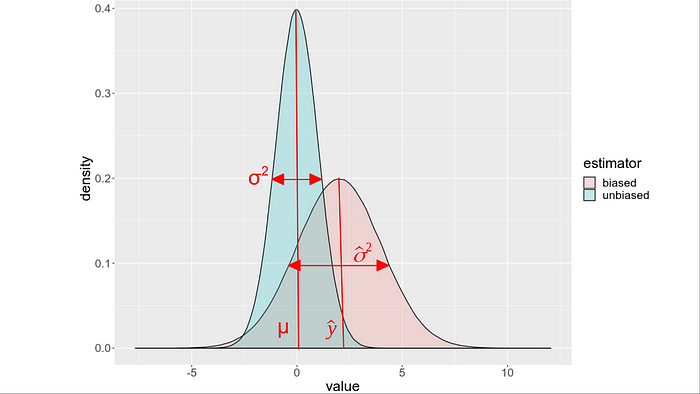
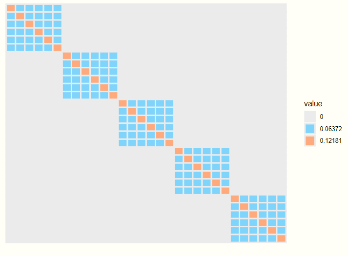
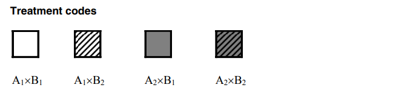
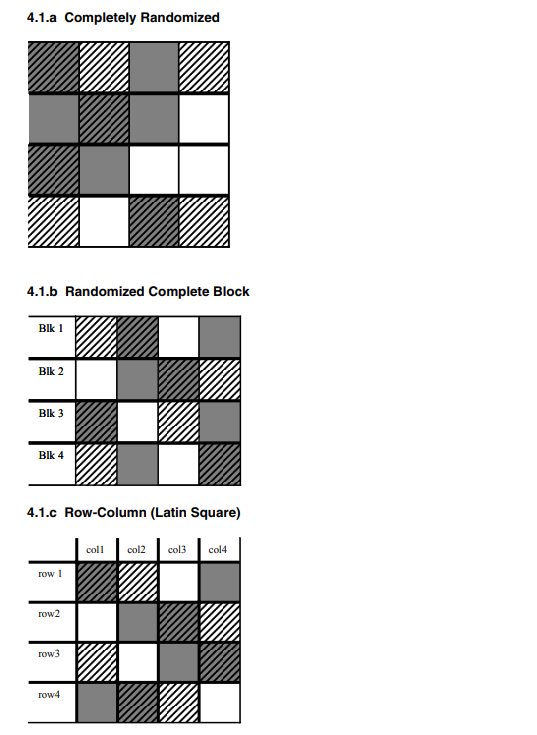
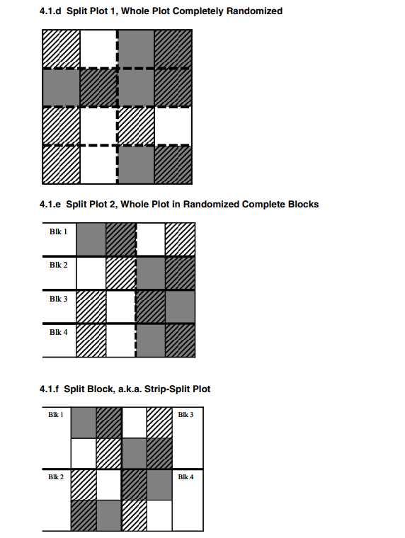
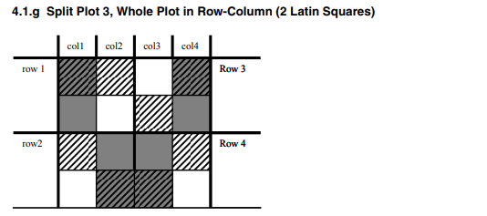
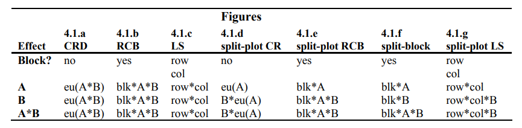
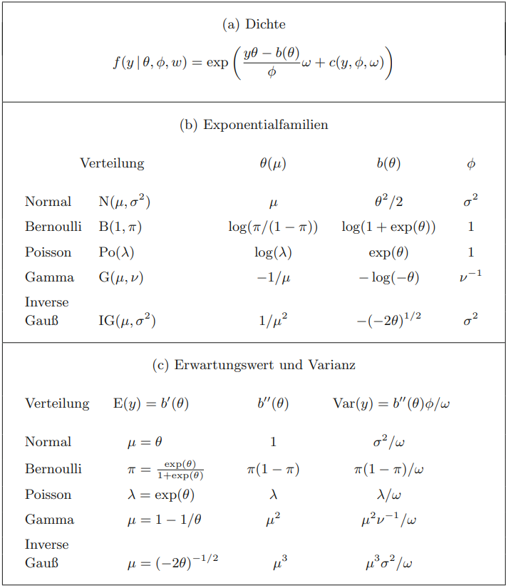

 

```{r setup, include=FALSE, echo = FALSE,message = FALSE, error = FALSE, warning = FALSE}
knitr::opts_chunk$set(echo = TRUE)

# <!-- ---------------------------------------------------------------------- -->
# <!--                    1. load the required packages                       -->
# <!-- ---------------------------------------------------------------------- --> 

# if(!require(psych)){install.packages("psych")}

packages<-c("tidyverse", "kableExtra", "gtsummary",
            "Hmisc","htmltools","clinUtils","sjPlot",
            "lme4","lattice","minqa","nlme","lmerTest")
ipak <- function(pkg){
  new.pkg <- pkg[!(pkg %in% installed.packages()[, "Package"])]
  if (length(new.pkg)) 
    install.packages(new.pkg, dependencies = TRUE)
  sapply(pkg, require, character.only = TRUE)
}
ipak(packages)
 

# <!-- ---------------------------------------------------------------------- -->
# <!--                        2. Basic system settings                        -->
# <!-- ---------------------------------------------------------------------- -->
setwd(dirname(rstudioapi::getSourceEditorContext()$path))
getwd()
Sys.setlocale("LC_ALL","English")

# convert backslash to forward slash in R
# gsub('"', "", gsub("\\\\", "/", readClipboard()))

## get the path
# rstudioapi::getSourceEditorContext()$path
# dirname(rstudioapi::getSourceEditorContext()$path)

## set working directory
# getwd()
# setwd("c:/Users/zbai/Desktop")
# Sys.setlocale("LC_ALL","English")

## get the R Version
# paste(R.Version()[c("major", "minor")], collapse = ".")

## convert backslash to forward slash 
# scan("clipboard",what="string")
# gsub('"', "", gsub("\\\\", "/", readClipboard())) 

# Load all r functions
# The directory where all source code files are saved.
source_code_dir <- "C:/Users/baiz/Downloads/Data-Analyst-with-R/00 R Function/ZB Function/"  
file_path_vec <- list.files(source_code_dir, full.names = T)
for(f_path in file_path_vec){source(f_path)}

# <!-- ---------------------------------------------------------------------- -->
# <!--                         3. Import the datasets                         -->
# <!-- ---------------------------------------------------------------------- -->

# <!-- ---------------------------- -->
# <!-- --3.1 Import csv data ------ -->
# <!-- ---------------------------- -->

# pfad <- "~/Desktop/SASUniversityEdition/myfolders/Daten"
# mydata1 <- read.csv(file.path(pfad, "yourcsv_data.csv"), 
#                     sep=";", 
#                     header=TRUE)   

# Import all csv data from folder
# list_csv_files <- list.files(path = "./csvfolder/")
# do.call(rbind, lapply(list_csv_files, function(x) read.csv(x, stringsAsFactors = FALSE)))

# <!-- ---------------------------- -->
# <!-- --3.2 Import xlsx data ----- -->
# <!-- ---------------------------- -->

# library(readxl)
# mydata2 <- read_excel("C:/Users/zbai/Documents/GitHub/R-Projects/SAS/Yimeng/results-text.xlsx")

# <!-- ---------------------------- -->
# <!-- --3.3 Import sas7dbat data - -->
# <!-- ---------------------------- -->

# library(sas7bdat)
# mydata3 <- read.sas7bdat("~/Desktop/SASUniversityEdition/myfolders/Daten/uis.sas7bdat")

# Import all sas7dbat data from SASfolder
# ZB.import.sas.folder("./SASfolder/")

# <!-- ---------------------------- -->
# <!-- --3.4 Import from copyboard --->
# <!-- ---------------------------- -->
# copdat <- read.delim("clipboard")
# Data_D01 <- copdat

# <!-- ---------------------------------------------------------------------- -->
# <!--                           4. Some Tools                                -->
# <!-- ---------------------------------------------------------------------- -->

# To check out vignettes for one specific package
# browseVignettes("sjPlot")      # sjPlot for Models Summary
# browseVignettes("kableExtra")
# browseVignettes("gtsummary")
# <!-- ---------------------------------------------------------------------- -->
```

  

# Introduction

## Correlated Response Data

1. Repeated Measurements:

    + Defined as data collected from each experimental unit or subject under different experimental conditions at multiple occasions.
    + Requires a flexible correlation structure to reflect the sequential nature of measurements for each subject, considering possible correlations related to subject-specific random effects.
    + Special case: Longitudinal data, which are collected at several time points and might exhibit sequential correlations.
    
2. Clustered Data:

    + Occurs when observations are naturally grouped into clusters, leading to correlated data within clusters.
    + Explained typically through random effect models, distinguishing variability within and between clusters.
    + In some cases, there might be more than one level of clustering, leading to a multi-level random effect structure.
    + Examples include studies on twins (natural clusters) and ophthalmology studies where each pair of eyes forms a cluster.
    
3. Spatially Correlated Data:

    + Occurs when observations include both a response variable and a location vector associated with it.
    + The proximity of measured responses determines their correlation.
    + Grid data, linked to discrete areas like towns or counties, are also considered spatially correlated. Examples include census, socio-economic, and health data.

## Hierarchical and Marginal model

**Hierarchical Models (Also Known as Multilevel or Mixed-Effect Models)**

* Hierarchical models explicitly consider the hierarchical structure of data. For example, students nested within classes, which are nested within schools.
* They include both fixed effects (common to all groups) and random effects (specific to each group or level).
* Random effects allow for individual differences at each level (like differences among schools or among classes within schools).
* Hierarchical models can handle unbalanced data and different numbers of observations across groups.
* They provide insights into **both the individual group level and the overall population**.
* Marginal models need a correct specification of the correlation structure for consistent estimates, while hierarchical models are more flexible in this aspect.

The general linear mixed model can be written as:

$$
\begin{array}{c}
\mathbf{Y}_{i}=X_{i} \beta+Z_{i} \mathbf{b}_{i}+\epsilon_{i} \\
\mathbf{b}_{i} \sim N(\mathbf{0}, D) \quad \text { und } \quad \epsilon_{i} \sim N\left(0, \Sigma_{i}\right)
\end{array}
$$ und
$\mathbf{b}_{1}, \ldots, \mathbf{b}_{N}, \epsilon_{1}, \ldots, \epsilon_{N}$ are stochastically independent. This can be rewritten as **Hierarchical model**
$$
\mathbf{Y}_{i} \mid \mathbf{b}_{i}=N\left(X_{i} \beta+Z_{i} \mathbf{b}_{i}, \Sigma_{i}\right), \quad \mathbf{b}_{i} \sim N(\mathbf{0}, D)
$$ 
One often assumes that $\Sigma_{i}$ only depends on the dimension of $i$ i.e. that the unknown parameters in $\Sigma_{i}$ are independent on $i$ (depends only on the dimensionality of $i$, the unknown parameter $\Sigma_{i}$ is independent of $i$)


**Marginal Models (Also Known as Population-Averaged Models)**

* Marginal models focus on the average response of the population, rather than the individual group levels.
* They use generalized estimating equations (GEEs) to estimate the average response.
* These models explicitly model the correlation structure of the data but do not estimate random effects.
* They are suitable when the interest is in the average effect across all subjects or units, rather than the specific random effects.
* Marginal models provide an understanding of the average behavior of the entire population under study.
* They are robust to certain types of misspecifications of the correlation structure.

The following marginal model follows from the hierarchical model:
$$\mathbf{Y}_{i} \sim N\left(X_{i} \beta, Z_{i} D Z_{i}^{T}+\Sigma_{i}\right)$$
The hierarchical model implies the marginal model, the reverse is not
generally true: $V_{i}=Z_{i} D Z_{i}^{T}+\Sigma_{i}$

## Maximum Likelihood (ML) 

A linear mixed-effects model is of the form
$$
y=\underbrace{X \beta}_{\text {fixed }}+\underbrace{Z b}_{\text {random }}+\underbrace{\varepsilon}_{\text {error }},
$$
where
- $y$ is the $n$-by-1 response vector, and $n$ is the number of observations.
- $X$ is an $n$-by-p fixed-effects design matrix.
- $\beta$ is a $p$-by- 1 fixed-effects vector.
- $Z$ is an $n$-by- $q$ random-effects design matrix.
- $b$ is a $q$-by-1 random-effects vector.
- $\varepsilon$ is the $n$-by-1 observation error vector.

The random-effects vector, $b$, and the error vector, $\varepsilon$, are assumed to have the following independent prior distributions:
$$
\begin{aligned}
& b \sim N\left(0, \sigma^2 D(\theta)\right), \\
& \varepsilon \sim N\left(0, \sigma^2 I\right),
\end{aligned}
$$
 
The maximum likelihood estimation includes both regression coefficients and the variance components, that is, both fixed-effects and random-effects terms in the likelihood function.

For a linear mixed-effects model defined above, the conditional response of the response variable $y$ given $\beta, b, \theta$, and $\sigma^2$ is
$$
y \mid b, \beta, \theta, \sigma^2 \sim N\left(X \beta+Z b, \sigma^2 I_n\right) .
$$

The likelihood of $y$ given $\beta, \theta$, and $\sigma^2$ is
$$
P\left(y \mid \beta, \theta, \sigma^2\right)=\int P\left(y \mid b, \beta, \theta, \sigma^2\right) P\left(b \mid \theta, \sigma^2\right) d b,
$$
where
$$
\begin{aligned}
& P\left(b \mid \theta, \sigma^2\right)=\frac{1}{\left(2 \pi \sigma^2\right)^{q / 2}|D(\theta)|^{1 / 2}} \exp \left\{-\frac{1}{2 \sigma^2} b^T D^{-1} b\right\} \text { and } \\
& P\left(y \mid b, \beta, \theta, \sigma^2\right)=\frac{1}{\left(2 \pi \sigma^2\right)^{n / 2}} \exp \left\{-\frac{1}{2 \sigma^2}(y-X \beta-Z b)^T(y-X \beta-Z b)\right\} .
\end{aligned}
$$

Suppose $\Lambda(\theta)$ is the lower triangular Cholesky factor of $D(\theta)$ and $\Delta(\theta)$ is the inverse of $\Lambda(\theta)$. Then,
$$
D(\theta)^{-1}=\Delta(\theta)^T \Delta(\theta) .
$$

Define
$$
r^2(\beta, b, \theta)=b^T \Delta(\theta)^T \Delta(\theta) b+(y-X \beta-Z b)^T(y-X \beta-Z b),
$$
and suppose $b^*$ is the value of $b$ that satisfies
$$
\left.\frac{\partial r^2(\beta, b, \theta)}{\partial b}\right|_{b^*}=0
$$
for given $\beta$ and $\theta$. Then, the likelihood function is
$$
P\left(y \mid \beta, \theta, \sigma^2\right)=\left(2 \pi \sigma^2\right)^{-n / 2}|D(\theta)|^{-1 / 2} \exp \left\{-\frac{1}{2 \sigma^2} r^2\left(\beta, b^*(\beta), \theta\right)\right\} \frac{1}{\left|\Delta^T \Delta+Z^T Z\right|^{1 / 2}} .
$$

$\mathrm{P}\left(\mathrm{y} \mid \beta, \theta, \sigma^2\right)$ is first maximized with respect to $\beta$ and $\sigma^2$ for a given $\theta$. Thus the optimized solutions $\widehat{\beta}(\theta)$ and $\widehat{\sigma}^2(\theta)$ are obtained as functions of $\theta$. Substituting these solutions into the likelihood function produces $P\left(y \mid \widehat{\beta}(\theta), \theta, \widehat{\sigma}^2(\theta)\right)$. This expression is called a profiled likelihood where $\beta$ and $\sigma^2$ have been profiled out. $P\left(y \mid \widehat{\beta}(\theta), \theta, \widehat{\sigma}^2(\theta)\right)$ is a function of $\theta$, and the algorithm then optimizes it with respect to $\theta$. Once it finds the optimal estimate of $\theta$, the estimates of $\beta$ and $\sigma^2$ are given by $\widehat{\beta}(\theta)$ and $\widehat{\sigma}^2(\theta)$.

**Summary**

The ML method treats $\beta$ as fixed but unknown quantities when the variance components are estimated, but does not take into account the degrees of freedom lost by estimating the fixed effects. This causes ML estimates to be biased with smaller variances. However, one advantage of ML over REML is that it is possible to compare two models in terms of their fixed- and random-effects terms. On the other hand, if you use REML to estimate the parameters, you can only compare two models, that are nested in their random-effects terms, with the same fixed-effects design.


**Problem of MLE**

Maximum likelihood estimation uses an iterative interactive method to estimate fixed effects and variance when estimating fixed effects and random effects (variance components) in a mixed effects model. When estimating variance, you need a reference point, which is the fixed effect, such as the mean. Therefore, MLE first estimates the fixed effects and then estimates the variance components. Use EM or IGLS iteration method to estimate. Fixed effects are estimated first, assuming missing variance or random effects for any observations. Then the variance is estimated based on the fixed effects, and iteratively until the estimated value no longer changes.

Estimating fixed effects, which means treating the fixed effects as known and fixed when estimating the variance, will cause two problems.

1.  Variation in fixed effects is not considered
2.  Degrees of freedom consumed when estimating fixed effects are not taken into account

When the sample is large, these two problems are not a problem. When the sample is small, these two problems have a relatively large impact on the estimated variance. When calculating the population variance of the mean, use "each X value minus the sum of squares of the population mean" as the numerator, and the denominator uses N; when calculating the sample variance, use "each 1 (because the mean is estimated, a penalty is needed at this time); and ML estimation is similar to the estimation of the population variance, but in practice the sample mean is used, and **N is used as the numerator instead of N-1**. The estimated values are almost the same when the sample is large, but they are very different when the sample is small. This will lead to a smaller estimated variance and a smaller standard error of the fixed effects, leading to an inflated type I error.

## Restricted Maximum Likelihood (REML) 

The idea of Restricted Maximum Likelihood (REML) comes from realization that the variance estimator given by the Maximum Likelihood (ML) is biased. What is an estimator and in which way it is biased? An estimator is simply an approximation / estimate of model parameters. Assuming that statistical observations follow Normal distribution, there are two parameters: $\mu$ (mean) and $\sigma^2$ (variance) to estimate if one wants to summarize the observations. It turns out that the variance estimator given by Maximum Likelihood (ML) is biased, i.e. the value we obtain from the ML model over- or under-estimates the true variance, see the figure below.

```{r, echo=FALSE, fig.align="center", out.width = '75%',fig.cap="Figure: Illustration of biased vs. unbiased estimators"}

```

REML is similar to the "N-1" version of MLE, with the variance corrected. REML separates the process of estimating fixed effects and variance, and can estimate variance more accurately when using small samples, thus obtaining more accurate standard errors of fixed effects, thereby controlling type one error inflation. 

1. The first step in REML is to ignore the hierarchical structure and first obtain the residuals through ordinary least squares (OLS). The OLS residuals have the same conditional variance (based on the X variable) as the original results. When using OLS residuals to estimate variance, the fixed effects are limited to 0, so there is no need to consider fixed effects when REML estimates variance components. 
2. The second step is to estimate the fixed effects. GLS is used to estimate fixed effects through matrix multiplication, that is, the variance components estimated by REML are put into Generalized least squares (generalized least squares method) to estimate fixed effects.

**In SAS**, Both PROC MIXED and PROC GLIMMIX provide maximum likelihood estimates (abbreviated MLE) of model effects as well as REML estimates of variance components. REML default variance estimation method. ML variance estimates can be obtained by using METHOD=ML in PROC MIXED or METHOD=MSPL in PROC GLIMMIX. The variance estimate resulting from the ML variance estimate will be smaller than the corresponding REML estimate, the resulting confidence interval will be narrower, and the test statistic will be larger. This reflects the well-known fact that ML estimates of variance components are biased downward.

For example, in the one-sample case, when $y_{1}, y_{2}, \ldots, y_{n}$
is a random sample from $\mathrm{N}\left(\mu, \sigma^{2}\right)$, the ML
estimate of the variance is as follows: 
$$
\sum_{i}\left(y_{i}-\bar{y}\right)^{2} / n
$$ 

whereas the sample variance - which is the simplest REML variance estimate-is as follows: 
$$
\sum_{i}\left(y_{i}-\bar{y}\right)^{2} /(n-1)
$$
The latter is unbiased and is generally considered the preferred variance estimate. It can be easily seen that using ML variance estimation results in increased Type 1 error rates (up to 25% rejection rate for nominal $a=0.05$) and insufficient confidence interval coverage.

```         
proc mixed data=bond method=reml;
 class ingot metal;
 model pres=metal;
 random ingot;
run;

proc glimmix data=bond method=rspl;
 class ingot metal;
 model pres=metal;
 random ingot;
run;
```

**Summary**

REML accounts for the degrees of freedom lost by estimating the fixed effects, and makes a less biased estimation of random effects variances. The estimates of $\theta$ and $\sigma^2$ are invariant to the value of $\beta$ and less sensitive to outliers in the data compared to ML estimates. However, if you use REML to estimate the parameters, you can only compare two models that have the identical fixed-effects design matrices and are nested in their random-effects terms.


## Small Sample Variance Correction

In the case of small samples, the variance component of the fixed effects (which can be understood as the standard error) is not accurately estimated, whether it is MLE or REML. Furthermore, when calculating the p-value of fixed effects, the **fisher information and central limit theorem (asympotics)** that need to be used will fail in small samples, resulting in an underestimation of the variance, thus leading to a type of error inflation. 

* Some scholars pointed out that this problem can be solved using the Bayesian method (the Bayesian method does not rely on asympotics),
* But Kackar-Harville and later Kendward-roger solved it within the frequentist school by correcting square shame.

**Kackar-Harville correction**

Kackar-Harville discovered the following formula, the variance of fixed effects is equal to the REML variance estimate of the fixed effects sample estimate plus the small sample bias.

$$
\operatorname{Var}(\gamma)=\operatorname{Var}^{R E M L}(\hat{\gamma})+\text { Small Sample Bias }
$$ 

A series of studies from KH to KR are aimed at how to estimate small sample bias. KH found that the estimation of Small sample bias (SSB) requires the use of the population value of the variance component (rather than the sample estimate); then they used the Taylor series expansion method to asymptotically estimate SSB using the sample estimate of the variance and covariance components. ; Later, Prasad-Rao and Harville-Jeske further expanded and developed this method based on KH. So this correction is sometimes called Prasad-Rao-Jeske-kackar-Harville correction.

**Kendward-Roger correction**

KR further found that "REML variance estimate of fixed effect sample estimate" also has problems with small samples, that is, when REML estimates fixed effects, it directly uses the estimated variance into the GLS estimation equation to estimate fixed effects. At this time, there is no Consider the variation of the variance component itself, but directly treat it as known and fixed. 

KR further uses Taylor's formula expansion to estimate "REML variance estimates of fixed effects sample estimates", taking into account the fact that the variance components when estimating fixed effects are estimates and are not known. In the case of small samples, the t test is used instead of the Z test (the multivariate case corresponds to the chi-square test instead of the F test).

* The first step is equivalent to giving an accurate estimate of the residuals in "t=fixed effects/residuals"
* The second step is to calculate the exact degrees of freedom. In mixed effects models, the calculation formula for the degrees of freedom often does not exist, and it is difficult to estimate the accurate degrees of freedom. KR uses the moment estimation matching procedure (method of moments matching procedure), and the estimation at this time is more accurate, sometimes even with fractional degrees of freedom.


## Test of Fixed Effects

Tests of fixed effects are typically done with either Wald or likelihood ratio (LRT) tests. With the **assumptions of asymptotic distributions and independent predictors**, Wald and LRT tests are equivalent. How large the data set needs to be for the asymptotic distribution to be a good approximation depends not only on how many observations you have, but also on the response variable type and the size of subgroups of observations formed by the categorical variables in the model. With a continuous response variable in a linear mixed model, subgroup sizes as small as five may be enough for the Wald and LRT to be similar. When the response is an indicator variable and the proportion of events of interest is small, groups size of one hundred may not be large enough for the Wald and LRT results to be similar.

When a data set size is not large enough to be a good approximation of the asymptotic distribution or there is some correlation amongst the predictors, the Wald and LRT test results can vary considerably.

-   Wald test. Tests of the effect size which is scaled using the estimated standard error.
-   LRT (Likelihood Ratio Test.) Tests the difference in two nested models using the Chi square distribution.

**Test if coefficients are zero**

* Wald test. Tests of the effect size which is scaled using the estimated standard error.
	
* LRT (Likelihood Ratio Test.) Tests the difference in two nested models using the Chi square distribution.
	
* KRmodComp. For linear mixed models with little correlation among predictors, a Wald test using the approach of Kenward and Rogers (1997) will be quite similar to LRT test results.
	The function is only available for linear mixed models (does not support glmer() models.) An F test of nested models with an estimated degrees of freedom. The KRmodcomp() function estimates which F-test distribution is the best distribution from the family of F distributions. This function addresses the degrees of freedom concern.
	
* Profiled confidence interval. While not a formal test, an interval which does not contain zero indicates the parameter is significant.
The profiled confidence interval of a parameter is constructed by holding all other model parameters constant and then examining the likelihood of the the single parameter individually. If the parameter being profiled is correlated with other parameters, the profiled confidence interval assumption of the other parameters being held constant could affect the estimated interval.
	
* Parametric bootstrap. Assumes the model which restricts a parameter to zero (null model) is the true distribution and generates an empirical distribution of the difference in the two models. The observed coefficient is tested against the generated empirical distribution.


### Wald Test

The Wald test is based only on estimates from the model being evaluated. This results in an implied assumption that a model which holds the parameter being tested to zero will be the same with the exception of the parameter which is being tested. Correlation between the tested predictor and the other model predictors, can cause the estimate made from the model including the parameter to be different from a model which holds the parameter to zero.  A Walt test is done by comparing the coefficient's estimated value with the estimated standard error for the coefficient. 

* $H_{0}: \beta_{j}=d_{j}$
* $H_{1}: \beta_{j} \neq d_{j}$ 

A more general form of linearity assumption

$$
H_{0}: \boldsymbol{C} \boldsymbol{\beta}=\boldsymbol{d} \text { vs } H_{1}: \boldsymbol{C} \boldsymbol{\beta} \neq \boldsymbol{d}
$$
Where $$W=(\boldsymbol{C} \hat{\boldsymbol{\beta}}-\boldsymbol{d})^{\prime}\left(\boldsymbol{C}^{\prime} \boldsymbol{A}_{11} \boldsymbol{C}\right)^{-1}(\boldsymbol{C} \hat{\boldsymbol{\beta}}-\boldsymbol{d})$$ 
The approximate covariance matrices are given by
$$\widehat{\operatorname{Cov}}(\hat{\boldsymbol{\beta}})=\boldsymbol{A}_{11}=\left\{\sum_{i=1}^{m} \boldsymbol{X}_{i}^{\prime} \hat{\boldsymbol{V}}_{i}^{-1} \boldsymbol{X}_{i}\right\}^{-1}$$


### Likelihood Ratio Test

The LRT requires the formal estimation of a model which restricts the parameter to zero and therefore accounts for correlation in its test.  The Likelihood Ratio Test (LRT) of fixed effects requires the models be fit with by MLE (use REML=FALSE for linear mixed models.) The LRT of mixed models is only approximately χ2 distributed. 

In SS, the "Null Model Likelihood Ratio Test" is a likelihood ratio test of whether the model with the specified covariance fits better than a model with errors- that is, with $\boldsymbol{\Sigma}=\sigma^2 \mathrm{I}$. The $p$-value $<.0001$ shows that the iid $N\left(0, \sigma^2 \mathbf{I}\right)$ model is clearly inadequate.


## Test of Random Parameters

**Test variance parameter is equal to 0**, The test which are in common use for the variance parameter are listed from least efficient to most efficient.

* LRT (Likelihood Ratio Test): The variance parameter of a generalized mixed models does not have a known asymptotic distribution. The LRT for these variance parameters at times can be poor estimates. We recommend treating these p-values with caution. The LRT test of a variance parameter equalling zero will be conservative (larger $p$-value). This is due to the test being on a boundary condition $\left(\sigma^2 \geq 0\right)$. Thus if the $p$-value is small enough to be significant with the LRT test, your finding is likely good. There are some areas were twice the LRT p-value is used as a formal test. We do not recommend this for variance of generalized mixed models since the $p$-value can be a poor estimate at times. As example to test random variable g2 in R

```r
gmmG2 <- glmer(bin ~ x1 + x2 + (1|g1) + (1|g2), family=binomial, data=pbDat)
# LRT calculated using the loglik() function
G2 = -2 * logLik(gmm) + 2 * logLik(gmmG2)
pchisq(as.numeric(G2), df=1, lower.tail=F)
```
* Profiled confidence interval:  While not a formal test, an interval which does not contain zero indicates the parameter is significant.

* Test based on Crainiceanu, C. and Ruppert, D. ( 2004 ) for linear mixed models. There is no equivalent for generalized mixed models. The variance parameters of the model must be uncorrelated. There is no equivalent function for when the random variables are correlated, such as with hierarchical models. In R, the exactRLRT() function is an implementation of Crainiceanu and Ruppert. See [Example](https://www.ssc.wisc.edu/sscc/pubs/MM/MM_TestEffects.html)

* Parametric bootstrap. Assumes the model which restricts a parameter to zero (null model) is the true distribution and generates an empirical distribution of the difference in the two models. The observed coefficient is tested against the generated empirical distribution.

## Covariance/Residual Structure

In the simplest setting of a standard linear regression model, we have constant variance and no covariance.

However, since mixed models have two sources of variability (within and between-subjects) different types of residuals may be defined and the corresponding analysis is more complex.

**Homogeneous Variance**


$$
\Sigma = 
\left[
\begin{array}{ccc} 
\sigma^2 & 0   & 0   \\
0   & \sigma^2 & 0   \\
0   & 0   & \sigma^2 \\
\end{array}\right]
$$

```{r, echo=FALSE, fig.align="center", out.width = '100%',fig.cap="Figure: Residual Structure in the mixed model"}

```

Each block represents the covariance matrix associated with within-individual observations. Within subject, there is variance on the diagonal and covariance on the off-diagonal. When considering the entire data, we can see that one subject's observations have no covariance with the other (grey). Furthermore, the within-subjectcovariance is a constant value and the variance is also a constant value.
 

**Heterogeneous Variance**

Relax the assumption of equal variances and estimate separately. For example, in the case of this heterogeneous variance, we might see more or less variation over time

$$
\Sigma = 
\left[
\begin{array}{ccc} 
\sigma_1^2 & 0   & 0   \\
0   & \sigma_2^2 & 0   \\
0   & 0   & \sigma_3^2 \\
\end{array}\right]
$$
**Covariance Structure of Compound Symmetry **

More generally, referring to the previous estimated variance sign, we can see that the covariance matrix (for clusters) is as follows. (covariance structure of compound symmetry)

the model with compound
symmetric (or exchangeable) variance-covariance matrix of the error
terms. In this matrix, all variances are assumed to be equal to
$\sigma^{2}$, and all correlations are assumed to be equal to $\rho$.
That is, the matrix has the form:

$$
\sigma^{2}\left[\begin{array}{ccccc}
1 & \rho & \rho & \ldots & \rho \\
\rho & 1 & \rho & \ldots & \rho \\
\rho & \rho & 1 & \ldots & \rho \\
\ldots & \ldots & \ldots & \ldots & \ldots \\
\rho & \rho & \rho & \ldots & 1
\end{array}\right]
$$ 

This variance-covariance structure is more suitable for repeated measures across treatment conditions (rather than longitudinally), since all observations are assumed to be equally correlated

**ARMA (1,1) Structure**

Model has the blocks in the variance-covariance matrix that
have constant values on each of the descending diagonals, that is, the
matrix has the form:

$$
\left[\begin{array}{ccccc}
\sigma^{2} & \sigma_{1} & \sigma_{2} & \ldots & \sigma_{p-1} \\
\sigma_{1} & \sigma^{2} & \sigma_{1} & \ldots & \sigma_{p-2} \\
\sigma_{2} & \sigma_{1} & \sigma^{2} & \ldots & \sigma_{p-3} \\
\ldots & \ldots & \ldots & \ldots & \ldots \\
\sigma_{p-1} & \sigma_{p-2} & \sigma_{p-3} & \ldots & \sigma^{2}
\end{array}\right]
$$

Using this structure implies that observations that are the same number
of time points apart are equally correlated. There are a total of $p$
unknown parameters $\sigma^{2}, \sigma_{1}, \ldots, \sigma_{p-1} .$ This
model is said to have the Toeplitz covariance structure, which is
sometimes referred to as an autoregressive-moving average
$\operatorname{ARMA}(1,1)$ structure.

Another model with useful structure of the variance-covariance matrix
relies on the fact that typically as time goes on, observations become
less correlated with the earlier ones. In this model, each block in the
variance-covariance matrix has
$\sigma^{2} \rho^{\left|t_{i}-t_{j}\right|}$ in the $i j$ -th cell,
$i, j=1, \ldots, p$, that is, it looks like this:

$$
\sigma^{2}\left[\begin{array}{ccccc}
1 & \rho^{\left|t_{1}-t_{2}\right|} & \rho^{\left|t_{1}-t_{3}\right|} & \ldots & \rho^{\left|t_{1}-t_{p}\right|} \\
\rho^{\left|t_{1}-t_{2}\right|} & 1 & \rho^{\left|t_{2}-t_{3}\right|} & \ldots & \rho^{\left|t_{2}-t_{p}\right|} \\
\rho^{\left|t_{1}-t_{3}\right|} & \rho^{\left|t_{2}-t_{3}\right|} & 1 & \ldots & \rho^{\left|t_{3}-t_{p}\right|} \\
\ldots & \ldots & \ldots & \ldots & \ldots \\
\rho^{\left|t_{1}-t_{p}\right|} & \rho^{\left|t_{2}-t_{p}\right|} & \rho^{\left|t_{3}-t_{p}\right|} & \ldots & 1
\end{array}\right]
$$ 

Here $\sigma^{2}$ and $\rho$ are the unknown constants, $|\rho|<1$.
Note that in this matrix the entries decrease as the distance between
times $t_{i}$ and $t_{j}$ increases.  


**Autocorrelation Structure**


A special case of this model is when the times are equal to $\$ 1,2,3$,
Vidots, $\mathrm{p} \$$. Then the \$p $\mathrm{p}$ \$ blocks of the
variance-covariance matrix become:

$$
\sigma^{2}\left[\begin{array}{ccccc}
1 & \rho & \rho^{2} & \ldots & \rho^{p-1} \\
\rho & 1 & \rho & \ldots & \rho^{p-2} \\
\rho^{2} & \rho & 1 & \ldots & \rho^{p-3} \\
\ldots & \ldots & \ldots & \ldots & \ldots \\
\rho^{p-1} & \rho^{p-2} & \rho^{p-3} & \ldots & 1
\end{array}\right]
$$ 

This model is said to have an autoregressive variance-covariance
structure of the error terms, referring to an AR(1) model, an
autoregressive time series model with lag one that has the same
covariance structure. Note that the autoregressive matrix is a special
case of both Toeplitz and spatial power matrices.

**Unstructured Covariance**

The most general is an unstructured one with an $n p \times n p$ block-diagonal matrix with $n$ identical blocks of size $p \times p$ of the form: 

$$
\left[\begin{array}{ccccc}
\sigma_{1}^{2} & \sigma_{12} & \sigma_{13} & \ldots & \sigma_{1 p} \\
\sigma_{12} & \sigma_{2}^{2} & \sigma_{23} & \ldots & \sigma_{2 p} \\
\sigma_{13} & \sigma_{23} & \sigma_{3}^{2} & \ldots & \sigma_{3 p} \\
\ldots & \ldots & \ldots & \ldots & \ldots \\
\sigma_{1 p} & \sigma_{2 p} & \sigma_{3 p} & \ldots & \sigma_{p}^{2}
\end{array}\right]
$$
 

*  If the size of the dataset allows, a model with an **unstructured variance-covariance** matrix with error terms should be used. The model makes no assumptions about the structure and allows the estimation of each parameter to take its own value.
* If the size of the dataset is too small to fit in a general unstructured variance-covariance matrix, there are several **sparse** but meaningful structures to try.

**Selecting an Appropriate Covariance Model**

It needs an appropriate covariance model in order to draw accurate conclusions from repeated  measures data. If you ignore important correlation by using a model that is too simple, you risk  increasing the Type I error rate and underestimating standard errors. If the model is too  complex, you sacrifice power and efficiency. Guerin and Stroup (2000) documented the effects  of various covariance modeling decisions using PROC MIXED for repeated measures data.  Their work supports the idea that repeated measures analysis is robust as long as the covariance  model used is approximately correct. Inference is  severely compromised by a blatantly poor choice of the covariance model. 

There are two types of tools to help you select a covariance model. 

1. First are **graphical tools** to help visualize patterns of correlation between observations at  different times. 
2. Second are **information criteria** that measure the relative fit of competing covariance models. As noted at the end of the last section, these methods work best when you  first rule out covariance structures that are obviously inconsistent with the characteristics of the  data you are analyzing. 

## Converge Problems

The model cannot converge. At this time, the model needs to be simplified to make it converge: For the problem that the model cannot converge, first of all, the model we finally select must meet two standards: 

1. It can converge; 
2. It cannot be overfitted.

**Deal with Converge**
 
* Increase the number of iterations of the model: Regardless of whether the entire model can converge after increasing the number of iterations, check its random effects
 
**Overfitting**

Regardless of whether the entire model can converge after increasing the number of iterations, check its random effects

1. Delete the highest-order interaction first, because as long as there is the highest-order interaction, deleting other interactions has no effect on the model (Barr D. J., 2013);
2. After deleting the interaction, if convergence still cannot be achieved, please continue deleting. At this time, if the Corr of the two main effects is greater than 0.9, please delete the one with the larger Corr first;
3. If convergence still cannot occur after deleting the larger main effect, retain the main effect with larger Corr and delete the main effect with smaller Corr (if the Corr of both main effects is greater than 0.9, they cannot be deleted directly because the random slopes interact with each other. If one is deleted, the other Corr will change accordingly), and so on, until a model that meets the above two criteria is explored.
 
## Basic Concepts of BLUE & BLUP

The basic form of a linear mixed model is
$$
Y_j=\sum_i \beta_i X_{j i}+\sum_k u_k Z_{j k}+e_j
$$
where
* $Y_j$ is the $j^{\text {th }}$ observation
* $\beta_i$ are fixed effect parameters
* $X_{j i}$ are constants associated with the fixed effects
* $u_k$ are random effects
* $Z_{j k}$ are constants associated with the random effects
* $e_j$ is the $j^{\text {th }}$ residual error

Alternatively,  can be written as the mixed model in matrix form as $\mathbf{Y}=\mathbf{X} \boldsymbol{\beta}+\mathbf{Z u}+\mathbf{e}$.

The expected value of an observation is
$$
\mathrm{E}[\mathbf{Y}]=\mathrm{E}[\mathbf{X} \boldsymbol{\beta}+\mathbf{Z u}+\mathbf{e}]=\mathbf{X} \boldsymbol{\beta}
$$
since the expected values of the random effect vector $\mathbf{u}$ and the error vector $\mathbf{e}$ are 0 . This is called the **unconditional expectation**, or the mean of $\mathbf{Y}$ averaged over all possible $\mathbf{u}$. The subtlety of this quantity is important: in practical terms, the observed levels of the random effects are a random sample of a larger population. The unconditional expectation is the mean of $\mathbf{Y}$ over the entire population.

The conditional expectation of $\mathbf{Y}$ given $\mathbf{u}$, denoted $\mathrm{E}[\mathbf{Y} \mid \mathbf{u}]$, is
$$
\mathbf{E}[\mathbf{Y} \mid \mathbf{u}]=\mathbf{X} \boldsymbol{\beta}+\mathbf{Z u}
$$

In practical terms, this is the mean of Y for the specific set of levels of the random effect actually observed.

**The unconditional mean is thus a population-wide average, whereas the conditional mean is an  average specific to an observed set of random effects.** Because the set of observed levels of the  random factors is not an exact duplicate of the entire population, the conditional and  unconditional means are not equal, in general. 

Linear combinations of fixed effects, denoted $\Sigma_i \mathbf{K}_i \boldsymbol{\beta}_i$, are called estimable functions if they can be constructed from a linear combination of unconditional means of the observations. That is, if $\mathbf{K}^{\prime} \boldsymbol{\beta}=\mathbf{T}^{\prime} E[\mathbf{Y}]=\mathbf{T}^{\prime} \mathbf{X} \boldsymbol{\beta}$ for some $\mathbf{T}$, then it is estimable. Quantities such as regression coefficients, treatment means, treatment differences, contrasts, and simple effects in factorial experiments are all common examples of estimable functions.

Estimable functions do not depend on the random effects. A generalization of the estimable function is required for such cases. Linear combinations of the fixed and random effects, $\mathbf{K}^{\prime} \boldsymbol{\beta}+\mathbf{M}^{\prime} \mathbf{u}$, can be formed from linear combinations of the conditional means. Such linear combinations are called predictable functions. A function $\mathbf{K}^{\prime} \boldsymbol{\beta}+\mathbf{M}^{\prime} \mathbf{u}$ is predictable if its $\mathbf{K}^{\prime} \boldsymbol{\beta}$ component is estimable.

Using the mixed model equation solution for $\boldsymbol{\beta}$ in an estimable function results in the **best linear unbiased estimate (BLUE)** of $\mathbf{K}^{\prime} \boldsymbol{\beta}$. For predictable functions, the solutions for $\boldsymbol{\beta}$ and $\mathbf{u}$ provide the **best linear unbiased predictor (BLUP)** of $\mathbf{K}^{\prime} \boldsymbol{\beta}+\mathbf{M}^{\prime} \mathbf{u}$.

To summarize, linear combinations of fixed effects only are called estimable functions. The solution of the mixed model equations results in estimates, or BLUEs, of $\mathbf{K}^{\prime} \boldsymbol{\beta}$. Linear combinations of fixed and random effects are called predictable functions. Solving the mixed model equations yields predictors, or BLUPs, of $\mathbf{K}^{\prime} \boldsymbol{\beta}+\mathbf{M}^{\prime} \mathbf{u}$.


# Implementation in SAS

The main goals of the analysis of random effects models are to do the following: 

* estimate the parameters of the covariance structure of the random effects model
* test hypotheses about the parameters or functions of the parameters
* construct confidence intervals about the parameters or functions of the parameters 

## Variance Components and Mixed Model Equations 

PROC MIXED obtains six types of estimators of the variance components. Restricted maximum likelihood (REML) estimators and maximum likelihood (ML) estimators are based on the normality assumptions.

The third procedure is MIVQUE(0), which provides estimates that are a form of method of moments estimator. The other three are methods of moments estimators based on Type 1, Type 2, or Type 3 sums of squares. The estimators
obtained with the REML, MIVQUE0, TYPE1, TYPE2, and TYPE3 methods are identical for balanced data sets when the solution to the method of moments equations is in the parameter space. All of the estimators can be different when the data are unbalanced. Method of moments estimators are unbiased estimators under the assumption that random effects and errors are independently distributed. When you assume that the random effects are normally distributed,
then REML and ML estimators possess the usual large sample properties of maximum likelihood estimators. The MIVQUE0 estimators are minimum variance within the class of quadratic unbiased estimators without the assumption of normality.

The general mixed model can be expressed as
$$
\boldsymbol{Y}=\boldsymbol{X} \boldsymbol{\beta}+\boldsymbol{Z u}+\boldsymbol{e}
$$
where
* $\mathbf{Y}$ is the data vector
* $\boldsymbol{\beta}$ is the coefficient vector corresponding to the fixed effects
* $\mathbf{X}$ is the design matrix for the fixed effects
* $\mathbf{u}$ is the coefficient vector corresponding to the random effects
* $\mathbf{Z}$ is the design matrix for the random effects part of the model
* $\mathbf{e}$ is the error vector

It is assumed (for this section) that $\mathbf{u}$ and $\mathbf{e}$ are uncorrelated random variables with zero means and covariance matrices $\mathbf{G}$ and $\mathbf{R}$, respectively; thus, the covariance matrix of the data vector is $\mathbf{V}=$ $\mathbf{Z G Z}+\mathbf{R}$. The solution of the mixed model equations for $\boldsymbol{\beta}$ and $\mathbf{u}$ is as follows:

$$
\begin{aligned}
& \hat{\boldsymbol{\beta}}=\left(\mathbf{X}^{\prime} \hat{\mathbf{V}}^{-1} \mathbf{X}\right)^{-1} \mathbf{X}^{\prime} \hat{\mathbf{V}}^{-1} \mathbf{y} \\
& \hat{\mathbf{u}}=\hat{\mathbf{G}} \mathbf{Z}^{\prime} \hat{\mathbf{V}}^{-1}(\mathbf{y}-\mathbf{X} \hat{\boldsymbol{\beta}})
\end{aligned}
$$

In PROC MIXED, the SOLUTION option in the MODEL statement requests a listing of $\hat{\boldsymbol{\beta}}$, and the SOLUTION option in the RANDOM statement requests a listing of $\hat{\mathbf{u}}$. 


## One-Way Random Effects Treatment Structur


The data in “Mississippi River,” below are the nitrogen concentrations in parts per million from several sites at six of the randomly selected influents to the Mississippi River (you would want to select many more than six sites to monitor the Mississippi River, but we use only six for demonstration purposes)

| Obs | influent | N2  | type |
|-----|----------|-----|------|
| 1   | 1        | 21  | 2    |
| 2   | 1        | 27  | 2    |
| 3   | 1        | 29  | 2    |
| 4   | 1        | 17  | 2    |
| 5   | 1        | 19  | 2    |
| 6   | 1        | 12  | 2    |
| 7   | 1        | 29  | 2    |
| 8   | 1        | 20  | 2    |
| 9   | 1        | 20  | 2    |
| 10  | 2        | 21  | 2    |
| 11  | 2        | 11  | 2    |
| ... | ...      | ... | ...  |
| 35  | 6        | 35  | 3    |
| 36  | 6        | 34  | 3    |
| 37  | 6        | 30  | 3    |


### Proc Mixed

PROC MIXED is used to compute the estimates of the variance components and the population
mean, predicted values for each level of influent, and predicted values for the deviations of the
influent effects from the population mean using all of the methods available for estimating
variance components. The PROC MIXED program to provide REML estimates of the variance
components, etc., is as follows:

```
proc mixed data=influent covtest cl;
 class influent;
 model y = /solution;
 random influent / solution;
 estimate 'influent 1' intercept 1 | influent 1 0 0 0 0 0;
 estimate 'influent 2' intercept 1 | influent 0 1 0 0 0 0;
 estimate 'influent 3' intercept 1 | influent 0 0 1 0 0 0;
 estimate 'influent 4' intercept 1 | influent 0 0 0 1 0 0;
 estimate 'influent 5' intercept 1 | influent 0 0 0 0 1 0;
 estimate 'influent 6' intercept 1 | influent 0 0 0 0 0 1;
 estimate 'influent 1U' | influent 1 0 0 0 0 0;
 estimate 'influent 2U' | influent 0 1 0 0 0 0;
 estimate 'influent 3U' | influent 0 0 1 0 0 0;
 estimate 'influent 4U' | influent 0 0 0 1 0 0;
 estimate 'influent 5U' | influent 0 0 0 0 1 0;
 estimate 'influent 6U' | influent 0 0 0 0 0 1;
run;
```
* The SOLUTION option in the RANDOM statement provides predicted values of the random effects  with expectation zero, which are listed as a solution for the random effect. 
* The COVTEST  option provides the estimates of the standard errors of the variance components, z-scores, and  associated p-values.
* The CL option provides 95% confidence intervals about the variance  components where the level of confidence can be controlled by the option ALPHA=xx, which  yields (1-2xx)100% confidence intervals. 
* ESTIMATE statements are used to compute predictions of predictable functions. 
    + The first set of  ESTIMATE statements provides **predicted values** for the concentrations of nitrogen levels at each influent. These predictions are the best linear unbiased predictors (BLUP) of the nitrogen level at each influent.
    + The second set of  ESTIMATE statements requests predictions of the deviations from the overall mean for each  influent. This set of ESTIMATE statements is included to simply show that you can obtain the  solutions for the random effects through ESTIMATE statements. To obtain predictions involving the random effects, the random effects coefficients are listed after the vertical bar ( | ) in the  ESTIMATE statemen

For comparison purposes, the results using ML, MIVQUE(0), and method of moments  estimates of the variance components follow. The results are similar to Output for REML estimates of the variance components. 

```
For ML:
  proc mixed data=influent method=ml;
   class influent;
   model y = / solution;
   random influent / solution;
  run;

For MIVQUE(0):
  proc mixed data=influent method=mivque0;
   class influent;
   model y = / solution;
   random influent / solution;
  run;

For TYPE1:
  proc mixed data=influent method=type1;
   class influent;
   model y = / solution;
   random influent / solution;
  run;
```

Because none of the variance component estimation techniques can be  shown to be superior to the others, there is no clear choice. The REML estimates seem to be  used more frequently than the estimates from the other techniques.  PROC MIXED can be used to evaluate a given data set using estimates of variance components  obtained from another study or a given set of hypothesized variance components. The  NOPROFILE option in the PROC MIXED statement together with the NOITER option in the  PARMS statement forces PROC MIXED to use these values without modification by iteration. 

**Change variance components Assumption**

```
proc mixed data=influent noprofile;
 class influent;
 model y = / solution;
 random influent / solution;
 parms (70) (25) / noiter;
run; 
```


```{r, echo=FALSE, fig.align="center", out.width = '75%',fig.cap="Figure: Given set of hypothesized variance components"}
knitr::include_graphics("./02_Plots/MixModel/Mix_Change_Variance_Comp1.png")
knitr::include_graphics("./02_Plots/MixModel/Mix_Change_Variance_Comp2.png")
```


### Proc GLM

PROC GLM can be used to compute the usual analysis of the random effects model that  involves the computation of mean squares, expected mean squares, and statistics to test  hypotheses about the importance of the individual variance components. **PROC GLM does not  provide estimates of the variance components**. You can, however, use the mean squares and  expected mean squares to set up and solve a set of equations to obtain the method of moments  estimates. 

```
proc glm data=influent;
 class influent;
 model y = influent;
 random influent / test;
 estimate 'Mean' intercept 6 influent 1 1 1 1 1 1 / divisor=6;
 estimate 'Influent 1' intercept 6 influent 6 0 0 0 0 0 / divisor=6;
 estimate 'Influent 2' intercept 6 influent 0 6 0 0 0 0 / divisor=6;
 estimate 'Influent 3' intercept 6 influent 0 0 6 0 0 0 / divisor=6;
 estimate 'Influent 4' intercept 6 influent 0 0 0 6 0 0 / divisor=6;
 estimate 'Influent 5' intercept 6 influent 0 0 0 0 6 0 / divisor=6;
 estimate 'Influent 6' intercept 6 influent 0 0 0 0 0 6 / divisor=6;
 estimate 'Influent 1U' influent 5 -1 -1 -1 -1 -1 / divisor=6;
 estimate 'Influent 1U' influent -1 5 -1 -1 -1 -1 / divisor=6;
 estimate 'Influent 1U' influent -1 -1 5 -1 -1 -1 / divisor=6;
 estimate 'Influent 1U' influent -1 -1 -1 5 -1 -1 / divisor=6;
 estimate 'Influent 1U' influent -1 -1 -1 -1 5 -1 / divisor=6;
 estimate 'Influent 1U' influent -1 -1 -1 -1 -1 5 / divisor=6;
run; 
```

### Confidence Intervals about the Variance Components 

There are  two methods easily applied to the construction of confidence intervals about variance  components. 

1. PROC MIXED provides estimates of the standard errors associated with each  estimate of a variance component. Large-sample normal approximation confidence intervals can  be constructed using that information. 
2. The second method is to use the Satterthwaite approximation. The Satterthwaite  confidence intervals are asymmetric about the estimate of the variance component, whereas the  normal approximation confidence intervals are symmetric about the estimate of the variance  component.


```{r, echo=FALSE, fig.align="center", out.width = '75%'}
knitr::include_graphics("./02_Plots/MixModel/Mix_Output_3.1.png") 
knitr::include_graphics("./02_Plots/MixModel/Mix_Output_3.6.png") 
```

**Normal Approximation Method**

An asymptotic $95 \%$ confidence interval about $\sigma_{\operatorname{lnf} l}^2$ can be computed using the estimated standard error of $\hat{\sigma}_{\operatorname{lng} l}^2$. An asymptotic $95 \%$ confidence interval about $\sigma_{\text {Infl }}^2$, computed using the estimated standard error of $\hat{\sigma}_{\ln f l}^2$ from Output 3.1, is
$$
\begin{array}{ll}
\hat{\sigma}_{\text {Infl }}^2 \pm z_{0.025} s \hat{e}_{\hat{\theta}_{\text {hng }}^2} \text { or } & 63.321 \pm 1.96 \times 45.231 \text { or } \\
63.321 \pm 88.652 \text { or } & 0<\sigma_{\text {lnfll }}^2<151.973
\end{array}
$$

The lower limit is truncated to zero because $\sigma_{\ln f}^2$ is a nonnegative parameter.

**Satterthwaite Approximatio Method**

```
data satt;
 /* c = coefficient of var(influent) in e(ms influent) */
 c = 6.0973;
 mssite = 1319.77936508/31; * ms error;
 msi = 1925.19360789/5; * ms influent;
 sa2 = 56.16672059; *estimate of var(influent);
 /* approximate degrees of freedom*/;
 v = (sa2**2)/((((msi/c)**2)/5)+(((mssite/c)**2)/31));
 c025 = cinv(.025,v); * lower 2.5 chi square percentage point;
 c975 = cinv(.975,v); * upper 97.5 chi square percentage point;
 low = v*sa2/C975; * lower limit;
 high = v*sa2/C025; * upper limit;
run;
proc print data=satt;
run; 
```

## Conditional Hierarchical Linear Model 

One purpose of conditional hierarchical linear models is to attempt to explain part of the  variability in the levels of a random treatment by using characteristics of the levels. For  example, a characteristic may be used to classify the levels into various groups. When the levels  of the random factor are classified into groups, the groups are generally considered to be levels  of a fixed effect. Thus, the resulting model is a mixed model where the fixed effects parameters  correspond to the means of the newly formed groups and the random effects are the levels of the  random effect nested within the levels of the fixed effect.

```{r, echo=FALSE, fig.align="center", out.width = '75%'}
knitr::include_graphics("./02_Plots/MixModel/Mix_Output_3.8a.png")  
knitr::include_graphics("./02_Plots/MixModel/Mix_Output_3.8b.png")  
knitr::include_graphics("./02_Plots/MixModel/Mix_Output_3.9a.png")  
knitr::include_graphics("./02_Plots/MixModel/Mix_Output_3.9b.png")  
```

### Proc Mixed

```
proc mixed data=influent covtest cl;
 class type influent;
 model y=type/solution;
 random influent(type)/solution;
 estimate 'influent 1' intercept 1 type 0 1 0 |
 influent(type) 1 0 0 0 0 0;
 estimate 'influent 2' intercept 1 type 0 1 0 |
 influent(type) 0 1 0 0 0 0;
 estimate 'influent 3' intercept 1 type 1 0 0 |
 influent(type) 0 0 1 0 0 0;
 estimate 'influent 4' intercept 1 type 0 1 0 |
 influent(type) 0 0 0 1 0 0;
 estimate 'influent 5' intercept 1 type 1 0 0 |
 influent(type) 0 0 0 0 1 0;
 estimate 'influent 6' intercept 1 type 0 0 1 |
 influent(type) 0 0 0 0 0 1;
 lsmeans type / diff;
run; 
```
### Proc GLM

GLM statements to obtain a Type III analysis for testing $H_0: \mu_1=\mu_2=\mu_3$ versus $H_a:\left(\operatorname{not} H_0\right.$ ) and $H_0: \sigma_{\text {Inf } l}^2=0$ versus $H_a: \sigma_{\ln f l}^2>0$ :

```
proc glm data=influent;
 class type influent;
 model y = type influent(type);
 random influent(type) / test;
run; 
```

```{r, echo=FALSE, fig.align="center", out.width = '75%'}
knitr::include_graphics("./02_Plots/MixModel/Mix_Output_3.11.png")    
```
 


## Three-Level Nested Design Structure 

The data in Data Set 3.4, “Semiconductor,” below are from a passive data  collection study in the semiconductor industry where the objective is to estimate the variance  components to determine assignable causes for the observed variability. The measurements are  thicknesses of the oxide layer on silicon wafers determined at three randomly selected sites on  each wafer. The wafers stem from eight different lots (each lot consists of 25 wafers, but only 3  wafers per lot were used in the passive data collection study). The process consisted of  randomly selecting eight lots of 25 wafers from the population of lots of 25 wafers. Then 3  wafers were selected from each lot of 25 for use in the oxide deposition process. After the layer  of oxide was deposited, the thickness of the layer was determined at three randomly selected  sites on each wafer.  

| Obs | source | lot | wafer | site | Thick |
|-----|--------|-----|-------|------|-------|
| 1   | 1      | 1   | 1     | 1    | 2006  |
| 2   | 1      | 1   | 1     | 2    | 1999  |
| 3   | 1      | 1   | 1     | 3    | 2007  |
| 4   | 1      | 1   | 2     | 1    | 1980  |
| 5   | 1      | 1   | 2     | 2    | 1988  |
| 6   | 1      | 1   | 2     | 3    | 1982  |
| 7   | 1      | 1   | 3     | 1    | 2000  |
| 8   | 1      | 1   | 3     | 2    | 1998  |
| 9   | 1      | 1   | 3     | 3    | 2007  |
| 10  | 1      | 2   | 1     | 1    | 1991  |
| 11  | 1      | 2   | 1     | 2    | 1990  |
| ... | ...    | ... | ...   | ...  | ...   |
| 34  | 1      | 4   | 3     | 1    | 1987  |
| 35  | 1      | 4   | 3     | 2    | 1990  |
| 36  | 1      | 4   | 3     | 3    | 1995  |
| 37  | 2      | 5   | 1     | 1    | 2013  |
| 38  | 2      | 5   | 1     | 2    | 2004  |
| 39  | 2      | 5   | 1     | 3    | 2009  |
| ... | ...    | ... | ...   | ...  | ...   |
| 68  | 2      | 8   | 2     | 2    | 1993  |
| 69  | 2      | 8   | 2     | 3    | 1996  |
| 70  | 2      | 8   | 3     | 1    | 1990  |
| 71  | 2      | 8   | 3     | 2    | 1989  |
| 72  | 2      | 8   | 3     | 3    | 1992  |


### Unconditional hierarchical nested linear model

A model to describe the data is
$$
\mathrm{Y}_{\mathrm{ijk}}=\mu+\mathrm{a}_{\mathrm{i}}+\mathrm{w}_{\mathrm{j}(\mathrm{i})}+\mathrm{s}_{\mathrm{k}(\mathrm{ij})}, \mathrm{i}=1,2, \ldots, 8, \mathrm{j}=1,2,3, \mathrm{k}=1,2,3
$$
where
$$
\begin{aligned}
& \mathrm{a}_{\mathrm{i}} \sim \operatorname{iid~} \mathrm{N}\left(0, \sigma_{\mathrm{L}}{ }^2\right) \\
& \mathrm{w}_{\mathrm{j}(\mathrm{i})} \sim \operatorname{iid} \mathrm{N}\left(0, \sigma_{\mathrm{W}}{ }^2\right) \\
& \mathrm{S}_{\mathrm{k}(\mathrm{ij})} \sim \operatorname{iid~} \mathrm{N}\left(0, \sigma_{\mathrm{s}}{ }^2\right)
\end{aligned}
$$
and
* $a_i$ is the effect of the $i^{\text {th }}$ randomly selected lot
* $w_{j(i)}$ is the effect of the $j^{\text {th }}$ randomly selected wafer from the $i^{\text {th }}$ lot
* $s_{k(i j)}$ is the effect of the $k^{\text {th }}$ randomly selected site from the $j^{\text {th }}$ wafer of the $i^{\text {th }}$ lot

In the linear models literature, this model has been called a **three-level nested linear model or an unconditional hierarchical nested linear model**. The objective of the passive data collection study is to estimate the variance components, $\sigma_L^2, \sigma_w^2$, and $\sigma_s^2$.
 

```
proc mixed data=e_3_4 Method=REML;
 class lot wafer site;
 model Thick=;
 random lot wafer(lot);
run; 
```

lot and wafer(lot) effects are  specified in the RANDOM statement and site(Wafer Lot) is the residual.

The **mean is the only fixed effect** and the residual variance corresponds to the site-to-site  variance. The variance components corresponding to LOT and Wafer(LOT) measure the  variability in the mean thickness of the population of lots and the variation in the mean  thickness of the wafers within the population of lots, respectively. 

### Conditional hierarchical nested linear model

The next part of the analysis is to take into account the information that the lots are from two different sources, denoted by SOURCE in the code for model, **levels of source are fixed effects**

$$
\mathrm{Y}_{\mathrm{ijkm}}=\mu_{\mathrm{i}}+\mathrm{a}_{\mathrm{j}(\mathrm{i})}+\mathrm{w}_{\mathrm{k}(\mathrm{ij})}+\mathrm{s}_{\mathrm{m}(\mathrm{ijk})}, \mathrm{i}=1,2, \mathrm{j}=1,2,3,4, \mathrm{k}=1,2,3, \mathrm{~m}=1,2,3
$$
where
$$
\begin{aligned}
& \mathrm{a}_{\mathrm{j}(\mathrm{i})} \sim \operatorname{iid} \mathrm{N}\left(0, \sigma_{\mathrm{L}}{ }^2\right) \\
& \mathrm{W}_{\mathrm{k}(\mathrm{ij})} \sim \operatorname{iid~} \mathrm{N}\left(0, \sigma_{\mathrm{w}}{ }^2\right) \\
& \mathrm{S}_{\mathrm{m}(\mathrm{ijk})} \sim \operatorname{iid~} \mathrm{N}\left(0, \sigma_{\mathrm{s}}{ }^2\right)
\end{aligned}
$$
* $\mu_i$ is the mean of the $i^{\text {th }}$ source level
* $\mathrm{a}_{\mathrm{j}(\mathrm{i})} \quad$ is the effect of the $\mathrm{j}^{\text {th }}$ randomly selected lot from source $\mathrm{i}$
* $\mathrm{W}_{\mathrm{k}(\mathrm{ii})}$ is the effect of the $\mathrm{k}^{\text {th }}$ randomly selected wafer from the $\mathrm{j}^{\text {th }}$ lot from source $\mathrm{i}$
* $\mathrm{S}_{\mathrm{m}(\mathrm{j} \mathrm{k})}$ is the effect of the $\mathrm{m}^{\text {th }}$ randomly selected site from the $\mathrm{k}^{\text {th }}$ wafer of the $\mathrm{j}^{\text {th }}$ lot from source $\mathrm{i}$

The $\mu_i$ represent the fixed effects part of the model, the $a_{j(i)}+w_{k(i j)}$ represent the random effects part of the model, and $s_{m(i j k)}$ is the residual part of the model. Since the model involves both random and fixed factors, model above is a mixed model.

```
proc mixed data=e_3_4;
 class source lot wafer site;
 model Thick = source / ddfm=kr;
 random lot(source) wafer(source lot);
 lsmeans source / diff;
run; 
```

## Design for 2×2 Factorial Experiment

### Introduction

Although factorial experiments are often viewed as a specific type of design, in reality they can  be set up and conducted in a wide variety of ways. In this section the word factorial refers  specifically to the 2×2 cross-classified treatment structure.

Suppose that you want to investigate two treatment factors, generically referred to as factor A and factor $B$, or $A$ and $B$, respectively, each with two levels, denoted $A_1$ and $A_2$ for factor $A$ and $B_1$ and $B_2$ for factor $B$. Factor A could be two types of drug, two varieties of a crop, two materials in a manufacturing process, or two different teaching methods. Factor $\mathrm{B}$ could be two different levels - e.g., each drug applied at a low dose $\left(\mathrm{B}_1\right)$ or high dose $\left(\mathrm{B}_2\right)$ — or it could be a distinct factor. In a factorial experiment, the treatments are cross-classified: all possible combinations of factor levels may be observed. Here, there are four treatments: $A_1$ applied in combination (or crossed) with $\mathrm{B}_1$ (referred to as $\mathrm{A}_1 \times \mathrm{B}_1$, and abbreviated as $\mathrm{AB}_{11}$ later in this chapter); $A_1$ crossed with $B_2$ (denoted $A_1 \times B_2$, abbreviated as $A_{12}$ ); $A_2$ crossed with $B_1$ (denoted $\mathrm{A}_2 \times \mathrm{B}_1$, abbreviated as $\mathrm{AB}_{21}$ ); and $\mathrm{A}_2$ crossed with $\mathrm{B}_2$ (denoted $\mathrm{A}_2 \times \mathrm{B}_2$, abbreviated as $\mathrm{AB}_{22}$ ). Note that factor levels are never applied alone - treatments always consist of a level of one factor in combination with a level of the other factor.

In the 2×2 factorial, you can conduct the experiment in a variety of ways.

```{r, echo=FALSE, fig.align="center", out.width = '75%'}
    
    
    
    
```

The basic idea is that the model structure is
$$
\text { observation }=\text { treatment design components }+ \text { experiment design components }
$$

The treatment design components describe the sources of variation associated with the treatment factors, and the experiment design components describe additional sources of variation introduced by the way experimental units are assigned to treatments plus random variation. In the $2 \times 2$ factorial, all seven designs share the same generic model,
$$
Y_{i j k}=\mu_{i j}+E_{i j k}
$$
where $Y_{i j k}$ denotes the observation on the $k^{\text {th }}$ experimental unit assigned to the $i j^{\text {th }} \mathrm{A}_{\mathrm{i}} \times \mathrm{B}_{\mathrm{j}}$ treatment combination, $\mu_{i j}$ denotes the mean of the $i j^{\text {th }}$ treatment combination, and $E_{i j k}$ denotes all other variability on the observation.

The treatment mean is typically decomposed into main effects and interaction terms-i.e., $\mu_{i j}=$ $\mu+\alpha_i+\beta_j+(\alpha \beta)_{i j}$, where $\mu$ is the overall mean or intercept, $\alpha_i$ and $\beta_j$ are the main effects of A and $\mathrm{B}$, respectively, and $(\alpha \beta)_{i j}$ is the $\mathrm{A} \times \mathrm{B}$ interaction term.  


```{r, echo=FALSE, fig.align="center", out.width = '75%',fig.cap="Figure: Model–Design Association, experimental unit (eu)"}

knitr::include_graphics("./02_Plots/MixModel/Mix_Factor_DesignModel.png")
```

### Effects of Interest

**Estimability and Use of ESTIMATE, CONTRAST, and LSMEANS Statements**

**Simple Effect**

As an example, the simple effect $\mathrm{B} \mid \mathrm{A}_1$ was defined in the means model as $\mu_{11}-\mu_{12}$. In terms of the effects model, you re-express this as
$$
\left[\mu+\alpha_1+\beta_1+(\alpha \beta)_{11}\right]-\left[\mu+\alpha_1+\beta_2+(\alpha \beta)_{12}\right]=\beta_1-\beta_2+(\alpha \beta)_{11}-(\alpha \beta)_{12}
$$
For $B \mid A_1$ the needed SAS statements are as follows:

```
proc mixed;
 class a b;
 model y=a b a*b;
 estimate 'simple effect b given a_1' b 1 -1 a*b 1 -1 0 0;
run;
```

* The order of the coefficients follows from the order of the effects in the CLASS  statement: CLASS A B means that SAS assigns coefficients for the levels of B nested  within the first level of A first, the levels of B within the second level of A, and so forth  if there are more than two levels of A. You can change the program to CLASS B A, but  you must change the order of the coefficients for the A × B effect as well.  
* Also, one of the most common problems encountered by new PROC GLM and PROC  MIXED users is including the coefficients for A × B but omitting the coefficients for B.  You have to include all of the terms in the effects model, or the relationship between the  means and the effects model will be incompletely specified and the expression is  therefore nonestimable.

**Main Effect**

As an example, the simple effect of A requires the marginal means $\mu_{1 \square}$ and $\mu_{2 \square}$. The marginal mean
$$
\mu_{1 \square}=\mu+\alpha_1+\bar{\beta}_{\square}+(\overline{\alpha \beta})_{1 \square}
$$
where $\bar{\beta}_{\square}=(1 / b) \sum_j \beta_j$, the mean of the B effects, and $(\overline{\alpha \beta})_{1 \square}=(1 / b) \sum_j(\alpha \beta)_{1 j}$, the average of the $\mathrm{A} \times \mathrm{B}$ effects within level $\mathrm{A}_1$. Note that $\sum_j \beta_j$ and $\sum_j(\alpha \beta)_{1 j}$ do not, in general, sum to zero. Using the effects model, the main effect of $\mathrm{A}$ is thus
$$
\mu_{1 \square}-\mu_{2 \square}=\left[\mu+\alpha_1+\bar{\beta}_{\square}+(\overline{\alpha \beta})_{1 \square}\right]-\left[\mu+\alpha_2+\bar{\beta}_{\square}+(\overline{\alpha \beta})_{2 \square}\right]=\alpha_1-\alpha_2+(\overline{\alpha \beta})_{1 \square}-(\overline{\alpha \beta})_{2 \square}
$$

A similar derivation yields the main effect of $\mathrm{B}, \beta_1-\beta_2+(\overline{\alpha \beta})_{\square}-(\overline{\alpha \beta})_{[2}$. You can obtain these main effects using the ESTIMATE statement in PROC GLM or PROC MIXED as follows (The DIVISOR option divides all of the coefficients by the number to the right of the equal sign):

```
proc mixed;
 class a b;
 model y=a b a*b;
 estimate 'main effect of a' a 1 -1 a*b 0.5 0.5 -0.5 -0.5;
 estimate 'main effect of b' b 2 -2 a*b 1 -1 1 -1/divisor = 2;
run;
```

**Interactions and Contrasts**

The interaction was defined by the difference between simple effects, $\mu_{11}-\mu_{12}-\mu_{21}+\mu_{22}$. You can re-express this in the effects model as
$$
\begin{aligned}
& {\left[\mu+\alpha_1+\beta_1+(\alpha \beta)_{11}\right]-\left[\mu+\alpha_1+\beta_2+(\alpha \beta)_{12}\right]} \\
& \quad-\left[\mu+\alpha_2+\beta_1+(\alpha \beta)_{21}\right]+\left[\mu+\alpha_2+\beta_2+(\alpha \beta)_{22}\right]=(\alpha \beta)_{11}-(\alpha \beta)_{12}-(\alpha \beta)_{21}+(\alpha \beta)_{22}
\end{aligned}
$$

You can obtain the needed statistics by adding either of the following statements to the SAS program above:

```
estimate 'a x b interaction' a*b 1 -1 -1 1; 
contrast 'a x b interaction' a*b 1 -1 -1 1; 
```

The ESTIMATE statement gives you a $t$-statistic to test the interaction and the estimated difference between the two simple effects. The CONTRAST statement gives you only the $F$ statistic, i.e., the square of the $t$-statistic given in the ESTIMATE statement, but no estimate of the simple effect difference.

### Application 

An experiment  conducted in a semiconductor plant to study the effect of several modes of a process condition  (ET) on resistance in computer chips. Twelve silicon wafers (WAFER) were drawn from a lot,  and three wafers were randomly assigned to four modes of ET. Resistance in the chips was  measured on chips at four different positions (POS) on each wafer after processing. The  measurement was recorded as the variable RESISTANCE. The data are given below

| Obs | resistance | et  | wafer | pos |
|-----|------------|-----|-------|-----|
| 1   | 5.22       | 1   | 1     | 1   |
| 2   | 5.61       | 1   | 1     | 2   |
| 3   | 6.11       | 1   | 1     | 3   |
| 4   | 6.33       | 1   | 1     | 4   |
| 5   | 6.13       | 1   | 2     | 1   |
| 6   | 6.14       | 1   | 2     | 2   |
| 7   | 5.60       | 1   | 2     | 3   |
| 8   | 5.91       | 1   | 2     | 4   |
| 9   | 5.49       | 1   | 3     | 1   |
| 10  | 4.60       | 1   | 3     | 2   |
| 11  | 4.95       | 1   | 3     | 3   |
| 12  | 5.42       | 1   | 3     | 4   |
| ... | ...        | ... | ...   | ... |
| 45  | 6.05       | 4   | 3     | 1   |
| 46  | 6.15       | 4   | 3     | 2   |
| 47  | 5.55       | 4   | 3     | 3   |
| 48  | 6.13       | 4   | 3     | 4   |

The semiconductor experiment consists of two factors, ET and POS. The experimental unit with respect to ET is the wafer. The experimental unit with respect to POS is the individual chip, a subdivision of the wafer. Thus, the wafer is the whole-plot unit, and the chip is the split-plot unit. Following Table 4.1, a model for this experiment is
$$
Y_{i j k}=\mu+\alpha_i+w_{i k}+\beta_j+(\alpha \beta)_{i j}+e_{i j k}
$$
where
* $\mu_{i j}=\mu+\alpha_i+\beta_j+(\alpha \beta)_{i j}$ is the mean of the $i j^{\text {th }} \mathrm{ET} \times$ POS combination, and $\alpha_i, \beta_j$, and $(\alpha \beta)_{i j}$ are the ET, POS, and ET $\times$ POS effects, respectively
* $w_{i k}$ is the whole-plot error effect, assumed $\operatorname{iid} N\left(0, \sigma_W{ }^2\right)$
* $e_{i j k}$ is the split-plot error effect, assumed $i i d N\left(0, \sigma^2\right)$
* $w_{i k}$ and $e_{i j k}$ are assumed to be independent of one another


**Several hypotheses are potentially of interest in this experiment**. These include:
1. No ET $\times$ POS interaction: $H_0: \mu_{i j}=\mu_{i j^{\prime}}$ for all $i$, given $j \neq j^{\prime}$; i.e., all $(\alpha \beta)_{i j}=0$
2. All ET main effect means equal: $H_0: \mu_{1 \square}=\mu_{2 \square}=\ldots=\mu_{4 \square}$
3. All POS main effect means equal: $H_0: \mu_1=\mu_{22}=\ldots=\mu_{\llcorner 4}$
4. Simple effect comparisons among specific ET levels for a given POS, e.g., $H_0: \mu_{11}-\mu_{21}=0$
5. Simple effect comparisons among specific positions for a given ET level, e.g., $H_0: \mu_{11}-\mu_{12}=0$
6. Contrasts, e.g., average of ET1 and ET2 versus average of ET3 and ET4 given POS2, $H_0: 1 / 2\left(\mu_{12}+\mu_{22}\right)-1 / 2\left(\mu_{32}+\mu_{42}\right)=0$

The first three hypotheses are tested using $F$-ratios from the analysis of variance, The remaining hypotheses are all single-degree-of-freedom contrasts.


How to use PROC MIXED to compute the analysis of the semiconductor experiment. Three basic procedures are covered: 

1. Fitting the Mixed Model
2. Estimating the treatment means and differences
3. Testing the hypotheses relevant to these data 

**1. Fitting the Mixed Model**

```
proc mixed data=your_data;
 class et wafer position;
 model resistance=et position et*position;
 random wafer(et);
run; 
```

**2. Treatment Means and Differences among Means**

To obtain the ET $\times$ POSITION means $\mu_{i j}$ and the marginal means $\mu_{i \square}$ and $\mu_{\square j}$, you use the LSMEANS statement

```
lsmeans et position et*position
```

**Main Effect Means**

From the ANOVA results, only the POSITION main effects are statistically significant.  Therefore, the next logical step is specific comparisons among POSITION means. You can do  this in two ways. The DIFF option in the LSMEANS statement performs pairwise comparisons.  The CONTRAST and ESTIMATE statements allow you to test or estimate various linear  combinations of treatment means. For example, you run the following SAS statements to pursue  inference on the POSITION means. The ESTIMATE and CONTRAST statements shown here  are illustrative only, and are not meant to be an exhaustive set of appropriate comparisons. 

```
proc mixed data=your_data;
 class wafer et position;
 model resistance=et|position / ddfm=satterth;
 lsmeans position / diff;
 estimate 'pos1 vs pos3' position 1 0 -1 0;
 contrast 'pos1 vs pos3' position 1 0 -1 0;
 estimate 'pos 3 vs others' position 1 1 -3 1 / divisor=3;
 estimate 'pos3 v oth - wrong' position 1 1 -3 1;
 contrast 'pos 3 vs others' position 1 1 -3 1;
run;
```

**Defining a Specific Treatment as a Control**

The level (‘3’) in parentheses identifies the control level of position.

```
lsmeans position/diff=control('3') adjust=dunnett; 
```

**Simple Effects and ET × POSITION Means**

Although the ET × POSITION interaction is not significant, man may still want to look at  various differences among specific ET × POSITION means. Man can do this in several ways:  man can use the DIFF and SLICE options of the LSMEAN statement, or man can use  ESTIMATE or CONTRAST statements for specific simple effects of interest.

```
lsmeans et*position / slice=(et position);
estimate 'pos 1 vs 3 in et4'
 position 1 0 -1 0
 et*position 0 0 0 0 0 0 0 0 0 0 0 0 1 0 -1 0;
estimate 'pos 1 vs 3 in et1'
 position 1 0 -1 0
 et*position 1 0 -1 0;
estimate 'pos3 vs others in et=4'
 position 1 1 -3 1
 et*position 0 0 0 0 0 0 0 0 0 0 0 0 1 1 -3 1 / divisor=3;
estimate 'pos3 vs others in et<4'
 position 3 3 -9 3
 et*position 1 1 -3 1 1 1 -3 1 1 1 -3 1 0/ divisor=9;
estimate 'et1 vs et2 in pos 2'
 et 1 -1 0 0
 et*position 0 1 0 0 0 -1 0 0 0 0 0 0 0 0 0 0;
estimate 'et1 vs others in pos 1'
 et -3 1 1 1
 et*position -3 0 0 0 1 0 0 0 1 0 0 0 1 0 0 0 / divisor=3;
estimate 'et1 vs others in pos 2'
 et -3 1 1 1
 et*position 0 -3 0 0 0 1 0 0 0 1 0 0 0 1 0 / divisor=3;
contrast 'pos 1 vs 3 in et4'
 position 1 0 -1 0
 et*position 0 0 0 0 0 0 0 0 0 0 0 0 1 0 -1 0;
contrast 'pos 1 vs 3 in et1'
 position 1 0 -1 0
 et*position 1 0 -1 0;
contrast 'pos3 vs others in et=4'
 position 1 1 -3 1
 et*position 0 0 0 0 0 0 0 0 0 0 0 0 1 1 -3 1;
contrast 'pos3 vs others in et<4'
 position 3 3 -9 3
 et*position 1 1 -3 1 1 1 -3 1 1 1 -3 1 0;
contrast 'et1 vs et2 in pos 2'
 et 1 -1 0 0
 et*position 0 1 0 0 0 -1 0 0 0 0 0 0 0 0 0 0;
contrast 'et1 vs others in pos 1'
 et -3 1 1 1
 et*position -3 0 0 0 1 0 0 0 1 0 0 0 1 0 0 0;
contrast 'et1 vs others in pos 2'
 et -3 1 1 1
 et*position 0 -3 0 0 0 1 0 0 0 1 0 0 0 1 0; 
```

```{r , echo=FALSE, fig.align="center", out.width = '75%'}
knitr::include_graphics("./02_Plots/MixModel/Mix_Output_4.7.png")
```

**Using a Control for Simple Effects**

Can use the DIFF option to obtain all 120 pairwise comparisons among ET × POSITION  means. In some cases, it may make sense to define a specific treatment combination as a control  or reference treatment.  (Example as the same as Dunnett-style elaboration)

```
lsmeans et*position / diff=control('1' '1');
lsmeans et*position / diff=control('1' '2');
lsmeans et*position / diff=control('1' '3');
lsmeans et*position / diff=control('1' '4'); 
```

## Repeated Measures Analyses

### Concept and Types

The term repeated measures refers to data sets with multiple measurements of a response  variable on the same experimental unit. In most applications, the multiple measurements are  made over a period of time. 

In this basic setup of a completely randomized design with repeated measures, there are two  factors, **treatments** and **time**. In this sense, all repeated measures experiments are factorial  experiments. Treatment is called the **between-subjects** factor because levels of treatment can  change only between subjects; all measurements on the same subject will represent the same  treatment. Time is called a **within-subjects** factor because different measurements on the same  subject are taken at different times. In repeated measures experiments, interest centers on (1)  how treatment means differ, (2) how treatment means change over time, and (3) how  differences between treatment means change over time. In other words, is there a **treatment  main effect**, is there a **time main effect**, and is there a **treatment-by-time interaction**? These  are the types of questions we may want to ask in any two-factor study. Ordinarily, the  interaction would be the first question to investigate. 

What makes  repeated measures data analysis distinct is the **covariance structure** of the observed data. In  randomized blocks designs, treatments are randomized to units within a block. This makes all  observations within a given block equally correlated. But, in repeated measures experiments,  two measurements taken at adjacent time points are typically more highly correlated than two  measurements taken several time points apart. Effort is usually needed at the beginning of the  statistical analysis to assess the covariance structure of the data. 

**Types of Repeated Measures Analyses**

Three general types of statistical analyses are most commonly used for repeated measures. 

1. One method treats repeated measures data as having come from a split-plot experiment. This  method, often called a **univariate analysis of variance**, can be implemented in SAS using  PROC GLM with the RANDOM statement. 
2. Another method  applies **multivariate and univariate analysis methods to linear transformations** of the  repeated measures. The linear transformations can be means, differences between responses at  different time points, slopes of regression curves, etc. These techniques are invoked by the  REPEATED statement in PROC GLM, and are illustrated in Littell, Stroup, and Freund (2002).  
3. The third method applies **mixed model methods with special parametric structure on the covariance matrices**. This type of methodology has been computationally feasible only in  recent years. It is applied in PROC MIXED, typically using the REPEATED statement.

Mixed model analysis involves two stages: First,  estimate the covariance structure. Second, assess treatment and time effects using generalized  least squares with the estimated covariance. Littell, Pendergast, and Natarajan (2000) break  these stages further into a four-step procedure for mixed model analysis:  

* Step 1: Model the mean structure, usually by specification of the fixed effects.
* Step 2: Specify the covariance structure, between subjects as well as within subjects.
* Step 3: Fit the mean model accounting for the covariance structure.
* Step 4: Make statistical inference based on the results of step 3. 

### Statistical Model for Repeated Measures

Subjects are randomly assigned to a treatment factor, and measurements are made at equally spaced times on each subject. Let $Y_{i j k}$ denote the measurement at time $k$ on the $j^{\text {th }}$ subject assigned to treatment $i$.
 
A statistical model for repeated measures data is
$$
Y_{i j k}=\mu+\alpha_i+\gamma_k+\left(\alpha \gamma_{i k}+e_{i j k}\right.
$$

where
* $\mu+\alpha_i+\gamma_k+\left(\alpha \gamma_{i k}\right.$ is the mean for treatment $i$ at time $k$, containing effects for treatment, time, and treatment $\times$ time interaction
* $e_{i j k}$ is the random error associated with the measurement at time $k$ on the $j^{\text {th }}$ subject that is assigned to treatment $i$

Equation above is the same as the model equation for a standard factorial experiment with main effects of treatment and time, and treatment $\times$ time interaction. The distinguishing feature of a repeated measures model is the variance and covariance structure of the errors, $e_{i j k}$. Although treatments were randomly assigned to subjects, the levels of the repeated measures factor, in this case time, is not randomly assigned to units within subjects. Thus **we cannot reasonably assume that the random errors $e_{i j k}$ for the same subject are independent. Instead, we assume that errors for different subjects are independent**, giving
$$
\operatorname{Cov}\left[e_{i j k}, e_{i j^{\prime} \prime}\right]=0 \text { if either } i \neq i^{\prime} \text { or } j \neq j^{\prime}
$$

Also, since measurement on the same subject are over a time course, they may have different variances, and correlations between pairs of measurements may depend on the length of the time interval between the measurements. Therefore, in the most general setting, we only assume
$$
\operatorname{Var}\left[e_{i j k}\right]=\sigma_k^2 \text { and } \operatorname{Cov}\left[e_{i j k}, e_{i j k}\right]=\sigma_{k k^{\prime}}
$$

In other words, we allow that the variance of $e_{i j k}$ depends on the measurement time $k$, and the covariance between the errors at two times, $k$ and $k^{\prime}$, for the same subject, depends on the times.

### Basic Application

This repeated measures example is from Littell, Pendergast, and Natarajan (2000). It is also  used in Littell, Stroup, and Freund (2002). The data appear as Data Set below “Respiratory  Ability”

A pharmaceutical company examined effects of three  drugs on respiratory ability of asthma patients. Treatments were a standard drug (A), a test drug  (C), and a placebo (P). The drugs were randomly assigned to 24 patients each. The assigned  treatment was administered to each patient, and a standard measure of respiratory ability called  FEV1 was measured hourly for 8 hours following treatment. FEV1 was also measured  immediately prior to administration of the drugs

| Obs | PATIE NT | BaseFEV1 | FEV11H | FEV12H | FEV13H | FEV14H | FEV15H | FEV16H | FEV17H | FEV18H | Drug |
|-----|----------|----------|--------|--------|--------|--------|--------|--------|--------|--------|------|
| 1   | 201      | 2.46     | 2.68   | 2.76   | 2.50   | 2.30   | 2.14   | 2.40   | 2.33   | 2.20   | a    |
| 2   | 202      | 3.50     | 3.95   | 3.65   | 2.93   | 2.53   | 3.04   | 3.37   | 3.14   | 2.62   | a    |
| 3   | 203      | 1.96     | 2.28   | 2.34   | 2.29   | 2.43   | 2.06   | 2.18   | 2.28   | 2.29   | a    |
| 4   | 204      | 3.44     | 4.08   | 3.87   | 3.79   | 3.30   | 3.80   | 3.24   | 2.98   | 2.91   | a    |
| 5   | 205      | 2.80     | 4.09   | 3.90   | 3.54   | 3.35   | 3.15   | 3.23   | 3.46   | 3.27   | a    |
| 6   | 206      | 2.36     | 3.79   | 3.97   | 3.78   | 3.69   | 3.31   | 2.83   | 2.72   | 3.00   | a    |
| 7   | 207      | 1.77     | 3.82   | 3.44   | 3.46   | 3.02   | 2.98   | 3.10   | 2.79   | 2.88   | a    |
| ... | ...      | ...      | ...    | ...    | ...    | ...    | ...    | ...    | ...    | ...    | ...  |
| 23  | 224      | 3.68     | 4.17   | 4.30   | 4.16   | 4.07   | 3.87   | 3.87   | 3.85   | 3.82   | a    |
| 24  | 232      | 2.49     | 3.73   | 3.51   | 3.16   | 3.26   | 3.07   | 2.77   | 2.92   | 3.00   | a    |
| 25  | 201      | 2.30     | 3.41   | 3.48   | 3.41   | 3.49   | 3.33   | 3.20   | 3.07   | 3.15   | c    |
| 26  | 202      | 2.91     | 3.92   | 4.02   | 4.04   | 3.64   | 3.29   | 3.10   | 2.70   | 2.69   | c    |
| ... | ...      | ...      | ...    | ...    | ...    | ...    | ...    | ...    | ...    | ...    | ...  |
| 47  | 224      | 3.47     | 4.27   | 4.50   | 4.34   | 4.00   | 4.11   | 3.93   | 3.68   | 3.77   | c    |
| 48  | 232      | 2.79     | 4.10   | 3.85   | 4.27   | 4.01   | 3.78   | 3.14   | 3.94   | 3.69   | c    |
| 49  | 201      | 2.14     | 2.36   | 2.36   | 2.28   | 2.35   | 2.31   | 2.62   | 2.12   | 2.42   | p    |
| 50  | 202      | 3.37     | 3.03   | 3.02   | 3.19   | 2.98   | 3.01   | 2.75   | 2.70   | 2.84   | p    |
| ... | ...      | ...      | ...    | ...    | ...    | ...    | ...    | ...    | ...    | ...    | ...  |
| 71  | 224      | 3.66     | 3.98   | 3.77   | 3.65   | 3.81   | 3.77   | 3.89   | 3.63   | 3.74   | p    |
| 72  | 232      | 2.88     | 3.04   | 3.00   | 3.24   | 3.37   | 2.69   | 2.89   | 2.89   | 2.76   | p    |

There are often two aspects of covariance structure in the errors. 
1. First, two  FEV1 measures on the same subject are likely to be more nearly the same than two measures on  different subjects. Thus, **measures on the same subject are usually positively correlated** simply because they share common effects from that subject. This is the same phenomenon possessed  by measures on the same whole-plot unit in a split-plot experiment. 
2. Second, **two FEV1 measures made close in time on the same subject are likely to be more highly correlated than  two measures made far apart in time**. This feature distinguishes repeated measures covariance  structure from split-plot covariance structure. In a split-plot experiment, levels of the sub-plot  factor are randomized to sub-plot units within whole-plot units, resulting in equal correlation  between all pairs of measures in the same whole-plot unit. 

Covariance structure of repeated measures often requires techniques more easily  obtained with the REPEATED statement (Sometimes it is  advantageous to use the REPEATED and RANDOM statements simultaneously.) 

The factors DRUG and HOUR in the FEV1 example are considered fixed. Therefore, these  effects will appear in the MODEL statement. All aspects of random variation will be  incorporated into a covariance structure associated with individual patients. The vector of data  for each PATIENT is considered to have covariance matrix. The form of covariance matrix can be specified in  the REPEATED statement. In this example, HOUR is the repeated measures factor. The sets of repeated measures  correspond to the individual patients. In the first illustration, no particular structure is imposed;  that is, the covariance is “unstructured.” The PROC MIXED statements to fit the fixed effects  of DRUG, HOUR, and DRUG × HOUR interaction, with unstructured covariance matrix for each patient, are as follows. 

```
proc mixed data=fev1uni;
 class drug patient hour;
 model fev1=drug hour drug*hour;
 repeated hour / subject=patient(drug) type=un r rcorr;
run;
```
* The REPEATED statement is used to define covariance matrix of the data vector conditional on  random effects. 
* The effect listed before the option slash (/). Here, HOUR is listed as this effect.
* R option requests that PROC  MIXED display the estimate of the R matrix (more precisely, the Σ matrix for the first subject).
* The RCORR option requests the correlation matrix, which is obtained by computing  correlations from the elements of the R matrix (a covariance matrix). 


### Covariance Structure
 
PROC MIXED allows to choose from many covariance models-in other words, forms of $\boldsymbol{\Sigma}$. The simplest model is the independent covariance model, where the within-subject error correlation is zero, and hence $\boldsymbol{\Sigma}=\sigma^2 \mathbf{I}$. The most complex is the unstructured covariance model, where within-subject errors for each pair of times have their own unique correlation. Thus
$$
\boldsymbol{\Sigma}=\left[\begin{array}{lllll}
\sigma_1^2 & \sigma_{12} & \sigma_{13} & \cdots & \sigma_{1 K} \\
& \sigma_2^2 & \sigma_{23} & \cdots & \sigma_{2 K} \\
& & \sigma_3^2 & \cdots & \sigma_{3 K} \\
& & & \ddots & \vdots \\
& & & & \sigma_K^2
\end{array}\right]
$$

In some applications, the within-subject correlation is negligible, this should be checked before the data are analyzed assuming uncorrelated errors.

Correlation is present in most repeated measures data to some extent. However, correlation is usually not as complex as the unstructured model. The simplest model with correlation is compound symmetry, referred to as TYPE $=\mathrm{CS}$ in PROC MIXED syntax. The CS model is written
$$
\boldsymbol{\Sigma}=\sigma^2\left[\begin{array}{ccccc}
1 & \rho & \rho & \cdots & \rho \\
& 1 & \rho & \cdots & \rho \\
& & 1 & \cdots & \rho \\
& & & \ddots & \vdots \\
& & & & 1
\end{array}\right]
$$

It assumes that correlation is constant regardless of the lag between pairs of repeated measurements. For more details, described above.

### Select Covariance Model

**1. Graphical Methods**

You can visualize the correlation structure by plotting changes in covariance and correlation  among residuals on the same subject over lag between times of observation. Estimates of  correlation and covariance among residuals are easily obtained from the following PROCMIXED statements: 

```
proc mixed data=fev1uni;
 class drug patient hour;
 model fev1 = drug|hour;
 repeated / type=un subject=patient(drug) sscp rcorr;
 ods output covparms = cov
 rcorr = corr;
run; 

data times;
 do time1=1 to 8;
 do time2=1 to time1;
 dist=time1-time2;
 output;
 end;
 end;
run;
data covplot; merge times cov;
run;
axis1 order = (0.34 to 0.58 by 0.04)
 minor = none
 offset= (0.2in, 0.2in)
 value = (font=swiss h=2
 '0.34' '0.38' '0.42' '0.46' '0.50' '0.54' '0.58')
 label = (angle=90 f=swiss h=2
 'Covariance of Between Subj Effects');
axis2 order = (0 to 7 by 1)
 minor = none
 offset= (0.2in, 0.2in)
 value = (font=swiss h=2 )
 label = (f=swiss h=2 'Lag');
legend1 value=(font=swiss h=2 )
 label=(f=swiss h=2 'From Time')
 across=2
 mode =protect
 position=(top right inside);
symbol1 color=black interpol=join line=1 value=square;
symbol2 color=black interpol=join line=2 value=circle;
symbol3 color=black interpol=join line=20 value=triangle;
symbol4 color=black interpol=join line=3 value=plus;
symbol5 color=black interpol=join line=4 value=star;
symbol6 color=black interpol=join line=5 value=dot;
symbol7 color=black interpol=join line=6 value=_;
symbol8 color=black interpol=join line=10 value==; 
proc gplot data=covplot;
 plot estimate*dist=time2 / noframe
 vaxis = axis1
 haxis = axis2
 legend = legend1;
run; 

```

```{r , echo=FALSE, fig.align="center", out.width = '75%',fig.cap="Figure: Plot of Covariance as a Function of Lag in Time between Pairs of Observations"}
knitr::include_graphics("./02_Plots/MixModel/Mix_Covariance_ Lag_in_Time.png")
```

**Interpretation**

Figure shows that for the FEV1 data, as the lag between pairs of observations increases,  covariance tends to decrease. Also, the pattern of decreasing covariance with lag is roughly the  same for all reference times. Start with the profile labeled “From Time 1,” which gives the  HOUR of the first observation of a given pair of repeated measures. The square symbol on the  plot tracks the covariance between pairs of repeated measurements whose first observation  occurs at hour 1. The position of the point at lag 0 plots the sample variance of observations  taken at hour 1. The plot at lag 1 gives the covariance between hours 1 and 2, lag 2 plots  covariance for hours 1 and 3, and so forth. Following the profile across the lags shows how the  covariance decreases as lag increases for pairs of observations whose first time of observation is  hour 1. You can see that there is a general pattern of decrease from roughly 0.50 at lag 1 to a  little less than 0.40. If you follow the plots labeled “From Time” 2, 3, etc., the overall pattern is  similar. The covariance among adjacent observations is consistently between 0.45 and 0.50,  with the HOUR of the first element of the pair making little difference. The covariance at lag 2  is a bit lower, averaging around 0.45, and does not appear to depend on the hour of the first  element of the pair.  

You can draw two important conclusions from this plot: 

1. An appropriate model allows covariances to decrease with increasing lag, which rules  out compound symmetry. Also, an equal variance assumption (across time) is  reasonable. In addition, it appears that covariance is strictly a function of lag and does  not depend on the time of the first observation in the pair. Therefore, unstructured, antedependence, or heterogeneous variance models are probably more general than  necessary; there is no visual evidence of changes in variance or covariance-lag  relationships over time. 
2. The between subject variance component, $\sigma_B^2$, is nonzero. In fact, it is roughly between 0.35 and 0.40 . Note that all of the plots of covariance decline for lags 1,2 , and 3 , and then seem to flatten out. This is what should happen if the between-subjects variance component is approximately equal to the plotted covariance at the larger lags and there is $\mathrm{AR}(1)$ correlation among the observations within each subject. At the larger lags the AR(1) correlation, $\rho^{l a g}$, should approach zero. The nonzero covariance plotted for larger lag results from the intra-class correlation $\rho=\sigma_B^2 /\left(\sigma_S^2+\sigma_B^2\right)$.

**2. Information Criteria for Comparing Covariance Structures**

Output from PROC MIXED includes values under the heading "Fit Statistics." These include -2 times the Residual (or REML) Log Likelihood (labeled "-2 Res Log Likelihood"), and three information criteria. In theory, the greater the residual log likelihood, the better the fit of the model. However, somewhat analogously to $R^2$ in multiple regression, you can always improve the log likelihood by adding parameters to the point of absurdity.

Information criteria printed by PROC MIXED attach penalties to the log likelihood for adding parameters to the model. The penalty is a function of the number of parameters. Each of the information criteria equals -2 Res Log Likelihood plus -2 times a function involving the number of covariance model parameters. For example, the penalty for the compound symmetry model is a function of 2, because there are two covariance parameters, $\sigma^2$ and $\rho$. The penalty for an unstructured model is a function of $K(K+1) / 2$ (there are $K$ variances and $K(K-1) / 2$ covariances). Hence, the residual log likelihood for an unstructured model is always greater than the residual log likelihood for compound symmetry, but the penalty is always greater as well. **Unless the improvement in the residual log likelihood exceeds the size of the penalty, the simpler model yields the higher information criterion and is thus the preferred covariance model.**

The basic idea for repeated measures analysis is that among the models for within-subject  covariance that are considered plausible in the context of a particular study—e.g., biologically  or physically reasonable—the model that minimizes AIC, AICC, or BIC is preferred. When  AIC, AICC, or BIC is close, the simpler model is generally considered preferable in the interest  of using a parsimonious model. Guerin and Stroup (2000) compared the information criteria using  SAS 8.0 for their ability to select “the right” model and for the impact of choosing “the wrong”  model based on the Type I error rate. They found that AIC tends to choose more complex  models than BIC. They found that choosing a model that is too simple affects Type I error  control more adversely that choosing a model that is too complex. When Type I error control is  the highest priority, AIC is the model-fitting criterion of choice. However, if loss of power is  relatively more serious, BIC may be preferable. AICC was not available at the time of the  Guerin and Stroup study; a reasonable inference from their study is that its performance is  similar to AIC, but somewhat less likely to choose a more complex model. Thus, loss of power  is less than with AIC, but still greater than with BIC.


```{r , echo=FALSE, fig.align="center", out.width = '50%',fig.cap="Figure: Fit Statistics for FEV1 Data Using Toeplitz Model"}
knitr::include_graphics("./02_Plots/MixModel/Mix_Fitniss_Statistics.png")
```


### Accounting for Baseline Measurement and PROC MIXED Analysis

In studies with repeated measures, it is common to have a pre-treatment measure, called a  baseline. This permits using each subjects as its “own control” to assess the effect of treatment  over time. Such a measure is included in the FEV1 data set, with the variable name  BASEFEV1. Baseline variables are usually used as covariates (Milliken and Johnson 2002).  You can refit the means model to include BASEFEV1 as a covariate. Using BASEFEV1 as a  covariate may substantially reduces the variance

```
proc mixed data=fev1uni;
 class drug hour patient;
 model fev1 = drug|hour basefev1;
 repeated / type=un sscp subject=patient(drug) rcorr;
 ods output covparms = cov
 rcorr = corr;
run;
```
Once you have selected the covariance model, you can proceed with the analysis of baseline  covariate and the treatment effects just as you would in any other analysis of variance or, in this  case, analysis of covariance. Start with the “Type 3 Tests of Fixed Effects” from the output you  obtained when you fit the model with AR(1)+RE covariance. Output below shows example using the Type 3  tests. 

```{r , echo=FALSE, fig.align="center", out.width = '75%',fig.cap="Figure: Type 3 Analysis of Covariance Tests for FEV1 Data"}
knitr::include_graphics("./02_Plots/MixModel/Mix_Output_5.9.png")
```

You can see that the two main results are as follows:  
1. There is very strong evidence of a relationship between the baseline covariate  BASEFEV1 and the subsequent responses FEV1. The p-value is <0.0001.  
2. There is strong evidence of a DRUG × HOUR interaction (p < 0.0001). That is, changes  in the response variable FEV1 over time are not the same for all DRUG treatments. 
3. Inference on the DRUG and HOUR main effects should not  proceed until the DRUG × HOUR interaction is understood

**Important note about degrees of freedom, standard errors, and test statistics:** Output above shows the default denominator degrees of freedom and F-values computed by PROC MIXED.  The degree of freedom default is based on traditional analysis of variance assumptions,  specifically an independent errors model. Denominator degrees of freedom are often  substantially affected by more complex covariance structures, including those typical of  repeated measures analysis. Also, PROC MIXED computes so-called naive standard errors and  test statistics: it uses estimated covariance parameters in formulas that assume these quantities  are known. Kackar and Harville (1984) showed that using estimated covariance parameters in  this way results in test statistics that are biased upward and standard errors that are biased  downward, for all cases except independent errors models with balanced data. Kenward and  Roger (1997) obtained a correction for standard errors and F-statistics and a generalized  procedure to obtain degrees of freedom. The Kenward-Roger (KR) correction is applicable to  most covariance structures available in PROC MIXED, including all of those used in repeated  measures analysis. The KR correction was added as an option with the SAS 8.0 version of  PROC MIXED and is strongly recommended whenever MIXED is used for repeated measures.  Guerin and Stroup (2000) compared Type I error rates for default versus KR-adjusted test  statistics. Their results supported Kenward and Roger’s early work: unless you use the  adjustment, Type I error rates tend to be highly inflated, especially for more complex  covariance structures. The amended Type 3 statistics for fixed effects can be onbtained by using the option DDFM=KR in the MODEL statement

```
proc mixed data=fev1uni;
 class drug hour patient;
 model fev1 = basefev1 drug|hour / ddfm=kr;
 random patient(drug);
 repeated / type=ar(1) subject=patient(drug);
run; 
```

**Visualize the interaction**

The next step is to explain the DRUG × HOUR interaction. To help visualize the interaction,  you can plot the DRUG × HOUR least-squares means over time for each treatment. This is  easily done with the MEANPLOT= option in the LSMEANS statement of the GLIMMIX  procedure. The corresponding PROC GLIMMIX statements are as follows: 

```
ods html;
ods graphics on;
proc glimmix data=fev1uni;
 class drug hour patient;
 model fev1 = drug|hour basefev1 / ddfm=kr;
 random patient(drug);
 random _residual_ / type=ar(1) subject=patient(drug);
 lsmeans drug*hour / plot=meanplot(sliceby=drug join);
 nloptions tech=nrridg;
run;
ods graphics off;
ods html close; 
```

```{r , echo=FALSE, fig.align="center", out.width = '75%',fig.cap="Figure: Plot of LS Means Adjusted for Baseline Covariate by Hour for Each Drug"}
knitr::include_graphics("./02_Plots/MixModel/Mix_LSMean_Plot.png")
```

**Interpretation**

Inspecting Figure above, you can see that after adjustment for the baseline covariate, the mean  responses for the two drugs, A and C, are much greater that those for the placebo, P, for the first  hours of measurement. This suggests that the two drugs do improve respiratory performance  relative to the placebo initially after the patient uses them. Also, for the two drugs the responses  generally decrease over time, whereas for the placebo, P, there is little change. The change is  approximately linear over time with a negative slope whose magnitude appears to be greater for  drug C than for drug A. This suggests fitting a linear regression over HOUR, possibly with a  quadratic term to account for decreasing slope as HOUR increases, and testing its interaction  with HOUR. Alternatively, depending on the objectives, you might want to test DRUG  differences at specific hours during the experiment.  

### Inference on Treatment and Time Effects

The main task of inference on the treatment (DRUG) and time (HOUR) effects is to explain the  DRUG × HOUR interaction in a manner consistent with the objectives of the research. Mainly two approaches, 

1. one based on comparisons among the DRUG × HOUR  treatment combination means and 
2. the other based on comparing regression of the response variable, FEV1, on HOUR for the three drug treatments.

#### Comparisons of DRUG × HOUR Means

Interest usually focuses on three main types of tests:

1. Estimates or tests of simple effects, either among treatments holding time points constant or vice versa.
2. SLICEs to test the effects of DRUG at a given HOUR or HOUR for a given DRUG. 
3. Simple effect tests (contrasts) defined on specific aspects of the DRUG × HOUR interaction. 

 
```
lsmeans drug*hour/ diff slice=hour;
contrast 'hr=1 vs hr=8 x P vs TRT'
 drug*hour 1 0 0 0 0 0 0 -1
 1 0 0 0 0 0 0 -1
 -2 0 0 0 0 0 0 2;
contrast 'hr=1 vs hr=8 x A vs C'
 drug*hour 1 0 0 0 0 0 0 -1
 -1 0 0 0 0 0 0 1 0; 
```

* The SLICE=HOUR options produces tests of the DRUG effect at each time point. 
* Often, researchers  who do repeated measures experiments want to measure the change between the first and last  time of measurement and want to know if this change is the same for all treatments. The  CONTRAST statements perform such a comparison. The contrast “hr=1 vs hr=8 x A vs C”  compares the change from the first to last time for the two drugs, A and C. The contrast “hr=1  vs hr=8 x P vs TRT” compares the first to last HOUR change in the placebo to the average of  the two drugs. 
* The SLICE and CONTRAST results are shown in Output below.

```{r, echo=FALSE, fig.align="center", out.width = '75%',fig.cap="Figure: PROC MIXED SLICE and CONTRAST Results for FEV1 Data"}
knitr::include_graphics("./02_Plots/MixModel/Mix_Output_5.21a.png")
knitr::include_graphics("./02_Plots/MixModel/Mix_Output_5.21b.png")
```

You can see that the difference between hour 1 and hour 8 is significantly different for the  placebo than it is for the two drug treatments (p < 0.0001), but there is no evidence that the  change from beginning to end is different for the two drug treatments (p = 0.5773). The SLICE  results suggest significant differences among DRUG treatments for HOUR 1 through 5, but no  statistically significant differences among drugs for HOUR 6, 7 and 8. Note that these are two  degree-of-freedom comparisons. You could partition each SLICE into two single degree-offreedom comparisons, such as A versus C and P versus treated, using contrast statements. For  HOUR=1, the contrasts would be as follows: 

```
contrast ‘A vs C at HOUR=1’ drug 1 –1 0
 drug*hour 1 0 0 0 0 0 0 0 -1 0 ;
contrast ‘Placebo vs trt at HOUR=1’ drug 1 1 –2
 drug*hour 1 0 0 0 0 0 0 0
 1 0 0 0 0 0 0 0 -2 0; 
```

More conveniently, you can use the SLICEDIFF= option in the LSMEANS statement of the  GLIMMIX procedure. It filters the comparisons involved in slices so that the levels of a given  factor are held fixed. For example, in the following GLIMMIX run, the LSMEANS statement requests all pairwise comparisons based on the coefficient vectors that define the DRUG ×  HOUR least-squares means for a given level of the HOUR effect. 

```
ods select SliceDiffs;
proc glimmix data=fev1uni;
 class drug hour patient;
 model fev1 = drug|hour basefev1 / ddfm=kr;
 random patient(drug);
 random _residual_ / type=ar(1) subject=patient(drug);
 lsmeans drug*hour / slicediff=(hour);
 nloptions tech=nrridg;
run;
```

```{r, echo=FALSE, fig.align="center", out.width = '75%',fig.cap="Figure: Simple Effect Differences from PROC GLIMMIX"}
knitr::include_graphics("./02_Plots/MixModel/Mix_Output_5.22.png") 
```

You can compare least-squares means with even greater control by using the LSMESTIMATE  statement in PROC GLIMMIX that enables you to specify general linear combinations of leastsquares means. The LSMESTIMATE statement tests seven linear combinations of the DRUG × HOUR leastsquares means. These correspond to differences from the hour 1 mean for drug A. The FTEST  option in the LSMESTIMATE statement also produces a joint test for the seven estimates. This  joint test equals the F-test for drug A.

```
lsmestimate Drug*Hour
 1 -1,
 1 0 -1,
 1 0 0 -1,
 1 0 0 0 -1,
 1 0 0 0 0 -1,
 1 0 0 0 0 0 -1,
 1 0 0 0 0 0 0 -1 / Ftest; 

```

Output below shows the differences between the FEV1 mean at HOUR 1 and each of the  subsequent time points for DRUG A.

```{r, echo=FALSE, fig.align="center", out.width = '75%',fig.cap="Figure: Linear Combination of Least-Squares Means with PROC GLIMMIX"}
knitr::include_graphics("./02_Plots/MixModel/Mix_Output_5.23.png") 
```


#### Comparisons Using Regression 

The slope appears to be different for each drug treatment. The slopes appear to  be less negative as HOUR increases, indicating a possible quadratic trend. You can test these  impressions. One approach is to write orthogonal polynomial contrasts for linear, quadratic, etc.  effects and, more importantly, their interactions with treatment contrasts of interest. 

The following SAS statements allow you to do these three things:
* see if there is a significant quadratic component to the regression
* see if the slopes for the linear and, if applicable, quadratic regressions are the same for drug treatments
* see if there is any lack of fit resulting from regression of higher order than quadratic

```
data fev1regr;
 set fev1uni;
 h=hour;
 h2=hour*hour;
run; 

proc mixed data=fev1regr;
 class drug hour patient;
 model fev1=basefev1 drug h h2 hour
 drug*h drug*h2 drug*hour/htype=1;
 random patient(drug);
 repeated / type=ar(1) subject=patient(drug);
run; 
```

### Unequally Spaced Repeated Measures 

For data of this sort, it is sensible to consider some kind of time-series covariance structure,  where the correlations of the repeated measurements are assumed to be smaller for observations  that are further apart in time. However, many of the time-series covariance structures available  in PROC MIXED are inappropriate because they assume equal spacing. The structures that are  inappropriate include AR(1), TOEP, and ARMA(1,1). The CS and UN structures are still  appropriate; however, CS assumes that the correlations remain constant, and UN is often too  general. Another model that may be appropriate is the random coefficient model. This section focuses on appropriate time-series structures.

To fit a time-series-type covariance structure in which the correlations decline as a function of  time, you can use any one of the spatial structures available in PROC MIXED. The most  common of these are SP(POW) (spatial power law), SP(GAU) (Gaussian), and SP(SPH)  (spherical).

The SP(POW) structure for unequally spaced data provides a direct generalization of the AR(1) structure for equally spaced data. SP(POW) models the covariance between two measurements at times T1 and T2 as
$$
\operatorname{Cov}\left[Y_{t_1}, Y_{t_2}\right]=\sigma^2 \rho^{\left|t_1-t_2\right|}
$$
where $\rho$ is an autoregressive parameter assumed to satisfy $|\rho|<1$ and $\sigma^2$ is an overall variance.

For the data example below, You can fit this structure to the heart rate data with the following PROC MIXED program (HOURS1 is an exact copy of HOURS in the HR data set): 

```
proc mixed data=hr order=data;
 class drug hours patient;
 model hr = drug|hours basehr;
 repeated hours / type=sp(pow)(hours1) sub=patient r rcorr;
 random int / subject=patient v;
run;
```

| Obs | patient | drug | basehr | minute | time | HR  |
|-----|---------|------|--------|--------|------|-----|
| 1   | 201     | p    | 92     | 1      | 1    | 76  |
| 2   | 201     | p    | 92     | 5      | 5    | 84  |
| 3   | 201     | p    | 92     | 15     | 15   | 88  |
| 4   | 201     | p    | 92     | 30     | 30   | 96  |
| 5   | 201     | p    | 92     | 60     | 60   | 84  |
| 6   | 202     | b    | 54     | 1      | 1    | 58  |
| 7   | 202     | b    | 54     | 5      | 5    | 60  |
| 8   | 202     | b    | 54     | 15     | 15   | 60  |
| 9   | 202     | b    | 54     | 30     | 30   | 60  |
| 10  | 202     | b    | 54     | 60     | 60   | 64  |
| ... | ...     | ...  | ...    | ...    | ...  | ... |
| 116 | 232     | a    | 78     | 1      | 1    | 72  |
| 117 | 232     | a    | 78     | 5      | 5    | 72  |
| 118 | 232     | a    | 78     | 15     | 15   | 78  |
| 119 | 232     | a    | 78     | 30     | 30   | 80  |
| 120 | 232     | a    | 78     | 60     | 60   | 68  |

```{r, echo=FALSE, fig.align="center", out.width = '75%',fig.cap="Figure: Unequally Spaced Repeated Heart Rate Measurements for 24 Patients; Vertical Lines Drawn at Measurement Intervals"}
knitr::include_graphics("./02_Plots/MixModel/Mix_HeartRate.png") 
```


## Mixed Model Diagnostics

Briefly, mixed models have these characteristics:
* They are considerably more difficult to fit than linear models, typically requiring iterative optimization.
* They have more model components.
* They can have many more residuals.
* They have conditional and marginal distributions.
* They are often applied to data with clustered structure (independent subjects)

Throughout, it is important to remember that the results of diagnostic  analysis depend on the model. For example, an observation can be highly influential and/or an  outlier because the model is not correct. The appropriate action may be to change the model, not  to remove the data point. Outliers can be the most important and noteworthy data points, since they can point to a model breakdown. The task is to develop a model that fits the data, not to  develop a set of data that fits a particular model. 
 
### Marginal and Conditional Residuals  

When your model contains random effects, or when the $\mathbf{R}$ matrix has a structure more complicated than $\sigma^2 \mathbf{I}$, residual and influence diagnostics are considerably more difficult than in the linear model. In the presence of random effects, there are now two sets of residuals. In the mixed model $\mathbf{Y}=\mathbf{X} \boldsymbol{\beta}+\mathbf{Z} \mathbf{u}+\mathbf{e}$, with normal random effects and errors, the conditional distribution of $\mathbf{Y} \mid \mathbf{u}$ has mean $\mathbf{X} \boldsymbol{\beta}+\mathbf{Z} \mathbf{u}$ and variance $\mathbf{R}$. The marginal distribution of $\mathbf{Y}$ has mean $\mathbf{X} \boldsymbol{\beta}$ and variance $\mathbf{Z G Z}+\mathbf{R}$. Consequently, we can define the conditional residuals
$$
\mathbf{r}_c=\mathbf{Y}-\mathbf{X} \hat{\beta}-\mathbf{Z} \hat{\mathbf{u}}
$$
that measure deviations from the conditional mean and marginal residuals
$$
r_m=\mathbf{Y}-\mathbf{X} \hat{\beta}=\mathbf{r}_c+\mathbf{Z} \hat{\mathbf{u}}
$$
that measure deviations from the overall mean. Marginal and conditional residuals have different standardization, and studentization, since the variances of $\mathbf{r}_m$ and $\mathbf{r}_c$ differ. As a consequence there are two versions of each of the basic residuals in linear model, studentized marginal, studentized conditional, externally studentized marginal, externally studentized conditional residuals, and so forth. More importantly, the properties of the marginal and conditional residuals differ greatly, and the marginal residuals in the mixed model can behave differently from the residuals in the linear model. The latter is a consequence of a non-diagonal variance matrix $\mathbf{V}=\mathbf{Z} \mathbf{G} \mathbf{Z}^{\prime}+\mathbf{R}$. The fixed effects solution in the linear mixed model are
$$
\hat{\boldsymbol{\beta}}=\left(\mathbf{X}^{\prime} \hat{\mathbf{V}}^{-1} \mathbf{X}\right)^{-} \mathbf{X}^{\prime} \hat{\mathbf{V}}^{-1} \mathbf{y}
$$

Because $\mathbf{V}$ is estimated, this is an estimated generalized least squares (EGLS) estimator. The marginal residuals have zero mean in the mixed model, as they do in the standard linear model,
$$
E\left[\mathbf{r}_m\right]=E[\mathbf{Y}-\mathbf{X} \hat{\boldsymbol{\beta}}]=\mathbf{X} \boldsymbol{\beta}-\mathbf{X} \boldsymbol{\beta}=\mathbf{0}
$$

But even if the model contains an intercept, the residuals do not necessarily sum to zero for your particular data. 

**Application*

To highlight the difference between conditional and marginal residuals in the mixed model and  the corresponding quantities in a fixed effects model, we consider a split-plot experiment  discussed by Littell, Freund, and Spector (1991). The experiment was conducted using four  blocks. Each block was divided into halves, and cultivar (CULT, 2 levels) A or B was randomly  assigned to each half (or whole-plot unit). Each whole-plot unit consisted of three plot, or splitplot, units. Three inoculation treatments (INOC) were randomly assigned to sub-plot units within each whole plot. Hence, the block halves represent the whole-plot experimental units and  the CULT factor is the whole plot factor. The inoculation treatments compose the sub-plot factor. 

| Obs | block | cult | inoc | drywt |
|-----|-------|------|------|-------|
| 1   | 1     | a    | con  | 27.4  |
| 2   | 1     | a    | dea  | 29.7  |
| 3   | 1     | a    | liv  | 34.5  |
| 4   | 1     | b    | con  | 29.4  |
| 5   | 1     | b    | dea  | 32.5  |
| 6   | 1     | b    | liv  | 34.4  |
| ... | ...   | ...  | ...  | ...   |
| 22  | 4     | b    | con  | 26.8  |
| 23  | 4     | b    | dea  | 28.6  |
| 24  | 4     | b    | liv  | 30.7  |

Using e GLIMMIX procedure because of the ease with which you can produce residual graphics. The same CLASS, MODEL, and RANDOM statements can be used to fit the model with PROC MIXED. 

The PLOTS $=$ option in the PROC GLIMMIX statement requests two panel plots of studentized residuals. You can use the TYPE $=$ option of the STUDENTPANEL plot to determine what type of residual to construct. The NOBLUP type results in the marginal residuals $\mathbf{r}_m$. The BLUP type produces the conditional residuals $\mathbf{r}_c$.


```
ods html;
ods graphics on;
proc glimmix data=cultspd
 plots=(studentpanel(type=noblup)
 studentpanel(type=blup));
 class block cult inoc;
 model drywt = cult inoc cult*inoc / ddfm=satterth;
 random block block*cult;
run;
ods graphics off;
ods html close; 
```

```{r , echo=FALSE, fig.align="center", out.width = '75%',fig.cap="Figure: Marginal Studentized Residuals in Split-Plot Analysis"}
knitr::include_graphics("./02_Plots/MixModel/Mix_Marginal Studentized Residuals.png")
```

```{r , echo=FALSE, fig.align="center", out.width = '75%',fig.cap="Figure: Conditional Studentized Residuals in Split-Plot Analysis"}
knitr::include_graphics("./02_Plots/MixModel/Mix_Conditional Studentized Residuals.png")
```

The box plots in the lower-right corner of Figures 10.1 and 10.2 show that there are no outlying marginal or conditional residuals and that the residuals have a mean of zero. You can readily verify that the residuals in this model have a mean of zero with the following statements: 

```
proc glimmix data=cultspd;
 class block cult inoc;
 model drywt = cult inoc cult*inoc / ddfm=satterth;
 random block block*cult;
 output out=gmxout student(blup) = resid_cond
 student(noblup)= resid_marg;
run;
proc means data=gmxout min max mean;
 var resid_cond resid_marg;
run; 
```

| Variable    | Label                           | Minimum    | Maximum   | Mean         |
|-------------|---------------------------------|------------|-----------|--------------|
| resid_cond  | Studentized Residual            | -1.6812934 | 2.2118656 | 6.467049E-15 |
| resid_marg  | Studentized Residual (no blups) | -2.1040484 | 2.1412882 | 4.303965E-14 |


### Overall Influence 

An overall influence statistic measures the global impact on the model, by quantifying a change  in the objective function. In linear mixed models the objective function is tied to the maximum  likelihood and the residual maximum likelihood in ML and REML estimation, respectively. An  overall influence measure is thus the likelihood distance of Cook and Weisberg (1982), also  termed the likelihood displacement by Beckman, Nachtsheim, and Cook (1987). The basic  concept is to do the following:  

1. remove an observation or group of observations  
2. compute the parameter estimates for the reduced data set  
3. assess the height of the original (restricted) likelihood surface at the delete-data parameter   estimates 
 
Notice that distance or displacement measure is not the difference of the log likelihoods or  restricted log likelihoods in two models, one with n, the other with n–d data points (where d  denotes the number of observations deleted). It is the distance between the (restricted) log  likelihoods based on all n observations, computed at two points in the parameter space. You  cannot calculate this measure by running PROC MIXED twice, once with the full data and once  with the reduced data set, and then taking differences of the log likelihoods. 

**Influence on the Parameter Estimates**

A common way to measure the impact on a vector of parameter estimates is to compute a quadratic form in the difference between the full-data and reduced-data estimates. Cook's $D$ statistic is of this nature. In general it can be expressed as
$$
D(\boldsymbol{\beta})=\left(\hat{\boldsymbol{\beta}}-\hat{\boldsymbol{\beta}}_U\right)^{\prime} \operatorname{Var}[\hat{\boldsymbol{\beta}}]^{-}\left(\hat{\boldsymbol{\beta}}-\hat{\boldsymbol{\beta}}_U\right) / \operatorname{rank}(\mathbf{X})
$$

where the subscript $U$ denotes the estimates after deleting observations in the set $U$ (to allow for multiple point deletion). A closely related statistic is the multivariate DFFITS statistic of Belsley, Kuh, and Welsch (1980, p. 32):
$$
\operatorname{MDFFITS}(\boldsymbol{\beta})=\left(\hat{\boldsymbol{\beta}}-\hat{\boldsymbol{\beta}}_U\right)^{\prime} \operatorname{Var}\left[\hat{\boldsymbol{\beta}}_U\right]^{-}\left(\hat{\boldsymbol{\beta}}-\hat{\boldsymbol{\beta}}_U\right) / \operatorname{rank}(\mathbf{X})
$$

The primary difference between the two statistics is that the variance matrix of the fixed effects is based on an externalized estimate that does not involve the observations in the set $U$.

The idea of $D$ and MDFFITS can be applied to the covariance parameters as well. For either statistic, influence increases with the magnitude of the statistics.

**Influence on the Precision of Estimates**

$D$ and $M D F F I T S$ are quadratic forms in the difference of the full-data and reduced-data parameter estimates. To contrast the change in the precision, we need to engage not the vectors themselves, but their covariance matrices. The two common ways to do this are through trace and determinant operations. This leads to the COVTRACE and COVRATIO statistics.
$$
\begin{aligned}
& \operatorname{COVTRACE}(\boldsymbol{\beta})=\left|\operatorname{trace}\left(\operatorname{Vâr}[\hat{\boldsymbol{\beta}}]^{-} \operatorname{Vâr}\left[\hat{\boldsymbol{\beta}}_U\right]\right)-\operatorname{rank}(\mathbf{X})\right| \\
& \operatorname{COVRATIO}(\boldsymbol{\beta})=\frac{\left|\operatorname{Vâr}\left[\hat{\boldsymbol{\beta}}_U\right]\right|}{|\operatorname{Varr}[\hat{\boldsymbol{\beta}}]|}
\end{aligned}
$$

The reasoning behind the COVTRACE statistic is as follows. If $\mathbf{A}$ is a positive semi-definite matrix, then trace $\left(\mathrm{A}^{-} \mathrm{A}\right)$ equals the rank of $\mathbf{A}$. If the variance of parameter estimates is not affected by the removal of observations, then the trace in the COVTRACE statistic should equal the rank of $\mathbf{X}$. The yardstick for lack of influence is thus a value of 0 . As the value of the COVTRACE statistic increases, so does the influence on the precision of the parameter estimates and linear functions thereof, such as tests of fixed effects.

The COVRATIO statistic relates the determinants of the covariance matrices of the full-data and reduced-data estimates. The yardstick of no influence is a value of 1.0. Values larger than 1.0 indicate increased precision in the full-data case, and values smaller than 1.0 indicate higher precision for the reduced-data estimates. Such an interpretation in terms of increase or decrease in precision is not possible with the COVTRACE statistic. The disadvantage of the COVRATIO statistic is primarily computational. When the $\mathbf{X}$ matrix is of less than full rank, special manipulations are required to compute the determinants of the non-singular components of the variance matrices.

As for the Cook's D and MDFFITS statistics, the covariance trace and ratios can be computed for the fixed effects or the covariance parameters. Obtaining deletion statistics for the covariance parameters is not possible, however, unless the covariance parameters are updated as well. This requires refitting the linear mixed model, also known as iterative influence analysis.

**Application**

Repeated measurements on the heart  rates of patients were taken at five unequally spaced repeated time intervals: at 1 minute, 5  minutes, 15 minutes, 30 minutes, and 1 hour. Each patient is subjected to one of three possible  drug treatment levels, a, b, and p. The treatment level p represents a placebo. 

| Obs | patient | drug | basehr | minute | time | HR  |
|-----|---------|------|--------|--------|------|-----|
| 1   | 201     | p    | 92     | 1      | 1    | 76  |
| 2   | 201     | p    | 92     | 5      | 5    | 84  |
| 3   | 201     | p    | 92     | 15     | 15   | 88  |
| 4   | 201     | p    | 92     | 30     | 30   | 96  |
| 5   | 201     | p    | 92     | 60     | 60   | 84  |
| 6   | 202     | b    | 54     | 1      | 1    | 58  |
| 7   | 202     | b    | 54     | 5      | 5    | 60  |
| 8   | 202     | b    | 54     | 15     | 15   | 60  |
| 9   | 202     | b    | 54     | 30     | 30   | 60  |
| 10  | 202     | b    | 54     | 60     | 60   | 64  |
| ... | ...     | ...  | ...    | ...    | ...  | ... |
| 116 | 232     | a    | 78     | 1      | 1    | 72  |
| 117 | 232     | a    | 78     | 5      | 5    | 72  |
| 118 | 232     | a    | 78     | 15     | 15   | 78  |
| 119 | 232     | a    | 78     | 30     | 30   | 80  |
| 120 | 232     | a    | 78     | 60     | 60   | 68  |


```
ods html;
ods graphics on;
proc mixed data=hr order=data;
 class drug hours patient;
 model hr = drug hours drug*hours basehr / s
 residual
 influence(iter=5 effect=patient);
 repeated hours / type=sp(exp)(hours) sub=patient;
run;
ods graphics off;
ods html close; 
```

```{r , echo=FALSE, fig.align="center", out.width = '75%',fig.cap="Figure: Studentized Residuals"}
knitr::include_graphics("./02_Plots/MixModel/Mix_Stud_Residuals.png")
```

```{r , echo=FALSE, fig.align="center", out.width = '75%',fig.cap="Figure: Overall and Fixed Effects Influence and Covariance Parameters"}
knitr::include_graphics("./02_Plots/MixModel/Mix_Fixed Effects Influence.png")
knitr::include_graphics("./02_Plots/MixModel/Mix_Covariance Influence.png")
```


# Implementation lme4 in R

The lme4 package (Bates, Maechler, Bolker, and Walker 2014a) for R (R Core Team 2015) provides functions to fit and analyze linear mixed models, generalized linear mixed models and nonlinear mixed models.

At present, the main alternative to lme4 for mixed modeling in R is the nlme package (Pinheiro, Bates, DebRoy, Sarkar, and R Core Team 2014). The main features distinguishing lme4 from nlme are   

		(1) more efficient linear algebra tools, giving improved performance on large problems; 
		(2) simpler syntax and more efficient implementation for fitting models with crossed random effects; 
		(3) the implementation of profile likelihood confidence intervals on random-effects parameters; and 
		(4) the ability to fit generalized linear mixed models (although in this paper we restrict ourselves to linear mixed models). 

The main advantage of nlme relative to lme4 is a user interface for fitting models with structure in the residuals (various forms of heteroscedasticity and autocorrelation) and in the random-effects covariance matrices (e.g., compound symmetric models).

## Preface vs Linear Model

```{r shrimp,echo = T,message = FALSE, error = FALSE, warning = FALSE}
shrimp <- read.csv("./01_Datasets/shrimp.csv",sep=",", header=TRUE)   
# AnimalID-individual number
# SireID-sire number
# DamID-parent number
# FamilyID-family number
# SexID - sex
# TankID-test pool number
# M1BW-weight before entering the pool
# M2BW - Harvest Weight and M2Age
# The age at harvest is a numeric variable
 
ggplot(data=shrimp,aes(x=SexID,y=M2BW,color=SexID))+
  geom_boxplot()+
  geom_dotplot(binaxis = "y",
               stackdir = "center",
               position = "dodge",
               binwidth = 0.25)
 

# Choose the model 模型中一个效应到底是作为固定效应，还是随机效应
# "SAS for Mixed models (Second edition)": An effect is called fixed if the levels in the study represent all possible levels of the factor, or at least all levels about which inference is to be made
# Factor effects are random if they are used in the study to represent only a sample (ideally, a random sample) of a larger set of potential levels”
# 固定效应，该效应的所有水平在实验群体中都已经出现
# 随机效应, 试验群体出现的该效应的水平只是一个很大水平数中的随机抽样
# 如果我们分析一个效应的目的是为了研究它所在的一个具有概率分布的大群体的情况，那么这个效应应该作为随机效应。随机效应有两个特点，a) 它是大群体中的一个样本，b) 它具有概率分布。

shrimp.lm <- lm(M2BW~SexID,shrimp)
summary(shrimp.lm) 
 

shrimp %>% 
  group_by(SexID) %>% 
  transmute(sex.mean=mean(M2BW)) %>% unique()
 
ggplot(data=shrimp,aes(x=SexID,y=M2BW,color=SexID))+
  geom_dotplot(binaxis = "y",stackdir = "center",position = "dodge",binwidth = 0.25)+
  geom_vline(xintercept = 1)+
  geom_vline(xintercept = 2)+
  geom_hline(yintercept = 34.37646)+
  geom_hline(yintercept = 28.16273)+
  geom_abline(intercept = 34.3765+6.2137, slope=-6.2137)+
  geom_text(x=2.4,y=31.5,label="-6.6155")+
  annotate("segment",x=2.5,xend=2.5,y=28.16273,yend = 34.37646)

# 考虑家系结构，Pop:Family为随机效应，Pop、Sex和Tank为固定效应，Sex:M1BW为协变量
shrimp.lm.9 <- lmer(M2BW ~ 1 + PopID + SexID + TankID + SexID:M1BW 
                    + (1|PopID:FamilyID),shrimp)
summary(shrimp.lm.9)
anova(shrimp.lm.9)

# Compare with linear model
shrimp.lm.8 <- lm(M2BW ~ 1 + PopID + SexID + TankID + SexID:M1BW,shrimp)
# Mixed model Residual  Variance 12.527     
# 考虑家系结构后，残差方差明显变小，从残差中分离出了大部分的家系方差。
# 如果不考虑家系结构，残差方差明显被高估,估计值
mean(resid(shrimp.lm.8)^2) 
```

 
## Random Slope and Intercept Model

**This structure assumes that the errors are independent, and thus is termed an independent structure.**

$$
\Sigma = 
\left[
\begin{array}{ccc} 
\sigma_1^2 & 0   & 0   \\
0   & \sigma_2^2 & 0   \\
0   & 0   & \sigma_3^2 \\
\end{array}\right]
$$


### Model with One Random Intercept Effekct

```{r one-random-intercept,echo = T,message = FALSE, error = FALSE, warning = FALSE}
## library("lmerTest") 
load("./01_Datasets/gpa.RData")

# Standard regression
gpa_lm = lm(gpa ~ occasion, data = gpa)  
summary(gpa_lm)

# Run a mixed model, taking into account the specific effects of the students
# (1 | student) means that the intercept allowed to be expressed by 1 varies from student to student
gpa_mixed = lmer(gpa ~ occasion + (1 | student), data = gpa)
summary(gpa_mixed)

# Another way to interpret the variance output is to record the student variance as a percentage of the total variance, which is 0.064 / 0.122 = 52%.
# This is also called intra-class correlation because it is also an estimate of intra-cluster correlation

# Profile confidence intervals      
confint(gpa_mixed)
# Random effect and random interception (i.e. intercept + random effect)
ranef(gpa_mixed)$student %>% head(5)

# Occasion changes are not allowed, it is a fixed effect for all students
coef(gpa_mixed)$student %>% head(5)

# check the influence (uncertainty)
library(merTools)
predictInterval(gpa_mixed)   # For various model predictions, possibly with new data
REsim(gpa_mixed)             # 随机效应估计的均值，中位数和标准差
plotREsim(REsim(gpa_mixed))  # Plotting interval estimates

# predict don't use random effects re.form = NA
predict(gpa_mixed, re.form=NA) %>% head()

# R outputs AIC and BIC values automatically. The AICC value has to be computed as
# AICC <- -2*logLik(gpa_mixed)+2*p*n/(n-p-1)
```

### Model with random intercept and slpoe effects

```{r random-intercept-slpoe,echo = T,message = FALSE, error = FALSE, warning = FALSE}
gpa_mixed =  lmer(gpa ~ occasion + (1 + occasion | student), data = gpa)
summary(gpa_mixed)
```


## Covariance Structure using nlme

A structure can be specified by adding `correlation=` to the syntax
within thelme()function. The choices are:

```         
corSymm() (unstructured),
corARMA(form=∼ 1|id.name, p=1, q=1) (Toeplitz),
corCAR1(form=∼1|id.name) (spatial power),
corAR1(form=∼1|id.name) (autoregressive),
corCompSymm(form=∼1|id.name) (compound symmetric).
```
lme4 fails to model the residual covariance structure in a simple way. To estimate heterogeneous variance, It is needed to use additional weight parameters. The following will give each occasion point a unique estimate.

```{r ,echo = T,message = FALSE, error = FALSE, warning = FALSE}
load("./01_Datasets/gpa.RData")
## Heterogeneous variance 
heterovar_res = lme(
  gpa ~ occasion,
  data = gpa,
  random = ~ 1 | student,
  weights = varIdent(form = ~ 1 | occasion)
)
summary(heterovar_res)


## Autocorrelation
corr_res = lme(
  gpa ~ occasion,
  data = gpa,
  random = ~ 1 | student,
  correlation = corAR1(form = ~ occasion)
)

##  new parameter in the nlme output called Phi which represents autocorrelation Phi
summary(corr_res)
```
  

## Advance of lme4

### Output module

$$
\begin{array}{ll}
\hline \text { Generic } & \text { Brief description of return value } \\
\hline \text { anova } & \text { Decomposition of fixed-effects contributions } \\
\text { as.function } & \text { Function returning profiled deviance or REML criterion. } \\
\text { coef } & \text { Sum of the random and fixed effects for each level. } \\
\text { confint } & \text { Confidence intervals on linear mixed-model parameters. } \\
\text { deviance} & \text { Minus twice maximum log-likelihood. } \\
& \text { (Use REMLcrit for the REML criterion.) } \\
\text { df.residual } & \text { Residual degrees of freedom. } \\
\text { drop1 } & \text { Drop allowable single terms from the model. } \\
\text { extractAIC } & \text { Generalized Akaike information criterion } \\
\text { fitted } & \text { Fitted values given conditional modes (Equation 13). } \\
\text { fixef} & \text { Estimates of the fixed-effects coefficients, } \widehat{\boldsymbol{\beta}} \\
\text { formula } & \text { Mixed-model formula of fitted model. } \\
\text { logLik } & \text { Maximum log-likelihood. } \\
\text { model.frame } & \text { Data required to fit the model. } \\
\text { model.matrix } & \text { Fixed-effects model matrix, } \boldsymbol{X} . \\
\text { ngrps } & \text { Number of levels in each grouping factor. } \\
\text { nobs } & \text { Number of observations. } \\
\text { plot } & \text { Diagnostic plots for mixed-model fits. } \\
\text { predict} & \text { Various types of predicted values. } \\
\text { print } & \text { Basic printout of mixed-model objects. } \\
\text { profile} & \text { Profiled likelihood over various model parameters. } \\
\text { ranef} & \text { Conditional modes of the random effects. } \\
\text { refit} & \text { A model (re)fitted to a new set of observations of the response variable. } \\
\text { refitML } & \text { A model (re)fitted by maximum likelihood. } \\
\text { residuals} & \text { Various types of residual values. } \\
\text { sigma } & \text { Residual standard deviation. } \\
\text { simulate  } & \text { Simulated data from a fitted mixed model. } \\
\text { termary  } & \text { Summary of a mixed model. } \\
\text { update } & \text { Terms representation of a mixed model. } \\
\text { VarCorr  } & \text { Estimated random-effects variances, standard deviations, and correlations. } \\
\text { vcov } & \text { Covariance matrix of the fixed-effect estimates. } \\
\text { weights } & \text { Prior weights used in model fitting. } \\
\hline
\end{array}
$$


### Fit model using High level modular structure

```{r ,echo = T,message = FALSE, error = FALSE, warning = FALSE}
str(sleepstudy)

xyplot(Reaction ~ Days | Subject, sleepstudy, aspect = "xy",
       layout = c(9, 2), type = c("g", "p", "r"),
       index.cond = function(x, y) coef(lm(y ~ x))[2],
       xlab = "Days of sleep deprivation",
       ylab = "Average reaction time (ms)",
       as.table = TRUE)

fm1 <- lmer(Reaction ~ Days + (Days | Subject), sleepstudy)
fm2 <- lmer(Reaction ~ Days + (Days || Subject), sleepstudy)


## Uisng High level modular structure
parsedFormula <- lFormula(formula = Reaction ~ Days + (Days | Subject),
                          data = sleepstudy)
devianceFunction <- do.call(mkLmerDevfun, parsedFormula)
optimizerOutput <- optimizeLmer(devianceFunction)
mkMerMod(rho = environment(devianceFunction),
         opt = optimizerOutput,
         reTrms = parsedFormula$reTrms,
         fr = parsedFormula$fr)
```

### Updating fitted mixed models

```{r ,echo = T,message = FALSE, error = FALSE, warning = FALSE}
fm3 <- update(fm1, . ~ . - (Days | Subject) + (1 | Subject))
formula(fm1)
formula(fm3)
```

### Model Summary and Associated Accessors

#### Reproduces the Model Formula and the Scaled Pearson Residuals

```{r ,echo = T,message = FALSE, error = FALSE, warning = FALSE}
ss <- summary(fm1)
cc <- capture.output(print(ss))
reRow <- grep("^Random effects", cc)
cat(cc[1:(reRow - 2)], sep = "\n")

## ----summary-reproduced-------------------------------------
formula(fm1)
REMLcrit(fm1)
quantile(residuals(fm1, "pearson", scaled = TRUE))
```

#### Information Regarding the Random-Effects & Residual Variation

```{r ,echo = T,message = FALSE, error = FALSE, warning = FALSE}
feRow <- grep("^Fixed effects", cc)
cat(cc[reRow:(feRow - 2)], sep = "\n")

## ----summary-reproduced------------------
print(vc <- VarCorr(fm1), comp = c("Variance", "Std.Dev."))
c(nobs(fm1), ngrps(fm1), sigma(fm1))
```

#### Fixed-Effect Estimates

```{r ,echo = T,message = FALSE, error = FALSE, warning = FALSE}
corRow <- grep("^Correlation", cc)
cat(cc[feRow:(corRow - 2)], sep = "\n")
```

#### Correlations Between the Fixed-Effect Estimates


```{r ,echo = T,message = FALSE, error = FALSE, warning = FALSE}
cat(cc[corRow:length(cc)], sep = "\n")
```

### Diagnostic Plots

lme4 provides tools for generating most of the standard graphical diagnostic plots (with the
exception of those incorporating influence measures, e.g., Cook’s distance and leverage plots),
in a way modeled on the diagnostic graphics of nlme (Pinheiro and Bates 2000). In particular,
the familiar plot method in base R for linear models (objects of class ‘lm’) can be used to
create the standard fitted vs. residual plots,

**Standard fitted vs. residual plots**

```{r ,echo = T,message = FALSE, error = FALSE, warning = FALSE}
plot(fm1, type = c("p", "smooth"))
```

**Scale-location plots**

```{r ,echo = T,message = FALSE, error = FALSE, warning = FALSE}
plot(fm1, sqrt(abs(resid(.))) ~ fitted(.),
type = c("p", "smooth"))
```

**Quantile-quantile plots (from lattice)**

```{r ,echo = T,message = FALSE, error = FALSE, warning = FALSE}
 qqmath(fm1, id = 0.05)
```

**Sequential decomposition and model comparison**

Objects of class ‘merMod’ have an anova method which returns F statistics corresponding to
the sequential decomposition of the contributions of fixed-effects terms.

```{r ,echo = T,message = FALSE, error = FALSE, warning = FALSE}
##  fit a model with orthogonal linear and quadratic Days terms
fm4 <- lmer(Reaction ~ polyDays[ , 1] + polyDays[ , 2] +
              (polyDays[ , 1] + polyDays[ , 2] | Subject),
            within(sleepstudy, polyDays <- poly(Days, 2)))
anova(fm4)

## For multiple arguments, the anova method returns model comparison statistics.
anova(fm1, fm2, fm3)
```

## Reference

* `citation("lme4")`


# Implementation mmrm in R

## Package introduction

* fit a mmrm model with us (unstructured) covariance structure specified, as well as the defaults of reml = TRUE and control = mmrm_control().
* The method and vcov arguments specify the degrees of freedom and coefficients covariance matrix adjustment methods, respectively. mmrm_control: method = c("Satterthwaite", "Kenward-Roger", "Residual", "Between-Within"),
* The summary() method then provides the coefficients table with Satterthwaite degrees of freedom as well as the covariance matrix estimate
* Residuals
    + `residuals(fit, type = "response")`, Response or raw residuals - the difference between the observed and fitted or predicted value.
    + `residuals(fit, type = "pearson")`, Pearson residuals - the raw residuals scaled by the estimated standard deviation of the response.
    + `residuals(fit, type = "normalized")`, Normalized or scaled residuals - the raw residuals are ‘de-correlated’ based on the Cholesky decomposition of the variance-covariance matrix.
    
### Fit Models

```{r ,echo = T,message = FALSE, error = FALSE, warning = FALSE}
## Release and development
# install.packages(
#   "mmrm",
#   repos = c("https://openpharma.r-universe.dev", "https://cloud.r-project.org")
# )
library(mmrm)
## https://cran.r-project.org/web/packages/mmrm/index.html
## citation("mmrm")

head(fev_data) %>%
  kable(caption = "Check the head of fev_data", format = "html") %>% 
  kable_styling(bootstrap_options = "striped", 
                full_width = F, 
                position = "center",
                fixed_thead = T) 

## by default this uses restricted maximum likelihood (REML)
fit <- mmrm(
  formula = FEV1 ~ SEX + ARMCD * AVISIT + us(AVISIT | USUBJID),
  data = fev_data,
  control = mmrm_control(method = "Between-Within")
)
summary(fit)

## Other components
component(fit, name = c("convergence", "evaluations", "conv_message"))
component(fit, name = "call")
## look at the design matrix
## head(model.matrix(fit), 1)
```


### Neat Output

1. tab_model for HTML output
2. tidy method to return a summary table of coefficient estimates
3. glance method to return a summary table of goodness of fit statistics
4. augment method to return a merged tibble of the data, fitted values and residuals

```{r ,echo = T,message = FALSE, error = FALSE, warning = FALSE}
## tab_model for HTML output
tab_model(fit)

## tidy method to return a summary table of coefficient estimates
fit %>%
  tidy(conf.int = TRUE, conf.level = 0.9)

## glance method to return a summary table of goodness of fit statistics
fit %>%
  glance()

## augment method to return a merged tibble of the data, fitted values and residuals
fit %>%
  augment(interval = "confidence", type.residuals = "normalized") %>%
  head()
```

### Residuals

1. Response or raw residuals - the difference between the observed and fitted or predicted value. MMRMs can allow for heteroscedasticity, so these residuals should be interpreted with caution.
2. Pearson residuals - the raw residuals scaled by the estimated standard deviation of the response. This residual type is better suited to identifying outlying observations and the appropriateness of the covariance structure, compared to the raw residuals.
3. Normalized or scaled residuals - the raw residuals are ‘de-correlated’ based on the Cholesky decomposition of the variance-covariance matrix. These residuals should approximately follow the standard normal distribution, and therefore can be used to check for normality (@galecki2013linear).

```{r ,echo = T,message = FALSE, error = FALSE, warning = FALSE}
residuals_resp <- residuals(fit, type = "response")
residuals_pearson <- residuals(fit, type = "pearson")
residuals_norm <- residuals(fit, type = "normalized")

```


### Predictions

```{r ,echo = T,message = FALSE, error = FALSE, warning = FALSE}
predict(fit, new_data = fev_data) 

# predict(
#   fit,
#   new_data = fev_data,
#   type = "raw",
#   opts = list(se.fit = TRUE, interval = "prediction", nsim = 10L)
# ) 

# augment(fit, new_data = fev_data) %>%
#   select(USUBJID, AVISIT, .resid, .fitted)
```

## Common Customizations

* mmrm_control() is provided. This function allows the user to choose the adjustment method for the degrees of freedom and the coefficients covariance matrix, specify optimization routines, number of cores to be used on Unix systems for trying several optimizers in parallel, provide a vector of starting parameter values, decide the action to be taken when the defined design matrix is singular, not drop unobserved visit levels.

```
mmrm_control(
  method = "Kenward-Roger",
  optimizer = c("L-BFGS-B", "BFGS"),
  n_cores = 2,
  start = c(0, 1, 1, 0, 1, 0),
  accept_singular = FALSE,
  drop_visit_levels = FALSE
)
```
* REML or ML

```
fit_ml <- mmrm(
  formula = FEV1 ~ RACE + ARMCD * AVISIT + us(AVISIT | USUBJID),
  data = fev_data,
  reml = FALSE
)
```

* Adjustment Method
    + In additional to the residual and Between-Within degrees of freedom, both Satterthwaite and Kenward-Roger adjustment methods are available. `method = "Kenward-Roger"`
    + “Kenward-Roger”
    + “Satterthwaite”
    + “Residual”
    + “Between-Within”
    
* Variance-covariance for Coefficients
    + [Coefficients Covariance Matrix Adjustment](https://cran.r-project.org/web/packages/mmrm/vignettes/coef_vcov.html)
    + There are multiple variance-covariance estimator available for the coefficients, including:
    + “Asymptotic”
    + “Empirical” (Cluster Robust Sandwich)
    + “Empirical-Jackknife”
    + “Empirical-Bias-Reduced”
    + “Kenward-Roger”
    + “Kenward-Roger-Linear”

* Optimizer to converge
    + General-purpose optimization based on Nelder–Mead, quasi-Newton and conjugate-gradient algorithms. It includes an option for box-constrained optimization and simulated annealing.
    + The default method is an implementation of that of Nelder and Mead (1965), that uses only function values and is robust but relatively slow. It will work reasonably well for non-differentiable functions.
    + Method "BFGS" is a quasi-Newton method (also known as a variable metric algorithm), specifically that published simultaneously in 1970 by Broyden, Fletcher, Goldfarb and Shanno. This uses function values and gradients to build up a picture of the surface to be optimized.
    + Method "CG" is a conjugate gradients method based on that by Fletcher and Reeves (1964) (but with the option of Polak–Ribiere or Beale–Sorenson updates). Conjugate gradient methods will generally be more fragile than the BFGS method, but as they do not store a matrix they may be successful in much larger optimization problems.
    + Method "L-BFGS-B" is that of Byrd et. al. (1995) which allows box constraints, that is each variable can be given a lower and/or upper bound. The initial value must satisfy the constraints. This uses a limited-memory modification of the BFGS quasi-Newton method. If non-trivial bounds are supplied, this method will be selected, with a warning.
    
```
?stats::optim()
fit_opt <- mmrm(
  formula = FEV1 ~ RACE + ARMCD * AVISIT + us(AVISIT | USUBJID),
  data = fev_data,
  optimizer = "BFGS"
)
```

* Covariance Structure
    + [covariance vignette](https://cran.r-project.org/web/packages/mmrm/vignettes/covariance.html)
    + Grouped Covariance Structure:  the estimates are allowed to vary across groups `formula = FEV1 ~ RACE + ARMCD * AVISIT + cs(AVISIT | ARMCD / USUBJID)`
 
```{r, echo=FALSE, fig.align="center", out.width = '75%',fig.cap="Figure: Common Covariance Structures"}
knitr::include_graphics("./02_Plots/MixModel/Mix_mmrm_var.png")
```
 
 
* Weighting: perform weighted MMRM by specifying a numeric vector weights with positive values.

```
fit_wt <- mmrm(
  formula = FEV1 ~ RACE + ARMCD * AVISIT + us(AVISIT | USUBJID),
  data = fev_data,
  weights = fev_data$WEIGHT
)
```

## Keeping Unobserved Visits

Sometimes not all possible time points are observed in a given data set. When using a structured covariance matrix, e.g. with auto-regressive structure, then it can be relevant to keep the correct distance between the observed time points.

Consider the following example where we have deliberately removed the VIS3 observations from our initial example data set fev_data to obtain sparse_data. We first fit the model where we do not drop the visit level explicitly, using the drop_visit_levels = FALSE choice. Second we fit the model by default without this option.

```{r ,echo = T,message = FALSE, error = FALSE, warning = FALSE}
sparse_data <- fev_data[fev_data$AVISIT != "VIS3", ]
sparse_result <- mmrm(
  FEV1 ~ RACE + ar1(AVISIT | USUBJID),
  data = sparse_data,
  drop_visit_levels = FALSE
)

dropped_result <- mmrm(
  FEV1 ~ RACE + ar1(AVISIT | USUBJID),
  data = sparse_data
)

tab_model(sparse_result,dropped_result)

## Keep VIS3 in covariance matrix
cov2cor(VarCorr(sparse_result))

## By default, drop the VIS3 from the covariance matrix. As a consequence, we model the correlation between VIS2 and VIS4 the same as the correlation between VIS1 and VIS2. Hence we get a smaller correlation estimate here compared to the first result, which includes VIS3 explicitly.
cov2cor(VarCorr(dropped_result))
```

## Hypothesis Testing

This package supports estimation of one- and multi-dimensional contrasts (t-test and F-test calculation) with the df_1d() and df_md() functions. 

### One-Dimensional Contrasts

```{r ,echo = T,message = FALSE, error = FALSE, warning = FALSE}
fit <- mmrm(
  formula = FEV1 ~ RACE + SEX + ARMCD * AVISIT + us(AVISIT | USUBJID),
  data = fev_data
)

contrast <- numeric(length(component(fit, "beta_est")))
contrast[3] <- 1
contrast

df_1d(fit, contrast)
```

### Multi-Dimensional Contrasts
 

```{r ,echo = T,message = FALSE, error = FALSE, warning = FALSE}
contrast <- matrix(data = 0, nrow = 2, ncol = length(component(fit, "beta_est")))
contrast[1, 2] <- contrast[2, 3] <- 1
contrast
df_md(fit, contrast)
```


## Least-Square Means

This package includes methods that allow mmrm objects to be used with the emmeans package. emmeans computes estimated marginal means (also called least-square means) for the coefficients of the MMRM. For example, in order to see the least-square means by visit and by treatment arm:

```{r ,echo = T,message = FALSE, error = FALSE, warning = FALSE}
library(emmeans)
#> mmrm() registered as emmeans extension
lsmeans_by_visit <- emmeans(fit, ~ ARMCD | AVISIT)
lsmeans_by_visit
```

Furthermore, we can also obtain the differences between the treatment arms for each visit by applying pairs() on the object returned by emmeans() earlier:

```{r ,echo = T,message = FALSE, error = FALSE, warning = FALSE}
pairs(lsmeans_by_visit, reverse = TRUE)
```


## Reference

* `citation("mmrm")`
* [mmrm: Model Fitting Algorithm](https://cran.r-project.org/web/packages/mmrm/vignettes/algorithm.html)
* [mmrm: Between-Within](https://cran.r-project.org/web/packages/mmrm/vignettes/between_within.html)
* [mmrm: Coefficients Covariance Matrix Adjustment](https://cran.r-project.org/web/packages/mmrm/vignettes/coef_vcov.html)
* [mmrm: Covariance Structures](https://cran.r-project.org/web/packages/mmrm/vignettes/covariance.html)
* [mmrm: Weighted Least Square Empirical Covariance](https://cran.r-project.org/web/packages/mmrm/vignettes/empirical_wls.html)
* [mmrm: Kenward-Roger](https://cran.r-project.org/web/packages/mmrm/vignettes/kenward.html)
* [mmrm: Mixed Models for Repeated Measures](https://cran.r-project.org/web/packages/mmrm/vignettes/methodological_introduction.html)
* [mmrm: Comparison with SAS](https://cran.r-project.org/web/packages/mmrm/vignettes/mmrm_review_methods.html)
* [mmrm: Package Introduction](https://cran.r-project.org/web/packages/mmrm/vignettes/introduction.html)


# GEE (Generalized Estimating Equation)

## Introduction of GEE

在 GLM 中，似然方程仅通过均值和方差取决于假设分布。似然方程是

$$\sum_i^n (\frac{\partial \mu_i}{\partial \eta_i}) \frac{y_i - \mu_i}{Var(Y_i)}x_{ij} = 0, \quad (j = 1, ..., p)$$

在拟似然情况下，我们只让$Var(Y_i) = v(\mu_i)$是平均值的某个函数。对于GEE，响应扩展为多变量，具有假定的相关结构，具有准似然方程。**GEE
和 GLM 确实具有相同的系数，但标准误差不同。**

Both GEE and Linear Mixed Effects Model (LMM) can be viewed as special
cases of the Generalized Linear Mixed Effects Model (GLMM):

-   GEE is the population averaged (PA) marginal model of GLMM, see
    Zeger, Liang, Albert, 1988, Biometrics, 1049-1060.
-   LMM is the GLMM with normal distribution and identity link function

> Alternatives to Mixed Models

-   Fixed effects models (also panel linear models with fixed, as
    opposed to random, effects)
-   Using cluster-robust standard errors
-   Generalized estimating equations (GEE)

> GEE实际上是集群鲁棒方法的一种概括，并且将广义最小二乘（GLS）扩展到非线性/
> GLM设置。
> GEE方法允许人们考虑数据中的依存关系，但实际上并未估计可能非常有趣的内容，即随机效应和相关方差。

In the GEE model, there are no random-effects terms. Instead, the
response variable relates to the predictors via the generalized linear
regression model with only fixed-effects terms, and the
**variance-covariance structure of the response variable itself is
specified**, rather than that for the **error terms**.

> 对重复测量数据建模的另一种方法是使用广义估计方程（GEE）方法。在GEE模型中，没有随机效应项。相反，响应变量通过仅具有固定效应项的广义线性回归模型与预测变量相关，并且指定了响应变量本身的方差-协方差结构，而不是误差项。

Suppose that for each individual $i, i=1, \ldots, n$, at time
$t_{j}, j=1, \ldots, p$, the observations are
$x_{1 i j}, \ldots, x_{k i j}, y_{i j} .$ Denote by
$\mu_{i j}=\mathbb{E}\left(y_{i j}\right)$, the mean response, and
assume that
$g\left(\mu_{i j}\right)=\beta_{0}+\beta_{1} x_{1 i j}+\cdots+\beta_{k} x_{k i j}+\beta_{k+1} t_{j}$
where $g(\cdot)$ is the link function. Next, we write the variance of
$y_{i j}$ as a function of
$\mu_{i j}, \operatorname{Var}\left(y_{i j}\right)=V\left(\mu_{i j}\right)$.
The function $V(\cdot)$ is termed the variance function.

Further, we model the covariance structure of correlated responses for a
given individual $i, i=1, \ldots, n$ Observations between individuals
are assumed independent. Let $\mathbf{A}_{i}$ denote a $p \times p$
diagonal matrix $$
\mathbf{A}_{i}=\left[\begin{array}{cccc}
V\left(\mu_{i 1}\right) & 0 & \ldots & 0 \\
0 & V\left(\mu_{i 2}\right) & \ldots & 0 \\
\ldots & \ldots & \ldots & \ldots \\
0 & 0 & \ldots & V\left(\mu_{i p}\right)
\end{array}\right]
$$ Also, let $\mathbf{R}_{i}(\boldsymbol{\alpha})$ be the working
correlation matrix of the repeated responses for the $i$ -th individual,
where $\alpha$ denotes a vector of unknown parameters which are the same
for all individuals. The working covariance matrix for
$\mathbf{y}_{i}=\left(y_{i 1}, y_{i 2}, \ldots, y_{i p}\right)^{\prime}$
is then $$
\mathbf{V}_{i}(\boldsymbol{\alpha})=\mathbf{A}_{i}^{1 / 2} \mathbf{R}_{i}(\boldsymbol{\alpha}) \mathbf{A}_{i}^{1 / 2}
$$

The regression coefficients $\beta$ 's and the vector of parameters
$\boldsymbol{\alpha}$ are the only unknowns of the GEE model and must be
estimated from the data. 五个结构通常用于工作相关矩阵
$\mathbf{R}_{i}(\boldsymbol{\alpha})$.

-   unstructured
    $\mathbf{R}_{i}(\boldsymbol{\alpha})=\left[\begin{array}{ccccc}1 & \alpha_{12} & \alpha_{13} & \ldots & \alpha_{1 p} \\ \alpha_{12} & 1 & \alpha_{23} & \ldots & \alpha_{2 p} \\ \alpha_{13} & \alpha_{23} & 1 & \ldots & \alpha_{3 p} \\ \ldots & \ldots & \ldots & \ldots & \ldots \\ \alpha_{1 p} & \alpha_{2 p} & \alpha_{3 p} & \ldots & 1\end{array}\right]$

-   Toeplitz
    $\mathbf{R}_{i}(\boldsymbol{\alpha})=\left[\begin{array}{ccccc}1 & \alpha_{1} & \alpha_{2} & \ldots & \alpha_{p-1} \\ \alpha_{1} & 1 & \alpha_{1} & \ldots & \alpha_{p-2} \\ \alpha_{2} & \alpha_{1} & 1 & \ldots & \alpha_{p-3} \\ \ldots & \ldots & \ldots & \ldots & \ldots \\ \alpha_{p-1} & \alpha_{p-2} & \alpha_{p-3} & \ldots & 1\end{array}\right]$

-   autoregressive
    $\mathbf{R}_{i}(\boldsymbol{\alpha})=\left[\begin{array}{ccccc}1 & \alpha & \alpha^{2} & \ldots & \alpha^{p-1} \\ \alpha & 1 & \alpha & \ldots & \alpha^{p-2} \\ \alpha^{2} & \alpha & 1 & \ldots & \alpha^{p-3} \\ \ldots & \ldots & \ldots & \ldots & \ldots \\ \alpha^{p-1} & \alpha^{p-2} & \alpha^{p-3} & \ldots & 1\end{array}\right]$

-   compound symmetric or exchangeable
    $\mathbf{R}_{i}(\boldsymbol{\alpha})=\left[\begin{array}{ccccc}1 & \alpha & \alpha & \ldots & \alpha \\ \alpha & 1 & \alpha & \ldots & \alpha \\ \alpha & \alpha & 1 & \ldots & \alpha \\ \ldots & \ldots & \ldots & \ldots & \ldots \\ \alpha & \alpha & \alpha & \alpha & 1\end{array}\right]$

-   independent
    $\mathbf{R}_{i}(\boldsymbol{\alpha})=\left[\begin{array}{ccccc}1 & 0 & 0 & \ldots & 0 \\0 & 1 & 0 & \ldots & 0 \\0 & 0 & 1 & \ldots & 0 \\\ldots & \ldots & \ldots & \ldots & \ldots \\0 & 0 & 0 & \ldots & 1\end{array}\right]$

The GEE estimate of
$\boldsymbol{\beta}=\left(\beta_{0}, \beta_{1}, \ldots, \beta_{k+1}\right)^{\prime}$
is the solution of the generalized estimating equations:

$$
\sum_{i=1}^{n}\left(\frac{\partial \boldsymbol{\mu}_{i}}{\partial \boldsymbol{\beta}}\right)_{(k+2) \times p}\left[\mathbf{V}_{i}(\hat{\boldsymbol{\alpha}})\right]_{p \times p}^{-1}\left(\mathbf{y}_{i}-\boldsymbol{\mu}_{i}\right)_{p \times 1}=\mathbf{0}_{(k+2) \times 1}
$$ where
$\boldsymbol{\mu}_{i}=\left(\mu_{i 1}, \ldots, \mu_{i p}\right)^{\prime}$
is the vector of mean responses, and the estimator
$\hat{\boldsymbol{\alpha}}$ is the method of moments estimator of the
vector of parameters.

## SAS Implementation

```         
proc genmod data=longform data name;
    class <list of categorical predictors>;
    model response name=<list of x predictors> time name/
    dist=normal link=identity;
    output out=outdata name p=predicted response name;
    repeated subject=id name/type=corrtype name corrw covb;
run;
```

-   The types of the working correlation matrix are un for unstructured,
    mdep(m) for Toeplitz with m repeated observations for each
    individual, ar for autoregressive, cs or exch for compound symmetric
    (or exchangeable), and ind for independent.
-   Specifying the option corrw produces the estimated working
    correlation matrix for a single individual.

```         
data cholesterol;
input id gender$ age LDL0 LDL6 LDL9 LDL24 @@;
cards;
1 M 50 73 71 80 85 2 F 72 174 164 139 112
3 M 46 85 86 82 90 4 F 71 172 150 139 127
5 F 75 186 177 153 145 6 F 68 184 169 153 138
7 F 63 196 188 163 155 8 M 73 137 137 132 104
9 M 59 135 120 106 106 10 M 60 111 110 100 76
11 F 59 127 126 106 99 12 M 46 88 87 84 80
13 F 67 176 150 156 153 14 F 52 155 135 128 120
15 M 65 142 117 114 97 16 F 75 158 143 145 135
17 F 57 148 131 138 102 18 M 58 125 111 118 124
19 M 48 76 65 94 98 20 M 47 116 108 94 107
21 F 53 191 185 162 113 22 F 73 167 165 162 140
23 M 62 109 104 93 94 24 F 77 167 164 155 155
25 M 55 103 94 75 78 26 F 74 122 126 105 111
27 F 79 203 204 178 145
;

proc genmod;
    class id gender;
    model ldl=gender age month/dist=normal link=identity;
    repeated subject=id/type=un corrw;
run;
```

## R Implementation

Function geeglm() in package geepack may be employed to fit a GEE model
with the specified underlying distribution.

R doesn't automatically fit models with the Toeplitz correlation matrix.
The choices for the correlation structures are unstructured, ar1,
exchangeable, and independence.

```         
#fitting GEE model with unstructured working correlation matrix
summary(un.fitted.model<- geeglm(LDL ~ gender.rel + age + month, data=longform.data, id=id,
family=gaussian(link="identity"), corstr="unstructured"))
QIC(un.fitted.model)
```


## Reference


# Generalized Linear Mixed Model 


## Genaralised Linear Model

### Review

Probability distribution for GLM is

$$
f_{Y}(\mathbf{y} \mid \boldsymbol{\theta}, \tau)=h(\mathbf{y}, \tau) \exp \left(\frac{\mathbf{b}(\boldsymbol{\theta})^{\mathrm{T}} \mathbf{T}(\mathbf{y})-A(\boldsymbol{\theta})}{d(\tau)}\right)
$$
Expectation and variance
$$
\begin{aligned}
E(Y) &=\mu=b^{\prime}(\theta) \\
\operatorname{Var}(Y) &=V(\mu) a(\psi)=b^{\prime \prime}(\theta) a(\psi)
\end{aligned}
$$

When assuming a specific exponential family distribution, $b(\theta)$ is known, and then $b^{\prime}(\theta)$ is obtained, and then $\mu=G(\eta)=b^{ \prime}(\theta)$ Solve $\theta$ and use $\theta(\mu)$


**There are two assumptions**

1. **Distribution assumption:**

$$
\qquad f\left(y{i} \mid \theta{i}\right)=\exp \left(\frac{y{i} \theta{i}-b\left(\theta{i}\right)}{\phi} \omega{i}-c\left(y{i}, \phi, \omega{i}\right)\right)
$$
and for $\mathrm{E}\left(y{i} \mid \boldsymbol{x}{i}\right)=\mu{i}$ and $\operatorname{Var}\left(y{i} \mid \boldsymbol{x}_{i}\right)$ there are
$$
\mathrm{E}\left(y_{i} \mid \boldsymbol{x}_{i}\right)=\mu_{i}=b^{\prime}\left(\theta_{i}\right), \quad \operatorname{Var}\left(y_{i} \mid \boldsymbol{x}_{i}\right)=\sigma_{i}^{2}=\phi b^{\prime \prime}\left(\theta_{i}\right) / \omega_{i}
$$
2. **Structural assumption:**

The (conditional) expected value $\mu i$ is with the linear predictor $\eta i=\boldsymbol{x} i^{\prime} \boldsymbol{\beta }=\beta _{0}+\beta _{1} x_ {i 1}+\ldots+\beta_{k} x_{i k}$ by
$$
\mu_{i}=h\left(\eta_{i}\right)=h\left(\mathbf{x}_{i}^{\prime} \mathbf{\beta}\right) \quad b z w . \quad \eta_{i}=g\left(\mu_{i}\right)
$$
linked, where
- h is a (one-to-one and twice differentiable) response function and
- g is the link function, i.e. the inverse function $g=h^{-1}$ of $h$.


 

### Testing linear Hypotheses

For testing linear hypotheses:
$$
H_{0}: \boldsymbol{C} \boldsymbol{\beta}=\boldsymbol{d} \quad \text { against } \quad H_{1}: \boldsymbol{C} \boldsymbol{\beta } \neq \ boldsymbol{d}
$$
**Test Statistics**

1. Likelihood-ratio statistic: 
$$l q=-2 l(\tilde{\mathbf{\beta }})-l(\hat{\mathbf{\beta }})$$
2. Forest statistic: 
$$W=(\boldsymbol{C} \hat{\boldsymbol{\beta}}-\boldsymbol{d})^{\prime}\left[\boldsymbol{C} \boldsymbol{F} ^{-1}(\hat{\boldsymbol{\beta}}) \boldsymbol{C}^{\prime}\right]^{-1}(\boldsymbol{C} \hat{\boldsymbol{\beta } }-\boldsymbol{d})$$
3. Score statistics: 
$$u= \mathbf{s}^{\prime}(\tilde{\mathbf{\beta}}) \mathbf{F}^{-1}(\tilde{\mathbf{\beta }}) \mathbf{s}(\tilde{\mathbf{\beta}})$$.

Here $\tilde{\mathbf{\beta}}$ is the ML estimator under the restriction $H_{0}$. Test decisions For large n under $H_{0}$ approximately:
$$
l q, w, u \stackrel{a}{\sim} \chi_{r}^{2}
$$
where r is the rank of $C \cdot H_{0}$ is rejected if
$$
l q, w, u>\chi_{r}^{2}(1-α)
$$


### Maximum Likelihood Estimation in GLM

The ML estimator $\hat{\beta}$ maximizes the (log) likelihood and is used as the zero
$$
\boldsymbol{s}(\hat{\boldsymbol{\beta }})=\mathbf{0}
$$
for the score function
$$
\boldsymbol{s}(\boldsymbol{\beta})=\sum \boldsymbol{x}_{i} \frac{d_{i}}{\sigma _{i}^{2}}\left(y_{i }-\mu_{i}\right)=\boldsymbol{X}^{\prime} \boldsymbol{D} \boldsymbol{\Sigma }^{-1}(\boldsymbol{y}-\boldsymbol{\mu } )
$$
The Fisher matrix is
$$
\boldsymbol{F}(\boldsymbol{\beta })=\sum \boldsymbol{x}_{i} \boldsymbol{x}_{i}^{\prime} w_{i}=\boldsymbol{X}^ {\prime} \boldsymbol{W} \boldsymbol{X}
$$
with $w{i}=d{i}^{2} / \sigma{i}^{2}$ and the weight matrix $\boldsymbol{W}=\operatorname{diag}\left(w{1}, \ldots, w_{n}\right)$ 

ML-estimator $\hat{\boldsymbol{\beta}}$ is calculated iteratively by Fisher scoring in the form of an iteratively weighted KQ-estimate

$$
\hat{\boldsymbol{\beta}}^{(k+1)}=\left(\boldsymbol{X}^{\prime} \boldsymbol{W}^{(k)} \boldsymbol{X}\right )^{-1} \boldsymbol{X}^{\prime} \boldsymbol{W}^{(k)} \tilde{\boldsymbol{y}}^{(k)}, \quad k=0.1 ,2, \ldots
$$
With the vactor $\tilde{\boldsymbol{y}}^{(k)}=\left(\ldots, \tilde{y}{i}\left(\hat{\boldsymbol{\beta}}^{(k)}\right), \ldots\right)^{\prime}$

$$\tilde{y}{i}\left(\hat{\boldsymbol{\beta}}^{(k)}\right)=\boldsymbol{x}{i}^{\prime} \hat{\boldsymbol{\beta}}^{(k)}+d{i}^{-1}\left(\hat{\boldsymbol{\beta}}^{(k)}\right)\left(y{i}-\hat{\mu}{i}\left(\hat{\boldsymbol{\beta}}^{(k)}\right)\right)$$
and
$$\text{und} \ \ \ \boldsymbol{W}^{(k)}=\boldsymbol{W}\left(\hat{\boldsymbol{\beta}}^{(k)}\right)$$


### IRLS Algorithm for Estimating GLM

When looking at GLMs from a historical context, there are three important data-fitting procedures which are closely connected:

* Newton-Raphson
* Fisher Scoring
* Iteratively Reweighted Least Squares (IRLS) (迭代加权最小二乘)

**From LS to IRLS**

For IRLS:

* Least Squares 
$$
\begin{gathered}
f(\theta)=\frac{1}{2}\|X \theta-Y\|^{2} \\
f(\theta)=\frac{1}{2}\left(\theta^{T} X^{T} X \theta-\theta^{T} X^{T} Y-Y^{T} X \theta+Y^{T} Y\right) \\
\frac{\partial f(\theta))}{\partial \theta}=X^{T} X \theta-X^{T} Y=0 \\
\theta=\left(X^{T} X\right)^{-1} X^{T} Y
\end{gathered}
$$

* Weighted least squares: Weighted least squares introduces weights to each sample on the basis of ordinary least squares to adjust the contribution rate of different sample errors to the loss function. Introducing a diagonal matrix
$$
W=\left[\begin{array}{cccc}
w_{11} & \ldots & 0 & 0 \\
0 & w_{22} & \ldots & 0 \\
\ldots & \ldots & \ldots & \ldots \\
0 & 0 & \ldots & w_{m m}
\end{array}\right]
$$
The loss function becomes: $f(\theta)=\frac{1}{2}\|W(X \theta-Y)\|^{2}$
$$
f(\theta)=\frac{1}{2}\left(W \theta^{T} X^{T} A \theta-W \theta^{T} A^{T} Y-W Y^{T} A \theta+W Y^{T} Y\right)
$$
$$
\frac{\partial f(\theta)}{\partial \theta}=-X^{T} W^{T} W Y+X^{T} W^{T} W X \theta=0
$$
$$
\theta=\left(X^{T} W^{T} W X\right)^{-1} X^{T} W^{T} W Y
$$

* Iterative reweighted least squares (IRLS): IRLS is used to solve p-norm problems and convert p-norm problems into 2-norm solutions. objective function: $f(\theta)=\|A X-Y\|_{p}^{p}$ ，Here $\|A X-Y\|_{p}$ is a $p$ norm. The calculation method is as follows: $\|X\|_{p}=\sqrt[p]{x_{1}^{p}+x_{2}^{p}+\ldots+x_{m}^{p}}$ So $f(\theta)=\underset{\theta}{a r g} \min \sum_{i=1}^{m}\left(x_{i} \theta-y_{i}\right)^{p}$

$$
f(\theta)=\underset{\theta}{\arg \min } \sum_{i=1}^{m}\left(x_{i} \theta-y_{i}\right)^{p-2}\left(x_{i} \theta-y_{i}\right)^{2}
$$

$$
f(\theta)=\underset{\theta}{\arg \min } \sum_{i=1}^{m} w_{i}^{2}\left(x_{i} \theta-y_{i}\right)^{2}
$$

$$
w_{i}^{2}=\left|x_{i} \theta-y_{i}\right|^{p-2}
$$

$$
w_{i}=\left|x_{i} \theta-y_{i}\right|^{\frac{p-2}{2}}
$$
Written in matrix form it is:
$$
f(\theta)=\frac{1}{2}\|W(X \theta-Y)\|^{2}=\frac{1}{2} W^{2}\|X \theta-Y\|^{2}
$$
$$
\theta_{\text {new }}=\left(X^{T} W_{\text {new }}^{T} W_{n e w} X\right)^{-1} X^{T} W_{\text {new }}^{T} W_{n e w} Y
$$
$$
W_{n e w}=\left|X \theta_{\text {old }}-Y\right|^{\frac{p-2}{2}}
$$
 

> IRLS is used to find the maximum likelihood estimate of a generalized linear model and is used in robust regression to find estimators that mitigate the impact of outliers in normally distributed data sets. For example, by minimizing the minimum absolute error rather than the minimum square error. As the absolute residuals decrease, the weights increase, in other words, cases with larger residuals tend to be less weighted.
> Robust regression does not address issues of heterogeneity of variance. This problem can be addressed by using functions in the sandwich package after the lm function.

**Application**

M-estimation with **Huber and bisquare weighting.** These two are very standard. M-estimation defines a weight function such that the estimating equation becomes $\sum_{i=1}^{n} w_{i}\left(y_{i}-x^{\prime} b\right) x_{i}^{\prime}=0$. But the weights depend on the residuals and the residuals on the weights. The equation is solved using Iteratively Reweighted Least Squares (IRLS). For example, the coefficient matrix at iteration $j$ is $B_{j}=\left[X^{\prime} W_{j-1} X\right]^{-1} X^{\prime} W_{j-1} Y$ where the subscripts indicate the matrix at a particular iteration (not rows or columns). The process continues until it converges. In Huber weighting, observations with small residuals get a weight of 1 and the larger the residual, the smaller the weight. This is defined by the weight function
$$
w(e)=\left\{\begin{array}{cc}
1 & \text { for } \quad|e| \leq k \\
\frac{k}{|e|} & \text { for } \quad|e|>k
\end{array}\right.
$$
With bisquare weighting, all cases with a non-zero residual get down-weighted at least a little.
 

```{r,echo = F,message = FALSE, error = FALSE, warning = FALSE}
### https://stats.oarc.ucla.edu/r/dae/robust-regression/
require(foreign)
require(MASS)
cdata <- read.dta("https://stats.idre.ucla.edu/stat/data/crime.dta")
summary(cdata)

### OLS regression
summary(ols <- lm(crime ~ poverty + single, data = cdata))

### looking at diagnostic plots
opar <- par(mfrow = c(2,2), oma = c(0, 0, 1.1, 0))
plot(ols, las = 1)
par(opar)


# Residual: The difference between the predicted value (based on the regression equation) and the actual, observed value.
#
# Outlier: In linear regression, an outlier is an observation with large residual. In other words, it is an observation whose dependent-variable value is unusual given its value on the predictor variables. An outlier may indicate a sample peculiarity or may indicate a data entry error or other problem.
# 
# Leverage: An observation with an extreme value on a predictor variable is a point with high leverage. Leverage is a measure of how far an independent variable deviates from its mean. High leverage points can have a great amount of effect on the estimate of regression coefficients.
# 
# Influence: An observation is said to be influential if removing the observation substantially changes the estimate of the regression coefficients. Influence can be thought of as the product of leverage and outlierness.
# 
# Cook’s distance (or Cook’s D): A measure that combines the information of leverage and residual of the observation.
#

### display the observations that have relatively large values of Cook’s D
d1 <- cooks.distance(ols)
r <- stdres(ols)
a <- cbind(cdata, d1, r)
a[d1 > 4/51, ]


### command for running robust regression is rlm in the MASS package
summary(rr.huber <- rlm(crime ~ poverty + single, data = cdata))
### Show the weight used
hweights <- data.frame(state = cdata$state, resid = rr.huber$resid, weight = rr.huber$w)
hweights2 <- hweights[order(rr.huber$w), ]
hweights2[1:15, ]


### same rlm model, but using the bisquare weighting function
rr.bisquare <- rlm(crime ~ poverty + single, data=cdata, psi = psi.bisquare)
summary(rr.bisquare)
### Show the weight used
biweights <- data.frame(state = cdata$state, resid = rr.bisquare$resid, weight = rr.bisquare$w)
biweights2 <- biweights[order(rr.bisquare$w), ]
biweights2[1:15, ]
```

 

## Introduction of GLMM

The linear mixed models discussed in the previous chapters have two defining features in  common. First, the errors and random effects are assumed to be normally distributed. Second,  the response variable is modeled directly as a linear combination of fixed and random effects.  However, in many practical situations, the response variable of interest may not have a normal  distribution. In other cases, there may be restrictions on the range of allowable values for  predictable functions that direct modeling of the response variable cannot address. 
* One  approach to handling nonnormality is to use various data transformations in conjunction with  standard linear model methods (such as Box and Cox Transform).
* For models without random effects, Nelder and Wedderburn (1972) present a comprehensive  alternative—the generalized linear model.
* Generalized linear model estimation strongly resembles generalized least squares,  the fixed effects component of the mixed model procedure. Breslow and Clayton (1993) presented a unifying approach tying together the underlying  principles of the generalized linear mixed model (GLMM).

Generalized linear mixed models (or GLMMs) are an extension of linear mixed models to allow response variables from different distributions, such as binary responses. Alternatively, you could think of GLMMs as an extension of generalized linear models (e.g., logistic regression) to include both fixed and random effects (hence mixed models). The general form of the model (in matrix notation) is:
$$
\mathbf{y}=\boldsymbol{X} \boldsymbol{\beta}+\boldsymbol{Z} \boldsymbol{u}+\varepsilon
$$
Where $\mathbf{y}$ is a $N \times 1$ column vector, the outcome variable; $\mathbf{X}$ is a $N \times p$ matrix of the $p$ predictor variables; $\boldsymbol{\beta}$ is a $\boldsymbol{p} \times 1$ column vector of the fixed-effects regression coefficients (the $\beta$ s); $\mathbf{Z}$ is the $N \times q$ design matrix for the $q$ random effects (the random complement to the fixed $\mathbf{X}$ ); $\boldsymbol{u}$ is a $q \times 1$ vector of the random effects (the random complement to the fixed $\boldsymbol{\beta}$ ); and $\varepsilon$ is a $N \times 1$ column vector of the residuals, that part of $\mathbf{y}$ that is not explained by the model, $\boldsymbol{X} \boldsymbol{\beta}+\boldsymbol{Z} \boldsymbol{u}$. To recap:
  
$$\overbrace{\mathbf{y}}^{\mbox{N x 1}} \quad = \quad
\overbrace{\underbrace{\mathbf{X}}_{\mbox{N x p}} \quad \underbrace{\boldsymbol{\beta}}_{\mbox{p x 1}}}^{\mbox{N x 1}} \quad + \quad
\overbrace{\underbrace{\mathbf{Z}}_{\mbox{N x q}} \quad \underbrace{\boldsymbol{u}}_{\mbox{q x 1}}}^{\mbox{N x 1}} \quad + \quad
\overbrace{\boldsymbol{\varepsilon}}^{\mbox{N x 1}}$$

We nearly always assume that:
$$\boldsymbol{u} \sim \mathcal{N}(\mathbf{0}, \mathbf{G})$$
Which is read: " $\boldsymbol{u}$ is distributed as normal with mean zero and variance $G$ ". Where $\mathbf{G}$ is the variancecovariance matrix of the random effects. Because we directly estimated the fixed effects, including the fixed effect intercept, random effect complements are modeled as deviations from the fixed effect, so they have mean zero. The random effects are just deviations around the value in $\boldsymbol{\beta}$, which is the mean. So what is left to estimate is the variance. Because our example only had a random intercept, $\mathbf{G}$ is just a $1 \times 1$ matrix, the variance of the random intercept. However, it can be larger. For example, suppose that we had a random intercept and a random slope, then
$$
\mathbf{G} =
\begin{bmatrix}
\sigma^{2}_{int} & \sigma^{2}_{int,slope} \\
\sigma^{2}_{int,slope} & \sigma^{2}_{slope}
\end{bmatrix}
$$
simplify the model for example by assuming that the random effects are independent, which would imply the true structure is
$$
\mathbf{G} =
\begin{bmatrix}
\sigma^{2}_{int} & 0 \\
0 & \sigma^{2}_{slope}
\end{bmatrix}
$$


What is different between LMMs and GLMMs is that the response variables can come from different distributions besides gaussian. In addition, rather than modeling the responses directly, some link function is often applied, such as a log link. 

Let the linear predictor, $\eta$, be the combination of the fixed and random effects excluding the residuals.
$$\boldsymbol{\eta} = \boldsymbol{X\beta} + \boldsymbol{Z\gamma}$$
The generic link function is called $g(\cdot)$. The link function relates the outcome $\mathbf{y}$ to the linear predictor $\eta$. Thus:
$$
\begin{array}{l}
\boldsymbol{\eta} = \boldsymbol{X\beta} + \boldsymbol{Z\gamma} \\
g(\cdot) = \text{link function} \\
h(\cdot) = g^{-1}(\cdot) = \text{inverse link function}
\end{array}
$$
So our model for the conditional expectation of $\mathbf{y}$ (conditional because it is the expected value depending on the level of the predictors) is:
$$
g(E(\mathbf{y}))=\boldsymbol{\eta}
$$
We could also model the expectation of $\mathbf{y}$ :
$$
E(\mathbf{y})=h(\boldsymbol{\eta})=\boldsymbol{\mu}
$$
With $\mathbf{y}$ itself equal to:
$$
\mathbf{y}=h(\boldsymbol{\eta})+\boldsymbol{\varepsilon}
$$


## Probability Distributions

The essential elements for estimating $\boldsymbol{\beta}$ in the generalized linear model are as follows:
- the **link function**, which determines $\boldsymbol{\eta}$ and $\mathbf{D}$
- the **probability distribution**, which determines the mean $\boldsymbol{\mu}$ and variance, $\operatorname{Var}[\mathbf{Y}]=\mathbf{R}$. We use $\mathbf{R}$ here to denote the matrix of variance functions for consistency with the notation used elsewhere in this book.

You can better understand the process for choosing a link function and the structure of the mean and variance by examining the probability distribution, or, more specifically, the likelihood function. Consider three distributions, the binomial, Poisson, and normal distribution. These are among the most widely used and familiar probability distributions, and they present the essential features of generalized linear models.

```{r, echo=FALSE, fig.align="center", out.width = '75%',fig.cap="Figure:Expential Families"}

```

### Binomial

For the binomial distribution with $n$ trials and a success probability of $\pi$, the familiar form of the probability distribution function is
$$
f(y)=\left(\begin{array}{l}
n \\
y
\end{array}\right) \pi^y(1-\pi)^{n-y}
$$
and the log-likelihood function is thus
$$
l(\pi ; y)=y \log \left(\frac{\pi}{1-\pi}\right)+n \log (1-\pi)+\log \left(\begin{array}{l}
n \\
y
\end{array}\right)
$$

A sample proportion, $y / n$, thus has log-likelihood function
$$
l(\pi ; y)=n y \log \left(\frac{\pi}{1-\pi}\right)+n \log (1-\pi)+\log \left(\begin{array}{l}
n \\
n y
\end{array}\right)
$$

The mean of $y / n$ is $\pi$ and the variance is $\pi(1-\pi) / n$.


We use a logistic link function and the probability density function, or PDF, for the logistic. These are:

$$
\begin{array}{l}
g(\cdot) = log_{e}(\frac{p}{1 – p}) \\
h(\cdot) = \frac{e^{(\cdot)}}{1 + e^{(\cdot)}} \\
PDF = \frac{e^{-(x – \mu)}}{\left(1 + e^{-(x – \mu)}\right)^{2}} \\
E(X) = \mu \\
Var(X) = \frac{\pi^{2}}{3} \\
\end{array}
$$

### Poisson

For the Poisson distribution, the probability distribution is
$$
f(y)=\frac{\lambda^y e^{-\lambda}}{y !}
$$

The log-likelihood function is thus
$$
l(\lambda ; y)=y \log (\lambda)-\lambda-\log (y !)
$$

The mean and the variance of the Poisson are both equal to $\lambda$.

For a count outcome, we use a log link function and the probability mass function, or PMF, for the poisson.

$$
\begin{array}{l}
g(\cdot) = log_{e}(\cdot) \\
h(\cdot) = e^{(\cdot)} \\
PMF = Pr(X = k) = \frac{\lambda^{k}e^{-\lambda}}{k!} \\
E(X) = \lambda \\
Var(X) = \lambda \\
\end{array}
$$


### Normal

For the normal distribution, the probability density function is
$$
f(y)=\left(\frac{1}{\sqrt{2 \pi \sigma^2}}\right) \exp \left[-\frac{1}{2 \sigma^2}(y-\mu)^2\right]
$$
and the log-likelihood function is thus
$$
l\left(\mu, \sigma^2 ; y\right)=\left(-\frac{1}{2 \sigma^2}\right)(y-\mu)^2-\left(\frac{1}{2}\right) \log \left(2 \pi \sigma^2\right)
$$
where $\mu$ is the mean and $\sigma^2$ is the variance.

$$
\begin{array}{l}
g(\cdot) = \cdot \\
h(\cdot) = \cdot \\
g(\cdot) = h(\cdot) \\
g(E(X)) = E(X) = \mu \\
g(Var(X)) = Var(X) = \Sigma^2 \\
PDF(X) = \left( \frac{1}{\Sigma \sqrt{2 \pi}}\right) e^{\frac{-(x – \mu)^{2}}{2 \Sigma^{2}}}
\end{array}
$$

### Common Features

The log-likelihood functions for these three distributions have a common form,
$$
l(\theta, \phi ; y)=\frac{y \theta-b(\theta)}{a(\phi)}+c(y, \phi)
$$
where
$\theta$ is termed the "natural" parameter
$\phi$ is a scale parameter

You can see that $\theta$ is a function of the mean. Denote this function as $\theta(\mu)$. Also, the variance can be expressed as a function of the mean and $a(\phi)$. Specifically,
$$
\operatorname{Var}[Y]=V(\mu) a(\phi)
$$
where $V(\mu)$ denotes the variance function - the function of the mean involved in $\operatorname{Var}[Y]$. Note that if $a(\phi)=1$, then the variance function is also the variance of an observation. This is the case for the binomial and Poisson distributions. For the three distributions, the various functions can be summarized as shown in Table below Functions for the Three Distributions

$$
\begin{array}{llll}
\hline & \text { Binomial } / \boldsymbol{n} & \text { Poisson } & \text { Normal } \\
\hline \text { Mean } & \pi & \lambda & \mu \\
\theta(\mu) & \log [\pi(1-\pi)] & \log (\lambda) & \mu \\
a(\phi) & 1 / n & 1 & \sigma^2 \\
V(\mu) & \pi(1-\pi) & \lambda & 1 \\
\operatorname{Var}[Y] & \pi(1-\pi) / n & \lambda & \sigma^2 \\
\hline
\end{array}
$$


## Parameter Estimation

For parameter estimation, because there are not closed form solutions for GLMMs, you must use some approximation. Three are fairly common

1. Quasi-likelihood approaches
2. Numerical integration
3. Monte Carlo methods

### Quasi-likelihood approaches

**Quasi-likelihood approaches** use a Taylor series expansion to approximate the likelihood. Thus parameters are estimated to maximize the quasi-likelihood. that is, they are not true maximum likelihood estimates. A Taylor series uses a finite set of differentiations of a function to approximate the function, and power rule integration can be performed with Taylor series. With each additional term used, the approximation error decreases (at the limit, the Taylor series will equal the function), but the complexity of the Taylor polynomial also increases. Early quasi-likelihood methods tended to use a first order expansion, more recently a second order expansion is more common. In general, quasi-likelihood approaches are the fastest (although they can still be quite complex), which makes them useful for exploratory purposes and for large datasets. Because of the bias associated with them, quasi-likelihoods are not preferred for final models or statistical inference.
 
### Numerical integration

The true likelihood can also be approximated using **numerical integration**. quadrature methods are common, and perhaps most common among these use the Gaussian quadrature rule, frequently with the Gauss-Hermite weighting function. It is also common to incorporate adaptive algorithms that adaptively vary the step size near points with high error. The accuracy increases as the number of integration points increases. Using a single integration point is equivalent to the so-called Laplace approximation. Each additional integration point will increase the number of computations and thus the speed to convergence, although it increases the accuracy. Adaptive Gauss-Hermite quadrature might sound very appealing and is in many ways. However, the number of function evaluations required grows exponentially as the number of dimensions increases. A random intercept is one dimension, adding a random slope would be two. For three level models with random intercepts and slopes, it is easy to create problems that are intractable with Gaussian quadrature. Consequently, it is a useful method when a high degree of accuracy is desired but performs poorly in high dimensional spaces, for large datasets, or if speed is a concern.
 
### Monte Carlo methods

A final set of methods particularly useful for multidimensional integrals are **Monte Carlo** methods including the famous Metropolis-Hastings algorithm and Gibbs sampling which are types of Markov chain Monte Carlo (MCMC) algorithms. Although Monte Carlo integration can be used in classical statistics, it is more common to see this approach used in Bayesian statistics.

 
## Estimation Methods in PROC GLIMMIX

The GLIMMIX procedure implements the PL and REPL approaches of Wolfinger and  O’Connell (1993) as well as the PQL and the marginal quasi-likelihood (MQL) approach of  Breslow and Clayton (1993). The four basic estimation methods for generalized linear mixed models are controlled by the  METHOD= option of the PROC GLIMMIX statement. The four methods are METHOD=RSPL  (the default), RMPL, MSPL, and MMPL.

The abbreviations are deciphered as follows. The last  two letters indicate that estimation is based on a pseudo-likelihood in the sense that a  linearization is applied, and a likelihood-based technique is applied to a pseudo-model. The first  letter of the METHOD= identifier determines whether the log-likelihood is formed as a  residual (restricted) log-likelihood or a maximum log-likelihood. The second letter identifies  the locus of the expansion. In a Subject-specific expansion, the linearization is carried out about  current estimates of β and u. This is the approach taken by Wolfinger and O’Connell (1993). In  a Marginal expansion, the linearization is carried out about a current estimate of β and the E[u]  = 0. Table 14.3 contrasts the methods. Breslow and Clayton (1993) term this the marginal quasilikelihood (MQL) approach.

## Application

### Analysis of Binomial Data Using Logit (Canonical) Link Model 

| Obs | clinic | trt  | fav     | unfav | nij |
|-----|--------|------|---------|-------|-----|
| 1   | 1      | drug | 11.0000 | 25    | 36  |
| 2   | 1      | cntl | 10.0000 | 27    | 37  |
| 3   | 2      | drug | 16.0000 | 4     | 20  |
| 4   | 2      | cntl | 22.0000 | 10    | 32  |
| ... | ...    | ...  | ...     | ...   | ... |
| 15  | 8      | drug | 4.0000  | 2     | 6   |
| 16  | 8      | cntl | 6.0000  | 1     | 7   |

Using the canonical link, a generalized linear mixed model for these data is
$$
\eta_{i j}=\log \left[\pi_{i j} /\left(1-\pi_{i j}\right)\right]=\mu+\tau_i+c_j+(\tau c)_{i j}
$$
where
* $\mu$ is the intercept
* $\tau_i$ is the effect of the $i^{\text {th }}$ TRT
* $c_j$ is the effect of the $j^{\text {th }}$ CLINIC
* $(\tau c)_{i j}$ is the $i j^{\text {th }}$ TRT $\times$ CLINIC interaction effect


```SAS
proc glimmix data=clinics;    
  class clinic trt;    
  model fav/nij = trt / solution ddfm=satterth;    
  random clinic trt*clinic; 
run;
```

The following program requests least-squares means for the treatment levels and uses the  ESTIMATE statement to produce a comparison of the two treatments as well as parameter  estimates for treatment CNTL in clinic 6.

```
proc glimmix data=clinics;
 class clinic trt;
 model fav/nij = trt / solution ddfm=satterth
 oddsratio;
 random clinic trt*clinic;
 lsmeans trt / ilink;
 estimate 'trt diff' trt 1 -1 / exp cl;
 estimate 'trt 1 clinic 1 BLUP' intercept 1 trt 1 0
 | clinic 1 0 / ilink;
 estimate 'trt 1 clinic 6 BLUP' intercept 1 trt 1 0
 | clinic 0 0 0 0 0 1 0 / ilink;
 ods select LSMeans Estimates;
run; 
```

* In models with logit link you can also use the EXP option in the ESTIMATE (or the  LSMESTIMATE) statement to compute odds or odds ratios. The first ESTIMATE statement  computes a difference on the logit scale, and hence you get a log odds ratio. The EXP option  exponentiates the estimate and its confidence limits. This leads to an odds ratio that compares  the odds of an outcome between the two treatments. 
* The ILINK option allows you to apply the inverse link function to the estimate on the linear  scale

<!-- ------------------------------------- -->
<!-- ------------------------------------- -->

| trt  | _trt | Estimate | DF   | 95% CI (LL) | 95% CI (UL) |
|------|------|----------|------|-------------|-------------|
| cntl | drug | 0.474    | 4.62 | 0.198       | 1.137       |
Table: **Odds Ratio Results**

* The 95%  confidence limits of the odds ratio covers 1.0, indicating that this discrepancy of the estimated  odds ratio from the case of equal odds is not significant at the α = 0.05 level. 

<!-- ------------------------------------- -->
<!-- ------------------------------------- -->

| Label               | Estimate | Standard Error | DF    | t Value | Pr > \|t\| | Alpha | Lower   | Upper    |
|---------------------|----------|----------------|-------|---------|------------|-------|---------|----------|
| trt diff            | -0.7469  | 0.3320         | 4.62  | -2.25   | 0.0787     | 0.05  | -1.6218 | 0.1280   |
| trt 1 clinic 1 BLUP | -1.2875  | 0.3545         | 2.589 | -3.63   | 0.0457     | 0.05  | -2.5243 | -0.05080 |
| trt 1 clinic 6 BLUP | -2.7832  | 0.7400         | 14    | -3.76   | 0.0021     | 0.05  | -4.3703 | -1.1961  |
Table: **Estimates Results**

<!-- ------------------------------------- -->
<!-- ------------------------------------- -->

| Label               | Mean    | Standard Error Mean | Lower Mean | Upper Mean | Exponentiated Estimate | Exponentiated Lower | Exponentiated Upper |
|---------------------|---------|---------------------|------------|------------|------------------------|---------------------|---------------------|
| trt diff            |         |                     |            |            | 0.4738                 | 0.1976              | 1.1366              |
| trt 1 clinic 1 BLUP | 0.2163  | 0.06009             | 0.07418    | 0.4873     | .                      | .                   | .                   |
| trt 1 clinic 6 BLUP | 0.05824 | 0.04059             | 0.01249    | 0.2322     | .                      | .                   | .                   |
Table: **Estimates Exponentiated Results**

<!-- ------------------------------------- -->
<!-- ------------------------------------- -->

| trt  | Estimate | Standard Error | DF    | t Value | Pr > \|t\| | Mean   | Standard Error Mean |
|------|----------|----------------|-------|---------|------------|--------|---------------------|
| cntl | -1.1630  | 0.5650         | 7.849 | -2.06   | 0.0742     | 0.2381 | 0.1025              |
| drug | -0.4161  | 0.5600         | 7.648 | -0.74   | 0.4797     | 0.3975 | 0.1341              |
Table: **Least-Squares Mean Results**

<!-- ------------------------------------- -->
<!-- ------------------------------------- -->

**Obtaining Predicted Values**

With the GLIMMIX procedure, it is easy to obtain output statistics that are computed for every  observation in the data set. You accomplish this with the OUTPUT statement. Most output statistics are available in four “flavors”  depending on whether the computation involves the random effect solutions (BLUPs) and  whether the result is reported on the scale of the link scale or the data scale.  

```
proc glimmix data=clinics;
 class clinic trt;
 model fav/nij = trt / solution ddfm=satterth;
 random clinic trt*clinic;
 output out=gmxout pred(ilink noblup) = mupa
 pred(ilink blup) = mu
 pred(noilink noblup) = linppa
 pred(noilink blup ) = linp;
run;
proc print data=gmxout;
run;
```
 
```{r, echo=FALSE, fig.align="center", out.width = '75%',fig.cap="Figure: Predicted Values with OUTPUT Statement of PROC GLIMMIX"}
knitr::include_graphics("./02_Plots/MixModel/Mix_GLIMMIX_Outout.png")
```

| Obs | clinic | trt  | fav     | unfav | nij | mupa    | mu      | linppa   | linp     |
|-----|--------|------|---------|-------|-----|---------|---------|----------|----------|
| 1   | 1      | drug | 11.0000 | 25    | 36  | 0.39745 | 0.34743 | -0.41610 | -0.63035 |
| 2   | 1      | cntl | 10.0000 | 27    | 37  | 0.23813 | 0.23120 | -1.16297 | -1.20153 |
| 3   | 2      | drug | 16.0000 | 4     | 20  | 0.39745 | 0.79735 | -0.41610 | 1.36981  |
| 4   | 2      | cntl | 22.0000 | 10    | 32  | 0.23813 | 0.66139 | -1.16297 | 0.66949  |
| 5   | 3      | drug | 14.0000 | 5     | 19  | 0.39745 | 0.65151 | -0.41610 | 0.62567  |
| 6   | 3      | cntl | 7.0000  | 12    | 19  | 0.23813 | 0.42896 | -1.16297 | -0.28610 |
| 7   | 4      | drug | 2.0000  | 14    | 16  | 0.39745 | 0.14761 | -0.41610 | -1.75345 |
| 8   | 4      | cntl | 1.0000  | 16    | 17  | 0.23813 | 0.07612 | -1.16297 | -2.49628 |
| 9   | 5      | drug | 6.0000  | 11    | 17  | 0.39745 | 0.27758 | -0.41610 | -0.95650 |
| 10  | 5      | cntl | 0.0083  | 12    | 12  | 0.23813 | 0.13307 | -1.16297 | -1.87410 |
| 11  | 6      | drug | 1.0000  | 10    | 11  | 0.39745 | 0.11391 | -0.41610 | -2.05140 |
| 12  | 6      | cntl | 0.0100  | 10    | 10  | 0.23813 | 0.05645 | -1.16297 | -2.81621 |
| 13  | 7      | drug | 1.0000  | 4     | 5   | 0.39745 | 0.23912 | -0.41610 | -1.15753 |
| 14  | 7      | cntl | 1.0000  | 8     | 9   | 0.23813 | 0.12980 | -1.16297 | -1.90277 |
| 15  | 8      | drug | 4.0000  | 2     | 6   | 0.39745 | 0.77293 | -0.41610 | 1.22494  |
| 16  | 8      | cntl | 6.0000  | 1     | 7   | 0.23813 | 0.64651 | -1.16297 | 0.60373  |
Table: **Binomial Example—LOGIT Link—Predictions**


### Analysis of Count Data in a Split-Plot Design

 A split-plot experiment with different management methods as the  whole-plot treatment factor and different seed mixes as the split-plot treatment factor. The  whole plots were arranged in randomized complete blocks. Botanical composition was  measured, expressed as the number of plants of a given species per split-plot experimental unit.  The data for this example are given as Data Set below. The variables are TRT (management method—7 types), BLK (4 blocks), MIX (seed mix—  4 types), and COUNT (the number of plants of the species of interest). 
 
| Obs | trt | blk | mix | count | y  |
|-----|-----|-----|-----|-------|----|
| 1   | 1   | 1   | 1   | 24    | 25 |
| 2   | 1   | 1   | 2   | 12    | 13 |
| 3   | 1   | 1   | 3   | 8     | 9  |
| 4   | 1   | 1   | 4   | 13    | 14 |
| 5   | 1   | 2   | 1   | 9     | 10 |
| ... | ... | ... | ... | ...   | ...|
| 110 | 7   | 4   | 2   | 56    | 57 |
| 111 | 7   | 4   | 3   | 26    | 27 |
| 112 | 7   | 4   | 4   | 27    | 28 |

The generalized linear mixed model for these data is
$$
\eta_{i j k}=\log \left(\lambda_{i j k}\right)=\mu+r_i+\tau_j+(r \tau)_{i j}+\delta_k+(\tau \delta)_{i k}
$$

where
* $\lambda_{i j k}$ is the conditional mean count given the random effects
* $\mu$ is the intercept
* $r_i$ is the BLK effect
* $\tau_j$ is the TRT effect
* $(r \tau)_{i j}$ is the BLK $\times$ TRT (whole-plot error) effect
* $\delta_k$ is the MIX effect
* $(\tau \delta)_{i k}$ is the TRT $\times$ MIX interaction

Assumptions for the model are as follows:
- BLK and BLK $\times$ TRT are random effects
- $r_i \sim \operatorname{iid} N\left(0, \sigma_R^2\right)$
- $(r \tau)_{i j} \sim i i d \mathrm{~N}\left(0, \sigma_{R T}{ }^2\right)$

You can obtain an analysis of this model with the GLIMMIX procedure using the following program:

```SAS
proc glimmix data=mix;
 class trt blk mix;
 model y = trt mix trt*mix / dist=poisson;
 random blk blk*trt;
run; 
```

| Fit Statistics               |        |
|------------------------------|--------|
| -2 Res Log Pseudo-Likelihood | 591.77 |
| Generalized Chi-Square       | 604.28 |
| Gener. Chi-Square / DF       | 7.19   |
Table: **Fit Statistics**

The large estimate of the residual dispersion (7.19) is not necessarily indicative of an  overdispersion problem that needs to be corrected through the conditional distribution or the  variance function. Some insight into whether an overdispersion adjustment is needed for the conditional  distribution can be gained by examining the Pearson-type residuals in PROC GLIMMIX. The  following program computes sample statistics for these residuals using the BLUPs—that is,  mimicking the residuals in the conditional distribution.

```SAS
proc glimmix data=mix;
 class trt blk mix;
 model y = trt mix trt*mix / dist=poisson s;
 random blk*trt;
 output out=gmxout pearson(blup)=res;
run;
proc means data=gmxout mean std; var res;
run; 
```

| Analysis Variable : res Pearson Residual |           |
|------------------------------------------|-----------|
| Mean                                     | Std Dev   |
| -0.0065440                               | 2.2952295 |
Table: **Standard Deviation of Conditional Pearson Residuals**

The Pearson statistic for the conditional distribution is 2.2952   = 5.26, smaller than the estimated  residual dispersion in the marginal distribution (7.19), but considerably larger than 1. An  adjustment of the model is necessary. The important question, of course, is which model  component to adjust. The covariance model may be incorrect, one or more important fixed  effects covariates may have been omitted, the data may not be Poisson distributed, etc. The  simple adjustment is to include a multiplicative overdispersion factor on the variance function.  The following analysis takes this approach, The overdispersion parameter is included in the analysis with the RANDOM `_RESIDUAL_` statement.

```
ods html;
ods graphics on;
proc glimmix data=mix;
 class trt blk mix;
 model y = trt mix trt*mix / dist=poisson;
 random blk blk*trt;
 random _residual_;
 lsmeans trt / plots=diffplot adjust=tukey;
 lsmeans trt / plots=anomplot adjust=nelson;
run;
ods graphics off;
```


 
```{r, echo=FALSE, fig.align="center", out.width = '75%',fig.cap="Figure: Diffogram for TRT Effect"}
knitr::include_graphics("./02_Plots/MixModel/Mix_Diffogram.png")
```

The LSMEANS statement requests the least-squares means for the TRT effect and differences  of the least-squares means. The computation of the differences is automatically triggered by the  request of least-squares means graphics. The first LSMEANS statement requests a least-squares  mean by least-squares mean scatter plot (Diffogram). If the plot is based on arithmetic means,  it is also known as a mean-mean scatter plot (Hsu 1996, Hsu and Peruggia 1994). The  (7 × 6)/2 = 21 pairwise comparisons are adjusted for multiplicity with Tukey’s method. The  Diffogram is shown in Figure below. 

The Diffogram displays a line for each comparison. The axes of the plot represent the scale of the leastsquares means. The lines are centered at the intersection of the two means. The length of the  line reflects the confidence limits for the LS-mean difference; this length is adjusted for the  rotation and possibly adjusted for multiplicity (as in this example). If two least-squares means  are significantly different, the line will not cross the 45-degree reference line of the plot.  Interestingly, if the comparisons are adjusted for multiplicity, only the first and last levels of  TRT are significantly different; only the line centered at the intersections of levels 1 and 7 fails  to cross the 45-degree reference line. These two levels are the most extreme with least-squares  means (on the log scale) of 2.5894 and 3.7092.  

 
```{r, echo=FALSE, fig.align="center", out.width = '75%',fig.cap="Figure: Analysis of Means for TRT Effect"}
knitr::include_graphics("./02_Plots/MixModel/Mix_anomplot.png")
```

The second LSMEANS statement requests an analysis of  means (ANOM) in which each treatment is compared against the average of all treatments (Ott,  1967; Nelson, 1982, 1991, 1993). This leads to seven comparisons, which are graphically  displayed in Figue below. Using Nelson’s adjustment these comparisons are also adjusted for multiplicity

The analysis of means displays tests about least-squares means differently. In an  analysis of means, the TRT levels are not compared against each other, but against an overall  average. In this case the overall average TRT effect (on the log scale) is 3.19034 (Figure 14.2).  The dashed horizontal step plots in the analysis of means graph represent the upper and lower  decision limits (‘UDL’, ‘LDL’). If a vertical line crosses a decision limit, the corresponding  level is significantly different from the average. This is the case only for TRT 7. It is now also  obvious why the comparison of the first and seventh treatment was significant in the Diffogram.  They are most extreme on opposite sides of the average.  

## Reference

* [Introduction to Generalized Linear Mixed Models](https://stats.oarc.ucla.edu/other/mult-pkg/introduction-to-generalized-linear-mixed-models/)
* Burrus C S. Iterative re-weighted least squares[J]. Comm.pure Appl.math, 2009, 44(6):1-9.


# Nonlinear Mixed Models

Not all data can be adequately characterized by linear or generalized linear models. Many applications require nonlinear models - that is, models whose parameters enter the model individually and nonlinearly.

Traditional nonlinear models have the general form
$$
\mathbf{Y}=f(\mathbf{X}, \boldsymbol{\beta})+\mathbf{e}
$$
where $f$ is a nonlinear function of known constants $(\mathbf{X})$ and unknown parameters $(\boldsymbol{\beta})$ and the errors are additive. Such nonlinear models can still be considered as fixed effects models. 

For example, suppose your experimental data are in the form of repeated measurements on  response and explanatory variables from several subjects, and you would like to fit a model that  simultaneously accounts for the overall nonlinear mean structure as well as the variability  between and within subjects. This situation calls for a nonlinear mixed model.

* One modeling approach to such data is to fit a higher-order polynomial trend along with a heterogeneous variance-covariance structure, or using logistic growth model 
* Furthermore, you want to account for  both inter-subject variability and intra-subject correlation and heterogeneity.

## PROC NLMIXED

PROC NLMIXED fits nonlinear mixed models by numerically maximizing an approximation to  the marginal likelihood—that is, the likelihood integrated over the random effects. Different  integral approximations are available

- Adaptive Gaussian Quadrature: This is the primary integral approximation used, where the empirical Bayes estimates of the random effects serve as the central point for the quadrature, updated in each iteration. This method is more efficient than static grid quadrature, and even a single adaptive quadrature point (Laplace’s approximation) often yields satisfactory results.

- Alternative Approximations: A less accurate but more stable method is expanding the likelihood function in a Taylor series around zero (the basis for the first-order method by Beal and Sheiner).

- Optimization Techniques: PROC NLMIXED uses numerical methods for direct optimization of the marginal likelihood function, with a default dual quasi-Newton algorithm.

Models fit by PROC NLMIXED can be seen as generalizations of the random coefficient models fit by PROC MIXED, allowing for nonlinear entry of random coefficients.


## Generalized Additive Models


In essence, a GAM is a GLM. What distinguishes it from the ones you know is that, unlike a standard GLM, it is composed of a sum of smooth functions of covariates instead of or in addition to the standard linear covariate effects. For the GAM, we can specify it generally as follows:
$$y = f(x) + \epsilon$$
$$y = f(x) + \epsilon = \sum_{j=1}^{d}B_j(x)\gamma_j + \epsilon$$
Above, each  $B_j$ is a basis function that is the transformed $x$ depending on the type of basis considered, and the $y$ are the corresponding regression coefficients. 

### Application

```{r mind map,echo = F,message = FALSE, error = FALSE, warning = FALSE}
pisa <-  read.csv('./01_Datasets/pisasci2006.csv')
library(dplyr)
library(mgcv)

### Normal Regression
mod_lm <- gam(Overall ~ Income, data=pisa)
### summary(mod_lm)

### bs = cr，表示三次回归样条
mod_gam1 <- gam(Overall ~ s(Income, bs="cr"), data=pisa)
### 首先看到假设的分布，以及使用的链接函数，在这种情况下，分别是正态和恒等，如果我们没有平滑，将导致 SLiM。之后我们看到输出分为参数和平滑或非参数部分。
summary(mod_gam1)

source('./03_Functions/better_smooth.R')
source('./03_Functions/better_corr.R')

library(ggplot2)
library(GGally)

p = ggpairs(pisa[,-c(1,3:5)], 
        lower=list(continuous=GGally::wrap(better_smooth,  ptalpha=.25, ptcol='#ff5500', ptsize=1,
        linecol='#03b3ff', method='loess', se=F, lwd=.5)),
        diag = list(continuous=GGally::wrap('densityDiag', color='gray50', lwd=.5)),
        # upper=list(continuous=GGally::wrap(better_corr)),
        axisLabels="none") + 
  theme(axis.text.x=element_text(color='gray50')) +
  theme(legend.position = "none", 
        panel.grid.major = element_blank(), 
        axis.ticks = element_blank())
p
```
