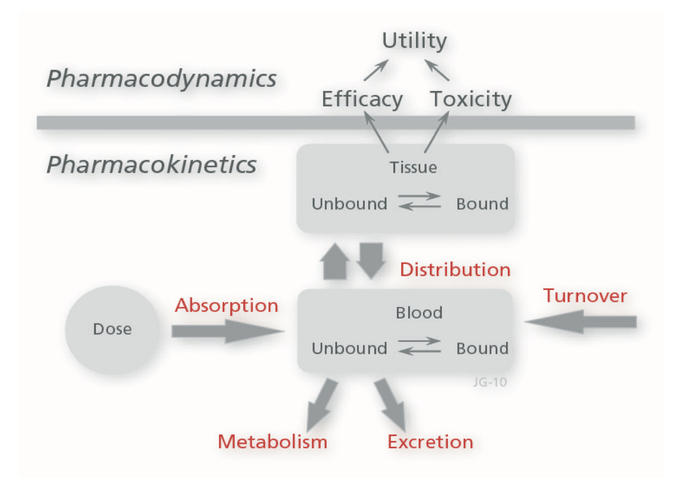
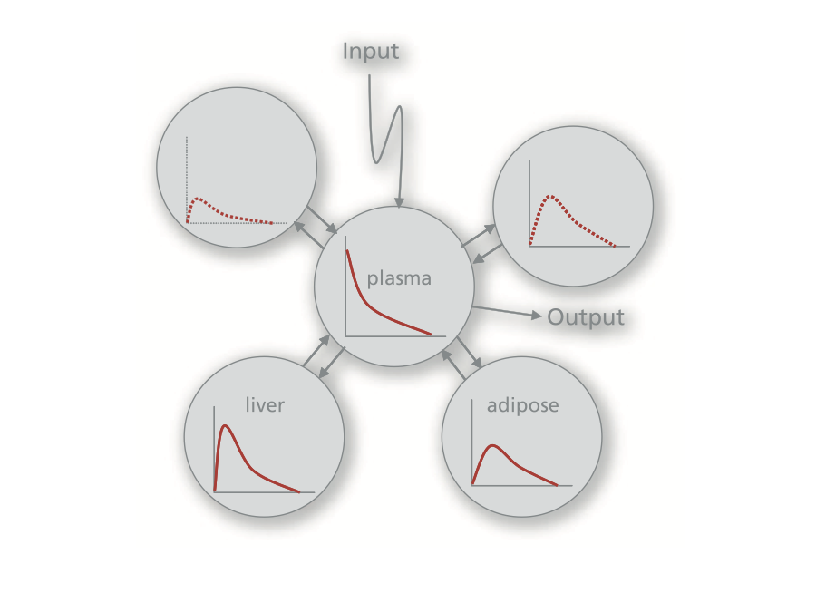
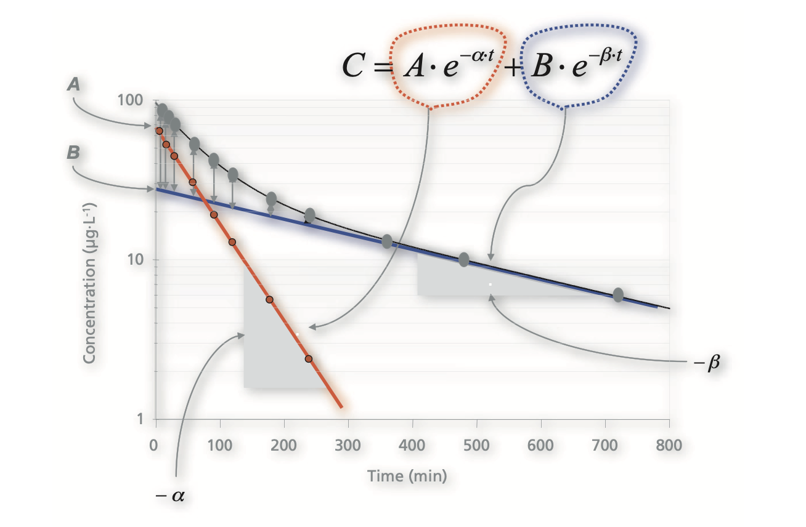

```{r setup, include=FALSE, echo = FALSE,message = FALSE, error = FALSE, warning = FALSE}
knitr::opts_chunk$set(echo = TRUE)

# <!-- ---------------------------------------------------------------------- -->
# <!--                    1. load the required packages                       -->
# <!-- ---------------------------------------------------------------------- --> 

## if(!require(psych)){install.packages("psych")}

# devtools::install_github("rvlenth/lsmeans", dependencies = TRUE)

packages<-c("tidyverse", "knitr")
ipak <- function(pkg){
  new.pkg <- pkg[!(pkg %in% installed.packages()[, "Package"])]
  if (length(new.pkg)) 
    install.packages(new.pkg, dependencies = TRUE)
  sapply(pkg, require, character.only = TRUE)
}
ipak(packages)
# <!-- ---------------------------------------------------------------------- --> 


# <!-- ---------------------------------------------------------------------- -->
# <!--                        2. Basic system settings                        -->
# <!-- ---------------------------------------------------------------------- -->
setwd(dirname(rstudioapi::getSourceEditorContext()$path))
getwd()
Sys.setlocale("LC_ALL","English")

## convert backslash to forward slash in R
# gsub('"', "", gsub("\\\\", "/", readClipboard()))

### get the path
# rstudioapi::getSourceEditorContext()$path
# dirname(rstudioapi::getSourceEditorContext()$path)

### set working directory
# getwd()
# setwd("c:/Users/zbai/Desktop")
# Sys.setlocale("LC_ALL","English")

### get the R Version
# paste(R.Version()[c("major", "minor")], collapse = ".")

### convert backslash to forward slash 
# scan("clipboard",what="string")
# gsub('"', "", gsub("\\\\", "/", readClipboard()))
# <!-- ---------------------------------------------------------------------- --> 


# <!-- ---------------------------------------------------------------------- -->
# <!--     3. Load the SASmarkdown package if the SAS output is required      -->
# <!-- ---------------------------------------------------------------------- -->
# library(SASmarkdown)
# ### Set SAS output
# ### Reset engine to R
# saspath <- "C:/SASHome/SASFoundation/9.4/sas.exe"
# sasopts <- "-nosplash -linesize 75"
# knitr::opts_chunk$set(engine="sashtml", engine.path=saspath,
#         engine.opts=sasopts, comment=NA)
# 
# # run these commands to convince yourself that
# # within this knitr session the engine changed.
# knitr::opts_chunk$get()$engine
# knitr::opts_chunk$get()$engine.path
# knitr::opts_chunk$get()$engine.opts
# <!-- ---------------------------------------------------------------------- -->


# <!-- ---------------------------------------------------------------------- -->
# <!--                         4. Import the datasets                         -->
# <!-- ---------------------------------------------------------------------- -->
### Import csv data
# pfad <- "~/Desktop/SASUniversityEdition/myfolders/Daten"
# mydata1 <- read.csv(file.path(pfad, "yourcsv_data.csv"), 
#                     sep=";", 
#                     header=TRUE)   

### Import xlsx data
# library(readxl)
# mydata2 <- read_excel("C:/Users/zbai/Documents/GitHub/R-Projects/SAS/Yimeng/results-text.xlsx")

### Import sas data
# library(sas7bdat)
# mydata3 <- read.sas7bdat("~/Desktop/SASUniversityEdition/myfolders/Daten/uis.sas7bdat")

### Import from copyboard
# copdat <- read.delim("clipboard")
# Data_D01 <- copdat

# <!-- ---------------------------------------------------------------------- -->
# <!--                           5. Some Tools                                -->
# <!-- ---------------------------------------------------------------------- -->

## To check out vignettes for one specific package
# browseVignettes("ggplot2")


# <!-- ---------------------------------------------------------------------- -->
```

 

```{r,echo = F,message = FALSE, error = FALSE, warning = FALSE}
library('mindr')
# input <- rstudioapi::getSourceEditorContext()$path
# mm(from = input, type = 'file', widget_name = '04_ggplot2.html', root = "")

input <- rstudioapi::getSourceEditorContext()$path 
## file.show(input) # Open the input file with the default program, if any
input_txt <- readLines(input, encoding = "UTF-8")
## Convert to mind map text, markdown outline, R script, and HTML widget ####
mm_output <- mm(input_txt, 
                output_type = c("widget"),
                root = "")
mm_output$widget
```

## Pharmacokinetic Concepts

### Introduction

Pharmacokinetic (PK) is defined as the movement of the drug throughout the body, i.e. what the body does to the drug. It looks at the absorption, distribution, metabolism and elimination of the drug within the human body. In details, Pharmacokinetics is the study of the time course of drug concentration in different body spaces such as plasma, blood, urine, cerebrospinal fluid, and tissues, and the relationship between concentration and the time course of drug action such as onset, intensity, and duration of action. The transfer of a drug from its absorption site to the blood and the various steps involved in the distribution and elimination of the drug in the body are shown in schematic form in Figure below. The boxes represent a compartmentalization of the body and may include one-, two-, or multi-organ or tissue systems.

```{r  , echo=FALSE, fig.align="center", out.width = '100%',fig.cap="Schematic representation showing the interrelationship between absorption, distribution, binding and elimination (excretion and metabolism) kinetics as well as dynamics of a drug. The excretion, metabolism and turnover processes may occur throughout the body."}

```

PK studies enable drug developers to interpret the relationship of dose (or effect of other covariates e.g. blood pressure, heart rate etc.) to blood or plasma concentrations of drugs in various patient populations. Furthermore, PK studies help determine the need for dose adjustment based on PK differences among demographic subgroups or subgroups with impaired elimination. PK studies also provide the basis for therapeutic drug monitoring in rare patient populations, in the treatment of certain cancers (e.g. methotrexate) or when effective drugs with very narrow safe therapeutic windows must be used.

Pharmacodynamics (PD) analysis allow drug developers to quantify the relationship between the drug dose and the pharmacologic or toxicologic effect it has on patients. The results of PD studies can often be impacted by the response of the receptor. This is often the due to the presence of drugs competing for the same receptor. 

### PK Analysis Package in R

**Noncompartmental Analysis (NCA)**

NCA is used as method of description of PK with minimal assumptions of the rates of distribution of the drug through the body. NCA is typically used to describe the PK of a drug in clinical studies with many samples per subject on the same and sequential days. The NCA packages are:

* ncappc: Performs traditional NCA and simulation-based posterior predictive checks for a population PK model using NCA metrics. It targets summarizing data from model-fit or simulated sources.
* NonCompart: Provides basic computational functions for NCA.
* PK: Allows estimation of pharmacokinetic parameters using non-compartmental theory. Both complete sampling and sparse sampling designs are implemented. The package provides methods for hypothesis testing and confidence intervals related to superiority and equivalence.
* PKNCA: Computes standard NCA parameters and summarizes them with the goal of taking in observed clinical data and providing summaries ready for study reports and regulatory submission.
* qpNCA: Noncompartmental Pharmacokinetic Analysis by qPharmetra

**Pharmacometric Modeling**

Modeling of PK data typically uses compartmental methods which assume that the drug enters the body either through an intravenous (IV) or extravascular (often oral or subcutaneous, SC) dose. Packages listed below are restricted to packages that have specific interest to PK modeling and not the (many) packages that support modeling that could be used for PK data. The PK modeling and simulation packages are:

* assemblerr: Assembly of Pharmacometric Models
* bayesnec: A Bayesian No-Effect- Concentration (NEC) Algorithm
* clinPK: Calculates equations commonly used in clinical pharmacokinetics and clinical pharmacology, such as equations for dose individualization, compartmental pharmacokinetics, drug exposure, anthropomorphic calculations, clinical chemistry, and conversion of common clinical parameters. Where possible and relevant, it provides multiple published and peer-reviewed equations within the respective R function.
* cpk: Provides simplified clinical pharmacokinetic functions for dose regimen design and modification at the point-of-care.
* dfpk: Provides statistical methods involving PK measures for dose finding in Phase 1 clinical trials.
* dr4pl: Dose Response Data Analysis using the 4 Parameter Logistic (4pl) Model
* linpk: Generate Concentration-Time Profiles from Linear PK Systems
* mrgsolve: Facilitates simulation from hierarchical, ordinary differential equation (ODE) based models typically employed in drug development.
* nlmixr: Nonlinear Mixed Effects Models in Population PK/PD
* nmw: Is a package to understand the algorithms of NONMEM.
* PKconverter: The Parameter Converter of the Pharmacokinetic Models
* pkdata: Creates Pharmacokinetic/Pharmacodynamic (PK/PD) Data
* PKPDmodels (archived): Provides functions to evaluate common pharmacokinetic/pharmacodynamic models and their gradients.
* pmxTools: Pharmacometric tools for common data analytical tasks; closed-form solutions for calculating concentrations at given times after dosing based on compartmental PK models (1-compartment, 2-compartment and 3-compartment, covering infusions, zero- and first-order absorption, and lag times, after single doses and at steady state, per Bertrand & Mentre (2008)); parametric simulation from NONMEM-generated parameter estimates and other output; and parsing, tabulating and plotting results generated by Perl-speaks-NONMEM (PsN).
* ubiquity: PKPD, PBPK, and Systems Pharmacology Modeling Tools
* UnifiedDoseFinding: Dose-Finding Methods for Non-Binary Outcomes
* wnl: Minimization Tool for Pharmacokinetic-Pharmacodynamic Data Analysis

**Pharmacokinetics Reporting**

Communication of results is as important (or more important) than actually completing an analysis. While many users are currently using rmarkdown and knitr for general reporting, the features of packages which are important for reporting PK data are:

* ncar: Provides NCA for a report writer generating rtf and pdf output.
* pkr: Generates NCA data sets compliant to CDISC and other pharmacokinetic functions for reviewer.
* PKreport (archived): Provides automatic pipeline for users to visualize data and models with an archive-oriented management tool for users to store, retrieve and modify figures and graph generation based on lattice and ggplot2.
* xpose: Diagnostics for non-linear mixed-effects (population) models from ‘NONMEM’. ‘xpose’ facilitates data import, creation of numerical run summary and provide ‘ggplot2’-based graphics for data exploration and model diagnostics.
* xpose.nlmixr: Graphical Diagnostics for Pharmacometric Models: Extension to ‘nlmixr’

### One-Compartment Models-Intravenous bolus administration

Intravenous iv bolus dosing (that is, all of the dose is given as a rapid injection) captures the pure disposition of a drug. Disposition stands for distribution and elimination processes. Disposition combined with absorption gives the overall kinetics after extravascular dosing. In general, the transfer rate of a drug from one compartment to another can be modeled by first- order kinetics. This means that the rate of change of drug from a specific compartment to another is proportional to its concentration within the source compartment. Figure 2.2 shows a schematic representation of a one-compartment model where the whole organism is approximated by a single volume. C and V denote concentration in plasma and the volume of distribution, respectively and Ab the amount.

Volume of distribution V is defined as the apparent space or volume into which a drug distributes. V may be viewed as a proportionality factor between the total amount of drug in the body Ab and the concentration of drug in plasma C, which is the reference space.

```{r  , echo=FALSE, fig.align="center", out.width = '100%'}

```

The relationship between the concentration C and the rate of decline dC/dt in concentration may be expressed mathematically for a one-compartment model with first-order kinetics when drug is administered as a bolus dose as follows

$$
\frac{d C}{d t}=-K \cdot C=-\frac{C l}{V} \cdot C
$$
$d C / d t$ is the rate of change of the plasma concentration per unit time, $C$ is the plasma concentration and $K$ is the first-order rate constant associated with the elimination process. 
Clearance is defined as the volume of blood or plasma that is totally cleared of its content of drug per unit time $\left(\mathrm{mL} \cdot \mathrm{min}^{-1}\right.$ or $\mathrm{L} \cdot \mathrm{min}^{-1}$,). This volume is, of course an imaginary term, but describes the capacity of irreversible elimination of a compound from plasma, and is a consequence of a combination of perfusion, diffusion, filtration, metabolism and transport processes of the clearing organ(s).

$t_{1 / 2}$ is the time required for reducing by half the concentration of drug (and corresponding concentrations) remaining in the body. $K$ may also be directly estimated from the half-life $t_{1 / 2}$
$$
K=\frac{\ln (2)}{t_{1 / 2}}
$$
As can be seen from Equation $2: 1, K$ is equal to clearance $C l$ divided by volume $V$. The $C l, K$, and $t_{1 / 2}$ parameters relate to first-order processes. Note that $C l$ and $V$ are the independent variables and $K$ and $t_{1 / 2}$ are functions of $C l$ and $V$. Half-lives are dependent on both elimination $C l$ and distribution $V$. Since $C l$ and $V$ are the primary pharmacokinetic parameters of interest (and independent of each other), we will often use them instead of $K$. Equation 2:1 can be expressed in integrated form as
$$
C=C^0 \cdot e^{-K \cdot t}=\frac{D}{V} \cdot e^{-\frac{C l}{V} \cdot t}
$$
We often refer to clearance $C l$ and volume $V$ as primary or estimated parameters in comparison to half-life $t_{1 / 2}$, elimination rate constant $K$ or $\left.\mu \mathrm{g} \cdot \mathrm{L}^{-1} \cdot \mathrm{h}\right)$ which we call secondary or derived parameters. In Figure $2.6, C$ is the plasma concentration, $C^0$ is the concentration at time zero and $D_{i v}$ is the intravenous dose. The volume $V$ governs the peak concentration $C^{\circ}$. The area under the curve $A U C$ is governed by clearance $C l$.

```{r  , echo=FALSE, fig.align="center", out.width = '100%'}

```

### One-Compartment Models-Constant rate infusion

If we infuse drug at a constant rate over a period of time, the plasma concentration will rise as shown in Figure Below and eventually plateau. 

```{r  , echo=FALSE, fig.align="center", out.width = '100%'}
knitr::include_graphics("./02_Plots/PK/PK04.png")
```

Fifty percent of steady state plasma concentration is reached after one half- life, 75 % after 2 half-lives, and 87.5 % after 3 half-lives etc. From a practical point of view, we say that 90 % of steady state is reached after 3 - 4 half- lives. The relationship between the concentration C and time in Figure 2.8 may be expressed mathematically for a one-compartment model by means of Equation 2:20 during the infusion and Equation post-infusion. The basic one-compartment first-order elimination and zero-order infusion model is expressed in differential equation form as

$$
\frac{d C}{d t}=\frac{R_{in}}{V}-\frac{C l}{V} \cdot C
$$

where Rin denotes the rate of infusion. The steady state concentration Css can be calculated as Rin divided by Cl, hence
$$
C_{ss}=\frac{R_{in}}{Cl}
$$
After transformed, $\ln \left[\frac{C_{s s}-C}{C_{s s}}\right]=\ln (R)=-\frac{C l}{V} \cdot t=K \cdot t$
$R$ denotes $\left(C_{s 5}-C\right) / C_{s s}$. For $\ln (R)$ plotted versus $t$ the slope equals $-K$ in Figure Below


```{r  , echo=FALSE, fig.align="center", out.width = '100%'}

```

Steady state is the situation where successive concentrations are the same over time because the rate into the system equals the rate out. For drugs dosed at constant rate such as an infusion, this means that concentrations are no longer changing with time. For other dosing regimens such as extravascular administration, the concept is somewhat weaker, meaning that equivalent time-concentration profiles occur after successive administration of the same dose and frequency. Again, the only requirement is that dose size and dose frequency are identical when comparing two consecutive intervals.

### Integration of clearance and volume 

Figure below illustrates the kinetics of three different systems. It compares how a) equal volumes but different clearances, b) equal clearances and different volumes, and c) different clearances and different volumes, affect the time course of drug in plasma after bolus dosing and constant rate intravenous infusion.


```{r  , echo=FALSE, fig.align="center", out.width = '100%'}

```

The upper row of plots shows how Cl affects the area under the curve AUC, and how V determines the peak concentration C0. The larger the Cl the lower is the AUC; the larger the V, the lower is C0, and vice versa. Since A and B have a similar V, their C0 will be the same. However, Cl is larger for B than for A. Hence, AUCA is greater than AUCB. C and D have similar Cl and therefore their AUC:s will be the same. However, V of D is less than of C and therefore C0 of D will be higher. There is less space in D for drug to distribute into, so the peak concentration will be higher. In the last example, E and F differ in both Cl and V, but their V/Cl ratios are the same, which is also observed from their identical half-lives. Since Cl for F is greater than for E, AUCF will be smaller than AUCE. Also, since E has the smallest V, the peak concentration will be higher.
The lower row of plots in Figure displays the concentration time courses after a constant rate infusion. We assume that the dosing rate is the same. Note that only Cl affects the steady state concentration, but both Cl and V determine the time to steady state via the half-life. We say that steady state is reached within 3 to 4 half-lives. Case A has the lower Cl and will therefore establish a higher steady state concentration Css. The time to steady state is longer for A since the half-life is longer than for B. C and D have the same Cl and will also have the same Css. Since t1/2 is greater for C than D, the time to steady state will be longer. The lower Cl for E causes the higher Css. The time to steady state will be the same for both E and F since their half-lives are the same. The steady state situation is also exemplified for a dosing interval after multiple intravenous bolus doses in Figure 2.13. The left hand picture in Figure 2.13 shows two cases with different clearances. Case B with higher clearance will have the lower AUC and steady state concentration Css, but Cmax values will be the same.

### One-Compartment Models-Extravascular administration

The administration of a drug by any routes (e.g., oral, subcutaneous, dermal) other than the systemic (i.e., intravenous) route will introduce an absorption step. The change in body drug content or plasma drug concentration per unit time will now be more complex, since the rate of change of drug will be a function of both the absorption rate and the elimination rate (Figure Below). 

```{r  , echo=FALSE, fig.align="center", out.width = '100%'}
knitr::include_graphics("./02_Plots/PK/PK07.png")
```

Typically, one would estimate the elimination rate constant from the terminal slope of the extravascular concentration-time profile i.e., after an instant release tablet. In some cases, however, the absorption process will be the rate limiting step as with a controlled release tablet. This is known as the flip-flop situation, where the ascending limb of the concentration- time curve will contain information about the elimination rate constant and the descending or terminal portion will contain information about the absorption rate constant.
In order to discriminate between the two phases, the true elimination phase of the drug after an intravenous dose needs to be calculated. That is shown for the flip-flop situation in Figure Below. Note in the right hand figure that the slope of the terminal portion of the extravascular curve is not parallel to the slope of the intravenous curve. The latter intravenous slope gives the true elimination rate constant and the slope of the former gives the absorption rate constant.


```{r  , echo=FALSE, fig.align="center", out.width = '100%'}
knitr::include_graphics("./02_Plots/PK/PK08.png")
```

In summary, Pertinent kinetic estimates after extravascular dosing are listed

```{r  , echo=FALSE, fig.align="center", out.width = '100%'}
knitr::include_graphics("./02_Plots/PK/PK09.png")
```

### Plasma and Urine Data

For some compounds such as the aminoglycosides, renal elimination is the major excretory route. Therefore, a few words about the general physiology of the kidneys are in order. The functional unit of the kidney is the nephron which contains Bowman’s capsule, the proximal tubule, the loop of Henle, the distal tubule and the collecting duct. Bowman’s capsule is the filter of the nephron and is responsible for filtering low molecular weight compounds (< 60,000 dalton). Extensive protein binding reduces filtration as does incorporation of drug into red blood cells. The glomerular filtration rate GFR varies between 110 and 130 mL·min-1 in man. A measure of GFR is obtained from inulin which is neither secreted into nor reabsorbed from the tubule. Approximately 180 L of water is filtered per day, but over 95 % of that is reabsorbed, resulting in a total urine output of 1-2 L per day. Active secretion of weak electrolyte compounds such as weak acids from blood towards urine occurs in the proximal tubule in parallel to reabsorption of water from urine to blood. Since the process is active it requires energy, is saturable and can be inhibited. Reabsorption of water is amplified in the loop of Henle, whereas in the distal tubule there is passive reabsorption of lipid soluble non-ionized forms of compounds and of water. The concentration of compounds in urine is concentrated since water is reabsorbed. The ionization of weak acids and bases depends on urinary pH and pKa of the compound. Urinary pH varies from 4.5 to 8 depending on diet and drugs.

In certain situations one benefits from incorporating urinary data of drug disposition along with plasma data. That enables one to estimate renal clearance ClR or the fraction of dose excreted unchanged via the kidneys fe. Figure below shows a one-compartment plasma model that also includes a urinary excretion compartment. 

```{r  , echo=FALSE, fig.align="center", out.width = '100%'}
knitr::include_graphics("./02_Plots/PK/PK10.png")
```

For Analysis of urinary excretion data, Several methods have been proposed for analysis of urinary data. The two most common methods involve plotting cumulative excretion (left) or urinary excretion rate (Equation right, volume of urine collected within a time interval multiplied by the concentration of drug in the urine) against the mid time point of the collection interval (Figure Below). A third method involves simultaneous nonlinear regression of plasma concentration-time data and accumulated amount excreted into urine against time. More details are not displayed here

```{r  , echo=FALSE, fig.align="center", out.width = '100%'}
knitr::include_graphics("./02_Plots/PK/PK11.png")
```


### Multi-Compartment-Catenary and mammillary models

When drugs are administered rapidly and concentrations measured frequently, the mono-exponential or one-compartment model is not always suitable for predicting the early time course of drug in plasma due to a multi-phasic decline of the concentration-time curve 

```{r  , echo=FALSE, fig.align="center", out.width = '100%'}

```

This is because it takes time for the drug to distribute into the tissues and reach equilibrium. This delay may be due to perfusion or diffusion rate limited processses during drug distribution into the tissues spaces. Instantaneous equilibrium of drug between plasma and tissues is rarely observed. Most drugs display multi-compartment behavior independently of molecular size. 

Multi-compartment models are more complex than the one-compartment model, introducing additional compartments for distribution and redistribution of the drug between a central compartment (blood and rapidly equilibrated organs) and one or several peripheral compartments. Peripheral compartments are represented by more slowly equilibrating tissues, which may either be poorly perfused or surrounded by protective membranes. In contrast to the one-compartment model, a longer time is usually required for multi-compartment compounds to achieve pseudo-distribution equilibrium between blood and tissues. This scheme of equilibration is illustrated by means of the **catenary** and **mammillary models**.

The **multi-compartment catenary system** is characterized by means of a number of compartments that are in a series or a chain. While flux between adjacent compartments may be either uni or bi-directional, the overall flux of substance is sequential, via successive compartments in the series.

```{r  , echo=FALSE, fig.align="center", out.width = '100%'}
knitr::include_graphics("./02_Plots/PK/PK13.png")
```

The **multi-compartment mammillary system** is characterized by means of a number of peripheral compartments, which are connected to a single central compartment (Figure 2.41). The expression originates from the mammillary glands, which are organized in such a fashion. Input and irreversible loss of drug is generally assumed to occur only from the central compartment.

```{r  , echo=FALSE, fig.align="center", out.width = '100%'}

```

### Two-compartment model-Intravenous bolus administration

The effect of adding a second or peripheral compartment to the one- compartment model is to introduce a second exponential term into the predicted time course of the plasma concentration, so that it comprises a rapid initial and a slow terminal phase. This pattern is often found experimentally, and is most clearly revealed when the concentration data are plotted semi-logarithmically. 

A bi-exponential decline after an intravenous bolus dose, is associated with a two-compartment model
$$
C=A \cdot e^{-\alpha \cdot t}+B \cdot e^{-\beta \cdot t}
$$
The primary model parameters are A, α, B and b, where -α and -b correspond to the initial and terminal slopes, respectively, when data are plotted on semi-logarithmic scale. Their corresponding half-lives are estimated as
$$
\begin{aligned}
&t_{1 / 2 \alpha}=\frac{\ln (2)}{\alpha} \\
&t_{1 / 2 \beta}=\frac{\ln (2)}{\beta}
\end{aligned}
$$
Figure Below shows the concentration-time data of a compound that displays multi-(two)-compartment characteristics following an intravenous bolus dose. A bi-exponential decline on a semi-logarithmic scale is synonymous with two-compartment behavior. It demonstrates how the bi-exponential decline is dissected into its principal parts. α is obtained by means of the method of residuals, which means that the back-extrapolated b phase is subtracted from the experimental data during the initial phase. The slope of the differences plotted on a semi-logarithmic scale corresponds to –α. The intercept of the back-extrapolated concentration-time curve on the concentration axis C0 is equal to A + B.

```{r  , echo=FALSE, fig.align="center", out.width = '100%'}

```

For the parameters calculation see Johan Gabrielsson, Daniel Weiner - Pharmacokinetic and Pharmacodynamic Data Analysis_ Concepts and Applications, 5th Edition-Swedish Pharmaceutical Press (2017)

Table Below contains a summary of the SHAM- (Slope, Height, Area, and Moment) analysis of an intravenous bolus concentration curve for a drug displaying two-compartment kinetics.

```{r  , echo=FALSE, fig.align="center", out.width = '100%'}

```


### Two-compartment model-Constant rate infusion

When possible, a constant rate infusion is preferred when a drug is given for the first time, has a narrow therapeutic index and/or when one wants to observe and evaluate a pharmacologic effect. Both the bolus and extravascular input regimens are cumbersome since one does not have very much control over the input of drug when drug is administered. The longer the duration of an infusion, the smaller the amount of the initial phase observed. However, if data are collected frequently enough during the early time points, one will be able to observe a dip corresponding to the initial loss from the central compartment 

The left hand figure displays schematically the kinetics of a multi-compartment drug after a bolus dose and constant rate infusion. This figure also relates the intercept CI of the back-extrapolated terminal slope after an infusion to the intercept of the same compound after a bolus dose Clz. In the case of the α, b and g phase, Clz corresponds to A, B and C, respectively. The right hand figure displays observed concentration-time data on a log-linear scale and includes the α, b and g slopes. The vertical line at 2 hours indicates time zero for the estimation of the three slopes.

```{r  , echo=FALSE, fig.align="center", out.width = '100%'}
knitr::include_graphics("./02_Plots/PK/PK17.png")
```


## Non-Compartmental Analysis (NCA)

* Compartmental Analysis: Compartmental modeling methods consider the body to consist of a finite number of interconnected, well-mixed, and kinetically homogeneous compartments (e.g., blood, organs, and other tissues). Based on this view, the pharmacokineticist makes certain assumptions and develops models based upon nonlinear regression analysis to describe the PK of the drug. When using a compartmental approach, there is the potential for variability in the output of the analysis because the assumptions used to build the PK model may be somewhat different from one pharmacokineticist to another.
* Noncompartmental Analysis: Noncompartmental analysis (NCA) methods are model-independent, meaning they do not rely upon assumptions about body compartments, and they tend to provide more consistency. In addition, NCA relies almost exclusively upon algebraic equations to estimate PK parameters, making the analysis less complex than compartmental methods. NCAs often prove faster and more cost-efficient to conduct, especially when compared to more complex compartmental analyses (e.g., compartmental models that are applied to population PK analyses and that rely upon sparse sampling techniques).

### NCA vs regression analysis

Most current approaches to characterize a drug's kinetics involve noncompartmental analysis, denoted $N C A$, and nonlinear regression analysis. The advantages of the regression analysis approach are the disadvantages of the non-compartmental approach and vice versa. $N C A$ does not require the assumption of a specific compartmental model for either drug or metabolite, although elimination occurs from the sampling compartment as is assumed to be linear. The $N C A$ method used involves application of the trapezoidal rule for measurements of the area under a plasma concentration-time curve. This method, which applies to firstorder (linear) elimination models, has few assumptions and can readily be automated. Figure below gives a schematic picture of the $N C A$ and nonlinear regression approaches. As can be seen, $N C A$ deals with sums of areas whereas regression modeling uses a function with regression parameters. Both methods are applied when characterizing the kinetics of a compound.


```{r  , echo=FALSE, fig.align="center", out.width = '100%'}
knitr::include_graphics("./02_Plots/PK/PD08.png")
```

The area under a plot of the plasma concentration versus time curve is referred to as the area under the zero moment curve or $A U C$, and the area under the product of the concentration and time against time is called the area under the first moment curve or $A U M C$. Only the areas of the zero and first moments are generally used in pharmacokinetic analysis, because the higher moments are prone to an unacceptable level of computational error.

### Computational methods - Linear trapezoidal rule 

The areas can either be calculated by means of the linear trapezoidal rule or by the log-linear trapezoidal rule. In both cases, the total area is measured by summing the incremental area of each trapezoid

This over/under estimation error will be more pronounced if the sampling interval $\Delta t$ is large in relation to the half-life. Using the linear trapezoidal rule for calculation of the area under the zero moment curve $A U C$ from 0 to time $t_n$, we have
$$
A U C_0^{t_{l s t}}=\sum_{i=1}^n \frac{C_i+C_{i+1}}{2} \cdot \Delta t
$$
where $\Delta t=t_{i+1}-t_i$, and $t_{\text {last }}$ denotes the time of the last measurable concentration. Unless one has sampled long enough in time so that concentrations are negligible, the $A U C$ as defined above will underestimate the true $A U C$. Therefore it may be necessary to extrapolate the curve out to $t$ equal to infinity. The extrapolated area under the zero moment curve
$$
\begin{aligned}
&A U C_{t_{\text {last }}}^{\infty}=\int_{t_{\text {last }}}^{\infty} C_{\text {last }} \cdot e^{-\lambda_z \cdot\left(t-t_{\text {last }}\right)} d t \\
&=C_{\text {last }} \cdot\left[\frac{e^{-\lambda_z \cdot\left(t-t_{\text {last }}\right)}}{-\lambda_z}\right]_{t_{\text {last }}}^{\infty}=C_{\text {last }} \cdot\left[0-\frac{1}{-\lambda_z}\right]=\frac{C_{\text {last }}}{\lambda_z}
\end{aligned}
$$
where $C_{\text {last }}$ and $\lambda_z$ are the last measurable non-zero plasma concentration and the terminal slope on a $\log _e$ scale, respectively. One may also use the predicted concentration at $t_{\text {last }}$ based on the terminal regression, if the observed concentration for some reason deviates from the terminal regression line.

```{r  , echo=FALSE, fig.align="center", out.width = '100%'}

```

The $\lambda_z$ parameter is graphically obtained from the terminal slope of the semi-logarithmic concentration-time curve as shown in Figure Below, with a minimum of 3-4 observations being required for accurate estimation. The $Y$ axis $\ln (C)$ denotes the natural logarithm $\log _e$ of the plasma concentration $C$.

The linear trapezoidal rule for calculation of the area under the first moment curve $A U M C$ from 0 to time $t_{\text {last }}$ is obtained from
$$
A U M C_0^{t_{l a s t}}=\sum_{i=1}^n \frac{t_i \cdot C_i+t_{i+1} \cdot C_{i+1}}{2} \cdot \Delta t
$$
Remembering that $\int X \cdot e^{-a \cdot x} d x=-\frac{X \cdot e^{-a \cdot x}}{a}-\frac{e^{-a \cdot x}}{a^2}$ the corresponding area under the first moment curve from time tlast to infinity $A U M C_{\text {tlast-o }}$ is computed as
$$
\begin{aligned}
&A U M C_{t_{\text {last }}}^{\infty}=\int_{t_{\text {last }}}^{\infty} t \cdot C_{\text {last }} \cdot e^{-\lambda_z \cdot\left(t-t_{\text {last }}\right)} d t \\
&=C_{\text {last }} \cdot e^{\lambda_z \cdot t_{\text {last }}} \cdot\left[\frac{t \cdot e^{-\lambda_z \cdot t_{\text {last }}}}{-\lambda_z}+\frac{e^{-\lambda_z \cdot t_{\text {last }}}}{-\lambda_z^2}\right]_{t_{\text {last }}}^{\infty}=\frac{t_{\text {last }} \cdot C_{\text {last }}}{\lambda_z}+\frac{C_{\text {last }}}{\lambda_z^2}
\end{aligned}
$$

### Computational methods - Log-linear trapezoidal rule

An alternative procedure that has been proposed to the linear trapezoidal rule is the log-linear trapezoidal rule. The underlying assumption is that **the plasma concentrations decline mono-exponentially between two measured concentrations**. However, this method applies only for descending data and fails when $C_i=0$ or $C_{i+1}=C_i$. In these instances one would revert to the linear trapezoidal rule. The principal difference between the linear and the log-linear trapezoidal rules is demonstrated in Figure Below.

```{r  , echo=FALSE, fig.align="center", out.width = '100%'}
knitr::include_graphics("./02_Plots/PK/PD10.png")
```

Remember that when the concentrations decline exponentially
$$
C_{i+1}=C_i \cdot e^{-K \cdot\left(t_{i+1}-t_i\right)}=C_i \cdot e^{-K \cdot \Delta t}
$$

### Pertinent pharmacokinetic estimates

```{r  , echo=FALSE, fig.align="center", out.width = '100%'}

```

Example from D7060: The PK parameters for MEDI0618 will be derived using non-compartmental methods in **Phoenix® WinNonlin®** Version 8.1 or higher (Certara). All pharmacokinetic parameters will be derived only for those study participants in the PK analysis sets. A non-compartment analysis approach is used for all derivations. If the time courses of the serum concentrations are suitable to this purpose, multiple-dosing estimates may be simulated by superposition from the single-dose data assuming dose-proportional, time invariant and superimposable (i.e., linear) pharmacokinetics. The derivation of the pharmacokinetic parameters listed in Section 6.5 and of the parameters required for their derivation is described in the following.

#### Maximum observed serum concentration $\left(C_{\max }\right)$

The maximum observed concentration will be calculated via
$$
C_{\max }=\max \left(C_t\right),
$$
where $C_t$ is the set of observed concentrations for all time points $t$ for the first dosing interval.

#### Time of occurrence of $C_{\max }$ after dosing $\left(t_{\max }\right)$

The time until the occurrence of the maximum observed serum concentration will be calculated using
$$
t_{\max }=t_{c_{\max }}-t_0
$$
where $t_{C_{\max }}$ is the time point when the maximum concentration was observed and $t_0$ is the time when the IP was first administered.


#### Quantifiable area under the time course of the concentrations $\left(A U C_{\left(0-t_z\right)}\right)$

The quantifiable area under the time course of the concentrations will be calculated by the linear-log trapezoidal method. The linear-log trapezoidal method prescribes that the linear trapezoidal rule is used for each incremental/constant trapezoid (i.e., $C_{t_{i-1}} \leq C_{t_i}$ ) while the log trapezoidal rule is used for each decremental trapezoid (i.e., $C_{t_{i-1}}>C_{t_i}$ ).

The linear trapezoidal rule which gives AUC from time zero to time point $t_n$ of last incremental/constant concentration is defined as
$$
A U C_{0-t_n}=\sum_{i=1}^n\left[\left(t_i-t_{i-1}\right)\left(\frac{C_{t_{i-1}}+C_{t_i}}{2}\right)\right]
$$
where $C_{t_i}$ is the concentration observed at time point $t_i$.
The log trapezoidal rule which gives AUC from time point $t_n$ to time point $t_z$ of last quantifiable concentration can be calculated by means of the concentrations $C_{t_j}$ observed at time points $t_j$ as

$$
A U C_{t_n-t_z}=\sum_{j=\mathrm{n}}^z\left[\left(t_i-t_{i-1}\right)\left(\frac{C_{t_{i-1}}-C_{t_i}}{\ln \left(C_{t_{i-1}} / C_{t_i}\right)}\right)\right]
$$
The linear-log trapezoidal method is thought to be the most "accurate" because the linear method is the best approximation of drug absorption while logarithmic decline is best modeled by the logarithmic trapezoidal method during drug elimination.

#### Total AUC extrapolated to infinity $\left(A U C_{0-\infty}\right)$
The area under the concentration time curve from time zero to infinity will be calculated by
$$
A U C_{0-\infty}=A U C_{0-t_z}+\frac{C_{t_{l z}}}{\lambda_z}
$$
where $\mathrm{AUC}_{0-\mathrm{t}_{\mathrm{z}}}$ is the quantifiable area under the time course of the concentrations, $C_{t_z}$ is the last analytically quantifiable concentration and $\lambda_z$ is the apparent terminal disposition rate constant. If the extrapolated area exceeds $20 \%$, then $\lambda_z$ and $A U C_{0-\infty}$ as well as parameters derived from them are not reliable and will be calculated for listings but set to missing in summaries.

#### Apparent terminal disposition rate constant $\left(\lambda_z\right)$

The apparent terminal disposition rate constant is required for the calculation of the apparent terminal disposition half-life $\left(t_{1 / 2}\right)$. It can be estimated by linear regression through the terminal phase of the log concentration-time profile. At least the three last measurements with quantifiable concentration should be used. Further data points are added until addition of these data points does not increase the value for the adjusted- $\mathrm{r}^2$ statistic of the regression model. Inclusion of $C_{\max }$ is not allowed. The apparent terminal disposition rate constant can be calculated from the slope of the estimated regression line by multiplication with $-1$ if the natural logarithm (ln) is used.

#### Apparent terminal disposition half-life $\left(t_{1 / 2}\right)$
The apparent terminal disposition half life will be calculated as
$$
t_{1 / 2}=\frac{\ln (2)}{\lambda_z}
$$
where $\lambda_z$ is the apparent terminal disposition rate constant.

#### Quantifiable area under the statistical first moment curve $\left(A U M C_0-t_z\right)$

The quantifiable area under the statistical first moment curve will be calculated by the linear-log trapezoidal method. The linear-log trapezoidal method prescribes that the linear trapezoidal rule is used for each incremental/constant trapezoid (i.e., $C_{t_{i-1}} \leq C_{t_i}$ ) while the log trapezoidal rule is used for each decremental trapezoid (i.e., $C_{t_{i-1}}>C_{t_i}$ ).
The linear trapezoidal rule which gives AUMC from time zero to time point $t_n$ is defined as
$$
A U M C_{0-t_n}=\sum_{i=1}^n\left[\left(t_i-t_{i-1}\right)\left(\frac{C_{t_{i-1}} \cdot t_{i-1}+C_{t_i} \cdot t_i}{2}\right)\right]
$$
where $C_{t_i}$ is the concentration observed at time point $t_i$.
The log- trapezoidal rule which gives AUMC from time point $t_n$ to time point $t_z$ of last quantifiable concentration can be calculated by means of the concentrations $C_{t_j}$ observed at time point $t_j$ as follows:
$$
A U M C_{t_n-t_z}=\sum_{j=1}^z\left[\frac{C_{t_{j-1}} \cdot t_{j-1}-C_{t_j} \cdot t_j}{B}+\frac{C_{t_{j-1}}-C_{t_j}}{B^2}\right] \text { with } \mathrm{B}=\frac{\ln \left(C_{t_{j-1}}\right) 1-\ln \left(C_{t_j}\right)}{t_{j-1}-t_j}
$$
The linear-log trapezoidal method is thought to be the most "accurate" because the linear method is the best approximation of drug absorption while logarithmic decline is best poodeled by the logarithmic trapezoidal method during drug elimination.

#### Total area under the statistical first moment curve $\left(A U M C_{0-\infty}\right)$

The total area under the statistical first moment curve from will be calculated by
$$
A U M C_{0-\infty}=A U M C_{0-t_z}+\frac{C_{t_z} \cdot t_z}{\lambda_z}+\frac{C_{t_z}}{\lambda_z^2}
$$
where $\mathrm{AUMC}_{0-\mathrm{t}_z}$ is the quantifiable area under the statistical first moment curve, $C_{t_z}$ is the last quantifiable concentration and $\lambda_z$ is apparent terminal disposition elimination rate constant.

#### Mean residence time (MRT)

The mean residence time represents the average time a molecule stays in the body. In general, the mean residence time can be calculated by
$$
M R T=\frac{A U M C_{0-\infty}}{A U C_{0-\infty}}-\left(t_{l a g}+\frac{1}{k_a}\right)
$$
with $k_a$ being the absorption rate constant, $t_{\text {lag }}$ being Lag-time of time delay between drug administration and first observed concentration above LOQ in plasma), $A U C_{0-\infty}$ being the area under concentration time curve from time zero to infinity and $A U M C_{0-\infty}$ being the corresponding area under the first-moment curve from time zero to infinity.

#### Peak-to-trough fluctuation (PTF)

Peak to-trough fluctuation over one dosing interval at steady state is defined via
$$
P T F \%=100 \cdot \frac{C_{S S, \max }-C_{s S, \min }}{C_{s s, a v}}
$$
Where $C_{s s \text {, max }}$ is the maximum observed concentration during a dosing interval at steady state, $C_{s s \text {, min }}$ is the minimum observed concentration during a dosing interval at steady state, and $C_{s s, a v}$ is the average concentration at steady state.


#### Bioavailability (F)

The absolute bioavailability is defined as the percentage of the administered dose that reaches the systemic circulation. For intravenous drug administration, the bioavailability is always equal to one. For subcutaneous drug administration, bioavailability can be calculated by
$$
F=100 \% \cdot \frac{A U C_{s c} \cdot D_{i v}}{A U C_{i v} \cdot D_{s c}}
$$
where $i v$ stands for intravenous and $s c$ for subcutaneous, $D_{<i v ; s c\rangle}$ is the respective dose for the route of administration and $A U C_{<i v ; s c>}$ is the corresponding area under concentration-time curve from zero to infinity.

In this study, bioavailability after subcutaneous drug administration will be calculated based on the cohort with intravenous administration of $80 \mathrm{mg}$ MEDI0618 and the cohort with subcutaneous administration of $100 \mathrm{mg}$.


## Calculation (PK package）


Noncompartmental PK parameters, such as $C_{\max }$ time to peak (maximum) plasma drug concentration ( $\left.t_{\max }\right)$, area under the plasma concentration-time curve calculated from time 0 to the last measurable concentration at time $t$ (AUC $_{0-t}$ ), area under the plasma concentration-time curve from time 0 to infinity $\left(\mathrm{AUC}_{0-\infty}\right), t_{1 / 2}, \mathrm{CL} / \mathrm{F}$, apparent volume of distribution $(\mathrm{Vz} / \mathrm{F})$, and percentage of $\mathrm{AUC}_{0-\infty}$ due to extrapolation from the time for the last quantifiable concentration to infinity (AUC\%extrap), were calculated from the plasma concentration-time data. Actual sampling times were used in the calculations. Descriptive statistics (N, mean, standard deviation [SD], percentage of coefficient of variation [CV\%], geometric mean, geometric CV\%, median, minimum, and maximum) were provided for concentrations at each time point and for all PK parameters.

To assess the effect of food on the pomalidomide liquid formulation, an ANOVA model, with treatment as a fixed effect and subject as a random effect, was performed on the natural log-transformed AUCs and Cmax for Treatment C (test formulation, fed) and Treatment B (test formulation, fasted) from Treatment Periods 1, 2, and 3. The geometric mean values and percentage ratios (Treatment C/Treatment B) of the geometric mean values between Treatments C and B were presented, along with the 90% CIs for the ratios. For tmax, a nonparametric analysis was used to produce a median difference between treatments. The median, median difference (fed–fasted), and 90% CI of the median difference were obtained from the Hodges–Lehmann estimate. The P-value was derived from the Wilcoxon signed-rank test.

[Source](https://www.dovepress.com/a-phase-i-open-label-randomized-crossover-study-in-healthy-subjects-to-peer-reviewed-fulltext-article-CPAA)


### AUC

* `auc`: Estimation of confidence intervals for the area under the concentration versus time curve

Calculation of confidence intervals for an AUC (from 0 to the last time point) or for the difference between two AUCs for serial sampling, batch and complete data designs. The AUC (from 0 to the last time point) is calculated using the linear trapezoidal rule on the arithmetic means at the different time points.

* The t method uses the critical value from a t-distribution with Satterthwaite’s approximation (Satterthwaite, 1946) to the degrees of freedom for calculation of confidence intervals as presented in Tang-Liu and Burke (1988), Nedelman et al (1995), Holder et al (1999), Jaki and Wolfsegger (2009) and Jaki and Wolfsegger (2012). 
* The z method uses the critical value from a normal distribution for calculation of confidence intervals as presented in Bailer (1988) or in Jaki and Wolfsegger (2009). 
* The boott method uses bootstrap-t confidence intervals as presented in Jaki and Wolfsegger (2009). Using boott an additional strata variable for bootstrapping can be specified in the case of serial sampling.


```{r,echo = T,message = FALSE, error = FALSE, warning = FALSE}
library(PK)

## serial sampling design: example from Nedelman et al. (1995)
conc.m <- c(391, 396, 649, 1990, 3290, 3820, 844, 1650, 75.7, 288)
conc.f <- c(353, 384, 625, 1410, 1020, 1500, 933, 1030, 0, 80.5)
time <- c(1, 1, 2, 2, 4, 4, 8, 8, 24, 24)
res1 <- auc(conc=conc.m, time=time, method=c('t','z'), design='ssd')
res2 <- auc(conc=conc.f, time=time, method=c('t','z'), design='ssd')
summary(res1)

plot(res1, pch=19, ylim=c(0,5000), xlim=c(0,25))
plot(res2, pch=21, col='red', add=TRUE)
legend(x=25, y=5000, xjust=1, pch=c(19,21), col=c('black','red'),
legend=c('Male', 'Female'))


## batch design: example from Jaki and Wolfsegger (2009),
## originally in Holder et al. (1999) using data for call
data(Rats)
data1 <- subset(Rats,Rats$dose==100)
data2 <- subset(Rats,Rats$dose==300)
res1 <- auc(data=data1,method='t', design='batch')
res2 <- auc(data=data2,method='t', design='batch')
plot(res1, col='black', ylim=c(0,8), xlim=c(0,25))
plot(res2, col='red', add=TRUE)
legend(x=0, y=8, xjust=0, lty=1, col=c('black','red'),
legend=c('Dose of 100', 'Dose of 300'))
data3 <- subset(Rats,Rats$dose==100 | Rats$dose==300)
data3$group <- data3$dose
res3 <- auc(data=data3,method='t', design='batch')
plot(res3,bygroup=TRUE)


## complete data design example
## originally in Hand and Crowler (1996)
data(Glucose)
data1 <- subset(Glucose, date==1)
data2 <- subset(Glucose, date==2)
res1 <- auc(conc=data1$conc, time=data1$time, design='complete', method='t')
res2 <- auc(conc=data2$conc, time=data2$time, design='complete', method='t')
plot(res1, pch=19, col='black', ylim=c(0,5))
plot(res2, pch=21, col='red', add=TRUE)


## more informative plot
plot(x=c(0, 30), y=c(0, 5), type='n', main='Complete Data Design', xlab='Time',
ylab='Concentration')
for(i in unique(Glucose$id)){
for(j in unique(Glucose$date)){
temp <- subset(Glucose, id==i & date==j)
col <- ifelse(j==1, 'black', 'red')
lty <- ifelse(j==1, 1, 2)
pch <- ifelse(j==1, 19, 21)
points(x=temp$time, y=temp$conc, col=col, lty=lty, pch=pch, type='b')
}
}
legend(x=30, y=5, xjust=1, pch=c(19,21), col=c('black','red'), lty=c(1,2),
legend=c('Date 1', 'Date 2'))
```


### AUC in complete data design


```{r,echo = T,message = FALSE, error = FALSE, warning = FALSE}
library(PK)
## dataset Indometh of package datasets
## calculate individual AUCs
require(datasets)
row <- 1
res <- data.frame(matrix(nrow=length(unique(Indometh$Subject)), ncol=2))
colnames(res) <- c('id', 'auc')

for(i in unique(Indometh$Subject)){
  temp <- subset(Indometh, i==Subject)
  res[row, 1] <- i
  res[row, 2] <- auc.complete(data=temp[,c("conc","time")])$est[1,1]
  row <- row + 1
}
print(res)

# function to get geometric mean and corresponding CI
gm.ci <- function(x, conf.level=0.95){
  res <- t.test(x=log(x), conf.level=conf.level)
  out <- data.frame(gm=as.double(exp(res$estimate)), 
                    lower=exp(res$conf.int[1]),
                    upper=exp(res$conf.int[2]))
  return(out)
}
# geometric mean and corresponding CI: assuming log-normal distributed AUCs
gm.ci(res[,2], conf.level=0.95)


# arithmetic mean and corresponding CI: assuming normal distributed AUCs
# or at least asymptotic normal distributed arithmetic mean
t.test(x=res[,2], conf.level=0.95)


# alternatively: function auc.complete to calcluate arithmetic mean 
set.seed(300874)
Indometh$id <- as.character(Indometh$Subject)
Indometh <- Indometh[order(Indometh$id, Indometh$time),]
Indometh <- Indometh[order(Indometh$time),]
auc.complete(conc=Indometh$conc, time=Indometh$time, method=c("t"))
```


### AUC in repeated complete data design

```{r,echo = T,message = FALSE, error = FALSE, warning = FALSE}
library(PK)

## example for comparing AUCs assessed in a repeated complete data design
## (dataset: Glucose)
## calculate individual AUCs
data(Glucose)
res <- data.frame(matrix(nrow=length(unique(Glucose$id))*2, ncol=3))
colnames(res) <- c('id', 'date', 'auc')
row <- 1
for(i in unique(Glucose$id)){
for(j in unique(Glucose$date)){
temp <- subset(Glucose, id==i & date==j)
res[row, c(1,2)] <- c(i,j)
res[row, 3] <- auc.complete(data=temp[,c("conc","time")])$est[1,1]
row <- row + 1
}
}
res <- res[order(res$id, res$date),]
print(res)


# assuming log-normally distributed AUCs
# geometric means and corresponding two-sided CIs per date
tapply(res$auc, res$date, gm.ci)
# comparison of AUCs using ratio of geometric means and corresponding two-sided CI
# repeated experiment
model <- t.test(log(auc)~date, data=res, paired=TRUE, conf.level=0.90)
exp(as.double(model$estimate))
exp(model$conf.int)
```


### Bioequivalence between AUCs

Confidence intervals for the ratio of independent or dependent area under the concentration versus time curves (AUCs) to the last time point.

The fieller method is based on Fieller’s theorem (1954) which uses the asymptotic standard errors of the individual AUCs and a critical value from a t-distribution with Satterthwaite’s approximation (1946) to the degrees of freedom for calculation of confidence intervals. The z method is based onthe limit distribution for the ratio using the critical value from a normal distribution for calculation of confidence intervals.


```{r,echo = T,message = FALSE, error = FALSE, warning = FALSE}
# load package
### For API access and XML processing and CSM analysis
packages<-c("PK","knitr","kableExtra","sjPlot")
ipak <- function(pkg){
  new.pkg <- pkg[!(pkg %in% installed.packages()[, "Package"])]
  if (length(new.pkg)) 
    install.packages(new.pkg, dependencies = TRUE)
  sapply(pkg, require, character.only = TRUE)
}
ipak(packages)


## example of a serial sampling design from Nedelman et al. (1995)
data(CPI975)
data <- subset(CPI975,dose>=30)
data$concadj <- data$conc / data$dose

# fieller and z-interval for ratio of dose-normalized AUCs
eqv(conc=data$concadj, time=data$time, group=data$dose, method=c("z","fieller"), design="ssd")


# bootstrap-t interval for ratio of dose-normalized AUCs stratified for sex
set.seed(310578)
eqv(conc=data$concadj, time=data$time, group=data$dose, method="boott",
strata=data$sex, nsample=500, design="ssd")


## Example of an independent batch design from Yeh (1990)
conc <- list(batch1=c(0,0,0,0,0,0, 4.690,2.070,6.450,0.1,0.852,0.136,
4.690,4.060,6.450,0.531,1.2,0.607),
batch2=c(4,1.3,3.2,0.074,0.164,0.267, 6.68,3.83,6.08,0.669,1.21,0.878,
8.13,9.54,6.29,0.923,1.65,1.04),
batch3=c(9.360,13,5.48,1.090,1.370,1.430, 5.180,5.180,2.79,0.804,1.47,1.26,
1.060,2.15,0.827,0.217,0.42,0.35))
time <- list(batch1=c(rep(0,6),rep(1,6),rep(4,6)),
batch2=c(rep(0.5,6),rep(2,6),rep(6,6)),
batch3=c(rep(8,6),rep(12,6),rep(24,6)))
group <- list(batch1=rep(rep(c(1,2),each=3),3), batch2=rep(rep(c(1,2),each=3),3),
batch3=rep(rep(c(1,2),each=3),3))
eqv(conc=conc, time=time, group=group, dependent=FALSE, method=c("fieller"),
conf.level=0.90, design="batch")


## example of a complete data design from Hand and Crowder (1996)
data(Glucose)
set.seed(271184)
eqv(conc=Glucose$conc, time=Glucose$time, group=Glucose$date,
dependent=TRUE, method=c("fieller", "z"), conf.level=0.90,
design="complete")
```


### Two-phase half-life estimation by biexponential model


Estimation of initial and terminal half-life using the biexponential $y=a 1 \star \exp (-b 1 \star x)+a 2 \star \exp (-b 2 \star x)$ model with a parameterization to ensure $\mathrm{b} 1>\mathrm{b} 2>0$ fitted by the least squares criteria with function optim of package base with method "Nelder-Mead". Curve peeling (Foss, 1969) is used get start values for nonlinear model fitting. When no adequate starting values are determined by curve peeling, a single exponential model is fitted with starting values obtained from an OLS regression on log transformed values with a parameterization to ensure a slope $>0$.

Fitting on the log-scale is based on the transform-both-sides approach described for example in chapter 4 of Bonate (2006) which is useful for some error distributions. An additional discussion regarding weighting schemes can be found in Gabrielsson and Weiner (2000, pages 368-374).


```{r,echo = T,message = FALSE, error = FALSE, warning = FALSE}
# load package
### For API access and XML processing and CSM analysis
packages<-c("PK","knitr","kableExtra","sjPlot")
ipak <- function(pkg){
  new.pkg <- pkg[!(pkg %in% installed.packages()[, "Package"])]
  if (length(new.pkg)) 
    install.packages(new.pkg, dependencies = TRUE)
  sapply(pkg, require, character.only = TRUE)
}
ipak(packages)
 


#### example from Pinheiro J.C. and Bates D.M. (2000, page 279)
#### dataset Indometh of package datasets
require(datasets)
data <- subset(Indometh, Subject==2)
time <- data$time
conc <- data$conc

## fitting on observed and log-scale
res.obs <- biexp(conc=conc, time=time, log.scale=FALSE)
res.log <- biexp(conc=conc, time=time, log.scale=TRUE)

res.obs$parms %>%
  kbl(caption = "fitting on observed") %>%
  kable_classic(full_width = F, html_font = "Cambria")

res.log$parms %>%
  kbl(caption = "fitting on log-scale") %>%
  kable_classic(full_width = F, html_font = "Cambria")

### Plot Con-Time curve
plot(res.obs, ylim=c(0,5), xlim=c(0, max(time)), las=1)
plot(res.log, ylim=c(0,5), xlim=c(0, max(time)), las=1, add=TRUE, lty=2)
legend(x=0, y=5, lty=c(1,2), legend=c("fitted on observed scale", "fitted on log-scale"))

## Biexponential model
## get residuals using function nls with tol=Inf
parms.obs <- list(a1=res.obs$parms[3,1], b1=res.obs$parms[2,1], a2=res.obs$parms[3,2],
b2=res.obs$parms[2,2])
parms.log <- list(a1=res.log$parms[3,1], b1=res.log$parms[2,1], a2=res.log$parms[3,2],
b2=res.log$parms[2,2])
## get residuals using function nls with tol=Inf
parms.obs <- list(a1=res.obs$parms[3,1], b1=res.obs$parms[2,1], a2=res.obs$parms[3,2],
b2=res.obs$parms[2,2])
parms.log <- list(a1=res.log$parms[3,1], b1=res.log$parms[2,1], a2=res.log$parms[3,2],
b2=res.log$parms[2,2])
mod.obs <- nls(conc ~ a1*exp(-b1*time) + a2*exp(-b2*time), start=parms.obs,
control=nls.control(tol=Inf))
mod.log <- nls(conc ~ a1*exp(-b1*time) + a2*exp(-b2*time), start=parms.log,
control=nls.control(tol=Inf))

 
### ## identical estimates to mod.log but different SEs
mod.logconc <- nls(log(conc)~log(a1*exp(-b1*time) + a2*exp(-b2*time)), start=parms.log,
control=nls.control(tol=Inf))
tab_model(mod.log,mod.logconc) 

## different approach using weighted least squares (WLS) in nls
mod.ols <- nls(conc ~ a1*exp(-b1*time) + a2*exp(-b2*time), start=parms.obs)
mod.wls1 <- nls(conc ~ a1*exp(-b1*time) + a2*exp(-b2*time), start=parms.obs,
weight=1/predict(mod.ols)^1)
mod.wls2 <- nls(conc ~ a1*exp(-b1*time) + a2*exp(-b2*time), start=parms.obs,
weight=1/predict(mod.ols)^2)

split.screen(c(2,2))
screen(1)
plot(ylim=c(-0.35,0.35), y=resid(mod.obs), x=predict(mod.obs), las=1,
main='Fitted using biexp on observed scale', xlab='Predicted', ylab='Residual')
abline(h=0)
screen(2)
plot(ylim=c(-0.35,0.35), y=resid(mod.log), x=predict(mod.log), las=1,
main='Fitted using biexp on log-scale', xlab='Predicted', ylab='Residual')
abline(h=0)
screen(3)
plot(ylim=c(-0.35,0.35), y=resid(mod.wls1), x=predict(mod.wls1), las=1,
     main='Fitted using nls with weights 1/predict(mod.ols)^1', xlab='Predicted', ylab='Residual')
abline(h=0)
screen(4)
plot(ylim=c(-0.35,0.35), y=resid(mod.wls2), x=predict(mod.wls2), las=1,
main='Fitted using nls with weights 1/predict(mod.ols)^2', xlab='Predicted', ylab='Residual')
abline(h=0)
close.screen(all.screens=TRUE)
```


### Two-phase half-life estimation by linear fitting

Estimation of initial and terminal half-life based on the method of Lee et al. (1990). This method uses a two-phase linear regression approach separate the model into two straight lines based on the selection of the log10 transformed concentration values. For two-phase models the initial and terminal half-lives were determined from the slopes of the regression lines. If a single-phase model is selected by this method, the corresponding half-life is utilized as both initial and terminal phase half-life. Half-life is determined only for decreasing initial and terminal phases.

* The method ols uses the ordinary least squares regression (OLS) to fit regression lines
* The method lad uses the absolute deviation regression (LAD) to fit regression lines by using the algorithm as described in Birkes and Dodge (chapter 4, 1993) for calculation of regression estimates.
* The method hub uses the Huber M regression to fit regression lines. Huber M-estimates are calculated by non-linear estimation using the function optim, where OLS regression parameters are used as starting values. The function that is minimized involved k = 1.5*1.483*MAD, where MAD is defined as the median of absolute deviation of residuals obtained by a least absolute deviation (LAD) regression based on the observed data. The initial value of MAD is used and not updated during iterations (Holland and Welsch, 1977).
* The method npr uses the nonparametric regression to fit regression lines by using the algorithm as described in Birkes and Dodge (chapter 6, 1993) for calculation of regression estimates.

```{r,echo = T,message = FALSE, error = FALSE, warning = FALSE}
# load package
### For API access and XML processing and CSM analysis
packages<-c("PK","knitr","kableExtra","sjPlot")
ipak <- function(pkg){
  new.pkg <- pkg[!(pkg %in% installed.packages()[, "Package"])]
  if (length(new.pkg)) 
    install.packages(new.pkg, dependencies = TRUE)
  sapply(pkg, require, character.only = TRUE)
}
ipak(packages)

## When lt=TRUE, the best two-phase model where terminal half-life >= initial half-life >= 0 is selected. When lt=FALSE, the best two-phase model among all possible tuples of regression is selected which can result in longer initial half-life than terminal half-life and/or in half-lifes < 0

#### example for preparation 1 from Lee et al. (1990)
time <- c(0.5, 1.0, 4.0, 8.0, 12.0, 24.0)
conc <- c(75, 72, 61, 54, 36, 6)
res1 <- lee(conc=conc, time=time, method='ols', points=2, lt=TRUE)
res2 <- lee(conc=conc, time=time, method='ols', points=2, lt=FALSE) 
plot(res1, log='y', ylim=c(1,100))
plot(res2, add=TRUE, lty=2)


#### dataset Indometh of package datasets
require(datasets)
res5 <- data.frame(matrix(ncol=3, nrow=length(unique(Indometh$Subject))))
colnames(res5) <- c('ID', 'initial', 'terminal')
row <- 1
for(i in unique(Indometh$Subject)){
temp <- subset(Indometh, Subject==i)
res5[row, 1] <- unique(temp$Subject)
res5[row, c(2:3)] <- lee(conc=temp$conc, time=temp$time, method='lad')$parms[1,]
row <- row + 1
}
print(res5)

## geometric means and corresponding two-sided CIs
exp(mean(log(res5$initial)))
exp(t.test(log(res5$initial), conf.level=0.95)$conf.int)
exp(mean(log(res5$terminal)))
exp(t.test(log(res5$terminal), conf.level=0.95)$conf.int)
```

### Estimation of various PK parameters

Non-compartmental estimation of the area under the concentration versus time curve (AUC) to the last time point, AUC to infinity, area under the first moment curve (AUMC) to infinity, mean residence time (MRT), non-compartmental half-life, total clearance and volume of distribution at steady state.


```{r,echo = T,message = FALSE, error = FALSE, warning = FALSE}
# load package
### For API access and XML processing and CSM analysis
packages<-c("PK","knitr","kableExtra","sjPlot")
ipak <- function(pkg){
  new.pkg <- pkg[!(pkg %in% installed.packages()[, "Package"])]
  if (length(new.pkg)) 
    install.packages(new.pkg, dependencies = TRUE)
  sapply(pkg, require, character.only = TRUE)
}
ipak(packages)


#### serial sampling designs
## example for a serial sampling data design from Wolfsegger and Jaki (2009)
conc <- c(0, 0, 0, 2.01, 2.85, 2.43, 0.85, 1.00, 0.91, 0.46, 0.35, 0.63, 0.39, 0.32,
0.45, 0.11, 0.18, 0.19, 0.08, 0.09, 0.06)
time <- c(rep(0,3), rep(5/60,3), rep(3,3), rep(6,3), rep(9,3), rep(16,3), rep(24,3))
set.seed(34534)
nca.ssd(conc=conc, time=time, n.tail=4, dose=200, method=c("z","boott"),
conf.level=0.95, nsample=500)

#### batch design:
## a batch design example from Holder et al. (1999).
data(Rats)
data <- subset(Rats,Rats$dose==100)
nca(data=data, n.tail=4, dose=100, method="z",
conf.level=0.95, design="batch")


#### complete data design
## example from Gibaldi and Perrier (1982, page 436) for individual PK parameters
time <- c(0, 0.165, 0.5, 1, 1.5, 3, 5, 7.5, 10)
conc <- c(0, 65.03, 28.69, 10.04, 4.93, 2.29, 1.36, 0.71, 0.38)
# using the wrapper function
nca(conc=conc, time=time, n.tail=3, dose=1E6, design="complete")
# direct call
# nca.complete(conc=conc, time=time, n.tail=3, dose=1E6)
```

 
## Pharmacodynamic Concepts

### Introduction

Pharmacodynamics can be defined as the study of the time course of the biological effects of drugs, the relationship of the effects to drug exposure, and the mechanisms of drug action. Pharmacokinetics is the study of absorption, metabolism, distribution and excretion of drugs. 

The pharmacodynamic characteristics of a drug producing, e.g., an ‘on’ and an ‘off’ response, include efficacy and potency (sensitivity aspects) and time to equilibrium (temporal aspects). The drug kinetics (exposure) is considered to ‘drive’ the dynamics.

```{r  , echo=FALSE, fig.align="center", out.width = '100%'}
knitr::include_graphics("./02_Plots/PK/PD01.png")
```


It is to be remembered that the primary objective of kinetic-dynamic PK/PD modeling is to identify the key in vivo properties of a drug, thus expediting the prediction of the magnitude and time course of drug response under physiological and pathological conditions in animals and man (Levy, 1993). Since the pharmacological response generated by a drug is highly dependent on the actual system used to study its action, knowledge about the potency and the efficacy at a given concentration in vitro or dose in vivo is insufficient to obtain a proper understanding of its dynamic, i.e., PD profile. Various in vitro and in vivo studies are usually performed to establish the pharmacokinetic or PK properties of a drug and, based on such studies, attempts are made to deduce the relationship between drug concentration and effect. At the same time, it is rarely appreciated that there is a need to fully couple the drug concentration in relevant compartments in vivo to biological response in order to obtain a meaningful kinetic- dynamic understanding. For example, when establishing PD information preclinical pharmacologists are often satisfied with dose-response data, sometimes even using inappropriate administration routes with no, or limited, information about drug exposure. However, such data may not reasonably establish the complexities of a drug’s PD properties. A detailed understanding of these properties will only be attained when there is knowledge about potency and efficacy of the drug in complex integrative cellular systems, combined with a good understanding that the in vitro activity translates to relevant effects in vivo. A crucial part of translation is to determine drug exposure over time in preclinical animal models of target effect (i.e., proof of principle) or disease models (i.e., proof of concept). Other challenges include variability in the effect that involve genetic differences caused by species, strain, and subject variability.

The ideal pharmacodynamic measure should be sensitive, gradual, meaningful, objective, and reproducible. In order to characterize the pharmacodynamics of a drug, one should include a control (the baseline or disease model), as well as the response at 2 to 4 dose levels, of which one should reach the maximum response. Ideally, the model should also incorporate the mechanism of action and elucidate pivotal intermediate steps. Kinetic/dynamic reasoning should ideally capture the interaction between exposure and the time course of onset, intensity and duration of response.

### Response

There are two main classes of response. 

* One is called a graded or continuous response, and includes physiological variables such as blood pressure, heart rate or acetylcholinesterase AChE activity. In such a response, one can measure the changes as a continuous function of dose, concentration, or time. 
* The other class of response is a quantal or dichotomous response. Epileptic seizures, cancer, and death exemplify this class. In this class, there is either a response or no response, with nothing in between. 

Analysis of continuous and dichotomous responses requires different approaches.

The following definitions are taken from Neubig et al [2003]. Receptors are macromolecules that are concerned directly and specifically in chemical signaling between and within cells. An agonist is a ligand that binds to receptors and thereby alters (stabilizes) the proportion of them that are in an active form, resulting in a biological response. Conventional agonists increase this proportion, whereas inverse agonists reduce it. An antagonist has no intrinsic activity. It binds to the target receptor (affinity for the target), but does not cause a pharmacological response. It is a compound that reduces the action of another compound, generally an agonist. Figure Below shows schematically the relative action of a full and partial agonist, antagonist, and inverse agonist.

```{r  , echo=FALSE, fig.align="center", out.width = '100%'}

```

### Law of Mass Action

Different proteins are targets for drug binding in the body. Some of these targets are enzymes, transporters, ion channels and receptors. Receptors can be regarded as the sensing element in a system of chemical communications that coordinate cellular function. Although several receptor models can be defined (Paton [1961]), the most applicable is the receptor occupancy model based on the law of mass action. Drug binding to the receptor is usually reversible, as shown in Figure below

```{r  , echo=FALSE, fig.align="center", out.width = '100%'}

```

Let [R] represent the concentration of available receptors, [C] or [Drug] the drug concentration in the biophase, and [RC] the concentration of the drug-receptor complex [Drug-Receptor] in Figure 3.3. It is further assumed that response (effect E) is proportional to the concentration of receptors that are occupied at a particular time. There are, however, exceptions where the full effect may be established with only a portion of the receptors being occupied. In this case there would be spare receptors. At equilibrium, the rate of formation (rate of association governed by the association rate constant k1 [M-1s-1] where M denotes the molar concentration) of the drug- receptor complex is equal to its rate of degradation (rate of dissociation governed by the association rate constant k-1 [s-1])
$$
V_c \cdot \frac{d[R C]}{d t}=k_1 \cdot[R] \cdot[C]-k_{-1} \cdot[R C]
$$
At equilibrium $d[R C] / d t=0$ and
$$
k_1 \cdot[R] \cdot[C]=k_{-1} \cdot[R C]
$$
Rearrangement yields
$$
\frac{[C] \cdot[R]}{[R C]}=\frac{k_{-1}}{k_1}=K_d
$$
it can be rearranged to give
$$
\frac{[R C]}{\left[R_T\right]}=\frac{[C]}{[C]+K_d}
$$
Ariens [1954] introduced the concept that response is directly proportional to the fractional occupancy of the total receptor population. In other words, the response $E$ is proportional to the concentration of the drugreceptor complex. The proportionality constant is called intrinsic activity. The maximal drug induced response $E_{\max }$ occurs when all receptors are occupied, so that $E_{\max }=\alpha\left[R_t\right]$, where $\alpha$ is efficacy.
$$
\begin{aligned}
&E=\alpha \cdot[R C] \\
&E_{\max }=\alpha \cdot\left[R_T\right]
\end{aligned}
$$
$$
\frac{E}{E_{\max }}=\frac{[C]}{[C]+K_d}
$$
it is also expressed as
Occupancy or Stimulus $=\frac{E}{E_{\max }}=\frac{[C]}{[C]+K_d}$
$$
E=\frac{E_{\max } \cdot[C]}{[C]+K_d}
$$


### Pharmacodynamic Models

To take the step from in vitro binding models to in vivo functional response models. In vivo pharmacodynamic models are primarily used for integration of kinetic exposure data with a pharmacological response. These models are commonly based on acute dosing or on the steady state situation. For the time being, we assume either an instantaneous equilibrium is established between concentration and response after acute dosing or that we have reached steady state. There is also a reversible action between drug and target, and we assume that there are no active metabolites involved. 

1. Linear effect-concentration model
2. Log-linear effect-concentration model
3. Ordinary Emax model

#### Linear effect-concentration model

The simplest relationship between concentration $C$ and a pharmacological effect $E$ can be described by the linear function
$$
E=S \cdot C
$$
where $S$ is a slope parameter. The linear model assumes linear and direct proportionality between drug concentration and effect. However, it rarely applies to actual cases except for limited concentration ranges. If the measured effect has some baseline value $E_0$ (in vitro, including behavior of the disease model) when drug is absent, then the model may be modified to include the baseline response $E_0$ as follows:
$$
E=E_0+S \cdot C
$$

```{r  , echo=FALSE, fig.align="center", out.width = '100%'}

```


#### Log-linear effect-concentration model

If the effect is measured over a large concentration range, the relationship between effect and concentration will generally appear curvilinear. It may therefore be convenient to plot log-concentration versus effect, as this will generally appear linear within a certain effect range, often between 20 and $80 \%$ of maximal effect. This log-transformation of the concentration axis more readily enables graphical estimation of the slope $m$ of the apparently linear segment of the curve
$$
E=m \cdot \ln \left(C+A_0\right)
$$
The baseline value is given
$$
E_0=m \cdot \ln \left(A_0\right)
$$
when the drug concentration C is zero. The hypothetical endogenous concentration A0, sometimes called the endogenous agonist, can then be estimated from E0 and m.

```{r  , echo=FALSE, fig.align="center", out.width = '100%'}

```

#### Ordinary Emax model

The measure of the tendency of the ligand and receptor to stay together or to have affinity for one another is also called the potency of the ligand (expressed as Kd in receptor binding studies). For functional responses that we wish to correlate to plasma or tissue measurements, we often denote this parameter as EC50. As shown in Figure Below, the EC50 denotes the plasma concentration corresponding to the half-maximal difference between baseline E0 and the maximal response Rmax. Similarly, EC20 and EC80 denote the plasma concentrations required to produce 20 and 80 %, respectively, of Emax. The relationship between concentration and effect is shown in Figures 3.12 on a linear concentration scale (left) and logarithmic concentration scale (right). By graphing a logarithmic transformation of concentrations, the concentration at EC50 is easier to determine. Potential low baseline values are also more easily identifiable and are easier to estimate graphically.

```{r  , echo=FALSE, fig.align="center", out.width = '100%'}

```

The $E_{\max }$ parameter is called the efficacy parameter and corresponds to the difference between maximum observed effects $R_{\max }$ and the baseline value $E_0$. If two compounds were to be compared with respect to potency, the one with the lower $E C_{50}$ value would be said to have the higher potency.
$$
E=\frac{E_{\max } \cdot C}{E C_{50}+C}=\frac{E_{\max } \cdot C}{10^{p E C_{50}}+C}
$$
Measures of potency are generally log-normally distributed, and therefore only p-scale values should be used for statistical tests. If baseline is zero, the maximum observed effect $R_{\max }$ coincides with the maximum drug induced effect $E_{\max }$. Otherwise, $R_{\max }$ is the sum of $E_{\max }+E_0$. Remember also that the potency $E C_{50}$ and efficacy $E_{\max }$ parameters can be expressed in terms of the operational model of agonism. They can both be further dissected into the agonist dissociation equilibrium constant $K_a$, the exponent for occupancy-effect relationship $n$, and, the efficacy parameter $\tau$. The latter is defined by the ratio of the total receptor concentration for maximal effect $R_T$ and the concentration $K_e$ of agonist-receptor complex required to produce $50 \%$ of maximal effect.
$$
E=\frac{E_m \cdot \tau^n \cdot[A]^n}{\left(K_A+[A]^n+\tau^n \cdot[A]^n\right.}
$$
There are various forms of the $E_{\max }$ function for agonistic and antagonistic (inhibitory) effects that include a baseline effect $E_0$ 
$$
\left\{\begin{array}{l}
E=E_0+\frac{E_{\max } \cdot C}{E C_{50}+C} \\
E=\frac{E_{\max } \cdot\left(C+C_0\right)}{E C_{50}+\left(C+C_0\right)}
\end{array}\right.
$$

#### Summary of different models

Comparisons of target effect- and target concentration models

```{r  , echo=FALSE, fig.align="center", out.width = '100%'}

```

### Interaction Models

1. **Competitive antagonism**: an agonist stabilizes the active form of a receptor. A simple competitive antagonist is a ligand that binds to the same site on a receptor as the agonist, but is incapable of stimulating the receptor. Simple competitive antagonists have zero intrinsic activity. 
2. **Noncompetitive antagonism**: Noncompetitive antagonists do not alter EC50, although they change Emax by a factor of EA50/[A + EA50]. 
3. **General empirical dynamic model for two drugs**: A general model, incorporating both competitive and noncompetitive interaction, and allowing for synergism/antagonism can be obtained by modifying the general form common to both types of interaction models
4. **Enantiomer interaction models**: To characterize the competitive pharmacodynamic interaction between two agents (e.g., racemic mixture of R(-)- and S(+)-ketamine) acting at the same receptor site, an inhibitory sigmoid Imax model was proposed
5. ...


 
