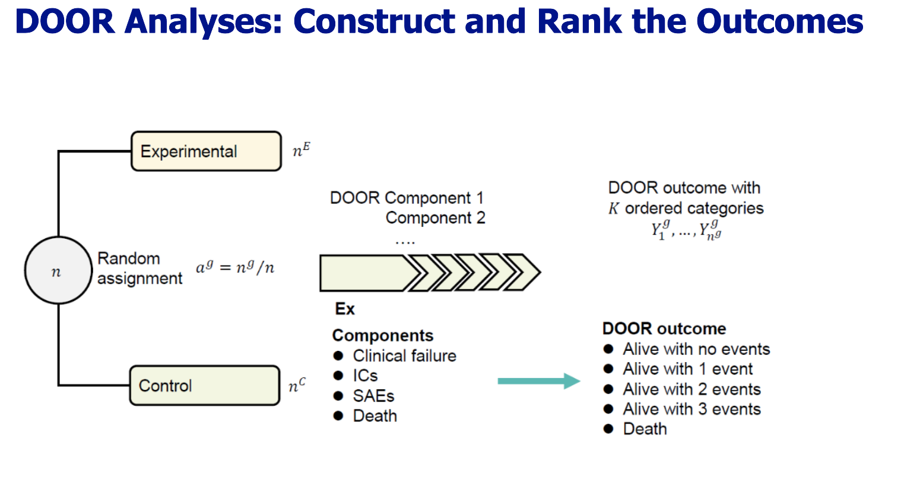
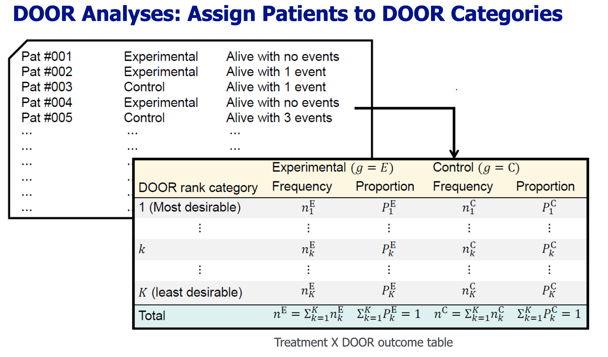
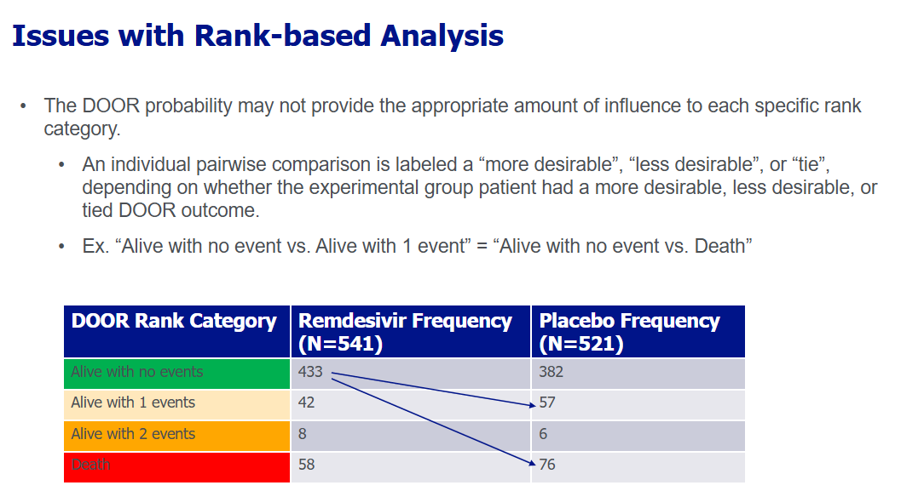
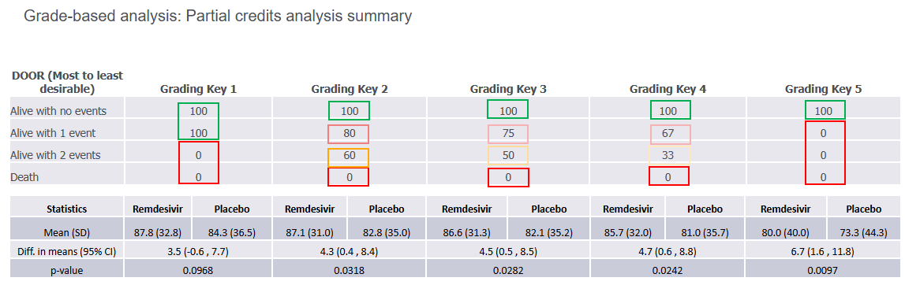
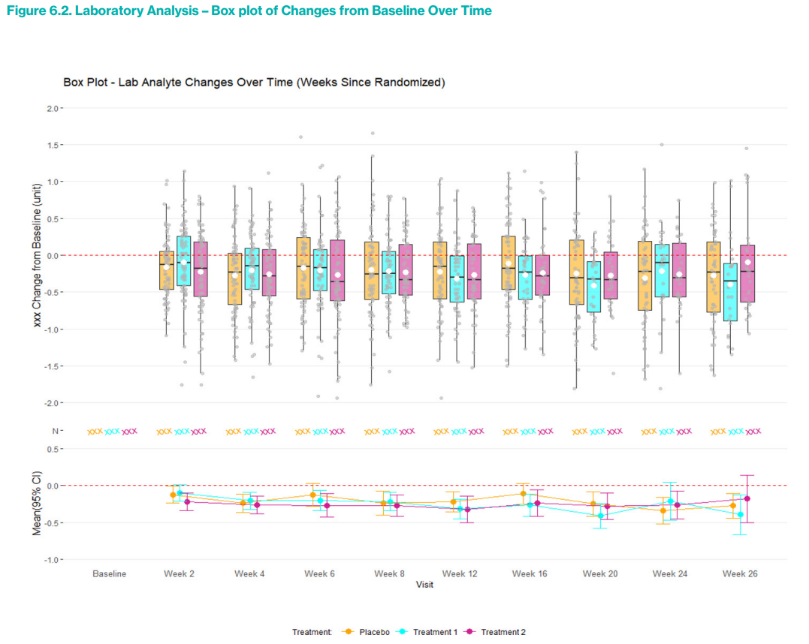
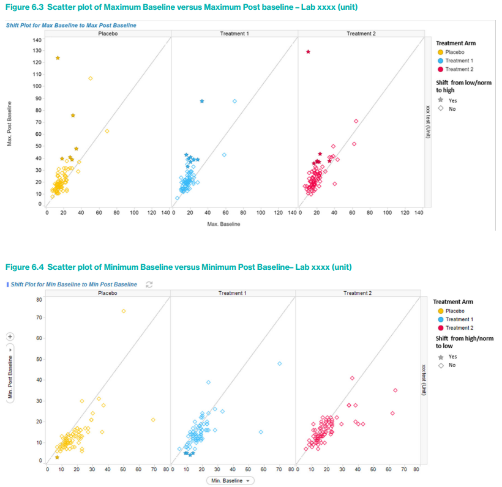
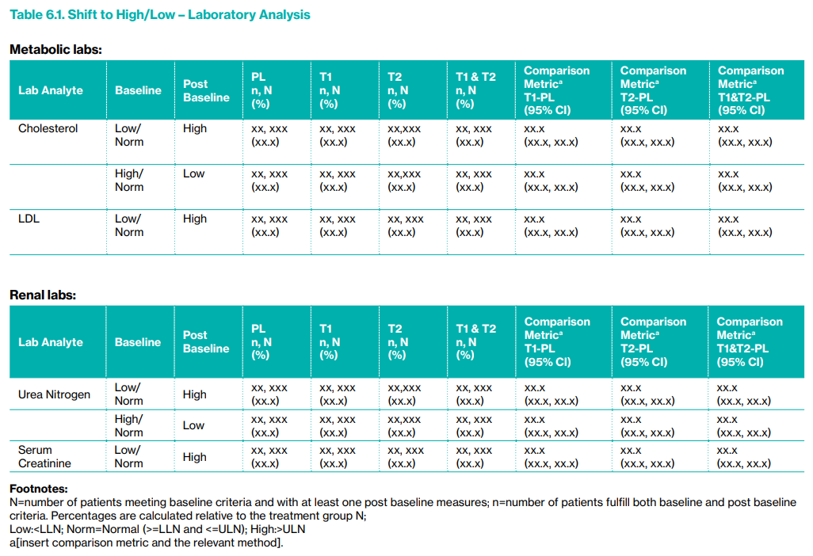
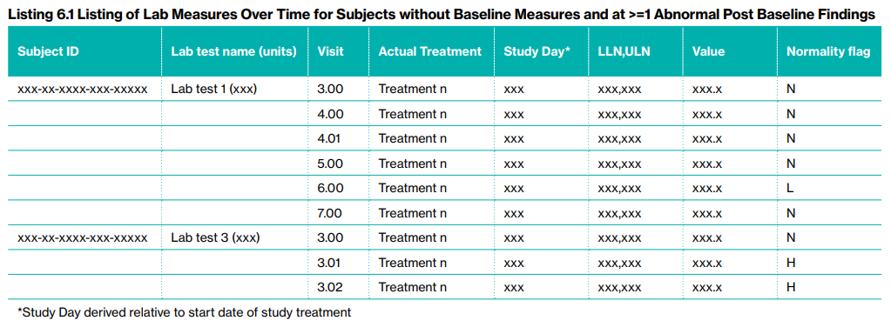
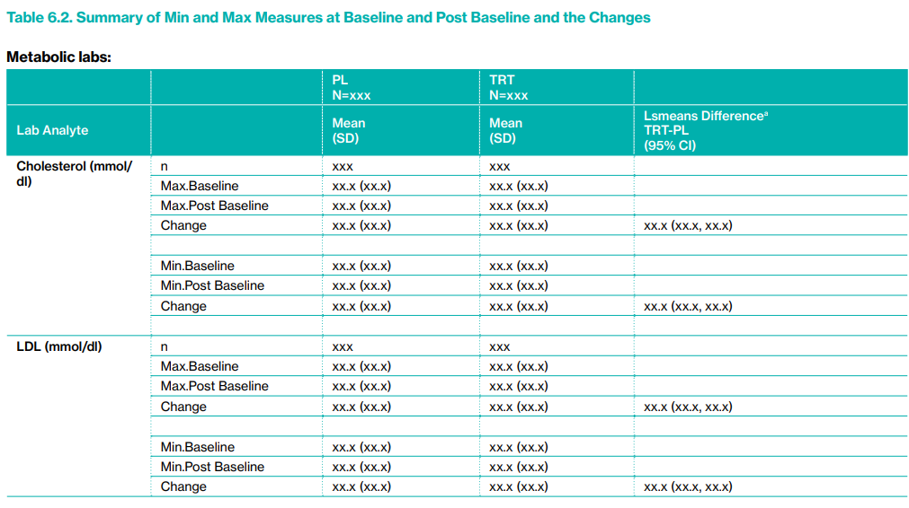
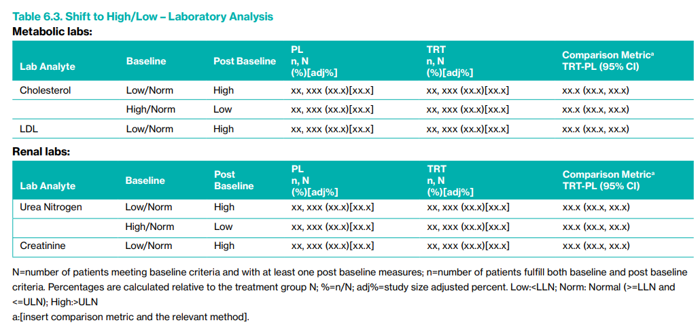

 
```{r setup, include=FALSE, echo = FALSE,message = FALSE, error = FALSE, warning = FALSE}
knitr::opts_chunk$set(echo = TRUE, fig.width = 10, fig.height = 6)

# <!-- ---------------------------------------------------------------------- -->
# <!--                    1. load the required packages                       -->
# <!-- ---------------------------------------------------------------------- --> 

## if(!require(psych)){install.packages("psych")}
packages<-c("tidyverse","tern","rtables","DT","patchwork","ggpubr",
            "kableExtra")

ipak <- function(pkg){
  new.pkg <- pkg[!(pkg %in% installed.packages()[, "Package"])]
  if (length(new.pkg)) 
    install.packages(new.pkg, dependencies = TRUE)
  sapply(pkg, require, character.only = TRUE)
}
ipak(packages)

## get the wd path
setwd(dirname(rstudioapi::getSourceEditorContext()$path))
getwd()
```


# Safety Signal Detection 

## Introduction  

Safety Signal Detection (SSD) is a critical component of pharmacovigilance and drug safety monitoring. Its primary aim is to detect, assess, and manage potential safety risks associated with pharmaceutical products, ensuring patient safety and supporting public health. 

**What is Safety Signal Detection?**

SSD involves the routine evaluation of safety signals through periodic reviews of aggregated data from various sources, including clinical trials, post-marketing surveillance, and real-world data. A safety signal refers to evidence of a potentially new adverse event or a new aspect of a known adverse event that is caused by a medicinal product and that warrants further investigation.


**SSD Process**

1. **Strategy and Scope Setting:**
   - At the early phases of drug development, the clinical team, along with the benefit-risk lead (subject to confirmation), discusses and determines the SSD strategy. This includes deciding the frequency of reviews and the scope of included studies.
   - The strategy is tailored to ensure that all potential safety issues are promptly identified and addressed. This involves periodic assessments that could be aligned with other regulatory requirements like Periodic Safety Update Reports (PSURs) or Development Safety Update Reports (DSURs).

2. **Data Collection and Aggregation:**
   - Relevant data from clinical trials and other sources are collected and aggregated. 

3. **Analysis and Review:**
   - The data undergoes statistical analysis to identify trends or patterns that could indicate potential safety issues. 

4. **Signal Evaluation:**
   - Identified signals are then evaluated to confirm their validity and potential impact on patient safety. This evaluation includes a detailed investigation into whether the signal represents a true risk or is due to other factors like underlying diseases or concurrent medications.

5. **Risk Management and Mitigation:**
   - If a safety signal is confirmed, risk management strategies are developed and implemented. These may include changes to the product labeling, restrictions on use, or in some cases, drug withdrawal.

6. **Documentation and Reporting:**
   - All findings and actions are thoroughly documented and reported to regulatory authorities as required.

## Biostatistics and Data Science (BDS) Role

  - BDS is primarily responsible for authoring the Program Statistical Analysis Plan (PSAP).
  - BDS provides clinical study data summaries, typically in the form of Tables, Figures, and Listings (TFLs), which are essential for supporting the detection of safety signals.
  - Additionally, BDS ensures that the clinical teams have access to advanced visualization tools for data exploration. These tools help in the intuitive understanding of complex datasets and trends, facilitating a more robust safety signal detection process.

   

 

# Planning for IND Safety Reporting

## Safety Reports (SER & SSAR)

Safety Evaluation Report: A flexible approach for reviewing safety topics which are not triggered from the signal detection process. An SER can be upgraded to an SSAR if the safety topic becomes a valid signal during the process.  This report is led by the Safety Writer

Safety Signal Assessment Report: Further evaluated signal considering all available evidence, to determine whether there are ne wrisk causually assoiciated with active substance or medicinal product, or if known risk have changed. his report is led by the Safety Writer


## Expected and Anticipated Serious Adverse Events (SAEs)

* Expected SAEs refer to serious adverse events that can reasonably be predicted based on the known pharmacological properties, previous clinical trial outcomes, or typical characteristics of the drug class. These events are usually documented in the drug's label or other professional literature. Therefore, when these events occur in new clinical trials, they are considered "expected" because their potential has already been identified and acknowledged based on existing data. Expected SAEs are important for risk management and informed consent processes, as they help set realistic expectations for both clinicians and participants regarding the known risks associated with a drug.
 
* Anticipated SAEs, while similar to expected SAEs, generally refer to events whose occurrence is foreseen based on less definitive evidence than that for expected SAEs. These could be based on preliminary data, such as early clinical trials, animal studies, or even theoretical considerations linked to the drug's mechanism of action. Anticipated SAEs are not as firmly established as expected SAEs but are considered likely enough that they should be monitored for in the context of ongoing clinical research. They may or may not be included in the product label but are anticipated from a safety surveillance perspective.

**Key Differences**

- **Basis of Prediction**: Expected SAEs are based on more solid, often clinically verified evidence, while anticipated SAEs may rely on preliminary or less conclusive evidence.
- **Documentation**: Expected SAEs are typically documented in official product materials like labeling, whereas anticipated SAEs might not be, depending on their level of evidence and regulatory requirements.
- **Regulatory Impact**: Expected SAEs have a direct impact on the drug’s labeling and are crucial for regulatory compliance and patient safety communications. Anticipated SAEs, while also important, might influence ongoing monitoring strategies and potential label updates as more data become available.
 

## Aggregate Analysis Planning

Planning for FDA IND (Investigational New Drug) safety reporting is a critical component of clinical trial management, ensuring that serious adverse events (SAEs) are properly identified, analyzed, and reported. This process is especially vital during the transition from Phase 1 to Phase 2 of clinical trials, where a clear understanding of the safety profile of the investigational medicinal product (IMP) is essential for further development. 

**Aggregate Analysis Planning:**
Early in the product development lifecycle, planning for the aggregate analysis of aSAEs and expected SARs should commence. This is crucial as it sets the foundation for ongoing safety monitoring and regulatory compliance. The planning should start as the studies transition from Phase 1 to Phase 2, which is typically when the target population for these studies has been clearly identified and the safety data from initial human exposure is available.

**Possible Approaches for Aggregate Analysis:**

1. **Analysis of All Serious Adverse Events (SAEs) by Treatment Group:**
   - This approach involves periodic reviews of all SAEs sorted by treatment groups within the clinical trial. The primary focus is to identify whether aSAEs or expected SARs are occurring at a significantly higher incidence in the group receiving the IMP compared to a concurrent control (either placebo or an active comparator) or a historical control group. This method helps in understanding the direct impact of the drug under study relative to other treatments or known data.

2. **Unblinding Trigger Approach:**
   - In this method, a blinded quantitative analysis is conducted. The Unblinding Trigger Approach focuses on the analysis of anticipated serious adverse events (aSAEs) and expected serious adverse reactions (SARs). This approach uses a pre-specified threshold to determine whether the overall blinded incidence rate of these events is higher than either the estimated background incidence rate in the target population or the incidence of expected SARs as listed in the Reference Safety Information (RSI). 
   - If these thresholds are exceeded, the SSDT may conduct a further blinded review and, if necessary, escalate the safety issue to the Benefit Risk Team (BRT) for consideration. If the BRT deems it necessary, an unblinded review may be initiated.

**Selection and Initiation of Aggregate Analysis:**

The Safety Surveillance and Data Team (SSDT) is responsible for selecting the appropriate methodology for aggregate analysis. The choice between analyzing all events by treatment group or applying the unblinding trigger approach depends on several factors including the study population, the characteristics of the product, and the size and duration of the clinical studies involved. Aggregate analysis is typically initiated during Phase 2 of clinical studies, assuming there are enough participants and observed SAEs to conduct a meaningful analysis.

**Documentation in Safety Surveillance Plan (SSP):**
The specific methodologies chosen for the aggregate analysis are detailed in the product-specific FDA IND Safety Surveillance Plan (SSP), which is a dedicated section of the Safety Signal Detection Strategy. The SSP is crafted and reviewed by the SSDT and should include:

- The chosen methodology (Analysis of All Events by Treatment Group and/or Unblinding Trigger Approach).
- Criteria for further assessment if using the Unblinding Trigger Approach, including thresholds that might trigger an IND safety report.
- A list of aSAEs with MedDRA search criteria used for identifying these events in the clinical database.
- Estimations of background incidence rates for aSAEs, if possible.
- Protocols for when unblinding is necessary to evaluate potential causal relationships with the IMP.


**Defining anticipated serious adverse events (aSAEs)**

- The process begins when the Development Physician initiates the definition of aSAEs as soon as the target patient population(s) have been identified and the first study concepts in these populations have been approved. This early initiation ensures that the safety monitoring is tailored to the specific needs of the population from the outset.
- The Development Physician is responsible for defining the characteristics of the target population and checking for any existing lists of aSAEs relevant to this group.
- They lead efforts to update or create new lists of aSAEs, involving contributions from other functions such as Medical Affairs to identify relevant clinical studies for evaluating aSAEs and background incidence rates.
- The RWE Representative uses Real World Data, starting with a focused literature review, and if necessary, conducting studies using fit-for-use Real World Databases to identify potential aSAEs.
- If the initial literature review does not yield sufficient data, further studies are conducted to estimate background incidence rates for each aSAE. This step is critical for understanding the typical occurrence rates of these events outside of clinical trials.
- Since Real World Evidence might use non-MedDRA terms, the list of aSAEs identified needs to be reviewed by the Medical Coding Oversight Lead to define these events in standardized MedDRA terms.
- The Development Physician consolidates a preliminary list of aSAEs using MedDRA search terms based on the RWE and statistical analyses.
- The Statistical Representative then estimates the background incidence rates for each aSAE using historical clinical data. 
 

## XSUR - Standard Required Safety Reporting Documents

**DSUR/PSUR/IB/J-NUPR/RMP**

 
These documents are **regulatory safety reporting requirements** that help ensure the ongoing evaluation of the safety profile of investigational and marketed drugs. 

### 1. DSUR (Development Safety Update Report) {-}

- **Purpose**:  
  The DSUR is a **yearly regulatory document** that provides a comprehensive safety overview of an investigational product during its development phase (pre-marketing).

- **General Content**:
  - Summary of cumulative safety data across all clinical trials
  - Adverse event (AE) overview
  - Exposure data
  - Ongoing and completed study updates
  - Benefit-risk considerations

- **Timing**:  
  Annually, typically synchronized with the **Investigational Brochure (IB)** update.

- **BST Contribution**:
  - TFLs summarizing:
    - **Cumulative subject exposure**, often broken down by population (e.g., healthy vs. patient, age groups)
    - **Study-specific exposure summaries**
    - **Participant withdrawals due to adverse events**
    - **SAE/AE listings** if required

---


### 2. PSUR (Periodic Safety Update Report) {-}

- **Purpose**:  
  The PSUR is used to monitor the safety of **marketed (authorized) products** over time, usually post-approval.

- **General Content**:
  - Cumulative safety information since the product was authorized
  - Global safety data
  - Benefit-risk evaluation
  - Regulatory actions taken
  - Literature and spontaneous report summaries

- **Timing**:  
  Varies depending on the product’s time on the market and specific regulatory agreements (e.g., every 6 months, 1 year, or 3 years).

- **BST Contribution**:
  - TFLs supporting:
    - **Cumulative subject exposure**, including dose and duration
    - **Trend summaries** (e.g., AE over time)
    - **Stratified summaries by indication or region**, if required

---

### 3. IB (Investigator’s Brochure) {-}

- **Purpose**:  
  The IB is a reference document for investigators conducting clinical trials and contains comprehensive data on the **investigational product**, including safety and efficacy findings.

- **General Content**:
  - Clinical and non-clinical safety data
  - Pharmacokinetics and pharmacodynamics
  - Investigator guidance
  - Benefit-risk summary

- **Timing**:  
  Updated **annually**, often in parallel with DSUR preparation.

- **BST Contribution**:
  - TFLs used in the **Adverse Drug Reaction** (ADR) section:
    - **Listings or summary tables** of AEs considered related
    - **Cumulative AE rates**
    - **Narrative support** via structured data

---

### 4. J-NUPR (Japanese Non-serious Unlisted Periodic Report) {-}

- **Purpose**:  
  A **Japan-specific post-marketing requirement** for periodic reporting of **non-serious and unlisted adverse events** observed during post-marketing surveillance.

- **General Content**:
  - Line listings of applicable non-serious, unlisted AEs
  - Summary counts stratified by term, SOC, region, etc.

- **Timing**:  
  Regular intervals defined by the Japanese Ministry of Health, Labour and Welfare (MHLW)

- **BTS Contribution**:
  - Delivery of:
    - **Cumulative frequency tables**
    - **Listings of unlisted events**
    - **Patient-level datasets**, filtered by local criteria

---

### 5. RMP (Risk Management Plan) {-}

- **Purpose**:  
  The RMP outlines how the **risks of a medicinal product** will be **identified, characterized, prevented, or minimized** once the product is on the market.

- **General Content**:
  - Product safety specification
  - Pharmacovigilance plans
  - Risk minimization measures (e.g., targeted education, monitoring)

- **Timing**:  
  - At the time of **marketing authorization application (MAA)**
  - **Updated as needed** post-authorization (e.g., after new safety signals)

- **BST Contribution**:
  - Statistical review and validation of:
    - **Exposure estimates**
    - **Incidence rates of identified and potential risks**
    - **Monitoring metrics (e.g., patient compliance, reporting rates)**

- **Reference**:  
  EMA guidance:  
  - *GVP Module V – Risk Management Systems (Rev 2)*  
  - *RMP Q&A on EMA website*
  
  
# BSSD
 
## Ongoing Clinical Trials, Utilizing a Bayesian Framework

Safety signals refer to **potential indications of an adverse effect** caused by a drug or treatment. Detecting these early during a clinical trial can:

* Prevent harm to participants
* Inform decisions about trial continuation
* Support regulatory compliance

The purpose of this safety signal detection approach is to improve how potential risks and adverse effects are identified during ongoing clinical trials, especially when those trials are still blinded. Detecting safety signals early is crucial to protect participants and to make informed decisions about whether a drug or treatment should continue to be studied. Traditional methods often fall short in this area because they may not be flexible enough to handle evolving data or may not work well when treatment assignments are still unknown. That’s why a new, more adaptive system is needed. Using a Bayesian framework, which allows for continuous learning from new data and offers a more intuitive way to assess risk as information accumulates. This approach is particularly useful in the clinical development phase, where decisions must be made based on incomplete or uncertain data. By re-engineering the safety signal detection process to include these modern statistical techniques, the goal is to create a more reliable and responsive system that can better safeguard patient health and support smarter, faster decision-making in drug development.

**Bayesian methods** as a core solution:

* Bayesian statistics allow for **updating beliefs with new evidence**, which is ideal for ongoing trials where new safety data constantly emerge.
* This framework supports:

  * **Assessment of blinded data**
  * **Evaluation of adverse events**
  * **Estimation of probabilities of safety risks**

Bayesian reasoning is often more **flexible and intuitive** for interpreting risk over time compared to traditional frequentist approaches.

---

**Why a change in safety signal detection (SSD) is needed by highlighting key drivers across five major areas: regulatory requirements, scientific definitions, industry trends, patient safety, and corporate responsibility.**

From a **regulatory perspective**, recent FDA guidance (e.g., CFR 312.32 and other 2012–2015 documents) increasingly emphasizes the need for sponsors to systematically assess safety data across ongoing studies. Regulations call for aggregate analyses to identify adverse event patterns and recommend setting up dedicated Safety Assessment Committees and Surveillance Plans. Moreover, guidance encourages quantitative approaches to determine the likelihood of causal associations between treatments and adverse events.

In terms of **signal detection science**, definitions from CIOMS (Council for International Organizations of Medical Sciences) and Good Pharmacovigilance Practices describe a signal as a hypothesis of a causal link between a treatment and observed events. Detection is about identifying statistically unusual patterns—those exceeding a specified threshold—that justify further verification. This highlights the need for methods that can handle complex data and allow continuous evaluation, especially in blinded settings.

  * CIOMS (Council for International Organizations of Medical Sciences) Working Group VI recommends a **holistic, program-level review** of safety data across studies.
  * This approach is intended to:
    * **Identify safety signals earlier**, ideally before they become serious or widespread.
    * **Protect patients** by responding quickly to potential safety issues.
    * **Support medical judgment** with a **quantitative framework**—i.e., not just subjective interpretations, but data-supported decisions.
  
  * **US FDA integrated these ideas into official regulations**
  * *21 CFR Parts 312.32 and 320.31* (effective 2010): These specify the rules for *IND (Investigational New Drug)* safety reporting.
  * **Guidance Documents**
    * *2012 Guidance*: Clarifies how sponsors should implement safety reporting in clinical studies.
    * *2015 Draft Guidance*: Suggests how sponsors can *assess safety data* more rigorously—especially for identifying *causal relationships* between the drug and adverse events.
  * **US FDA Final Rule – Key Expectations**, The **Final Rule** establishes that sponsors must take a **systematic approach to pharmacovigilance**.
  * It emphasizes that **IND safety reports** should only be submitted when there’s **reasonable evidence of a causal relationship** between the drug and the adverse event.
  * Breaking the Blind: The FDA allows breaking the blind for serious adverse events not related to clinical endpoints.
  * According to the Final Rule, two options exist:

    1. **Routine Aggregate Unblinded Review by a Safety Assessment Committee (SAC)**
       * Conducted independently.
       * **Preferred** method: Balances patient safety with trial integrity.
       * Allows identification of signals **without bias**.
    
    2. **Conditional Unblinding**
       * Sponsors remain blinded **unless** overall adverse event rates exceed a **predefined expected threshold**.
       * Only then do they unblind data to assess if the drug might be responsible.
      
  
The **industry trend** is also pushing for more rigorous SSD, as literature (e.g., Yao et al., 2013) points to the limitations of traditional monitoring. Bayesian approaches are being promoted for their ability to offer objective, real-time analysis during trials. Early detection improves patient protection and can reduce long-term development costs. Industry best practices also advocate for early and proactive planning of safety analyses through frameworks like Program Safety Analysis Plans (PSAPs).

**Patient safety** remains the central ethical and practical driver of SSD improvement. Leading pharmaceutical companies (e.g., Teva, Pfizer, Eli Lilly) publicly commit to placing patient safety at the heart of their operations, underscoring the societal and reputational importance of effective monitoring.

Lastly, **corporate principles** stress that accurate safety profiles affect not just regulatory compliance and patient safety, but also the financial valuation of a compound. Failure to detect and report risks promptly can result in serious harm, legal consequences, and a loss of public trust and investment.


---

**How change should occur in the safety signal detection**

Firstly, the use of **advanced data visualization tools** is encouraged to enhance the interpretability and interactivity of safety data. These tools, including forest plots, threshold plots, time-to-event plots, and hazard plots, offer interactive and drill-down features that allow for a more dynamic exploration of potential safety issues. Such visualization supports faster identification of concerning patterns and facilitates more informed decision-making.

Secondly, there is a push for greater **scientific and statistical rigor**, particularly in the analysis of both blinded and unblinded safety data. This includes applying robust statistical methodologies to datasets covering adverse events (AEs), laboratory results, vital signs, and electrocardiograms (ECGs). The goal is to bring consistency, objectivity, and depth to the SSD process.

Another key element is the **development of global safety databases** organized by compound. These databases would centralize safety data from multiple studies, making it easier to detect patterns, perform aggregate analyses, and assess compound-specific risks across different trials and populations.

Lastly, organizations are advised to **develop Program Safety Analysis Plans (PSAPs)**. These formalized plans lay out a comprehensive strategy for conducting safety analyses throughout a drug’s development lifecycle. They ensure that safety monitoring is systematic, pre-planned, and harmonized across studies.


---

**What specifically needs to change in managing safety signal detection** 

First, companies should **develop pooled, aggregate safety databases** much earlier in the clinical development lifecycle—rather than waiting until submission. These databases should have standardized structures and reporting templates to support not only SSD but also broader safety reporting needs. By centralizing safety data early, companies can enable faster and more effective signal detection and trend analysis across studies.

Second, in the area of **safety signal detection**, companies need to adopt or enhance **statistical methods** capable of handling **blinded clinical trial data**, ensuring valid analysis even when treatment assignments are unknown. This should be coupled with the **use of data visualization tools**—both static and interactive—to better identify patterns and communicate findings. Additionally, optimizing the outputs produced during SSD (e.g., reports, dashboards, alerts) ensures that results are both informative and actionable.

Lastly, **IND safety reporting** practices must be realigned to match FDA guidance and expectations. This includes improving how serious adverse events (SAEs) are assessed and reported—focusing on those with a demonstrated causal relationship to the drug, as judged by a combination of sponsor, medical, and statistical input. Consistency in the use of terms like "anticipated," "predicted," or "expected adverse event" in Investigator Brochures (IBs) is also important to avoid ambiguity.


## Objectives of BSSD Analyses

Objective of SSD in blinded studies is to use predefined statistical thresholds, reference rates, and modeling (like Bayesian or frequentist methods) to detect early signs of safety concerns without breaking the blind. The approach must balance avoiding unnecessary alarms with catching true adverse trends early enough for meaningful intervention.

**Core challenge** in blinded SSD: distinguishing between **“noise” (random variation)** and **true “signal” (evidence of risk)** while the treatment assignment remains unknown.

* A **criterion** (threshold) is set to decide whether an “alarm” should be triggered, suggesting a potential safety issue.
* If the true signal falls below this threshold, it may result in a **missed alarm**—failing to detect a true risk.
* Conversely, if random noise exceeds the threshold, a **false alarm** may be triggered—suggesting a safety issue when none exists.

The objective is to define and refine this threshold in a way that balances sensitivity (catching real issues) and specificity (avoiding false alarms), especially under the constraints of blinded data.

E.g. **practical statistical example** to frame the objectives of SSD in blinded trials:

* Historically, from a dataset of 500 subjects with 24 weeks of follow-up, the **adverse event (AE) incidence** in the placebo group for a particular event is known to be **2%**.
* In a **new blinded study**, 80 subjects (with a 3:1 treatment-to-placebo randomization ratio) have completed the same follow-up period, and **Y events** have been observed.
* The central question is: **What number of events (Y)** would suggest that the observed rate is too high to be due to chance, assuming no true difference exists between the groups?
* This analysis seeks to determine whether the current study data (while still blinded) deviates enough from expected patterns to indicate a **potential safety signal**.
 

### Simple Frequentist Approach (Binomial Model)

1. **Start with a baseline** estimate of adverse event rate (θ) from robust historical placebo data.
2. Adjust for **time-at-risk** and censoring using person-time and hazard models.
3. Use the adjusted θ to compute expected counts in the ongoing study.
4. Compare observed counts (Y) to this expectation via binomial or Poisson models.
5. **Trigger a signal** if observed Y exceeds what is reasonably expected under the null hypothesis.

Throughout, it emphasizes the **need for careful adjustment** for follow-up time and differences between populations to avoid **false alarms or missed signals**.

* **Assumptions:**

  * The event of interest is rare (e.g., AE incidence of 2%).
  * In a new blinded study, 80 subjects have completed follow-up.
* The **expected number of AEs** under the null hypothesis (no increased risk) is:

  $$
  \mathbb{E}[Y] = n \cdot \theta = 80 \cdot 0.02 = 1.6
  $$
* A binomial distribution $Y \sim \text{Binomial}(n=80, \theta=0.02)$ is used to calculate probabilities of observing different values of Y.
* If 5 or more AEs are observed, the cumulative probability $P(Y < 5)$ is 0.9776 → suggesting a **low likelihood under the null** (possible signal).

However: underline the **need for careful estimation of θ**, the true underlying event rate in the placebo group.

* **Where did θ (2%) come from?** Was it from robust, representative historical data?
* **Are historical and current populations comparable?** Differences in demographics, care settings, and follow-up time can bias results.
* **Time-at-risk mismatch**: If subjects in the historical and current study differ in follow-up duration or censoring, comparing incidence rates directly could be misleading.

Therefore, the estimation of θ is approached **indirectly via hazard rate λ**, using historical data:

* For each historical study:

  $$
  \text{IR}_j = \frac{r}{\sum_{i=1}^{r} t_i + (n - r)T}
  $$

  where:

  * $r$: number of events
  * $t_i$: time to event
  * $T$: censoring time for those without events
* This yields an **incidence rate per unit time (hazard rate)**, assuming an exponential model.
* IR is treated as the **Maximum Likelihood Estimate (MLE)** of λ.

Next, the **pooled hazard rate (λ\_w)** across multiple historical studies is computed using a **weighted average**:

$$
\lambda_w = \frac{\sum_{j=1}^k w_j \lambda_j}{\sum_{j=1}^k w_j}
$$

* $w_j$: total person-time in study j
* $λ_j$: incidence rate for study j

Then, derive the **distribution of time-at-risk** for each patient in the blinded trial. This accounts for:

* Patients who completed the study
* Those who withdrew prematurely
* Those censored at database cut-off

This step ensures **alignment between exposure times** in the new and historical data.

Finally, the **expected number of AEs** in the ongoing blinded study is calculated:

$$
\mathbb{E}[Y] = \sum_{i=1}^{n} \left(1 - e^{-\lambda_w t_i}\right)
$$

$$
θ = \frac{\mathbb{E}[Y]}{n}
$$

* This gives a **time-adjusted estimate of the incidence proportion** $θ$, accounting for censoring and variable follow-up times.
* However, the distribution of this $θ$ is not straightforward and **requires further consideration**, especially for constructing confidence intervals or hypothesis testing.


### Hybrid Frequentist/Bayesian approach

This approach enhances traditional frequentist models by incorporating uncertainty through **probability distributions**, 

* The **Beta distribution** allows uncertainty in θ to be modeled directly from historical data.
* The **Beta-binomial distribution** extends the frequentist framework, producing a richer model for event counts by integrating uncertainty.
* This approach gives a **probabilistically coherent** and **statistically robust** method for detecting safety signals in blinded trials, improving decision-making under uncertainty.

In real-world scenarios, **θ (the AE probability)** is often not known with certainty—it varies across populations, time points, or study settings. This variation can be **modeled using a Beta distribution**, which provides a flexible way to represent a distribution of probabilities for θ.

* The **Beta distribution**, parameterized by α (event counts) and β (non-event counts), is suitable for modeling probabilities between 0 and 1.
* The **mean (expected value)** is:

  $$
  \mu = \frac{\alpha}{\alpha + \beta}
  $$
* The **variance** is:

  $$
  \text{Var}(\theta) = \mu(1 - \mu)\phi \quad \text{where} \quad \phi = \frac{1}{\alpha + \beta}
  $$
* Example: Historical data from 500 patients show 10 with AEs and 490 without → $\text{Beta}(10, 490)$

  * Mean = 0.02
  * Standard deviation ≈ 0.006

While the most likely value of θ is 0.02, there’s **inherent variability**, captured by the **spread of the distribution**.


If θ follows a **Beta(α, β)** distribution and Y \~ Binomial(n, θ), then the **marginal distribution of Y** (i.e., accounting for uncertainty in θ) is the **Beta-Binomial distribution**.

* Probability mass function:

  $$
  f(y; \alpha, \beta) = \binom{n}{y} \cdot \frac{B(\alpha + y, \beta + n - y)}{B(\alpha, \beta)}
  $$
* Expected value and variance:

  $$
  \mathbb{E}[Y] = n\mu = \frac{n\alpha}{\alpha + \beta}
  $$

  $$
  \text{Var}(Y) = n\mu(1 - \mu)\left[\frac{1 + (n - 1)\phi}{1 + \phi}\right]
  $$

This variance is **higher than in the standard binomial model**, reflecting the extra uncertainty from estimating θ rather than treating it as fixed. 

This hybrid method enhances the frequentist binomial model by accounting for **uncertainty in historical estimates**. Instead of assuming a fixed θ, it treats θ as a **random variable** based on real-world data.

* **More realistic modeling**: Reflects natural variation in AE rates between studies or populations.
* **Improved inference**: Wider distributions reduce overconfidence and better balance false/missed alarm risks.
* **Consistency**: When α and β are large (i.e., precise historical data), the Beta distribution approaches a point estimate, and the beta-binomial converges to the standard binomial.


### Bayesian methods

Bayesian approaches provide a **rational, structured way to update beliefs** as new data become available. In the context of SSD for blinded trials, where uncertainty is high and full treatment assignments are not yet revealed, Bayesian methods allow sponsors to:

* Incorporate **historical safety data** (e.g., placebo AE rates),
* Reflect **uncertainty in model parameters** (such as event probabilities),
* Continuously **update risk assessments** without breaking the blind.

This is especially useful for detecting early signals without making premature, binary conclusions from sparse data.

At its core, Bayesian analysis relies on **Bayes’ Theorem**:

$$
P(\theta | y) = \frac{P(y | \theta) P(\theta)}{P(y)}
$$

Where:

* $P(\theta)$ = prior belief about the AE rate (from historical data),
* $P(y | \theta)$ = likelihood (how likely observed data is under a given AE rate),
* $P(\theta | y)$ = posterior belief after observing data $y$.

This framework allows for **inductive learning**, making it well-suited for ongoing SSD as trial data accumulate.

As Example:

* **Prior Distribution $P(\theta)$:** Represents the belief about AE rates before observing new data. For example, if historical data show 10 AEs in 500 placebo patients, a **Beta(10, 490)** distribution is a natural prior.
* **Likelihood $P(y|\theta)$:** Based on the binomial model, this reflects the chance of seeing Y AEs out of n patients given a particular value of θ.
* **Posterior Distribution $P(\theta | y)$:** Updated belief about θ after seeing the blinded data, used to judge if a safety signal is emerging.


In blinded trials, the treatment group (placebo vs. active drug) is unknown, introducing **latent structure**. A **finite mixture model** addresses this by modeling:

* Multiple possible distributions (e.g., AE rates for placebo and active groups),
* With weights $\pi_j$ representing the **probability of each group assignment**.

This allows a comprehensive analysis without needing to unblind, maintaining trial integrity.


## Bayesian application to SSD

### Core Bayesian Framework {-}

At the heart of the Bayesian SSD approach is the idea of computing the **posterior probability** that a clinical parameter (e.g., AE rate θ) **exceeds a critical safety threshold (θc)**:

$$
\Pr(\theta > \theta_c \mid \text{blinded data}) > P_{\text{cutoff}}
$$

* **θ** = estimated AE rate or other safety metric (e.g., risk difference).
* **θc** = comparator value, typically based on historical placebo rates or clinical benchmarks.
* **P\_cutoff** = predefined probability threshold (e.g., 90%, 95%) used to flag potential safety signals.

This decision rule is model-agnostic and applies to any Bayesian setup, making it a **flexible universal framework** for SSD. 

To implement a **Bayesian SSD approach in practice**, follow these key principles:

1. **Define a clinical parameter** of interest (θ), such as AE rate.
2. **Specify a threshold value (θc)** representing a point of clinical concern.
3. **Choose an appropriate prior** based on historical data, model context, and desired neutrality.
4. **Calculate the posterior probability** that θ > θc given the blinded data.
5. **Compare it to a P\_cutoff** value, selected based on event rarity and desired balance of sensitivity vs. specificity.

This framework enables **dynamic, data-driven safety monitoring** under uncertainty—ideal for the complex, evolving nature of clinical trials.


---

 

**Prior Specifications**

* *p₀* (placebo) based on historical data
    - Sources: internal data from historical studies, external data via Pharma data sharing platforms (e.g., TransCelerate)
    - Types: double-blind randomized clinical trial data, open label randomized clinical trial data, single arm multi-center clinical trial data, retrospective cohort, electronic health records

* *p₁* (active) also or noninformative, e.g., *Beta(1/3, 1/3)*

 
The **choice of prior distribution** for θ has a major influence on the posterior, especially when event counts are small. A “non-informative” prior might seem neutral but can actually **bias** the result if not chosen carefully.

* **Beta(1/3, 1/3)** (Kerman’s prior) is **centered on the sample mean** and is often used as a neutral or default prior because of its balanced shape.
* For **mixture models** (where θ comes from both placebo and treatment arms), a generalized version is used:

  $$
  \theta \sim \text{Beta}(1/3 + mp, \ 1/3 + m(1-p))
  $$

  where `p` is the historical incidence and `m` is the prior’s effective sample size.
* For **overall pooled models**, priors can also be derived from historical data but should be **down-weighted** to reflect uncertainty (e.g., treating historical data as if it contributes one subject’s worth of information).

In all cases, priors should reflect **real-world clinical understanding** while guarding against overconfidence or undue influence.


---

**📈 Setting Thresholds: The Role of P\_cutoff**

The **P\_cutoff** is the posterior probability required to declare a potential safety signal. Choosing this value impacts the balance between **sensitivity** (detecting true signals) and **specificity** (avoiding false alarms).

* For **rare events (≤5%)**, lower cutoffs like **0.90 to 0.925** are suitable, because the goal is to be sensitive to early potential risks.
* For **more frequent events (≥10%)**, stricter cutoffs like **0.975** are used, to reduce the chance of overreacting to normal variation.

This mirrors traditional hypothesis testing logic—more common outcomes require more convincing evidence to flag as abnormal.

### General Considerations {-}


**Patient Population**

The objective is to clearly define and select the appropriate patient population for the study, based on:

* The specific medical indication being studied (e.g., a certain cancer type, diabetes, etc.)
* Any other relevant classifications or criteria (e.g., disease severity, prior treatments).
  Ensuring that the enrolled population reflects the target population for which the treatment is intended helps maintain relevance and generalizability of the results.

---

**TEAEs of Special Focus**

TEAEs of special focus are pre-identified adverse events of particular interest in a trial, typically outlined in the Program Statistical Analysis Plan (PSAP).
These usually include:

* Anticipated TEAEs: Events common in the disease population, regardless of drug exposure (background events).
* Expected ADRs (Adverse Drug Reactions): Events known or suspected to be caused by the investigational drug.

Key Considerations:

* Observing a single or small number of anticipated events does not automatically signal causality.
* To assess causality, an unblinded aggregate analysis is used—comparing event rates between the treatment and control groups to identify meaningful differences.
* These analyses should only be initiated when statistical thresholds (described later) indicate a potential safety signal.

---

**Data Sources on Historical Controls**

When monitoring safety in blinded studies, researchers compare ongoing event rates to historical background rates to detect abnormal patterns.
The goal is to identify if observed rates of anticipated AEs are higher than expected, potentially indicating a safety signal.

Data Source Considerations:

* Use a meta-analytic approach (combining results from multiple studies) to estimate background rates, preferably from placebo/control arms.
* Preferred sources (ranked by data quality and bias control):

  1. Double-blind RCTs – best for avoiding bias.
  2. Open-label RCTs
  3. Single-arm multi-center trials
  4. Retrospective cohort studies
  5. Electronic Health Records (RWE)

* Only sources 1–3 are typically used directly in meta-analyses. Others (4–5) may offer supporting evidence but require caution due to potential biases.
* Relevance and comparability to the ongoing study population and design is critical when selecting historical data.

---

**Probability Thresholds for Flagging Safety Signals**

To avoid unblinding prematurely, a trigger-based approach is used:

* A posterior probability is calculated indicating the likelihood that the AE rate in the treatment group exceeds that of the control group by more than expected (background rate).
* This probability threshold is pre-specified and agreed upon by the project team.

Trigger System Example:

* Yellow Flag (warning): Posterior probability > 80%
* Red Flag (alert): Posterior probability > 82%
* This system allows ongoing blinded monitoring while maintaining trial integrity.

Considerations for Threshold Setting:

* Thresholds should not be overly conservative (e.g., >90%) to avoid missing real signals due to low power.
* Several factors influence these probabilities:

  * Event rarity (common vs. rare AEs)
  * Sample size of current and historical data
  * Degree of heterogeneity across studies

Regulatory Context:

* The FDA recommends:

  * Clearly documenting why specific events were selected for monitoring.
  * Justifying the choice of thresholds used to trigger evaluation/unblinding.
* Any decision to unblind is made by the Blinded Review Team (BRT), which includes both clinical and statistical experts.
* Whether an imbalance suggests a reasonable possibility of causality (and therefore needs IND reporting) is a Sponsor-level judgment.


## Binomial-Beta Model

In this document, we present 2 methods for monitoring safety data from blinded ongoing clinical trials with the aim of detecting potential safety signals. 
1)	Bayesian Markov Chain Monte Carlo (MCMC) method: Subject level data with blinded treatment are modeled using a mixture of binomial distribution with an indicator variable and the MCMC algorithm is used to estimate the parameters accounting for variable follow-up times across subjects.
2)	Simpler Monte Carlo (MC) approximation method: The method is based on study level data for planning purposes and result comparison with the primary method. Because the simpler approximation method is based on study-level data, the model assumes a fixed follow-up time for all subjects and an approximation has to be made to account for this.

### Chi-square Approach {-}

**General Idea**

* Denote the total number of subjects as *N<sub>j</sub>* and the number of subjects with at least one AE as *R<sub>j</sub>* for the *j*-th study;
* Perform a chi-square test of homogeneity to see whether the distribution of the AE rates are the same across different historical studies;
* If the null hypothesis is rejected, the study with the largest chi-square components should be excluded; continue until the null hypothesis is not rejected or there is one remaining study;
* Obtain the overall *N* and *R* values from remaining historical studies;
* Perform a Bayesian meta-analysis of historical studies using a vague beta prior with parameters close to zero; leads to a *Beta(R, N−R)* posterior, which becomes the prior used in the current blinded study.

**Details**

The Chi-square approach is a practical method to construct an informative prior from multiple historical studies by first assessing their consistency and then pooling their data. It is termed “Chi-square” because it typically relies on **Cochran’s Q (chi-square) test** to check **heterogeneity** (i.e. whether observed differences in event rates across studies are beyond chance variability). In essence, this approach asks: *Can we treat all historical studies as having a common underlying event rate?* If yes, the data are combined (pooled) to form a single prior distribution. If not (significant heterogeneity), adjustments are made – for example, using a *random-effects* meta-analysis to allow each study to have its own rate and account for between-study variance. This approach is appropriate when you have a few historical studies and want a straightforward summary of the historical event rate. It works best if the studies are fairly homogeneous (similar populations, endpoints, etc.), or if you plan to widen the prior’s uncertainty when they differ.

In practice, the Chi-square approach often mirrors a **classical meta-analysis** of proportions. It might be used in trial planning to set a prior on a control event rate by combining past control group rates. It is conceptually simpler than MAP: it does not fully model hierarchical variation, but rather uses hypothesis testing and summary statistics to decide how much information to borrow.

---

**Mathematical Formulation**

Suppose we have historical studies $i = 1,2,\dots,k$, each with $x\_i$ events out of $n\_i$ participants (event rate estimate $\hat p\_i = x\_i/n\_i$). The Chi-square approach involves the following key elements and equations:

* **Fixed-effect (pooled) model:** This assumes a common true event rate $p$ across all studies. The weighted pooled estimate can be obtained by a weighted average of $\hat p\_i$. A simple weighting is by sample size (for event rates, this is reasonable if rates are not extremely low/high). The *pooled event rate* would be:
  $\bar p = \frac{\sum_{i=1}^k w_i \hat p_i}{\sum_{i=1}^k w_i},$
  where $w\_i$ are weights for study $i$. For example, one may choose $w\_i = n\_i$ for simple pooling or $w\_i = 1/\text{Var}(\hat p\_i)$ if using inverse-variance. Under a fixed-effect assumption (no between-study heterogeneity), $\bar p$ estimates the common event rate.

* **Cochran’s Q (Chi-square test for heterogeneity):** To assess if the $k$ study results are consistent with a common rate, we compute
  $Q = \sum_{i=1}^k w_i (\hat p_i - \bar p)^2.$
  Under the null hypothesis of homogeneity (all studies share the same true $p$), $Q$ follows a chi-square distribution with $k-1$ degrees of freedom. A *large* $Q$ (or small $p$-value) indicates significant heterogeneity – meaning the event rates likely differ beyond chance. The **I² statistic** is often used alongside $Q$ to quantify heterogeneity:
  $I^2 = \frac{Q - (k-1)}{Q}\times100\%, $
  which is the percentage of total variance across studies due to true heterogeneity rather than chance. (For example, $I^2=0$ if all variation is consistent with chance, and higher values imply more between-study variability.)

* **Random-effects model (if needed):** If heterogeneity is detected, a random-effects meta-analysis is used to incorporate between-study variance. This assumes each study’s true event rate $\theta\_i$ varies around an overall mean $\mu$. A common assumption is $\theta\_i \sim \mathcal{N}(\mu,\tau^2)$ on some scale (often the log-odds scale for proportions, or directly on the proportion scale for small heterogeneity). The **DerSimonian-Laird (DL)** method provides an estimate for the between-study variance $\tau^2$ using the $Q$ statistic. In simplified form:
  $\hat\tau^2 = \frac{Q - (k-1)}{\sum_{i}w_i - \sum_i w_i^2/\sum_i w_i},$
  if $Q>(k-1)$ (and $\hat\tau^2=0$ if $Q\le k-1$). Updated weights become $w\_i^\* = 1/(\text{Var}(\hat p\_i)+\hat\tau^2)$, and the *random-effects pooled estimate* is
  $\hat p_{\text{RE}} = \frac{\sum_i w_i^* \hat p_i}{\sum_i w_i^*}.$
  The variance of $\hat p\_{\text{RE}}$ is $1/\sum\_i w\_i^\*$. This model essentially treats the true event rate in each study as a draw from a distribution with mean $\mu$ and variance $\tau^2$. It acknowledges heterogeneity by **inflating the uncertainty** of the combined estimate.

* **Deriving a prior distribution:** Once an overall event rate and variance are determined (from either fixed or random-effects), we translate that into a prior distribution for the new trial’s event rate. A convenient choice for an event rate (a probability) is a **Beta distribution** prior. The Beta distribution is defined on \[0,1] and is conjugate to the Binomial likelihood. We can think of the Beta prior parameters as “pseudo-counts” of events and non-events. For instance, a Beta($\alpha,\beta$) prior corresponds to $\alpha-1$ prior “successes” and $\beta-1$ “failures” observed historically.

  – **If using fixed-effect pooling (homogeneous case):** We might set $\alpha = x\_{\text{total}} + 1$ and $\beta = n\_{\text{total}} - x\_{\text{total}} + 1$ (assuming a flat base prior Beta(1,1)). Here $x\_{\text{total}}=\sum\_{i}x\_i$ and $n\_{\text{total}}=\sum\_{i}n\_i$. This yields a Beta prior with mean $\frac{\alpha}{\alpha+\beta} \approx \frac{x\_{\text{total}}}{n\_{\text{total}}} = \bar p$ and a variance that reflects the binomial variation from the aggregated data. Essentially, we treat all historical data as one big trial. For example, if across 3 studies there were 50 events out of 200 patients, the prior could be Beta(51,151), which has mean \~0.25 (25% event rate). We might also incorporate a *slight* increase in $\beta$ (or decrease in $\alpha$) to deliberately **widen the prior** if we suspect any unmodeled heterogeneity, ensuring we’re not overconfident.

  – **If using random-effects (heterogeneous case):** There isn’t a single obvious closed-form prior, because the true rates vary. One simple approach is to choose a **conservative (over-dispersed) Beta prior** that has the same mean as $\hat p\_{\text{RE}}$ but larger variance to account for between-study differences. For instance, one can **match moments**: set the Beta’s mean $m = \hat p\_{\text{RE}}$ and variance $v = \hat p\_{\text{RE}}(1-\hat p\_{\text{RE}})/N\_{\text{eff}}$, where $N\_{\text{eff}}$ is an “effective sample size” smaller than $n\_{\text{total}}$. $N\_{\text{eff}}$ can be chosen such that the Beta’s variance $v$ is roughly equal to the **total uncertainty** (within-study binomial error plus between-study variance $\tau^2$). Another approach is to use the **predictive interval** from the random-effects meta-analysis: for a new study of similar size, the event rate is expected (with 95% probability) to lie in, say, \[L, U]. One can then choose a Beta prior whose 95% credible interval is \[L, U], thus reflecting the heterogeneity. There is some art to this, but the principle is to *down-weight the historical information* when heterogeneity exists. Essentially, the prior will be broader (less informative) as heterogeneity increases, reflecting greater uncertainty about the event rate in a new setting.

In summary, the Chi-square approach uses classical meta-analytic formulas (like $Q$ and possibly DL random effects) to derive a Beta (or similar) prior for the event rate. Each term in these equations corresponds to either a measure of variability ($Q$, $\tau^2$) or a summary of data (pooled $\bar p$). The Beta prior’s parameters $(\alpha,\beta)$ are interpreted in plain language as prior evidence equivalent to $\alpha-1$ events and $\beta-1$ non-events.

---

**Step-by-Step Application**

1. **Collect and summarize historical data:** List each prior study’s sample size ($n\_i$) and number of events ($x\_i$). Compute the observed event rates $\hat p\_i = x\_i/n\_i$ for each study.

2. **Assess heterogeneity:** Calculate Cochran’s $Q$ statistic and its $p$-value (and/or $I^2$).

   * If $Q$ is not significant (or $I^2$ is very low), assume the studies are consistent with a common event rate.
   * If $Q$ is significant (large heterogeneity), acknowledge that event rates differ across studies.

3. **Choose pooling model:**

   * **Low heterogeneity (homogeneous)**: Use a *fixed-effect* pooling. Combine all events and all patients: $x\_{\text{total}}=\sum x\_i$, $n\_{\text{total}}=\sum n\_i$. The pooled estimate is $\bar p = x\_{\text{total}}/n\_{\text{total}}$. Compute the binomial variance $\mathrm{Var}(\bar p) = \bar p(1-\bar p)/n\_{\text{total}}$ (or get a confidence interval for $\bar p$).
   * **Notable heterogeneity**: Use a *random-effects* meta-analysis. Estimate $\tau^2$ (between-study variance) via a formula (e.g., DerSimonian-Laird). Compute a weighted average $\hat p\_{\text{RE}}$ with weights $w\_i^\* = 1/(\text{Var}(\hat p\_i)+\tau^2)$. Also calculate an approximate 95% **prediction interval** for a new study’s true rate: this is often $\hat p\_{\text{RE}} \pm t\_{(k-1)} \sqrt{\tau^2 + \mathrm{AvgVar}}$, where $\mathrm{AvgVar}$ is the typical within-study variance and $t\_{(k-1)}$ is a quantile from a $t$ distribution with $k!-!1$ degrees of freedom (to reflect uncertainty in $\hat p\_{\text{RE}}\`). This interval gives a range where we expect the new trial’s event rate to fall, considering between-study variability.

4. **Derive the prior distribution:** Translate the meta-analytic result into a prior for the event rate $p$ in the new trial.

   * If pooling fixed-effect: set a **Beta prior** $\pi(p) = \mathrm{Beta}(\alpha,\beta)$ with $\alpha = x\_{\text{total}} + c$ and $\beta = n\_{\text{total}} - x\_{\text{total}} + c$, where $c$ is a small constant reflecting any initial prior (for example $c=1$ if using Beta(1,1) as non-informative base). This Beta has mean $\approx \bar p$ and a 95% credible interval roughly $\bar p \pm 1.96\sqrt{\bar p(1-\bar p)/(n\_{\text{total}}+c)}$.
   * If random-effects: choose a **more diffuse prior** to account for heterogeneity. One way is to reduce the effective sample size: e.g. $\pi(p) = \mathrm{Beta}(\tilde\alpha,\tilde\beta)$ such that $\tilde\alpha/(\tilde\alpha+\tilde\beta) = \hat p\_{\text{RE}}$ but $\tilde\alpha + \tilde\beta < n\_{\text{total}}$ to widen the variance. You can solve $\tilde\alpha = m \cdot N\_{\text{eff}}$ and $\tilde\beta = (1-m)\cdot N\_{\text{eff}}$ with $m=\hat p\_{\text{RE}}$ and choose $N\_{\text{eff}}$ to achieve a desired variance (for instance, set $N\_{\text{eff}} = n\_{\text{total}}/(1+\text{extra variance inflation})$ or use the predictive interval width to guide it). Another approach is to adopt a **mixture prior**: for example, a mixture of Beta distributions each reflecting different historical studies or clusters, though this gets more complex. In most cases, a single Beta with inflated variance suffices for simplicity.

5. **Validate or adjust (if necessary):** It’s good practice to double-check that the chosen prior makes sense. Plot the Beta prior density to see if it reasonably covers the range of historical study estimates. If one historical study was an outlier, ensure the prior’s spread covers that or consider excluding that study if it’s not deemed relevant. Essentially, verify that the prior is neither too narrow (overconfident) nor shifted in a way that ignores important differences. If the prior seems too informative given heterogeneity, you can scale back $\alpha,\beta$ (reducing $N\_{\text{eff}}$). Conversely, if heterogeneity was low and we might be underutilizing information, one might confidently use $n\_{\text{total}}$.


---


**Strengths:**

* *Simplicity:* The Chi-square approach is relatively easy to execute and explain. It uses familiar meta-analysis techniques (proportions, chi-square test) that many clinical trialists know from frequentist analysis. For example, summarizing “in 5 previous studies the event rate ranged 20–25%, with no significant heterogeneity, so we use a Beta prior centered around 23%” is intuitively understandable.
* *Transparency:* Each step (testing heterogeneity, pooling or not) is explicit. Investigators retain control to include or exclude certain studies based on clinical judgment (e.g. exclude a study that appears clinically different if heterogeneity is high).
* *Speed:* It requires minimal specialized software – one can do it with basic stats tools or even by hand for simple cases. This makes it practical in early trial planning when quick estimates are needed.
* *Reasonable with homogeneous data:* If historical studies truly have a common rate, this approach will produce a tight prior reflecting all the data. If heterogeneity is truly absent or very low, the Chi-square approach and the more complex MAP approach will give similar results (since modeling heterogeneity isn’t needed in that case).

**Limitations:**

* *All-or-nothing heterogeneity handling:* The reliance on a heterogeneity test means the approach can be somewhat dichotomous – pooling fully versus ad-hoc adjustments. Cochran’s Q has low power with few studies, so one might miss heterogeneity and pool inappropriately (overly narrow prior), or if many studies, Q can be overly sensitive, leading one to declare heterogeneity and perhaps over-broaden or even discard data. There’s no continuous “partial pooling” built-in; any down-weighting of data due to heterogeneity is manual and subjective (e.g., deciding an effective sample size).
* *Less formal uncertainty modeling:* Unlike the MAP approach, the Chi-square method does not explicitly model the distribution of true event rates across studies. As a result, the uncertainty due to between-study variability might be handled in a ad-hoc manner. For instance, choosing how much to inflate the Beta prior variance when $I^2$ is 50% can be tricky and might under- or over-estimate the true uncertainty.
* *Potential bias if data differ:* If one historical study’s population is slightly different (say, older patients with higher event rate), a simple pooled prior might be biased for the new trial population. The Chi-square approach doesn’t inherently account for covariates or differences in study design that could explain heterogeneity. It treats heterogeneity as noise rather than something to model. This can lead to a prior that is centered at a value not truly applicable to the new trial.
* *No automatic conflict resolution:* In Bayesian analysis, a *prior-data conflict* refers to the prior strongly disagreeing with new data. The Chi-square approach doesn’t have a mechanism to identify or mitigate this conflict beyond the initial heterogeneity test. If the new trial’s early data look very different from the prior, one must recognize this and perhaps discount the prior in an ad-hoc interim adjustment. In contrast, some Bayesian methods (like robust MAP) include heavy-tailed priors that automatically reduce influence in such conflicts.
* *Not a fully Bayesian updating of evidence:* One could argue the Chi-square approach is a hybrid – you use frequentist meta-analysis, then plug that into a Bayesian prior. It doesn’t use the Bayesian formalism to combine historical data and new data in one model; instead it’s a two-step approach. While this is not inherently bad, it lacks the coherence of a single model and may be suboptimal in fully leveraging information.

In short, the Chi-square approach is **straightforward but can be rigid**. It works well for quick summaries when data are consistent, but its ad-hoc nature in handling heterogeneity is both a strength (simple rule) and a weakness (potentially inadequate modeling).

---

**When use the Chi-square approach when:**

* **Historical studies are few and similar:** If you only have 1–3 prior studies and they appear clinically and statistically consistent (e.g., similar patient populations, same treatment and endpoint, and no obvious discrepancies in event rates), the Chi-square approach is attractive. With minimal heterogeneity, a simple pooled Beta prior is almost as good as a more complex model, and it’s easier to justify to stakeholders.
* **A quick, rough prior is needed:** Early in trial planning, you might need a ballpark prior for calculations (like sample size or Bayesian power). The Chi-square method can rapidly provide an estimate. For instance, if two past trials had 30% and 35% event rates with similar sample sizes, you might immediately propose a Beta prior around 0.33 with a certain pseudo-count, without doing a full hierarchical model analysis.
* **Computational or expertise limitations:** Not all teams have Bayesian experts or the software set up to run hierarchical models. The Chi-square approach can be done with basic stats knowledge. Regulators or team members might also be more familiar with seeing a pooled estimate and a chi-square test for heterogeneity (common in meta-analysis) than with a Bayesian hierarchical model. If you need to communicate the prior derivation in a simpler way, Chi-square approach has that interpretability (though note: regulatory agencies are becoming conversant with MAP for historical borrowing too).

However, be cautious using the Chi-square method if there is **substantial heterogeneity or many historical studies**. In those cases, the MAP approach is usually preferred:

### Meta-Analytic Predictive (MAP) Approach {-}

**General Idea**

* Use patient-level or aggregate historical data from similar trials to model the event probability $p_j$ for each study $j$;
* Assume a complementary log-log model: $\log(-\log(1 - p_{ij})) = \alpha_j + \log T_{ij}$, where $T_{ij}$ is the time at risk for patient $i$ in study $j$; If patient-level data are unavailable, use the average or total follow-up time $T_j$ to model event probability at the study level;
* Assume constant hazard across time and treat $\log T$ as an offset in the model to estimate log-hazard parameters $\alpha_j$;
* Define a prior for $p_j$ using a Beta distribution: $p_j \sim \text{Beta}(abN, (1 - a)bN)$, where $N$ is the total sample size from historical studies, $a$ is the prior mean, and $b$ is the information discount factor;
* The resulting prior reflects both the expected event rate and the uncertainty from historical evidence, and is used in the current study's Bayesian analysis.

**Details**

The Meta-Analytic Predictive (MAP) approach is a Bayesian method that formally **models the historical data in a hierarchical framework**, capturing both the common trend and the between-study heterogeneity. Instead of pooling or making yes/no decisions about heterogeneity, MAP treats the true event rate in each historical study as a random draw from a population distribution. This yields a **posterior predictive distribution** for the event rate in a new trial – that predictive distribution *is* the MAP prior for the new trial’s event rate. In other words, MAP uses all historical evidence to “predict” what the new study’s event rate is likely to be, with uncertainty bands naturally widened if the historical results disagree with each other.

Situations appropriate for MAP include having **multiple historical studies, especially with some heterogeneity**. MAP shines in complexity: it can borrow strength from many studies while appropriately down-weighting those that don’t agree. It is a fully Bayesian approach – the historical data and the new data are linked through a hierarchical model. Conceptually, it’s like saying: “We have a distribution of possible event rates (learned from past trials). Let’s use that distribution as our prior for the new trial’s event rate.” The approach is grounded in Bayesian meta-analysis techniques and often implemented with MCMC simulations due to its complexity.

One big advantage is that the MAP prior inherently accounts for **uncertainty at multiple levels**: it recognizes both **within-study uncertainty** (each study’s finite sample) and **between-study uncertainty** (variation in true rates across studies). The resulting prior is “predictive” in the sense that it represents our uncertainty about the new trial’s parameter after seeing the old trials. This method is particularly useful when historical data are available but not identical to the new trial’s setting – MAP will downweight the influence of historical data if they are inconsistent (via a larger between-study variance).

---

**Mathematical Formulation**

At the heart of MAP is a **Bayesian hierarchical model**. Let’s define parameters and distributions for a binary outcome (event rate):

* **Data level (likelihood):** For each historical study $i$ ( $i=1,\dots,k$ ), denote the true event rate by $\theta\_i$. We observe $x\_i$ events out of $n\_i$ in that study. We model this as
  $x_i \sim \text{Binomial}(n_i,\, \theta_i),$
  meaning given the true event rate $\theta\_i$, the number of events follows a binomial distribution. This is just the standard likelihood for each study’s data.

* **Parameter level (between-trial distribution):** Now we impose a model on the *vector* of true rates $(\theta\_1,\theta\_2,\dots,\theta\_k)$ to capture heterogeneity. A common choice is to assume the $\theta\_i$ are distributed around some overall mean. There are a couple of ways to specify this:

  * **Beta-Binomial hierarchical model:** Assume each $\theta\_i$ is a draw from a Beta distribution:
    $\theta_i \sim \text{Beta}(\alpha,\; \beta),$
    with hyperparameters $\alpha,\beta$ (which are unknown to be estimated). This implies a prior belief that across different studies the event rate varies according to a Beta distribution. The Beta’s mean $\frac{\alpha}{\alpha+\beta}$ can be thought of as the “typical” event rate and its variance $\frac{\alpha\beta}{(\alpha+\beta)^2(\alpha+\beta+1)}$ captures the between-study variability. If $\alpha$ and $\beta$ are closer to each other (and large), the Beta is tight (low heterogeneity); if $\alpha$ and $\beta$ are small or very different, the Beta is broad (high heterogeneity).
  * **Logistic-normal hierarchical model:** Alternatively, assume
    $$\text{logit}(\theta_i) = \ln\frac{\theta_i}{1-\theta_i} \sim \mathcal{N}(\mu,\; \tau^2).$$
    Here $\mu$ is the overall average log-odds of the event and $\tau^2$ is the between-study variance on the log-odds scale. This is analogous to the classical random-effects meta-analysis assumption (normal distribution of effects), but fully in a Bayesian context. The pair $(\mu,\tau^2)$ are hyperparameters to be estimated. Logistic-normal is quite flexible and can accommodate $\theta\_i$ near 0 or 1 without Beta distribution’s constraints.

  Both approaches serve the same purpose: introduce **hyperparameters** (like $\alpha,\beta$ or $\mu,\tau$) that govern the *distribution of true event rates across studies*. Let’s use a generic notation $\psi$ for the set of hyperparameters (either ${\alpha,\beta}$ or ${\mu,\tau}$, etc.). The hierarchical model can be written abstractly as:
  $$ p(\theta_1,\dots,\theta_k,\theta_{\text{new}}\mid \psi) = \Big[\prod_{i=1}^k p(\theta_i \mid \psi)\Big]\; p(\theta_{\text{new}} \mid \psi),$$
  where $p(\theta\_i|\psi)$ is the distribution of a true rate given hyperparameters (Beta or logistic-normal), and we’ve included $\theta\_{\text{new}}$ (the new study’s true event rate) as another draw from the same distribution (since we consider the new trial exchangeable with the historical ones *a priori*). We will use the historical data to learn about $\psi$, and then infer $p(\theta\_{\text{new}})$ from that.

* **Hyperprior level:** We must specify priors for the hyperparameters $\psi$. These are chosen to be relatively non-informative or weakly informative, because we want the historical data to drive the estimates. For example, if using $(\alpha,\beta)$, one might put independent vague priors on them (like $\alpha,\beta \sim \text{Gamma}(0.01,0.01)$ or something that is nearly flat over plausible range). If using $(\mu,\tau)$, one might choose $\mu \sim \mathcal{N}(0, 10^2)$ (a wide normal for log-odds, implying a broad guess for event rate around 50% with large uncertainty) and $\tau \sim \text{Half-Normal}(0, 2^2)$ or a Half-Cauchy – a prior that allows substantial heterogeneity but is not overly informative. These choices should be made carefully, often guided by previous knowledge or defaults from literature (for instance, half-normal with scale 1 on $\tau$ is a common weak prior for heterogeneity on log-odds).

Given this three-level model (data, parameters, hyperparameters), we use **Bayesian inference** to combine the information:

* **Posterior with historical data:** We apply Bayes’ rule to update our beliefs about $\psi$ (and the $\theta\_i$ for $i=1\ldots k$) after seeing the historical outcomes $x\_1,\dots,x\_k$. The joint posterior is:
  $$ p(\theta_1,\dots,\theta_k, \psi \mid x_1,\dots,x_k) \propto \left[\prod_{i=1}^k \underbrace{ \binom{n_i}{x_i} \theta_i^{x_i}(1-\theta_i)^{n_i-x_i} }_{\text{Binomial likelihood for study $i$}} \underbrace{p(\theta_i \mid \psi)}_{\text{Beta or logit-normal}} \right] \; \underbrace{p(\psi)}_{\text{hyperprior}}.$$
  We typically do not need to write this out explicitly in practice – we use MCMC software to sample from this posterior. The key point is that the posterior captures what we have learned about $\psi$ (the overall rate and heterogeneity) from the data.

* **Posterior predictive for new study’s rate (MAP prior):** The **MAP prior** for the new trial’s event rate $\theta\_{\text{new}}$ is the posterior predictive distribution given the historical data. In formula form:
  $$\pi_{\text{MAP}}(\theta_{\text{new}} \mid \text{historical data}) = \int p(\theta_{\text{new}} \mid \psi)\; p(\psi \mid x_1,\dots,x_k)\, d\psi.$$
  This integral means: we average over the uncertainty in the hyperparameters $\psi$ (as described by their posterior) to predict $\theta\_{\text{new}}$. In plainer language, we’ve learned a distribution of possible event rates (by seeing the past studies), now we derive the implied distribution for a new study’s rate by *integrating out* our uncertainty in the overall mean and heterogeneity. The result $\pi\_{\text{MAP}}(\theta\_{\text{new}} \mid \text{data})$ is the **informative prior** to use for $\theta\_{\text{new}}$ in the new trial’s analysis. In the context of actual trial analysis, once new data $y\_{\text{new}}$ is observed, the posterior for $\theta\_{\text{new}}$ would be proportional to $p(y\_{\text{new}} \mid \theta\_{\text{new}}), \pi\_{\text{MAP}}(\theta\_{\text{new}})$, as usual.

  It’s rare to get a closed-form expression for $\pi\_{\text{MAP}}(\theta\_{\text{new}})$. However, we can characterize it. For example, if we used the Beta-Binomial model and had a conjugate Beta hyperprior for $\alpha,\beta$, one could in theory integrate to get a Beta mixture. More generally, one uses MCMC samples: each MCMC draw of $\psi$ produces a draw of $\theta\_{\text{new}}$ from $p(\theta\_{\text{new}}|\psi)$, and aggregating those yields a Monte Carlo representation of $\pi\_{\text{MAP}}(\theta\_{\text{new}})$. Often this distribution is then **approximated** by a convenient form (e.g., a Beta distribution or a mixture of Betas) for easier communication. For instance, one might find that $\pi\_{\text{MAP}}$ is roughly Beta(20,80) (just as an example) or perhaps a mixture like 0.7·Beta(15,60) + 0.3·Beta(3,12) if there were bi-modality or excess variance. Tools like the R package **RBesT** use algorithms to fit a parametric mixture to the MCMC output.

To describe each term in plain language:

* $\theta\_i$ = the true event rate in historical study $i$.
* $\psi$ = hyperparameters (like overall mean rate and heterogeneity) describing how $\theta\_i$ values are distributed across studies.
* $p(\theta\_i|\psi)$ = the model for variability in event rates between studies (e.g., “$\theta\_i$ are around 0.3 with a between-study standard deviation of 0.05”).
* $p(\psi)$ = prior belief about the overall rate and heterogeneity before seeing historical data (usually vague).
* $p(\psi|x\_{1..k})$ = updated belief about those hyperparameters after seeing historical results (e.g., after 5 studies, we might infer the typical event rate is \~30% and there’s moderate heterogeneity with $\tau \approx 0.4$ on log-odds).
* $\pi\_{\text{MAP}}(\theta\_{\text{new}}| \text{data})$ = a weighted blend of possible $\theta\_{\text{new}}$ values, weighted by how plausible each scenario is given historical data. If historical studies were very consistent, $p(\psi|data)$ will be tight (low $\tau$) and $\pi\_{\text{MAP}}(\theta\_{\text{new}})$ will be concentrated around the common rate. If they were inconsistent, $p(\psi|data)$ will favor larger $\tau$ (heterogeneity) and $\pi\_{\text{MAP}}(\theta\_{\text{new}})$ will be broader, reflecting our uncertainty what the new rate will be.

To make this concrete, imagine 3 historical studies had event rates of 10%, 20%, and 30% in similar settings. A MAP model would treat those as random draws. It might infer an overall average \~20% and substantial heterogeneity. The MAP prior for a new study’s rate would then be a distribution perhaps centered near 20% but quite wide (e.g., 95% interval maybe 5% to 40%). Compare that to a chi-square pooling: chi-square might have flagged heterogeneity and if one still pooled naively one might pick 20% ± some fudge. The MAP gives a principled way to get that wide interval. If instead all 3 studies had \~20%, heterogeneity would be inferred as low, and MAP prior would be tight around 20% (small variance).

---

**Step-by-Step Application**

1. **Assemble historical data:** Just like before, gather the outcomes $x\_i$ and sample sizes $n\_i$ of all relevant historical trials on the event of interest. Also, carefully consider inclusion criteria for historical data – ensure the studies are sufficiently similar to your new trial’s context (patient population, definitions, etc.), because the MAP will faithfully combine whatever data you feed it. If one study is markedly different but included, the MAP model will try to accommodate it via larger heterogeneity, which might dilute the influence of all data (sometimes that’s warranted, other times you might exclude that study). In short, garbage in, garbage out applies: select historical data that you truly consider exchangeable with the new trial **aside from** random heterogeneity.

2. **Specify the hierarchical model:** Choose a parametric form for between-trial variability and assign priors to its parameters. For example, decide between a Beta vs logistic-normal model for $\theta\_i$. Suppose we choose the logistic-normal random-effects model (commonly used for meta-analysis of proportions). We then specify priors like:

   * $\mu \sim N(0, 2^2)$ (implies a prior guess that the overall event rate is around 50% but could be anywhere from a few% to \~98% within 2 SDs; we could shift this if we have prior expert belief on the general rate).
   * $\tau \sim \text{Half-Normal}(0, 1^2)$ or perhaps $\tau \sim \text{Half-Cauchy}(0, 1)$ (a weakly informative prior that allows heterogeneity but doesn’t put too much mass on extreme values; e.g., $\tau$ on log-odds around 1 means quite large heterogeneity).
     If using Beta-Binomial: we might say $\alpha,\beta \sim \text{Uniform}(0,10)$ or something moderate. There’s also a concept of putting a prior on the between-study variance directly (e.g., $\tau^2 \sim \text{Inverse-Gamma}$), but modern Bayesian practice often prefers more interpretable priors on $\tau$.

   It’s important here to do *sensitivity checking*: since the MAP will be used as prior, you might examine how different reasonable hyperpriors affect the result, especially if data are sparse. However, with moderate amount of historical data, the influence of the hyperprior will be minor.

3. **Fit the model to historical data:** Using a Bayesian software (Stan, JAGS, BUGS, or specialized R packages like **RBesT** or **bayesmeta**), perform posterior sampling or approximation. Essentially, you feed in ${x\_i, n\_i}$ and get posterior draws of $(\mu,\tau)$ (or $(\alpha,\beta)$) and possibly of each $\theta\_i$. Verify the model fit by checking if the posterior predicts the observed data well (e.g., posterior predictive checks for each study’s event count can be done). If one study is extremely improbable under the model, that might indicate model mis-specification or that the study is an outlier (you might consider a more robust model or excluding that study). Usually, though, this step is straightforward with modern tools, and you obtain MCMC samples from $p(\psi | \text{data})$.

4. **Obtain the MAP prior (posterior predictive for new):** Extract the predictive distribution for $\theta\_{\text{new}}$. If using MCMC, for each saved draw of $(\mu,\tau)$, draw a sample $\theta\_{\text{new}}^{(s)} \sim p(\theta\_{\text{new}}|\mu^{(s)},\tau^{(s)})$. This gives a large sample of $\theta\_{\text{new}}$ values from the MAP prior. Now summarize this distribution:

   * Compute its mean (this is the MAP prior’s expected value for the event rate, a kind of weighted average of historical rates).
   * Compute credible intervals (e.g., 95% interval from the 2.5th to 97.5th percentile of the draws). This interval is essentially the Bayesian *prediction interval* for a new study’s true rate, incorporating uncertainty in both $\mu$ and $\tau$.
   * Plot the density or histogram to see its shape. It might be approximately bell-shaped on probability scale, or skewed, or even multi-modal if data had clusters. If it’s multi-modal (say, two groups of studies had different rates), the MAP prior might show two bumps. That’s okay – it reflects ambiguity (maybe two subpopulations). One can either embrace that (use a mixture prior explicitly) or refine model (sometimes adding covariates or splitting the meta-analysis by known differences).

5. **Approximate with convenient distribution (optional but recommended):** For practical use in trial design or analysis, it’s handy to express $\pi\_{\text{MAP}}(\theta\_{\text{new}})$ in a closed form. Often a **mixture of Beta distributions** is used for binary endpoints. For instance, using an EM algorithm to fit a 2- or 3-component Beta mixture to the MCMC sample. The result could be something like $\pi\_{\text{MAP}}(\theta) \approx 0.6\mathrm{Beta}(a\_1,b\_1) + 0.4\mathrm{Beta}(a\_2,b\_2)$. This mixture can then be used in standard Bayesian calculations without needing MCMC each time. If the MAP prior is roughly unimodal, a single Beta might even suffice (by matching the mean and variance of the sample draws). The approximation step doesn’t change the inference; it’s a technical convenience. When reporting the prior, you might say, *“Based on the MAP analysis of 5 historical studies, the prior for the event rate in the new trial is well-approximated by a Beta(18, 42) distribution,”* for example.

6. **Incorporate a robustness component (if needed):** A practical extension is to make the prior **robust against potential conflict** by mixing it with a vague component. For example, define
   $\pi_{\text{robust}}(\theta) = (1-w)\,\pi_{\text{MAP}}(\theta) + w\, \pi_{\text{vague}}(\theta), \qquad 0 < w < 1.$
   Here $\pi\_{\text{vague}}(\theta)$ could be a very flat prior (like Beta(1,1) or a wide Beta perhaps Beta(2,2) just to keep it proper). A typical choice might be $w = 0.1$ or 0.2, meaning a 10–20% weight on a non-informative prior and 80–90% weight on the MAP prior. The idea is that if the new trial’s data **strongly conflict** with the MAP prior, the vague part ensures the prior has heavier tails and won’t overly pull the posterior. This is a safeguard; it slightly sacrifices information to gain robustness. Whether to do this depends on how confident you are in the applicability of the historical data. Many practitioners include a small robust component by default, since the cost (a minor increase in needed sample size) is usually worth the protection against prior-data conflict.

7. **Use the MAP prior in trial planning:** With $\pi\_{\text{MAP}}(\theta)$ determined, you can now do things like: simulate the operating characteristics of the planned trial (e.g., probability of success given certain true rate, since you have an informative prior), or calculate the **effective sample size (ESS)** of the prior. ESS is a concept that translates the information content of the prior into an equivalent number of patients worth of data. For a Beta prior, ESS = $\alpha + \beta$ (for mixture, it’s more complicated but there are methods to compute it). Knowing ESS helps communicate how much historical info we’re using. If ESS is very high relative to new trial N, regulators might be wary; if ESS is modest, it seems more reasonable. You can adjust the prior (e.g., adding robustness or broadening it) to get an ESS that you feel is appropriate (some teams target an ESS equal to a fraction of the new trial’s N, to not let prior dominate completely).

By following these steps, the MAP approach yields a **fully Bayesian prior** for the new study’s event rate, rooted in a rigorous meta-analytic model of the historical data.

---

**Strengths:**

* *Accounts for heterogeneity explicitly:* The MAP approach doesn’t just test for heterogeneity; it **quantifies** it. If between-study variability is large, the MAP prior naturally becomes wide (less informative), whereas if variability is low, the prior is tighter. This is a continuous adjustment governed by the data, rather than a binary decision. It thus uses partial information from somewhat inconsistent studies, instead of all-or-nothing. As one publication put it, *“The MAP approach accounts \[for] a hierarchical model for between-trial heterogeneity in order to derive an informative prior from historical data.”*. This leads to more principled borrowing of information.
* *Greater **borrowing power*** (when warranted): If the historical data are consistent, MAP will yield a very informative prior, often more so than a cautious chi-square pooling might. This can substantially reduce the required sample size of the new trial or increase its power. Conversely, if data conflict, MAP down-weights them. In other words, MAP **optimally uses the information** in historical studies according to their signal-to-noise ratio and consistency.
* *Predictive interpretation:* The prior you get is literally a predictive distribution for a new study’s parameter, which is a concept clinicians and decision-makers can find intuitive. For instance, one can say “Based on prior trials, before seeing new data we believe the new treatment’s success rate is most likely around 30%, but could reasonably be as low as 15% or as high as 45% (95% interval)”. This is a probabilistic statement about the new context that accounts for what happened before and the uncertainty in generalizing it.
* *Cohesive Bayesian updating:* MAP is one coherent Bayesian model. If one wanted, one could actually incorporate the new trial data into the same hierarchical model and get the combined posterior (this is sometimes called “Meta-Analytic-Combined”, which yields the same result as using the MAP prior then updating with new data). This coherence is comforting – no disconnect between how prior was derived and how it’s used.
* *Flexibility and extensions:* The hierarchical framework can be extended in many ways: you can include **covariates** (e.g., maybe historical studies have slight differences you can adjust for), or even use *power priors* or *commensurate priors* (variations on hierarchical modeling that allow discounting data). MAP itself can be “robustified” by mixing with a vague component, as discussed. These frameworks provide a lot of flexibility to tailor how historical data is used.
* *Objective tuning of prior strength:* Because the model is probability-based, one can quantify the effective weight of the historical data. For example, the effective sample size (ESS) of a MAP prior is often smaller than the sum of actual patients from historical trials – reflecting discounting due to heterogeneity. This can be computed and reported. If someone feels the prior is too tight, one can adjust (for example, add 10% vague component or increase the prior on $\tau$ to allow more heterogeneity) and **see the effect on ESS**. Thus, it provides a more objective way to tune how much information is borrowed, rather than subjective choices in the chi-square approach.
* *Improved inference and decision-making:* Generally, using a MAP prior leads to better-calibrated Bayesian inferences. For instance, credible intervals for the new trial’s treatment effect will properly reflect the uncertainty from historical variation. If historical data were over-optimistic or not directly applicable, the MAP’s heterogeneity parameter prevents the new analysis from being falsely confident. This can be critical in decision-making (e.g., “go/no-go” decisions in drug development) where incorporating historical data incautiously could mislead; MAP reduces that risk by incorporating an “uncertainty tax” when needed.

**Limitations:**

* *Complexity:* The MAP approach is more complex to implement and explain. It generally requires Bayesian expertise and computational tools for MCMC or specialized algorithms. Stakeholders not familiar with Bayesian hierarchical models might find it a “black box.” Explaining the prior derivation might involve describing hyperparameters and MCMC, which can be challenging for non-statisticians. That said, summarizing the end result in terms of ESS and a mixture-of-Betas can help bridge this communication gap.
* *Computational demand:* Although modern computers make this manageable, fitting a hierarchical model via MCMC can take time (especially if the data are large or the model is complex). One must also perform diagnostic checks (ensure convergence, etc.). In contrast, the chi-square method can be done in seconds analytically. However, with packages like RBesT, the workflow of MAP is becoming more automated.
* *Sensitivity to model assumptions:* The results can depend on the chosen model for heterogeneity and the priors on hyperparameters. For example, using a logistic-normal vs. a Beta distribution for $\theta\_i$ could yield slightly different priors, especially with sparse data. Similarly, an informative hyperprior could unintentionally sway the result. One needs to do sensitivity analyses (e.g., try different reasonable priors on $\tau$) to ensure conclusions aren’t an artifact of modeling choices. The Chi-square approach, while less sophisticated, at least doesn’t introduce many modeling assumptions beyond “either common or different” – with MAP, you assume a particular form of distribution of true rates. If the true heterogeneity distribution is very different (say, bimodal when you assumed unimodal normal), the model might not fit perfectly or might overestimate $\tau$ to accommodate it.
* *Potential overconfidence if model underestimates heterogeneity:* This is the flip side of strength – if the model mistakenly assumes less heterogeneity than truly exists (perhaps due to coincidentally similar historical results or a prior on $\tau$ that’s too restrictive), the MAP prior could be too narrow. One must be careful to allow for sufficient heterogeneity in the model. It’s wise to use fairly non-informative priors on heterogeneity and to consider model fit. If there’s doubt, adding the robust component (mixture with vague prior) is a good safeguard.
* *Data selection impact:* MAP will faithfully reflect the data it’s given. If you include a historical study that is irrelevant or very different, the MAP prior might become overly broad (since heterogeneity blows up) or even bi-modal, which could complicate the interpretation and use of the prior. Thus, the onus is on the analyst to carefully vet historical data. In practice this is a necessary step for any method, but the chi-square approach might have simply rejected a very heterogenous study (not pooling it), whereas MAP might include it and just increase $\tau$. Sometimes excluding outlying data could give a more useful prior; but one has to justify that scientifically.
* *Regulatory acceptance:* While Bayesian methods are increasingly accepted, a regulatory agency might scrutinize an informative prior, especially one derived from a complex model. The trial team must thoroughly justify the prior. The MAP approach’s complexity means the documentation needs to include a clear explanation of the model, diagnostics, and how robust the conclusions are. However, it’s worth noting that several regulatory submissions (especially in single-arm trials borrowing control rates, or rare disease trials) have successfully used MAP priors, often with FDA or EMA consulting on the approach. It’s no longer an exotic approach, but it does require transparency and sometimes additional simulations to convince others it’s reliable.

In summary, MAP’s limitations are mostly about **practical implementation and the need for care in modeling**, whereas its strengths lie in **rigor and adaptability**. It is a powerful approach that, when used properly, can extract maximum information from historical data while appropriately reflecting uncertainty.

---

**When to choose MAP approach:** If you have **multiple historical studies** (more than just a couple) or even a few that show **meaningful heterogeneity**, the MAP approach is usually recommended. It will allow you to use all the information without overconfidence. For example, if you have 5 prior studies with varying results, a MAP prior will include all five in a balanced way. A chi-square approach might struggle: either it pools and underestimates variance or it gives up on pooling and maybe throws away some info. MAP is also preferable if the consequence of prior mis-specification is serious – say you’re reducing a control group in a trial based on historical data; you want a robust yet information-rich prior, which MAP provides via the hierarchical variance. Additionally, if you anticipate **scrutiny or need a thorough analysis**, MAP’s formal framework can be reassuring, since you can demonstrate via Bayesian analysis how the prior was derived and even update it continuously as new data come (e.g., in an ongoing platform trial that adds new cohorts, MAP can sequentially update the prior for each new arm).

**When to stick with Chi-square approach:** If the historical data is **very limited or uniform** and the context is straightforward, the added complexity of MAP might not be worth it. For instance, if you only have one prior study that is directly applicable (say, a pilot study with 100 patients giving an event rate of 40%), one could simply use a Beta prior based on that (with perhaps a slight wider variance to be safe) rather than a full MAP analysis (which in this case would just yield essentially the same Beta since with one study heterogeneity is unidentifiable). Similarly, if two or three studies all show \~15% event rate with no hints of differences, a quick pooling will be fine. In early-phase trials or when the prior is not going to dramatically affect the decision, simplicity might be preferred. Also, if your team lacks Bayesian modeling experience, the chi-square method can be a reasonable starting point – one can always later refine to MAP if needed.

**Data heterogeneity as a deciding factor:** A rule-of-thumb: if **$I^2$ is moderate to high (say >25%) or $Q$ test $p<0.1$**, lean towards MAP. If $I^2 \approx 0$ and studies are essentially identical in results, chi-square pooling is acceptable. MAP will **never perform worse** in terms of validity – it will just revert to an approximately pooled result if heterogeneity is low. The only “cost” is effort. On the other hand, if heterogeneity is present, the chi-square approach could either over-shrink (if one pools anyway) or waste information (if one decides not to pool). MAP finds the middle ground by partially pooling.

**Number of studies and size considerations:** With only 1 historical study, MAP is basically just using that study’s likelihood as prior (with perhaps a tiny bit of extra variance if you put a prior on heterogeneity). With 2 studies, MAP can handle it but the heterogeneity estimate will be very uncertain (still, a Bayesian will integrate that uncertainty). With $\ge3$ studies, MAP can start to truly estimate heterogeneity. The more studies, the more one should use MAP because it can utilize subtle patterns (maybe there’s mild heterogeneity – MAP will catch that; chi-square might not). If each study is very small or event counts are very low, the chi-square test might be useless (low power) but MAP can still combine evidence, borrowing strength through the hierarchical structure (this is common in rare events or rare diseases – MAP is used to combine a bunch of tiny studies or case series).

**Regulatory and clinical context:** If you plan to present the results to a broad audience, consider how they view evidence:

* **Chi-square approach** might be easier for a clinician to grasp: “We pooled historical data to get a prior of Beta(51,151)” can be explained as “prior \~ 25% event rate with \~200 patient worth of confidence.”
* **MAP approach** might impress a statistically savvy regulator who knows you did a full analysis, but a clinician might need the results translated (“our prior is equivalent to about 150 patients worth of data, centered at 25%, because past studies varied a bit”). In critical trials (e.g., registration trials using external controls), regulators will likely expect a MAP or similar rigorous approach – FDA’s guidance on Bayesian trials (2010) explicitly mentions using hierarchical models for borrowing to avoid overconfidence.

In practice, one might use **both** methods in a complementary way: perform a quick chi-square pooling as an initial sanity check and to have an easy reference point, but use MAP for the final prior. The chi-square pooling could inform your hyperprior choices for MAP (e.g., it gives you an idea of the range of rates and whether heterogeneity exists). It’s also useful to report both: *“The crude pooled rate is X% (95% CI \[A, B]) and a Bayesian random-effects MAP analysis yields a predictive prior \~ Beta(a,b).”* If they align, great. If not, you can explain why (usually heterogeneity).

## Poisson-Gamma Model - Schnell (2016) Bayesian Exposure-Time Method


---

**Model and Approach:**

* The Schnell (2016) method is designed specifically for blinded safety monitoring using **Poisson-Gamma models** to account for adverse event counts. The approach is rooted in the concept of **exposure-time**, where adverse event counts are modeled in proportion to patient exposure time.

* Each patient is assumed to contribute a count of adverse events over their follow-up period, and this count is modeled as a **Poisson random variable**, with the rate of events dependent on the patient’s exposure time:

  $$
  Y_i \sim \text{Poisson}(\lambda_{a_i} \times t_i)
  $$

  where:

  * $Y_i$ is the count of adverse events for patient $i$.
  * $t_i$ is the exposure time for patient $i$.
  * $\lambda_{a_i}$ is the event rate for the arm the patient is in (treatment or control).

* The method uses **Gamma priors** for the event rates ($\lambda_0$ for control and $\lambda_1$ for treatment):

  $$
  \lambda_0 \sim \text{Gamma}(\alpha_0, \beta_0), \quad \lambda_1 \sim \text{Gamma}(\alpha_1, \beta_1)
  $$

* These priors are chosen based on historical data (for control) or clinical judgment (for treatment).

* The Bayesian framework then updates these priors using the blinded data to produce posterior distributions for the rates:

  $$
  p(\lambda_0, \lambda_1 \mid \text{data}) \propto (\lambda_0 T_0 + \lambda_1 T_1)^y \, e^{-(\lambda_0 T_0 + \lambda_1 T_1)} \lambda_0^{\alpha_0-1} \lambda_1^{\alpha_1-1}
  $$

  where $T_0$ and $T_1$ are the expected exposure times for the control and treatment groups.

**Trigger and Safety Decision:**

* A posterior probability is computed to determine the probability that the treatment event rate $\lambda_1$ exceeds a pre-defined critical rate (e.g., $\lambda_1 > 1.2 \times \lambda_0$). If this probability exceeds a threshold (e.g., 62%), a safety signal is raised, and further investigation is recommended.

---

In modern clinical trials, sponsors must monitor patient safety continuously without compromising the blind. Regulatory guidance (e.g., the FDA’s “Final Rule” on safety reporting) mandates rapid reporting if an aggregate analysis shows that an adverse event is occurring more often in the drug arm than in control. However, sponsors remain blinded to treatment assignments to preserve trial integrity, which makes direct safety comparisons challenging. The **Bayesian exposure-time method** is a statistical framework that addresses this challenge by using **blinded data** (pooled across arms) together with prior knowledge of expected event rates. This method enables continuous safety monitoring and can trigger alerts when there is evidence of unacceptable risk in the treatment group – all **without unblinding the trial**.

**How the Method Works (Plain-Language Overview):** This approach treats adverse events as outcomes of a Poisson process that depends on how long patients are exposed to treatment (their “exposure time”). It uses a Bayesian model that combines **prior information** (from past trials or epidemiological data) with the **current blinded event data** to infer the likely adverse event rate in the treatment arm. In simple terms, we start with what we already know about how often the adverse event of interest typically occurs (especially in patients not receiving the new drug), then update that knowledge as events accumulate in the ongoing trial. Crucially, we assume we know the total number of events and how many patients (or person-time) have been treated, but **not** which individual events came from which arm (since the data are blinded). By leveraging the known **randomization ratio** (e.g., 1:1 or 2:1) and a solid prior on the **control-arm event rate**, the method can statistically deduce how high the treatment-arm rate would have to be to explain the observed total events. If the combined data show more events than expected under safe conditions, the model will shift its belief toward a higher event rate in the treatment arm.

A key component is the use of **Bayesian priors**. Before seeing current trial data, experts define priors for the event rates in the control arm and treatment arm. Typically, the control-arm prior is **informative (strong)**, grounded in historical evidence (for example, prior trials or published rates in similar populations). The treatment-arm prior may be **weaker**, reflecting greater uncertainty — perhaps using any available Phase 2 data or simply a conservative guess that the treatment’s rate is similar to control unless proven otherwise. The stronger the prior knowledge on the control rate, the easier it is to detect an anomaly in the blinded data: since we “know” what to expect from control, any excess in total events is more likely attributed to the drug. Conversely, if we had little idea about the control rate, distinguishing a true drug effect from natural variation would be harder. Proper prior specification is therefore crucial, and the method involves a **collaborative elicitation process** where clinicians, safety experts, and statisticians translate medical knowledge into the parameters of these prior distributions.

Once the priors are set, the trial data are monitored as they come in. The model is updated with each new adverse event, producing a **posterior distribution** for the treatment’s event rate. This posterior reflects our updated belief about how frequent the adverse event is in the treatment group, given both the prior and the observed data. From this posterior, the safety team can compute the probability that the treatment’s true event rate exceeds some pre-defined **“critical” rate** (the maximum acceptable rate). For example, the team might decide that a 20% higher event rate than control would be clinically unacceptable. The Bayesian method can continually answer the question: “Given all the data so far, what is the probability that the treatment’s event rate is above that unacceptable threshold?” If that probability rises above a certain cutoff (call it *p*), the method flags a **safety signal**.

**Safety Alerts and Decision Threshold:** The choice of the alert threshold *p* is a balance between sensitivity and false alarms. It is usually determined by simulation before the trial starts. The goal is to calibrate *p* so that if the drug truly has a problem (event rate above the threshold), the method will alert with high probability, but if the drug is actually safe (event rate at or below acceptable), the chance of a false alert is controlled. For instance, Schnell and Ball (2016) describe choosing *p* such that there would be at most a 50% chance of an alert if the treatment’s true event rate equals the maximum acceptable rate. In their case study, this calibration led to *p ≈ 62%* (i.e., an alert triggers if there is ≥62% posterior probability that the treatment rate is too high). The method’s **operating characteristics** – like the probability of detecting a safety issue under various true rates, and the false alarm rate – are evaluated through these simulations to ensure the monitoring plan is well-tuned. Importantly, when the algorithm signals an alert, it doesn’t automatically stop the trial; rather, it **alerts the Safety Management Team (SMT)**, who would then use medical judgment and possibly involve the Data Monitoring Committee (DMC) to review unblinded data if needed. The Bayesian safety monitoring tool is thus a **trigger for action**, not a standalone decision rule. 

**Implementing the Method (Expert Input and Process):**


* **Identify Adverse Events of Special Interest (AESI):** Select which specific adverse event types will be monitored closely for safety signals. These are typically events that are suspected based on the drug’s class or previous studies (for instance, liver toxicity or cardiac events known to occur with similar drugs).
* **Establish Plausible Rates and a Critical Threshold:** Using available data and expert opinion, determine the range of plausible incidence rates for these events in both the control and treatment arms, and decide on the **maximum acceptable rate** for the treatment arm (the “critical” rate that would raise concern). For example, if historical placebo data suggest a 1% per month serious adverse event rate, the team might consider anything above 1.2% per month on the drug as unacceptable.
* **Translate into Model Priors and Calibrate:** Convert this information into the parameters of the Bayesian model. In practice, this means setting the hyperparameters of the Gamma priors for the control and treatment event rates such that they reflect the believed rates and uncertainties. The control arm’s prior will often be based on a large existing dataset (giving a Gamma distribution with a correspondingly large “prior sample size”), whereas the treatment’s prior might incorporate any smaller-scale data (like a Phase 2 trial) or be more diffuse. The team then runs **simulation studies** using these priors: many hypothetical trials are simulated under various true rate scenarios to see how often the method would signal an alert. This is where the alert threshold *p* is fine-tuned to achieve desired operating characteristics (for instance, controlling false alerts to an acceptable level while maximizing power to detect a problem).
* **Deploy the Monitoring Procedure:** With priors and threshold set, the team prepares a **“safety signal calculator”** – essentially an implementation (often a statistical script or software tool) that takes the ongoing blinded data as input and outputs the posterior probability and alert status at any given time. According to the safety monitoring plan, the SMT will use this tool at regular intervals (or even continuously) to evaluate the accumulating data. All parties remain blinded during this process, except the DMC who would only get involved to review unblinded data if an alert is triggered.


**Mathematical details** of the Bayesian exposure-time model 

**Statistical Model (Poisson-Gamma Framework):** The method models adverse event occurrences using a Poisson process, which is appropriate for counts of events over time under the assumption that events happen independently and at a roughly constant rate. Suppose we have a trial with two arms (control and treatment) and a total of *N* patients. Let each patient *i* have an observed follow-up time $t\_i$ (their exposure time in the study). Because the trial is blinded, we do not know each patient’s treatment assignment, but we do know the randomization probability. Let’s denote by $a\_i$ a binary indicator of patient *i*’s arm: $a\_i = 0$ for control, $a\_i = 1$ for treatment. We assume $a\_i \sim \text{Bernoulli}(r)$ independently, where *r* is the known probability of being assigned to the treatment (for example, $r=0.5$ in a 1:1 randomization).

Under these assumptions, the **count of AESI events for patient *i***, denoted $Y\_i$, is modeled as:

* $Y\_i \mid (a\_i = 0, \lambda\_0) \sim \text{Poisson}(\lambda\_0 , t\_i)$ for a control patient,
* $Y\_i \mid (a\_i = 1, \lambda\_1) \sim \text{Poisson}(\lambda\_1 , t\_i)$ for a treated patient.

Here $\lambda\_0$ is the true adverse event rate (hazard) in the control arm, and $\lambda\_1$ is the event rate in the treatment arm. The model $Y\_i \sim \text{Poisson}(\lambda\_{a\_i} t\_i)$ encapsulates the “exposure-time” concept: the expected number of events for a patient is proportional to how long they are observed, with the proportionality constant being the rate $\lambda$ for the arm they’re in. If a patient has zero follow-up ($t\_i=0$), they contribute no risk, while longer follow-up increases the expected count of events linearly.

The **prior distributions** for the rates are chosen to be Gamma distributions, which are conjugate to the Poisson likelihood. We write:

* $\lambda\_0 \sim \text{Gamma}(\alpha\_0,; \beta\_0)$ for the control rate,
* $\lambda\_1 \sim \text{Gamma}(\alpha\_1,; \beta\_1)$ for the treatment rate.

(*Note:* Here we use a parameterization where $\alpha$ is the shape parameter and $\beta$ is the **exposure** or scale parameter such that the mean of $\lambda$ is $\alpha/\beta$. Schnell & Ball interpret $\alpha$ as a notional “number of prior events” and $\beta$ as the “total time at risk” associated with those events. For example, a Gamma(339, 26064) prior for $\lambda\_0$ means roughly the prior expectation is 339 events per 26064 person-months, i.e. an expected rate of 0.013 per person-month.)


With this setup, the **likelihood** of the observed (blinded) data can be described as follows. If we had full information, the total number of events in the control arm $Y\_{\text{control}} = \sum\_{i: a\_i=0} Y\_i$ would be Poisson$(\lambda\_0 T\_0)$ and in the treatment arm $Y\_{\text{treat}} = \sum\_{i: a\_i=1} Y\_i$ would be Poisson$(\lambda\_1 T\_1)$, where $T\_0 = \sum\_{i: a\_i=0} t\_i$ and $T\_1 = \sum\_{i: a\_i=1} t\_i$ are the total exposure times in each arm. Because $a\_i$ are i.i.d. Bernoulli, the expected proportion of patients (and total person-time) in treatment is $r$ and in control is $1-r$, but the actual $T\_0, T\_1$ are random. In practice, by the time of an interim analysis, we know how many patients have been enrolled and their follow-up times, so $T\_0$ and $T\_1$ can be approximated (for instance, $T\_1 \approx r \sum\_{i=1}^N t\_i$ and $T\_0 \approx (1-r)\sum t\_i$ if dropouts are minimal). The key **observations** we actually have from blinded data are the individual $Y\_i$ (or just the total count $Y\_{\text{total}} = \sum\_{i=1}^N Y\_i$) and the $t\_i$ for each patient, but not the $a\_i$. For modeling convenience, one can aggregate the data as “total events = $y$ in total exposure $T\_{\text{total}}$, with an unknown split between arms.”

Given the model above, the **joint posterior distribution** of $(\lambda\_0, \lambda\_1)$ given the observed data can be derived (up to a normalizing constant) by combining the likelihood of all $Y\_i$ with the priors. Formally, using the fact that the sum of Poissons is Poisson, the probability of observing a particular configuration of events can be expressed in a couple of ways. One intuitive formulation is to consider the latent allocation of events to arms. Each observed event could have come from either a control patient or a treated patient. If we denote by $Y\_{\text{treat}}$ the (unobserved) number of events in the treatment arm, then $Y\_{\text{control}} = Y\_{\text{total}} - Y\_{\text{treat}}$ is the number in control. The **full-data likelihood** (if we knew the split) would be:

$P(Y_{\text{control}} = m,\; Y_{\text{treat}} = n \mid \lambda_0,\lambda_1) = \frac{e^{-\lambda_0 T_0}(\lambda_0 T_0)^m}{m!}\;\frac{e^{-\lambda_1 T_1}(\lambda_1 T_1)^n}{n!},$

with $m+n = y$ (the total events). Because we are blinded, we only know $y$. The **marginal likelihood** for the total $y$ (summing over all splits $m,n$ that sum to $y$) is:

$P(Y_{\text{total}} = y \mid \lambda_0,\lambda_1) \;=\; \frac{e^{-(\lambda_0 T_0 + \lambda_1 T_1)} \, (\lambda_0 T_0 + \lambda_1 T_1)^y}{y!},$

since the sum of independent Poisson random variables is Poisson with mean $\lambda\_0 T\_0 + \lambda\_1 T\_1$. This coupling term $(\lambda\_0 T\_0 + \lambda\_1 T\_1)^y$ in the likelihood is what makes the posterior of $\lambda\_0$ and $\lambda\_1$ **jointly dependent** – we cannot factor the posterior into separate parts for $\lambda\_0$ and $\lambda\_1$ because the data only inform the sum $\lambda\_0 T\_0 + \lambda\_1 T\_1$. The priors, however, are independent. Thus, the **unnormalized joint posterior** is:

$$
p(\lambda_0,\lambda_1 \mid \text{data}) \;\propto\; (\lambda_0 T_0 + \lambda_1 T1)^y \, e^{-(\lambda_0 T_0 + \lambda_1 T_1)} \;\times\; \lambda_0^{\alpha_0-1} e^{-\beta_0 \lambda_0} \; \times\; \lambda_1^{\alpha_1-1} e^{-\beta_1 \lambda_1}\,. 
$$

This posterior does not have a simple closed-form solution for, say, the marginal distribution of $\lambda\_1$. Nevertheless, we can **compute or approximate** anything we need from it via Bayesian computation methods. One approach is to sample from the joint posterior using **Gibbs sampling**, leveraging conditional conjugacy. Gibbs sampling breaks a complex joint sampling problem into easier conditional sampling steps. 

Intuitively, we update each arm’s rate with the events allocated to that arm, adding the “prior counts” and “prior exposure” to the observed counts and exposure. For example, if the control prior was equivalent to 339 events in 26064 months and we (hypothetically) allocate 10 new events to control over 1000 months of control exposure, the new posterior for $\lambda\_0$ would be Gamma(339+10, 26064+1000).

By iterating these two steps (sampling a split given the current $\lambda$’s, then sampling new $\lambda$’s given that split), the Gibbs sampler generates a sequence of $(\lambda\_0, \lambda\_1)$ draws that converge to samples from the true joint posterior. From these samples, one can directly estimate the **posterior probability** that $\lambda\_1$ exceeds the critical threshold. For instance, simply compute the fraction of sampled $\lambda\_1$ values that are greater than the pre-specified critical rate. If that fraction is above the chosen cutoff *p*, an alert is signaled.

**Prior Elicitation Details:** A crucial practical aspect is how $\alpha\_0,\beta\_0$ and $\alpha\_1,\beta\_1$ are chosen to encode expert knowledge. 

* As mentioned, one convenient way is to base them on actual data from previous studies by treating those data as if they were a prior “experiment.” For example, if a meta-analysis of placebo groups (historic control data) observed 339 events over 26064 person-months, one can set the control prior $\lambda\_0 \sim \text{Gamma}(339,; 26064)$ so that its mean equals $339/26064 \approx 0.013$ events per month, and it reflects the weight of *339 events worth of information*. 
* Another common approach to elicitation is via **quantiles**: experts might say “I’m 50% sure the true rate is below X and 90% sure it’s below Y.” The authors provide R routines to convert such probability judgments into the $(\alpha,\beta)$ of a Gamma distribution. This flexibility allows the SMT to incorporate not just hard data but also subjective expert belief into the model in a principled way.


## Poisson-Gamma Model - Waterhouse (2020) BDRIBS Method

---

**Model and Approach:**

* The Waterhouse (2020) BDRIBS method is designed for more general application in blinded safety monitoring, focusing on **relative risk (RR)** as the main metric:

  $$
  RR = \frac{\lambda_1}{\lambda_0}
  $$

  This means the method directly models the **relative risk of adverse events in the treatment group versus control**, rather than modeling the absolute event rates.

* The model starts with a **fixed or Gamma-distributed prior** for the background (control) event rate ($\lambda_0$), which is derived from historical data:

  $$
  \lambda_0 \sim \text{Gamma}(\alpha_0, \beta_0)
  $$
* The probability that an observed adverse event is from the treatment group is modeled using a **Beta prior**:

  $$
  p \sim \text{Beta}(\alpha_p, \beta_p)
  $$
* The relative risk $RR$ is derived using these priors and is updated using Bayesian inference to produce a posterior distribution for $RR$.
* The method is implemented using **Markov Chain Monte Carlo (MCMC)**, typically via Gibbs sampling, to generate posterior samples of $RR$.

**Trigger and Safety Decision:**

* The BDRIBS method directly monitors the **posterior probability that $RR$ exceeds a critical threshold** (e.g., $RR > 1.5$).
* This probability is calculated based on the posterior distribution, and if it exceeds a pre-defined cutoff (e.g., 80%), a safety signal is raised, prompting an unblinded review.

---
 

The BDRIBS method models adverse event occurrences in a blinded clinical trial using a **Poisson process** framework. It assumes that for a given safety event (or category of events), the incidence rate is **constant over time** and sufficiently low (a rare event assumption), with a large amount of patient-time at risk. Under these conditions, the **number of events in each treatment group** (investigational drug vs. control) can be regarded as arising from independent Poisson processes with constant rates. In the absence of any treatment effect, both groups share a common **baseline event rate** (often denoted λ\_0). If the investigational drug is associated with increased risk, its event rate is higher by some factor. BDRIBS quantifies this difference via the **relative risk (RR)** parameter (denoted *r*), defined as the ratio of the event rate on investigational drug to the event rate on control. The model considers one specific event (or aggregated event category) at a time, and it requires that an estimate of the **historical background event rate** for the control population is available (e.g. from epidemiological data or previous trials). Key assumptions include: 

* (1) event occurrences are independent and Poisson-distributed; 
* (2) event rates remain constant throughout the observation period (no time trend); and 
* (3) the trial’s blinded aggregate data can be treated as a mixture of two Poisson processes, given the known randomization ratio and total exposure. 

These assumptions allow the use of Poisson-based inference on blinded data, treating any excess in overall event frequency as a potential signal of increased risk in one of the arms.


Applying BDRIBS is not just a statistical exercise; it fits into a broader **safety monitoring workflow** that involves planning, data collection, analysis, and decision-making. Waterhouse *et al.* outline a cross-functional procedure with **seven steps**, from before the trial starts through to the point of unblinding. Here is a summary of each step:

1. **Identification of anticipated events and safety topics of interest (STIs):** Before or early in the trial, the safety team (clinical safety scientists) identifies which adverse events will be the focus of blinded monitoring. These are events that are **anticipated** in the trial population (for example, events common in the disease under study or the demographic group) or specific **safety topics of interest** related to the drug (for example, adverse events seen in preclinical studies or known class effects). The events chosen here are typically ones that *could* occur in the trial and might signal a safety problem if they occur at high rates. By defining this set of events/STIs up front, the team ensures that BDRIBS analyses will be performed for these categories. For instance, in an osteoporosis trial one might flag femur fractures as an anticipated event, and in a diabetes drug trial hypoglycemia could be an STI due to class effects. This step is critical in focusing the surveillance on the most relevant safety concerns.

2. **Determination of background reference event rates:** Once the events of interest are set, **epidemiology or clinical experts determine the expected background incidence rates** for each of those events in a population similar to the trial. Sources for these background rates include historical clinical trial data (e.g., placebo group rates from prior studies), observational cohort data, literature, or disease registries. The output of this step is an estimate like “Event X is expected to occur at 2 cases per 100 patient-years in this population.” These estimates will feed into the BDRIBS model as the baseline rate (λ\_0) – either directly if using a fixed rate or as the center of a prior distribution. In cases where precise rates are unavailable, the team may have to use approximate rates or ranges. Establishing these reference rates is essential for BDRIBS because it anchors the Bayesian prior for the event frequency under normal conditions.

3. **Choose an appropriate quantitative method and define probability thresholds:** At this planning stage, the team selects the statistical method for aggregate safety monitoring and sets the rules for triggering alerts. In our context, BDRIBS is chosen as the method (other methods could be used if, for example, no reliable background rate can be obtained – in which case one might use a simpler counting rule or another Bayesian model). Along with choosing BDRIBS, the team defines the **unblinding criteria in terms of posterior probabilities**. This involves deciding on the threshold probability that will prompt further action (as discussed earlier, e.g. “if $P(r>1) > 0.90$, we will unblind”). The thresholds may vary by event severity – for instance, for a very serious event, the team might choose a slightly lower threshold to be extra sensitive. All these decisions are documented in a Safety Surveillance Plan. At this step, statisticians, safety physicians, and epidemiologists collaborate: statisticians contribute the design of the BDRIBS analysis and simulations to pick a threshold, safety clinicians provide input on which signals would be worrying, and epidemiologists ensure thresholds make sense given background rates. By the end of Step 3, the team has a clear plan: which events to monitor, what the expected rates are, what method will be used (BDRIBS), and what probability triggers will be applied.

4. **Periodic safety data assembly:** Once the trial is underway and patients are enrolling and being followed, the clinical data team conducts **periodic aggregation of the relevant safety data**. This means at regular intervals (e.g. monthly or quarterly, or after a certain number of patients enrolled), they compile the current blinded count of events for each monitored category, along with information on how many patients or patient-years have accumulated. Data management ensures that the adverse events are properly coded and entered in the database, and that the **number of patients enrolled and total exposure time** are up to date, since these are needed for the analysis. Essentially, Step 4 is about making sure the **data are clean and ready** for an interim safety analysis. For example, the team might say “As of June 30, we have 500 patients enrolled with a total of 200 patient-years of follow-up, and 3 cases of Event X have been reported in total.” This step often involves the clinical study team and pharmacovigilance or safety operations personnel to verify the case counts. It’s emphasized that having an accurate estimate of exposure and event counts is critical at this point before running the analysis【56† lines】, because any errors in the data will directly affect the statistical inference in BDRIBS.

5. **Identification of events with rates exceeding the predesignated probability threshold:** In this step, the statistical analysis is performed on the assembled data to check for **potential signals**. The statisticians (with support from statistical programmers) run the BDRIBS model for each event of interest using the current blinded data. For each event, the posterior probability (e.g. $P(r>1)$ or $P(r>c)$) is computed. The results are then compared to the **pre-specified thresholds from Step 3**. If none of the monitored events exceed the threshold, the conclusion is that no signal has been detected at this time, and the trial continues without unblinding (the team will repeat Steps 4–5 at the next data cut). If **any event’s probability exceeds the threshold**, that event is flagged as a potential safety signal. For example, perhaps “Event X now has a 96% posterior probability of being more frequent on drug; threshold was 95%, so this triggers an alert.” The output of this step is essentially a list of any “triggered” events. Waterhouse *et al.* note that such analyses can be done periodically (e.g. monthly) or after a certain count of events has occurred – the frequency should be agreed upfront to manage the alpha spending (though in Bayesian analysis there isn’t a formal alpha, one still doesn’t want to look too often and cause overreactions to noise). The programming output might be a summary for the Safety Management Team showing, for each event, the prior, observed count, posterior probability of signal, and whether it crossed the threshold.

6. **Assessment of totality of evidence for an association with product (investigational drug):** When a threshold is exceeded for an event, simply getting a statistical alert is not the end of the process. The **safety management team (SMT)** – a cross-functional team including clinicians, safety experts, statisticians, etc. – convenes to perform a **comprehensive review of the data related to that event**. This step goes beyond the single-number posterior probability. The team will examine **all available information** on the cases: for example, the case narratives, patient medical histories, timing of events, any patterns such as all events coming from one study site or one region, etc. They will also consider biologic plausibility (is it plausible that the drug causes this event?), whether the event could be due to other factors, and if other safety data (perhaps unblinded from other sources or other similar drugs) support the finding. **Interactive graphics** and detailed data listings may be used to facilitate discussion【25† (Step6 snippet)】. The SMT’s job here is to distinguish a true safety signal from a statistical false alarm or an explicable cluster. For instance, if BDRIBS triggered on “heart attacks,” the SMT might look and realize all patients who had a heart attack had a particular risk factor, or perhaps some were actually on placebo (if any info can be gleaned without full unblinding, sometimes one might know a particular patient’s treatment if it’s unblinded via SAE reporting channels). The SMT also evaluates how serious the potential risk is. This step is essentially a medical judgment phase, informed by the quantitative signal.

7. **Decision to escalate to unblinded review (SAC) or continue to monitor:** Finally, the cross-functional team must decide on an action. If the totality of evidence in Step 6 suggests that the imbalance is likely real and concerning, the team will **escalate the issue to an unblinded safety review**. Typically, this means referring the event to the **Safety Assessment Committee (SAC)** or equivalent independent body that can break the blind for that specific event and examine the treatment allocation of those cases. The SAC is usually a small group of experts who are unblinded to data in a controlled manner to protect trial integrity while assessing safety. They will determine, once unblinded, if the cases predominantly occurred on the investigational drug (confirming a risk). If yes, regulatory reporting may be triggered (e.g. an IND safety report to FDA) and potentially stopping rules or other actions might be considered. If the SMT instead judges that the signal is weak or not compelling (for example, perhaps the posterior was just barely over the threshold and clinical review finds confounding factors), they might choose to **continue blinded monitoring** without escalation. In that case, they document why they did not unblind and continue to watch the event closely in future analyses. Essentially, Step 7 is a **decision point**: unblind now for a focused evaluation, or maintain blinding and re-evaluate later. This decision takes into account the **probability data (from BDRIBS)** *and* the **clinical context**. When a decision is made either way, it is typically documented in meeting minutes and communicated to relevant stakeholders. If unblinded review is done, appropriate actions (up to halting the trial or updating consent forms) can be taken depending on what is found.

Throughout these steps, it is clear that BDRIBS is a tool supporting a **structured, risk-based approach** to safety monitoring, rather than a standalone solution. The workflow ensures that statistical signals lead to thoughtful medical evaluation before any drastic action, thus balancing patient safety with trial integrity. It also shows the multi-disciplinary nature of safety surveillance: for example, epidemiologists contribute in Step 2, statisticians in Steps 3 and 5, clinicians and safety experts in Steps 1, 6, 7, and so on. This integration is important in a thesis or technical appendix to demonstrate how methodology like BDRIBS is implemented in practice.


**Summary of Model Inputs and Outputs**

| **Model Inputs (Parameters & Data)**       | **Description / Role in BDRIBS**                                                                                                                                                                                                                                                                                                        |
| ------------------------------------------ | --------------------------------------------------------------------------------------------------------------------------------------------------------------------------------------------------------------------------------------------------------------------------------------------------------------------------------------- |
| **Event of interest definition**           | The specific adverse event or composite category being monitored (e.g. serious infection, MACE, etc.). BDRIBS is run separately for each such event category.                                                                                                                                                                           |
| **Historical background rate (λ\_0)**      | Expected incidence rate of the event in the study population (per unit time), derived from epidemiological or prior trial data. Used to set the prior for the control arm event rate – either as a fixed value or as the mean of a Gamma prior. This represents “no treatment effect” benchmark.                                        |
| **Prior on background rate**               | Choice of either a fixed λ\_0 or a Gamma distribution for λ\_0. Parameters (shape, scale) are chosen based on the confidence in historical data. A non-informative or weak prior (flat or broad Gamma) can be used if unsure, whereas a tight Gamma reflects strong prior knowledge.                                                    |
| **Randomization ratio / allocation (p)**   | The proportion of participants on the investigational drug (e.g. 0.5 for a 1:1 trial). If pooling multiple studies, an exposure-weighted average allocation is used. This informs the prior probability that an event is in the drug group.                                                                                             |
| **Prior on allocation (Beta prior for p)** | A Beta($\alpha$,$\beta$) prior for the probability an event is from the drug arm. Often Beta(1,1) (uniform) for non-informative prior, unless one wants to center it on the known allocation. This captures prior belief about event split (often we start with no preference).                                                     |
| **Blinded observed event count (E)**       | The total number of events observed in the trial **for that category**, up to the analysis time. This is the key data input that updates the priors. It is assumed to follow a Poisson mixture of events from both arms under the hood.                                                                                                 |
| **Total exposure or trial size**           | The total patient-years of follow-up (or number of patients and average follow-up time) accrued at the time of analysis. This, combined with λ\_0, determines the expected number of events under no treatment effect. It helps scale the Poisson rates in the likelihood. (If using person-years, expected events = λ\_0 \* total PY.) |
| **Probability threshold for signal**       | The pre-specified cutoff for $P(r>c)$ that constitutes a trigger (e.g. 90% for $c=1$). This is not an input to the Bayesian model per se, but an input to the decision rule applied to the model’s output. It is set in advance (Step 3) based on risk tolerance.                                                                   |

| **Model Outputs (After Posterior Analysis)**       | **Description / Use**                                                                                                                                                                                                                                                                                                                                                                          |
| -------------------------------------------------- | ---------------------------------------------------------------------------------------------------------------------------------------------------------------------------------------------------------------------------------------------------------------------------------------------------------------------------------------------------------------------------------------------- |
| **Posterior distribution of λ\_0 (control rate)**  | If a Gamma prior was used, the analysis updates it to a posterior for the control event rate given the data. Often, if λ\_0 is fixed, this output is trivial (λ\_0 remains fixed). If not, one can obtain a posterior mean and interval for the background rate. This can be used to see if the overall event rate in the study is higher than expected even without attribution to treatment. |
| **Posterior distribution of p (event allocation)** | The Bayesian updating yields a posterior Beta distribution for p (or samples thereof). This reflects the inferred probability that any given event is in the drug arm after seeing the data. If the posterior of p shifts away from the prior (e.g. shifts above the prior mean of 0.5), it suggests more events are likely coming from the drug group than expected by random chance.         |
| **Posterior distribution of RR (r)**               | **Primary output:** the distribution of the relative risk. This can be summarized by its median, mean, and credible interval. For example, one might report that the posterior median $r$ is 1.8 with a 95% credible interval \[0.9, 3.5], for instance. This informs how large the risk increase might be, and the uncertainty around it.                                                   |
| **Posterior probability of risk > 1 (or > c)**     | The **trigger metric:** $P(r>1 \mid \text{data})$ (or a different threshold c) computed from the posterior. This is often distilled into a single number used for decision-making. For instance, “Based on current data, there is an 88% probability that the event rate is higher on drug than on placebo.” This is compared to the predefined threshold.                                   |
| **Signal flag/alert**                              | A yes/no output indicating whether the threshold criterion was met. This is the practical result used by the safety team: for example, “Event X has triggered a signal at this analysis.” It is not a direct statistical output but derived from the above probability.                                                                                                                        |
| **Recommended action**                             | Although not a numerical model output, the analysis leads to an action recommendation: either “continue blinded monitoring” or “escalate for unblinded review.” In a technical appendix, one might note that if the signal flag is TRUE, the recommendation is to refer to SAC (as per workflow Step 7); if FALSE, no immediate action aside from continued monitoring.                        |


---

### Prior Distributions and Their Selection {-}

Being a Bayesian methodology, BDRIBS incorporates prior beliefs about the event rates and how events split between treatment arms, then updates these beliefs with incoming data. Two key priors are specified in the model:

* **Background event rate (λ\_0) prior:** This is usually given a **Gamma distribution** prior, reflecting uncertainty in the true baseline rate of the event in the study population. The gamma prior can be informed by historical data – for example, using the observed number of events and total patient-years of exposure from past studies or epidemiological sources to set the shape and scale parameters. In some applications, if a very reliable estimate of the background rate is available, the background rate may even be treated as fixed (a degenerate prior) to simplify the analysis. Using a fixed background rate reduces variability in the model and can make it easier to trigger a signal (since all uncertainty then comes from the data rather than the background rate). On the other hand, a gamma prior allows the model to account for uncertainty in the assumed background frequency.
* **Allocation probability (p) prior:** Since data are blinded, we do not know how observed events are divided between drug and control. BDRIBS addresses this by introducing a parameter *p*, defined as the **probability that an observed event occurred in the investigational drug group**. This effectively represents the allocation of events to the drug arm (as a fraction of all events). The prior for *p* is modeled with a **Beta distribution**. In most cases, this beta prior is chosen to be **non-informative** (for example, Beta(1,1), a uniform prior), unless there is a strong reason to assume a particular split of events. A non-informative prior for *p* means we initially **do not bias** the analysis toward assuming either arm has more events, aside from what the randomization ratio itself would predict. (If desired, one could center the Beta prior around the known randomization proportion – for instance, if the trial is 1:1 randomization, a Beta(α,α) symmetric prior centers at 0.5. However, Waterhouse *et al.* choose a flat prior in general, letting the data drive the allocation inference.)

These two priors (for λ\_0 and p) together induce an implied **prior distribution on the relative risk r**. Notably, there are two sources of uncertainty influencing the prior for RR: **(i)** uncertainty in the baseline event rate (if λ\_0 is not fixed but has a gamma prior), and **(ii)** uncertainty in the allocation of events between arms (captured by the beta prior on *p*). If little prior information is available, both priors can be set to be diffuse (e.g. Gamma with small shape/scale implying a wide range of possible rates, and Beta(1,1) for p) so that the analysis is driven largely by the data. In other cases, one or both priors can be made more informative if solid external data exist (for example, a precise background rate from a meta-analysis). **In practice, BDRIBS often starts with a conservative approach of fixing the background rate at a plausible value for initial screening, then later performing sensitivity analysis with a gamma-distributed background to ensure conclusions are robust.**

### Posterior Updating with Blinded Data (MCMC Simulation) {-}

Once the trial is ongoing and accumulating safety events, the BDRIBS model is updated with the **blinded safety data** to obtain the **posterior distributions** of the parameters, especially the posterior for the relative risk *r*. The data input at a given analysis is essentially the total number of events observed for the event of interest and the total exposure (or an equivalent measure of trial progress, such as total patient-years) at that time. Because the data are blinded, we do not have the breakdown of events by treatment, but the model treats the unknown allocation of events between arms as a latent variable governed by the parameter *p*. Given the priors described above and the likelihood of observing the total event count under the Poisson mixture model, Bayes’ theorem is used to derive the **joint posterior of (λ\_0, p)** – or equivalently (λ\_0, r) – **given the observed data**.

In practice, the posterior distribution does not have a closed-form solution, so **Markov chain Monte Carlo (MCMC)** methods are employed to **simulate draws from the posterior**. Waterhouse *et al.* implement the model in an [R/Shiny application](https://abbviescience.shinyapps.io/BDRIBS/), likely using MCMC (e.g. a Gibbs sampler or Hamiltonian Monte Carlo via Stan/JAGS) to generate a large sample from the joint posterior of the parameters. Each MCMC iteration might involve sampling a possible split of events between arms (according to a binomial distribution conditioned on *p*), as well as sampling a value of the underlying event rate λ\_0 (if not fixed). From these, one can derive a sampled relative risk $r = \frac{\text{(sampled drug-arm rate)}}{\text{(sampled control rate)}}$. After many iterations, the result is a **posterior distribution of the relative risk**. This posterior combines the prior information and the evidence from the observed data. The **posterior distribution of r** is the key output – it represents the updated belief about the true risk difference given what has been observed so far. For example, if more events are occurring than expected under the baseline rate assumption, many posterior samples will correspond to $r>1$ (elevated risk), whereas if events are in line with expectations, the posterior will concentrate around $r \approx 1$. The MCMC process yields empirical estimates like the **posterior mean or median of r**, credible intervals for r, and the **posterior probability of various hypotheses** (e.g. the probability $r>1$). Waterhouse *et al.* note that the posterior distribution is *“instrumental in the evaluation of blinded adverse events that may be potential signals”*, as it provides a quantitative basis to decide if the data suggest an elevated risk. All inference is done without unblinding the data by treatment arm; the model leverages the prior and total counts to infer what the treatment-specific rates might be.

### Relative Risk (RR) in the Posterior and Its Interpretation {-}

The **relative risk (r)** is the primary measure of interest in BDRIBS. It is derived from the model parameters as $r = \frac{\lambda\_{\text{drug}}}{\lambda\_{\text{control}}}$, the ratio of the event rate in the investigational drug arm to that in the control arm. In the context of the blinded data, we do not directly observe $\lambda\_{\text{drug}}$ or $\lambda\_{\text{control}}$, but each MCMC draw effectively imputes what those rates could be (consistent with the total event count and the priors), and thus yields a draw of $r$. The collection of MCMC draws produces the **posterior distribution of the relative risk**.

Interpreting this posterior is analogous to interpreting any Bayesian posterior for a treatment effect: it provides a probability distribution for the true risk ratio given the data. From it, we can compute:

* The **posterior mean or median of r**, which is a point estimate of the risk ratio after seeing the data. If this estimate is near 1.0, it suggests no excess risk has been detected; if it is substantially above 1, it indicates a higher rate of the event on drug is more likely.
* A **credible interval** for r (e.g. 95% credible interval), which gives the range within which the true r lies with a certain probability (credible intervals reflect the combined uncertainty from both prior and data). A credible interval that lies mostly above 1 (e.g. lower bound > 1) would indicate strong evidence of increased risk.
* The **posterior probability that r exceeds certain thresholds.** This is perhaps the most actionable interpretation in the BDRIBS framework. For instance, one can compute $P(r>1 \mid \text{data})$, the probability that the investigational drug’s event rate is higher than control’s. More stringent thresholds can be used too, such as $P(r > 2 \mid \text{data})$ if one is interested in the probability of at least doubling of risk.

In BDRIBS, the focus is often on $P(r > 1 \mid \text{data})$ as a measure of whether there is evidence of any increased risk. This probability starts near 0.5 (50%) under the prior if we assumed no prior bias favoring either arm (since if no data, there's an even chance $r>1$ vs $r<1$ in a non-informative prior). As data accumulate, if the event count is higher than expected under the null (no risk difference), this probability will rise above 0.5; if it stays around 0.5 or drops, it suggests no signal (or even perhaps fewer events than expected on drug). Stakeholders consider not just point estimates but these probabilities of risk exceeding certain benchmarks to decide if a “signal” is emerging. For example, in one case study, as more data were pooled, the posterior probability $P(r>1)$ increased from 0.80 to 0.90, which was a notable enough rise that the team decided to refer the safety signal for unblinded review. A high probability (close to 1) that $r>1$ means the data strongly suggest the drug has a higher event rate than control; conversely, a low probability (near 0) would indicate the drug might actually have a lower rate (or the data favor that interpretation), though in most safety monitoring the concern is on the upper side.

It’s important to note that a Bayesian **posterior probability of, say, 0.9 that $r>1$** does not mean that in 90% of future repetitions of the trial we’d see an effect – rather, it means “given the data observed so far and our prior, we believe there is a 90% chance that the true event rate on drug exceeds that on control.” This direct probabilistic interpretation is a strength of the Bayesian approach, as it is more intuitive for decision-making than frequentist p-values. The **relative risk posterior** thus gives the medical and safety team a clear quantitative assessment of how likely it is that an imbalance in adverse events is present, and how large that imbalance might be (by examining the distribution of r).

### Probability Thresholds for Triggering Safety Signals {-}

A crucial element of applying BDRIBS in practice is deciding on **threshold criteria** for when a safety signal should prompt further action (such as unblinding or regulatory notification). In the FDA’s safety guidance (2021) that motivated methods like BDRIBS, a “trigger rate” approach was described: if the blinded event rate exceeds some pre-specified level, an unblinded analysis is done. BDRIBS replaces a hard trigger rate with a **probability-based trigger**. The safety surveillance team must define **what probability (and of what event) constitutes a trigger** in the Bayesian sense. Typically, this takes the form of evaluating $Pr(r > c \mid \text{data})$ for some threshold $c$ (often $c=1$, meaning any increase) and comparing it to a predefined probability cutoff. For example, the team might decide in the Safety Surveillance Plan that if **$P(r>1 \mid \text{current data}) > 0.90$ (90%)**, this will be considered a signal warranting further investigation. In other words, there is high confidence that the event is occurring at a higher rate on drug than control. Alternatively, one could set $c$ to a value greater than 1 if small increases are expected or not worrisome – e.g., use $Pr(r > 1.5) > 0.8$ as a trigger, depending on the context and the seriousness of the event. The threshold probabilities (e.g. 80%, 90%, 95%) are chosen by balancing false alarms vs. missed signals, and can be tuned based on the prior or simulations to have a certain false positive rate.

In the BDRIBS workflow, once the posterior is obtained via MCMC, the **statistical team calculates the relevant probability (or probabilities) from the posterior** – most often the probability that $r>1$. This is then compared against the pre-specified **trigger probability threshold**. If the threshold is exceeded (i.e., the data now provide sufficiently high probability of increased risk), that event is flagged for potential unblinding. If not, the event does not trigger an alert and the trial continues blinded for that issue. Importantly, this threshold-based approach formalizes the decision to break the blind: instead of waiting for an arbitrary number of events or an intuition, it uses a quantitative rule. For instance, **“exceeding the predesignated probability threshold”** is explicitly Step 5 in the workflow. Only when that happens does the multi-disciplinary team move to a deeper review (Step 6) and possibly unblinding (Step 7). The thresholds are typically set in advance in the Safety Surveillance Plan (during planning Step 3) to avoid bias or ad hoc decisions. By design, these thresholds are **conservative** – one might use a high bar like 95% if one wants near-certainty before unblinding (to avoid unnecessary unblinding for noise), or a slightly lower bar like 80–90% if earlier detection is prioritized and the cost of a false alarm is deemed low.

In summary, probability thresholds in BDRIBS convert the posterior evidence into a yes/no signal: when the **posterior probability of a concerning level of risk exceeds the chosen cutoff**, BDRIBS “triggers” an alert. This approach aligns with the FDA’s notion of a “trigger” for unblinding, but provides a more nuanced and continuous assessment than a single cutoff event rate. The output can be phrased as: *“Given the data, there is a X% chance the risk is elevated”*, and if X exceeds our threshold (e.g. 90%), we take action. If not, we continue to monitor. In practice, teams might monitor this probability over time – a low probability might increase gradually as more events accrue, and crossing 90% could prompt a meeting to decide next steps, as illustrated in the examples by Waterhouse *et al.*.

### Extension to Pooled Data from Multiple Studies {-}

While BDRIBS was originally conceived for a single ongoing trial, Waterhouse *et al.* describe an extension of the method to **pooled blinded data across multiple studies**. In a development program, it is common to have the same investigational drug being tested in parallel trials (possibly in different indications or populations). The **motivation for pooling** is to increase the total exposure and event counts, potentially detecting rare safety signals earlier by combining information. The statistical framework of BDRIBS can be applied to pooled data **provided certain assumptions hold**: (1) The underlying event rate for the control (and by extension for the treatment, in absence of effect) is assumed to be **approximately the same across the studies** (i.e., the populations are sufficiently similar in terms of baseline risk); and (2) The trial designs are comparable (similar inclusion/exclusion criteria, similar monitoring and definitions of events, etc.). When these conditions are met, one can treat the sum of events and sum of exposure from the multiple studies as if from one larger study for the purposes of the model.

A practical consideration in pooling is that different studies might have different **randomization ratios** (for instance, one trial might be 1:1 drug\:placebo, another 2:1). In the blinded aggregate, we need an effective overall allocation probability *p* that reflects the mixture of studies. Waterhouse *et al.* recommend using a **weighted average of the randomization ratios** of the pooled studies to determine an **effective allocation proportion** for the combined data. Essentially, one can calculate the total number of patients (or patient-years) on investigational drug across all studies and the total on control across all studies, then compute $p\_{\text{pooled}} = \frac{\text{Total drug exposure}}{\text{Total exposure}}$. This $p\_{\text{pooled}}$ is then used as the parameter in the Beta prior (or as the fixed allocation if one were to fix *p*). For example, if Trial A is 1:1 (50% drug) and Trial B is 2:1 (66.7% drug), and if Trial B has more patients, the pooled effective allocation might turn out to be around 60% (depending on weights by sample size) – Waterhouse *et al.* give an illustration where the weighted average allocation ratio was about 1.18:1 (approximately 54% drug) when pooling two trials. Using this pooled allocation, one then inputs the **total pooled number of events** and **total pooled exposure** into the BDRIBS model as if it were one combined trial. The prior for the background rate can likewise be obtained by pooling the background information or assuming the same λ\_0 applies.

The outcome of the pooled analysis is a posterior for the common relative risk across studies. If an event is truly drug-related, pooling should provide stronger evidence (more events to inform a higher posterior probability of elevated risk). In one example, after pooling two studies’ data, the posterior probability $P(r>1)$ increased markedly, leading the team to refer the signal for unblinded review. If the studies are heterogeneous (e.g., very different patient populations or control rates), pooling might violate model assumptions, so this extension is used only when appropriate. Essentially, **BDRIBS can function as a Bayesian meta-analysis of blinded safety data** across trials. The method is flexible enough that each study could even have its own λ\_0 prior if needed, but the simpler approach described is to assume a common rate and common relative risk, and use aggregated counts. The **randomization adjustment** via a weighted average ensures that the Beta prior for *p* correctly reflects the fact that, in the combined dataset, the expected fraction of events on drug is driven by the aggregate allocation. This prevents bias that would occur if one naively set *p* = 0.5 when in fact more subjects were on drug in the pooled data. With this extension, companies can surveil an entire clinical development program for a signal in a particular adverse event category, potentially spotting signals that no single study is powered to detect.

 

# Adverse Event

- **Historical context:**  
  Historically, **safety has received less methodological attention** compared to efficacy. As a result, development of advanced statistical techniques for safety evaluation is **still evolving**, but catching up. Efficacy analyses have long relied on sophisticated inferential models, whereas safety often remains descriptive—this is changing.

- **Descriptive statistics are central:**  
  Safety analyses are **typically descriptive**, meant to **support medical interpretation** rather than to test formal hypotheses. This aligns with how safety data are often **exploratory in nature**, looking for signals rather than proving effects.

- **Assumptions matter:**  
  Like all statistical approaches, safety analyses rely on assumptions (e.g., constant hazard, non-informative censoring, independence). **Acknowledging and validating these assumptions** is vital to ensuring results are meaningful and trustworthy.

- **No one-size-fits-all approach:**  
  While systematic methods are often used (like EAIRs or standard incidence tables), they may not capture all nuances. Therefore, **flexibility to apply additional or alternative methods** (like time-to-event or competing risks models) is encouraged, depending on the context.

- **Apply broad statistical principles:**  
  Sound practices such as **assumption checking**, use of **normal approximations** when valid, and even **meta-analysis** (especially in pooled studies or signal detection across trials) are equally important for safety data as they are for efficacy.


## Safety Topics of Special Interest

Safety topics may emerge throughout the drug lifecycle from various sources:

|                                 |                                                                                        |
| ------------------------------- | -------------------------------------------------------------------------------------- |
| Source                          | Description                                                                            |
| Toxicology and nonclinical data | Suggest potential human toxicities                                                     |
| Known class effects             | Effects typical to a drug class                                                        |
| Literature                      | Reports of adverse effects                                                             |
| Post-marketing data             | New or more frequent/severe adverse drug reactions discovered after approval           |
| Phase I to IV clinical trials   | Single events or imbalances in aggregate analyses indicating potential safety concerns |
| Regulatory requests             | Specific demands for analysis or reporting                                             |
| Safety reports review           | Periodic Safety Update Reports (PSUR), Development Safety Update Reports (DSUR)        |


### Definitions of Important Terms {-}

|                                             |                                                                                                                                                                                                                        |
| ------------------------------------------- | ---------------------------------------------------------------------------------------------------------------------------------------------------------------------------------------------------------------------- |
| Term                                        | Definition                                                                                                                                                                                                             |
| **Adverse Event (AE)**                      | > Any untoward medical occurrence associated with the use of a study drug in humans, whether or not considered study-drug-related.                                                                                     |
| **Adverse Drug Reaction (ADR)**             | > An undesirable effect reasonably likely caused by a study drug, either as part of its pharmacological action or unpredictable in occurrence.                                                                         |
| **Percent (AE reporting context)**          | > Number of patients with an event divided by the number of patients at risk, multiplied by 100. Also called event rate, incidence rate, crude incidence rate, or cumulative incidence.                                |
| **Exposure-Adjusted Event Rate (EAER)**     | > Number of events (all occurrences counted) divided by total time exposed. Also known as person-time absolute rate. Time units may be adjusted (e.g., events per 100 person-years).                                   |
| **Exposure-Adjusted Incidence Rate (EAIR)** | > Number of patients with an event divided by total time at risk. For patients with events, time from first dose to first event; for others, total assessment interval time. Also called person-time incidence rate.   |
| **Safety Topics of Interest**               | > Broad term including AESIs, identified or potential risks needing characterization, potential toxicities (e.g., hepatic), drug class-related findings, or regulatory requests.                                       |
| **Study-Size Adjusted Percentage**          | > Weighted percentage from multiple controlled studies, calculated by weighting observed percentages within studies by relative study size in pooled population. Also called study-size-adjusted incidence percentage. |
| **Treatment-Emergent Adverse Event (TEAE)** | > An AE occurring after first administration of intervention that is new or worsened. Implementation varies across industry.                                                                                           |

 
### General Recommendations for Safety Data Analyses and Displays {-}

*   **Odds Ratios** can take any value between $-\infty$ and $+\infty$ on the log scale, making them robust for detecting differences regardless of control event rates.
*   **Relative Risks** can be misleading when control event rates are high because the maximum risk ratio is bounded.
*   **Confidence Intervals** provide insight into the uncertainty of estimates but must be interpreted with caution, especially when wide.
*   The choice of metric and statistical summaries should be guided by the goal of the analysis (public health impact vs. signal detection) and the audience.

#### Choice of Comparative Metric for Incidence Proportions/Percentages {-}

*   **Purpose:** Establish the **risk profile** of a drug by comparing adverse event (AE) data between patients receiving the investigational drug and a control group (placebo or active control).
*   Metrics fall into two categories:

|                    |                                         |                                                                                |                                                 |
| ------------------ | --------------------------------------- | ------------------------------------------------------------------------------ | ----------------------------------------------- |
| Metric Type        | Examples                                | Characteristics                                                                | Use Case/Comments                               |
| **Absolute Scale** | Risk difference                         | Directly reflects magnitude of affected patients; easier for rare events       | Good for understanding **public health impact** |
| **Relative Scale** | Relative risk, Odds ratio, Hazard ratio | Useful as flagging mechanisms to identify events needing further investigation | Good for understanding **relative impact**      |

*   **Risk Difference:**

    *   Reflects the absolute magnitude of patients affected.
    *   Easier to implement for **low-frequency events**.
    *   Less effective for identifying rare events needing further investigation.

*   **Relative Risk:**

    *   Easier to understand than odds ratio.
    *   Problematic when control event rates are high (e.g., if control rate = 50%, relative risk maxes at 2).
    *   Good for understanding **relative impact**.
    *   Not invariant to coding changes (event vs. no event).

*   **Odds Ratio:**

    *   Has better mathematical properties, including:

        *   Log odds ratio ranges from $-\infty$ to $+\infty$ regardless of control event rate.
        *   Invariant to coding changes (reciprocal when switching event/no event).

    *   More effective for **signal detection** regardless of background rate.

    *   Less intuitive for lay audiences.

    *   Useful as a **flagging mechanism** for further investigation.

*   **Summary of Metric Usefulness:**

|                 |                                 |                            |                                       |                        |
| --------------- | ------------------------------- | -------------------------- | ------------------------------------- | ---------------------- |
| Metric          | Understand Public Health Impact | Understand Relative Impact | Use for Signal Detection              | Ease of Interpretation |
| Risk Difference | Excellent                       | Poor                       | Difficult                             | Easy                   |
| Relative Risk   | Poor                            | Good                       | Difficult (with high background rate) | Easy                   |
| Odds Ratio      | Moderate                        | Excellent                  | Excellent                             | Difficult              |

*   **Presentation Recommendations:**

    *   For public presentation, absolute differences or risk ratios are preferred over odds ratios.
    *   Interactive displays should allow users to select among multiple metrics.
    *   For Adverse Events of Special Interest (AESIs), showing **both absolute and relative metrics** is often warranted.

#### P-values and Confidence Intervals in Safety Assessments {-}

*   There is ongoing debate about the **value of p-values and confidence intervals (CIs)** in safety data.

*   According to the **FDA Clinical Review Template** and **ICH E9 Section 6.4**:

    *   P-values and CIs are **descriptive**, not inferential, unless trials are specifically powered for hypothesis testing.
    *   CIs can aid interpretation by showing uncertainty.
    *   P-values can serve as a **flagging mechanism** to highlight differences warranting further attention.

*   **Recommendations on Use:**

    *   Include some measure of uncertainty: confidence intervals, p-values, posterior credible intervals, or posterior probabilities.
    *   This white paper favors **confidence intervals** over p-values to provide a crude estimate of evidence strength.
    *   If p-values are used, report **actual p-values** rather than threshold indicators (e.g., asterisks), to emphasize interpretation over hypothesis testing.
    *   Avoid basing adverse drug reaction (ADR) conclusions solely on p-values or confidence intervals.

*   **Potential Issues and Interpretation Challenges:**

|                                         |                                                                                 |
| --------------------------------------- | ------------------------------------------------------------------------------- |
| Concern                                 | Explanation                                                                     |
| High p-values or CIs including 0 (or 1) | May cause unwarranted dismissal of potential signals                            |
| Misinterpretation of p-values           | Could lead to unnecessary concern over too many outcomes                        |
| Wide confidence intervals               | Often arise from low event frequencies; high upper bounds may cause undue alarm |

*   Educating interpreters of safety analyses on these nuances is **critical**.

*   **Recommendation for Reporting Safety Data:**

    *   Include within-arm descriptive statistics.
    *   Report measures of difference between arms (e.g., risk difference).
    *   Accompany differences with confidence intervals.

*   **Decision-Making Frameworks for ADR Identification:**

|                            |                                                                                             |
| -------------------------- | ------------------------------------------------------------------------------------------- |
| Framework                  | Description                                                                                 |
| **CIOMS Working Group**    | Flexible framework considering frequency, timing, preclinical findings, mechanism of action |
| **Bradford Hill Criteria** | Provides criteria for causality assessment based on multiple evidence sources               |

*   When only percentages are displayed (without p-values, CIs, or comparative metrics), it can be difficult to identify events for further scrutiny.
*   Objective processes or team decisions are necessary to prioritize AE review.

 
## MedDRA Hierarchical Structure and Adverse Events of Special Interest (AESI)
 
**MedDRA Hierarchy Levels**

|                                   |                                            |
| --------------------------------- | ------------------------------------------ |
| Level                             | Description                                |
| **SOC (System Organ Class)**      | Highest level grouping (e.g., "Neoplasms") |
| **HLGT (High Level Group Terms)** | Subgroups within SOC                       |
| **HLT (High Level Terms)**        | Further subgroups within HLGT              |
| **PT (Preferred Terms)**          | Single medical concepts or events          |
| **LLT (Lowest Level Terms)**      | Synonyms or variations of PTs              |

*   Each **PT** is assigned one **primary SOC**, and may have additional **secondary SOCs** based on site of manifestation or other factors.
*   Study databases usually populate only **primary SOC/HLT** for PTs unless otherwise specified.
*   Analysts must specify if they want to include PTs with **primary SOC/HLT only** or also those with **secondary SOC/HLT**.
*   When sponsors create **Custom MedDRA Queries (CMQs)**, the list of PTs used should be provided in a dataset.
*   Regulatory agencies should review PT lists to ensure appropriateness and facilitate analysis integration.


**Examples of PT Assignments with Primary and Secondary SOCs**

|                                  |                                            |                                        |                                                                              |
| -------------------------------- | ------------------------------------------ | -------------------------------------- | ---------------------------------------------------------------------------- |
| PT Term                          | Primary SOC                                | Secondary SOC                          | Notes                                                                        |
| Congenital absence of bile ducts | Congenital, familial and genetic disorders | Hepatobiliary disorders                | Secondary SOC based on site of manifestation                                 |
| Skin cancer                      | Neoplasms benign, malignant, unspecified   | Skin and subcutaneous tissue disorders | Primary SOC assignment depends on site of manifestation for cysts and polyps |
| Enterocolitis infectious ducts   | Infections and infestations                | Gastrointestinal disorders             |                                                                              |
 

  
## Exposure-Adjusted Incidence Rates (EAIRs)

### Applicability  {-}

In the context of clinical studies, specifically as a **measure of the rate of occurrence of adverse events (AEs)** associated with exposure to a drug. It categorizes when these incidence rates most accurately reflect the true risk, and when they may not.

**Incidence rates most accurately represent true risk when:**

- **All study participants are treated and followed up for the same duration**: This ensures that any difference in AE rates is not due to differing lengths of exposure or follow-up time. Uniform exposure and observation periods across all subjects allow for more reliable comparisons.

- **The duration of drug exposure is very short**: In short-term treatments, the likelihood of external factors influencing AE rates is minimized. As a result, AEs observed are more likely to be directly attributable to the drug rather than prolonged exposure or confounding variables over time.

- **The AE is acute and occurs very soon after exposure**: When an adverse event is known to develop shortly after drug administration, unadjusted incidence rates can reliably reflect the true risk. The close temporal proximity between exposure and AE minimizes uncertainty in causal interpretation.

**Incidence rates may not accurately represent true risk when:**

- **Different treatment or follow-up durations exist between treatment arms by design**: For example, if one treatment group is followed for 6 months and another for 12 months, the difference in follow-up time introduces bias in comparing incidence rates, as longer durations naturally provide more opportunity for AEs to occur.

- **There is a high or unequal rate of study participant discontinuation between treatment arms**: If more participants discontinue treatment in one group than the other, the total exposure time differs, which can distort comparisons and lead to inaccurate estimates of AE risk.

- **The duration of treatment exposure is very long**: Over longer periods, more external variables may come into play (e.g., aging, comorbidities, background medication use), which can dilute or obscure the direct relationship between the drug and the AE.

- **The AE is very rare or very common**: If an AE is extremely rare, the sample size might be insufficient to detect a meaningful difference, leading to unstable or misleading incidence rates. If the AE is very common, background noise may mask the specific contribution of the drug, reducing the specificity of the risk estimate.

In summary, **exposure-unadjusted incidence rates are best used in controlled conditions with consistent exposure and follow-up** and are most informative for acute, clearly drug-related adverse events. When conditions vary across groups or the observation period is extended, these rates become less reliable for assessing true risk, and **exposure-adjusted analyses or more complex statistical modeling** may be necessary.

### Defination and Assumptions {-}

**Exposure-Adjusted Incidence Rates (EAIRs): Overview**

EAIRs quantify how frequently an adverse event occurs relative to the total amount of time participants are exposed to treatment. It’s typically expressed as the number of participants with an event per 100 patient-years.

**Definition of EAIRs**

EAIR is calculated as:

\[
\text{EAIR} = 100 \times \frac{n}{\sum_{i=1}^{N} T_{\text{Exp}}(i)}
\]

- **Numerator (`n`)**: Number of study participants who experienced the AE.
- **Denominator**: Sum of exposure time (in years) across all participants:
  - For participants with an AE: from drug start to first AE.
  - For participants without an AE: from drug start to end of follow-up.
 

**Key Assumptions for EAIRs**

1. **Constant Hazard**
   - The risk of the AE is assumed to remain constant over the observation period.
   - This is often not the case, especially for chronic or delayed AEs.
   - The assumption is more reasonable in short-duration trials.

2. **Non-informative Censoring**
   - Participants who discontinue early are assumed to have the same AE risk as those who complete the study.
   - If discontinuation is related to the AE, this assumption is violated.


**Worked Example**
 
- **Number of participants**: 5
- **Total participant-years at risk**: 4 years
- **Participants with AEs**: 3
 

**Exposure durations:**

- Participant 1: 1.0 year (no AE)
- Participant 2: 0.6 year (AE)
- Participant 3: 0.9 year (no AE)
- Participant 4: 0.8 year (AE)
- Participant 5: 0.7 year (AE)

Total exposure time = 0.6 + 0.8 + 0.9 + 1.0 + 0.7 = 4.0 years  
Number with AEs = 3

So:

\[
\text{EAIR} = 100 \times \frac{3}{4} = 75.0 \text{ per 100 patient-years}
\]

**Interpretation:**
If 100 patients were treated for 1 year, 75 of them are expected to experience the AE of interest under similar conditions.


### Confidence intervals for EAIRs {-}

How to calculate **Confidence Intervals (CIs) for Exposure-Adjusted Incidence Rates (EAIRs)** and highlights the importance of selecting an appropriate method, particularly when the number of events is small.
 
Confidence intervals help express the **uncertainty** around the point estimate of the EAIR, indicating the likely range in which the true incidence rate lies.
 

**Two Methods to Calculate 95% Confidence Intervals for EAIRs:**

1. **Exact Poisson Confidence Intervals**
   - Preferred when event counts are small, because they do not rely on assumptions of normality.
   - Based on the Chi-square (χ²) distribution.
   - The lower and upper bounds (LCL and UCL) are calculated using:
     
     \[
     LCL = 100 \times \frac{\chi^2_{2n,\alpha/2}}{2 \sum_{i=1}^{N} T_{\text{Exp}}(i)}
     \quad \text{and} \quad
     UCL = 100 \times \frac{\chi^2_{2(n+1),1-\alpha/2}}{2 \sum_{i=1}^{N} T_{\text{Exp}}(i)}
     \]

2. **Normal Approximation**
   - A simpler method using the normal distribution (Z-value of 1.96 for 95% CI).
   - Suitable when **event counts are large** and Poisson distribution can be approximated by the normal distribution.
   - Formula:

     \[
     100 \times \left( \frac{n}{\sum T_{\text{Exp}}(i)} \pm 1.96 \times \sqrt{\frac{n}{\left(\sum T_{\text{Exp}}(i)\right)^2}} \right)
     \]

---


**Worked Example:**

- **Participants**: 5  
- **Total time at risk**: 4 participant-years  
- **Number of AEs**: 3  
- **EAIR**: 75.0 per 100 participant-years

**Using the Two CI Methods:**

- **Exact Poisson 95% CI**: (15.47, 219.18)
  - Interpreted as a wide interval indicating considerable uncertainty, especially due to the small number of events.

- **Normal 95% CI**: (-9.87, 159.87)
  - Problematic because the **lower limit is negative**, which is not meaningful for incidence rates.
  - Highlights why **normal approximation is unreliable** with small event counts.

**Key Takeaways:**

- Use **Poisson CIs** when the number of events is small or when accurate estimation is critical.
- Always **scale EAIR and its CI** according to the desired follow-up unit (e.g., per 100 patient-years).
- **Avoid normal approximation** in early-phase trials or rare event settings—it can lead to misleading, even impossible values (like negative rates).
- **Every AE requires its own time-at-risk calculation**: This is one of the most frequent sources of EAIR errors. Different AEs have different time windows (from drug start to AE or to censoring), and each must be calculated independently.
- **Denominator (time at risk) should not be calculated at the TFL level**: Instead, it should be included in the ADaM dataset as a pre-derived variable to ensure consistency, reproducibility, and ease of QC.
- **Create a dedicated time-to-event ADaM dataset (e.g., ADTTAE)**: Housing all AE-specific time-at-risk variables in one dataset streamlines programming and QC processes and supports reliable derivation of both EAIRs and confidence intervals.
- **Consider specifying EAIR denominators in the table shells**: This makes statistical QC easier and reduces the risk of mismatches during table generation.


### Interpretation of EAIRs {-}

**EAIRs are descriptive statistics that can help with medical interpretation of safety data**

EAIRs help normalize the occurrence of adverse events (AEs) by accounting for the amount of time each participant is at risk (i.e., exposed to the drug). This allows for fairer comparisons across treatment groups, especially when follow-up times vary. However, their interpretability has limits and depends on several underlying assumptions.

 
**Interpretation of exposure-adjusted incidence rates is only straightforward under assumption of constant event rate over time**

This is a key statistical assumption behind EAIRs. It assumes the hazard (risk) of an event remains **constant over time**, which simplifies the interpretation. However, in real-world scenarios, risk may vary over time due to accumulation of exposure, adaptive resistance, seasonality, etc.

If the risk is **not constant**, then EAIRs become harder to interpret, as they could under- or over-estimate the true risk at different time points.
 

**Interpretation of EAIRs depends on several factors:**

- **Study design**: Different designs (e.g., crossover, parallel, open-label) impact how and when exposure is measured.
- **Characteristics of the indication**: Some diseases may naturally carry time-varying risks or have episodic flare-ups.
- **Study participant population**: Age, sex, comorbidities, and other population-specific factors can affect AE risk.
- **Characteristics of the adverse events themselves**, especially:
  - **Frequency**: Whether the event is very rare or very common can affect the stability and interpretability of the rate.
  - **Time dependency**:
    - **Time to onset**: If AEs tend to occur early or late after exposure, this affects whether EAIRs capture the true risk.
    - **Seasonality**: For diseases or AEs affected by time of year (e.g., flu, allergy), constant hazard assumptions may not apply.
 
 
**Confidence intervals can aid in the interpretation of EAIRs**

Confidence intervals (CIs) reflect the **uncertainty or variability** of the EAIR estimate.

- CIs provide a **crude but informative range** of where the true value may lie.
- They should be treated as descriptive statistics—not hypothesis-testing tools.
- CIs are generally **preferred over p-values**, especially in safety analyses, where the focus is on understanding risk, not testing for differences.
 

**Notes to consider when reviewing competitor publications:**

- **Terminology varies**: EAIRs may also be referred to as *incidence density*, *incidence per person-time*, or similar terms. It’s important to confirm definitions before making comparisons.
- **Incorrect exposure definitions are common**: Some publications may use the full study duration (e.g., up to last follow-up) as the time at risk for all participants. This is not correct. **Exposure time should end when the first instance of the AE occurs**, since the individual is no longer at risk of experiencing the first occurrence of that event.


### Alternative and supplementary methods to consider {-}

Each method has its own strengths and assumptions, and please **check those assumptions** carefully when selecting an analytical approach.


When analyzing safety data, EAIRs are just one tool. Depending on your objectives, event frequency, timing, and recurrence, you may need to consider:

- Stratified or time-windowed EAIRs
- Time-to-event methods for first occurrences
- Event-based rates for multiple AEs
- Competing risk or recurrent event models for complex cases
 

**Exposure-adjusted incidence rates for discrete periods**

This method involves dividing the study period into separate intervals (e.g., weeks or months) and calculating EAIRs for each interval. This has two key advantages:
- The **constant hazard assumption** is more likely to be reasonable over shorter, defined timeframes than over the entire study period.
- It allows for description of how AE risk **changes over time**, helping identify periods of higher or lower risk (e.g., early onset toxicity).
 

**Time-to-event analyses**

This refers to survival-type methods, primarily:
- **Kaplan-Meier analysis**, which estimates the probability of event-free survival over time.
- These methods **do not require the assumption of constant hazard**.
- They are particularly useful when focusing on **time to the first occurrence** of an adverse event, rather than repeated or cumulative counts.

This approach provides a detailed look at the **temporal aspect of safety**, helping answer: “When are events most likely to occur?”
 

**Exposure-adjusted event rates**

These are used to:
- Account for **recurrent events**, where the same AE can happen more than once in a participant.
- It uses the same framework as EAIRs but tracks **event counts rather than participant counts**, offering a broader view of overall AE burden.
- Assumptions are generally **similar to EAIRs**, including the need for constant rate assumptions and appropriate handling of exposure time.

This method is valuable for chronic or cycling conditions where multiple AEs per participant are expected.
 

**Other multiple event-based analyses**

This category includes more advanced statistical methods designed to address complex event patterns:

- **Recurrent event models**: These go beyond just first events and model all repeated occurrences.
- **Mean cumulative function**: Summarizes the average number of events per subject over time.
- **Competing risks models**: Adjust for scenarios where **different types of events compete**, such as when death precludes the occurrence of a non-fatal AE.

These methods are more complex but better reflect **real-world clinical scenarios**, especially when multiple outcomes are interrelated.


### Implementation in R {-}

The analyze function tern::estimate_incidence_rate() creates a layout element to estimate an event rate adjusted for person-years at risk, otherwise known as incidence rate. The primary analysis variable specified via vars is the person-years at risk. In addition to this variable, the n_events variable for number of events observed (where a value of 1 means an event was observed and 0 means that no event was observed) must also be specified.


```{r, error=FALSE, message=FALSE, warning=FALSE, cache=TRUE}
arm_ache <- data.frame(
  USUBJID = as.character(seq(5)),
  USUBJIDN = as.numeric(seq(5)),
  CNSR = c(0, 1, 1, 0, 0),
  EVENTC = c("Experienced event", "End of follow up", "End of follow up", "Experienced event", "Experienced event"),
  AVAL = c(101, 112, 112, 89, 92),
  ARM = factor(c("Trt X - Late", "Trt X - Late", "Trt X - Late", "Trt X - Late", "Trt X - Late"))
)

leg_ache <- data.frame(
  USUBJID = as.character(seq(5)),
  USUBJIDN = as.numeric(seq(5)),
  CNSR = c(0, 0, 1, 0, 1),
  EVENTC = c("Yes", "Yes", "No", "Yes", "No"),
  AVAL = c(14, 20, 112, 28, 112),
  ARM = factor(c("Trt X - Early", "Trt X - Early", "Trt X - Early", "Trt X - Early", "Trt X - Early"))
)

arm_ache$n_events <- 1 - arm_ache$CNSR
leg_ache$n_events <- 1 - leg_ache$CNSR

# Render as interactive HTML table
datatable(
  arm_ache,
  rownames = FALSE,
  options = list(
    pageLength = 5,
    dom = 't',  # hide search bar and pagination
    columnDefs = list(list(className = 'dt-left', targets = "_all"))
  ),
  caption = htmltools::tags$caption(
    style = 'caption-side: top; text-align: left; font-weight: bold;',
    'Exposure-Adjusted Incidence Rate (EAIR) Data Example 2a: Event Occurs Late'
  )
) 

datatable(
  leg_ache,
  rownames = FALSE,
  options = list(
    pageLength = 5,
    dom = 't',  # hide search bar and pagination
    columnDefs = list(list(className = 'dt-left', targets = "_all"))
  ),
  caption = htmltools::tags$caption(
    style = 'caption-side: top; text-align: left; font-weight: bold;',
    'Exposure-Adjusted Incidence Rate (EAIR) Data Example 2b: Event Occurs Early'
  )
)

# Define helper function for EAIR
calculate_eair <- function(df, aval_unit = "days") {
  n_participants <- nrow(df)
  total_time <- sum(df$AVAL)
  if (aval_unit == "days") {
    total_years <- total_time / 365.25  # Convert days to years
  } else if (aval_unit == "months") {
    total_years <- total_time / 12
  } else {
    stop("Unknown time unit.")
  }
  n_events <- sum(df$n_events)
  eair <- 100 * n_events / total_years
  return(c(n_participants, round(total_years, 1), n_events, round(eair, 1)))
}

# Compute summary
summary_late <- calculate_eair(arm_ache)
summary_early <- calculate_eair(leg_ache)

# Combine summary into a table
summary_data <- data.frame(
  Metric = c(
    "Number of study participants",
    "Total participant years at risk",
    "Number of study participants with events",
    "Exposure-adjusted incidence rate per 100 participant-years"
  ),
  `Event Occurs Late` = summary_late,
  `Event Occurs Early` = summary_early,
  check.names = FALSE
)

# Create the table
table_plot <- ggtexttable(summary_data, rows = NULL, theme = ttheme("light"))

# Create the first plot
p_late <- ggplot(arm_ache, aes(x = AVAL, y = reorder(USUBJID, USUBJIDN))) +
  geom_point(aes(shape = EVENTC, colour = EVENTC, size = EVENTC)) +
  geom_segment(aes(x = 0, xend = AVAL, y = reorder(USUBJID, USUBJIDN), yend = reorder(USUBJID, USUBJIDN)), size = 1) +
  xlab("Participant time at risk (days)") +
  ylab("Participant") +
  scale_shape_manual(name = "", labels = c("End of follow-up", "Experienced event"), values = c(1, 16)) +
  scale_colour_manual(name = "", labels = c("End of follow-up", "Experienced event"), values = c("blue", "red")) +
  scale_size_manual(name = "", labels = c("End of follow-up", "Experienced event"), values = c(3, 3)) +
  scale_x_continuous(breaks = c(0, 28, 56, 84, 112)) +
  annotate("text", x = 106, y = 1, label = "101") +
  annotate("text", x = 118, y = 2, label = "112") +
  annotate("text", x = 118, y = 3, label = "112") +
  annotate("text", x = 95, y = 4, label = "89") +
  annotate("text", x = 97, y = 5, label = "92") +
  labs(title = "EAIR Example 2a: Event Occurs Late") +
  theme_minimal(base_size = 18)

# Create the second plot
p_early <- ggplot(leg_ache, aes(x = AVAL, y = reorder(USUBJID, USUBJIDN))) +
  geom_point(aes(shape = EVENTC, colour = EVENTC, size = EVENTC)) +
  geom_segment(aes(x = 0, xend = AVAL, y = reorder(USUBJID, USUBJIDN), yend = reorder(USUBJID, USUBJIDN)), size = 1) +
  xlab("Participant time at risk (days)") +
  ylab("Participant") +
  scale_shape_manual(name = "", labels = c("End of follow-up", "Experienced event"), values = c(1, 16)) +
  scale_colour_manual(name = "", labels = c("End of follow-up", "Experienced event"), values = c("blue", "red")) +
  scale_size_manual(name = "", labels = c("End of follow-up", "Experienced event"), values = c(3, 3)) +
  scale_x_continuous(breaks = c(0, 28, 56, 84, 112)) +
  annotate("text", x = 20, y = 1, label = "14") +
  annotate("text", x = 26, y = 2, label = "20") +
  annotate("text", x = 118, y = 3, label = "112") +
  annotate("text", x = 34, y = 4, label = "28") +
  annotate("text", x = 118, y = 5, label = "112") +
  labs(title = "EAIR Example 2b: Event Occurs Early") +
  theme_minimal(base_size = 18)

# Combine the two plots and table
final_plot <- ggarrange(
  ggarrange(p_late, p_early, nrow = 1, common.legend = TRUE, legend = "bottom"),
  table_plot,
  ncol = 1,
  heights = c(3, 1)
)

# Print final combined output
print(final_plot)
```


**Incidence Estimate and Confidence intervals**


```{r, error=FALSE, message=FALSE, warning=FALSE, cache=TRUE}
arm_ache_combined <- rbind(arm_ache,leg_ache) 

# Build both tables
tbl_normal <- basic_table(show_colcounts = TRUE) %>%
  split_cols_by("ARM") %>%
  estimate_incidence_rate(
    vars = "AVAL",
    n_events = "n_events",
    control = control_incidence_rate(
      input_time_unit = "year",
      num_pt_year = 100,
      conf_type = "normal"
    ),
    .stats = c("person_years", "n_events", "rate", "rate_ci"),
    .stat_names = NULL,
    .formats = list(rate = "xx.xx", rate_ci = "(xx.xx, xx.xx)")
  ) %>%
  build_table(arm_ache_combined)
tbl_normal


tbl_exact <- basic_table(show_colcounts = TRUE) %>%
  split_cols_by("ARM") %>%
  estimate_incidence_rate(
    vars = "AVAL",
    n_events = "n_events",
    control = control_incidence_rate(
      input_time_unit = "year",
      num_pt_year = 100,
      conf_type = "exact"
    ),
    .stats = c("person_years", "n_events", "rate", "rate_ci"),
    .stat_names = NULL,
    .formats = list(rate = "xx.xx", rate_ci = "(xx.xx, xx.xx)")
  ) %>%
  build_table(arm_ache_combined)
tbl_exact
```


### Confidence Interval (CI) Methods for EAIR Difference

Under the Poisson assumption:

$$
\hat{\lambda}_1 = \frac{n_1}{T_1}, \quad \hat{\lambda}_2 = \frac{n_2}{T_2}
$$

* $n_1, n_2$: number of events in groups 1 and 2
* $T_1, T_2$: total exposure time in groups 1 and 2
* $\hat{\lambda}_1, \hat{\lambda}_2$: estimated event rates

The **rate difference** is:

$$
\hat{\delta} = \hat{\lambda}_1 - \hat{\lambda}_2
$$


* **Risk Difference (EAIR Difference)**: $\hat{\delta}$
* **Relative Risk (RR)**: $\hat{\lambda}_1 / \hat{\lambda}_2$

Risk difference is often **preferred** for rare events, as RR is undefined when $\hat{\lambda}_2 = 0$.

Below is a **detailed explanation of the four confidence interval (CI) methods** for estimating the **difference between two Exposure Adjusted Incidence Rates (EAIRs)**, as discussed in Liu et al. (2006).

---

**Goal**

Estimate the confidence interval for the difference in EAIRs:

$$
\hat{\delta} = \hat{\lambda}_1 - \hat{\lambda}_2 = \frac{n_1}{T_1} - \frac{n_2}{T_2}
$$

Where:

* $n_1, n_2$: number of events in each group
* $T_1, T_2$: total exposure time in each group
* $\hat{\lambda}_1, \hat{\lambda}_2$: estimated event rates

---

**Method 1: Wald’s Method (Normal Approximation)**

Concept: Assumes the sampling distribution of the rate difference is approximately normal.

Formula:

$$
CI = \hat{\delta} \pm Z_{\alpha/2} \cdot \sqrt{ \frac{n_1}{T_1^2} + \frac{n_2}{T_2^2} }
$$

Components:

* $Z_{\alpha/2}$: critical value from standard normal distribution (e.g., 1.96 for 95% CI)
* Variance is estimated assuming Poisson-distributed counts:

  $$
  \text{Var}(\hat{\lambda}_1 - \hat{\lambda}_2) = \frac{n_1}{T_1^2} + \frac{n_2}{T_2^2}
  $$

Characteristics:

* Simple and fast
* Good performance for large sample sizes and moderate-to-high event counts
* Coverage deteriorates when:

  * Event counts are small
  * Group follow-up times are very different

---

**Method 2: Two-by-Two Table Method (Miettinen’s Approximation)**

Concept: Analogous to comparing two proportions using a 2x2 table, treating exposure time like sample size.

Formula:

$$
CI = (\hat{\delta}) \left(1 \pm \frac{Z_{\alpha/2}}{\sqrt{n_1 T_2 - n_2 T_1}} \right)
$$

Or simplified as:

$$
CI = \hat{\delta} \pm Z_{\alpha/2} \cdot \sqrt{ \frac{n_1 + n_2}{T_1 T_2} }
$$

Characteristics:

* Easy to implement
* Performs poorly when $T_1 \neq T_2$ or when incidence rates differ significantly
* Coverage probabilities can be lower than nominal (e.g., <95%)

---

**Method 3: Miettinen and Nurminen (MN) Method**

Concept: Likelihood-based method that constrains the rate difference $\delta$ and estimates the variance under this constraint.

Procedure:

1. Solve for $\delta$ such that:

   $$
   \frac{(\hat{\delta} - \delta)^2}{\tilde{V}} = \chi^2_{1, \alpha}
   $$

   where $\tilde{V} = \frac{\tilde{\lambda}_1}{T_1} + \frac{\tilde{\lambda}_2}{T_2}$

2. $\tilde{\lambda}_1$ and $\tilde{\lambda}_2$ are MLEs of the rates subject to the constraint $\tilde{\lambda}_1 - \tilde{\lambda}_2 = \delta$

3. Closed-form MLEs under constraint:

$$
\tilde{\lambda}_2 = \frac{1}{2} \left( \bar{\lambda} - \delta + \sqrt{(\bar{\lambda} - \delta)^2 + \frac{4 n_2 \delta}{T_1 + T_2}} \right)
$$

$$
\tilde{\lambda}_1 = \tilde{\lambda}_2 + \delta
$$

where $\bar{\lambda} = \frac{n_1 + n_2}{T_1 + T_2}$

4. Solve numerically to find the CI limits.

Characteristics:

* Most accurate among all methods
* Maintains coverage close to nominal (e.g., 95%) even for small sample sizes
* Computationally intensive (requires iteration)

---

**Method 4: Conditional MN Method**

Concept: Uses a conditional likelihood on $n_1 + n_2$ to simplify estimation.

Estimators under constraint:

$$
\tilde{\lambda}_2 = \bar{\lambda} - \frac{T_1 \delta}{T_1 + T_2}, \quad \tilde{\lambda}_1 = \tilde{\lambda}_2 + \delta
$$

Then use the same chi-square formula:

$$
\frac{(\hat{\delta} - \delta)^2}{\tilde{V}} = \chi^2_{1, \alpha}
$$

Characteristics:

* Simpler than full MN (no fourth-order polynomial)
* Performance very close to MN in simulations
* Assumes Poisson-distributed events with conditional structure

---

**Comparison Summary**

| Method         | Simplicity | Accuracy (Small Samples) | Requires Iteration | Notes                              |
| -------------- | ---------- | ------------------------ | ------------------ | ---------------------------------- |
| Wald           | Easy       | Poor                     | No                 | Standard but less robust           |
| 2x2 Table      | Very Easy  | Poor                     | No                 | Biased if $T_1 \neq T_2$           |
| MN             | Complex    | Best                     | Yes                | Most accurate, preferred           |
| Conditional MN | Moderate   | Very Good                | Minimal            | Good balance of speed and accuracy |

---

**Conclusion**

* Use MN Method if precision is critical (e.g., regulatory or publication).
* Wald is acceptable for large samples and quick estimation.
* Avoid 2x2 table method unless groups are nearly identical in exposure time.
* Conditional MN is a practical alternative with excellent performance and less complexity.

 


# Structure Benefit-Risk Assessment

## DOOR (Desirability of Outcome Ranking)

### Background and Motivation {-}

 
**1. Limitations of Traditional Benefit-Risk (BR) Assessments**

- **Separate Evaluation of Efficacy and Safety**:  
  Often, efficacy (how well a treatment works) and safety (side effects or adverse events) are analyzed in isolation. For example, a drug might be reported as 50% effective and having 30% safety issues, but we don’t know how these outcomes are distributed across the same patients. This separation can lead to misleading conclusions when trying to understand the full impact of a treatment.

- **Ignoring Associations Between Outcomes**:  
  It's important to know whether the same patients who benefit from a treatment are also the ones who suffer side effects. For instance, do successful outcomes come at the cost of more safety problems? Without looking at this association, we can’t fully understand the trade-offs.

- **Overlooking Cumulative Patient Experience**:  
  Each patient experiences both benefits and risks together, not separately. Traditional approaches often summarize outcomes in percentages, ignoring how each individual patient is affected as a whole. This simplification can hide clinically meaningful patterns.

- **Neglecting Patient Heterogeneity**:  
  Not all patients respond the same way. Some may benefit greatly with few risks, while others may experience no benefit and many side effects. Traditional methods don’t adequately account for this variability, leading to generalizations that may not apply to subgroups.


**2. CIOMS and New Directions in BR Assessment**

**CIOMS report**, a respected international guideline for benefit-risk evaluation of medicinal products. It introduces two major shifts:

- **Structured and Proactive Benefit-Risk Design**:  
  Instead of waiting until a trial is over and doing a benefit-risk assessment retrospectively, researchers should now **incorporate BR thinking into trial design** from the start. That means clearly defining benefit and risk outcomes, understanding how they relate, and planning how to evaluate them jointly.

- **Patient-Centric Benefit-Risk Assessment**:  
  The new trend is to place **patients' perspectives and experiences** at the center of benefit-risk evaluation. It’s not just about whether a treatment works statistically, but whether the benefit justifies the risk **for a real patient**. Different patients value outcomes differently—some may tolerate side effects for a small benefit, others may not. This approach helps ensure that regulatory decisions and clinical guidance better reflect patient needs and values.

### How Does DOOR Work? {-}


DOOR is a **patient-centric paradigm** that supports the design, monitoring, analysis, and reporting of clinical trials. It shifts the focus from traditional, separated endpoints to **comprehensive, integrated outcomes** that reflect what matters most to patients. The table outlines four key features of DOOR:

1. **Patient-Centered Approach**  
   DOOR prioritizes outcomes that are meaningful to patients—such as combining information about treatment efficacy, safety, and quality of life. This reflects real-world decision-making, where patients consider multiple aspects simultaneously rather than in isolation.

2. **Holistic Evaluation**  
   Rather than analyzing efficacy and safety separately, DOOR integrates all benefit-risk dimensions into a single **composite outcome**, giving a unified and intuitive understanding of the overall clinical impact.

3. **Ordinal Ranking System**  
   Outcomes are placed in **ordered categories**, from the most desirable (e.g., cure without side effects) to the least desirable (e.g., no improvement with severe side effects or death). This helps translate clinical trial data into a more interpretable framework for decision-making.

4. **Flexibility in Design**  
   DOOR is adaptable—it can be tailored to the specific needs of different diseases, therapeutic areas, or patient populations by selecting **clinically meaningful events** for ranking. This makes it relevant across diverse trial settings.

The process of implementing DOOR in a clinical trial follows three main steps:

1. **Define and Rank Outcomes**  
   - Based on the **patient journey**, outcomes are defined that capture both benefit and risk dimensions.
   - These outcomes are then **ranked from most desirable to least desirable**, reflecting clinical and patient-centered priorities.

2. **Assign Patients to DOOR Categories**  
   - Each patient is assigned to one of the predefined DOOR categories according to the outcome they experienced.
   - For example, if the categories are:  
     1. Full recovery, no adverse events  
     2. Recovery with mild adverse events  
     3. No recovery  
     4. Death  
     → Each patient will be placed into one of these based on their results in the trial.

3. **Compare Treatment Arms**  
   - The treatment groups are compared **based on the probability** that a patient from one group has a better DOOR outcome than a patient from another group.
   - Two types of analyses can be conducted:  
     1. **Rank-based** comparison (using the full ordinal scale)  
     2. **Grade-based** (partial credit) approach that gives different weights to each level, allowing more granularity (e.g., if one group has more patients in slightly better categories).
     






**Example of DOOR Components (Important Events) for Adaptive covid-19 Treatment Trial(ACTT-1):**

- Death  
- Hospitalization with invasive mechanical ventilation / ECMO  
- Serious adverse event (SAE) not resolved or resolved with sequelae  

| **DOOR Rank Category**            | **Remdesivir Frequency (N=541)** | **Placebo Frequency (N=521)** |
|----------------------------------|----------------------------------|-------------------------------|
| Alive with no events             | 433                              | 382                           |
| Alive with 1 event               | 42                               | 57                            |
| Alive with 2 events              | 8                                | 6                             |
| Death                            | 58                               | 76                            |


**Why is DOOR Powerful?**

- **Reflects real-world patient experience**: Instead of reducing outcomes to binary variables (e.g., success/failure), DOOR captures nuanced information across multiple dimensions.
- **Improves interpretability**: Ordinal categories are more intuitive for clinicians, patients, and regulators.
- **Supports better decision-making**: When treatments have similar efficacy but differ in safety or quality-of-life impact, DOOR makes these differences more visible.


### Two DOOR Analyses Methods {-}

**Rank-based Analysis Approach**

This approach focuses on **pairwise comparisons** between individuals across treatment groups using the **DOOR probability**, which reflects the chance that a participant from one group has a **more desirable outcome** than a participant from the other group.

- **Key Concept**:  
  It estimates the **probability that a randomly chosen patient from the experimental group has a better (or equal) outcome than one from the control group**.

- **Methodology**:  
  The **Wilcoxon-Mann-Whitney (WMW) statistic** is used to estimate this probability. It is a nonparametric method suitable for **ordinal outcomes**, calculated by comparing all possible patient pairs across groups and counting how often one outcome is better than the other.

- **Advantages**:
  - Captures the **relative benefit** of one treatment over another at the individual level.
  - Does not rely on assumptions of normality or equal variances.

- **Note on Composite Outcomes**:  
  Since DOOR often includes composite outcomes (like "alive with 1 event", "alive with 2 events", etc.), it’s helpful to **break down each component** separately to explore **how different events contribute to the overall outcome**.

---

**Grade-based Analysis Approach**

Also known as **partial credit analysis**, this approach assigns **numeric scores** to DOOR outcome categories based on **their perceived desirability**, which may vary by patients or clinicians.

- **Key Concept**:  
  Treats DOOR outcomes as if they lie on a **continuous 0–100 scale**, where 100 represents the best outcome (e.g., "alive with no events") and 0 the worst (e.g., death), with intermediate outcomes scored accordingly (e.g., partial credit for 1 or 2 adverse events).

- **Purpose**:
  - Evaluates how **treatment groups differ in mean DOOR scores**, allowing a nuanced understanding of intervention effects.
  - Uses statistical tests like **Welch’s t-test** to compare group means.

- **Advantages**:
  - Reflects **personalized preferences** by adjusting scores based on what patients and clinicians value.
  - Provides a **more flexible and interpretable measure** of benefit-risk trade-offs.

---


| Feature                            | Rank-Based Analysis                              | Grade-Based Analysis                            |
|------------------------------------|--------------------------------------------------|-------------------------------------------------|
| Type of Comparison                 | Pairwise patient comparison                      | Group-level mean score comparison               |
| Statistic                          | DOOR probability (via WMW test)                  | Mean score difference (Welch’s t-test)          |
| Outcome Scale                      | Ordinal                                           | Treated as continuous (0–100 scale)             |
| Interpretability                   | Probability a patient has a better outcome       | Average desirability score                      |
| Flexibility for Preferences        | Limited                                           | High (can reflect personalized scoring)         |
| Focus                              | Relative ranking                                 | Absolute importance/utility of outcomes         |


### DOOR Analyses: Rank-based Analysis {-}

1. Overview: What is Rank-Based DOOR Analysis?**

DOOR (Desirability of Outcome Ranking) uses **rank-based statistics** to compare overall patient outcomes between treatment groups. This method does not focus on isolated endpoints but evaluates the **probability that a patient receiving the experimental treatment (E)** has a **more desirable outcome** than a patient receiving the control treatment (C). The summary measure is called the **DOOR probability**.

The rank-based DOOR analysis provides a **flexible, interpretable, and robust** way to compare treatments in clinical trials by:

- Integrating efficacy, safety, and quality-of-life into a single ranking
- Quantifying how often patients in one arm have better outcomes than those in the other
- Offering statistical tools (CI, hypothesis testing, p-values) for inference
- Allowing adjustment for ties and approximation methods when data are less ideal

This method supports **patient-centered**, **holistic decision-making** and has become an increasingly favored analytic approach in benefit-risk evaluations.

 **2. Estimating DOOR Probability**

The DOOR probability is estimated using the **Wilcoxon-Mann-Whitney (WMW)** statistic. This nonparametric method compares every patient in group E to every patient in group C and assigns scores based on outcome rankings:

\[
\hat{\pi}_{E \geq C} = \frac{1}{n_E n_C} \sum_{i=1}^{n_E} \sum_{j=1}^{n_C} \phi(y_i^E, y_j^C)
\]

Where:

- \(\phi(y_i^E, y_j^C)\) is:
  - 1 if \(y_i^E > y_j^C\)
  - ½ if \(y_i^E = y_j^C\)
  - 0 if \(y_i^E < y_j^C\)

This represents the average probability that a randomly chosen patient from the experimental group has a **better or equal** outcome compared to a patient from the control group.

**3. Interpretation of DOOR Probability**

\[
\pi_{E \geq C} = P[Y^E > Y^C] + \frac{1}{2}P[Y^E = Y^C]
\]

- If \(\pi_{E \geq C} > 0.5\): The experimental treatment is **more desirable** overall.
- If \(\pi_{E \geq C} < 0.5\): The control is **more desirable**.
- \(\pi_{C \geq E} = 1 - \pi_{E \geq C}\)

This approach:

- Accounts for **both central tendency and dispersion** (Simonoff et al., 1986)
- Reflects a **population-level causal effect** rather than individual-level effects (Fay et al., 2018)

**4. Confidence Interval (CI) Methods for DOOR Probability**

There are several ways to estimate the CI for DOOR probability, each with pros and cons:

| **Method**                     | **Feature**                                                                 | **Reference**                         |
|-------------------------------|------------------------------------------------------------------------------|---------------------------------------|
| Wald-type CI                  | Easy to construct, symmetric, but may exceed [0,1] in extreme cases         | Ryu & Agresti, 2008                   |
| Halperin et al. (1989)        | Easy to construct, asymmetric CI using quadratic inequality                  | Halperin et al., 1989                 |
| Logit transformation-based CI | Uses logit scale for CI, then transforms back; handles asymmetry            | Edwardes, 1995                        |
| Score/Pseudo-score/Likelihood | More accurate, handles asymmetry; computationally more demanding            | Ryu & Agresti, 2008                   |
| Bootstrap                     | Flexible, but computationally intensive                                     | van Duin et al., CID 2018            |


 **5. Hypothesis Testing for DOOR Probability**

Used to test whether the experimental treatment is statistically superior:

- **One-sided**:  
  \(H_0: \pi_{E \geq C} \leq \delta_0\)  
  \(H_1: \pi_{E \geq C} > \delta_0\)
  
- **Two-sided**:  
  \(H_0: \pi_{E \geq C} = \delta_0\)  
  \(H_1: \pi_{E \geq C} \ne \delta_0\)  
  where \(\delta_0 = 0.5\) is typically used.

\[
z_{WMW} = \frac{\hat{\pi}_{E \geq C} - \delta_0}{\sqrt{\hat{V}_0}}
\]

- \(\hat{V}_0\) is the variance estimate under the null hypothesis (see Lehmann & D’Abrera, 1975).
- Reject \(H_0\) if the **p-value is below α (e.g., 0.05)**.

**6. Calculating P-Values**

Two approaches:

- **One-sided**:  
  \(p_{\text{1sided}}(z_{WMW}) = \Pr[Z > z_{WMW}]\)
- **Two-sided**:  
  \(p_{\text{2sided}}(z_{WMW}) = \Pr[|Z| > |z_{WMW}|]\)

When outcomes are heavily tied or sample sizes are small:

- **Continuity correction**: Adjust the statistic by 0.5
- **t-approximation**: Use a t-distribution with \(n_E + n_C - 1\) degrees of freedom instead of the normal distribution




### DOOR Analyses: Grade-based Analysis (Partial Credit Analysis) {-}


Unlike rank-based DOOR analysis, which simply orders patient outcomes, **grade-based analysis assigns specific scores** to each outcome category to reflect **their clinical and patient-perceived importance**. This method translates ordinal categories into a **continuous score** on a 0–100 scale, allowing more nuanced comparisons between groups.

 **1. Assign Scores to DOOR Categories**

Each DOOR rank category is assigned a score that reflects its desirability:

| **DOOR Rank Category**         | **Score**                  |
|-------------------------------|----------------------------|
| Alive with no events          | 100                        |
| Alive with 1 event            | Partial Score 1 (0 < S₁ ≤ 100) |
| Alive with 2 events           | Partial Score 2 (0 < S₂ ≤ S₁) |
| Alive with 3 events           | Partial Score 3 (0 < S₃ ≤ S₂) |
| Death                         | 0                          |

- **Partial Scores** (S₁, S₂, S₃) are chosen based on:
  - Clinical judgment
  - Patient values
  - Strategic differentiation between outcomes

This design provides **flexibility**, allowing the analysis to reflect various stakeholder perspectives (e.g., patients might value mild side effects differently from clinicians).

 **2. Analyze Scores as Continuous Outcomes**

Once every patient has been assigned a score based on their DOOR outcome:

- The scores are analyzed **as if they were continuous** (like a patient satisfaction score).
- A two-sample comparison is then performed, usually with **Welch’s t-test** (which allows for unequal variances).

The result is an **estimated difference in mean DOOR scores** between the treatment arms (e.g., Remdesivir vs. Placebo).




**3. What Does Partial Credit Help With?**

1. **Strategic Spacing**  
   It allows deliberate differences in scores between categories—e.g., death vs. survival with one adverse event may be weighted much more heavily than 1 event vs. 2 events.

2. **Personalized Interpretation**  
   Customizes the analysis for how **patients and clinicians** value trade-offs in outcomes.

3. **Robustness Checks**  
   Analysts can test how results change under different partial credit assumptions to assess the stability of conclusions.
   
## MCDA (Multi-Criteria Decision Analysis) 


# Laboratory

## Individual Studies


Laboratory data should be presented using a combination of visual and tabular displays that are clear, clinically meaningful, and consistent across treatment arms. The primary display format recommended is a **three-panel figure**. The **top panel** is a **box plot** showing observed laboratory values over time. The box plot includes the median, mean (as white dots), interquartile range (25th–75th percentiles), and whiskers at the 5th and 95th percentiles. Individual participant data points are overlaid and color-coded—**red** for values above the upper limit of normal (ULN), **blue** for values below the lower limit of normal (LLN), and **gray** for values within range. These colors reflect subject-specific reference ranges, which can vary by demographic factors.

The **middle panel** is a **summary text line** for each time point, showing the number of observations and the counts of high or low values. These counts are color-coded to match the plot and provide a quick numerical summary. Unlike earlier versions, detailed statistics like mean, standard deviation, min, and max are not recommended in this display to conserve space and allow more time points to be shown.

The **bottom panel** is a **line plot** displaying the group means over time with 95% confidence intervals. This addition helps reviewers compare trends across treatment arms more easily and complements the box plot above.

In addition to observed value plots, **change-from-baseline box plots** (similar format) are recommended. These do not include reference limit coloring or counts of high/low, since there are no defined thresholds for change values. Importantly, the practice of including "change from baseline to last observation" has been discouraged, as it has limited value in identifying safety signals.

For **shift analyses**, separate **scatter plots** should be used to show shifts from baseline to post-baseline values. **Figure 6.3** focuses on **maximum values**, and **Figure 6.4** on **minimum values**. Each treatment group should be shown in a **separate panel** with identical axes for comparability. Reference lines for ULN/LLN are removed due to population variability, and instead, special **symbols (e.g., stars)** indicate subjects who shifted from normal to abnormal ranges.

A **summary shift table (Table 6.1)** is used to quantify these shifts, displaying the percentage of participants moving between normal and abnormal categories, with comparisons between treatment arms including 95% confidence intervals. Related lab analytes should be grouped together to support integrated interpretation.

For **qualitative or ordinal lab analytes** (e.g., "normal/abnormal" or "+/++/+++"), a similar summary table format is used. These focus on the shift from "normal" at baseline to "abnormal" post-baseline, without distinguishing between degrees of abnormality.

Finally, to ensure comprehensive review, **a listing format** is recommended for participants who **lack baseline values** but have abnormal post-baseline results. This ensures that potential safety signals are not overlooked due to missing baseline data. The listing should include any abnormal post-baseline values for such subjects.
 













## Integrated Summaries

In integrated summaries of laboratory data across multiple studies, the recommended approach focuses on simplified and consolidated displays to support cross-study safety evaluation. Unlike individual study presentations, which emphasize time trends through box plots and line plots, integrated summaries prioritize **minimum and maximum values** observed during baseline and post-baseline periods. A key display is **Table 6.2**, which summarizes these extremes along with **changes from baseline**, providing **group-level statistics** (mean, standard deviation) and **treatment comparison metrics** adjusted for study effect with 95% confidence intervals. Changes are typically used as the modeled outcome, but minimum or maximum post-baseline values can also serve as alternatives. Related analytes are grouped to assist clinical review. While box plots could be used in integrated summaries when visit schedules are consistent across studies, the recommendation is to rely on **summary tables** instead, as integrated box plots may obscure study-specific patterns and offer limited added value beyond individual study plots.

For **shift analyses**, the updated guidance proposes a single **summary table (Table 6.3)** that captures shifts from low/normal to high and from high/normal to low for all lab analytes in one consolidated format, replacing the prior approach that separated analytes by category (e.g., metabolic, renal) and included multiple sets of box plots and scatter plots. The rationale is to avoid redundancy and potential confusion introduced by pooled scatter plots, which may conflate diverse study-level effects. Instead, the emphasis is on the summary table’s ability to clearly highlight group-level imbalances.

For **qualitative lab measures** (e.g., normal/abnormal, or ordinal values like “+”, “++”, etc.), a similar table format is recommended. Here, only the shift from **baseline normal to post-baseline abnormal** is evaluated, aligning with previous recommendations. Finally, integrated summaries are intended to **complement**, not duplicate, the individual study displays—by combining time-based visuals at the study level with concise summary statistics at the integrated level, reviewers are provided a balanced and efficient safety assessment framework.
 
 
 





# Referencwe

PHUSE. (2017). Analyses & Displays Associated with Adverse Events: Focus on Adverse Events in Phase 2–4 Clinical Trials and Integrated Summary [White paper]. PhRMA.
Available as: Analyses and Displays Associated with Adverse Events Focus on Adverse Events in Phase 2-4 Clinical Trials and Integrated Summary.pdf
 
PHUSE. (2015). Analyses & Displays Associated with Outliers or Shifts from Normal to Abnormal: Focus on Vital Signs, Electrocardiogram & Laboratory Analyte Measurements in Phase 2–4 Clinical Trials and Integrated Summary [White paper]. PhRMA.
Available as: Analyses & Displays Associated with Outliers or Shifts from Normal To Abnormal Focus on Vital Signes & Electrocardiogram & Laboratory Analyte Measurements in Phase 2-4 Clinical Trials and Integrated Summary.pdf

PHUSE. (2013). Analyses & Displays Associated with Measures of Central Tendency - Focus on Vital Sign, Electrocardiogram, &
Laboratory Analyte Measurements in Phase 2-4 Clinical Trials & Integrated Submission Documents. [serial online]. Available from:
https://phuse.s3.eu-central-1.amazonaws.com/Deliverables/Standard+Analyses+and+Code+Sharing/Analyses+%26+Displays+Associated+with+Measures+of+Central+Tendency-+Focus+on+Vital+Sign,+Electrocardiogram+%26+Laboratory+Analyte+Measurements+in-
+Phase+2-4+Clinical+Trials+and+Integrated+Submissions.pdf

PHUSE (2015). Analyses and Displays Associated with Outliers or Shifts from Normal to Abnormal: Focus on Vital Signs,
Electrocardiogram, and Laboratory Analyte Measurements in Phase 2-4 Clinical Trials and Integrated Summary Documents. [serial
online]. Available from:
https://phuse.s3.eu-central-1.amazonaws.com/Deliverables/Standard+Analyses+and+Code+Sharing/Analyses+%26+Displays+Associated+with+Outliers+or+Shifts+from+Normal+To+Abnormal+Focus+on+Vital+Signes+%26+Electrocardiogram+%26+Laboratory+Analyte+Measurements+in+Phase+2-4+Clinical+Trials+and+Integrated+Summary.pdf


## BSSD

 
1. Amit O, Heiberger R, Lane P. Graphical approaches to the analysis of safety data from clinical trials. *Pharm Stat*. 2008;7(1):20–35.

2. Crowe B, et al. Recommendations for safety planning, data collection, evaluation and reporting during drug, biologic and vaccine development: *A Report of the Safety Planning, Evaluation and Reporting Team*. *Clin Trials*. 2009;6:430–440.

3. Crowe B, Chuang-Stein C, Lettis S, Brueckner A. Reporting adverse drug reactions in product labels. *Ther Innov Regul Sci*. 2016;50(4):455–463.

4. FDA CDER CBER. *Guidance for Industry: Good Pharmacovigilance Practices and Pharmacoepidemiologic Assessment*. Food and Drug Administration, Silver Spring, MD; 2005.

5. FDA CDER CBER. *Guidance for Industry and Investigators: Safety Reporting Requirements for INDs and BA/BE Studies*. Food and Drug Administration, Silver Spring, MD; 2012.

6. FDA CDER CBER. *Draft Guidance for Industry: Safety Assessment for IND Safety Reporting*. Food and Drug Administration, Silver Spring, MD; 2015.

7. Investigational New Drug Application. *Code of Federal Regulations*. Title 21, Vol 5, Section 312.32 IND Safety Reporting. 2018. \[21CFR312.32].

8. Council for International Organizations of Medical Sciences (CIOMS). *Management of Safety Information from Clinical Trials: Report of CIOMS Working Group VI*. Geneva, Switzerland: CIOMS; 2005.

9. Council for International Organizations of Medical Sciences (CIOMS) Working Group VIII. *Practical Aspects of Signal Detection in Pharmacovigilance: Report of CIOMS Working Group VIII*. Geneva, Switzerland: CIOMS; 2010.

10. Schnell PM, Ball G. A Bayesian exposure-time method for clinical trial safety monitoring with blinded data. *Therapeutic Innovation & Regulatory Science*. 2016;50(6):833–838. doi:10.1177/2168479016659015
 

11. Mukhopadhyay S, Waterhouse B, Hartford A. Bayesian detection of potential risk using inference on blinded safety data. *Pharm Stat*. 2018;17(6):823–834. doi:10.1002/pst.1909

12. Kerman J. Neutral non-informative and informative conjugate Beta and Gamma prior distributions. *Electron J Stat*. 2011;5:1450–1470. doi:10.1214/11-EJS648

13. Collett D. *Modelling Binary Data*. 2nd ed. Chapman & Hall/CRC; 2002.

14. Wen S, Dey S. Bayesian monitoring of safety signals in blinded clinical trial data. *Ann Public Health Res*. 2015;2(2):1019.

15. Yao B, Zhu L, Jiang Q, Xia A. Safety monitoring in clinical trials. *Pharmaceutics*. 2013;5:94–106. doi:10.3390/pharmaceutics5010094

16. Waterhouse et al. (2020/2022), *“Using the BDRIBS method to support the decision to refer an event for unblinded evaluation,”* **Pharmaceutical Statistics**, 21(2):372-385.

Liu2006-CIs for an EAIR Difference with Applications to Clinical Trials


## Exposure-Adjusted Incidence Rates (EAIRs)

Crowe B, Chang-Stein C, Lettis S, Brueckner A. Reporting Adverse Drug Reactions in Product Labels. Therapeutic Innovation & Regulatory Science, 2016; 50(4):455-463

Fay MP, Feuer EJ. Confidence intervals for directly standardized rates: A method based on the gamma distribution. Statistics in Medicine 1997; 16(7):791-801

Kraemer HC. Events per person-time (incidence rate): A misleading statistic. Statistics in Medicine, 2009; 28:1028–1039

Rücker G, Schumacher M. Simpson's paradox visualized: The example of the Rosiglitazone meta-analysis. BMC Medical Research Methodology 2008; 8(34):18-20

Ulm K., A simple method to calculate the confidence interval of a standardized mortality ratio. American Journal of Epidemiology, 1990; 131(12):373-375

Zhou Y, Ke C, Jiang Q, Shahin S, Snapinn S. Choosing Appropriate Metrics to Evaluate Adverse Events in Safety Evaluation. Therapeutic Innovation & Regulatory Science, 2015; 49(3):398-404 

R Core Team (2023). _R: A Language and Environment for Statistical Computing_. R Foundation for Statistical Computing, Vienna, Austria. https://www.R-project.org/

H. Wickham (2016). ggplot2: Elegant Graphics for Data Analysis. Springer-Verlag New York. https://ggplot2.tidyverse.org

Zhu J, Sabanés Bové D, Stoilova J, Garolini D, de la Rua E, Yogasekaram A, Wang H, Collin F, Waddell A, Rucki P, Liao C, Li J (2024). _tern: Create Common TLGs Used in Clinical Trials_. R package version 0.9.6. https://CRAN.R-project.org/package=tern

## DOOR

Toshimitsu Hamasaki, Daniel Rubin and Scott. R Evans. DISS short course(2024):The DOOR is Open-Pragmatic Benefit:Risk Evaluation Using Outcomes to Analyze Patients Rather than Patients to Analyze Outcomes​

Evans, S. R., Follmann, D., & Powers, J. H. (2015)."Desirability of outcome ranking (DOOR) and response adjusted for duration of antibiotic risk (RADAR)."Clinical Infectious Diseases, 61(5), 800-806.DOI: 10.1093/cid/civ495​

Beigel, J. H., Tomashek, K. M., Dodd, L. E., Mehta, A. K., Zingman, B. S., Kalil, A. C., ... & ACTT-1 Study Group Members. (2020). Remdesivir for the treatment of Covid-19 — Final report. The New England Journal of Medicine, 383(19), 1813–1826. https://doi.org/10.1056/NEJMoa2007764​

[Desirability of Outcome Ranking (DOOR) | ARLG](https://arlg.org/desirability-of-outcome-ranking-door/)
