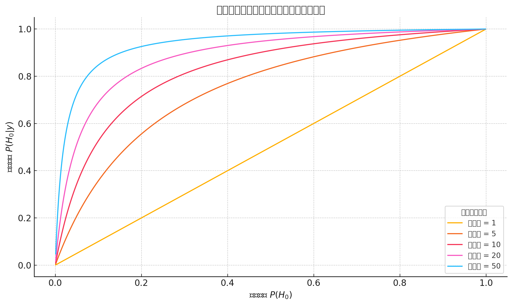
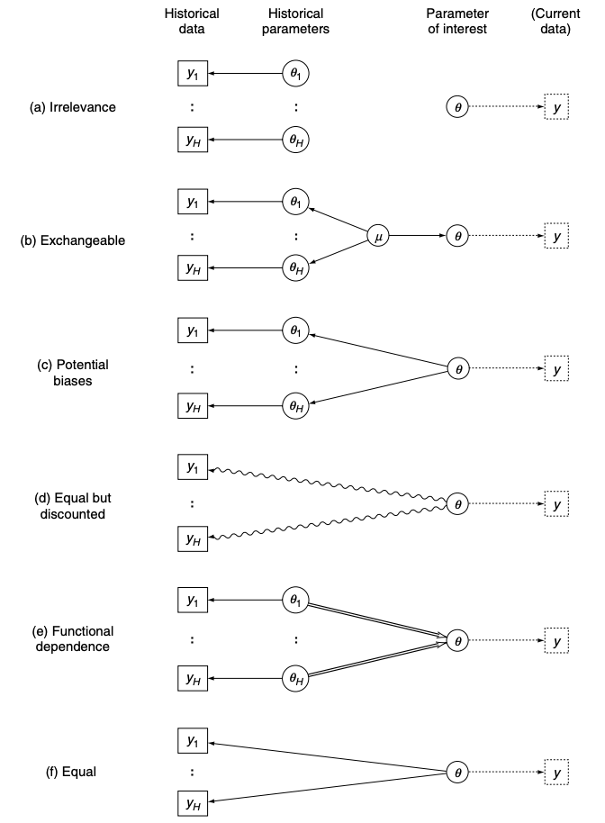

 
```{r setup, include=FALSE, echo = FALSE,message = FALSE, error = FALSE, warning = FALSE}
knitr::opts_chunk$set(echo = TRUE)

# <!-- ---------------------------------------------------------------------- -->
# <!--                    1. load the required packages                       -->
# <!-- ---------------------------------------------------------------------- --> 

## if(!require(psych)){install.packages("psych")}
packages<-c("tidyverse", "kableExtra", "gtsummary","inTextSummaryTable",
            "Hmisc","htmltools","clinUtils",
            "bayess")
ipak <- function(pkg){
  new.pkg <- pkg[!(pkg %in% installed.packages()[, "Package"])]
  if (length(new.pkg)) 
    install.packages(new.pkg, dependencies = TRUE)
  sapply(pkg, require, character.only = TRUE)
}
ipak(packages)
 

# <!-- ---------------------------------------------------------------------- -->
# <!--                        2. Basic system settings                        -->
# <!-- ---------------------------------------------------------------------- -->
setwd(dirname(rstudioapi::getSourceEditorContext()$path))
getwd()
Sys.setlocale("LC_ALL","English")
```

 

# Introduction

## Frequency and Bayesian

- In the realm of statistics, two main schools of thought offer distinct approaches to understanding and interpreting data: the frequency school and the Bayesian school.
- The frequency school posits that overall parameters are fixed and that samples are acquired randomly. This perspective views each random sample as an imperfect representation of an ideal entity. By applying methods like maximum likelihood estimation, the frequency school aims to infer the most probable parameters that could result in the observed samples.
- Contrarily, the Bayesian school considers overall parameters as random variables, while the samples obtained are seen as fixed. Bayesians are less concerned with pinpointing the exact parameters; instead, they focus on updating beliefs about these parameters. They utilize prior knowledge combined with newly acquired data to compute the posterior probability distribution, facilitating statistical inference through this updated belief system.


**Bayesian Inference: Priors, Posteriors, and Predictive Analysis**

- Prior probability distributions represent our beliefs about hypotheses before we analyze any data. These priors are foundational in Bayesian inference, which updates these beliefs to posterior probabilities upon receiving new data.
- The posterior probability distribution, denoted as $$\mathrm{P}(\theta | \text{data})$$, is a cornerstone of Bayesian reasoning. This distribution encapsulates our uncertainty about parameter values. A narrower distribution suggests higher confidence in our estimates of these values. By gathering more data, we can achieve more precise posterior distributions.
- Moreover, the posterior distribution is instrumental in forecasting future outcomes of experiments and testing models. It allows statisticians to make informed predictions and validate hypotheses effectively.


## Bayesian and Classical Methods

Bayesian analysis has several advantages over classical analysis in the context of clinical trials. These include the ability to incorporate prior information about treatment efficacies into the analysis, the flexibility to make multiple unscheduled inspections of accumulating data without increasing the error rate, and the capability to calculate the probability that one treatment is more effective than another.

In contrast to classical methods, Bayesian analysis is conditional on the observed data and focuses on the probability that a conclusion or hypothesis is true given the available data. Classical inference, however, is not conditional on the observed data but instead concerns the behavior of a statistical procedure over an infinite number of repetitions, considering all potential data that might have been observed under a hypothesis. Bayesians deal with the probabilities of hypotheses given a dataset, whereas frequentists concern themselves with the probabilities of datasets given a hypothesis.


**1. Overview of Bayesian and Classical Analysis**

- **Bayesian Analysis:**
  - **Incorporates Prior Information:** Utilizes existing knowledge about treatment effects, enhancing analytical precision.
  - **Flexible Data Inspection:** Allows multiple reviews of ongoing data without affecting the error rates, promoting adaptive research approaches.
  - **Probabilistic Outcomes:** Computes the likelihood of one treatment outperforming another, providing direct answers to clinical questions.

- **Classical Analysis:**
  - **Fixed Procedure:** Relies on a set framework involving hypothesis testing with less adaptability in procedure once the analysis begins.
  - **Repetition-Based:** Focuses on long-term behavior over many hypothetical repeats of the study, which can disconnect results from the practical needs of clinicians.

**2. Methodological Contrasts**

- **Conditional vs. Unconditional Frameworks:**
  - **Bayesian:** Analysis is conditional on the data observed, directly tying conclusions to the evidence at hand.
  - **Classical:** Operates independent of the specific data set, which can lead to less direct applicability to the individual study results.

- **Hypothesis Testing Approach:**
  - **Bayesian:** Engages directly with the probability of hypotheses given the data, making it inherently responsive to new information.
  - **Classical:** Concentrates on the probability of data given predefined hypotheses, often leading to rigid interpretations.

**3. Limitations in Classical Hypothesis Testing**

- **Inflexibility in Hypothesis Evaluation:** Classical methods typically commit to the first plausible alternative hypothesis upon rejecting the null, without thorough consideration of other viable hypotheses.
- **Impact of Data Peeking:** Interim data reviews can affect the study's error rates under classical approaches, a scenario not adequately addressed in traditional frameworks.

**4. Advantages of Bayesian Methodology**

- **Utilization of Bayes' Theorem:** Allows for calculating the true probability of a hypothesis based on both prior knowledge and new data.
- **Integration of Prior Beliefs:** Bayesian methods can quantitatively incorporate uncertainties about prior information, adjusting the analysis to reflect varying degrees of prior reliability.
- **Flexibility in Clinical Trials:** Does not require preset patient numbers or analysis timings, adapting more naturally to the dynamics of trial execution.

**5. Implementation and Impact**

- **Defining Prior Knowledge:** Establishing the initial probability distributions based on literature, expert opinions, and preliminary studies to guide the analysis.
- **Data Acquisition and Adjustment:** Continuous updating of prior estimates with incoming trial data to refine the posterior estimates.
- **Posterior Analysis:** Results in detailed probability distributions that offer nuanced insights into treatment efficacy, enhancing decision-making with probabilistic ranges for treatment effects.


## Bayes' Theorem

Bayes' theorem can be expressed mathematically in the context of Bayesian inference as:

\[
\overbrace{p(\theta/D)}^{\text{Posterior}} = \frac{\overbrace{p(D/\theta)}^{\text{Likelihood}} \cdot \overbrace{p(\theta)}^{\text{Prior}}}{\underbrace{p(D)}_{\text{Evidence}}}
\]

This equation is fundamental to Bayesian analysis and can be broken down into three critical components:

1. **Posterior Probability ( \( p(\theta/D) \) ):**
   - This is the probability of the hypothesis \( \theta \) given the data \( D \).
   - It is updated knowledge after considering new evidence.
   - It provides a measure of how plausible the hypothesis is in the light of the available data.

2. **Likelihood ( \( p(D/\theta) \) ):**
   - This is the probability of observing the data \( D \) given that the hypothesis \( \theta \) is true.
   - It assesses how probable the observed data are under different hypothetical conditions specified by \( \theta \).

3. **Prior Probability ( \( p(\theta) \) ):**
   - This is the probability of the hypothesis before observing the current data.
   - It incorporates existing knowledge or beliefs about the parameter before new data is taken into account.

4. **Evidence or Marginal Likelihood ( \( p(D) \) ):**
   - This is also known as the marginal probability of the observed data.
   - It is calculated by integrating or summing over all possible values of \( \theta \), essentially averaging the likelihoods weighted by the prior probabilities.
   - In practice, this acts as a normalizing constant to ensure the posterior probabilities sum to one.
   
### Prior Distribution {-}

The **Prior Distribution** in Bayesian statistics is a fundamental component that encapsulates our knowledge or beliefs about a parameter before we observe any data. It's an expression of our subjective or objective preconceptions about the values that a parameter, typically denoted as \( \theta \), might take based on previous experience, existing knowledge, or expert opinion.

**Characteristics of Prior Distributions**

1. **Subjective or Objective**:
   - **Subjective Priors**: These are based on personal beliefs or expert opinions and are particularly useful when historical data is sparse or when new phenomena are being studied. Subjective priors can incorporate insights from experts, results from previous studies that are not strictly comparable, or institutional knowledge.
   - **Objective Priors**: These are formulated to minimize the influence of the prior, aiming to let the data speak for themselves. Objective priors include non-informative priors, which are designed to have minimal impact on the posterior outcomes. Examples include Jeffreys’ prior and uniform distributions in certain contexts.

2. **Informative vs. Non-Informative**:
   - **Informative Priors**: These contain specific information about a parameter. For instance, if previous studies suggest that a parameter is likely centered around a particular value with some variance, the prior distribution can be centered at this value with a spread reflecting this variance.
   - **Non-Informative Priors**: These are used when no substantial prior knowledge about a parameter is available or when it is desirable to not let prior assumptions heavily influence the results. They are often broad and flat, indicating equal probability across a wide range of parameter values, thereby allowing the data to have a stronger influence on the posterior distribution.

**Role of Prior Distribution in Bayesian Analysis**

- **Initial Belief Modeling**: The prior distribution models the initial belief about the parameter before new data is taken into account.
- **Updating Beliefs**: In Bayesian inference, the prior distribution is updated with the likelihood of observing the new data given possible parameter values, resulting in the posterior distribution. This process is governed by Bayes' theorem:
  \[
  \text{Posterior} \propto \text{Likelihood} \times \text{Prior}
  \]
- **Impact on Posterior**: The strength and nature of the prior can significantly affect the posterior, especially when the amount of data is small. With more data, the influence of the prior generally diminishes, particularly if the prior is non-informative.


### Likelihood Function {-}

Bayesian inference updates the prior probability distribution based on newly acquired data. According to Bayes' theorem, the posterior distribution \( p(\theta| x) \) is proportional to the product of the likelihood \( p(x | \theta) \) and the prior distribution \( p(\theta) \), expressed as:

\[ p(\theta|x) \propto p(x|\theta)p(\theta) \]

The integral of the likelihood function over the prior distribution, normalized by the probability of the data \( p(x) \), provides the marginal likelihood:

\[ p(x) = \int p(x|\theta)p(\theta) d\theta \]

This marginal likelihood \( p(x) \) serves as the normalizing constant for the posterior distribution:

\[ p(\theta|x) = \frac{p(x|\theta)p(\theta)}{p(x)} \]

Bayesian inference effectively incorporates nuisance parameters by integrating them out of the joint posterior to provide a marginal posterior distribution \( p(\theta_1 | x) \), which is calculated by integrating over the nuisance parameter \( \theta_2 \):

\[ p(\theta_1 | x) = \int p(\theta_1, \theta_2 | x) p(\theta_2 | d\theta_2) \]


### Posterior Distribution {-}


1. **Bayesian Update**:
   - Bayesian analysis modifies the likelihood by incorporating a prior belief about the parameters, \(\pi(\theta)\), leading to the posterior distribution.
   - The posterior distribution is calculated using Bayes' theorem:
     \[
     \pi(\theta \mid \mathscr{D}_{n}) = \frac{\ell(\theta \mid \mathscr{D}_{n}) \pi(\theta)}{\int \ell(\theta \mid \mathscr{D}_{n}) \pi(\theta) \, d \theta}
     \]
   - This results in a probability distribution over the parameter space \(\Theta\), reflecting updated beliefs after considering the observed data.

2. **Choosing the Prior**:
   - The selection of the prior, \(\pi(\theta)\), is crucial as it represents the initial beliefs about the parameters before observing any data.
   - The prior needs to be chosen carefully to reflect prior knowledge or assumptions about the parameters.
   
The predictive distribution in Bayesian inference uses the posterior distribution to make predictions about future data. This approach is inherently probabilistic, reflecting the uncertainty inherent in the data and the model parameters. Key elements of Bayesian prediction include:

1. **Predictive Mean:**
   - The expected value of the prediction \( E(y) \) is computed as the integral of the potential outcomes weighted by their probabilities, calculated over the posterior distribution.
   - Formula: \( E(y) = \int \theta p(\theta | x) d\theta \)

2. **Mode of the Predictive Distribution:**
   - Represents the most probable value of the prediction, identified by the maximum of the posterior distribution.
   - Formula: \( \text{Mode} = \arg\max_{\theta} p(\theta | x) \)

3. **Predictive Distribution:**
   - The predictive distribution provides a complete probabilistic description of the possible future values, integrating over all uncertainties.
   - It summarizes not just a single value but the likelihood of all possible future outcomes.
   


## Credible Intervals

1. **Bayesian Inferential Approach**:
   - The Bayesian approach is comprehensive, encompassing confidence evaluation, hypothesis testing, prediction, model checking, and point estimation.
   - It treats parameters as random variables and derives inferential statistics based on the posterior distribution \( \pi(\theta \mid \mathscr{D}_{n}) \).

2. **Definition of Credible Intervals**:
   - In Bayesian statistics, what traditional statistics call a confidence interval is referred to as a "credible interval."
   - A credible interval for a parameter \(\theta\) based on data \(\mathscr{D}_{n}\) is defined as a set \( C(\mathscr{D}_{n}) \) such that:
     \[
     \pi(\theta \in C(\mathscr{D}_{n}) \mid \mathscr{D}_{n}) = 1 - \alpha
     \]
     Here, \( \alpha \) is the significance level (e.g., 0.05), indicating that the interval contains the parameter with probability \( 1-\alpha \).

3. **Integration over Parameter Space**:
   - Unlike classical methods that integrate over the observation space to compute confidence intervals, Bayesian methods integrate over the parameter space.
   - This means that \( 1-\alpha \) represents the probability that the random variable \(\theta\) falls within the interval \( C(\mathscr{D}_{n}) \), rather than the probability that a random interval contains the true parameter value.

4. **Highest Posterior Density (HPD) Region**:
   - The HPD region is a type of Bayesian credible interval which contains the values of \(\theta\) with the highest posterior densities.
   - It is defined as:
     \[
     C(\mathscr{D}_{n}) = \{\theta : \pi(\theta \mid \mathscr{D}_{n}) \geq k_{\alpha}\}
     \]
     where \( k_{\alpha} \) is determined so that the probability content of the HPD region is exactly \( 1-\alpha \).
     
### Highest Density Region (HDR)

1. **Definition of HDR**:
   - The Highest Density Region (HDR) for a given posterior distribution \( p(\theta | \text{data}) \) at a probability level \( 1-\alpha \) is defined as the subset of the parameter space where the density of \( \theta \) is highest.
   - Mathematically, it is defined as:
     \[
     \{\theta : p(\theta | \text{data}) \geq k(\alpha)\}
     \]
     where \( k(\alpha) \) is the largest constant such that the probability mass of this region is \( 1-\alpha \):
     \[
     \int_{\{\theta: p(\theta | \text{data}) \geq k(\alpha)\}} p(\theta | \text{data}) d\theta = 1 - \alpha
     \]

2. **Interpretation and Importance**:
   - The HDR contains the most probable values of \( \theta \) under the posterior distribution.
   - It is used to specify the region in the parameter space where the true parameter value is most likely to lie, given the observed data.

3. **Calculation of HDR**:
   - To determine the HDR, identify the level \( k(\alpha) \) such that the integral of the posterior distribution over the region where \( p(\theta | \text{data}) \geq k(\alpha) \) equals \( 1-\alpha \).
   - This requires solving for \( k(\alpha) \) in a way that balances between covering the highest density of the distribution and ensuring that the total probability of the region is exactly \( 1-\alpha \).

4. **Practical Implications of HDR**
   - **Confidence in Estimates**: The HDR provides a way to understand the uncertainty and variability of parameter estimates. It can be considered as a Bayesian analogue to confidence intervals in frequentist statistics.
   - **Decision Making**: In practical applications, such as in policy settings or scientific research, identifying the HDR helps in making decisions based on the most probable parameter values.
   - **Comparative Analysis**: Comparing HDRs from different posterior distributions can provide insights into how different prior beliefs or data sets influence the inferences about the parameters.
   

### Key Differences from Classical Confidence Intervals

- **Probability Interpretation**:
  - In Bayesian analysis, the probability \( 1-\alpha \) directly quantifies our belief about the parameter’s location based on the data and prior information.
  - In classical statistics, \( 1-\alpha \) indicates how often the true parameter will be captured by the interval over repeated sampling from the population.

- **Simplicity of Construction**:
  - Determining the best credible interval in Bayesian terms is typically simpler than constructing classical confidence intervals because it directly targets the areas of highest probability density without regard to potential sampling variability.
  
 


## Hypothesis Testing

### Bayesian Theorem for Two Hypotheses {-}

In Bayesian inference, we often deal with two **mutually exclusive and exhaustive hypotheses**:

* $H_0$: the null hypothesis (e.g. "the person has HIV")
* $H_1$: the alternative hypothesis (e.g. "the person does not have HIV")

Let:

* $p(H_0)$ and $p(H_1)$ be the **prior probabilities** (our beliefs before seeing the data)
* $p(y \mid H_0)$ and $p(y \mid H_1)$ be the **likelihoods**, i.e., the probability of observing the data $y$ assuming each hypothesis is true

Bayes’ Theorem allows us to update our beliefs after observing data $y$. The **posterior probability** for $H_0$ is:

$$
p(H_0 \mid y) = \frac{p(y \mid H_0) \cdot p(H_0)}{p(y)}
$$

Where the denominator $p(y)$ is the **marginal likelihood** or **evidence**:

$$
p(y) = p(y \mid H_0) \cdot p(H_0) + p(y \mid H_1) \cdot p(H_1)
$$

Since $H_1 = \text{not } H_0$, we also have $p(H_1) = 1 - p(H_0)$.
 
Bayes’ Theorem can also be written in terms of **odds**:

$$
\frac{p(H_0 \mid y)}{p(H_1 \mid y)} = \frac{p(y \mid H_0)}{p(y \mid H_1)} \cdot \frac{p(H_0)}{p(H_1)}
$$

In this expression:

* $\frac{p(H_0)}{p(H_1)}$ is the **prior odds**
* $\frac{p(y \mid H_0)}{p(y \mid H_1)}$ is the **likelihood ratio**
* $\frac{p(H_0 \mid y)}{p(H_1 \mid y)}$ is the **posterior odds**

This version shows that:

$$
\text{Posterior odds} = \text{Likelihood ratio} \times \text{Prior odds}
$$

Taking the logarithm of both sides:

$$
\log(\text{Posterior odds}) = \log(\text{Likelihood ratio}) + \log(\text{Prior odds})
$$

The term $\log(\text{Likelihood ratio})$ is known as the **weight of evidence**, a concept first introduced by **Alan Turing** during World War II in his work on decoding the Enigma machine.
  

A typical graph of Bayes’ Theorem under different **likelihood ratios** illustrates how prior and posterior probabilities relate:

* **X-axis**: Prior probability $p(H_0)$ — your belief in the hypothesis before seeing data
* **Y-axis**: Posterior probability $p(H_0 \mid y)$ — your updated belief after observing data

Each curve represents a different likelihood ratio (e.g., 1, 5, 10, 20, 50).

**Interpretation examples**:

* If your prior probability is **0.01** (a very low initial belief), then **even a strong likelihood ratio (e.g., 50)** may only raise the posterior probability to around **0.33**
* But if your prior is **0.5** and the likelihood ratio is **20**, the posterior probability can increase to **around 0.95**
 

> **The result of Bayesian inference depends not only on the strength of the evidence (likelihood ratio) but also heavily on the initial belief (prior probability).**

In particular:

* With a **low prior**, even strong evidence may not produce high posterior belief
* With a **moderate or high prior**, strong evidence can sharply raise your confidence

### Bayes Factors (Likelihood Ratios)

In Bayesian hypothesis testing, the likelihood of two competing hypotheses \(H_0\) and \(H_1\) (for example, \(H_0: \theta = 0\) and \(H_1: \theta = 1\)) is evaluated based on the data, taking into account prior beliefs about these hypotheses.

**Bayes Factors**: is a crucial metric in Bayesian hypothesis testing. It is used to provide a quantifiable measure of support for one hypothesis over another, based on the observed data.
 
 

The **Bayes Factor** is essentially the same as the likelihood ratio when comparing two simple hypotheses. It quantifies the evidence provided by the data in favor of one hypothesis over another:

$$
\text{Bayes Factor (BF)} = \frac{p(y \mid H_0)}{p(y \mid H_1)}
$$

Interpretation:

* If BF > 1, the evidence favors $H_0$
* If BF < 1, the evidence favors $H_1$
* The further BF is from 1, the stronger the evidence

This is also referred to by Cornfield as the **"relative betting odds"** and is central to Bayesian inference.

---
 

Bayes factors are used to transform **prior odds** into **posterior odds**:

$$
\frac{p(H_0 \mid y)}{p(H_1 \mid y)} = \text{Bayes Factor} \times \frac{p(H_0)}{p(H_1)}
$$

This shows how evidence from data (through the BF) updates our prior beliefs to form our posterior beliefs.
 
---

Interpreting the Bayes Factor: Jeffreys' Scale

The strength of evidence indicated by the Bayes factor can be interpreted using **Harold Jeffreys’ scale** (see Table 3.2):

| Bayes Factor (BF) | Evidence Strength (in favor of $H_0$) |
| ----------------- | ------------------------------------- |
| > 100             | Decisive                              |
| 32 to 100         | Very strong                           |
| 10 to 32          | Strong                                |
| 3.2 to 10         | Substantial                           |
| 1 to 3.2          | Barely worth mentioning               |

| Bayes Factor (BF) | Evidence Strength (in favor of $H_1$) |
| ----------------- | ------------------------------------- |
| 1 to 1/3.2        | Barely worth mentioning               |
| 1/3.2 to 1/10     | Substantial                           |
| 1/10 to 1/32      | Strong                                |
| 1/32 to 1/100     | Very strong                           |
| < 1/100           | Decisive                              |
  
  
### P-values and Bayes Factors {-}

P-values and Bayes factors  are two approaches for hypothesis testing and assessing evidence, but they represent fundamentally different statistical paradigms. Here's a comparison and detailed explanation:


**P-Values (Frequentist Paradigm)**

A **P-value** is a frequentist measure used to test a null hypothesis (\(H_0\)):

1. **Definition:**
   - The probability of observing data as extreme as, or more extreme than, the observed data, assuming \(H_0\) is true.
   - It does not give the probability that \(H_0\) is true.

2. **Purpose:**
   - To assess whether the evidence is inconsistent with \(H_0\).

3. **Interpretation:**
   - A small \(P\)-value (e.g., \(P < 0.05\)) suggests evidence against \(H_0\), but it does not confirm \(H_1\) (the alternative hypothesis).
   - A large \(P\)-value suggests insufficient evidence to reject \(H_0\), not that \(H_0\) is true.

4. **Limitations:**
   - Dependence on sample size: Large datasets may produce small \(P\)-values even for trivial effects.
   - Misinterpretation: Often misunderstood as the probability of \(H_0\) being true or false.

5. **P-Value Example**
- \(H_0\): A new drug has no effect (\(\mu = 0\)).
- A test yields \(P = 0.03\).
  - Interpretation: There is a 3% probability of observing data as extreme as the observed, assuming \(H_0\) is true.
  - Action: Reject \(H_0\) at the 5% significance level.
  

**Bayes Factors (Bayesian Paradigm)**

A **Bayes factor (BF)** is a Bayesian measure of evidence that compares two hypotheses, \(H_0\) (null) and \(H_1\) (alternative):

1. **Definition:**
   - The ratio of the likelihood of the observed data under two competing hypotheses:
     \[
     BF = \frac{P(\text{Data} | H_1)}{P(\text{Data} | H_0)}
     \]

2. **Purpose:**
   - To quantify how much more (or less) the data supports \(H_1\) compared to \(H_0\).

3. **Interpretation:**
   - \(BF > 1\): Evidence in favor of \(H_1\).
   - \(BF < 1\): Evidence in favor of \(H_0\).
   - \(BF = 1\): Data equally supports both hypotheses.

4. **Bayes Factor Scale (Jeffreys’ interpretation):**

   | **Bayes Factor (BF)** | **Evidence Strength**         |
   |------------------------|-------------------------------|
   | \(1\)                 | No evidence                  |
   | \(1 - 3\)             | Weak evidence for \(H_1\)    |
   | \(3 - 10\)            | Moderate evidence for \(H_1\)|
   | \(> 10\)              | Strong evidence for \(H_1\)  |

5. **Advantages:**
   - Accounts for prior beliefs (\(P(H_0)\), \(P(H_1)\)).
   - Allows direct comparison of evidence for both hypotheses.
   - Works well with small sample sizes or complex models.


6. **Bayes Factor Example**
- Same \(H_0\): New drug has no effect.
- Bayes Factor \(BF = 5\):
  - Interpretation: The data are 5 times more likely under \(H_1\) (the drug has an effect) than \(H_0\).
  - Action: Strong evidence in favor of \(H_1\).


**Comparison: P-Values vs. Bayes Factors**

| **Aspect**                | **P-Values**                                   | **Bayes Factors**                                |
|---------------------------|-----------------------------------------------|------------------------------------------------|
| **Paradigm**              | Frequentist                                   | Bayesian                                       |
| **Key Concept**           | Probability of data given \(H_0\).            | Likelihood ratio of data under \(H_1\) and \(H_0\). |
| **Prior Knowledge**       | Not considered.                               | Incorporates prior beliefs.                   |
| **Output**                | Single probability value.                     | A ratio quantifying evidence.                 |
| **Hypotheses Comparison** | Only tests against \(H_0\).                   | Direct comparison of \(H_0\) and \(H_1\).     |
| **Effect of Sample Size** | Large sample size can lead to small \(P\)-values even for trivial effects. | Directly incorporates data strength.          |
| **Interpretation**        | Often misinterpreted as evidence for \(H_1\). | Provides explicit evidence for one hypothesis over another. |


   
## Parameter Estimates

To determine a data's probability density distribution accurately, two main components are essential:

1. **Form of the Probability Density Function (PDF)**:

   - Sometimes, the form of the PDF is known (e.g., Gaussian, Rayleigh) but the specific parameters (like mean or variance) are unknown. This scenario requires parameter estimation based on observed data.

2. **Parameters of the PDF**:

   - Other times, the type of probability density may not be known, but some estimated parameters (like mean and variance) are available. This information can guide the selection of an appropriate PDF.

In statistical modeling, estimating unknown parameters is a common task:

- **In basic models like linear regression**, the objective is often to calculate a specific parameter vector, **W**.
- **In Bayesian models**, instead of calculating a point estimate of **W**, the focus shifts to determining the distribution of **W**. This distribution is then used to predict outcomes (e.g., **p(y|x, D)**), incorporating all possible values of **W**.
 
Bayesian models are complex because they consider a distribution of parameter values rather than a single point estimate. This complexity often necessitates sophisticated computational techniques:

- **Markov Chain Monte Carlo (MCMC)**: This technique is used instead of direct optimization methods to integrate over possible parameter values (all possible **W** vectors) effectively.

As more data is observed, Bayesian models provide clearer inference about the distribution of parameters, known as **posterior inference**. This approach contrasts with other predictive strategies:

1. **Maximum Likelihood Estimation (MLE)**:

   - This is a point estimation method that finds the parameter values which maximize the likelihood of observing the given data. It does not consider prior knowledge about parameter values.

2. **Maximum a Posteriori (MAP)**:

   - Also a point estimation method, MAP considers both the likelihood of the observed data and a prior distribution of the parameters. It calculates the mode of the posterior distribution.

3. **Bayesian Model**:

   - This method estimates the distribution of parameters rather than a single point. It provides a full probabilistic description of parameter uncertainty, making it more robust against overfitting and more informative for decision-making.

**Comparison and Applications**   

- **MLE** is often simpler and computationally faster but can be biased if the model assumptions are incorrect.
- **MAP** incorporates prior beliefs into the estimation process, providing regularization that can lead to more robust estimates in the presence of limited data.
- **Bayesian Models** are the most comprehensive, considering a range of possible parameter values. This approach is particularly beneficial in complex systems where the uncertainty in model parameters needs to be quantified and propagated through to predictions.

### a. Maximum Likelihood Estimation (MLE) {-}

**1. Concept of MLE:**

   - MLE is a method used to determine the parameters of a statistical model that make the observed data most probable. The goal is to find the parameter values that maximize the likelihood function, which represents the probability of the observed data given those parameter values.

**2. Assumptions in MLE:**

   - **Homogeneity**: Assumes that subsets of data from different categories (such as different classes or groups) share the same type of probability density function but differ in parameter values.
   - **Independence between Categories**: Assumes that data in one category are independently sampled from those in another, meaning the parameter estimation for one category doesn't affect another.
   - **Statistical Independence within Categories**: Assumes that samples within each category are independently and identically distributed (iid).

**3. Formulation:**

   - Given a random sample \( x_1, x_2, \ldots, x_N \) from a probability density function \( p(x;\theta) \), the joint probability density function of the sample is given by:
     \[
     p(X;\theta) = \prod_{k=1}^N p(x_k;\theta)
     \]
   - The MLE \( \hat{\theta}_{ML} \) is obtained by maximizing this product:
     \[
     \hat{\theta}_{ML} = \arg \max_{\theta} \prod_{k=1}^N p(x_k;\theta)
     \]
   - Typically, this optimization is performed on the log-likelihood function \( L(\theta) \) to simplify calculations:
     \[
     L(\theta) = \ln \prod_{k=1}^N p(x_k;\theta) = \sum_{k=1}^N \ln p(x_k;\theta)
     \]
     \[
     \frac{\partial L(\theta)}{\partial \theta} = \sum_{k=1}^N \frac{\partial \ln p(x_k;\theta)}{\partial \theta} = \sum_{k=1}^N \frac{1}{p(x_k;\theta)} \frac{\partial p(x_k;\theta)}{\partial \theta} = 0
     \]

**4. Properties of MLE:**

   - **Asymptotic Unbiasedness**: As the sample size \( N \) approaches infinity, the expected value of the MLE converges to the true parameter value \( \theta_0 \):
     \[
     \lim_{N \to \infty} E[\hat{\theta}_{ML}] = \theta_0
     \]
   - **Asymptotic Consistency**: As the sample size increases, the probability that the MLE differs from the true parameter value by more than any small positive number \( \epsilon \) approaches zero:
     \[
     \lim_{N \to \infty} \Pr\{ \|\hat{\theta}_{ML} - \theta_0\| \leq \epsilon \} = 1
     \]
     \[
     \lim_{N \to \infty} E\| \hat{\theta}_{ML} - \theta_0 \|^2 = 0
     \]
   - These properties ensure that the estimator is reliable as the amount of data increases.

**5. Limitations:**

   - MLE can be prone to overfitting when the dataset is small because it maximizes the probability of observing the data without considering model complexity or penalizing for it.

### b. Maximum a Posteriori Estimation (MAP) {-}

- **MLE** treats the parameter \( \theta \) as an unknown fixed value that needs to be estimated from the data.
- The goal of MLE is to find the value of \( \theta \) that maximizes the likelihood function \( p(X; \theta) \), which is the probability of observing the data given the parameter.

**MAP Concept and Methodology:**

- **MAP** considers the parameter \( \theta \) as a random variable with a prior distribution \( p(\theta) \), reflecting prior beliefs about the possible values of \( \theta \).
- Unlike MLE, MAP estimates \( \theta \) by maximizing the posterior distribution \( p(\theta | X) \) rather than just the likelihood:
  \[
  p(\theta|X) = \frac{p(\theta) p(X|\theta)}{p(X)}
  \]
- The MAP estimate \( \hat{\theta}_{MAP} \) is given by:
  \[
  \hat{\theta}_{MAP} = \arg \max_{\theta} p(\theta) p(X|\theta)
  \]
- In the optimization, the marginal likelihood \( p(X) \) does not affect the location of the maximum since it does not depend on \( \theta \).

**Differences:**

- **Prior Influence:** MLE does not incorporate a prior distribution, treating \( \theta \) as a fixed but unknown quantity. MAP, on the other hand, explicitly includes a prior distribution, which can significantly influence the estimate especially when the sample size is small or the prior is strong (informative).
- **Resulting Estimates:** For non-informative or flat priors, MAP results converge to MLE results. However, with informative priors, MAP can yield different estimates from MLE, depending on the strength and nature of the prior.
- As the sample size increases, the influence of the prior in MAP diminishes, aligning MAP estimates more closely with MLE estimates, reflecting the dominance of the data over the prior.


### c. Bayesian Model {-}
 
Bayesian modeling distinguishes itself by considering the entire distribution of the data \(X\) and the parameters \( \theta \) instead of just optimizing parameter values based on a given sample set \(X\). This approach naturally helps prevent overfitting by integrating over all possible parameter values rather than selecting a single optimal set.

1. **Sample Set and Parameters**:
   - The data sample set is denoted as \(D\) (previously \(X\)) to avoid notation confusion. Samples in \(D\) are assumed to be independently drawn from an unknown but fixed probability density function \(p(x)\).

2. **Bayesian Estimation Problem**:
   - The core problem in Bayesian estimation is to estimate the probability distribution \(p(x|D)\), making it as close as possible to the true distribution \(p(x)\). This involves calculating the distribution of \(x\) given the data \(D\), rather than finding a single optimized value for \(x\).

3. **Conditional Probability Density Function \(p(x|\theta)\)**:
   - \(p(x|\theta)\) is assumed to be known in form but with unknown parameters \( \theta \). It represents the likelihood estimation of \( \theta \) at the point \( x \).

4. **Prior and Posterior Distributions**:
   - **Prior Distribution \(p(\theta)\)**: Represents all prior knowledge about \( \theta \) before observing any data, expressed through a probability density function.
   - **Posterior Distribution \(p(\theta|D)\)**: Updated belief about \( \theta \) after observing the data \(D\). It is obtained by transforming the prior based on the new data:
     \[
     p(\theta|D) = \frac{p(D|\theta)p(\theta)}{\int p(D|\theta)p(\theta)d\theta}
     \]
     where \( p(D|\theta) = \prod_{k=1}^N p(x_k|\theta) \), assuming independence among the sampled data points.

5. **Bayesian Estimation Formula**:
   - The core Bayesian estimation problem \(p(x|D)\) is resolved using the integral over the joint distribution of \(x\) and \( \theta \):
     \[
     p(x|D) = \int p(x|\theta)p(\theta|D)d\theta
     \]
   - Here, \( p(x|\theta) \) is the likelihood of \( x \) under \( \theta \), and \( p(\theta|D) \) is the posterior distribution of \( \theta \) after observing \(D\).

**Advantages of Bayesian Modeling**

- **Comprehensive Parameter Estimation**: By integrating over all possible values of \( \theta \), Bayesian models provide a more holistic view of parameter uncertainty.
- **Prevention of Overfitting**: The use of prior distributions and the consideration of all possible parameter values help in regularizing the model, thus preventing overfitting.
- **Flexibility and Robustness**: Bayesian models are adaptable to new data, allowing continuous updating of beliefs about parameters as more data become available.


## Predictions

**Making predictions** is a central goal of statistical modeling. In the **Bayesian framework**, predictions are straightforward and intuitively built upon the prior and posterior distributions.
 

### Predictive Distribution in the Bayesian Framework {-}

Suppose you have observed some data $y$ and wish to predict future observations $x$. The **predictive distribution** is:

$$
p(x \mid y) = \int p(x \mid \theta) \cdot p(\theta \mid y) \, d\theta
$$

This is a **weighted average of the sampling distribution** $p(x \mid \theta)$ over the **posterior distribution** of the parameter $\theta$. It accounts for both:

* Uncertainty in the future data (given $\theta$)
* Uncertainty in the parameter $\theta$ itself

If $x$ and $y$ are conditionally independent given $\theta$, then:

$$
p(x \mid y) = \int p(x \mid \theta) \cdot p(\theta \mid y) \, d\theta
$$

This integration provides a **posterior predictive distribution**, useful for:

* Power calculations
* Interim monitoring
* Decision-making in health economics or clinical trial design

### Predictions for Binary Data {-}

Suppose:

* The unknown success rate is $\theta$
* The prior or posterior distribution of $\theta$ has a mean $\mu$
* You plan to observe $n$ new Bernoulli trials

Then:

* The **expected number of successes** is:

  $$
  E(Y_n) = n \cdot \mu
  $$
* For a **single future trial**, the predicted probability of success is simply the current mean:

  $$
  P(Y = 1) = E(\theta)
  $$

If your current distribution for $\theta$ is **Beta\[a, b]**, the **predictive distribution** for the number of future successes $Y_n$ follows a **beta-binomial distribution**:

$$
p(y_n) = \binom{n}{y_n} \cdot \frac{B(a + y_n, b + n - y_n)}{B(a, b)}
$$

Where $B(a, b)$ is the Beta function.

Key properties:

* Mean:

  $$
  E(Y_n) = n \cdot \frac{a}{a + b}
  $$
* Variance:

  $$
  V(Y_n) = n \cdot \frac{ab}{(a + b)^2} \cdot \frac{a + b + n}{a + b + 1}
  $$

**Laplace’s Law of Succession** is a special case: if all $m$ past outcomes were successes and the prior is uniform (Beta\[1, 1]), the posterior becomes Beta\[m+1, 1], and the predicted success probability for the next trial is:

$$
P(Y = 1) = \frac{m + 1}{m + 2}
$$

---

**Example: Drug Trial Prediction (Binary)**

* Prior: Beta\[9.2, 13.8]
* Data: 15 successes in 20 trials
* Posterior: Beta\[24.2, 18.8], with mean 0.56

Now suppose you want to predict the number of successes in **40 future patients**. The prediction follows a beta-binomial distribution with:

* Mean ≈ 22.5
* Standard deviation ≈ 4.3

If your decision rule is to continue development **only if at least 25 out of 40** are successful, the **posterior predictive probability** of this happening is:

$$
P(Y \geq 25) \approx 0.329
$$

This probability can be computed by summing the right-hand tail of the beta-binomial.


### Predictions for Normal Data {-}

Suppose:

* You’re predicting future data $Y_n$ which is assumed to follow:

  $$
  Y_n \sim N(\theta, \sigma^2/n)
  $$
* The parameter $\theta$ itself has a **prior**:

  $$
  \theta \sim N(\mu, \sigma^2/n_0)
  $$

Then the **predictive distribution** for $Y_n$ is:

$$
Y_n \sim N\left(\mu, \sigma^2 \left(\frac{1}{n} + \frac{1}{n_0}\right)\right)
$$

The **mean** of the predictive distribution is the prior mean $\mu$, and the **variance** reflects both the sampling error of future data and the uncertainty in the parameter estimate.

If you already observed data $y_m$, and now have a **posterior**:

$$
\theta \sim N\left(\frac{n_0 \mu + m y_m}{n_0 + m}, \frac{\sigma^2}{n_0 + m}\right)
$$

Then the **updated predictive distribution** becomes:

$$
Y_n \sim N\left(\frac{n_0 \mu + m y_m}{n_0 + m}, \sigma^2\left(\frac{1}{n_0 + m} + \frac{1}{n}\right)\right)
$$

This means we’re more confident in our prediction when:

* The prior is strong (large $n_0$)
* We have more data (large $m$)
* The future sample is large (large $n$)

---

**Example: The GREAT Study (Normal Prediction)**

Goal: Predict log(OR) for 100 future patients in each trial arm.

* Observed mortality \~10% ⇒ around 20 events
* Prior + data ⇒ posterior for log(OR): $N(-0.31, \sigma^2/267.2)$
* Predictive variance:

  $$
  \sigma^2 \left(\frac{1}{267.2} + \frac{1}{20}\right) = \sigma^2/18.6 \Rightarrow \text{SD} ≈ 0.462
  $$

Without prior (flat prior):

* Posterior becomes likelihood-based only: $N(-0.74, \sigma^2/30.5)$
* Predictive variance becomes:

  $$
  \sigma^2 \left(\frac{1}{30.5} + \frac{1}{20}\right) = \sigma^2/12.1 \Rightarrow \text{SD} ≈ 0.582
  $$

This shows:

* Predictions based solely on data are more uncertain
* Including prior reduces predictive variance and shifts the mean

**Probability of achieving OR < 0.5 in the future:**

* With prior: 21%
* Without prior: 53%

This demonstrates how prior beliefs can significantly influence **posterior predictive probabilities**, especially in small or uncertain samples.


# Prior Distribution

 

## Sampling Distributions (Likelihood) and Prior Distributions (Beliefs about Parameters)

These describe how the **data** are generated given certain parameters. They are foundational to both classical and Bayesian statistics, as they provide the **likelihood function** — the probability of observing the data given specific parameter values.

* **Standard distributions** often used:

  * **Normal distribution** – commonly used for continuous data, assumes symmetry and homoscedasticity.
  * **Binomial distribution** – used for binary or success/failure data (e.g., number of heads in coin tosses).
  * **Poisson distribution** – used for count data (e.g., number of events in a time interval).

* **Non-standard distributions**:

  * **Log-normal distribution** – used especially for **cost or income data**, where values are strictly positive and typically skewed.

In Bayesian analysis, selecting an appropriate sampling distribution is critical because it influences how information from the observed data is incorporated.

 
 
Prior Distributions (Beliefs about Parameters) represent our **beliefs about parameter values** *before* observing the data. This is where Bayesian methods diverge significantly from classical methods.

* The **shape of the prior** is crucial, as it reflects the plausibility of different parameter values. It needs to be:

  * **Flexible** to represent various forms of uncertainty
  * Capable of expressing features like:

    * **Skewness** (asymmetric beliefs)
    * **Heavy tails** (more weight on extreme values)

* Common prior distributions:

  * **Normal distribution** – often used due to its simplicity and analytic convenience.
  * **Beta distribution** – bounded between 0 and 1, ideal for parameters like probabilities.
  * **Root-inverse-gamma** – used particularly in hierarchical models or for variances.
  * **Half-normal** – used for strictly positive parameters, such as standard deviations.


| Distribution           | Support              | PDF / PMF                                                                                     | Mean                             | Variance                                         |
|------------------------|----------------------|-----------------------------------------------------------------------------------------------|----------------------------------|--------------------------------------------------|
| Binomial               | y ∈ {0, ..., n}      | P(Y=y) = C(n, y) θ^y (1−θ)^(n−y)                                                              | nθ                               | nθ(1−θ)                                          |
| Bernoulli              | y ∈ {0, 1}           | P(Y=1)=θ, P(Y=0)=1−θ                                                                          | θ                                | θ(1−θ)                                           |
| Poisson                | y ∈ {0, 1, 2, ...}   | P(Y=y) = λ^y e^(−λ) / y!                                                                      | λ                                | λ                                                |
| Beta                   | y ∈ (0, 1)           | f(y) = [Γ(a+b)/(Γ(a)Γ(b))] y^(a−1)(1−y)^(b−1)                                                 | a / (a + b)                      | ab / [(a + b)^2 (a + b + 1)]                     |
| Uniform                | y ∈ (a, b)           | f(y) = 1 / (b − a)                                                                            | (a + b)/2                        | (b − a)^2 / 12                                   |
| Gamma                  | y > 0                | f(y) = (b^a / Γ(a)) y^(a−1) e^(−by)                                                           | a / b                            | a / b²                                           |
| Root-Inverse-Gamma     | y > 0                | f(y) = [2b^a / Γ(a)] × y^(−2a−1) × exp(−b / y²)                                               | √b × Γ(a−½)/Γ(a)                 | b / (a − 1) − [E(Y)]² (defined if a > 1)         |
| Half-Normal            | y > 0                | f(y) = √(2 / πσ²) × exp(−y² / (2σ²))                                                          | σ√(2/π)                          | σ² (1 − 2/π)                                     |
| Log-Normal             | y > 0                | f(y) = (1 / y√(2πσ²)) × exp(−(log y − μ)² / (2σ²))                                            | e^(μ + σ² / 2)                   | e^(2μ + σ²)(e^σ² − 1)                            |
| Student’s t            | y ∈ ℝ                | f(y) ∝ [1 + (y−μ)² / (νσ²)]^(−(ν+1)/2)                                                       | μ (if ν > 1)                     | (νσ²) / (ν − 2) (defined if ν > 2)               |
| Bivariate Normal       | (x, y) ∈ ℝ²          | f(x,y) = 1 / (2πσ_Xσ_Y√(1−ρ²)) × exp(−Q / [2(1−ρ²)])                                          | (μ_X, μ_Y)                       | Var(Y|X) = σ_Y²(1−ρ²), Cov(X,Y) = ρσ_Xσ_Y        |

 

---

### Binomial and Bernoulli Distributions {-}

A binomial distribution models the number of successes in $n$ independent trials, each with success probability $\theta$.
If $Y \sim \text{Binomial}(n, \theta)$, then:

* Probability mass function (pmf):

  $$
  P(Y = y) = \binom{n}{y} \theta^y (1 - \theta)^{n - y}, \quad y = 0, 1, \dots, n
  $$
* Mean:

  $$
  E(Y) = n\theta
  $$
* Variance:

  $$
  \text{Var}(Y) = n\theta(1 - \theta)
  $$

If $n = 1$, the binomial becomes a **Bernoulli distribution**.


This delve into the application of Bayesian statistics for Poisson-distributed data using a Gamma distribution as a conjugate prior. This scenario is commonly encountered in settings where the data consists of counts or events that follow a Poisson process, and the prior information about the event rate (λ, lambda) is modeled using a Gamma distribution. 
 
**Context and Setup**

- **Bernoulli Distribution**: This is used to model binary data, where each trial has two possible outcomes, typically represented as 0 or 1. In the context given, each trial (or observation) can result in success (1) or failure (0).
- **Beta Distribution for Prior**: The Beta distribution is commonly used as a prior in Bayesian analysis for binomial and Bernoulli distributions due to its conjugate properties. The Beta distribution is parameterized by two positive shape parameters, α (alpha) and β (beta), which represent prior knowledge about the probability of success in Bernoulli trials.

**Mathematical Formulation**

- The likelihood of observing a particular set of Bernoulli data given a probability of success θ is:
  \[
  p(X|\theta) = \theta^{\sum x_i} (1-\theta)^{n - \sum x_i}
  \]
  where \( \sum x_i \) is the total number of successes, and \( n \) is the total number of trials.
- The conjugate prior for θ in this scenario is a Beta distribution:
  \[
  p(\theta) \propto \theta^{\alpha - 1} (1-\theta)^{\beta - 1}
  \]
- The posterior distribution, after observing the data, remains a Beta distribution:
  \[
  p(\theta|X) = \text{Beta}(\alpha + \sum x_i, \beta + n - \sum x_i)
  \]
  This formula shows that the parameters of the Beta distribution are updated by adding the number of successes to α and the number of failures to β.


 

**Statistical Inference**

- **Posterior Mean**: The expectation of the posterior distribution \( \theta|X \) can be estimated as:
  \[
  E[\theta|X] = \frac{\alpha + \sum x_i}{\alpha + \beta + n}
  \]
  This represents a weighted average between the prior belief and the observed data, where the influence of the prior diminishes as more data is collected.
- **Practical Example**: Suppose a prior belief models the probability of success as somewhat uncertain but leaning towards being less likely (e.g., \( \alpha = 2, \beta = 18 \)). After observing 15 successes out of 20 trials, the posterior parameters would be updated to \( \alpha' = 2+15 = 17 \) and \( \beta' = 18+5 = 23 \). The posterior distribution would then be Beta(17, 23).

 
 
---

### Poisson Distribution {-}

Models the number of events in a fixed interval when events happen independently and at a constant rate $\lambda$.
If $Y \sim \text{Poisson}(\lambda)$, then:

* Probability mass function:

  $$
  P(Y = y) = \frac{\lambda^y e^{-\lambda}}{y!}, \quad y = 0, 1, 2, \dots
  $$
* Mean:

  $$
  E(Y) = \lambda
  $$
* Variance:

  $$
  \text{Var}(Y) = \lambda
  $$


This delve into the application of Bayesian statistics for Poisson-distributed data using a Gamma distribution as a conjugate prior. This scenario is commonly encountered in settings where the data consists of counts or events that follow a Poisson process, and the prior information about the event rate (λ, lambda) is modeled using a Gamma distribution.  

1. **Poisson Distribution**:
   - The Poisson distribution is used to model the probability of a given number of events happening in a fixed interval of time or space, given the average number of events (rate λ).
   - The likelihood function for observing data \( y = (y_1, y_2, \dots, y_n) \) under a Poisson model is:
     \[
     p(y|\lambda) = \prod_{i=1}^n \frac{\lambda^{y_i} e^{-\lambda}}{y_i!}
     \]

2. **Gamma Distribution as a Conjugate Prior**:
   - The Gamma distribution is a suitable choice as a conjugate prior for λ in Poisson models because it results in a posterior distribution that is also a Gamma, facilitating computational ease and analytical tractability.
   - The Gamma distribution is parameterized by a shape parameter (α, alpha) and a rate parameter (β, beta), with the probability density function given by:
     \[
     p(\lambda) = \frac{\beta^\alpha}{\Gamma(\alpha)} \lambda^{\alpha-1} e^{-\beta \lambda}
     \]

3. **Posterior Distribution**:
   - By Bayes’ theorem, the posterior distribution of λ after observing data \( y \) combines the prior and the likelihood, yielding another Gamma distribution:
     \[
     p(\lambda|y) \propto p(y|\lambda) p(\lambda) = \text{Gamma}(\alpha + \sum y_i, \beta + n)
     \]
   - Here, \( \sum y_i \) is the sum of the observed counts, and \( n \) is the number of observations or trials.


**Example Illustration**

- Suppose we have a set of counts over ten time periods, and we assume that these counts are Poisson-distributed with an unknown rate λ. Using a Gamma prior for λ with parameters α = 1 and β = 1, we incorporate the observed data to update these parameters.

- After observing the data, the posterior parameters become:
  - New alpha (α'): α + sum of observed counts
  - New beta (β'): β + number of observations

- If the observed counts sum to 77 over 10 periods, the posterior distribution for λ becomes:
  - Alpha: 1 + 77 = 78
  - Beta: 1 + 10 = 11
  - Resulting in a posterior distribution Gamma(78, 11).
  
---

### Beta Distribution {-}

Defined on the interval $(0, 1)$, flexible for modeling probabilities.
If $Y \sim \text{Beta}(a, b)$, then:

* Probability density function (pdf):

  $$
  f(y) = \frac{\Gamma(a + b)}{\Gamma(a)\Gamma(b)} y^{a - 1} (1 - y)^{b - 1}, \quad 0 < y < 1
  $$
* Mean:

  $$
  E(Y) = \frac{a}{a + b}
  $$
* Variance:

  $$
  \text{Var}(Y) = \frac{ab}{(a + b)^2(a + b + 1)}
  $$

---

### Uniform Distribution {-}

Models equal probability over an interval $(a, b)$.
If $Y \sim \text{Uniform}(a, b)$, then:

* Probability density function:

  $$
  f(y) = \frac{1}{b - a}, \quad a < y < b
  $$
* Mean:

  $$
  E(Y) = \frac{a + b}{2}
  $$
* Variance:

  $$
  \text{Var}(Y) = \frac{(b - a)^2}{12}
  $$

---

### Gamma Distribution {-}

Defined on $(0, \infty)$, often used for modeling rates or waiting times.
If $Y \sim \text{Gamma}(a, b)$ with shape $a$ and rate $b$, then:

* Probability density function:

  $$
  f(y) = \frac{b^a}{\Gamma(a)} y^{a - 1} e^{-b y}, \quad y > 0
  $$
* Mean:

  $$
  E(Y) = \frac{a}{b}
  $$
* Variance:

  $$
  \text{Var}(Y) = \frac{a}{b^2}
  $$

---

### Root-Inverse-Gamma Distribution {-}

If $X \sim \text{Gamma}(a, b)$, then $Y = \frac{1}{\sqrt{X}} \sim \text{RIG}(a, b)$.
Then:

* Probability density function:

  $$
  f(y) = \frac{2b^a}{\Gamma(a)} \cdot \frac{1}{y^{2a + 1}} \exp\left( -\frac{b}{y^2} \right), \quad y > 0
  $$
* Mean (if $a > \tfrac{1}{2}$):

  $$
  E(Y) = \sqrt{b} \cdot \frac{\Gamma(a - \tfrac{1}{2})}{\Gamma(a)}
  $$
* Variance (if $a > 1$):

  $$
  \text{Var}(Y) = \frac{b}{a - 1} - \left( E(Y) \right)^2
  $$

---

### Half-Normal Distribution {-}

If $X \sim \mathcal{N}(0, \sigma^2)$, then $Y = |X| \sim \text{HalfNormal}(\sigma^2)$.
Then:

* Probability density function:

  $$
  f(y) = \sqrt{\frac{2}{\pi \sigma^2}} e^{-y^2 / (2\sigma^2)}, \quad y > 0
  $$
* Mean:

  $$
  E(Y) = \sigma \sqrt{\frac{2}{\pi}}
  $$
* Variance:

  $$
  \text{Var}(Y) = \sigma^2 \left(1 - \frac{2}{\pi}\right)
  $$

---

### Log-Normal Distribution {-}

If $\log(Y) \sim \mathcal{N}(\mu, \sigma^2)$, then $Y \sim \text{LogNormal}(\mu, \sigma^2)$.
Then:

* Probability density function:

  $$
  f(y) = \frac{1}{y \sqrt{2\pi \sigma^2}} \exp\left( -\frac{(\log y - \mu)^2}{2\sigma^2} \right), \quad y > 0
  $$
* Mean:

  $$
  E(Y) = e^{\mu + \sigma^2 / 2}
  $$
* Variance:

  $$
  \text{Var}(Y) = e^{2\mu + \sigma^2} (e^{\sigma^2} - 1)
  $$

---

### Student’s t-Distribution {-}

Defined by location $\mu$, scale $\sigma^2$, and degrees of freedom $\nu$.
If $Y \sim t(\mu, \sigma^2, \nu)$, then:

* Probability density function:

  $$
  f(y) = \frac{\Gamma\left( \frac{\nu + 1}{2} \right)}{\Gamma\left( \frac{\nu}{2} \right) \sqrt{\nu \pi \sigma^2}} \left[ 1 + \frac{(y - \mu)^2}{\nu \sigma^2} \right]^{-\frac{\nu + 1}{2}}
  $$
* Mean (if $\nu > 1$):

  $$
  E(Y) = \mu
  $$
* Variance (if $\nu > 2$):

  $$
  \text{Var}(Y) = \frac{\nu \sigma^2}{\nu - 2}
  $$

---

### Bivariate Normal Distribution {-}

Models two jointly normal variables $X$ and $Y$ with correlation $\rho$.
If $(X, Y) \sim \text{BN}(\mu_X, \mu_Y, \sigma_X, \sigma_Y, \rho)$, then the joint density is:

* Joint probability density function:

  $$
  f(x, y) = \frac{1}{2\pi \sigma_X \sigma_Y \sqrt{1 - \rho^2}} \exp\left( -\frac{1}{2(1 - \rho^2)} Q \right)
  $$

  where

  $$
  Q = \left( \frac{x - \mu_X}{\sigma_X} \right)^2 - 2\rho \left( \frac{x - \mu_X}{\sigma_X} \right) \left( \frac{y - \mu_Y}{\sigma_Y} \right) + \left( \frac{y - \mu_Y}{\sigma_Y} \right)^2
  $$
* Conditional expectation:

  $$
  E(Y \mid X = x) = \mu_Y + \rho \frac{\sigma_Y}{\sigma_X}(x - \mu_X)
  $$
* Conditional variance:

  $$
  \text{Var}(Y \mid X) = \sigma_Y^2 (1 - \rho^2)
  $$

This distribution is used for modeling two correlated outcomes or as a prior for two dependent parameters.

 

### Normal Distribution {-}

This provided delve into Bayesian inference for normally distributed data, employing conjugate priors. 

1. **Background and Setup:**
   - The data is assumed to follow a Normal distribution, \( N(\mu, \sigma^2) \), where both the mean (\( \mu \)) and variance (\( \sigma^2 \)) are unknown.
   - A common approach in Bayesian analysis is to assume conjugate priors for these parameters because conjugate priors simplify the computation of the posterior distributions.

2. **Conjugate Priors Used:**
   - For the mean \( \mu \), when \( \sigma^2 \) is known, the conjugate prior is a Normal distribution, \( N(\mu_0, \tau_0) \).
   - For the variance \( \sigma^2 \), the conjugate prior is an inverse-Gamma distribution, which ensures that the posterior distributions for \( \mu \) and \( \sigma^2 \) are tractable and remain within the family of Normal and inverse-Gamma distributions respectively.

3. **Mathematical Formulation:**
   - **Likelihood Function:** Given the data \( x = (x_1, x_2, ..., x_n) \), the likelihood for a normal model is:
     \[
     p(x | \mu, \sigma^2) \propto \sigma^{-n} \exp\left(-\frac{1}{2\sigma^2} \sum_{i=1}^n (x_i - \mu)^2\right)
     \]
   - **Posterior for Mean \( \mu \):** When \( \sigma^2 \) is known, the posterior distribution of \( \mu \) after observing data is also a Normal distribution:
     \[
     \mu | x, \sigma^2 \sim N\left(\frac{\tau_0 \mu_0 + n\bar{x}}{\tau_0 + n}, \frac{\sigma^2}{\tau_0 + n}\right)
     \]
     where \( \bar{x} \) is the sample mean.
   - **Posterior for Variance \( \sigma^2 \):** The posterior for \( \sigma^2 \) is an inverse-Gamma distribution, parameterized by updated shape and scale parameters derived from the data.

4. **Updating Process:**
   - Given the priors and the observed data, the parameters of the priors (\(\mu_0, \tau_0\) for the mean and shape and rate for the variance) are updated to reflect the new evidence provided by the data.
   - This Bayesian updating allows continuous learning as new data becomes available, adjusting the beliefs about the parameters based on cumulative evidence.


## Appropriate Prior Distribution 

  
1. **Selection of Priors**:
   - In Bayesian statistics, the choice of prior \( p(\theta) \) is crucial because it fundamentally influences the resulting posterior distribution \( p(\theta | \text{data}) \). Selecting a prior that reflects genuine knowledge or reasonable assumptions about \( \theta \) is important for ensuring that the posterior distribution is meaningful and accurate.
   - If the prior is too restrictive or if it does not align with the actual data characteristics, it can lead to misleading inferences, where the data cannot correct a poorly chosen prior.

2. **Precision of Prior Distributions**:
   - The text discusses the concept of the "precision" of prior distributions, indicating that a precise prior has a major impact on the determination of the posterior. A precise prior effectively means that the prior distribution is tightly concentrated, suggesting high confidence in the prior knowledge about \( \theta \).
   - The implication is that when the precision of the prior is high, the influence of the data on the posterior might be relatively diminished unless the data strongly contradicts the prior assumptions.

3. **Behavior of Improper Priors**:
   - Improper priors are those that do not integrate to one (e.g., priors that are uniform over an infinite range). These priors are sometimes used in Bayesian analysis due to their non-informative nature, allowing the data to play a more significant role in shaping the posterior.
   - The discussion notes that while improper priors can be useful, especially in the absence of strong prior knowledge, they must be handled with care. Improper priors can sometimes lead to undefined or ambiguous posterior distributions if not properly regularized or if the data does not sufficiently inform the posterior.
   
   
Determining the appropriate prior distribution in Bayesian statistics involves considering several options, each suited to different circumstances and amounts of prior knowledge.  

**1. Non-informative Priors**

Non-informative priors, also known as flat or objective priors, are used when there is no specific prior knowledge about the parameters. These priors are designed to exert minimal influence on the posterior distribution, allowing the data to speak for themselves. 

- **Purpose**: Ideal for situations where you want to remain as unbiased as possible or when prior knowledge is genuinely absent.
- **Examples**: Uniform distributions across the range of possible parameter values, Jeffreys’ prior which is invariant under reparameterization and often used for scale parameters.

**2. Conjugate Priors**
Conjugate priors are chosen because they simplify the computation of the posterior distribution. A prior is conjugate to the likelihood function if the posterior distribution belongs to the same family as the prior distribution. 

- **Benefits**: The use of conjugate priors transforms Bayesian updating into a matter of updating the parameters of the prior distribution based on the observed data, which can often be done analytically without complex numerical methods.
- **Examples**: The Beta distribution as a prior for the Binomial likelihood, or the Gamma distribution for the Exponential likelihood.

**3. Empirical Bayes Methods**

Empirical Bayes methods use the data to estimate the parameters of the prior distribution. This approach sits between fully Bayesian and frequentist methods, leveraging the strengths of both.

- **Process**: Start with an assumed form of the prior distribution, then use a portion of the data or external data to estimate the parameters of this prior.
- **Applications**: Useful in settings where some data are available that can inform the prior, but not enough to fully determine the posterior without additional data. This method is commonly used in hierarchical models and large-scale data analysis.

**4. Expert Elicitation Priors**

Priors derived from expert elicitation involve consulting subject-matter experts to quantify their beliefs about parameters before observing the current data. This method is particularly useful in fields where prior experimental or empirical data are sparse, but expert domain knowledge is rich.

- **Implementation**: Structured elicitation processes are used to translate expert knowledge into a quantifiable prior distribution. This might involve using tools like probability distribution fitting, where experts specify quantiles, means, variances, or other moments based on their understanding.
- **Challenges**: Requires careful consideration to avoid biases inherent in expert opinions and to accurately represent uncertainty in expert estimates.

### 1. Non-informative Priors {-}

When engaging in Bayesian analysis without specific prior knowledge about the parameters in question, employing non-informative priors can be an effective strategy. These types of priors are designed to minimally influence the posterior outcomes, allowing the data itself to primarily drive the inferences. Here is a detailed description of two significant types of non-informative priors: **Jeffreys Prior** and **Reference Prior**.

#### Jeffreys Prior {-}

**Background:**
Jeffreys Prior is named after Sir Harold Jeffreys, who introduced it in his work on Bayesian statistics. This prior is particularly noted for its property of invariance, meaning that it remains unchanged under transformation of parameters.

**Key Features:**

- **Invariance**: The form of Jeffreys prior does not change with the parameterization of the model. This property is crucial because it ensures that the prior behaves consistently across different parameterizations, avoiding biases that could arise from arbitrary choices of parameter scales or units.
- **Construction**: Jeffreys Prior is constructed using the square root of the determinant of the Fisher information matrix. The Fisher information quantifies the amount of information that an observable random variable carries about an unknown parameter upon which the likelihood depends.
  
**Formula:**
\[ p(\theta) \propto \sqrt{|I(\theta)|} \]
where \( I(\theta) \) is the Fisher information matrix for parameter \( \theta \).

**Applications and Limitations:**

- Jeffreys Prior is particularly useful for parameters that are naturally scale-invariant, such as variance and standard deviation.
- While it addresses the issue of uniform priors not translating uniformly over transformations of the parameters, Jeffreys Prior can sometimes lead to priors that are improper or do not integrate to one, particularly in complex models or multi-parameter settings.

#### Reference Prior {-}

**Background:**

The concept of Reference Priors was developed to address some of the limitations encountered with Jeffreys Prior, especially in multivariate contexts where interactions between parameters can complicate the definition and application of non-informative priors.

**Key Features:**

- **Maximization of Information Divergence**: Reference priors are designed to maximize the Kullback-Leibler divergence between the prior and the posterior distributions under large sample conditions. This divergence measures the information gain provided by the data, relative to the prior.
- **Minimally Informative**: By maximizing the divergence, the reference prior aims to minimize its impact on the posterior, making the results as data-driven as possible. This feature makes it an ideal choice when seeking to minimize the influence of subjective assumptions on the analysis.

**Formula:**

While the specific form of a reference prior can depend on the model and the parameters, its derivation generally involves complex calculations aimed at maximizing the Kullback-Leibler divergence, which may not have a closed-form expression and often requires numerical methods to solve.

**Applications and Limitations:**

- Reference Priors are particularly useful in settings involving multiple parameters where interactions can complicate the analysis.
- They are also used in problems where the sample size is large, and the aim is to make inferences that are as objective as possible.

### 2. Conjugate Priors  {-}
 
Conjugate priors are a type of prior that, when used with a particular likelihood function, results in a posterior distribution that is of the same family as the prior distribution. This property of conjugacy is particularly valuable because it simplifies the mathematical operations involved in Bayesian updates.

**Key Characteristics of Conjugate Priors:**

1. **Mathematical Simplicity**: Conjugate priors simplify the Bayesian updating process because the posterior distributions are analytically tractable. This means that one can derive explicit formulas for updating the parameters of the distribution, typically referred to as hyperparameters, based on the observed data.

2. **Parameterization**: In the context of conjugate priors, the prior distribution is often characterized by a few key parameters, known as hyperparameters. For example, in the case of a normal distribution used as a likelihood, the conjugate prior would also be normal, characterized by parameters like the mean and variance. These hyperparameters are updated to form the posterior based on the data.

For practical Bayesian analysis, conjugate priors are particularly prevalent in cases where the likelihood functions belong to the exponential family, such as:

- **Beta distribution** for binomial data,
- **Gamma distribution** for Poisson data,
- **Normal distribution** for normal data.

```{r echo =F, error=FALSE, message=FALSE, warning=FALSE, fig.cap="Conjugate priors for the most common statistical families"}
knitr::include_graphics("./02_Plots/Bayesian/Bayer_Conjugate.png")
```


**Advantages of Using Conjugate Priors:**

1. **Computational Efficiency**: The algebraic convenience of conjugate priors allows for straightforward updates of beliefs in light of new data. This efficiency is particularly advantageous in iterative processes or when dealing with large datasets.

2. **Theoretical Elegance**: The ability to maintain the same family of distributions before and after observing data offers a closed-form solution for the posterior, which can be elegantly described and understood.

3. **Ease of Interpretation**: Because the form of the distribution remains constant, the interpretation of the parameters (such as mean or variance in a normal distribution) remains intuitive and consistent throughout the Bayesian analysis.

**Drawbacks of Using Conjugate Priors:**

1. **Restrictive Assumptions**: The main limitation of conjugate priors is that they might force one to adopt specific distributional forms that may not be substantively justified. The need to maintain conjugacy can impose restrictions on the choice of the prior that might not align with the actual prior knowledge about the parameters.

2. **Limited Flexibility**: While the use of conjugate priors simplifies calculations, it also reduces flexibility in modeling. The specific structure required for conjugacy might not adequately capture the complexities or nuances of the prior beliefs or the data.

3. **Hyperparameter Sensitivity**: The process requires the selection of hyperparameters, which can significantly influence the posterior. Incorrect or suboptimal choices of these parameters can lead to biased or misleading results, especially if the prior information is insufficient or vague.


### 3. Empirical Bayes Priors {-}

**Concept and Foundation of Empirical Bayes**

Empirical Bayes methods are based on the idea of using observed data to estimate the parameters of the prior distribution in a Bayesian setup. Unlike traditional Bayesian methods, which require the specification of a prior based purely on subjective belief or external information, Empirical Bayes uses an evidence-based approach to determine the prior. This hybrid method falls between the fully Bayesian approach (which relies entirely on subjective priors) and the purely frequentist approach (which does not incorporate prior information at all).

**How Empirical Bayes Methods Work** The process involves two main steps:

1. **Estimation of Prior Parameters**: First, the method uses the aggregate data to estimate the parameters of the prior distribution. This is typically done using maximum likelihood estimation or another suitable frequentist method. The goal here is to capture the common characteristics of the parameter across different observations or experiments.

2. **Bayesian Updating**: Once the prior parameters are estimated, each specific instance or data point is analyzed using Bayesian methods, where the empirically estimated prior is updated with the actual observed data to produce a posterior distribution.

**Key Features of Empirical Bayes**

- **Data-Driven Priors**: The priors are not fixed before seeing the data; instead, they are determined based on the data itself. This is particularly useful in scenarios where little is known about the system beforehand, or when subjective priors are hard to justify.

- **Reduction in Variance**: By borrowing strength from the entire dataset to form the prior, Empirical Bayes methods can reduce the variance of the estimates compared to purely frequentist approaches that treat each problem separately.

- **Computational Efficiency**: Empirical Bayes can be more computationally efficient than fully Bayesian methods since it avoids the need for complex prior specification and the intensive computations that can entail, especially with large datasets.


### 4. Expert Elicitation Priors {-}

Expert elicitation priors are a method in Bayesian statistics where subjective judgments from experts are formally incorporated into the Bayesian framework as prior distributions. This approach is particularly useful in scenarios where empirical data is sparse, but expert knowledge is abundant and reliable.  

Expert elicitation involves systematically gathering opinions from one or more experts about uncertain quantities and then using these opinions to form prior distributions in Bayesian analysis. The experts provide their insights based on experience, existing research, and intuition, which are then quantified into a statistical format that can be directly used in the probabilistic models.

**Process of Developing Expert Elicitation Priors**

1. **Selection of Experts**: Careful selection of experts is crucial. Experts should have deep and relevant knowledge about the subject matter. Diversity in expertise can help capture a broad range of perspectives and reduce individual bias.

2. **Elicitation Technique**: Various techniques can be used to elicit quantitative data from experts, such as interviews, structured questionnaires, or interactive workshops. Techniques like the Delphi method, which involves multiple rounds of questioning with feedback, are commonly used to converge expert opinions towards a consensus.

3. **Quantification of Expert Opinions**: The elicited qualitative assessments are converted into quantitative measures. Experts might be asked to estimate parameters directly, provide percentiles for distributions, or express their confidence in different outcomes.

4. **Aggregation of Responses**: When multiple experts are involved, their responses need to be aggregated. This can be done through mathematical pooling of individual probability distributions or by using more sophisticated models that weigh expert opinions by their reliability or coherence with empirical data.

**Advantages of Using Expert Elicitation Priors**

- **Fills Data Gaps**: In cases where empirical data is not available or is incomplete, expert opinions can provide valuable insights that would otherwise be unattainable.
  
- **Improves Model Relevance**: By incorporating real-world knowledge, the models become more reflective of the actual phenomena being studied, enhancing the relevance and applicability of the statistical analyses.

- **Facilitates Complex Decision Making**: Expert elicitation is particularly beneficial in complex decision-making scenarios, such as policy formulation or risk assessment, where the stakes are high and the problems are too intricate to be captured fully by available data.


## Sensitivity Analysis and ‘Robust’ Priors

Sensitivity analysis in Bayesian statistics is a crucial step to evaluate how the conclusions of a model are affected by the assumptions made, particularly about the **prior distributions**. Unlike frequentist methods, Bayesian approaches inherently depend on prior assumptions, which makes it vital to test how robust the results are to variations in those priors. 

- **Definition:** Robust priors refer to a class of priors that lead to consistent and stable conclusions, even when varied within a reasonable range.
- **Key Idea:** Instead of committing to a single prior, the robust Bayesian approach explores a **community of priors** to determine how conclusions depend on prior assumptions.
- Sensitivity analysis is particularly useful in clinical trials, where stakeholders may have varying prior beliefs about the efficacy of an intervention.
  - Assessing how trial results support the superiority of a treatment under skeptical vs. optimistic prior assumptions.
  - Examining how conclusions change with different prior beliefs about the null hypothesis.
- **Complexity:** Conducting sensitivity analysis across a wide range of priors can be computationally intensive. A narrow or overly restricted sensitivity analysis may miss critical variations in prior assumptions.

---


**A Framework for Bayesian Sensitivity Analysis**


This process, also called the **"robust Bayesian" approach**, includes these steps:

1. **Choose a flexible set of priors** that span the spectrum of plausible beliefs.
2. **Evaluate posterior results** (e.g., probability treatment is superior) for each prior.
3. **Identify prior beliefs** that would change key conclusions (e.g., make an effect clinically significant or not).
4. **Report** the results so readers can see where their own beliefs might fall—and what that would imply.

This is sometimes referred to as **prior partitioning**.

A **Bayesian sensitivity analysis** aims to answer:

> *How robust are our conclusions to different reasonable beliefs about the unknown parameters?*

This allows more **transparent**, **context-aware**, and **decision-relevant** interpretation of results. For instance, even if the posterior probability of treatment superiority is high, we may still find that under many reasonable priors, the probability of a *clinically significant* effect is modest—shifting the interpretation.

---

**1. Purpose of Sensitivity Analysis in Bayesian Approaches**

- **Assess Dependence on Priors:** Bayesian results are influenced by prior distributions. Sensitivity analysis examines whether the conclusions would change significantly under different reasonable priors.
- **Address Subjectivity:** Priors are subjective by nature, reflecting beliefs or knowledge before observing data. Sensitivity analysis helps ensure that conclusions are not unduly dependent on a single prior choice.
- **Transparency:** Allows readers or stakeholders to judge how their own prior beliefs might influence the conclusions.

**2. Steps in a Robust Bayesian Sensitivity Analysis**

1. **Select a Flexible Class of Priors:**
   - Choose a broad range of plausible priors, including skeptical, optimistic, and neutral priors.
   - Ensure the priors reflect diverse perspectives (e.g., clinical expert opinions, data-driven priors, or "ignorance" priors).

2. **Examine Dependence on Prior Choices:**
   - Analyze how posterior conclusions (e.g., posterior probabilities, credible intervals) change as priors vary.
   - Identify regions where prior assumptions significantly alter conclusions.

3. **Identify Critical Priors:**
   - Determine which subsets of priors lead to specific posterior outcomes of interest, such as the superiority of a treatment.
   - Highlight priors that would be pivotal for decision-making.

4. **Report Results Transparently:**
   - Present findings clearly, allowing the audience to see how different priors affect conclusions.
   - Provide tools or visualizations (e.g., graphs of posterior probabilities vs. prior parameters) to facilitate interpretation.
   
   
**3. Types of Prior Communities (Increasing in Complexity)**

There are three main approaches to defining a community of priors:

**(a) Discrete Set of Priors:**

- Analyze sensitivity to a limited, predefined list of priors, such as:
  - **Skeptical prior:** Reflecting doubt about a treatment’s efficacy.
  - **Optimistic prior:** Assuming strong efficacy.
  - **Neutral prior:** Representing "ignorance" or minimal assumptions.
- Examples:
  - Sensitivity to the opinions of multiple experts.
  - Extreme prior scenarios that reflect opposing views.

**(b) Parametric Family of Priors:**

- Define a family of priors characterized by one or more parameters (e.g., a beta distribution with varying shape parameters).
- Plot posterior results as a function of these parameters to visualize sensitivity.
- Example:
  - Varying the weight of prior information (e.g., increasing skepticism or optimism) and observing the effect on posterior probabilities.

**(c) Non-Parametric Family of Priors:**

- Use flexible priors that are not constrained by a specific parametric form.
- Example:
  - Gustafson (1989): Introduced a "neighborhood" of priors around a non-informative prior, with some contamination from alternative priors.
- Tools like maximum and minimum posterior probabilities within the class can highlight the range of plausible conclusions.

 
## Hierarchical Priors 

**Overview of Hierarchical Models and τ**

In a Bayesian **hierarchical model**, you assume that unit-level parameters (e.g., treatment effects in different studies), denoted as $\theta_k$, are drawn from a **shared population distribution**:

$$
\theta_k \sim \mathcal{N}(\mu, \tau^2)
$$

This assumes the $\theta_k$ are **exchangeable**, meaning you believe there's no systematic reason to expect one unit’s effect to be predictably different from another, unless explained by covariates.

The key **hyperparameter** in this setup is the **between-unit standard deviation $\tau$**, which governs the **degree of heterogeneity**:

* $\tau = 0$: all units are assumed identical (fixed effects).
* Larger $\tau$: more heterogeneity allowed across units (random effects).

Bayesian inference requires a **prior distribution** for $\tau$. Choosing this prior carefully is essential because:

* It affects how much **shrinkage** is applied to unit-level estimates.
* In sparse data situations, it can strongly influence the **posterior**.

**Three Critical Assumptions in Hierarchical Priors**

1. **Exchangeability**: Are the $\theta_k$s similar enough to be drawn from a common distribution?
2. **Form of random-effects distribution**: Is a Normal distribution appropriate for the $\theta_k$? Often used, but alternatives like Student’s t may be more robust.
3. **Prior for $\tau$**: The most delicate part—how much heterogeneity do we *a priori* expect?
 
# Bayesian Inference Algorithm

## Maximum A Posteriori (MAP) Estimation

1. **Definition and Formula**:
   - MAP estimation is similar to MLE but incorporates a prior distribution on the parameters. It modifies the estimation process by not just considering the likelihood of the observed data but also how probable parameters are a priori.
   - The formula for MAP estimation is:
     \[
     \hat{\theta}_{MAP} = \arg \max_{\theta} p(\theta | x) = \arg \max_{\theta} \log \left( p(x | \theta) p(\theta) \right)
     \]
   - This can be expanded using Bayes' theorem to:
     \[
     \hat{\theta}_{MAP} = \arg \max_{\theta} \log \left( \prod_{i=1}^n p(x_i | \theta) p(\theta) \right)
     \]

2. **Differences from MLE**:
   - While MLE solely focuses on maximizing the likelihood, MAP also considers the prior distribution of the parameters, which can lead to different estimates especially when the amount of data is limited.
   - MAP is a regularization of MLE, incorporating additional information (or beliefs) about the parameters before observing the data.

## Laplace Approximation


1. **Purpose and Use**:
   - Laplace approximation is used to simplify the computation of posterior distributions in Bayesian inference by approximating these distributions with a Gaussian distribution centered at the MAP estimate.
   - This method is particularly advantageous in high-dimensional settings where the integral over the parameter space becomes intractable.

2. **Mathematical Foundation**:
   - Given a posterior distribution \( p(\theta | x) \), the goal is to approximate it around the point \( \hat{\theta} \) where it reaches its maximum, i.e., the MAP estimate.
   - The approximation assumes that the log of the posterior distribution can be approximated by a second-order Taylor expansion around \( \hat{\theta} \).

3. **Procedure**:
   - **Find the MAP**: Solve \( \hat{\theta} = \arg \max_{\theta} \log p(\theta | x) \), which involves derivatives of the log-posterior to find the point where it peaks.
   - **Second-Order Taylor Expansion**: Expand \( \log p(\theta | x) \) around \( \hat{\theta} \) using a second-order Taylor series:
     \[
     \log p(\theta | x) \approx \log p(\hat{\theta} | x) - \frac{1}{2} (\theta - \hat{\theta})^T A (\theta - \hat{\theta})
     \]
     where \( A \) is the Hessian matrix of the negative log-posterior evaluated at \( \hat{\theta} \).
   - **Approximate the Posterior**: The approximate posterior is then:
     \[
     q(\theta) \propto \exp\left(-\frac{1}{2} (\theta - \hat{\theta})^T A (\theta - \hat{\theta})\right)
     \]
     which is the form of a Gaussian distribution with mean \( \hat{\theta} \) and covariance matrix \( A^{-1} \).
     
4. **Implications and Applications**
  - **Efficiency**: The Laplace approximation allows for more efficient numerical calculations and integrations over the parameter space by reducing complex posterior distributions to Gaussian approximations.
  - **Model Comparison**: It facilitates model comparison and selection using Bayesian model comparison criteria like the Bayesian Information Criterion (BIC) and Akaike Information Criterion (AIC), which require the evaluation of the log-posterior or its approximations.

5. **Limitations**
- **Accuracy**: The approximation assumes that the posterior is unimodal and symmetric near the MAP, which may not hold in cases with multi-modal distributions or significant skewness.
- **Dimensionality**: In very high-dimensional spaces, even the computation of the Hessian and its inversion can become computationally challenging.


## Markov Chain Monte Carlo (MCMC)


Markov Chain Monte Carlo (MCMC) is a class of algorithms that allows for the sampling from a probability distribution based on constructing a Markov chain that has the desired distribution as its equilibrium distribution. This approach is particularly useful for obtaining a sequence of random samples from a multivariate probability distribution where direct sampling is difficult.  

**Monte Carlo Simulation**:

- Named after the Monte Carlo Casino due to the random nature of the methods, similar to gambling.
- These methods involve using randomness to solve problems that might be deterministic in principle. For example, they can be used to compute integrals by simulating random draws from a distribution and approximating sums or integrals.

**Markov Chains**:

- A Markov Chain is a stochastic model describing a sequence of possible events in which the probability of each event depends only on the state attained in the previous event.
- In the context of MCMC, the chain uses transition probabilities that depend only on the current state, not on how the current state was reached.


```{r echo =F, error=FALSE, message=FALSE, warning=FALSE}
knitr::include_graphics("./02_Plots/Bayesian/Bayer_MCMC1.png")
```

**MCMC Process**:

1. **Initialization**: Start from an arbitrary point in the support of the distribution.
2. **Iteration**: Move around the state space according to some probabilistic rules designed so that the chain will eventually converge to the target distribution.

**Key Methods within MCMC**:

- **Metropolis-Hastings Algorithm**: Proposes a new state from a proposal distribution and accepts or rejects the new state based on an acceptance ratio, which ensures that the detailed balance is maintained and the stationary distribution of the Markov chain is the target distribution.
- **Gibbs Sampling**: A special case of Metropolis-Hastings used when the joint distribution can be easily sampled by sequentially sampling from the conditional distributions of each variable given all other variables. It is particularly useful when each conditional distribution is easier to sample from than the joint distribution.

**Advantages of MCMC**:

- Enables sampling from complex, multi-dimensional distributions.
- Useful in Bayesian inference for obtaining posterior distributions where analytical solutions are not feasible.

**Challenges with MCMC**:

- Requires a large number of iterations to reach convergence, and determining convergence can be non-trivial.
- The samples are correlated, which means that the effective sample size is less than the total number of samples generated.


## Expectation-Maximization (EM) 

The Expectation-Maximization (EM) algorithm is a robust technique used for parameter estimation in cases where data is incomplete, missing, or has latent variables. It consists of two main steps repeated iteratively: the Expectation step (E-step) and the Maximization step (M-step).

1. **E-step**: In this step, the algorithm calculates the expected value of the log-likelihood function, with respect to the conditional distribution of the latent variables given the observed data and the current estimates of the parameters. This step involves filling in missing data, estimating latent variables, or more generally, calculating the expected sufficient statistics that are necessary for the parameter updates in the next step.

2. **M-step**: Here, the algorithm finds the parameter values that maximize the expected log-likelihood found in the E-step. These parameters are updated to new values that are used in the next E-step.

The process repeats with these new parameters until the convergence criteria are met, which typically involves the change in the log-likelihood or in the parameter estimates falling below a threshold.

This iterative process helps in making the EM algorithm particularly useful for situations where the model depends on unobserved latent data. The EM algorithm is widely used in various applications like clustering in machine learning (e.g., Gaussian mixture models), bioinformatics (e.g., gene expression analysis), and more.

**Key Benefits:**

- **Handling of Missing Data**: Efficiently deals with missing or hidden data during model fitting.
- **Flexibility**: Can be applied to a wide range of problems including those involving latent variables.
- **Convergence Guarantee**: Under mild conditions, EM is guaranteed to converge to a local (sometimes global) maximum of the likelihood function.

**Limitations:**

- **Local Maxima**: The algorithm can converge to local maxima, which means the initial values of parameters can affect the final solution.
- **Computationally Intensive**: The E-step and M-step can be computationally demanding, especially with large datasets or complex models.
- **Sensitivity to Model Specification**: The performance and convergence of the EM algorithm can be highly sensitive to how well the model and its assumptions match the underlying data structure.

## Variational inference 

Variational inference (VI) is a method used in Bayesian statistics that approximates probability densities through optimization rather than sampling, as seen in Markov Chain Monte Carlo (MCMC) methods. It is particularly useful when dealing with complex models and large datasets, providing a faster computational alternative.

**Process of Variational Inference:**

1. **Setup**: VI transforms the computation of the posterior distribution into an optimization problem. This involves selecting a simpler, tractable family of distributions known as the variational family.
2. **Objective**: The aim is to find a distribution within this family that most closely approximates the true posterior distribution. The measure of "closeness" is typically quantified using the Kullback-Leibler (KL) divergence.
3. **Optimization**: To achieve this, VI minimizes the KL divergence between the chosen variational distribution and the true posterior distribution. This is often done using standard optimization techniques.
4. **Outcome**: The result is a deterministic approximation of the posterior, which offers insights into parameter estimates and uncertainties more rapidly than sampling methods.

**Advantages of Variational Inference:**

- **Speed**: Generally faster than MCMC due to its deterministic nature.
- **Scalability**: Handles large datasets and complex models more efficiently by avoiding the computationally intensive process of drawing samples.
- **Applicability**: Useful in scenarios with large parameter spaces where MCMC methods might converge slowly or be impractical.

**Limitations:**

- **Accuracy**: There can be significant discrepancies between the variational approximation and the true posterior, especially if the posterior is multi-modal or particularly complex.
- **Bias**: VI introduces bias because the variational family may not encompass the true posterior.
- **Dependency on Form**: The effectiveness of VI depends greatly on the chosen variational family. If too restrictive, it may not adequately capture the posterior distribution.
 
 
# Historical Data in Bayesian Analysis

## Introduction

**Historical data** has always played a role in experimental planning and meta-analysis. However, **Bayesian methods** provide a **principled and flexible framework** to incorporate historical information not just in design, but also in **estimation, inference, prediction, and decision-making**.

In Bayesian reasoning, historical data can help shape the **prior distribution**, inform assumptions, or contribute directly to **combined evidence**. But not all historical data are equally relevant or reliable — so it's crucial to judge **how** and **to what extent** past data should influence current analysis.

The framework described here outlines **six levels of relevance**, ranging from completely discarding historical data to treating it as fully equivalent to current data.


## Incorporate into Bayesian Analysis
 


*Different assumptions relating parameters underlying historical data to the parameter of current interest: single arrows represent a distribution, double arrows represent logical functions, and wavy arrows represent discounting.*

### (a) **Irrelevance**

* Historical data are judged to have no bearing on the current study.
* This might be because of:

  * Vast differences in population, methods, or outcomes
  * Poor data quality
  * Known biases
* In Bayesian terms, this means the **prior** is formed **without using** the historical data.

This assumes that **past studies provide no useful information** about the current study's parameter (θ). Therefore, the prior is constructed **without reference** to historical data—possibly using a vague, flat, or reference prior.

* Example: A new trial uses a completely different treatment strategy or patient population compared to earlier trials.
* Implication: Past data is **fully ignored**.

---

### (b) **Exchangeable**

* The past and current studies are assumed to be **similar in structure and quality**, though not identical.
* This allows for **exchangeability of parameters**, meaning:

  * The data are not pooled directly
  * Instead, they are modelled **hierarchically**, with partial pooling
* This is a **standard approach in meta-analysis**, and Bayesian **hierarchical models** (or multilevel models) are well-suited to this setup.

Here, we assume the current parameter (θ) and historical parameters (θ₁, ..., θ\_H) are **exchangeable**, meaning they are thought to come from the **same population distribution**:

$$
θ₁, θ₂, ..., θ_H, θ \sim \mathcal{N}(\mu, \tau^2)
$$

* Exchangeability means we think past and current studies are measuring similar (but not identical) effects.
* The prior for θ becomes the **posterior predictive distribution** of a new value in this exchangeable sequence.

If the variances (σ²\_h) and τ² are known, the **posterior for θ** is:

$$
θ \mid y₁, ..., y_H \sim \mathcal{N} \left( \frac{\sum y_h w_h}{\sum w_h}, \frac{1}{\sum w_h} + \tau^2 \right)
$$

where:

$$
w_h = \frac{1}{σ_h^2 + \tau^2}
$$

* **Note**: If τ² is small, this implies strong similarity (tight clustering); if τ² is large, the model treats the studies as more different.
* **Example**: Meta-analyses or hierarchical models that use multiple past studies.

---

### (c) **Potential Biases**

* Historical data may contain **internal** (methodological flaws) or **external** (population/context mismatch) biases.
* Rather than discarding them, Bayesian models can:

  * **Quantify potential biases**
  * Adjust the historical estimates accordingly
* This is especially useful in **observational studies** or when reusing **non-randomised data**.
* The adjustments can be formalised using **bias distributions** or **discount functions**.

Historical parameters are modeled as **biased versions** of the current parameter. For each h:

$$
θ_h = θ + δ_h
$$

* δ\_h is a bias term that can be:

  1. **Known** (fixed value).
  2. **Random**, with known distribution (e.g., δ\_h ∼ N(0, τ\_h²)).
  3. **Random with non-zero mean** (e.g., δ\_h ∼ N(μ\_δ, τ\_h²)) to account for systematic directional bias.

This results in a prior:

$$
θ \mid y_h \sim \mathcal{N}(y_h, σ_h^2 + τ_h^2)
$$

* This approach acknowledges uncertainty or possible systematic errors in the past study design or population.


---

### (d) **Equal but Discounted**

* The past data are considered **unbiased**, but **less reliable** than current data.
* So they are included **with reduced precision** — in effect, you "shrink" their influence.
* This approach acknowledges that historical data may be:

  * Based on older methods
  * Less complete
  * Less relevant to the current setting
* In practice, this can be implemented by:

  * Inflating the variance of historical data
  * Down-weighting the historical sample size (e.g., using **power priors**)

Here we assume:

$$
θ_h = θ
$$

so the parameters are identical across studies, **but** we **discount** the strength of the past evidence by a factor α (0 < α ≤ 1), known as the **power prior**.

The effect is to reduce the effective sample size (or weight) of historical data:

$$
θ \mid y_h \sim \mathcal{N}(y_h, \frac{σ_h^2}{α})
$$

* α = 0 means full discount (historical data is irrelevant).
* α = 1 means no discount (full pooling).
* Intermediate α values allow **partial borrowing** of strength.
* **Criticism**: The α value is arbitrary and lacks a natural operational meaning.

---

### (e) **Functional Dependence**

* The current parameter of interest is a **deterministic or functional function** of parameters estimated in past studies.
* For example:

  * A cost-effectiveness model may use historical data to inform baseline costs or risks, while current data inform treatment effect.
  * Or a risk model may use parameters from external registries.
* This kind of structure can be expressed using **Bayesian networks** or **modular models**, linking different sources via functional relationships.

The current parameter is a **known function** of parameters from historical studies.

Example:

* θ₁ = treatment effect in males

* θ₂ = treatment effect in females

* If a future study involves 60% males, then:

  $$
  θ = 0.6 θ₁ + 0.4 θ₂
  $$

* Prior for θ is derived from known or estimated priors for θ₁ and θ₂.

* This method is particularly useful when populations differ but in predictable ways.

---

### (f) **Equal (Full Pooling)**

* Historical and current data are considered **completely equivalent**.
* Parameters are assumed to be drawn from the **same distribution**, and data can be **pooled directly**.
* This is the most optimistic assumption and works best when:

  * The populations, protocols, and measurements are nearly identical
  * There is strong confidence in the **quality and comparability** of historical data
* In effect, you assume **exchangeability of individuals** (not just studies), so the prior and current data are merged seamlessly.

This assumes all studies are measuring **exactly the same parameter**:

$$
θ_h = θ \quad \text{for all } h
$$

* This is the **strongest assumption** and leads to **complete pooling**:

$$
θ \mid y₁, ..., y_H \sim \mathcal{N} \left( \frac{\sum y_h / σ_h^2}{\sum 1 / σ_h^2}, \frac{1}{\sum 1 / σ_h^2} \right)
$$

* Appropriate if the studies are very similar in design, population, and implementation.
* More acceptable in **design** phase (e.g., for sample size calculation) than in analysis.


# Hierarchical Models

In real-world health care evaluation, statistical inference often faces **multiplicity**—the need to analyze multiple parameters:

* Multiple subgroups in a trial (e.g. age, gender)
* Multiple endpoints (e.g. death, complications)
* Multiple institutions (e.g. hospitals, regions)
* Multiple treatment comparisons or repeated trials

To handle this, **Bayesian hierarchical models** offer a structured approach that accounts for:

* Similarities (exchangeability) across units
* Variability between units
* The influence of prior beliefs


Three conceptual assumptions help guide the modeling:


1. **Identical parameters (complete pooling)**
   All units are assumed to estimate the same underlying effect $\theta$, and their data are fully pooled.
   For example:

   $$
   Y_k \sim N(\theta, \sigma_k^2)
   $$

   Bayesian updating leads to a pooled posterior for $\theta$, resembling a weighted average of individual estimates.

2. **Independent parameters (no pooling)**
   Each $\theta_k$ is estimated independently.

   $$
   \theta_k \sim \text{Uniform}, \quad Y_k \sim N(\theta_k, \sigma_k^2)
   $$

   This gives posterior:

   $$
   \theta_k \mid y_k \sim N(y_k, \sigma_k^2)
   $$

   No information is shared between units.

3. **Exchangeable parameters (partial pooling via hierarchical models)**
   Each $\theta_k$ is viewed as drawn from a population distribution:

   $$
   \theta_k \sim N(\mu, \tau^2), \quad Y_k \sim N(\theta_k, \sigma_k^2)
   $$

   Here, $\mu$ and $\tau^2$ are hyperparameters—estimated from the data (empirical Bayes) or given priors (full Bayes).
   The posterior shrinks each unit’s estimate toward $\mu$, with the **shrinkage factor**:

   $$
   B_k = \frac{\sigma_k^2}{\sigma_k^2 + \tau^2}
   $$

   Larger $\tau^2$: less pooling. Smaller $\tau^2$: more shrinkage.
   
   
First, assuming all parameters are identical implies complete pooling. Under this model, each unit (e.g., trial or subgroup) is estimating the same underlying effect. All data are combined into one analysis, and individual differences are ignored. Statistically, this is equivalent to estimating a single parameter using weighted averages. The result is a high degree of certainty, but potentially oversimplified if real variation exists.

Second, assuming all parameters are independent implies no pooling. Each unit is analyzed separately, with no borrowing of information. This is the most conservative approach and gives wide uncertainty intervals. Statistically, this treats each observed effect as arising from its own prior, typically uniform, resulting in posterior distributions that are just normal likelihoods centered on the data.

Third, the most nuanced assumption is that of exchangeability. Here, the individual parameters (such as treatment effects) are assumed to be drawn from a common population distribution. This does not imply they are the same, but rather that we have no reason to believe any one is systematically different from the others. Exchangeability leads naturally to hierarchical or multi-level models, where the unit-specific effects are modeled as random effects with a common mean and variance.

Under the exchangeability assumption, each observed effect is shrunk toward the group mean, and the degree of shrinkage depends on the relative variances of the data and the prior. Smaller, more uncertain studies shrink more; large, precise studies shrink less. This is known as partial pooling and helps stabilize estimates, particularly when individual studies are small or noisy.

A practical example is the magnesium meta-analysis. Early small trials showed a large mortality benefit for magnesium in acute myocardial infarction. A fixed-effects meta-analysis found a significant odds ratio of 0.67. A hierarchical Bayesian model, assuming exchangeability of trial effects, moderated this to an odds ratio of 0.58, as extreme results from small trials were shrunk toward the overall mean. This demonstrates how Bayesian models can temper overoptimistic findings from underpowered studies.

To assess the credibility of such findings, sceptical priors centered on no effect (odds ratio = 1) are introduced. In the pooled analysis, a highly sceptical prior equivalent to 421 events is needed to make the posterior just include 1—an unrealistically extreme prior. In the random-effects model, a sceptical prior equivalent to only 58 events is sufficient to neutralize the evidence. This suggests the evidence is more fragile and less convincing under the hierarchical model.


# Nuisance Parameters

**Nuisance parameters** are common in most real-world models. For example, if the main goal is to estimate a treatment effect (denoted by θ), the data may also depend on background factors, variances, or baseline event rates, which are not of direct interest. These are nuisance parameters.

**Classical Methods for Eliminating Nuisance Parameters**

Several techniques in traditional statistics aim to remove or reduce the influence of nuisance parameters from the likelihood function for θ:

1. **Likelihood approximation**
   Use a summary statistic or transformation whose likelihood does not depend on nuisance parameters. For example, normal approximations for odds ratios or hazard ratios eliminate dependence on unknown variances.

2. **Plug-in estimates**
   Estimate the nuisance parameters (usually by maximum likelihood) and substitute them into the likelihood for θ. This is computationally simple but can underestimate uncertainty, especially if the number of nuisance parameters is large. In Bayesian terms, this is known as the **empirical Bayes** approach.

3. **Conditional likelihood**
   Form a conditional likelihood that depends only on θ, by conditioning on aspects of the data that are uninformative about the nuisance parameters. This is a popular method in likelihood-based inference.

4. **Profile likelihood**
   Maximize the likelihood over nuisance parameters for each value of θ, producing a "profile" likelihood function. This function depends only on θ and can be used for inference. This method is illustrated in the hierarchical modeling.

Each of these methods ultimately reduces the problem to one involving only θ, which can then be combined with a prior to conduct a Bayesian analysis.

**The Fully Bayesian Approach**

The full Bayesian treatment of nuisance parameters avoids removing them from the likelihood altogether. Instead:

1. **Assign priors** to all parameters, including nuisance ones.
2. **Construct the joint posterior distribution** for all parameters.
3. **Integrate out the nuisance parameters** to obtain the marginal posterior for θ.

This method fully accounts for uncertainty in the nuisance parameters and is consistent with Bayesian principles. However, it can be computationally intensive, especially in high-dimensional models.

This approach is used in various situations, such as:

* Binomial data with uncertain control risks
* Poisson models with unknown baseline rates
* Normal models with unknown variances

When hierarchical models are used, often the full Bayesian model is used only at the higher levels (e.g., for between-group variance τ), while using approximations at the lower (sampling) level.

**Sensitivity analysis** is emphasized as essential when placing priors on nuisance parameters. Even seemingly non-informative priors can exert significant influence on the posterior if not carefully chosen. In such cases, combining traditional techniques for handling nuisance parameters with Bayesian analysis of the primary parameter may offer a good compromise.


# How to Use Bayesian

## Bayesian Checklist

Here is a detailed explanation of the **Bayesian Checklist** for reporting and evaluating Bayesian analyses, especially in the context of health-care intervention studies. The checklist serves as a framework to ensure transparency, reproducibility, and credibility of Bayesian modeling and decision-making.

---

**1. Background**

**The Intervention**
Clearly describe the intervention being evaluated, the context (clinical or policy), and the target population. This should make clear the relevance and scope of the analysis.

**Aim of Study**
Specify what you are trying to infer (the parameters of interest, such as treatment effect) and what decisions or actions (if any) may follow from the analysis. The former requires a prior distribution; the latter should be supported by a loss or utility function.

---

**2. Methods**

**Study Design**
Describe the design of the study or studies being analyzed. If data are pooled from multiple sources, comment on their similarity to justify any assumptions of *exchangeability* (i.e. whether they can be treated as if drawn from the same distribution).

**Outcome Measure**
State the quantity of primary interest (e.g. odds ratio, risk difference, mean effect) that you are estimating or predicting.

**Statistical Model**
Lay out the relationship between the observed data and the underlying parameters. This could be a full probabilistic model (likelihood plus prior), or a description detailed enough for a competent analyst to reconstruct it mathematically.

**Prospective Bayesian Analysis**
Indicate whether the Bayesian components (e.g., priors, utility functions) were defined before data collection (prospective), or adapted after seeing the data (retrospective). Mention whether interim analyses were planned.

**Prior Distribution**
Clearly specify priors for all parameters of interest.

* If **informative**, explain how it was elicited (e.g., expert opinion, historical data).
* If **non-informative**, justify why it is reasonable in the context.
* If multiple priors are compared (for sensitivity analysis), describe them all explicitly.

**Loss Function or Decision Framework**
If the study involves decisions (e.g., whether to proceed with treatment approval), specify the loss or utility function. This might involve:

* A threshold for clinical equivalence
* A cost-benefit tradeoff
* An expert-elicited function
  Explain how it was derived and how it connects to the posterior distribution.

**Computation and Software**
Describe what computational methods were used—especially if Markov Chain Monte Carlo (MCMC) or similar techniques were involved.

* Mention the software used
* Justify that the MCMC chains converged
* Provide enough detail for results to be reproducible

---

**3. Results**

**Evidence from the Study**
Report the raw data as clearly as confidentiality permits:

* Sample sizes
* Measurements
* Event counts
* Observed means or proportions
  This ensures that others can reconstruct the likelihood and use the results in subsequent meta-analyses.

---

**4. Interpretation**

**Bayesian Interpretation**
Summarize the posterior distribution:

* Give credible intervals (e.g., 95%)
* Include plots where helpful
* Report posterior probabilities of clinically relevant thresholds being exceeded
* If decision rules were used, interpret results in terms of the associated losses or utilities

Make a clear distinction between:

* A **stand-alone analysis** intended to guide an immediate decision
* A **contributory analysis** that will be part of a larger evidence synthesis later

**Sensitivity Analysis**
Report how different prior distributions or loss functions affected the results. If the conclusions change substantially, this needs to be acknowledged and discussed.

**Comments**
Provide a candid evaluation of:

* The strengths of the model (e.g., ability to handle uncertainty, use of external data)
* Potential weaknesses (e.g., dependence on prior assumptions, model misspecification)
  This promotes scientific transparency and helps users judge the robustness of the conclusions.

---

This checklist functions as a **template for best practices** in Bayesian analysis, ensuring clarity and reproducibility. It complements more general reporting standards like CONSORT but is focused on Bayesian-specific elements like priors, posterior distributions, and decision-making under uncertainty.


## Structure of the Alternative

It would be misleading to dichotomise statistical methods as either ‘classical’ or ‘Bayesian’, since both terms cover a bewildering range of techniques. A rough
taxonomy can be developed by distinguishing two characteristics: whether or not
prior distributions are used for inferences, and whether the objective is estimation, hypothesis testing or a decision requiring a loss function of some form. A


* **Whether prior knowledge is used**:

  * *Informal*: no formal incorporation of prior beliefs (typical in classical statistics).
  * *Formal*: prior information is incorporated through a specified prior distribution (Bayesian approach).

* **What the analysis aims to achieve**:

  * *Inference (estimation)*: estimating unknown parameters.
  * *Hypothesis testing*: comparing competing models or claims.
  * *Decision-making*: making choices under uncertainty, typically using a loss or utility function.

Here is the summarized structure:

| Objective       | Informal (No Prior)           | Formal (Uses Prior)                  |
| --------------- | ----------------------------- | ------------------------------------ |
| Inference       | **Fisherian**                 | **Proper Bayesian**                  |
| Hypothesis Test | **Neyman–Pearson**            | **Bayes Factors**                    |
| Decision        | **Classical Decision Theory** | **Full Decision-Theoretic Bayesian** |


1. **Fisherian (Inference + No Prior)**

   Focuses on likelihood-based estimation, using maximum likelihood or likelihood intervals without formal priors.
   
   The Fisherian method focuses on the **likelihood function**, which measures how well different parameter values are supported by the observed data. Key elements include:

   * **Maximum Likelihood Estimation (MLE)**: Selects the parameter value that maximizes the likelihood.
   * **Likelihood-based intervals**: Constructed from regions with high likelihood support.
   * **P-values**: Proposed by Fisher as a guide to measure evidence against the null hypothesis. However, Fisher intended P-values to be **informal**, not as rigid decision thresholds.
  
   **Criticism**: Fisher’s use of P-values has been misapplied over time—used as formal proof rather than as measures of evidence.

2. **Proper Bayesian (Inference + Prior)**

   Estimates parameters by combining prior distributions with likelihoods to form posterior distributions.

3. **Neyman–Pearson (Testing + No Prior)**

   Classical hypothesis testing framework: use of null/alternative hypotheses, p-values, Type I and II errors.
   
   Neyman–Pearson theory is based on **decision-making under repeated sampling** and is more procedural:
   
   * **Type I error (α)**: Probability of incorrectly rejecting the null hypothesis.
   * **Type II error (β)**: Probability of failing to detect a real effect.
   * **Power**: 1 − β, the probability of correctly detecting a true effect.
   * **Confidence intervals**: Constructed so that, in the long run, 95% of them will contain the true value.
  
   **Criticism**: The approach doesn’t allow direct probability statements about the hypothesis or observed result in a specific trial. Its concepts apply to **repeated experiments**, not necessarily to the one at hand.

4. **Bayes Factors (Testing + Prior)**

   Bayesian hypothesis testing using the ratio of marginal likelihoods under two models (see Bayes Factor).
   
   * P-values do **not** obey the likelihood principle (they can depend on the study design or stopping rules).
   * Bayes factors **do** obey the likelihood principle: they assess evidence **purely from the observed data**.
   * P-values are often **misinterpreted** as the probability that H₀ is true. Bayes factors more naturally address that question.

5. **Classical Decision Theory (Decision + No Prior)**

   Uses frequentist ideas to minimize expected loss, assuming no prior distribution on parameters.

6. **Full Decision-Theoretic Bayesian (Decision + Prior)**

   Makes decisions by minimizing expected loss with respect to a posterior distribution. Explicitly combines beliefs and consequences.
