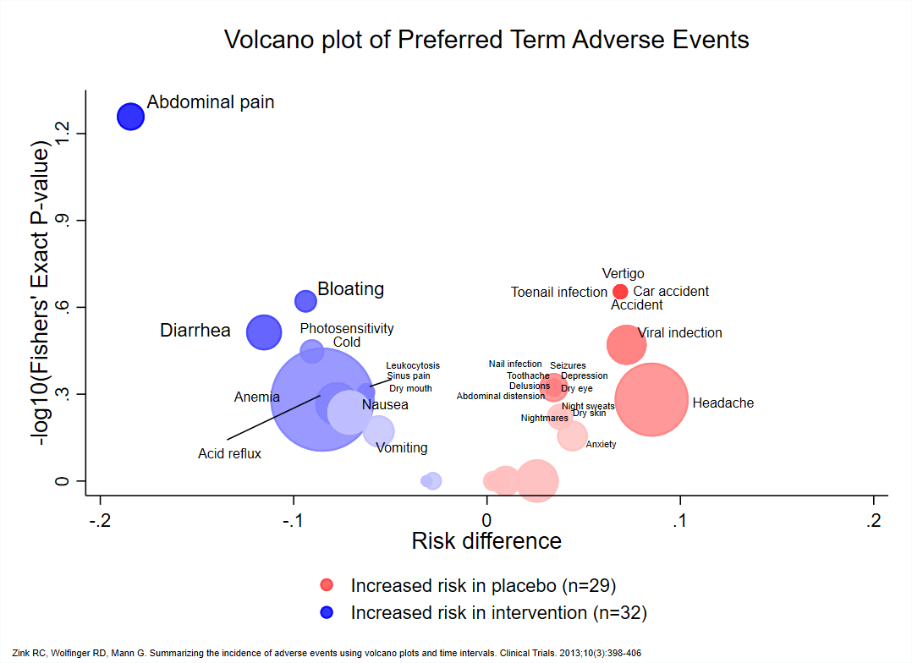

```{r setup, include=FALSE, echo = FALSE,message = FALSE, error = FALSE, warning = FALSE, cache=TRUE}
knitr::opts_chunk$set(echo = TRUE, fig.width = 10, fig.height = 6)

# <!-- ---------------------------------------------------------------------- -->
# <!--                    1. load the required packages                       -->
# <!-- ---------------------------------------------------------------------- --> 
 
packages<-c("tidyverse", "kableExtra","DT","gt","tools","plyr",
            "survival","ggcorrplot","patchwork",
            "Hmisc","clinUtils",
            "gtsummary","inTextSummaryTable","adepro","rtables","tern",
            "ggtext","ggpubr","cowplot","calibrate","plotly","gridExtra","ggthemes",
            "grid","ggdark")

ipak <- function(pkg){
  new.pkg <- pkg[!(pkg %in% installed.packages()[, "Package"])]
  if (length(new.pkg)) 
    install.packages(new.pkg, dependencies = TRUE)
  sapply(pkg, require, character.only = TRUE)
}
ipak(packages)

library(ggh4x)        ## facet_grid2
library(ggbeeswarm)   ## geom_beeswarm
library(ggVennDiagram)## ggVennDiagram

# <!-- ---------------------------------------------------------------------- -->
# <!--                        2. Basic system settings                        -->
# <!-- ---------------------------------------------------------------------- -->
setwd(dirname(rstudioapi::getSourceEditorContext()$path))
getwd()
Sys.setlocale("LC_ALL","English")

 
# <!-- ---------------------------------------------------------------------- -->
# <!--                 3. Load ADaM Datasets and format                       -->
# <!-- ---------------------------------------------------------------------- -->
# load example data
# library(clinUtils)

# load example data
data(dataADaMCDISCP01)

dataAll <- dataADaMCDISCP01
labelVars <- attr(dataAll, "labelVars")
```


# Introduction

Efficacy and safety are two crucial aspects of assessing the risk-benefit ratio of a drug. When a drug's efficacy meets the regulatory requirements, its safety profile must also be within a reasonable range. However, clinical trials sometimes reveal peculiar adverse reactions that attract regulatory attention, such as immune-related adverse events (irAEs) from PD-1/L1 inhibitors, bone damage from BTK inhibitors, and bleeding events from EGFR inhibitors. In such cases, sponsors are often required to conduct more in-depth analyses to clarify the drug’s safety. Based on past clinical trial experiences and literature, here have summarized some analytical methods for adverse events that sponsors and regulatory bodies might require for your reference.

## Incidence

Calculating the incidence rate is a fundamental requirement for AE analysis. This includes overall incidence rates, incidence by preferred terms (PT), standard of care (SOC), and by severity levels, including AEs that lead to drug discontinuation, interruption of treatment, or death.

## Time to Occurrence and Duration

The time from drug administration to the occurrence of an AE and the duration of the AE are two important dimensions of AE analysis. If an AE persists, it indicates that this type of AE tends to last long clinically and may require the sponsor to explain how to manage and ensure safety, especially for AEs of grade 3 or higher, which are of greater concern. The following table displays a common summary format:


*Source: John Shaik et al., PharmaSUG 2016.*

The figure below demonstrates the use of Kaplan-Meier (KM) curves to analyze the occurrence of AEs.
   

*Source: Kriss Harris et al., PhUSE 2017*


## Temporal Distribution of AEs

Analyzing the patterns of AE occurrence over different time periods. For example, although an AE may occur rapidly, it might disappear quickly or be transient, thus having a minimal impact. If a certain type of AE continues throughout the medication period and is of a higher CTCAE grade, it is likely drug-related and clinical considerations for management are necessary.

The following figure shows the distribution over time of three types of AEs in melanoma patients treated with Nivo+Ipi. It can be observed that most skin-related AEs cease to appear after 3 months, and GI and liver-related AEs significantly decrease after 6 months.
   


## Outcome Summary of Adverse Events (AEs)

The outcome of an AE represents whether interventions against the AE are effective. If there is no recovery, the duration of the AE will be prolonged, indicating that effective intervention for this type of AE is challenging.

## Analysis of Factors Influencing AEs

If the AEs in the experimental group are particularly prominent (e.g., significantly more bleeding events or a higher mortality rate in the experimental group compared to controls), regulatory bodies often require an analysis of influencing factors. If clinical influencing factors can be identified, measures can be taken to control them, also indicating that the AEs are predictable.

Sometimes, to reduce the bias due to timing in between-group comparisons, a landmark analysis strategy might be used, which excludes patients who stopped treatment or died prematurely. For example, patients who terminated treatment or died within two months may be excluded.

## Hazard Ratio (HR) of AE Occurrence

This is also a method for analyzing differences in AE characteristics between two groups, using survival analysis to study the hazard ratio of AE occurrence. The figure below shows the risk of irAEs in the Keynote-054 study comparing Drug K with a placebo (HR = 5.0), indicating that the risk of irAEs is significantly higher in the experimental group.


# AE Descriptive Analysis

## Treatment-emergent summary table

```{r,message = FALSE, error = FALSE, warning = FALSE, cache=TRUE}
dataADSL <- subset(dataAll$ADSL, SAFFL == "Y") 

# Filter ADAE for safety and treatment-emergent flags
dataTEAE <- dataAll$ADAE %>%
  filter(SAFFL == "Y", TRTEMFL == "Y") %>%
  mutate(
    TRTA = fct_reorder(TRTA, TRTAN)  # reorder treatment
  )

# Total AE population (only safety flag, not TRTEMFL)
dataTotalAE <- dataAll$ADSL %>%
  filter(SAFFL == "Y") %>%
  mutate(
    TRTA = fct_reorder(TRT01A, TRT01AN)
  )

# TEAE with worst-case scenario by AE severity
dataTEAE <- dataTEAE %>%
  mutate(
    AESEV = factor(AESEV, levels = c("MILD", "MODERATE", "SEVERE")),
    AESEVN = as.numeric(AESEV)
  ) %>%
  group_by(USUBJID, TRTA) %>%
  mutate(
    WORSTINT = if_else(AESEVN == max(AESEVN, na.rm = TRUE), as.character(AESEV), NA_character_)
  ) %>%
  ungroup() %>%
  mutate(
    WORSTINT = factor(WORSTINT, levels = levels(AESEV))
  )


## specify labels for each variable:
varsAE <- c("TRTEMFL", "AESER", "AESDTH", "AEREL")

dataTotalAE <- dataAll$ADSL %>%
  filter(SAFFL == "Y") %>%
  mutate(TRTA = fct_reorder(TRT01A, TRT01AN))

getSummaryStatisticsTable(
  data = dataTEAE,
  colVar = "TRTA",
  var = c("TRTEMFL", "AESER", "WORSTINT", "AESDTH", "AEREL"), 
  varFlag = c("TRTEMFL", "AESER", "AESDTH"),
  varLab = c(TRTEMFL = "Treatment-Emergent", WORSTINT = "Worst-case severity:"),
  varGeneralLab = "Subjects with, n(%):",
  varInclude0 = TRUE,
  varTotalInclude = "WORSTINT",
  stats = getStats('n (%)'),
  emptyValue = "0",
  labelVars = labelVars,
  dataTotal = dataTotalAE,  # <- Use ADSL-based population for N and percentages
  title = tools::toTitleCase("Table: Summary Table of Treatment-emergent Adverse Events (Safety Analysis Set)")
  # file = file.path("tables_CSR", "Table_TEAE_summary.docx")  # optional export
)

```


## TEAE incidence table by SOC and PT

```{r,message = FALSE, error = FALSE, warning = FALSE, cache=TRUE}
dataTEAE <- subset(dataAll$ADAE, SAFFL == "Y" & TRTEMFL == "Y")
  
# order treatment and severity categories
dataTEAE$TRTA <- with(dataTEAE, reorder(TRTA, TRTAN))

## data considered for the total
dataTotalAE <- subset(dataAll$ADSL, SAFFL == "Y")
dataTotalAE$TRTA <- with(dataTotalAE, reorder(TRT01A, TRT01AN))

getSummaryStatisticsTable(
    data = dataTEAE,
    rowVar = c("AESOC", "AEDECOD"),
    colVar = "TRTA",
    ## total
    # data
    dataTotal = dataTotalAE,
    # row total
    rowVarTotalInclude = c("AESOC", "AEDECOD"), rowTotalLab = "Any TEAE",
    stats = getStats("n (%)"),
    labelVars = labelVars,
    rowVarLab = c('AESOC' = "TEAE by SOC and Preferred Term,\nn (%)"),
    # sort rows based on the total column:
    rowOrder = "total", 
    rowOrderTotalFilterFct = function(x) subset(x, TRTA == "Total"),
    title = paste("Table: Treatment-emergent Adverse Events by System Organ Class",
        "and Preferred Term (Safety Analysis Set)"
    )
    # file = file.path("tables_CSR", "Table_TEAE_SOCPT_atLeast1Subject.docx")
)
```


## Events occuring in at least 25% of all subjects


```{r,message = FALSE, error = FALSE, warning = FALSE, cache=TRUE} 
getSummaryStatisticsTable(
    data = dataTEAE,
    rowVar = c("AESOC", "AEDECOD"),
    colVar = "TRTA",
    ## total
    # data
    dataTotal = dataTotalAE, 
    # row total
    rowVarTotalInclude = c("AESOC", "AEDECOD"), rowTotalLab = "Any TEAE",
    stats = getStats("n (%)"),
    labelVars = labelVars,
    rowVarLab = c('AESOC' = "SOC and Preferred Term,\nn (%)"),
    # sort rows based on the total column:
    rowOrder = "total", 
    rowOrderTotalFilterFct = function(x) subset(x, TRTA == "Total"),
    title = paste("Table: Treatment-emergent Adverse Events by System Organ Class",
        "and Preferred Term reported in at least 25% of the subjects",
        "in any treatment group (Safety Analysis Set)"
    ),
    # file = file.path("tables_CSR", "Table_TEAE_SOCPT_atLeast25PercentsSubject.docx"),
    
    # include only events occuring in at least 25% for at least one preferred term:
    filterFct = function(x)
        ddply(x, "AESOC", function(x){ # per AESOC to include the total
            ddply(x, "AEDECOD", function(y){
                yTotal <- subset(y, grepl("Total", TRTA))
                if(any(yTotal$statPercN >= 25)) y
            })
        })
)
```


## TEAE worst-case table


```{r,message = FALSE, error = FALSE, warning = FALSE, cache=TRUE}
# Simple capitalization function
simpleCap <- function(x) {
  str_to_title(tolower(x))
}

# Extract analysis datasets
dataTEAE <- subset(dataAll$ADAE, SAFFL == "Y" & TRTEMFL == "Y")
dataTEAE$TRTA <- with(dataTEAE, reorder(TRTA, TRTAN))

# Total population for percentages (from ADSL)
dataTotalAE <- subset(dataAll$ADSL, SAFFL == "Y")
dataTotalAE$TRTA <- with(dataTotalAE, reorder(TRT01A, TRT01AN))

# Set AE severity levels
dataTEAE$AESEV <- factor(dataTEAE$AESEV, levels = c("MILD", "MODERATE", "SEVERE"))
dataTEAE$AESEVN <- as.numeric(dataTEAE$AESEV)

# Extract worst-case event per subject per AE term
dataAEWC <- ddply(dataTEAE, c("AESOC", "AEDECOD", "USUBJID", "TRTA"), function(x) {
  x[which.max(x$AESEVN), ]
})

# Set WORSTINT with all severity levels included
dataAEWC$WORSTINT <- factor(
  simpleCap(tolower(dataAEWC$AESEV)),
  levels = c("Mild", "Moderate", "Severe")
)
labelVars["WORSTINT"] <- "Worst-case scenario"

# Generate datasets for totals: by AEDECOD and by SOC
dataTotalRow <- list(
  AEDECOD = ddply(dataAEWC, c("AESOC", "USUBJID", "TRTA"), function(x) {
    x[which.max(x$AESEVN), ]
  }),
  AESOC = ddply(dataAEWC, c("USUBJID", "TRTA"), function(x) {
    x[which.max(x$AESEVN), ]
  })
)

# Ensure WORSTINT factor levels are preserved in total rows
dataTotalRow <- lapply(dataTotalRow, function(df) {
  df$WORSTINT <- factor(
    simpleCap(tolower(df$AESEV)),
    levels = c("Mild", "Moderate", "Severe")
  )
  df
})

# Build the table
getSummaryStatisticsTable(
  data = dataAEWC,
  rowVar = c("AESOC", "AEDECOD", "WORSTINT"),
  rowVarInSepCol = "WORSTINT",
  rowVarTotalInclude = c("AESOC", "AEDECOD"),
  dataTotalRow = dataTotalRow,
  rowVarTotalByVar = "WORSTINT",
  rowTotalLab = "Any TEAE",
  rowVarLab = c(
    AESOC = "Subjects with, n(%):",
    WORSTINT = "Worst-case scenario"
  ),
  rowOrder = "total",
  colVar = "TRTA",
  stats = getStats("n (%)"),
  emptyValue = "0",
  labelVars = labelVars,
  dataTotal = dataTotalAE,
  title = tools::toTitleCase(
    paste(
      "Table: Treatment-emergent Adverse",
      "Events by system organ",
      "and preferred term by worst-case (safety Analysis Set)"
    )
  )
  # file = file.path("tables_CSR", "Table_TEAE_Severity.docx")
)

```

# AE Visualization

## Relative Risk/Forest Plot
 
```{r,message = FALSE, error = FALSE, warning = FALSE, cache=TRUE}
load(file = "./01_Datasets/adae.rda")
load(file = "./01_Datasets/adsl.rda")

### Subset the population dataset ADSL on SAFFL safety flag 
### consider only two treatments for comparison.
### convert all the upcase variables in ADSL and ADAE to lower case
adsl2  <- adsl %>% 
  rename_with(tolower) %>%
  filter(saffl=='Y' & trt01a==c('Xan_Hi','Pbo')) %>%         
  select(usubjid,saffl,trt01a)
  
adae2  <- adae %>% rename_with(tolower) 

adsl_cnt2 <- adsl2 %>% 
  group_by(trt01a) %>% 
  dplyr::summarise(bign=n()) %>%
  pivot_wider(names_from = trt01a, values_from = bign) 

### separate variables/macro variable to store those values two treatment counts
adsl_cnt2
pbo <- adsl_cnt2$Pbo
xan <- adsl_cnt2$Xan_Hi 

### Merge the ADSL and ADAE on usubjid variable, keep only the required variables and remove the duplicate records, group by treatment and aedecod. Get the count of each aedecod per treatment and then derive the percentage. While deriving the population we are using the macro variables pbo and xan which has the population bign count.
adsl_adae = inner_join(adsl2,adae2,by=c("usubjid")) %>% 
  select(usubjid,aedecod,trt01a.x)  %>%
  distinct(usubjid,aedecod,trt01a.x) %>% 
  group_by(trt01a.x,aedecod) %>% 
  dplyr::summarise(cnt=n(),.groups = 'drop') %>% 
  ungroup() %>% 
  mutate(pct=ifelse(trt01a.x=='Pbo',cnt/pbo,cnt/xan)) %>% 
  ungroup() %>% 
  arrange(aedecod,trt01a.x) 

### Derive the mean relative risk, lcl and ucl 
adsl_adae2 <- adsl_adae %>% 
  select(-pct) %>% 
  pivot_wider(names_from = c(trt01a.x), values_from = cnt) %>%
  mutate(nb=Pbo, na=Xan_Hi, snb=pbo, sna=xan, a=na/sna,
         b=nb/snb,factor=1.96*sqrt(a*(1-a)/sna + b*(1-b)/snb),
         lcl=a-b-factor,ucl=a-b+factor,mean=0.5*(lcl+ucl)) %>% 
  filter(!is.na(mean)) 


### Plot 1: AE Proportion dot plot
ggplot(adsl_adae %>% filter(aedecod %in% adsl_adae2$aedecod) %>%
         arrange(desc(aedecod)),aes(x=pct,y=reorder(aedecod,desc(aedecod)))) + 
  geom_point(shape = 17,size=2,aes(colour = factor(trt01a.x))) +
  ggtitle("Proportion") +
  xlab('Proportion') + ylab('') +
  scale_colour_manual(values = c("Blue", "Red")) +
  theme(legend.position="bottom") + labs(col="Treatment:") 

### Plot 2: Relative Risk
ggplot(data=adsl_adae2, aes(x=reorder(aedecod,desc(aedecod)), y=mean, ymin=lcl, ymax=ucl)) +
  geom_pointrange() + 
  geom_hline(yintercept=0, lty=2) +  # add a dotted line at x=1 after flip
  coord_flip() +  # flip coordinates (puts labels on y axis)
  xlab("") + ylab("Mean (95% CI)") +
  ggtitle("Risk Difference with 0.95CI") +
  theme(axis.ticks = element_blank(),legend.position="none")


### align the above two images side by side, use the package cowplot.
p2 <- ggplot(data=adsl_adae2, aes(x=reorder(aedecod,desc(aedecod)), y=mean, ymin=lcl, ymax=ucl)) +
  geom_pointrange() + 
  geom_hline(yintercept=0, lty=2) +  # add a dotted line at x=1 after flip
  coord_flip() +  # flip coordinates (puts labels on y axis)
  xlab("") + ylab("Mean (95% CI)") +
  ggtitle("Risk Difference with 0.95CI") +
  theme(axis.text.y = element_blank(),axis.ticks = element_blank(),legend.position="none")

p1 <- ggplot(adsl_adae %>% filter(aedecod %in% adsl_adae2$aedecod) %>% 
         arrange(desc(aedecod)),aes(x=pct,y=reorder(aedecod,desc(aedecod)))) + 
  geom_point(shape = 17,size=2,aes(colour = factor(trt01a.x))) +
  ggtitle("Proportion") +
  xlab('Proportion') + ylab('') +
  scale_colour_manual(values = c("Blue", "Red")) +
  theme(legend.position="bottom") + labs(col="Treatment:")

plot_grid(p1,  p2, labels = "AUTO",nrow = 1,rel_widths = c(0.8, 0.5))
```


## AE Rate and Difference

*The data is an excerpt of the official VAERS data created by US Food and Drug Administration (FDA) and Centers for Disease Control and Prevention (CDC) that may be associated with vaccines.*


## Heat Map

Using a heatmap to display adverse event (AE) co-occurrence can be an effective visual tool in medical research to identify and analyze patterns of symptoms or side effects that frequently appear together.

Heat maps are charts with values being represented by colors. The intensity of the color is an indication of the number i.e.
higher the value more intense will be the color. 
 

**HEAT MAP FOR NUMBER OF ADVERSE EVENTS PER TREATMENT PER SYSTEM ORGAN CLASS (SOC):**

A heat map can be generated to visualize the number of adverse events recorded per SOC per treatment. We will plot the treatments on x-axis and the SOCs on y-axis. Each tile of the heat map will be colored as per the number of events recorded for that particular combination. The color of the tile will vary from yellow to red, with low counts shown in yellow and high counts in red. The tiles with white color denote the absence of events for a particular combination of SOC and treatment. The number of events will be printed in either black or white as per a predefined threshold; counts below or equal to the threshold will be printed in black, remaining will be in white.

In this plot, we are able to see the number of events reported for every SOC for all 5 arms. As seen in the legend, tiles with count less than 100 are yellow with varying intensity as per the actual count for that tile. For e.g. if we check the number of adverse events in the gastrointestinal system for treatments X and Y, the count is 11 and 26 respectively. The color of the tile for Y is deeper than the tile for X. The color starts changing from yellow to orange and then to red as the number of events increases. This is observed in the “Psychiatric” SOC counts, with 31 events Y has a yellow tile, 257 events lead to treatment A having an orange tile and the treatment Z has a red tile due to the 311 events reported. Here the threshold for number of events has been set to 100. We can quickly identify the SOCs with number of events greater than 100 as they are printed in white. We can observe white tiles for SOCs with no events for a particular treatment like Reproductive system and treatment X.


```{r,message = FALSE, error = FALSE, warning = FALSE, cache=TRUE}
# tb1 <-aggregate(USUBJID~TRTA+SOC, data=aeord, FUN=function(x) c(ln=length(x)))
# head(tb1)
# names(tb1)[names(tb1)=="USUBJID"]<- "OBS"

tb1 <- data.frame(
  TRTA = c("Y", "X", "Z", "A", "B", "Y", "X", "B", "A"),
  SOC = c("NERVOUS", "NERVOUS", "PSYCHIATRIC", "PSYCHIATRIC", "PSYCHIATRIC", "PSYCHIATRIC", "PSYCHIATRIC", "RENAL", "RENAL"),
  OBS = c(27, 12, 311, 257, 219, 31, 14, 17, 7)
)

p1 <- ggplot(tb1, (aes(x = TRTA, y = SOC, fill=OBS))) + geom_raster() +
geom_text(aes(label = paste0("N=",round(OBS, 1)), color = OBS < 100),show.legend = F)+
scale_fill_gradient(low="yellow",high="red",na.value="white")+
scale_color_manual(values = c("FALSE" = "white", "TRUE" = "black")) +
scale_x_discrete("Treatment") + scale_y_discrete("System Organ Class") +
 theme_classic()+ggtitle("Heatmap for Number of Adverse Events per Treatment per SOC")+
 theme(plot.title = element_text(hjust = 0.5)) + labs(fill="Number of Events")
p1
```

**HEAT MAP FOR NUMBER OF SERIOUS AND NON SERIOUS ADVERSE EVENTS PER SOC PER TREATMENT**

The adverse events are classified as either ‘Non Serious’ or ‘Serious’. We can plot the number of serious and non serious events occurring per SOC per treatment as shown in the heat map below. In this plot, both the counts will be displayed in the same tile and the color of the tile will be decided by the maximum of the number of events if both events are present.


**HEAT MAP FOR NUMBER OF ADVERSE EVENTS PER TREATMENT PER PREFERRED TERM (PT) FOR A SINGLE SOC**

As mentioned earlier, we can analyze the psychiatric disorders further by generating a heat map of the events reported under this SOC for all treatments. We will generate a heat map of all PTs with number of reported events greater than 10. 


<!-- sub <- subset(aeord,aeord$SOC=="PSYCHIATRIC") -->
<!-- tb4 <-aggregate(USUBJID~TRTA+AEDECOD, data=sub, FUN=function(x) c(ln=length(x))) -->
<!-- names(tb4)[names(tb4)=="USUBJID"]<- "OBS" -->
<!-- p3 <- ggplot(tb4[tb4$OBS>10,], (aes(x = TRTA, y = AEDECOD, fill = OBS))) + geom_raster() + -->
<!-- geom_text(aes(label = paste0("N=",round(OBS, 1)), color = OBS < 40), show.legend = -->
<!-- F,size=4)+ scale_fill_gradient(low="yellow",high="red",na.value="white")+ -->
<!-- scale_color_manual(values = c("FALSE" = "white", "TRUE" = "black")) + -->
<!-- scale_x_discrete("Treatment") + scale_y_discrete(name = "Adverse Event Term") + -->
<!--  theme_classic()+ -->
<!-- ggtitle("Heat Map for Number of Adverse Events per Treatment per Preferred Term for -->
<!-- Psychiatric Disorders") + theme(plot.title = element_text(hjust = 0.5)) + -->
<!--  labs(fill="Number of Events") -->
<!-- p3 -->

```{r,message = FALSE, error = FALSE, warning = FALSE, cache=TRUE}
# tb2 <- aggregate(USUBJID~TRTA+SOC+AESER, data=aeord, FUN=function(x) c(ln=length(x)))
# names(tb2)[names(tb2)=="USUBJID"]<- "OBS"
tb2 <- data.frame(
  TRTA = c("Y", "X", "Z", "A", "B", "Y", "X", "B", "A"),
  SOC = c("NERVOUS", "NERVOUS", "PSYCHIATRIC", "PSYCHIATRIC", "PSYCHIATRIC", "PSYCHIATRIC", "PSYCHIATRIC", "RENAL", "RENAL"),
  AESER = c("Y","Y","N","N","Y","N","Y","N","Y"),
  OBS = c(27, 12, 311, 257, 219, 31, 14, 17, 7)
)

tb3 <-tb2[order(tb2$TRTA, tb2$SOC, tb2$OBS),]
p2 <- ggplot(tb3, aes(TRTA, SOC, fill = OBS)) + geom_raster() +
geom_text(data=tb3[tb3$AESER=="N",],aes(label = paste0("NSER=",round(OBS, 1))),
show.legend = F,size=2.9, vjust=0, hjust=1) +
geom_text(data=tb3[tb3$AESER=="Y",],aes(label = paste0("SER=",round(OBS, 1))),
show.legend = F,size=2.9, vjust=1, hjust=0)+
scale_fill_gradient(low="yellow",high="red",na.value="white")+
scale_x_discrete("Treatment") + scale_y_discrete(name = "System Organ Class") +
theme_classic()+
ggtitle("Heatmap for Number of Serious and Non Serious Adverse Events per SOC per
Treatment") + theme(plot.title = element_text(hjust = 0.5)) + labs(fill="Number of
Events")
p2
```


**HEAT MAP FOR NUMBER OF ADVERSE EVENTS OF PTS OF A SINGLE SOC OF A SINGLE TREATMENT PER SEVERITY**

We can check the severity of all the PTs for a single SOC for a single treatment. Let us analyze the Psychiatric Disorder PTs reported for treatment Z. We will plot the number of events reported for PTs against their severity which will have the value as Mild, Moderate or Severe


<!-- sub1 <- subset(aeord,aeord$SOC=="PSYCHIATRIC" & TRTA=="Z") -->
<!-- tb5 <- aggregate(USUBJID~AEDECOD+AESEV, data=sub1, FUN=function(x) c(ln=length(x))) -->
<!-- names(tb5)[names(tb5)=="USUBJID"]<- "OBS" -->
<!-- p4 <- ggplot(tb5, aes(AESEV, AEDECOD, fill = OBS)) + geom_raster() + -->
<!-- geom_text(aes(label=paste0("N=",round(OBS,1)),color=OBS<10), show.legend = F,size=3)+ -->
<!-- scale_fill_gradient(low="yellow",high="red",na.value="white")+ -->
<!-- scale_color_manual(values = c("FALSE" = "white", "TRUE" = "black")) + -->
<!-- scale_x_discrete("Severity") + scale_y_discrete(name = "Adverse Event Term") + -->
<!-- theme_classic()+ ggtitle("Heat Map for Number of Adverse Events of PTs of Psychiatric -->
<!-- Disorders of Treatment Z per Severity") + theme(plot.title = element_text(hjust = -->
<!-- 0.5)) + labs(fill="Number of Events") -->
<!-- p4 -->

**HEAT MAP FOR NUMBER OF RELATED AND NOT RELATED ADVERSE EVENTS PER PT PER SEVERITY FOR A SINGLE TREATMENT**

We can check the causality of the events reported in the above plot along with their severity. Let us once again consider the psychiatry PTs reported for treatment Z. We will plot the number of events reported for PTs with their causality which will have values as ‘Related’ or ‘Not Related’ against severity


<!-- tb6 <- aggregate(USUBJID~AEDECOD+AESEV+AEREL, data=sub1, FUN=function(x) c(ln=length(x))) -->
<!-- names(tb6)[names(tb6)=="USUBJID"]<- "OBS" -->
<!-- tb6 <-tb6[order(tb6$AEDECOD,tb6$AESEV, tb6$OBS),] -->
<!-- p5 <- ggplot(tb6, aes(AESEV, AEDECOD, fill = OBS)) + geom_raster() + -->
<!-- geom_text(data=tb6[tb6$AEREL=="NOT RELATED",],aes(label=paste0("NREL=",round(OBS,1))), -->
<!-- show.legend = F,size=2.8, vjust=0, hjust=1) + -->
<!-- geom_text(data=tb6[tb6$AEREL=="RELATED",],aes(label = paste0("REL=",round(OBS, 1))), -->
<!-- show.legend = F,size=2.8, vjust=1, hjust=0)+ -->
<!-- scale_fill_gradient(low="yellow",high="red",na.value="white")+ -->
<!-- scale_x_discrete("Severity") + scale_y_discrete(name = "Adverse Event Term") + -->
<!-- theme_classic()+ -->
<!-- ggtitle("Heat Map for Number of Related and Not Related Adverse Events per PT per -->
<!-- Severity for Psychiatric Disorders of Treatment Z") + theme(plot.title = -->
<!-- element_text(hjust = 0.5)) + labs(fill="Number of Events") -->
<!-- p5 -->


*Source: https://www.lexjansen.com/phuse/2018/dv/DV11.pdf*

 
 
## Volcano Plot

A volcano plot is a type of scatter-plot that is used to quickly identify changes in large data sets composed of replicate data. It plots significance versus fold-change on the y and x axes, respectively. It is constructed by plotting the negative log of the p value on the y axis (usually base 10). This results in data points with low p values (highly significant) appearing toward the top of the plot. The x axis is the log of the fold change between the two conditions. The log of the fold change is used so that changes in both directions appear equidistant from the center. In the clinical domain, a volcano plot is used to view Risk Difference (RD), Relative Risk or Odds Ratio of AE occurrence between the treatment groups by preferred term.





**VOLCANO PLOT OF TREATMENT EMERGENT ADVERSE EVENT AT PT LEVEL**

Volcano plots are also generated on the same data which is used for heat maps. Here, we have plotted negative log10-transformed p-value calculated using Fisher exact test on Y-axis and Log2-transformed relative risk on x-axis.

The dashed red line on y-axis shows where p = 0.05 with points above the line having p < 0.05 and points below the line having p > 0.05. Note that smaller the p-value larger is the number on y-axis. For this graph, we have labeled the AE terms with p-values < 0.05 as they are significant.


```{r,message = FALSE, error = FALSE, warning = FALSE, cache=TRUE}
# Set the seed for reproducibility
set.seed(123)

# Create a data frame with synthetic data
total <- data.frame(
  AETERM = c("NECK SHOULDER PAIN", "SINUSITIS", "DECREASED APPETITE", "DRY MOUTH", "UPPER RESPIRATORY INFECTION",
             "COLD SYMPTOMS", "DRYNESS IN MOUTH", "WEIGHT GAIN", "HYPERHIDROSIS", "INCREASED IRRITABILITY",
             "INCREASED THIRST", "LOWER BACK PAIN", "NUMBNESS (BOTH HANDS)"),
  rr = runif(13, 0.1, 6),  # Uniform distribution between 0.01 and 6
  log2rr = log(runif(13, 0.1, 6), 2),  # Normal distribution with mean -3 and sd 1
  p = runif(13, 0.0001, 0.1),  # Uniform distribution for p-values
  Total = sample(2:50, 13, replace = TRUE),  # Random sampling for total count
  term = c(NA, NA, "DECREASED APPETITE", "DRY MOUTH", NA, NA, NA, NA, NA, NA, NA, NA, NA)
) 

total %>%
  kable(caption = "DATA SNIPPET", format = "html") %>%
  kable_styling(latex_options = "striped")

#Make a basic volcano plot
with(total, plot(log2rr, -log10(p), pch=20, main="Volcano Plots of Treatment Emergent Adverse
Events at PT Level", xlim=c(-8.5,8), abline(h = 1.3, col="red", lty=2), xlab="Log2 (Relative
Risk)", ylab="-Log10 (p-value)"))
#Add colored points: red if padj<0.05, orange of log2rr>1, green if both)
with(subset(total, p<.05 ), points(log2rr, -log10(p), pch=20, col="red"))
with(subset(total, abs(log2rr)>1), points(log2rr, -log10(p), pch=20, col="orange"))
with(subset(total, p<.05 & abs(log2rr)>1), points(log2rr, -log10(p), pch=20, col="green"))

#Label points with the textxy function from the calibrate plot
with(subset(total, p<.05 & abs(log2rr)>1), textxy(log2rr, -log10(p), labs=AETERM, cex=.7))
```


## Bubble Plot

**BUBBLE PLOT OF -LOG10 (P-VALUE) BY RELATIVE RISK SIZED BY COUNTS**

The x-axis represents the log2 relative risk and y-axis represents the –log10 p-values computed using the fisher exact test. Each bubble represents an adverse event, with bubble size indicative of the total number of adverse events that occur for both treatments combined. Specifically, the bubble area is proportional to the total number of events.

Log2 (Relative Risk) of 0 represents no difference in risk between the 2 treatment groups, while bubbles to the right indicate a higher risk for subjects in treatment group Y (i.e. – If Log2 (RR) = 1, that is the same as an RR=2), and bubbles to the left indicate a higher risk for subjects in treatment group Z. Color, green and blue helps to emphasize adverse events that are more common for treatment Y or Z, respectively. The size of the bubble represents the total number of occurrences of the AE of interest. Names of events with total number of occurrences greater than 10 are displayed.

```{r,message = FALSE, error = FALSE, warning = FALSE, cache=TRUE}
p <-plot_ly(total, x = ~ log2rr, y = ~ -log10(p), text = ~ AETERM, type = 'scatter', mode =
'markers', color=~ log2rr, colors=c("blue","green") , marker = list(size = ~ Total, opacity =
0.9)) %>%
layout(title = 'Bubble Plot Treatment Emergent Adverse Event of Significance versus Relative
Risk', xaxis = list(showgrid = FALSE, title = 'Log2 (Relative Risk)'), yaxis = list(showgrid
= FALSE, title = '-Log10 (p-value)')) %>%
add_annotations(x = total$log2rr, y = total$p1, text = total$term, xref = "x", yref = "y",
 showarrow = FALSE, font = list(size = 10))
p
```


## Tendril Plot

The Tendril plot concept is illustrated using the preferred term of Back Pain. Events on placebo tilt the tendril to the right and events on active tilt the tendril to the left.
In this illustrative plot, events are colored by treatment arm; yellow and brown circles for placebo and active arm, respectively. The distance between points are proportional to time between events.


[Tendril Plot Shiny App](https://steve-mallett.shinyapps.io/TendrilPlot/)

This tendril plot provides a visual comparison of System Organ Class Adverse Events (AEs) between a placebo group and an intervention group in a clinical study. Each tendril represents a different category of AEs, such as gastrointestinal or neurological, differentiated by color. The plot's horizontal axis divides the two study groups, while the vertical axis indicates the progression of the study, though specific time units are not provided.

In the plot, the length and direction of each tendril illustrate the incidence and progression of AEs in each category relative to the treatment group. For example, lines extending significantly toward the intervention side indicate a higher occurrence of AEs in that group compared to placebo. This visual tool is effective for quickly assessing the safety profile and identifying the most prevalent adverse events in each treatment group during the study.


```{r,message = FALSE, error = FALSE, warning = FALSE, cache=TRUE}
# packages
pacman::p_load(tidyverse, rio)
pacman::p_load(lubridate)
pacman::p_load(labelled)
pacman::p_load(Tendril)
pacman::p_load(ggtext)
pacman::p_load(colorspace)

# import
ae <- read_csv("./01_Datasets/2020-08-12_ae_example_dataset.csv") %>% 
  mutate(rando_date = ymd(rando_date),
         aestdat = ymd(aestdat),
         aeeddat = ymd(aeeddat)) %>% 
  mutate(day = as.numeric(aestdat - rando_date)) %>% 
  as.data.frame()

# Fixed mistake in subject 2011
ae[ae$usubjid == "2011", "arm"] <- "Intervention"

# add labels
var_label(ae) <- list(
  usubjid = "unique subject identifier",
  arm = "treatment assignment name",
  armn = "treatment assignment numeric (0: placebo; 1:intervention)",
  rando_date = "date of randomisation (yyyymmdd)",
  repeatnum = "unique event identifier within usubjid",
  aept = "adverse event code at preferred term/lower level",
  aebodsys = "adverse event code at body system/higher level",
  aesev = "adverse event severity grade (mild, moderate, severe)",
  aesevn = "adverse event severity grade number (1: mild, 2: moderate, 3: severe)",
  aeser = "serious adverse event (no, yes)",
  aesern = "serious adverse event (0: no, 1: yes)",
  aestdat = "adverse event start date (yyyymmdd)",
  aeeddat = "adverse event end date (yyyymmdd)",
  dur = "adverse event duration (days)")
 

# Tendril
subj <- ae %>%
  dplyr::count(usubjid, arm) %>% 
  #add_row(usubjid = 3000, arm = "Intervention", n = 0) %>% 
  #add_row(usubjid = 3001, arm = "Placebo",      n = 0) %>%
  select(-n) %>% 
  as.data.frame()

pt <- Tendril(mydata = ae,
              rotations = rep(3, nrow(ae)),
              AEfreqThreshold = 5,
              Tag = "Comment",
              Treatments = c("Intervention", "Placebo"),
              Unique.Subject.Identifier = "usubjid",
              Terms = "aebodsys",
              #Terms = "aept",
              Treat = "arm",
              StartDay = "day",
              # SubjList = subj,
              # SubjList.subject = "usubjid",
              # SubjList.treatment = "arm",
              # filter_double_events = TRUE
)

# working with terms 
Terms <- pt$data %>% 
  dplyr::group_by(Terms) %>% 
  dplyr::summarise(n = n(), x = x[n]) %>% 
  dplyr::ungroup() %>% 
  arrange(x) %>% 
  mutate(text = str_glue("{Terms} (n={n})")) 

# Reorder guides
pt$data$Terms <- fct_relevel(pt$data$Terms,
                             Terms %>% 
                               pull(Terms) %>% 
                               as.vector()
)

levels(pt$data$Terms) <- Terms %>% pull(text) %>% as.vector()

# plot Results
plot(pt) +
  geom_point(alpha = 0.25) +
  geom_path(alpha = 0.25) +
  geom_vline(xintercept = 0, color = 'gray50', linetype = "dashed") +
  geom_hline(yintercept = 0, color = 'gray50', linetype = "dashed") +
  #scale_color_brewer(type = "qual", palette = "Set1") +
  scale_color_discrete_qualitative(palette = "Dark3")+
  scale_x_continuous(limits = c(-100, 200)) +
  labs(title = "**Tendril Plot** of System Organ Class Adverse Events (AE) having at least 5 incidences",
       # caption ="The Tendril Plot: a novel visual summary of the incidence, significance and temporal aspects of AE in clinical trials (JAMIA 2018; 25(8): 1069-1073)"
       caption = 
       "Each MedDRA adverse event code at body system/higher level is
       represented by a line (tendril) and each point is an event. Since time runs
       along each tendril, it is the shape that carries the important information,
       rather than the x and y coordinates. An event on the Intervention treatment
       arm will tilt tendril direction to the *right*, and an event on the placebo arm will
       tilt tendril direction to the *left*.
       <br>
       *The Tendril Plot: a novel visual summary of the incidence, significance and temporal aspects of AE in clinical trials (JAMIA 2018; 25(8): 1069-1073)*"
       ) +
  guides(color = guide_legend(title = "AE at Body System")) +
  theme(aspect.ratio = 0.70,
        plot.title = element_markdown(),
        plot.caption = element_textbox_simple(
          size = 8,
          lineheight = 1,
          hjust = 0, vjust = 1,
          padding = margin(1, 1, 1, 1),
          margin = margin(1, 1, 1, 1)
        ),
        plot.caption.position = "plot",
        legend.position       = c(0.99,0.92),
        legend.justification  = c(1,1),
        legend.background     = element_rect(fill  = 'gray90'),
        legend.key            = element_rect(fill  = 'gray90'))

# ggsave("./tendril_plot.png",
#        width = 7.5, height = 6, units = "in")
```


## Double Dot Plot 


```{r,message = FALSE, error = FALSE, warning = FALSE, cache=TRUE}
# Simulating data
set.seed(123)
data <- data.frame(
  Category = c("Social circumstances", "Immune system disorders", "Endocrine disorders",
               "Neoplasms benign, malignant and unspecified (incl cysts and polyps)", 
               "Ear and labyrinth disorders", "General disorders and administration site conditions",
               "Injury, poisoning and procedural complications", "Investigations", "Nervous system disorders",
               "Metabolism and nutrition disorders", "Vascular disorders", "Renal and urinary disorders",
               "Infections and infestations", "Musculoskeletal and connective tissue disorders",
               "Skin and subcutaneous tissue disorders", "Pregnancy, puerperium and perinatal conditions",
               "Congenital, familial and genetic disorders", "Gastrointestinal disorders", "Eye disorders",
               "Respiratory, thoracic and mediastinal disorders", "Reproductive system and breast disorders",
               "Cardiac disorders", "Hepatobiliary disorders", "Psychiatric disorders", "Surgical and medical procedures"),
  Proportion = runif(25, 0.01, 0.04),
  Proportion2 = runif(25, 0.01, 0.04),
  RelativeRisk = runif(25, 0.5, 2),
  LowerCI = runif(25, 0.1, 1.5),
  UpperCI = runif(25, 1.5, 3),
  Pvalue = runif(25, 0.001, 1)
)

data$Significant <- ifelse(data$Pvalue < 0.05, "red", "black")


double_dot_plot <- ggplot(data, aes(x = Category)) +
  geom_point(aes(y = Proportion), color = "blue", size = 3) +
  geom_point(aes(y = Proportion2), color = "red", size = 3) +
  coord_flip() +
  scale_y_continuous(labels = scales::percent_format(), breaks = seq(0, 0.04, by = 0.01)) +
  labs(y = "Proportion", x = NULL, title = "Double Dot Plot") +
  theme_minimal()

risk_plot <- ggplot(data, aes(x = Category, y = RelativeRisk)) +
  geom_pointrange(aes(ymin = LowerCI, ymax = UpperCI), size = 0.5) +
  geom_text(aes(label = sprintf("%.3f", Pvalue), color = Significant), hjust = 1.5, size = 3) +
  coord_flip() +
  scale_y_log10(breaks = c(0.1, 0.5, 1, 2, 10), labels = scales::trans_format("log10", scales::math_format(10^.x))) +
  labs(y = "Relative Risk with 95% CI", x = NULL, title = "Relative Risk Plot") +
  theme_minimal() +
  theme(axis.text.y = element_blank(), axis.ticks.y = element_blank(), axis.title.y = element_blank()) +
  scale_color_identity()

grid.arrange(double_dot_plot, risk_plot, ncol = 2)

```


## Triangles Plot

This visualisation has been submitted as an html file and can be found [here](https://vis-sig.github.io/blog/posts/2020-10-17-wonderful-wednesdays-september-2020/).


The above visualization is based on clinical trial data for an active treatment for eczema compared to placebo in adolescents that are unresponsive to standard care.

An analysis revealed that more adverse events were recorded for subjects that were assigned to an intervention treatment arm, compared to those assigned to a placebo.


## Pie Chart

This visualisation has been submitted as an html file and can be found [here](https://vis-sig.github.io/blog/posts/2020-10-17-wonderful-wednesdays-september-2020/).


## Boxplot for Duration AEs


Subjects assigned to placebo treatment arm that reported an adverse event had their event treated in a duration of 6 days, on average. Participants assigned to interevention treatment, on average, saw the end of their adverse event in 8 days.

 

## Disease Incidence Heatmap

The purpose of creating this visualization is to explore and illustrate patterns in disease incidence across the United States from 1928 to 2000, focusing on diseases like measles, polio, and rubella. The visualization aims to answer key questions: How has the incidence rate of each disease changed over time? How does incidence vary across different states? And, importantly, what impact did vaccination have on disease incidence rates? 

```{r,message = FALSE, error = FALSE, warning = FALSE, cache=TRUE}
df <- read.csv("./01_Datasets/US_state_epi_vaccines.csv")

# Records of the year for which each vaccine was introduced
vac_dat <- data.frame(disease = c("MEASLES", "POLIO", "RUBELLA"), 
                      Z = c(1963, 1955, 1969))

df %>%
  na.omit() %>%
  ggplot() +
  geom_tile(aes(x = year, y = state, fill = incidence)) +
  scale_fill_gradient2(trans = "log10", high = "red", low = "blue", 
                       mid = "white", midpoint = 0, na.value = "white") +
  scale_x_continuous(expand = c(0.02, 0.02)) +
  geom_vline(data = vac_dat, aes(xintercept = Z), linewidth = 1.5, color = "darkred") +
  facet_wrap(~disease, scales = "free") +
  dark_theme_minimal() +
  theme(axis.text.y =  element_text(size = 5), 
        plot.title = element_text(hjust = 0.5, size = 16)) +
  labs(y = "State", fill = "Log \nIncidence", x = "Year", 
       title = "Visulaizing Effect of Vaccines",
       caption = "Dark Red Line Indicates Introduction of Vaccine")
```


```{r,message = FALSE, error = FALSE, warning = FALSE, cache=TRUE} 
inc <- read.csv("./01_Datasets/US_state_epi_vaccines.csv")

measles <- inc %>%
  filter(disease == "MEASLES") %>%
  mutate(inc_cat = cut(incidence, c(0, 200, 400, 600, 800, 1000, 1200, Inf))) %>%
  mutate(inc_fac = factor(inc_cat)) 

ggplot(data=measles) +
  geom_tile(aes(x=year, y=state, fill=inc_fac), color="gray") +
  scale_x_continuous("Year", breaks=seq(1930, 2010, by=10), limits = c(1928, 2000)) +
  scale_y_discrete("State", limits=rev) +
  geom_vline(xintercept = 1963, size = 1, color = "#d7191c") +
  scale_fill_brewer("Incidence\nPer\n100,0000\nPopulation", 
                    labels=c("0-<200", "200-<400", "400-<600", "600-<800", "800-<1000", "1000-<1200", ">=1200"),
                    na.value = 'white',
                    na.translate = F) +
  labs (title ="Incidence of measles in US states declines after <b style='color:#d7191c;'>vaccine approval</b>")+
  theme_minimal() +
  theme(legend.title.align = 0.5,
        axis.text.x = element_text(size = 12, color = "#525252"),
        axis.text.y = element_text(size = 8, color = "#525252"),
        axis.line.y = element_blank(),
        axis.ticks.y = element_blank(),
        panel.grid.major = element_blank(),
        plot.title = element_markdown())
```

## Violin plot on onset and resolution

```{r,message = FALSE, error = FALSE, warning = FALSE, cache=TRUE}
## Load the packages -----------------
# library(tidyverse)
# library(survival)
# library(ggcorrplot)
# library(patchwork)

options(warn = 0)

mytheme <- function() {
  list(
    theme_minimal(),
    theme(
      plot.title = element_text(size = 16),
      axis.title = element_text(size = 12),
      axis.text = element_text(size = 10),
      legend.text = element_text(size = 10),
      legend.title = element_text(size = 12)
    )
  )
}

## Read data---------

adae <- read.csv("./01_Datasets/DummyAEData.csv") %>%
  select(-X) %>%
  filter(SAFFL == "Y")

# total
length(unique(adae$USUBJID))
summary(adae)
head(adae)

## Summary table------------

adae_n_arm <- adae %>%
  group_by(ARMCD) %>%
  summarise(n_arm = n_distinct(USUBJID))

adae_n_soc <- adae %>%
  group_by(AESOC) %>%
  summarise(n_soc = n_distinct(USUBJID))

adae_n_pt <- adae %>%
  group_by(AETERM) %>%
  summarise(n_pt = n_distinct(USUBJID))

## Visual-----------

### SOC by PT-------------------
(adae_soc_pt <- adae %>%
  group_by(ARMCD, AESOC, AETERM) %>%
  summarise(n_pt = n_distinct(USUBJID)) %>%
  right_join(adae_n_arm) %>%
  group_by(AETERM) %>%
  mutate(n_all = sum(n_pt)) %>%
  ungroup() %>%
  mutate(n_pt = ifelse(ARMCD == "ARM B", -n_pt, n_pt)))


### tte--------------

(adae_tte <- adae %>%
  select(USUBJID, ARMCD, AESOC, AETERM, AETOXGR, ASTDY, AENDY) %>%
  arrange(USUBJID, ARMCD, AESOC, AETERM, AETOXGR) %>%
  mutate(event = 1))

adae_tte_counts <- adae_tte %>%
  group_by(AESOC, ARMCD) %>%
  summarise(n = n()) %>%
  ungroup()

adae_tte_g3_counts <- adae_tte %>%
  filter(AETOXGR >= 3) %>%
  group_by(AESOC, ARMCD) %>%
  summarise(n = n()) %>%
  ungroup()

(adae_tte_subject <-
  adae_tte %>%
  group_by(ARMCD, USUBJID) %>%
  mutate(
    any_AE = ifelse(n() > 0, 1, 0),
    time_to_onset_any_AE = ifelse(n() > 0, min(ASTDY), Inf),
    time_to_stop_any_AE = ifelse(n() > 0, max(ASTDY), Inf)
  ) %>%
  group_by(AESOC, ARMCD) %>%
  mutate(n = n_distinct(USUBJID)) %>%
  ungroup())

(p1 <- adae_tte %>%
  ggplot() +
  geom_violin(aes(x = AESOC, y = ASTDY, fill = ARMCD),
    scale = "count"
  ) +
  labs(
    title = "AE onset by SOC",
    x = "SOC",
    y = "Time from first dose (days)"
  ) +
  geom_text(
    data = adae_tte_counts,
    aes(
      x = AESOC, y = -40, label = paste0("N=", n),
      group = ARMCD
    ),
    position = position_dodge(width = 0.75),
    size = 3
  ) +
  scale_y_continuous(limits = c(-50, 1200)) +
  mytheme() +
  coord_flip())

(p2 <- adae_tte %>%
  ggplot() +
  geom_violin(aes(x = AESOC, y = AENDY - ASTDY + 1, fill = ARMCD),
    scale = "count"
  ) +
  labs(
    title = "AE resolution by SOC",
    x = "SOC",
    y = "Time since AE onset (days)"
  ) +
  geom_text(
    data = adae_tte_counts,
    aes(
      x = AESOC, y = -40, label = paste0("N=", n),
      group = ARMCD
    ),
    position = position_dodge(width = 0.75),
    size = 3
  ) +
  scale_y_continuous(limits = c(-50, 1200)) +
  mytheme() +
  coord_flip())

(p3 <- adae_tte %>%
  filter(AETOXGR >= 3) %>%
  ggplot() +
  geom_violin(aes(x = AESOC, y = ASTDY, fill = ARMCD),
    scale = "count"
  ) +
  labs(
    title = "AE onset by SOC (Grade >=3)",
    x = "SOC",
    y = "Time from first dose (days)"
  ) +
  geom_text(
    data = adae_tte_g3_counts,
    aes(
      x = AESOC, y = -40, label = paste0("N=", n),
      group = ARMCD
    ),
    position = position_dodge(width = 0.75),
    size = 3
  ) +
  scale_y_continuous(limits = c(-50, 1200)) +
  mytheme() +
  coord_flip())

(p4 <- adae_tte %>%
  filter(AETOXGR >= 3) %>%
  ggplot() +
  geom_violin(aes(x = AESOC, y = AENDY - ASTDY + 1, fill = ARMCD),
    scale = "count"
  ) +
  labs(
    title = "AE resolution by SOC (Grade >=3)",
    x = "SOC",
    y = "Time since AE onset (days)"
  ) +
  geom_text(
    data = adae_tte_g3_counts,
    aes(
      x = AESOC, y = -40, label = paste0("N=", n),
      group = ARMCD
    ),
    position = position_dodge(width = 0.75),
    size = 3
  ) +
  scale_y_continuous(limits = c(-50, 1200)) +
  mytheme() +
  coord_flip())

(combined_p <- (p1 | p2) / (p3 | p4) + plot_layout(guides = "collect"))

# tiff("adae_tte.tiff", units = "in", width = 13, height = 7, res = 300)
print(combined_p)
# dev.off()
```

## Bar Chat

Example from [PSI Webinar](https://vis-sig.github.io/blog/posts/2025-02-12-wonderful-wednesday-february-2025/#example6%20code)

### Data Prepared

```{r,message = FALSE, error = FALSE, warning = FALSE, cache=TRUE}
## Load the packages -----------------
# library(tidyverse)
# library(survival)
# library(ggcorrplot)
# library(patchwork)

options(warn = 0)

mytheme <- function() {
  list(
    theme_minimal(),
    theme(
      plot.title = element_text(size = 16),
      axis.title = element_text(size = 12),
      axis.text = element_text(size = 10),
      legend.text = element_text(size = 10),
      legend.title = element_text(size = 12)
    )
  )
}

## Read data---------

dummyAEData <- read.csv("./01_Datasets/DummyAEData.csv")  

# Identify columns containing duplicated information (the same values in same rows)
singleValCols <- 
  dummyAEData %>%
    apply(., 2, function(x) unique(x) %>% 
    length) %>% .[as.numeric(.)==1] %>% names
# singleValCols
# [1] "STUDYID"  "AGEU"     "ITTFL"    "SAFFL"    "TRTEMFL"  "SMQ02NAM" "SMQ02SC" 

# Identify columns comprised of NAs 
naCols <- 
  dummyAEData %>% 
    apply(., 2, function(x) unlist(x) %>% {!is.na(.)} %>% 
    sum == 0) %>% .[as.numeric(.)==1] %>% names
# naCols
#[1] "SMQ02NAM" "SMQ02SC" 

# Start generating a data subset with "interesting" columns only
dummyAEData_ed <- 
  dummyAEData %>% 
    select(
      !all_of(c(singleValCols, naCols) ) 
      )

# Remove other columns with no patient-specific information
dummyAEData_ed <-
  dummyAEData_ed %>% 
  select(!X)


## Remove columns with redundant information

# Function for flagging redundant columns
check_redundant_columns <- 
  function(data) {
    pairs <- combn(names(data), 2) %>% t
    redundant <- 
      combn(names(data), 2, function(cols) {
        col1 <- data[[cols[1]]]
        col2 <- data[[cols[2]]]
        if (is.factor(col1)) col1 <- as.character(col1)        # converts variables that are factors to character
        if (is.factor(col2)) col2 <- as.character(col2)
        if (is.numeric(col1) && is.numeric(col2)) {
          all(
            (is.na(col1) & is.na(col2)) |                      # both NA or floating point near equality for numeric columns
            (!is.na(col1) & !is.na(col2) & dplyr::near(col1, col2)) 
            )
          } else {
          all(
            (is.na(col1) & is.na(col2)) |                      # both NA or exact equality for non-numeric columns
            (!is.na(col1) & !is.na(col2) & col1 == col2)
          )
        }
      }
    )
    data.frame(Pairs = pairs, Redundant = redundant) %>% 
    filter(Redundant== TRUE) %>% 
    filter(Pairs.1 %in% setdiff(.$Pairs.1, .$Pairs.2))  %>%  
    with(., table(Pairs.1, Pairs.2)) %>% 
    { lapply(1:nrow(.), function(i) 
      c(rownames(.)[i],
      colnames(.)[.[i,] == 1]
      )
    )
    } %>% unname()
  }
# Note: if no redundant columns are found this function will generate: 
# Error in `[.default`(., i, ) : subscript out of bounds
# Called from: NextMethod()

# Check for identical columns (will not identify redundant columns if values are coded differently)
redundant_columns <- dummyAEData_ed %>% check_redundant_columns() 
#redundant_columns
#[[1]][1] "ARM"    "ACTARM" "TRT01A" "TRT01P"
#[[2]][1] "ARMCD"    "ACTARMCD"
#[[3]][1] "ASEQ"  "AESEQ"
#[[4]][1] "EOSSTT" "EOTSTT"
#[[5]][1] "TRT01EDTM" "AP01EDTM"  "AP02SDTM"  "TRT02SDTM"
#[[6]][1] "TRTEDTM"   "AP02EDTM"  "TRT02EDTM"
#[[7]][1] "TRTSDTM"   "AP01SDTM"  "TRT01SDTM"


# Selection of non-redundant variables
# TRT01A: actual initial treatment (other variables refer to planned treatment)
# ACTARMCD: "a value for an Actual Arm Code (ACTARMCD) variable is expected to be equal to a value of an Arm Code (ARMCD) variable"(FDAC197 / SD2236)
# AESEQ: name indicates relation to AEs, which we are specifically interested in
# EOTSTT: end of treatment and end of study status seem identical in this data set, kept name referring to treatment
# TRTSDTM: datetime of First Exposure to Treatment
# TRT01EDTM: datetime of Last Exposure in Period 01 (identical to TRT02SDTM: Datetime of First Exposure to Treatment in Period 02)
# TRT02EDTM: datetime of Last Exposure in Period 02
selected_columns <- c("TRT01A", "ACTARMCD", "AESEQ", "EOTSTT", "TRTSDTM", "TRT01EDTM", "TRT02EDTM")

dummyAEData_ed <- 
  dummyAEData_ed %>% 
  select(
    !setdiff(
      unlist(redundant_columns), 
      selected_columns
      ) 
    )


## Remove columns with redundant information masked by different codings

# Inspect adverse event variables
# dummyAEData_ed %>% .[ ,grep("AE", names(.))] %>% head()

# Unify coding of potentially redundant variables
dummyAEData_ed <- 
  dummyAEData_ed %>% 
  mutate(
    AETERM = gsub("trm ", "", AETERM),                 # adverse event variables
    AELLT = gsub("llt ", "", AELLT),
    AEDECOD = gsub("dcd ", "", AEDECOD),
    AEHLT = gsub("hlt ", "", AEHLT),
    AEHLGT = gsub("hlgt ", "", AEHLGT),
    AEBODSYS = gsub("cl ", "", AEBODSYS),
    AESOC = gsub("cl ", "", AESOC),
    ACTARMCD = case_when(                              # treatment group
      ACTARMCD == "ARM A" ~ "Drug X",
      ACTARMCD == "ARM B" ~ "Placebo"
      ),
    across(c(TRT01A, TRT02P, TRT02A), 
      function(x) gsub("^[AB]: ", "", x)
      ),
    SMQ01SC = case_when(
      SMQ01NAM == "C.1.1.1.3/B.2.2.3.1 AESI" ~ "C.1.1.1.3/B.2.2.3.1 AESI",
      is.na(SMQ01NAM) ~ NA
      )
    )

# dummyAEData_ed %>% check_redundant_columns()
#[1]][1] "ACTARMCD" "TRT01A"  
#[[2]][1] "AETERM"  "AEDECOD" "AELLT"
#[[3]][1] "SMQ01NAM" "SMQ01SC"

# Selection of non-redundant variables, merging of 1st and 2nd treatment variables into a single cross-over group variable
# TRT01A: Actual initial treatment 
# AEDECOD: also called preferred term, restricted to a single medical concept
dummyAEData_ed <- 
  dummyAEData_ed %>% 
  select(!c(ACTARMCD, AETERM, AELLT, SMQ01SC) ) %>% 
  rowwise() %>% 
  mutate(
    Group = paste(TRT01A, "-", TRT02A),
    .keep = "unused"
    )

# Remove additional columns with information included in other columns
dummyAEData_ed <- 
  dummyAEData_ed %>% 
  select(!c(USUBJID, INVID, INVNAM) )    # covered by SITEID and SUBJID 


## Generate some categorical variables and ordered factors

dummyAEData_ed <- 
  dummyAEData_ed %>% 
  mutate(
    AESEV = factor(                                    
      AESEV, levels = c("MILD", "MODERATE", "SEVERE")
      ),
    BMRKR2 = factor(
      BMRKR2, levels = c("HIGH", "MEDIUM", "LOW")
      ),
    Group = factor(
      Group, 
      levels = c(
        "Placebo - Placebo", 
        "Drug X - Placebo", 
        "Placebo - Drug X", 
        "Drug X - Drug X"
        )
      ),
    AEREL = case_when (
      AEREL == "Y" ~ "Drug-related", 
      AEREL == "N" ~ "Not drug-related"
      ),
    AEREL = factor(
      AEREL, 
      levels = c("Drug-related", "Not drug-related")
      ),
    AESER = factor(
      AESER, 
      levels = c("Y", "N")
      ),
    AESEV_2 = case_when(
      AESEV == "SEVERE" ~ "Severe",
      AESEV %in% c("MILD", "MODERATE") ~ "Mild-moderate"
      ),
      .keep = "unused",
    AESEV_2 = factor(AESEV_2, 
      levels = c("Severe", "Mild-moderate")
      ),
    SEX = factor(
      SEX, 
      levels = c("F", "M")),
    RACE = case_when(
      RACE == "NATIVE HAWAIIAN OR OTHER PACIFIC ISLANDER" ~ "Pacific Ilander",
      RACE == "AMERICAN INDIAN OR ALASKA NATIVE" ~ "American Indian",
      RACE == "BLACK OR AFRICAN AMERICAN" ~ "Black",
      RACE == "WHITE" ~ "White",
      RACE == "ASIAN" ~ "Asian"
      ),
    RACE = factor(
      RACE, 
      levels = c(                                                  # ordered by number of patients
        "Pacific Ilander",
        "American Indian",
        "Black",
        "White",
        "Asian")
      )
    )


## Some initial summaries and observations

# Observations (rows) by treatment groups
dummyAEData_ed %>% group_by(Group,  TRT02P) %>% summarise(n())
# A tibble: 8 × 4
## Groups:   TRT01A, TRT02P [4]
#  TRT01A  TRT02P  TRT02A  `n()`
#  <chr>   <chr>   <chr>   <int>
#1 Drug X  Drug X  Drug X     53
#2 Drug X  Drug X  Placebo    93
#3 Drug X  Placebo Drug X     99
#4 Drug X  Placebo Placebo    66
#5 Placebo Drug X  Drug X     76
#6 Placebo Drug X  Placebo    65
#7 Placebo Placebo Drug X     79
#8 Placebo Placebo Placebo    68
# Possible scenario:
# - TRT01A: actual treatment for the blinded placebo-controlled period
# - TRT02P: planned treatment of the subsequent open label period
# - TRT02A: actual subsequent treatment

# Numbers of unique types of adverse events for each level of the term hierarchy (increasing order)
dummyAEData_ed %>% 
  data.frame %>% 
  dplyr::summarize (across(c(AEDECOD, AEHLT, AEHLGT, AEBODSYS, AESOC), function (x) unique(x) %>% length ))
#  AEDECOD AEHLT AEHLGT AEBODSYS AESOC
#       10     9      8        7     4

dummyAEData_ed %>% group_by(AEDECOD, AEHLT, AEHLGT, AEBODSYS, AESOC) %>% dplyr::summarize (n())
# A tibble: 10 × 6
# Groups:   AEDECOD, AEHLT, AEHLGT, AEBODSYS [10]
#   AEDECOD   AEHLT   AEHLGT AEBODSYS AESOC `n()`
#   <chr>     <chr>   <chr>  <chr>    <chr> <int>
# 1 A.1.1.1.1 A.1.1.1 A.1.1  A.1      A        65
# 2 A.1.1.1.2 A.1.1.1 A.1.1  A.1      A        65
# 3 B.1.1.1.1 B.1.1.1 B.1.1  B.1      B        48
# 4 B.2.1.2.1 B.2.1.2 B.2.1  B.2      B        62
# 5 B.2.2.3.1 B.2.2.3 B.2.2  B.2      B        68
# 6 C.1.1.1.3 C.1.1.1 C.1.1  C.1      C        63
# 7 C.2.1.2.1 C.2.1.2 C.2.1  C.2      C        43
# 8 D.1.1.1.1 D.1.1.1 D.1.1  D.1      D        53
# 9 D.1.1.4.2 D.1.1.4 D.1.1  D.1      D        66
#10 D.2.1.5.3 D.2.1.5 D.2.1  D.2      D        66

# Severe vs. serious AEs
dummyAEData_ed %>% group_by(AESEV, AESER) %>% dplyr::summarise (N=n())
# Groups:   AESEV [3]
#  AESEV    AESER     N
#  <fct>    <chr> <int>
#1 MILD     N       131
#2 MILD     Y        68
#3 MODERATE N       171
#4 MODERATE Y        65
#5 SEVERE   N        63
#6 SEVERE   Y       101

# Deaths

# DTHADY: relative time of death

# Look up columns with with information on patient death

dummyAEData_ed %>% .[ ,grep("DTH", names(.))] %>% head

# DTHFL, ADTHAUT, DTHCAUS, DTHCAT are redundant when filtered for DTHCAT = NA or DTHFL == "N"
dummyAEData_ed %>% 
    select(DTHFL, ADTHAUT, DTHCAUS, DTHCAT) %>% 
    filter(is.na(DTHCAT)) %>% 
    mutate(DTHFL = case_when(DTHFL == "N" ~ NA) ) %>% 
    check_redundant_columns() 
#[[1]][1] "DTHFL"   "ADTHAUT" "DTHCAT"  "DTHCAUS"

dummyAEData_ed %>% 
  select(DTHFL, ADTHAUT, DTHCAUS, DTHCAT) %>% 
  filter(DTHFL == "N" ) %>% 
  mutate(DTHFL = case_when(DTHFL == "N" ~ NA) ) %>% 
  check_redundant_columns()
#[[1]][1] "DTHFL"   "ADTHAUT" "DTHCAT"  "DTHCAUS"

# AETOXGR 5 is *not* defined by patient death: maximum toxicity of patients' AEs in DTHCAUS = ADVERSE EVENT can be as low as 1:
dummyAEData_ed %>% select(SUBJID, AETOXGR, DTHFL, ADTHAUT, DTHCAUS, DTHCAT) %>% filter (DTHCAUS == "ADVERSE EVENT") %>% group_by(SUBJID) %>% slice(which.max(AETOXGR)) %>% arrange(AETOXGR) 
# A tibble: 9 × 6
# Groups:   SUBJID [9]
#  SUBJID AETOXGR DTHFL ADTHAUT DTHCAUS       DTHCAT       
#  <chr>    <int> <chr> <chr>   <chr>         <chr>        
#1 id-386       1 Y     Yes     ADVERSE EVENT ADVERSE EVENT
#2 id-134       3 Y     Yes     ADVERSE EVENT ADVERSE EVENT
#3 id-128       4 Y     Yes     ADVERSE EVENT ADVERSE EVENT
#4 id-62        4 Y     Yes     ADVERSE EVENT ADVERSE EVENT
#5 id-126       5 Y     Yes     ADVERSE EVENT ADVERSE EVENT
#6 id-139       5 Y     Yes     ADVERSE EVENT ADVERSE EVENT
#7 id-235       5 Y     Yes     ADVERSE EVENT ADVERSE EVENT
#8 id-319       5 Y     Yes     ADVERSE EVENT ADVERSE EVENT
#9 id-346       5 Y     Yes     ADVERSE EVENT ADVERSE EVENT
# Same result with filter (DTHCAT == "ADVERSE EVENT" )
# - chunk dataEd
# - Required: R libraries, dummyAEData (chunk libraries_and_data)

# - This chunk generates dummyAEData_ed (edited) in a more concise way than data_check
# - dummyAEData_ed is required for the generation of all of the following figures


## Remove columns without patient-specific information, comprised of NA values, or containing duplicated information (the same values in same rows)

naCols <- 
  dummyAEData %>% 
    apply(., 2, function(x) unlist(x) %>% {!is.na(.)} %>% 
    sum == 0) %>% .[as.numeric(.)==1] %>% names

singleValCols <- 
  dummyAEData %>%
    apply(., 2, function(x) unique(x) %>% 
    length) %>% .[as.numeric(.)==1] %>% names

dummyAEData_ed <- 
  dummyAEData %>% 
    select(
      !X &
      !all_of(c(singleValCols, naCols) )
      )


## Remove columns with redundant information

dummyAEData_ed <- 
  dummyAEData_ed %>% 
  select(!c(
    ARM, ACTARM, ARMCD, ACTARMCD, 
    AETERM, AELLT, SMQ01SC,
    TRT01P, ASEQ, EOSSTT, 
    AP01EDTM, AP02SDTM, 
    TRT02SDTM, TRTEDTM, 
    AP02EDTM, AP01SDTM, TRT01SDTM, 
    USUBJID, INVID, INVNAM) 
    )


# Unify coding
dummyAEData_ed <- 
  dummyAEData_ed %>% 
  mutate(
    AEDECOD = gsub("dcd ", "", AEDECOD),
    AEHLT = gsub("hlt ", "", AEHLT),
    AEHLGT = gsub("hlgt ", "", AEHLGT),
    AEBODSYS = gsub("cl ", "", AEBODSYS),
    AESOC = gsub("cl ", "", AESOC),
    across(c(TRT01A, TRT02P, TRT02A), 
      function(x) gsub("^[AB]: ", "", x)
      ),
    SMQ01SC = case_when(
      SMQ01NAM == "C.1.1.1.3/B.2.2.3.1 AESI" ~ "C.1.1.1.3/B.2.2.3.1 AESI",
      is.na(SMQ01NAM) ~ NA
      )
    ) %>% 
  rowwise() %>% 
  mutate(
    Group = paste(TRT01A, "-", TRT02A),
    .keep = "unused"
    )


## Generate some categorical variables and ordered factors

dummyAEData_ed <- 
  dummyAEData_ed %>% 
  mutate(
    AESEV = factor(                                    
      AESEV, levels = c("MILD", "MODERATE", "SEVERE")
      ),
    BMRKR2 = factor(
      BMRKR2, levels = c("HIGH", "MEDIUM", "LOW")
      ),
    Group = factor(
      Group, 
      levels = c(
        "Placebo - Placebo", "Placebo - Drug X", 
        "Drug X - Placebo", "Drug X - Drug X"
        )
      ),
    AEREL = case_when (
      AEREL == "Y" ~ "Drug-related", 
      AEREL == "N" ~ "Not drug-related"
      ),
    AEREL = factor(
      AEREL, 
      levels = c("Drug-related", "Not drug-related")
      ),
    AESER = factor(
      AESER, 
      levels = c("Y", "N")
      ),
    AESEV_2 = case_when(
      AESEV == "SEVERE" ~ "Severe",
      AESEV %in% c("MILD", "MODERATE") ~ "Mild-moderate"
      ),
      .keep = "unused",
    AESEV_2 = factor(AESEV_2, 
      levels = c("Severe", "Mild-moderate")
      ),
    SEX = factor(
      SEX, 
      levels = c("F", "M")),
    RACE = case_when(
      RACE == "NATIVE HAWAIIAN OR OTHER PACIFIC ISLANDER" ~ "Pacific Ilander",
      RACE == "AMERICAN INDIAN OR ALASKA NATIVE" ~ "American Indian",
      RACE == "BLACK OR AFRICAN AMERICAN" ~ "Black",
      RACE == "WHITE" ~ "White",
      RACE == "ASIAN" ~ "Asian"
      ),
    RACE = factor(
      RACE, 
      levels = c(                                                  # ordered by number of patients
        "Pacific Ilander",
        "American Indian",
        "Black",
        "White",
        "Asian")
      )
    )
```


### Frequency and severity of drug-related and unrelated AEs, in different primary SOC and treatment groups

```{r,message = FALSE, error = FALSE, warning = FALSE, cache=TRUE}
## Function for barplots of frequency of drug-related and unrelated adverse events, in different primary organ systems and treatment groups, stacked columns colored by a 4th variable (preferably binary, or visually comparing subgroups might become difficult)

drawFacet_allAEs <- 
  function(data, AEtype) { 
    data %>%   
      select(
        SUBJID, Group, AEREL, AETOXGR, AESOC, 
        {{AEtype}}                                # {{}} ensures that the argument AEtype is treated as a column name
        ) %>%    
        group_by(Group, AEREL, AESOC, {{AEtype}}) %>%  
        summarise(N = n()) %>% 
        group_by(Group) %>% 
        list( ., 
          summarise(., N_group = sum(N) )
          ) %>% 
        reduce(
          left_join, 
          by = "Group"
          ) %>% 
        mutate(
          Freq = N / N_group, 
          Group = paste0(Group, " (N = ", N_group, ")")
          ) %>%  
        ggplot(
          aes(
            x = AESOC,
            y = Freq,
            fill = {{AEtype}}
            )    
          ) + 
        geom_col() +
        geom_text(
          aes(
            label = Freq %>% 
            { paste(
              round(., digits = 2) * 100, "%"
              ) }
            ),
          size = 3.5,
          position = position_stack(vjust = 0.5)
          ) +
        facet_grid(
          AEREL ~ Group
          ) +
        scale_y_continuous(
          labels = scales::percent_format(
            accuracy = 1
            )
          ) +
  theme_light() +
  theme(
    plot.margin = unit(
      c(0.5, 0.5, 0.5 ,1.5), "cm"
      ),
    plot.title = element_text(
      size = 13,
      hjust = 0.5,
      vjust = 2),
    plot.caption = element_text(
      size = 9,
      hjust = 0,
      vjust = 5),
    strip.background = element_rect(
      fill = "white", 
      color = "darkgrey"
      ), 
    strip.text = element_text(
      colour="black",
      size = 10
      ),
    axis.title.y = element_text(
      size = 12,
      vjust = 4
      ),
    axis.title.x = element_text(
      size = 12,
      vjust = -2
      ),
    axis.text = element_text(
      size = 11
      )
    ) 
  }

## Frequency and severity of drug-related and unrelated adverse events, in different primary organ systems and treatment groups

palette_1 <- c("#f0b27a", "#aed6f1")

drawFacet_allAEs(dummyAEData_ed, AESEV_2) + 
scale_fill_manual(values = palette_1)  +
labs(
  title = "Frequency and severity of drug-related and unrelated adverse events in different primary organ systems and treatment groups",
  caption = 
    "Non-drug related adverse events were never severe\n
    Organ system D:\n
    - more often drug-related than non-related adverse events, all severe events were drug-related\n
  Organ system C: - drug-related events only\n
  Ogan systems A and B: - only(A) or predominantly (B) non-drug related events, but all drug-related events in B were severe",
  x = "Primary organ system class",
  y = "Proportion of events in treatment group",
  fill = "Adverse event \nseverity"    
  ) 
```

### Frequency and seriousness of drug-related and unrelated AEs, in different primary SOC and treatment groups

```{r,message = FALSE, error = FALSE, warning = FALSE, cache=TRUE}
palette_2 <- c("#e6b0aa", "#aab7b8")

drawFacet_allAEs(dummyAEData_ed, AESER) + 
scale_fill_manual(values = palette_2)  +
labs(
  title = "Frequency and seriousness of drug-related and unrelated adverse events in different primary organ systems and treatment groups",
  caption = 
    "Organ system D:\n
    - drug-related events were more frequent among patients receiving placebo, or switched between drug and placebo compared to patients treated with drug only\n
    - more often drug-related than non-related, all serious adverse events were drug-related\n
  Organ system C: - non-serious events drug-related events only\n
  Ogan systems A and B: - only(A) or predominantly (B) non-drug related events, but all drug-related events in B were serious",
  y = "Proportion of events in treatment group",
  x = "Primary organ system class",
  fill = "Serious \nadverse event" 
  )
```

### Frequency of drug-related and unrelated AEs, stratified by primary SOC, treatment groups, and patient sex

```{r,message = FALSE, error = FALSE, warning = FALSE, cache=TRUE}
palette_3 <- c("#C52A2A", "#4682B4")

drawFacet_allAEs(dummyAEData_ed, SEX) + 
scale_fill_manual(
  values = palette_3)  +
labs(
  title = "Frequency of drug-related and unrelated adverse events, stratified by primary organ system, treatment groups, and patient sex",
  y = "Proportion of events in treatment group",
  x = "Primary organ system class",
  fill = "SEX" 
  ) 
```

## Toxicity Grade

Depend on dataset Bar Chart (Data Prepared). Example from [PSI Webinar](https://vis-sig.github.io/blog/posts/2025-02-12-wonderful-wednesday-february-2025/#example6%20code)

### Toxicity grade and primary affected organ of the most severe adverse event, by treatment, drug relation, and sex


```{r,message = FALSE, error = FALSE, warning = FALSE, cache=TRUE}
theme_facets_1 <- 
  function(base_size = 12, base_family = ""){
  theme_light(base_size = base_size ) +
  theme(
    strip.background = element_rect(
      fill = "white", 
      color = "darkgrey"
      ), 
    strip.text = element_text(
      colour="black",
      size = 10
      ),
    axis.title.y = element_text(
      #size = 12,
      vjust = 4
      ),
    axis.title.x = element_text(
      #size = 12,
      vjust = -2
      ),
    axis.title = element_text(
      #size = 12,
      vjust = -2
      ),
    axis.text = element_text(
      size = 11
      ),
    plot.title = element_text(
      size = 14,
      hjust = 0.5,
      vjust = 5),
    panel.grid.major.y = element_blank()
    )
  }    

p1A <- 
  dummyAEData_ed %>%                                        
  select(SUBJID, Group, AEREL, AETOXGR, AESEV, AESOC, SEX) %>% 
  group_by(SUBJID, AEREL) %>%                             # select AEs with the highest toxicity grade in both the treatment-related and unrelated category for each patient
  slice(which.max(AETOXGR)) %>%                            
  group_by(SUBJID) %>%                                    # select AEs with the highest toxicity grade for each patient
  slice(which.max(AETOXGR)) %>% 

  group_by(AETOXGR, AESEV, AESOC, SEX) %>% 
  summarise(N = n()) %>%
  group_by(AESOC) %>% 
  list( ., 
    summarise(., 
      N_group = sum(N)
      )
    ) %>% 
  reduce(
    left_join, 
    by = "AESOC"
    ) %>% 
  mutate(
    Freq = N / N_group) %>% 
   mutate(
    AESOC = paste0(AESOC, " (N = ", N_group, ")" ),
    AESOC = factor(AESOC),
    AETOXGR = factor(AETOXGR, levels = c(1:5)),
    AESEV = factor(
      AESEV, 
      levels = rev(levels(AESEV) )
      )
    ) %>% 
 
  ggplot(
    aes(
      x = AETOXGR,
      y = Freq,
      fill = SEX
      )
    ) +
  geom_col(alpha = 0.8 ) +
  facet_grid2(
    AESEV ~ AESOC,
    scales = "free_y",                                                  # makes facet height proportional to range of AETOXGR, and
    space = "free"                                                      # generates custom limits for the AETOXGR scale for each AESEV category
    ) +
  scale_fill_manual(values = c("#C52A2A", "#4682B4") ) +
  scale_x_discrete(breaks = levels(factor(dummyAEData_ed$AETOXGR)) ) +   # generates the appropriate custom breaks for each facet
  scale_y_continuous(
    labels = scales::percent_format(
      accuracy = 1
      )
    ) +
  labs(
    title = "Primary organ system: summary across treatment groups",
    x = "Toxicity grade",
    y = "Frequency in primary organ system",
    fill = "Sex"
    ) +
  theme_facets_1() +
  theme(
    plot.margin = unit(
      c(0.5, 0.5, 0.5 ,0.5), "cm"
      )
    ) +
  coord_flip() 

p1B <- 
  dummyAEData_ed %>%                                        
  select(SUBJID, Group, AEREL, AETOXGR, AESOC, SEX) %>% 
  group_by(SUBJID, AEREL) %>%                             # select AEs with the highest toxicity grade in both the treatment-related and unrelated category for each patient
  slice(which.max(AETOXGR)) %>%                            
  group_by(SUBJID) %>%                                    # select AEs with the highest toxicity grade for each patient
  slice(which.max(AETOXGR)) %>% 
  group_by(Group) %>%                                      # add group totals
  list( ., summarise(., N_group = n())) %>% 
  reduce(left_join, by = "Group") %>% 
  mutate(
    Group = paste0(Group, " (N = ", N_group, ")" )
    ) %>% 

    ggplot(
      aes(
        x = AESOC,
        y = AETOXGR + (as.numeric(SEX) - 1.5)/4,
        color = SEX
        )     
      ) +
    geom_beeswarm(
      aes(shape = SEX),
      cex = 3,
      size = 9
      ) +
    scale_shape_manual(
      values = c("\u2640", "\u2642")             # unicode for female and male, https://www.compart.com/en/unicode/, accessed 02/02/25
      ) +
    geom_hline(
        yintercept = c(3.5, 1.5),
        color =  "darkgrey",
        lwd = 0.7 
    ) +
    geom_vline(
        xintercept = c(1.5:3.5),
        color = "darkgrey"
    ) +
    facet_grid(
      AEREL ~ Group
      ) +
    scale_color_manual(values = c("#C52A2A", "#4682B4") ) +
    scale_y_continuous( expand = c(0.07, 0.07)) +                              # adding limits improves alignment of the AESEV categories with p2C
    labs(
      title = "Individual patients and treatment groups",
      x = "Affected primary organ system",
      y = "Toxicitiy grade"
      ) +
  theme_facets_1() +
  theme(
    panel.grid.major.x = element_blank(),
    legend.position = "none"
    ) 

# Plot frequency of different toxicity grades of the most severe adverse event among drug-related and unrelated event categories

annotations_p2C <-                                        # figure annotations for severity category
  data.frame(
  x = c(4.5, 2.5, 1),
  y = c(0.79, 0.79, 0.79),
  label = c("Severe", "Moderate", "Mild")
  )

p1C <- 
  dummyAEData_ed %>%                                        
  select(SUBJID, Group, AEREL, AETOXGR, AESOC, SEX) %>% 
  group_by(SUBJID, AEREL) %>%                             # select AEs with the highest toxicity grade in both the treatment-related and unrelated category for each patient
  slice(which.max(AETOXGR)) %>%                            
  group_by(SUBJID) %>%                                    # select AEs with the highest toxicity grade for each patient
  slice(which.max(AETOXGR)) %>% 

  group_by(AETOXGR, AEREL, SEX) %>% 
  summarise(N = n()) %>%
  group_by(AEREL) %>% 
  list( ., 
    summarise(., 
      N_group = sum(N)
      )
    ) %>% 
  reduce(
    left_join, 
    by = "AEREL"
    ) %>% 
  mutate(
    Freq = N / N_group) %>% 
   mutate(
    AEREL = paste0(AEREL, " (N = ", N_group, ")" )
    ) %>% 
 
  ggplot(
    aes(
      x = AETOXGR,
      y = Freq,
      fill = SEX
      )
    ) +
  geom_col(
    alpha = 0.8,
    width = 0.5
    ) +
  geom_vline(
    xintercept = c(3.5, 1.5),
    color =  "darkgrey",
    lwd = 0.7 
    ) +
  facet_wrap(
    ~ AEREL, 
    strip.position="right",
    nrow = 2
    ) +
  geom_text(
    data = annotations_p2C, 
    inherit.aes = FALSE, 
    aes(
      x = x, 
      y = y, 
      label = label
      ), 
    size = 3.5, 
    angle = 270
    ) +
  scale_fill_manual(values = c("#C52A2A", "#4682B4") ) +
  scale_x_discrete(limits = factor(1:5)) +
  scale_y_continuous(
    labels = scales::percent_format(
      accuracy = 1
      )
    ) +
  labs(
    title = "Toxicity grade: \nsummary across treatment groups",
    y = 'Frequency among "drug-related" \ncategory events',
    fill = "Sex"
    ) +
  theme_facets_1() +
  theme(
    plot.margin = unit(
      c(0.5, 0.5, 0.5 ,0.5), "cm"
      ),
    axis.title.y = element_blank(),
    axis.text.y = element_blank(),
    axis.ticks.y = element_blank(),
    panel.grid.major.x = element_blank(),
    legend.position = "none"
    ) +
  coord_flip() 


p1As <- 
  p1A + plot_spacer() +       # spacers added to reduce gap between plots B and C, and align A: values adjusted for a 1400 x 1400 png image file output
  plot_layout(
    widths = c(8, 1.1)
    ) 

p1BC <- 
  p1B + plot_spacer() + p1C +                 
  plot_layout(
    widths = c(8, -0.3 ,2)
    ) 

p1As / p1BC + 
  plot_layout(
    design = "AAAAA
              BBBBB
              BBBBB
              BBBBB
              BBBBB"      
    ) +    
    plot_annotation(
        title = "Highest toxicity grade events in male and female subjects, by treatment, organ system, and drug-relatedness of the event",
        theme = theme(
            plot.title = element_text(
                face = "bold",
                size = 14, 
                hjust = 0.5
            ),
            plot.caption = element_text(
                size = 9,
                hjust = 0.5
            )
        )
    )
```

### Toxicity grade and primary affected organ of the most severe adverse event, by treatment, drug relation, and race

```{r,message = FALSE, error = FALSE, warning = FALSE, cache=TRUE}
p2A <- 
  dummyAEData_ed %>%                                        
  select(SUBJID, Group, AEREL, AETOXGR, AESEV, AESOC, RACE) %>% 
  group_by(SUBJID, AEREL) %>%                             # select AEs with the highest toxicity grade in both the treatment-related and unrelated category for each patient
  slice(which.max(AETOXGR)) %>%                            
  group_by(SUBJID) %>%                                    # select AEs with the highest toxicity grade for each patient
  slice(which.max(AETOXGR)) %>% 

  group_by(AETOXGR, AESEV, AESOC, RACE) %>% 
  summarise(N = n()) %>%
  group_by(AESOC) %>% 
  list( ., 
    summarise(., 
      N_group = sum(N)
      )
    ) %>% 
  reduce(
    left_join, 
    by = "AESOC"
    ) %>% 
  mutate(
    Freq = N / N_group) %>% 
   mutate(
    AESOC = paste0(AESOC, " (N = ", N_group, ")" ),
    AESOC = factor(AESOC),
    AETOXGR = factor(AETOXGR, levels = c(1:5)),
    AESEV = factor(
      AESEV, 
      levels = rev(levels(AESEV) )
      )
    ) %>% 
 
  ggplot(
    aes(
      x = AETOXGR,
      y = Freq,
      fill = RACE
      )
    ) +
  geom_col(alpha = 0.8 ) +
  facet_grid2(
    AESEV ~ AESOC,
    scales = "free_y",                                                  # makes facet height proportional to range of AETOXGR, and
    space = "free"                                                      # generates custom limits for the AETOXGR scale for each AESEV category
    ) +
  scale_x_discrete(breaks = levels(factor(dummyAEData_ed$AETOXGR)) ) +   # generates the appropriate custom breaks for each facet
  scale_y_continuous(
    labels = scales::percent_format(
      accuracy = 1
      )
    ) +
  labs(
    title = "Primary organ system: summary across treatment groups",
    x = "Toxicity grade",
    y = "Frequency in primary organ system",
    fill = "Race"
    ) +
  theme_facets_1() +
  theme(
    plot.margin = unit(
      c(0.5, 0.5, 0.5 ,0.5), "cm"
      )
    ) +
  coord_flip() 

p2B <- 
  dummyAEData_ed %>%                                        
  select(SUBJID, Group, AEREL, AETOXGR, AESOC, RACE) %>% 
  group_by(SUBJID, AEREL) %>%                             # select AEs with the highest toxicity grade in both the treatment-related and unrelated category for each patient
  slice(which.max(AETOXGR)) %>%                            
  group_by(SUBJID) %>%                                    # select AEs with the highest toxicity grade for each patient
  slice(which.max(AETOXGR)) %>% 
  group_by(Group) %>%                                      # add group totals
  list( ., summarise(., N_group = n())) %>% 
  reduce(left_join, by = "Group") %>% 
  mutate(
    Group = paste0(Group, " (N = ", N_group, ")" )
    ) %>% 

    ggplot(
      aes(
        x = AESOC,
        y = AETOXGR + (as.numeric(RACE) - 3)/17,
        color = RACE
        )     
      ) +
    geom_beeswarm(
      aes(),
      cex = 3,
      size = 4
      ) +
    geom_hline(
        yintercept = c(3.5, 1.5),
        color =  "darkgrey",
        lwd = 0.7 
    ) +
    geom_vline(
        xintercept = c(1.5:3.5),
        color = "darkgrey"
    ) +
    facet_grid(
      AEREL ~ Group
      ) +
    scale_y_continuous( expand = c(-0.06, 0.8)) +                             # adding limits improves alignment of the AESEV categories with p2C
    labs(
      title = "Individual patients and treatment groups",
      x = "Affected primary organ system",
      y = "Toxicitiy grade"
      ) +
  theme_facets_1() +
  theme(
    panel.grid.major.x = element_blank(),
    legend.position = "none"
    ) 

# Plot frequency of different toxicity grades of the most severe adverse event among drug-related and unrelated event categories

annotations_p3C <-                                        # figure annotations for severity category
  data.frame(
  x = c(4.5, 2.5, 1),
  y = c(0.79, 0.79, 0.79),
  label = c("Severe", "Moderate", "Mild")
  )

p2C <- 
  dummyAEData_ed %>%                                        
  select(SUBJID, Group, AEREL, AETOXGR, AESOC, RACE) %>% 
  group_by(SUBJID, AEREL) %>%                             # select AEs with the highest toxicity grade in both the treatment-related and unrelated category for each patient
  slice(which.max(AETOXGR)) %>%                            
  group_by(SUBJID) %>%                                    # select AEs with the highest toxicity grade for each patient
  slice(which.max(AETOXGR)) %>% 

  group_by(AETOXGR, AEREL, RACE) %>% 
  summarise(N = n()) %>%
  group_by(AEREL) %>% 
  list( ., 
    summarise(., 
      N_group = sum(N)
      )
    ) %>% 
  reduce(
    left_join, 
    by = "AEREL"
    ) %>% 
  mutate(
    Freq = N / N_group) %>% 
   mutate(
    AEREL = paste0(AEREL, " (N = ", N_group, ")" )
    ) %>% 
 
  
  ggplot(
    aes(
      x = AETOXGR,
      y = Freq,
      fill = RACE
      )
    ) +
  geom_col(
    alpha = 0.8,
    width = 0.5
    ) +
  geom_vline(
    xintercept = c(3.5, 1.5),
    color =  "darkgrey",
    lwd = 0.7 
    ) +
  facet_wrap(
    ~ AEREL, 
    strip.position="right",
    nrow = 2
    ) +
  geom_text(
    data = annotations_p3C, 
    inherit.aes = FALSE, 
    aes(
      x = x, 
      y = y, 
      label = label
      ), 
    size = 3.5, 
    angle = 270
    ) +
  #scale_fill_manual(values = c("#C52A2A", "#4682B4") ) +
  scale_x_discrete(limits = factor(1:5)) +
  scale_y_continuous(
    labels = scales::percent_format(
      accuracy = 1
      )
    ) +
  labs(
    title = "Toxicity grade: \nsummary across treatment groups",
    y = 'Frequency among "drug-related" \ncategory events',
    fill = "RACE"
    ) +
  theme_facets_1() +
  theme(
    plot.margin = unit(
      c(0.5, 0.5, 0.5 ,0.5), "cm"
      ),
    axis.title.y = element_blank(),
    axis.text.y = element_blank(),
    axis.ticks.y = element_blank(),
    panel.grid.major.x = element_blank(),
    legend.position = "none"
    ) +
  coord_flip() 


p2As <- 
  p2A + plot_spacer() +       # spacers added to reduce gap between plots B and C, and align A: values adjusted for a 1400 x 1400 png image file output
  plot_layout(
    widths = c(8, 0.5)
    ) 

p2BC <- 
  p2B + plot_spacer() + p2C +                 
  plot_layout(
    widths = c(8, -0.3 ,2)
    ) 

p2As / p2BC + 
  plot_layout(
    design = "AAAAA
              BBBBB
              BBBBB
              BBBBB
              BBBBB"      
    ) +    
    plot_annotation(
        title = "Highest toxicity grade events in patients from different races, by treatment, organ system, and drug-relatedness of the event",
        theme = theme(
            plot.title = element_text(
                face = "bold",
                size = 14, 
                hjust = 0.5
            ),
            plot.caption = element_text(
                size = 9,
                hjust = 0.5
            )
        )
    )
```

## Fatal AEs and cause of death: Visualising membership in multiple sets and their intersections

Example from [PSI Webinar](https://vis-sig.github.io/blog/posts/2025-02-12-wonderful-wednesday-february-2025/#example6%20code)

The ASDL categories AEOUT = FATAL and DTHCAUS = ADVERSE EVENT are related but serve different purposes in the context of clinical trial data. When AEOUT (Outcome of Adverse Event) is set to “FATAL,” it means that the adverse event resulted in the death of the subject. When DTHCAUS (Cause of Death) is set to “ADVERSE EVENT,” it indicates that the cause of death was an adverse event. AEOUT = FATAL indicates that the adverse event led to death, while DTHCAUS = ADVERSE EVENT specifies that the cause of death was the adverse event itself 2. Use AEOUT = FATAL to indicate the outcome of the adverse event and DTHCAUS = ADVERSE EVENT to specify the cause of death when reporting deaths from treatment-related adverse events. If an adverse event is determined to be related to the treatment (AEREL), and the outcome of the adverse event is fatal (AEOUT = FATAL), then the cause of death (DTHCAUS) would likely be reported as an adverse event.

What is the difference between AEs recorded in AEOUT and DTHCAUS? If “fatal adverse events”, represent actual deaths, than their frequency appears extremely high. On the other hand, if “cause of death” represents real fatal events, why is there so little overlap with “fatal” or “serious” adverse events?

```{r,message = FALSE, error = FALSE, warning = FALSE, cache=TRUE}
drawVenn_fatalAE <- 

  function(data, treatment) {

  patients_n <- 
    dummyAEData_ed %>% 
    group_by(SUBJID) %>% 
    slice(which.max(AETOXGR)) %>% 
    group_by(Group) %>% 
    summarise(n()) %>% 
    deframe()
  
  data %>% 
    filter(Group == treatment) %>%  
    group_by(SUBJID) %>% 
    {list(
      "All\n" = slice(., which.max(AETOXGR)),
      "Fatal\n" = filter(., AEOUT == "FATAL") %>% 
        slice(which.max(AETOXGR)),
      "Death cause\n" = filter(., DTHCAUS == "ADVERSE EVENT") %>% 
        slice(which.max(AETOXGR)),
      "Serious\n" = filter(., AESER == "Y") %>% 
        slice(which.max(AETOXGR))
        )} %>% 
      lapply(function(x) pull(x, SUBJID) ) %>% 
      ggVennDiagram(
        label = "percent"
        ) +
      scale_fill_distiller(
        palette = "BuPu", 
        direction = 1
        ) +
        labs(
        title = paste(treatment),
        subtitle = paste0("N = ", patients_n[paste(treatment)] )
        ) +
      theme(
        plot.title = element_text(
          size = 12,
          hjust = 0.5
          ),
        plot.subtitle = element_text(
          hjust = 0.5
          ),
        legend.position = "none"
        )
      }

# Generate and combine Venn diagrams

p5A <- 
  drawVenn_fatalAE(dummyAEData_ed, "Placebo - Placebo") + 
  plot_spacer() +
  drawVenn_fatalAE(dummyAEData_ed, "Drug X - Placebo") +
  plot_layout(widths = c(1, 0.1, 1)
  )

p5B <-
  drawVenn_fatalAE(dummyAEData_ed, "Placebo - Drug X") +
  plot_spacer() +
  drawVenn_fatalAE(dummyAEData_ed, "Drug X - Drug X") +
  plot_layout(widths = c(1, 0.1, 1)
  )

p5A / p5B +
  plot_annotation(
    title = 'Frequency of patients who suffered "Fatal" and/or "Cause of death" adverse events',
    caption = 'What is the difference between AEs recorded in AEOUT and DTHCAUS? \nIf "fatal adverse events", represent actual deaths, than their frequency appears extremely high. \nOn the other hand, if "cause of death" represents real fatal events, why is there so little overlap with "fatal" or "serious" adverse events? \nAll: all whole treatment group, Fatal: AEOUT = "Fatal", Death cause: DTHCAUS = "Y", Serious = AESER = "Y"', 
    theme = theme(
    plot.title = element_text(
      size = 12,
      hjust = 0.5,
      vjust = 3.5
      ),   
    plot.caption = element_text(
      size = 10,
      hjust = 0.5,
      vjust = -2
      ),
    plot.margin = unit(
      c(1, 1, 1 , 1), "cm"
      )
    )
  )
```

# R Shiny App

## AdEPro App: development of AEs over time

This is definitely more than just a visualisation - it’s a tool. You can upload your data and all AEs are represented in the middle pane. Each patient is represented by a circle / pie chart. You can kick it off by pushing the go button and the app will show you the development of AEs over time. Each AE is represented by a “slice of the pie” and the color as well as the location of it will tell you which AE is showing. If an AE disappears, it will still be shown as an “empty slice”. The size of the slice represents the severity. You have several different options you can work with, like changing which AEs will be shown (color coded), stop at a specific point in time, etc. You can even switch to a barplot representation instead of pie charts.

This is a fully developed app and thus, it is very useful and innovative. Its interactivity brings additional benefits to the user. Furthermore, this is available as an R package called “AdEPro”.


```{r,message = FALSE, error = FALSE, warning = FALSE, cache=TRUE}
# library(adepro) 

#Run this code to put the variables in the dataset provided into the correct format
AE <- read.csv("./01_Datasets/2020-08-12_ae_example_dataset.csv")%>%
  mutate(TRTSDT=ymd(rando_date)) %>%
  mutate(SUBJIDN = usubjid) %>%
  mutate(AEDECOD = aept) %>%
  mutate(TRT01A = arm) %>%
  mutate(TRT01A = if_else(TRT01A=="Intervention","Experimental","Control")) %>%
  mutate(LVDT = 365) %>%
  mutate(DTHDT = "NA") %>%
  mutate(SAFFN = 1) %>%
  mutate(AETRTEMN = 1) %>%
  mutate(AESERN = aesern) %>%
  mutate(AERELN = 1) %>%
  mutate(AE_Start = ymd(aestdat)) %>%
  mutate(AESTDY = AE_Start - TRTSDT + 1)%>%
  mutate(AEENDY = AESTDY + dur + 1) %>%
  mutate(AESEVN = aesevn) %>%
  mutate(TRTSDT=0) %>%
  mutate(AGE="NA") %>%
  mutate(SEX="NA") %>%
  mutate(REGION="NA") %>%
  select(c(SUBJIDN,AEDECOD,AESTDY, AEENDY,AESEVN,AETRTEMN,AESERN,AERELN, TRT01A, TRTSDT, LVDT, DTHDT,AGE, SEX, REGION, SAFFN))

#write this back to CSV
write.csv(AE,"./01_Datasets/adepro_app_AE.csv",row.names=FALSE)

#Run the following line to run the app.
#CSV must be loaded into the app
# launch_adepro()
```


# Reference

* [Most Frequent AE by Relative Risk/Forest Plot using](https://www.linkedin.com/pulse/most-frequent-ae-relative-risk-using-r-jagadish-katam/?trackingId=GllB04d3RAe%2BIPwtx1czFg%3D%3D)
* [Adverse Event Data – gRaphically](https://www.lexjansen.com/phuse/2018/dv/DV11.pdf)
* SIG (2025, Feb. 12). VIS-SIG Blog: Wonderful Wednesdays February 2025 (59). Retrieved from https://graphicsprinciples.github.io/posts/2025-02-12-wonderful-wednesday-february-2025/
* SIG (2024, Feb. 8). VIS-SIG Blog: Wonderful Wednesdays February 2024. Retrieved from https://graphicsprinciples.github.io/posts/2024-09-01-wonderful-wednesdays-february-2024/
* SIG (2023, July 12). VIS-SIG Blog: Wonderful Wednesdays July 2023. Retrieved from https://graphicsprinciples.github.io/posts/2023-12-17-wonderful-wednesdays-july-2023/
* SIG (2022, Dec. 14). VIS-SIG Blog: Wonderful Wednesdays December 2022. Retrieved from https://graphicsprinciples.github.io/posts/2023-04-16-wonderful-wednesdays-december-2022/
* [Comparative Analysis of Sankey Diagram Generation Using Different R Packages {networkD3}, {plotly}, {ggalluvial} for TEAE Data Visualisation](https://jagadishkatam.github.io/SankeySlides/sankey.html#/title-slide)