```{r setup, include=FALSE, echo = FALSE,message = FALSE, error = FALSE, warning = FALSE}
knitr::opts_chunk$set(echo = TRUE, fig.width = 10, fig.height = 6)

packages<-c("tidyverse", "kableExtra")

ipak <- function(pkg){
  new.pkg <- pkg[!(pkg %in% installed.packages()[, "Package"])]
  if (length(new.pkg)) 
    install.packages(new.pkg, dependencies = TRUE)
  sapply(pkg, require, character.only = TRUE)
}
ipak(packages)
 
 
setwd(dirname(rstudioapi::getSourceEditorContext()$path))
getwd()
Sys.setlocale("LC_ALL","English")
```


 

# Introduction


1. **Initial Diagnostic Accuracy:**
   - The initial phase of the studies establishes whether a diagnostic test can accurately identify a disease state. This step is crucial but not sufficient on its own because knowing the disease state doesn't directly translate into improved health outcomes.

2. **Post-CE Mark - Phase 4 Studies:**
   - After a test receives its CE marking, indicating it meets the EU safety, health, and environmental protection requirements, the focus shifts to demonstrating the test's impact on patient-relevant outcomes. This means showing that the test results can influence treatment decisions in a way that benefits the patient's health outcome.

3. **Randomized Controlled Trials (RCTs):**
   - The gold standard for validating the impact of diagnostic tests on patient outcomes is through RCTs, such as the discharge study mentioned. These studies compare new diagnostic methods with current standard approaches to assess their efficacy in a controlled setting.

4.  **Guidelines from Regulatory Bodies:**
   - Institutions like IQWiG (Institute for Quality and Efficiency in Health Care) in Germany assess the benefit of diagnostic procedures based on comparative intervention studies that focus on patient-relevant outcomes. However, they acknowledge that often, due to a lack of high-quality treatment studies, it's not possible to assess patient-relevant benefits. In such cases, they would evaluate the performance based on diagnostic accuracy.

5. **Benefits of Diagnostic Treatment Studies:**
   - These studies can demonstrate the real-world benefit of a new test for patients, showcasing superiority over the gold standard or reference test, which is not possible with diagnostic accuracy studies alone.
   - In cases where there is no reference standard available, randomized test-treatment studies are particularly valuable as they are the only way to assess the quality of a new diagnostic test.

6. **Dual Benefit of Test-Treatment Studies:**
   - These studies allow for the simultaneous evaluation of patient benefits and diagnostic accuracy. The concept of "buy one get two" encapsulates this dual advantage.

## Four phases in the development of a diagnostic test

```{r , echo=FALSE, fig.align="center", out.width = '100%'}  
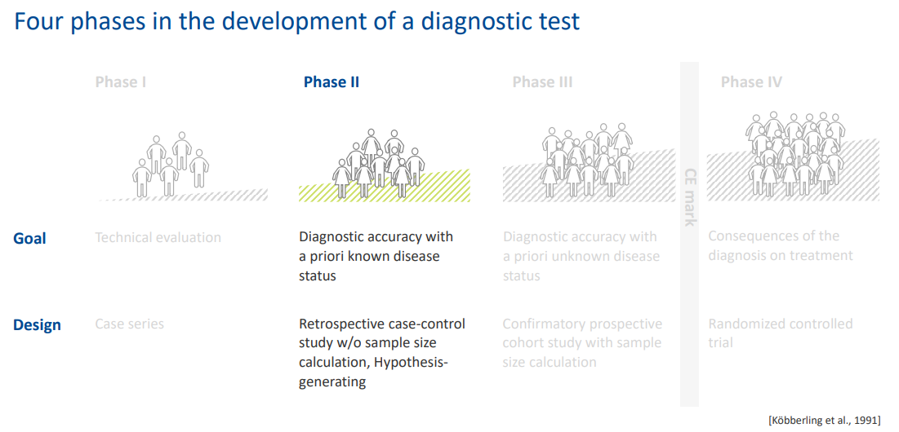  
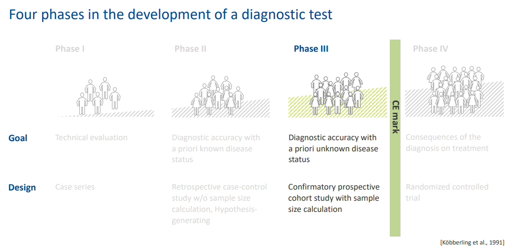  
```

**Introduction to Study Phases**: Explanation of the different phases of study facing in medical research, including:
   - **Phase 1**: Initial discovery of the diagnostic test's potential value.
   - **Phase 2**: Estimation of the diagnostic accuracy using known disease status, often through retrospective case-control studies.
   - **Phase 3**: Evaluation of diagnostic accuracy in a real-world setting with unknown disease status, using prospective cohort studies.
   - **Phase 4**: Analysis of the diagnostic test's impact on treatment outcomes and patient health, typically through randomized controlled trials.
   

## Different study designs in phase III

Example of Diagnostic Tests for CAD

```{r , echo=FALSE, fig.align="center", out.width = '100%'}  
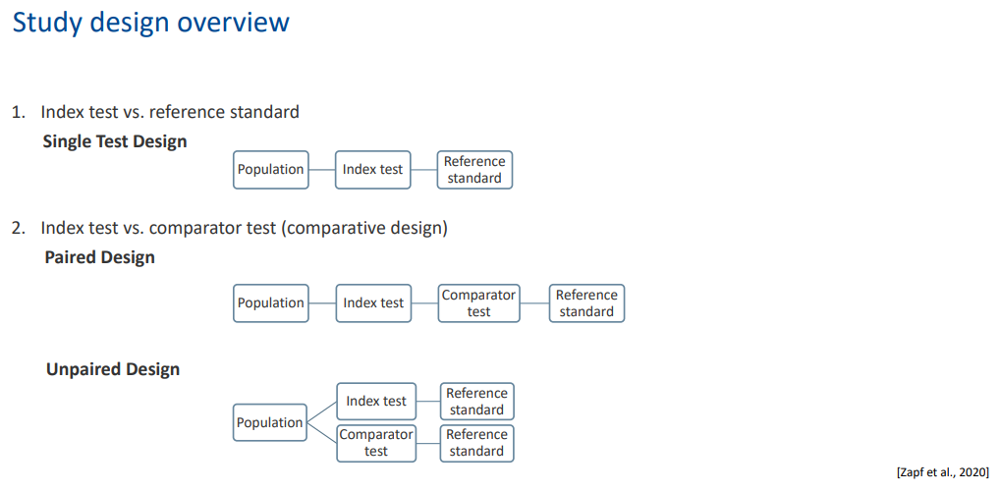   
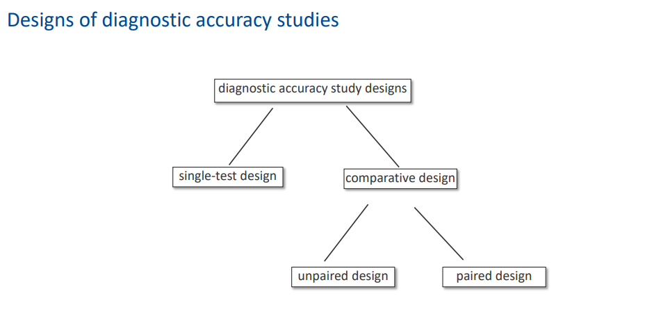  
```

**Single Test Design (Standard Design)**

- **Example**: The DEBATE study, where the index test is the Computed Tomographic Coronary Angiography (CTCA) and the reference standard is the Coronary Angiography (CA).
- **Application**: This design is straightforward, where each participant undergoes both the index test and the reference standard. This approach allows for direct comparison of the new diagnostic test (CTCA) against the established gold standard (CA).

**Comparative Test Design**

- **Split into Paired and Unpaired Designs**:
  - **Paired Design**: Similar to the single test design but includes an additional comparator test. Each participant undergoes the index test, the comparator test, and the reference standard. This design allows for a comprehensive comparison between two competing diagnostic tests alongside the reference standard.
  - **Unpaired Design**: The participant population is divided into two groups. One group undergoes the index test and the reference standard, while the other group undergoes the comparator test and the reference standard. This design is beneficial when it's not feasible or ethical for all participants to undergo all tests.


**Note**

* Particularly in comparative and unpaired designs, it is highlighted the importance of examining concordant (tests agree on the diagnosis) and discordant (tests disagree on the diagnosis) results. These comparisons are crucial for understanding the relative accuracy of the tests and for designing studies with sufficient power to detect meaningful differences in diagnostic performance.
* The EMA recommends the paired design whenever feasible and ethically acceptable because it reduces variability and increases the power of the study. This recommendation underscores the importance of rigorous study design in ensuring the reliability and validity of diagnostic test evaluations.

## Study Characteristics

```{r , echo=FALSE, fig.align="center", out.width = '100%'}  
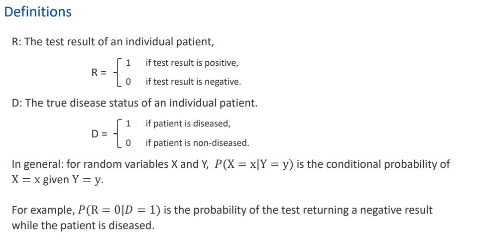    
```

- **Test Result Indicator (R)**: Represents the outcome of a diagnostic test for an individual patient. This indicator can be either 1 (positive result, suggesting the presence of disease) or 0 (negative result, indicating the absence of disease). It's crucial to understand that "positive" or "negative" does not necessarily correlate with desirable or undesirable outcomes for the patient; it merely reflects the presence or absence of disease as detected by the test.

- **True Disease Status (D)**: The actual health status of a patient, established by the reference standard. Like the test result indicator, this can be 1 (the patient is truly diseased) or 0 (the patient is not diseased). The reference standard is considered the most accurate method available for diagnosing the condition in question.

These are conditional probabilities representing the diagnostic test's accuracy:

  - **Sensitivity**: The probability that the test correctly identifies a diseased patient as positive (\(P(R=1|D=1)\)).
  - **Specificity**: The probability that the test correctly identifies a non-diseased patient as negative (\(P(R=0|D=0)\)).

```{r , echo=FALSE, fig.align="center", out.width = '100%'}  
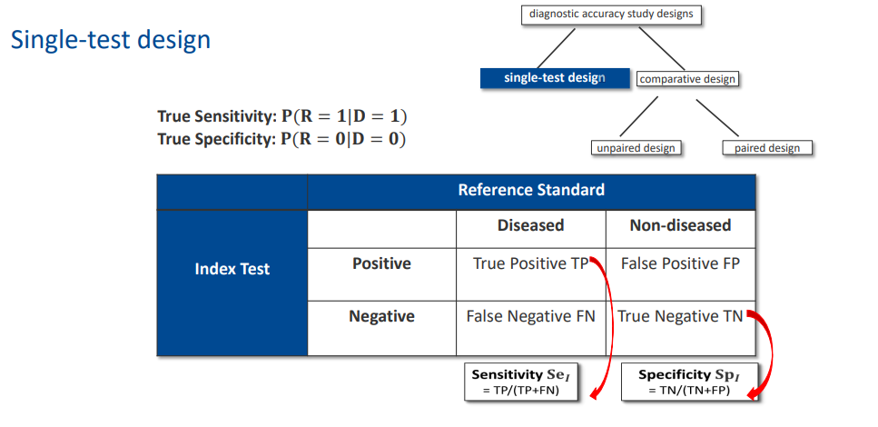      
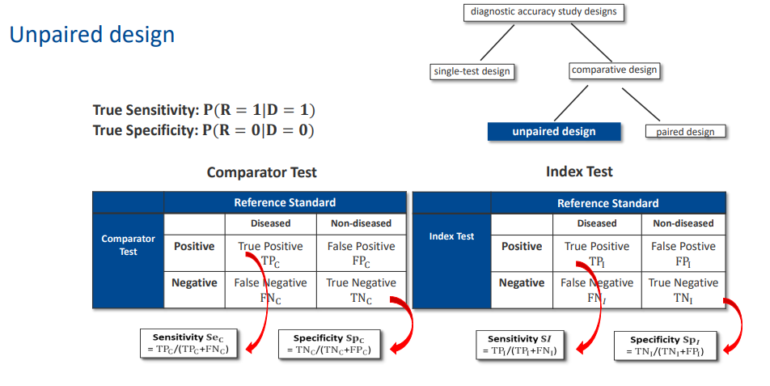      
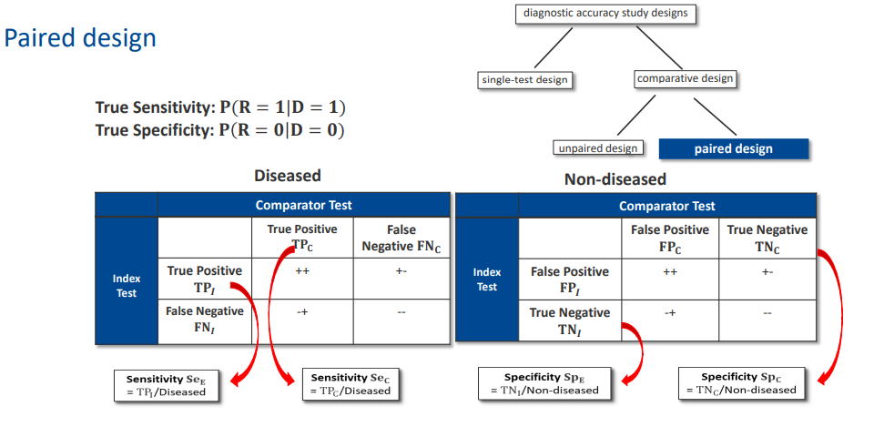    
```


# Planning Phase

Planning of a diagnostic study, That is why a study should be carefully planned:

* Develop a representative setting for the study
* Define the correct study objective and study population
* Assess the diagnostic accuracy appropriately
* Avoid bias
* Draw the correct conclusion

- **Objective**: Clearly articulate what the study aims to achieve, whether it's to evaluate the diagnostic accuracy of a new test, compare it against an existing standard, or understand its utility in a specific clinical scenario.
- **Population Selection**: The study population should closely resemble the patient group in whom the test will be used in practice. This involves considering factors like age, gender, disease severity, and comorbid conditions to ensure the sample is representative.
- **Accuracy Measures**: Define which measures of diagnostic accuracy (e.g., sensitivity, specificity, positive predictive value, negative predictive value) are most relevant to your study objectives. These measures should reflect the test's ability to correctly diagnose or rule out the disease.
- **Appropriate Methods**: Employ statistical methods and study designs that are best suited to measure these accuracy parameters reliably.
- **Identification and Mitigation**: Recognize potential sources of bias in your study design, such as selection bias, information bias, and observer bias. Implement strategies to minimize their impact, for example, through blinding, randomization (where applicable), and standardized test procedures.
- **Data Interpretation**: Analyze the data with an understanding of the study's limitations and the context of the wider body of evidence.
- **Real-world Application**: Ensure that the conclusions drawn from the study are applicable to the real-world clinical setting, taking into account the practical aspects of test implementation, such as cost, accessibility, and patient preferences.


**Note**

* PICO are specific questions to define the research question. An estimand is a precise description of the test accuracy that reflects the clinical study objective

* QUADAS-2 is an important tool to assess the quality of diagnostic accuracy studies and at the same time to plan a study without bias. It introduces 4 domains to handle the risk of bias and applicability assessment: Patient Selection, Index Test, Reference Standard, Flow and Timing


## PICO framework  

```{r , echo=FALSE, fig.align="center", out.width = '100%'}  
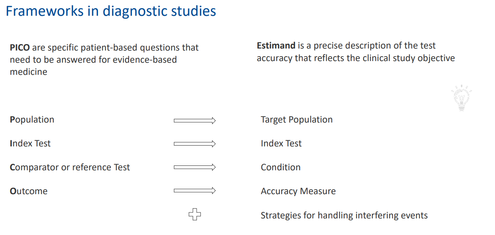     
```

The PICO framework (Patient, Intervention, Comparison, Outcome) is traditionally used in treatment studies to formulate research questions and guide study design in evidence-based medicine. Adapting this framework to diagnostic studies involves a slight modification to align with the objectives of diagnostic accuracy research:

- **Patient**: The population in which the diagnostic test will be used.
- **Intervention**: The diagnostic test being evaluated.
- **Comparison**: Any existing standard tests or diagnostics that the new test is being compared against.
- **Outcome**: Measures of diagnostic accuracy (e.g., sensitivity, specificity).

Diagnostic PICO Framework Components

- **Population (P)**: The group of patients for whom the diagnostic test is intended. In your example, this refers to symptomatic patients with clinical indications for coronary imaging, ensuring that the study focuses on a relevant and clearly defined patient group.

- **Index Test (I)**: The diagnostic test under evaluation, which in the context of the EVASCAN study is the Computed Tomographic Coronary Angiography (CTCA). This clarity ensures that all study efforts are centered around assessing this specific test's accuracy and utility.

- **Comparator/Comparison (C)**: This could be either a standard reference test (gold standard) against which the new test is compared or another novel test serving as a comparator. The choice between using a comparator test or a reference standard depends on the study's objectives and the availability of an established diagnostic method for the condition in question.

- **Outcome (O)**: The outcomes in diagnostic studies are measures of test accuracy, including sensitivity, specificity, positive and negative predictive values, and positive and negative likelihood ratios. These measures provide a comprehensive view of the test's performance in identifying the presence or absence of disease.

## Estimand Framework 

The estimand framework goes a step further by defining specific attributes that need to be considered in diagnostic accuracy studies:

- **Target Population**: Aligns with the "Population" in the PICO framework and specifies the group in which the test's accuracy will be evaluated.
- **Index Test and Condition**: These components are consistent with the "Index Test" and the medical condition of interest in the diagnostic PICO framework.
- **Accuracy Measure**: This directly corresponds to the "Outcome" in the PICO framework, detailing the specific accuracy metrics that the study aims to assess.
- **Strategies for Interfering Events**: An additional consideration in the estimand framework, addressing potential obstacles like non-assessable segments, incomplete data, or participant withdrawal. Identifying and planning for these events are crucial for maintaining the integrity and validity of the study's findings.


**Target Population**

- **Symptomatic patients with clinical indications for coronary imaging**: This specification ensures the study focuses on a group that is most likely to benefit from the diagnostic test being evaluated. By choosing symptomatic patients, the study aims to reflect a real-world population that clinicians encounter, thereby enhancing the applicability and relevance of the findings.

**Index Test**

- **Computed tomographic coronary angiography (CTCA)**: Specifying CTCA as the index test underlines the study's objective to evaluate this particular diagnostic method's accuracy and utility in detecting coronary artery disease (CAD). CTCA is a non-invasive imaging test that offers detailed images of the coronary arteries, making it a critical tool for assessing CAD.

**Condition**

- **Coronary artery disease**: Identifying CAD as the condition of interest focuses the study on a major global health concern. CAD is the most common type of heart disease and a leading cause of death worldwide. Evaluating the effectiveness of CTCA in diagnosing CAD addresses a significant clinical need.


**Accuracy Measure**

- **Sensitivity, specificity, positive and negative predictive values, and positive and negative likelihood ratios**: These measures provide a comprehensive assessment of CTCA's diagnostic accuracy. Sensitivity and specificity evaluate the test's ability to correctly identify diseased and non-diseased individuals, respectively. Predictive values offer insight into the probability that a patient truly has or does not have the disease based on the test result. Likelihood ratios help in assessing how much a test result will change the odds of having the disease.

**Strategies for Interfering Events**

- **Nonassessable segment**: Acknowledging the possibility of nonassessable segments is crucial for coronary imaging studies, as some portions of the coronary arteries may not be visualized clearly due to technical limitations or patient-specific factors. This acknowledgment helps in planning how to handle such data in the analysis.
- **Withdrawal**: Participant withdrawal can affect study outcomes and the generalizability of the findings. Planning for this event involves establishing protocols for managing missing data and considering its impact on the study's validity.

## QUality Assessment of Diagnostic Accuracy Studies (QUADAS-framework)

```{r , echo=FALSE, fig.align="center", out.width = '100%'}  
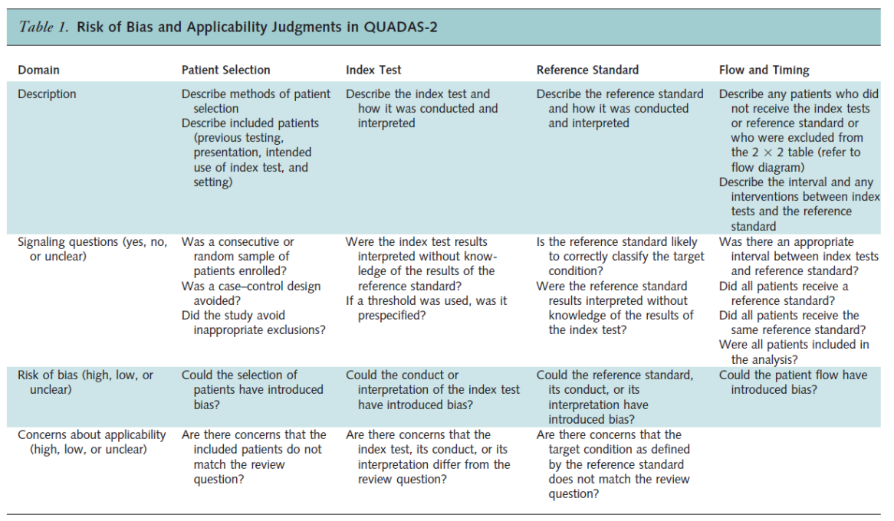     
```

QUADAS framework, specifically its second version introduced in 2011, provides a structured approach for evaluating the risk of bias and applicability in diagnostic accuracy studies. By examining studies through the lens of four key domains—patient selection, index test, reference standard, and flow and timing—QUADAS-2 allows for a comprehensive assessment of study quality. Let's delve into each domain and apply them to the EVASCAN study as per your example:

```{r , echo=FALSE, fig.align="center", out.width = '100%'}  
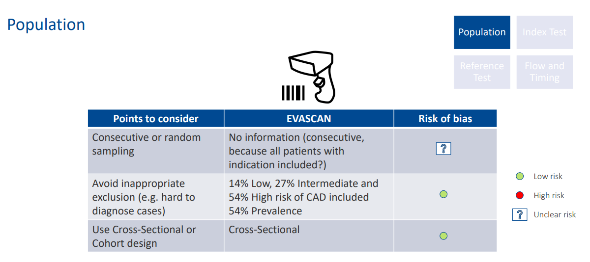     
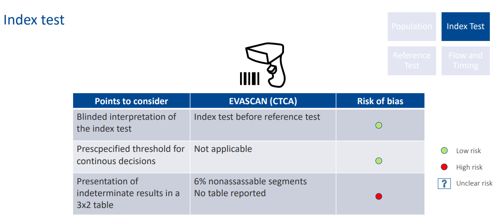   
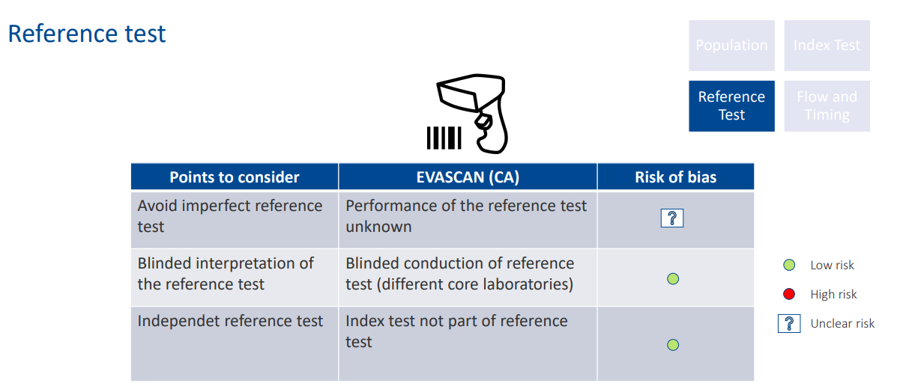   
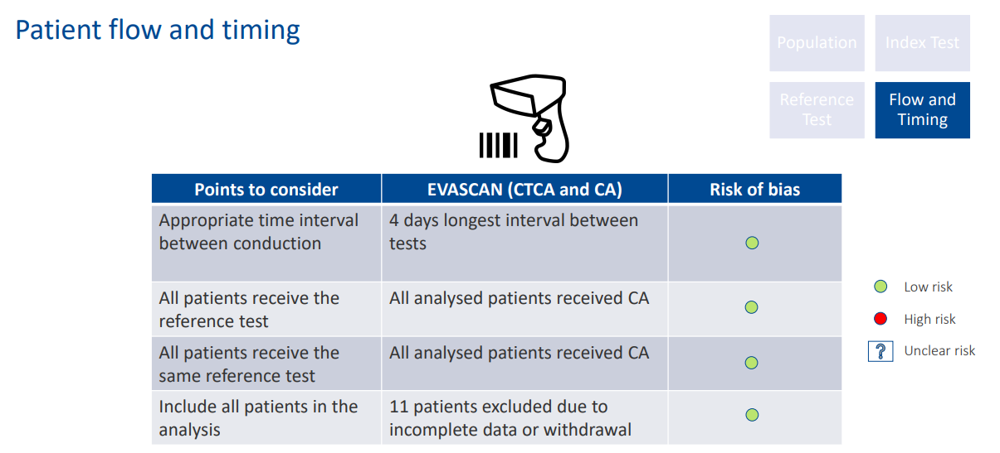   
```
 
### Population and Sampling
- The study includes participants with varying risks of CAD: 14% low risk, 27% intermediate risk, and 54% high risk, indicating a diverse sample population.
- It mentions the importance of using consecutive or random sampling to avoid bias and the need to include all patients with indications to prevent inappropriate exclusions.
- The design adopted is Cross-Sectional, which is suitable for assessing the prevalence of CAD.

### Index Test (Computed Tomographic Angiography - CTCA)
- The document highlights the importance of blinded interpretation to minimize bias.
- It notes the necessity of conducting the index test before the reference test and addressing how continuous decisions are made.
- A concern is raised regarding the presentation of indeterminate results, with a mention of 6% non-assessable segments and the absence of a detailed table for these cases.

### Reference Test (Coronary Angiography - CA)
- The study aims to mitigate the risk of bias by ensuring the reference test is not flawed, involving blinded interpretation and execution by different core laboratories to ensure independence.
- There's an acknowledgment of the challenge in maintaining the reference test's integrity, with some procedural details left unclear.

### Patient Flow and Timing
- The document outlines the importance of a proper time interval between tests, with a maximum of 4 days mentioned, ensuring all patients receive and are analyzed based on the reference test.
- It also emphasizes the inclusion of all patients in the analysis, noting that 11 patients were excluded due to incomplete data or withdrawal, which could impact the study's findings.


# Sample Size (Re-)Estimation

Before delving into sample size calculation, the text emphasizes the need to clearly define the study's hypothesis and test design, which are foundational for calculating the required sample size. It introduces a "single test design" approach, comparing the index test against predefined minimum thresholds for sensitivity and specificity. This method regards sensitivity and specificity as independent endpoints, reflecting the distinct populations they pertain to (diseased vs. non-diseased), hence treated as independent co-primary endpoints.

The combination of these endpoints into a global hypothesis is achieved through an "intersection-union test," which posits a global null hypothesis integrating two individual hypotheses concerning sensitivity and specificity. This global hypothesis can only be rejected if both individual hypotheses (pertaining to sensitivity and specificity) are simultaneously rejected, ensuring a comprehensive evaluation of the test's diagnostic accuracy.

The intersection-union test framework allows for a more nuanced and rigorous approach to sample size calculation. It requires the study to meet predefined benchmarks for both sensitivity and specificity, considering them in tandem rather than in isolation. This approach ensures that the diagnostic test is adequately evaluated for its ability to correctly identify both diseased and non-diseased individuals, which is crucial for its application in clinical settings.

```{r , echo=FALSE, fig.align="center", out.width = '100%'}  
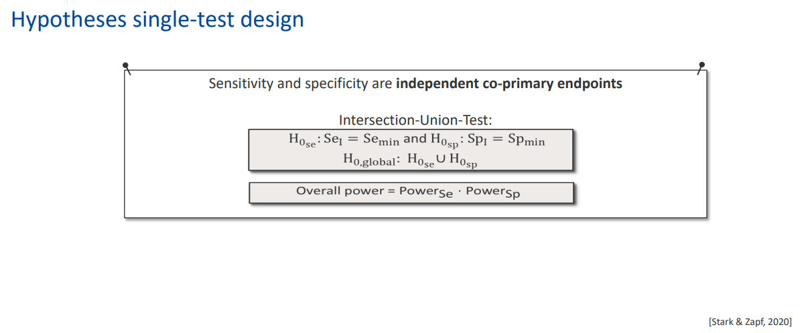     
```

**NOTE**: Sensitivity and specificity are independent co-primary endpoints


## Conventional sample size calculation

This conventional sample size calculation is designed to ensure that the study is adequately powered to detect the expected performance of the experimental test at the specified minimum thresholds for sensitivity and specificity. The final sample size is determined by the larger of the two sample sizes calculated for sensitivity and specificity, ensuring that the study has sufficient power to test both measures effectively.

**Problem**: Overpowered.

```{r , echo=FALSE, fig.align="center", out.width = '100%'}  
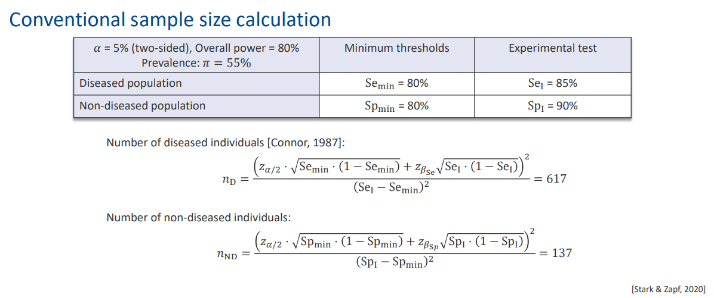     
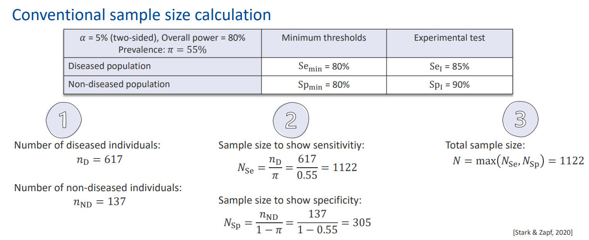     
```

1. **Determination of Sample Sizes for Diseased and Non-Diseased Individuals:**
   - The number of diseased individuals (\( n_D \)) required is calculated to be 617.
   - The number of non-diseased individuals (\( n_{ND} \)) needed is 137.

2. **Calculation of Sample Sizes to Show Sensitivity and Specificity:**
   - The sample size to show sensitivity (\( N_{Se} \)) is calculated by dividing the number of diseased individuals by the prevalence (\( \pi \)), which results in 1122.
   - The sample size to show specificity (\( N_{Sp} \)) is determined by dividing the number of non-diseased individuals by one minus the prevalence, yielding 305.

3. **Total Sample Size:**
   - The total sample size (\( N \)) required for the study is the maximum of \( N_{Se} \) and \( N_{Sp} \), which in this case is 1122.

The parameters used for this calculation are as follows:

- **Significance Level (\( \alpha \))**: 5% (two-sided), which is the typical level of significance used to infer statistical hypothesis testing.
- **Power**: 80%, which is the probability that the test will correctly reject a false null hypothesis.
- **Prevalence (\( \pi \))**: 55%, which reflects the assumed proportion of diseased individuals in the population being studied.
- **Minimum Thresholds for Sensitivity (\( Se_{min} \)) and Specificity (\( Sp_{min} \))**: Both set at 80%, which are the lowest acceptable limits for the diagnostic test's performance.
- **Experimental Test**: The anticipated sensitivity (\( Se \)) of the experimental test is 85% and the specificity (\( Sp \)) is 90%.

## Optimal sample size calculation

The conventional approach might suggest a larger sample size (e.g., 1122 individuals), which could be significantly reduced by adopting the optimal approach without compromising the study's power. This efficiency is further illustrated through empirical data, showing that the optimal approach maintains close to target power across varying prevalence rates, while the conventional method might result in overpowered studies.

```{r , echo=FALSE, fig.align="center", out.width = '100%'}  
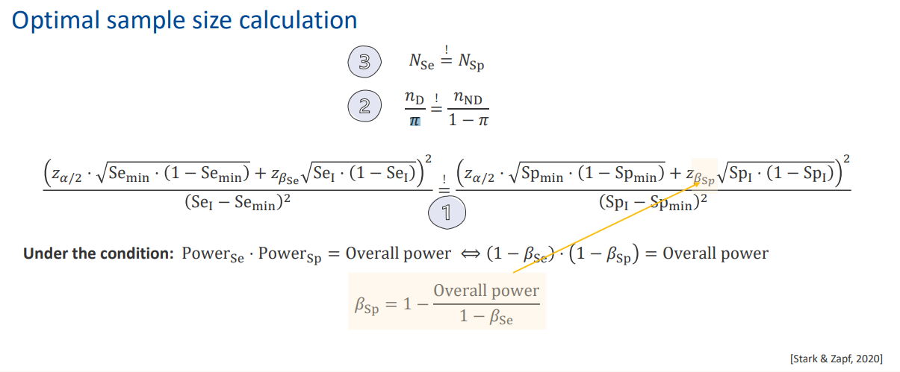     
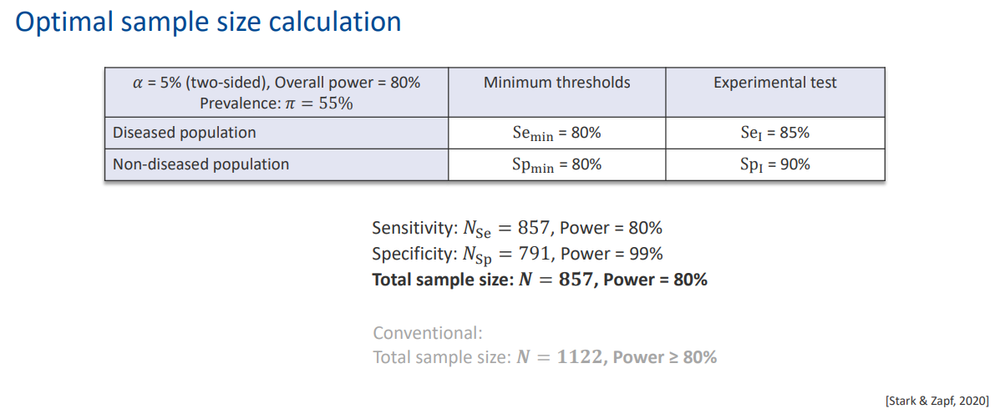     
```

 
## Sample size re-estimation

The concepts of sample size re-estimation and interim analysis play a critical role in the design and execution of clinical trials. These processes allow researchers to adjust their study based on preliminary data, ensuring the trial remains effective and efficient. There are two main types of interim analysis: blinded and unblinded. Each has its specific context, potential adjustments, and implications for statistical integrity.

**Blinded Interim Analysis**

In a blinded interim analysis, the individuals analyzing the data do not have access to information regarding which participants are receiving the treatment versus the control. This lack of knowledge about the combination of index test and reference standard results means that there is no need for adjustment of the Type I error rate. The primary goal is to assess data quality and trial conduct without bias.

Possible adjustments during a blinded interim analysis may include:

- For single test and unpaired comparative designs: Adjustments could be made to the estimated prevalence of the condition under study or the proportion of missing values. These adjustments help ensure that the study's assumptions remain valid as more data become available.
- For paired comparative designs: In addition to the adjustments mentioned above, researchers may also consider adjusting for the proportion of discordant results between the test under investigation and the reference standard. This is particularly relevant in studies where the agreement between two diagnostic tests is a key outcome.

**Unblinded Interim Analysis**

In contrast, an unblinded interim analysis involves a review of the data with full knowledge of which participants are in the treatment group and which are in the control group. This approach allows for a more detailed examination of the efficacy and safety data but requires careful handling to preserve the integrity of the trial.

Because the unblinded interim analysis can influence future decisions about the trial, including potentially stopping the trial early for efficacy or safety reasons, it's crucial to adjust the Type I error rate. This adjustment helps maintain the statistical validity of the study's conclusions despite the interim peek at the data.

Possible adjustments during an unblinded interim analysis include:

- Sensitivity and specificity: Adjustments to these parameters can be considered based on the interim data. These adjustments are particularly relevant for diagnostic accuracy studies, where the performance of the index test compared to the reference standard is a primary outcome.

##  Unblinded sample size re-estimation

**Endpoints and Hypotheses**

Co-Primary Endpoints: both null hypotheses have to be rejected
- Single Test Design
$$
\mathrm{H}_{0, \text { global }}: \mathrm{H}_{0_{\mathrm{se}}}: \mathrm{Se}_{\min } \geq \mathrm{Se}_{\mathrm{E}} \quad \text { U } \quad \mathrm{H}_{0_{\mathrm{sp}}}: \mathrm{Sp}_{\text {min }} \geq \mathrm{Sp}_{\mathrm{E}}
$$

- Paired / Unpaired Test Design
$$
\mathrm{H}_{0, \text { global }}: \mathrm{H}_{0_{\mathrm{se}}}: \mathrm{Se}_{\mathrm{C}}-\mathrm{Se}_{\mathrm{E}} \geq \delta_{s e} \quad \cup \quad \mathrm{H}_{0_{\mathrm{sp}}}: \mathrm{Sp}_{\mathrm{C}}-\mathrm{Sp}_{\mathrm{E}} \geq \delta_{s p}
$$


# Analysis

**Sensitivity and specificity are the main accuracy measures.**

**Predictive values are very relevant from patient‘s perspective, but dependent on prevalence**

**your report includes not only positive and negative test results but also inconclusive ones, and the significance of reporting each.**

## Estimating predictive values from sensitivity, specificity and prevalence

- Prevalence: $\quad \pi=P(D=1)$
- Law of total probability: $\quad P(A)=\sum_n P\left(A \mid B_n\right) \cdot P(B n)$
- Bayes' theorem: $\quad P(\mathrm{~A} \mid \mathrm{B})=\frac{P(B \mid \mathrm{A}) \mathrm{P}(\mathrm{A})}{P(B)}$

```{r , echo=FALSE, fig.align="center", out.width = '100%'}  
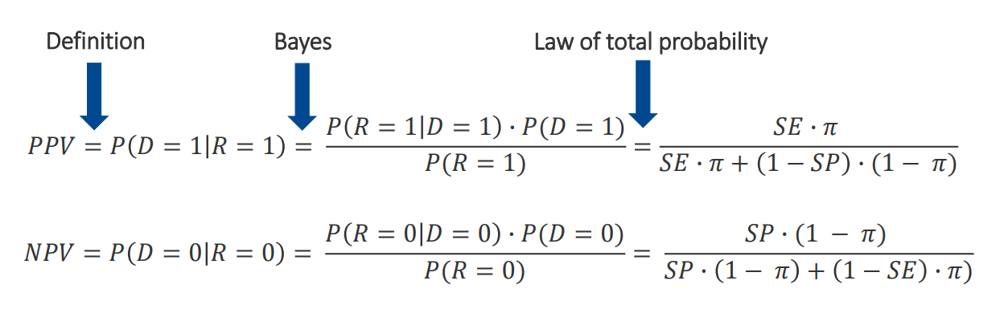     
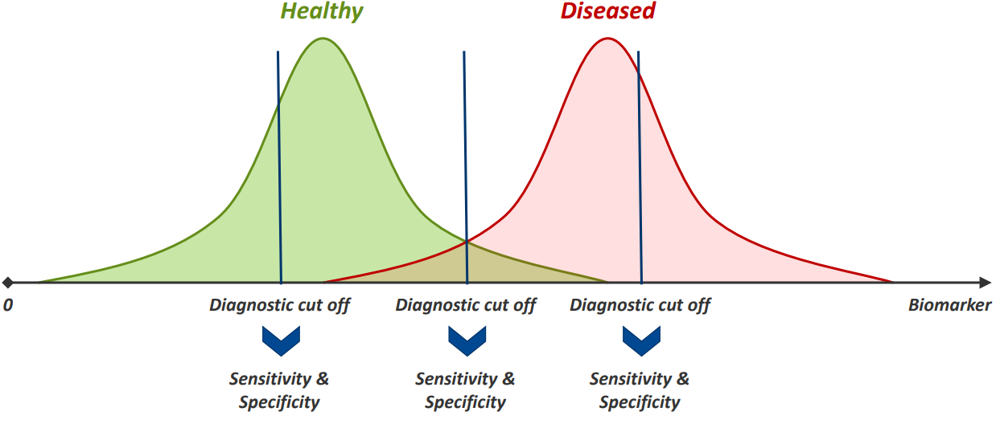     
```

## Definition of an optimal cutoff-value

**Youden index = sensitivity + specificity - 1**

```{r , echo=FALSE, fig.align="center", out.width = '100%'}  
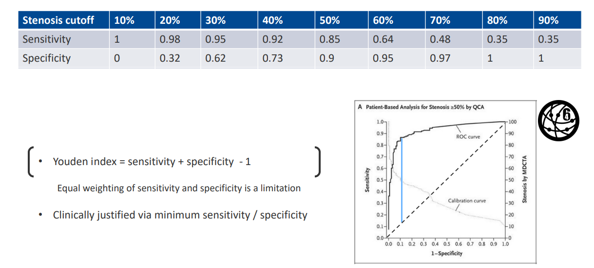      
```

## Diagnostic accuracy measures


```{r , echo=FALSE, fig.align="center", out.width = '100%'}  
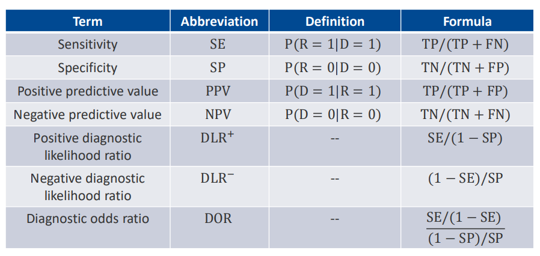      
```


## Inference methods

### Single test design

**Confidence intervals**

Two-sided $(1-\alpha)$-confidence interval for a single proportion:
$$
\left[\hat{p} \pm z_{1-\alpha / 2} \sqrt{\hat{p}(1-\hat{p}) /{ }_N}\right]
$$

**Hypotheses**

$$
H_0: p \leq p_0
$$
vs.
$$
H_1: p>p_0
$$

Test statistic (Wald test):
$$
T=\frac{\hat{p}-p_0}{\sqrt{\frac{\hat{p} \cdot(1-\hat{p})}{n}}} \stackrel{H_0}{\sim} N(0,1)
$$

**Test decision**: reject $H_0$, if $T>z_{1-\alpha / 2}$

### Comparative design 

In order to test comparative designs, we must look at the difference between estimates for the index test and the comparator test $(\Delta)$.

Hypotheses comparative design $\quad H_0: \Delta \leq \Delta_0 \quad$ vs. $\quad H_1: \Delta>\Delta_0 \quad\left(\Delta=p_I-p_C\right)$

```{r , echo=FALSE, fig.align="center", out.width = '100%'}  
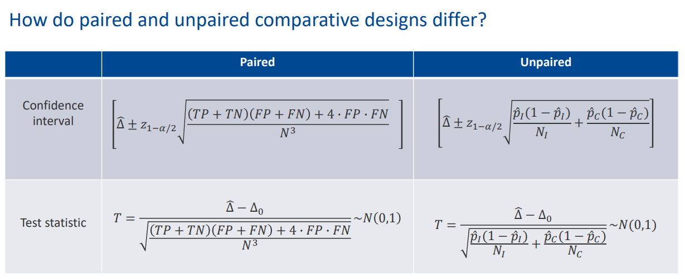      
```


## Software

* SAS - little implemented by default (PROC freq, PROC logistic) → various macros (e.g.
https://medstat.umg.eu/404-seite-nicht-gefunden/nichtparametrische-statistik/diagnose-studien/
* R - "countless" packages (e.g. pROC, EpiR, diffdepprop)
* R Package diagacc Draft version available at „https://github.com/wbr-p/diagacc“

```{r , echo=FALSE, fig.align="center", out.width = '100%'}  
knitr::include_graphics("./02_Plots/Diag_Soft.png")      
```

 

# Missing Values

**Guidance for missing values in the reference test**

```{r , echo=FALSE, fig.align="center", out.width = '100%'}  
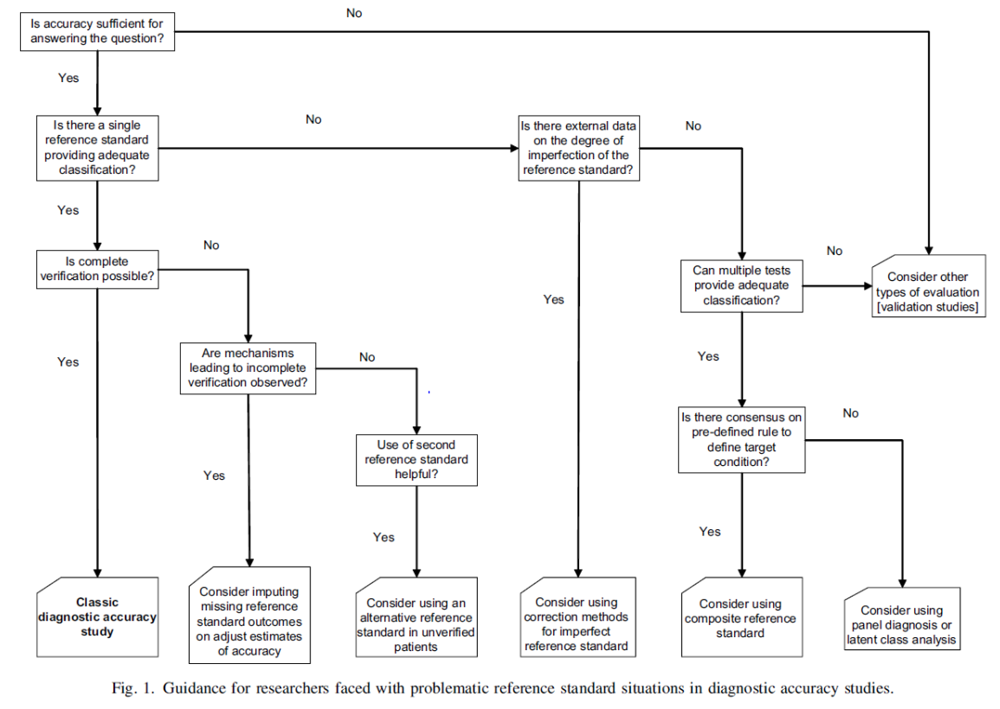      
```

**Is accuracy sufficient for answering the question?**
   - If yes, it proceeds to ask if there's a single reference standard providing adequate classification.
     - If verification is possible and there are no mechanisms leading to incomplete verification observed, a classic diagnostic accuracy study is suggested.
     - If there are mechanisms leading to incomplete verification, imputing missing reference standard outcomes is considered.
   - If no, it leads to the question of whether there is external data on the degree of imperfection of the reference standard.
     - If there is external data, the use of second reference standard or alternative reference standard in unverified patients might be helpful.
     - If there's no external data, it considers whether multiple tests can provide adequate classification.
       - If multiple tests can't provide adequate classification, other types of evaluation like validation studies are considered.
       - If multiple tests can provide adequate classification and there is a consensus on a predefined rule to define the target condition, various methods such as using correction methods for imperfect reference standard, using a composite reference standard, or using panel diagnosis or latent class analysis are considered.

## Missing Values Analysis

```{r , echo=FALSE, fig.align="center", out.width = '100%'}  
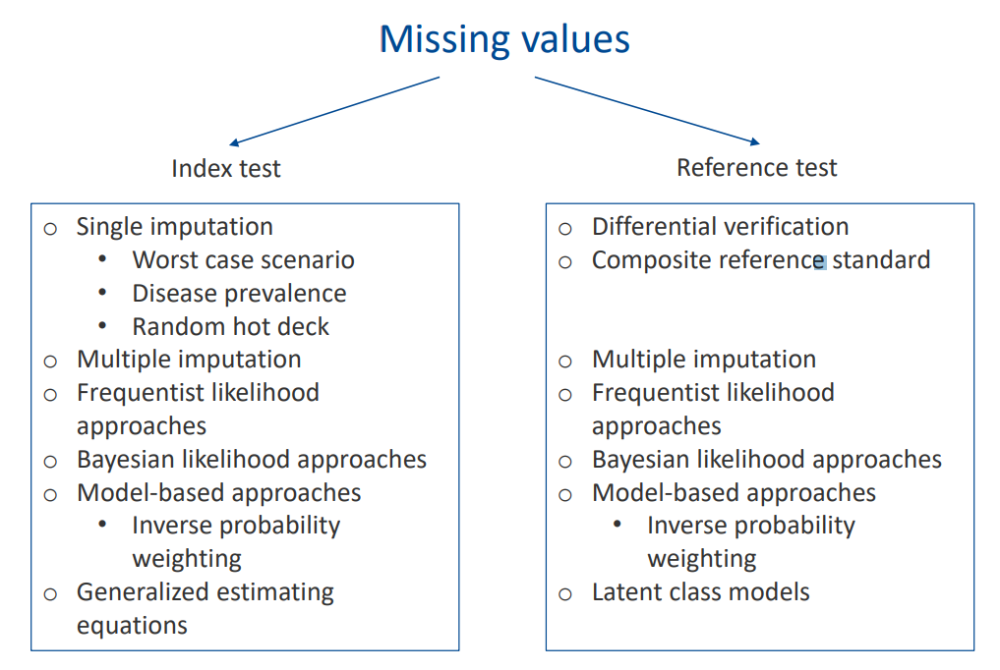      
```


# Complex Designs

```{r , echo=FALSE, fig.align="center", out.width = '100%'}  
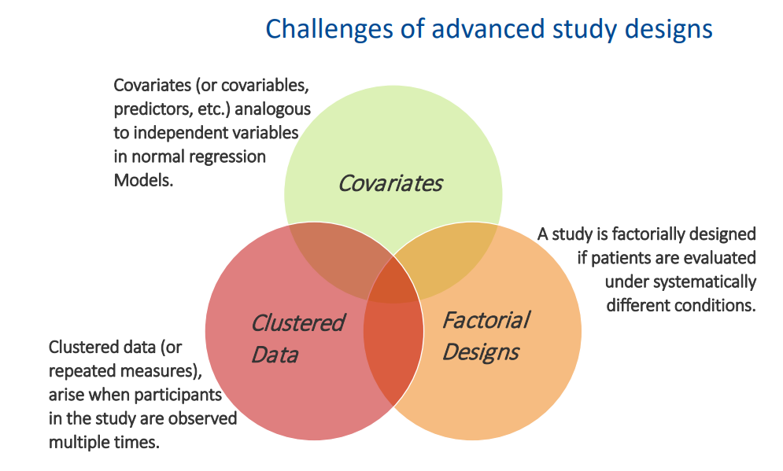      
```

Clustered data is commonly evaluated  by reducing the observations to the  patient level.  For this, the observations of a patient  are reduced to the single most  conspicuous one.  This often results in overestimation of  sensitivity and underestimation of  specificity

1. **Covariates:** These are variables that are analogous to independent variables in normal regression models. Covariates can influence the outcome of interest and are important to account for in statistical analyses to avoid confounding.

2. **Clustered Data:** This occurs when participants in a study are observed multiple times, resulting in repeated measures. Clustered data require special statistical approaches to account for the lack of independence among observations from the same individual.

3. **Factorial Designs:** This refers to studies that are structured such that patients are evaluated under systematically different conditions. Factorial designs can assess the effects of multiple interventions simultaneously and can also be used to investigate interactions between factors.

## Parametric methods for the analysis of complex designs

```{r , echo=FALSE, fig.align="center", out.width = '100%'}  
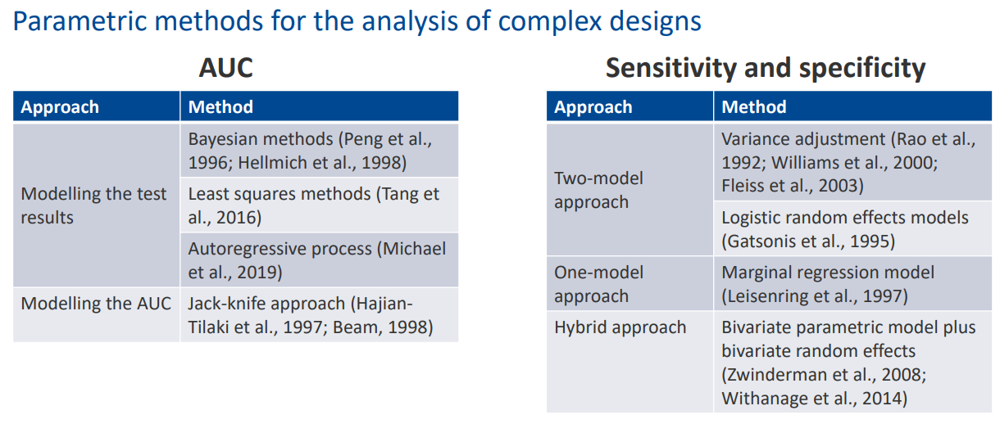      
```


## Non- and Semiparametric methods for the analysis of complex designs

```{r , echo=FALSE, fig.align="center", out.width = '100%'}  
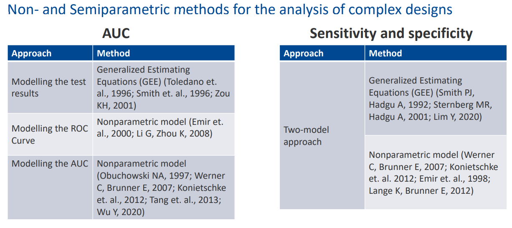      
```


## Adaptive (seamless) designs


```{r , echo=FALSE, fig.align="center", out.width = '100%'}  
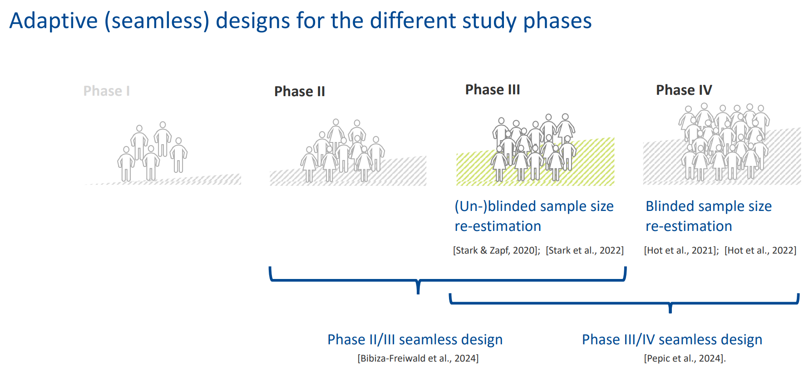     
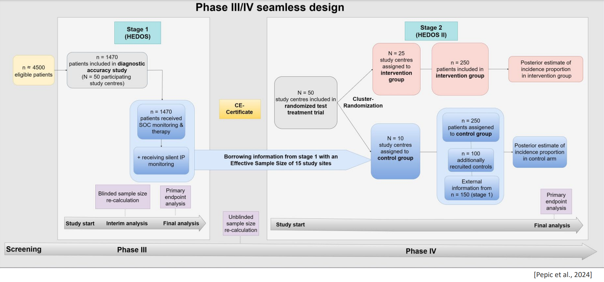   
```


# R Implementation 

## pROC

```{r,echo = T,message = FALSE, error = FALSE, warning = FALSE}
library("pROC")
data(aSAH)
ROC = roc(aSAH$outcome, aSAH$s100b,levels=c("Good", "Poor"))
plot.roc(ROC)
AUC = auc(ROC)
AUC.CI = ci.auc(ROC,method="delong")

AUC
AUC.CI

ROC2 = roc(aSAH$outcome, aSAH$wfns,levels=c("Good", "Poor"))
plot.roc(ROC2,add=TRUE)
roc.test(ROC,ROC2)
```

## EpiR

```{r,echo = T,message = FALSE, error = FALSE, warning = FALSE}
library(epiR)
dct = table(aSAH$s100b, aSAH$outcome)
epi.tests(dct, conf.level = 0.95) 
```


# SAS Implementation 

## PROC LOGISTIC – ROC statement

```
ods graphics on;
proc logistic data=roc plots=roc(id=prob);
class outcome wfns;
model outcome(event='Poor') = s100b wfns / nofit;
roc 's100b' s100b;
roc 'wfns' wfns;
roccontrast reference/ estimate e;
run;
ods graphics off;
```

## PROC FREQ

```
proc freq data=ROC;
  where outcome="Poor"; * where outcome="Good";
  tables s100b_d / binomial(level="1");
  exact binomial;
run;
```


# Reference

## Methodology and Design

European Medicines Agency. CPMP/EWP/1119/98/Rev. 1 - Guideline on clinical evaluation of diagnostic agents. Retrieved November 30,  2023, from https://www.ema.europa.eu/en/documents/scientific-guideline/guideline-clinical-evaluation-diagnostic-agents_en.pdf.

Zapf A, Stark M, Gerke O, Ehret C, Benda N, Bossuyt P, Deeks J, Reitsma J, Alonzo T, Friede T. Adaptive trial designs in diagnostic accuracy research. Stat Med. 2020;39(5):591-601.

Haelio, 2014. https://www.healio.com/news/cardiology/20210715/the-death-of-stress-test-and-the-rise-of-the-coronary-ct-angiogram

Zhou, X.-H., Obuchowski, N. A., & McClish, D. K. (2011). *Statistical Methods in Diagnostic Medicine*. John Wiley & Sons, Inc. https://doi.org/10.1002/9780470906514

Whiting PF, Rutjes AW, Westwood ME, et al. QUADAS-2: a revised tool for the quality assessment of diagnostic accuracy studies. Ann Intern Med. 2011;155(8):529-536. doi:10.7326/0003-4819-155-8-201110180-00009

Pepe, M. S. (2004). *The Statistical Evaluation of Medical Tests for Classification and Prediction*. Oxford University Press.

Stahlmann K, Reitsma JB, Zapf A. Missing values and inconclusive results in diagnostic studies - A scoping review of methods. Stat Methods Med Res. 2023;32(9):1842-1855. doi:10.1177/09622802231192954

Ibrahim JG, Chen M, Gwon Y, et al. The power prior: theory and applications. Stat Med 2015; 34: 3724–3749; Neuenschwander B, Capkun-Niggli G, Branson M, et al. Summarizing historical information on controls in clinical trials. Clin Trials 2010; 7: 5–18

## References – Parametric Complex designs

Beam CA. Analysis of clustered data in receiver operating characteristic studies. Stat Methods Med Res. 1998;7. doi:10.1177/096228029800700402

Fleiss JL, Levin B, Paik MC. Statistical Methods for Rates and Proportions. Wiley; 2003. doi:10.1002/0471445428

Gatsonis CA. Random-effects models for diagnostic accuracy data. Acad Radiol. 1995;2 Suppl 1:S14-21.

Hajian-Tilaki KO, Hanley JA, Joseph L, Collet JP. Extension of receiver operating characteristic analysis to data concerning multiple signal detection tasks. Acad Radiol. 1997;4. doi:10.1016/S1076-6332(05)80295-8

Hellmich M, Abrams KR, Jones DR, Lambert PC. A Bayesian approach to a general regression model for ROC curves. Med Decis Making. 1998;18. doi:10.1177/0272989X9801800412

Leisenring W, Pepe MS, Longton G. A marginal regression modelling framework for evaluating medical diagnostic tests. Stat Med. 1997;16. doi:10.1002/(SICI)1097-0258(19970615)16:11<1263::AIDSIM550>3.0.CO;2-M

Michael H, Tian L, Ghebremichael M. The ROC curve for regularly measured longitudinal biomarkers. Biostatistics. 2019;20. doi:10.1093/biostatistics/kxy010

Peng F, Hall WJ. Bayesian analysis of ROC curves using Markov-chain Monte Carlo methods. Med Decis Making. 1996;16.doi:10.1177/0272989X9601600411

Rao JN, Scott AJ. A simple method for the analysis of clustered binary data. Biometrics. 1992;48:577-585.

Tang LL, Zhang W, Li Q, Ye X, Chan L. Least squares regression methods for clustered ROC data with discrete covariates: Least squares methods for clustered ROC data. Biom J. 2016;58. doi:10.1002/bimj.201500099

Williams RL. A note on robust variance estimation for cluster-correlated data. Biometrics. 2000;56. doi:10.1111/j.0006- 341X.2000.00645.x

Withanage N, de Leon AR, Rudnisky CJ. Joint estimation of disease-specific sensitivities and specificities in reader-based multi-disease diagnostic studies of paired organs. J Appl Stat. 2014;41. doi:10.1080/02664763.2014.909790

Zwinderman AH, Glas AS, Bossuyt PM, Florie J, Bipat S, Stoker J. Statistical models for quantifying diagnostic accuracy with multiple lesions per patient. Biostatistics. 2008;9. doi:10.1093/biostatistics/kxm052

## References – Semi- and Nonparametric Complex designs

Emir B, Wieand S, Jung SH, Ying Z. Comparison of diagnostic markers with repeated measurements: a nonparametric ROC curve  approach. Stat Med. 2000;19. doi:10.1002/(sici)1097-0258(20000229)19:4<511::aidsim353>3.0.co;2-3

Konietschke F, Harrar SW, Lange K, Brunner E. Ranking procedures for matched pairs with missing data — Asymptotic theory and a small  sample approximation. Comput Stat Data Anal. 2012;56. doi:10.1016/j.csda.2011.03.022  

Li G, Zhou K. A unified approach to nonparametric comparison of receiver operating characteristic curves for longitudinal and clustered  data. J Am Stat Assoc. 2008;103. doi:10.1198/016214508000000364

Obuchowski NA. Nonparametric analysis of clustered ROC curve data. Biometrics. 1997;53:567-578.  

Smith PJ, Thompson TJ, Engelgau MM, Herman WH. A generalized linear model for analysing receiver operating characteristic curves. Stat  Med. 1996;15. doi:10.1002/(SICI)1097-0258(19960215)15:3<323::AIDSIM159>3.0.CO;2-A

Tang LL, Liu A, Chen Z, Schisterman EF, Zhang B, Miao Z. Nonparametric ROC summary statistics for correlated diagnostic marker data.  Stat Med. 2013;32. doi:10.1002/sim.5654  

Toledano AY, Gatsonis C. Ordinal regression methodology for ROC curves derived from correlated data. Stat Med. 1996;15.  doi:10.1002/(SICI)1097-0258(19960830)15:16<1807::AID-SIM333>3.0.CO;2-U

Werner C, Brunner E. Rank methods for the analysis of clustered data in diagnostic trials. Comput Stat Data Anal. 2007;51.  doi:10.1016/j.csda.2006.05.023

Wu Y. Optimal nonparametric estimator of the area under ROC curve based on clustered data. Commun Stat - Theory Methods. 2020;49.  doi:10.1080/03610926.2018.1563176  

Zou KH. Comparison of correlated receiver operating characteristic curves derived from repeated diagnostic test data. Acad Radiol.  2001;8. doi:10.1016/S1076-6332(03)80531-7

Emir B, Wieand S, Su JQ, Cha S. Analysis of repeated markers used to predict progression of cancer. Stat Med. 1998;17.  doi:10.1002/(sici)1097-0258(19981130)17:22<2563::aid-sim952>3.0.co;2-o

Konietschke F, Harrar SW, Lange K, Brunner E. Ranking procedures for matched pairs with missing data — Asymptotic theory and a small  sample approximation. Comput Stat Data Anal. 2012;56. doi:10.1016/j.csda.2011.03.022

Lim Y. A GEE approach to estimating accuracy and its confidence intervals for correlated data. Pharm Stat. 2020;19. doi:10.1002/pst.1970

Smith PJ, Hadgu A. Sensitivity and specificity for correlated observations. Stat Med. 1992;11. doi:10.1002/sim.4780111108  

Sternberg MR, Hadgu A. A GEE approach to estimating sensitivity and specificity and coverage properties of the confidence intervals. Stat  Med. 2001;20. doi:10.1002/sim.688

Werner C, Brunner E. Rank methods for the analysis of clustered data in diagnostic trials. Comput Stat Data Anal. 2007;51.  doi:10.1016/j.csda.2006.05.023

## References – Sample size calculation

Connor, R. J. Sample Size for Testing Differences in Proportions for the Paired-Sample Design. Biometrics. 1987, 43(1), 207–211.https://doi.org/10.2307/2531961

Stark, M., Hesse, M., Brannath, W., & Zapf, A. (2022). Blinded sample size re-estimation in a comparative diagnostic accuracy study. BMC Medical Research Methodology, 22(1), 1-12. https://doi.org/10.1186/s12874-022-01564-2

Stark M, Zapf A. Sample size calculation and re-estimation based on the prevalence in a single-arm confirmatory diagnostic accuracy study. Stat Methods Med Res. 2020;29. doi:10.1177/0962280220913588

