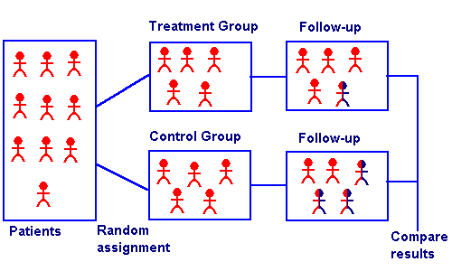
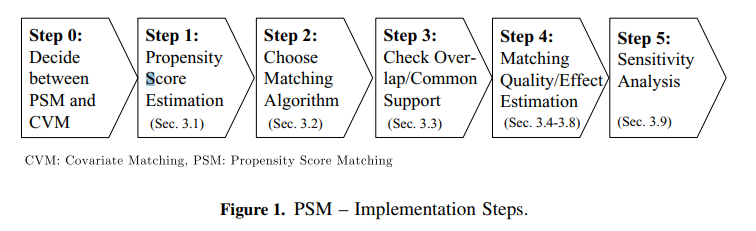
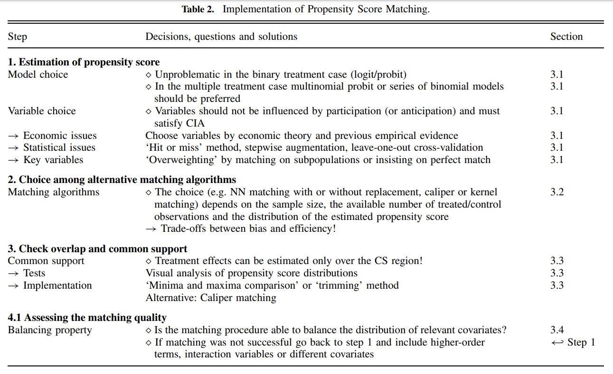
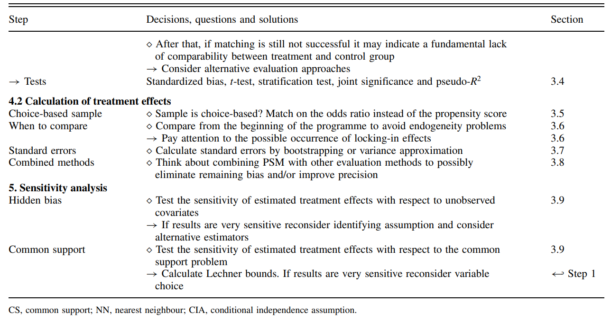

```{r setup, include=FALSE, echo = FALSE,message = FALSE, error = FALSE, warning = FALSE}
knitr::opts_chunk$set(echo = TRUE, fig.width = 10, fig.height = 6)

packages<-c("tidyverse", "kableExtra")

ipak <- function(pkg){
  new.pkg <- pkg[!(pkg %in% installed.packages()[, "Package"])]
  if (length(new.pkg)) 
    install.packages(new.pkg, dependencies = TRUE)
  sapply(pkg, require, character.only = TRUE)
}
ipak(packages)
 
 
setwd(dirname(rstudioapi::getSourceEditorContext()$path))
getwd()
Sys.setlocale("LC_ALL","English")
```

 
 
# FDA Guidance {-}
 

**Summary**

**Design Considerations**
- The protocol should be finalized before initiating the externally controlled (EC) trial.
- Consider using the estimand framework to aid in the design and analysis plan.
- Prespecify plans for measuring and analyzing confounding factors and sources of bias.

**Data Selection**
- For the external control arm, include a comprehensive table describing comparability considerations.

**Analysis Plan**
- The analysis plan should be prespecified, thorough (including sensitivity analyses, plans for handling missing data, etc.), and include a formal evaluation of comparability.

## Introduction

- Given that externally controlled trials do not involve the randomization of the study population to the treatments being compared, it is crucial that the treatment and control arm populations are as similar as possible regarding known factors that can affect the outcome being measured. These factors, discussed in more detail in section III, include important baseline characteristics (e.g., demographic factors, comorbidities), disease attributes (e.g., severity, symptoms, duration of illness), start of follow-up for the treatment of interest, concomitant therapies, and the clinical observations collected. Importantly, before opting to conduct a clinical trial using an external control arm as a comparator, sponsors and investigators should consider the likelihood that such a trial design would be able to distinguish the effect of a drug from other factors that impact the outcome of interest and meet regulatory requirements.

- The suitability of an externally controlled trial design warrants a case-by-case assessment, informed by factors including the heterogeneity of the disease (e.g., clinical presentation, severity, prognosis), preliminary evidence regarding the drug product under investigation, the approach to ascertaining the outcome of interest, and whether the goal of the trial is to show superiority or non-inferiority. Notably, if the natural history of a disease is well-defined and the disease is known not to improve in the absence of an intervention or with available therapies, historical information can potentially serve as the control group. For example, the objective response rate is often used as a single-arm trial endpoint in oncology, given the established understanding that tumor shrinkage rarely occurs without an intervention.

## Design Considerations


**Study Design**

Reducing the potential for bias in externally controlled trials is best addressed during the design phase, where well-chosen design elements enhance confidence in the interpretability of study results. Sponsors should finalize a study protocol before initiating the externally controlled trial. This includes selecting the external control arm and analytic approach, rather than choosing an external control arm after the completion of a single-arm trial. Specific design elements to be prespecified in the protocol include suitable study data sources, baseline eligibility (inclusion and exclusion) criteria, appropriate exposure definitions and windows, well-defined and clinically meaningful endpoints, cogent analytic plans, and approaches to minimize missing data and sources of bias.

**Estimand Framework**

The estimand framework involves a precise description of the treatment effect reflecting the clinical question posed by the study objective. This can aid in designing an externally controlled trial. An estimand is conceptually comprised of the study population, treatment of interest and comparator, outcome of interest, handling of intercurrent events, and summary measures. Many elements of the estimand framework are described individually in the subsections below, promoting alignment of trial objectives, conduct, analysis, and interpretation of results.

**Confounding and Bias**

A specific design consideration for externally controlled trials involves prespecifying plans on how to measure and analyze data on important confounding factors and sources of bias.

Before deciding whether an externally controlled trial is a suitable design to answer the research question of interest, sponsors should confirm that recognized, important prognostic characteristics can be assessed in the data sources that will be used in the trial. Specifically, the source population for the external control arm should be as comparable as possible to the treatment arm population.

Although unmeasured confounding, lack of blinding, and other sources of bias cannot be eliminated in externally controlled trials, an assessment of the extent of confounding and bias, along with analytic methods to reduce the impact of such bias, are critically important in the conduct of such trials.

**Designation of Index Date (Time Zero)**

A specific and difficult challenge when designing externally controlled trials is specifying the index date (also called time zero), which is the start of the observation period for assessing endpoints. Given the lack of randomization in externally controlled trials, differences in how the index date is determined across trial arms may lead to biased effect estimates.

If there are temporal differences in this date relative to treatment initiation or other important landmark times by treatment arm, any observed treatment effects may be biased. Determination of the index date in the treatment arm and the external control arm should avoid analyses that include a period of time (immortal time) during which the outcome of interest could not have occurred in one of the two arms. For example, consider an externally controlled trial that involves a time-to-event mortality endpoint and an index date established as the time of having failed prior therapy. If analyses of participants in the treatment arm include only those who actually receive the drug of interest, then any period of time between eligibility determination (i.e., failed prior therapy) and treatment initiation is immortal time; that is, the person must survive the period to receive the drug and be accounted for in the analysis. In contrast, if patients in the external control arm do not receive subsequent therapy after determination of eligibility (i.e., failed prior therapy), these patients would be included in the analysis regardless of survival. Accordingly, patients with very short survival times would be included in the control arm but not in the treatment arm, introducing a bias that makes the drug seem more effective than it actually is.
  
**Assessment of Outcomes**

The lack of blinding to treatments in externally controlled trials can pose challenges when considering certain outcomes. Sponsors should seek to assess outcomes consistently across the treatment arm and the external control arm for the results of an externally controlled trial to be credible.

When considering outcomes in externally controlled trials, sponsors should also evaluate the consistency of timing of outcome assessments in the treatment arm compared to the external control arm. In general, the timing and frequency of outcome assessments in RWD will have been determined during clinical care and may have been influenced by the patient’s clinical status, whereas outcome assessments in the treatment arm are protocol-specified. Accordingly, sponsors should first establish for what total duration of time and at what intervals the outcome of interest should be assessed in the analysis of data from an externally controlled trial. Based on such determinations, sponsors can then evaluate whether the availability and timing of outcome assessments are sufficient and comparable across both arms of the externally controlled trial for the research hypothesis being tested.


## Data Considerations for the External Control Arm
 

**Data from Clinical Trials**
Using data from another clinical trial for an external control arm can offer advantages over using data collected during routine clinical care, primarily due to the rigor of protocol-based (and thus more consistent) data collection. However, such use is only appropriate when comparability exists between the two trial arms in terms of participant eligibility criteria, treatment administration, patterns of care (e.g., location of treatment sites), recording of concomitant medications, and assessments of adverse events and outcomes.

**Data from RWD Sources**
The concerns discussed in the preceding section about comparability of participant characteristics, timing and frequency of data collection, and patterns of care should be addressed when using RWD (Real World Data) collected from patients for non-research purposes as external control arms. Additionally, specific issues related to missing data from RWD sources, which are obtained as part of routine clinical practice, can threaten the validity of the results of an externally controlled trial.
 

## Summary of Considerations for Assessing Comparability of Data


- **Time Periods**  
  Clinical care aspects, such as the standard of care, types of treatments, supportive care regimens, and criteria for disease response or progression, may change over time. Addressing such temporal differences with statistical analyses alone is challenging. It's crucial to consider the impact of different time frames in the treatment and external control arms on the interpretability of study findings.

- **Geographic Region**  
  Standards of care and factors affecting health-related outcomes (e.g., access to care) can vary across geographic regions and healthcare systems. Balancing participants across geographic regions and healthcare systems in an externally controlled trial, when possible, can help mitigate confounding based on such differences.

- **Diagnosis**  
  Diagnostic criteria may differ due to practice variation or changes over time between the data collection for the treatment arm and the external control arm. Sponsors should consider the diagnostic standards used and ensure that relevant clinical tests to establish a diagnosis are conducted and reported consistently across compared arms.

- **Prognosis**  
  When sufficient knowledge of relevant prognostic factors is available, prognostic indicators for participants in each arm should be evaluated to ensure they are similar enough to allow an unbiased assessment of the treatment-outcome association.

- **Treatments**  
  Attributes of the treatment of interest—including drug formulation, dose, route of administration, timing, frequency, duration, and specific rules for dose modifications, interruptions, discontinuations, and adherence—will have been prespecified or measured in the treatment arm. In contrast, aspects of a comparator treatment in the external control arm may not have been protocol-driven, depending on the data source. Sponsors should assess whether the external control arm data can be meaningfully compared to the treatment arm data.

- **Other Treatment-Related Factors**  
  Treatment-related considerations, when relevant, include previous treatments received (e.g., lines of therapy in cancer patients), concomitant medications affecting the outcome, or predictive biomarkers (e.g., genomic testing) related to treatment. When differentially distributed across compared groups, these factors can compromise the assessment of the drug-outcome association.

- **Follow-Up Periods**  
  The designation of the index date should be consistent between the treatment and external control arms, and the duration of follow-up periods should be comparable across compared arms.

- **Intercurrent Events**  
  Assess the relevance of intercurrent events across treatment arms, including the differential use of additional therapies after the initiation of the treatment of interest.

- **Outcome**  
  The reliability and consistency of endpoint measurements in an externally controlled trial can be influenced by endpoint definitions, the data source for the external control arm, and knowledge of treatment received. Sponsors should apply the same criteria for evaluating and timing outcome assessments across both arms of the externally controlled trial.

- **Missing Data**  
  Assessing the extent of missing data in the external control arm is crucial before conducting an externally controlled trial to evaluate its feasibility. When analyzing results, the impact of missing data in both the treatment and external control arms should also be evaluated.

 
## Analysis Considerations 


**General Considerations**

1. **Statistical Analysis Plan**: Before conducting an externally controlled trial, sponsors should develop a statistical analysis plan that prespecifies analyses of interest, such as analyses of primary and secondary endpoints, calculations of statistical power and sample size, and plans to control the chance of erroneous conclusions (e.g., to control the overall type I error probability). The statistical analysis plan should be submitted along with the protocol to the relevant review division before initiating enrollment in the clinical trial for the experimental treatment.

2. **Blinding Decisions**: Decisions regarding the study design and statistical analysis plan for an externally controlled trial should be blinded to any observed external control data (e.g., from an existing RWD source), with the exception of planned feasibility analyses, such as evaluating the availability of key variables or assessing missing data.

3. **Analytic Methods**: In general, the analytic method used should identify and manage sources of confounding and bias, including a strategy to account for differences in baseline factors and confounding variables between trial arms.

4. **Assumptions and Diagnostics**: The assumptions involved should be made explicit, and sensitivity analyses as well as model diagnostics should be conducted to examine such assumptions.

5. **Comparability Analyses**: Even when employing analytic methods to balance the trial arm populations, sponsors should propose additional analyses to evaluate the actual comparability between the external control and treatment arms for important covariates. Determining similarity across trial arms will require selection of specific population characteristics to compare, a method for comparison, and criteria to demonstrate similarity. For example, an a priori threshold could be set to determine whether the external control population has a statistical distribution of covariates that is similar to the treatment arm population after a balancing method, such as weighting, has been applied.

6. **Effect Size Considerations**: Consideration should also be given, based on available scientific data, to the anticipated effect size for analyses of the primary endpoint. Especially when the anticipated effect size is modest, an externally controlled trial may not be an appropriate study design because of concerns for bias affecting the results. In addition, sponsors should develop a priori plans for assessing the impact of confounding factors and sources of bias, with quantitative or qualitative bias analyses used to evaluate these concerns.

**Missing Data**

- **Analytical Methods**: Proposed analytical methods must address missing data concerns, which may arise due to various factors such as unavailability in chosen data sources, patient non-follow-up, or other reasons.
- **Imputation Strategies**: Analytical methods, including strategies for imputing missing data, might be employed but rely on assumptions about the pattern of missing information, making them challenging to verify and justify, especially in nonrandomized settings.
- **Sensitivity Analyses**: Sensitivity analyses are crucial to assess the potential impact of plausible violations in missing data assumptions on primary and other key analyses, enhancing the robustness of the results.
- **Intercurrent Events**: In cases where data is missing due to intercurrent events, the study analysis plan and estimand should account for such events related to both treatment and outcome. This consideration is particularly important for real-world data sources where the timing of intercurrent events may not be accurately captured, affecting endpoints like progression-free survival.

**Additional Analyses**

- **Sensitivity Analyses**: Sponsors can employ sensitivity analyses to assess the impact of assumptions in the analysis plan on trial results.
- **Alternative Statistical Methods**: For instance, if the primary analysis assumes proportional hazards for a time-to-event endpoint, a relevant sensitivity analysis could involve estimation using a statistical method that does not assume proportional hazards.
- **Subgroup Analyses**: Prespecified supplementary analyses, such as those focusing on prespecified subgroups based on prognostic factors, offer additional insights into the treatment effect.


# Propensity Score 

## Introduction

**Randomized Controlled Trials (RCTs)**
- **Overview**: RCTs are considered the gold standard for evaluating treatment effects because they use random allocation to assign treatments to subjects. This method ensures that treatment status is not confounded by baseline characteristics (both measured and unmeasured).
- **Effect Estimation**: In RCTs, the effect of a treatment on outcomes is directly estimated by comparing the outcomes between treated and untreated (control) groups.

**Observational Studies**
- **Challenge**: Unlike RCTs, observational studies do not use random treatment allocation, leading to potential systematic differences in baseline characteristics between treated and untreated subjects.
- **Necessity for Adjustment**: To estimate treatment effects accurately in observational studies, it's crucial to account for these baseline differences.

**Propensity Score**
- **Definition**: The propensity score is the probability of receiving treatment, conditional on observed baseline characteristics.
- **Purpose**: It serves to mimic some characteristics of RCTs within observational studies by balancing the observed baseline covariates between treated and untreated groups.

Propensity score matching approximates a random trial to match controls with experimental



### Average Treatment Effects (ATE)

- **Concept**: Each subject has two potential outcomes (treated vs. untreated), but only one is observed based on the treatment received.
- **Estimation in RCTs**: ATE can be directly estimated as the mean difference in outcomes between the treated and untreated groups due to randomization.
- **Estimation in Observational Studies**: Direct comparisons are biased due to systematic differences, thus unbiased estimation requires methods like propensity score adjustment.

### Propensity Score Methods

- **Estimation**: Commonly estimated using logistic regression, but other methods like bagging, boosting, tree-based methods, and neural networks are also used.
- **Methods of Application**: 
  1. **Matching**: Treated subjects are matched with untreated subjects with similar propensity scores.
  2. **Stratification**: Subjects are grouped into strata based on their propensity scores, and treatment effects are estimated within these strata.
  3. **Inverse Probability Treatment Weighting (IPTW)**: Subjects are weighted by the inverse probability of receiving the treatment they actually received.
  4. **Covariate Adjustment**: Treatment effects are adjusted for the propensity score as a covariate in the regression model.

## Key Assumptions

- **Conditional Independence Assumption (CIA)**: Treatment assignment must be conditionally independent of potential outcomes, given the covariates (no unmeasured confounders).
- **Overlap**: Every subject must have a nonzero probability of receiving each treatment option, ensuring that each treatment group is representative of the whole population.


When both assumptions are satisfied, the propensity score can be effectively used as a balancing score, where treated and untreated subjects with similar propensity scores will have similar distributions of observed covariates. This allows researchers to approximate the conditions of a randomized controlled trial, thereby enabling them to estimate causal treatment effects from observational data.

- **Modeling**: Typically, propensity scores are estimated using logistic regression, where the treatment assignment is regressed on observed covariates. Other methods such as machine learning techniques can also be employed to enhance the estimation accuracy, especially in complex datasets.
- **Adjustment Methods**: Once estimated, propensity scores can be used to adjust for the treatment effect in several ways, including matching, stratification, inverse probability treatment weighting (IPTW), and covariate adjustment, each with its strengths and limitations depending on the specific study context.

### 1. Conditional Independence Assumption (CIA)

- **Concept**: This assumption, also known as unconfoundedness, posits that treatment assignment is independent of potential outcomes, given the observed baseline covariates.
- **Details**: The assumption means that once we control for the observed baseline characteristics (X), the treatment assignment (D) is independent of the potential outcomes (Y(0) for control and Y(1) for treatment). This is key because it implies that any differences in outcomes between the treated and untreated groups can be attributed solely to the treatment and not to pre-existing differences.
- **Importance**: It's referred to as the "no unmeasured confounders" assumption because it relies on the idea that all variables that influence both the treatment assignment and the outcomes have been measured and included in X. If there are unmeasured confounders, the treatment effect estimation may be biased.

### 2. Overlap (or Positivity) Assumption

- **Concept**: This assumption states that every subject in the study has a nonzero probability of receiving each treatment option, conditioned on the covariates.
- **Details**: Mathematically, this is expressed as \(0 < P(D = 1 | X) < 1\), where \(P(D = 1 | X)\) is the probability of receiving the treatment given covariates X. 
- **Importance**: The overlap assumption ensures that for each set of covariates X, there are both treated and untreated subjects. This is crucial for comparison and helps avoid situations where treatment effects cannot be estimated because certain types of subjects only receive one kind of treatment.
- **Application**: In practice, ensuring overlap involves checking that the propensity scores for the treated and untreated groups span a common range, thereby confirming that for every individual in the study, there is a comparable individual with a similar likelihood of treatment across the spectrum.


## 1.Propensity Score Matching

### Overview

Propensity score matching (PSM) is a statistical technique used to create comparable groups in observational studies where random assignment is not possible. This method helps to reduce bias in estimates of treatment effects by balancing observed covariates between treated and untreated groups. Here’s a closer look at how PSM works and the steps involved:

PSM aims to mimic the conditions of a randomized controlled trial by matching units (e.g., patients, schools, etc.) that have received a treatment with similar units that have not, based on their propensity scores. A propensity score is the probability of a unit being assigned to a particular treatment, given a set of observed covariates.

**Alternative Methods Using Propensity Scores**

Besides matching, propensity scores can be utilized through:
- **Stratification**: Dividing the sample into quintiles or deciles based on propensity scores and comparing outcomes within these strata.
- **Regression Adjustment**: Including the propensity score as a covariate in a regression model.
- **Weighting**: Applying weights based on the inverse probability of treatment to create a synthetic sample in which the distribution of measured baseline covariates is independent of treatment assignment.


### Variance Estimation in Propensity Score Matched Samples
1. **Independence Assumption (Schafer and Kang, 2008)**:
   - Schafer and Kang suggest treating the treated and untreated subjects within a matched sample as independent. This perspective simplifies the variance estimation but might overlook the intrinsic pairing and similarities between matched units.

2. **Paired Variance Calculation (Imbens, 2004)**:
   - Imbens advocates for calculating the variance as one would in a paired experimental design, acknowledging that each treated unit is explicitly paired with a control unit based on similar propensity scores. This method reflects the dependent nature of the matched pairs.

3. **Lack of Independence (Austin)**:
   - Austin emphasizes that the matched samples are not independent observations. Since treated and untreated subjects within a matched set are similar in their propensity scores and therefore their baseline covariates, they are likely to have correlated outcomes. This correlation must be considered when estimating the variance of the treatment effect to avoid underestimating the standard errors.
   
### Types of Matching Designs

1. **Bipartite Matching**: This is the most common form and involves one-to-one matching without replacement. Once a control unit is matched with a treatment unit, it cannot be used again. This method helps to ensure that each match is unique and limits the reuse of control units.
2. **Non-Bipartite Matching**: In this design, matching allows for replacement. It means a control unit can be matched to multiple treatment units. This approach can be beneficial in scenarios where there are insufficient control units that have close propensity scores to the treatment units.

### Steps in Propensity Score Matching

1. **Data Collection and Preparation**: Gather all necessary data and prepare it for analysis, ensuring that it includes all relevant covariates that might influence both the treatment assignment and the outcome.
2. **Estimating Propensity Scores**: Use statistical methods like logistic regression, discriminant analysis, or machine learning techniques like random forests to estimate the propensity scores.
3. **Matching Participants**: Match treatment and control units based on their propensity scores. This can be done using various algorithms like nearest neighbor matching, caliper matching, or optimal matching.
4. **Evaluating Match Quality**: After matching, it's crucial to check the balance of covariates across the treatment and control groups. A well-performed match should show no significant differences in the distribution of covariates across groups, indicating that the matching process has effectively mimicked randomization.
 





### Matching Algorithms

Matching algorithms play a pivotal role in propensity score matching (PSM) by determining how participants in treatment and control groups are paired based on their estimated propensity scores. Here's a detailed breakdown of the key matching methods and algorithms, as well as the critical decisions involved in the process:


#### Matching Ratios

1. **One-to-One Matching**: Each participant in the treatment group is paired with one participant from the control group.
2. **Variable Matching**: The algorithm determines the optimal number of control participants to match with each treatment participant, ensuring the best possible match based on the data.
3. **Fixed Matching**: A predetermined number of controls (k) are matched to each treatment participant, adhering to a fixed ratio.

#### Matching Algorithms

- **Greedy Matching**: Quickly selects matches based on immediate proximity in propensity scores, without considering future matches. This includes:
  - **Caliper Matching**: Imposes a maximum allowable difference between the propensity scores of matched units.
  - **Nearest Neighbor Matching**: Pairs each treatment unit with the closest untreated unit based on the propensity score.
  
- **Genetic Matching**: Refines matches iteratively by considering both propensity scores and Mahalanobis distance, enhancing the overall match quality.
  
- **Optimal Matching**: Aims to minimize the total within-pair difference in propensity scores across all pairs, striving for the most statistically balanced matches.

**Matching without Replacement vs. Matching with Replacement**

- **Without Replacement**: Ensures unique pairings by using each untreated subject only once, which may reduce bias but can limit matching options in unbalanced datasets.
- **With Replacement**: Allows reuse of untreated subjects in multiple matches, increasing flexibility but complicating variance estimation as the independence of observations is compromised.

**Greedy vs. Optimal Matching**

- **Greedy Matching**: Prioritizes immediate match quality, potentially sacrificing optimal long-term pairings.
- **Optimal Matching**: Considers all possible matches to minimize overall disparity in propensity scores, often at a greater computational cost.

#### Common Propensity Score Matching Algorithms 


1. **Nearest Neighbor Matching**:
   - **Description**: Matches each treated unit to one or more control units based on the closest propensity score.
   - **Trade-offs**: Can reduce bias but may increase variance if only a few controls are used repeatedly for multiple treated units.

2. **Caliper Matching**:
   - **Description**: Similar to nearest neighbor but restricts matches to those within a predefined propensity score range (the caliper).
   - **Trade-offs**: Helps avoid poor matches that could increase bias, but might exclude potential matches, increasing variance due to a smaller sample.

3. **Stratification or Interval Matching**:
   - **Description**: Divides the range of propensity scores into intervals and matches treated and control units within these strata.
   - **Trade-offs**: Reduces variance by using more of the available data for matching but might increase bias if intervals are not narrow enough to ensure comparable groups.

4. **Kernel and Local Linear Matching**:
   - **Description**: Weights control units based on the distance of their propensity scores from the treated unit, often using a kernel function to smooth differences.
   - **Trade-offs**: Typically reduces bias by using a weighted average of multiple controls but can increase variance if the smoothing parameter is not optimally chosen.
   
#### Factors Influencing the Choice of Matching Method

- **Dataset Size and Balance**: Larger or more balanced datasets might favor non-replacement methods, providing sufficient matches without needing to reuse controls.
- **Computational Resources**: The availability of computational power can dictate whether optimal or greedy matching is feasible.
- **Research Goals**: The specific objectives and the required precision of the study influence the matching strategy, balancing the need for accurate treatment effect estimation against practical constraints.

#### Understanding the Trade-off Between Bias and Variance

When implementing propensity score matching (PSM) in observational studies, selecting the right matching algorithm is crucial, especially when sample sizes are small. The choice of algorithm affects the trade-off between bias and variance, and ultimately, the validity and reliability of the estimated treatment effects. 

- **Bias**: Occurs when there is systematic error in estimating the treatment effect. Bias can arise from inadequate matching, where the control units do not adequately represent the counterfactual for the treated units.
- **Variance**: Refers to the variability of the estimated treatment effects across different samples. A higher variance means less precision and potentially wider confidence intervals.

In propensity score matching, achieving a balance between minimizing bias and variance is essential. A match that is too strict (e.g., requiring exact matches on many covariates) may reduce bias but increase variance because fewer matches are available, leading to less precise estimates. Conversely, more lenient matching criteria can increase the sample size of matched pairs but may introduce bias if the matches are not sufficiently similar.

### Assessing the Matching Quality

Assessing the quality of matching in propensity score analysis is a crucial step to ensure the validity of causal inference. Below are detailed methodologies and considerations to check the quality of matching, focusing on overlap and common support, and subsequent steps to validate matching effectiveness:

#### 1. **Overlap and Common Support**

**Visual Analysis**

- **Density Plots**: The simplest and most straightforward method is to plot the density distribution of the propensity scores for both treatment and control groups. Overlapping distributions suggest good common support.
- **Range Comparison**: Compare the minimum and maximum propensity scores in both groups. Lack of overlap indicates that there are regions where comparisons might not be valid, leading to biased estimates.

**Sensitivity to Extreme Values**

- **Tenth Smallest/Largest Observations**: As suggested by Lechner (2002), consider replacing the absolute minima and maxima with the tenth smallest and largest observations to mitigate the impact of extreme values. This method checks for robustness against outliers in the propensity score distribution.
 
#### 2. **Assessing Matching Quality**

**Standardized Bias (SB)**

- **Calculation**: The standardized bias for each covariate is calculated as the difference in means between the treatment and control groups, divided by the standard deviation of the covariate in the full sample.
- **Acceptable Levels**: An SB below 3% to 5% after matching is typically considered indicative of good balance.

**Two-Sample t-Test**

- **Purpose**: Used to test if there are statistically significant differences in the means of the covariates between the treatment and control groups after matching. The expectation is that no significant differences should exist if the matching is successful.

**Joint Significance and Pseudo-R^2**

- **Re-Estimation of Propensity Score**: After matching, re-estimate the propensity score on the matched samples to check for residual differences.
- **Pseudo-R^2**: Measures how well the covariates explain the treatment assignment in the matched sample. A low pseudo-R^2 after matching suggests that the matching process has successfully balanced the covariates.
- **Likelihood Ratio Test**: Perform this test to check for the joint significance of all regressors in the model before and after matching. The hypothesis should ideally be rejected after matching, indicating no systematic differences between groups.

**Stratification Test**

- **Strata Based on Propensity Scores**: Divide observations into strata based on their propensity scores. Within each stratum, use t-tests to check for balance in covariates. 
- **Adjustment**: If imbalances persist, consider adding higher-order terms and interactions to the propensity score model and re-assess balance.

#### 3. **Estimating the Variance of Treatment Effects**

**Complexity in Variance Estimation**

- **Sources of Variance**: The variance of the estimated treatment effects should account for the variability introduced by estimating the propensity score, the determination of common support, and the matching procedure (especially if matching without replacement).
- **Statistical Significance**: Standard errors must be adjusted to reflect these sources of variability to ensure accurate inference about the treatment effects.

### Criticisms and Challenges

- **Estimation Uncertainty**: Since the true propensity score is never known, there is always a degree of uncertainty regarding the accuracy of the score estimates. This can limit the reliability of the matching process.
- **Methodological Critiques**: Some researchers, like King (2016), argue against using propensity scores for matching due to inherent limitations and biases in observational data.
- **Iterative Balancing**: Rosenbaum and Rubin (1983) suggest iterative checking of propensity scores for balance. However, this can be challenging in practice due to data limitations and computational complexity.
- **Alternative Methods**: Genetic matching proposed by Diamond and Sekhon offers an alternative that reduces the need for iterative balance checks by dynamically adjusting both the scores and the matching criteria.

## 2.Stratification on the Propensity Score

Stratification on the propensity score is a method of controlling for confounding in observational studies by dividing subjects into strata based on their estimated propensity scores. This technique aims to make the treatment and control groups within each stratum more comparable, thereby reducing bias and approximating the conditions of a randomized controlled trial. 

### Overview

- **Stratification Process**: Subjects are ranked and divided into mutually exclusive subsets based on the quintiles of their estimated propensity scores. This division often results in five equal-size groups, each representing a different segment of the propensity score distribution.

- **Bias Reduction**: According to research by Cochran (1968) and later by Rosenbaum and Rubin (1984), stratifying on the quintiles of a continuous confounder can eliminate approximately 90% of the bias. This effectiveness is maintained when applying stratification to the propensity score, significantly reducing the bias due to measured confounders.

- **Increasing Strata for Bias Reduction**: While increasing the number of strata can further reduce bias, the marginal benefit decreases with more strata. This diminishing return needs to be balanced against the complexity and sample size requirements of additional strata.

### Estimation of Treatment Effects within Strata

- **Quasi-Randomized Controlled Trials (quasi-RCTs)**: Each stratum can be seen as an independent quasi-RCT where the treatment effect is estimated by directly comparing outcomes between treated and untreated subjects within that stratum.

- **Pooling of Stratum-Specific Estimates**: The treatment effects estimated within each stratum can be pooled to derive an overall estimate of the treatment effect. This is done using weighted averages, where weights are typically equal to 1/K for K strata, or proportional to the number of treated subjects in each stratum to focus on the average treatment effect on the treated (ATT).

- **Variance Estimation**: Pooling the variances of the stratum-specific treatment effects provides a comprehensive estimate of the variance for the overall treatment effect. This aspect of variance estimation is crucial for assessing the precision and statistical significance of the estimated effects.

- **Within-Stratum Regression Adjustment**: To further refine the estimates and account for any residual differences between treated and untreated subjects within each stratum, regression adjustment can be applied. This step adjusts for covariates that may still be imbalanced within strata.

- **Stratum-Specific Effects**: Each stratum-specific effect provides insight into how treatment effects might vary across different levels of propensity score, offering a more nuanced understanding of the treatment’s impact across different subgroups.

## 3.Propensity Score Weighting

Propensity score weighting is a statistical technique commonly used in observational studies to control for confounding variables. This technique allows researchers to estimate the effect of a treatment by creating a more balanced comparison between treated and untreated groups. 


### Overview

   - **Propensity Score**: This is the probability of receiving the treatment given a set of observed covariates. The score is typically estimated using logistic regression, where the treatment assignment (treated vs. untreated) is the dependent variable and the covariates are the independent variables.
   - **Propensity Score Weighting**: Once propensity scores are calculated, each subject is assigned a weight. The main types of weights include:
     - **Inverse Probability of Treatment Weighting (IPTW)**: Patients in the treatment group are weighted by the inverse of their propensity score, while those in the control group are weighted by the inverse of one minus their propensity score. This method helps to create a synthetic sample in which the distribution of covariates is independent of treatment assignment.
     - **Stabilized Weights**: These are similar to IPTW but are normalized using the marginal probability of receiving the treatment, reducing the variance of the weights and improving the stability of estimates.

**Advantages**

   - **Inclusion of All Patients**: Unlike matching, where subjects without a counterpart in the opposite group are excluded, weighting includes all patients. This is particularly crucial in studies with small sample sizes, where losing even a small number of subjects can significantly impact the power and generalizability of the findings.
   - **Reduction of Bias**: By adjusting for confounders through weighting, this approach helps to reduce selection bias and makes the groups more comparable on observed characteristics.
   - **Efficiency and Simplicity**: Weighting can be more straightforward to implement than more complex multivariable techniques and does not require the discarding of unmatched cases.
   - **Handling of Uncommon Events**: In situations where the treatment or outcome is rare, matching might not be feasible due to the difficulty of finding matches. Weighting can handle these scenarios more effectively.

**Limitations**

   - **Reliance on Observed Covariates**: Propensity score methods can only adjust for observed and correctly measured covariates. Any hidden bias due to unmeasured confounders cannot be accounted for.
   - **Overemphasis on Certain Cases**: Extremely high or low weights can disproportionately influence the analysis, sometimes leading to large variances in estimates.

### Propensity Score Weighting Methods

In Real-World Evidence (RWE) studies, different propensity score weighting methods are tailored to specific analytical goals and study designs. Here, to outline three common methods and their specific applications and advantages in the context of estimating treatment effects:


#### 1. **Inverse Probability of Treatment Weighting (IPTW)**
IPTW is designed to estimate the Average Treatment Effect (ATE) across the entire population under study, assuming that every individual could potentially receive the treatment. This method assigns weights based on the inverse probability of receiving the treatment as predicted by the propensity score. Specifically:
- **Treated patients** receive weights of \( \frac{1}{\text{propensity score}} \).
- **Control patients** receive weights of \( \frac{1}{1 - \text{propensity score}} \).

**Advantages:**
- Ensures a balanced representation by adjusting for the differences in baseline characteristics across the treated and control groups.
- Particularly useful when evaluating the potential impact of a treatment on a general population.

#### 2. **Standardized Mortality or Morbidity Ratio (SMR) Weighting**
SMR weighting is tailored to studies where it is important to preserve the characteristics of one study arm, typically the clinical trial arm, while making comparisons with an external control arm (ECA). This approach adjusts the ECA so that it resembles the trial population more closely, rather than balancing both populations to a common standard.

**Advantages:**
- **Preservation of Trial Results:** Keeps the integrity of the clinical trial arm intact while adjusting the ECA.
- **Useful for External Comparisons:** Ideal for studies incorporating ECAs where the clinical trial data is considered the standard.

#### 3. **Overlap Weighting**
Overlap weighting focuses on the subset of patients whose characteristics most strongly overlap between the treated and untreated groups. It assigns weights that are inherently bounded between zero and one, which represents a proportionate influence based on the degree of overlap in their propensity scores.

**Advantages:**
- **Reduction of Extreme Weights:** Unlike IPTW, which can give rise to extreme weights if patients have very low or very high propensity scores, overlap weighting naturally bounds weights, reducing the influence of outliers.
- **Balances Confounders:** Ensures a more perfect balance of measured confounders between treatment groups, minimizing residual confounding.

**Practical Considerations:**
- **Selection of Method:** The choice between IPTW, SMR, and overlap weighting should depend on the specific objectives of the study and the nature of the data.
- **Addressing Limitations:** While these methods can significantly reduce bias due to confounding, they still rely on the assumption that all relevant confounders have been measured and correctly modeled.
- **Software Implementation:** In R, packages like `MatchIt` and `twang` provide tools to implement these weighting methods efficiently, allowing for robust sensitivity analyses and diagnostics to check the balance and performance of the weights.


## 4.Covariate Adjustment Using the Propensity Score

Covariate adjustment using the propensity score involves incorporating the propensity score as a covariate in a regression model that also includes the treatment indicator. This approach allows for the control of confounding variables that are accounted for in the propensity score, providing a more precise estimate of the treatment effect.

### Steps

1. **Propensity Score Estimation**: First, calculate the propensity score for each participant. This score is typically estimated using logistic regression, where the treatment assignment is regressed on observed covariates.

2. **Regression Model**: Choose the appropriate regression model based on the nature of the outcome variable:
   - **Continuous Outcomes**: Use a linear regression model where the outcome variable is regressed on the treatment indicator and the propensity score.
   - **Dichotomous Outcomes**: Use a logistic regression model where the binary outcome is regressed on the treatment indicator and the propensity score.

3. **Treatment Effect Estimation**:
   - **Linear Model**: The treatment effect is the estimated coefficient of the treatment indicator, representing the adjusted difference in means between the treatment and control groups.
   - **Logistic Model**: The treatment effect is expressed as an adjusted odds ratio, derived from the coefficient of the treatment indicator.

### Key Considerations

- **Model Specification**: It is crucial to correctly specify the relationship between the propensity score, the treatment indicator, and the outcome. Mis-specification can lead to biased estimates of the treatment effect.
- **Assumption of Correct Modeling**: This method assumes that the relationship between the propensity score and the outcome is correctly modeled. Any deviation from this assumption can compromise the validity of the findings.
- **Comparative Advantage**: Unlike other propensity score methods that only use matching or stratification, covariate adjustment can provide a more comprehensive adjustment for confounding because it directly adjusts the outcome analysis for the propensity score.

**Advantages**

- **Precision**: This method can lead to more precise estimates of the treatment effect by directly adjusting for differences in baseline covariates as represented by the propensity score.
- **Flexibility**: It accommodates different types of outcomes through the choice of regression models, making it versatile across various study designs.

**Disadvantages**

- **Dependence on Model Accuracy**: The effectiveness of this approach heavily relies on the accurate estimation of the propensity score and the correct specification of the regression model.
- **Potential for Overadjustment**: If the propensity score model is overly complex or includes irrelevant covariates, it might lead to overadjustment, which can obscure true treatment effects.


# Estimating the Propensity Score  

## Consideration

When estimating the propensity score, two critical decisions must be made: the choice of the model for estimating the score and the selection of variables to include in that model. Both of these choices are essential for ensuring that the propensity score effectively balances the treatment and control groups on observed covariates, thereby reducing bias in the estimation of treatment effects.

In summary, when estimating the propensity score, the choice of model depends on the nature of the treatment (binary vs. multiple treatments), with logit and probit models commonly used for binary treatments, and multinomial probit often preferred for multiple treatments. The selection of variables to include in the model is critical and should focus on those that influence both treatment assignment and the outcome to reduce confounding and bias in the estimated treatment effects.

### 1. **Model Choice**

**a. Binary Treatment Case:**
- **Logit vs. Probit Models:** 
  - In cases where there is a binary treatment (i.e., participation vs. non-participation), either the **logit** or **probit** models are typically used to estimate the propensity score.
  - **Logit Model:** The logit model assumes a logistic distribution of the error terms and is characterized by its "S" shaped curve, with more density mass at the extremes (closer to 0 and 1). This characteristic makes it slightly more sensitive to extreme values (cases where the probability of receiving the treatment is very close to 0 or 1).
  - **Probit Model:** The probit model assumes a normal distribution of the error terms. The choice between logit and probit often results in similar propensity scores because, in practice, the differences in their predictions are minor.
  - **Conclusion:** Since both models generally yield similar results, the choice between them is not critical. However, if the distribution of the propensity scores is a concern, the logit model might be preferred due to its distribution characteristics.

**b. Multiple Treatments:**
- **Multinomial Logit vs. Multinomial Probit Models:**
  - In cases where there are more than two treatment options, the model choice becomes more complex. 
  - **Multinomial Logit Model:** This model extends the logit model to multiple categories. However, it is based on the Independence of Irrelevant Alternatives (IIA) assumption, which implies that the relative odds of choosing between any two alternatives are independent of the presence of other alternatives.
  - **Multinomial Probit Model:** This model is often preferred for multiple treatments because it relaxes the IIA assumption. It allows for more flexible correlations between the error terms across different treatment categories, leading to potentially more accurate estimations of the propensity scores in cases with multiple treatments.
  - **Conclusion:** The multinomial probit model is generally preferred for multiple treatment scenarios because it makes fewer restrictive assumptions compared to the multinomial logit model.


### 2. **Variable Choice**

The choice of variables to include in the propensity score model is crucial and has been the subject of extensive debate in the applied literature. This choice directly impacts the effectiveness of the propensity score in balancing covariates between treated and control groups.

**a. Theoretical Considerations:**
- The propensity score is defined as the probability of treatment assignment given a set of covariates: \( e_i = Pr(Z_i = 1 | X_i) \). The goal is to include variables in the model that ensure the Conditional Independence Assumption (CIA), which states that the potential outcomes are independent of the treatment assignment, given the propensity score.

**b. Common Approaches:**
1. **All Measured Baseline Covariates:**
   - This approach involves including every available baseline characteristic in the propensity score model, regardless of whether they are related to treatment assignment or the outcome. While comprehensive, this method may introduce noise and reduce the efficiency of the propensity score estimation.

2. **Covariates Associated with Treatment Assignment:**
   - Some argue that only variables that predict treatment assignment should be included. This approach is based on the idea that the propensity score is, by definition, a function of the probability of receiving the treatment.

3. **Covariates Affecting the Outcome (Potential Confounders):**
   - Another strategy is to include covariates that are related to the outcome variable, regardless of their association with the treatment. This ensures that the propensity score adjusts for confounders that could bias the estimation of the treatment effect.

4. **Covariates Affecting Both Treatment Assignment and Outcome (True Confounders):**
   - The most commonly recommended approach is to include variables that affect both treatment assignment and the outcome. These true confounders are the key variables that need to be balanced between the treated and control groups to reduce bias.

**c. Practical Considerations:**
- **Overfitting:** Including too many variables can lead to overfitting, where the propensity score model fits the sample data well but does not generalize to the population. 
- **Omitted Variable Bias:** Excluding important confounders can lead to biased estimates of the treatment effect. Thus, a careful balance is needed to include relevant covariates without overcomplicating the model.
- **Interaction Terms and Non-Linearities:** Sometimes, including interaction terms or non-linear transformations of variables (e.g., squared terms) can improve the balance achieved by the propensity score.


## Over-parameterization 

Over-parameterization in propensity score models can indeed create issues in statistical analysis, as noted by Bryson et al. (2002) and others. Here's a breakdown of the two primary reasons why over-parameterized models should be avoided, especially when dealing with propensity scores:

**1. Exacerbation of the Support Problem**

- **Support Problem Defined**: The support problem in the context of propensity scores refers to the situation where there is insufficient overlap in the covariate distributions between the treatment and control groups. In simpler terms, it means there are regions of the covariate space where treated and untreated subjects do not overlap sufficiently, making it difficult or impossible to compare like with like.
- **Impact of Over-Parameterization**: Including too many extraneous variables (variables not crucial for determining treatment assignment or outcome) can aggravate the support problem. When the model includes variables that affect neither the treatment assignment nor the outcome, it may lead to situations where matches cannot be found for certain subjects because these irrelevant variables differentiate them unnecessarily. This reduces the effective sample size and can degrade the quality of the matching and the subsequent causal inference.

**2. Increased Variance of Propensity Score Estimates**

- **Consistency vs. Variance**: While the inclusion of nonsignificant variables in a model does not necessarily bias the estimates or make them inconsistent, it can lead to increased variance. This is particularly problematic because the stability and reliability of the propensity score estimates are crucial for subsequent analysis phases.
- **Impact in Small Samples**: In studies with small sample sizes, the increase in variance can be particularly detrimental. As noted by Augurzky and Schmidt (2001), higher variance in propensity score estimates in small samples can lead to less precise estimates of treatment effects. This lack of precision might not only reduce the statistical power of the study but also increase the likelihood of type II errors (failing to detect an effect when one exists).

**Practical Implications**

When designing a propensity score model, consider these guidelines to avoid over-parameterization:

- **Variable Selection**: Carefully select variables based on their relevance to the treatment decision and their potential as confounders affecting the outcome. Utilize domain knowledge and prior research to identify these key variables.
- **Model Simplification**: Avoid the temptation to include every available variable. Instead, focus on those that are theoretically and empirically justified. Consider using statistical methods and diagnostic tools to assess the impact of each variable on model performance and balance.
- **Balance and Diagnostics**: Regularly use balance checks and diagnostics (e.g., standardized mean differences, variance ratios) to evaluate whether the inclusion of additional variables is improving or impairing the propensity score model's performance.
- **Sensitivity Analysis**: Conduct sensitivity analyses to assess how changes in the model specification affect the estimates of treatment effects. This can help identify whether certain variables are causing instability or undue influence on the results.


## Three Strategies for Selection of Variables

When constructing a propensity score model, selecting the appropriate variables is crucial because these choices significantly affect the ability to balance covariates between the treated and untreated groups. This process involves statistical strategies to optimize the selection of variables based not on maximizing the prediction accuracy per se, but rather on achieving a balance that supports causal inference. Here's an overview of the three strategies outlined by researchers like Heckman and colleagues for variable selection in the context of propensity score estimation:

### 1. **Hit or Miss Method**

This approach focuses on maximizing the correct classification rate within the sample:
- **Methodology**: Variables are selected based on their ability to correctly predict treatment assignment. An observation is classified as receiving treatment (1) if the estimated propensity score is higher than the sample proportion of individuals actually receiving the treatment. Otherwise, it's classified as not receiving treatment (0).
- **Goal**: The objective is to maximize the overall prediction accuracy, assuming equal misclassification costs for both groups. This method effectively prioritizes variables that improve the model's ability to distinguish between those likely and unlikely to receive treatment.
- **Limitation**: While this method can optimize the model's predictive accuracy, it might not necessarily lead to the best covariate balance between treatment groups, as it emphasizes prediction over balance.

### 2. **Statistical Significance**

This method uses a stepwise approach to building the propensity score model:
- **Methodology**: Starting with a basic model (often including key demographic variables like age and location), additional variables are incrementally tested and included if they prove statistically significant at conventional levels (e.g., p<0.05).
- **Combined Approach**: It can be combined with the hit or miss method, where variables are included if they are both statistically significant and enhance the prediction rates substantially.
- **Consideration**: This approach aligns with traditional statistical modeling principles but may lead to overfitting if too many variables are tested and included based solely on their statistical significance without considering their practical impact on treatment effect estimation.

### 3. **Leave-One-Out Cross-Validation**

This method focuses on model accuracy and the impact of each variable block on model performance:
- **Methodology**: Beginning with a minimal model, additional blocks of variables are progressively added. The inclusion of each block is evaluated based on its effect on the mean squared error (MSE) of the model.
- **Consideration**: This method emphasizes goodness-of-fit, but as noted by Black and Smith, it should be guided by theoretical and empirical considerations regarding the variables' relevance to treatment assignment and outcomes.
- **Limitation**: There's a risk of selecting a model more for its fit than for its theoretical justification, which might skew the propensity score's effectiveness in balancing covariates crucial for causal inference.

# Sensitivity Analysis

Sensitivity analysis in causal inference is crucial when using matching estimators to assess treatment effects, as it helps researchers understand how deviations from the critical assumption of unconfoundedness due to unobserved heterogeneity might affect their results.  

## Parametric Approaches

**1. Rosenbaum and Rubin's Approach (1983):**
- **Concept**: This method proposes evaluating the sensitivity of the Average Treatment Effect (ATE) to assumptions about an unobserved binary covariate \( U \) that influences both the treatment assignment and the outcome.
- **Implementation**: Assume that the treatment assignment is not entirely random but could be unconfounded given both observable characteristics \( X \) and an unobserved covariate \( U \). By hypothesizing different scenarios for the distribution of \( U \) and its relationships with the treatment \( D \) and outcomes \( Y(0) \) and \( Y(1) \), researchers can assess how changes in these assumptions might alter the ATE estimates.
- **Utility**: This approach allows for a structured assessment of how sensitive results are to the omission of potentially important unobserved covariates.

**2. Imbens's Method (2003):**
- **Concept**: Rather than focusing on the coefficients of the unobserved covariates, this approach uses partial \( R^2 \) values to quantify the impact of unobserved variables.
- **Implementation**: The partial \( R^2 \) represents how much of the variation in treatment assignment is explained by the unobserved covariates, after accounting for the observed covariates.
- **Utility**: By comparing these \( R^2 \) values to those of observed covariates, researchers can more easily interpret and judge the likelihood that unobserved factors could substantially alter the results, enhancing the practicality of sensitivity analyses.

## Non-Parametric Approaches

**1. Rosenbaum's Framework (2002):**
- **Concept**: This approach assesses how much an unmeasured variable could potentially impact the treatment selection process, enough to invalidate the conclusions derived from a matching analysis.
- **Implementation**: Analyze how variations in the influence of an unmeasured variable \( U \) might change the treatment effect estimates, assuming all else constant. This could involve hypothesizing different levels of association between \( U \) and both the treatment and the outcome.
- **Utility**: It provides a way to conceptually and quantitatively assess the vulnerability of causal claims to hidden biases due to unmeasured confounding.

**2. Ichino et al.'s Technique (2006):**
- **Concept**: Focuses specifically on the sensitivity of the Average Treatment effect on the Treated (ATT) to deviations from the assumption of unconfoundedness.
- **Implementation**: 
  - Simulate different distributions for \( U \) and incorporate these into the set of matching variables.
  - Re-estimate the ATT by including \( U \) in the analysis, effectively assessing how the ATT changes under various hypothetical scenarios concerning \( U \).
  - This simulation helps visualize how robust the ATT estimates are to changes in assumptions about the nature of the unmeasured confounder.
   
   
# Reference

* [Considerations for the Design and Conduct of Externally Controlled Trials for Drug and Biological Products Guidance for Industry](https://www.fda.gov/media/164960/download)

* Austin PC. An Introduction to Propensity Score Methods for Reducing the Effects of Confounding in Observational Studies. Multivariate Behav Res. 2011 May;46(3):399-424. doi: 10.1080/00273171.2011.568786. Epub 2011 Jun 8. PMID: 21818162; PMCID: PMC3144483.

* Caliendo, M., & Kopeinig, S. (2008). SOME PRACTICAL GUIDANCE FOR THE IMPLEMENTATION OF PROPENSITY SCORE MATCHING. Journal of Economic Surveys, 22(1), 31–72. doi:10.1111/j.1467-6419.2007.00527.x https://sci-hub.se/10.1111/j.1467-6419.2007.00527.x

* Understanding propensity score weighting methods https://aetion.com/evidence-hub/understanding-propensity-score-weighting-methods-rwe/

* Diamond, A. & Sekhon, J. (2013). Genetic Matching for Estimating Causal Effects: A General Multivariate Matching Method for Achieving Balance in Observational Studies. The Review of Economics and Statistics. July 2013, Vol. 95, No. 3, Pages: 932-945.

* Ho et. al (2007). Matching as nonparametric preprocessing for reducing model dependence in parametric causal inference. Political Analysis, 15(3).

* King, G. & Nielsen, R. Why prop. scores should not be used for matching. Retrieved February 2, 2017 from: http://gking.harvard.edu/files/gking/files/psnot.pdf

 


