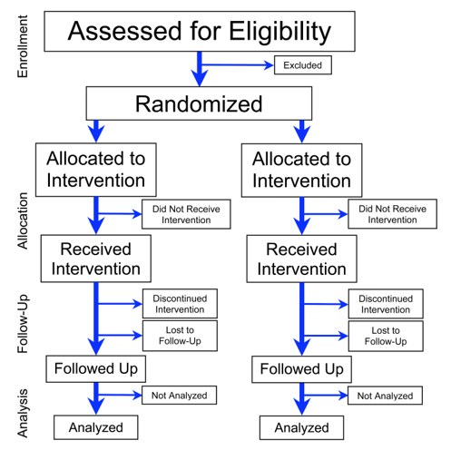

```{r setup, include=FALSE, echo = FALSE,message = FALSE, error = FALSE, warning = FALSE}
knitr::opts_chunk$set(echo = TRUE, fig.width = 10, fig.height = 6)

packages<-c("tidyverse", "kableExtra")

ipak <- function(pkg){
  new.pkg <- pkg[!(pkg %in% installed.packages()[, "Package"])]
  if (length(new.pkg)) 
    install.packages(new.pkg, dependencies = TRUE)
  sapply(pkg, require, character.only = TRUE)
}
ipak(packages)
 
 
setwd(dirname(rstudioapi::getSourceEditorContext()$path))
getwd()
Sys.setlocale("LC_ALL","English")
```


**Summary**

Sample Size Determination (SSD) is a critical component of study design that ensures the study is capable of making valid and reliable inferences. The primary goal of SSD is to ensure that the study is sufficiently powered to detect a meaningful effect if one exists, thereby minimizing the risk of Type II errors.

The process of SSD is not merely a mathematical exercise; it involves critical design decisions that influence the study's overall validity and feasibility. The assumptions made during SSD, such as effect size and variability estimates, are as important as the statistical methods used. Inaccuracies in these assumptions can lead to underpowered studies or unnecessary participant burden due to overestimation.

Sample Size Determination is a vital process that requires careful attention to detail at every step. By thoroughly planning the study, specifying accurate parameters, choosing an appropriate effect size, computing the correct sample size, and exploring uncertainty, researchers can ensure that their studies are well-designed to provide meaningful and valid results. These considerations are not just technical requirements but essential practices that uphold the integrity of the research and its potential impact on clinical practice and policy.

**Summary of the 5 Essential Steps for Sample Size Determination:**

1. **Plan the Study**: This initial step involves outlining the study's objectives, identifying key research questions, and defining the trial's design and randomization scheme. The planning phase sets the foundation for all subsequent decisions in the study.

2. **Specify Parameters**: Parameters such as significance level, effect size, and variability (nuisance parameters) must be carefully chosen. These parameters should be based on existing literature, expert opinion, or preliminary data. Accurate specification of parameters is crucial for reliable SSD.

3. **Choose Effect Size**: Deciding on the effect size is central to SSD. The effect size should reflect a clinically meaningful difference, often defined as the Minimum Clinically Important Difference (MCID). The choice of effect size impacts the sample size required to achieve adequate power.

4. **Compute Sample Size**: With the study design and parameters in place, the next step is to calculate the required sample size to achieve the desired statistical power. This involves using appropriate statistical formulas or software tools, and considering potential adjustments for factors such as dropout rates.

5. **Explore Uncertainty**: Finally, it’s essential to assess how uncertainties in the assumptions made during SSD could affect the study’s power and conclusions. Sensitivity analysis and assurance methods can be used to explore the impact of varying assumptions and ensure the robustness of the study design.

  
## Sample Size Determination


### Detailed Explanation of Sample Size Determination (SSD)

**What is Sample Size Determination (SSD)?**

Sample Size Determination (SSD) is a sophisticated statistical approach employed in planning research studies, particularly clinical trials, to calculate the minimum number of participants necessary to achieve valid scientific results. The goal is to determine the smallest sample size that provides a high probability of detecting a true effect, should one exist, under predefined conditions. This process is especially critical in confirmatory trials where the typical criterion for success is obtaining a significant p-value, often guided by FDA standards at a Type I error rate of 0.025.

1. **Objective**:
   - **Ensuring Appropriate Power**: SSD aims to ascertain a sample size that balances the risk of Type I errors (false positives) and Type II errors (false negatives). This balance is crucial to not only avoid invalid conclusions but also to uphold the ethical obligation to participants who contribute their time and expose themselves to potential risks.

2. **Methods and Metrics**:
   - **Using Various Techniques**: Researchers employ formulae, exact methods, and simulations to estimate the sample size. These tools help predict the likelihood of trial success based on assumptions about the anticipated effects and the study's design.
   - **Metrics Considered**: While statistical power is paramount, other factors like the width of confidence intervals and cost considerations (cost-effectiveness or decision-theoretic approaches) also play significant roles.

3. **Importance of SSD**:
   - **Ethical and Practical Dimensions**: Proper SSD prevents underpowered studies that cannot offer conclusive results and avoids the ethical dilemma of unnecessarily large studies that may waste resources and potentially harm participants.
   - **Regulatory Compliance**: SSD is a standard requirement for clinical trial approval to ensure that a study can reasonably achieve its objectives with a justified sample size.

### Importance of Statistical Power in SSD

**Statistical Power Defined**:
- **Power of a Study**: The probability that the study will reject a false null hypothesis, thereby correctly identifying a true effect. It is typically set at 80% or 90% in clinical trials to ensure robustness in findings.

**Implementation and Challenges**:
- **Setting and Reaching Desired Power Levels**: To achieve desired power levels, researchers might need to increase the sample size, affecting the study’s duration and cost, particularly in fields dealing with rare diseases or specific demographics.
- **Balancing Statistical and Practical Realities**: Increasing a study's sample size enhances its ability to detect smaller effects but also raises ethical concerns, such as exposing more participants to unproven treatments.

```{r , echo=FALSE, fig.align="center", out.width = '75%'} 
knitr::include_graphics("./02_Plots/SSD_Power.png")
```


### Expanded Challenges and Considerations in SSD

**Beyond Simple Calculations**:
- **Dealing with Type M (magnitude) and Type S (sign) Errors**: Small sample sizes can lead to errors where the detected effect size is vastly different or even opposite to the true effect, exacerbating issues like publication bias and challenges in replicability.
- **Ethical and Logistical Concerns**: In clinical trials, there is always a trade-off between reaching conclusive results and the practical limitations of recruiting enough participants, especially when dealing with new treatments with unknown efficacy or safety profiles.

**Regulatory and Publication Practices**:
- **Standard Requirement in Trial Design**: Detailed sample size justification is required in study protocols, and the quality of these justifications can vary, affecting the reliability of the research.
- **Impact on Research Quality and Replicability**: Insufficient sample sizes contribute to the ongoing replicability crisis in scientific research, where studies fail to produce consistent results when repeated under similar conditions.


## Step-by-Step Guide to Sample Size
  
  
```{r , echo=FALSE, fig.align="center", out.width = '75%'} 
knitr::include_graphics("./02_Plots/SSD_Steps.png")
```

### 1. Plan Study

**Design Considerations**:
- **Context and Constraints**: Every study must consider the specific context—such as the disease, target population, and treatment modalities—and constraints like budget, time, and available technology.
- **Research Questions and Trial Phase**: The phase of the trial (e.g., Phase I-III) influences the design, as early phases focus more on safety while later phases test efficacy on larger populations.
- **Study Design and Randomization**: Essential to minimize bias and ensure the reliability of the results. The choice of randomization scheme is crucial for maintaining the integrity of the statistical analysis.
- **Endpoints and Estimators**: Selection of primary and secondary endpoints and how they are measured (e.g., total symptom score, survival rate) directly impacts the type of data collected and the statistical methods used.
- **Regulatory Guidance**: Adherence to guidelines such as ICH E9 and FDA guidances ensures that the trial design meets international standards for clinical research.

**Logical Sequence**:
- Sample size and statistical power considerations should naturally follow the initial design decisions, providing a basis to compare different study designs for efficacy and efficiency.

```{r , echo=FALSE, fig.align="center", out.width = '75%'} 

```


### 2. Specify Parameters


#### Fixed Parameters {-}

   - **Definition**: Fixed parameters are known before the trial begins and do not change throughout the study. They are predetermined based on regulatory requirements, past research, or the specific goals of the study.
   - **Examples**:
     - **Significance Level**: This is often set at 0.05 for two-sided tests or 0.025 for one-sided tests, especially in Phase III confirmatory trials, as commonly required by the FDA. This parameter defines the threshold at which results will be considered statistically significant.
     - **Study Duration**: The length of the study is usually fixed and based on the natural progression of the condition being studied or the expected change due to interventions.
     - **Sample Allocation**: How participants are distributed across treatment groups can also be a fixed parameter, determined by the study's design.
   
   - **Importance**: Fixed parameters are essential for defining the framework within which the study operates. They help maintain the integrity and comparability of the results, ensuring that the conclusions drawn are based on predefined criteria.

#### Nuisance Parameters {-}

   - **Definition**: Nuisance parameters are those elements of a trial that are not of primary interest but must be accounted for in the statistical analysis to ensure accurate results.
   - **Examples**:
     - **Variance**: Variability in the data that affects the precision and power of the study's outcomes.
     - **Dropout Rates**: Expected rates at which participants may leave the study, which can impact the required sample size and the study's conclusions.
     - **Background Noise**: Other variabilities in measurements that could affect data interpretation.

   - **Importance**: Nuisance parameters need careful estimation and adjustment in the analysis. Misestimation of these parameters can lead to biased results, underpowered studies, or false conclusions.

**Parameter Sources**:
- Utilizing previous research, pilot studies, and literature reviews helps in estimating these parameters accurately, ensuring that the trial is properly powered to detect meaningful effects.


#### Estimation of Nuisance Parameters {-}

  - **Prior Studies**: Historical data from previous research can provide estimates for many nuisance parameters. This includes data on variability, standard deviations, and common complications or side effects.
  - **Expert Elicitation**: Subject matter experts can provide insights based on their experience and understanding of the condition or treatment under study. This method is particularly useful when historical data are sparse or when studying novel treatments.
  - **Pilot Studies**: Small, preliminary studies can be conducted before the main trial to estimate crucial nuisance parameters. These studies are especially valuable for testing assumptions, refining protocols, and ensuring that the full-scale study is well-founded.
  - **Literature Review**: A thorough review of existing literature can provide estimates for both fixed and nuisance parameters, particularly through meta-analyses of similar studies.
  
  
### 3. Choose Effect Size

Choosing the effect size is a crucial aspect of designing a clinical trial as it directly influences the study's power and the precision needed to detect clinically meaningful changes brought about by a new treatment. Focusing on the two primary methods of determining it: the Minimum Clinically Important Difference (MCID) and the Expected Effect Size (Expected ES), along with the importance of parameterization in expressing these sizes.

#### Understanding Effect Size Parameterization {-}

**Parameterization** refers to the way in which the effect size is expressed mathematically in the context of a study. Common forms include:
- **Difference**: Used when the outcome is measured on a continuous scale, representing the absolute change between the control and treatment groups.
- **Ratio**: Often used for time-to-event data, such as survival analysis, indicating how many times more likely an event is to occur in one group compared to another.
- **Odds Ratio**: Commonly used in binary outcomes (e.g., improved vs. not improved), showing the odds of an event occurring in the treatment group relative to the control group.

These parameterizations help to tailor the statistical analysis to the specific characteristics of the data and the clinical questions at hand.

#### Two Methods to Choose Effect Size {-}

1. **Minimum Clinically Important Difference (MCID)**:
   - **Definition**: MCID is the smallest change in a treatment outcome that would result in a noticeable difference in patient experience or clinical outcome. It is a threshold that reflects a meaningful improvement as perceived by patients, clinicians, or other stakeholders.
   - **Determination**: MCID is often determined through clinical expertise, patient input, previous studies, or consensus panels. It bridges clinical relevance with statistical analysis, ensuring that the study is designed to detect a change that is significant not just statistically but also clinically.
   - **Importance**: Utilizing MCID allows researchers to focus on outcomes that are tangible and valuable to patients, potentially enhancing the clinical applicability and impact of the trial results.

2. **Expected Effect Size (Expected ES)**:
   - **Definition**: Expected ES is an estimate of the actual effect that the new treatment will have on the outcome based on prior evidence. This estimate is typically used when planning a study to calculate the necessary sample size to achieve adequate power.
   - **Determination**: Like nuisance parameters, the Expected ES can be estimated using data from previous studies, pilot studies, meta-analyses, or expert opinion. This approach considers historical data and predictive analytics to forecast the likely impact of the treatment.
   - **Use in Trial Design**: Incorporating an Expected ES helps in designing a trial that is realistically powered to detect a statistically and clinically significant effect, thereby aligning the study's objectives with its statistical design.

#### Delta2 Guidance {-}

For a more comprehensive understanding and application of effect size in clinical trials, the Delta2 Guidance offers extensive resources. It provides detailed methodologies for estimating MCID and Expected ES, aligning them with study objectives, and integrating clinical significance with statistical precision.

The Delta2 Guidance is a pivotal resource designed to improve the planning and analysis of randomized controlled trials (RCTs) by providing comprehensive guidelines on determining the target difference, also known as the minimum clinically important difference (MCID), for clinical trials. This guidance aims to enhance the robustness and relevance of trial findings by ensuring that the trials are appropriately powered to detect differences that are not only statistically significant but also clinically meaningful.
 

**Purpose**: 
- The Delta2 Guidance specifically addresses the challenges in specifying the target difference or effect size in clinical trials, which is crucial for calculating the required sample size and designing an effective study. 

**Development**:
- Delta2 was developed through a collaboration among statisticians, clinicians, and trialists, incorporating extensive research, expert opinion, and practical trial experience. The guidance is a part of a broader initiative to improve the quality of health research.

**Reference**:
- Cook, J. A., Julious, S. A., Sones, W., Hampson, L. V., Hewitt, C., Berlin, J. A., ... & Walters, S. J. (2018). DELTA2 guidance on choosing the target difference and undertaking and reporting the sample size calculation for a randomised controlled trial. BMJ, 363, k3750. doi:10.1136/bmj.k3750

#### Key Components of Delta2 Guidance {-}

1. **Defining the Target Difference**:
   - The guidance provides methods and considerations for determining what constitutes a meaningful difference in outcomes between treatment groups in clinical trials. It emphasizes the importance of basing this target difference on clinical relevance rather than merely statistical parameters.

2. **Involvement of Stakeholders**:
   - Delta2 advocates for involving a range of stakeholders, including patients, clinicians, and policymakers, in determining the MCID. This approach ensures that the trial outcomes are relevant and valuable to all parties interested in the results.

3. **Statistical Considerations**:
   - It outlines statistical techniques for estimating the MCID, including anchor-based and distribution-based methods. The guidance also discusses the implications of different estimations of the target difference for study power and sample size.

4. **Sensitivity Analyses**:
   - Delta2 recommends conducting sensitivity analyses to understand how variations in the target difference might affect trial outcomes and interpretations. This is crucial for ensuring that the conclusions drawn from the trial are robust under different plausible scenarios.

5. **Documentation and Reporting**:
   - Proper documentation of the rationale, methods, and assumptions used in determining the target difference is emphasized. Delta2 suggests that all these details should be transparently reported in the trial protocol and publications to enhance the credibility and replicability of the trial.

6. **Examples and Case Studies**:
   - The guidance includes examples and case studies to illustrate how to apply its principles in real-world scenarios. These examples help clarify the processes and decisions involved in determining the target difference for various types of clinical trials.
   
   
### 4. Compute Sample Size


1. **Define Desired Statistical Power**: 
   - **Desired Power**: This is typically set as a fixed parameter, commonly at 80% or 90%. It represents the probability of correctly rejecting the null hypothesis (i.e., detecting an effect if there is one). Higher power decreases the likelihood of a Type II error (failing to detect a true effect).
   - **Fixed Sample Size**: If the sample size is constrained by budget, time, or participant availability, calculate what power the trial will have with that fixed number of participants.

2. **Effect Size Determination**:
   - **Based on Previous Studies**: Use data from previous research to estimate the effect size. This could be the difference in means between treatment groups, odds ratios, or any other relevant measure depending on the outcome type.
   - **Minimum Effect Size**: For a given sample size and power, determine the smallest effect size that the study could reliably detect. This can be particularly useful when planning a study to ensure that even subtle but clinically meaningful changes are detected.

3. **Adjustments for Dropout and Treatment Switching**:
   - **Dropout Rate Estimation**: Anticipate the proportion of participants who might drop out before completing the study based on historical data from similar studies. Dropout rates can significantly affect the study's power because they effectively reduce the sample size.
   - **Treatment Switching**: Consider the possibility that participants might switch treatments during the trial. This can dilute the treatment effect, requiring a larger initial sample size to maintain power.

**Practical Considerations**

- **Financial Constraints**: Often, the budget may limit the maximum feasible sample size, so calculations must be adjusted accordingly.
- **Ethical Considerations**: Especially in clinical trials, it's unethical to expose more participants to experimental treatments than necessary. Calculations should ensure that the sample size is large enough to be informative but not excessively large.
- **Sensitivity Analysis**: Assess how sensitive the required sample size is to changes in assumptions such as effect size, variance, dropout rates, etc. This helps understand the robustness of the study design.
- **Assurance Calculations**: Instead of fixing parameters at a single value, use a range of plausible values to calculate the probability that the study will have sufficient power. This provides a more comprehensive picture of the study’s potential success under various scenarios.


### 5. Explore Uncertainty

#### Sensitivity Analysis {-}

- **Sensitivity analysis** is used to assess how changes in assumptions impact the calculated sample size and the statistical power of the trial. This method helps to understand the stability of trial results under different scenarios.
- Conducting sensitivity analysis involves recalculating the required sample size or power using a range of plausible values for each key parameter (e.g., effect size, variance, dropout rates). 
- This analysis helps identify which parameters are most sensitive and could significantly affect trial outcomes if their estimated values deviate from reality.
- Including sensitivity analyses and assurance calculations in the protocol is crucial. These analyses demonstrate that the trial is designed to be robust across a range of possible conditions, not just under a single set of assumptions.
- **Limitations**The analysis is confined to the range of values chosen for each parameter. If these ranges are not representative of possible real-world variations, the analysis may not fully capture the potential variability in trial outcomes.

#### Assurance {-}

- **Assurance** provides a probabilistic assessment of a trial’s success, incorporating uncertainty about parameter estimates into the sample size calculation.
- Power is calculated not just for a single value of each parameter but averaged over a range of values, often using a statistical prior that reflects the uncertainty about these parameters.
- This approach gives a more comprehensive measure of the likelihood that the trial will achieve its objectives, taking into account the variability in potential parameter values.
- By averaging power across a range of plausible parameter values, assurance accounts for the uncertainty inherent in the estimates used for sample size calculations. This provides a more realistic assessment of the trial's potential for success.
- Assurance can be particularly valuable when there is considerable uncertainty about key parameters such as effect size, helping to ensure that the trial is robust to a variety of possible realities.


**Documentation and Transparency**:
- Detailed documentation of the SSD process, including all estimates and assumptions, should be included in the trial protocol. This transparency helps in peer review and regulatory evaluation, ensuring that the study design is both robust and capable of yielding meaningful results.

> “The method by which the sample size is calculated should be given in the protocol, together with the estimates of any quantities used in the calculations (such as variances, mean values, response rates, event rates, difference to be detected)… It is important to investigate the sensitivity of the sample size estimate to a variety of deviations from these assumptions…” ----- ICH E9: Statistical Principles for Clinical Trials


## Common Sample Size Pitfalls

Navigating the process of Sample Size Determination (SSD) is fraught with potential pitfalls, each of which can significantly impact the validity and success of a clinical trial. Understanding these pitfalls and how they relate to the broader context of trial design is crucial.

### Common Pitfalls in Sample Size Determination

1. **Overemphasis on Formulas Over Assumptions**:
   - **Formula Focus**: Researchers often worry excessively about which statistical formula to use for SSD. While important, this concern is usually less critical than the assumptions underlying these formulas.
   - **Assumption Criticality**: The assumptions made about the study parameters (e.g., effect size, variance) before calculating the sample size are pivotal. Incorrect or unrealistic assumptions can lead to an underpowered or overly large study, regardless of the formula used.
   - **Prior Information**: In Bayesian statistics, prior information is updated with actual data as it comes in. Before the trial, these priors are used to estimate the likelihood of various outcomes to determine the initial sample size.

2. **Pre-Trial Guesswork**:
   - **Inherent Uncertainty**: SSD happens before the trial starts, necessitating a degree of guesswork regarding study outcomes and variability.
   - **Principled Approach**: Employing a principled approach to SSD, even with some guesswork involved, is preferable to not performing a thorough SSD. A systematic approach helps in laying down a foundation that can be adjusted with interim analyses if needed.
 

3. **Integration with Trial Design**:
   - **Design Emphasis**: Many issues attributed to sample size are often deeply rooted in trial design choices. Ensuring robust trial design is crucial—hence the mantra, "Design, Design, Design."
   - **Holistic Approach**: Effective trial design encompasses everything from the selection of endpoints to the choice of statistical models and the consideration of potential data issues. This holistic approach can mitigate many problems that might later manifest during SSD.
 

4. **Study (Trial and Data)**:
   - **Endpoint Selection**: Choosing inappropriate endpoints can render even a well-sized study ineffective if the endpoints are not clinically relevant.
   - **Data Collection Methods**: Poor data collection methodologies can introduce biases or variability that no amount of correct sizing can correct.

5. **Model (Statistical Choices)**:
   - **Model Fit**: Selecting an incorrect statistical model for the data and the question at hand can lead to misinterpretations of the data and, subsequently, to erroneous conclusions about the efficacy or safety of an intervention.
   - **Overfitting/Underfitting**: Using overly complex models that do not align with the simplicity or complexity of the data can lead to overfitting or underfitting, affecting the study's outcomes.

6. **Assumptions (SSD Inputs)**:
   - **Effect Size Estimates**: Overly optimistic or pessimistic effect size estimates can lead to unrealistic expectations and study designs that are either too small to detect true effects or unnecessarily large, wasting resources.
   - **Variability Underestimation**: Underestimating the variability within the population can result in underpowered studies that are unable to achieve conclusive results.
   - **Dynamic Nature of Sample Size**: The concept is that the initially determined sample size might not hold as the trial progresses ("disappears once the reality hits"). This reflects the adaptive nature of some clinical trials where sample sizes are adjusted based on interim results.

### Study Pitfalls

#### 1. Simplifying Data Unnecessarily {-}

**Problem**:
- Researchers often simplify complex data types, such as converting continuous outcomes into binary outcomes (known as "dichotomania"), treating time-to-event data as single endpoint events, or misclassifying ordinal data. This approach can significantly distort the analysis, leading to loss of information and potentially requiring larger sample sizes to detect the same effects.

**Solutions**:
- **Preserve Data Complexity**: Analyze data in its most detailed form whenever possible. Only simplify data when there is a compelling justification, and it enhances the interpretability or relevance of the results without compromising statistical power.
- **Demonstrate Cost of Simplification**: Use sample size determination to explicitly show how simplifying data (e.g., dichotomizing continuous variables) can inflate the required sample size, often by more than 50%. This can serve as a persuasive argument against unnecessary data reduction.

#### 2. Ignoring Real Trial Constraints {-}

**Problem**:
- Often, sample size calculations ignore practical constraints such as budget, resources, and time available for the study. This results in theoretical sample sizes that are unfeasible in practice, leading to what can be referred to as "Sample Size Theatre" — where calculations appear robust but are not practically applicable.

**Solutions**:
- **Account for Constraints in SSD**: When determining sample size, incorporate real-world limitations from the outset. Adjust effect size and power calculations to reflect the maximum feasible sample size.
- **Cost-Based SSD Approaches**: Consider integrating cost-effectiveness analyses into sample size determination. This approach helps ensure that the sample size chosen not only meets statistical requirements but is also economically viable, enhancing the overall sustainability of the trial.

#### 3. Know the “True” Sample Size {-}

**Problem**:
- A common misconception in clinical trials is misunderstanding what constitutes the "true" sample size needed for adequate power. The effective sample size must consider the level of treatment randomization and only include subjects who have had the outcome(s) of interest. Misunderstandings can lead to underpowered studies due to inappropriate sample size calculations.

**Solutions**:
- **Education on Sample Size Foundations**: Clearly communicate and teach that the sample size should align with the level of randomization (e.g., individual, cluster, sequence in crossover trials). This understanding is crucial for accurately calculating the power of the study.
- **Clarify Which Outcomes and Subjects Contribute to Power**: Educate researchers on which specific outcomes and which subset of subjects should be considered when determining the sample size. For example, in survival analysis, only subjects who experience the event of interest should be included in the power calculation.


### Model Pitfalls

The pitfalls associated with model selection in the context of Sample Size Determination (SSD) are substantial and can significantly impact the validity and reliability of a clinical trial. Each of these pitfalls arises from common errors in choosing or applying statistical models and estimators. Understanding these pitfalls and their solutions is essential for ensuring accurate and meaningful research outcomes. 

#### 1. Selecting the Inappropriate Estimator and Model {-}

**Problem**:
- Researchers may default to using a "standard" model or estimator without considering whether it is the most appropriate for their specific data and research question. This includes both the choice of the model for analysis and the underlying model used in sample size calculations. Using the wrong model can lead to inaccuracies in estimating the necessary sample size, potentially resulting in underpowered or overpowered studies.

**Solutions**:
- **Model Consideration at Design Stage**: From the outset, carefully evaluate the most suitable model and estimator for the study. Consider the nature of the data and the specific hypotheses being tested.
- **Appropriate SSD Formulae**: Ensure that the formulae used for calculating sample size are based on the correct estimator, especially in cases of non-normal data distributions or for specific study designs like non-inferiority or equivalence trials.
- **Advanced Modeling Techniques**: Utilize model selection methods such as Multiple Comparisons Procedures and Modeling (MCP-Mod) or MaxCombo, which can help in choosing the most appropriate statistical model based on the data characteristics.

#### 2. Not Converting to Correct Parameter Scale {-}

**Problem**:
- In sample size calculations, it's crucial that all parameters are on a consistent scale, particularly in studies where time-dependent outcomes are involved. Failing to convert parameters like coefficient of variation (CV) to standard error (SE) or not aligning time units across data inputs can lead to incorrect calculations.

**Solutions**:
- **Standardize Units**: Convert all parameters that depend on scale to a consistent unit (e.g., converting all time-related measures to months if some are initially in years by dividing by 12).
- **Check for Conversions**: Always verify if there are known conversions that should be applied to the parameters used in the model to ensure that all inputs are compatible and correctly scaled.

#### 3. Misunderstanding Potential Value of Additional Data {-}

**Problem**:
- The misuse or underuse of additional information, such as prognostic covariates, can result in less efficient models, thereby reducing the study's power. For example, using change scores instead of analysis of covariance (ANCOVA) can be less effective if pre-treatment scores are available and informative.

**Solutions**:
- **Sensitivity Analysis for Model Choice**: Conduct sensitivity analyses to evaluate how different model choices (e.g., ANOVA vs ANCOVA) affect the study's outcomes, especially in terms of power and the precision of estimates.
- **Leverage Covariate Information**: When applicable, include relevant covariates in the model to increase efficiency and power. Covariates that explain variability in the outcome can significantly enhance the accuracy of the effect estimates.
- **Educational Outreach**: Provide training and resources on the importance and methods of integrating additional data into statistical models. This helps ensure that researchers understand the best practices for utilizing all available data.

### Assumption Pitfalls

#### 1. Misunderstanding the Effect Size Choice {-}

**Problem**:
- **Neglecting the MCID**: Researchers may overlook the Minimum Clinically Important Difference (MCID), instead opting for "standardized" effect sizes or relying on rough estimates with minimal justification. This approach can lead to the selection of effect sizes that are not clinically meaningful or realistic, resulting in an underpowered or irrelevant study.

**Solutions**:
- **Define MCID Collaboratively**: Work with the research team to define the MCID, utilizing relevant literature, expert opinions, and elicitation techniques. This ensures that the chosen effect size is grounded in clinical significance and reflects the true impact on patient outcomes.
- **Use Sensitivity Analysis and Assurance**: Conduct sensitivity analysis and assurance to explore how changes in the effect size impact the study's power and overall success probability. This can help in understanding the robustness of the study design.
- **Avoid Standardized Effect Sizes**: Resist the temptation to use generic or standardized effect sizes. Instead, tailor the effect size to the specific clinical context of the study, ensuring it is meaningful and realistic.
- **Consider Adaptive Designs**: Implement adaptive designs such as the promising zone or unblinded Sample Size Re-estimation (SSR) designs to adjust the sample size based on interim data, keeping the study responsive to actual findings.

#### 2. Misestimating Nuisance Parameters {-}

**Problem**:
- **Inaccurate Estimates of Nuisance Parameters**: Nuisance parameters, such as the standard deviation, are crucial for accurate SSD but are often estimated with minimal information or adjusted post-hoc based on constraints (referred to as "Sample Size Theatre"). This can lead to inappropriate sample size calculations and affect the study's validity.

**Solutions**:
- **Conduct Proper Pilot Studies**: Use properly sized pilot studies to gather empirical data on nuisance parameters. This provides a solid foundation for accurate SSD.
- **Blinded Sample Size Re-estimation**: In cases where a pilot study isn't feasible, consider using blinded sample size re-estimation during the trial to refine nuisance parameter estimates without compromising study integrity.
- **Expert Elicitation and Literature Review**: Where direct data is unavailable, consult with experts and review existing literature to obtain reliable estimates of nuisance parameters.
- **Use Sensitivity Analysis and Assurance**: Evaluate the impact of varying nuisance parameters on study power using sensitivity analysis or assurance techniques. This can help identify critical parameters that require more accurate estimation.

#### 3. Not Accounting for Dropout (Properly) {-}

**Problem**:
- **Ignoring or Miscalculating Dropout Effects**: The impact of dropout on sample size is often either ignored or improperly calculated, which can result in an underpowered study. Simplified calculations or incorrect formulas are sometimes used when more accurate methods are available.

**Solutions**:
- **Accurate Dropout Rate Estimates**: Obtain accurate dropout rate estimates through historical data, pilot studies, or expert opinions. Make sure these estimates are specific to the study's context and population.
- **Correct Calculation Methods**: Use the correct formula for adjusting sample size due to dropout: \( N_d = N / (1 - p_d) \), where \( p_d \) is the dropout rate. This method accounts for the true impact of dropout on the study's power.
- **Model-Specific Adjustments**: For time-to-event (TTE) or count models, incorporate dropout into the sample size calculations using parameters specific to these models. This ensures that the study remains adequately powered despite participant attrition.
- **Consider Drop-in/Crossover Scenarios**: Plan for scenarios where participants might switch treatments (drop-in) or move between study arms (crossover). These events can affect the analysis and should be factored into the SSD.


### Other Common Pitfalls


#### 1. Sample Size “Rules of Thumb” {-}

**Problem**:
- **Reliance on Rules of Thumb**: Researchers sometimes use simple rules of thumb for determining sample size (e.g., “30 participants per group”) without considering whether these rules are statistically justified. These rules often rely on unrealistic assumptions and can lead to underpowered or overly large studies.

**Solutions**:
- **Use Proper SSD Methods**: Always use formal sample size determination methods that are tailored to the specifics of the study design, expected effect size, and variance. There are many SSD methods available that account for the complexity of different study designs.
- **Justify the Sample Size Statistically**: Ensure that the sample size is statistically justified based on the study's goals and not just a rule of thumb. This will improve the likelihood of detecting a true effect if it exists.

#### 2. Post-hoc Power Analysis {-}

**Problem**:
- **Misleading Post-hoc Power**: Performing a power analysis after the study (post-hoc) adds little value and can be misleading. If a study finds a non-significant result, the post-hoc power is, by definition, low. It doesn't provide additional insight beyond what the p-value already indicates.

**Solutions**:
- **Focus on Pre-study Power Calculation**: Emphasize the importance of calculating power before the study begins. This helps ensure that the study is designed with adequate power to detect a clinically meaningful effect.
- **Avoid Post-hoc Power**: Instead of conducting post-hoc power analysis, focus on interpreting the results within the context of the study design, effect sizes, and p-values.

#### 3. Multiple Studies/Endpoints {-}

**Problem**:
- **Challenges with Multiple Endpoints**: When a trial involves multiple studies or endpoints, it can be challenging to determine the appropriate power and testing strategy. There may be a need to decide whether to use a conjunctive (all endpoints must succeed) or disjunctive (only one endpoint must succeed) power approach.

**Solutions**:
- **Define a Clear Testing Strategy**: Before the trial begins, clearly define the testing strategy. Decide whether the trial will use conjunctive or disjunctive power, and determine how you will handle multiple comparisons to control for Type I error.
- **Evaluate Power for Secondary and Safety Endpoints**: Consider the power for secondary and safety endpoints as well, especially if these are critical to the study’s overall conclusions. Ensure that the trial is adequately powered for these endpoints if they are of importance.

#### 4. Failing to Consider Complex Designs {-}

**Problem**:
- **Ignoring Benefits of Complex Designs**: Traditional fixed-term designs may not be the most efficient approach. Failing to consider adaptive designs (e.g., group sequential designs) can result in larger than necessary sample sizes and longer trials.

**Solutions**:
- **Explore Adaptive Designs**: Investigate the potential benefits of adaptive designs, such as group sequential designs, which can significantly reduce the expected sample size. For instance, Jennison’s work shows that three looks in a sequential design can reduce the expected sample size by approximately 30%, with only a 5% maximum increase in sample size.
- **Value and Evaluate Designs**: When considering complex designs, compare the value they bring in terms of sample size reduction and efficiency. Also, evaluate the potential impacts on Type I error rates and other statistical properties, often requiring simulation studies to fully understand the implications.
- **Consult FDA Guidance**: Use the FDA’s Adaptive Design Guidance as a resource when planning complex trial designs, ensuring that your design choices meet regulatory standards and optimize study efficiency.

## References

### Sample Size Books
- Julious, S. A. (2023). *Sample sizes for clinical trials* (2nd ed.). CRC Press.
- Chow, S. C., Shao, J., Wang, H., & Lokhnygina, Y. (2017). *Sample size calculations in clinical research*. Chapman and Hall/CRC.
- Machin, D., Campbell, M. J., Tan, S. B., & Tan, S. H. (2018). *Sample sizes for clinical, laboratory and epidemiology studies*. John Wiley & Sons. 
- Ryan, T. P. (2013). *Sample size determination and power*. John Wiley & Sons.
- Cohen, J. (2013). *Statistical power analysis for the behavioral sciences*. Academic Press.
- Cohen, J. (1992). A power primer. *Psychological Bulletin, 112*(1), 155-159.

### Regulatory Bodies + Trial Guidances
- International Council for Harmonisation of Technical Requirements for Pharmaceuticals for Human Use (ICH). (n.d.). Retrieved from https://www.ich.org/
- Food and Drug Administration (FDA). (n.d.). Retrieved from https://www.fda.gov/
- European Medicines Agency (EMA). (n.d.). Retrieved from https://www.ema.europa.eu/
- ICH Guidelines. (n.d.). Retrieved from https://www.ich.org/page/ich-guidelines
- FDA Clinical Trials Guidance Documents. (n.d.). Retrieved from https://www.fda.gov/science-research/clinical-trials-and-human-subject-protection/clinical-trials-guidance-documents
- EMA Clinical Trials Regulation. (n.d.). Retrieved from https://www.ema.europa.eu/en/human-regulatory-overview/research-and-development/clinical-trials-human-medicines/clinical-trials-regulation

### Trial Design Overviews 
- Senn, S. S. (2021). *Statistical issues in drug development* (3rd ed.). John Wiley & Sons.
- Meinert, C. L. (2012). *Clinical Trials: Design, conduct and analysis* (Vol. 39). OUP USA.
- Friedman, L. M., Furberg, C. D., DeMets, D. L., Reboussin, D. M., & Granger, C. B. (2015). *Fundamentals of clinical trials*. Springer.
- International Council for Harmonisation of Technical Requirements for Pharmaceuticals for Human Use (ICH). (n.d.). *STATISTICAL PRINCIPLES FOR CLINICAL TRIALS E9*. Retrieved from https://database.ich.org/sites/default/files/E9_Guideline.pdf

### Prevalence of Underpowered Research
- Cohen, J. (1962). The statistical power of abnormal-social psychological research: A review. *The Journal of Abnormal and Social Psychology, 65*, 145-153.
- BuPon, K. S., Ioannidis, J. P. A., Mokrysz, C., Nosek, B. A., Flint, J., Robinson, E. S. J., & Munafo, M. R. (2011). Power failure: Why small sample size undermines the reliability of neuroscience. *Nature Reviews Neuroscience, 14*(12), 365-376.
- Sedlmeier, P., & Gigerenzer, G. (1989). Do studies of statistical power have an effect on the power of studies? *Psychological Bulletin, 105*(2), 309–316.
- Maxwell, S. E. (2004). The Persistence of Underpowered Studies in Psychological Research: Causes, Consequences, and Remedies. *Psychological Methods, 9*(2), 147–163. 
 
 