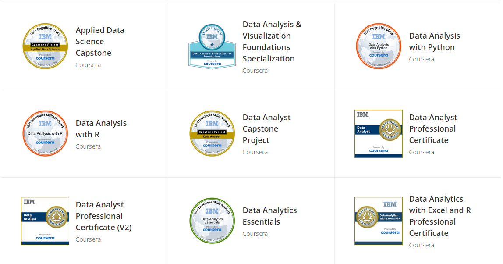
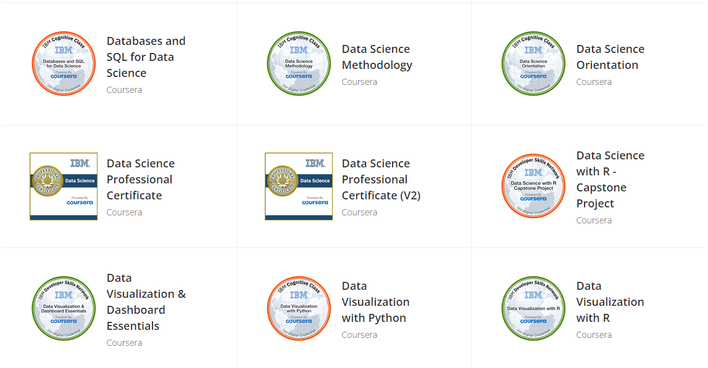
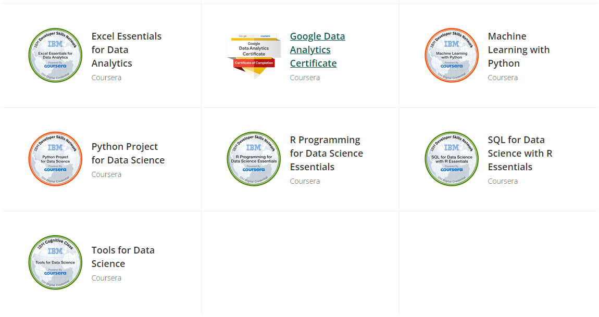

```{r, include=FALSE, echo = FALSE,message = FALSE, error = FALSE, warning = FALSE}
setwd(dirname(rstudioapi::getSourceEditorContext()$path))
library(rmarkdown)

# Specify the directory containing the Rmd files
rmd_folder <- getwd()

# render("C:/Users/baiz/Downloads/Zehuibai.github.io/02-Clinical_Experience.Rmd")
# 
# rmd_files_to_render <- list.files(path = rmd_folder, pattern = "^03-SSC.*\\.Rmd$", full.names = TRUE)
# for (file in rmd_files_to_render) {
#   render(file)
# }

# rmd_files_to_render <- list.files(path = rmd_folder, pattern = "^04-Design.*\\.Rmd$", full.names = TRUE)
# rmd_files_to_render <- rmd_files_to_render[-7]
# for (file in rmd_files_to_render) {
#   render(file)
# }
# 
# rmd_files_to_render <- list.files(path = rmd_folder, pattern = "^05-Plot.*\\.Rmd$", full.names = TRUE)
# for (file in rmd_files_to_render) {
#   render(file)
# }
# 
# rmd_files_to_render <- list.files(path = rmd_folder, pattern = "^06-Analysis.*\\.Rmd$", full.names = TRUE)
# for (file in rmd_files_to_render) {
#   render(file)
# }
# 
# render("C:/Users/baiz/Downloads/Zehuibai.github.io/08-CV.Rmd")

```

<!-- Welcome to my profile -->


**As a senior biostatistician with extensive experience in providing statistical input into Phase I-IV clinical trials and medical device trial development, I seek to bring a dynamic combination of education and expertise to an industry-leading employer. My professional background includes overseeing 50+ international clinical trials across diverse medical fields including Dermatology, Endocrinology, Hematology, Hepatology, Immunology, Infections and Infestations Disorders, Neurology, Oncology, Ophthalmology, Urology and Nephrology and Ultrasonography.**

**I am skilled in data management, mathematical modeling, survival analysis, and longitudinal/statistical analysis. My project management capabilities are well-honed, making me a diligent and goal-oriented professional ready to make an immediate impact on any fast-paced team. Anchored in solid statistical knowledge and an aggressive approach to problem-solving, I maintain a conscientious and responsible work ethic to guarantee high-quality deliverables.**


<!--   my-header-img -->

<a href="https://www.python.org/"></a>


<!--   my-ticker -->    
[](https://git.io/typing-svg)


## 📫 How to Reach me

<p align="left">
<a href="https://www.linkedin.com/in/zehui-bai-169b131b1/" target="blank"></a>
<a href="mailto:zehuibai@outlook.com" target="blank"></a>
<a href="https://api.whatsapp.com/send?phone=+491746279208" alt="Connect on Whatsapp">  </a>
</p>


<!--   my-skils -->

| Property                                        | Data                                                                                                                                                                                                                                                                                                                                                                                                                                                                                                                                                                                                                                                                                                                                                                                                                                                                                                                                                                                                                                                                                                                                                                                                                                                                                                                                                                                                                                                                                                                                                                                                                                                                                                                                                                                                            |
|-------------------------------------------------------------------------------------------------------------------------------------------------------------------------------------------------------------------------------------------------------------------------------------------------------------|-------------------------------------------------------------------------------------------------------------------------------------------------------------------------------------------------------------------------------------------------------------------------------------------------------------------------------------------------------------------------------------------------------------------------------------------------------------------------------------------------------------------------------------------------------------------------------------------------------------------------------------------------------------------------------------------------------------------------------------------------------------------------------------------------------------------------------------------------------------------------------------------------------------------------------------------------------------------------------------------------------------------------------------------------------------------------------------------------------------------------------------------------------------------------------------------------------------------------------------------------------------------------------------------|
| **Language / IDE**                              |                                                                                                                                                                                                                                                                                                                                                                                                                                                                                                                                                                                                                                                                                                                                                                                                                                                                                                                                                                                                                                                                                                                                                                                                                                                                                                                                                                                                                                                                                                   |
| **Domain Knownledge**                           |                                                                                                                                                                                                                                                                                                                                                                                                                                                                                                                                                                                                                                                                                                                                                                                                                                                                                                                                                                                                                       |
| **CI / CD**                                     | [](https://github.com/BEPb/BEPb) [](https://github.com/BEPb/BEPb) [](https://github.com/BEPb/BEPb)                                                                                                                                                                                                                                                                                                                                                                                                                                                                                                                                                                                                                                                                                                                                                                                                                                                                                                                                                                                                                                                                                                                                                                                                                                                                                                                                                                                       |
| **Machine Learning / Deep Learning frameworks** | ![Jupyter Notebook](http://img.shields.io/badge/-Jupyter%20Notebook-eee?style=flat-square&logo=data:image/png;base64,iVBORw0KGgoAAAANSUhEUgAAAA4AAAAQCAMAAAARSr4IAAACGVBMVEVhYmJdYWT/fBfzdyaqdlV2dnfcdC9udnz5dyKUaU3wdicCO2CzZzVdUkpOTk5MTk60ZzUAAP/XcC3fcivgciv/lArAajLqdSifYjrydyajnJjEjWifnp3FjGcAAACenp52dnd2dnd2dndhYmJhYmIxW3bzdybzdybzdybzdybzdyb/dxpydnl2dnd2dndhYmJgYmOda0r0dyXzdybzdybzdybudymQdmZldoJQYGmRaU7ydyfzdybzdybzdybzdybzdybzdybzdyb1dyX9dx/2dyXzdybzdybzdyb+eiPzdybzdybzdyb/ghz8eSQ3SFT/tABNTk5HTFBMTk5OTk5OTk5OTk5OTk5OTk5OTk5OTk5OTk5NTk5GTFBOTk5OTk5OTk5OTk5OTk5OTk5OTk5OTk5OTk5OTk5OTk5OTk5OTk5OTk5OTk5NTk5OTk5OTk5OTk5OTk5OTk5OTk5OTk5OTk5NTk5NTk5UUEx5WUMAOGRMTU9OTk5OTk5OTk5OTk5OTk5FTFAXQFvBajK8aTP2eCX0dyb0dyb0dybzdyb4eCXzdybzdybzdybzdybzdybzdybzdybzdybzdyb6dB3zdyXzdybzdybzdybzdybzdybzdybzdyaenp6cn6HKimD0dyXzdybzdybzdybzdybzdybzdyaenp6enp6dn6Dzdybzdyaenp6enp6enp6enp7zdyaenp7///9F1GYlAAAAsHRSTlMAAAAAAAAAAAAAAAAAAAAAAAAAAAAAAAAAAAAAAAAAADHCVho4Ax1RcnFOFz/ibFmwHXPc/thwKwkKJpfbqn1oaX+uighRdSIDAyV6TAQcAgIVHBMbKjIgEzBTHCsbLUBdQlhiTWBlR1xkaEVIR1tPbFEvF0pJNR9AFAQIMwgfKQUDBwgDBEsuMkcCLLSUKBsqT5iwNcX47N/g7cAxPmUqZq/OzaxiExPJYgQPCJjcP9lVnrgAAAClSURBVAjXVcyxSoIBAEXh+xkhEkFr6hD0AM5BkbQ3ODaEY4uDSENCS1BThI/h4v4TERG0NzZHvoAQ0SDV8FvkmS6cw5UgSTR5s83rlgUvWuA8l/Bs59eYbXhS28VdUt1H4dA9Eu1HexUdS3T/7Y81vXJ9rQicLcxoAK64hvd1fWwOeDgoy+JW3bCs56tOonnxd3ycGKt9nt7I91GShgn60yRJI/kBP8EfEEdOa6sAAAAASUVORK5CYII=&logoColor=F37626)    |


<!-- https://github.com/anuraghazra/github-readme-stats/blob/master/docs/readme_cn.md -->
<!-- [](https://github.com/anuraghazra/github-readme-stats) -->


## Languages

<h4 align="center">Most used programming languages</h4>

<p align="center">
	
</p>


<!-- Languages -->
<!-- [](https://github.com/anuraghazra/github-readme-stats) -->


## Qualification Certificates

<p align="center"> 





</p>

 


 